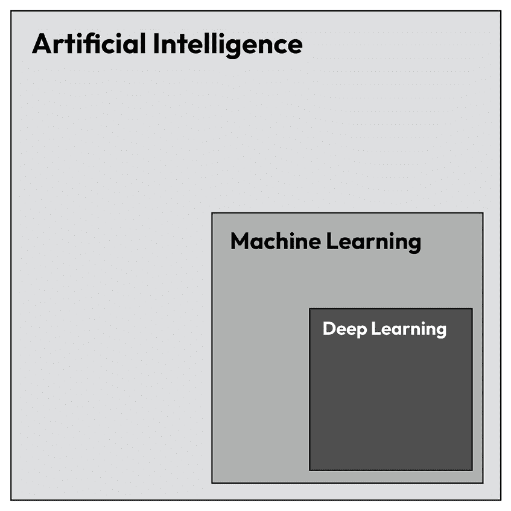
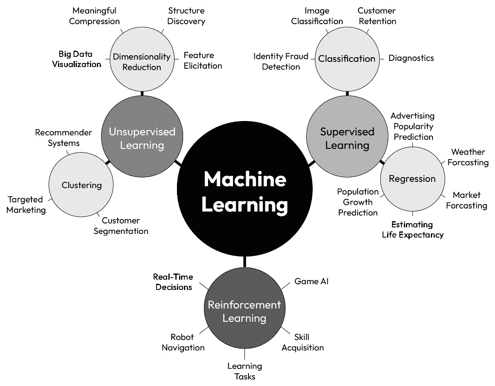
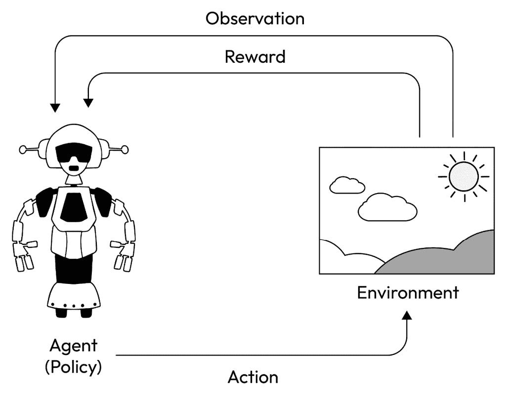
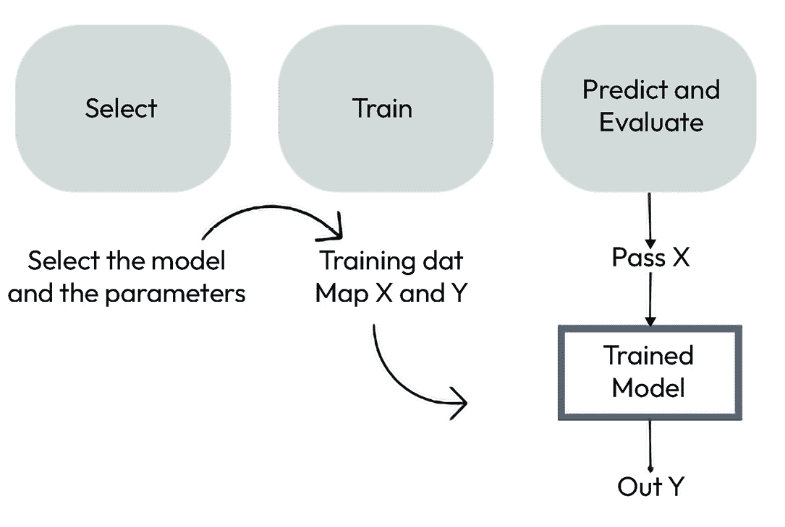
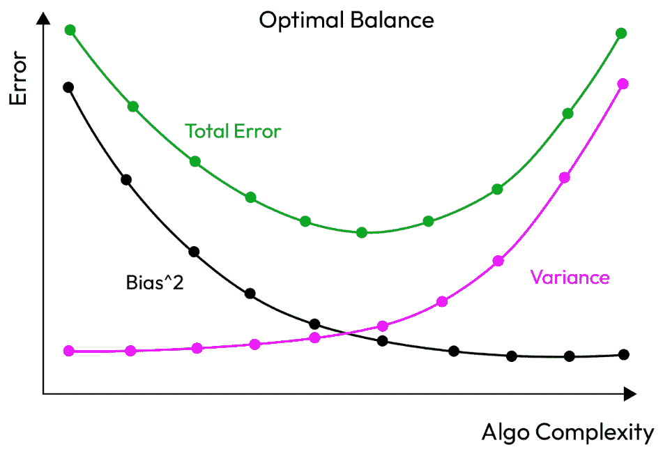
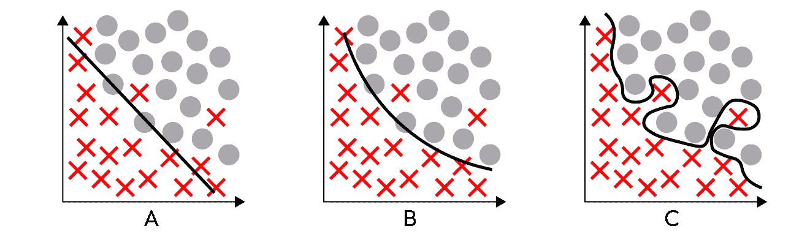
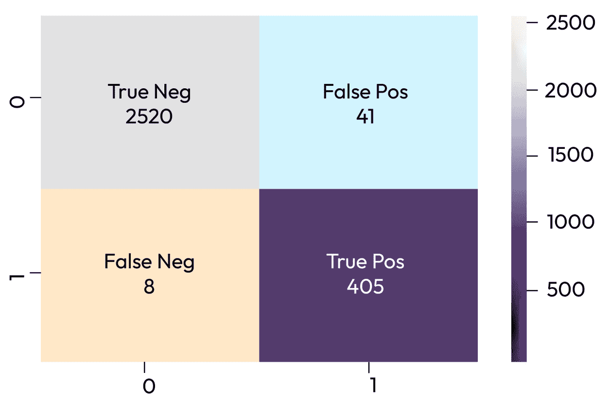
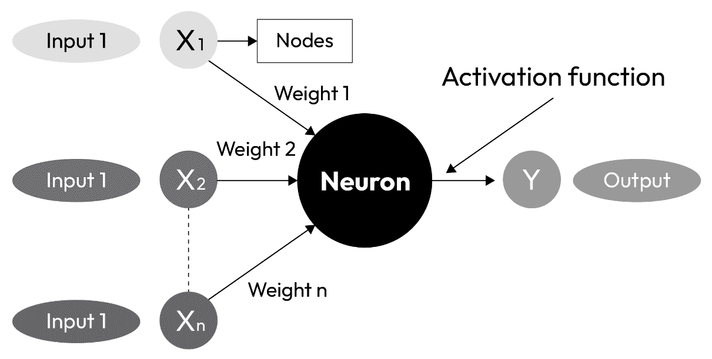
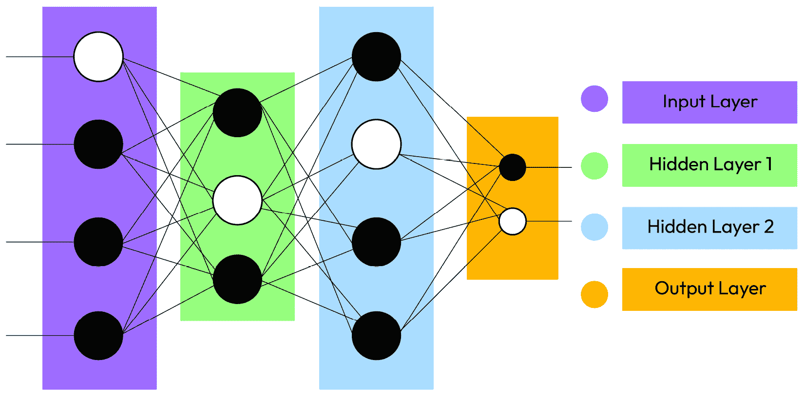

# 第七章：机器学习与深度学习入门

在应用任何机器学习算法之前，全面理解数据集及其关键特征至关重要。这种理解通常通过**探索性数据分析**（**EDA**）得出。一旦熟悉了数据，我们必须投入时间进行特征工程，这包括选择、转换和创建新的特征（如果需要），以使所选模型能够使用或提升其性能。特征工程可能包括将类别转换为数值、对特征进行缩放或标准化、从现有特征中创建新特征等任务。这个过程针对每个特定的模型和数据集进行定制。一旦这个过程完成，我们就可以开始建模。

本章的目标是回顾机器学习和深度学习的基础概念，为本书的*第二部分*奠定基础。在*第二部分*中，我们将深入探讨人工智能在 Web3 数据中的各种应用案例。尽管不会详细介绍每一种可能的模型，但我们将简要描述项目的动机、模型本身以及使用的工具，并提供有价值的参考资料以供进一步阅读。

我们将探讨机器学习和深度学习的主要概念，讨论两个典型的机器学习管道——一个使用 scikit-learn，另一个使用 Keras。此外，我们为本章涵盖的每个主题编写了广泛的*进一步阅读*部分，以鼓励持续学习。

具体来说，以下主题将被讨论：

+   机器学习和深度学习的基本概念

+   使用 scikit-learn 和 Keras 的机器学习管道

# 技术要求

我们将使用**scikit-learn**，这是一个专为机器学习任务设计的流行 Python 库。它提供了数据预处理、特征选择、模型选择和模型评估的算法和工具。

如果你之前没有使用过 scikit-learn，可以通过以下代码片段进行安装：

```py
pip install scikit-learn
```

scikit-learn 的文档可以在 https://scikit-learn.org/stable/找到。

对于深度学习，我们可以选择使用**TensorFlow**或**Keras**。TensorFlow 是一个强大的开源数值计算库，提供训练、测试和部署各种深度学习神经网络的解决方案。它作为基础设施层，使得在 CPU、TPU 和 GPU 上进行低级张量操作成为可能。另一方面，Keras 是一个建立在 TensorFlow 之上的高级 Python API。它专为快速实验而设计，并在发现错误时提供有用的反馈。根据 Kaggle 的 2022 年*数据科学与机器学习现状*调查，Keras 在机器学习开发者和数据科学家中达到了 61%的采用率。

如果你之前没有使用过 TensorFlow 或 Keras，可以使用以下代码片段进行安装：

```py
pip install tensorflow
pip install keras
```

对于深度学习来说，需要大量的计算能力；我们的普通 CPU 可能无法完全胜任任务，导致训练和推理速度较慢。另一种选择是本地或云端运行 GPU——可以通过 Kaggle Kernel 或 Google Colab 进行托管。它们有类似的用户界面，结构上类似于 Jupyter notebook，使得在这些平台上运行仓库中的代码变得更加容易。

你可以在本书的 GitHub 仓库中找到本章的所有数据和代码文件，地址为[`github.com/PacktPublishing/Data-Science-for-Web3/tree/main/Chapter07`](https://github.com/PacktPublishing/Data-Science-for-Web3/tree/main/Chapter07)。我们建议你阅读`Chapter07`文件夹中的代码文件，跟随学习。

# 引入机器学习

计算机科学维基提供的机器学习定义是“*一个致力于理解和构建能够‘学习’的方法的研究领域——也就是利用数据来提高某些任务表现的方法。它被视为人工智能的一部分。机器学习算法基于样本数据（称为训练数据）构建模型，从而在没有明确编程指令的情况下进行预测或决策*。”

（来源：[`computersciencewiki.org/index.php/Machine_learning`](https://computersciencewiki.org/index.php/Machine_learning)）

杰森·布朗利教授将深度学习定义为“*一种受大脑结构和功能启发的机器学习子领域，称为人工神经网络*。”深度学习与其他机器学习方法的区别在于，它以人工神经网络为基础进行方法设计。

这两个领域之间的关系通常表示如下：



图 7.1 – 人工智能的维恩图

让我们进一步分析机器学习的定义：

+   机器学习模型根据我们提供的数据创建自己的规则，正如“*理解并构建能够学习的方法*”以及“*在没有明确编程指令的情况下进行预测或决策*”这两句话所述。之前，我们在查询中使用了过滤器，或在程序中使用了*if 语句*。使用机器学习，特别是监督学习时，我们输入数据，让模型推断出规则。在《*Python 数据科学手册*》中，作者挑战了模型自动学习的观点，而是建议模型通过适应观察到的数据来调节我们提供的参数。一旦它将这些参数与已知数据进行拟合，就能根据未见过的数据推断出结果。

+   “*机器学习算法基于样本数据构建模型，这些数据称为训练数据*。” 传递给机器学习算法的数据需要至少分为两部分：训练数据和测试数据。训练数据集用于构建模型，测试数据集用于评估模型在未见过的数据上进行预测的能力。然后将模型的预测与真实数据进行比较，并计算评估指标。

机器学习技术可以分为监督学习、无监督学习和强化学习。通过机器学习技术解决的常见任务如*图 7.2*所示：



图 7.2 – 机器学习应用

**监督学习**的目标是创建一个可以将输入映射到输出的函数，从而使模型能够根据未见过或相似的输入推断输出。在这个过程中，我们使用特征来描述变量的特性，标签或标记来识别预测的变量。通过这一过程，我们的模型能够学习特征与标签或标记之间的关系。

在 Web3 分析中，**标签**起着至关重要的作用，因为它使我们能够为那些由数字和字母组成、与外部世界没有直接联系的地址赋予身份。然而，创建一个标记地址库可能是一个挑战，最近，这已经成为一家名为 Arkham 的公司的业务，该公司通过公开数据激励“*去匿名化区块链*”。标记地址是像 Nansen 这样的公司主要的杠杆之一，它们在以太坊及其他链上标记了数百个地址，推动了机器学习技术和数据分析报告的进展。

标签也可以在 Etherscan 中找到，重要的项目会标记其地址以便进行公开审计。此外，Dune 和 Flipside 也有带标签的表格，研究团队在其中添加了相关信息，以帮助查询。如果你想了解更多关于身份归属的知识，可以参考 Nick Fourneaux 在《*调查加密货币*》一书中的方法，教你如何从论坛或软件下载网站提取地址，下载 HTML 原始文本，并执行正则表达式分析。

监督学习可以进一步分为回归和分类技术。在分类技术中，我们有一组离散的类别作为标签（例如欺诈交易或非欺诈交易）。在回归中，我们有定量标签，例如 NFT 艺术品或代币的价格。

**无监督学习**的目标是尝试识别数据集中可能不显式的结构或模式。无监督学习下的任务通常包括以下几种：

+   聚类 – 即在给定的数据集中识别出不同的群体

+   降维 —— 即，尝试用更少的特征表示数据集

+   新颖性检测 —— 即，尝试识别数据中何时发生变化

**强化学习**通过利用模型已知的信息以及通过与环境互动后获得的累计奖励来教导模型寻找问题的最佳解决方案。模型通过环境反馈（奖励或惩罚）来进行调整，目标是最大化总奖励。强化学习的核心思想是模仿人类通过试错学习的方式：



图 7.3 – 智能体-环境循环（改编自 [`gymnasium.farama.org/content/basic_usage/`](https://gymnasium.farama.org/content/basic_usage/)）

为了使一个项目变得生动起来，必须执行一些初步的业务/数据步骤：

+   *定义一个 Web3 数据科学问题*意味着精确地阐明我们希望用现有数据解决的问题。在这样的定义中，我们必须能够描述我们要解决的问题，为什么要解决它，以及我们所考虑的假设。

+   *获取数据*意味着获取我们将要处理的数据集。数据集可能已经包含了所有相关的行和列，或者我们需要通过结合多个数据源来构建它。初步的数据源列表列在*第二章*和*第三章*中。根据我们要解决的问题，可能需要更多的数据源。

+   *EDA* 用于通过总结统计和数据可视化技术来理解数据集。*数据准备*是一个预处理步骤，在这个步骤中，我们转换数据集以提高其质量或使其更容易为模型消化。链上数据可能需要大量的转换。我们在*第六章*中分析了一些这些方法。

现在，让我们分析选择、训练和评估模型的步骤。

# 构建机器学习流程

在清理数据并选择最重要的特征后，机器学习流程可以概括为以下几个步骤，如*图 7.4*所示：



图 7.4 – 机器学习流程

要执行这个过程，我们必须进行以下操作：

1.  根据问题和可用数据选择一个模型及其初始参数。

1.  训练：首先，我们必须将数据分割成训练集和测试集。训练过程包括让模型从数据中学习。每个模型的训练过程在时间和计算消耗上可能有所不同。为了提高模型的性能，我们必须通过超参数调整技术（如网格搜索或随机网格搜索）来优化模型。

1.  预测和评估：然后，使用训练好的模型对测试集进行预测，测试集包含算法未曾见过的数据行。如果我们使用训练数据评估模型，模型总是能够预测得很好，那么我们就无法进一步改进它。模型的表现通过特定任务的评估指标来评估。

当我们得到一个良好的模型时，必须保存它，以便在接收到未见数据时使用它。我们可以使用*Pickle*和*Keras Tokenizer*等工具来实现这一点。Pickle 将训练好的模型序列化并转换为文件，使其能够在另一个环境中使用。为了产生结果，我们必须传递结构相同的数据，使模型能够进行预测。

让我们通过一个实际示例来应用这个流程。在`Chapter07/ML_warmup`中，我们的目标是使用一个名为*以太坊欺诈检测数据集*的 Kaggle 数据集，识别以太坊网络上的欺诈交易，其中只有 17%的行是欺诈的。这是一个典型的监督分类任务。

## 模型

根据手头的问题，我们必须选择一个或多个模型进行测试，以判断哪个模型在我们的数据上表现更好。如果我们不确定该选择哪个模型，可以查看 Kaggle 上已解决的相似结构问题。在 Jupyter notebook 中，我们选择了一个随机森林分类器，代码片段如下：

```py
random_forest = RandomForestClassifier(random_state=42)
```

有许多算法可以用于训练，选择可能会很困难。选择多种模型的一种方法是减少可减少的误差。文献通常将这个问题称为偏差-方差权衡。在解决这个权衡之前，我们需要理解存在的不同类型的误差。任何机器学习算法的预测误差可以分为以下几类：

+   **噪声**或**不可减少的误差**：这种类型的误差无论我们如何实现模型，都无法消除。

+   **偏差误差**：这是可以减少的。维基百科将其定义为“*由于学习算法中的错误假设而产生的误差*”。高偏差的模型过于简化现实，导致预测值和真实值之间存在较大的误差。高偏差模型过度简化，意味着它们没有足够的参数来捕捉它们学习数据的复杂性，导致欠拟合。下一节将详细讨论这一概念。

+   **方差误差**：这也是可以减少的。维基百科将其定义为“*对训练集中的微小波动的敏感性导致的误差*”。这意味着模型过于深入地学习了训练数据集的特殊性，以至于无法对未见数据进行有效的泛化。这些模型高度依赖于精确的训练数据，无法做到泛化。当模型在训练数据上表现良好，但在测试/验证数据上表现不佳时，我们就会遇到这个误差，表明存在过拟合问题。

低方差高偏差的算法训练复杂度较低的模型，具有简单或刚性的基础结构 – 例如线性回归。另一方面，高方差低偏差的算法训练复杂、灵活的模型，可以在训练数据上准确，但在预测中不一致 – 例如 KNN。

如果我们理解了偏差和方差，并认识到两者都源于我们所做的模型选择，为了做出最优决策，我们将选择在两者之间进行总误差的权衡的模型：



图 7.5 – 偏差-方差权衡

选择模型的另一个标准是其性能，这由所选的评估指标来衡量。我们可以运行多个模型，并使用相同的指标评估它们，性能更好的模型将被继续调优。我们将在后续章节讨论评估指标。

在`Chapter07/ML_warmup`中，我们选择了随机森林分类器。这种算法旨在减少模型的方差而不损害偏差，并在被称为召回率的评估指标上表现良好。有关随机森林算法的更多信息，请参阅*进一步阅读*部分。

## 训练

开始训练过程时，我们将数据分为训练数据集和测试数据集。这样做可以使模型在训练过程中看不到部分数据，并且我们可以在训练后评估其性能：

```py
X_train, X_test, y_train, y_test = train_test_split(X, y,\
    test_size=0.33, random_state=42)
```

训练过程包括将特征和标签传递给算法，使其从中学习。学习算法将尝试在训练数据中找到模式，将输入数据的属性映射到目标上。训练后的模型捕获这些模式。

在`Chapter07/ML_warmup`中，我们使用以下代码片段指导模型学习：

```py
random_forest.fit(X_train, y_train)
```

## 欠拟合和过拟合

考虑三种情景，模型由一条黑线表示。哪种情景能更好地进行分类？



图 7.6 – 三种分类情景

让我们理解这些情景：

+   **情景 A**：模型非常简单，无法捕捉两个类别之间的边界。这被称为**欠拟合**。

+   **情景 B**：模型能够找到两类之间可接受的边界，尽管可能会误分类一些边界样本。总体上，它捕捉了数据集的复杂性。

+   **情景 C**：模型过度适应了训练数据集，并学到了所有细节，而不仅仅是区分一个类别与另一个类别的相关特征。它无法泛化。这被称为**过拟合**。


图 7.7 – 模型过拟合时的表现（来源：https://twitter.com/MaartenvSmeden/status/1522230905468862464）

我们的目标是场景 B，在这个场景中，模型足够复杂，能够捕捉重要特征，但不会过度适应训练数据，因此在未见过的样本上表现良好。

## 预测与评估

在这里，我们将未见过的数据传入训练好的模型，并评估它的预测与实际情况的准确性。如果结果可接受，我们会保留模型；否则，我们将调整超参数并重新训练。*超参数是在训练过程前设置的变量，在学习过程中不能更改。参数是那些在训练过程中调整的值。*

在 Jupyter notebook 中，我们使用以下代码片段进行预测和评估：

```py
y_test_pred = random_forest.predict(X_test)
print(classification_report(y_test_pred,y_test))
conf_mat=confusion_matrix(y_test_pred,y_test)
```

为了评估结果是否可接受并决定是否保留模型，我们可以使用二分类任务的混淆矩阵。在 Jupyter notebook 中，我们分析的数据集的混淆矩阵如*图 7.8*所示：



图 7.8 – 混淆矩阵

让我们来理解混淆矩阵的组成部分：

+   **真反例**（**TN**）：模型预测为负，并且预测正确。这些交易不是欺诈性的。

+   **真正例**（**TP**）：模型预测为正，并且预测正确。这些交易是欺诈性的。

+   **假反例**（**FN**）：模型未能预测，并且它们是欺诈性的。

+   **假正例**（**FP**）：模型将这些交易标记为欺诈性交易，但它们并非如此。

基于这些数据，我们可以计算精确度和召回率。**精确度**回答的问题是：我们预测为正的所有类别中，实际为正的有多少？

TP _ TP + FP

我们的精确度是`0.91`。

**召回率**回答的问题是：所有欺诈性类别中，我们的模型正确预测了多少？其公式如下：

TP _ TP + FN

我们的召回率是`0.98`。

结果的评估取决于具体问题。正确选择评估指标非常重要，因为它将影响我们后续的决策。在`Chapter07/ML_warmup`中，我们的目标是发现欺诈交易，因此我们更看重召回率高于精确度。我们更偏向召回率，因为漏掉一个欺诈交易的成本远高于错误标记一个可能无害的交易。然而，假正例（FP）的数量不能过大，因为这会带来交易成本并影响客户。

现实世界的数据集大多数是不平衡的，这意味着不同类别的样本数量不均衡。我们的任务是应用技术，让模型学习两种类别的存在和特征，特别是当我们试图检测的类别是较少出现的类别时。

关于平衡和不平衡数据集的说明

**准确度**，即正确预测的百分比，是另一个常用的评估指标。然而，如果数据集不平衡，准确度将无法得出好的结果。如果在不平衡数据集中将准确度作为评估指标，模型只需要识别出多数类，就能返回一个好的结果，这并不能保证这是一个好的模型。

在我们的 EDA（探索性数据分析）中，我们将检查每个类别的比例，并确定我们处理的是平衡数据集还是不平衡数据集。例如，在`Chapter07/ML_warmup`中，我们知道欺诈性样本的比例是 17%。

我们可以通过在特征工程预处理步骤中使用过采样或欠采样技术来解决这个问题。必须谨慎进行，因为这可能会改变数据中的潜在关系，或者删除一些关键信息。

我们还可以使用已经为不平衡数据集优化的算法，并允许用户在训练过程中添加这些信息——例如，使用随机森林算法中的`class_weight`参数。

此外，我们还可以通过在`train_test_split`中使用`stratify`来考虑类别的不平衡表示，从而优化拆分过程。

# 引入深度学习

在本书的*第二部分*中，我们在解决用例时也将使用深度学习方法。深度学习模型采用多个互联的节点（称为神经元），这些神经元处理输入数据，并基于学习到的权重和激活函数产生输出。神经元之间的连接促进了信息流动，网络的架构决定了信息如何被处理和转化。

我们将在各自的章节中详细研究三种神经网络架构。现在，让我们先介绍一下我们将在这些章节中使用的框架和术语。

神经元作为系统的基本构建单元，可以定义为一个节点，具有一个或多个输入值、权重和输出值：



图 7.9 – 神经元的结构

当我们将多个具有这种结构的层叠加在一起时，它就形成了一个神经网络。这种架构通常由输入层、隐藏层和输出层组成：



图 7.10 – 神经网络结构

输入层启动网络并将数据传递给隐藏层，隐藏层对特征和模式进行计算。隐藏层越多，执行的计算就越复杂。

输出层接收来自隐藏层的处理信息，并提供一个总结网络内已处理信息的结果或输出。

节点之间的连接包含权重，这些权重携带有关如何解决特定问题的信息。在模型训练过程中，我们调整这些权重以使模型适应我们的数据集。这些权重代表了模型的可学习参数。

这个灵活的结构允许用户调节多个超参数，以增强模型的表现。基本原理如下：

+   **学习率**：这个超参数控制模型在响应权重更新时的变化程度。找到正确的学习率非常重要，因为过小的学习率可能会导致训练过程过长，而较高的学习率可能会导致次优的权重集合和结果变化。学习率与优化器密切相关。

+   **激活函数**：这些函数决定神经元是否应该被激活，即它们决定神经元对网络的输入是否对预测过程重要，通常通过简单的数学运算来实现。激活函数从每层输入的值中得出输出。Keras 中的激活函数列表可以在[`keras.io/api/layers/activations/`](https://keras.io/api/layers/activations/)找到。

+   **损失函数**：这些函数量化了预测值与期望值之间的误差，将模型的表现总结为一个需要在训练过程中最小化的单一值。损失函数的选择取决于所解决的问题，常见的例子包括回归任务中的均方误差和分类任务中的交叉熵。Keras 列出了各种损失函数，详情请见[`keras.io/api/losses/`](https://keras.io/api/losses/)。

+   **优化器**：这些算法通过调整神经网络的属性来帮助改善模型的表现。它在架构中的职责是调整学习率和神经元的权重，以达到损失函数的最小值。Keras 支持的优化器列在此：[`keras.io/api/optimizers/`](https://keras.io/api/optimizers/)。

+   **训练轮数**：这表示算法遍历整个数据集的次数。

+   **批量大小**：指的是用于更新模型参数的样本数量。批量大小为*N*意味着将使用训练数据集中的*N*个样本来更新模型参数。请记住，这些样本会保存在内存中，因此更高的批量大小需要更多的内存。

我们使用的所有模型都将在 Keras 框架下进行分析，Keras 具有出色的文档。

## 模型准备

在`Chapter07/DL_warmup`中，我们将使用与上一节相同的数据集——*以太坊欺诈检测数据集*。这一次，我们将选择更少的列，并使用`RobustScaler()`来自 sklearn 对数字进行标准化。

与所有预测问题一样，我们希望通过`train test` `split ()`将测试集和训练集分开。

## 模型构建

我们将使用 Keras 创建一个顺序模型。顺序模型的结构由相同或不同的层堆叠而成，其中一层的输出进入另一层。

以下代码片段设置输入层，期望输入具有与数据集列数相同的行数据。在这种情况下，我们只处理 11 列数据：

```py
model.add(Input(shape=(X_train.shape[1],)))
```

我们添加了三层隐藏层，每一层的节点数逐渐减少。所有这些层都使用`relu`作为激活函数。`Dense`层是一个全连接层，是多种类型层之一，例如`卷积层`或`LSTM`层：

```py
model.add(Dense(30, activation='relu'))
model.add(Dense(10, activation='relu'))
model.add(Dense(5, activation='relu'))
model.add(Dense(1, activation='sigmoid'))
```

由于这是一个二分类任务，在最后一层，我们将使用`sigmoid`激活函数和输出层中的`1`：

```py
model.add(Dense(1, activation='sigmoid'))
```

在训练模型之前，需要通过优化器、损失函数和评估指标来编译模型。编译器配置学习过程。值得一提的是，由于这是一个不平衡的数据集，我们关心的是精确度和召回率，因此我们必须利用`keras`库来构建评估指标，具体如下：

```py
metrics = [
    keras.metrics.Precision(name="precision"),\
    keras.metrics.Recall(name="recall"),
]
```

现在，我们必须将其添加到编译器中：

```py
model.compile(optimizer=keras.optimizers.Adam(1e-2), \
    loss=loss_function, metrics=metrics)
```

## 训练和评估模型

一旦模型构建完成，我们需要将数据集输入模型进行训练。这是通过`fit()`来完成的，在本例中，我们决定训练 90 个 epoch。

一旦完成训练，就需要通过预测未参与训练的数据来评估模型。我们可以使用`X_test`和`y_test`来实现这一点。

分类报告显示，少数类的召回率为 95%，这一结果非常好。通过更多的数据预处理，应用针对不平衡数据集的技术以及超参数调优，我们可以进一步提高结果。

在这个特定的练习中，**Python Zen**的原则之一得到了完美应用。*简单优于复杂* —— 一个更简单的机器学习模型表现优于复杂的神经网络。

现在我们已经探讨了这两种方法，我们将重点介绍每个领域的附加特征：

| **机器学习** | **深度学习** |
| --- | --- |
| 可以从较小的数据集进行训练和推断 | 需要大量数据 |
| 较短的训练时间，可以使用 CPU 完成 | 较长的训练时间，需要 GPU 才能有效训练 |
| 进行简单的相关性分析 | 进行非线性复杂相关性分析 |
| 大多是可解释的 | 不透明的模型，难以解释 |

表 7.1 – 机器学习与深度学习的区别

关于人工智能的伦理和社会影响的提示

关于伦理和社会影响的讨论可能离我们的日常工作较远，但考虑到我们的项目通常在商业环境中展开，因此建议考虑其更广泛的影响。机器学习和深度学习的伦理与社会影响涵盖了多个方面，包括以下内容：

**偏差**：与偏差误差类似，机器学习模型可能继承训练数据中的偏差，进而导致歧视性结果。偏差可以在机器学习生命周期的各个阶段引入，从数据收集到模型部署。为了训练我们的模型，获取无偏的数据非常重要，并且应定期审计模型以检测并修正偏差。

**透明性**：复杂机器学习模型的不透明性给监管机构带来了挑战，可能削弱用户的信任。许多 DeFi 项目正在积极寻求监管批准，以促进资金从传统银行体系流向 DeFi 世界。鉴于金融领域的高度监管性质，在该领域工作的数据科学家必须努力提升模型的可解释性，并向监管机构提供决策的解释。

解决这些伦理问题需要一个多学科的方式，涉及技术开发者、政策制定者、伦理学家等。作为从事模型工作专业人士，我们需要牢记这些挑战，尤其是在选择数据集、进行数据预处理或在现实世界中评估模型结果时。

# 摘要

在本章中，我们深入探讨了人工智能的基本概念，这将为我们在本书*第二部分*中的旅程奠定基础。我们探讨了包括监督学习、无监督学习和强化学习在内的各种任务类型。通过一个实践示例，我们深入了解了典型的机器学习过程，包括模型选择、训练和评估。

在本章中，我们获得了与机器学习中常见挑战相关的基本知识，如在模型欠拟合和过拟合之间找到正确的平衡，存在不平衡数据集，以及哪些评估指标适用于训练过这些数据集的模型。理解这些概念对于任何成功的机器学习项目至关重要。

此外，我们深入学习了深度学习的基础知识，使用 Keras 探索了神经网络的关键组件。此外，我们实现了一个流程来处理一个监督学习问题，亲自体验了所有概念的应用。

在下一章，我们将讨论一个重要的话题——情感分析。

# 进一步阅读

想要了解更多本章涵盖的主题，请参考以下资源：

+   定义：

    +   Igual, L. 和 Seguí, S. (2017). *数据科学导论*：*基于 Python 的概念、技术和应用方法*。Springer。

    +   Ertel, W. (2018). *人工智能导论*。Springer。

    +   Skansi, S. (2018). *深度学习导论：从逻辑演算到人工智能*。Springer。

    +   Ian Goodfellow, Yoshua Bengio, 和 Aaron Courville. (2016). *深度学习*。可在 [`www.deeplearningbook.org/`](https://www.deeplearningbook.org/) 查阅。

    +   Chollet, F. (2017). *使用 Python 进行深度学习*。Manning 出版公司。

    +   Müller, A. C. 和 Guido, S. (2016). *使用 Python 进行机器学习导论：数据科学家指南*。O’Reilly Media 出版社。

    +   VanderPlas, J. （无日期）。*什么是机器学习？* Pythonic Perambulations。可在 [`jakevdp.github.io/PythonDataScienceHandbook/05.01-what-is-machine-learning.xhtml`](https://jakevdp.github.io/PythonDataScienceHandbook/05.01-what-is-machine-learning.xhtml) 查阅。

    +   *什么是深度学习？*：[`machinelearningmastery.com/what-is-deep-learning/`](https://machinelearningmastery.com/what-is-deep-learning/)。

    +   从网站挖掘地址：Furneaux, Nick. *研究加密货币，* *第九章*。理解、提取和分析区块链证据，Wiley，2018 年。第 125 页。

    +   James, G., Witten, D., Hastie, T., 和 Tibshirani, R. (2022). *统计学习导论：应用篇*。R. Springer 出版社。

    +   Gymnasium 文档：[`gymnasium.farama.org/`](https://gymnasium.farama.org/)。

    +   *Introduction – Spinning up 文档*。（无日期）。欢迎来到深度强化学习中的 Spinning Up！Spinning Up 文档。可在 [`spinningup.openai.com/en/latest/user/introduction.xhtml#what-this-is`](https://spinningup.openai.com/en/latest/user/introduction.xhtml#what-this-is) 查阅。

    +   *Nansen 钱包标签与表情符号：它们是什么意思？* (2023 年 3 月 14 日)。Nansen – 加密货币、DeFi 和 NFT 分析。可在 [`www.nansen.ai/guides/wallet-labels-emojis-what-do-they-mean#alpha-labels`](https://www.nansen.ai/guides/wallet-labels-emojis-what-do-they-mean#alpha-labels) 查阅。

+   流水线：

    +   EliteDataScience. (2022 年 7 月 8 日). *什么是偏差-方差权衡？*（信息图表）。可在 [`elitedatascience.com/bias-variance-tradeoff`](https://elitedatascience.com/bias-variance-tradeoff) 查阅。

    +   *Sklearn.ensemble.RandomForestClassifier*。（无日期）。scikit-learn。检索于 2023 年 3 月 14 日，网址 [`scikit-learn.org/stable/modules/generated/sklearn.ensemble.RandomForestClassifier.xhtml`](https://scikit-learn.org/stable/modules/generated/sklearn.ensemble.RandomForestClassifier.xhtml)。

    +   *SMOTE 过采样*。（无日期）。机器学习精通。可在 [`machinelearningmastery.com/smote-oversampling-for-imbalanced-classification/`](https://machinelearningmastery.com/smote-oversampling-for-imbalanced-classification/) 查阅。

    +   Nyuytiymbiy, K. (2022 年 3 月 28 日). *机器学习与深度学习中的参数与超参数*。Medium。可在 [`towardsdatascience.com/parameters-and-hyperparameters-aa609601a9ac`](https://towardsdatascience.com/parameters-and-hyperparameters-aa609601a9ac) 查阅。

    +   `Chapter07/ML_warmup`中的热力图：T, D. (2019 年 7 月 25 日). *混淆矩阵可视化*。Medium。可访问 `medium.com/@dtuk81/confusion-matrix-visualization-fc31e3f30fea`。

    +   在 Colaboratory 中使用 Kaggle 数据集的教程。跟随`Chapter07/ML_warmup`的内容非常有用：Gupta, K. (2022 年 8 月 24 日). *如何将 Kaggle 数据集加载到 Google Colab 中？* Analytics Vidhya。可访问 [`www.analyticsvidhya.com/blog/2021/06/how-to-load-kaggle-datasets-directly-into-google-colab/`](https://www.analyticsvidhya.com/blog/2021/06/how-to-load-kaggle-datasets-directly-into-google-colab/)。

    +   Pramoditha, R. (2022 年 1 月 26 日). *如何选择神经网络的激活函数*。Medium。可访问 [`towardsdatascience.com/how-to-choose-the-right-activation-function-for-neural-networks-3941ff0e6f9c`](https://towardsdatascience.com/how-to-choose-the-right-activation-function-for-neural-networks-3941ff0e6f9c)。

    +   Gupta, A. (2022 年 5 月 24 日). *深度学习优化器的全面指南*。Analytics Vidhya。可访问 [`www.analyticsvidhya.com/blog/2021/10/a-comprehensive-guide-on-deep-learning-optimizers/`](https://www.analyticsvidhya.com/blog/2021/10/a-comprehensive-guide-on-deep-learning-optimizers/)。

    +   *PEP 20 – Python 之禅*。(2022 年 3 月 15 日). PEP 0 – Python 增强提案（PEPs）索引 | peps.python.org。可访问 [`peps.python.org/pep-0020/`](https://peps.python.org/pep-0020/)。

    +   Keras 团队。 (2020 年 4 月 17 日). *Keras 文档：不平衡分类：信用卡欺诈检测*。Keras：深度学习工具。可访问 [`keras.io/examples/structured_data/imbalanced_classification/`](https://keras.io/examples/structured_data/imbalanced_classification/)。

    +   Ramchandani, P. (2021 年 4 月 10 日). *随机森林与偏差-方差权衡*。Medium。可访问 [`towardsdatascience.com/random-forests-and-the-bias-variance-tradeoff-3b77fee339b4`](https://towardsdatascience.com/random-forests-and-the-bias-variance-tradeoff-3b77fee339b4)。

    +   使用贝叶斯优化调优：Rendyk. (2023 年 8 月 17 日). *调整神经网络深度学习的超参数和层次结构*。Analytics Vidhya。可访问 [`www.analyticsvidhya.com/blog/2021/05/tuning-the-hyperparameters-and-layers-of-neural-network-deep-learning/`](https://www.analyticsvidhya.com/blog/2021/05/tuning-the-hyperparameters-and-layers-of-neural-network-deep-learning/)。

    +   *如何在 Python 中使用 Keras 进行深度学习模型的网格搜索超参数*。(2022 年 8 月)。机器学习精通。可访问 [`machinelearningmastery.com/grid-search-hyperparameters-deep-learning-models-python-keras/`](https://machinelearningmastery.com/grid-search-hyperparameters-deep-learning-models-python-keras/)。
