# 第十二章：通过图形发现营销机会

数据在营销中发挥了至关重要的作用，推动决策制定，并优化资源配置，以支持有影响力的营销活动。然而，区块链数据固有的伪名性和复杂性为营销团队带来了挑战，其中提取最大价值在很多情况下仍然是一个持续的机会。

营销团队使用的主要应用之一是聚类，它涉及将具有共同兴趣的群体进行组织，以便进行客户细分。这项技术在社交网络中取得了很大成功，促进了产品推荐系统的发展，并推动了新的连接。

类似于社交网络，区块链数据凭借其大量交易，具有从少量互动中推断偏好的巨大潜力。标签分类是另一个有价值的应用场景，它帮助营销团队有效地识别和定位区块链中的社区。通过辨识社区，数据科学家可以帮助营销人员克服伪名性带来的限制，并获得有价值的洞察。

在本章中，我们将深入探讨以下主题：

+   图形入门

+   数据库选择与特征工程

+   建模、训练与评估结果

在本章结束时，我们将全面了解如何利用网络和图形的力量来制定有效的营销策略。

# 技术要求

在本章中，我们将利用`networkx`库，这是一个用于处理网络或图形的 Python 库。它提供了一系列工具和功能，用于创建、操作和分析网络。该库便于创建节点、添加信息，并提供用于分析和探索网络的算法，如寻找最短路径、计算中心性度量和检测社区。

如果你以前没有使用过`networkx`，可以通过以下代码片段进行安装：

```py
pip install networkx
```

`networkx`的文档可以在[`networkx.org/documentation/stable/index.xhtml`](https://networkx.org/documentation/stable/index.xhtml)找到。

我们还将使用**Gephi**，一款免费的开源图形绘制工具。Gephi 是一个用户友好的工具，旨在可视化和探索图形和网络。它帮助用户深入洞察并分析图数据中的复杂关系。

使用 Gephi，我们可以从各种格式中导入数据，并选择特定的节点，以了解它们在数据集中的位置。该工具提供了众多统计功能来支持图形分析。它允许我们根据特定标准过滤、排序和操作图形，使我们能够聚焦于相关的节点和边。

如果你之前没有使用过 Gephi，可以从他们的页面下载：[`gephi.org/`](https://gephi.org/)。关于 Gephi 的全面指南可以在《*Gephi Cookbook*》一书中找到，点击此处查看：[`www.packtpub.com/product/gephi-cookbook/9781783987405`](https://www.packtpub.com/product/gephi-cookbook/9781783987405)。  

对于我们的机器学习模型，我们将使用 StellarGraph 库。StellarGraph 专为处理图结构数据而设计，特别适用于与机器学习和数据分析相关的任务。它的一个关键特点是与流行的机器学习框架（如 TensorFlow 和 Keras）的集成。StellarGraph 提供了将图转换为这些框架兼容格式的方法，使我们能够将机器学习模型和算法应用于图结构数据。StellarGraph 的文档可以在[`stellargraph.readthedocs.io/en/stable/`](https://stellargraph.readthedocs.io/en/stable/)找到。  

如果这是你第一次使用这个库，你可以通过`pip`安装它：  

```py
pip install stellargraph
```

与本章相关的所有数据和代码文件，以及彩色图像，可以在本书的 GitHub 仓库中找到，网址是：https://github.com/PacktPublishing/Data-Science-for-Web3/tree/main/Chapter12。  

我们建议你阅读`Chapter12`文件夹中的代码文件，这样你可以更有效地跟随本章的内容。  

# 图论入门  

根据伊纳尔·利夫的说法，"*网络科学，有时被认为是数据科学的一个子领域，有时被认为是一个独立的学术领域，是研究网络结构模式的一系列技术、方法和工具*。" 一个网络的示例是伦敦地铁图的图像：  

，属于合理使用）](img/B19446_12_01.jpg)

图 12.1 – 贝克设计的伦敦地铁图概述（来源：[`en.wikipedia.org/wiki/File:Beck_Map_1933.jpg`](https://en.wikipedia.org/wiki/File:Beck_Map_1933.jpg)，属于合理使用）  

在我们对网络和图的探索中，我们将交替使用这些术语。  

近年来，网络研究因其能够简单地解释实体之间的关系而受到广泛关注。正如马蒂亚斯·阿维拉教授所解释的，“*网络，也称为数学文献中的图，是由一些节点组成的集合，其中某些节点通过边连接在一起* *。”  

在本教程中，我们将探索图的基本概念，包括它们的定义和特点。  

一个网络由节点（也称为顶点或 V）组成，这些节点通过连接（或边或 E）相互链接。图或网络通常表示为 G，表示法为 G=(V,E)。  

在*图 12.2*中，我们可以观察到地址 `0xdac17f958d2ee523a2206206994597c13d831ec7` 和 `0x28C6c06298d514Db089934071355E5743bf21d60` 之间网络内图的组成部分：

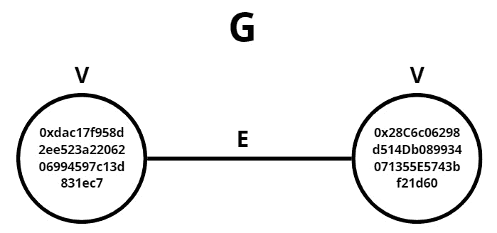

图 12.2 – 两个地址之间的关系

数据分析师的角色是从数据中提取有意义的见解和可操作的洞察。一旦我们找到了有意义的连接，添加上下文就显得尤为重要。例如，在*图 12.3*中，我们正在查看 USDT 智能合约与 Binance 地址之间的关系：

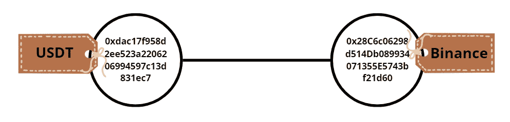

图 12.3 – 两个标记地址之间的关系

## 图的类型

**有向图**（**digraphs**），由 Stamile、Marzullo 和 Deusebio 定义，表示为“*一个对，G=(V,E)，其中 V 是节点集合，E 是表示两个节点之间连接的有序对集合。*”E 中的元素是有序的，表示从一个节点（通常称为“源”）到另一个节点（通常称为“目标”）的方向：

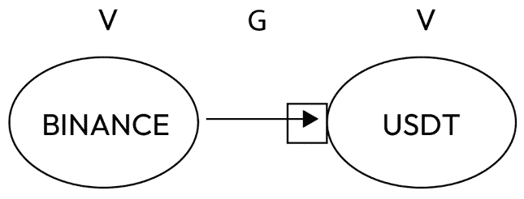

图 12.4 – 有向图示例

在 **有向图** 中，节点可以分为入度（指向某节点的边的数量，表示图中有向边指向该节点的节点）和出度（从某节点出发的边的数量，表示图中该节点有向边指向的节点）。入度和出度提供了关于节点连接性和影响力的见解。理解这个概念对于各种图分析任务非常有价值，比如识别中心节点、研究信息流、检测有影响力的节点、评估有向网络的结构和动态。

**自我图**，也称为邻居图，专注于一个特定的节点，称为“自我”节点。它显示自我节点及其所有邻居节点，以及连接它们的边。自我图对于分析特定节点周围的局部结构和连接非常有用：

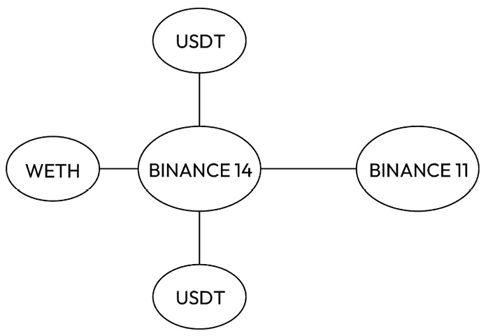

图 12.5 – 自我图示例

**加权图**是每条边都有一个相关权重或值的图。权重是数值，可以表示连接的节点之间关系的各种特征，如强度、距离、成本、连接频率等。权重提供了额外的信息，可用于分析、训练和推断：

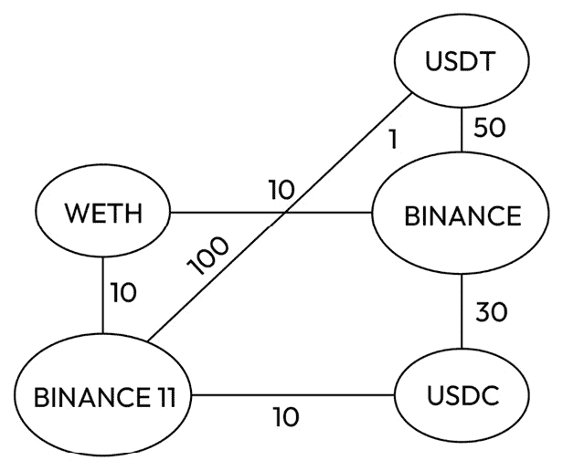

图 12.6 – 加权图示例

还有许多其他具有独特特征和用途的图形模式，它们超出了本介绍的范围。那么，为什么图形模式对我们的数据分析如此重要呢？图形模式有助于揭示区块链中地址之间关系的动态变化。在一篇名为*可视化动态比特币交易模式*的文章中，作者解析了这些模式并提供了相应的解释：

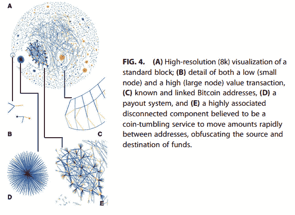

图 12.7 – 比特币区块中的图形模式示例

归属

*可视化动态比特币交易模式*，Dan McGinn 等，2016；由 Mary Ann Liebert, Inc.出版。

本开放获取文章根据创作共用许可证（[`creativecommons.org/licenses/by/4.0`](http://creativecommons.org/licenses/by/4.0)）分发，允许在任何媒介中不受限制地使用、分发和复制，只要正确引用原始作品。

在接下来的部分中，我们将分析属于两个具有不同特征的社区的地址数据集——一个与 OpenSea NFT 市场相关，另一个与名为 Binance 的集中式交易所相关。每个地址与其社区之间的关系特征可以通过图中形成的模式观察到：

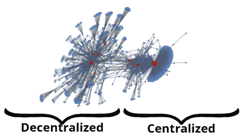

图 12.8 – 目标社区之间的关系

## 图形属性

根据 Stamile、Marzullo 和 Deusebio 提出的分类方法，我们发现分析整合度量和隔离度量是很有帮助的。

**整合**度量显示了节点之间相互连接的趋势。在这些度量中，我们有距离和最短路径。

距离定义为“*从给定的源节点到达目标节点所需经过的边的数量*”。最短路径是与两个节点之间所有可能路径相比，边数最少的路径。如果图是加权的，它是具有最小边权和的路径。我们对这一概念感兴趣，因为它将帮助我们识别重要的节点。

另一个与最短路径相关的度量是**特征路径长度**。它被定义为所有可能的节点对之间最短路径长度的平均值。

另一类度量是**隔离**度量，顾名思义，它们寻找节点之间更可能存在的相似关系模式。它们识别出互联节点的群体，这些群体被称为**社区**。在这些度量中，我们有聚类系数和模块度。

**聚类系数**是衡量节点之间倾向于聚集（或“聚类”）的程度。其原理是节点与相似节点之间的聚集程度要高于与随机节点之间的聚集。聚类系数基于三角形或三重组的划分，它由三个节点和三条边组成。它研究节点的邻居之间也是否是邻居的比例。这里存在局部和全局聚类系数。

**模块化**衡量一个网络的强度，以便它可以被划分成模块或社区。如果一个网络的模块化高，意味着在一个社区内部的节点之间连接密集，而不同模块之间的节点连接稀疏。Gephi 工具和 Networkx 库都可以帮助我们计算模块化并识别社区。

*图 12.9* 显示了将在下一部分介绍的数据集，数据集以两种颜色呈现，每种颜色对应一个已检测到的社区：

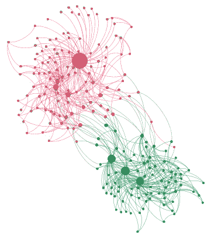

图 12.9 – 应用 Gephi 筛选条件的数据集社区

该图是使用 Gephi 创建的，并应用了以下筛选条件：

+   **拓扑筛选器**：巨型组件

+   **度数范围**：大于 3

+   **节点大小**：介数中心性

+   **节点颜色**：模块化 2.0

让我们深入了解这个数据集！

# 数据集

数据集包含一系列目标地址为 Binance 或 OpenSea 的交易。这些实体由多个地址提供服务，为了简化，我们选择了其中一个与它们相关联的地址。

Binance 14 地址（`0x28c6c06298d514db089934071355e5743bf21d60`）代表一个 Binance 热钱包，用于促进中心化交易所与以太坊之间的连接。这个钱包中的资金用于 Binance 之外的存取款。

另一方面，OpenSea 的地址，特别是 Wyvern Exchange v2（`0x7f268357a8c2552623316e2562d90e642bb538e5`），对应 OpenSea 的市场合约。

要使用 Flipside 复制此数据集，我们可以使用以下查询：

```py
sql =SELECT from_address, to_address, tx_hash
FROM ethereum.core.fact_transactions
WHERE block_timestamp >= '2023-01-01T00:00:00.000Z'
  and   block_timestamp <= '2023-06-01T00:00:00.000Z'
  and to_address in ('0x28c6c06298d514db089934071355e5743bf21d60', '0x7f268357a8c2552623316e2562d90e642bb538e5')
  limit [800]
```

对于可视化，我们可以使用 *Graph Machine Learning* 中提出的 `draw_metric` 函数，该函数突出显示在讨论的指标下具有较高值的节点。我们将进行的分析可以在 `Chapter12/features.ipynb` 中找到，结果 DataFrame 名为 `influencer_nodes.csv`。

**介数中心性**是一个衡量指标，表示一个节点作为最短路径中桥梁的次数。经过该节点的最短路径数量越多，介数中心性就越大。

有趣的是，在`influencer_nodes.csv`中，我们可以观察到 USDT 和**Wrapped Ethereum**（**WETH**）稳定币节点具有较高的介数中心性，分别与 Binance 和 OpenSea 连接。下图展示了具有较高介数中心性的节点：

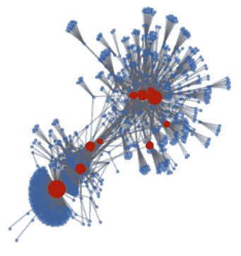

图 12.10 – 数据集中的介数中心性

以下信息来自 CSV 文件，经过`Betweenness` `Centrality`列筛选：

| **地址** **或节点** | **介数中心性** | **标签** |
| --- | --- | --- |
| `0x28c6c06298d514db089934071355e5743bf21d60` | `0.494010213` | Binance 14 |
| `0x7f268357a8c2552623316e2562d90e642bb538e5` | `0.323956896` | OpenSea: Wyvern Exchange v2 |
| `0xdac17f958d2ee523a2206206994597c13d831ec7` | `0.173128355` | Tether-USDT 稳定币 |
| `0xc02aaa39b223fe8d0a0e5c4f27ead9083c756cc2` | `0.16215128` | Wrapped Ether |

表 12.1 – 经过介数中心性列筛选的数据

**度数**是指与特定节点直接相连的连接或节点的数量。连接较多的节点通常具有更强的影响力和中心性。

在`influencer_nodes.csv`中，我们可以看到，与 Binance 连接的有 USDT 和 USD Coin，与 OpenSea 连接的有 WETH 和 Seaport 1.1 地址（是 OpenSea 基础设施的一部分）：

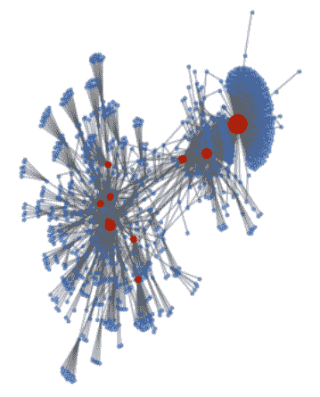

图 12.11 – 数据集中的度数

以下信息来自 CSV 文件，经过`Degree`列筛选：

| **地址** **或节点** | **度数** | **标签** |
| --- | --- | --- |
| `0x28c6c06298d514db089934071355e5743bf21d60` | `0.370160529` | Binance 14 |
| `0x7f268357a8c2552623316e2562d90e642bb538e5` | `0.101038716` | OpenSea: Wyvern Exchange v2 |
| `0xdac17f958d2ee523a2206206994597c13d831ec7` | `0.094428706` | Tether-USDT 稳定币 |
| `0xa0b86991c6218b36c1d19d4a2e9eb0ce3606eb48` | `0.046270066` | Circle USD |
| `0xc02aaa39b223fe8d0a0e5c4f27ead9083c756cc2` | `0.16215128` | Wrapped Ether |
| `0x00000000006c3852cbef3e08e8df289169ede581` | `0.029272899` | Seaport 1.1 (OpenSea 基础设施) |

表 12.2 – 经过度数列筛选的数据

在`influencer_nodes.csv`中，我们可以看到，具有较接近中心性的地址是连接在两个介数中心性较高的地址之间的节点（Binance 14 和 OpenSea: Wyvern Exchange v2）。它们作为两个社区之间的桥梁：

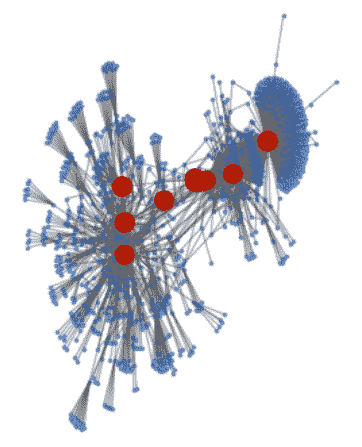

图 12.12 – 数据集中的接近中心性

以下信息来自 CSV 文件，经过`Closeness` `Centrality`列筛选：

| **地址** **或节点** | **接近中心性** | **标签** |
| --- | --- | --- |
| `0x411c104dcec01380ee86ea2d090ed3450850f1d6` | `0.33197098` | 无标签 |
| `0x28c6c06298d514db089934071355e5743bf21d60` | `0.33030801` | Binance 14 |
| `0xc02aaa39b223fe8d0a0e5c4f27ead9083c756cc2` | `0.32937989` | Wrapped Ether |
| `0x6e785f2fdbdc899f8f08cc1517f82a585b44f9c5` | `0.32602094` | renethecat.eth |

表 12.3 – 通过接近中心性列筛选的数据

**特征值中心性**显示了一个节点在网络中的影响力，考虑到它与之连接的节点的得分。如果它与得分较高的节点连接，则中心性将更高。对于本次分析，我们需要尊重社区，因为节点在某个特定社区中会变得很重要。

如果我们计算 Binance 社区内的特征值中心性，我们会看到 USDT 稳定币智能合约和美元稳定币 USD Coin 具有最高的特征值中心性。随后地址值的下降表明，通常这些地址通过稳定币地址连接以到达 Binance：

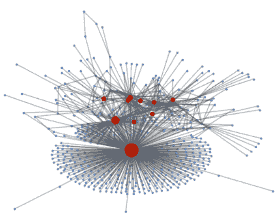

图 12.13 – Binance 社区的特征值中心性

以下信息来自 CSV 文件，通过`Class1_ecentrality`列进行筛选：

| **地址** **或节点** | **class1_ecentrality** | **标签** |
| --- | --- | --- |
| `0x28c6c06298d514db089934071355e5743bf21d60` | `0.669654742` | Binance 14 |
| `0xdac17f958d2ee523a2206206994597c13d831ec7` | `0.198603275` | Tether- USDT 稳定币 |
| `0xa0b86991c6218b36c1d19d4a2e9eb0ce3606eb48` | `0.080423932` | Circle USD |

表 12.4 – 通过 Class1_ecentrality 列筛选的数据

对于 OpenSea 社区，第一个两个地址和其余地址之间的差距较小。作为去中心化结构，得分较为分散。我们可以在主要节点中看到 Wrapped Eth、Uniswap 和一个名为`renethecat.eth`的收藏家的地址（[`opensea.io/ReneTheCat`](https://opensea.io/ReneTheCat)）：

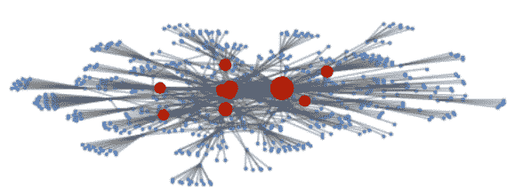

图 12.14 – OpenSea 社区的特征值中心性

以下信息来自 CSV 文件，通过`Class0_ecentrality`列进行筛选：

| **地址** **或节点** | **Class0_ecentrality** | **标签** |
| --- | --- | --- |
| `0x7f268357a8c2552623316e2562d90e642bb538e5` | `0.553669353` | OpenSea: Wyvern Exchange v2 |
| `0xc02aaa39b223fe8d0a0e5c4f27ead9083c756cc2` | `0.227218243` | Wrapped Ether |
| `0x00000000006c3852cbef3e08e8df289169ede581` | `0.208338034` | Seaport 1.1 (OpenSea 基础设施) |
| `0xef1c6e67703c7bd7107eed8303fbe6ec2554bf6b` | `0.17412939` | Uniswap: Universal Router 2 |
| `0x6e785f2fdbdc899f8f08cc1517f82a585b44f9c5` | `0.133520629441651` | renethecat.eth |

表 12.5 – 通过 Class0_ecentrality 列筛选的数据

执行这种类型的分析有助于我们确定特定社区中的影响力节点。影响力的概念取决于上下文。例如，如果我们正在分析一个中心化交易所，我们可以了解他们使用哪些地址作为储备，他们的客户主要使用哪些稳定币，等等。而对于一个去中心化的 NFT 市场，其中个人通过自己的地址进行交易，我们可以识别出收藏家、收藏智能合约等。

根据之前的分析，我们发现一个标记为“rene the cat”的地址具有影响力。如果我们结合 OpenSea 和 X（前 Twitter）的链下信息（这两个 API 在本书的*第三章*和*第四章*中有详细介绍），我们可以检索到以下来自区块链数据的可操作数据：

+   `0x6e785f2fDbdc899F8F08cc1517F82A585b44F9c5`

+   **OpenSea** **收藏**: [`opensea.io/ReneTheCat`](https://opensea.io/ReneTheCat)

+   **Twitter** **账号**: [`twitter.com/mmendiguchiia`](https://twitter.com/mmendiguchiia)

关于展示的说明

有时候，将图形分析结果展示给没有数据背景的观众可能会具有挑战性。通常建议以表格形式展示关键节点，提供一种用户友好的格式，根据所选标准（如最高的接近度、介数中心性等）概览列出的个体。这种方法使我们能够突出在多个排行榜上出现的个体，如本节所示。这样，观众可以轻松识别并理解这些节点的重要性。

通过这一分析，我们已识别出影响力节点。在接下来的部分中，我们将关注被影响的节点，即属于某个社区的节点。

## 节点分类

正如本章介绍所提到的，在处理大型图时，例如不断增长的区块链交易数据，我们可能只有部分节点带有标签。这些标签指示特定的协议、用户兴趣以及市场细分群体。挑战在于扩展标签，使得随着所有节点被添加到网络中，它们可以归属到一个特定的群体或社区。此练习在`Chapter12/Graphsage_node_classification.ipynb`中进行。

在这个特定案例中，我们计划构建一个营销解决方案，但图分析也可以用于发现潜在的欺诈检测或洗钱行为。

在本次练习中，我们将使用 GraphSAGE，它是建立在图卷积网络基础上的模型。GraphSAGE 是一个用于图的归纳式深度学习模型，可以处理新增节点而无需重新训练。这一特性对于不断增长的交易数据特别有利，因为随着新的地址和交易的不断加入，我们不需要生成新的训练数据来为整个网络创建新的模型。GraphSAGE 已在 StellarGraph 库中实现。

GraphSAGE 能够预测新节点的嵌入。为了实现这一点，模型学习聚合器函数，这些函数能够基于节点的特征和其邻域的特性生成新节点的嵌入。

*图 12.15* 显示了我们数据集的简化版本，其中可以观察到两个社区。GraphSAGE 通过对节点的局部邻域进行采样和聚合信息来生成节点嵌入，从而捕捉图中的结构属性和关系。该算法通过考虑邻居节点的嵌入并聚合其信息来迭代更新嵌入。这使得 GraphSAGE 能够在利用局部邻域信息的同时捕捉图的全局结构：

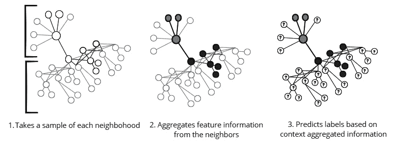

图 12.15 – GraphSAGE 学习步骤

这个过程被称为 *归纳* 学习，因为模型可以推断出一般原则是从一系列观察中得出的，类似于我们大脑的功能。有关该过程的更多技术解释，请参阅本章的 *进一步阅读* 部分。

## 准备工作

对于这个模型，我们需要提供一个 **edges** 数据集和一个 **features** 数据集。

**edges** 数据集与我们在前一部分分析的相同，由与 Binance 14 和 OpenSea 地址交互的交易组成。

`influencers.csv` 文件是 `Chapter12/features.ipynb` 笔记本的输出。从这个数据集中，我们将只使用基于特征标准（如介数中心性、节点度数等）的 30 个最重要节点。对于 edges 数据集中的每个节点，我们将分析它们是否与这 30 个顶级影响力节点有任何交易。

此外，我们将向 Louvain 社区检测算法（包含在 Networkx 库中）提供一个模块化字典，以确定每个节点在 edges 数据集中的社区分配。我们将使用 `best_partition` 函数，它通过 Louvain 启发式方法计算图节点的划分，并最大化模块化。此过程的代码片段如下：

```py
partition = community.best_partition(G)
```

这个过程的结果是一个平衡良好的数据集，其中每个节点有 30 个特征，包括名为 `community` 的目标列，其值为 `0` 和 `1`。这是一个二分类任务，针对两个社区，但也可以用更多类别重新创建这个练习。

## 建模

使用模型的第一步是从数据集创建一个 StellarGraph 对象。可以通过以下代码片段使用这两个数据集创建图形来实现：

```py
from stellargraph import StellarGraph
G = StellarGraph({"features": addresses_no_community}, {"transactions": edges})
```

此外，我们有两个标签：`{'community 0'` 和 `'community 1'}`。这些标签需要进行编码。我们将使用来自 scikit-learn 库的 `binarize` 标签来执行该任务。

与所有机器学习任务一样，我们必须使用传统的`model_selection.train_test_split`函数将数据分割为训练集和测试集，这个函数来自 scikit-learn。

我们将构建一个`GraphSAGENodeGenerator`对象，将采样子图中的节点特征输入到 Keras 中：

```py
graphsage_model = GraphSAGE(
    layer_sizes=[32, 32], generator=generator, bias=True, dropout=0.5,)
```

偏差、dropout 和层的概念在*第六章*中介绍。

预测层将采用 sigmoid 激活函数，因为这是一个二分类问题。如果需要预测更多类别，可以将激活函数改为 softmax：

```py
prediction = layers.Dense(units=train_targets.shape[1], activation="sigmoid")(x_out)
```

## 训练与评估

我们将使用 20 个 epochs 来训练模型。在这里，我们关注的是使用`accuracy`作为评估指标。损失指标是`binary_crossentropy`，这与我们正在处理的二分类任务一致。我们将使用`shuffle`来确保在每个 epoch 前对数据进行洗牌：

```py
history = model.fit(
    train_gen, epochs=20, verbose=2, shuffle=True)
```

由于结果已被编码，要解读它们，我们必须将其转回原始格式。为此，我们可以使用以下代码片段：

```py
target_encoding.inverse_transform(all_predictions)
```

测试集上的准确率为 99%。要查看结果，我们需要创建一个新的 DataFrame，包含两列——一列包含预测的社区，另一列包含实际的标签。该 DataFrame 和混淆矩阵在笔记本中展示。

最后，可以在*进一步阅读*部分找到 GraphSAGE 演示的列表。

# 总结

总结来说，本章深入探讨了图网络的基本原理，探索了节点特征、图的类型及其在数据分析中的重要性。通过理解这些基础概念，我们为进一步探索和分析复杂网络奠定了基础。

在此基础上，我们进一步探索了在由两个不同社区——一个集中化的，如 Binance，另一个去中心化的，如 OpenSea——之间互动形成的图中，有影响力节点的特征。

营销解决方案在 Web3 经济的这一阶段至关重要。像 Spindl 这样的公司正在积极构建工具，旨在弥合 Web2 和 Web3 世界之间的信息与粒度差距。为了实现这一目标，它们集中精力研究归因机制，衡量广告对协议的实际影响。一旦归因完成，就需要识别目标社区以进行营销活动。为了实现这一目标，我们采用了 GraphSAGE 算法进行节点分类任务。这种方法使得有限的标签可以扩展到日益增长的 Web3 交易数据。

这是本书*第二部分*的最后一章。在*第三部分*中，我们将分析一些实际的建议，以便你能够在理解领先公司专业人士观点的同时，开始 Web3 数据科学的职业生涯。

# 进一步阅读

要了解本章中涉及的主题，可以查看以下资源：

+   Stamile, C., Marzullo, A., 和 Deusebio, E.（2021 年）。*图机器学习：通过应用机器学习技术和算法将图数据提升到新高度*。Packt Publishing。

+   Liiv, I.（2021 年）。*加密货币* *区块链的数据科学技术*。Springer。

+   Spindl。（无日期）。*介绍*：[`docs.spindl.xyz/spindl/overview/introduction`](https://docs.spindl.xyz/spindl/overview/introduction)。

+   关于 GraphSAGE：

    +   Ruberts, A.（2021 年 5 月 4 日）。*GraphSAGE 在 Python 中的分类应用*。Well Enough: [`antonsruberts.github.io/graph/graphsage/`](https://antonsruberts.github.io/graph/graphsage/).

    +   Özçelik, R.（2019 年 10 月 25 日）。*GraphSAGE 的直观解释*。Medium: [`towardsdatascience.com/an-intuitive-explanation-of-graphsage-6df9437ee64f`](https://towardsdatascience.com/an-intuitive-explanation-of-graphsage-6df9437ee64f).

+   演示：

    +   *StellarGraph 基础知识 – StellarGraph 1.2.1 文档*。（无日期）。欢迎访问 StellarGraph 文档！– StellarGraph 1.2.1 文档: [`stellargraph.readthedocs.io/en/stable/demos/basics/index.xhtml`](https://stellargraph.readthedocs.io/en/stable/demos/basics/index.xhtml).

    +   *攻击者可追溯性通过图分析在以太坊上的应用*。（2022 年 1 月 27 日）。开放获取研究期刊与论文出版 | Hindawi: [`www.hindawi.com/journals/scn/2022/3448950/`](https://www.hindawi.com/journals/scn/2022/3448950/).

    +   *使用网络图可视化以太坊区块链上的潜在欺诈*。（2022 年 9 月 29 日）。NVIDIA 技术博客: [`developer.nvidia.com/blog/using-network-graphs-to-visualize-potential-fraud-on-ethereum-blockchain/`](https://developer.nvidia.com/blog/using-network-graphs-to-visualize-potential-fraud-on-ethereum-blockchain/).

+   NFT 数据集：

    +   *Blog_scripts/nft_network_analysis_blog_06042022/nft_analytics/nft_analytics_notebook.ipynb* 在主分支 · onthemarkdata/blog_scripts。（无日期）。GitHub: [`github.com/onthemarkdata/blog_scripts/blob/main/nft_network_analysis_blog_06042022/nft_analytics/nft_analytics_notebook.ipynb?nvid=nv-int-txtad-930904-vt46#cid=an01_nv-int-txtad_en-us`](https://github.com/onthemarkdata/blog_scripts/blob/main/nft_network_analysis_blog_06042022/nft_analytics/nft_analytics_notebook.ipynb?nvid=nv-int-txtad-930904-vt46#cid=an01_nv-int-txtad_en-us).

+   NNs（图神经网络）：

    +   Prodramp。（无日期）。*觉得图神经网络（GNN）难以理解吗？试试这个两部分系列*。[视频]。YouTube: [`www.youtube.com/watch?v=YdGN-J322y4`](https://www.youtube.com/watch?v=YdGN-J322y4).

    +   Avkash Chauhan。（无日期）。*你想了解 Python 中的图神经网络（GNN）实现吗？* [视频]。YouTube: [`www.youtube.com/watch?v=VDzrvhgyxsU`](https://www.youtube.com/watch?v=VDzrvhgyxsU).

    +   *DeepWorks/GraphNeuralNetworks/Part2_Example2NodeClassification.ipynb* 位于主分支 · prodramp/DeepWorks。 (无日期)。GitHub: [`github.com/prodramp/DeepWorks/blob/main/GraphNeuralNetworks/Part2_Example2NodeClassification.ipynb`](https://github.com/prodramp/DeepWorks/blob/main/GraphNeuralNetworks/Part2_Example2NodeClassification.ipynb)。

# 第三部分 附录

本书的这一部分，我们将探索如何使用我们已获得的知识。我们将深入研究潜在的职业路径，并从 Web3 数据领域的领袖们那里了解他们的经历——他们如何到达现在的职位、他们对未来的愿景，以及他们看重的专业人士素质。

本部分包含以下章节：

+   *第十三章*，*构建加密数据经验 – BUIDL*

+   *第十四章*，*与 Web3 数据领域领袖的访谈*

+   *附录 1*

+   *附录 2*

+   *附录 3*
