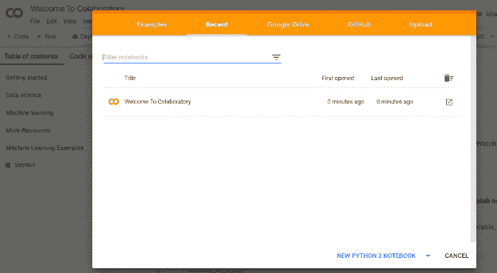
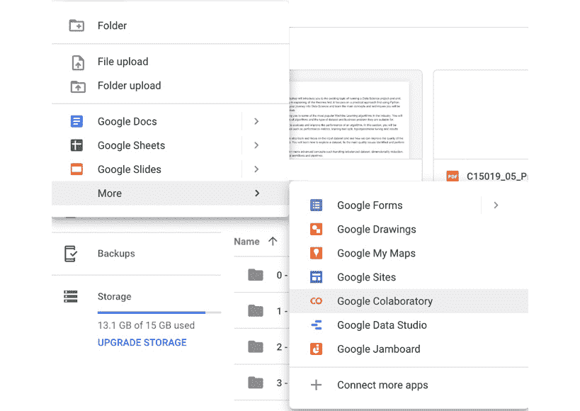
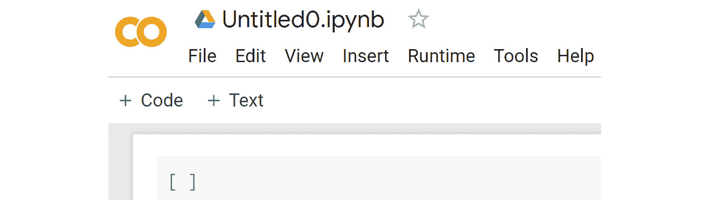
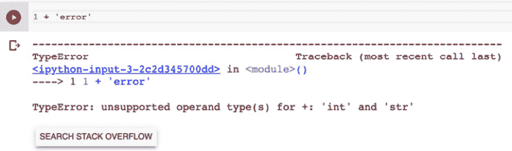
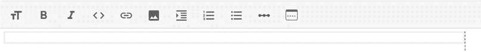
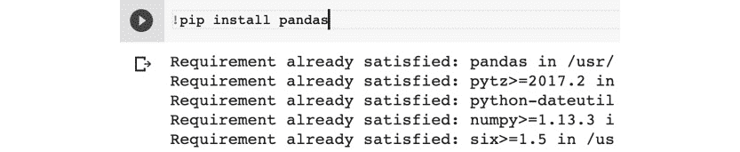

# 前言

# 关于本书

数据无处不在，洞察也随之而来。在如此庞大的数据生成过程中，存在巨大的空间来提取有意义的信息，这些信息将提升业务的生产力和盈利能力。通过学习如何将原始数据转化为改变游戏规则的洞察，你将为自己打开新的职业道路和机会。

*《数据科学工作坊（第二版）》*首先介绍了不同类型的项目，并展示了如何将机器学习算法融入其中。你将学习选择相关的评估指标，甚至评估模型的性能。为了调节算法的超参数并提高其准确性，你将实际操作网格搜索和随机搜索等方法。

最后，你将学习降维技术，轻松处理大量变量，然后探索如何使用模型集成技术并创建新特征以增强模型性能。

本书结束时，你将掌握信心十足地开始数据科学项目的技能。

## 读者群体

本书是一本非常实用的数据科学书籍，适合有志成为数据分析师、数据科学家、数据库工程师和业务分析师的人。它面向那些希望通过快速学习数据科学技巧来启动数据科学职业生涯的人，而无需深入了解机器学习算法背后的数学原理。对 Python 编程语言的基础知识将帮助你轻松理解本书中的概念。

## 关于章节

*第一章*，*Python 中的数据科学简介*，将向你介绍数据科学领域，并带你了解 Python 的核心概念及其在数据科学世界中的应用。

*第二章*，*回归分析*，将使你熟悉线性回归分析及其在数据科学中的实际应用。

*第三章*，*二分类*，将教你一种监督学习技术——分类，用以生成商业成果。

*第四章*，*使用随机森林进行多类分类*，将向你展示如何使用随机森林算法训练一个多类分类器。

*第五章*，*进行第一次聚类分析*，将向你介绍无监督学习任务，在这些任务中，算法必须从数据中自动学习模式，因为事先没有定义目标变量。

*第六章*，*如何评估性能*，将教你如何评估一个模型并在决定将其投入生产之前评估其性能。

*第七章*，*机器学习模型的泛化*，将教你如何通过拆分数据或使用交叉验证，使你的数据更好地用于训练更好的模型。

*第八章*，*超参数调优*，将指导你通过系统评估具有不同超参数的估计器，进一步提升预测性能。

*第九章*，*解释机器学习模型*，将向你展示如何解释机器学习模型的结果，并深入了解它所发现的模式。

*第十章*，*数据集分析*，将向你介绍进行探索性数据分析和可视化数据的技巧，以识别质量问题、潜在的数据转换和有趣的模式。

*第十一章*，*数据准备*，将介绍你可以用来处理数据问题的主要技巧，以确保你的数据质量足够高，适合进行成功建模。

*第十二章*，*特征工程*，将教你在现有数据集上创建新变量的一些关键技巧。

*第十三章*，*不平衡数据集*，将帮助你识别数据集可能不平衡的使用场景，并制定处理不平衡数据集的策略。

*第十四章*，*降维*，将展示如何分析高维数据集，并处理这些数据集带来的挑战。

*第十五章*，*集成学习*，将教你如何将不同的集成学习技术应用于你的数据集。

注

还有三章附加章节，*第十六章*，*机器学习管道*，*第十七章*，*自动特征工程*，和*第十八章*，*使用 Flask 的模型即服务*，你可以在[`packt.live/2ZagB9y`](http://packt.live/2ZagB9y)找到这些章节。

## 约定

文本中的代码词汇、数据库表名、文件夹名、文件名、文件扩展名、路径名、虚拟网址、用户输入和 Twitter 账号名以如下方式显示：

"`sklearn`中有一个名为`train_test_split`的类，它提供了拆分数据的功能。"

你在屏幕上看到的词语，例如菜单或对话框中的内容，也会以相同的格式显示。

代码块的设置如下：

```py
import pandas as pd
from sklearn.model_selection import train_test_split
```

新术语和重要单词以如下方式显示：

“字典包含多个元素，类似于**列表**，但每个元素都是以键值对的形式组织的。”

## 代码展示

跨越多行的代码使用反斜杠（`\`）拆分。当代码执行时，Python 会忽略反斜杠，并将下一行的代码视为当前行的直接延续。

例如：

```py
history = model.fit(X, y, epochs=100, batch_size=5, verbose=1, \
                    validation_split=0.2, shuffle=False)
```

注释被添加到代码中以帮助解释特定的逻辑。单行注释使用`#`符号表示，如下所示：

```py
# Print the sizes of the datasets
print("Number of Examples in the Dataset = ", X.shape[0])
print("Number of Features for each example = ", X.shape[1])
```

多行注释用三个引号括起来，如下所示：

```py
"""
Define a seed for the random number generator to ensure the 
result will be reproducible
"""
seed = 1
np.random.seed(seed)
random.set_seed(seed)
```

## 设置你的环境

在详细探讨本书内容之前，我们需要设置特定的软件和工具。在接下来的部分中，我们将看到如何做到这一点。

### 如何设置 Google Colab

有许多**集成开发环境**（**IDE**）可供 Python 使用。用于数据科学项目的最流行的 IDE 是来自 Anaconda 的 Jupyter Notebook，但这不是我们为本书推荐的工具。当你开始进入数据科学领域时，我们认为与其让你从零开始设置 Python 环境，不如建议你使用即插即用的解决方案，这样你就可以专注于学习本书中介绍的概念。我们希望尽量减少困难，确保你进入数据科学的第一步尽可能简单明了。

幸运的是，确实有这样的工具，它叫做**Google Colab**。这是 Google 提供的一个免费的工具，运行在云端，因此你不需要购买新的笔记本电脑或升级其规格。使用 Colab 的另一个好处是，本书中使用的大多数 Python 包已经安装好，你可以直接使用。你所需要的只是一个 Google 账户。如果你没有账户，可以在这里创建一个：[`packt.live/37mea5X`](https://packt.live/37mea5X)。

然后，你需要订阅 Colab 服务：

1.  首先，登录到 Google Drive：[`packt.live/2TM1v8w`](https://packt.live/2TM1v8w%20)

1.  然后，访问以下网址：[`packt.live/2NKaAuP`](https://packt.live/2NKaAuP%20)

    你应该看到以下屏幕：

    

    图 0.1：Google Colab 介绍页面

1.  然后，你可以点击`NEW PYTHON 3 NOTEBOOK`，你应该会看到一个新的 Colab 笔记本！图 0.2：新的 Colab 笔记本

    

图 0.2：新的 Colab 笔记本

你刚刚将 Google Colab 添加到你的 Google 账户，现在你可以开始编写和执行自己的 Python 代码了。

### 如何使用 Google Colab

现在你已经将 Google Colab 添加到你的账户中，让我们来看看如何使用它。Google Colab 与 Jupyter Notebook 非常相似。它实际上基于 Jupyter，但运行在 Google 的服务器上，并与他们的服务（如 Google Drive）有额外的集成。

要打开新的 Colab 笔记本，你需要登录到你的 Google Drive 账户，然后点击`+ 新建`图标：


图 0.3：打开新笔记本的选项

在显示的菜单中，选择`更多`，然后选择`Google Colaboratory`



图 0.4：从 Google Drive 打开 Colab 笔记本的选项

会创建一个新的 Colab 笔记本。



图 0.5：新的 Colab 笔记本

Colab 笔记本是一个交互式集成开发环境（IDE），你可以在其中运行 Python 代码或使用单元格添加文本。单元格是一个容器，你将在其中添加代码行或与你的项目相关的任何文本信息。在每个单元格中，你可以添加任意数量的代码行或文本。单元格可以显示运行代码后的输出结果，因此它是一种非常强大的测试和检查工作成果的方式。最佳实践是不要将大量代码塞进一个单元格。尽量将代码分割成多个单元格，这样你就可以独立运行它们，并一步一步地检查你的代码是否正常工作。

现在让我们看看如何在单元格中编写一些 Python 代码并运行它。一个单元格由四个主要部分组成：

1.  你将编写代码的文本框

1.  用于运行代码的 `Run` 按钮

1.  提供额外功能的选项菜单

1.  输出显示！图 0.6: Colab 笔记本单元格的部分内容

    

图 0.6: Colab 笔记本单元格的部分内容

在前面的例子中，我们仅编写了一行简单的代码，将 2 加到 3。现在，我们需要点击 `Run` 按钮或使用快捷键 **Ctrl + Enter** 来运行代码。然后，结果将显示在单元格下方。如果你的代码出现错误（当代码出错时），错误信息将显示在单元格下方：



图 0.7: Google Colab 的错误信息

如你所见，我们尝试将一个整数与字符串相加，这是不可能的，因为它们的数据类型不兼容，这正是错误信息所告诉我们的。

要添加一个新的单元格，你只需要点击顶部选项栏上的 `+ Code` 或 `+ Text`：


图 0.8: 新建单元格按钮

如果你添加一个新的 `Text` 单元格，你将能够使用一些特定的选项来编辑文本，例如粗体、斜体、超链接等：



图 0.9: 单元格上的不同选项

这种类型的单元格实际上是支持 Markdown 的。因此，你可以轻松创建标题、副标题、项目符号等。这里有一个链接可以了解更多关于 Markdown 选项的内容: [`packt.live/2NVgVDT`](https://packt.live/2NVgVDT)。

使用单元格选项菜单，你可以删除单元格或将其在笔记本中上下移动：


图 0.10: 单元格选项

如果你需要安装 Google Colab 中没有的特定 Python 包，你只需要运行一个带有以下语法的单元格：

```py
!pip install <package_name>
```

注意

'!' 是一个魔术命令，用于运行 shell 命令。



图 0.11: 使用 "!" 命令

你刚刚学习了 Google Colab 提供的主要功能，用于运行 Python 代码。虽然还有许多其他功能，但你现在已经掌握了足够的知识，可以继续学习本书的内容。

## 访问代码文件

你可以在[`packt.live/2ucwsId`](https://packt.live/2ucwsId)找到本书的完整代码文件。你还可以通过使用[`packt.live/3gfsH76`](https://packt.live/3gfsH76)的互动实验环境，直接在你的网页浏览器中运行许多活动和练习。

我们尽力为所有活动和练习提供互动版本，但对于不支持的情况，我们建议在 Google Colab 上执行代码。

本书中使用的高质量彩色图像可以在[`packt.live/30O91Bd`](https://packt.live/30O91Bd)找到。

如果你在安装过程中遇到任何问题或有任何疑问，请通过电子邮件联系我们：`workshops@packt.com`。
