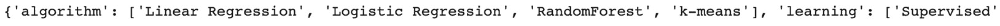
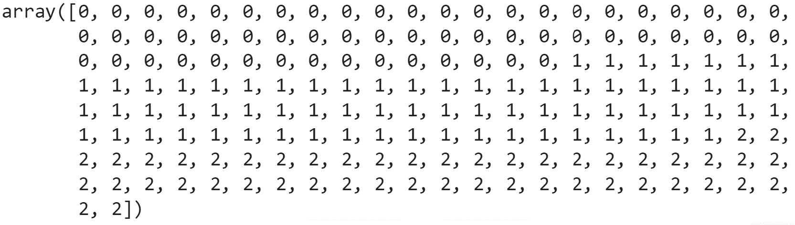
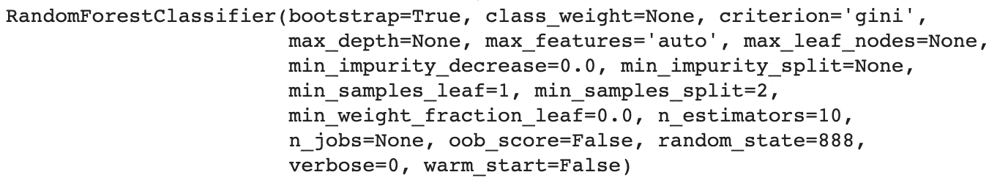

# 第一章：1. Python 中的数据科学介绍

概述

本章将向您介绍数据科学领域，并带您了解 Python 的核心概念及其在数据科学中的应用。

到本章结束时，您将能够解释什么是数据科学，并区分监督学习和无监督学习。您还将能够解释什么是机器学习，并区分回归、分类和聚类问题。您将学会创建和操作不同类型的 Python 变量，包括核心变量、列表和字典。您将能够构建一个`for`循环，使用 f-strings 打印结果，定义函数，导入 Python 包，并使用`pandas`加载不同格式的数据。您还将第一次体验使用 scikit-learn 训练模型。

# 介绍

欢迎来到数据科学的迷人世界！我们相信您一定很兴奋开始您的旅程，学习有趣和激动人心的技术和算法。这正是本书的目的所在。

但在深入之前，让我们定义一下什么是数据科学：它是多个学科的结合，包括商业、统计学和编程，旨在通过运行类似科学研究的控制实验，从数据中提取有意义的见解。

任何数据科学项目的目标都是从数据中提取有价值的知识，以便做出更好的决策。数据科学家有责任定义项目要达成的目标。这需要业务知识和专业技能。在本书中，您将接触到一些来自真实数据集的数据科学任务示例。

统计学是一个用于分析数据并发现模式的数学领域。许多最新和最先进的技术仍然依赖于核心统计方法。本书将向您展示理解我们将要讲解的概念所需的基本技术。

随着数据生成量的指数级增长，处理数据所需的计算能力也在不断增加。这就是为什么编程是数据科学家必备技能的原因。你可能会问，为什么我们在本次工作坊中选择了 Python。那是因为 Python 是数据科学中最流行的编程语言之一。由于其简单易读的语法，学习 Python 编程非常容易。它还拥有大量免费开放的包，例如 pandas、scikit-learn、TensorFlow 和 PyTorch。Python 的社区正以惊人的速度扩展，添加了越来越多的新功能，并提高了性能和可靠性。难怪像 Facebook、Airbnb 和 Google 这样的公司将其作为主要技术栈之一。对于本书而言，不需要事先了解 Python。如果你有一些 Python 或其他编程语言的经验，那会是一个优势，但所有的概念都会完全解释清楚，所以即使你是编程新手也不用担心。

# 数据科学的应用

如前言所述，数据科学是一种多学科的方法，用于分析和识别复杂的模式，并从数据中提取有价值的洞察。运行一个数据科学项目通常涉及多个步骤，包括以下内容：

1.  定义要解决的业务问题

1.  收集或提取现有数据

1.  分析、可视化和准备数据

1.  训练模型以识别数据中的模式并做出预测

1.  评估模型的表现并进行改进

1.  沟通和展示发现的结果及获得的洞察

1.  部署和维护模型

正如其名字所暗示的，数据科学项目需要数据，但实际上，首先定义清晰的业务问题才是最重要的。如果问题没有正确定义，项目可能会导致错误的结果，因为你可能使用了错误的信息，数据没有正确准备，或者让模型学习了错误的模式。因此，正确地与相关方定义数据科学项目的范围和目标是至关重要的。

数据科学在现实世界或商业环境中有很多应用。例如，医疗提供者可能会训练一个模型，根据医学测量数据预测医疗结果或其严重程度，或者一所高中可能想根据学生的历史成绩和过往行为预测哪些学生在一年内有辍学的风险。公司可能希望了解基于客户的历史购买记录，某个客户购买某个产品的可能性。他们也可能需要更好地了解哪些客户更有可能停止使用现有服务并流失。这些都是数据科学可以用来实现明确目标的例子，例如早期发现患有心脏病的患者数量，或者减少六个月后取消订阅的客户数量。这听起来很令人兴奋吧？很快，你也将参与这样的有趣项目。

## 什么是机器学习？

当我们提到数据科学时，通常会想到机器学习，有些人可能不了解它们之间的区别。机器学习是构建能够自我学习模式的算法的领域，而无需明确编程。所以，机器学习是一系列可以在数据科学项目建模阶段使用的技术。

机器学习由三种不同类型的学习组成：

+   有监督学习

+   无监督学习

+   强化学习

### 有监督学习

有监督学习指的是一种任务类型，其中算法根据先前的知识学习模式。这意味着这种学习方式需要提前标注预测的结果（也叫响应变量、因变量或目标变量）。例如，如果你想训练一个预测客户是否会取消订阅的模型，你需要一个数据集，其中包含一个列（或变量），该列已经包含了过去或现有客户的流失结果（取消或未取消）。这个结果必须在模型训练之前由某人进行标注。如果这个数据集包含 5,000 条观测数据，那么所有数据都需要标注好结果。模型的目标是学习这个结果列与其他特征（也叫独立变量或预测变量）之间的关系。以下是此类数据集的示例：


图 1.1：客户流失数据集示例

`Cancel` 列是响应变量。这是你关注的列，你希望模型能够准确预测新输入数据（在这个例子中是新客户）的结果。所有其他列是预测变量。

在经过训练后，模型可能会发现以下模式：当客户订阅 12 个月后，并且其月均消费超过`$50`时，取消订阅的可能性较大。因此，如果一位新客户已经订阅了 15 个月，且每月消费为$85，模型会预测该客户未来会取消合同。

当响应变量包含有限数量的可能值（或类别）时，这是一个分类问题（你将在*第三章，二分类*和*第四章，随机森林多类分类*中了解更多）。模型将学习如何根据独立变量的值预测正确的类别。我们刚才提到的客户流失例子就是一个分类问题，因为响应变量只能取两个不同的值：`yes`或`no`。

另一方面，如果响应变量可以有无限多的可能值，那么这就是回归问题。

回归问题的一个例子是预测某些制造工厂每天生产的手机数量。这个值可能在 0 到无限大的范围内（或一个足够大的范围，以包含大量可能的值），如*图 1.2*所示。


图 1.2：手机生产数据集示例

在上面的图中，你可以看到`日产量`的值可以从`15000`到超过`50000`。这是一个回归问题，我们将在*第二章，回归*中详细讲解。

### 无监督学习

无监督学习是一种不需要任何响应变量的算法。在这种情况下，模型会自行从数据中学习模式。你可能会问，如果没有预先指定目标，它能找到什么样的模式呢？

这种类型的算法通常可以检测变量或记录之间的相似性，因此它会尝试将彼此非常接近的对象进行分组。这类算法可以用于聚类（分组记录）或降维（减少变量数量）。聚类在客户细分中非常流行，算法会根据数据将具有相似行为的客户分组。*第五章*，*执行您的第一次聚类分析*，将带你走过一个聚类分析的例子。

### 强化学习

强化学习是另一种算法，它根据所收到的反馈学习如何在特定环境中采取行动。你可能看过一些视频，算法通过自身训练来玩 Atari 游戏。强化学习技术正被用于教导智能体根据游戏中的奖励或惩罚来决定如何在游戏中行动。

举例来说，在游戏 Pong 中，智能体会在多轮训练后学会不让球掉落，因为每次球掉落时它会受到很高的惩罚。

注意

强化学习算法不在本书的讨论范围内，将不会在本书中涉及。

# Python 概述

如前所述，Python 是数据科学中最流行的编程语言之一。但在深入探讨 Python 在数据科学中的应用之前，让我们快速了解一下 Python 的一些核心概念。

## 变量类型

在 Python 中，你可以处理和操作不同类型的变量。每种变量类型都有其独特性和优势。我们不会逐一介绍所有的变量类型，而是重点讲解本书中你将需要使用的主要变量类型。对于以下每个代码示例，你可以在 Google Colab 中运行代码来查看给定的输出结果。

### 数字变量

最基本的变量类型是数字型。这种变量可以包含整数或小数（或浮动点）数字，并且可以对其执行一些数学运算。

假设我们使用一个名为`var1`的整数变量，它的值是`8`，另一个名为`var2`的变量，其值为`160.88`，我们可以用`+`运算符将它们相加，如下所示：

```py
var1 = 8
var2 = 160.88
var1 + var2
```

你应该得到以下输出：


图 1.3：两个变量相加的输出结果

在 Python 中，你还可以对数字变量执行其他数学运算，例如乘法（使用`*`运算符）和除法（使用`/`运算符）。

### 文本变量

另一个有趣的变量类型是`string`，它包含文本信息。你可以使用单引号或双引号创建一个包含特定文本的变量，如下例所示：

```py
var3 = 'Hello, '
var4 = 'World'
```

为了显示一个变量的内容，你可以调用`print()`函数：

```py
print(var3)
print(var4)
```

你应该得到以下输出：


图 1.4：打印两个文本变量

Python 还提供了一种名为 f-strings 的接口，用于打印带有已定义变量值的文本。当你想要打印结果并附加额外文本使其更易读，或是解释结果时，这非常方便。f-strings 在打印日志时也非常常见。你需要在引号（或双引号）前添加`f`，以指定文本为 f-strings。然后，你可以将现有的变量放在引号内，并显示该变量的值。变量需要用大括号`{}`括起来。

举例来说，如果我们想要在`var3`和`var4`的值前面打印`Text:`，我们将写出以下代码：

```py
print(f"Text: {var3} {var4}!")
```

你应该得到以下输出：


图 1.5：使用 f-strings 打印

你还可以对字符串变量执行一些与文本相关的转换操作，例如将字符大写或替换字符。例如，你可以使用 `+` 运算符将两个变量连接起来：

```py
var3 + var4
```

你应该得到以下输出：


图 1.6：两个文本变量的连接

### Python 列表

另一个非常有用的变量类型是列表。它是一个可以更改的项集合（你可以添加、更新或删除项）。声明一个列表时，你需要使用方括号 `[]`，像这样：

```py
var5 = ['I', 'love', 'data', 'science']
print(var5)
```

你应该得到以下输出：


图 1.7：仅包含字符串项的列表

列表可以包含不同类型的项，因此你可以在其中混合数字和文本变量：

```py
var6 = ['Packt', 15019, 2020, 'Data Science']
print(var6)
```

你应该得到以下输出：


图 1.8：包含数字和字符串项的列表

列表中的项可以通过其索引（在列表中的位置）来访问。要访问列表中的第一个项（索引 0）和第三个项（索引 2），你可以这样做：

```py
print(var6[0])
print(var6[2])
```

注意

在 Python 中，所有索引从 `0` 开始。

你应该得到以下输出：


图 1.9：var6 列表中的第一个和第三个项

Python 提供了一个 API，可以使用 `:` 运算符访问一系列项。你只需要指定运算符左侧的起始索引和右侧的结束索引。结束索引总是被排除在范围之外。所以，如果你想获得前三个项（索引 0 到 2），你应该这样做：

```py
print(var6[0:3])
```

你应该得到以下输出：


图 1.10：var6 中的前三个项

你还可以使用 `for` 循环遍历列表中的每个项。如果你想打印 `var6` 列表中的每个项，你应该这样做：

```py
for item in var6:
    print(item)
```

你应该得到以下输出：


图 1.11：for 循环的输出

你可以使用 `.append()` 方法将项添加到列表的末尾：

```py
var6.append('Python')
print(var6)
```

你应该得到以下输出：


图 1.12：插入 'Python' 项后的 var6 输出

要从列表中删除一项，你可以使用 `.remove()` 方法：

```py
var6.remove(15019)
print(var6)
```

你应该得到以下输出：


图 1.13：删除 '15019' 项后的 var6 输出

### Python 字典

另一个数据科学家非常常用的 Python 变量是字典类型。例如，它可以用来将 JSON 数据加载到 Python 中，然后将其转换为 DataFrame（你将在后续章节中学习更多关于 JSON 格式和 DataFrame 的内容）。字典包含多个元素，类似`{}`，并通过`:`分隔键和值，如下所示：

```py
var7 = {'Topic': 'Data Science', 'Language': 'Python'}
print(var7)
```

你应该得到以下输出：


图 1.14：var7 的输出

要访问特定的值，你需要提供相应的键名。例如，如果你想获取值`Python`，你可以这样做：

```py
var7['Language']
```

你应该得到以下输出：


图 1.15：'Language'键的值

注意

字典中的每个键值对必须是唯一的。

Python 提供了一种方法来访问字典中的所有键名，`.keys()`，其用法如下面的代码片段所示：

```py
var7.keys()
```

你应该得到以下输出：


图 1.16：键名列表

还有一种叫做`.values()`的方法，可以用于访问字典的所有值：

```py
var7.values()
```

你应该得到以下输出：


图 1.17：值的列表

你可以使用`for`循环和`.items()`方法遍历字典中的所有项，如下所示的代码片段所示：

```py
for key, value in var7.items():
    print(key)
    print(value)
```

你应该得到以下输出：


图 1.18：遍历字典项后的输出

你可以通过提供键名来向字典中添加一个新元素，方法如下：

```py
var7['Publisher'] = 'Packt'
print(var7)
```

你应该得到以下输出：


图 1.19：在向字典中添加项目后的输出

你可以使用`del`命令从字典中删除一个项目：

```py
del var7['Publisher']
print(var7)
```

你应该得到以下输出：


图 1.20：在移除一个项目后的字典输出

在*练习 1.01*，*创建一个包含机器学习算法的字典*中，我们将使用刚才学习的这些概念。

注意

如果你有兴趣深入探索 Python，可以访问我们的网站（[`packt.live/2FcXpOp`](https://packt.live/2FcXpOp)）购买 Python 工作坊课程。

## 练习 1.01：创建一个包含机器学习算法的字典

在本练习中，我们将使用 Python 创建一个字典，其中包含本书中将涵盖的不同机器学习算法的集合。

以下步骤将帮助你完成练习：

注意

本书中的每个练习和活动都将在 Google Colab 上执行。

1.  在新的 Colab 笔记本中打开。

1.  创建一个名为`algorithm`的列表，包含以下元素：`Linear Regression`、`Logistic Regression`、`RandomForest`和`a3c`：

    ```py
    algorithm = ['Linear Regression', 'Logistic Regression', \
                 'RandomForest', 'a3c']
    \ ) to split the logic across multiple lines. When the code is executed, Python will ignore the backslash, and treat the code on the next line as a direct continuation of the current line.
    ```

1.  现在，创建一个名为`learning`的列表，包含以下元素：`Supervised`、`Supervised`、`Supervised`和`Reinforcement`：

    ```py
    learning = ['Supervised', 'Supervised', 'Supervised', \
                'Reinforcement']
    ```

1.  创建一个名为`algorithm_type`的列表，包含以下元素：`Regression`、`Classification`、`Regression or Classification`和`Game AI`：

    ```py
    algorithm_type = ['Regression', 'Classification', \
                      'Regression or Classification', 'Game AI']
    ```

1.  使用`.append()`方法将`k-means`项添加到`algorithm`列表中：

    ```py
    algorithm.append('k-means')
    ```

1.  使用`print()`函数显示`algorithm`的内容：

    ```py
    print(algorithm)
    ```

    你应该得到以下输出：

    

    图 1.21：'algorithm' 的输出

    从前面的输出中，我们可以看到我们将`k-means`项添加到列表中。

1.  现在，使用`.append()`方法将`Unsupervised`项添加到`learning`列表中：

    ```py
    learning.append('Unsupervised')
    ```

1.  使用`print()`函数显示`learning`的内容：

    ```py
    print(learning)
    ```

    你应该得到以下输出：

    

    图 1.22：'learning' 的输出

    从前面的输出中，我们可以看到我们将`Unsupervised`项添加到了列表中。

1.  使用`.append()`方法将`Clustering`项添加到`algorithm_type`列表中：

    ```py
    algorithm_type.append('Clustering')
    ```

1.  使用`print()`函数显示`algorithm_type`的内容：

    ```py
    print(algorithm_type)
    ```

    你应该得到以下输出：

    

    图 1.23：'algorithm_type' 的输出

    从前面的输出中，我们可以看到我们将`Clustering`项添加到了列表中。

1.  使用大括号`{}`创建一个空字典`machine_learning`：

    ```py
    machine_learning = {}
    ```

1.  在`machine_learning`中创建一个新项，键为`algorithm`，值为`algorithm`列表中的所有项：

    ```py
    machine_learning['algorithm'] = algorithm
    ```

1.  使用`print()`函数显示`machine_learning`的内容。

    ```py
    print(machine_learning)
    ```

    你应该得到以下输出：

    

    图 1.24：'machine_learning' 的输出

    从前面的输出中，我们注意到已经从`algorithm`列表创建了一个字典。

1.  在`machine_learning`中创建一个新项，键为`learning`，值为`learning`列表中的所有项：

    ```py
    machine_learning['learning'] = learning
    ```

1.  现在，在`machine_learning`中创建一个新项，键为`algorithm_type`，值为`algorithm_type`列表中的所有项：

    ```py
    machine_learning['algorithm_type'] = algorithm_type
    ```

1.  使用`print()`函数显示`machine_learning`的内容。

    ```py
    print(machine_learning)
    ```

    你应该得到以下输出：

    

    图 1.25：'machine_learning' 的输出

1.  使用`.remove()`方法从`algorithm`键中移除`a3c`项：

    ```py
    machine_learning['algorithm'].remove('a3c')
    ```

1.  使用`print()`函数显示来自`machine_learning`字典中的`algorithm`项：

    ```py
    print(machine_learning['algorithm'])
    ```

    你应该得到以下输出：

    

    图 1.26：来自'machine_learning'的'algorithm'输出

1.  使用 `.remove()` 方法从 `learning` 键中移除 `Reinforcement` 项：

    ```py
    machine_learning['learning'].remove('Reinforcement')
    ```

1.  使用 `.remove()` 方法从 `algorithm_type` 键中移除 `Game AI` 项：

    ```py
    machine_learning['algorithm_type'].remove('Game AI')
    ```

1.  使用 `print()` 函数显示 `machine_learning` 的内容：

    ```py
    print(machine_learning)
    ```

    你应该得到以下输出：

    

    ](img/B15019_01_27.jpg)

图 1.27：'machine_learning' 的输出

你已经成功创建了一个包含本书中将遇到的机器学习算法的字典。你学习了如何创建和操作 Python 列表和字典。

注意

要访问此特定部分的源代码，请参阅 [`packt.live/315EmRP`](https://packt.live/315EmRP)。

你也可以在线运行这个示例，网址是 [`packt.live/3ay1tYg`](https://packt.live/3ay1tYg)。

在下一节中，你将学习更多关于数据科学中常用的两个 Python 包：

+   `pandas`

+   `scikit-learn`

# Python 数据科学

Python 为数据科学提供了大量的包。包是由作者（们）公开共享的一组预构建的函数和类。这些包扩展了 Python 的核心功能。Python 包索引（[`packt.live/37iTRXc`](https://packt.live/37iTRXc)）列出了 Python 中所有可用的包。

在本节中，我们将向您展示两种最流行的 Python 包：`pandas` 和 `scikit-learn`。

## pandas 包

pandas 包提供了大量用于操作数据结构的 API。`pandas` 包中定义的两种主要数据结构是 `DataFrame` 和 `Series`。

### DataFrame 和 Series

`DataFrame` 是一种表格数据结构，表现为二维表格。它由行、列、索引和单元格组成。它非常类似于 Excel 表格或数据库中的表格：


](img/B15019_01_28.jpg)

图 1.28：DataFrame 的组成部分

在 *图 1.28* 中，有三列：`algorithm`、`learning` 和 `type`。每列（也称为变量）包含特定类型的信息。例如，`algorithm` 变量列出了不同机器学习算法的名称。

一行存储与一条记录（也称为观察）相关的信息。例如，第 `2` 行（索引号 `2`）表示 `RandomForest` 记录，并且所有与该记录相关的属性都存储在不同的列中。

最后，一个单元格是给定行和列的值。例如，`Clustering` 是第 `2` 行和 `type` 列交叉处的单元格值。你可以将其看作指定行和列的交集。

所以，DataFrame 是一种结构化的数据表示形式，按行和列组织数据。一行代表一个观察，每一列包含该观察的属性值。这是数据科学中最常用的数据结构。

在 pandas 中，DataFrame 由 `DataFrame` 类表示。一个 `pandas` DataFrame 是由 `pandas` Series 组成的，而 `pandas` Series 是一维数组。一个 `pandas` Series 本质上是 DataFrame 中的一列。

数据通常分为两类：*结构化*数据和*非结构化*数据。把结构化数据看作数据库表格或 Excel 表格，其中每一列和每一行都有预定义的结构。例如，在列出公司所有员工的表格或电子表格中，每一条记录都会遵循相同的模式，比如第一列是出生日期，第二列和第三列是名字和姓氏，依此类推。

另一方面，非结构化数据并没有预定义的静态模式进行组织。文本和图像是非结构化数据的好例子。如果你读一本书并查看每个句子，你无法确定句子的第二个词总是动词或人名，它可以是任何东西，这取决于作者如何传达他们想要分享的信息。每个句子都有自己的结构，并且与上一个句子不同。同样，对于一组图像，你无法说像素 20 到 30 总是代表一个人的眼睛或一辆车的车轮：每张图像都不同。

数据可以来自不同的数据源：例如，可能是平面文件、数据存储或应用程序接口（API）馈送。在本书中，我们将处理如 CSV、Excel 电子表格或 JSON 这样的平面文件。所有这些文件类型都有各自的格式和结构来存储信息。

我们先来看一下 CSV 文件。

### CSV 文件

CSV 文件使用逗号字符—`,`—来分隔列，并通过换行符来表示新的一行。前面提到的 DataFrame 示例在 CSV 文件中会像这样：

```py
algorithm,learning,type
Linear Regression,Supervised,Regression
Logistic Regression,Supervised,Classification
RandomForest,Supervised,Regression or Classification
k-means,Unsupervised,Clustering
```

在 Python 中，使用某个包之前，你需要先导入该包。为此，你需要使用 `import` 命令。你还可以使用 `as` 关键字为每个导入的包创建别名。通常会将 `pandas` 包导入并使用别名 `pd`：

```py
import pandas as pd
```

`pandas` 提供了一个 `.read_csv()` 方法，可以轻松地将 CSV 文件直接加载到 DataFrame 中。你只需要提供 CSV 文件的路径或 URL，如下所示。

注意

请注意下面字符串中的斜杠。记住，反斜杠（`\`）用于将代码分割到多行，而正斜杠（`/`）是 URL 的一部分。

```py
pd.read_csv('https://raw.githubusercontent.com/PacktWorkshops'\
            '/The-Data-Science-Workshop/master/Chapter01/'\
            'Dataset/csv_example.csv')
```

你应该得到以下输出：


](img/B15019_01_29.jpg)

图 1.29：加载 CSV 文件后的 DataFrame

注意

在本书中，我们将加载存储在 Packt GitHub 仓库中的数据集：[`packt.live/2ucwsId`](https://packt.live/2ucwsId)。

GitHub 将存储的数据包装成其特定格式。要加载数据集的原始版本，你需要通过点击**Raw**按钮并复制浏览器中提供的 URL 来加载其原始版本。

看看*图 1.30*：


图 1.30：获取 GitHub 上原始数据集的 URL

### Excel 电子表格

Excel 是微软的一个工具，在业界非常流行。它有自己的内部结构，用于记录附加信息，比如每个单元格的数据类型，甚至是 Excel 公式。在`pandas`中，有一个特定的方法用于加载 Excel 电子表格，叫做`.read_excel()`：

```py
pd.read_excel('https://github.com/PacktWorkshops'\
              '/The-Data-Science-Workshop/blob/master'\
              '/Chapter01/Dataset/excel_example.xlsx?raw=true')
```

你应该得到以下输出：


图 1.31：加载 Excel 电子表格后的数据框

### JSON

JSON 是一种非常流行的文件格式，主要用于从 Web API 传输数据。其结构与 Python 字典中的键值对非常相似。我们之前使用的示例数据框在 JSON 格式中将是这样的：

```py
{
  "algorithm":{
     "0":"Linear Regression",
     "1":"Logistic Regression",
     "2":"RandomForest",
     "3":"k-means"
  },
  "learning":{
     "0":"Supervised",
     "1":"Supervised",
     "2":"Supervised",
     "3":"Unsupervised"
  },
  "type":{
     "0":"Regression",
     "1":"Classification",
     "2":"Regression or Classification",
     "3":"Clustering"
  }
}
```

正如你可能猜到的，`pandas`也有一个方法用于读取 JSON 数据，叫做`.read_json()`：

```py
pd.read_json('https://raw.githubusercontent.com/PacktWorkshops'\
             '/The-Data-Science-Workshop/master/Chapter01'\
             '/Dataset/json_example.json')
```

你应该得到以下输出：


图 1.32：加载 JSON 数据后的数据框

`pandas`还提供了更多方法来加载其他类型的文件。完整的列表可以在以下文档中找到：[`packt.live/2FiYB2O`](https://packt.live/2FiYB2O)。

pandas 不仅限于将数据加载到数据框中；它还提供了许多其他 API 来创建、分析或转换数据框。接下来的章节将介绍一些最有用的方法。

## 练习 1.02：将不同格式的数据加载到 pandas 数据框中

在这个练习中，我们将练习加载不同的数据格式，比如 CSV、TSV 和 XLSX 到 pandas 数据框中。我们将使用的数据集是“首次购房者补助金的前 10 个邮政编码”数据集（这是澳大利亚政府为帮助首次购房者提供的补助金）。该数据集列出了获得最多首次购房者补助金的 10 个邮政编码（也称为邮政区号）。

在这个数据集中，你将找到每个邮政编码的首次购房者补助金申请数量和相应的郊区。

注意

该数据集可以在我们的 GitHub 仓库中找到，链接：[`packt.live/2FgAT7d`](https://packt.live/2FgAT7d)。

另外，它可以在此公开访问：[`packt.live/2ZJBYhi`](https://packt.live/2ZJBYhi)。

以下步骤将帮助你完成这个练习：

1.  打开一个新的 Colab 笔记本。

1.  导入 pandas 包，如下所示的代码片段：

    ```py
    import pandas as pd
    ```

1.  创建一个新的变量，命名为`csv_url`，其中包含原始 CSV 文件的 URL：

    ```py
    csv_url = 'https://raw.githubusercontent.com/PacktWorkshops'\
              '/The-Data-Science-Workshop/master/Chapter01'\
              '/Dataset/overall_topten_2012-2013.csv'
    ```

1.  使用 pandas 的 `.read_csv()` 方法将 CSV 文件加载到数据框中。该 CSV 文件的第一行包含文件名，如果你直接打开文件，可以看到这一点。你需要通过使用 `skiprows=1` 参数来排除这一行。将结果保存到名为 `csv_df` 的变量中，并打印出来：

    ```py
    csv_df = pd.read_csv(csv_url, skiprows=1)
    csv_df
    ```

    你应该看到以下输出：

    

    ](img/B15019_01_33.jpg)

    图 1.33：加载 CSV 文件后的数据框

1.  创建一个名为 `tsv_url` 的新变量，包含原始 TSV 文件的 URL：

    ```py
    tsv_url = 'https://raw.githubusercontent.com/PacktWorkshops'\
              '/The-Data-Science-Workshop/master/Chapter01'\
              '/Dataset/overall_topten_2012-2013.tsv'
    ```

    注意

    TSV 文件类似于 CSV 文件，但它使用制表符（`\t`）作为分隔符，而不是使用逗号字符（`,`）。

1.  使用 pandas 的 `.read_csv()` 方法将 TSV 文件加载到数据框中，并指定 `skiprows=1` 和 `sep='\t'` 参数。将结果保存到名为 `tsv_df` 的变量中，并打印出来：

    ```py
    tsv_df = pd.read_csv(tsv_url, skiprows=1, sep='\t')
    tsv_df
    ```

    你应该看到以下输出：

    

    ](img/B15019_01_34.jpg)

    图 1.34：加载 TSV 文件后的数据框

1.  创建一个名为 `xlsx_url` 的新变量，包含原始 Excel 表格的 URL：

    ```py
    xlsx_url = 'https://github.com/PacktWorkshops'\
               '/The-Data-Science-Workshop/blob/master/'\
               'Chapter01/Dataset'\
               '/overall_topten_2012-2013.xlsx?raw=true'
    ```

1.  使用 pandas 的 `.read_excel()` 方法将 Excel 表格加载到数据框中。将结果保存到名为 `xlsx_df` 的变量中，并打印出来：

    ```py
    xlsx_df = pd.read_excel(xlsx_url)
    xlsx_df
    ```

    你应该看到以下输出：

    

    ](img/B15019_01_35.jpg)

    图 1.35：加载 Excel 表格后的数据框显示

    默认情况下，`.read_excel()` 会加载 Excel 表格的第一个工作表。在这个示例中，我们需要的数据实际上存储在第二个工作表中。

1.  使用 pandas 的 `.read_excel()` 方法将 Excel 表格加载到数据框中，并指定 `skiprows=1` 和 `sheet_name=1` 参数。（请注意，`sheet_name` 参数是零索引的，因此 `sheet_name=0` 返回第一个工作表，而 `sheet_name=1` 返回第二个工作表。）将结果保存到名为 `xlsx_df1` 的变量中，并打印出来：

    ```py
    xlsx_df1 = pd.read_excel(xlsx_url, skiprows=1, sheet_name=1)
    xlsx_df1
    ```

    你应该看到以下输出：

    

    ](img/B15019_01_36.jpg)

图 1.36：加载 Excel 表格第二个工作表后的数据框

注意

要访问此特定部分的源代码，请参考 [`packt.live/2Yajzuq`](https://packt.live/2Yajzuq)。

你也可以在线运行此示例，访问 [`packt.live/2Q4dThe`](https://packt.live/2Q4dThe)。

在本练习中，我们学习了如何从不同的文件格式加载首次购房者补贴数据集的前十个邮政编码。

在接下来的部分中，我们将介绍 scikit-learn。

# Scikit-Learn

Scikit-learn（也称为 `sklearn`）是数据科学家们使用的另一个非常流行的包。`sklearn` 的主要目的是提供用于处理数据和训练机器学习算法的 API。但在继续之前，我们需要了解什么是模型。

### 什么是模型？

一个机器学习模型从数据中学习模式，并创建一个数学函数来生成预测。一个监督学习算法将试图找到响应变量和给定特征之间的关系。

请看下面的示例。

数学函数可以表示为一个应用于一些输入变量 X（由多个特征组成）的函数ƒ()，并计算出一个输出（或预测）ŷ：


图 1.37：函数 f(X)

函数ƒ()可以非常复杂，具有不同数量的参数。如果我们以线性回归为例（将在*第二章* *回归*中详细介绍），模型参数可以表示为 W=( w1, w2, ... , wn)。因此，我们之前看到的函数将变成如下：


图 1.38：线性回归的函数

一个机器学习算法将接收一些输入*X*及相关输出*y*的示例，它的目标是找到（w1，w2，...，wn）的值，以最小化其预测*ŷ*与真实输出*y*之间的差异。

前面的公式可能有些令人畏惧，但其实这非常简单。假设我们有一个仅包含一个目标变量 y 和一个特征 X 的数据集，比如下面这个数据集：


图 1.39：具有一个目标变量和一个特征的数据集示例

如果我们在这个数据集上拟合线性回归，算法将尝试为以下方程找到一个解：


图 1.40：线性回归拟合数据集的函数 f(x)

所以，它只需要找到`w0`和`w1`参数的值，使得模型尽可能地拟合数据。在这个例子中，算法可能得出`wo = 0`和`w1 = 10`。因此，模型学习到的函数将如下所示：


图 1.41：使用估算值的函数 f(x)

我们可以在与数据相同的图表上可视化这一点：


图 1.42：在示例数据集上拟合的线性模型

我们可以看到，拟合的模型（橙色线条）与原始数据非常接近。因此，如果我们预测一个新的数据点的结果，它将非常接近真实值。例如，如果我们取一个接近 5 的点（假设它的值是`x = 5.1`和`y = 48`），模型将预测如下：


图 1.43：模型预测

这个值实际上非常接近真实值 48（红色圆圈）。因此，我们的模型预测是非常准确的。

就是这样。很简单，对吧？一般来说，一个数据集会有多个特征，但逻辑是一样的：训练好的模型将尝试为每个变量找到最佳参数，以使预测结果尽可能接近真实值。

我们刚刚看了一个线性模型的示例，但实际上还有其他类型的机器学习算法，比如基于树的算法或神经网络，它们可以从数据中发现更复杂的模式。

### 模型超参数

除了由算法自动学习的模型参数（现在你明白我们为什么称之为机器学习了），还有另一种参数叫做超参数。超参数不能被模型学习，它们是由数据科学家设置的，用于定义算法学习过程中的一些特定条件。这些超参数对于每种算法族都是不同的，它们可以例如帮助加速学习过程或限制过拟合的风险。在本书中，你将学习如何调整一些机器学习超参数。

### sklearn API

如前所述，scikit-learn（或`sklearn`）包实现了大量的机器学习算法，如逻辑回归、k 最近邻、k 均值和随机森林。

注意

不必担心这些术语——你不需要立即了解这些算法的具体内容。在本章中，你将看到一个简单的随机森林示例，但所有这些算法将在本书后续章节中详细讲解。

`sklearn`按算法家族进行分组。例如，`RandomForest`和`GradientBoosting`属于`ensemble`模块。为了使用某个算法，你需要先像这样导入它：

```py
from sklearn.ensemble import RandomForestClassifier
```

`sklearn`之所以如此流行的另一个原因是，所有算法都遵循相同的 API 结构。因此，一旦你学会了如何训练一个算法，训练另一个算法就变得极其容易，几乎不需要改动代码。使用`sklearn`，训练机器学习模型有四个主要步骤：

1.  使用指定的超参数实例化模型：这将配置你想要训练的机器学习模型。

1.  使用训练数据训练模型：在这一步骤中，模型将学习最佳参数，以便使预测结果尽可能接近目标的实际值。

1.  从输入数据预测结果：利用学习到的参数，模型将为新数据预测结果。

1.  评估模型预测的表现：用于检查模型是否学习到正确的模式以获得准确的预测结果。

    注意

    在实际项目中，根据具体情况可能会有更多的步骤，但为了简便起见，我们暂时只讨论这四个步骤。你将在接下来的章节中学习其余的步骤。

如前所述，每个算法都会有自己特定的超参数，可以调整。要实例化模型，你只需要从之前导入的类创建一个新变量，并指定超参数的值。如果你不指定超参数的值，模型将使用`sklearn`指定的默认值。

建议至少设置`random_state`超参数，以便每次运行相同代码时获得可重复的结果：

```py
rf_model = RandomForestClassifier(random_state=1)
```

第二步是使用一些数据来训练模型。在这个例子中，我们将使用一个简单的数据集，该数据集基于 13 个特征将 178 个意大利葡萄酒实例分类为 3 个类别。这个数据集是`sklearn`在其 API 中提供的几个示例之一。我们需要先加载数据：

```py
from sklearn.datasets import load_wine
features, target = load_wine(return_X_y=True)
```

然后使用`.fit()`方法训练模型，你需要提供特征和目标变量作为输入：

```py
rf_model.fit(features, target)
```

你应该得到以下输出：


](img/B15019_01_44.jpg)

图 1.44: 训练好的随机森林模型的日志

在前面的输出中，我们可以看到一个具有默认超参数的随机森林模型。你将在*第四章*，*使用随机森林进行多类别分类*中了解到其中的一些内容。

训练完成后，我们可以使用`.predict()`方法来预测一个或多个观察结果的目标值。在这里，我们将使用与训练步骤相同的数据：

```py
preds = rf_model.predict(features)
preds
```

你应该得到以下输出：



](img/B15019_01_45.jpg)

图 1.45: 训练好的随机森林模型的预测结果

从前面的输出中可以看到，数据集中 178 种不同的葡萄酒已经被分类为三种不同的葡萄酒类别。第一批葡萄酒被分类为类别 0，第二批是类别 1，最后一批是类别 2。此时，我们不知道类别 0、1 或 2 代表什么（在每个类别的“葡萄酒类型”上下文中），但找出这一点将构成更大数据科学项目的一部分。

最后，我们希望通过将模型的预测与目标变量的实际值进行比较，来评估模型的性能。评估模型性能可以使用很多不同的指标，你将在本书的后面了解更多内容。不过，目前我们将使用一个叫做**准确率**的指标。该指标计算正确预测的比例与观察总数的比值：

```py
from sklearn.metrics import accuracy_score
accuracy_score(target, preds)
```

你应该得到以下输出


](img/B15019_01_46.jpg)

图 1.46: 训练好的随机森林模型的准确性

在这个示例中，随机森林模型学会了正确预测该数据集中的所有观察结果；它达到了`1`的准确率（即 100%的预测与实际真实值匹配）。

就这么简单！这可能看起来太完美了。接下来的章节中，你将学习如何检查训练的模型是否能准确预测未见过或未来的数据点，或者它们是否仅仅学习了特定输入数据的模式（这也叫过拟合）。

## 练习 1.03：使用 sklearn 从数据集中预测乳腺癌

在这个练习中，我们将使用`sklearn`中的`RandomForest`构建一个机器学习分类器，预测患者的乳腺癌是恶性（有害）还是良性（无害）。

我们将使用的数据集是乳腺癌威斯康星（诊断）数据集，可以直接从`sklearn`包中获取，网址：[`packt.live/2FcOTim`](https://packt.live/2FcOTim)。

以下步骤将帮助你完成练习：

1.  打开一个新的 Colab 笔记本。

1.  从`sklearn.datasets`导入`load_breast_cancer`函数：

    ```py
    from sklearn.datasets import load_breast_cancer
    ```

1.  使用`load_breast_cancer`函数并设置`return_X_y=True`参数来加载数据集，仅返回特征和响应变量：

    ```py
    features, target = load_breast_cancer(return_X_y=True)
    ```

1.  打印`features`变量：

    ```py
    print(features)
    ```

    你应该得到以下输出：

    

    图 1.47：特征变量的输出

    上面的输出显示了特征的值。（你可以从之前提供的链接中了解更多关于特征的信息。）

1.  打印`target`变量：

    ```py
    print(target)
    ```

    你应该得到以下输出：

    

    图 1.48：目标变量的输出

    上面的输出显示了目标变量的值。数据集中每个实例有两个类别，这两个类别是`0`和`1`，表示癌症是恶性还是良性。

1.  从`sklearn.ensemble`导入`RandomForestClassifier`类：

    ```py
    from sklearn.ensemble import RandomForestClassifier
    ```

1.  创建一个名为`seed`的新变量，赋值为`888`（任意选择）：

    ```py
    seed = 888
    ```

1.  使用`random_state=seed`参数实例化`RandomForestClassifier`，并将其保存到名为`rf_model`的变量中：

    ```py
    rf_model = RandomForestClassifier(random_state=seed)
    ```

1.  使用`.fit()`方法训练模型，并将`features`和`target`作为参数：

    ```py
    rf_model.fit(features, target)
    ```

    你应该得到以下输出：

    

    图 1.49：随机森林分类器的日志

1.  使用经过训练的模型，通过`.predict()`方法并将`features`作为参数进行预测，并将结果保存到名为`preds`的变量中：

    ```py
    preds = rf_model.predict(features)
    ```

1.  打印`preds`变量：

    ```py
    print(preds)
    ```

    你应该得到以下输出：

    

    图 1.50：随机森林模型的预测结果

    上面的输出显示了训练集的预测结果。你可以将其与实际的目标变量值（如*图 1.48*所示）进行比较。

1.  从`sklearn.metrics`导入`accuracy_score`方法：

    ```py
    from sklearn.metrics import accuracy_score
    ```

1.  使用`target`和`preds`作为参数计算`accuracy_score()`：

    ```py
    accuracy_score(target, preds)
    ```

    你应该得到以下输出：

    

图 1.51：模型的准确率

注意

若要访问此特定部分的源代码，请参考[`packt.live/3aBso5i`](https://packt.live/3aBso5i)。

你也可以在线运行此示例，网址为[`packt.live/316OiKA`](https://packt.live/316OiKA)。

你刚刚使用`sklearn` API 训练了一个随机森林模型，并成功地将乳腺癌观察数据分类，取得了准确率为`1`的成绩。

## 活动 1.01：训练垃圾邮件检测算法

你正在为一家电子邮件服务提供商工作，任务是训练一个算法，该算法可以从给定的数据集中识别一封邮件是否为垃圾邮件，并检查其性能。

在这个数据集中，作者们已经根据相关关键词的某些统计数据创建了 57 个不同的特征，以便分类判断一封邮件是否是垃圾邮件。

注意

数据集最初由 Mark Hopkins、Erik Reeber、George Forman 和 Jaap Suermondt 共享：[`packt.live/35fdUUA`](https://packt.live/35fdUUA)。

你可以从 Packt GitHub 下载，网址为[`packt.live/2MPmnrl`](https://packt.live/2MPmnrl)。

以下步骤将帮助你完成此活动：

1.  导入所需的库。

1.  使用`.pd.read_csv()`加载数据集。

1.  使用`.pop()`从`pandas`提取响应变量。此方法将从 DataFrame 中提取作为参数提供的列。然后你可以为其分配一个变量名，例如`target = df.pop('class')`。

1.  实例化`RandomForestClassifier`。

1.  训练一个随机森林模型来预测结果，使用`.fit()`。

1.  使用`.predict()`从输入数据中预测结果。

1.  使用`accuracy_score`计算准确率。

    输出将类似于以下内容：

    

图 1.52：垃圾邮件检测器的准确率

注意

此活动的解决方案可以在以下地址找到：[`packt.live/2GbJloz`](https://packt.live/2GbJloz)。

# 概述

本章为你提供了数据科学的总体概述。我们还学习了不同类型的机器学习算法，包括有监督学习和无监督学习，以及回归和分类。我们简要介绍了 Python，并讲解了如何操作本书中将使用的主要数据结构（列表和字典）。

接着，我们带你了解了 DataFrame 是什么，以及如何通过使用著名的 pandas 包从不同文件格式加载数据来创建 DataFrame。最后，我们学习了如何使用 sklearn 包来训练机器学习模型并进行预测。

这只是快速了解数据科学迷人世界的一瞥。在本书中，你将学习更多内容，并发现处理数据科学项目从头到尾的新技术。

下一章将向你展示如何在一个实际数据集上执行回归任务。
