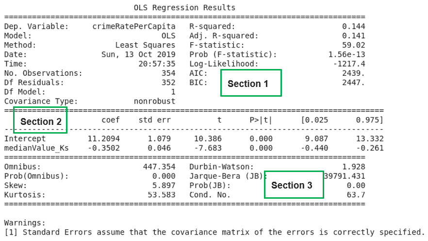

# 第二章：2. 回归

概述

本章是对线性回归分析的介绍，以及它在数据科学中的实际应用。您将学习如何使用 Python 这一多功能编程语言进行回归分析并检查结果。还将介绍使用对数函数转换变量之间固有的非线性关系，以便能够应用线性回归分析方法。

在本章结束时，您将能够识别和导入回归分析所需的 Python 模块；使用 `pandas` 模块加载数据集并为回归分析做准备；创建双变量数据的散点图并拟合回归线；使用 Python `statsmodels` 模块中可用的方法将回归模型拟合到数据集；解释简单和多元线性回归分析的结果；评估线性回归模型的拟合优度；并将线性回归分析作为解决实际问题的工具。

# 介绍

上一章介绍了 Python 编程的基础知识和数据科学领域的概述。数据科学是一个相对年轻的跨学科研究领域。它借鉴了传统的统计学、计算机科学和广泛的人工智能（AI）领域的概念和方法，尤其是人工智能的子领域——机器学习：


](img/B15019_02_01.jpg)

图 2.1：数据科学模型

如您在*图 2.1*中所见，数据科学旨在利用**结构化**和**非结构化**数据，开发能够有效使用的模型，进行预测，并为决策提供见解。

对结构化数据的宽泛描述是任何能够方便地安排成由行和列组成的表格的数据。这种数据通常存储在数据库管理系统中。

然而，非结构化数据不能方便地以表格形式存储——这样的数据集的一个例子是文本文件。为了实现数据科学的目标，需要一种灵活的编程语言，能够有效地将交互性与计算能力和速度相结合。这正是 Python 编程语言满足数据科学需求的地方，正如*第一章*《Python 中的数据科学入门》中提到的，我们将在本书中使用 Python。

需要开发模型以进行预测和获得决策见解的需求横跨许多行业。因此，数据科学正在许多行业中得到应用，包括医疗保健、制造业、一般过程行业、银行和金融部门、市场营销和电子商务、政府以及教育。

在本章中，我们将特别讨论回归分析，它是数据科学中常用的关键方法之一，用于建模变量之间的关系，其中**目标变量**（即你要寻找的值）是一个实数。

假设一个房地产公司希望了解并且如果可能的话，建模城市中房产价格与房产关键属性之间的关系。这是一个数据科学问题，可以通过回归来解决。

这是因为感兴趣的目标变量，即房产价格，是一个实数。可以用来预测房产价值的关键属性示例如下：

+   房产的年龄

+   房产的卧室数量

+   房产是否有游泳池

+   房产所占土地的面积

+   房产距离铁路站和学校等设施的距离

回归分析可以用于研究这种情况，你需要创建一个函数，将房产的关键属性映射到目标变量，在这个例子中，目标变量是房产的价格。

回归分析是属于机器学习技术中的一个类别，叫做**监督机器学习**。之所以叫做监督，是因为学习模型的机器学习算法会提供一个类似于*问题*和*答案*的数据集供其学习。这里的*问题*是关键属性，而*答案*则是用于研究的每个房产的价格，如下图所示：


图 2.2：监督学习技术的示例

一旦算法学习了模型，我们就可以向模型提供一个问题（即一组房产属性，我们希望找出其价格），让它告诉我们该房产的价格（即答案）是多少。

本章介绍了线性回归及其如何应用于解决数据科学中像前面描述的实际问题。Python 提供了丰富的模块（库），可以用来进行各种类型的严谨回归分析。在本章中，我们将使用以下 Python 模块，当然还有其他模块：`pandas`、`statsmodels`、`seaborn`、`matplotlib`和`scikit-learn`。

# 简单线性回归

在*图 2.3*中，你可以看到波士顿市的人均犯罪率和业主自住房屋的中位数价值，波士顿是马萨诸塞州最大的城市。我们希望通过回归分析来了解影响该市犯罪率的因素。

这样的分析对政策制定者和社会整体非常有用，因为它有助于决策，推动减少犯罪率的措施，并有望在整个社区消除犯罪。这可以使社区更加安全，提高社会的生活质量。

这是一个数据科学问题，属于有监督机器学习类型。存在一个因变量`犯罪率`（我们将其表示为*Y*），我们试图理解其变化，并将其与一个自变量`业主自住房屋中位数价值`（我们将其表示为*X*）联系起来。

换句话说，我们试图根据不同的邻里情况，理解犯罪率的变化。

回归分析是寻找一个函数，在给定假设条件下，最好地描述因变量（在本例中为*Y*）与自变量（在本例中为*X*）之间的关系。

当自变量只有一个，且假设因变量与自变量之间的关系为直线时，如*图 2.3*所示，这种回归分析称为**简单线性回归**。直线关系被称为回归线或**最佳**拟合线：


图 2.3：犯罪率与业主自住房屋中位数价值的散点图

在*图 2.3*中，回归线以实心黑色线条表示。忽略回归线与图中数据拟合的较差质量，我们可以看到随着业主自住房屋中位数价值的增加，每人犯罪率有所下降。

从数据科学的角度来看，这一观察可能引发许多问题。例如，是什么原因导致每人犯罪率随着业主自住房屋中位数价值的增加而下降？较富裕的郊区和城镇是否比经济条件较差的郊区和城镇获得更多的警力资源？不幸的是，这些问题无法通过像*图 2.3*中的简单图表来解答。但观察到的趋势可能作为讨论的起点，用于审视警力和社区安全资源的分配情况。

回到回归线拟合数据的效果问题，显然回归线的近三分之一处没有任何数据点分布在其周围。许多数据点仅仅聚集在横轴上，接近零（`0`）犯罪率的位置。这并不是你所期待的一个良好的回归线应该有的效果。一个良好的回归线应该能够很好地拟合数据，且应当位于一片*数据点云*之中。

看起来每人犯罪率与业主自住房屋中位数价值之间的关系，并不像你最初想的那样呈线性关系。

在本章中，我们将学习如何使用对数函数（一种用于转换数值的数学函数）将人均犯罪率与自有住房中位数之间的关系线性化，从而改善回归线与散点图数据点的拟合度。

到目前为止，我们忽略了一个非常重要的问题。也就是，*如何为给定的数据集确定回归线？*

确定回归线的常用方法叫做最小二乘法，接下来将介绍该方法。

## 最小二乘法

简单线性回归线通常呈现出*图 2.4*所示的形式，其中 β0 和 β1 是未知常数，分别表示回归线的截距和斜率。

截距是当自变量（X）为零时因变量（Y）的值。斜率是自变量（X）变化一个单位时因变量（Y）变化的速率。未知常数称为 `≈`）在*图 2.4*中。该模型被称为概率模型，因为它没有模拟因变量（Y）中的所有变异性：


图 2.4：简单线性回归方程

计算实际因变量值与预测因变量值之间的差异，得到的误差通常称为残差（ϵi）。

对样本中的每个数据点重复此计算，每个数据点的残差（ϵi）可以被平方，以消除代数符号，并加在一起以得到**误差平方和**（ESS）。

最小二乘法旨在最小化误差平方和（ESS）。

# 多元线性回归

在前面讨论的简单线性回归中，我们只有一个自变量。如果我们在分析中包含多个自变量，就得到一个多元线性回归模型。多元线性回归的表示方式类似于简单线性回归。

假设我们要拟合一个包含三个自变量 X1、X2 和 X3 的线性回归模型。多元线性回归方程的公式将如下所示，如*图 2.5*所示：


图 2.5：多元线性回归方程

每个自变量将有自己的系数或参数（即 β1、β2 或 β3）。β 系数告诉我们，如果其他自变量保持不变，某个自变量的变化如何影响因变量。

## 回归系数估计（β0、β1、β2 和 β3）

*图 2.5*中的回归系数是使用与介绍简单线性回归时讨论的最小二乘法相同的方法估计的。为了满足最小二乘法的要求，所选的系数必须最小化平方残差的和。

在本章稍后，我们将利用 Python 编程语言实际计算这些系数估计值。

## 变量的对数变换

如前所述，依赖变量与自变量之间的关系有时并不是线性的。这限制了线性回归的使用。为了解决这个问题，根据关系的性质，可以使用对数函数来变换感兴趣的变量。这样变换后的变量通常与其他未变换的变量呈线性关系，从而使得可以使用线性回归来拟合数据。本书后续的练习中将通过实践展示这一点。

## 相关矩阵

在*图 2.3*中，我们看到如何通过直线图分析两个变量之间的线性关系。另一种可视化变量之间线性关系的方法是使用相关矩阵。相关矩阵是一种数字交叉表，显示了变量对之间的相关性，也就是两个变量之间的关联程度（可以理解为一个变量的变化如何导致另一个变量的变化）。分析表格中的原始数据并不容易。因此，相关矩阵可以转换为“热图”的形式，便于通过不同的颜色观察变量之间的相关性。*练习 2.01*中展示了这一点，*加载并准备数据以供分析*。

# 使用 Python 进行回归分析

在讨论了回归分析的基础知识后，现在是时候动手实践，使用 Python 进行实际的回归分析了。

为了开始我们的分析，我们需要在 Python 中启动一个会话，并加载所需的相关模块和数据集。

本章中我们进行的所有回归分析都将基于波士顿住房数据集。该数据集适合教学，且适用于线性回归分析。它呈现了一个足够的挑战性，需要使用对数函数来变换变量，以便更好地拟合数据。该数据集包含了波士顿地区一组房产的信息，可以用来确定特定房产的不同属性如何影响其价值。

波士顿住房数据集 CSV 文件的列标题可以解释如下：

+   CRIM – 每个城镇的人均犯罪率。

+   ZN – 划定为超过 25,000 平方英尺的住宅用地比例。

+   INDUS – 每个城镇的非零售商业用地比例。

+   CHAS – 查尔斯河虚拟变量（= 1 如果区域边界接壤河流；否则为 0）

+   NOX – 一氧化氮浓度（单位：每千万分之一）

+   RM – 每个住宅的平均房间数

+   AGE – 1940 年之前建造的自有住房单元比例

+   DIS – 到五个波士顿就业中心的加权距离

+   RAD – 通向辐射公路的可达性指数

+   TAX – 每 $10,000 的全额财产税税率

+   PTRATIO – 按城镇划分的师生比

+   LSTAT – 低收入人群所占百分比

+   MEDV – 自有住房的中位数价格（单位：千美元）

我们使用的数据集是原始数据集的轻微修改版本，来自于 [`packt.live/39IN8Y6`](https://packt.live/39IN8Y6)。

## 练习 2.01：加载并准备数据进行分析

在本练习中，我们将学习如何将 Python 模块和我们需要的分析数据集加载到 Python 会话中，并准备数据进行分析。

注意

我们将在本章中使用波士顿房价数据集，您可以在我们的 GitHub 仓库找到它，链接：[`packt.live/2QCCbQB`](https://packt.live/2QCCbQB)。

以下步骤将帮助您完成此练习：

1.  打开一个新的 Colab 笔记本文件。

1.  通过将以下代码片段输入到一个 Colab 笔记本单元中，加载所需的 Python 模块。按 `matplotlib` 显示代码在笔记本环境中的图形输出。接下来的代码行使用 `import` 关键字将各种 Python 模块加载到我们的编程环境中。这些模块包括 `patsy`，它是一个 Python 模块。为了方便引用，某些模块被赋予别名，例如 `seaborn` 模块的别名是 `sns`。因此，当我们在后续代码中引用 `seaborn` 时，使用别名 `sns`。`patsy` 模块没有使用别名，因此在代码中需要时，我们使用 `patsy` 的全名。

    `plot_corr` 和 `train_test_split` 函数分别从 `statsmodels.graphics.correlation` 和 `sklearn.model_selection` 模块导入。最后的语句用于设置 `matplotlib` 生成的图表的美学外观，使其与 `seaborn` 模块显示的类型一致。

1.  接下来，加载 `Boston.CSV` 文件，并通过运行以下代码将变量名 `rawBostonData` 分配给它：

    ```py
    rawBostonData = pd.read_csv\
                    ('https://raw.githubusercontent.com/'\
                     'PacktWorkshops/The-Data-Science-'\
                     'Workshop/master/Chapter02/'\
                     'Dataset/Boston.csv')
    ```

1.  检查 DataFrame 中的前五条记录：

    ```py
    rawBostonData.head()
    ```

    您应该得到以下输出：

    

    图 2.6：数据集的前五行

1.  检查 DataFrame 中是否存在缺失值（*null* 值），然后删除这些值以获得干净的数据集。使用 pandas 方法 `dropna()` 来查找并移除这些缺失值：

    ```py
    rawBostonData = rawBostonData.dropna()
    ```

1.  检查 DataFrame 中是否存在重复记录，然后删除它们以获得干净的数据集。使用 pandas 中的 `drop_duplicates()` 方法：

    ```py
    rawBostonData = rawBostonData.drop_duplicates()
    ```

1.  列出 DataFrame 的列名，以便您检查数据集中的字段，并在必要时修改为有意义的名称：

    ```py
    list(rawBostonData.columns)
    ```

    您应该得到以下输出：

    

    图 2.7：列出所有列名

1.  重命名数据框的列，使其具有意义。请注意精确匹配列名，甚至在名称字符串中留空格也会导致错误。例如，字符串`ZN`前后有空格，它与`ZN`不同。重命名后，打印新的数据框头部，如下所示：

    ```py
    renamedBostonData = rawBostonData.rename\
                        (columns = {\
                         'CRIM':'crimeRatePerCapita',\
                         ' ZN ':'landOver25K_sqft',\
                         'INDUS ':'non-retailLandProptn',\
                         'CHAS':'riverDummy',\
                         'NOX':'nitrixOxide_pp10m',\
                         'RM':'AvgNo.RoomsPerDwelling',\
                         'AGE':'ProptnOwnerOccupied',\
                         'DIS':'weightedDist',\
                         'RAD':'radialHighwaysAccess',\
                         'TAX':'propTaxRate_per10K',\
                         'PTRATIO':'pupilTeacherRatio',\
                         'LSTAT':'pctLowerStatus',\
                         'MEDV':'medianValue_Ks'})
    renamedBostonData.head()
    ```

    你应该得到以下输出：

    

    图 2.8：数据框被重命名

    注意

    上述输出已被截断。请前往 GitHub 仓库查看完整的输出。

1.  使用`.info()`函数检查数据框中各列的数据类型：

    ```py
    renamedBostonData.info()
    ```

    你应该得到以下输出：

    

    图 2.9：数据集中的不同数据类型

    输出显示数据集共有`506`行（`Int64Index: 506 entries`）。共有`13`列（`Data columns`）。`13`列中没有任何一列有缺失值（所有`506`行都是*非空*）。10 列具有浮动（小数）类型数据，3 列具有整数类型数据。

1.  现在，计算数据框中数值列的基本统计数据：

    ```py
    renamedBostonData.describe(include=[np.number]).T
    ```

    我们使用了 pandas 函数`describe`，该函数用于计算数据框中数值字段的简单统计数据（包括任何具有`numpy`数值数据类型的字段）。统计数据包括最小值、最大值、每列的行数、每列的平均值（均值）、第 25 百分位数、第 50 百分位数和第 75 百分位数。我们通过转置（使用`.T`函数）`describe`函数的输出，以获得更好的布局。

    你应该得到以下输出：

    

    图 2.10：数值列的基本统计数据

1.  将数据框划分为训练集和测试集，如下代码片段所示：

    ```py
    X = renamedBostonData.drop('crimeRatePerCapita', axis = 1)
    y = renamedBostonData[['crimeRatePerCapita']]
    seed = 10 
    test_data_size = 0.3 
    X_train, X_test, \
    y_train, y_test = train_test_split(X, y, \
                                       test_size = test_data_size, \
                                       random_state = seed)
    train_data = pd.concat([X_train, y_train], axis = 1)
    test_data = pd.concat([X_test, y_test], axis = 1)
    ```

    我们选择了 30%的测试数据大小，即`0.3`。使用`train_test_split`函数实现这一点。我们设置了随机数生成器的种子，以便每次运行此代码时都能获得可重复的划分。这里使用了一个任意值`10`。在构建模型时，将用于开发模型的数据集至少划分为两部分是一种良好的做法。一部分用于开发模型，称为训练集（`X_train`和`y_train`合并）。

    注意

    将数据分割为训练和测试子集允许您使用部分数据来训练模型（即，它允许您构建一个学习变量之间关系的模型），其余数据用于测试模型（即，查看新数据给出时您的新模型能够做出多好的预测）。您将在本书中始终使用训练-测试拆分，并且这个概念将在*第七章，机器学习模型的泛化*中详细解释。

1.  计算并绘制 `train_data` 集的相关矩阵：

    ```py
    corrMatrix = train_data.corr(method = 'pearson')
    xnames=list(train_data.columns)
    ynames=list(train_data.columns)
    plot_corr(corrMatrix, xnames=xnames, ynames=ynames,\
              title=None, normcolor=False, cmap='RdYlBu_r')
    ```

    在前述代码片段中，*第 4 行* 使用反斜杠字符`\` 的目的是在 Python 中强制将代码延续到新的行。如果您在笔记本中将整行代码输入到单行中，则不需要`\`字符。

    您应该得到以下输出：

    

图 2.11：预期热力图输出

在上述热力图中，我们可以看到具有橙色或红色方块的变量之间存在强正相关（一个变量的增加导致另一个变量的增加）。具有蓝色方块的变量之间存在强负相关（一个变量的增加导致另一个变量的减少）。具有浅色方块的变量之间几乎没有相关性。例如，`nitrixOxide_pp10m` 和 `non-retailLandProptn` 之间似乎存在相对较强的相关性，但 `riverDummy` 和任何其他变量之间的相关性较低。

注意

要访问本节的源代码，请参阅 [`packt.live/320HLAH`](https://packt.live/320HLAH)。

您也可以在 [`packt.live/34baJAA`](https://packt.live/34baJAA) 上在线运行此示例。

我们可以利用相关矩阵的发现作为进一步回归分析的起点。热力图为我们提供了数据关系的良好概述，并能显示我们在调查中应关注的变量。

## 相关系数

在前一练习中，我们已经看到如何使用相关矩阵热力图来可视化变量对之间的关系。我们也可以用数值形式看到这些相同的关系，使用原始的相关系数数字。这些数值介于-1 和 1 之间，表示两个变量之间的密切程度。

Pandas 提供了一个 `corr` 函数，当在 DataFrame 上调用时提供所有数值数据类型的相关性矩阵（表）。在我们的情况下，在 Colab 笔记本中运行代码 `train_data.corr(method='pearson')` 提供了 *图 2.12* 的结果。

注意

Pearson 是衡量变量之间关系的标准相关系数。

值得注意的是，*图 2.12* 沿左对角线是对称的。左对角线的值是特征与自身之间的相关系数（因此它们的值都是 1），所以这些值与我们的分析无关。*图 2.12* 中的数据即为在 *练习 2.01* 中 *加载和准备数据进行分析* 的 *步骤 12* 输出中的绘图展示。

您应获得以下输出：


图 2.12：训练数据集的相关矩阵

注意

上述输出已被截断。

数据科学家使用相关系数作为统计量，以衡量两个数值变量 X 和 Y 之间的线性关系。双变量数据样本的相关系数通常用 r 表示。在统计学中，衡量两个数值变量之间相关性的常见方法是使用 Pearson 相关系数。因此，本章中任何提及相关系数的地方，均指代 Pearson 相关系数。

为了实际计算本课程中数据集变量的相关系数统计量，我们使用 Python 函数。对本讨论来说，重要的是我们计算的相关系数所取值的含义。相关系数 (r) 的值范围在 +1 和 -1 之间。

当 r 等于 +1 时，X 和 Y 之间的关系是，X 和 Y 会完美地朝同一方向同时增加或减少。当 r 等于 -1 时，X 和 Y 之间的关系是，X 的增加与 Y 的减少完全相对应，反之亦然。当 r 等于零（0）时，X 和 Y 之间没有线性关系。

X 和 Y 之间没有线性关系并不意味着 X 和 Y 没有关系；相反，这意味着如果存在任何关系，它不能用直线来描述。在实践中，相关系数值在 0.6 或更高（或 -0.6 或更低）时，通常是 X 和 Y 之间潜在的线性关系的标志。

*练习 2.01* 的最后一列输出，*加载和准备数据进行分析*，*步骤 12*，提供了犯罪率与其他特征之间的 r 值，并通过颜色深浅展示。通过颜色条可以明显看出，`radialHighwaysAccess`、`propTaxRate_per10K`、`nitrixOxide_pp10m` 和 `pctLowerStatus` 与犯罪率之间具有最强的相关性。这表明犯罪率与这些自变量之间可能存在一种线性关系，值得进一步研究。

## 练习 2.02：使用 Python 进行线性关系的图形化探究

配有回归线的散点图是数据科学家可以用来快速可视化因变量与自变量之间可能相关性的方式。

这次练习的目标是使用该技术来调查波士顿市区内每个镇的犯罪率与自有住房的中位数价值之间可能存在的线性关系。

以下步骤将帮助你完成练习：

1.  打开一个新的 Colab 笔记本文件，并执行到包括*步骤 11*在内的 *练习 2.01*，*加载和准备数据以进行分析*。如下代码块所示，从导入语句开始：

    ```py
    %matplotlib inline
    import matplotlib as mpl
    import seaborn as sns
    import matplotlib.pyplot as plt
    import statsmodels.formula.api as smf
    import statsmodels.graphics.api as smg
    import pandas as pd
    import numpy as np
    import patsy
    from statsmodels.graphics.correlation import plot_corr
    from sklearn.model_selection import train_test_split
    plt.style.use('seaborn')
    ```

    加载和预处理数据：

    ```py
    rawBostonData = pd.read_csv\
                    ('https://raw.githubusercontent.com/'\
                     'PacktWorkshops/The-Data-Science-'\
                     'Workshop/master/Chapter02/'
                     'Dataset/Boston.csv')
    rawBostonData = rawBostonData.dropna()
    rawBostonData = rawBostonData.drop_duplicates()
    renamedBostonData = rawBostonData.rename\
                        (columns = {\
                         'CRIM':'crimeRatePerCapita',\
                         ' ZN ':'landOver25K_sqft',\
                         'INDUS ':'non-retailLandProptn',\
                         'CHAS':'riverDummy',\
                         'NOX':'nitrixOxide_pp10m',\
                         'RM':'AvgNo.RoomsPerDwelling',\
                         'AGE':'ProptnOwnerOccupied',\
                         'DIS':'weightedDist',\
                         'RAD':'radialHighwaysAccess',\
                         'TAX':'propTaxRate_per10K',\
                         'PTRATIO':'pupilTeacherRatio',\
                         'LSTAT':'pctLowerStatus',\
                         'MEDV':'medianValue_Ks'})
    ```

    设置测试数据和训练数据：

    ```py
    X = renamedBostonData.drop('crimeRatePerCapita', axis = 1)
    y = renamedBostonData[['crimeRatePerCapita']]
    seed = 10 
    test_data_size = 0.3 
    X_train, X_test, y_train, y_test = train_test_split\
                                       (X, y, \
                                        test_size = test_data_size,\
                                        random_state = seed)
    train_data = pd.concat([X_train, y_train], axis = 1)
    test_data = pd.concat([X_test, y_test], axis = 1)
    ```

1.  现在使用 `matplotlib` 中的 `subplots` 函数来定义画布（在以下代码中赋值给变量 `fig`）和图形对象（在以下代码中赋值给变量 `ax`）。你可以通过设置 `figsize`（宽度 = `10`，高度 = `6`）参数来设置图形的大小：

    ```py
    fig, ax = plt.subplots(figsize=(10, 6))
    ```

    现在不要执行代码。

1.  使用 `seaborn` 函数 `regplot` 创建散点图。现在不要执行该代码单元，我们将在下一步中添加更多代码来对图形进行样式设置：

    ```py
    sns.regplot(x='medianValue_Ks', y='crimeRatePerCapita', \
                ci=None, data=train_data, ax=ax, color='k', \
                scatter_kws={"s": 20,"color": "royalblue", \
                "alpha":1})
    ```

    该函数接受独立变量（`x`）、依赖变量（`y`）、回归参数的置信区间（`ci`，其值在 0 到 100 之间）、包含 `x` 和 `y` 的 DataFrame（`data`）、matplotlib 图形对象（`ax`）以及其他控制图形点的美学参数。（在此案例中，置信区间设置为 `None`——我们将在本章稍后讨论更多关于置信区间的内容。）

1.  在与步骤 3 相同的单元格中，设置 `x` 和 `y` 标签，`fontsize` 和 `name` 标签，`x` 和 `y` 的范围，以及 matplotlib 图形对象（`ax`）的 `tick` 参数。同时，将画布的布局设置为 `tight`：

    ```py
    ax.set_ylabel('Crime rate per Capita', fontsize=15, \
                   fontname='DejaVu Sans')
    ax.set_xlabel("Median value of owner-occupied homes "\
                  "in $1000's", fontsize=15, \
                  fontname='DejaVu Sans')
    ax.set_xlim(left=None, right=None)
    ax.set_ylim(bottom=None, top=30)
    ax.tick_params(axis='both', which='major', labelsize=12)
    fig.tight_layout()
    ```

    现在执行该单元格，你应该得到以下输出：


](img/B15019_02_13.jpg)

图 2.13：使用 Python 的回归线散点图

如果正确执行了练习，输出结果必须与*图 2.3*中的图形相同。在*图 2.3*中，展示了这个输出，并用来引入线性回归，但并没有展示它是如何创建的。这次练习教会了我们如何使用 Python 创建散点图并拟合回归线。

注意

要访问此特定部分的源代码，请参考[`packt.live/34cITnk`](https://packt.live/34cITnk)。

你还可以在[`packt.live/2CA4NFG`](https://packt.live/2CA4NFG)上在线运行此示例。

## 练习 2.03：使用 Python 检查可能的对数-线性关系

在本次练习中，我们将使用对数函数来转换变量，并研究这是否有助于使回归线更好地拟合数据。我们还将查看如何通过在图表上包含回归系数的 95% 置信区间来使用置信区间。

以下步骤将帮助你完成这个练习：

1.  打开一个新的 Colab 笔记本文件，并执行直到*步骤 11*的所有步骤，来自*练习 2.01*，*加载和准备数据进行分析*。

1.  使用`matplotlib`中的`subplots`函数在 Python 中定义一个画布和图形对象：

    ```py
    fig, ax = plt.subplots(figsize=(10, 6))
    ```

    现在不要执行此代码。

1.  在同一代码单元格中，使用`numpy`中的对数函数（`np.log`）转换因变量（`y`）。这本质上创建了一个新变量`log(y)`：

    ```py
    y = np.log(train_data['crimeRatePerCapita'])
    ```

    现在不要执行此代码。

1.  使用 seaborn 的`regplot`函数创建散点图。将`regplot`函数的置信区间参数（`ci`）设置为`95%`。这将计算回归系数的`95%`置信区间，并将其作为回归线上的阴影区域绘制在图中。

    ```py
    sns.regplot(x='medianValue_Ks', y=y, ci=95, \
                data=train_data, ax=ax, color='k', \
                scatter_kws={"s": 20,"color": "royalblue", \
                "alpha":1})
    ```

1.  在同一单元格中，设置`x`和`y`标签、`fontsize`和`name`标签、`x`和`y`的坐标范围，以及`matplotlib`图形对象（`ax`）的`tick`参数。同时，将画布的布局设置为`tight`：

    ```py
    ax.set_ylabel('log of Crime rate per Capita', \
                  fontsize=15, fontname='DejaVu Sans')
    ax.set_xlabel("Median value of owner-occupied homes "\
                  "in $1000's", fontsize=15, \
                  fontname='DejaVu Sans')
    ax.set_xlim(left=None, right=None)
    ax.set_ylim(bottom=None, top=None)
    ax.tick_params(axis='both', which='major', labelsize=12)
    fig.tight_layout()
    ```

    现在执行此单元格。输出如下：

    

图 2.14：改进的线性回归线的期望散点图

通过完成这个练习，我们成功地改善了我们的散点图。此活动中创建的回归线比*练习 2.02*中的回归线更好地拟合了数据，*使用 Python 进行线性关系的图形分析*。通过比较这两张图，可以看到在对数图中，回归线更清楚地与数据点的分布匹配。我们解决了回归线下三分之一部分没有点聚集的问题。这是通过使用对数函数转换因变量实现的。经过转换的因变量（人均犯罪率的对数）与自有住房的中位数相比，具有比未转换变量更好的线性关系。

注意

要访问此特定部分的源代码，请参考[`packt.live/3ay4aZS`](https://packt.live/3ay4aZS)。

您还可以在[`packt.live/324nN7R`](https://packt.live/324nN7R)上在线运行此示例。

## Statsmodels 公式 API

在*图 2.3*中，实线表示人均犯罪率与自有住房的中位数之间的关系。那么，我们如何获得描述这条线的方程呢？换句话说，我们如何找到直线关系的截距和斜率？

Python 提供了丰富的**应用程序编程接口** **(API)**，使这一过程变得容易。Statsmodels 公式 API 使数据科学家能够使用公式语言定义回归模型，这些模型可以在统计学文献中找到，并且在许多专门的统计计算软件包中都有应用。

## 练习 2.04：使用 Statsmodels 公式 API 拟合简单线性回归模型

在本练习中，我们检查一个简单的线性回归模型，其中犯罪率人均是因变量，而业主自住住房的中位数是自变量。我们使用 statsmodels 公式 API 来创建一个线性回归模型，以便在 Python 中进行分析。

以下步骤将帮助你完成这个练习：

1.  打开一个新的 Colab 笔记本文件并导入所需的包。

    ```py
    import pandas as pd
    import statsmodels.formula.api as smf
    from sklearn.model_selection import train_test_split
    ```

1.  执行 *第 2 步* 至 *第 11 步*，内容来自 *练习 2.01*，*加载并准备分析数据*。

1.  定义一个线性回归模型，并将其赋值给名为 `linearModel` 的变量：

    ```py
    linearModel = smf.ols\
                  (formula='crimeRatePerCapita ~ medianValue_Ks',\
                   data=train_data)
    ```

    如你所见，我们调用了 statsmodels API 的`ols`函数，并通过定义一个 `patsy` 公式字符串来设置其公式参数，该字符串使用波浪号（`~`）符号将因变量与自变量关联。通过将 `ols` 函数的数据参数指向包含变量的 DataFrame（`train_data`），告诉函数在哪里查找这些在字符串中命名的变量。

1.  调用模型实例的 `.fit` 方法，并将该方法的结果赋值给名为 `linearModelResult` 的变量，如下所示的代码片段：

    ```py
    linearModelResult = linearModel.fit()
    ```

1.  通过运行以下代码，打印存储在 `linearModelResult` 变量中的结果摘要：

    ```py
    print(linearModelResult.summary())
    ```

    你应该得到以下输出：

    

图 2.15：简单线性回归分析结果摘要

如果练习正确执行，则已经使用 `statsmodels` 公式 API 创建了一个模型。调用了模型对象的 `fit` 方法（`.fit()`）来将线性回归模型拟合到数据中。这里的拟合意味着使用普通最小二乘法来估计回归系数（参数）。

注意

要访问此特定部分的源代码，请参考 [`packt.live/3iJXXge`](https://packt.live/3iJXXge)。

你还可以在线运行这个例子，访问 [`packt.live/2YbZ54v`](https://packt.live/2YbZ54v)。

## 分析模型摘要

`.fit` 方法提供了许多函数来探索其输出。这些函数包括 `conf_int()`、`pvalues`、`tvalues` 和 `summary()` 参数。通过这些函数，可以从结果中获取模型参数、置信区间以及分析的 p 值和 t 值。（p 值和 t 值的概念将在本章稍后解释。）

语法非常简单，方法是紧随包含结果的变量名后使用点符号表示相关函数名称——例如，`linearModelResult.conf_int()` 将输出置信区间值。最方便的函数是 `summary()`，它会展示分析的所有相关结果表格。

在 *图 2.15* 中，展示了在 *练习 2.04，使用 Statsmodels 公式 API 拟合简单线性回归模型* 中使用的 summary 函数的输出。summary 函数的输出被用双重虚线分为三个主要部分。

在 *第九章*，*解释机器学习模型* 中，将详细讨论这三部分的结果。然而，在此有几点需要特别说明。

在 *图 2.15* 的 *第一部分* 左上角，我们可以看到模型中的因变量（`Dep. Variable`）以及 `crimeRatePerCapita`，这是 *练习 2.04，使用 Statsmodels 公式 API 拟合简单线性回归模型* 的值。模型的 R-squared 统计量为 `0.144`，该值出现在 *第一部分* 中。R-squared 值由 Python 计算得出，表示为一个小数（`0.144`），但通常以百分比形式报告，因此我们模型的值为 `14.4%`。R-squared 统计量提供了一个衡量模型能解释因变量（`crimeRatePerCapita`）变异性的指标。它可以解读为模型与数据集拟合程度的度量。在 *图 2.15* 的 *第二部分* 中，报告了模型中的截距和自变量。模型中的自变量是房主自住住房的中位数价值（`medianValue_Ks`）。

在同一 *第二部分* 中，紧挨着截距和自变量，有一列报告了模型系数（`coef`）。截距和自变量的系数在 Python 打印的摘要报告中列于 `coef` 栏下。截距的值为 `11.2094`，而自变量的系数为负 `0.3502`（`-0.3502`）。如果我们选择将模型中的因变量（`crimeRatePerCapita`）表示为 y，自变量（房主自住住房的中位数价值）表示为 *x*，我们就有了写出定义我们模型的方程所需的所有元素。

因此，y ≈ 11.2094 - 0.3502 x，是我们模型的方程。在 *第九章*，*解释机器学习模型* 中，将全面讨论该模型的意义及其应用方式。

## 模型公式语言

Python 是一种非常强大的编程语言，深受许多开发者喜爱。自从 statsmodels 发布了 0.5.0 版本后，Python 现在为统计分析和建模提供了一个非常有竞争力的选项，堪比 R 和 SAS。

这包括通常所说的 R 风格公式语言，通过这种语言可以轻松定义统计模型。Statsmodels 通过内部使用 `Patsy` Python 库实现 R 风格的公式语言，将公式和数据转换为用于模型拟合的矩阵。

*图 2.16* 总结了用于构建 `Patsy` 公式字符串的操作符及其含义：


图 2.16：Patsy 公式语法和示例摘要

## 截距处理

在 patsy 公式字符串中，`string 1`用于定义模型的截距。因为截距在大多数情况下是必需的，所以`string 1`会自动包含在每个公式字符串定义中。您无需在字符串中显式包含它来指定截距，它是隐式存在的。然而，如果您想从模型中删除截距，可以从公式字符串中减去一个(-1)，这将定义一个通过原点的模型。为了与其他统计软件兼容，`Patsy`还允许使用字符串零（0）和负一（-1）来排除模型中的截距。这意味着，如果在公式字符串的右侧包含 0 或-1，您的模型将没有截距。

## 活动 2.01：使用 Statsmodels 公式 API 拟合对数线性模型

您已经了解了如何使用 statsmodels API 来拟合线性回归模型。在本活动中，您需要拟合一个对数线性模型。您的模型应该表示对数转换后的因变量（每人犯罪率的对数）与业主自住房屋的中位数值之间的关系。

完成此活动的步骤如下：

1.  定义一个线性回归模型并将其赋值给一个变量。记得在公式字符串中使用`log`函数转换因变量。

1.  调用对数线性模型实例的`fit`方法，并将该方法的结果赋值给一个变量。

1.  打印结果摘要并分析输出。

您的输出应如下图所示：


图 2.17：按业主自住房屋中位数值对每人犯罪率的对数线性回归

注意

本活动的解决方案可以在这里找到：[`packt.live/2GbJloz`](https://packt.live/2GbJloz)。

# 多元回归分析

到目前为止，在这些练习和活动中，我们只使用了一个自变量进行回归分析。在实践中，正如我们在波士顿住房数据集中看到的那样，分析中感兴趣的过程和现象很少仅受单一特征的影响。为了能够更准确地建模变异性，因此，有必要研究所有可能对解释因变量的变异性具有显著贡献的自变量。因此，多元回归分析是实现这一目标的方法。

## 练习 2.05：使用 Statsmodels 公式 API 拟合多元线性回归模型

在本练习中，我们将使用加法运算符（`+`）在`patsy`公式字符串中定义一个包含多个自变量的线性回归模型。

要完成此活动，请在您的 Colab 笔记本中运行以下步骤中的代码：

1.  打开一个新的 Colab 笔记本文件并导入所需的包。

    ```py
    import statsmodels.formula.api as smf
    import pandas as pd
    from sklearn.model_selection import train_test_split
    ```

1.  执行*步骤 2*到*步骤 11*，来自*练习 2.01*，*加载和准备数据进行分析*。

1.  使用 Patsy 公式语言的加号操作符（`+`）定义一个线性模型，将`crimeRatePerCapita`对`pctLowerStatus`、`radialHighwaysAccess`、`medianValue_Ks`和`nitrixOxide_pp10m`进行回归，并将其分配给名为`multiLinearModel`的变量。如果代码行不够长，使用 Python 的行续符号（`\`）继续编写代码：

    ```py
    multiLinearModel = smf.ols\
                       (formula = 'crimeRatePerCapita \
                                   ~ pctLowerStatus \
                                   + radialHighwaysAccess \
                                   + medianValue_Ks \
                                   + nitrixOxide_pp10m', \
                                   data=train_data)
    ```

1.  调用模型实例的`fit`方法，并将该方法的结果分配给一个变量：

    ```py
    multiLinearModResult = multiLinearModel.fit()
    ```

1.  打印出*步骤 3*中创建的变量中存储的结果摘要：

```py
print(multiLinearModResult.summary())
```

输出结果如下：


图 2.18：多元线性回归结果摘要

注意

要访问此特定部分的源代码，请参见[`packt.live/34cJgOK`](https://packt.live/34cJgOK)。

你也可以在[`packt.live/3h1CKOt`](https://packt.live/3h1CKOt)在线运行这个示例。

如果正确完成了练习，*图 2.18*将是分析的结果。在*活动 2.01*中，使用了 R 平方统计量来评估模型的拟合优度。当涉及多个自变量时，使用调整后的 R 平方统计量来评估所创建模型的拟合优度。

调整后的 R 平方统计量考虑了模型中额外自变量的存在，并对模型拟合优度的膨胀进行了修正，这种膨胀只是因为模型中使用了更多的自变量。

我们从这个练习中学到的经验是，*图 2.18*中*第一部分*的调整后 R 平方值有所提高。当仅使用一个自变量来创建模型以解释*练习 2.04*中`crimeRatePerCapita`的变异性时，计算出的 R 平方值仅为`14.4`百分比。而在本练习中，我们使用了四个自变量。创建的模型将调整后的 R 平方统计量提高到了`39.1`百分比，增加了`24.7`百分比。

我们了解到，自变量与因变量之间的相关性可以帮助解释模型中自变量的变异性。但显然，因变量中的相当一部分变异性，约`60.9`百分比，仍然没有被我们的模型解释。

如果我们希望模型能够很好地解释`crimeRatePerCapita`中的变异性，仍然有改进的空间。在*图 2.18*的*第二部分*中，我们列出了模型中的截距和所有自变量，并附上了它们的系数。如果我们将`pctLowerStatus`表示为 x1，`radialHighwaysAccess`表示为 x2，`medianValue_Ks`表示为 x3，`nitrixOxide_pp10m`表示为 x4，那么创建的模型的数学表达式可以写为 y ≈ 0.8912 + 0.1028x1 + 0.4948x2 - 0.1103x3 - 2.1039x4。

上述表达式定义了在本练习中创建的模型，它可以与*图 2.5*中早先提供的多元线性回归的表达式进行比较。

# 回归分析的假设

由于线性回归分析的参数化特性，该方法对所分析的数据做出了一些假设。当这些假设不成立时，回归分析的结果可能会误导我们，至少是这样。因此，检查分析工作以确保回归假设没有被违反是必要的。

让我们回顾一下线性回归分析的主要假设，这些假设必须得到满足，才能开发出一个良好的模型：

1.  因变量与自变量之间的关系必须是线性且可加的。

    这意味着关系必须是直线型的，如果涉及多个自变量，则是多元线性回归，这些自变量的加权和必须能够解释因变量的变异性。

1.  残差项（ϵi）必须服从正态分布。这样可以确保估计的标准误差计算正确。这个估计标准误差统计量用于计算 t 值，而 t 值又用于做出统计显著性决策。因此，如果估计标准误差是错误的，那么 t 值也会错误，随后根据 p 值做出的统计显著性决策也会错误。使用估计标准误差计算的 t 值还用于构建总体回归参数的置信区间。如果标准误差错误，那么置信区间也会错误。

1.  残差项（ϵi）必须具有恒定的方差（同方差性）。当情况不是这样时，我们就面临异方差性问题。这个问题指的是残差项的方差。我们假设它是恒定的。我们假设回归分析中的每个数据点对我们希望建模的变异性贡献相等。如果某些数据点比其他数据点贡献更多的解释，我们的回归线将被拉向信息更多的点。这些数据点不会均匀地分布在回归线周围。在这种情况下，回归线的误差（方差）将不是恒定的。

1.  残差项（ϵi）必须没有相关性。当残差项之间存在相关性时，我们就遇到了所谓的自相关问题。知道一个残差项的值，不能帮助我们预测下一个残差项的值。自相关的残差项不太可能符合正态分布。

1.  自变量之间不得存在相关性。当自变量之间相互相关时，我们就遇到了一个问题，称为多重共线性。这将导致我们开发出一个模型，其中的系数值依赖于其他自变量的存在。换句话说，如果某个特定的自变量从模型中移除，模型可能会发生剧烈变化。这样的模型将是不准确的。

## 活动 2.02：拟合多元对数线性回归模型

你之前开发的对数线性回归模型能够解释转化后的每人犯罪率变量约 24%的变化性（见*图 2.17*中的数值）。现在你被要求开发一个对数线性多元回归模型，该模型可能会解释转化后的因变量 80%或更多的变化性。你应该使用波士顿住房数据集中相关系数为 0.4 或更高的自变量。

我们也鼓励你在模型中包括这些变量的二阶交互项。你应该生成图表和数据，证明你的模型满足线性回归的假设。

步骤如下：

1.  定义一个线性回归模型并将其赋值给一个变量。记得在公式字符串中使用`log`函数来转换因变量，并且在分析中包括多个自变量。

1.  调用模型实例的`fit`方法，并将该方法的结果赋值给一个新变量。

1.  打印结果的摘要并分析你的模型。

    你的输出应该如图所示：

    

图 2.19：预期的 OLS 结果

注意

此活动的解决方案可以在这里找到：[`packt.live/2GbJloz`](https://packt.live/2GbJloz)。

# 解释回归分析的结果

回归分析的一个主要目标是找到一个能够解释因变量变化性的模型。因此，非常重要的是要有一个量度，能够衡量回归模型解释变化性的程度。这个统计量被称为 R 平方（R2）。有时，它也被称为决定系数。为了理解它到底衡量了什么，我们需要查看一些其他的定义。

其中第一个是被称为**总平方和**（**TSS**）的量。TSS 为我们提供了因变量相对于其均值的总方差的度量。

下一个量称为**回归平方和**（**RSS**）。它衡量了我们模型解释的因变量的变异程度。如果你想象我们创建了一个完美的模型，预测没有任何误差，那么 TSS 将等于 RSS。我们假设的完美模型将解释因变量相对于均值的所有变异。在实践中，这种情况很少发生。相反，我们创建的模型并不完美，因此 RSS 小于 TSS。RSS 与 TSS 的差额是回归模型无法解释的因变量变异量。这个量被称为**误差平方和**（**ESS**），本质上是我们模型的残差项之和。

R 平方是 RSS 与 TSS 的比率。因此，它给出了我们的回归模型相对于因变量均值总变异量能够解释的变异百分比。当 RSS 变小，R2 也会变小，反之亦然。在简单线性回归中，当自变量只有一个时，R2 足以决定模型与数据的整体拟合程度。

然而，当涉及到多元线性回归时，存在一个问题。R2 已知对模型中加入额外自变量非常敏感，即使该自变量与因变量只有微弱的相关性。它的加入会增加 R2。仅仅依赖 R2 来在为同一个因变量定义的模型之间做决策，最终会导致追求一个包含许多自变量的复杂模型。这种复杂性在实践中没有帮助。事实上，它可能会导致一个叫做过拟合的建模问题。

为了克服这个问题，使用了调整后的 R2（在 statsmodels 的输出中表示为*Adj. R-Squared*），用来在为同一个因变量定义的模型之间进行选择。只有当自变量的加入有意义地帮助解释因变量的变异时，调整后的 R2 才会增加。

在*活动 2.02*中，*拟合多个对数线性回归模型*，我们的模型解释了转化后因变量 88%的变异，这非常好。我们从简单的模型开始，利用不同的技术来改进模型的拟合度。本章中所有的练习和活动都强调回归分析工作流是迭代的。你从绘图开始，获得一个可视化图像，然后根据这个图像继续改进最终开发的模型，使用不同的技术。一旦开发出一个好的模型，下一步就是在统计上验证该模型，然后才能用它进行预测或获取决策支持。接下来，我们来讨论在统计上验证模型意味着什么。

## 回归分析中的制衡

在前面的讨论中，我们使用了 R 平方值和调整后的 R 平方值统计量来评估模型的拟合优度。尽管 R 平方值统计量提供了模型与因变量之间关系强度的估计，但它并没有提供该关系的正式统计假设检验。

那么，什么是针对模型中因变量与某些自变量之间关系的正式统计假设检验呢？

我们必须记住，要说一个自变量与回归模型中的因变量有关系，该自变量的回归系数（β）必须是*非零*（不等于 0）。如果我们用波士顿住房数据集进行回归分析，找到一个自变量（比如拥有者自住房屋的中位数）在模型中有一个非零的回归系数（β），那是很好且正确的。

问题是，如果我们使用不同位置或时间的波士顿住房数据集的不同样本重复此分析，我们是否（或其他人）会发现拥有者自住房屋的中位数具有非零的回归系数（β）？在我们的分析中发现的拥有者自住房屋中位数的非零回归系数，是特定于我们的样本数据集，还是对于任何其他波士顿住房数据样本来说都是零？我们是否偶然发现了拥有者自住房屋中位数的非零回归系数？这些问题是假设检验要解决的。我们无法百分之百确定一个自变量的非零回归系数（β）是否是偶然的，但假设检验提供了一个框架，让我们能够计算出一个置信度水平，以便我们可以说，在我们的分析中发现的非零回归系数（β）不是偶然的。这就是它的工作原理。

我们首先确定一个风险水平（α值或α风险或第一类错误），即回归系数（β）可能是偶然发现的风险。我们接受在这个风险水平下，错误地认为回归系数（β）是非零的，而实际上它是零。

在大多数实际分析中，α值设定为 0.05，即百分比上的 5%。当我们从 1 中减去α风险（1-α）时，我们得到了一个度量，表示我们对在分析中发现的非零回归系数（β）不是由偶然造成的置信度。因此，我们的置信水平在 5% α值下是 95%。

接下来，我们计算一个概率值（通常称为 p 值），它为我们提供了模型中感兴趣的回归系数（β）相关的α风险的度量。我们将 p 值与我们选择的α风险进行比较，如果 p 值小于我们设定的α风险，我们就拒绝认为非零回归系数（β）是偶然发现的观点。这是因为我们所设定的接受限度内，错误地认为回归系数（β）非零的风险是可以接受的。

另一种说法是，非零系数（β）不是偶然发现的，我们可以说该系数（β）具有统计显著性，或者我们拒绝零假设（零假设为研究的变量之间没有关系）。我们将这些统计显著性的概念应用于我们的模型中，分为两个阶段：

1.  在第一阶段，我们整体验证模型的统计显著性。

1.  在第二阶段，我们单独验证模型中的每个自变量的统计显著性。

## F 检验

F 检验用于验证模型与其因变量之间关系的整体统计显著性。如果 F 检验的 p 值小于所选的α水平（在我们的例子中是 0.05），我们拒绝零假设，并得出结论，模型在整体上具有统计显著性。

当我们拟合回归模型时，会生成一个 F 值。这个值可以用来判断测试是否具有统计学意义。通常，R²的增加会导致 F 值的增加。这意味着，F 值越大，模型的整体统计显著性越有可能。

一个好的 F 值应该大于**1**。*图 2.19*中的模型 F 统计量值为 261.5，超过了 1，并且其 p 值（Prob (F-statistic)）接近零。我们所选择的 5%错误容忍限度小于犯错的风险（即，当我们不应该拒绝零假设时错误地拒绝了它，这被称为假设检验中的 I 型错误）。因为 p 值小于 0.05，我们拒绝了*图 2.19*模型的零假设。因此，我们可以说该模型在所选的 95%置信水平下具有统计显著性。

## t 检验

一旦确定模型在整体上具有统计显著性，我们可以继续检验模型中各个自变量的显著性。在*图 2.19*中，提供了自变量的 p 值（在*第二部分*中用 `p>|t|` 表示）。这些 p 值是通过摘要结果中给出的 t 值计算得出的。这个过程与之前讨论的全局显著性检验没有什么不同。我们将 p 值与 0.05 的 α 水平进行比较。如果某个自变量的 p 值小于 0.05，则该自变量在解释因变量的变异性方面在统计上是显著的。如果 p 值大于或等于 0.05，则该自变量（或项）在我们的模型中并不具有统计显著性。这意味着该项在我们的模型中不能为解释因变量的变异性提供统计学上的贡献。仔细观察*图 2.19*，可以看到一些项的 p 值大于 0.05。这些项在统计学上对解释我们转化后的因变量的变异性没有显著贡献。为了改进这个模型，需要删除这些项，并尝试一个新的模型。到此为止，我们已经清楚地认识到，建立回归模型的过程是一个真正的迭代过程。

# 概述

本章介绍了使用 Python 进行线性回归分析的主题。我们了解到回归分析通常是一个监督式机器学习或数据科学问题。我们学习了线性回归分析的基本原理，包括最小二乘法背后的思想。我们还学习了如何使用 pandas Python 模块加载和准备数据进行探索和分析。

我们探索了如何创建双变量数据的散点图，并学习了如何通过这些图形拟合最佳拟合线。在这个过程中，我们发现了 Python 中 statsmodels 模块的强大功能。我们探索了如何使用它来定义简单线性回归模型，并求解相关参数。我们还学习了如何将这种方法扩展到自变量超过一个的情况——多元线性回归。我们研究了通过某些方法将因变量与自变量之间的非线性关系转化为线性问题，从而使用线性回归处理非线性问题，这种转化带来了新的可能性。我们深入探讨了 statsmodels 公式语言，学习了如何使用它来定义各种线性模型并求解它们的相应模型参数。

我们继续学习模型拟合优度背后的思想。我们讨论了 R 平方统计量，作为回归模型拟合优度的度量。接着，我们讨论了统计显著性的基本概念。我们学习了如何使用 F 统计量对回归模型进行全局验证，而这项工作由 Python 为我们完成。我们还检查了如何使用 t 检验及其关联的 p 值来检验单个模型系数的统计显著性。我们回顾了线性回归分析的假设以及它们如何影响回归分析工作的有效性。

我们现在将从回归分析转向*第三章*，*二分类*，以及*第四章*，*使用随机森林的多分类*，它们分别讨论二分类和多标签分类。这些章节将介绍处理监督学习问题所需的技术，其中因变量是分类数据类型。

回归分析将在本书后续部分深入讨论模型性能改进和解释时再次出现。在*第八章*，*超参数调优*中，我们将看到如何使用 k-最近邻算法作为进行回归分析的另一种方法。我们还将介绍岭回归，这是一种线性回归方法，适用于参数数量较多的情况。
