# 第三章：3. 二元分类

概述

在本章中，我们将使用一个现实世界的数据集，并使用一种名为分类的监督学习技术来生成商业结果。

到本章结束时，你将能够从商业角度制定数据科学问题陈述；根据影响使用案例的各种商业驱动因素建立假设，并通过探索性数据分析验证这些假设；通过特征工程基于探索性分析中的直觉派生特征；使用逻辑回归函数建立二元分类模型，并分析分类指标，制定模型改进的行动计划。

# 介绍

在前几章中，介绍了机器学习的两个广泛类别；监督学习和无监督学习。监督学习可以进一步细分为两种类型的问题：回归和分类。在上一章中，我们讨论了回归问题。在本章中，我们将窥探分类问题的世界。

看一下以下的*图 3.1*：

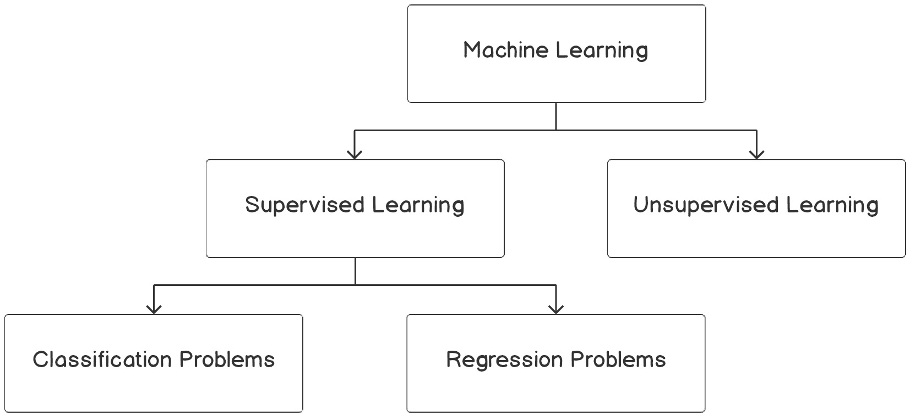

图 3.1：机器学习算法概述

分类问题是你在现实世界中最常遇到的用例。与回归问题不同，回归问题预测的是一个实际数值，而分类问题则处理将一个示例与一个类别关联。分类用例将呈现以下几种形式：

+   预测客户是否会购买推荐的产品

+   确定信用交易是否为欺诈性交易

+   确定患者是否患有某种疾病

+   分析动物的图像并预测图像是狗、猫还是熊猫

+   分析文本评论并捕捉潜在的情绪，如幸福、愤怒、悲伤或讽刺

如果观察前述示例，会发现前三个和最后两个之间有一个微妙的区别。前三个围绕二元决策：

+   客户可以选择购买产品或不购买。

+   信用卡交易可能是欺诈性的或合法的。

+   患者可以被诊断为疾病的阳性或阴性。

与前述三种类型对齐的用例，其中做出二元决策的问题称为二元分类问题。与前三者不同，后两者将一个示例与多个类别或类别关联。这类问题被称为多类别分类问题。本章将讨论二元分类问题。多类别分类将在*第四章*中介绍，*随机森林的多类别分类*。

# 理解商业背景

使用一个与你相关的示例来理解概念是最好的方法。为了理解商业背景，我们可以考虑以下示例。

你作为一名数据科学家，所在银行的营销负责人找到你，希望解决一个问题。最近，营销团队完成了一项营销活动，他们已经收集了关于现有客户的大量信息。他们需要你帮助确定哪些客户可能会购买定期存款计划。根据你对客户群体的评估，营销团队将制定目标营销策略。营销团队提供了过去营销活动及其结果的历史数据，即目标客户是否真的购买了定期存款。凭借历史数据，你已经开始了识别具有最高购买倾向（倾向）的客户的任务。

## 业务发现

如前所述，像前述这样从事数据科学问题的第一个过程是业务发现过程。这包括理解影响业务问题的各种驱动因素。了解业务驱动因素很重要，因为这将有助于制定关于业务问题的假设，在探索性数据分析（EDA）期间可以进行验证。验证假设将有助于制定特征工程的直觉，这对我们构建的模型的准确性至关重要。

让我们从我们用例的背景详细了解这个过程。问题陈述是识别那些有购买定期存款倾向的客户。如你所知，定期存款是一种银行工具，您的资金将被锁定一段时间，提供比储蓄账户或带息支票账户更高的利率。从投资倾向的角度来看，定期存款通常受到风险厌恶型客户的欢迎。有了业务背景，让我们看看一些影响购买定期存款倾向的业务因素的问题：

+   年龄会是一个因素吗？老年人显示更高的购买倾向吗？

+   就业状态与购买定期存款的倾向之间是否存在任何关系？

+   顾客的资产组合（即房屋、贷款或更高的银行存款）会影响购买的倾向吗？

+   人口统计信息，如婚姻状况和教育水平，会影响购买定期存款的倾向吗？如果会，人口统计数据与购买倾向之间如何相关？

在进行探索性分析时，制定有关业务背景的问题至关重要。在我们进行探索性分析时，这将有助于我们找出可以采取的各种路径。让我们先来探索与前述业务问题相关的数据。

## 练习 3.01：从数据集中加载和探索数据

在本次练习中，我们将在 Colab 笔记本中加载数据集，并进行一些基本的探索，如使用`.shape()`函数打印数据集的维度，并使用`.describe()`函数生成数据集的汇总统计信息。

注意

本次练习使用的数据集是银行数据集，感谢 S. Moro、P. Cortez 和 P. Rita 提供：《一种数据驱动方法预测银行电话营销的成功》。

数据集来源于 UCI 机器学习库：[`packt.live/2MItXEl`](https://packt.live/2MItXEl)，并且可以从我们的 GitHub 上下载：[`packt.live/2Wav1nJ`](https://packt.live/2Wav1nJ)。

以下步骤将帮助你完成本次练习：

1.  打开一个新的 Colab 笔记本。

1.  现在，在你的 Colab 笔记本中，`import` `pandas` 为`pd`：

    ```py
    import pandas as pd
    ```

1.  将数据集的链接分配给一个名为`file_url`的变量

    ```py
    file_url = 'https://raw.githubusercontent.com/PacktWorkshops'\
               '/The-Data-Science-Workshop/master/Chapter03'\
               '/bank-full.csv'
    ```

1.  现在，使用`pd.read_csv()`函数读取文件，来自 pandas 的 DataFrame：

    ```py
    # Loading the data using pandas
    bankData = pd.read_csv(file_url, sep=";")
    bankData.head()
    pd.read_csv() function's arguments are the filename as a string and the limit separator of a CSV, which is ";". After reading the file, the DataFrame is printed using the .head() function. Note that the # symbol in the code above denotes a comment. Comments are added into code to help explain specific bits of logic. 
    ```

    你应该获得以下输出：

    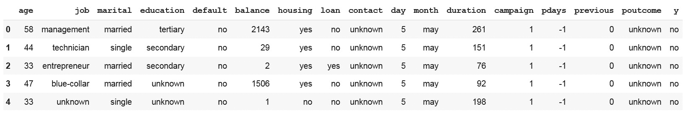

    图 3.2：将数据加载到 Colab 笔记本中

    这里，我们加载了`CSV`文件并将其存储为 pandas DataFrame，以便进一步分析。

1.  接下来，打印数据集的形状，如以下代码片段所示：

    ```py
    # Printing the shape of the data 
    print(bankData.shape function is used to find the overall shape of the dataset.You should get the following output:

    ```

    (45211, 17)

    ```py

    ```

1.  现在，使用 pandas 中的`.describe()`函数，以表格输出的方式查找数值原始数据的摘要，如以下代码片段所示：

    ```py
    # Summarizing the statistics of the numerical raw data
    bankData.describe()
    ```

    你应该获得以下输出：

    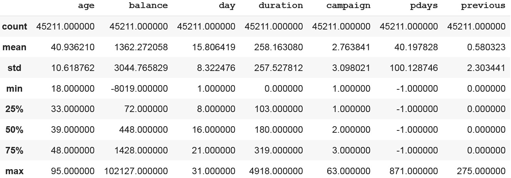

图 3.3：将数据加载到 Colab 笔记本中

从数据的形状来看，数据集有`45211`个样本，包含`17`个变量。变量集包括分类变量和数值变量。前面的汇总统计值仅针对数值数据得出。

注意

要访问这一特定部分的源代码，请参考[`packt.live/31UQhAU`](https://packt.live/31UQhAU)。

你也可以在[`packt.live/2YdiSAF`](https://packt.live/2YdiSAF)在线运行这个示例。

你已经完成了开始我们旅程之前所需的第一项任务。在本次练习中，你学习了如何加载数据并从数据集中得出基本统计数据，如汇总统计值。在随后的数据集中，我们将深入分析加载的数据集。

## 使用探索性数据分析测试业务假设

在上一节中，你从领域的角度接近了问题的陈述，识别了一些业务驱动因素。一旦识别出业务驱动因素，下一步是提出一些关于这些业务驱动因素与所设定的业务结果之间关系的假设。这些假设需要使用你所拥有的数据进行验证。**探索性数据分析**（**EDA**）在数据科学生命周期中发挥了重要作用。

让我们回到我们试图分析的问题。从上一节中，我们识别了一些商业驱动因素，如年龄、人口统计学、就业状况和资产组合，这些因素可能会影响购买定期存款的倾向。现在让我们根据这些商业驱动因素提出假设，并通过 EDA 进行验证。

## 探索性数据分析的可视化

可视化是探索性数据分析（EDA）中的关键。有效的可视化有助于从数据中提取商业直觉。在本节中，我们将介绍一些用于 EDA 的可视化技术：

+   **折线图**：折线图是最简单的可视化形式之一。折线图是揭示数据趋势的首选方法。这种图表通常用于展示连续数据。我们将在*练习 3.02*中生成这种图表，即*关于年龄与定期贷款倾向的商业假设检验*。

    下面是折线图的示例：

    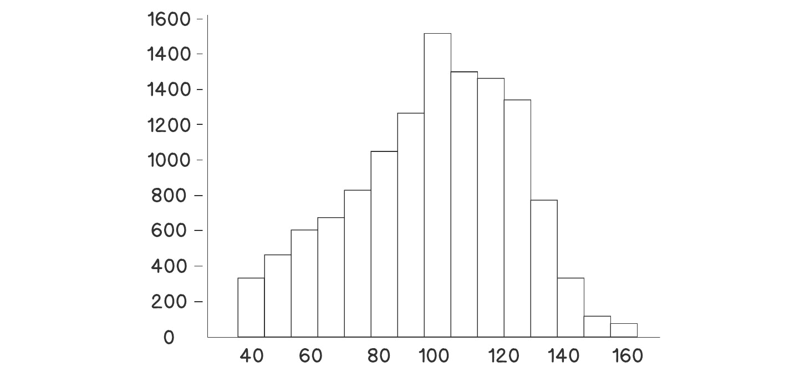

    ](img/B15019_03_04.jpg)

图 3.4：折线图示例

+   **直方图**：直方图是显示数据比例与指定区间的图表。它们通常用于可视化数据的分布。直方图非常有效，用于识别数据分布是否对称，以及识别数据中的异常值。我们将在本章后面更详细地讨论直方图。

    下面是直方图的示例：

    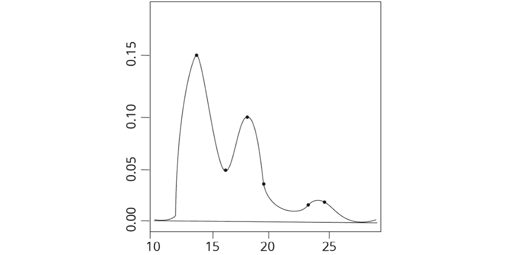

    ](img/B15019_03_05.jpg)

图 3.5：直方图示例

+   **密度图**：像直方图一样，密度图也用于可视化数据的分布。然而，密度图提供了更平滑的分布表现。我们将在本章稍后讨论这一点。

    下面是密度图的示例：

    

    ](img/B15019_03_06.jpg)

图 3.6：密度图示例

+   `Yes`和`No`，在同一条条形图上。这可以通过堆叠条形图实现，而其他图表则无法做到这一点。

    让我们创建一些虚拟数据并生成堆叠条形图，以检查不同领域中的职位比例。

    ```py
    # Importing library files
    import matplotlib.pyplot as plt
    import numpy as np
    ```

    接下来，创建一些样本数据，详细列出职位列表：

    ```py
    # Create a simple list of categories
    jobList = ['admin','scientist','doctor','management']
    ```

    每个职位将有两个类别需要绘制，`yes`和`No`，它们之间存在某种比例。具体细节如下：

    ```py
    # Getting two categories ( 'yes','No') for each of jobs
    jobYes = [20,60,70,40]
    jobNo = [80,40,30,60]
    ```

    在接下来的步骤中，将计算职位列表的长度来绘制`xlabels`，然后使用`np.arange()`函数进行排列：

    ```py
    # Get the length of x axis labels and arranging its indexes
    xlabels = len(jobList)
    ind = np.arange(xlabels)
    ```

    接下来，定义每个条形的宽度并进行绘图。在图表`p2`中，我们定义堆叠时，`yes`位于底部，`No`位于顶部：

    ```py
    # Get width of each bar
    width = 0.35
    # Getting the plots
    p1 = plt.bar(ind, jobYes, width)
    p2 = plt.bar(ind, jobNo, width, bottom=jobYes)
    ```

    定义*Y*轴的标签和图表标题：

    ```py
    # Getting the labels for the plots
    plt.ylabel('Proportion of Jobs')
    plt.title('Job')
    ```

    接下来定义*X*轴和*Y*轴的索引。对于*X*轴，列出各个职位，而对于*Y*轴，索引是从`0`到`100`的比例，增量为`10`（0, 10, 20, 30，依此类推）：

    ```py
    # Defining the x label indexes and y label indexes
    plt.xticks(ind, jobList)
    plt.yticks(np.arange(0, 100, 10))
    ```

    最后一步是定义图例并将坐标轴标签旋转至`90`度。最终显示图表：

    ```py
    # Defining the legends
    plt.legend((p1[0], p2[0]), ('Yes', 'No'))
    # To rotate the axis labels 
    plt.xticks(rotation=90)
    plt.show()
    ```

以下是基于前面示例的堆叠条形图的样子：

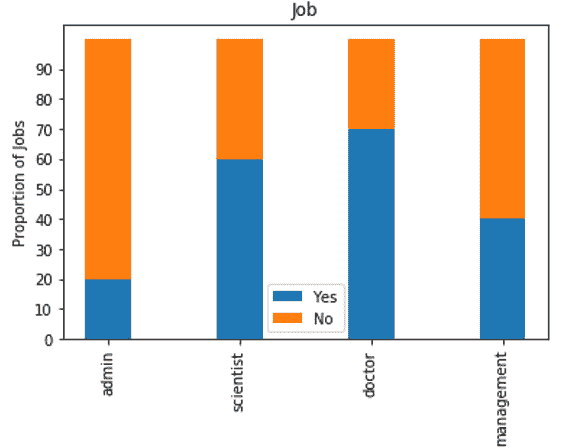

](img/B15019_03_08.jpg)

图 3.7：堆叠条形图示例

让我们在接下来的练习和活动中使用这些图表。

## 练习 3.02：年龄与定期贷款购买倾向的商业假设验证

这个练习的目标是定义一个假设，检查个人购买定期存款计划的倾向与他们的年龄之间的关系。我们将在这个练习中使用折线图。

以下步骤将帮助你完成这个练习：

1.  从定义假设开始。

    验证过程的第一步是定义一个关于关系的假设。假设可以基于你的经验、领域知识、一些已发布的知识或你的商业直觉。

    首先，我们定义关于年龄与购买定期存款倾向的假设：

    *老年客户比年轻客户更倾向于购买定期存款*。这是我们的假设。

    现在我们已经定义了假设，是时候用数据来验证它的真实性了。通过从数据中提取横截面并进行可视化，是从数据中获得商业直觉的最佳方式之一。

1.  导入`pandas`和`altair`包：

    ```py
    import pandas as pd
    import altair as alt
    ```

1.  接下来，你需要加载数据集，就像在*练习 3.01*中加载数据集一样，*加载和探索数据集中的数据*：

    ```py
    file_url = 'https://raw.githubusercontent.com/'\
               'PacktWorkshops/The-Data-Science-Workshop/'\
               'master/Chapter03/bank-full.csv'
    bankData = pd.read_csv(file_url, sep=";")
    ```

    注意

    *步骤 2-3*将在本章的后续练习中重复进行。

    我们将验证购买定期存款的情况如何按年龄分布。

1.  接下来，我们将统计每个年龄组的记录数量。我们将使用`pandas`中的`.groupby()`、`.agg()`、`.reset_index()`方法的组合。

    ```py
    filter_mask = bankData['y'] == 'yes'
    bankSub1 = bankData[filter_mask]\
               .groupby('age')['y'].agg(agegrp='count')\
               .reset_index()
    ```

    我们首先取出在*练习 3.01*中加载的`pandas` `DataFrame`，`bankData`，然后使用掩码`bankData['y'] == 'yes'`筛选出所有定期存款为“是”的案例。这些案例通过`groupby()`方法进行分组，然后通过`agg()`方法根据年龄进行聚合。最后，我们需要使用`.reset_index()`获取一个结构良好的`DataFrame`，并将其存储在一个新的`DataFrame`中，称为`bankSub1`。

1.  现在，使用`altair`和`.Chart().mark_line().encode()`方法绘制折线图，我们将定义`x`和`y`变量，如下所示的代码片段：

    ```py
    # Visualising the relationship using altair
    alt.Chart(bankSub1).mark_line().encode(x='age', y='agegrp')
    ```

    你应该得到以下输出：

    

    ](img/B15019_03_08.jpg)

    图 3.8：年龄与购买倾向之间的关系

    从图表中我们可以看到，定期存款购买的数量在年龄范围为 25 至 40 岁之间的客户中最高，且购买倾向随着年龄的增长逐渐减弱。

    这个关系和我们在假设中的预期相反，对吧？但是，等一下，难道我们没有忽略一个重要的点吗？我们是根据每个年龄段客户的绝对数量来处理数据的。如果 25 到 40 岁年龄段的银行客户比例较高，那么我们很可能会得到类似我们当前得到的图表。我们真正应该绘制的是每个年龄段内，购买定期存款的客户比例。

    让我们看看如何通过获取客户比例来表示数据。就像您在之前的步骤中所做的那样，我们将根据年龄对客户购买倾向进行汇总，然后将每个购买倾向类别除以该年龄组内的总客户数，从而得到比例。

1.  使用`groupby()`方法按年龄对数据进行分组，并使用`agg()`方法找到每个年龄组内客户的总数：

    ```py
    # Getting another perspective
    ageTot = bankData.groupby('age')['y']\
             .agg(ageTot='count').reset_index()
    ageTot.head()
    ```

    输出如下：

    

    图 3.9：各年龄段客户

1.  现在，按年龄和购买倾向对数据进行分组，并找到每个购买倾向类别（`yes`和`no`）下的总计数：

    ```py
    # Getting all the details in one place
    ageProp = bankData.groupby(['age','y'])['y']\
              .agg(ageCat='count').reset_index()
    ageProp.head()
    ```

    输出如下：

    

    图 3.10：各年龄段购买倾向

1.  使用`pd.merge()`函数根据`age`变量合并这两个 DataFrame，然后将每个年龄组内的购买倾向类别除以该年龄组内的总客户数，从而得到客户比例，如以下代码片段所示：

    ```py
    # Merging both the data frames
    ageComb = pd.merge(ageProp, ageTot,left_on = ['age'], \
                       right_on = ['age'])
    ageComb['catProp'] = (ageComb.ageCat/ageComb.ageTot)*100
    ageComb.head()
    ```

    输出如下：

    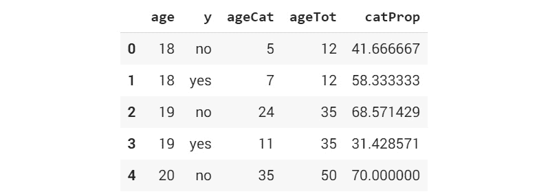

    图 3.11：按年龄组合并的 DataFrame 及客户比例

1.  现在，显示比例图表，分别将`yes`和`no`类别作为单独的图表进行绘制。这可以通过`altair`中的`facet()`方法实现：

    ```py
    # Visualising the relationship using altair
    alt.Chart(ageComb).mark_line()\
       .encode(x='age', y='catProp').facet(column='y')
    ```

    这个函数会根据变量中类别的数量生成相应数量的图表。在这里，我们将`'y'`变量（即表示`yes`和`no`类别的变量名称）传递给`facet()`函数，得到两个不同的图表：一个表示`yes`，另一个表示`no`。

    您应该得到以下输出：

    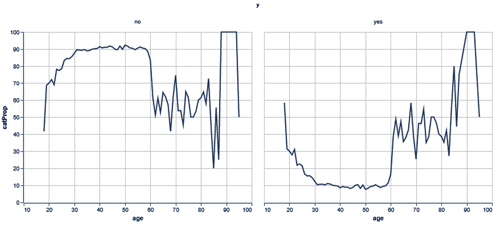

图 3.12：可视化标准化关系

在本次练习结束时，您应该能够得到两个有意义的图表，展示人们购买定期存款计划的倾向。该练习的最终输出展示了两个图表，左侧图表显示的是没有购买定期存款的人群比例，右侧图表显示的是购买定期存款的客户。

我们可以看到，在第一个图表中，年龄从`22`岁到`60`岁之间的个体并不倾向于购买定期存款。然而，在第二个图表中，我们看到相反的情况，`60`岁及以上的群体更倾向于购买定期存款计划。

注意

若要访问此部分的源代码，请参考[`packt.live/3iOw7Q4`](https://packt.live/3iOw7Q4)。

本节目前没有在线互动示例，但可以像往常一样在 Google Colab 上运行。

在接下来的部分，我们将开始基于我们的直觉分析我们的图表。

## 探索性分析中的直觉

到目前为止，我们从这个练习中能提取出哪些直觉？我们通过考虑用户的比例和不考虑比例的两种不同情形看到了两种对比的图表。正如你所看到的，考虑用户比例是获取正确视角的正确方法，这是我们假设所要求的视角。我们从图表中可以看出，从`22`岁到大约`60`岁之间的年龄段，定期存款的购买倾向较低。

在`60`岁之后，我们看到定期存款需求呈上升趋势。另一个有趣的事实是，`20`岁以下的群体有较高的定期存款购买比例。

在*练习 3.02*中，*关于年龄与定期贷款倾向的商业假设检验*，我们发现了如何发展我们的假设，然后使用 EDA 验证这个假设。在接下来的活动中，我们将深入探讨旅程中的另一个重要步骤——特征工程。

## 活动 3.01：商业假设检验，找出就业状态与定期存款倾向的关系

你正在为一家银行担任数据科学家。你收到了来自银行管理层的历史数据，并被要求尝试建立就业状态与定期存款购买倾向之间的假设。

在*练习 3.02*中，*关于年龄与定期贷款倾向的商业假设检验*，我们解决了一个问题，旨在寻找年龄与定期存款购买倾向之间的关系。在这个活动中，我们将采用类似的路线，并验证就业状态与定期存款购买倾向之间的关系。

步骤如下：

1.  构建关于就业状态和定期存款倾向之间的假设。假设如下：*高薪员工比其他类别的员工更倾向于选择定期存款*。

1.  打开一个类似于*练习 3.02*中使用的 Colab 笔记本文件，并安装和导入必要的库，如`pandas`和`altair`。

1.  从银行数据框`bankData`中，使用`.groupby()`、`.agg()`和`.reset_index()`方法查找就业状态的分布。

    使用`.groupby()`方法按就业状态对数据进行分组，并使用`.agg()`方法查找每种就业状态的倾向总数。

1.  现在，使用`pd.merge()`函数合并两个 DataFrame，然后通过计算每种就业状态的倾向比例来找到倾向计数。在创建新变量以找到倾向比例时。

1.  使用`matplotlib`绘制数据并总结图表中的直觉。此活动使用堆叠条形图。

    注意

    用于此活动的`bank-full.csv`数据集可以在[`packt.live/2Wav1nJ`](https://packt.live/2Wav1nJ)找到。

预期输出：关于购买倾向与就业状态的最终图表将类似于以下图表：

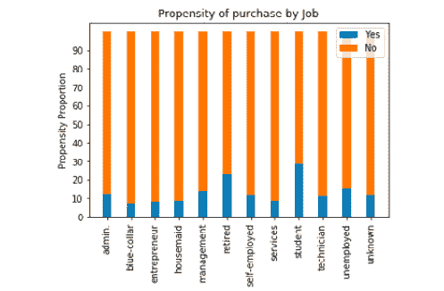

图 3.13：按职业可购买倾向的可视化

注意

这个活动的解决方案可以通过以下地址找到：[`packt.live/2GbJloz`](https://packt.live/2GbJloz)。

既然我们已经了解了 EDA，让我们深入探讨特征工程。

# 特征工程

在上一节中，我们遍历了 EDA 的过程。作为早期过程的一部分，我们通过切片、切分数据和可视化来测试我们的业务假设。你可能会想知道我们会在哪里使用从所有分析中得出的直觉。这个问题的答案将在本节中解决。

特征工程是将原始变量转换为新变量的过程，本章稍后将详细讨论。特征工程是影响我们构建的模型准确性的重要步骤之一。

特征工程大致分为两类：

1.  在这里，我们根据业务角度的直觉来转换原始变量。这些直觉是在探索性分析过程中建立的。

1.  原始变量的转换是从统计学和数据规范化的角度进行的。

接下来我们将探讨每种特征工程类型。

注意

特征工程将在*第十二章*，*特征工程*中详细讲解。在本节中，您将看到学习分类的目的。

## 基于业务驱动的特征工程

基于业务驱动的特征工程是根据在探索性分析过程中得出的业务直觉，转换原始变量的过程。它涉及根据影响业务问题的业务因素或驱动因素，转化数据并创建新变量。

在之前的探索性分析练习中，我们探讨了单一变量与因变量之间的关系。在本练习中，我们将结合多个变量并推导出新特征。我们将探索资产组合与购买定期存款的倾向之间的关系。资产组合是客户在银行的所有资产和负债的组合。我们将结合银行余额、房产所有权和贷款等资产与负债，得到一个名为**资产**的指数。

这些特征工程步骤将分为两个练习。在*练习 3.03*，*特征工程 – 单独特征的探索*中，我们将探索平衡、住房和贷款等单个变量，以了解它们与定期存款倾向的关系。

在*练习 3.04*，*特征工程 – 从现有特征创建新特征*中，我们将转化单个变量并将它们组合成一个新特征。

## 练习 3.03：特征工程 – 单独特征的探索

在本练习中，我们将探索两个变量之间的关系，即一个人是否拥有房屋以及是否有贷款，这些与这些人购买定期存款的倾向有关。

以下步骤将帮助你完成本练习：

1.  打开一个新的 Colab 笔记本。

1.  导入`pandas`包。

    ```py
    import pandas as pd
    ```

1.  将数据集的链接赋值给名为`file_url`的变量：

    ```py
    file_url = 'https://raw.githubusercontent.com'\
               '/PacktWorkshops/The-Data-Science-Workshop'\
               '/master/Chapter03/bank-full.csv'
    ```

1.  使用`.read_csv()`函数读取银行数据集：

    ```py
    # Reading the banking data
    bankData = pd.read_csv(file_url, sep=";")
    ```

1.  接下来，我们将找到住房与定期存款倾向之间的关系，如以下代码片段所示：

    ```py
    # Relationship between housing and propensity for term deposits
    bankData.groupby(['housing', 'y'])['y']\
            .agg(houseTot='count').reset_index()
    ```

    你应该得到以下输出：

    

    图 3.14：住房状况与购买定期存款的倾向

    代码的第一部分是根据客户是否拥有房屋将其分组。使用`.agg()`方法计算每个类别下的客户数量。从这些值中我们可以看到，购买定期存款的倾向在没有房屋的客户中明显高于有房屋的客户：`(3354 / (3354 + 16727) = 17% 与 1935 / (1935 + 23195) = 8%)`。

1.  探索`'loan'`变量，以找出它与定期存款倾向之间的关系，如以下代码片段所示：

    ```py
    """
    Relationship between having a loan and propensity for term 
    deposits
    """
    bankData.groupby(['loan', 'y'])['y']\
            .agg(loanTot='count').reset_index()
    # symbol. 
    ```

    你应该得到以下输出：

    

    图 3.15：贷款与定期存款倾向

    对于贷款组合，购买定期存款的倾向在没有贷款的客户中较高：`(4805 / (4805 + 33162) = 12% 与 484 / (484 + 6760) = 6%)`。

    住房和贷款是分类数据，找到它们之间的关系是直接的。然而，银行余额数据是数值型的，要分析它，我们需要采用不同的策略。一个常见的策略是将连续的数值数据转换为有序数据，并观察各类别之间的倾向性如何变化。

1.  为了将数值值转换为有序值，我们首先找到分位数值并将它们作为阈值。分位数是使用以下代码片段获得的：

    ```py
    #Taking the quantiles for 25%, 50% and 75% of the balance data
    import numpy as np
    np.quantile(bankData['balance'],[0.25,0.5,0.75])
    ```

    您应该得到以下输出：

    

    ```py
    Step 4, we calculated the 25th, 50th, and 75th percentiles, which resulted in 72, 448, and 1428.
    ```

1.  现在，将银行余额的数值转换为分类值，如以下代码片段所示：

    ```py
    bankData['balanceClass'] = 'Quant1'
    bankData.loc[(bankData['balance'] > 72) \
                  & (bankData['balance'] < 448), \
                  'balanceClass'] = 'Quant2'
    bankData.loc[(bankData['balance'] > 448) \
                  & (bankData['balance'] < 1428), \
                  'balanceClass'] = 'Quant3'
    bankData.loc[bankData['balance'] > 1428, \
                 'balanceClass'] = 'Quant4'
    bankData.head()
    ```

    您应该得到以下输出：

    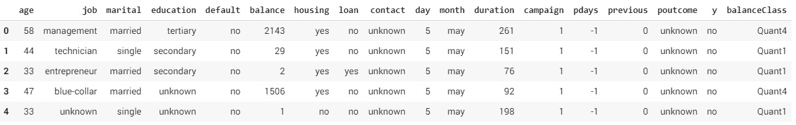

    图 3.17：来自银行余额数据的新特征

    我们通过查看在*步骤 4*中采取的分位数阈值，将数值数据分类到相应的分位数类别。例如，所有低于第 25 分位数值 72 的值被分类为`Quant1`，介于 72 和 448 之间的值被分类为`Quant2`，依此类推。为了存储分位数类别，我们在银行数据集中创建了一个名为`balanceClass`的新特征，并将其默认值设置为`Quan1`。之后，根据每个值的阈值，数据点被分类到相应的分位数类别。

1.  接下来，我们需要根据客户所属的每个分位数来寻找定期存款购买的倾向性。这个任务类似于我们在*练习 3.02*中做的内容，即*年龄与定期贷款倾向性之间的商业假设测试*：

    ```py
    # Calculating the customers under each quantile 
    balanceTot = bankData.groupby(['balanceClass'])['y']\
                         .agg(balanceTot='count').reset_index()
    balanceTot
    ```

    您应该得到以下输出：

    

    图 3.18：基于分位数的分类

1.  计算按分位数和倾向性分类的客户总数，如以下代码片段所示：

    ```py
    """
    Calculating the total customers categorised as per quantile 
    and propensity classification
    """
    balanceProp = bankData.groupby(['balanceClass', 'y'])['y']\
                          .agg(balanceCat='count').reset_index()
    balanceProp
    ```

    您应该得到以下输出：

    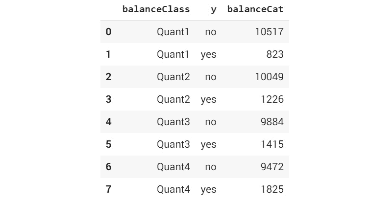

    图 3.19：按分位数和倾向性分类的客户总数

1.  现在，`merge`两个数据框：

    ```py
    # Merging both the data frames
    balanceComb = pd.merge(balanceProp, balanceTot, \
                           on = ['balanceClass'])
    balanceComb['catProp'] = (balanceComb.balanceCat \
                              / balanceComb.balanceTot)*100
    balanceComb
    ```

    您应该得到以下输出：

    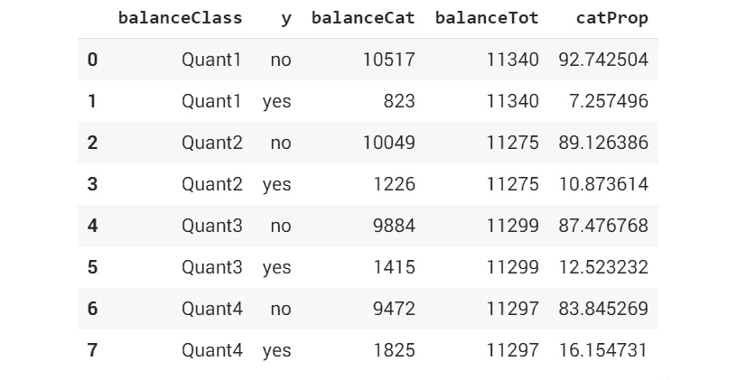

图 3.20：倾向性与余额类别

从数据的分布情况来看，我们可以看到，当从第 1 分位数移动到第 4 分位数时，购买定期存款的客户比例持续增加。例如，在所有属于`Quant 1`的客户中，7.25%购买了定期存款（我们从`catProp`中得到这个百分比）。这个比例在`Quant 2`中增加到 10.87%，然后在`Quant 3`和`Quant4`中分别增加到 12.52%和 16.15%。从这个趋势可以得出结论，余额较高的个人更倾向于购买定期存款。

在这个练习中，我们探讨了每个变量与定期存款购买倾向之间的关系。我们可以观察到的总体趋势是，手头现金更多（没有贷款且余额较高）的人，购买定期存款的倾向较高。

注意

要访问此特定部分的源代码，请参考[`packt.live/3g7rK0w`](https://packt.live/3g7rK0w)。

你还可以在[`packt.live/2PZbcNV`](https://packt.live/2PZbcNV)上在线运行这个示例。

在下一个练习中，我们将使用这些直觉推导出一个新的特征。

## 练习 3.04：特征工程——从现有特征中创建新特征

在这个练习中，我们将结合在*练习 3.03*中分析的各个变量，*特征工程——单独特征的探索*，推导出一个新的特征，叫做资产指数。创建资产指数的一种方法是根据客户的资产或负债来分配权重。

例如，较高的银行余额或房产拥有权将对总体资产指数产生积极影响，因此会被分配更高的权重。相反，贷款的存在将是负债，因此需要分配较低的权重。如果客户有房子，我们赋予权重为 5，若没有则为 1。类似地，如果客户有贷款，我们赋予权重为 1，如果没有贷款，则为 5：

1.  打开一个新的 Colab 笔记本。

1.  导入 pandas 和 numpy 包：

    ```py
    import pandas as pd
    import numpy as np
    ```

1.  将数据集的链接赋值给一个名为'file_url'的变量。

    ```py
    file_url = 'https://raw.githubusercontent.com'\
               '/PacktWorkshops/The-Data-Science-Workshop'\
               '/master/Chapter03/bank-full.csv'
    ```

1.  使用`.read_csv()`函数读取银行数据集：

    ```py
    # Reading the banking data
    bankData = pd.read_csv(file_url,sep=";")
    ```

1.  我们将遵循的第一步是标准化数值变量。可以通过以下代码片段来实现：

    ```py
    # Normalizing data
    from sklearn import preprocessing
    x = bankData[['balance']].values.astype(float)
    ```

1.  由于银行余额数据集包含数值数据，我们需要先对数据进行标准化。标准化的目的是将我们用于创建新特征的所有变量转换到一个共同的尺度。我们可以在这里使用的有效标准化方法叫做`MinMaxScaler()`，它将所有数值数据转换到 0 到 1 的范围内。`MinMaxScaler`函数可以在`sklearn`的`preprocessing`方法中找到：

    ```py
    minmaxScaler = preprocessing.MinMaxScaler()
    ```

1.  使用`minmaxScaler`对余额数据进行标准化转换：

    ```py
    bankData['balanceTran'] = minmaxScaler.fit_transform(x)
    ```

    在这一步中，我们创建了一个名为`'balanceTran'`的新特征，用来存储标准化的银行余额值。

1.  使用`.head()`函数打印数据的前几行：

    ```py
    bankData.head()
    ```

    你应该得到以下输出：

    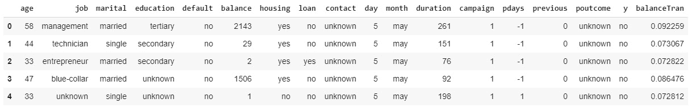

    图 3.21：标准化银行余额数据

1.  创建标准化变量后，添加一个小值`0.001`，以消除变量中的 0 值。这个在以下代码片段中提到：

    ```py
    # Adding a small numerical constant to eliminate 0 values
    bankData['balanceTran'] = bankData['balanceTran'] + 0.00001
    ```

    添加这个小值的目的是因为，在后续步骤中，我们将把三个转化后的变量相乘以形成一个综合指数。为了避免变量值在乘法运算中变为 0，我们加上了这个小值。

1.  现在，按照开始此练习时讨论的加权方法，为贷款和住房引入转换变量的两列附加列：

    ```py
    # Let us transform values for loan data
    bankData['loanTran'] = 1
    # Giving a weight of 5 if there is no loan
    bankData.loc[bankData['loan'] == 'no', 'loanTran'] = 5
    bankData.head()
    ```

    你应该得到以下输出：

    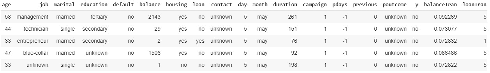

    图 3.22：包含转换变量的附加列

    我们根据加权方法对贷款数据进行了转换。当客户有贷款时，赋予权重`1`，没有贷款时，赋予权重`5`。`1`和`5`是我们赋予的直观权重。我们所赋予的权重可以根据你所提供的业务背景有所不同。

1.  现在，转换`Housing 数据`中的数值，如下所示：

    ```py
    # Let us transform values for Housing data
    bankData['houseTran'] = 5
    ```

1.  如果客户有房产，则赋予权重`1`并打印结果，如以下代码片段所示：

    ```py
    bankData.loc[bankData['housing'] == 'no', 'houseTran'] = 1
    print(bankData.head())
    ```

    你应该得到以下输出：

    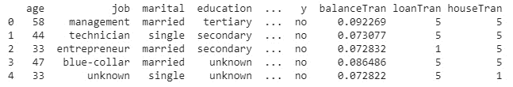

    图 3.23：转换贷款和住房数据

    一旦所有转换后的变量都创建完成，我们可以将所有转换后的变量相乘，生成一个新的指数，称为`assetIndex`。这是一个综合指数，表示所有三个变量的综合效果。

1.  现在，创建一个新的变量，这是所有转换后变量的乘积：

    ```py
    """ 
    Let us now create the new variable which is a product of all 
    these
    """
    bankData['assetIndex'] = bankData['balanceTran'] \
                             * bankData['loanTran'] \
                             * bankData['houseTran']
    bankData.head()
    ```

    你应该得到以下输出：

    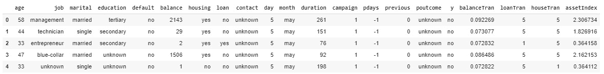

    图 3.24：创建综合指数

1.  探索相对于综合指数的倾向性。

    我们观察资产指数与定期存款购买倾向之间的关系。我们采用类似的策略，将资产指数的数值转换为序数值，通过分位数将数值映射到定期存款购买的倾向性上，如*练习 3.03*中所述，*特征工程 – 探索单个特征*：

    ```py
    # Finding the quantile
    np.quantile(bankData['assetIndex'],[0.25,0.5,0.75])
    ```

    你应该得到以下输出：

    

    图 3.25：将数值转换为序数值

1.  接下来，根据以下代码片段从`assetindex`数据创建分位数：

    ```py
    bankData['assetClass'] = 'Quant1'
    bankData.loc[(bankData['assetIndex'] > 0.38) \
                  & (bankData['assetIndex'] < 0.57), \
                  'assetClass'] = 'Quant2'
    bankData.loc[(bankData['assetIndex'] > 0.57) \
                  & (bankData['assetIndex'] < 1.9), \
                  'assetClass'] = 'Quant3'
    bankData.loc[bankData['assetIndex'] > 1.9, \
                 'assetClass'] = 'Quant4'
    bankData.head()
    bankData.assetClass[bankData['assetIndex'] > 1.9] = 'Quant4'
    bankData.head()
    ```

    你应该得到以下输出：

    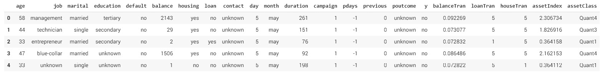

    图 3.26：资产指数的分位数

1.  计算每个资产类别的总额及类别计数，如以下代码片段所示：

    ```py
    # Calculating total of each asset class
    assetTot = bankData.groupby('assetClass')['y']\
                       .agg(assetTot='count').reset_index()
    # Calculating the category wise counts
    assetProp = bankData.groupby(['assetClass', 'y'])['y']\
                        .agg(assetCat='count').reset_index()
    ```

1.  接下来，合并两个数据框：

    ```py
    # Merging both the data frames
    assetComb = pd.merge(assetProp, assetTot, on = ['assetClass'])
    assetComb['catProp'] = (assetComb.assetCat \
                            / assetComb.assetTot)*100
    assetComb
    ```

    你应该得到以下输出：

    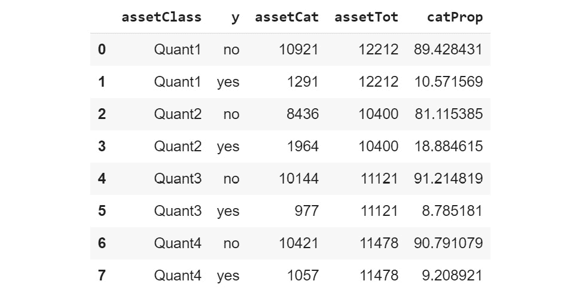

图 3.27：综合指数关系映射

从我们创建的新特征中可以看到，18.88%（我们从`catProp`中得到这个百分比）在`Quant2`中的客户购买了定期存款，而`Quant1`为 10.57%，`Quant3`为 8.78%，`Quant4`为 9.28%。由于`Quant2`中购买定期存款的客户比例最高，我们可以得出结论，`Quant2`中的客户购买定期存款的倾向高于其他所有客户。

注意

要访问此特定部分的源代码，请参见[`packt.live/316hUrO`](https://packt.live/316hUrO)。

你还可以在[`packt.live/3kVc7Ny`](https://packt.live/3kVc7Ny)上运行这个示例。

与我们刚完成的练习类似，你应该根据业务直觉考虑从现有变量中创建的新变量。基于业务直觉创建新特征是基于业务的特征工程的核心。在下一节中，我们将介绍另一种特征工程类型——基于数据的特征工程。

# 基于数据的特征工程

上一节讨论了基于业务的特征工程。除了从业务角度推导出的特征外，从数据结构的角度进行特征工程转换也是至关重要的。我们将探讨识别数据结构的不同方法，并快速了解一些数据转换技术。

## 快速查看数据类型和描述性总结

查看数据类型，如类别型或数值型，然后推导出汇总统计数据，是在进行一些后续特征工程步骤之前快速浏览数据的好方法。我们来看看来自我们数据集的一个示例：

```py
# Looking at Data types
print(bankData.dtypes)
# Looking at descriptive statistics
print(bankData.describe())
```

你应该得到以下输出：

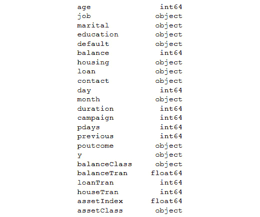

图 3.28：显示数据集中不同数据类型的输出

在前面的输出中，你可以看到数据集中不同类型的信息及其对应的数据类型。例如，`age`是整数，`day`也是整数。

以下输出是描述性总结统计数据，显示了各特征的一些基本度量，如`均值`、`标准差`、`计数`和相应的`分位数值`：

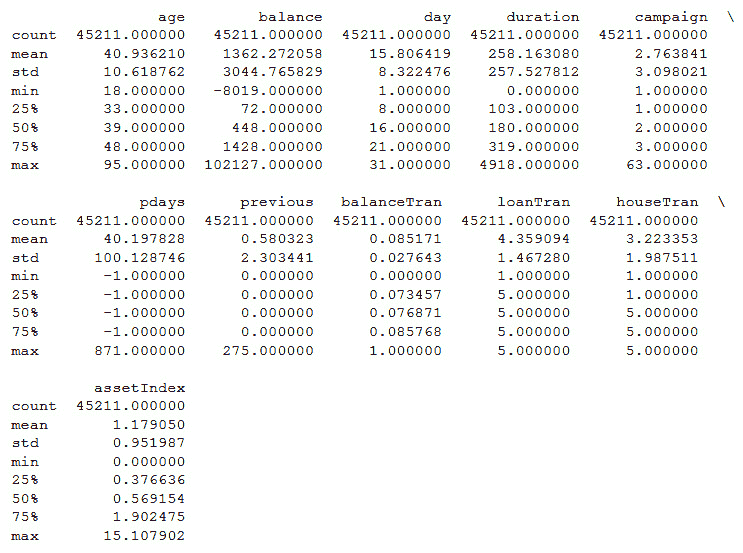

图 3.29：数据类型和描述性总结

描述性总结的目的是快速了解数据的分布情况和一些基本统计信息，如均值和标准差。了解汇总统计数据对思考每个变量需要进行什么样的转换至关重要。

例如，在前面的练习中，我们根据分位数值将数值数据转换为分类变量。转换变量的直觉来自于我们从数据集中可以推导出的快速汇总统计。

在接下来的章节中，我们将查看相关性矩阵和可视化。

# 相关性矩阵与可视化

如你所知，相关性是一个度量，用于表示两个变量是如何一起波动的。任何接近 1 或为 1 的相关性值，表示这两个变量之间有很强的相关性。高度相关的变量有时可能会影响模型的准确性，在许多情况下，我们会决定消除这些变量或将它们合并成复合变量或交互变量。

让我们在接下来的练习中看看如何生成并可视化数据的相关性。

## 练习 3.05：利用银行数据生成相关性图并找到数据中的相关性

在这个练习中，我们将创建一个相关性图并分析银行数据集的结果。

以下步骤将帮助你完成练习：

1.  打开一个新的 Colab 笔记本，安装 `pandas` 包并加载银行数据：

    ```py
    import pandas as pd
    file_url = 'https://raw.githubusercontent.com'\
               '/PacktWorkshops/The-Data-Science-Workshop'\
               '/master/Chapter03/bank-full.csv'
    bankData = pd.read_csv(file_url, sep=";")
    ```

1.  现在，按照此处的说明，从 `pandas` 导入 `set_option` 库：

    ```py
    from pandas import set_option
    ```

    `set_option` 函数用于定义许多操作的显示选项。

1.  接下来，创建一个变量来存储诸如 `'age','balance','day','duration','campaign','pdays','previous'` 等数值变量，如以下代码片段所示。相关性图只能通过数值数据提取。这就是为什么必须单独提取数值数据：

    ```py
    bankNumeric = bankData[['age','balance','day','duration',\
                            'campaign','pdays','previous']]
    ```

1.  现在，使用 `.corr()` 函数找到数据集的相关性矩阵：

    ```py
    set_option('display.width',150)
    set_option('precision',3)
    bankCorr = bankNumeric.corr(method = 'pearson')
    bankCorr
    ```

    你应该得到以下输出：

    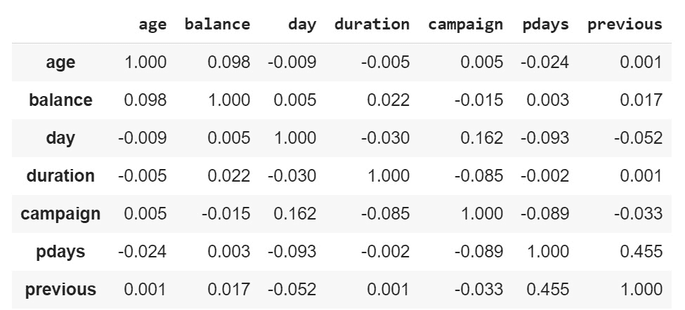

    图 3.30：相关性矩阵

    我们使用的相关性方法是**皮尔逊**相关系数。从相关性矩阵中可以看到，主对角线上的元素的相关性为 1\。这是因为对角线元素表示的是变量与自身的相关性，显然永远为 1\。这就是皮尔逊相关系数。

1.  现在，绘制数据：

    ```py
    from matplotlib import pyplot
    corFig = pyplot.figure()
    figAxis = corFig.add_subplot(111)
    corAx = figAxis.matshow(bankCorr,vmin=-1,vmax=1)
    corFig.colorbar(corAx)
    pyplot.show()
    ```

    你应该得到以下输出：

    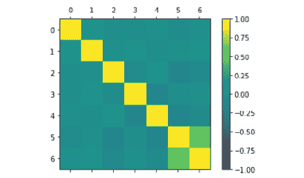

图 3.31：相关性图

在此代码块中，我们使用了许多绘图参数。`pyplot.figure()` 是要实例化的绘图类。`.add_subplot()` 是绘图的网格参数。例如，111 表示第一个子图的 1 x 1 网格。`.matshow()` 函数用于显示图形，`vmin` 和 `vmax` 参数用于规范化图中的数据。

让我们看一下相关矩阵的图，以便更快速地识别相关变量。几个明显的候选变量包括`'balance'`和`'balanceTran'`之间的高相关性，以及`'asset index'`与我们在之前练习中创建的许多转换变量之间的高相关性。除此之外，没有太多变量高度相关。

注意

要访问这一特定部分的源代码，请参考[`packt.live/3kXr9SK`](https://packt.live/3kXr9SK)。

你也可以在[`packt.live/3gbfbkR`](https://packt.live/3gbfbkR)上在线运行这个示例。

在本次练习中，我们开发了一个相关性图，帮助我们可视化变量之间的相关性。

## 数据的偏度

另一个特征工程的领域是偏度。偏斜数据是指数据在某个方向上发生了偏移。偏度可能会导致机器学习模型的性能下降。许多机器学习模型假设数据是正态分布的，或者数据结构遵循高斯结构。任何偏离高斯结构的情况（即著名的钟形曲线）都可能影响模型的表现。一个非常有效的特征工程方法是通过观察数据的偏度，并通过对数据进行归一化来纠正偏度。我们可以通过绘制直方图和密度图来可视化偏度。我们将研究这些技术中的每一个。

让我们看一下下面的示例。在这里，我们使用`.skew()`函数来查找数据的偏度。例如，为了查找我们`bank-full.csv`数据集中数据的偏度，我们可以执行以下操作：

```py
# Skewness of numeric attributes
bankNumeric.skew()
```

注意

这段代码涉及到`bankNumeric`数据，因此你应该确保在与前面练习相同的笔记本中进行操作。

你应该获得如下输出：


图 3.32：偏度的程度

上述矩阵为偏度指标。任何接近 0 的值表示偏度较低。正值表示右偏，负值表示左偏。显示出较高右偏和左偏的变量是进一步通过归一化进行特征工程的候选变量。现在让我们通过绘制直方图和密度图来可视化偏度。

## 直方图

直方图是绘制数据分布并识别数据偏度（如果有的话）的有效方法。这里列出了`bankData`两个列的直方图输出。直方图是使用`matplotlib`中的`pyplot`包通过`.hist()`函数绘制的。我们希望包含的子图数量由`.subplots()`函数控制。子图中的`(1,2)`表示一行两列。标题通过`set_title()`函数设置：

```py
# Histograms
from matplotlib import pyplot as plt
fig, axs = plt.subplots(1,2)
axs[0].hist(bankNumeric['age'])
axs[0].set_title('Distribution of age')
axs[1].hist(bankNumeric['balance'])
axs[1].set_title('Distribution of Balance')
# Ensure plots do not overlap
plt.tight_layout()
```

你应该获得如下输出：

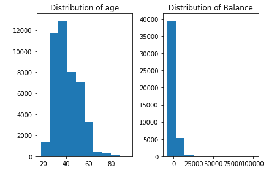

图 3.33：显示生成直方图的代码

从直方图中我们可以看到，`age`变量的分布接近钟形曲线，偏态较低。相比之下，资产指数显示出较高的右偏，意味着它是归一化的更有可能的候选者。

## 密度图

密度图有助于可视化数据的分布。可以使用`kind = 'density'`参数来创建密度图：

```py
from matplotlib import pyplot as plt
# Density plots
bankNumeric['age'].plot(kind = 'density', subplots = False, \
                        layout = (1,1))
plt.title('Age Distribution')
plt.xlabel('Age')
plt.ylabel('Normalised age distribution')
pyplot.show()
```

你应该看到以下输出：

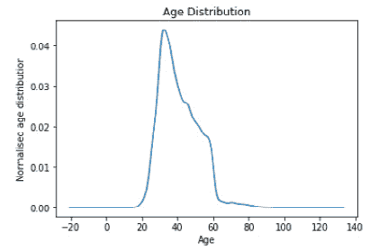

图 3.34：展示生成密度图的代码

密度图有助于更平滑地展示数据的分布。从年龄的密度图中，我们可以看到它的分布类似于钟形曲线。

## 其他特征工程方法

到目前为止，我们一直在查看各种描述性统计和可视化方法，这些都是对数据结构应用许多特征工程技术的前奏。在*练习 3.02*，*关于年龄与定期贷款倾向的商业假设测试*中，我们使用了**最小-最大**缩放器对数据进行归一化，探讨了其中一种特征工程技术。

现在我们将介绍另外两种类似的数据转换技术，即标准化缩放器和归一化器。标准化缩放器将数据标准化为均值为 0，标准差为 1。均值是数据的平均值，标准差是衡量数据分布程度的指标。通过将数据标准化为相同的均值和标准差，可以实现不同数据分布之间的比较。

归一化器函数对数据的长度进行归一化。这意味着每行中的每个值都会被该行向量的归一化值除以，从而实现对该行的归一化。归一化器函数应用于行，而标准化缩放器应用于列。归一化器和标准化缩放器是应用于数据的关键特征工程步骤，在下游建模步骤之前需要对数据进行处理。让我们来看看这两种技术：

```py
# Standardize data (0 mean, 1 stdev)
from sklearn.preprocessing import StandardScaler
from numpy import set_printoptions
scaling = StandardScaler().fit(bankNumeric)
rescaledNum = scaling.transform(bankNumeric)
set_printoptions(precision = 3)
print(rescaledNum)
```

你应该看到以下输出：

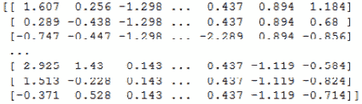

图 3.35：标准化数据后的输出

以下代码展示了使用归一化器数据传输技术：

```py
# Normalizing Data (Length of 1)
from sklearn.preprocessing import Normalizer
normaliser = Normalizer().fit(bankNumeric)
normalisedNum = normaliser.transform(bankNumeric)
set_printoptions(precision = 3)
print(normalisedNum)
```

你应该看到以下输出：

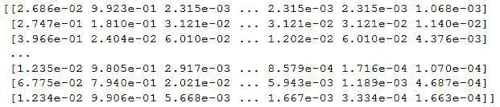

图 3.36：归一化器的输出

标准化缩放器的输出在列之间进行了归一化。输出将有 11 列，对应于 11 个数值列（年龄、余额、天数、持续时间等）。如果观察输出，我们可以看到每一列的值都已经标准化，使得均值为 0，标准差为 1。通过这种方式转换数据，我们可以轻松地进行列间比较。

例如，在`age`变量中，我们的数据范围从 18 到 95\. 相比之下，余额数据的范围从-8,019 到 102,127\. 我们可以看到这两个变量的数据范围不同，无法直接比较。标准化函数将这些尺度差异很大的数据点转换为共同的尺度，从而能够比较数据的分布。归一化则将每一行重新调整，使其成为长度为 1 的向量。

我们必须思考的一个大问题是：为什么我们必须对数据进行标准化或归一化？许多机器学习算法在特征具有相似的尺度或呈正态分布时会更快收敛。标准化在假设输入变量具有高斯结构的算法中更为有用。线性回归、逻辑回归和线性判别分析等算法都属于这一类。归一化技术更适合处理稀疏数据集（包含大量零值的数据集），特别是在使用诸如 k 最近邻或神经网络的算法时。

## 特征工程总结

在本节中，我们从商业角度和数据结构角度研究了特征工程的过程。特征工程是数据科学项目生命周期中非常重要的一步，有助于确定我们构建模型的真实性。如在*练习 3.02*中所见，*年龄与定期贷款倾向的商业假设检验*，我们将对领域的理解和直觉转化为智能特征。让我们总结一下我们遵循的过程：

1.  我们通过 EDA 从商业角度获得了直觉。

1.  基于商业直觉，我们设计了一个新特性，它是三个其他变量的组合。

1.  我们验证了新特征的组成变量的影响，并设计了应用权重的方法。

1.  将有序数据转换为相应的权重。

1.  通过使用适当的归一化方法对数值数据进行转换。

1.  将所有三个变量组合成一个新特征。

1.  观察了综合指数与购买定期存款倾向之间的关系，并从中得出了我们的直觉。

1.  探索了从数据中可视化和提取汇总统计信息的技术。

1.  确定了将数据转化为特征工程数据结构的技术。

现在我们已经完成了特征工程步骤，接下来的问题是我们接下来怎么做，我们创建的新特征的相关性是什么？正如您将在后续章节中看到的，我们创建的新特征将用于建模过程中。前述练习是我们可以遵循的创建新特征的示例。将会有多条类似的线索，这些应该被视为基于更多的领域知识和理解。我们构建的模型的真实性将依赖于我们可以通过将业务知识转化为数据来构建的所有这些智能特征。

## 构建二元分类模型使用逻辑回归函数

数据科学的核心是将业务问题映射到其数据元素，然后转换这些数据元素以获得我们期望的业务结果。在前面的章节中，我们讨论了如何对数据元素进行必要的转换。数据元素的正确转换可以通过下游建模过程大大影响正确业务结果的生成。

让我们从我们使用案例的角度来看业务结果生成过程。在我们的使用案例中，期望的业务结果是识别那些有可能购买定期存款的客户。要正确识别哪些客户有可能购买定期存款，我们首先需要学习当客户拥有时在识别过程中有帮助的特征或特性。通过机器学习来学习这些特性就是我们所达到的目标。

到现在为止，您可能已经意识到机器学习的目标是估计输出变量和输入变量之间的映射函数（*f*）。在数学形式上，这可以写成如下形式：


图 3.37：数学形式中的映射函数

让我们从我们使用案例的角度来看这个方程。

*Y* 是因变量，即我们预测客户是否有购买定期存款的可能性。

*X* 是独立变量，即诸如年龄、教育和婚姻状况等属性，是数据集的一部分。

*f()* 是一个连接数据各种属性到客户是否购买定期存款的概率的函数。这个函数是在机器学习过程中学习的。这个函数是应用于每个属性的不同系数或参数的组合，以获得定期存款购买的概率。让我们用银行数据使用案例的简单例子来揭开这个概念。

为了简化起见，我们假设只有两个属性，年龄和银行余额。基于这些，我们需要预测客户是否可能购买定期存款。假设年龄为 40 岁，余额为 $1,000。根据所有这些属性值，假设映射方程如下：


图 3.38：更新后的映射方程

使用前面的方程，我们得到：

*Y = 0.1 + 0.4 * 40 + 0.002 * 1000*

*Y = 18.1*

现在，你可能会问，我们得到的是一个实数，这如何代表一个客户是否会购买定期存款的决策呢？这就是决策边界概念的所在。我们还假设，在分析数据时，我们已经确定，如果 *Y* 的值超过 15（在这个例子中假设的值），那么客户可能会购买定期存款，否则他们不会购买定期存款。这意味着，根据这个例子，客户很可能会购买定期存款。

现在我们来看一下这个例子中的动态，并尝试解读其中的概念。像 0.1、0.4 和 0.002 这样应用于每个属性的值是系数。这些系数与连接系数和变量的方程一起，构成了我们从数据中学习的函数。机器学习的本质就是从提供的数据中学习这些内容。所有这些系数和函数也可以被称为另一个常见的名称——**模型**。模型是数据生成过程的近似。在机器学习过程中，我们试图尽可能接近生成我们所分析的数据的真实模型。为了学习或估计数据生成模型，我们使用不同的机器学习算法。

机器学习模型可以大致分为两种类型，参数模型和非参数模型。参数模型是我们假设我们试图学习的函数的形式，然后从训练数据中学习系数。通过假设函数的形式，我们简化了学习过程。

为了更好地理解这个概念，让我们以线性模型为例。对于线性模型，映射函数的形式如下：


图 3.39：线性模型映射函数

*C**0*、*M**1* 和 *M**2* 是影响直线截距和斜率的系数。*X**1* 和 *X**2* 是输入变量。我们在这里做的是假设数据生成模型是线性模型，然后利用数据估计系数，从而生成预测。通过假设数据生成模型，我们简化了整个学习过程。然而，这些简单的过程也有其陷阱。只有当潜在函数是线性或类似线性时，我们才能获得好的结果。如果关于模型形式的假设是错误的，我们注定会得到不好的结果。

一些参数模型的例子包括：

+   线性回归与逻辑回归

+   朴素贝叶斯

+   线性支持向量机

+   感知机

不对函数做强假设的机器学习模型被称为非参数模型。在没有假设形式的情况下，非参数模型可以自由地从数据中学习任何函数形式。非参数模型通常需要大量的训练数据来估计潜在函数。一些非参数模型的例子包括：

+   决策树

+   K-近邻

+   神经网络

+   支持向量机与高斯核

## 逻辑回归揭秘

逻辑回归是一个类似于前一章中讨论的线性回归的线性模型。逻辑回归的核心是 Sigmoid 函数，它将任何实数值压缩到 0 到 1 之间，这使得该函数非常适合用来预测概率。逻辑回归函数的数学表达式可以写成如下形式：


图 3.40: 逻辑回归函数

这里，*Y* 是顾客是否可能购买定期存款的概率。

*C0 + M1 * X1 + M2 * X2* 这一表达式与我们在前一章中看到的线性回归函数非常相似。正如你现在所学的，线性回归函数给出的是实数值输出。为了将实数值输出转换为概率，我们使用逻辑函数，它的形式如下：


图 3.41: 将实数值输出转换为概率的表达式

这里，*e* 是自然对数。我们不会深入探讨背后的数学原理；然而，应该意识到，使用逻辑函数，我们可以将实数值输出转换为概率函数。

现在让我们来看一下我们试图解决的业务问题中的逻辑回归函数。在这个业务问题中，我们正在尝试预测顾客是否会购买定期存款的概率。为了做到这一点，让我们回到我们从问题陈述中推导出的例子：


图 3.42：更新后的逻辑回归函数，结合了业务问题陈述

添加以下数值后，我们得到*Y = 0.1 + 0.4 * 40 + 0.002 * 100*。

为了获得概率，我们必须使用逻辑函数来转化这个问题陈述，如下所示：


图 3.43：使用逻辑函数计算概率的转化问题陈述

应用此方法后，我们得到一个*Y = 1*的值，这表示客户购买定期存款的概率为 100%。正如前面例子所讨论的那样，模型的系数如 0.1、0.4 和 0.002 是我们通过逻辑回归算法在训练过程中学习到的。

## 评估模型性能的度量指标

作为数据科学家，你总是需要对你构建的模型做出决策。这些评估是基于对预测结果的各种度量来完成的。在这一部分，我们介绍一些用于评估模型性能的重要度量指标。

注意

模型性能将在*第六章*中更详细地讲解，*如何评估性能*。这一部分为你介绍了如何处理分类模型。

## 混淆矩阵

正如你将会学到的，我们根据模型在测试集上的表现来评估它。测试集有其标签，我们称之为真实标签，使用模型后，我们还会为测试集生成预测结果。模型性能的评估就是对比真实标签和预测结果。让我们通过一个虚拟的测试集来看这个过程：

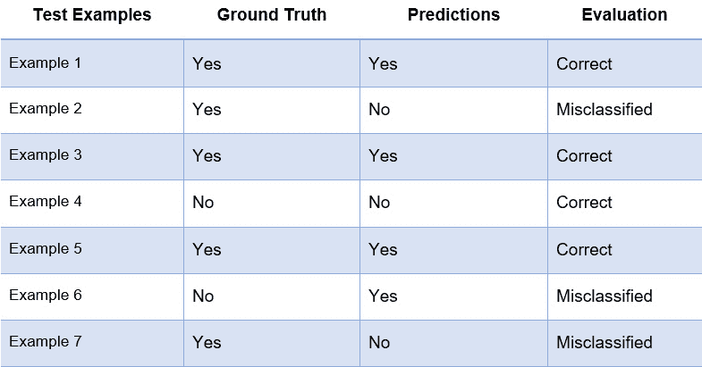

图 3.44：生成混淆矩阵

上面的表格展示了一个包含七个示例的虚拟数据集。第二列是实际标签（真实标签），第三列包含我们的预测结果。从数据中可以看出，四个示例被正确分类，三个示例被错误分类。

混淆矩阵生成了预测与实际标签之间的对比，如下表所示：

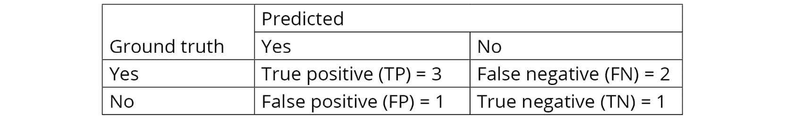

图 3.45：混淆矩阵

从表格中可以看出，有五个示例的标签（真实标签）为`Yes`，剩下的两个示例标签为`No`。

混淆矩阵的第一行是对标签`Yes`的评估。`True positive`表示那些真实标签和预测标签均为`Yes`的示例（示例 1、3 和 5）。`False negative`表示那些真实标签为`Yes`，但被错误预测为`No`的示例（示例 2 和 7）。

同样，混淆矩阵的第二行评估标签`No`的表现。`假正例`是指那些真实标签为`No`，但被错误分类为`Yes`的示例（示例 6）。`真负例`是指那些真实标签和预测值都为`No`的示例（示例 4）。

混淆矩阵的生成用于计算许多矩阵，如准确性和分类报告，后续将详细解释。它基于像准确性或其他分类报告中显示的详细指标（如精确度或召回率）等度量标准，用于测试模型。我们通常选择这些指标值最高的模型。

## 准确性

准确性是评估的第一级，我们将依赖它来快速检查模型的表现。参考前面的表格，准确性可以表示如下：


图 3.46：表示准确性的函数

准确性是指所有预测中正确预测的比例。

## 分类报告

分类报告输出三个关键指标：**精确度**、**召回率**和**F1 分数**。

精确度是指真正例数与真正例数和假正例数之和的比例：


图 3.47：精确度比例

精确度是衡量在所有预测为正的实例中，实际为正的实例所占的比例。

召回率是指真正例数与真正例数和假负例数之和的比例：


图 3.48：召回率

召回率表现了模型识别所有真正例的能力。

F1 分数是精确度和召回率的加权得分。F1 分数为 1 表示最佳表现，0 表示最差表现。

在下一节中，我们将深入了解数据预处理，这是处理数据并得出结论时的重要过程。

## 数据预处理

数据预处理在数据科学项目的生命周期中起着重要作用。这些过程通常是数据科学生命周期中最耗时的部分。谨慎实施预处理步骤至关重要，将对数据科学项目的结果产生重大影响。

各种预处理步骤包括以下内容：

+   **数据加载**：这涉及将数据从不同的来源加载到笔记本中。

+   **数据清洗**：数据清洗过程包括移除异常数据，例如特殊字符、重复数据，并识别数据集中缺失的部分。数据清洗是数据科学过程中最耗时的步骤之一。

+   **数据插补**：数据插补是用新的数据点填补缺失数据。

+   **转换数据类型**：数据集将包含不同类型的数据，如数值数据、类别数据和字符数据。运行模型时需要对数据类型进行转换。

    注意

    数据处理将在本书接下来的章节中详细讨论。

我们将在后续部分以及*练习 3.06*中实现其中一些预处理步骤，*《用于预测银行定期存款购买倾向的逻辑回归模型》*。

## 练习 3.06：用于预测银行定期存款购买倾向的逻辑回归模型

在本次练习中，我们将构建一个逻辑回归模型，用于预测定期存款购买的倾向。这个练习分为三个部分。第一部分是数据预处理，第二部分处理训练过程，最后一部分将用于预测、指标分析以及制定进一步改进模型的策略。

你从数据预处理开始。

在这一部分中，我们将首先加载数据，将有序数据转换为虚拟变量数据，然后将数据拆分为训练集和测试集，以便进入随后的训练阶段：

1.  打开一个 Colab 笔记本，挂载驱动器，安装必要的包，并加载数据，方法与之前的练习相同：

    ```py
    import pandas as pd
    import altair as alt
    file_url = 'https://raw.githubusercontent.com'\
               '/PacktWorkshops/The-Data-Science-Workshop'\
               '/master/Chapter03/bank-full.csv'
    bankData = pd.read_csv(file_url, sep=";")
    ```

1.  现在，加载库函数和数据：

    ```py
    from sklearn.linear_model import LogisticRegression
    from sklearn.model_selection import train_test_split
    ```

1.  现在，找出数据类型：

    ```py
    bankData.dtypes
    ```

    你应该得到以下输出：

    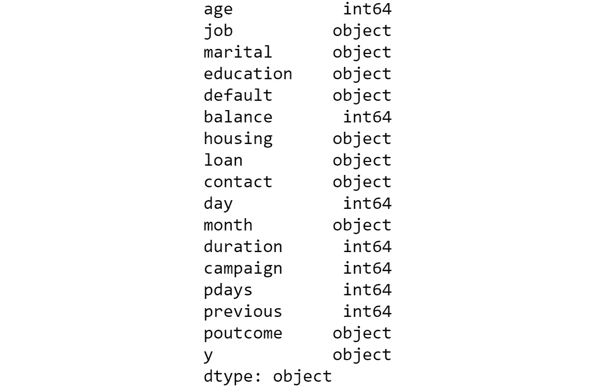

    图 3.49：数据类型

1.  将有序数据转换为虚拟变量数据。

    正如你在数据集中看到的，我们有两种类型的数据：数值数据和有序数据。机器学习算法需要数据的数值表示，因此我们必须通过创建虚拟变量将有序数据转换为数值形式。虚拟变量的值为 1 或 0，取决于该类别是否存在。我们用于将有序数据转换为数值形式的函数是`pd.get_dummies()`。这个函数将数据结构转换为长格式或横向格式。所以，如果一个变量有三个类别，就会创建三个新的虚拟变量，分别对应每个类别。

    每个变量的值将是 1 或 0，具体取决于该类别是否在变量中作为示例出现。我们来看一下执行此操作的代码：

    ```py
    """
    Converting all the categorical variables to dummy variables
    """
    bankCat = pd.get_dummies\
              (bankData[['job','marital',\
                         'education','default','housing',\
                         'loan','contact','month','poutcome']])
    bankCat.shape
    ```

    你应该得到以下输出：

    ```py
    (45211, 44)
    ```

    现在，我们有了一个新的数据子集，对应于已经转换为数值形式的类别数据。此外，原始数据集中还有一些数值变量，它们不需要任何转换。转换后的类别数据和原始的数值数据需要合并，以获取所有的原始特征。为了合并这两者，让我们首先从原始数据框中提取数值数据。

1.  现在，分离数值变量：

    ```py
    bankNum = bankData[['age','balance','day','duration',\
                        'campaign','pdays','previous']]
    bankNum.shape
    ```

    你应该得到以下输出：

    ```py
    (45211, 7)
    ```

1.  现在，准备`X`和`Y`变量，并打印`Y`的形状。`X`变量是转换后的类别变量和分离出的数值数据的连接：

    ```py
    # Preparing the X variables
    X = pd.concat([bankCat, bankNum], axis=1)
    print(X.shape)
    # Preparing the Y variable
    Y = bankData['y']
    print(Y.shape)
    X.head()
    ```

    下方显示的输出已被截断：

    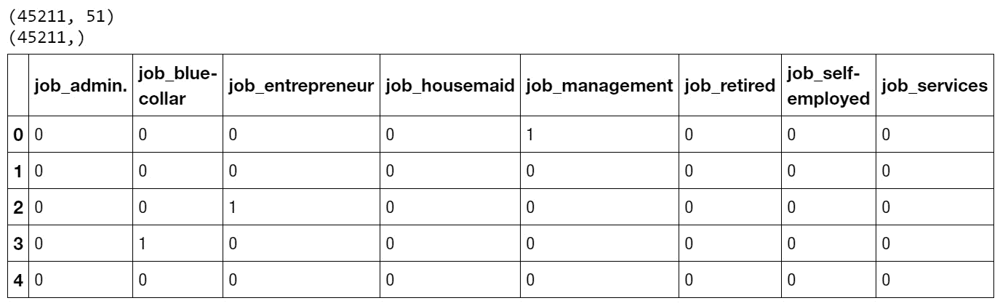

    图 3.50 合并类别和数值数据框

    一旦 DataFrame 创建完成，我们可以将数据分割为训练集和测试集。我们指定 DataFrame 应该以什么样的比例分割成训练集和测试集。

1.  将数据分割为训练集和测试集：

    ```py
    # Splitting the data into train and test sets
    X_train, X_test, y_train, y_test = train_test_split\
                                       (X, Y, test_size=0.3, \
                                        random_state=123)
    ```

    现在，数据已经为建模任务做好了准备。接下来，我们开始建模。

    在这一部分，我们将使用之前创建的训练集来训练模型。首先，我们调用`logistic regression`函数，然后用训练集数据拟合模型。

1.  定义`LogisticRegression`函数：

    ```py
    bankModel = LogisticRegression()
    bankModel.fit(X_train, y_train)
    ```

    你应该得到以下输出：

    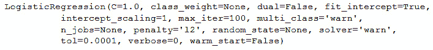

    图 3.51：拟合模型的参数

1.  现在，模型已经创建，使用它对测试集进行预测，然后获取预测的准确度：

    ```py
    pred = bankModel.predict(X_test)
    print('Accuracy of Logistic regression model' \
          'prediction on test set: {:.2f}'\
          .format(bankModel.score(X_test, y_test)))
    ```

    你应该得到以下输出：

    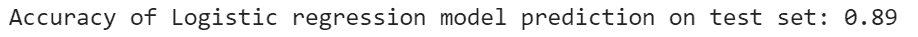

    图 3.52：使用模型进行预测

1.  从初步来看，90%的准确度给人一种模型已经很好地逼近数据生成过程的印象。真的是这样吗？让我们通过生成模型的指标，仔细看看预测的细节。我们将使用两个生成指标的函数，混淆矩阵和分类报告：

    ```py
    # Confusion Matrix for the model
    from sklearn.metrics import confusion_matrix
    confusionMatrix = confusion_matrix(y_test, pred)
    print(confusionMatrix)
    ```

    你应该得到以下格式的输出；然而，由于建模任务的随机性，数值可能有所不同：

    

    图 3.53：生成混淆矩阵

    注意

    你得到的最终结果将与这里看到的不同，因为这取决于你使用的系统。这是因为建模部分具有随机性，结果总会有所不同。

1.  接下来，我们生成一个`classification_report`：

    ```py
    from sklearn.metrics import classification_report
    print(classification_report(y_test, pred))
    ```

    你应该得到类似的输出；然而，由于建模过程中的变异性，数值会有所不同：

    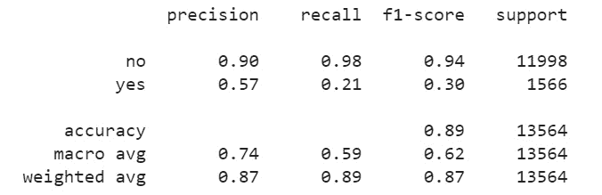

图 3.54：混淆矩阵和分类报告

注意

要访问此特定部分的源代码，请参考[`packt.live/2CGFYYU`](https://packt.live/2CGFYYU)。

你也可以在[`packt.live/3aDq8KX`](https://packt.live/3aDq8KX)上在线运行这个例子。

从指标中可以看出，在总共 11,998 个`no`的样本中，有 11,754 个被正确分类为`no`，剩下的 244 个被错误分类为`yes`。这给出的召回率是*11,754/11,998*，接近 98%。从精度的角度来看，在总共 12,996 个被预测为`no`的样本中，只有 11,754 个是真正的`no`，这使得我们的精度为 11,754/12,996，或者 90%。

然而，`yes`的指标给出了不同的结果。在总共 1,566 个`yes`的样本中，只有 324 个被正确识别为`yes`。这给出的召回率是*324/1,566 = 21%*。精度是*324 / (324 + 244) = 57%*。

从整体准确度的角度来看，可以通过以下公式计算：正确分类的*样本 / 总样本 = (11754 + 324) / 13564 = 89%*。

当你只看准确度时，指标可能看起来不错。然而，仔细看细节，我们可以看到分类器实际上在分类`yes`样本时表现不佳。该分类器已被训练为主要预测`no`值，而从业务角度来看，这是没有用的。从业务角度来看，我们主要希望预测到`yes`的样本，以便能够将这些样本作为目标进行精准营销，尝试销售定期存款。然而，凭借当前的结果，我们似乎未能很好地帮助业务通过定期存款销售增加收入。

在本练习中，我们进行了数据预处理，然后进行了训练过程，最后，我们得到了有用的预测结果、指标分析，并提出了进一步改进模型的策略。

我们现在构建的模型是第一个模型，或者说是基准模型。下一步是通过不同的策略尝试改进基准模型。一个这样的策略是进行特征工程，构建包含新特征的新模型。让我们在下一活动中实现这一点。

## 活动 3.02：模型迭代 2——使用特征工程变量的逻辑回归模型

作为银行的数据科学家，你创建了一个基准模型来预测哪些客户可能会购买定期存款。然而，管理层希望改善基准模型中的结果。在*练习 3.04*中，*特征工程——从现有特征创建新特征*，你与营销和运营团队讨论了业务场景，并通过特征工程创建了一个新变量`assetIndex`，该变量由三个原始变量组成。现在，你正在对特征工程后的变量拟合另一个逻辑回归模型，并努力改进结果。

在此活动中，你将进行一些变量的特征工程，以验证它们对预测结果的影响。

步骤如下：

1.  打开用于*练习 3.04*中*特征工程——从现有特征创建新特征*的 Colab 笔记本，并执行该练习中的所有步骤。

1.  使用`pd.get_dummies()`函数为分类变量创建虚拟变量。排除诸如贷款和住房等原始变量，它们用于创建新的变量`assetIndex`。

1.  选择数值变量，包括创建的新特征变量`assetIndex`。

1.  通过使用`MinMaxScaler()`函数对一些数值变量进行标准化处理。

1.  使用`pd.concat()`函数连接数值变量和分类变量，然后创建`X`和`Y`变量。

1.  使用`train_test_split()`函数拆分数据集，然后使用`LogisticRegression()`模型在新特征上拟合一个新模型。

1.  在生成混淆矩阵和分类报告后分析结果。

    你应该获得以下输出：

    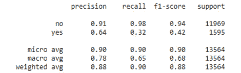

    ](img/B15019_03_55.jpg)

图 3.55：包含分类报告的预期输出

分类报告将类似于这里展示的报告。然而，由于建模过程中的变动，数值可能会有所不同。

注意

本活动的解决方案可以在以下地址找到：[`packt.live/2GbJloz`](https://packt.live/2GbJloz)。

现在让我们讨论接下来需要采取的步骤，以改进我们从两次迭代中得到的度量。

## 下一步

我们可以问的下一个明显问题是，在本章中我们已经实现的所有过程之后，我们应该走向哪里？让我们讨论可以采取的策略以进一步改进：

+   `no`类别。当类别不平衡时，分类器很可能会对多数类过拟合。这在我们的示例中也得到了验证。这也是为什么我们不应该仅仅通过查看准确率来得出分类器性能结论的原因。

    类别不平衡在许多应用场景中都很常见，如欺诈检测、医疗诊断和客户流失等。针对类别不平衡问题有不同的解决策略。我们将在*第十三章*，*不平衡数据集*中处理类别不平衡的场景。

+   **特征工程**：数据科学是一门迭代的科学。获得理想的结果将取决于我们进行的各种实验。改进初始模型的一个重要方向是通过特征工程对原始变量进行修改。我们进行了特征工程，并使用特征工程变量建立了模型。在创建新特征的过程中，我们跟随了一条与资产组合相关的新特征创建路径。同样，从业务角度出发，可能会有其他路径可以追踪，这些路径有可能会生成与我们创建的特征类似的更多特征。识别这些路径将取决于通过我们制定的假设以及我们进行的探索性分析来验证这些业务假设，从而扩展我们应用的业务知识。一种有效提升模型准确性的方法是识别更多的业务路径，然后通过创新的特征工程来构建模型。

+   **模型选择策略**：当我们讨论参数模型和非参数模型时，我们提到如果真实的数据生成过程与我们假设的模型不一致，那么结果将会很差。在我们的案例中，我们假设了线性关系，因此采用了线性模型。如果真实的数据生成过程不是线性的呢？或者，是否存在其他更适合此用例的参数模型或非参数模型？这些都是在分析结果并尝试改进模型时需要考虑的问题。我们必须采取一种叫做模型抽查的策略，即使用不同的模型来处理用例，并在采用模型之前检查初始指标。在后续的章节中，我们将讨论其他建模技术，建议尝试使用其他类型的模型来抽查哪个建模技术更适合此用例。

# 总结

在本章中，我们从解决一个实际案例的角度学习了使用逻辑回归进行二分类。让我们总结一下本章的学习内容。我们介绍了分类问题，特别是二分类问题。我们还从通过业务发现过程预测定期存款倾向的角度来审视分类问题。在业务发现过程中，我们识别了影响业务结果的不同业务驱动因素。

从探索性分析中得出的直觉被用来从原始变量中创建新特征。我们建立了一个基准逻辑回归模型，并分析了指标，以确定未来的行动方向，然后通过引入特征工程变量建立第二个模型，对基准模型进行了迭代。

在掌握了解决二分类问题的技巧后，是时候迈出下一步了。在下一章中，你将处理多分类问题，并会介绍不同的解决这些问题的技术。
