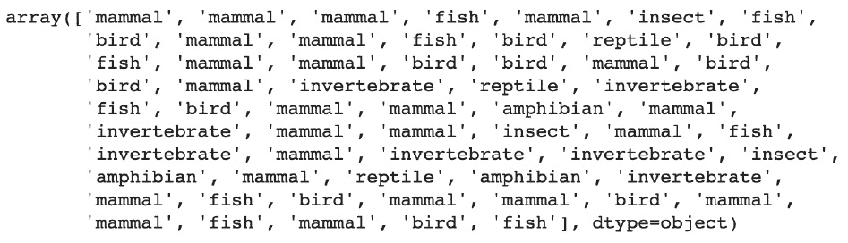

# 第四章：4\. 使用随机森林进行多类分类

概述

本章将展示如何使用随机森林算法训练一个多类分类器。你还将看到如何评估多类模型的性能。

本章结束时，你将能够实现一个随机森林分类器，并调节超参数以提高模型性能。

# 引言

在上一章中，你学习了如何使用著名的**逻辑回归**算法构建一个二分类器。二分类器只能为其响应变量取两个不同的值，如 0 和 1 或是与否。多类分类任务则是二分类的扩展，其响应变量可以有超过两个不同的值。

在数据科学行业中，你经常会遇到多类分类问题。例如，如果你为 Netflix 或任何其他流媒体平台工作，你需要构建一个模型，能够根据关键属性如类型、时长或演员来预测电影的用户评分。可能的评分值列表包括：*讨厌*、*不喜欢*、*中立*、*喜欢*、*非常喜欢*。该模型的目标是从这五个可能值中预测正确的评分。

多类分类并不总是意味着响应变量是文本。在某些数据集中，目标变量可能已被编码成数字形式。以之前讨论的示例为例，评分可能会从 1 到 5 编码：1 表示*讨厌*，2 表示*不喜欢*，3 表示*中立*，以此类推。因此，在断定这是回归问题之前，首先理解该响应变量的含义非常重要。

在接下来的章节中，我们将学习如何训练第一个随机森林分类器。

# 训练一个随机森林分类器

在本章中，我们将使用随机森林算法进行多类分类。市场上有其他算法，但随机森林可能是最受欢迎的算法之一，尤其适用于此类项目。

随机森林方法最早由 Tin Kam Ho 于 1995 年提出，但它是在 2001 年由 Leo Breiman 首次发展的。

所以，随机森林并不是一种最近的算法。它已经使用了近二十年。但由于其优异的性能和简洁性，它的受欢迎程度并没有消退。

在本章的示例中，我们将使用一个名为“基于多传感器数据的活动识别系统”的数据集。该数据集最初由*F. Palumbo, C. Gallicchio, R. Pucci, 和 A. Micheli, 《基于水库计算的多传感器数据融合的人类活动识别》，《环境智能与智能环境杂志》，2016 年，第 8 卷第 2 期，第 87-107 页*分享。

注意

完整的数据集可以在这里找到：[`packt.live/3a5FI1s`](https://packt.live/3a5FI1s%20)

让我们看看如何在这个数据集上训练一个随机森林分类器。首先，我们需要使用`pandas`从 GitHub 仓库加载数据，然后使用`head()`方法打印出数据集的前五行。

注意

本章中所有练习外的示例代码都与这个活动识别数据集相关。建议将所有这些示例中的代码输入并运行在一个单独的 Google Colab 笔记本中，并与练习笔记本分开。

```py
import pandas as pd
file_url = 'https://raw.githubusercontent.com/PacktWorkshops'\
           '/The-Data-Science-Workshop/master/Chapter04/'\
           'Dataset/activity.csv'
df = pd.read_csv(file_url)
df.head()
```

输出将如下所示：


图 4.1：数据集的前五行

每一行代表一个人执行的活动，活动的名称存储在`Activity`列中。这个变量中有七种不同的活动：`bending1`、`bending2`、`cycling`、`lying`、`sitting`、`standing`和`Walking`。其他六列是从传感器数据中获取的不同测量值。

在这个示例中，您将通过随机森林模型准确地预测目标变量（`'Activity'`），其特征是六个其他列。例如，对于前面的示例中的第一行，模型将接收以下特征作为输入，并预测`'bending1'`类别：


图 4.2：数据集第一行的特征

但在此之前，我们需要做一些数据准备工作。`sklearn`包（我们将用它来训练随机森林模型）要求目标变量和特征变量分开。因此，我们需要使用`.pop()`方法从`pandas`中提取响应变量。`.pop()`方法提取指定的列并将其从数据框中删除：

```py
target = df.pop('Activity')
```

现在，响应变量包含在名为`target`的变量中，所有特征存储在名为`df`的数据框中。

现在我们将数据集分割为训练集和测试集。模型使用训练集来学习预测响应变量的相关参数。测试集用于检查模型是否能够准确预测未见过的数据。当模型只学习了与训练集相关的模式，并且对测试集做出了不正确的预测时，我们称模型发生了过拟合。在这种情况下，模型在训练集上的表现会明显高于测试集。理想情况下，我们希望训练集和测试集的表现水平非常相似。这个话题将在*第七章*《机器学习模型的泛化》中深入讨论。

`sklearn`包提供了一个名为`train_test_split()`的函数，用于随机地将数据集分割成两个不同的子集。我们需要为此函数指定以下参数：特征变量和目标变量、测试集的比例（`test_size`）以及`random_state`，以便在需要重新运行代码时获得可重复的结果：

```py
from sklearn.model_selection import train_test_split
X_train, X_test, y_train, y_test = train_test_split\
                                   (df, target, test_size=0.33, \
                                    random_state=42)
```

`train_test_split()`函数有四个不同的输出：训练集的特征、训练集的目标变量、测试集的特征和测试集的目标变量。

现在我们已经准备好了训练集和测试集，可以开始建模了。让我们首先从`sklearn.ensemble`导入`RandomForestClassifier`类：

```py
from sklearn.ensemble import RandomForestClassifier
```

现在我们可以使用一些超参数实例化随机森林分类器。请记住，在*第一章，Python 中的数据科学入门*中提到，超参数是模型无法学习的参数，而是由数据科学家设置的，用来调整模型的学习过程。这个主题将在*第八章，超参数调优*中进行更深入的讲解。现在，我们只需指定`random_state`值。在接下来的章节中，我们将介绍一些关键的超参数：

```py
rf_model = RandomForestClassifier(random_state=1, \
                                  n_estimators=10)
```

下一步是使用训练数据对模型进行训练（也叫做拟合）。在此过程中，模型将尝试学习响应变量与自变量之间的关系，并保存学到的参数。我们需要将特征和目标变量作为参数指定：

```py
rf_model.fit(X_train, y_train)
```

输出结果如下：


图 4.3：训练后的随机森林日志

现在模型已经完成训练，我们可以使用它学到的参数对我们将提供的输入数据进行预测。在以下示例中，我们使用的是来自训练集的特征：

```py
preds = rf_model.predict(X_train)
```

现在我们可以打印这些预测结果：

```py
preds
```

输出结果如下：


图 4.4：随机森林算法在训练集上的预测结果

该输出显示了模型分别预测了前 3 个观测值为`lying`、`bending1`和`cycling`，以及最后 3 个观测值为`cycling`、`bending1`和`standing`。默认情况下，Python 会截断长列表的输出，这就是为什么这里只显示了六个值。

这些基本上就是训练随机森林分类器所需的关键步骤。这相当简单，对吧？训练机器学习模型非常容易，但获取有意义且准确的结果才是挑战所在。在下一节中，我们将学习如何评估已训练模型的性能。

# 评估模型的性能

既然我们已经知道如何训练随机森林分类器，接下来就该检查我们是否做得好。我们想要得到一个可以做出极其准确预测的模型，因此我们需要使用某种度量来评估其性能。

对于分类问题，可以使用多种度量来评估模型的预测能力，例如 F1 分数、精确度、召回率或 ROC AUC。每种度量有其特定的应用场景，具体使用哪一种取决于项目和数据集。

在本章中，我们将使用一个叫做**准确度评分**的度量标准。它计算正确预测的数量与模型所做预测总数之间的比例：


图 4.5：准确度评分公式

例如，如果你的模型在 1000 个案例中做出了 950 个正确预测，那么准确度评分就是 950/1000 = 0.95。 这意味着你的模型在该数据集上的准确度为 95%。`sklearn` 包提供了一个函数来自动计算这个评分，称为 `accuracy_score()`。我们需要先导入它：

```py
from sklearn.metrics import accuracy_score
```

然后，我们只需要提供一些观测值的预测列表和对应的目标变量的真实值。使用之前的例子，我们将使用 `y_train` 和 `preds` 变量，分别包含训练集的响应变量（也称为目标）和 Random Forest 模型所做的相应预测。我们将重用前一节的预测——`preds`：

```py
accuracy_score(y_train, preds)
```

输出结果如下：


图 4.6：训练集上的准确度评分

我们在训练数据上取得了 0.988 的准确度评分。这意味着我们准确地预测了超过`98%`的情况。不幸的是，这并不意味着你可以在新的、未见过的数据上达到如此高的评分。你的模型可能只是学习到了与该训练集相关的模式，在这种情况下，模型会发生过拟合。

如果我们以学生学习某个学科一个学期为类比，他们可能能背诵课本上的所有习题，但当给出一个类似但未见过的习题时，他们却无法解答。理想情况下，学生应该理解该学科的基本概念，并能够将这些知识应用到任何类似的习题中。这与我们的模型完全相同：我们希望它学习到有助于在未见数据上做出准确预测的通用模式。

那么，我们如何评估模型在未见数据上的表现呢？有没有一种方法可以进行这种评估？这些问题的答案是肯定的。

请记住，在上一节中，我们将数据集分为训练集和测试集。我们使用训练集来拟合模型并评估其在该数据集上的预测能力。但它根本没有见过测试集中的观测数据，所以我们可以用它来评估我们的模型是否能够对未见数据进行泛化。让我们计算测试集的准确度评分：

```py
test_preds = rf_model.predict(X_test)
accuracy_score(y_test, test_preds)
```

输出结果如下：


图 4.7：测试集上的准确度评分

好的。现在准确率已经大幅下降到`0.77`。训练集和测试集之间的差距相当大。这告诉我们我们的模型实际上是过拟合了，只学到了与训练集相关的模式。在理想情况下，模型在这两个集上的表现应该相等或非常接近。

在接下来的章节中，我们将调整一些随机森林的超参数，以减少过拟合。

## 练习 4.01：构建分类动物类型的模型并评估其表现

在这个练习中，我们将训练一个随机森林分类器，根据动物的属性预测其类型，并检查其准确度评分：

注：

我们将使用的数据集是由 Richard S. Forsyth 共享的动物园数据集：[`packt.live/36DpRVK`](https://packt.live/36DpRVK)。该数据集的 CSV 版本可以在这里找到：[`packt.live/37RWGhF`](https://packt.live/37RWGhF)。

1.  打开一个新的 Colab 笔记本。

1.  导入`pandas`包：

    ```py
    import pandas as pd
    ```

1.  创建一个名为`file_url`的变量，包含数据集的 URL：

    ```py
    file_url = 'https://raw.githubusercontent.com'\
               '/PacktWorkshops/The-Data-Science-Workshop'\
               '/master/Chapter04/Dataset'\
               '/openml_phpZNNasq.csv'
    ```

1.  使用`pandas`的`.read_csv()`方法将数据集加载到数据框中：

    ```py
    df = pd.read_csv(file_url)
    ```

1.  打印数据框的前五行：

    ```py
    df.head()
    ```

    你应该得到以下输出：

    

    图 4.8：数据框的前五行

    我们将使用`type`列作为我们的目标变量。我们需要从数据框中移除`animal`列，只使用其余的列作为特征。

1.  使用`pandas`的`.drop()`方法删除`'animal'`列，并指定`columns='animal'`和`inplace=True`参数（直接更新原始数据框）：

    ```py
    df.drop(columns='animal', inplace=True)
    ```

1.  使用`pandas`的`.pop()`方法提取`'type'`列：

    ```py
    y = df.pop('type')
    ```

1.  打印更新后的数据框的前五行：

    ```py
    df.head()
    ```

    你应该得到以下输出：

    

    图 4.9：数据框的前五行

1.  从`sklearn.model_selection`导入`train_test_split`函数：

    ```py
    from sklearn.model_selection import train_test_split
    ```

1.  使用`df`、`y`、`test_size=0.4`和`random_state=188`参数将数据集分成训练集和测试集：

    ```py
    X_train, X_test, y_train, y_test = train_test_split\
                                       (df, y, test_size=0.4, \
                                        random_state=188)
    ```

1.  从`sklearn.ensemble`导入`RandomForestClassifier`：

    ```py
    from sklearn.ensemble import RandomForestClassifier
    ```

1.  使用`random_state`等于`42`实例化`RandomForestClassifier`对象。将`n_estimators`值设置为初始默认值`10`。我们稍后将讨论更改此值如何影响结果。

    ```py
    rf_model = RandomForestClassifier(random_state=42, \
                                      n_estimators=10)
    ```

1.  使用训练集拟合`RandomForestClassifier`：

    ```py
    rf_model.fit(X_train, y_train)
    ```

    你应该得到以下输出：

    

    图 4.10：RandomForestClassifier 的日志

1.  使用`.predict()`方法预测训练集的结果，将结果保存在一个名为`train_preds`的变量中，并打印其值：

    ```py
    train_preds = rf_model.predict(X_train)
    train_preds
    ```

    你应该得到以下输出：

    

    图 4.11：训练集上的预测结果

1.  从`sklearn.metrics`导入`accuracy_score`函数：

    ```py
    from sklearn.metrics import accuracy_score
    ```

1.  计算训练集上的准确率，将结果保存到名为`train_acc`的变量中，并打印其值：

    ```py
    train_acc = accuracy_score(y_train, train_preds)
    print(train_acc)
    ```

    您应该得到以下输出：

    

    图 4.12: 训练集上的准确率

    我们的模型在训练集上的准确率为`1`，这意味着它在所有观察值上都完美地预测了目标变量。现在让我们查看在测试集上的表现。

1.  使用`.predict()`方法预测测试集的结果，并将结果保存到一个名为`test_preds`的变量中：

    ```py
    test_preds = rf_model.predict(X_test)
    ```

1.  计算测试集上的准确率，将结果保存到名为`test_acc`的变量中，并打印其值：

    ```py
    test_acc = accuracy_score(y_test, test_preds)
    print(test_acc)
    ```

    您应该得到以下输出：

    

图 4.13: 测试集上的准确率

在这个练习中，我们训练了一个随机森林模型来预测动物的种类，基于它们的关键属性。我们的模型在训练集上的准确率达到了完美的`1`，但在测试集上的准确率只有`0.88`。这意味着我们的模型发生了过拟合，缺乏足够的泛化能力。理想的情况是，模型在训练集和测试集上的准确率应非常相似且较高。

注意

要查看这一特定部分的源代码，请参考 [`packt.live/2Q4jpQK`](https://packt.live/2Q4jpQK)。

你也可以在线运行这个示例，网址是 [`packt.live/3h6JieL`](https://packt.live/3h6JieL)。

## 树的数量估计器

现在我们已经知道如何拟合一个随机森林分类器并评估其性能，是时候深入探讨细节了。在接下来的章节中，我们将学习如何调整一些对该算法非常重要的超参数。如*第一章：Python 中的数据科学简介*所述，超参数是机器学习算法无法自动学习的参数。它们的值必须由数据科学家设置。这些超参数对模型的性能、其对未见数据的泛化能力以及从数据中学习模式所需的时间有着巨大影响。

在本节中，您将首先关注一个名为`n_estimators`的超参数。这个超参数负责定义`RandomForest`算法将训练的树的数量。

在查看如何调整这个超参数之前，我们需要了解什么是树以及它为什么对`RandomForest`算法如此重要。

一棵树是一个逻辑图，它在每个节点处映射一个决策及其结果。简单来说，它是一系列是/否（或真/假）的问题，指向不同的结果。

叶子是一个特殊类型的节点，模型将在此处进行预测。叶子之后不会再进行分裂。一个树的单节点分裂可能如下所示：


图 4.14: 单一树节点的示例

一棵树的节点由一个问题和两个结果组成，取决于问题定义的条件是否满足。在前面的例子中，问题是 `avg_rss12 > 41?` 如果答案是“是”，结果就是 `bending_1` 叶子，如果答案是否定的，那么结果就是 `sitting` 叶子。

一棵树就是由一系列节点和叶子组成：


](img/B15019_04_15.jpg)

图 4.15：树的示例

在前面的例子中，这棵树由三个具有不同问题的节点组成。现在，为了预测一个观察值为 `sitting`，它需要满足以下条件：`avg_rss13 <= 41`，`var_rss > 0.7`，和 `avg_rss13 <= 16.25`。

`RandomForest` 算法将根据它看到的训练数据构建这种类型的树。我们不会详细讨论它如何定义每个节点的分割，但基本上，它会遍历数据集的每一列，看看哪个分割值能最好地帮助将数据分为两个相似类别的组。以前面的例子为例，带有 `avg_rss13 > 41` 条件的第一个节点有助于将左侧的数据分组，其中大多数属于 `bending_1` 类别。`RandomForest` 算法通常会构建多个这种类型的树，这也是它被称为森林的原因。

如你现在可能已经猜到，`n_estimators` 超参数用于指定 `RandomForest` 算法将构建的树的数量。例如（如前面的练习中所示），假设我们要求它构建 10 棵树。对于给定的观察，它将让每棵树进行预测。然后，它会对这些预测结果求平均，并将结果作为该输入的最终预测。例如，如果在 10 棵树中，有 8 棵预测结果为 `sitting`，那么 `RandomForest` 算法将使用这个结果作为最终预测。

注意

如果你没有传入特定的 `n_estimators` 超参数，它将使用默认值。默认值取决于你使用的 scikit-learn 版本。在早期版本中，默认值为 10。在 0.22 版本及以后，默认值为 100。你可以通过执行以下代码来查看你使用的版本：

`import sklearn`

`sklearn.__version__`

更多信息，请参见：[`scikit-learn.org/stable/modules/generated/sklearn.ensemble.RandomForestClassifier.html`](https://scikit-learn.org/stable/modules/generated/sklearn.ensemble.RandomForestClassifier.html)

通常来说，树的数量越多，性能越好。让我们看看 `n_estimators = 2` 时在活动识别数据集上的表现：

```py
rf_model2 = RandomForestClassifier(random_state=1, \
                                   n_estimators=2)
rf_model2.fit(X_train, y_train)
preds2 = rf_model2.predict(X_train)
test_preds2 = rf_model2.predict(X_test)
print(accuracy_score(y_train, preds2))
print(accuracy_score(y_test, test_preds2))
```

输出将如下所示：


](img/B15019_04_16.jpg)

图 4.16：`n_estimators = 2` 时 RandomForest 的准确率

如预期的那样，准确度明显低于前面 `n_estimators = 10` 的例子。现在让我们试试 `50` 棵树：

```py
rf_model3 = RandomForestClassifier(random_state=1, \
                                   n_estimators=50)
rf_model3.fit(X_train, y_train)
preds3 = rf_model3.predict(X_train)
test_preds3 = rf_model3.predict(X_test)
print(accuracy_score(y_train, preds3))
print(accuracy_score(y_test, test_preds3))
```

输出将如下所示：


图 4.17：n_estimators=50 的随机森林准确度

使用`n_estimators=50`时，我们在训练集和测试集的准确度上分别提高了`1%`和`2%`，这非常好。但增加树木数量的主要缺点是需要更多的计算能力。因此，训练模型的时间会更长。在实际项目中，你需要找到性能与训练时长之间的最佳平衡。

## 练习 4.02：调整 n_estimators 以减少过拟合

在本练习中，我们将训练一个随机森林分类器，基于动物的属性预测其类型，并尝试`n_estimators`超参数的两个不同值：

我们将使用与之前练习相同的动物园数据集。

1.  打开一个新的 Colab 笔记本。

1.  导入`pandas`包，`train_test_split`，`RandomForestClassifier`，和`accuracy_score`从`sklearn`中：

    ```py
    import pandas as pd
    from sklearn.model_selection import train_test_split
    from sklearn.ensemble import RandomForestClassifier
    from sklearn.metrics import accuracy_score
    ```

1.  创建一个名为`file_url`的变量，包含数据集的 URL：

    ```py
    file_url = 'https://raw.githubusercontent.com'\
               '/PacktWorkshops/The-Data-Science-Workshop'\
               '/master/Chapter04/Dataset'\
               '/openml_phpZNNasq.csv'
    ```

1.  使用`.read_csv()`方法从`pandas`加载数据集到 DataFrame 中：

    ```py
    df = pd.read_csv(file_url)
    ```

1.  使用`.drop()`删除`animal`列，然后使用`.pop()`将`type`目标变量提取到一个新变量`y`中：

    ```py
    df.drop(columns='animal', inplace=True)
    y = df.pop('type')
    ```

1.  使用`train_test_split()`将数据分为训练集和测试集，并设置`test_size=0.4`和`random_state=188`参数：

    ```py
    X_train, X_test, y_train, y_test = train_test_split\
                                       (df, y, test_size=0.4, \
                                        random_state=188)
    ```

1.  使用`random_state=42`和`n_estimators=1`实例化`RandomForestClassifier`，然后用训练集拟合模型：

    ```py
    rf_model = RandomForestClassifier(random_state=42, \
                                      n_estimators=1)
    rf_model.fit(X_train, y_train)
    ```

    你应该会得到以下输出：

    

    图 4.18：随机森林分类器的日志

1.  使用`.predict()`对训练集和测试集进行预测，并将结果保存到两个新变量`train_preds`和`test_preds`中：

    ```py
    train_preds = rf_model.predict(X_train)
    test_preds = rf_model.predict(X_test)
    ```

1.  计算训练集和测试集的准确度分数，并将结果保存到两个新变量`train_acc`和`test_acc`中：

    ```py
    train_acc = accuracy_score(y_train, train_preds)
    test_acc = accuracy_score(y_test, test_preds)
    ```

1.  打印准确度分数：`train_acc`和`test_acc`：

    ```py
    print(train_acc)
    print(test_acc)
    ```

    你应该会得到以下输出：

    

    图 4.19：训练集和测试集的准确度分数

    训练集和测试集的准确度分数都有所下降。但现在，与*练习 4.01*《构建动物分类模型并评估其性能》中的结果相比，二者之间的差异较小。

1.  使用`random_state=42`和`n_estimators=30`实例化另一个`RandomForestClassifier`，然后用训练集拟合模型：

    ```py
    rf_model2 = RandomForestClassifier(random_state=42, \
                                       n_estimators=30)
    rf_model2.fit(X_train, y_train)
    ```

    你应该会得到以下输出：

    

    图 4.20：n_estimators=30 的随机森林日志

1.  使用`.predict()`对训练集和测试集进行预测，并将结果保存到两个新变量`train_preds2`和`test_preds2`中：

    ```py
    train_preds2 = rf_model2.predict(X_train)
    test_preds2 = rf_model2.predict(X_test)
    ```

1.  计算训练集和测试集的准确率，并将结果保存到名为`train_acc2`和`test_acc2`的两个新变量中：

    ```py
    train_acc2 = accuracy_score(y_train, train_preds2)
    test_acc2 = accuracy_score(y_test, test_preds2)
    ```

1.  打印准确率：`train_acc`和`test_acc`：

    ```py
    print(train_acc2)
    print(test_acc2)
    ```

    你应该会得到以下输出：

    ![图 4.21：训练集和测试集的准确率]

    ](img/B15019_04_21.jpg)

图 4.21：训练集和测试集的准确率

这个输出显示了我们的模型比前一步的结果有了更少的过拟合，并且在训练集上的性能仍然非常高。

在上一个练习中，我们在训练集上获得了准确率`1`，在测试集上获得了`0.88`。在这个练习中，我们训练了两个额外的随机森林模型，分别设置了`n_estimators = 1`和`30`。树木数量最少的模型准确率最低：`0.92`（训练）和`0.8`（测试）。另一方面，将树木数量增加到`30`时，我们达到了更高的准确率：`1`和`0.9`。我们的模型现在过拟合稍微少了些。它并不完美，但这是一个不错的开始。

注意

要访问该部分的源代码，请参考[`packt.live/322x8gz`](https://packt.live/322x8gz)。

你也可以在线运行这个示例，访问[`packt.live/313gUV8`](https://packt.live/313gUV8)。

# 最大深度

在上一节中，我们学习了随机森林如何构建多棵树来进行预测。增加树木数量确实能提高模型的性能，但通常对于减少过拟合的风险帮助不大。我们在上一个示例中的模型在训练集（已经看到的数据）上的表现仍然远远优于在测试集（未见过的数据）上的表现。

因此，我们还不能完全确定模型在生产环境中的表现如何。有多种超参数可以帮助减少随机森林的过拟合风险，其中之一就是`max_depth`。

这个超参数定义了随机森林构建的树的深度。基本上，它告诉随机森林模型，在做出预测之前，最多可以创建多少个节点（问题）。但你可能会问，这样如何帮助减少过拟合呢？嗯，假设你构建了一棵树，并将`max_depth`超参数设置为`50`。这意味着在做出预测之前，你可以提出 49 个不同的问题（值`c`包括最终的叶子节点）。所以，逻辑是：`IF X1 > value1 AND X2 > value2 AND X1 <= value3 AND … AND X3 > value49 THEN predict class A`。

如你所想，这是一条非常特定的规则。最终，它可能仅适用于训练集中的少数几个观测值，这种情况发生得非常少。因此，你的模型会出现过拟合。默认情况下，`max_depth`参数的值是`None`，这意味着树的深度没有设置限制。

你真正想要的是找到一些足够通用的规则，能够应用于更大范围的观察数据。这就是为什么建议不要在随机森林中创建过深的树。我们在活动识别数据集上尝试几个不同的`max_depth`超参数值：`3`、`10`和`50`：

```py
rf_model4 = RandomForestClassifier(random_state=1, \
                                   n_estimators=50, max_depth=3)
rf_model4.fit(X_train, y_train)
preds4 = rf_model4.predict(X_train)
test_preds4 = rf_model4.predict(X_test)
print(accuracy_score(y_train, preds4))
print(accuracy_score(y_test, test_preds4))
```

你应该得到以下输出：


图 4.22：训练集和测试集的准确率，`max_depth = 3`

对于`max_depth = 3`，训练集和测试集的结果非常相似，但整体性能急剧下降至`0.61`。我们的模型不再过拟合，但现在出现了欠拟合；也就是说，它没有很好地预测目标变量（仅在`61%`的情况下预测正确）。让我们将`max_depth`增加到`10`：

```py
rf_model5 = RandomForestClassifier(random_state=1, \
                                   n_estimators=50, \
                                   max_depth=10)
rf_model5.fit(X_train, y_train)
preds5 = rf_model5.predict(X_train)
test_preds5 = rf_model5.predict(X_test)
print(accuracy_score(y_train, preds5))
print(accuracy_score(y_test, test_preds5))
```


图 4.23：训练集和测试集的准确率，`max_depth = 10`

训练集的准确率有所提升，并且与测试集相对接近。我们开始获得一些良好的结果，但模型仍然略微过拟合。接下来，我们将看到`max_depth = 50`的结果：

```py
rf_model6 = RandomForestClassifier(random_state=1, \
                                   n_estimators=50, \
                                   max_depth=50)
rf_model6.fit(X_train, y_train)
preds6 = rf_model6.predict(X_train)
test_preds6 = rf_model6.predict(X_test)
print(accuracy_score(y_train, preds6))
print(accuracy_score(y_test, test_preds6))
```

输出将如下所示：


图 4.24：训练集和测试集的准确率，`max_depth = 50`

训练集的准确率跃升至`0.99`，但测试集的表现提升不大。因此，模型在`max_depth = 50`时出现了过拟合。看起来在这个数据集上，要获得较好的预测效果并避免过拟合的最佳位置是在`max_depth`为`10`时。

## 练习 4.03：调整`max_depth`以减少过拟合

在本练习中，我们将继续调整我们的随机森林分类器，该分类器通过尝试两种不同的`max_depth`超参数值来预测动物类型：

我们将使用与上一练习中相同的动物园数据集。

1.  打开一个新的 Colab 笔记本。

1.  导入`pandas`包、`train_test_split`、`RandomForestClassifier`和`accuracy_score`，这些都来自`sklearn`：

    ```py
    import pandas as pd
    from sklearn.model_selection import train_test_split
    from sklearn.ensemble import RandomForestClassifier
    from sklearn.metrics import accuracy_score
    ```

1.  创建一个名为`file_url`的变量，包含数据集的 URL：

    ```py
    file_url = 'https://raw.githubusercontent.com'\
               'PacktWorkshops/The-Data-Science-Workshop'\
               '/master/Chapter04/Dataset'\
               '/openml_phpZNNasq.csv'
    ```

1.  使用`pandas`的`.read_csv()`方法将数据集加载到一个 DataFrame 中：

    ```py
    df = pd.read_csv(file_url)
    ```

1.  使用`.drop()`删除`animal`列，然后使用`.pop()`将`type`目标变量提取到一个名为`y`的新变量中：

    ```py
    df.drop(columns='animal', inplace=True)
    y = df.pop('type')
    ```

1.  使用`train_test_split()`将数据分为训练集和测试集，参数为`test_size=0.4`和`random_state=188`：

    ```py
    X_train, X_test, y_train, y_test = train_test_split\
                                       (df, y, test_size=0.4, \
                                        random_state=188)
    ```

1.  使用`random_state=42`、`n_estimators=30`和`max_depth=5`实例化`RandomForestClassifier`，然后使用训练集拟合模型：

    ```py
    rf_model = RandomForestClassifier(random_state=42, \
                                      n_estimators=30, \
                                      max_depth=5)
    rf_model.fit(X_train, y_train)
    ```

    你应该得到以下输出：

    

    图 4.25：随机森林日志

1.  使用`.predict()`对训练集和测试集进行预测，并将结果保存在两个新变量中，分别命名为`train_preds`和`test_preds`：

    ```py
    train_preds = rf_model.predict(X_train)
    test_preds = rf_model.predict(X_test)
    ```

1.  计算训练集和测试集的准确度分数，并将结果保存在两个新变量中，分别命名为`train_acc`和`test_acc`：

    ```py
    train_acc = accuracy_score(y_train, train_preds)
    test_acc = accuracy_score(y_test, test_preds)
    ```

1.  打印准确度分数：`train_acc`和`test_acc`：

    ```py
    print(train_acc)
    print(test_acc)
    ```

    你应该得到以下输出：

    

    图 4.26：训练集和测试集的准确度分数

    我们得到的准确度分数与在之前的练习中获得的最佳结果完全相同。对于`max_depth`超参数的这个值并没有影响模型的表现。

1.  实例化另一个`RandomForestClassifier`，并设置`random_state=42`、`n_estimators=30`和`max_depth=2`，然后使用训练集拟合模型：

    ```py
    rf_model2 = RandomForestClassifier(random_state=42, \
                                       n_estimators=30, \
                                       max_depth=2)
    rf_model2.fit(X_train, y_train)
    ```

    你应该得到以下输出：

    

    图 4.27：max_depth = 2 时，RandomForestClassifier 的日志

1.  使用`.predict()`对训练集和测试集进行预测，并将结果保存在两个新变量中，分别命名为`train_preds2`和`test_preds2`：

    ```py
    train_preds2 = rf_model2.predict(X_train)
    test_preds2 = rf_model2.predict(X_test)
    ```

1.  计算训练集和测试集的准确度分数，并将结果保存在两个新变量中，分别命名为`train_acc2`和`test_acc2`：

    ```py
    train_acc2 = accuracy_score(y_train, train_preds2)
    test_acc2 = accuracy_score(y_test, test_preds2)
    ```

1.  打印准确度分数：`train_acc`和`test_acc`：

    ```py
    print(train_acc2)
    print(test_acc2)
    ```

    你应该得到以下输出：

    

图 4.28：训练集和测试集的准确度分数

你在这个练习中学会了如何调整`max_depth`超参数。将其值减少到`2`使得训练集的准确度分数降至 0.9，但也有助于减少训练集和测试集的过拟合（0.83），因此我们将保持这个值作为最优值，并继续下一步。

注意

要访问这一特定部分的源代码，请参考[`packt.live/31YXkIY`](https://packt.live/31YXkIY)。

你也可以在线运行这个示例，链接为[`packt.live/2CCkxYX`](https://packt.live/2CCkxYX)。

# 叶节点的最小样本数

之前，我们学习了如何减少或增加随机森林中的树的深度，并观察了它如何影响性能以及是否会发生过拟合。现在，我们将介绍另一个重要的超参数：`min_samples_leaf`。

这个超参数顾名思义，与树的叶节点有关。我们之前看到，`RandomForest`算法会构建节点，清晰地将观测值分成两个不同的组。如果我们看看*图 4.15*中的树示例，顶节点将数据分成两组：左侧组主要包含`bending_1`类别的观测值，而右侧组则可能来自任何类别。这看起来像是一个合理的划分，但我们能确定它不会增加过拟合的风险吗？例如，如果这个划分导致只有一个观测值落在左侧呢？这个规则会非常具体（仅适用于一个单一的情况），我们不能说它对未见数据具有足够的泛化性。它可能是训练集中的一个极端情况，未来永远不会再发生。

如果我们能让模型知道不要创建那些发生频率很低的特定规则就好了。幸运的是，`RandomForest`有一个这样的超参数，没错，它就是`min_samples_leaf`。这个超参数指定了在树中要考虑的叶节点下必须有至少多少个观测值（或样本）。例如，如果我们将`min_samples_leaf`设置为`3`，那么`RandomForest`只会考虑那些左叶节点和右叶节点上至少有三个观测值的划分。如果这个条件没有满足，模型就不会考虑这个划分，并将其从树中排除。`sklearn`中这个超参数的默认值是`1`。让我们尝试为活动识别数据集找到`min_samples_leaf`的最佳值：

```py
rf_model7 = RandomForestClassifier(random_state=1, \
                                   n_estimators=50, \
                                   max_depth=10, \
                                   min_samples_leaf=3)
rf_model7.fit(X_train, y_train)
preds7 = rf_model7.predict(X_train)
test_preds7 = rf_model7.predict(X_test)
print(accuracy_score(y_train, preds7))
print(accuracy_score(y_test, test_preds7))
```

输出将如下所示：


图 4.29：`min_samples_leaf=3` 时训练集和测试集的准确度得分

当`min_samples_leaf=3`时，训练集和测试集的准确度与我们在前一部分找到的最佳模型相比变化不大。我们来试试将其增大到`10`：

```py
rf_model8 = RandomForestClassifier(random_state=1, \
                                   n_estimators=50, \
                                   max_depth=10, \
                                   min_samples_leaf=10)
rf_model8.fit(X_train, y_train)
preds8 = rf_model8.predict(X_train)
test_preds8 = rf_model8.predict(X_test)
print(accuracy_score(y_train, preds8))
print(accuracy_score(y_test, test_preds8))
```

输出将如下所示：


图 4.30：`min_samples_leaf=10` 时训练集和测试集的准确度得分

现在训练集的准确度稍微下降了，但测试集的准确度增加了，而且它们之间的差距变小了。因此，我们的模型过拟合的情况减少了。让我们再试试这个超参数的另一个值——`25`：

```py
rf_model9 = RandomForestClassifier(random_state=1, \
                                   n_estimators=50, \
                                   max_depth=10, \
                                   min_samples_leaf=25)
rf_model9.fit(X_train, y_train)
preds9 = rf_model9.predict(X_train)
test_preds9 = rf_model9.predict(X_test)
print(accuracy_score(y_train, preds9))
print(accuracy_score(y_test, test_preds9))
```

输出将如下所示：


图 4.31：`min_samples_leaf=25` 时训练集和测试集的准确度得分

训练集和测试集的准确度都下降了，但它们现在非常接近。所以，我们将`25`作为这个数据集的最佳值，因为性能仍然可以接受，而且我们没有过度拟合。

在选择该超参数的最佳值时，你需要小心：一个过低的值会增加模型过拟合的可能性，但另一方面，设置一个非常高的值会导致欠拟合（模型无法准确预测正确的结果）。

例如，如果你有一个`1000`行的数据集，如果将`min_samples_leaf`设置为`400`，那么模型将无法找到适合预测`5`个不同类别的良好切分。在这种情况下，模型只能创建一个单一的切分，并且只能预测两个类别，而不是`5`个类别。最佳实践是先从较低的值开始，然后逐步增加，直到达到令人满意的性能。

## 练习 4.04：调整 min_samples_leaf

在本练习中，我们将继续调整我们的随机森林分类器，通过尝试`min_samples_leaf`超参数的两个不同值来预测动物类型：

我们将使用与前一个练习中相同的动物园数据集。

1.  打开一个新的 Colab 笔记本。

1.  导入`pandas`包、`train_test_split`、`RandomForestClassifier`和`accuracy_score`从`sklearn`：

    ```py
    import pandas as pd
    from sklearn.model_selection import train_test_split
    from sklearn.ensemble import RandomForestClassifier
    from sklearn.metrics import accuracy_score
    ```

1.  创建一个名为`file_url`的变量，包含数据集的 URL：

    ```py
    file_url = 'https://raw.githubusercontent.com'\
               '/PacktWorkshops/The-Data-Science-Workshop'\
               '/master/Chapter04/Dataset/openml_phpZNNasq.csv'
    ```

1.  使用`pandas`的`.read_csv()`方法将数据集加载到 DataFrame 中：

    ```py
    df = pd.read_csv(file_url)
    ```

1.  使用`.drop()`移除`animal`列，然后使用`.pop()`将`type`目标变量提取到一个新变量`y`中：

    ```py
    df.drop(columns='animal', inplace=True)
    y = df.pop('type')
    ```

1.  使用`train_test_split()`将数据分割为训练集和测试集，参数设置为`test_size=0.4`和`random_state=188`：

    ```py
    X_train, X_test, \
    y_train, y_test = train_test_split(df, y, test_size=0.4, \
                                       random_state=188)
    ```

1.  使用`random_state=42`、`n_estimators=30`、`max_depth=2`和`min_samples_leaf=3`实例化`RandomForestClassifier`，然后用训练集拟合模型：

    ```py
    rf_model = RandomForestClassifier(random_state=42, \
                                      n_estimators=30, \
                                      max_depth=2, \
                                      min_samples_leaf=3)
    rf_model.fit(X_train, y_train)
    ```

    你应该得到以下输出：

    

    ](img/B15019_04_32.jpg)

    图 4.32：随机森林日志

1.  使用`.predict()`对训练集和测试集进行预测，并将结果保存到两个新变量`train_preds`和`test_preds`中：

    ```py
    train_preds = rf_model.predict(X_train)
    test_preds = rf_model.predict(X_test)
    ```

1.  计算训练集和测试集的准确度评分，并将结果保存在两个新变量`train_acc`和`test_acc`中：

    ```py
    train_acc = accuracy_score(y_train, train_preds)
    test_acc = accuracy_score(y_test, test_preds)
    ```

1.  打印准确度评分——`train_acc`和`test_acc`：

    ```py
    print(train_acc)
    print(test_acc)
    ```

    你应该得到以下输出：

    

    ](img/B15019_04_33.jpg)

    图 4.33：训练集和测试集的准确度评分

    与我们在前一个练习中得到的最佳结果相比，训练集和测试集的准确度评分都有所下降。现在，训练集和测试集的准确度评分差距要小得多，说明我们的模型过拟合的情况较少。

1.  使用`random_state=42`、`n_estimators=30`、`max_depth=2`和`min_samples_leaf=7`实例化另一个`RandomForestClassifier`，然后用训练集拟合模型：

    ```py
    rf_model2 = RandomForestClassifier(random_state=42, \
                                       n_estimators=30, \
                                       max_depth=2, \
                                       min_samples_leaf=7)
    rf_model2.fit(X_train, y_train)
    ```

    你应该得到以下输出：

    

    ](img/B15019_04_34.jpg)

    图 4.34：max_depth=2 的随机森林日志

1.  使用`.predict()`对训练集和测试集进行预测，并将结果保存到两个新变量中，分别命名为`train_preds2`和`test_preds2`：

    ```py
    train_preds2 = rf_model2.predict(X_train)
    test_preds2 = rf_model2.predict(X_test)
    ```

1.  计算训练集和测试集的准确率得分，并将结果保存在两个新变量中，分别命名为`train_acc2`和`test_acc2`：

    ```py
    train_acc2 = accuracy_score(y_train, train_preds2)
    test_acc2 = accuracy_score(y_test, test_preds2)
    ```

1.  打印准确率得分：`train_acc`和`test_acc`：

    ```py
    print(train_acc2)
    print(test_acc2)
    ```

    你应该得到以下输出：

    

图 4.35：训练集和测试集的准确率得分

将`min_samples_leaf`的值增加到`7`后，模型不再出现过拟合现象。我们得到了非常相似的训练集和测试集准确率得分，大约为`0.8`。我们将选择这个值作为该数据集的`min_samples_leaf`的最优值。

注意

要访问这一部分的源代码，请参考[`packt.live/3kUYVZa`](https://packt.live/3kUYVZa)。

你还可以在网上运行这个示例：[`packt.live/348bv0W`](https://packt.live/348bv0W)。

# 最大特征数

我们已经接近本章的结尾。你已经学习了如何调整`RandomForest`中最重要的几个超参数。在这一部分，我们将向你介绍另一个非常重要的参数：`max_features`。

之前，我们了解了`RandomForest`如何构建多棵树并取平均值来进行预测。这就是为什么它被称为森林，但我们还没有真正讨论“随机”部分。通过本章的内容，你可能会问自己：构建多棵树如何帮助得到更好的预测结果？而且如果输入数据相同，所有的树难道不会看起来一样吗？

在回答这些问题之前，我们可以通过类比法来理解。某些国家，审判的最终决定是由法官或陪审团做出的。法官是精通法律的人，能决定一个人是否违反了法律。另一方面，陪审团由不同背景的人组成，他们彼此不认识，也不认识案件的当事人，而且对法律体系的了解有限。在这种情况下，我们让一些非法律专家来决定案件的结果，乍一听起来似乎很冒险。一个人做出错误判断的风险很高，但事实上，10 或 20 个人都做出错误判断的风险相对较低。

但有一个条件需要满足才能使这种方法有效：随机性。如果陪审团中的所有人都来自相同的背景、在相同的行业工作或生活在相同的地区，他们可能会有相同的思维方式并做出相似的决定。例如，如果一群人在一个只喝热巧克力作为早餐的社区长大，某天你问他们早上喝咖啡是否合适，他们都会说不行。

另一方面，假设你有另一组来自不同背景、拥有不同习惯的人：有些人喝咖啡，有些人喝茶，还有一些人喝橙汁，等等。如果你问他们相同的问题，你最终会发现大多数人都会回答“是”。因为我们随机挑选了这些人，他们作为一个群体的偏差较小，因此降低了他们做出错误决策的风险。

RandomForest 实际上应用了相同的逻辑：通过随机抽样数据，独立地构建多个树。一个树可能看到`60%`的训练数据，另一个树看到`70%`，依此类推。通过这种方式，树之间有很大的可能性是完全不同的，并且不会共享相同的偏差。这就是 RandomForest 的秘密：构建多个随机树可以提高准确性。

但这并不是 RandomForest 创建随机性的唯一方式。它还通过随机抽样列来实现这一点。每棵树只会看到特征的子集，而不是所有的特征。这正是`max_features`超参数的作用：它设置了每棵树可以看到的最大特征数。

在`sklearn`中，你可以通过以下方式指定该超参数的值：

+   最大特征数，作为一个整数。

+   一个比率，作为允许特征的百分比。

+   `sqrt`函数（`sklearn`中的默认值，表示平方根），它将使用特征数量的平方根作为最大值。如果数据集有`25`个特征，则它的平方根为`5`，这将是`max_features`的值。

+   `log2`函数，它将使用特征数量的以 2 为底的对数作为最大值。如果数据集有 8 个特征，则其`log2`为`3`，这将是`max_features`的值。

+   `None`值表示 RandomForest 将使用所有可用特征。

让我们在活动数据集上尝试三个不同的值。首先，我们将最大特征数指定为 2：

```py
rf_model10 = RandomForestClassifier(random_state=1, \
                                    n_estimators=50, \
                                    max_depth=10, \
                                    min_samples_leaf=25, \
                                    max_features=2)
rf_model10.fit(X_train, y_train)
preds10 = rf_model10.predict(X_train)
test_preds10 = rf_model10.predict(X_test)
print(accuracy_score(y_train, preds10))
print(accuracy_score(y_test, test_preds10))
```

输出结果如下：


图 4.36：max_features=2 时训练集和测试集的准确性得分

我们得到了类似于之前训练的最佳模型的结果。这并不令人惊讶，因为当时我们使用的是`max_features`的默认值，即`sqrt`。`2`的平方根等于`1.45`，与`2`相当接近。这次，我们尝试使用比率`0.7`：

```py
rf_model11 = RandomForestClassifier(random_state=1, \
                                    n_estimators=50, \
                                    max_depth=10, \
                                    min_samples_leaf=25, \
                                    max_features=0.7)
rf_model11.fit(X_train, y_train)
preds11 = rf_model11.predict(X_train)
test_preds11 = rf_model11.predict(X_test)
print(accuracy_score(y_train, preds11))
print(accuracy_score(y_test, test_preds11))
```

输出结果如下：


图 4.37：max_features=0.7 时训练集和测试集的准确性得分

使用这个比例，训练集和测试集的准确率都提高了，并且它们之间的差距更小。我们的模型现在过拟合较少，预测能力稍有提升。让我们尝试使用 `log2` 选项：

```py
rf_model12 = RandomForestClassifier(random_state=1, \
                                    n_estimators=50, \
                                    max_depth=10, \
                                    min_samples_leaf=25, \
                                    max_features='log2')
rf_model12.fit(X_train, y_train)
preds12 = rf_model12.predict(X_train)
test_preds12 = rf_model12.predict(X_test)
print(accuracy_score(y_train, preds12))
print(accuracy_score(y_test, test_preds12))
```

输出结果如下：


图 4.38：max_features='log2' 时训练集和测试集的准确率

我们得到了与默认值（`sqrt`）和 `2` 相似的结果。同样，这是正常的，因为 `6` 的 `log2` 等于 `2.58`。所以，我们为这个数据集找到的 `max_features` 超参数的最佳值是 `0.7`。

## 练习 4.05：调整 max_features

在本练习中，我们将继续调整我们的随机森林分类器，通过尝试 `max_features` 超参数的两个不同值来预测动物类型：

我们将使用与前一个练习相同的动物园数据集。

1.  打开一个新的 Colab 笔记本。

1.  导入 `pandas` 包，`train_test_split`，`RandomForestClassifier` 和 `accuracy_score` 从 `sklearn`：

    ```py
    import pandas as pd
    from sklearn.model_selection import train_test_split
    from sklearn.ensemble import RandomForestClassifier
    from sklearn.metrics import accuracy_score
    ```

1.  创建一个名为 `file_url` 的变量，其中包含数据集的 URL：

    ```py
    file_url = 'https://raw.githubusercontent.com'\
               '/PacktWorkshops/The-Data-Science-Workshop'\
               '/master/Chapter04/Dataset/openml_phpZNNasq.csv'
    ```

1.  使用 `.read_csv()` 方法从 `pandas` 将数据集加载到 DataFrame 中：

    ```py
    df = pd.read_csv(file_url)
    ```

1.  使用 `.drop()` 删除 `animal` 列，然后使用 `.pop()` 提取 `type` 目标变量，并将其存储到一个名为 `y` 的新变量中：

    ```py
    df.drop(columns='animal', inplace=True)
    y = df.pop('type')
    ```

1.  使用 `train_test_split()` 将数据集拆分为训练集和测试集，参数为 `test_size=0.4` 和 `random_state=188`：

    ```py
    X_train, X_test, \
    y_train, y_test = train_test_split(df, y, test_size=0.4, \
                                       random_state=188)
    ```

1.  实例化 `RandomForestClassifier`，参数为 `random_state=42`，`n_estimators=30`，`max_depth=2`，`min_samples_leaf=7`，`max_features=10`，然后用训练集拟合模型：

    ```py
    rf_model = RandomForestClassifier(random_state=42, \
                                      n_estimators=30, \
                                      max_depth=2, \
                                      min_samples_leaf=7, \
                                      max_features=10)
    rf_model.fit(X_train, y_train)
    ```

    你应该得到以下输出：

    

    图 4.39：随机森林的日志

1.  使用 `.predict()` 对训练集和测试集进行预测，并将结果保存到两个名为 `train_preds` 和 `test_preds` 的新变量中：

    ```py
    train_preds = rf_model.predict(X_train)
    test_preds = rf_model.predict(X_test)
    ```

1.  计算训练集和测试集的准确率，并将结果保存在两个名为 `train_acc` 和 `test_acc` 的新变量中：

    ```py
    train_acc = accuracy_score(y_train, train_preds)
    test_acc = accuracy_score(y_test, test_preds)
    ```

1.  打印准确率分数：`train_acc` 和 `test_acc`：

    ```py
    print(train_acc)
    print(test_acc)
    ```

    你应该得到以下输出：

    

    图 4.40：训练集和测试集的准确率

1.  实例化另一个 `RandomForestClassifier`，参数为 `random_state=42`，`n_estimators=30`，`max_depth=2`，`min_samples_leaf=7`，`max_features=0.2`，然后用训练集来拟合模型：

    ```py
    rf_model2 = RandomForestClassifier(random_state=42, \
                                       n_estimators=30, \
                                       max_depth=2, \
                                       min_samples_leaf=7, \
                                       max_features=0.2)
    rf_model2.fit(X_train, y_train)
    ```

    你应该得到以下输出：

    

    图 4.41：max_features = 0.2 时随机森林的日志

1.  使用 `.predict()` 对训练集和测试集进行预测，并将结果保存到两个名为 `train_preds2` 和 `test_preds2` 的新变量中：

    ```py
    train_preds2 = rf_model2.predict(X_train)
    test_preds2 = rf_model2.predict(X_test)
    ```

1.  计算训练集和测试集的准确率，并将结果保存在两个新变量中，分别命名为`train_acc2`和`test_acc2`：

    ```py
    train_acc2 = accuracy_score(y_train, train_preds2)
    test_acc2 = accuracy_score(y_test, test_preds2)
    ```

1.  打印准确率评分：`train_acc` 和 `test_acc`：

    ```py
    print(train_acc2)
    print(test_acc2)
    ```

    你应该得到如下输出：

    

图 4.42：训练集和测试集的准确率评分

在本次练习中，我们尝试的`max_features`超参数的值`10`和`0.2`确实提高了训练集的准确率，但对测试集没有影响。使用这些值，模型开始出现过拟合。对于这个数据集，`max_features`的最佳值是默认值（`sqrt`）。最终，我们成功构建了一个准确率为 0.8 且没有过拟合的模型。考虑到数据集并不大，我们只有`6`个特征和`41759`个观察值，这已经是一个相当不错的结果。

注意

要访问此特定部分的源代码，请参考[`packt.live/3g8nTk7`](https://packt.live/3g8nTk7)。

你也可以在此在线运行此示例：[`packt.live/324quGv`](https://packt.live/324quGv)。

## 活动 4.01：在 ISOLET 数据集上训练一个随机森林分类器

你正在为一家科技公司工作，该公司计划推出一款新的语音助手产品。你被分配到建立一个分类模型，识别用户根据信号频率拼写的字母。每个声音可以被捕获并表示为由多个频率组成的信号。

注意

本活动使用 ISOLET 数据集，来自 UCI 机器学习库，链接如下：[`packt.live/2QFOawy`](https://packt.live/2QFOawy)。

该数据集的 CSV 版本可以在此处找到：[`packt.live/36DWHpi`](https://packt.live/36DWHpi)。

以下步骤将帮助你完成此活动：

1.  使用`pandas`中的`.read_csv()`下载并加载数据集。

1.  使用`pandas`中的`.pop()`提取响应变量。

1.  使用`sklearn.model_selection`中的`train_test_split()`将数据集拆分为训练集和测试集。

1.  创建一个函数，使用`sklearn.ensemble`中的`.fit()`实例化并拟合`RandomForestClassifier`。

1.  创建一个函数，使用`.predict()`为训练集和测试集预测结果。

1.  创建一个函数，使用`sklearn.metrics`中的`accuracy_score()`打印训练集和测试集的准确率。

1.  在一系列不同的超参数值下训练并获取准确率。以下是你可以尝试的一些选项：

    +   `n_estimators = 20` 和 `50`

    +   `max_depth = 5` 和 `10`

    +   `min_samples_leaf = 10` 和 `50`

    +   `max_features = 0.5` 和 `0.3`

1.  选择最佳超参数值。

这些是我们训练的最佳模型的准确率评分：


图 4.43：随机森林分类器的准确率评分

注意

活动的解决方案可以在这里找到：[`packt.live/2GbJloz`](https://packt.live/2GbJloz)。

# 总结

我们终于结束了关于随机森林的多类分类章节。我们学到了，多类分类是二分类的扩展：它不仅仅是预测两个类别，目标变量可以有更多的值。我们看到，只需几行代码就能训练一个随机森林模型，并通过计算训练集和测试集的准确度来评估其性能。最后，我们了解了如何调整一些最重要的超参数：`n_estimators`、`max_depth`、`min_samples_leaf` 和 `max_features`。我们还看到，它们的值对模型的预测能力以及对未见数据的泛化能力有着显著的影响。

在实际项目中，选择一个有效的测试集是极其重要的。这是你在将模型投入生产前的最终验证，因此你希望它能够真实反映你认为未来模型可能接收到的数据类型。例如，如果你的数据集有一个日期字段，你可以将过去几周或几个月的数据作为测试集，而在此日期之前的数据作为训练集。如果你没有正确选择测试集，你可能最终得到一个看似没有过拟合的优秀模型，但一旦投入生产，它就会生成错误的结果。问题并不在于模型本身，而在于测试集选择不当。

在某些项目中，你可能会看到数据集被拆分为三个不同的集合：训练集、验证集和测试集。验证集可以用来调整超参数，一旦你足够自信，就可以在测试集上测试你的模型。如前所述，我们不希望模型看到过多的测试集数据，但超参数调整需要你多次运行模型，直到找到最优值。这也是为什么大多数数据科学家为此目的创建了验证集，并且仅在少数情况下使用测试集。这将在*第七章，机器学习模型的泛化*中更深入地解释。

在下一章中，你将接触到无监督学习，并学习如何使用 k-means 算法构建聚类模型。
