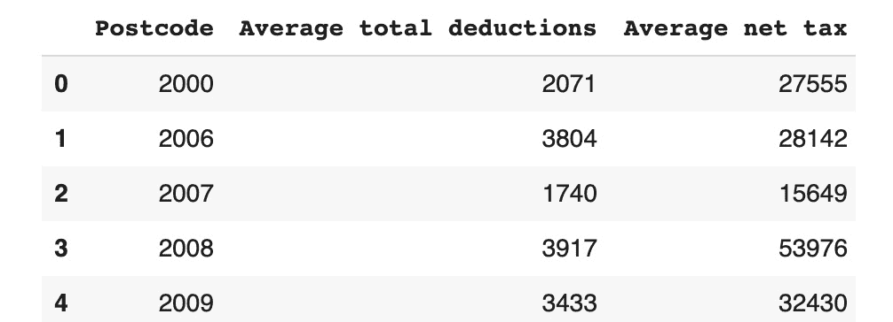

# 第五章：5\. 执行您的第一次聚类分析

概述

本章将介绍无监督学习任务，在这种任务中，算法必须自动从数据中学习模式，因为没有事先定义目标变量。我们将特别关注 k-means 算法，并学习如何标准化和处理数据，以便用于聚类分析。

本章结束时，您将能够加载和可视化数据与聚类散点图；为聚类分析准备数据；使用 k-means 执行质心聚类；解释聚类结果并确定给定数据集的最优聚类数。

# 引言

之前的章节向您介绍了非常流行且极其强大的机器学习算法。它们有一个共同点，那就是它们都属于同一类算法：有监督学习。这类算法试图基于指定的结果列（目标变量），例如销售、员工流失率或客户类别，来学习模式。

但是，如果您的数据集中没有这样的变量，或者您不想指定目标变量呢？您还能在数据上运行一些机器学习算法并发现有趣的模式吗？答案是肯定的，借助属于无监督学习类别的聚类算法，您仍然可以做到这一点。

聚类算法在数据科学行业中非常受欢迎，用于将相似的数据点分组并检测异常值。例如，银行可以使用聚类算法进行欺诈检测，通过识别数据中的异常群体。电子商务公司也可以使用聚类算法来识别具有相似浏览行为的用户群体，如下图所示：


图 5.1：具有相似浏览行为的客户数据示例，未执行聚类分析

对该数据进行聚类分析将揭示自然的模式，通过将相似的数据点分组，从而可能得到以下结果：


图 5.2：对具有相似浏览行为的客户数据执行的聚类分析

该数据现在被分为三个客户群体，分别根据他们的重复访问和在网站上花费的时间进行划分，之后可以为这些群体制定不同的营销计划，以最大化销售。

在本章中，您将学习如何使用一种非常著名的聚类算法——k-means 算法，来执行这种分析。

# 使用 k-means 进行聚类

k-means 是数据科学家中最流行的聚类算法之一（如果不是最流行的话），因其简单且高效。它的起源可以追溯到 1956 年，当时著名数学家 Hugo Steinhaus 为其奠定了基础，但十年后，另一位研究人员 James MacQueen 给这种方法命名为 k-means。

k-means 的目标是将相似的数据点（或观察值）分在一起，从而形成一个聚类。可以把它看作是将彼此接近的元素分到一起（我们将在本章稍后定义如何衡量“接近”）。例如，如果你在手动分析一个移动应用的用户行为，你可能会把那些频繁登录的客户，或者那些进行较大应用内购买的用户分到一起。这就是像 k-means 这样的聚类算法能够自动从数据中找到的分组。

本章我们将使用由**澳大利亚税务局**（**ATO**）公开分享的开源数据集。该数据集包含了澳大利亚 2014-15 财政年度内每个邮政编码（*也称为邮政区号，是用于按地区排序邮件的识别码*）的统计数据。

注

澳大利亚税务局（ATO）数据集可以在 Packt 的 GitHub 仓库中找到：[`packt.live/340xO5t`](https://packt.live/340xO5t)。

数据集的来源可以在这里找到：[`packt.live/361i1p3`](https://packt.live/361i1p3)。

我们将对这个数据集进行聚类分析，分析两个特定的变量（或列）：`平均净税额`和`平均总扣除额`。我们的目标是找到具有相似税收和扣除模式的邮政编码（或称邮政区号）的分组（或聚类）。以下是这两个变量的散点图：


图 5.3：ATO 数据集的散点图

作为数据科学家的一个重要任务，你需要分析从这个数据集中获得的图表并得出结论。假设你需要手动分析数据集中可能的观察值分组。一个潜在的结果可能如下：

+   所有位于左下角的数据点可以归为一组（平均净税额从 0 到 40,000）。

+   第二组可能是所有位于中心区域的数据点（平均净税额从 40,000 到 60,000，平均总扣除额低于 10,000）。

+   最后，所有剩余的数据点可以归为一组。

但是，既然我们可以使用算法来自动进行这些分组，为什么还需要你手动去猜测呢？这就是我们将在接下来的练习中实践的内容，我们将在此数据集上进行聚类分析。

## 练习 5.01：在 ATO 数据集上进行第一次聚类分析

在这个练习中，我们将对 ATO 数据集进行 k-means 聚类，并观察数据集划分出的不同簇，之后我们将通过分析输出结果得出结论：

1.  打开一个新的 Colab 笔记本。

1.  接下来，加载所需的 Python 包：`pandas`和`KMeans`，来自`sklearn.cluster`。

    我们将使用 Python 中的`import`功能：

    ```py
    import pandas as pd
    from sklearn.cluster import KMeans
    ```

    注意

    我们将在本章后续详细解释`KMeans`（来自`sklearn.cluster`），你在这里的代码中已经使用了它。

1.  接下来，创建一个变量来保存文件链接。我们将这个变量称为`file_url`：

    ```py
    file_url = 'https://raw.githubusercontent.com'\
               '/PacktWorkshops/The-Data-Science-Workshop'\
               '/master/Chapter05/DataSet/taxstats2015.csv'
    ```

    在下一步中，我们将使用`pandas`包将数据加载到 DataFrame 中（可以把它看作一个表格，类似于 Excel 中的电子表格，具有行索引和列名）。

    我们的输入文件是`CSV`格式，`pandas`有一个方法可以直接读取这种格式，即`.read_csv()`。

1.  使用`usecols`参数仅选择我们需要的列，而不是加载整个数据集。我们只需要提供一个我们感兴趣的列名列表，这些列名在以下代码片段中提到：

    ```py
    df = pd.read_csv(file_url, \
                     usecols=['Postcode', \
                              'Average net tax', \
                              'Average total deductions'])
    ```

    现在我们已经将数据加载到`pandas` DataFrame 中。

1.  接下来，使用`.head()`方法显示 DataFrame 的前 5 行：

    ```py
    df.head()
    ```

    你应该得到以下输出：

    

    图 5.4：ATO 数据框的前五行

1.  现在，使用`.tail()`输出最后 5 行：

    ```py
    df.tail()
    ```

    你应该得到以下输出：

    

    图 5.5：ATO 数据框的最后五行

    现在我们已经有了数据，直接进入我们想要做的事情：寻找聚类。

    正如你在前几章中看到的，`sklearn`提供了相同的 API 用于训练不同的机器学习算法，比如：

    +   使用指定的超参数实例化一个算法（这里是 KMeans(超参数)）。

    +   使用`.fit()`方法用训练数据拟合模型。

    +   使用`.predict()`方法预测给定输入数据的结果。

        注意

        在这里，我们将使用 k-means 超参数的所有默认值，除了`random_state`。指定一个固定的随机状态（也叫**种子**）将帮助我们每次重新运行代码时获得可重复的结果。

1.  使用随机状态`42`实例化 k-means，并将其保存到名为`kmeans`的变量中：

    ```py
    kmeans = KMeans(random_state=42)
    ```

1.  现在将 k-means 与我们的训练数据进行拟合。为此，我们需要只获取用于拟合模型的变量（或列）。在我们的例子中，变量是`'Average net tax'`和`'Average total deductions'`，它们保存在一个名为`X`的新变量中：

    ```py
    X = df[['Average net tax', 'Average total deductions']]
    ```

1.  现在，用这些训练数据拟合`kmeans`：

    ```py
    kmeans.fit(X)
    ```

    你应该得到以下输出：

    

    图 5.6：拟合的 k-means 及其超参数的总结

    我们仅用几行代码就运行了第一个聚类算法。

1.  通过使用`.predict()`方法查看每个数据点属于哪个聚类：

    ```py
    y_preds = kmeans.predict(X)
    y_preds
    ```

    你应该得到如下输出：

    

    ](img/B15019_05_08.jpg)

    图 5.7：k-means 预测输出

    注意

    尽管我们设置了一个`random_state`值，但你仍然可能得到与上述不同的聚类编号。这取决于你所使用的 scikit-learn 版本。上述输出是使用版本 0.22.2 生成的。你可以通过执行以下代码来查看你使用的版本：

    `import sklearn`

    `sklearn.__version__`

1.  现在，将这些预测结果添加到原始 DataFrame 中，看看前五个邮政编码：

    ```py
    df['cluster'] = y_preds
    df.head()
    ```

    注意

    来自 sklearn `predict()`方法的预测与输入数据的顺序完全相同。因此，第一个预测将对应于 DataFrame 中的第一行。

    你应该得到如下输出：

    

    ](img/B15019_05_08.jpg)

图 5.8：分配给前五个邮政编码的聚类编号

我们的 k-means 模型已经将前两行分配到了同一个聚类中，`6`。我们可以看到，这两个观测值的平均净税值大约为 28,000。最后三条数据点被分配到不同的聚类中（分别是`5`、`7`和`2`），我们可以看到它们的平均总扣除和平均净税值有很大差异。似乎较低的值被分到聚类`5`，而较高的值被分类到聚类`7`。我们开始逐步理解 k-means 是如何决定将这个数据集的观测值分组的。

注意

要访问该特定部分的源代码，请参见[`packt.live/2DUCWAZ`](https://packt.live/2DUCWAZ)。

你也可以在[`packt.live/2EgduFS`](https://packt.live/2EgduFS)在线运行这个示例。

这是一个很好的开始。你已经学会了如何用几行代码训练（或拟合）一个 k-means 模型。接下来，我们可以开始深入探讨 k-means 背后的魔力。

# 解释 k-means 结果

在训练我们的 k-means 算法后，我们可能会对其结果进行更详细的分析。记住，聚类分析的目标是将具有相似模式的观测值分组在一起。但是，如何判断算法找到的分组是否有意义呢？我们将在本节中通过使用刚刚生成的数据集结果来探讨这个问题。

调查此问题的一种方法是逐行分析数据集，并查看每个观测值的分配聚类。这可能会相当繁琐，特别是当数据集非常大时，因此最好有一个聚类结果的总结。

如果你熟悉 Excel 电子表格，你可能会想到使用透视表来计算每个簇的变量平均值。在 SQL 中，你可能会使用`GROUP BY`语句。如果你不熟悉这两者，你可能会想到将每个簇分组，然后计算它们的平均值。好消息是，这可以通过 Python 中的`pandas`包轻松实现。让我们通过一个示例来看如何完成这项任务。

为了创建类似于 Excel 的透视表，我们将使用`pandas`的`pivot_table()`方法。我们需要为该方法指定以下参数：

+   `values`：此参数对应于你想要计算摘要（或聚合）的数值列，如获取平均值或计数。在 Excel 透视表中，它也被称为`values`。在我们的数据集中，我们将使用`Average net tax`和`Average total deductions`变量。

+   `index`：此参数用于指定你想要查看汇总的列。在我们的例子中，它是`cluster`列。在 Excel 透视表中，这对应于`Rows`字段。

+   `aggfunc`：在这里，你将指定用于总结数据的聚合函数，如获取平均值或计数。在 Excel 中，这是`values`字段中的`Summarize by`选项。下面展示了如何使用`aggfunc`方法的示例。

    注意

    在与你进行先前练习的同一本笔记本中运行下面的代码。

```py
import numpy as np
df.pivot_table(values=['Average net tax', \
                       'Average total deductions'], \
               index='cluster', aggfunc=np.mean)
```

注意

我们将使用`numpy`实现的`mean()`函数，因为它对 pandas DataFrame 进行了更多优化。


图 5.9：透视表函数的输出

在这个总结中，我们可以看到算法已经将数据分为八个簇（簇 0 到簇 7）。簇 0 的平均净税和总扣除金额在所有簇中最低，而簇 4 的值最高。通过这个透视表，我们可以使用总结值对簇进行相互比较。

使用聚合视图来查看簇之间的差异是一种很好的方式，但这并不是唯一的方式。另一种可能性是将簇可视化成图表。这正是我们接下来要做的。

你可能听说过不同的可视化包，例如`matplotlib`、`seaborn`和`bokeh`，但在本章中，我们将使用`altair`包，因为它非常简单易用（它的 API 与`sklearn`非常相似）。首先让我们导入它：

```py
import altair as alt
```

然后，我们将实例化一个`Chart()`对象，并将其与我们的 DataFrame 一起保存到一个名为`chart`的变量中：

```py
chart = alt.Chart(df)
```

现在，我们将通过`.mark_circle()`方法指定我们想要的图表类型，即散点图，并将其保存到一个名为`scatter_plot`的新变量中：

```py
scatter_plot = chart.mark_circle()
```

最后，我们需要通过指定将作为图表中`x`轴和`y`轴的列名来配置我们的散点图。我们还告诉散点图根据每个点的聚类值使用`color`选项来为每个点着色：

```py
scatter_plot.encode(x='Average net tax', \
                    y='Average total deductions', \
                    color='cluster:N')
```

注意

你可能已经注意到，在`cluster`列名的末尾添加了`:N`。这个额外的参数在`altair`中用于指定该列的值类型。`:N`意味着该列中的信息是类别型的。`altair`会根据列的类型自动定义要使用的颜色方案。

你应该得到以下输出：


](img/B15019_05_10.jpg)

图 5.10：聚类的散点图

我们现在可以轻松地看到这个图中的聚类及其相互之间的差异。我们可以清楚地看到，k-means 主要根据 x 轴变量（即`平均净税`）将数据点分配到每个聚类中。聚类的边界是垂直的直线。例如，分隔黄色和橙色聚类的边界大约在 18,000 左右。低于这个限制的观测值被分配到红色聚类（2），高于这个限制的则被分配到紫色聚类（6）。

注意

你可以在以下链接查看本工作坊的高质量彩色图片：[`packt.live/30O91Bd`](https://packt.live/30O91Bd%20)

如果你使用过**Tableau**或**Power BI**等可视化工具，你可能会感到有些沮丧，因为这个图表是静态的，你无法悬停在每个数据点上获取更多信息，无法找到例如橙色聚类和粉色聚类之间的分界线。但是，使用 altair，这可以轻松实现，这也是我们选择使用它的原因之一。我们可以通过最小的代码更改来为图表添加一些交互功能。

假设我们想要添加一个工具提示，显示我们关心的两个列的值：邮政编码和分配的聚类。使用`altair`，我们只需要在`encode()`方法中添加一个名为`tooltip`的参数，并列出相应的列名，然后在后面调用`interactive()`方法，代码片段如下所示：

```py
scatter_plot.encode(x='Average net tax', \
                    y='Average total deductions', \
                    color='cluster:N', \
                    tooltip=['Postcode', \
                             'cluster', 'Average net tax', \
                             'Average total deductions'])\
                    .interactive()
```

你应该得到以下输出：


](img/B15019_05_11.jpg)

图 5.11：带工具提示的交互式散点图

现在，我们可以轻松地悬停并检查接近聚类边界的数据点，发现区分紫色聚类（6）和红色聚类（2）的阈值接近于 32,000 的`平均净税`。

## 练习 5.02：按商业收入和支出对澳大利亚邮政编码进行聚类

在本练习中，我们将学习如何使用 k-means 进行聚类分析，并根据按商业收入和支出排序的邮政编码值可视化其结果。以下步骤将帮助你完成本练习：

1.  打开一个新的 Colab 笔记本来进行这个练习。

1.  现在`import`所需的包（`pandas`、`sklearn`、`altair`和`numpy`）：

    ```py
    import pandas as pd
    from sklearn.cluster import KMeans
    import altair as alt
    import numpy as np
    ```

1.  将 ATO 数据集的链接赋值给一个名为`file_url`的变量：

    ```py
    file_url = 'https://raw.githubusercontent.com'\
               '/PacktWorkshops/The-Data-Science-Workshop'\
               '/master/Chapter05/DataSet/taxstats2015.csv'
    ```

1.  使用`pandas`包中的`read_csv`方法，只加载以下列，并使用`use_cols`参数：`'Postcode'`、`'Average total business income'`和`'Average total business expenses'`：

    ```py
    df = pd.read_csv(file_url, \
                     usecols=['Postcode', \
                              'Average total business income', \
                              'Average total business expenses'])
    ```

1.  使用 pandas 的`.tail()`方法显示 ATO 数据集的最后 10 行：

    ```py
    df.tail(10)
    ```

    你应该得到以下输出：

    

    图 5.12：ATO 数据集的最后 10 行

1.  使用以下 pandas 列子集语法提取`'Average total business income'`和`'Average total business expenses'`列：`dataframe_name[<list_of_columns>]`。然后，将其保存到一个名为`X`的新变量中：

    ```py
    X = df[['Average total business income', \
            'Average total business expenses']]
    ```

1.  现在，使用一个`random_state`超参数值为`8`，用这个新变量来拟合`kmeans`：

    ```py
    kmeans = KMeans(random_state=8)
    kmeans.fit(X)
    ```

    你应该得到以下输出：

    

    图 5.13：拟合的 kmeans 及其超参数摘要

1.  使用`sklearn`包中的`predict`方法，从输入变量`(X)`预测聚类分配结果，将结果保存到一个名为`y_preds`的新变量中，并显示最后`10`个预测值：

    ```py
    y_preds = kmeans.predict(X)
    y_preds[-10:]
    ```

    你应该得到以下输出：

    

    图 5.14：分配给最后 10 个观测值的聚类结果

1.  将预测的聚类结果保存回数据框，通过创建一个名为`'cluster'`的新列，并使用`pandas`包的`.tail()`方法打印数据框的最后`10`行：

    ```py
    df['cluster'] = y_preds
    df.tail(10)
    ```

    你应该得到以下输出：

    

    图 5.15：添加聚类列后的 ATO 数据集最后 10 行

1.  使用`pandas`包中的`pivot_table`方法，根据以下参数生成每个聚类值的两个列的平均值透视表：

    将要聚合的列名`'Average total business income'`和`'Average total business expenses'`提供给参数`values`。

    将要分组的列名`'cluster'`提供给参数`index`。

    使用 NumPy（`np`）的`.mean`方法作为`aggfunc`参数的聚合函数：

    ```py
    df.pivot_table(values=['Average total business income', \
                           'Average total business expenses'], \
                   index='cluster', aggfunc=np.mean)
    ```

    你应该得到以下输出：

    

    图 5.16：`pivot_table`函数的输出

1.  现在我们来绘制聚类结果，使用交互式散点图。首先，使用`altair`包中的`Chart()`和`mark_circle()`来实例化散点图：

    ```py
    scatter_plot = alt.Chart(df).mark_circle()
    ```

1.  使用`altair`的`encode`和`interactive`方法，指定散点图的显示和交互选项，使用以下参数：

    将`'Average total business income'`列的名称提供给`x`参数（x 轴）。

    将`'Average total business expenses'`列的名称提供给`y`参数（y 轴）。

    将`cluster:N`列的名称提供给`color`参数（为每个组提供不同的颜色）。

    将这些列名——`'Postcode'`、`'cluster'`、`'Average total business income'`和`'Average total business expenses'`——提供给`'tooltip'`参数（这是提示框显示的信息）：

    ```py
    scatter_plot.encode(x='Average total business income', \
                        y='Average total business expenses', \
                        color='cluster:N', tooltip = ['Postcode', \
                                                      'cluster', \
                        'Average total business income', \
                        'Average total business expenses'])\
                        .interactive()
    ```

    您应该得到以下输出：

    

图 5.17：聚类的交互式散点图

注意

要访问此特定部分的源代码，请参考[`packt.live/3hacbXA`](https://packt.live/3hacbXA)。

本节目前没有在线交互式示例，但可以像往常一样在 Google Colab 上运行。

我们可以看到，k-means 根据两个变量（`'Average total business income'`和`'Average total business expense'`）的值将观测值分为八个不同的簇。例如，所有低值数据点都被分配到簇 0，而具有极高值的数据点则属于簇 4。因此，k-means 将具有相似行为的数据点进行了分组。

你刚刚成功地完成了聚类分析并可视化了其结果。你学习了如何加载真实世界的数据集，拟合 k-means 并显示散点图。这是一个很好的开始，我们将在本章接下来的部分中深入探讨如何提高模型的性能。

# 选择聚类数目

在前面的章节中，我们看到将 k-means 算法应用于给定数据集是多么简单。在我们的 ATO 数据集中，我们发现了 8 个主要由`Average net tax`变量的值定义的不同簇。

但你可能会问自己：“*为什么是 8 个簇？为什么不是 3 个或 15 个簇？*”这些确实是很好的问题。简短的回答是我们使用了 k-means 的默认超参数`n_cluster`值，定义了要找到的簇数为 8。

正如你从*第二章*《回归》和*第四章*《使用随机森林进行多类分类》中回忆的那样，超参数的值不是由算法学习的，而是在训练前由你随意设置的。对于 k-means，`n_cluster`是你需要调整的最重要的超参数之一。选择一个较小的值会导致 k-means 将许多数据点分组在一起，即使它们彼此非常不同。另一方面，选择一个较大的值可能会迫使算法将相似的观测值分割成多个簇，即使它们非常相似。

从 ATO 数据集的散点图来看，八个集群似乎有点多。在图上，一些集群看起来彼此非常接近，并且具有相似的值。凭直觉，仅通过查看图形，你本可以说数据中有两个到四个不同的集群。如你所见，这一点很有启发性，如果有一个函数能够帮助我们定义数据集的正确集群数，那该有多好。确实存在这样一个方法，叫做**肘部**法则。

该方法评估集群的紧凑性，目标是最小化一个称为**惯性**的值。更多的细节和解释将在本章后面提供。现在，可以将惯性视为一个值，表示对于一组数据点，它们之间有多远或有多近。

让我们将此方法应用于我们的 ATO 数据集。首先，我们将定义一个我们希望评估的聚类数量范围（1 到 10 之间），并将其保存在一个名为`clusters`的数据框中。我们还将创建一个空列表`inertia`，在其中存储计算得到的值。

注意

打开你用于*练习 5.01*的笔记本，*在 ATO 数据集上执行你的第一次聚类分析*，执行你已输入的代码，然后在笔记本末尾继续以下代码。

```py
clusters = pd.DataFrame()
clusters['cluster_range'] = range(1, 10)
inertia = []
```

接下来，我们将创建一个`for`循环，遍历范围，使用指定数量的`clusters`拟合 k-means 模型，提取`inertia`值，并将其存储在我们的列表中，如以下代码片段所示：

```py
for k in clusters['cluster_range']:
    kmeans = KMeans(n_clusters=k, random_state=8).fit(X)
    inertia.append(kmeans.inertia_)
```

现在我们可以使用`clusters`数据框中的`inertia`值：

```py
clusters['inertia'] = inertia
clusters
```

你应该得到以下输出：


图 5.18：包含我们集群惯性值的数据框

然后，我们需要使用`altair`绘制一张折线图，使用`mark_line()`方法。我们将指定`'cluster_range'`列作为 x 轴，`'inertia'`作为 y 轴，如以下代码片段所示：

```py
alt.Chart(clusters).mark_line()\
                   .encode(x='cluster_range', y='inertia')
```

你应该得到以下输出：


图 5.19：绘制肘部法则

注意

你不需要将每个`altair`对象保存在一个单独的变量中；你可以将方法一个接一个地附加，用"`。`"。

现在我们已经绘制了惯性值与簇数量的关系图，我们需要找到最优的簇数量。我们需要做的是找到图中的拐点，即惯性值开始变得较慢下降的地方（也就是曲线斜率几乎达到 45 度的地方）。找到正确的**拐点**可能有些困难。如果你把这条折线图想象成一只手臂，我们要做的就是找到肘部的中心（现在你知道这个方法的名字来源于哪里了）。因此，看看我们的例子，我们可以说最优的簇数量是三个。如果我们继续增加簇的数量，惯性值就不会大幅度下降，也不会带来任何价值。这就是为什么我们要找到肘部的中间点作为拐点的原因。

现在，让我们使用这个超参数重新训练`Kmeans`并绘制簇，如下代码片段所示：

```py
kmeans = KMeans(random_state=42, n_clusters=3)
kmeans.fit(X)
df['cluster2'] = kmeans.predict(X)
scatter_plot.encode(x='Average net tax', \
                    y='Average total deductions', \
                    color='cluster2:N', \
                    tooltip=['Postcode', 'cluster', \
                             'Average net tax', \
                             'Average total deductions'])\
                    .interactive()
```

你应该得到以下输出：


图 5.20：三个簇的散点图

这与我们最初的结果非常不同。观察这三个簇，我们可以看到：

+   第一个簇（红色）表示那些在平均净税和总扣除方面都较低的邮政编码。

+   第二个簇（蓝色）表示中等的平均净税和低的平均总扣除。

+   第三个簇（橙色）将所有平均净税值超过 35,000 的邮政编码归为一类。

    注意

    值得注意的是，第三个簇的数据点分布较广，这可能表明该组中有一些离群值。

这个示例向我们展示了在训练 k-means 算法之前，定义正确的簇数量有多么重要，特别是当我们希望从数据中获得有意义的分组时。我们使用了一种叫做肘部法则的方法来找到这个最优数量。

## 练习 5.03：寻找最优簇的数量

在这个练习中，我们将应用肘部法则，使用与*练习 5.02*中相同的数据集，即*通过商业收入和支出对澳大利亚邮政编码进行聚类*，以找到最优的簇数量，然后再拟合 k-means 模型：

1.  打开一个新的 Colab 笔记本进行此练习。

1.  现在`import`所需的包（`pandas`、`sklearn`和`altair`）：

    ```py
    import pandas as pd
    from sklearn.cluster import KMeans
    import altair as alt
    ```

    接下来，我们将加载数据集，并选择与*练习 5.02*中相同的列，即*通过商业收入和支出对澳大利亚邮政编码进行聚类*，并打印前五行。

1.  将 ATO 数据集的链接赋值给一个名为`file_url`的变量：

    ```py
    file_url = 'https://raw.githubusercontent.com'\
               '/PacktWorkshops/The-Data-Science-Workshop'\
               '/master/Chapter05/DataSet/taxstats2015.csv'
    ```

1.  使用 pandas 包中的`.read_csv()`方法，加载数据集并仅使用`use_cols`参数选择以下列：`'Postcode'`、`'Average total business income'`和`'Average total business expenses'`：

    ```py
    df = pd.read_csv(file_url, \
                     usecols=['Postcode', \
                              'Average total business income', \
                              'Average total business expenses'])
    ```

1.  使用 pandas 包中的`.head()`方法显示数据框的前五行：

    ```py
    df.head()
    ```

    你应该得到以下输出：

    

    图 5.21：ATO 数据框的前五行

1.  将 `'Average total business income'` 和 `'Average total business expenses'` 列分配给一个新变量，命名为 `X`：

    ```py
    X = df[['Average total business income', \
            'Average total business expenses']]
    ```

1.  创建一个空的 pandas DataFrame，命名为 `clusters`，并创建一个空的列表，命名为 `inertia`：

    ```py
    clusters = pd.DataFrame()
    inertia = []
    ```

    现在，使用 `range` 函数生成一个包含集群数量范围的列表，从 `1` 到 `15`，并将其分配到来自 `'clusters'` DataFrame 的名为 `'cluster_range'` 的新列：

    ```py
    clusters['cluster_range'] = range(1, 15)
    ```

1.  创建一个 `for` 循环，遍历每个集群编号，并相应地拟合一个 k-means 模型，然后使用 `'inertia_'` 参数将 `inertia` 值附加到 `'inertia'` 列表中：

    ```py
    for k in clusters['cluster_range']:
        kmeans = KMeans(n_clusters=k).fit(X)
        inertia.append(kmeans.inertia_)
    ```

1.  将 `inertia` 列分配到名为 `'inertia'` 的新列中，该列来自 `clusters` DataFrame，并显示其内容：

    ```py
    clusters['inertia'] = inertia
    clusters
    ```

    你应该得到以下输出：

    

    图 5.22：绘制肘部法则

1.  现在，使用 `altair` 包中的 `mark_line()` 和 `encode()` 绘制肘部图，`'cluster_range'` 为 x 轴，`'inertia'` 为 y 轴：

    ```py
    alt.Chart(clusters).mark_line()\
       .encode(alt.X('cluster_range'), alt.Y('inertia'))
    ```

    你应该得到以下输出：

    

    图 5.23：绘制肘部法则

1.  查看肘部图，确定最优集群数量，并将此值分配给名为 `optim_cluster` 的变量：

    ```py
    optim_cluster = 4
    ```

1.  使用 `sklearn` 中的 `fit` 方法，训练一个具有此集群数量和 `random_state` 值为 `42` 的 k-means 模型：

    ```py
    kmeans = KMeans(random_state=42, n_clusters=optim_cluster)
    kmeans.fit(X)
    ```

1.  现在，使用 `sklearn` 中的 `predict` 方法，为 `X` 变量中包含的每个数据点获取预测的分配集群，并将结果保存到名为 `'cluster2'` 的新列中，该列来自 `df` DataFrame：

    ```py
    df['cluster2'] = kmeans.predict(X)
    ```

1.  使用 `pandas` 包中的 `head` 方法显示 `df` DataFrame 的前五行：

    ```py
    df.head()
    ```

    你应该得到以下输出：

    

    图 5.24：前五行与集群预测

1.  现在使用 `altair` 包中的 `mark_circle()` 和 `encode()` 方法绘制散点图。同时，为了增加交互性，使用 `tooltip` 参数和 `altair` 包中的 `interactive()` 方法，如以下代码片段所示：

    ```py
    alt.Chart(df).mark_circle()\
                 .encode\
                  (x='Average total business income', \
                   y='Average total business expenses', \
                   color='cluster2:N', \
                   tooltip=['Postcode', 'cluster2', \
                            'Average total business income',\
                            'Average total business expenses'])\
                 .interactive()
    ```

    你应该得到以下输出：

    

图 5.25：四个集群的散点图

注意

要访问此特定部分的源代码，请参考 [`packt.live/3iK1rPQ`](https://packt.live/3iK1rPQ)。

本部分目前没有在线交互示例，但可以像往常一样在 Google Colab 上运行。

你刚刚学习了如何在拟合 k-means 模型之前找到最优集群数量。数据点在我们的输出中被分成了四个不同的集群：

+   集群 0（蓝色）包含所有平均总营业收入低于 100,000 且平均总营业支出低于 80,000 的观察值。

+   簇 1（橙色）包含那些总商业收入值低于 180,000，且总商业支出值低于 160,000 的数据点。

+   簇 3（青色）适用于那些总商业收入值低于 370,000，且总商业支出值低于 330,000 的数据点。

+   簇 2（红色）适用于那些具有极端值的数据点——其总商业收入值高于 370,000，且总商业支出值高于 330,000。

*练习 5.02* 中的结果，*根据商业收入和支出对澳大利亚邮政编码进行聚类*，有八个不同的簇，其中一些簇之间非常相似。在这里，你看到拥有最优簇数能更好地区分各个组，这也是为什么它是 k-means 中最重要的超参数之一。接下来的部分，我们将研究初始化 k-means 时的另外两个重要超参数。

# 初始化簇

从本章开始，我们每次拟合聚类算法时都提到了 k-means。但你可能已经注意到，在每个模型总结中都有一个叫做 `init` 的超参数，其默认值为 k-means++。事实上，我们一直在使用 k-means++。

k-means 和 k-means++ 之间的区别在于它们在训练开始时如何初始化簇。k-means 随机选择每个簇的中心（称为**质心**），然后将每个数据点分配到最近的簇。如果簇初始化选择不当，可能会导致训练过程结束时分组不理想。例如，在下图中，我们可以清晰地看到数据的三个自然分组，但算法并未成功地正确识别它们：


图 5.26：非最优簇的示例

k-means++ 是一种尝试在初始化时找到更好簇的算法。它的基本思路是随机选择第一个簇，然后通过从剩余的数据点中使用概率分布选择距离更远的其他簇。尽管 k-means++ 相较于原始的 k-means 通常能得到更好的结果，但在某些情况下，它仍然可能导致不理想的聚类。

数据科学家可以使用的另一个超参数来降低错误聚类的风险是 `n_init`。这对应于 k-means 运行的次数，每次使用不同的初始化，最终模型是最佳运行结果。因此，如果这个超参数设置得很高，你将有更大的机会找到最优簇，但缺点是训练时间会更长。所以，你必须仔细选择这个值，特别是在数据集较大的情况下。

让我们通过以下示例在 ATO 数据集上尝试一下。

注意

打开你为*练习 5.01*，*对 ATO 数据集进行第一次聚类分析*，以及之前的示例所用的笔记本。执行你已输入的代码，然后继续执行笔记本末尾的以下代码。

首先，让我们仅使用随机初始化运行一次迭代：

```py
kmeans = KMeans(random_state=14, n_clusters=3, \
                init='random', n_init=1)
kmeans.fit(X)
```

如常，我们希望通过散点图来可视化我们的聚类，正如以下代码片段所定义的那样：

```py
df['cluster3'] = kmeans.predict(X)
alt.Chart(df).mark_circle()\
             .encode(x='Average net tax', \
                     y='Average total deductions', \
                     color='cluster3:N', \
                     tooltip=['Postcode', 'cluster', \
                              'Average net tax', \
                              'Average total deductions']) \
             .interactive()
```

你应该会得到以下输出：

![图 5.27：使用 n_init 为 1 和 init 为 random 的聚类结果]

](img/B15019_05_27.jpg)

图 5.27：使用 n_init 为 1 和 init 为 random 的聚类结果

总体来看，结果与我们之前的运行非常接近。值得注意的是，聚类之间的边界略有不同。

现在，让我们尝试使用五次迭代（通过`n_init`超参数）和 k-means++初始化（通过`init`超参数）：

```py
kmeans = KMeans(random_state=14, n_clusters=3, \
                init='k-means++', n_init=5)
kmeans.fit(X)
df['cluster4'] = kmeans.predict(X)
alt.Chart(df).mark_circle()\
             .encode(x='Average net tax', \
                     y='Average total deductions', \
                     color='cluster4:N', \
                     tooltip=['Postcode', 'cluster', \
                              'Average net tax', \
                              'Average total deductions'])\
                    .interactive()
```

你应该会得到以下输出：

![图 5.28：使用 n_init 为 5 和 init 为 k-means++的聚类结果]

](img/B15019_05_28.jpg)

图 5.28：使用 n_init 为 5 和 init 为 k-means++的聚类结果

在这里，结果与使用 10 次迭代的原始运行非常接近。这意味着我们不必运行这么多迭代就能使 k-means 收敛，本可以通过较少的迭代节省一些时间。

## 练习 5.04：使用不同的初始化参数来获得合适的结果

在本练习中，我们将使用与*练习 5.02*，*按商业收入和支出聚类澳大利亚邮政编码*中相同的数据，并尝试不同的`init`和`n_init`超参数值，观察它们如何影响最终的聚类结果：

1.  打开一个新的 Colab 笔记本。

1.  导入所需的包，包括`pandas`，`sklearn`和`altair`：

    ```py
    import pandas as pd
    from sklearn.cluster import KMeans
    import altair as alt
    ```

1.  将 ATO 数据集的链接赋值给一个名为`file_url`的变量：

    ```py
    file_url = 'https://raw.githubusercontent.com'\
               '/PacktWorkshops/The-Data-Science-Workshop'\
               '/master/Chapter05/DataSet/taxstats2015.csv'
    ```

1.  加载数据集，并选择与*练习 5.02*，*按商业收入和支出聚类澳大利亚邮政编码*，以及*练习 5.03*，*寻找最佳聚类数*中相同的列，使用`pandas`包中的`read_csv()`方法：

    ```py
    df = pd.read_csv(file_url, \
                     usecols=['Postcode', \
                              'Average total business income', \
                              'Average total business expenses'])
    ```

1.  将`'Average total business income'`和`'Average total business expenses'`列赋值给一个新变量`X`：

    ```py
    X = df[['Average total business income', \
            'Average total business expenses']]
    ```

1.  使用`n_init`等于`1`和随机`init`来拟合一个 k-means 模型：

    ```py
    kmeans = KMeans(random_state=1, n_clusters=4, \
                    init='random', n_init=1)
    kmeans.fit(X)
    ```

1.  使用`sklearn`包中的`predict`方法，从输入变量`(X)`中预测聚类分配，并将结果保存到名为`'cluster3'`的新列中：

    ```py
    df['cluster3'] = kmeans.predict(X)
    ```

1.  使用交互式散点图绘制聚类。首先，使用`altair`包中的`Chart()`和`mark_circle()`来实例化散点图，如以下代码片段所示：

    ```py
    scatter_plot = alt.Chart(df).mark_circle()
    ```

1.  使用`altair`中的`encode`和`interactive`方法，指定散点图的显示方式及其交互选项，使用以下参数：

    将`'Average total business income'`列的名称传递给`x`参数（x 轴）。

    将 `'Average total business expenses'` 列的名称提供给 `y` 参数（y 轴）。

    将 `'cluster3:N'` 列的名称提供给 `color` 参数（用于定义每个组的不同颜色）。

    将以下列名 `'Postcode'`、`'cluster3'`、`'Average total business income'` 和 `'Average total business expenses'` 提供给 `tooltip` 参数：

    ```py
    scatter_plot.encode(x='Average total business income', \
                        y='Average total business expenses', \
                        color='cluster3:N', \
                        tooltip=['Postcode', 'cluster3', \
                                 'Average total business income', \
                                 'Average total business expenses'])\
                       .interactive()
    ```

    你应该得到以下输出：

    

    图 5.29：使用 `n_init` 为 1 和 `init` 为随机的聚类结果

1.  重复 *步骤 5* 到 *步骤 8*，但使用不同的 k-means 超参数 `n_init=10` 和随机 `init`，如以下代码片段所示：

    ```py
    kmeans = KMeans(random_state=1, n_clusters=4, \
                    init='random', n_init=10)
    kmeans.fit(X)
    df['cluster4'] = kmeans.predict(X)
    scatter_plot = alt.Chart(df).mark_circle()
    scatter_plot.encode(x='Average total business income', \
                        y='Average total business expenses', \
                        color='cluster4:N',
                        tooltip=['Postcode', 'cluster4', \
                                 'Average total business income', \
                                 'Average total business expenses'])\
                       .interactive()
    ```

    你应该得到以下输出：

    

    图 5.30：使用 `n_init` 为 10 和 `init` 为随机的聚类结果

1.  再次重复 *步骤 5* 到 *步骤 8*，但使用不同的 k-means 超参数 — `n_init=100` 和随机 `init`：

    ```py
    kmeans = KMeans(random_state=1, n_clusters=4, \
                    init='random', n_init=100)
    kmeans.fit(X)
    df['cluster5'] = kmeans.predict(X)
    scatter_plot = alt.Chart(df).mark_circle()
    scatter_plot.encode(x='Average total business income', \
                        y='Average total business expenses', \
                        color='cluster5:N', \
                        tooltip=['Postcode', 'cluster5', \
                        'Average total business income', \
                        'Average total business expenses'])\
                .interactive()
    ```

    你应该得到以下输出：


图 5.31：使用 `n_init` 为 10 和 `init` 为随机的聚类结果

注意

要访问此特定部分的源代码，请参考 [`packt.live/315yGqP`](https://packt.live/315yGqP)。

本节目前没有在线交互示例，但可以像往常一样在 Google Colab 上运行。

你刚刚学会了如何调整负责初始化 k-means 聚类的两个主要超参数。你在这个练习中看到，增加 `n_init` 的迭代次数对这个数据集的聚类结果影响不大。

在这种情况下，最好使用较低的超参数值，因为这将加速训练时间。但对于不同的数据集，你可能会遇到一个案例，其中结果会根据 `n_init` 值的不同而发生巨大变化。在这种情况下，你需要找到一个既不太小也不太大的 `n_init` 值。你想找到一个最佳值，使得结果与之前使用不同值获得的结果相比变化不大。

# 计算到质心的距离

我们在前面的章节中讨论了数据点之间的相似性，但实际上并没有定义这意味着什么。你可能已经猜到，这与观察值彼此之间的接近程度或远离程度有关。你猜对了。这与两点之间某种距离的度量有关。k-means 使用的距离度量称为 **平方欧几里得距离**，其公式为：


图 5.32：平方欧几里得距离公式

如果你没有统计学背景，这个公式可能看起来有点吓人，但实际上它非常简单。它是数据坐标之间平方差的总和。这里，*x*和*y*是两个数据点，索引*i*表示坐标的数量。如果数据是二维的，*i*等于 2。同样，如果是三维数据，*i*将是 3。

我们将此公式应用于 ATO 数据集。

首先，我们将抓取所需的值——也就是来自前两个观测值的坐标——并打印出来：

注意

打开你在*练习 5.01*中使用的笔记本，*在 ATO 数据集上执行第一次聚类分析*，以及之前的示例。执行你已经输入的代码，然后在笔记本的末尾继续输入以下代码。

```py
x = X.iloc[0,].values
y = X.iloc[1,].values
print(x)
print(y)
```

你应该得到以下输出：


](img/B15019_05_33.jpg)

图 5.33：从 ATO 数据集中提取前两个观测值

注意

在 pandas 中，`iloc`方法用于通过索引子集化 DataFrame 的行或列。例如，如果我们想获取第 888 行和第 6 列，我们可以使用以下语法：`dataframe.iloc[888, 6]`。

`x`的坐标是`(27555, 2071)`，`y`的坐标是`(28142, 3804)`。这里，公式告诉我们计算两个数据点在每个坐标轴上的平方差并将它们相加：

```py
squared_euclidean = (x[0] - y[0])**2 + (x[1] - y[1])**2
print(squared_euclidean)
```

你应该得到以下输出：

```py
3347858
```

k-means 使用此度量计算每个数据点与其分配的聚类中心（也称为质心）之间的距离。以下是该算法的基本逻辑：

1.  随机选择聚类的中心（质心）。

1.  使用平方欧几里得距离将每个数据点分配给最近的质心。

1.  更新每个质心的坐标为分配给它的数据点的新计算中心。

1.  重复*步骤 2*和*步骤 3*，直到聚类收敛（即直到聚类分配不再变化）或直到达到最大迭代次数为止。

就这样。k-means 算法就是这么简单。我们可以在拟合 k-means 模型后，通过`cluster_centers_`提取质心。

让我们看看如何在一个示例中绘制质心。

首先，我们拟合一个 k-means 模型，如以下代码片段所示：

```py
kmeans = KMeans(random_state=42, n_clusters=3, \
                init='k-means++', n_init=5)
kmeans.fit(X)
df['cluster6'] = kmeans.predict(X)
```

现在将`centroids`提取到一个 DataFrame 并打印出来：

```py
centroids = kmeans.cluster_centers_
centroids = pd.DataFrame(centroids, \
                         columns=['Average net tax', \
                                  'Average total deductions'])
print(centroids)
```

你应该得到以下输出：


](img/B15019_05_34.jpg)

图 5.34：三个质心的坐标

我们将绘制常规的散点图，但将其分配给一个名为`chart1`的变量：

```py
chart1 = alt.Chart(df).mark_circle()\
            .encode(x='Average net tax', \
                    y='Average total deductions', \
                    color='cluster6:N', \
                    tooltip=['Postcode', 'cluster6', \
                             'Average net tax', \
                             'Average total deductions'])\
                   .interactive()
chart1
```

你应该得到以下输出：


](img/B15019_05_35.jpg)

图 5.35：聚类的散点图

现在，为质心创建第二个散点图，命名为`chart2`：

```py
chart2 = alt.Chart(centroids).mark_circle(size=100)\
            .encode(x='Average net tax', \
                    y='Average total deductions', \
                    color=alt.value('black'), \
                    tooltip=['Average net tax', \
                             'Average total deductions'])\
                   .interactive()
chart2
```

你应该得到以下输出：


](img/B15019_05_36.jpg)

图 5.36：质心的散点图

现在我们将这两个图表组合在一起，使用`altair`非常简单：

```py
chart1 + chart2
```

你应该得到如下输出：


图 5.37：簇及其质心的散点图

现在我们可以轻松地看到观测值最接近哪些质心。

## 练习 5.05：寻找我们数据集中的最近质心

在本练习中，我们将编写 k-means 的第一轮代码，以将数据点分配给它们最近的簇质心。以下步骤将帮助你完成练习：

1.  打开一个新的 Colab 笔记本。

1.  现在`import`所需的包，它们是`pandas`、`sklearn`和`altair`：

    ```py
    import pandas as pd
    from sklearn.cluster import KMeans
    import altair as alt
    ```

1.  加载数据集，并选择与*练习 5.02*、*按商业收入和支出对澳大利亚邮政编码进行聚类*中相同的列，使用`pandas`包中的`read_csv()`方法：

    ```py
    file_url = 'https://raw.githubusercontent.com/'\
               'PacktWorkshops/The-Data-Science-Workshop/'\
               'master/Chapter05/DataSet/taxstats2015.csv'
    df = pd.read_csv(file_url, \
                     usecols=['Postcode', \
                              'Average total business income', \
                              'Average total business expenses'])
    ```

1.  将`'Average total business income'`和`'Average total business expenses'`列赋值给一个名为`X`的新变量：

    ```py
    X = df[['Average total business income', \
            'Average total business expenses']]
    ```

1.  现在，计算`'Average total business income'`和`'Average total business income'`变量的最小值和最大值，使用`min()`和`max()`方法，如下代码片段所示：

    ```py
    business_income_min = df['Average total business income'].min()
    business_income_max = df['Average total business income'].max()
    business_expenses_min = df['Average total business expenses']\
                            .min()
    business_expenses_max = df['Average total business expenses']\
                            .max()
    ```

1.  打印这四个变量的值，它们是这两个变量的最小值和最大值：

    ```py
    print(business_income_min)
    print(business_income_max)
    print(business_expenses_min)
    print(business_expenses_max)
    ```

    你应该得到如下输出：

    ```py
    0
    876324
    0
    884659
    ```

1.  现在导入`random`包并使用`seed()`方法将种子设置为`42`，如下代码片段所示：

    ```py
    import random
    random.seed(42)
    ```

1.  创建一个空的 pandas 数据框，并将其赋值给名为`centroids`的变量：

    ```py
    centroids = pd.DataFrame()
    ```

1.  使用`random`包中的`sample()`方法生成四个随机值，可能的取值范围在 `'Average total business expenses'` 列的最小值和最大值之间，使用`range()`，并将结果存储在名为 `'Average total business income'` 的新列中，该列位于`centroids`数据框中：

    ```py
    centroids\
    ['Average total business income'] = random.sample\
                                        (range\
                                        (business_income_min, \
                                         business_income_max), 4)
    ```

1.  重复相同的过程，为`'Average total business expenses'`生成`4`个随机值：

    ```py
    centroids\
    ['Average total business expenses'] = random.sample\
                                          (range\
                                          (business_expenses_min,\
                                           business_expenses_max), 4)
    ```

1.  使用 pandas 包中的`.index`属性从`centroids`数据框中创建一个名为`'cluster'`的新列，并打印该数据框：

    ```py
    centroids['cluster'] = centroids.index
    centroids
    ```

    你应该得到如下输出：

    

    图 5.38：四个随机质心的坐标

1.  使用`altair`包创建一个散点图，显示`df`数据框中的数据，并将其保存在名为`'chart1'`的变量中：

    ```py
    chart1 = alt.Chart(df.head()).mark_circle()\
                .encode(x='Average total business income', \
                        y='Average total business expenses', \
                        color=alt.value('orange'), \
                        tooltip=['Postcode', \
                                 'Average total business income', \
                                 'Average total business expenses'])\
                       .interactive()
    ```

1.  现在，使用`altair`包创建第二个散点图，显示质心，并将其保存在名为`'chart2'`的变量中：

    ```py
    chart2 = alt.Chart(centroids).mark_circle(size=100)\
                .encode(x='Average total business income', \
                        y='Average total business expenses', \
                        color=alt.value('black'), \
                        tooltip=['cluster', \
                                 'Average total business income',\
                                 'Average total business expenses'])\
                       .interactive()
    ```

1.  使用 altair 语法将两个图表显示在一起：`<chart> + <chart>`：

    ```py
    chart1 + chart2
    ```

    你应该得到如下输出：

    

    图 5.39：随机质心和前五个观测值的散点图

1.  定义一个函数，用于计算 `squared_euclidean` 距离并返回其值。此函数将接受一个数据点的 `x` 和 `y` 坐标以及一个质心：

    ```py
    def squared_euclidean(data_x, data_y, \
                          centroid_x, centroid_y, ):
        return (data_x - centroid_x)**2 + (data_y - centroid_y)**2
    ```

1.  使用 pandas 包的 `.at` 方法，提取第一行的 `x` 和 `y` 坐标，并将其保存在两个变量 `data_x` 和 `data_y` 中：

    ```py
    data_x = df.at[0, 'Average total business income']
    data_y = df.at[0, 'Average total business expenses']
    ```

1.  使用 `for` 循环或列表推导，计算第一条观测值（使用其 `data_x` 和 `data_y` 坐标）与 `centroids` 中 `4` 个不同质心的 `squared_euclidean` 距离，将结果保存在名为 `distance` 的变量中并显示出来：

    ```py
    distances = [squared_euclidean\
                 (data_x, data_y, centroids.at\
                  [i, 'Average total business income'], \
                  centroids.at[i, \
                  'Average total business expenses']) \
                  for i in range(4)]
    distances
    ```

    你应该得到以下输出：

    ```py
    [215601466600, 10063365460, 34245932020, 326873037866]
    ```

1.  使用包含 `squared_euclidean` 距离的列表的 `index` 方法，找到距离最短的簇，如以下代码片段所示：

    ```py
    cluster_index = distances.index(min(distances))
    ```

1.  使用 pandas 包的 `.at` 方法，在 `df` 数据框中为第一条观测值将 `cluster` 索引保存在名为 `'cluster'` 的列中：

    ```py
    df.at[0, 'cluster'] = cluster_index
    ```

1.  使用 pandas 包的 `head()` 方法显示 `df` 的前五行：

    ```py
    df.head()
    ```

    你应该得到以下输出：

    

    图 5.40：ATO 数据框前五行及其分配的第一行簇编号

1.  重复*步骤 15*至*步骤 19*，对接下来的 `4` 行计算它们与质心的距离，并找出距离值最小的簇：

    ```py
    distances = [squared_euclidean\
                 (df.at[1, 'Average total business income'], \
                  df.at[1, 'Average total business expenses'], \
                  centroids.at[i, 'Average total business income'],\
                  centroids.at[i, \
                               'Average total business expenses'])\
                 for i in range(4)]
    df.at[1, 'cluster'] = distances.index(min(distances))
    distances = [squared_euclidean\
                 (df.at[2, 'Average total business income'], \
                  df.at[2, 'Average total business expenses'], \
                  centroids.at[i, 'Average total business income'],\
                  centroids.at[i, \
                               'Average total business expenses'])\
                 for i in range(4)]
    df.at[2, 'cluster'] = distances.index(min(distances))
    distances = [squared_euclidean\
                 (df.at[3, 'Average total business income'], \
                  df.at[3, 'Average total business expenses'], \
                  centroids.at[i, 'Average total business income'],\
                  centroids.at[i, \
                               'Average total business expenses'])\
                 for i in range(4)]
    df.at[3, 'cluster'] = distances.index(min(distances))
    distances = [squared_euclidean\
                 (df.at[4, 'Average total business income'], \
                  df.at[4, 'Average total business expenses'], \
                  centroids.at[i, \
                  'Average total business income'], \
                  centroids.at[i, \
                  'Average total business expenses']) \
                 for i in range(4)]
    df.at[4, 'cluster'] = distances.index(min(distances))
    df.head()
    ```

    你应该得到以下输出：

    

    图 5.41：ATO 数据框的前五行及其分配的簇

1.  最后，使用 `altair` 包绘制质心和数据集的前 `5` 行，如*步骤 12*至*步骤 13*所示：

    ```py
    chart1 = alt.Chart(df.head()).mark_circle()\
                .encode(x='Average total business income', \
                        y='Average total business expenses', \
                        color='cluster:N', \
                        tooltip=['Postcode', 'cluster', \
                                 'Average total business income', \
                                 'Average total business expenses'])\
                       .interactive()
    chart2 = alt.Chart(centroids).mark_circle(size=100)\
                .encode(x='Average total business income', \
                        y='Average total business expenses', \
                        color=alt.value('black'), \
                        tooltip=['cluster', \
                                 'Average total business income',\
                                 'Average total business expenses'])\
                       .interactive()
    chart1 + chart2
    ```

    你应该得到以下输出：


图 5.42：随机质心和前五条观测值的散点图

注意

要访问此特定部分的源代码，请参考 [`packt.live/3iPQo7L`](https://packt.live/3iPQo7L)。

本节目前没有在线互动示例，但可以在 Google Colab 上正常运行。

在这个最终结果中，我们可以看到四个簇在图中的位置，以及五个数据点被分配到哪个簇：

+   左下角的两个数据点已分配给簇 2，该簇的质心坐标为 26,000（平均总商业收入）和 234,000（平均总商业支出）。对于这两个点，它是最接近的质心。

+   中间的两个观测值非常接近坐标为 116,000（平均总商业收入）和 256,000（平均总商业支出）的质心，该质心对应簇 1。

+   上方的观察数据被分配到了聚类 0，该聚类的质心坐标为 670,000（平均总营业收入）和 288,000（平均总营业支出）。

你刚刚重新实现了 k-means 算法的大部分内容。你了解了如何随机初始化质心（聚类中心）、计算某些数据点的平方欧几里得距离、找到它们最近的质心并将它们分配到相应的聚类中。这并不容易，但你做到了。

# 标准化数据

你已经学到了很多关于 k-means 算法的内容，我们也接近本章的结尾了。在这一节，我们将不讨论另一个超参数（你已经学习过主要的超参数），而是一个非常重要的话题：**数据处理**。

拟合 k-means 算法非常简单。最棘手的部分是确保得到的聚类对你的项目有意义，我们已经看到如何调整一些超参数来确保这一点。但处理输入数据和你迄今为止学到的所有步骤一样重要。如果你的数据集没有很好地准备，即使你找到了最佳的超参数，你依然会得到不好的结果。

让我们再看看我们的 ATO 数据集。在上一节中，*计算到质心的距离*，我们发现了三个不同的聚类，它们主要是由`'平均净税额'`变量定义的。就好像 k-means 完全没有考虑到第二个变量`'平均总扣除额'`。实际上，这是因为这两个变量具有非常不同的值范围，以及平方欧几里得距离的计算方式。

平方欧几里得距离对高值变量的加权影响较大。让我们通过一个例子来说明这一点，假设有两个数据点 A 和 B，分别具有坐标(1, 50000)和(100, 100000)。A 和 B 之间的平方欧几里得距离将是(100000 - 50000)² + (100 - 1)²。我们可以清楚地看到，结果将主要受到 100,000 与 50,000 差异的驱动：50,000²。而 100 与 1 的差异（99²）在最终结果中的影响微乎其微。

但是，如果你看一下 100,000 与 50,000 的比值，它是一个 2 的倍数（100,000 / 50,000 = 2），而 100 与 1 的比值是 100 的倍数（100 / 1 = 100）。对于数值较大的变量“主导”聚类结果是否有意义呢？这真的取决于你的项目，这种情况可能是故意的。但如果你希望不同轴之间的结果公平，最好在拟合 k-means 模型之前将它们标准化到一个相似的数值范围。这就是为什么在运行 k-means 算法之前，你总是需要考虑标准化数据的原因。

有多种方式可以对数据进行标准化，我们将重点介绍两种最常用的方法：`sklearn`库中实现了这两种方法。

最小-最大标准化的公式非常简单：在每个轴上，你需要将每个数据点的最小值减去，并将结果除以最大值和最小值之间的差异。标度化后的数据将在 0 到 1 之间：


图 5.43：最小-最大标准化公式

让我们看看在下面的示例中使用`sklearn`进行最小-最大标准化。

注意

打开你用于*练习 5.01*，*在 ATO 数据集上执行你的第一个聚类分析*和之前的例子的笔记本。执行你已经输入的代码，然后继续在笔记本的末尾使用以下代码。

首先，我们导入相关的类并实例化一个对象：

```py
from sklearn.preprocessing import MinMaxScaler
min_max_scaler = MinMaxScaler()
```

然后，我们将其适配到我们的数据集中：

```py
min_max_scaler.fit(X)
```

你应该获得以下输出：


图 5.44：最小-最大标准化摘要

最后，调用`transform()`方法来标准化数据：

```py
X_min_max = min_max_scaler.transform(X)
X_min_max
```

你应该获得以下输出：


图 5.45：最小-最大标准化数据

现在我们打印最小和最大值的最小-最大标准化数据的每个轴：

```py
X_min_max[:,0].min(), X_min_max[:,0].max(), \
X_min_max[:,1].min(), X_min_max[:,1].max()
```

你应该获得以下输出：


图 5.46：最小和最大值的最小-最大标准化数据

我们可以看到现在两个轴的值都在 0 到 1 之间。

**z-score**是通过将数据点从总体平均值中移除并将结果除以每个轴的标准差来计算的。标准化数据的分布将具有平均值为 0 和标准差为 1：


图 5.47：Z-score 公式

要在`sklearn`中应用它，首先我们必须导入相关的`StandardScaler`类并实例化一个对象：

```py
from sklearn.preprocessing import StandardScaler
standard_scaler = StandardScaler()
```

这次，我们不再调用`fit()`然后调用`transform()`，而是使用`fit_transform()`方法：

```py
X_scaled = standard_scaler.fit_transform(X)
X_scaled
```

你应该获得以下输出：


图 5.48：Z-score 标准化数据

现在我们将查看每个轴的最小和最大值：

```py
X_scaled[:,0].min(), X_scaled[:,0].max(), \
X_scaled[:,1].min(), X_scaled[:,1].max()
```

你应该获得以下输出：


图 5.49：Z-score 标准化数据的最小和最大值

现在，两个轴的值域大大降低，我们可以看到它们的最大值约为 9 和 18，这表明数据中存在一些极端异常值。

现在，使用以下代码片段拟合 k-means 模型并在 Z-score 标准化数据上绘制散点图：

```py
kmeans = KMeans(random_state=42, n_clusters=3, \
                init='k-means++', n_init=5)
kmeans.fit(X_scaled)
df['cluster7'] = kmeans.predict(X_scaled)
alt.Chart(df).mark_circle()\
             .encode(x='Average net tax', \
                     y='Average total deductions', \
                     color='cluster7:N', \
                     tooltip=['Postcode', 'cluster7', \
                              'Average net tax', \
                              'Average total deductions'])\
                    .interactive()
```

你应该获得以下输出：


图 5.50：标准化数据的散点图

k-means 结果与标准化数据有很大的不同。现在我们可以看到有两个主要的簇（蓝色和红色），它们的边界不再是直的垂直线，而是对角线。所以，k-means 现在实际上考虑了两个轴。橙色簇包含的数据点比之前的迭代要少得多，似乎它将所有高值的极端异常值都归为一组。如果你的项目是关于检测异常的，你可以在这里找到一种方法，轻松将异常值与“正常”观测值分离。

## 练习 5.06: 标准化我们的数据集中的数据

在这个最终练习中，我们将使用最小-最大缩放和 z-score 标准化来标准化数据，并为每种方法拟合一个 k-means 模型，查看它们对 k-means 的影响：

1.  打开一个新的 Colab 笔记本。

1.  现在导入所需的`pandas`、`sklearn`和`altair`包：

    ```py
    import pandas as pd
    from sklearn.cluster import KMeans
    import altair as alt 
    ```

1.  加载数据集并选择与*练习 5.02*中相同的列，*通过商业收入和支出对澳大利亚邮政编码进行聚类*，使用`pandas`包中的`read_csv()`方法：

    ```py
    file_url = 'https://raw.githubusercontent.com'\
               '/PacktWorkshops/The-Data-Science-Workshop'\
               '/master/Chapter05/DataSet/taxstats2015.csv'
    df = pd.read_csv(file_url, \
                     usecols=['Postcode', \
                              'Average total business income', \
                              'Average total business expenses'])
    ```

1.  将`'Average total business income'`和`'Average total business expenses'`列分配给一个名为`X`的新变量：

    ```py
    X = df[['Average total business income', \
            'Average total business expenses']]
    ```

1.  从`sklearn`导入`MinMaxScaler`和`StandardScaler`类：

    ```py
    from sklearn.preprocessing import MinMaxScaler
    from sklearn.preprocessing import StandardScaler
    ```

1.  实例化并用数据拟合`MinMaxScaler`：

    ```py
    min_max_scaler = MinMaxScaler()
    min_max_scaler.fit(X)
    ```

    你应该得到以下输出：

    

    图 5.51: 最小-最大缩放器总结

1.  执行最小-最大缩放变换并将数据保存到一个新变量`X_min_max`中：

    ```py
    X_min_max = min_max_scaler.transform(X)
    X_min_max
    ```

    你应该得到以下输出：

    

    图 5.52: 最小-最大缩放后的数据

1.  在缩放后的数据上拟合一个 k-means 模型，使用以下超参数：`random_state=1`, `n_clusters=4, init='k-means++', n_init=5`，如下所示的代码片段：

    ```py
    kmeans = KMeans(random_state=1, n_clusters=4, \
                    init='k-means++', n_init=5)
    kmeans.fit(X_min_max)
    ```

1.  在`df`数据框中为`X`的每个值分配 k-means 预测到一个新列，名为`'cluster8'`：

    ```py
    df['cluster8'] = kmeans.predict(X_min_max)
    ```

1.  使用`altair`包将 k-means 结果绘制成散点图：

    ```py
    scatter_plot = alt.Chart(df).mark_circle()
    scatter_plot.encode(x='Average total business income', \
                        y='Average total business expenses',\
                        color='cluster8:N',\
                        tooltip=['Postcode', 'cluster8', \
                                 'Average total business income',\
                                 'Average total business expenses'])\
                       .interactive()
    ```

    你应该得到以下输出：

    

    图 5.53: 使用最小-最大缩放后的数据的 k-means 结果散点图

1.  重新训练 k-means 模型，但使用 z-score 标准化后的数据，并保持相同的超参数值，`random_state=1, n_clusters=4, init='k-means++', n_init=5`：

    ```py
    standard_scaler = StandardScaler()
    X_scaled = standard_scaler.fit_transform(X)
    kmeans = KMeans(random_state=1, n_clusters=4, \
                    init='k-means++', n_init=5)
    kmeans.fit(X_scaled)
    ```

1.  在`df`数据框中为`X_scaled`的每个值分配 k-means 预测到一个新列，名为`'cluster9'`：

    ```py
    df['cluster9'] = kmeans.predict(X_scaled)
    ```

1.  使用`altair`包绘制 k-means 结果的散点图：

    ```py
    scatter_plot = alt.Chart(df).mark_circle()
    scatter_plot.encode(x='Average total business income', \
                        y='Average total business expenses', \
                        color='cluster9:N', \
                        tooltip=['Postcode', 'cluster9', \
                                 'Average total business income',\
                                 'Average total business expenses'])\
                       .interactive()
    ```

    你应该得到以下输出：

    

图 5.54: 使用 z-score 标准化数据的 k-means 结果散点图

注意

若要访问此特定部分的源代码，请参考 [`packt.live/2Q2BSND`](https://packt.live/2Q2BSND)。

本节目前没有在线互动示例，但可以像往常一样在 Google Colab 上运行。

k-means 聚类结果在 min-max 标准化和 z-score 标准化之间非常相似，它们分别是*步骤 10*和*13*的输出。与*练习 5.04*中使用不同初始化参数以实现合适结果的对比，我们可以看到，标准化后，第 1 类和第 2 类之间的边界略微下降。结果如此接近的原因在于，这两个变量（平均总营业收入和平均总营业支出）的数值范围几乎相同：介于 0 和 900,000 之间。因此，k-means 并没有给予这两个变量其中之一更多的权重。

你已完成本章的最终练习。你已经学会了如何在拟合 k-means 模型之前使用两种非常流行的方法来预处理数据：min-max 缩放和 z-score 标准化。

## 活动 5.01：使用 k-means 在银行中执行客户细分分析

你正在为一家国际银行工作。信用部门正在审查其产品，并希望更好地了解当前的客户。你被分配了进行客户细分分析的任务。你将使用 k-means 聚类分析来识别相似客户的群体。

以下步骤将帮助你完成此活动：

1.  下载数据集并将其加载到 Python 中。

1.  使用`read_csv()`方法读取 CSV 文件。

    注意

    该数据集采用`.dat`文件格式。你仍然可以使用`read_csv()`加载文件，但需要指定以下参数：`header=None, sep= '\s\s+' 和 prefix='X'`。

1.  你将使用第四列和第十列（`X3`和`X9`）。提取这些数据。

1.  通过实例化`StandardScaler`对象来执行数据标准化。

1.  分析并确定最优的聚类数。

1.  使用你定义的聚类数来拟合 k-means 算法。

1.  创建聚类的散点图。

    注意

    这是来自 UCI 机器学习库的德国信用数据集。可以从 Packt 库下载，网址为[`packt.live/31L2c2b`](https://packt.live/31L2c2b)。尽管该数据集中的所有列都是整数，但大多数实际上是分类变量。这些列中的数据并不是连续的。只有两个变量是真正的数值型数据。你将使用这些变量进行聚类分析。

你应该得到类似于以下的输出：

![图 5.55：四个聚类的散点图]

](img/B15019_05_55.jpg)

图 5.55：四个聚类的散点图

注意

该活动的解决方案可以在以下地址找到：[`packt.live/2GbJloz`](https://packt.live/2GbJloz)。

# 总结

现在，你已经准备好在自己的数据集上使用 k-means 算法进行聚类分析。这种类型的分析在行业中非常流行，用于细分客户档案以及检测可疑交易或异常。

我们学习了许多不同的概念，例如质心和平方欧几里得距离。我们介绍了主要的 k-means 超参数：`init`（初始化方法）、`n_init`（初始化运行次数）、`n_clusters`（簇的数量）和`random_state`（指定的种子）。我们还讨论了选择最佳簇数、正确初始化质心和标准化数据的重要性。你已经学会了如何使用以下 Python 包：`pandas`、`altair`、`sklearn` 和 `KMeans`。

在本章中，我们只讨论了 k-means，但它并不是唯一的聚类算法。还有许多其他算法使用不同的方法，例如层次聚类、主成分分析和高斯混合模型等。如果你对这一领域感兴趣，现在你已经掌握了所有基本知识，可以自主探索这些其他算法。

接下来，你将看到我们如何评估这些模型的表现，以及可以使用哪些工具使它们更好。
