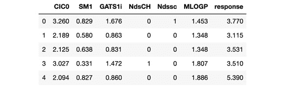

# 第六章：6. 如何评估模型性能

概述

本章将介绍模型评估，您将评估或评估在决定将模型投入生产之前训练的每个模型的性能。通过本章学习，您将能够创建评估数据集。您将具备使用**平均绝对误差**（**MAE**）和**均方误差**（**MSE**）评估线性回归模型性能的能力。您还将能够使用准确率、精确率、召回率和 F1 得分来评估逻辑回归模型的性能。

# 引言

在评估模型性能时，您会查看一些衡量指标或数值，这些指标能告诉您模型在特定条件下的表现情况，从而帮助您做出是否将已训练的模型投入实际应用的明智决定。本章中您将遇到的一些衡量指标包括 MAE、精确率、召回率和 R2 得分。

您在*第二章：回归*中学会了如何训练回归模型，在*第三章：二分类*中学会了如何训练分类模型。请考虑预测客户是否可能购买定期存款的任务，这是您在*第三章：二分类*中涉及的内容。您已经学会了如何训练模型来执行这类分类任务。现在，您关心的是这个模型的实用性。您可以先训练一个模型，然后评估该模型的预测正确率。接着，您可能会训练更多的模型，并评估它们是否比您之前训练的模型表现更好。

您已经在*练习 3.06*中看到了使用`train_test_split`拆分数据的例子，*《银行定期存款购买倾向的逻辑回归模型》*。在*第七章：机器学习模型的泛化*中，您将进一步了解拆分数据的必要性和应用，但目前，您应当注意到，拆分数据为两组是非常重要的：一组用于训练模型，另一组用于验证模型。正是这个验证步骤帮助您决定是否将模型投入生产。

# 拆分数据

您将在*第七章：机器学习模型的泛化*中进一步了解如何拆分数据，我们将讨论以下内容：

+   使用`train_test_split`进行简单的数据拆分

+   使用交叉验证进行多次数据拆分

目前，您将学习如何使用`sklearn`中的一个名为`train_test_split`的函数来拆分数据。

非常重要的一点是，您不能使用所有数据来训练模型。您必须将一部分数据保留用于验证，这部分数据之前不能用于训练。当您训练一个模型时，它会尝试生成一个适合您数据的方程式。训练时间越长，方程式会变得越复杂，以便尽可能多地通过数据点。

当你对数据进行洗牌并将一部分数据留作验证集时，它能确保模型学会避免过拟合你尝试生成的假设。

## 练习 6.01：导入和拆分数据

在这个练习中，你将从一个代码库中导入数据，并将其拆分成训练集和评估集以训练一个模型。拆分数据是必须的，这样你以后可以评估模型的效果。这个练习将帮助你熟悉拆分数据的过程；这是你将频繁进行的操作。

注意

你将在本章中使用的汽车数据集可以在我们的 GitHub 仓库中找到：[`packt.live/30I594E`](https://packt.live/30I594E)。

数据来源于 UCI 机器学习库。

这个数据集是关于汽车的。提供了一个文本文件，包含以下信息：

+   `buying` – 购买该车辆的成本

+   `maint` – 车辆的维护成本

+   `doors` – 车辆的门数

+   `persons` – 车辆能够运输的乘客数量

+   `lug_boot` – 车辆的行李厢容量

+   `safety` – 车辆的安全评级

+   `car` – 这是模型尝试预测的类别

以下步骤将帮助你完成练习：

1.  打开一个新的 Colab 笔记本。

1.  导入所需的库：

    ```py
    import pandas as pd
    from sklearn.model_selection import train_test_split
    ```

    你在第一行导入了一个叫做`pandas`的库。这个库对于将文件读取到一个叫做`DataFrame`的数据结构中非常有用，你在前几章中已经使用过这种结构。这个结构就像一个电子表格或表格，有行和列，我们可以对其进行操作。由于你可能需要多次引用该库，我们给它创建了一个别名`pd`。

    在第二行，你从名为`model_selection`的模块中导入了一个名为`train_test_split`的函数，该模块位于`sklearn`中。你将使用这个函数来拆分通过`pandas`读取的数据。

1.  创建一个 Python 列表：

    ```py
    # data doesn't have headers, so let's create headers
    _headers = ['buying', 'maint', 'doors', 'persons', \
                'lug_boot', 'safety', 'car']
    ```

    你正在读取的数据存储为 CSV 文件。

    浏览器会将文件下载到你的计算机上。你可以使用文本编辑器打开该文件。如果你这么做，你会看到类似于以下内容：

    

    图 6.1：没有标题的汽车数据集

    注意

    另外，你也可以在浏览器中输入数据集的 URL 来查看数据集。

    `CSV`文件通常会在数据的第一行写出每一列的名称。例如，查看这个数据集的 CSV 文件，它是你在*第三章 二元分类*中使用过的：

    

    图 6.2：没有标题的 CSV 文件

    但在这种情况下，列名缺失。不过，这不是问题。此步骤中的代码创建了一个名为`_headers`的 Python 列表，包含了每一列的名称。你将在下一步读取数据时提供这个列表。

1.  读取数据：

    ```py
    df = pd.read_csv('https://raw.githubusercontent.com/'\
                     'PacktWorkshops/The-Data-Science-Workshop/'\
                     'master/Chapter06/Dataset/car.data', \
                     names=_headers, index_col=None)
    ```

    在此步骤中，代码使用名为`read_csv`的函数读取文件。第一个参数，`'https://raw.githubusercontent.com/PacktWorkshops/The-Data-Science-Workshop/master/Chapter06/Dataset/car.data'`，是必需的，表示文件的位置。在我们的例子中，文件位于互联网上。它也可以选择性地下载，然后我们可以指定本地文件的位置。

    第二个参数（`names=_headers`）要求函数在读取数据后将行头添加到数据中。第三个参数（`index_col=None`）要求函数为表格生成一个新的索引，因为数据本身没有包含索引。该函数将生成一个 DataFrame，我们将其赋值给名为`df`的变量。

1.  打印出前五条记录：

    ```py
    df.head()
    ```

    这一步中的代码用于打印出 DataFrame 的前五行。该操作的输出显示在以下截图中：

    

    图 6.3：DataFrame 的前五行

1.  创建训练集和评估集的 DataFrame：

    ```py
    training, evaluation = train_test_split(df, test_size=0.3, \
                                            random_state=0)
    ```

    上述代码将把包含你数据的 DataFrame 分割成两个新的 DataFrame。第一个叫`training`，用于训练模型。第二个叫`evaluation`，将在下一步中进一步拆分。我们之前提到过，你必须将数据集分为训练集和评估集，前者用于训练模型，后者用于评估模型。

    在这一点上，`train_test_split`函数接受两个参数。第一个参数是我们想要分割的数据，第二个是我们希望分割的比例。我们所做的是指定评估数据占数据的 30%。

    注意

    第三个参数 random_state 设置为 0，以确保结果的可复现性。

1.  创建验证集和测试集：

    ```py
    validation, test = train_test_split(evaluation, test_size=0.5, \
                                        random_state=0)
    ```

    这段代码与*第 6 步*中的代码类似。在此步骤中，代码将我们的评估数据分成两部分，因为我们指定了`0.5`，意味着`50%`。

    注意

    要访问此特定部分的源代码，请参考[`packt.live/3haKvl3`](https://packt.live/3haKvl3)。

    你也可以在线运行这个例子，访问[`packt.live/3g8zI9R`](https://packt.live/3g8zI9R)。

    在前面的章节中，我们已经学习了如何将数据分割为训练集和测试集，但在这里，我们将进一步将数据分为三部分：一部分用于训练模型，一部分在训练过程中用于评估模型，还有一部分在模型投入生产之前用于最终评估模型。

    现在你已经将数据分割成不同的集合，可以开始训练和评估模型了。

# 回归模型的模型性能评估

当你创建一个回归模型时，你创建的模型会预测一个连续的数值变量，正如你在*第二章，回归分析*中学到的那样。当你设置评估数据集时，你可以使用它来比较模型的质量。

为了评估你的模型质量，你需要将预测结果与所谓的真实值进行比较，真实值是你试图预测的实际观测值。请看一下*图 6.4*，其中第一列是实际值（称为实际值），第二列是预测值：


图 6.4：实际值与预测值的比较

输出中的第`0`行将我们评估数据集中的实际值与模型预测值进行比较。我们评估数据集中的实际值是`4.891`，模型预测的值是`4.132270`。

第`1`行将实际值`4.194`与模型预测的值`4.364320`进行比较。

实际上，评估数据集会包含大量记录，因此你不会通过视觉进行此比较。相反，你会使用一些方程式。

你可以通过计算损失来进行此比较。损失是前面截图中实际值与预测值之间的差异。在数据挖掘中，这称为**距离度量**。计算距离度量的方法有很多种，产生了不同的损失函数。以下是其中两种：

+   曼哈顿距离

+   欧几里得距离

回归有多种损失函数，但在本书中，我们将研究两种常用的回归损失函数，它们是：

+   平均绝对误差（MAE）——这是基于曼哈顿距离的

+   均方误差（MSE）——这是基于欧几里得距离的

这些函数的目标是通过给出一个数值，衡量你的模型的有效性，这个数值显示了真实值和模型预测值之间的偏差程度。

你的任务是训练新的模型，确保它们的误差持续降低。在此之前，我们先快速介绍一些数据结构。

## 数据结构——向量与矩阵

在本节中，我们将介绍不同的数据结构，如下所示。

### 标量

标量变量是简单的数字，例如 23。当你单独使用数字时，它们就是标量。你将它们赋值给变量，如以下表达式所示：

```py
temperature = 23
```

如果你需要存储 5 天的温度数据，你需要将这些值存储在 5 个不同的变量中，例如以下代码片段所示：

```py
temp_1 = 23
temp_2 = 24
temp_3 = 23
temp_4 = 22
temp_5 = 22
```

在数据科学中，你将经常处理大量的数据点，例如一年内每小时的温度测量。存储大量值的更高效方式叫做向量。我们将在下一个主题中介绍向量。

### 向量

向量是标量的集合。考虑一下前面代码片段中的五个温度值。向量是一种数据类型，它允许你将所有这些温度值收集到一个变量中，该变量支持算术运算。向量看起来类似于 Python 列表，可以从 Python 列表创建。考虑以下用于创建 Python 列表的代码片段：

```py
temps_list = [23, 24, 23, 22, 22]
```

你可以通过首先导入 `numpy`，然后使用以下代码片段，从列表创建一个向量，方法是使用 `numpy` 的 `.array()` 方法：

```py
import numpy as np
temps_ndarray = np.array(temps_list)
```

你可以继续使用以下代码片段验证数据类型：

```py
print(type(temps_ndarray))
```

该代码片段将导致编译器输出以下内容：


图 6.5：temps_ndarray 向量数据类型

你可以使用以下代码片段检查向量的内容：

```py
print(temps_ndarray)
```

这将生成以下输出：


图 6.6：temps_ndarray 向量

请注意，输出中包含单个方括号 `[` 和 `]`，数字之间用空格分隔。这与 Python 列表的输出不同，后者可以通过以下代码片段获得：

```py
print(temps_list)
```

该代码片段产生以下输出：


图 6.7：temps_list 中元素的列表

注意，输出中包含单个方括号 `[` 和 `]`，数字之间用逗号分隔。

向量有形状和维度。你可以通过以下代码片段来确定这两者：

```py
print(temps_ndarray.shape)
```

输出是一个名为 **tuple** 的 Python 数据结构，看起来像这样：


图 6.8：temps_ndarray 向量的形状

请注意，输出由括号 `(` 和 `)` 组成，包含一个数字和逗号。数字后跟逗号表示该对象只有一个维度。该数字的值是元素的数量。输出的意思是“一个包含五个元素的向量”。这非常重要，因为它与矩阵有很大不同，矩阵我们接下来将讨论。

### 矩阵

矩阵也是由标量组成的，但与标量不同，矩阵既有行又有列

有时你需要在向量和矩阵之间进行转换。让我们回顾一下 `temps_ndarray`。你可能记得它有五个元素，因为它的形状是 `(5,)`。要将其转换为一个具有五行一列的矩阵，你可以使用以下代码片段：

```py
temps_matrix = temps_ndarray.reshape(-1, 1)
```

该代码片段使用了 `.reshape()` 方法。第一个参数 `-1` 指示解释器保持第一维不变。第二个参数 `1` 指示解释器添加一个新维度，这个新维度就是列。要查看新的形状，可以使用以下代码片段：

```py
print(temps_matrix.shape)
```

你将得到以下输出：


图 6.9：矩阵的形状

注意，元组现在有两个数字，`5`和`1`。第一个数字`5`表示行数，第二个数字`1`表示列数。你可以使用以下代码片段打印出矩阵的值：

```py
print(temps_matrix)
```

代码的输出如下：


图 6.10: 矩阵的元素

注意，输出与向量的输出不同。首先，我们有一个外部的方括号。然后，每一行都有其元素被方括号括起来。每一行只包含一个数字，因为矩阵只有一列。

你可以将矩阵重塑为`1`行`5`列，并使用以下代码片段打印出其值：

```py
print(temps_matrix.reshape(1,5))
```

输出将如下所示：


图 6.11: 重塑矩阵

注意，现在所有的数字都在一行中，因为该矩阵只有一行五列。外部的方括号表示矩阵，而内部的方括号表示行。

最后，你可以通过以下代码片段删除列来将矩阵转换回向量：

```py
vector = temps_matrix.reshape(-1)
```

你可以打印出向量的值，以确认你得到以下结果：


图 6.12: 向量的值

注意，现在你只有一组方括号。你仍然有相同数量的元素。

现在让我们来看一个重要的度量指标——R2 分数。

## R2 分数

R2 分数（发音为“r 平方”）有时也被称为“得分”，用于衡量模型的决定系数。可以把它看作是模型进行准确可靠预测的能力。这个度量值可以通过模型的`score()`方法来获取，并且对每个模型都可用。

你的目标是训练多个模型，直到获得更高的 R2 分数。R2 分数的范围在**0**和**1**之间。你的目标是尽量让模型的分数接近**1**。

## 练习 6.02：计算线性回归模型的 R2 分数

如前所述，R2 分数是评估模型性能的一个重要因素。因此，在本练习中，我们将创建一个线性回归模型，并计算其 R2 分数。

注意

本章中你将使用的鱼类毒性数据集可以在我们的 GitHub 仓库中找到：[`packt.live/2sNChvv`](https://packt.live/2sNChvv)。

本数据集来自 UCI 机器学习库：[`packt.live/2TSyJTB`](https://packt.live/2TSyJTB)。

以下属性对我们的任务有帮助：

+   CIC0: 信息指数

+   SM1_Dz(Z): 基于 2D 矩阵的描述符

+   GATS1i: 2D 自相关

+   NdsCH: Pimephales promelas

+   NdssC: 原子类型计数

+   MLOGP: 分子属性

+   定量响应，LC50 [-LOG(mol/L)]：该属性表示在 96 小时测试期间，导致 50%的测试鱼死亡的浓度。

以下步骤将帮助你完成练习：

1.  打开一个新的 Colab 笔记本，编写并执行你的代码。

1.  接下来，导入以下代码片段中提到的库：

    ```py
    # import libraries
    import pandas as pd
    from sklearn.model_selection import train_test_split
    from sklearn.linear_model import LinearRegression
    ```

    在这一步，你导入 `pandas`，用于读取数据。你还导入了 `train_test_split()`，用于将数据分割为训练集和验证集，并导入 `LinearRegression`，用于训练模型。

1.  现在，从数据集读取数据：

    ```py
    # column headers
    _headers = ['CIC0', 'SM1', 'GATS1i', 'NdsCH', 'Ndssc', \
                'MLOGP', 'response']
    # read in data
    df = pd.read_csv('https://raw.githubusercontent.com/'\
                     'PacktWorkshops/The-Data-Science-Workshop/'\
                     'master/Chapter06/Dataset/'\
                     'qsar_fish_toxicity.csv', \
                     names=_headers, sep=';')
    ```

    在这一步，你创建一个 Python 列表，用于存储数据中列的名称。这样做是因为包含数据的 CSV 文件没有第一行列头。你接着使用 `read_csv()` 方法将文件读取并存储在名为 `df` 的变量中。通过将包含列头的列表传入 `names` 参数来指定列名。该 CSV 使用分号作为列分隔符，因此需要通过 `sep` 参数指定。你可以使用 `df.head()` 来查看数据框的内容：

    

    图 6.13：数据框的前五行

1.  将数据分成特征和标签，并划分为训练集和评估集：

    ```py
    # Let's split our data
    features = df.drop('response', axis=1).values
    labels = df[['response']].values
    X_train, X_eval, y_train, y_eval = train_test_split\
                                       (features, labels, \
                                        test_size=0.2, \
                                        random_state=0)
    X_val, X_test, y_val, y_test = train_test_split(X_eval, y_eval,\
                                                    random_state=0)
    ```

    在这一步，你创建两个 `numpy` 数组，分别命名为 `features` 和 `labels`。然后，你将它们分割两次。第一次分割产生一个 `training` 集和一个 `evaluation` 集。第二次分割创建一个 `validation` 集和一个 `test` 集。

1.  创建一个线性回归模型：

    ```py
    model = LinearRegression()
    ```

    在这一步，你创建一个 `LinearRegression` 实例，并将其存储在名为 `model` 的变量中。你将使用它来训练训练数据集。

1.  训练模型：

    ```py
    model.fit(X_train, y_train)
    ```

    在这一步，你使用 `fit()` 方法和在*步骤 4*中创建的训练数据集来训练模型。第一个参数是 `features` NumPy 数组，第二个参数是 `labels`。

    你应该得到类似以下的输出：

    

    图 6.14：训练模型

1.  进行预测，如以下代码片段所示：

    ```py
    y_pred = model.predict(X_val)
    ```

    在这一步，你使用验证数据集进行预测，并将其存储在 `y_pred` 中。

1.  计算 R2 分数：

    ```py
    r2 = model.score(X_val, y_val)
    print('R² score: {}'.format(r2))
    ```

    在这一步，你计算 `r2`，即模型的 R2 分数。R2 分数是通过模型的 `score()` 方法计算的。下一行会让解释器输出 R2 分数。

    输出结果类似于以下内容：

    

    图 6.15：R2 分数

    注：

    MAE 和 R2 分数可能会根据数据集的分布有所不同。

1.  你可以看到我们获得的 R2 分数是`0.56238`，它距离 1 还很远。在下一步，我们将进行比较。

1.  将预测值与实际的真实值进行比较：

    ```py
    _ys = pd.DataFrame(dict(actuals=y_val.reshape(-1), \
                            predicted=y_pred.reshape(-1)))
    _ys.head()
    ```

    在这一步，你粗略地查看了预测值与真实值的对比。在*第 8 步*中，你会注意到你为模型计算的 R2 得分远非完美（完美得分为 1）。在这一步中，在第一行，你通过使用 pandas 中的`DataFrame`方法创建了一个 DataFrame。你提供了一个字典作为参数。该字典有两个键：`actuals`和`predicted`。`actuals`包含了`y_vals`，即验证数据集中的实际标签。`predicted`包含了`y_pred`，即预测值。`y_vals`和`y_pred`都是二维矩阵，所以你通过使用`.reshape(-1)`将它们重塑为 1D 向量，这样可以去掉第二个维度。

    第二行会让解释器显示前五条记录。

    输出结果看起来类似于以下内容：

    

图 6.16：模型的实际值与预测值

注意

要访问此特定部分的源代码，请参考[`packt.live/31aw6QE`](https://packt.live/31aw6QE)。

你也可以在[`packt.live/3aASLbE`](https://packt.live/3aASLbE)上在线运行此示例。

在本练习中，我们计算了 R2 得分，它是一个评估指标，可以用于比较不同的模型。

在下一个主题中，我们将讨论平均绝对误差，它是另一种评估指标。

## 平均绝对误差

**平均绝对误差**（**MAE**）是回归模型的评估指标，用来衡量预测值与真实值之间的绝对距离。绝对距离是不考虑符号的距离，无论是正数还是负数。例如，如果真实值为 6，预测值为 5，则距离为 1；但是如果预测值为 7，则距离为-1。无论符号如何，绝对距离都是 1。这就是所谓的**大小**。MAE 通过将所有大小求和并除以观察次数来计算。

## 练习 6.03：计算模型的 MAE

本练习的目标是使用与*练习 6.02*相同的数据集，找到一个模型的得分和损失，*计算线性回归模型的 R2 得分*。

在本练习中，我们将计算模型的 MAE。

以下步骤将帮助你完成本练习：

1.  打开一个新的 Colab 笔记本文件。

1.  导入必要的库：

    ```py
    # Import libraries
    import pandas as pd
    from sklearn.model_selection import train_test_split
    from sklearn.linear_model import LinearRegression
    from sklearn.metrics import mean_absolute_error
    ```

    在这一步，你从`sklearn.metrics`导入了一个名为`mean_absolute_error`的函数。

1.  导入数据：

    ```py
    # column headers
    _headers = ['CIC0', 'SM1', 'GATS1i', 'NdsCH', 'Ndssc', \
                'MLOGP', 'response']
    # read in data
    df = pd.read_csv('https://raw.githubusercontent.com/'\
                     'PacktWorkshops/The-Data-Science-Workshop/'\
                     'master/Chapter06/Dataset/'\
                     'qsar_fish_toxicity.csv', \
                     names=_headers, sep=';')
    ```

    在前面的代码中，你读取了数据。这些数据托管在网上，包含了一些关于鱼类毒性的资料。数据以 CSV 格式存储，但没有包含任何表头。此外，该文件中的列并非通过逗号分隔，而是通过分号分隔。名为`_headers`的 Python 列表包含了列的名称。

    在下一行，你使用名为`read_csv`的函数，该函数包含在`pandas`库中，用于加载数据。第一个参数指定文件位置。第二个参数指定一个包含数据列名的 Python 列表。第三个参数指定用于分隔数据中列的字符。

1.  将数据拆分为`features`和`labels`，并划分为训练集和评估集：

    ```py
    # Let's split our data
    features = df.drop('response', axis=1).values
    labels = df[['response']].values
    X_train, X_eval, y_train, y_eval = train_test_split\
                                       (features, labels, \
                                        test_size=0.2, \
                                        random_state=0)
    X_val, X_test, y_val, y_test = train_test_split(X_eval, y_eval,\
                                                    random_state=0)
    ```

    在这一步，你将数据划分为训练集、验证集和测试集。在第一行，你创建了一个`numpy`数组，分两步进行。第一步，`drop`方法传入一个列名，表示要从 DataFrame 中删除的列。第二步，你使用`values`将 DataFrame 转换为一个二维的`numpy`数组，这是一种具有行列结构的表格。这个数组被存储在名为`features`的变量中。

    在第二行，你将列转换为包含要预测标签的`numpy`数组。你通过从 DataFrame 中提取该列，然后使用`values`将其转换为`numpy`数组。

    在第三行，你使用`train_test_split`以 80:20 的比例拆分`features`和`labels`。训练数据包含在`X_train`中的特征和`y_train`中的标签中。评估数据集包含在`X_eval`和`y_eval`中。

    在第四行，你使用`train_test_split`将评估数据集拆分为验证集和测试集。由于未指定`test_size`，因此默认值为`25%`。验证数据存储在`X_val`和`y_val`中，而测试数据存储在`X_test`和`y_test`中。

1.  创建一个简单的线性回归模型并进行训练：

    ```py
    # create a simple Linear Regression model
    model = LinearRegression()
    # train the model
    model.fit(X_train, y_train)
    ```

    在这一步，你使用训练数据来训练模型。在第一行，你创建了一个`LinearRegression`实例，命名为`model`。在第二行，你使用`X_train`和`y_train`训练模型。`X_train`包含`features`，而`y_train`包含`labels`。

1.  现在预测我们验证数据集的值：

    ```py
    # let's use our model to predict on our validation dataset
    y_pred = model.predict(X_val)
    ```

    此时，你的模型已经准备好使用了。你可以使用`predict`方法对数据进行预测。在此案例中，你将`X_val`作为参数传递给该函数。回顾一下，`X_val`是你的验证数据集。结果会被赋值给一个名为`y_pred`的变量，并将在下一步中用于计算模型的 MAE。

1.  计算 MAE：

    ```py
    # Let's compute our MEAN ABSOLUTE ERROR
    mae = mean_absolute_error(y_val, y_pred)
    print('MAE: {}'.format(mae))
    ```

    在这一步，你使用`mean_absolute_error`函数计算模型的 MAE，传入`y_val`和`y_pred`。`y_val`是提供给训练数据的标签，而`y_pred`是模型的预测结果。前面的代码应该给出约为 0.72434 的 MAE 值：

    

    图 6.17 MAE 分数

    `y_val` 和 `y_pred` 都是包含相同数量元素的 `numpy` 数组。`mean_absolute_error` 函数将 `y_pred` 从 `y_val` 中减去，得到一个新数组。结果数组中的元素应用了绝对值函数，确保所有负号被去除。然后计算元素的平均值。

1.  计算模型的 R2 分数：

    ```py
    # Let's get the R2 score
    r2 = model.score(X_val, y_val)
    print('R² score: {}'.format(r2))
    ```

    你应该得到类似于以下的输出：

    

图 6.18：模型的 R2 分数

注意

MAE 和 R2 分数可能会根据数据集的分布而有所不同。

更高的 R2 分数意味着更好的模型，使用一个计算决定系数的方程。

注意

要访问本节的源代码，请参考 [`packt.live/349mG9P`](https://packt.live/349mG9P)。

你也可以在网上运行这个示例，访问 [`packt.live/3aA1rza`](https://packt.live/3aA1rza)。

在这个练习中，我们计算了 MAE，这是评估模型时一个重要的参数。

现在你将训练第二个模型，并将其 R2 分数和 MAE 与第一个模型进行比较，以评估哪个模型表现更好。

## 练习 6.04：计算第二个模型的平均绝对误差（MAE）

在这个练习中，我们将生成新特征，并计算新模型的分数和损失。

以下步骤将帮助你完成这个练习：

1.  打开一个新的 Colab 笔记本文件。

1.  导入所需的库：

    ```py
    # Import libraries
    import pandas as pd
    from sklearn.model_selection import train_test_split
    from sklearn.linear_model import LinearRegression
    from sklearn.metrics import mean_absolute_error
    # pipeline
    from sklearn.pipeline import Pipeline
    # preprocessing
    from sklearn.preprocessing import MinMaxScaler
    from sklearn.preprocessing import StandardScaler
    from sklearn.preprocessing import PolynomialFeatures
    ```

    在第一步中，你将导入一些库，如 `train_test_split`、`LinearRegression` 和 `mean_absolute_error`。我们使用管道（pipeline）来快速转换特征，并通过 `MinMaxScaler` 和 `PolynomialFeatures` 来生成新特征。`MinMaxScaler` 通过将所有值调整到 0 到 1 之间的范围来减少数据的方差。它通过减去数据的均值并除以范围（即最大值减去最小值）来实现这一点。`PolynomialFeatures` 通过将列中的值提升到某个幂次来生成新特征，并在数据框中创建新列以容纳它们。

1.  从数据集中读取数据：

    ```py
    # column headers
    _headers = ['CIC0', 'SM1', 'GATS1i', 'NdsCH', 'Ndssc', \
                'MLOGP', 'response']
    # read in data
    df = pd.read_csv('https://raw.githubusercontent.com/'\
                     'PacktWorkshops/The-Data-Science-Workshop/'\
                     'master/Chapter06/Dataset/'\
                     'qsar_fish_toxicity.csv', \
                     names=_headers, sep=';')
    ```

    在这一步，你将读取数据。虽然数据存储在一个 CSV 文件中，但它没有列出列名的第一行。名为 `_headers` 的 Python 列表将保存你要提供给 `pandas` 方法 `read_csv` 的列名。

    在下一行，你调用 `read_csv` 的 `pandas` 方法，并提供要读取的文件的位置和名称，以及列头名称和文件分隔符。文件中的列使用分号分隔。

1.  将数据拆分为训练集和评估集：

    ```py
    # Let's split our data
    features = df.drop('response', axis=1).values
    labels = df[['response']].values
    X_train, X_eval, y_train, y_eval = train_test_split\
                                       (features, labels, \
                                        test_size=0.2, \
                                        random_state=0)
    X_val, X_test, y_val, y_test = train_test_split(X_eval, y_eval,\
                                                    random_state=0)
    ```

    在此步骤中，你首先将名为 `df` 的 DataFrame 拆分为两个部分。第一个 DataFrame 被命名为 `features`，包含你将用来进行预测的所有自变量。第二个 DataFrame 被命名为 `labels`，其中包含你试图预测的值。

    在第三行，你使用 `train_test_split` 将 `features` 和 `labels` 拆分为四个数据集。`X_train` 和 `y_train` 包含 80% 的数据，用于训练模型。`X_eval` 和 `y_eval` 包含剩余的 20% 数据。

    在第四行，你将 `X_eval` 和 `y_eval` 拆分为两个附加数据集。`X_val` 和 `y_val` 包含 75% 的数据，因为你没有指定比例或大小。`X_test` 和 `y_test` 包含剩余的 25% 数据。

1.  创建一个管道：

    ```py
    # create a pipeline and engineer quadratic features
    steps = [('scaler', MinMaxScaler()),\
             ('poly', PolynomialFeatures(2)),\
             ('model', LinearRegression())]
    ```

    在此步骤中，你首先创建一个名为 `steps` 的 Python 列表。列表包含三个元组，每个元组代表模型的一次变换。第一个元组代表缩放操作，元组中的第一个项目是步骤的名称，叫做 `scaler`。这个步骤使用 `MinMaxScaler` 来转换数据。第二个元组叫做 `poly`，它通过交叉数据的列来创建额外的特征，直到你指定的度数为止。在这个例子中，你指定了 `2`，因此它会将这些列交叉到 2 次方。接下来是你的 `LinearRegression` 模型。

1.  创建一个管道：

    ```py
    # create a simple Linear Regression model with a pipeline
    model = Pipeline(steps)
    ```

    在此步骤中，你创建了一个 `Pipeline` 的实例，并将其存储在名为 `model` 的变量中。`Pipeline` 执行一系列变换，这些变换在你之前定义的步骤中有所说明。这个操作之所以有效，是因为转换器（`MinMaxScaler` 和 `PolynomialFeatures`）实现了两个名为 `fit()` 和 `fit_transform()` 的方法。你可能还记得在之前的例子中，模型是使用 `LinearRegression` 实现的 `fit()` 方法来训练的。

1.  训练模型：

    ```py
    # train the model
    model.fit(X_train, y_train)
    ```

    在接下来的行中，你调用 `fit` 方法并提供 `X_train` 和 `y_train` 作为参数。因为模型是一个管道，三个操作将依次进行。首先，`X_train` 会被缩放。接下来，将生成额外的特征。最后，使用 `LinearRegression` 模型进行训练。此步骤的输出类似于以下内容：

    

    ](img/B15019_06_19.jpg)

    图 6.19：训练模型

1.  使用验证数据集进行预测：

    ```py
    # let's use our model to predict on our validation dataset
    y_pred = model.predict(X_val)
    ```

1.  计算模型的 MAE：

    ```py
    # Let's compute our MEAN ABSOLUTE ERROR
    mae = mean_absolute_error(y_val, y_pred)
    print('MAE: {}'.format(mae))
    ```

    在第一行，你使用 `mean_absolute_error` 来计算平均绝对误差。你传入 `y_val` 和 `y_pred`，结果存储在 `mae` 变量中。接下来的行中，你打印出 `mae`：

    

    ](img/B15019_06_20.jpg)

    图 6.20：MAE 分数

    你在此步骤中计算的损失被称为验证损失，因为你使用了验证数据集。这与使用训练数据集计算的训练损失不同。理解这一点很重要，因为你在阅读其他文档或书籍时，可能会看到这两者的概念。

1.  计算 R2 分数：

    ```py
    # Let's get the R2 score
    r2 = model.score(X_val, y_val)
    print('R² score: {}'.format(r2))
    ```

    在最后两行中，你计算了 R2 分数，并且显示了它，如下面的截图所示：

    

图 6.21：R2 分数

在此时，你应该能看到第一个模型和第二个模型之间的 `R2` 分数和 MAE 的差异（第一个模型的 `MAE` 和 `R2` 分别为 `0.781629` 和 `0.498688`）。

注意

若要访问此特定部分的源代码，请参考 [`packt.live/2EjCaNn`](https://packt.live/2EjCaNn)。

你也可以在网上运行这个示例，访问 [`packt.live/2Yb5vRd`](https://packt.live/2Yb5vRd)。

在这个练习中，你构建了新的特征，使得你拥有一个假设更高多项式度的模型。这个模型在某个阶段应当比简单的模型表现得更好。构建并训练完新模型后，你计算了 R2 分数和 MAE，这可以用来将这个模型与之前训练的模型进行比较。我们可以得出结论，认为这个模型更好，因为它具有更高的 R2 分数和更低的 MAE。

### 其他评估指标

虽然我们使用了 `mean_absolute_error`，但也有其他回归模型评估函数。请记住，这些都属于成本（或损失）函数。包括 `max_error`、`mean_squared_error`、`mean_squared_log_error` 和 `median_absolute_error`。如果你和数据科学家一起工作，他们通常负责告诉你使用哪种评估指标。如果没有，那么你可以选择任何你喜欢的指标。

MAE 是通过从每个预测中减去真实值，取绝对值，求和所有绝对值，然后除以观测值的数量来计算的。这种距离度量在数据挖掘中被称为曼哈顿距离。

**均方误差** (**MSE**) 是通过计算地面真值和预测值之间差异的平方，求和后，再除以观测值的数量来计算的。MSE 较大时，有时会使用它的平方根，即 **均方根误差** (**RMSE**)。

**均方对数误差** (**MSLE**) 在方程中引入了对数，通过在对地面真值和预测值分别加 1 后再取对数，计算差异的平方，然后对它们求和，并除以观测值的数量。MSLE 的特点是，对于高于地面真值的预测，其代价较低，而对于低于地面真值的预测则代价较高。

最后，`median_absolute_error` 计算绝对误差的中位数，绝对误差是地面真值和预测值之间的差异。

现在，让我们开始评估分类模型的性能。

# 评估分类模型的性能

分类模型用于预测一组特征将属于哪个类别。你在*第三章*《*二分类*》中学会了创建二分类模型，在*第四章，《使用随机森林进行多分类》*中学会了创建多分类模型。

当你考虑一个分类模型时，你可能会问自己模型的准确性有多高。那么，如何评估准确性呢？

在开始评估之前，你需要先创建一个分类模型。

## 练习 6.05：创建一个用于计算评估指标的分类模型

在这个练习中，你将创建一个分类模型，之后你将利用该模型进行评估。

你将使用 UCI 机器学习库中的汽车数据集。你将利用该数据集，将汽车分类为可接受或不可接受，依据以下分类特征：

+   `buying`：汽车的购买价格

+   `maint`：汽车的维护成本

+   `doors`：车门的数量

+   `persons`：车辆的载客量

+   `lug_boot`：行李厢的大小

+   `safety`：汽车的安全性估计

    注意

    你可以在这里找到数据集：[`packt.live/30I594E`](https://packt.live/30I594E)。

以下步骤将帮助你完成任务：

1.  打开一个新的 Colab 笔记本。

1.  导入你需要的库：

    ```py
    # import libraries
    import pandas as pd
    from sklearn.model_selection import train_test_split
    from sklearn.linear_model import LogisticRegression
    ```

    在这一步，你导入了`pandas`并将其别名设置为`pd`。`pandas`用于将数据读取到数据框中。你还导入了`train_test_split`，它用于将数据拆分为训练集和评估集。最后，你还导入了`LogisticRegression`类。

1.  导入你的数据：

    ```py
    # data doesn't have headers, so let's create headers
    _headers = ['buying', 'maint', 'doors', 'persons', \
                'lug_boot', 'safety', 'car']
    # read in cars dataset
    df = pd.read_csv('https://raw.githubusercontent.com/'\
                     'PacktWorkshops/The-Data-Science-Workshop/'\
                     'master/Chapter06/Dataset/car.data', \
                     names=_headers, index_col=None)
    df.head()
    ```

    在这一步，你创建了一个名为`_headers`的 Python 列表，用来保存你将要导入的文件中的列名，因为该文件没有标题。然后，你使用`pd.read_csv`读取文件并指定文件位置以及包含文件标题的列表，最后通过`df.head()`显示前五行数据。

    你应该得到类似于以下的输出：

    

    图 6.22：检查数据框

1.  按照以下代码片段对分类变量进行编码：

    ```py
    # encode categorical variables
    _df = pd.get_dummies(df, columns=['buying', 'maint', 'doors',\
                                      'persons', 'lug_boot', \
                                      'safety'])
    _df.head()
    ```

    在这一步，你使用一种称为独热编码的技术，将分类列转换为数值列。你在*第 13 步*《*练习 3.04*》的*特征工程——从现有特征创建新特征*中看到了这个示例。你需要这样做，因为模型的输入必须是数值型的。你可以通过`pandas`库中的`get_dummies`方法，从分类变量中得到数值型变量。你将数据框作为输入，指定需要编码的列，然后将结果赋值给一个新的数据框`_df`，最后使用`head()`查看结果。

    输出应类似于以下截图：

    

    图 6.23：编码分类变量

    注意

    输出已被截断以便展示。请在[`packt.live/3aBNlg7`](https://packt.live/3aBNlg7)查看完整的输出。

1.  将数据分为训练集和验证集：

    ```py
    # split data into training and evaluation datasets
    features = _df.drop('car', axis=1).values
    labels = _df['car'].values
    X_train, X_eval, y_train, y_eval = train_test_split\
                                       (features, labels, \
                                        test_size=0.3, \
                                        random_state=0)
    X_val, X_test, y_val, y_test = train_test_split(X_eval, y_eval,\
                                                    test_size=0.5, \
                                                    random_state=0)
    ```

    在这一步中，首先将特征列和标签提取到两个 NumPy 数组中，分别命名为`features`和`labels`。然后将 70%的数据提取到`X_train`和`y_train`中，剩余的 30%数据存入`X_eval`和`y_eval`中。接着，将`X_eval`和`y_eval`再分为两个相等的部分，分别赋值给`X_val`和`y_val`用于验证，以及`X_test`和`y_test`用于之后的测试。

1.  训练逻辑回归模型：

    ```py
    # train a Logistic Regression model
    model = LogisticRegression()
    model.fit(X_train, y_train)
    ```

    在这一步，你创建一个`LogisticRegression`实例，并通过将`X_train`和`y_train`传递给`fit`方法来训练模型。

    你应该获得一个类似于以下的输出：

    

    图 6.24：训练逻辑回归模型

1.  进行预测：

    ```py
    # make predictions for the validation set
    y_pred = model.predict(X_val)
    ```

    在这一步，你对验证数据集`X_val`进行预测，并将结果存储在`y_pred`中。通过查看前 10 个预测结果（执行`y_pred[0:9]`），你应该能获得类似于以下的输出：

    

图 6.25：验证集的预测结果

这个模型之所以有效，是因为你能够用它来进行预测。这些预测将每辆车分类为可接受(`acc`)或不可接受(`unacc`)，根据汽车的特征。在此时，你已经准备好对模型进行各种评估。

注意

要访问此部分的源代码，请参考[`packt.live/3aBNlg7`](https://packt.live/3aBNlg7)。

你还可以在线运行这个示例，网址是[`packt.live/34eg7CH`](https://packt.live/34eg7CH)。

因此，我们已经成功创建了一个分类模型来进行预测，并将在未来的练习中评估该模型的表现。

在本次练习中，我们只训练了一次逻辑回归模型，以免重复执行，因为这个过程步骤较多。在接下来的部分，你将查看混淆矩阵。

# 混淆矩阵

你在*第三章，二分类*中遇到过混淆矩阵。你可能记得，混淆矩阵将模型预测的类别数量与验证数据集中这些类别的实际出现情况进行比较。输出结果是一个方阵，行数和列数等于你要预测的类别数。列表示实际值，而行表示预测值。你可以通过使用`sklearn.metrics`中的`confusion_matrix`来得到混淆矩阵。

## 练习 6.06：为分类模型生成混淆矩阵

本练习的目标是为你在*练习 6.05*中训练的分类模型创建一个混淆矩阵，*创建一个用于计算评估指标的分类模型*。

注意

你应在与*练习 6.05, 创建一个用于计算评估指标的分类模型*相同的笔记本中继续此练习。如果你希望使用新的笔记本，请确保复制并运行*练习 6.05, 创建一个用于计算评估指标的分类模型*中的所有代码，然后开始执行本练习的代码。

以下步骤将帮助你完成任务：

1.  打开一个新的 Colab 笔记本文件。

1.  导入`confusion_matrix`：

    ```py
    from sklearn.metrics import confusion_matrix
    ```

    在这一步，你需要从`sklearn.metrics`导入`confusion_matrix`。此函数将帮助你生成混淆矩阵。

1.  生成混淆矩阵：

    ```py
    confusion_matrix(y_val, y_pred)
    ```

    在这一步，你通过提供`y_val`（实际类别）和`y_pred`（预测类别）来生成混淆矩阵。

    输出应类似于以下内容：

    

图 6.26: 混淆矩阵

注意

要访问此特定部分的源代码，请参考[`packt.live/3hbreQz`](https://packt.live/3hbreQz)。

你还可以在[`packt.live/2EebSMD`](https://packt.live/2EebSMD)上在线运行此示例。

我们可以看到数据有四个类别。第一列显示所有应该属于第一类的数据。第一行显示正确放入第一类的预测数量。在本示例中，这个数字是`41`。第二行显示被预测为第二类，但应该属于第一类的数据数量。在本示例中，这个数字是`7`。第三行显示被预测为第三类，但应该属于第一类的数据数量。这个数字是`7`。最后，第四行显示被错误分类为第四类，实际上应该属于第一类的数据数量。在本例中，数字是`1`。

## 关于混淆矩阵的更多内容

混淆矩阵帮助你分析如果将模型投入生产，你需要做出的决策的影响。假设我们预测某种疾病的存在与否，基于输入数据进行判断。这是一个二分类问题，其中 1 表示疾病存在，0 表示疾病不存在。该模型的混淆矩阵将有两列和两行。

第一列会显示属于`真阴性`类别的项目。第二行会显示被错误分类为`假阳性`的项目。

第二列会显示属于`假阴性`类别的项目。最后，第二行显示正确分类到类别 1 的项目，这些称为`真正例`。

假阳性是指样本被错误预测为感染者，而实际上它们是健康的。其影响是这些病例会被误诊为患有某种疾病。

假阴性是指那些被错误预测为健康的样本，实际上它们患有该病。其影响是这些病例不会得到治疗，尽管它们实际上患有该病。

你需要问的关于这个模型的问题取决于疾病的性质，并需要关于该疾病的领域专业知识。例如，如果该疾病具有传染性，那么未治疗的病例将被释放到普通人群中，可能会感染其他人。与将这些病例隔离并观察其症状相比，这将产生什么影响？

另一方面，如果该疾病不具传染性，问题就变成了治疗那些不患病的人与不治疗患病人群的影响。

应该清楚的是，这些问题并没有明确的答案。该模型需要进行调整，以提供对用户可接受的性能。

## 精确度

精确度在*第三章，二分类*中已经介绍；然而，在本章中我们将更详细地讨论它。精确度是将正确分类为阳性的样本数量（称为**真正阳性**，缩写为**TP**）除以该预测中的总样本数（即该行中的所有条目总数，包括正确分类（TP）和错误分类（FP）来自混淆矩阵）。假设有 10 个条目被分类为阳性。如果其中 7 个条目实际为阳性，那么 TP 就是 7，FP 就是 3。因此，精确度为 0.7。公式如下所示：


图 6.27：精确度公式

在上述公式中：

+   `tp` 是真正阳性——正确分类为该类别的预测数量。

+   `fp` 是假阳性——被错误分类为该类别的预测数量。

+   用于计算精确度的 `sklearn.metrics` 函数是 `precision_score`。不妨试试看。

## 练习 6.07：计算分类模型的精确度

在本练习中，你将计算在*练习 6.05，创建分类模型以计算评估指标*中训练的分类模型的精确度。

注

你应该在与*练习 6.05，创建分类模型以计算评估指标*相同的笔记本中继续此练习。如果你想使用新的笔记本，请确保复制并运行*练习 6.05，创建分类模型以计算评估指标*中的完整代码，然后开始执行本练习中的代码。

以下步骤将帮助您完成任务：

1.  导入所需的库：

    ```py
    from sklearn.metrics import precision_score
    ```

    在这一步，您需要从`sklearn.metrics`导入`precision_score`。

1.  接下来，计算精度得分，如下所示的代码片段所示：

    ```py
    precision_score(y_val, y_pred, average='macro')
    ```

    在这一步，您使用`precision_score`计算精度得分。

    输出是一个介于 0 和 1 之间的浮动数字。它可能看起来像这样：

    

图 6.28：精度得分

注意

精度得分可能会因数据而异。

在这个练习中，您会看到分类模型的精度得分是`0.9245`。**92%**可能是一个不错的分数，在一些领域是可以接受的，但在某些领域则较低。因此，还有改进的空间。

注意

要访问此特定部分的源代码，请参考[`packt.live/3kROW6R`](https://packt.live/3kROW6R)。

您还可以在线运行此示例，访问[`packt.live/3aCS8ye`](https://packt.live/3aCS8ye)。

将精度得分视为问这个模型在某个类别上做出正确预测的频率吗？该值需要比我们刚刚达到的得分更接近 1。

## 召回率

召回率是正确预测的总数除以该类别的预测总数（包括正确和错误的预测）。可以将其视为真正例除以列中的所有条目之和。公式如下：


图 6.29：召回率公式

这个函数是`recall_score`，它可以从`sklearn.metrics`获得。

## 练习 6.08：计算分类模型的召回率

这个练习的目标是计算您在*练习 6.05*中训练的分类模型的召回率，*创建一个计算评估指标的分类模型*。

注意

您应该在与*练习 6.05：创建一个计算评估指标的分类模型*中使用的相同笔记本中继续进行这个练习。如果您想使用新的笔记本，请确保复制并运行*练习 6.05*中的所有代码，然后开始执行本练习的代码。

以下步骤将帮助您完成任务：

1.  打开一个新的 Colab 笔记本文件。

1.  现在，导入所需的库：

    ```py
    from sklearn.metrics import recall_score
    ```

    在这一步，您从`sklearn.metrics`导入`recall_score`。这是您将在第二步中使用的函数。

1.  计算召回率：

    ```py
    recall_score(y_val, y_pred, average='macro')
    ```

    在这一步，您使用`recall_score`计算召回率。您需要将`y_val`和`y_pred`作为参数传递给该函数。`recall_score`的文档解释了您可以提供给`average`的值。如果您的模型进行二元预测，并且标签是`0`和`1`，您可以将`average`设置为`binary`。其他选项包括`micro`、`macro`、`weighted`和`samples`。您应该阅读文档以了解它们的作用。

    您应该得到如下所示的输出：

    

图 6.30：召回率得分

注意

召回率得分会有所变化，具体取决于数据。

如你所见，我们在练习中计算了召回率得分，结果为`0.622`。这意味着在所有预测的类别中，`62%`是正确预测的。单独看这个值可能不太有意义，直到将其与其他模型的召回率得分进行比较。

注意

要访问该部分的源代码，请参阅[`packt.live/31axPp6`](https://packt.live/31axPp6)。

你也可以在[`packt.live/2YdNv8O`](https://packt.live/2YdNv8O)在线运行这个示例。

现在我们来计算 F1 分数，这也对评估模型表现有很大帮助，进而帮助你在选择模型时做出更好的决策。

## F1 分数

F1 分数是另一个重要的参数，帮助我们评估模型的表现。它通过以下公式同时考虑精度和召回率的贡献：


图 6.31：F1 分数

F1 分数的范围是从 0 到 1，1 是最好的得分。你可以使用来自`sklearn.metrics`的`f1_score`来计算 F1 分数。

## 练习 6.09：计算分类模型的 F1 分数

在此练习中，你将计算在*练习 6.05*中训练的分类模型的 F1 分数，*创建分类模型以计算评估指标*。

注意

你应在与*练习 6.05，创建分类模型以计算评估指标*相同的笔记本中继续此练习。如果你希望使用新的笔记本，确保复制并运行*练习 6.05*中的全部代码，*创建分类模型以计算评估指标*，然后再开始本练习的代码执行。

以下步骤将帮助你完成任务：

1.  打开一个新的 Colab 笔记本文件。

1.  导入必要的模块：

    ```py
    from sklearn.metrics import f1_score
    ```

    在此步骤中，你将从`sklearn.metrics`导入`f1_score`方法。这个分数将帮助你计算评估指标。

1.  计算 F1 分数：

    ```py
    f1_score(y_val, y_pred, average='macro')
    ```

    在此步骤中，你通过传入`y_val`和`y_pred`来计算 F1 分数。同时，由于这不是二分类问题，你还需指定`average='macro'`。

    你应该得到类似如下的输出：

    

图 6.32：F1 分数

注意

要访问该部分的源代码，请参阅[`packt.live/3iWCqkq`](https://packt.live/3iWCqkq)。

你也可以在[`packt.live/2Q84epY`](https://packt.live/2Q84epY)在线运行这个示例。

在本练习结束时，你将看到我们获得的`F1`分数为`0.6746`。仍有很大的改进空间，你可以通过构建新特征和训练新模型来尝试获得更好的 F1 分数。

## 准确率

准确率是应用于分类模型的评估指标。它通过计算正确预测的标签数量来得出，即预测标签与真实标签完全一致。`accuracy_score()`函数存在于`sklearn.metrics`中，用于提供此值。

## 练习 6.10：计算分类模型的准确率

本练习的目标是计算在*练习 6.04*中训练的模型的准确率分数，*计算第二个模型的平均绝对误差*。

注意

你应该在与*练习 6.05, 创建一个分类模型以计算评估指标*相同的笔记本中继续本练习。如果你希望使用一个新的笔记本，请确保复制并运行*练习 6.05*中的完整代码，然后开始执行本练习的代码。

以下步骤将帮助你完成任务：

1.  从*练习 6.05*，*创建一个分类模型以计算评估指标*中的代码结束处开始，继续在你的笔记本中操作。

1.  导入`accuracy_score()`：

    ```py
    from sklearn.metrics import accuracy_score
    ```

    在此步骤中，你导入了`accuracy_score()`，该函数将用于计算模型的准确率。

1.  计算准确率：

    ```py
    _accuracy = accuracy_score(y_val, y_pred)
    print(_accuracy)
    ```

    在此步骤中，通过将`y_val`和`y_pred`作为参数传递给`accuracy_score()`来计算模型的准确率。解释器将结果赋值给名为`c`的变量。`print()`方法会导致解释器呈现`_accuracy`的值。

    结果类似于以下内容：

    

图 6.33 准确率分数

注意

要访问该特定部分的源代码，请参考[`packt.live/2Q6K5Ao`](https://packt.live/2Q6K5Ao)。

你也可以在线运行这个示例，网址是[`packt.live/2Ye55JT`](https://packt.live/2Ye55JT)。

因此，我们成功地计算出了模型的准确率为`0.876`。本练习的目标是向你展示如何计算模型的准确率，并将此准确率与未来你将训练的另一个模型的准确率进行比较。

## 对数损失

对数损失（或 log 损失）是分类模型的损失函数，也称为分类交叉熵。它旨在惩罚不正确的预测。`sklearn` 文档将其定义为“给定模型预测值下，真实值的负对数似然”。

## 练习 6.11：计算分类模型的对数损失

本练习的目标是预测在*练习 6.05*中训练的模型的对数损失，*创建一个分类模型以计算评估指标*。

注意

你应该在与*练习 6.05, 创建一个分类模型以计算评估指标*相同的笔记本中继续本练习。如果你希望使用一个新的笔记本，请确保复制并运行*练习 6.05*中的完整代码，然后开始执行本练习的代码。

以下步骤将帮助您完成任务：

1.  打开您的 Colab 笔记本，并继续从*练习 6.05*，*创建分类模型以计算评估指标*，的停止处继续。

1.  导入所需的库：

    ```py
    from sklearn.metrics import log_loss
    ```

    在此步骤中，您导入了`log_loss()`来自`sklearn.metrics`。

1.  计算对数损失：

    ```py
    _loss = log_loss(y_val, model.predict_proba(X_val))
    print(_loss)
    ```

在此步骤中，您计算对数损失并将其存储在一个名为`_loss`的变量中。您需要观察一个非常重要的事项：之前，您使用了`y_val`（真实值）和`y_pred`（预测值）。

在此步骤中，您不使用预测值，而是使用预测的概率。您可以看到在代码中，您指定了`model.predict_proba()`。您指定了验证数据集，并且它返回预测的概率。

`print()`函数使解释器呈现日志损失。

这应该如下所示：


图 6.34：对数损失输出

注意

损失值对于不同的数据可能会有所变化。

要访问此特定部分的源代码，请参考[`packt.live/2Q5plZR`](https://packt.live/2Q5plZR)。

您还可以在网上运行这个例子：[`packt.live/34eMIsm`](https://packt.live/34eMIsm)。

因此，我们已经成功地计算了分类模型的`log_loss`。

# 接收者操作特征曲线（ROC 曲线）

回想一下我们之前讨论的真正阳性率（True Positive Rate），它也被称为**灵敏度**。还记得我们尝试做的事情是，通过一个逻辑回归模型找到一个阈值，超过这个阈值时，我们预测输入属于某一类别，低于这个阈值时，我们预测输入不属于该类别。

接收者操作特征（ROC）曲线是一个图表，显示了随着阈值的变化，模型的真正阳性率和假阳性率是如何变化的。

让我们做一个练习来加深对 ROC 曲线的理解。

## 练习 6.12：计算并绘制二分类问题的 ROC 曲线

本练习的目标是绘制二分类问题的 ROC 曲线。该问题的数据用于预测一位母亲是否需要剖腹产分娩。

注意

本章中使用的数据集可以在我们的 GitHub 仓库中找到：[`packt.live/36dyEg5`](https://packt.live/36dyEg5)。

来自 UCI 机器学习库的数据集摘要如下：“此数据集包含 80 名孕妇的剖腹产结果信息，其中包含在医学领域中最重要的分娩问题特征。” 关注的属性包括年龄、分娩次数、分娩时间、血压和心脏状态。

以下步骤将帮助您完成此任务：

1.  打开一个 Colab 笔记本文件。

1.  导入所需的库：

    ```py
    # import libraries
    import pandas as pd
    from sklearn.model_selection import train_test_split
    from sklearn.linear_model import LogisticRegression
    from sklearn.metrics import roc_curve
    from sklearn.metrics import auc
    ```

    在这一步，你导入`pandas`，用于读取数据。同时，你还导入`train_test_split`，用于创建训练集和验证集数据集，并导入`LogisticRegression`，用于创建模型。

1.  读取数据：

    ```py
    # data doesn't have headers, so let's create headers
    _headers = ['Age', 'Delivery_Nbr', 'Delivery_Time', \
                'Blood_Pressure', 'Heart_Problem', 'Caesarian']
    # read in cars dataset
    df = pd.read_csv('https://raw.githubusercontent.com/'\
                     'PacktWorkshops/The-Data-Science-Workshop/'\
                     'master/Chapter06/Dataset/caesarian.csv.arff',\
                     names=_headers, index_col=None, skiprows=15)
    df.head()
    # target column is 'Caesarian'
    ```

    在这一步，你读取了数据集。数据集有一个有趣的格式。底部部分包含 CSV 格式的数据，而上面部分包含一些文件描述符。如果你从[`packt.live/38qJe4A`](https://packt.live/38qJe4A)下载并使用记事本打开文件，你将看到如下内容：

    

    图 6.35：读取数据集

    你需要做一些操作来处理这个文件。跳过 15 行，指定列头，并读取文件时不带索引。

    代码展示了如何通过创建一个 Python 列表来存储列头，并使用`read_csv()`方法读取文件。你传入的参数包括文件的位置、作为 Python 列表的列头、索引列的名称（在这个例子中为 None），以及要跳过的行数。

    `head()`方法将打印出前五行，应该类似于以下内容：

    

    图 6.36：数据框的前五行

1.  切分数据：

    ```py
    # target column is 'Caesarian'
    features = df.drop(['Caesarian'], axis=1).values
    labels = df[['Caesarian']].values
    # split 80% for training and 20% into an evaluation set
    X_train, X_eval, y_train, y_eval = train_test_split\
                                       (features, labels, \
                                        test_size=0.2, \
                                        random_state=0)
    """
    further split the evaluation set into validation and test sets 
    of 10% each
    """
    X_val, X_test, y_val, y_test = train_test_split(X_eval, y_eval,\
                                                    test_size=0.5, \
                                                    random_state=0)
    ```

    在这一步，你首先创建两个`numpy`数组，分别命名为`features`和`labels`。然后，你将这两个数组分割成`training`和`evaluation`数据集。接着，你进一步将`evaluation`数据集分割成`validation`和`test`数据集。

1.  现在，训练并拟合一个逻辑回归模型：

    ```py
    model = LogisticRegression()
    model.fit(X_train, y_train)
    ```

    在这一步，你首先创建一个逻辑回归模型的实例。然后，你开始在训练数据集上训练或拟合该模型。

    输出应类似于以下内容：

    

    图 6.37：训练逻辑回归模型

1.  按照以下代码片段预测概率：

    ```py
    y_proba = model.predict_proba(X_val)
    ```

    在这一步，模型为验证数据集中的每个条目预测概率，并将结果存储在`y_proba`中。

1.  计算真正阳性率、假阳性率和阈值：

    ```py
    _false_positive, _true_positive, _thresholds = roc_curve\
                                                   (y_val, \
                                                    y_proba[:, 0])
    ```

    在这一步，你调用`roc_curve()`并指定真实值和预测概率的第一列。结果是一个包含假阳性率、真正阳性率和阈值的元组。

1.  探索假阳性率：

    ```py
    print(_false_positive)
    ```

    在这一步，你指示解释器打印出假阳性率。输出应类似于以下内容：

    

    图 6.38：假阳性率

    注意

    假阳性率可能会有所不同，取决于数据。

1.  探索真正阳性率：

    ```py
    print(_true_positive)
    ```

    在这一步，你指示解释器打印出真正阳性率。输出应该类似于以下内容：

    

    图 6.39：真正阳性率

1.  探索阈值：

    ```py
    print(_thresholds)
    ```

    在这一步骤中，你指示解释器显示阈值。输出应类似于以下内容：

    

    图 6.40：阈值

1.  现在，绘制 ROC 曲线：

    ```py
    # Plot the RoC
    import matplotlib.pyplot as plt
    %matplotlib inline
    plt.plot(_false_positive, _true_positive, lw=2, \
             label='Receiver Operating Characteristic')
    plt.xlim(0.0, 1.2)
    plt.ylim(0.0, 1.2)
    plt.xlabel('False Positive Rate')
    plt.ylabel('True Positive Rate')
    plt.title('Receiver Operating Characteristic')
    plt.show()
    ```

    在这一步骤中，你导入`matplotlib.pyplot`作为绘图库，并将其命名为`plt`。然后，你通过指定假阳性率和真阳性率来绘制折线图。其余的代码为图表添加标题和水平、垂直坐标轴标签。

    输出应类似于以下内容：

    

图 6.41：ROC 曲线

注意

要访问此特定部分的源代码，请参考[`packt.live/322jiLa`](https://packt.live/322jiLa)。

你还可以在线运行此示例，网址为[`packt.live/324ii9s`](https://packt.live/324ii9s)。

在本练习中，你学习了如何绘制模型的真阳性率和假阳性率如何随着预测阈值的变化而变化。回想一下，模型所做的事情是输出一个介于 0 和 1 之间的值。这个值被称为 logit。作为数据科学家，你的任务是决定一个阈值，例如 0.5。如果 logit 值高于该阈值，则预测输入属于某个类别（如果是正负预测，则为正类）。如果 logit 值低于该阈值，则预测输入属于负类。

例如，如果阈值是 0.5，那么一个 logit 值为 0.33 将被预测为负类，而 logit 值为 0.80 将被预测为正类。

然而，如果阈值是 0.95，那么一个 logit 值为 0.33 将被预测为负类，而 logit 值为 0.80 仍然会被预测为负类。

现在，回想一下，你希望模型做的是尽可能正确地分类尽可能多的数据点。分类是由你选择的阈值控制的。来自模型的 logit（预测概率）始终是相同的，但分配给预测的类别将取决于阈值。

随着阈值的变化，预测结果会发生变化，真阳性和真阴性的数量也会随之变化。

ROC 曲线显示了随着阈值从 0 到 1 变化，真阳性和真阴性的百分比是如何变化的。

阈值越高，模型在将预测分类为正类之前需要越有信心。回想一下，logit 是输入属于某个类别的概率，是一个从 0 到 1 的置信度得分。

# ROC 曲线下面积

**接收者操作特征曲线下的面积**（**ROC AUC**）是衡量模型将随机选择的正例排在随机选择的负例之前的可能性的指标。换句话说，AUC 值越高，模型在将负类预测为负类、将正类预测为正类方面的能力越强。该值范围从 0 到 1。如果 AUC 为 0.6，表示模型有 60% 的概率根据输入正确区分负类和正类。该指标常用于模型比较。

## 练习 6.13：计算剖腹产数据集的 ROC AUC

本练习的目标是计算你在*练习 6.12*中训练的二分类模型的 ROC AUC，即*计算并绘制二分类问题的 ROC 曲线*。

注意

你应继续在与*练习 6.12，计算并绘制二分类问题的 ROC 曲线*相同的笔记本中进行此练习。如果你希望使用新的笔记本，请确保先复制并运行*练习 6.12*的完整代码，然后开始执行本练习的代码。

以下步骤将帮助你完成任务：

1.  打开一个 Colab 笔记本，找到*练习 6.12*的代码，即*计算并绘制二分类问题的 ROC 曲线*，并继续编写你的代码。

1.  预测概率：

    ```py
    y_proba = model.predict_proba(X_val)
    ```

    在这一步，你将计算验证数据集中的类别概率，并将结果存储在 `y_proba` 中。

1.  计算 ROC AUC：

    ```py
    from sklearn.metrics import roc_auc_score
    _auc = roc_auc_score(y_val, y_proba[:, 0])
    print(_auc)
    ```

    在这一步，你将计算 ROC AUC 并将结果存储在 `_auc` 中。然后继续打印出这个值。结果应与以下类似：

    

图 6.42：计算 ROC AUC

注意

AUC 的值可能因数据而异。

要访问此特定部分的源代码，请参考 [`packt.live/32jCrIT`](https://packt.live/32jCrIT)。

你还可以在[`packt.live/319zoDy`](https://packt.live/319zoDy) 上在线运行此示例。

在本练习中，你学习了如何计算 ROC AUC，这是衡量模型将随机选择的正例排在随机选择的负例之前的可能性的指标。在本示例中，AUC 为 0.1944，模型仍有改进的空间。

当你完成选择模型后，可能会对将其保存以备将来使用感兴趣。接下来的主题将探讨如何保存和加载模型。

# 保存和加载模型

你最终需要将你训练的一些模型转移到另一台计算机上，以便它们可以投入生产。虽然有多种工具可以实现这一点，但我们将讨论的工具叫做`joblib`。

`joblib` 支持保存和加载模型，并且它将模型保存为其他机器学习架构（如 `ONNX`）所支持的格式。

`joblib`位于`sklearn.externals`模块中。

## 练习 6.14：保存和加载模型

在本练习中，你将训练一个简单的模型并用它进行预测。然后，你将保存模型并重新加载。你将使用加载后的模型进行第二次预测，并将第一次模型的预测结果与第二次模型的预测结果进行比较。你将在本练习中使用汽车数据集。

以下步骤将引导你朝着目标迈进：

1.  打开一个 Colab 笔记本。

1.  导入所需的库：

    ```py
    import pandas as pd
    from sklearn.model_selection import train_test_split
    from sklearn.linear_model import LinearRegression
    ```

1.  读取数据：

    ```py
    _headers = ['CIC0', 'SM1', 'GATS1i', 'NdsCH', 'Ndssc', \
                'MLOGP', 'response']
    # read in data
    df = pd.read_csv('https://raw.githubusercontent.com/'\
                     'PacktWorkshops/The-Data-Science-Workshop/'\
                     'master/Chapter06/Dataset/'\
                     'qsar_fish_toxicity.csv', \
                     names=_headers, sep=';')
    ```

1.  检查数据：

    ```py
    df.head()
    ```

    输出结果应类似于以下内容：

    

    图 6.43：检查数据框的前五行

1.  将数据分为`特征`和`标签`，并分为训练集和验证集：

    ```py
    features = df.drop('response', axis=1).values
    labels = df[['response']].values
    X_train, X_eval, y_train, y_eval = train_test_split\
                                       (features, labels, \
                                        test_size=0.2, \
                                        random_state=0)
    X_val, X_test, y_val, y_test = train_test_split(X_eval, y_eval,\
                                                    random_state=0)
    ```

1.  创建一个线性回归模型：

    ```py
    model = LinearRegression()
    print(model)
    ```

    输出结果如下：

    

    图 6.44：训练线性回归模型

1.  将训练数据拟合到模型：

    ```py
    model.fit(X_train, y_train)
    ```

1.  使用模型进行预测：

    ```py
    y_pred = model.predict(X_val)
    ```

1.  导入`joblib`：

    ```py
    from sklearn.externals import joblib
    ```

1.  保存模型：

    ```py
    joblib.dump(model, './model.joblib')
    ```

    输出结果应类似于以下内容：

    

    图 6.45：保存模型

1.  将其加载为一个新模型：

    ```py
    m2 = joblib.load('./model.joblib')
    ```

1.  使用新模型进行预测：

    ```py
    m2_preds = m2.predict(X_val)
    ```

1.  比较预测结果：

    ```py
    ys = pd.DataFrame(dict(predicted=y_pred.reshape(-1), \
                           m2=m2_preds.reshape(-1)))
    ys.head()
    ```

    输出结果应类似于以下内容：

    

图 6.46：比较预测结果

注意

要访问此部分的源代码，请参阅[`packt.live/322VxTb`](https://packt.live/322VxTb)。

你也可以在线运行此示例，访问[`packt.live/3aAUz4q`](https://packt.live/3aAUz4q)。

你可以看到，保存前的模型预测与保存后重新加载的模型预测完全相同。可以安全地得出结论，保存和加载模型不会影响其质量。

在本练习中，你学习了如何保存和加载模型。你还检查并确认了即使保存并加载模型，模型的预测结果保持不变。

## 活动 6.01：训练三种不同的模型并使用评估指标选择表现最佳的模型

你在银行担任数据科学家。银行希望实现一个模型，用于预测客户购买定期存款的可能性。银行为你提供了一份数据集，该数据集与*第三章*，*二分类*中的数据集相同。你之前已经学习了如何为二分类训练一个逻辑回归模型。你还听说过其他非参数建模技术，并希望尝试决策树和随机森林，看看它们与逻辑回归模型的表现如何。

在此活动中，你将训练一个逻辑回归模型并计算分类报告。接着，你将训练一个决策树分类器并计算分类报告。你将通过分类报告比较这些模型。最后，你将训练一个随机森林分类器并生成分类报告。然后，你将通过比较逻辑回归模型和随机森林模型的分类报告来决定将哪个模型投入生产。

完成此任务的步骤是：

1.  打开一个 Colab 笔记本。

1.  加载必要的库。

1.  读取数据。

1.  探索数据。

1.  使用`pandas.get_dummies()`转换分类变量。

1.  准备`X`和`y`变量。

1.  将数据拆分为训练集和评估集。

1.  创建一个`LogisticRegression`实例。

1.  将训练数据拟合到`LogisticRegression`模型中。

1.  使用评估集进行预测。

1.  使用`LogisticRegression`模型的预测结果来计算分类报告。

1.  创建一个`DecisionTreeClassifier`实例：

    ```py
    dt_model = DecisionTreeClassifier(max_depth= 6)
    ```

1.  将训练数据拟合到`DecisionTreeClassifier`模型中：

    ```py
    dt_model.fit(train_X, train_y)
    ```

1.  使用`DecisionTreeClassifier`模型对评估数据集进行预测：

    ```py
    dt_preds = dt_model.predict(val_X)
    ```

1.  使用`DecisionTreeClassifier`模型的预测结果来计算分类报告：

    ```py
    dt_report = classification_report(val_y, dt_preds)
    print(dt_report)
    ```

    注意

    我们将在*第七章，机器学习模型的泛化*中详细研究决策树。

1.  比较线性回归模型的分类报告与决策树分类器的分类报告，以确定哪个模型更好。

1.  创建一个`RandomForestClassifier`实例。

1.  将训练数据拟合到`RandomForestClassifier`模型。

1.  使用`RandomForestClassifier`模型对评估数据集进行预测。

1.  使用随机森林分类器的预测结果来计算分类报告。

1.  比较线性回归模型的分类报告与随机森林分类器的分类报告，以决定保留哪个模型或进行改进。

1.  比较所有三个模型的 R²分数。输出应类似于以下内容：

图 6.47：比较 R²分数

注意

此活动的解决方案可以在以下地址找到：[`packt.live/2GbJloz`](https://packt.live/2GbJloz)。

# 摘要

在本章中，我们观察到一些分类模型的评估指标需要使用二分类模型。我们看到，当处理超过两个类别时，我们需要使用一对多（one-versus-all）方法。一对多方法为每个类别构建一个模型，并尝试预测输入属于某个特定类别的概率。我们看到，一旦完成这一过程，就可以预测输入属于概率最高的那个类别。我们还将评估数据集拆分成了两部分，这是因为`X_test`和`y_test`仅在模型性能的最终评估时使用。在将模型投入生产之前，你可以利用它们来查看模型在生产环境中的表现。

你已经学会了如何通过观察损失值的变化来评估回归模型的质量。你看到了一些使用 MAE 的例子，并且也了解了 MSE 的存在。在活动中，你还学到了如何评估分类模型的质量。在下一章中，你将学习如何使用交叉验证训练多个模型，并实现正则化技术。
