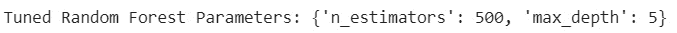

7

# 第七章：7. 机器学习模型的泛化

概述

本章将教你如何利用已有数据来训练更好的模型，方法是当数据足够时进行数据拆分，或在数据不足时使用交叉验证。通过本章的学习，你将掌握如何将数据划分为训练集、验证集和测试集。你将能够确定数据拆分的比例，并在拆分时考虑某些特征。你还将能够实施交叉验证，利用有限的数据进行测试，并使用正则化减少模型的过拟合。

# 介绍

在上一章中，你学习了使用各种评估指标（如 R2 分数、MAE 和准确度）来评估模型的表现。这些指标帮助你决定哪些模型保留，哪些模型舍弃。在本章中，你将学习一些训练更好模型的技巧。

泛化处理的是如何让模型在训练过程中未遇到的数据点上也能表现得足够好（即，未在训练中接触过的数据）。我们将讨论两个具体的方面：

+   如何尽可能多地利用数据来训练模型

+   如何减少模型中的过拟合

# 过拟合

当一个模型在训练数据上过拟合时，它生成的假设能够解释每一个例子。换句话说，它能正确预测每个例子的结果。这个场景的问题在于，模型方程变得极其复杂，这样的模型已被观察到无法正确预测新的观察数据。

过拟合发生在模型被过度设计时。出现过拟合的两种方式是：

+   模型训练使用了过多的特征。

+   模型训练时间过长。

我们将在接下来的章节中讨论这两个要点。

## 在过多特征上训练

当模型在过多的特征上进行训练时，假设变得极其复杂。假设你有一列特征，需要生成一个假设。在这种情况下，假设将是一个简单的线性方程，如下所示：


图 7.1：线性假设的方程

现在，假设你有两列特征，并且通过相乘来交叉这两列特征。假设变成了如下形式：


图 7.2：曲线假设的方程

虽然第一个方程生成的是一条直线，第二个方程生成的是一条曲线，因为它现在是一个二次方程。但同样的两列特征可能变得更加复杂，取决于你如何设计这些特征。考虑以下方程：


图 7.3：假设的立方方程

相同的一组特征现在已经引发了一个三次方程。这个方程具有大量的权重，例如：

+   简单的线性方程有一个权重和一个偏置。

+   二次方程有三个权重和一个偏置。

+   三次方程有五个权重和一个偏置。

由于特征过多导致的过拟合问题的一个解决方案是消除某些特征。这种技术称为套索回归（lasso regression）。

由于特征过多导致的过拟合问题的第二个解决方案是为模型提供更多的数据。这可能并不总是可行的选项，但在可能的情况下，最好这么做。

## 训练过长

该模型通过初始化权重向量，使得所有值都为零，开始训练。在训练过程中，权重根据梯度更新规则进行更新。这会系统地给每个权重加或减去一个小值。随着训练的进行，权重的大小不断增加。如果模型训练时间过长，这些模型权重会变得过大。

由于权重大导致的过拟合问题的解决方法是将权重的大小减小到尽可能接近零。这种技术称为岭回归（ridge regression）。

# 欠拟合

考虑另一种情况，其中数据有 10 个特征，但你只使用了 1 个特征。你的模型假设仍然是以下形式：


图 7.4：直线假设的方程

然而，这只是直线方程，但你的模型可能忽略了很多信息。模型过于简化，称为欠拟合数据。

欠拟合的解决方法是为模型提供更多特征，或者相反，提供更少的数据进行训练；但更多的特征是更好的方法。

# 数据

在机器学习的世界中，你所拥有的数据并不会全部用于训练你的模型。相反，你需要将数据分成三个集合，如下所述：

+   一个训练数据集，用于训练你的模型并衡量训练损失。

+   一个评估或验证数据集，用来衡量模型的验证损失，以查看验证损失是否随着训练损失的减少而继续减小。

+   一个测试数据集，用于最终测试模型在投入生产之前的表现。

## 数据集划分的比例

评估数据集是从你所有的训练数据中分出来的，并且永远不会用于训练。关于评估数据集的比例有不同的观点，但通常范围从最高 30%到最低 10%。这个评估数据集通常会进一步划分为在训练过程中使用的验证数据集和最后用于“健全性检查”的测试数据集。如果你使用 10%作为评估数据集，可能会将 5%用于验证，剩下的 5%用于测试。如果使用 30%，可能会将 20%用于验证，10%用于测试。

总结来说，你可以将数据划分为 70%用于训练，20%用于验证，10%用于测试，或者你也可以将数据划分为 80%用于训练，15%用于验证，5%用于测试。最后，你还可以将数据划分为 90%用于训练，5%用于验证，5%用于测试。

选择使用什么比例取决于你拥有的数据量。例如，如果你有 100,000 条记录，20%的验证集将给你 20,000 条记录。然而，如果你有 100,000,000 条记录，那么 5%的比例将给你 500 万条验证记录，这样的数据量就足够了。

## 创建数据集划分

在最基础的层面上，划分数据涉及到随机抽样。假设你有 10 个物品在一个碗里。为了得到 30%的物品，你将随机拿出 3 个物品。

同样，因为你正在编写代码，你可以这样做：

1.  创建一个 Python 列表。

1.  将 10 个数字放入列表中。

1.  从 0 到 9 生成 3 个不重复的随机整数。

1.  选择索引与先前生成的随机数字相对应的项。!图 7.5：数据划分的可视化

    ](img/B15019_07_05.jpg)

图 7.5：数据划分的可视化

这是你只会对特定数据集做一次的操作。你可能会为此编写一个函数。如果这是你需要重复做的事，并且你还需要处理一些高级功能，你可能会想为它编写一个类。

`sklearn`有一个叫做`train_test_split`的类，它提供了数据划分的功能。它可以通过`sklearn.model_selection.train_test_split`来使用。这个函数允许你将一个数据框（DataFrame）划分为两部分。

看一下下面关于导入和划分数据的练习。

## 练习 7.01：导入并划分数据

本练习的目标是从一个数据仓库导入数据，并将其划分为训练集和评估集。

我们将使用来自 UCI 机器学习库的 Cars 数据集。

注意

你可以在这里找到数据集：[`packt.live/2RE5rWi`](https://packt.live/2RE5rWi)

数据集也可以在我们的 GitHub 上找到，链接如下：[`packt.live/36cvyc4`](https://packt.live/36cvyc4)

你将在本章的练习中使用这个数据集。

这个数据集关于拥有特定属性的汽车的成本。网站摘要中提到：“*从简单的层次决策模型派生，数据库可能对测试构造性归纳和结构发现方法有用*。”以下是该数据集的一些关键属性：

```py
CAR car acceptability
. PRICE overall price
. . buying buying price
. . maint price of the maintenance
. TECH technical characteristics
. . COMFORT comfort
. . . doors number of doors
. . . persons capacity in terms of persons to carry
. . . lug_boot the size of luggage boot
. . safety estimated safety of the car
```

以下步骤将帮助你完成练习：

1.  打开一个新的 Colab 笔记本文件。

1.  导入必要的库：

    ```py
    # import libraries
    import pandas as pd
    from sklearn.model_selection import train_test_split
    ```

    在这一步，你已经导入了`pandas`并将其别名设置为`pd`。正如你所知道的，`pandas` 是读取文件所必需的。你还从`sklearn.model_selection`导入了`train_test_split`，用于将数据拆分为两部分。

1.  在将文件读入你的笔记本之前，使用编辑器打开并检查文件（`car.data`）。你应该看到类似以下的输出：

    图 7.6：汽车数据

    从之前的截图中，你会注意到该文件没有包含第一行作为列头。

1.  创建一个 Python 列表来保存数据的列名：

    ```py
    # data doesn't have headers, so let's create headers
    _headers = ['buying', 'maint', 'doors', 'persons', \
                'lug_boot', 'safety', 'car']
    ```

1.  现在，按照下面的代码片段导入数据：

    ```py
    # read in cars dataset
    df = pd.read_csv('https://raw.githubusercontent.com/'\
                     'PacktWorkshops/The-Data-Science-Workshop/'\
                     'master/Chapter07/Dataset/car.data', \
                     names=_headers, index_col=None)
    ```

    然后，你通过 `pd.read_csv` 将数据导入到一个名为 `df` 的变量中。你指定了数据文件的位置以及列头的列表。你还指定了数据没有列索引。

1.  显示前五条记录：

    ```py
    df.info()
    ```

    为了获取有关数据列和记录数的信息，你可以使用 `info()` 方法。你应该得到类似于以下的输出：

    

    图 7.7：DataFrame 的前五条记录

    `RangeIndex` 的值显示记录数为 `1728`。

1.  现在，你需要将 `df` 中的数据拆分为训练数据集和评估数据集：

    ```py
    #split the data into 80% for training and 20% for evaluation
    training_df, eval_df = train_test_split(df, train_size=0.8, \
                                            random_state=0)
    ```

    在这一步，你使用 `train_test_split` 创建两个新的 DataFrame，分别命名为 `training_df` 和 `eval_df`。

    你为 `train_size` 指定了一个值 `0.8`，这样 `80%` 的数据就会被分配给 `training_df`。

    `random_state` 确保实验的可重现性。如果没有 `random_state`，每次数据都会用不同的随机数进行拆分，结果会不同。使用 `random_state` 后，数据每次都会以相同的方式拆分。我们将在下一章深入研究 `random_state`。

1.  检查 `training_df` 的信息：

    ```py
    training_df.info()
    ```

    在这一步，你使用 `.info()` 来获取 `training_df` 的详细信息。这将打印出列名以及记录的数量。

    你应该得到类似于以下的输出：

    

    图 7.8：有关 `training_df` 的信息

    你应该观察到列名与 `df` 中的列名一致，但你应该会有 `80%` 的记录数，相当于从 `1728` 条记录中抽取了 `1382` 条。

1.  检查 `eval_df` 的信息：

    ```py
    eval_df.info()
    ```

    在这一步中，你将打印出关于`eval_df`的信息。这将给你列名和记录数量。输出应该类似于以下内容：

    

图 7.9：关于 eval_df 的信息

注意

要访问此特定部分的源代码，请参考 [`packt.live/3294avL`](https://packt.live/3294avL)。

你还可以在线运行此示例，网址：[`packt.live/2E8FHhT`](https://packt.live/2E8FHhT)。

现在你知道如何拆分数据了。每当你拆分数据时，记录将完全相同。你可以多次重复这个操作，并注意`eval_df`索引中的条目范围。

这意味着你无法重复你的实验。如果你运行相同的代码，每次都会得到不同的结果。而且，如果你与同事共享代码，他们也会得到不同的结果。这是因为编译器使用了随机数。

这些随机数实际上并不是真正的随机数，而是使用了一个叫做伪随机数生成器的东西。生成器有一组预定的随机数，它会使用这些数字，因此，你可以指定一个随机状态，使其使用特定的一组随机数。

# 随机状态

重现相同结果的关键是随机状态。你只需指定一个数字，每当使用该数字时，就会产生相同的结果。这是因为计算机没有真正的随机数生成器，而是使用伪随机数生成器。这意味着，如果你设置一个随机状态，你就可以生成相同的随机数序列。

请看下面的图示作为示例。列是你的随机状态。如果你选择 0 作为随机状态，将会生成以下数字：41、52、38、56…

然而，如果你选择 1 作为随机状态，将会生成一组不同的数字，依此类推。


图 7.10：使用随机状态生成的数字

在前一个练习中，你将随机状态设置为 0，以便实验可重复。

## 练习 7.02：拆分数据时设置随机状态

该练习的目标是为你在 *练习 7.01* 中导入并拆分的数据提供一种可重复的拆分方式。

注意

我们将重构前一个练习的代码。因此，如果你正在使用一个新的 Colab 笔记本，请确保复制前一个练习中的代码。或者，你可以复制 *练习 7.01* 中使用的笔记本，并按照以下步骤使用修改后的代码。

以下步骤将帮助你完成该练习：

1.  从前一个 *练习 7.01* 笔记本继续。

1.  设置随机状态为`1`并拆分数据：

    ```py
    """
    split the data into 80% for training and 20% for evaluation 
    using a random state
    """
    training_df, eval_df = train_test_split(df, train_size=0.8, \
                                            random_state=1)
    ```

    在这一步中，你将`train_test_split`函数的`random_state`值设置为 1。

1.  现在，查看`training_df`中的前五条记录：

    ```py
    #view the head of training_eval
    training_df.head()
    ```

    在此步骤中，您将打印出`training_df`中的前五条记录。

    输出应类似于以下内容：

    

    图 7.11：训练评估集的前五行

1.  查看`eval_df`中的前五条记录：

    ```py
    #view the top of eval_df
    eval_df.head()
    ```

    在此步骤中，您将打印出`eval_df`中的前五条记录。

    输出应类似于以下内容：

    

图 7.12：eval_df 的前五行

注意

要访问此特定部分的源代码，请参考[`packt.live/2Q6Jb7e`](https://packt.live/2Q6Jb7e)。

您还可以在[`packt.live/2EjFvMp`](https://packt.live/2EjFvMp)在线运行此示例。

本练习的目标是获得可重复的拆分。如果您运行代码，您将在`training_df`和`eval_df`中获得相同的记录。您可以在每个系统上多次运行此代码，并验证两个数据集中的记录是否相同。

每次更改`random_state`时，您将得到一组不同的训练和验证数据。

但是，如何找到最佳的数据集拆分方式来训练您的模型呢？当您没有大量数据时，推荐的方法是使用所有数据。

但是，如果您使用了所有数据，如何保留验证数据呢？

解决方案是将数据分成多个部分。这种方法称为交叉验证，我们将在下一节中详细讨论。

# 交叉验证

考虑一个例子，将数据分成五个部分，每部分占 20%。然后，您可以利用四个部分进行训练，剩下的一个部分用于评估。由于您有五个部分，您可以重复五次每次使用一个部分进行验证，剩余的数据用于训练。


图 7.13：交叉验证

交叉验证是一种数据拆分方法，您将数据分成多个部分，然后使用其中一些部分进行训练，其余部分用于验证。接着，您可以使用所有数据的组合来训练多个模型。

这种方法称为 n 折交叉验证或 k 折交叉验证。

注意

有关 k 折交叉验证的更多信息，请参阅[`packt.live/36eXyfi`](https://packt.live/36eXyfi)。

## KFold

`sklearn.model_selection`中的`KFold`类返回一个生成器，该生成器提供一个包含两个索引的元组，一个用于训练，另一个用于测试或验证。生成器函数允许您声明一个像迭代器一样工作的函数，从而可以在循环中使用它。

## 练习 7.03：创建一个五折交叉验证数据集

本练习的目标是从*练习 7.01*中导入并拆分的数据中创建一个五折交叉验证数据集。

注意

如果你正在使用一个新的 Colab 笔记本，确保从*练习 7.01*中复制代码，*导入并分割数据*。或者，你可以复制*练习 7.01*中使用的笔记本，并按照以下步骤建议的方式使用代码。

以下步骤将帮助你完成练习：

1.  从*练习 7.01*的笔记本文件继续。

1.  导入所有必要的库：

    ```py
    from sklearn.model_selection import KFold
    ```

    在这一步，你从`sklearn.model_selection`导入`KFold`。

1.  现在创建类的一个实例：

    ```py
    _kf = KFold(n_splits=5)
    ```

    在这一步，你创建一个`KFold`的实例，并将其赋值给一个名为`_kf`的变量。你为`n_splits`参数指定值`5`，这样它就会将数据集分割成五个部分。

1.  现在按以下代码片段分割数据：

    ```py
    indices = _kf.split(df)
    ```

    在这一步，你调用`split`方法，即在`_kf`上调用`.split()`。结果存储在一个名为`indices`的变量中。

1.  查明`indices`的数据类型：

    ```py
    print(type(indices))
    ```

    在这一步，你检查调用以分割输出的返回结果。

    输出应该是一个`generator`，如下所示：

    

    图 7.14：索引的数据类型

1.  获取第一组索引：

    ```py
    #first set
    train_indices, val_indices = next(indices)
    ```

    在这一步，你使用 Python 的`next()`函数来操作生成器函数。使用`next()`是获取生成器返回结果的方式。你要求了五个分割，因此可以在这个生成器上调用`next()`五次。第六次调用`next()`将导致 Python 运行时引发异常。

    `next()`的调用返回一个元组。在这种情况下，它是一个包含索引对的元组。第一个包含你的训练索引，第二个包含你的验证索引。你将它们分别赋值给`train_indices`和`val_indices`。

1.  按照以下代码片段创建一个训练数据集：

    ```py
    train_df = df.drop(val_indices)
    train_df.info()
    ```

    在这一步，你通过从包含所有数据的`df` DataFrame 中删除验证索引，创建一个新的 DataFrame，称为`train_df`。这是一种类似于集合论中操作的减法操作。`df`集合是`train`和`val`的并集。一旦你知道了`val`是什么，你可以通过从`df`中减去`val`来反向推导出`train`。如果你把`df`看作一个叫做`A`的集合，把`val`看作一个叫做`B`的集合，把`train`看作一个叫做`C`的集合，那么以下公式成立：

    

    ```py
    info() method on the new DataFrame.
    ```

    该调用的结果应类似于以下截图：

    

    图 7.17：新 DataFrame 的信息

1.  创建验证数据集：

    ```py
    val_df = df.drop(train_indices)
    val_df.info()
    ```

    在这一步，你通过从`df` DataFrame 中删除训练索引来创建`val_df`验证数据集。同样，你可以通过调用`info()`方法查看这个新 DataFrame 的详细信息。

    输出应类似于以下内容：

    

图 7.18：验证数据集的信息

注意

要访问此特定部分的源代码，请参考[`packt.live/3kRRaDf`](https://packt.live/3kRRaDf)。

你也可以在线运行这个示例，网址是[`packt.live/3kTNPnf`](https://packt.live/3kTNPnf)。

你可以将前面的所有步骤编程为一个循环，这样你就不需要手动调用`next()`五次。这正是我们将在下一个练习中做的。

## 练习 7.04：使用循环进行调用来创建五折交叉验证数据集

本练习的目标是从你在*练习 7.01*中导入的数据显示，使用循环调用生成器函数来创建一个五折交叉验证数据集。

注意

如果你正在使用新的 Colab 笔记本，请确保复制*练习 7.01，导入和分割数据*中的代码。或者，你可以复制在*练习 7.01*中使用的笔记本，并按照以下步骤使用建议的代码。该练习的笔记本链接如下：[`packt.live/3g83AmU`](https://packt.live/3g83AmU)。

以下步骤将帮助你完成此练习：

1.  打开一个新的 Colab 笔记本，并重复在*练习 7.01*中用于导入数据的步骤，*导入和分割数据*。

1.  定义你希望的分割数量：

    ```py
    from sklearn.model_selection import KFold
    #define number of splits
    n_splits = 5
    ```

    在此步骤中，你将分割的数量设置为`5`，并将其存储在一个名为`n_splits`的变量中。

1.  创建一个`Kfold`的实例：

    ```py
    #create an instance of KFold
    _kf = KFold(n_splits=n_splits)
    ```

    在此步骤中，你创建了一个`Kfold`的实例，并将该实例赋值给一个名为`_kf`的变量。

1.  生成分割索引：

    ```py
    #create splits as _indices
    _indices = _kf.split(df)
    ```

    在此步骤中，你在之前定义的`KFold`实例`_kf`上调用`split()`方法，并将`df`作为参数传入，这样分割操作将在名为`df`的数据框上进行。生成的生成器将被存储为`_indices`。

1.  创建两个 Python 列表：

    ```py
    _t, _v = [], []
    ```

    在此步骤中，你创建了两个 Python 列表。第一个名为`_t`，包含训练数据框；第二个名为`_v`，包含验证数据框。

1.  遍历生成器并创建名为`train_idx`、`val_idx`、`_train_df`和`_val_df`的数据框：

    ```py
    #iterate over _indices
    for i in range(n_splits):
        train_idx, val_idx = next(_indices)
        _train_df = df.drop(val_idx)
        _t.append(_train_df)
        _val_df = df.drop(train_idx)
        _v.append(_val_df)
    ```

    在此步骤中，你使用`range`创建一个循环来确定迭代次数。你通过将`n_splits`作为参数传递给`range()`来指定迭代次数。在每次迭代中，你在`_indices`生成器上执行`next()`并将结果存储在`train_idx`和`val_idx`中。然后，你通过从`df`中删除验证索引`val_idx`来创建`_train_df`。你还通过从`df`中删除训练索引来创建`_val_df`。

1.  遍历训练列表：

    ```py
    for d in _t:
        print(d.info())
    ```

    在此步骤中，你验证编译器是否已创建数据框。你可以通过遍历列表并使用`.info()`方法打印每个元素的详细信息来完成此操作。输出类似于以下屏幕截图，因输出过大而不完全显示。列表中的每个元素都是一个包含 1,382 条记录的数据框：

    

    图 7.19：遍历训练列表

    注意

    上述输出是实际输出的简化版本。

1.  遍历验证列表：

    ```py
    for d in _v:
        print(d.info())
    ```

    在这一步，你遍历验证列表，并使用 `.info()` 打印出每个元素的详细信息。输出类似于以下截图，因大小问题未完全显示。每个元素是一个包含 346 条条目的 DataFrame：

    

图 7.20：遍历验证列表

注意

上述输出是实际输出的简化版本。

若要访问此特定部分的源代码，请参考 [`packt.live/3g83AmU`](https://packt.live/3g83AmU)。

你也可以在在线运行这个例子：[`packt.live/3iXwEPR`](https://packt.live/3iXwEPR)。

在本练习中，你已经学会如何使用循环进行 k 折交叉验证，以提取训练和验证数据集。你可以利用这些数据集来训练和评估多个模型。

创建交叉验证数据集的核心思想是，你可以训练并评估多个模型。如果你不必在循环中训练这些模型会怎样？

好消息是，你可以避免在循环中训练多个模型，因为如果你那样做，你将需要数组来跟踪许多指标。

# cross_val_score

`cross_val_score()` 函数在 `sklearn.model_selection` 中可用。到目前为止，你已经学会如何在循环中创建交叉验证数据集。如果你使用了这种方法，你需要在循环中跟踪所有训练和评估的模型。

`cross_val_score` 处理以下事项：

+   创建交叉验证数据集

+   通过将模型拟合到训练数据来训练模型

+   在验证数据上评估模型

+   返回每个训练模型的 R2 分数列表

要使上述操作生效，你需要提供以下输入：

+   一个估计器实例（例如，`LinearRegression`）

+   原始数据集

+   要创建的拆分数（这也是将训练和评估的模型数量）

## 练习 7.05：获取五折交叉验证的得分

本练习的目标是从你在 *练习 7.01*，*导入并拆分数据* 中导入的数据创建一个五折交叉验证数据集。然后，你将使用 `cross_val_score` 获取在这些数据集上训练的模型的得分。

注意

如果你使用的是新的 Colab 笔记本，确保从 *练习 7.01*，*导入并拆分数据* 中复制代码。或者，你可以复制 *练习 7.01* 中使用的笔记本，并按照以下步骤中的建议使用修改后的代码。该练习的笔记本链接可以在这里找到：[`packt.live/2DWTkAY`](https://packt.live/2DWTkAY)。

以下步骤将帮助你完成练习：

1.  打开一个新的 Colab 笔记本，并重复 *步骤 1-6*，这些步骤用于导入 *练习 7.01* 中的数据，*导入并拆分数据*。

1.  对数据集中的分类变量进行编码：

    ```py
    # encode categorical variables
    _df = pd.get_dummies(df, columns=['buying', 'maint', 'doors', \
                                      'persons', 'lug_boot', \
                                      'safety'])
    _df.head()
    ```

    在这一步中，你使用 `pd.get_dummies()` 将分类变量转换为编码。你将结果存储在一个新的 DataFrame 变量 `_df` 中。然后，你继续查看前五条记录。

    结果应类似于以下内容：

    

    ](img/B15019_07_21.jpg)

    图 7.21：编码分类变量

1.  将数据拆分为特征和标签：

    ```py
    # separate features and labels DataFrames
    features = _df.drop(['car'], axis=1).values
    labels = _df[['car']].values
    ```

    在这一步中，你通过从 `_df` 中删除 `car` 来创建一个 `features` DataFrame。你还通过选择新的 DataFrame 中仅包含 `car` 的部分来创建 `labels`。在这里，特征和标签在“汽车”数据集中是相似的。

1.  创建 `LogisticRegression` 类的一个实例，供后续使用：

    ```py
    from sklearn.linear_model import LogisticRegression
    # create an instance of LogisticRegression
    _lr = LogisticRegression()
    ```

    在这一步中，你从 `sklearn.linear_model` 中导入 `LogisticRegression`。我们使用 `LogisticRegression` 是因为它可以让我们创建一个分类模型，正如你在 *第三章，二分类* 中学到的那样。然后你继续创建一个实例，并将其存储为 `_lr`。

1.  导入 `cross_val_score` 函数：

    ```py
    from sklearn.model_selection import cross_val_score
    ```

    在这一步，你导入 `cross_val_score`，你将利用它来计算模型的得分。

1.  计算交叉验证得分：

    ```py
    _scores = cross_val_score(_lr, features, labels, cv=5)
    ```

    在这一步，你计算交叉验证得分，并将结果存储在一个 Python 列表中，命名为 `_scores`。你可以使用 `cross_val_score` 完成这个操作。该函数需要以下四个参数：所使用的模型（在我们的例子中，它叫做 `_lr`）；数据集的特征；数据集的标签；以及创建交叉验证拆分的数量（在我们的例子中是五）。

1.  现在，按照以下代码片段显示得分：

    ```py
    print(_scores)
    ```

    在这一步，你使用 `print()` 来显示得分。

    输出结果应类似于以下内容：

    

    ](img/B15019_07_22.jpg)

图 7.22：打印交叉验证得分

注意

你可能会得到略微不同的输出，但最佳得分应该属于第二个拆分。

要访问该特定部分的源代码，请参考 [`packt.live/2DWTkAY`](https://packt.live/2DWTkAY)。

你也可以在线运行这个例子，地址是 [`packt.live/34d5aS8`](https://packt.live/34d5aS8)。

在前面的输出中，你可以看到存储在 `variable _scores` 中的 Python 列表包含五个结果。每个结果都是 `LogisticRegression` 模型的 R2 得分。正如练习开始时所提到的，数据将被拆分为五个集合，每个五集合的组合都将用于训练和评估模型，之后计算 R2 得分。

从前面的例子中，你应该能观察到，相同的模型在五个不同的数据集上训练时产生了不同的得分。这表明数据的重要性以及数据如何分割的重要性。

通过完成本练习，我们发现最佳分数是**0.832**，它属于第二个分割。这是我们在此得出的结论。

你已经看到，交叉验证会生成不同的模型。

但是，如何获取最佳模型来使用呢？有些模型或估计器具有内建的交叉验证功能。我们来解释一下这些模型。

## 理解实现 CV 的估计器

使用交叉验证的目标是通过你拥有的数据找到表现最好的模型。其过程如下：

1.  使用类似`Kfold()`的方式分割数据。

1.  在不同的分割数之间进行迭代并创建估计器。

1.  训练并评估每个估计器。

1.  选择具有最佳指标的估计器。你已经看过多种方法来实现这一点。

交叉验证是一种流行的技术，因此也有许多为交叉验证设计的估计器。例如，`LogisticRegressionCV`是一个实现了交叉验证的类，嵌套在`LogisticRegression`中。当你使用`LogisticRegressionCV`时，它会返回一个`LogisticRegression`的实例。返回的实例是表现最好的实例。

当你创建`LogisticRegressionCV`的实例时，你需要指定你希望使用的`cv`分割数。例如，如果你将`cv`设置为`3`，`LogisticRegressionCV`将训练三个`LogisticRegression`实例，然后评估它们并返回表现最好的实例。

你不需要使用`LogisticRegressionCV`。你可以继续使用`LogisticRegression`与`Kfold`和迭代方法。`LogisticRegressionCV`只是作为一种便利存在。

以类似的方式，`LinearRegressionCV`作为一种便利的方式实现了使用`LinearRegression`进行交叉验证。

所以，为了明确一下，你不必使用像`LogisticRegressionCV`这样的便利方法。此外，它们并不是其主要实现的替代品，比如`LogisticRegression`。相反，当你需要实施交叉验证时，你可以使用这些便利方法，这样就可以省略前面的四个步骤。

# LogisticRegressionCV

`LogisticRegressionCV`是一个实现交叉验证的类。这个类会训练多个`LogisticRegression`模型，并返回表现最好的一个。

## 练习 7.06：使用交叉验证训练逻辑回归模型

本练习的目标是使用交叉验证训练一个逻辑回归模型，并获得最佳的 R2 结果。我们将使用你之前处理过的 Cars 数据集。

以下步骤将帮助你完成本练习：

1.  打开一个新的 Colab 笔记本。

1.  导入必要的库：

    ```py
    # import libraries
    import pandas as pd
    from sklearn.model_selection import train_test_split
    ```

    在这一步，你导入`pandas`并将其别名设为`pd`。你将使用 pandas 来读取你将要处理的文件。

1.  为数据创建标题：

    ```py
    # data doesn't have headers, so let's create headers
    _headers = ['buying', 'maint', 'doors', 'persons', \
                'lug_boot', 'safety', 'car']
    ```

    在这一步，你首先创建一个 Python 列表，用来保存你将要处理的文件的`headers`列。你将这个列表存储为`_headers`。

1.  读取数据：

    ```py
    # read in cars dataset
    df = pd.read_csv('https://raw.githubusercontent.com/'\
                     'PacktWorkshops/The-Data-Science-Workshop/'\
                     'master/Chapter07/Dataset/car.data', \
                     names=_headers, index_col=None)
    ```

    然后，你继续读取文件并将其存储为`df`。这就是一个数据框。

1.  打印前五条记录：

    ```py
    df.info()
    ```

    最后，你使用`.info()`查看数据框的总结信息。

    输出结果类似于以下内容：

    

    图 7.23：数据框的前五条记录

1.  如下代码片段所示，编码类别变量：

    ```py
    # encode categorical variables
    _df = pd.get_dummies(df, columns=['buying', 'maint', 'doors', \
                                      'persons', 'lug_boot', \
                                      'safety'])
    _df.head()
    ```

    在此步骤中，你使用 pandas 的`get_dummies()`方法将类别变量转换为编码。你将原始数据框作为参数传入，并指定需要编码的列。

    最后，你查看前五行数据。输出结果类似于以下内容：

    

    图 7.24：编码类别变量

1.  将数据框分割成特征和标签：

    ```py
    # separate features and labels DataFrames
    features = _df.drop(['car'], axis=1).values
    labels = _df[['car']].values
    ```

    在此步骤中，你创建了两个 NumPy 数组。第一个数组叫做`features`，包含自变量。第二个数组叫做`labels`，包含模型学习预测的值，也叫做`targets`。

1.  导入带有交叉验证的逻辑回归：

    ```py
    from sklearn.linear_model import LogisticRegressionCV
    ```

    在此步骤中，你导入`LogisticRegressionCV`类。

1.  如下代码片段所示，实例化`LogisticRegressionCV`：

    ```py
    model = LogisticRegressionCV(max_iter=2000, multi_class='auto',\
                                 cv=5)
    ```

    在此步骤中，你创建一个`LogisticRegressionCV`实例。你指定以下参数：

    `max_iter`：你将其设置为`2000`，使得训练器继续训练`2000`次迭代，以找到更好的权重。

    `multi_class`：你将其设置为`auto`，以便模型自动检测数据中是否有多个类别。

    `cv`：你将其设置为`5`，即你希望用于训练的交叉验证集数量。

1.  现在拟合模型：

    ```py
    model.fit(features, labels.ravel())
    ```

    在此步骤中，你训练模型。你传入`features`和`labels`。由于`labels`是二维数组，你可以使用`ravel()`将其转换为一维数组或向量。

    解释器生成的输出结果类似于以下内容：

    

    图 7.25：拟合模型

    在前面的输出中，你会看到模型拟合了训练数据。输出结果显示了用于训练的参数，避免了意外情况的发生。例如，注意到`max_iter`的值为`2000`，这就是你设置的值。其他未设置的参数则使用默认值，具体可以查阅文档了解更多信息。

1.  评估训练的 R2 值：

    ```py
    print(model.score(features, labels.ravel()))
    ```

    在此步骤中，我们利用训练数据集计算 R2 得分。虽然我们没有专门留出验证数据集，但需要注意的是，模型仅使用了 80%的训练数据，因此在进行此评估时，仍然有新数据可以使用。

    输出结果类似于以下内容：

    

图 7.26：计算 R2 得分

注意

要访问此特定章节的源代码，请参考 [`packt.live/34eD1du`](https://packt.live/34eD1du)。

您还可以在线运行此示例，网址为 [`packt.live/2Yey40k`](https://packt.live/2Yey40k)。

在前面的输出中，您会看到最终模型的`R2`得分为`0.95`，这是一个不错的得分。

此时，您应该看到一个比以前遇到的更好的`R2`得分。

如果您正在使用没有内置交叉验证的其他类型的模型怎么办？您可以利用交叉验证来训练模型并找到最佳模型吗？让我们来看看。

# 使用 GridSearchCV 进行超参数调优

`GridSearchCV`将接受一个模型和参数，并为每个参数的排列训练一个模型。在训练结束时，它将提供对参数和模型评分的访问权限。这被称为超参数调优，您将在*第八章，超参数调优*中深入了解这个过程。

通常的做法是利用一个小的训练集来通过超参数调优找到最佳参数，然后使用所有数据训练最终模型。

在下一步练习之前，让我们简要回顾一下决策树，它是一种模型或估算器。

## 决策树

决策树通过为数据中的特征生成一个分割超平面或阈值来工作。它通过考虑每个特征，并找到该特征的值分布与您试图预测的标签之间的相关性来实现这一点。

考虑以下关于气球的数据。您需要预测的标签是`inflated`。这个数据集用于预测根据特征气球是否充气。特征包括：

+   `color`

+   `size`

+   `act`

+   `age`

以下表格显示了特征的分布：


图 7.27：气球特征的表格数据

现在，考虑以下图表，这些图表根据特征与标签的分布进行可视化：

+   如果考虑`Color`特征，值为`PURPLE`和`YELLOW`，但观察值的数量相同，因此无法根据颜色推断气球是否充气，正如下图所示：

图 7.28：颜色特征的条形图

+   `Size`特征有两个值：`LARGE`和`SMALL`。这些值分布均匀，因此无法根据颜色推断气球是否充气，正如下图所示：

图 7.29：尺寸特征的条形图

+   `Act`特征有两个值：`DIP`和`STRETCH`。从图表中可以看出，大部分`STRETCH`的值对应的是气球被充气。如果你需要做出猜测，可以很容易地说，如果`Act`是`STRETCH`，那么气球就是充气的。请看下图：

图 7.30: `Act`特征的条形图

+   最后，`Age`特征也有两个值：`ADULT`和`CHILD`。从图表中也可以看出，`ADULT`值占据了大部分充气气球的比例：

图 7.31: 年龄特征的条形图

对于决策树有用的两个特征是`Act`和`Age`。决策树可以从判断`Act`是否为`STRETCH`开始。如果是，则预测结果为真。这个树形结构大致如下图所示：


图 7.32: 深度为 1 的决策树

左侧表示条件为假时的情况，右侧表示条件为真时的情况。这个树的深度为 1。F 表示预测为假，T 表示预测为真。

为了获得更好的结果，决策树可以引入第二层。第二层将使用`Age`特征，并判断其值是否为`ADULT`。其结构大致如下图所示：


图 7.33: 深度为 2 的决策树

这个树的深度为 2。在第一层，它会判断`Act`是否为`STRETCH`，如果是，则预测为真。如果`Act`不是`STRETCH`，它会检查`Age`是否为`ADULT`。如果是，则预测为真，否则预测为假。

决策树可以有任意多个层级，但在某个点之后会开始过拟合。像数据科学中的所有问题一样，最佳深度取决于数据本身，是一个超参数，这意味着你需要尝试不同的值来找到最佳的深度。

在接下来的练习中，我们将使用网格搜索和交叉验证来为决策树估算器找到最佳参数。

## 练习 7.07: 使用网格搜索和交叉验证找到模型的最佳参数

本次练习的目标是使用网格搜索找到`DecisionTree`分类器的最佳参数。我们将使用你之前使用过的汽车数据集。

以下步骤将帮助你完成练习：

1.  打开一个 Colab 笔记本文件。

1.  导入`pandas`：

    ```py
    import pandas as pd
    ```

    在这一步中，你导入`pandas`并将其别名为`pd`。`Pandas`用于读取你之后将使用的数据。

1.  创建`headers`：

    ```py
    _headers = ['buying', 'maint', 'doors', 'persons', \
                'lug_boot', 'safety', 'car']
    ```

1.  读取`headers`：

    ```py
    # read in cars dataset
    df = pd.read_csv('https://raw.githubusercontent.com/'\
                     'PacktWorkshops/The-Data-Science-Workshop/'\
                     'master/Chapter07/Dataset/car.data', \
                     names=_headers, index_col=None)
    ```

1.  检查前五条记录：

    ```py
    df.info()
    ```

    输出结果类似于下图：

    

    图 7.34: 数据框的前五条记录

1.  对类别变量进行编码：

    ```py
    _df = pd.get_dummies(df, columns=['buying', 'maint', 'doors',\
                                      'persons', 'lug_boot', \
                                      'safety'])
    _df.head()
    ```

    在此步骤中，您使用`.get_dummies()`将分类变量转换为编码。`.head()`方法指示 Python 解释器输出前五列。

    输出类似于以下内容：

    

    ](img/B15019_07_35.jpg)

    图 7.35：编码分类变量

1.  分离`features`和`labels`：

    ```py
    features = _df.drop(['car'], axis=1).values
    labels = _df[['car']].values
    ```

    在此步骤中，您创建了两个`numpy`数组，`features`和`labels`，第一个包含独立变量或预测变量，第二个包含依赖变量或目标变量。

1.  导入更多库——`numpy`、`DecisionTreeClassifier`和`GridSearchCV`：

    ```py
    import numpy as np
    from sklearn.tree import DecisionTreeClassifier
    from sklearn.model_selection import GridSearchCV
    ```

    在此步骤中，您导入`numpy`。NumPy 是一个数值计算库，您将其别名为`np`。您还导入`DecisionTreeClassifier`，用于创建决策树。最后，您导入`GridSearchCV`，它将使用交叉验证训练多个模型。

1.  实例化决策树：

    ```py
    clf = DecisionTreeClassifier()
    ```

    在此步骤中，您创建了一个`DecisionTreeClassifier`的实例，命名为`clf`。此实例将被网格搜索重复使用。

1.  创建参数——`max_depth`：

    ```py
    params = {'max_depth': np.arange(1, 8)}
    ```

    在此步骤中，您创建了一个参数字典。这个字典有两个部分：

    字典的键是传递给模型的参数。在此案例中，`max_depth`是`DecisionTreeClassifier`所接受的一个参数。

    该值是一个 Python 列表，网格搜索将对其进行迭代并传递给模型。在此案例中，我们创建了一个从 1 到 7（包含）的数组。

1.  按照以下代码片段实例化网格搜索：

    ```py
    clf_cv = GridSearchCV(clf, param_grid=params, cv=5)
    ```

    在此步骤中，您创建了`GridSearchCV`的一个实例。第一个参数是要训练的模型。第二个参数是要搜索的参数。第三个参数是要创建的交叉验证拆分的数量。

1.  现在训练模型：

    ```py
    clf_cv.fit(features, labels)
    ```

    在此步骤中，您使用特征和标签训练模型。根据模型类型，这可能需要一些时间。因为我们使用的是决策树，它训练得很快。

    输出类似于以下内容：

    

    ](img/B15019_07_36.jpg)

    图 7.36：训练模型

    通过阅读输出，您可以学到很多信息，比如创建的交叉验证数据集数量（称为`cv`，等于`5`），使用的估算器（`DecisionTreeClassifier`），以及参数搜索空间（称为`param_grid`）。

1.  打印最佳参数：

    ```py
    print("Tuned Decision Tree Parameters: {}"\
          .format(clf_cv.best_params_))
    ```

    在此步骤中，您打印出最佳参数是什么。在此案例中，我们要寻找的是最佳的`max_depth`。输出看起来类似于以下内容：

    

    ](img/B15019_07_37.jpg)

    图 7.37：打印最佳参数

    在前面的输出中，您会看到最佳表现的模型是`max_depth`为`2`的模型。

    访问`best_params_`可以让您使用更大的训练数据集，通过最佳已知参数重新训练另一个模型。

1.  打印最佳`R2`值：

    ```py
    print("Best score is {}".format(clf_cv.best_score_))
    ```

    在此步骤中，您打印出最佳表现模型的`R2`得分。

    输出结果类似于以下内容：

    ```py
    Best score is 0.7777777777777778
    ```

    在前面的输出中，你可以看到表现最好的模型的`R2`得分为`0.778`。

1.  访问最佳模型：

    ```py
    model = clf_cv.best_estimator_
    model
    ```

    在这一步，你通过`best_estimator_`访问最佳模型（或估算器）。这将让你分析模型，或者可选地使用它进行预测并找到其他指标。指示 Python 解释器打印最佳估算器将输出类似于以下内容：

    

    ](img/B15019_07_39.jpg)

图 7.38：访问模型

在前面的输出中，你可以看到最好的模型是`DecisionTreeClassifier`，其`max_depth`为`2`。

注意

要访问这一特定部分的源代码，请参考[`packt.live/2E6TdCD`](https://packt.live/2E6TdCD)。

你也可以在线运行此示例，网址为[`packt.live/3aCg30V`](https://packt.live/3aCg30V)。

网格搜索是超参数调优中最早教授的技术之一。然而，随着搜索空间的增大，计算成本迅速增加。随着你增加参数选项，搜索空间也会增大，因为会考虑每一种可能的参数组合。

考虑一下模型（或估算器）需要多个参数的情况。搜索空间将是参数数量的倍数。例如，如果我们要训练一个随机森林分类器，我们需要指定森林中的树木数量以及最大深度。如果我们指定了最大深度为 1、2 和 3，并且森林中有 1,000、2,000 和 3,000 棵树，那么我们就需要训练 9 个不同的估算器。如果我们再增加更多参数（或超参数），我们的搜索空间将呈几何增长。

# 使用 RandomizedSearchCV 进行超参数调优

网格搜索会遍历整个搜索空间，并为每一种参数组合训练一个模型或估算器。而随机搜索只会遍历部分组合。这是一种更优化的资源使用方式，仍然能提供超参数调优和交叉验证的好处。在*第八章，超参数调优*中你将深入了解这一点。

请查看以下练习。

## 练习 7.08：使用随机搜索进行超参数调优

这个练习的目标是使用随机搜索和交叉验证进行超参数调优。

以下步骤将帮助你完成这个练习：

1.  打开一个新的 Colab 笔记本文件。

1.  导入`pandas`：

    ```py
    import pandas as pd
    ```

    在这一步中，你导入`pandas`库。你将在下一步中使用它。

1.  创建`headers`：

    ```py
    _headers = ['buying', 'maint', 'doors', 'persons', \
                'lug_boot', 'safety', 'car']
    ```

1.  读取数据：

    ```py
    # read in cars dataset
    df = pd.read_csv('https://raw.githubusercontent.com/'\
                     'PacktWorkshops/The-Data-Science-Workshop/'\
                     'master/Chapter07/Dataset/car.data', \
                     names=_headers, index_col=None)
    ```

1.  查看前五行：

    ```py
    df.info()
    ```

    你需要提供一个包含列名的 Python 列表，因为数据本身不包含列头。你还需要查看你创建的 DataFrame。

    输出结果类似于以下内容：

    

    ](img/B15019_07_39.jpg)

    图 7.39：DataFrame 的前五行

1.  按照以下代码片段对类别变量进行编码：

    ```py
    _df = pd.get_dummies(df, columns=['buying', 'maint', 'doors',\
                                      'persons', 'lug_boot', \
                                      'safety'])
    _df.head()
    ```

    在这一步中，您通过使用独热编码找到文本数据的数值表示。该操作结果会生成一个新的 DataFrame。您将看到，生成的数据结构看起来类似于以下内容：

    

    图 7.40：编码分类变量

1.  将数据分为独立变量和依赖变量，即`features`和`labels`：

    ```py
    features = _df.drop(['car'], axis=1).values
    labels = _df[['car']].values
    ```

    在这一步中，您将 DataFrame 分为两个`numpy`数组，分别称为`features`和`labels`。`Features`包含独立变量，而`labels`包含目标或依赖变量。

1.  导入额外的库——`numpy`、`RandomForestClassifier`和`RandomizedSearchCV`：

    ```py
    import numpy as np
    from sklearn.ensemble import RandomForestClassifier
    from sklearn.model_selection import RandomizedSearchCV
    ```

    在这一步中，您导入`numpy`进行数值计算，导入`RandomForestClassifier`以创建一个估计器集成，并导入`RandomizedSearchCV`以执行带有交叉验证的随机搜索。

1.  创建`RandomForestClassifier`的实例：

    ```py
    clf = RandomForestClassifier()
    ```

    在这一步中，您实例化`RandomForestClassifier`。随机森林分类器是一种投票分类器。它利用多棵决策树，这些树在不同的数据子集上进行训练。各个树的结果通过投票机制贡献到随机森林的输出中。

1.  指定参数：

    ```py
    params = {'n_estimators':[500, 1000, 2000], \
              'max_depth': np.arange(1, 8)}
    ```

    `RandomForestClassifier`接受许多参数，但我们指定了两个：森林中树的数量，称为`n_estimators`，以及每棵树的节点深度，称为`max_depth`。

1.  实例化一个随机搜索：

    ```py
    clf_cv = RandomizedSearchCV(clf, param_distributions=params, \
                                cv=5)
    ```

    在这一步中，您在实例化`clf`类时指定三个参数：要使用的估计器或模型（即随机森林分类器）、`param_distributions`（参数搜索空间）和`cv`（创建交叉验证数据集的数量）。

1.  执行搜索：

    ```py
    clf_cv.fit(features, labels.ravel())
    ```

    在这一步中，您通过调用`fit()`来执行搜索。此操作使用交叉验证数据集和不同超参数的组合训练不同的模型。该操作的输出类似于以下内容：

    

    图 7.41：搜索操作的输出

    在前面的输出中，您可以看到随机搜索将使用五折交叉验证（`cv=5`）进行。要使用的估计器是`RandomForestClassifier`。

1.  打印最佳参数组合：

    ```py
    print("Tuned Random Forest Parameters: {}"\
          .format(clf_cv.best_params_))
    ```

    在这一步中，您打印出最佳的超参数。

    输出结果类似于以下内容：

    

    图 7.42：打印最佳参数组合

    在前面的输出中，您可以看到最佳估计器是一个包含 1,000 棵树的随机森林分类器（`n_estimators=1000`）和`max_depth=5`。您可以通过执行`print("Best score is {}".format(clf_cv.best_score_))`来打印最佳分数。对于这个练习，这个值大约是`0.76`。

1.  检查最佳模型：

    ```py
    model = clf_cv.best_estimator_
    model
    ```

    在这一步中，你需要找到表现最佳的估计器（或模型）并打印出其详细信息。输出结果类似于以下内容：

    

图 7.43：检查模型

在前面的输出中，你可以看到最佳估计器是`RandomForestClassifier`，其`n_estimators=1000`和`max_depth=5`。

注意

要访问此特定部分的源代码，请参考[`packt.live/3aDFijn`](https://packt.live/3aDFijn)。

你也可以在[`packt.live/3kWMQ5r`](https://packt.live/3kWMQ5r)上在线运行此示例。

在本练习中，你学会了如何利用交叉验证和随机搜索来找到最佳模型，这个过程结合了超参数。这一过程叫做超参数调优，在其中你可以找到最佳的超参数组合来训练模型，并将其投入生产使用。

# 使用套索回归进行模型正则化

如本章开头所述，模型可能会对训练数据发生过拟合。造成过拟合的原因之一是特征数量过多且系数较大（也叫权重）。解决此类过拟合问题的关键是减小系数的大小。

你可能记得，权重是在模型训练过程中进行优化的。优化权重的一种方法叫做梯度下降。梯度更新规则利用可微分的损失函数。可微分损失函数的例子包括：

+   平均绝对误差（MAE）

+   均方误差（MSE）

对于套索回归，损失函数中引入了惩罚项。该实现的技术细节由类隐藏。这个惩罚项也叫做正则化参数。

请考虑以下练习，在其中你过度工程化一个模型以引入过拟合，然后使用套索回归来获得更好的结果。

## 练习 7.09：使用套索回归修复模型过拟合

本练习的目标是教你如何识别模型何时开始过拟合，并使用套索回归修复模型中的过拟合问题。

注意

你将使用的数据集来自 UCI 机器学习库中的联合循环电厂数据集。该数据集包含从联合循环电厂收集的 9568 个数据点。特征包括温度、气压、湿度和排气真空。这些数据用于预测电厂的每小时净电能输出。请参阅以下链接：[`packt.live/2v9ohwK`](https://packt.live/2v9ohwK)。

属性信息表明“特征由每小时平均的环境变量组成：

+   温度（T）范围为 1.81°C 至 37.11°C，

+   环境气压（AP）范围为 992.89-1033.30 毫巴，

+   相对湿度（RH）范围为 25.56%至 100.16%

+   排气真空（V）范围为 25.36-81.56 cm Hg

+   每小时净电能输出（EP）为 420.26-495.76 MW

平均值来自位于工厂各地的传感器，这些传感器每秒记录一次环境变量。这些变量未经过归一化处理。

以下步骤将帮助你完成练习：

1.  打开一个 Colab 笔记本。

1.  导入所需的库：

    ```py
    import pandas as pd
    from sklearn.model_selection import train_test_split
    from sklearn.linear_model import LinearRegression, Lasso
    from sklearn.metrics import mean_squared_error
    from sklearn.pipeline import Pipeline
    from sklearn.preprocessing import MinMaxScaler, \
    PolynomialFeatures
    ```

1.  读取数据：

    ```py
    _df = pd.read_csv('https://raw.githubusercontent.com/'\
                      'PacktWorkshops/The-Data-Science-Workshop/'\
                      'master/Chapter07/Dataset/ccpp.csv')
    ```

1.  检查数据框：

    ```py
    _df.info()
    ```

    `.info()` 方法打印数据框的概述，包括列的名称和记录的数量。输出可能类似于以下内容：

    

    ](img/B15019_07_44.jpg)

    图 7.44：检查数据框

    从前面的图中可以看出，数据框有 5 列和 9,568 条记录。你可以看到所有列都包含数字数据，并且列的名称如下：`AT`、`V`、`AP`、`RH` 和 `PE`。

1.  将特征提取到名为 `X` 的列中：

    ```py
    X = _df.drop(['PE'], axis=1).values
    ```

1.  将标签提取到名为 `y` 的列中：

    ```py
    y = _df['PE'].values
    ```

1.  将数据分为训练集和评估集：

    ```py
    train_X, eval_X, train_y, eval_y = train_test_split\
                                       (X, y, train_size=0.8, \
                                        random_state=0)
    ```

1.  创建一个 `LinearRegression` 模型的实例：

    ```py
    lr_model_1 = LinearRegression()
    ```

1.  在训练数据上拟合模型：

    ```py
    lr_model_1.fit(train_X, train_y)
    ```

    这个步骤的输出应类似于以下内容：

    

    ](img/B15019_07_45.jpg)

    图 7.45：在训练数据上拟合模型

1.  使用模型在评估数据集上进行预测：

    ```py
    lr_model_1_preds = lr_model_1.predict(eval_X)
    ```

1.  打印模型的 `R2` 分数：

    ```py
    print('lr_model_1 R2 Score: {}'\
          .format(lr_model_1.score(eval_X, eval_y)))
    ```

    这个步骤的输出应类似于以下内容：

    

    ](img/B15019_07_46.jpg)

    图 7.46：打印 R2 分数

    你会注意到，这个模型的 `R2` 分数为 `0.926`。你将用这个分数来与下一个训练的模型进行比较。记住，这也是一个评估指标。

1.  打印该模型的均方误差（MSE）：

    ```py
    print('lr_model_1 MSE: {}'\
          .format(mean_squared_error(eval_y, lr_model_1_preds)))
    ```

    这个步骤的输出应类似于以下内容：

    

    ](img/B15019_07_47.jpg)

    图 7.47：打印 MSE

    你会注意到，MSE 为 `21.675`。这是一个评估指标，你将用它来比较这个模型与后续模型的表现。

    第一个模型是基于四个特征进行训练的。你现在将基于四个立方特征训练一个新模型。

1.  创建一个元组列表，作为管道：

    ```py
    steps = [('scaler', MinMaxScaler()),\
             ('poly', PolynomialFeatures(degree=3)),\
             ('lr', LinearRegression())]
    ```

    在此步骤中，你将创建一个包含三个元组的列表。第一个元组表示使用 `MinMaxScaler` 进行的缩放操作。第二个元组表示特征工程步骤，使用 `PolynomialFeatures`。第三个元组表示 `LinearRegression` 模型。

    元组的第一个元素表示步骤的名称，第二个元素表示执行转换或估算的类。

1.  创建管道的实例：

    ```py
    lr_model_2 = Pipeline(steps)
    ```

1.  训练管道的实例：

    ```py
    lr_model_2.fit(train_X, train_y)
    ```

    该管道实现了 `.fit()` 方法，这个方法在所有的转换器和估算器实例中都有实现。`.fit()` 方法会触发对转换器调用 `.fit_transform()`，并会触发对估算器调用 `.fit()`。这个步骤的输出应类似于以下内容：

    

    ](img/B15019_07_48.jpg)

    图 7.48：训练管道实例

    从输出中可以看到，管道已经被训练完成。你可以看到，步骤由`MinMaxScaler`和`PolynomialFeatures`组成，最终步骤由`LinearRegression`组成。

1.  打印出模型的`R2`评分：

    ```py
    print('lr_model_2 R2 Score: {}'\
          .format(lr_model_2.score(eval_X, eval_y)))
    ```

    输出类似于以下内容：

    

    图 7.49：模型的 R2 评分

    从前面的输出中可以看到，`R2`评分为`0.944`，比第一个模型的`R2`评分`0.932`要好。你可以开始观察到，指标表明这个模型比第一个模型要好。

1.  使用模型对评估数据进行预测：

    ```py
    lr_model_2_preds = lr_model_2.predict(eval_X)
    ```

1.  打印第二个模型的 MSE：

    ```py
    print('lr_model_2 MSE: {}'\
          .format(mean_squared_error(eval_y, lr_model_2_preds)))
    ```

    输出类似于以下内容：

    

    图 7.50：第二个模型的 MSE

    从输出中可以看到，第二个模型的 MSE 是`16.27`。这低于第一个模型的 MSE，后者为`19.73`。你可以得出结论，第二个模型比第一个模型要好。

1.  检查模型系数（也叫权重）：

    ```py
    print(lr_model_2[-1].coef_)
    ```

    在这一步，你会注意到`lr_model_2`是一个管道。这个管道中的最后一个对象是模型，所以你通过设置列表元素的索引为`-1`来使用列表访问它。

    一旦你得到了模型，即管道中的最后一个元素，你可以使用`.coef_`来获取模型系数。输出类似于以下内容：

    

    图 7.51：打印模型系数

    从前面的输出中你会注意到，大部分值在十位数，有些值在百位数，而有一个值的幅度非常小。

1.  检查这个模型中的系数数量：

    ```py
    print(len(lr_model_2[-1].coef_))
    ```

    这一步的输出类似于以下内容：

    ```py
    35
    ```

    从前面的截图中可以看到，第二个模型有`35`个系数。

1.  创建一个包含`PolynomialFeatures`阶数为`10`的`steps`列表：

    ```py
    steps = [('scaler', MinMaxScaler()),\
             ('poly', PolynomialFeatures(degree=10)),\
             ('lr', LinearRegression())]
    ```

1.  从前面的步骤创建第三个模型：

    ```py
    lr_model_3 = Pipeline(steps)
    ```

1.  在训练数据上拟合第三个模型：

    ```py
    lr_model_3.fit(train_X, train_y)
    ```

    这一步的输出类似于以下内容：

    

    图 7.52：将第三个模型拟合到数据上

    从输出中可以看到，管道使用了`PolynomialFeatures`，其阶数为`10`。你这么做是希望获得一个更好的模型。

1.  打印出这个模型的`R2`评分：

    ```py
    print('lr_model_3 R2 Score: {}'\
          .format(lr_model_3.score(eval_X, eval_y)))
    ```

    这个模型的输出类似于以下内容：

    

    图 7.53：模型的 R2 评分

    从前面的图中可以看到，R2 评分现在是`0.56`。之前的模型的`R2`评分是`0.944`。这个模型的 R2 评分明显低于前一个模型`lr_model_2`的评分。这发生在模型出现过拟合时。

1.  使用 `lr_model_3` 对评估数据进行预测：

    ```py
    lr_model_3_preds = lr_model_3.predict(eval_X)
    ```

1.  打印 `lr_model_3` 的 MSE：

    ```py
    print('lr_model_3 MSE: {}'\
          .format(mean_squared_error(eval_y, lr_model_3_preds)))
    ```

    该步骤的输出可能类似于以下内容：

    

    图 7.54：模型的 MSE

    从前面的图中可以看出，MSE 也明显变差了。MSE 为 `126.25`，而前一个模型的 MSE 为 `16.27`。

1.  打印此模型中的系数数量（也称为权重）：

    ```py
    print(len(lr_model_3[-1].coef_))
    ```

    输出可能类似于以下内容：

    

    图 7.55：打印系数数量

    你可以看到该模型有 1,001 个系数。

1.  检查前 35 个系数，以了解单个系数的幅度：

    ```py
    print(lr_model_3[-1].coef_[:35])
    ```

    输出可能类似于以下内容：

    

    图 7.56：检查前 35 个系数

    从输出中可以看到，系数的幅度明显大于 `lr_model_2` 的系数。

    在接下来的步骤中，你将使用相同的特征训练一个 lasso 回归模型，以减少过拟合。

1.  创建你将稍后创建的管道的步骤列表：

    ```py
    steps = [('scaler', MinMaxScaler()),\
             ('poly', PolynomialFeatures(degree=10)),\
             ('lr', Lasso(alpha=0.01))]
    ```

    你创建了将要创建的管道的步骤列表。请注意，此列表中的第三步是 lasso 实例。调用 `Lasso()` 中的 `alpha` 参数是正则化参数。你可以尝试不同的 0 到 1 之间的值，看看它如何影响你训练的模型的性能。

1.  创建一个管道实例：

    ```py
    lasso_model = Pipeline(steps)
    ```

1.  在训练数据上拟合管道：

    ```py
    lasso_model.fit(train_X, train_y)
    ```

    此操作的输出可能类似于以下内容：

    

    图 7.57：在训练数据上拟合管道

    从输出中可以看到，管道在最后一步训练了一个 lasso 模型。正则化参数为 `0.01`，模型最多训练了 1,000 次迭代。

1.  打印 `lasso_model` 的 `R2` 分数：

    ```py
    print('lasso_model R2 Score: {}'\
          .format(lasso_model.score(eval_X, eval_y)))
    ```

    该步骤的输出可能类似于以下内容：

    

    图 7.58：R2 分数

    可以看到，`R2` 分数已回升至 `0.94`，比 `lr_model_3` 的 `0.56` 分数要好得多。这已经看起来像是一个更好的模型。

1.  使用 `lasso_model` 对评估数据进行预测：

    ```py
    lasso_preds = lasso_model.predict(eval_X)
    ```

1.  打印 `lasso_model` 的 MSE：

    ```py
    print('lasso_model MSE: {}'\
          .format(mean_squared_error(eval_y, lasso_preds)))
    ```

    输出可能类似于以下内容：

    

    图 7.59：lasso 模型的 MSE

    从输出中可以看到，MSE 为 `17.01`，远低于 `lr_model_3` 的 MSE 值 `126.25`。你可以放心地得出结论，这是一个更好的模型。

1.  打印 `lasso_model` 中的系数数量：

    ```py
    print(len(lasso_model[-1].coef_))
    ```

    输出可能类似于以下内容：

    ```py
    1001
    ```

    你可以看到该模型有 1,001 个系数，这与 `lr_model_3` 的系数数量相同。

1.  打印前 35 个系数的值：

    ```py
    print(lasso_model[-1].coef_[:35])
    ```

    输出可能类似于以下内容：

    

图 7.60：打印 35 个系数的值

从前面的输出中可以看到，有些系数被设置为 `0`。这意味着在输入数据中相应的列被忽略。你还可以看到，剩余的系数幅度小于 100，这表明模型不再过拟合。

注意

若要访问此特定部分的源代码，请参阅 [`packt.live/319S6en`](https://packt.live/319S6en)。

你还可以在网上运行这个例子，网址是 [`packt.live/319AAXD`](https://packt.live/319AAXD)。

本练习教你如何通过使用 `LassoRegression` 训练新模型来解决过拟合问题。

在接下来的部分中，你将学习如何使用岭回归解决模型中的过拟合问题。

# 岭回归

你刚刚学习了套索回归（lasso regression），它引入了惩罚项并试图从数据中消除某些特征。岭回归（ridge regression）采用了另一种方法，它通过引入惩罚项来惩罚大权重。因此，优化过程尝试减少系数的幅度，而不是完全消除它们。

## 练习 7.10：使用岭回归修复模型过拟合

本练习的目标是教你如何识别模型何时开始过拟合，并使用岭回归修正模型的过拟合问题。

注意

你将使用与 *练习 7.09* 相同的数据集，*使用 Lasso 回归修复模型过拟合*。

以下步骤将帮助你完成练习：

1.  打开一个 Colab 笔记本。

1.  导入所需的库：

    ```py
    import pandas as pd
    from sklearn.model_selection import train_test_split
    from sklearn.linear_model import LinearRegression, Ridge
    from sklearn.metrics import mean_squared_error
    from sklearn.pipeline import Pipeline
    from sklearn.preprocessing import MinMaxScaler, \
    PolynomialFeatures
    ```

1.  读取数据：

    ```py
    _df = pd.read_csv('https://raw.githubusercontent.com/'\
                      'PacktWorkshops/The-Data-Science-Workshop/'\
                      'master/Chapter07/Dataset/ccpp.csv')
    ```

1.  检查 DataFrame：

    ```py
    _df.info()
    ```

    `.info()` 方法打印出 DataFrame 的摘要，包括列名和记录数。输出可能类似于以下内容：

    

    图 7.61：检查 DataFrame

    从前面的图中可以看到，DataFrame 有 5 列和 9,568 条记录。你可以看到所有列都包含数字数据，列名分别为：`AT`、`V`、`AP`、`RH` 和 `PE`。

1.  将特征提取到名为 `X` 的列中：

    ```py
    X = _df.drop(['PE'], axis=1).values
    ```

1.  将标签提取到名为 `y` 的列中：

    ```py
    y = _df['PE'].values
    ```

1.  将数据分为训练集和评估集：

    ```py
    train_X, eval_X, train_y, eval_y = train_test_split\
                                       (X, y, train_size=0.8, \
                                        random_state=0)
    ```

1.  创建一个 `LinearRegression` 模型的实例：

    ```py
    lr_model_1 = LinearRegression()
    ```

1.  在训练数据上拟合模型：

    ```py
    lr_model_1.fit(train_X, train_y)
    ```

    这一步的输出应该类似于以下内容：

    

    图 7.62：在数据上拟合模型

1.  使用模型对评估数据集进行预测：

    ```py
    lr_model_1_preds = lr_model_1.predict(eval_X)
    ```

1.  打印出模型的 `R2` 分数：

    ```py
    print('lr_model_1 R2 Score: {}'\
          .format(lr_model_1.score(eval_X, eval_y)))
    ```

    这一步的输出应该类似于以下内容：

    

    图 7.63：R2 分数

    你会注意到，这个模型的 R2 分数是 `0.933`。你将利用这个数据与下一个训练的模型进行比较。请记住，这是一个评估指标。

1.  输出该模型的 MSE：

    ```py
    print('lr_model_1 MSE: {}'\
          .format(mean_squared_error(eval_y, lr_model_1_preds)))
    ```

    此步骤的输出应类似于以下内容：

    

    图 7.64：模型的均方误差（MSE）

    你会注意到，模型的 MSE 为 `19.734`。这是一个评估指标，你将用它来比较该模型与后续模型的表现。

    第一个模型是通过四个特征进行训练的。现在，你将基于四个立方特征训练一个新模型。

1.  创建一个元组列表作为管道：

    ```py
    steps = [('scaler', MinMaxScaler()),\
             ('poly', PolynomialFeatures(degree=3)),\
             ('lr', LinearRegression())]
    ```

    在此步骤中，你将创建一个包含三个元组的列表。第一个元组表示使用 `MinMaxScaler` 的缩放操作。第二个元组表示特征工程步骤，使用 `PolynomialFeatures`。第三个元组表示 `LinearRegression` 模型。

    元组的第一个元素表示步骤的名称，第二个元素表示执行变换或估算的类。

1.  创建一个管道实例：

    ```py
    lr_model_2 = Pipeline(steps)
    ```

1.  训练管道实例：

    ```py
    lr_model_2.fit(train_X, train_y)
    ```

    该管道实现了一个 `.fit()` 方法，该方法在所有变换器和估算器实例中也有实现。`.fit()` 方法使得在变换器上调用 `.fit_transform()`，并使得在估算器上调用 `.fit()`。此步骤的输出类似于以下内容：

    

    图 7.65：训练管道实例

    你可以从输出中看到，管道已被训练。你可以看到步骤由 `MinMaxScaler` 和 `PolynomialFeatures` 组成，最后一步是 `LinearRegression`。

1.  输出模型的 `R2` 分数：

    ```py
    print('lr_model_2 R2 Score: {}'\
          .format(lr_model_2.score(eval_X, eval_y)))
    ```

    输出类似于以下内容：

    

    图 7.66：R2 分数

    从前面的输出中，你可以看到 R2 分数为 `0.944`，这比第一个模型的 R2 分数 `0.933` 更好。你可以开始观察到，指标显示该模型比第一个模型更好。

1.  使用该模型对评估数据进行预测：

    ```py
    lr_model_2_preds = lr_model_2.predict(eval_X)
    ```

1.  输出第二个模型的 MSE：

    ```py
    print('lr_model_2 MSE: {}'\
          .format(mean_squared_error(eval_y, lr_model_2_preds)))
    ```

    输出类似于以下内容：

    

    图 7.67：模型的均方误差（MSE）

    你可以从输出中看到，第二个模型的 MSE 为 `16.272`。这低于第一个模型的 MSE `19.734`。你可以得出结论，第二个模型比第一个模型更好。

1.  检查模型的系数（也称为权重）：

    ```py
    print(lr_model_2[-1].coef_)
    ```

    在此步骤中，你会注意到 `lr_model_2` 是一个管道。该管道中的最终对象是模型，因此你可以使用列表索引方式，通过将索引设置为 `-1` 来访问它。

    一旦你拥有模型，它就是管道中的最后一个元素，你可以使用 `.coef_` 来获取模型的系数。输出类似于以下内容：

    

    图 7.68：打印模型系数

    你会注意到，前面的输出中大部分值在十几的数量级，有些值在几百左右，且有一个值的幅度非常小。

1.  检查该模型的系数数量：

    ```py
    print(len(lr_model_2[-1].coef_))
    ```

    该步骤的输出类似于以下内容：

    

    图 7.69：检查系数的数量

    从前面的结果可以看到，第二个模型有 35 个系数。

1.  创建一个包含 10 次方的 `PolynomialFeatures` 的 `steps` 列表：

    ```py
    steps = [('scaler', MinMaxScaler()),\
             ('poly', PolynomialFeatures(degree=10)),\
             ('lr', LinearRegression())]
    ```

1.  根据前面的步骤创建一个第三个模型：

    ```py
    lr_model_3 = Pipeline(steps)
    ```

1.  在训练数据上拟合第三个模型：

    ```py
    lr_model_3.fit(train_X, train_y)
    ```

    该步骤的输出类似于以下内容：

    

    图 7.70：在训练数据上拟合 lr_model_3

    从输出中可以看到，管道使用了 10 次方的 `PolynomialFeatures`。你这样做是希望能够得到一个更好的模型。

1.  打印出该模型的 `R2` 分数：

    ```py
    print('lr_model_3 R2 Score: {}'\
          .format(lr_model_3.score(eval_X, eval_y)))
    ```

    该模型的输出类似于以下内容：

    

    图 7.71：R2 分数

    从前面的图可以看到，`R2` 分数现在是 `0.568`，而前一个模型的 `R2` 分数为 `0.944`。这个模型的 `R2` 分数比前一个模型 `lr_model_2` 的分数差。这种情况发生在模型发生过拟合时。

1.  使用 `lr_model_3` 对评估数据进行预测：

    ```py
    lr_model_3_preds = lr_model_3.predict(eval_X)
    ```

1.  打印出 `lr_model_3` 的均方误差：

    ```py
    print('lr_model_3 MSE: {}'\
          .format(mean_squared_error(eval_y, lr_model_3_preds)))
    ```

    该步骤的输出可能类似于以下内容：

    

    图 7.72：lr_model_3 的均方误差

    从前面的图中可以看到，均方误差（MSE）也变得更差。MSE 为 `126.254`，而前一个模型的 MSE 为 `16.271`。

1.  打印出该模型的系数（也叫权重）数量：

    ```py
    print(len(lr_model_3[-1].coef_))
    ```

    输出可能类似于以下内容：

    ```py
    1001
    ```

    你可以看到，模型有 `1,001` 个系数。

1.  检查前 35 个系数，以了解单个系数的幅度：

    ```py
    print(lr_model_3[-1].coef_[:35])
    ```

    输出可能类似于以下内容：

    

    图 7.73：检查 35 个系数

    从输出中可以看到，该模型的系数的幅度显著大于 `lr_model_2` 的系数。

    在接下来的步骤中，你将使用相同特征集训练一个岭回归模型，以减少过拟合。

1.  创建一个步骤列表，用于你稍后创建的管道：

    ```py
    steps = [('scaler', MinMaxScaler()),\
             ('poly', PolynomialFeatures(degree=10)),\
             ('lr', Ridge(alpha=0.9))]
    ```

    你为将要创建的管道列出了步骤清单。请注意，列表中的第三步是 `Ridge` 的实例。调用 `Ridge()` 时，名为 `alpha` 的参数是正则化参数。你可以尝试从 0 到 1 的任意值，看看它如何影响你训练的模型的性能。

1.  创建管道的实例：

    ```py
    ridge_model = Pipeline(steps)
    ```

1.  在训练数据上拟合管道：

    ```py
    ridge_model.fit(train_X, train_y)
    ```

    此操作的输出可能类似于以下内容：

    

    图 7.74：在训练数据上拟合管道

    从输出中可以看到，管道在最后一步训练了一个岭回归模型。正则化参数为 `0`。

1.  打印 `ridge_model` 的 R2 分数：

    ```py
    print('ridge_model R2 Score: {}'\
          .format(ridge_model.score(eval_X, eval_y)))
    ```

    此步骤的输出可能类似于以下内容：

    

    图 7.75：R2 分数

    你可以看到，R2 分数已回升至 `0.945`，远远高于 `lr_model_3` 的 `0.568`。这已经看起来是一个更好的模型。

1.  使用 `ridge_model` 对评估数据进行预测：

    ```py
    ridge_model_preds = ridge_model.predict(eval_X)
    ```

1.  打印 `ridge_model` 的均方误差（MSE）：

    ```py
    print('ridge_model MSE: {}'\
          .format(mean_squared_error(eval_y, ridge_model_preds)))
    ```

    输出可能类似于以下内容：

    

    图 7.76：`ridge_model` 的均方误差（MSE）

    从输出中可以看到，`ridge_model` 的均方误差（MSE）为 `16.030`，低于 `lr_model_3` 的 `126.254`。可以放心地得出结论，这是一个更好的模型。

1.  打印 `ridge_model` 中的系数数量：

    ```py
    print(len(ridge_model[-1].coef_))
    ```

    输出可能类似于以下内容：

    

    图 7.77：岭回归模型中的系数数量

    你可以看到，这个模型有 `1001` 个系数，和 `lr_model_3` 的系数数量相同。

1.  打印前 35 个系数的值：

    ```py
    print(ridge_model[-1].coef_[:35])
    ```

    输出可能类似于以下内容：

    

图 7.78：前 35 个系数的值

从前面的输出可以看到，系数值不再具有较大的幅度。很多系数的幅度小于 10，且没有看到有超过 100 的系数。这表明模型不再出现过拟合。

注意

要访问此特定章节的源代码，请参考 [`packt.live/3248PPx`](https://packt.live/3248PPx)。

你还可以在在线运行此示例，访问 [`packt.live/2E4LWDu`](https://packt.live/2E4LWDu)。

本练习教你如何通过使用 `RidgeRegression` 来训练新模型，以解决过拟合问题。

## 活动 7.01：寻找预测超导体临界温度的最佳模型

你作为一名数据科学家在一家电缆制造公司工作。管理层决定开始向全球客户发货低电阻电缆。为了确保将正确的电缆发送到正确的国家，他们希望根据某些观测数据预测不同电缆的临界温度。

在本次活动中，你将训练一个线性回归模型，并计算 R2 分数和 MSE。接着，你将使用三次方的多项式特征工程化新特征。你将比较这个新模型的 R2 分数和 MSE 与第一个模型的结果，以确定是否存在过拟合。然后，你将使用正则化技术训练一个可以泛化到未见过的数据的模型。

注意

你可以在这里找到本次活动所需的数据集：[`packt.live/2tJFVqu`](https://packt.live/2tJFVqu)。

原始数据集可以在这里找到：[`packt.live/3ay3aoe`](https://packt.live/3ay3aoe)。

引用：

Hamidieh, Kam, 《一种数据驱动的统计模型用于预测超导体的临界温度》，《计算材料科学》，第 154 卷，2018 年 11 月，第 346-354 页。

完成此任务的步骤如下：

1.  打开一个 Colab 笔记本。

1.  加载必要的库。

1.  从`superconduct`文件夹中读取数据。

1.  准备`X`和`y`变量。

1.  将数据分割为训练集和评估集。

1.  创建一个基准线性回归模型。

1.  输出模型的 R2 分数和均方误差（MSE）。

1.  创建一个管道，用于工程化多项式特征并训练一个线性回归模型。

1.  输出 R2 分数和 MSE。

1.  确定该新模型出现了过拟合。

1.  创建一个管道，用于工程化多项式特征并训练一个岭回归或套索回归模型。

1.  输出 R2 分数和 MSE。

    输出将如下所示：

    

    图 7.79：岭回归模型的 R2 分数和 MSE

1.  确定该模型不再出现过拟合。这就是要投入生产的模型。

    岭回归模型的系数如下图所示：

    

图 7.80：岭回归模型的系数

注意

本次活动的解决方案可以在以下地址找到：[`packt.live/2GbJloz`](https://packt.live/2GbJloz)。

# 总结

在本章中，我们研究了在评估模型时保留一些可用数据的重要性。我们还学习了如何通过交叉验证技术利用所有可用数据，从一组正在训练的模型中找到表现最佳的模型。我们还使用了评估指标来判断模型何时开始过拟合，并使用岭回归和套索回归修正了过拟合的模型。

在下一章中，我们将深入讨论超参数调优。你将学习寻找最佳超参数以训练模型的各种技术。
