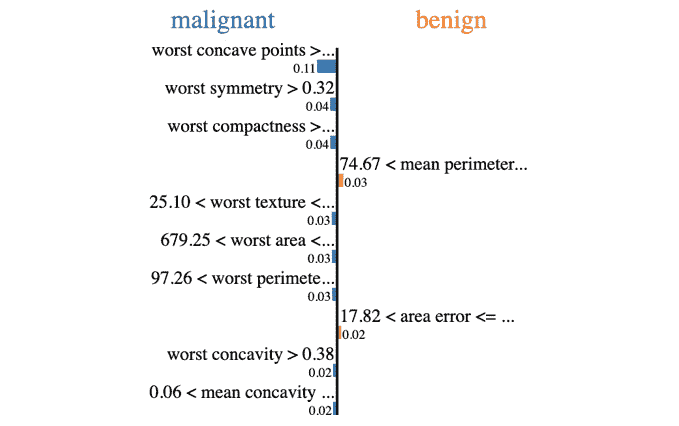

# 第九章：9\. 解释机器学习模型

概述

本章将向你展示如何解释机器学习模型的结果，并深入了解它所发现的模式。通过本章学习后，你将能够分析线性模型的权重和`RandomForest`的变量重要性。你还将能够通过置换法实现变量重要性分析，分析特征的重要性。你将使用部分依赖图（partial dependence plot）来分析单一变量，并使用 lime 包进行局部解释。

# 介绍

在上一章中，你已经学习了如何找到一些最流行机器学习算法的最佳超参数，以获得更好的预测性能（即，更准确的预测）。

机器学习算法通常被称为“黑箱”，我们只能看到输入和输出，而算法内部的实现非常不透明，因此人们不知道其内部发生了什么。

随着时间的推移，我们可以感受到对机器学习模型更高透明度的需求日益增加。在过去几年中，我们看到一些算法被指控歧视特定群体。例如，几年前，一个名为 ProPublica 的非盈利新闻机构揭示了由 Northpointe 公司开发的 COMPAS 算法中的偏见。该算法的目的是评估罪犯再次犯罪的可能性。研究表明，该算法根据人口统计特征而非其他特征，为某些群体预测了较高的风险水平。这个例子突显了正确、清晰地解释模型结果及其逻辑的重要性。

幸运的是，一些机器学习算法提供了方法，帮助我们理解它们为特定任务和数据集学习到的参数。也有一些模型无关的函数，可以帮助我们更好地理解模型做出的预测。因此，解释模型的方法有很多种，既有针对特定模型的，也有通用的。

这些技术的适用范围也有所不同。在文献中，我们通常分为全局解释和局部解释。全局解释意味着我们关注整个数据集中所有观测值的变量，目的是了解哪些特征对目标变量有最大的整体影响。例如，如果你正在预测电信公司客户流失率，你可能会发现模型最重要的特征是客户使用情况和每月平均支付金额。而局部解释则只关注单一观测值，并分析不同变量的影响。我们将查看一个具体的案例，了解模型做出最终预测的原因。例如，你会查看一个被预测会流失的客户，发现他每年 9 月都会购买新的 iPhone 型号。

在本章中，我们将讨论一些技术，帮助你如何解读模型或其结果。

# 线性模型系数

在*第二章，回归*和*第三章，二分类*中，你看到了线性回归模型是如何学习以下形式的函数参数的：


图 9.1: 线性回归模型的函数参数

目标是找到最优参数（w1, w2 …, wn），使得预测值 ŷ̂ 非常接近实际目标值 `y`。因此，一旦你训练了模型，并且在没有过拟合的情况下得到了良好的预测性能，你可以利用这些参数（或系数）来理解哪些变量对预测产生了较大影响。如果某个系数接近 0，这意味着相关特征对结果的影响较小。另一方面，如果系数较高（无论是正的还是负的），这意味着该特征对预测结果有很大的影响。

我们以以下函数为例：`100 + 0.2 * x`1 `+ 200 * x`2 `- 180 * x`3。x1 的系数只有**0.2**，与其他系数相比非常低，对最终结果的影响较小。x2 的系数为正，因此它会对预测产生正面影响。它与 x3 的系数相反，因为 x3 的系数为负。

但是，为了能够比较“苹果与苹果”，你需要重新缩放特征，使它们具有相同的尺度，这样你就可以比较它们的系数。如果不这样做，可能 x1 的范围是从 100 万到 500 万，而 x2 和 x3 的范围是**1**到**88**。在这种情况下，尽管 x1 的系数较小，但 x1 值的微小变化对预测有很大影响。另一方面，如果三个系数都在 -1 到 1 之间，那么我们可以说，预测目标变量的主要驱动因素是特征 x2 和 x3。

在`sklearn`中，获取线性模型的系数非常简单，你只需要调用 `coef_` 属性。让我们用 `sklearn` 中的糖尿病数据集做一个实际的例子：

```py
from sklearn.datasets import load_diabetes
from sklearn.linear_model import LinearRegression
data = load_diabetes()
# fit a linear regression model to the data
lr_model = LinearRegression()
lr_model.fit(data.data, data.target)
lr_model.coef_
```

输出将如下所示：


图 9.2: 线性回归参数的系数

让我们创建一个包含这些值和列名的 DataFrame：

```py
import pandas as pd
coeff_df = pd.DataFrame()
coeff_df['feature'] = data.feature_names
coeff_df['coefficient'] = lr_model.coef_
coeff_df.head()
```

输出将如下所示：


图 9.3: 线性回归模型的系数

对于特征系数而言，较大的正数或负数意味着它对结果有强烈的影响。另一方面，如果系数接近 0，则意味着该变量对预测的影响较小。

从这张表格中，我们可以看到列 `s1` 的系数非常低（一个大负数），所以它对最终预测有负面影响。如果 `s1` 增加 1 单位，预测值将减少 `-792.184162`。另一方面，`bmi` 在预测中有一个较大的正数（`519.839787`），因此糖尿病的风险与该特征高度相关：体重指数（BMI）的增加意味着糖尿病风险显著增加。

## 练习 9.01：提取线性回归系数

在本次练习中，我们将训练一个线性回归模型来预测客户流失率，并提取其系数。

注意

我们将使用的数据集由多伦多大学的 Carl Rasmussen 分享：[`packt.live/37hInDr`](https://packt.live/37hInDr)。

这个数据集是通过模拟合成生成的，用于预测因为长时间排队而离开银行的客户比例。

该数据集的 CSV 版本可以在此找到：[`packt.live/3kZrggU`](https://packt.live/3kZrggU)。

这个数据集的变量数据字典可以在此找到：

[`packt.live/3aBGhQD`](https://packt.live/3aBGhQD)。

以下步骤将帮助你完成练习：

1.  打开一个新的 Colab 笔记本。

1.  导入以下包：`pandas`、`train_test_split` 来自 `sklearn.model_selection`、`StandardScaler` 来自 `sklearn.preprocessing`、`LinearRegression` 来自 `sklearn.linear_model`、`mean_squared_error` 来自 `sklearn.metrics` 和 `altair`：

    ```py
    import pandas as pd
    from sklearn.model_selection import train_test_split
    from sklearn.preprocessing import StandardScaler
    from sklearn.linear_model import LinearRegression
    from sklearn.metrics import mean_squared_error
    import altair as alt
    ```

1.  创建一个名为 `file_url` 的变量，包含数据集的 URL：

    ```py
    file_url = 'https://raw.githubusercontent.com/'\
               'PacktWorkshops/The-Data-Science-Workshop/'\
               'master/Chapter09/Dataset/phpYYZ4Qc.csv'
    ```

1.  使用 `.read_csv()` 将数据集加载到名为 `df` 的 DataFrame 中：

    ```py
    df = pd.read_csv(file_url)
    ```

1.  打印 DataFrame 的前五行：

    ```py
    df.head()
    ```

    你应该得到以下输出：

    

    ](img/B15019_09_04.jpg)

    图 9.4：加载的 DataFrame 前五行

    注意

    为了展示的方便，输出已被截断。请参考 [`packt.live/3kZrggU`](https://packt.live/3kZrggU) 获取完整的输出。

1.  使用 `.pop()` 提取 `rej` 列，并将其保存为名为 `y` 的变量：

    ```py
    y = df.pop('rej')
    ```

1.  使用 `.describe()` 打印 DataFrame 的摘要。

    ```py
    df.describe()
    ```

    你应该得到以下输出：

    

    ](img/B15019_09_05.jpg)

    图 9.5：DataFrame 的统计测量

    注意

    上述图表是输出的简化版本。

    从这个输出中，我们可以看到数据没有经过标准化。变量的尺度不同。

1.  使用 `train_test_split()` 将 DataFrame 分割成训练集和测试集，`test_size=0.3` 和 `random_state = 1`：

    ```py
    X_train, X_test, y_train, y_test = train_test_split\
                                       (df, y, test_size=0.3, \
                                        random_state=1)
    ```

1.  实例化 `StandardScaler`：

    ```py
    scaler = StandardScaler()
    ```

1.  在训练集上训练 `StandardScaler` 并使用 `.fit_transform()` 标准化数据：

    ```py
    X_train = scaler.fit_transform(X_train)
    ```

1.  使用 `.transform()` 标准化测试集：

    ```py
    X_test = scaler.transform(X_test)
    ```

1.  实例化 `LinearRegression` 并将其保存为名为 `lr_model` 的变量：

    ```py
    lr_model = LinearRegression()
    ```

1.  在训练集上使用 `.fit()` 训练模型：

    ```py
    lr_model.fit(X_train, y_train)
    ```

    你应该得到以下输出：

    

    ](img/B15019_09_06.jpg)

    图 9.6：线性回归日志

1.  使用`.predict()`预测训练集和测试集的结果：

    ```py
    preds_train = lr_model.predict(X_train)
    preds_test = lr_model.predict(X_test)
    ```

1.  计算训练集的均方误差并打印其值：

    ```py
    train_mse = mean_squared_error(y_train, preds_train)
    train_mse
    ```

    你应该得到以下输出：

    

    图 9.7：训练集的 MSE 得分

    我们在训练集上获得了相当低的 MSE 得分。

1.  计算测试集的均方误差并打印其值：

    ```py
    test_mse = mean_squared_error(y_test, preds_test)
    test_mse
    ```

    你应该得到以下输出：

    

    图 9.8：测试集的 MSE 得分

    我们在测试集上的 MSE 得分也很低，并且与训练集的得分非常相似。所以，我们的模型并没有出现过拟合。

    注

    你可能会得到与此处显示的稍有不同的输出。不过，你得到的值应该与本练习中得到的值大致一致。

1.  使用`.coef_`打印线性回归模型的系数：

    ```py
    lr_model.coef_
    ```

    你应该得到以下输出：

    

    图 9.9：线性回归模型的系数

1.  创建一个名为`coef_df`的空 DataFrame：

    ```py
    coef_df = pd.DataFrame()
    ```

1.  为此 DataFrame 创建一个名为`feature`的新列，列值为`df`的列名，使用`.columns`：

    ```py
    coef_df['feature'] = df.columns
    ```

1.  使用`.coef_`为此 DataFrame 创建一个名为`coefficient`的新列，列值为线性回归模型的系数：

    ```py
    coef_df['coefficient'] = lr_model.coef_
    ```

1.  打印`coef_df`的前五行：

    ```py
    coef_df.head()
    ```

    你应该得到以下输出：

    

    图 9.10：`coef_df`的前五行

    从这个输出中，我们可以看到变量`a1sx`和`a1sy`的值最低（最负值），因此它们对预测的贡献大于此处显示的其他三个变量。

1.  使用 Altair 绘制一个条形图，使用`coef_df`和`coefficient`作为`x`轴，`feature`作为`y`轴：

    ```py
    alt.Chart(coef_df).mark_bar().encode(x='coefficient',\
                                         y="feature")
    ```

    你应该得到以下输出：

    

图 9.11：显示线性回归模型系数的图

从这个输出中，我们可以看到对预测影响最大的变量是：

+   `a2pop`，表示区域 2 的人口

+   `a1pop`，表示区域 1 的人口

+   `a3pop`，表示区域 3 的人口

+   `mxql`，表示队列的最大长度

+   `b1eff`，表示银行 1 的效率水平

+   `temp`，表示温度

前三个变量对结果产生了正向影响（增加目标变量值）。这意味着，在这三个区域中，任何一个区域的人口增长都会增加客户流失的可能性。另一方面，后三个特征对目标变量产生了负向影响（降低目标变量值）：如果最大队列长度、银行 1 的效率水平或温度增加，客户流失的风险会降低。

注

要访问这一特定章节的源代码，请参考[`packt.live/3kZrggU`](https://packt.live/3kZrggU)。

本节目前没有在线互动示例，但可以像往常一样在 Google Colab 上运行。

在这个练习中，你学会了如何提取线性回归模型学到的系数，并识别出哪些变量对预测做出了最大贡献。

# 随机森林变量重要性

*第四章*，*基于随机森林的多类别分类*，介绍了一种非常强大的树形算法：`RandomForest`。它是行业中最流行的算法之一，不仅因为它在预测方面取得了非常好的结果，还因为它提供了多个工具来解释其结果，例如变量重要性。

记住在*第四章*，*基于随机森林的多类别分类*中，我们学到`RandomForest`构建多个独立的树，然后将它们的结果平均以做出最终预测。我们还学到，它会在每棵树中创建节点，找到能够清晰地将观测值分成两组的最佳切分点。`RandomForest`使用不同的度量来找到最佳切分点。在`sklearn`中，你可以使用基尼指数或熵度量进行分类任务，使用均方误差（MSE）或平均绝对误差（MAE）进行回归。我们不深入讲解这些度量，它们都计算给定切分的杂质程度。杂质度量观察的是节点内的观测值彼此之间有多大的不同。例如，如果一个组内的某个特征的值完全相同，那么它的纯度很高；反之，如果组内的值差异较大，则杂质较高。

每个构建的子树都会降低这个杂质评分。因此，我们可以使用这个杂质评分来评估每个变量对最终预测的重要性。这种技术不仅仅适用于`RandomForest`，还可以应用于任何基于树的算法，如决策树或梯度提升树。

在训练完`RandomForest`后，你可以通过`feature_importances_`属性评估其变量重要性（或特征重要性）。

让我们看看如何从`sklearn`的乳腺癌数据集中提取这些信息：

```py
from sklearn.datasets import load_breast_cancer
from sklearn.ensemble import RandomForestClassifier
data = load_breast_cancer()
X, y = data.data, data.target
rf_model = RandomForestClassifier(random_state=168)
rf_model.fit(X, y)
rf_model.feature_importances_
```

输出将如下图所示：


图 9.12：随机森林模型的特征重要性

注意

由于随机化，你可能会得到略有不同的结果。

从这个输出中评估哪个重要性值对应于哪个变量可能有点困难。让我们创建一个 DataFrame，里面包含这些值并显示列名：

```py
import pandas as pd
varimp_df = pd.DataFrame()
varimp_df['feature'] = data.feature_names
varimp_df['importance'] = rf_model.feature_importances_
varimp_df.head()
```

输出将如下所示：


图 9.13：乳腺癌数据集前五个特征的随机森林变量重要性

从输出结果中，我们可以看到`mean radius`和`mean perimeter`的得分最高，这意味着它们在预测目标变量时最为重要。`mean smoothness`列的值非常低，因此它似乎对模型的输出预测影响不大。

注意

变量重要性的值范围对于不同数据集是不同的；它不是一个标准化的度量。

让我们使用`altair`将这些变量重要性值绘制成图：

```py
import altair as alt
alt.Chart(varimp_df).mark_bar().encode(x='importance',\
                                       y="feature")
```

输出结果如下：


图 9.14: 显示随机森林变量重要性的图

从这个图表中，我们可以看到，对于这个随机森林模型来说，最重要的特征是`worst perimeter`、`worst area`和`worst concave points`。所以现在我们知道，这些特征在预测肿瘤是良性还是恶性方面最为重要。

## 练习 9.02: 提取随机森林特征重要性

在本次练习中，我们将提取一个训练好的随机森林分类器模型的特征重要性，该模型用于预测客户流失率。

我们将使用与上一节相同的数据集。

以下步骤将帮助你完成本次练习：

1.  打开一个新的 Colab 笔记本。

1.  导入以下包：`pandas`，`train_test_split`来自`sklearn.model_selection`，以及`RandomForestRegressor`来自`sklearn.ensemble`：

    ```py
    import pandas as pd
    from sklearn.model_selection import train_test_split
    from sklearn.ensemble import RandomForestRegressor
    from sklearn.metrics import mean_squared_error
    import altair as alt
    ```

1.  创建一个名为`file_url`的变量，其中包含数据集的 URL：

    ```py
    file_url = 'https://raw.githubusercontent.com/'\
               'PacktWorkshops/The-Data-Science-Workshop/'\
               'master/Chapter09/Dataset/phpYYZ4Qc.csv'
    ```

1.  使用`.read_csv()`将数据集加载到名为`df`的 DataFrame 中：

    ```py
    df = pd.read_csv(file_url)
    ```

1.  使用`.pop()`提取`rej`列，并将其保存为变量`y`：

    ```py
    y = df.pop('rej')
    ```

1.  使用`train_test_split()`将数据集拆分为训练集和测试集，设置`test_size=0.3`和`random_state=1`：

    ```py
    X_train, X_test, y_train, y_test = train_test_split\
                                       (df, y, test_size=0.3, \
                                        random_state=1)
    ```

1.  使用`random_state=1`、`n_estimators=50`、`max_depth=6`和`min_samples_leaf=60`实例化`RandomForestRegressor`：

    ```py
    rf_model = RandomForestRegressor(random_state=1, \
                                     n_estimators=50, max_depth=6,\
                                     min_samples_leaf=60)
    ```

1.  使用`.fit()`在训练集上训练模型：

    ```py
    rf_model.fit(X_train, y_train)
    ```

    你应该得到以下输出：

    

    图 9.15: 随机森林模型的日志

1.  使用`.predict()`预测训练集和测试集的结果：

    ```py
    preds_train = rf_model.predict(X_train)
    preds_test = rf_model.predict(X_test)
    ```

1.  计算训练集的均方误差并打印其值：

    ```py
    train_mse = mean_squared_error(y_train, preds_train)
    train_mse
    ```

    你应该得到以下输出：

    

    图 9.16: 训练集的均方误差得分

    我们在训练集上取得了一个相当低的均方误差得分。

1.  计算测试集上的均方误差并打印其值：

    ```py
    test_mse = mean_squared_error(y_test, preds_test)
    test_mse
    ```

    你应该得到以下输出：

    

    图 9.17: 测试集的均方误差得分

    我们在测试集上也得到了一个很低的均方误差得分，这个得分与训练集的得分非常相似。所以我们的模型并没有发生过拟合。

1.  使用`.feature_importances_`打印变量重要性：

    ```py
    rf_model.feature_importances_
    ```

    你应该得到以下输出：

    

    图 9.18: 测试集的均方误差得分

1.  创建一个名为 `varimp_df` 的空 DataFrame：

    ```py
    varimp_df = pd.DataFrame()
    ```

1.  为此 DataFrame 创建一个名为 `feature` 的新列，并使用 `.columns` 获取 `df` 的列名：

    ```py
    varimp_df['feature'] = df.columns
    varimp_df['importance'] = rf_model.feature_importances_
    ```

1.  打印 `varimp_df` 的前五行：

    ```py
    varimp_df.head()
    ```

    你应该得到以下输出：

    

    图 9.19：前五个变量的重要性

    从此输出中，我们可以看到变量 `a1cy` 和 `a1sy` 具有最高值，因此它们对预测目标变量比这里显示的其他三个变量更为重要。

1.  使用 Altair 绘制条形图，`coef_df` 和 `importance` 为 `x` 轴，`feature` 为 `y` 轴：

    ```py
    alt.Chart(varimp_df).mark_bar().encode(x='importance',\
                                           y="feature")
    ```

    你应该得到以下输出：

    

图 9.20：显示前五个变量重要性的图表

从此输出中，我们可以看到对于这个 Random Forest 模型，最能影响预测的变量按重要性递减的顺序是 `a2pop`、`a1pop`、`a3pop`、`b1eff` 和 `temp`。

注意

要访问此特定章节的源代码，请参考 [`packt.live/327Pi0i`](https://packt.live/327Pi0i)。

本节目前没有在线交互示例，但可以像往常一样在 Google Colab 上运行。

在本练习中，你学习了如何提取 Random Forest 模型所学到的特征重要性，并确定哪些变量对其预测最为重要。

# 通过置换评估变量的重要性

在上一节中，我们看到如何提取 Random Forest 的特征重要性。实际上，还有另一种技术也称为特征重要性置换，但它的基本逻辑不同，适用于任何算法，而不仅限于树模型。

该技术可称为通过置换评估变量的重要性。假设我们训练了一个模型来预测一个有五个类别的目标变量，并且获得了 0.95 的准确率。评估某个特征的重要性的一种方法是移除该特征并重新训练模型，查看新的准确率。如果准确率显著下降，那么我们可以推断该变量对预测有重要影响。另一方面，如果准确率略微下降或保持不变，那么我们可以认为该变量并不重要，对最终预测的影响不大。因此，我们可以通过模型性能的变化来评估变量的重要性。

这种方法的缺点是需要为每个变量重新训练一个新模型。如果你花了几个小时训练了原始模型，而你有 100 个不同的特征，那么计算每个变量的重要性将花费相当长的时间。如果我们不必重新训练不同的模型，那将是非常棒的。因此，另一种解决方案是生成噪声或给定列的新值，从这些修改过的数据中预测最终结果并比较准确度分数。例如，如果你有一个值在 0 到 100 之间的列，你可以取原始数据并随机生成该列的新值（保持其他变量不变），然后预测它们的类别。

这个选项也有一个问题。随机生成的值可能与原始数据非常不同。回到我们之前看到的同一个例子，如果一个列的原始值范围在 0 到 100 之间，而我们生成的值可能是负数或者非常高的值，这就不太能代表原始数据的真实分布。因此，我们在生成新值之前，需要理解每个变量的分布情况。

与生成随机值不同，我们可以简单地交换（或置换）不同行之间某一列的值，并使用这些修改后的案例进行预测。然后，我们可以计算相关的准确度分数，并将其与原始分数进行比较，以评估该变量的重要性。例如，我们在原始数据集中有以下几行：


图 9.21：数据集的示例

我们可以交换 X1 列的值并得到一个新的数据集：


图 9.22：数据集中交换列的示例

`mlxtend`包提供了一个函数来执行变量置换并计算变量重要性值：`feature_importance_permutation`。让我们看看如何使用它与`sklearn`中的乳腺癌数据集。

首先，让我们加载数据并训练一个随机森林模型：

```py
from sklearn.datasets import load_breast_cancer
from sklearn.ensemble import RandomForestClassifier

data = load_breast_cancer()
X, y = data.data, data.target
rf_model = RandomForestClassifier(random_state=168)
rf_model.fit(X, y)
```

然后，我们将调用`mlxtend.evaluate`中的`feature_importance_permutation`函数。该函数接受以下参数：

+   `predict_method`：用于模型预测的函数。在这里，我们将提供训练好的`rf_model`模型的`predict`方法。

+   `X`：数据集中的特征。它需要是 NumPy 数组形式。

+   `y`：数据集中的目标变量。它需要是`Numpy`数组形式。

+   `metric`：用于比较模型性能的度量标准。对于分类任务，我们将使用准确率。

+   `num_round`：`mlxtend`将对数据执行置换操作并评估性能变化的轮次。

+   `seed`：用于获取可重复结果的种子。

考虑以下代码片段：

```py
from mlxtend.evaluate import feature_importance_permutation
imp_vals, _ = feature_importance_permutation\
              (predict_method=rf_model.predict, X=X, y=y, \
               metric='r2', num_rounds=1, seed=2)
imp_vals
```

输出应如下所示：


图 9.23：通过置换计算的变量重要性

让我们创建一个包含这些值和特征名称的 DataFrame，并使用`altair`在图表上绘制它们：

```py
import pandas as pd
varimp_df = pd.DataFrame()
varimp_df['feature'] = data.feature_names
varimp_df['importance'] = imp_vals
varimp_df.head()
import altair as alt
alt.Chart(varimp_df).mark_bar().encode(x='importance',\
                                       y="feature")
```

输出应如下所示：


](img/B15019_09_24.jpg)

图 9.24：通过置换显示的变量重要性图

这些结果与我们在前一节中从`RandomForest`得到的结果不同。在这里，最重要的是最差的凹点，其次是最差的面积，最差的周长的值高于平均半径。因此，我们得到了相同的最重要变量列表，但顺序不同。这验证了这三个特征确实是预测肿瘤是否恶性的最重要特征。`RandomForest`的变量重要性和置换方法有不同的逻辑，因此，当你运行前一节中给出的代码时，可能会得到不同的输出。

## 练习 9.03：通过置换提取特征重要性

在本练习中，我们将计算并提取通过置换训练的随机森林分类器模型的特征重要性，以预测客户流失率。

我们将使用与前一节相同的数据集。

以下步骤将帮助你完成练习：

1.  打开一个新的 Colab 笔记本。

1.  导入以下包：`pandas`，`train_test_split`来自`sklearn.model_selection`，`RandomForestRegressor`来自`sklearn.ensemble`，`feature_importance_permutation`来自`mlxtend.evaluate`，以及`altair`：

    ```py
    import pandas as pd
    from sklearn.model_selection import train_test_split
    from sklearn.ensemble import RandomForestRegressor
    from mlxtend.evaluate import feature_importance_permutation
    import altair as alt
    ```

1.  创建一个名为`file_url`的变量，包含数据集的 URL：

    ```py
    file_url = 'https://raw.githubusercontent.com/'\
               'PacktWorkshops/The-Data-Science-Workshop/'\
               'master/Chapter09/Dataset/phpYYZ4Qc.csv'
    ```

1.  使用`.read_csv()`将数据集加载到一个名为`df`的 DataFrame 中：

    ```py
    df = pd.read_csv(file_url)
    ```

1.  使用`.pop()`提取`rej`列，并将其保存到一个名为`y`的变量中：

    ```py
    y = df.pop('rej')
    ```

1.  使用`train_test_split()`将 DataFrame 拆分为训练集和测试集，`test_size=0.3`，并设置`random_state=1`：

    ```py
    X_train, X_test, y_train, y_test = train_test_split\
                                       (df, y, test_size=0.3, \
                                        random_state=1)
    ```

1.  实例化`RandomForestRegressor`，设置`random_state=1`，`n_estimators=50`，`max_depth=6`，`min_samples_leaf=60`：

    ```py
    rf_model = RandomForestRegressor(random_state=1, \
                                     n_estimators=50, max_depth=6, \
                                     min_samples_leaf=60)
    ```

1.  使用`.fit()`在训练集上训练模型：

    ```py
    rf_model.fit(X_train, y_train)
    ```

    你应得到以下输出：

    

    ](img/B15019_09_25.jpg)

    图 9.25：随机森林日志

1.  使用`mlxtend`中的`feature_importance_permutation`通过置换提取特征重要性，采用随机森林模型、测试集、`r2`作为使用的指标，`num_rounds=1`，并设置`seed=2`。将结果保存到一个名为`imp_vals`的变量中，并打印其值：

    ```py
    imp_vals, _ = feature_importance_permutation\
                  (predict_method=rf_model.predict, \
                   X=X_test.values, y=y_test.values, \
                   metric='r2', num_rounds=1, seed=2)
    imp_vals
    ```

    你应得到以下输出：

    

    ](img/B15019_09_26.jpg)

    图 9.26：通过置换计算的变量重要性

    原始结果相当难以解读。让我们通过在图表上置换模型来绘制变量重要性。

1.  创建一个名为`varimp_df`的 DataFrame，包含两列：`feature`，其中包含`df`的列名，使用`.columns`，以及`importance`，其中包含`imp_vals`的值：

    ```py
    varimp_df = pd.DataFrame({'feature': df.columns, \
                              'importance': imp_vals})
    ```

1.  使用 Altair 绘制条形图，`coef_df` 和 `importance` 作为 `x` 轴，`feature` 作为 `y` 轴：

    ```py
    alt.Chart(varimp_df).mark_bar().encode(x='importance',\
                                           y="feature")
    ```

    你应该得到以下输出：

    

    ](img/B15019_09_27.jpg)

图 9.27：通过置换显示变量重要性的图表

从这个输出结果中，我们可以看到，对这个随机森林模型预测影响最大的变量是：`a2pop`、`a1pop`、`a3pop`、`b1eff` 和 `temp`，按重要性递减排序。这与*练习 9.02*中提到的*提取随机森林特征重要性*结果非常相似。

注意

要访问此特定部分的源代码，请参考 [`packt.live/2YdstY9`](https://packt.live/2YdstY9)。

本节目前没有在线交互示例，但可以像往常一样在 Google Colab 上运行。

你成功地通过置换这个模型提取了特征重要性，并识别出哪些变量对预测最为重要。

# 部分依赖图

另一种与模型无关的工具是部分依赖图。它是一个用于分析特征对目标变量影响的可视化工具。为了实现这一点，我们可以将我们感兴趣的特征值绘制在 `x` 轴上，将目标变量绘制在 `y` 轴上，然后将数据集中的所有观测结果显示在这个图表上。让我们尝试一下在 `sklearn` 的乳腺癌数据集上进行分析：

```py
from sklearn.datasets import load_breast_cancer
import pandas as pd
data = load_breast_cancer()
df = pd.DataFrame(data.data, columns=data.feature_names)
df['target'] = data.target
```

现在我们已经加载数据并将其转换为 DataFrame，让我们看看最差凹点列：

```py
import altair as alt
alt.Chart(df).mark_circle(size=60)\
             .encode(x='worst concave points', y='target')
```

生成的图表如下所示：


](img/B15019_09_28.jpg)

图 9.28：最差凹点和目标变量的散点图

注意

上述代码和图形只是示例。我们鼓励你通过改变代码中 `x` 和 `y` 的值来分析不同的特征。例如，你可以通过将 `x='worst concavity'` 和 `y='worst perimeter'` 设置在上述代码中，可能分析最差凹度与最差周长之间的关系。

从这个图中，我们可以看到：

+   目标变量为 1 的大多数情况，其最差凹点的值低于 0.16。

+   目标值为 0 的情况，其最差凹点的值超过 0.08。

通过这个图，我们不太确定在最差凹点的值介于 0.08 和 0.16 之间时，会得到哪种结果（0 或 1）。该范围内观测结果不确定的原因可能有多种，比如在该范围内的记录较少，或者其他变量可能会影响这些情况的结果。这就是部分依赖图可以帮助的地方。

逻辑与通过置换计算变量重要性非常相似，不同的是，我们不是随机替换列中的值，而是测试该列中所有可能的值对所有观测值的预测结果。如果我们以图 9.21 的例子为例，原本的三条观测数据，使用这种方法会生成六条新记录，保持 `X2` 和 `X3` 列不变，而替换 `X1` 的值：


图 9.29：从部分依赖图生成的记录示例

通过这组新数据，我们可以看到，例如，值 12 是否真的对预测目标变量为 1 有强烈影响。原始记录中，`X1` 列的值为 42 和 1 时，预测结果为 0，只有值 12 生成了预测为 1。但如果我们取相同的观测数据，`X1` 等于 42 和 1，然后将该值替换为 12，我们就可以看到新的预测是否会将目标变量预测为 1。这正是部分依赖图背后的逻辑，它会评估列的所有排列组合，并绘制预测值的平均值。

`sklearn` 提供了一个名为 `plot_partial_dependence()` 的函数，用于显示给定特征的部分依赖图。我们来看看如何在乳腺癌数据集上使用它。首先，我们需要获取我们感兴趣列的索引。我们将使用 `pandas` 的 `.get_loc()` 方法来获取 `最差凹点` 列的索引：

```py
import altair as alt
from sklearn.inspection import plot_partial_dependence
feature_index = df.columns.get_loc("worst concave points")
```

现在我们可以调用 `plot_partial_dependence()` 函数。我们需要提供以下参数：训练好的模型、训练集以及要分析的特征索引：

```py
plot_partial_dependence(rf_model, df, \
                        features=[feature_index])
```


图 9.30：最差凹点列的部分依赖图

这个部分依赖图展示了，平均而言，所有“最差凹点”列值小于 0.17 的观测值很可能会预测目标为 1（概率超过 0.5），而所有大于 0.17 的记录则预测为 0（概率低于 0.5）。

## 练习 9.04：绘制部分依赖图

在这个练习中，我们将为两个变量`a1pop`和`temp`绘制部分依赖图，这些变量来自一个训练好的随机森林分类器模型，用于预测客户流失率。

我们将使用与上一个练习相同的数据集。

1.  打开一个新的 Colab 笔记本。

1.  导入以下包：`pandas`、`train_test_split`（来自 `sklearn.model_selection`）、`RandomForestRegressor`（来自 `sklearn.ensemble`）、`plot_partial_dependence`（来自 `sklearn.inspection`）和 `altair`：

    ```py
    import pandas as pd
    from sklearn.model_selection import train_test_split
    from sklearn.ensemble import RandomForestRegressor
    from sklearn.inspection import plot_partial_dependence
    import altair as alt
    ```

1.  创建一个名为 `file_url` 的变量，包含数据集的 URL：

    ```py
    file_url = 'https://raw.githubusercontent.com/'\
               'PacktWorkshops/The-Data-Science-Workshop/'\
               'master/Chapter09/Dataset/phpYYZ4Qc.csv'
    ```

1.  使用 `.read_csv()` 将数据集加载到名为 `df` 的 DataFrame 中：

    ```py
    df = pd.read_csv(file_url)
    ```

1.  使用 `.pop()` 提取 `rej` 列，并将其保存到一个名为 `y` 的变量中：

    ```py
    y = df.pop('rej')
    ```

1.  使用`train_test_split()`将数据框分割为训练集和测试集，`test_size=0.3`，`random_state=1`：

    ```py
    X_train, X_test, y_train, y_test = train_test_split\
                                       (df, y, test_size=0.3, \
                                        random_state=1)
    ```

1.  使用`random_state=1`、`n_estimators=50`、`max_depth=6`和`min_samples_leaf=60`实例化`RandomForestRegressor`：

    ```py
    rf_model = RandomForestRegressor(random_state=1, \
                                     n_estimators=50, max_depth=6,\
                                     min_samples_leaf=60)
    ```

1.  使用`.fit()`在训练集上训练模型：

    ```py
    rf_model.fit(X_train, y_train)
    ```

    你应该得到如下输出：

    

    图 9.31：随机森林日志

1.  使用来自`sklearn`的`plot_partial_dependence()`，结合随机森林模型、测试集和`a1pop`列的索引，绘制部分依赖图：

    ```py
    plot_partial_dependence(rf_model, X_test, \
                            features=[df.columns.get_loc('a1pop')])
    ```

    你应该得到如下输出：

    

    图 9.32：a1pop 的部分依赖图

    这个部分依赖图显示，平均而言，当`a1pop`变量的值低于 2 时，它对目标变量的影响不大，但从这个值开始，目标变量会随着`a1pop`每增加一个单位而线性增加 0.04。这意味着，如果区域 1 的人口规模低于 2，流失风险几乎为零。但超过这个临界值后，区域 1 每增加一个人口单位，流失的机会将增加`4%`。

1.  使用来自`sklearn`的`plot_partial_dependence()`，结合随机森林模型、测试集和`temp`列的索引，绘制部分依赖图：

    ```py
    plot_partial_dependence(rf_model, X_test, \
                            features=[df.columns.get_loc('temp')])
    ```

    你应该得到如下输出：

    

图 9.33：temp 的部分依赖图

这个部分依赖图显示，平均而言，`temp`变量对目标变量有负线性影响：当`temp`增加 1 时，目标变量将减少 0.12。这意味着，如果温度升高 1 度，离开队列的机会将减少 12%。

注意

要访问该特定部分的源代码，请参考[`packt.live/2DWnSmn`](https://packt.live/2DWnSmn)。

你也可以在[`packt.live/2DWnUL1`](https://packt.live/2DWnUL1)上在线运行这个示例。

你已经学会了如何绘制并分析`a1pop`和`temp`特征的部分依赖图。在本次练习中，我们看到`a1pop`对目标变量有正向线性影响，而`temp`则有负向线性影响。

# 使用 LIME 进行局部解释

训练完我们的模型后，我们通常会用它来预测未见数据的结果。我们之前看到的全局解释方法，如模型系数、变量重要性和部分依赖图，提供了关于特征的整体信息。有时候，我们希望了解在特定情况下是什么因素影响了模型的预测结果。例如，如果你的模型是用来评估为新客户提供信用的风险，你可能想了解为什么它拒绝了某个特定客户的申请。这就是局部解释的作用：分析单个观测值并理解模型决策背后的逻辑。在本节中，我们将向你介绍一种名为**局部可解释模型无关解释**（**LIME**）的技术。

如果我们使用线性模型，那么理解每个变量对预测结果的贡献是非常简单的。我们只需要查看模型的系数。例如，模型将学习如下的函数：`y = 100 + 0.2 * x`1 `+ 200 * x`2 `- 180 * x`3。假设我们收到一个观测值：x1=0，x2=2，x3=1，我们就可以知道：

+   x1 的贡献是 0.2 * 0 = 0

+   x2 的贡献是 200 * 2 = +400

+   x3 的贡献是-180 * 1 = -180

所以，最终的预测结果（100 + 0 + 400 - 180 = 320）主要是由 x2 驱动的。

但是对于一个非线性模型来说，要获得如此清晰的视图是相当困难的。LIME 是一种在这种情况下提高可见性的方式。LIME 的基本逻辑是用线性模型来逼近原始的非线性模型。然后，它使用该线性模型的系数来解释每个变量的贡献，正如我们在前面的例子中所看到的那样。但 LIME 并不是尝试为整个数据集逼近整个模型，而是尝试在你感兴趣的观测值周围进行局部逼近。LIME 使用训练好的模型来预测靠近你观测值的新数据点，然后在这些预测数据上拟合一个线性回归模型。

让我们看看如何在乳腺癌数据集上使用它。首先，我们将加载数据并训练一个随机森林模型：

```py
from sklearn.datasets import load_breast_cancer
from sklearn.model_selection import train_test_split
from sklearn.ensemble import RandomForestClassifier
data = load_breast_cancer()
X, y = data.data, data.target
X_train, X_test, y_train, y_test = train_test_split\
                                   (X, y, test_size=0.3, \
                                    random_state=1)
rf_model = RandomForestClassifier(random_state=168)
rf_model.fit(X_train, y_train)
```

`lime`包在 Google Colab 上无法直接访问，因此我们需要使用以下命令手动安装它：

```py
!pip install lime
```

输出结果如下：


图 9.34：LIME 包的安装日志

安装完成后，我们将通过提供训练数据、特征名称、要预测的类别名称和任务类型（在本例中是`分类`）来实例化`LimeTabularExplainer`类：

```py
from lime.lime_tabular import LimeTabularExplainer
lime_explainer = LimeTabularExplainer\
                 (X_train, feature_names=data.feature_names,\
                 class_names=data.target_names,\
                 mode='classification')
```

然后，我们将调用`.explain_instance()`方法，传入我们感兴趣的观测值（这里是测试集中的第二个观测值）和用于预测结果概率的函数（这里是`.predict_proba()`）。最后，我们将调用`.show_in_notebook()`方法来显示`lime`的结果：

```py
exp = lime_explainer.explain_instance\
      (X_test[1], rf_model.predict_proba, num_features=10)
exp.show_in_notebook()
```

输出如下：


图 9.35：LIME 输出

注意

你的输出可能会略有不同。这是由于 LIME 的随机采样过程所致。

前面的输出包含了大量信息。我们来逐步分析。左侧显示了目标变量两个类别的预测概率。对于此观察，模型认为预测值为恶性的概率为 0.85：


图 9.36：来自 LIME 的预测概率

右侧显示了该观察的每个特征的值。每个特征都用颜色编码，以突出其对目标变量可能类别的贡献。列表按特征重要性递减排序。在这个例子中，`mean perimeter`、`mean area` 和 `area error` 特征对模型的贡献使得预测类别 1 的概率增加。所有其他特征则促使模型预测结果为 0：


图 9.37：感兴趣观察的特征值

最后，中央部分显示了每个变量对最终预测的贡献。在这个例子中，`worst concave points` 和 `worst compactness` 变量分别导致了预测结果 0 的概率分别增加了 0.10 和 0.05。另一方面，`mean perimeter` 和 `mean area` 两个变量分别对预测类别 1 的概率增加了 0.03：



图 9.38：各特征对最终预测的贡献

就这么简单。使用 LIME，我们可以轻松查看每个变量如何影响预测模型不同结果的概率。如你所见，LIME 包不仅计算了局部近似，还提供了其结果的可视化表示。比查看原始输出更容易解释。它也非常有助于展示你的发现并说明不同特征如何影响单个观察的预测。

## 练习 9.05：使用 LIME 进行局部解释

在本练习中，我们将分析一个训练好的随机森林分类模型的预测结果，该模型用于使用 LIME 预测客户流失率。

我们将使用与前一个练习相同的数据集。

1.  打开一个新的 Colab 笔记本。

1.  导入以下包：`pandas`、`train_test_split` 来自 `sklearn.model_selection` 和 `RandomForestRegressor` 来自 `sklearn.ensemble`：

    ```py
    import pandas as pd
    from sklearn.model_selection import train_test_split
    from sklearn.ensemble import RandomForestRegressor
    ```

1.  创建一个名为 `file_url` 的变量，包含数据集的 URL：

    ```py
    file_url = 'https://raw.githubusercontent.com/'\
               'PacktWorkshops/The-Data-Science-Workshop/'\
               'master/Chapter09/Dataset/phpYYZ4Qc.csv'
    ```

1.  使用 `.read_csv()` 将数据集加载到一个名为 `df` 的 DataFrame 中：

    ```py
    df = pd.read_csv(file_url)
    ```

1.  使用 `.pop()` 提取 `rej` 列并将其保存到一个名为 `y` 的变量中：

    ```py
    y = df.pop('rej')
    ```

1.  使用`train_test_split()`将 DataFrame 分割为训练集和测试集，`test_size=0.3`，`random_state=1`：

    ```py
    X_train, X_test, y_train, y_test = train_test_split\
                                       (df, y, test_size=0.3, \
                                        random_state=1)
    ```

1.  使用`random_state=1`、`n_estimators=50`、`max_depth=6`和`min_samples_leaf=60`实例化`RandomForestRegressor`：

    ```py
    rf_model = RandomForestRegressor(random_state=1, \
                                     n_estimators=50, max_depth=6,\
                                     min_samples_leaf=60)
    ```

1.  使用`.fit()`在训练集上训练模型：

    ```py
    rf_model.fit(X_train, y_train)
    ```

    您应该获得以下输出：

    

    图 9.39：随机森林日志

1.  使用`!pip`安装命令安装 lime 包：

    ```py
    !pip install lime
    ```

1.  从`lime.lime_tabular`导入`LimeTabularExplainer`：

    ```py
    from lime.lime_tabular import LimeTabularExplainer
    ```

1.  使用训练集和`mode='regression'`实例化`LimeTabularExplainer`：

    ```py
    lime_explainer = LimeTabularExplainer\
                     (X_train.values, \
                      feature_names=X_train.columns, \
                      mode='regression')
    ```

1.  使用`.explain_instance()`和`.show_in_notebook()`显示测试集第一行的 LIME 分析：

    ```py
    exp = lime_explainer.explain_instance\
          (X_test.values[0], rf_model.predict)
    exp.show_in_notebook()
    ```

    您应该获得以下输出：

    

    图 9.40：测试集第一行的 LIME 输出

    此输出显示，针对该观察值，预测的结果是客户流失的概率为 0.02，这主要受`a1pop`、`a3pop`、`a2pop`和`b2eff`特征的影响。例如，`a1pop`低于 0.87 使目标变量的值减少了 0.01。

1.  使用`.explain_instance()`和`.show_in_notebook()`显示测试集第三行的 LIME 分析：

    ```py
    exp = lime_explainer.explain_instance\
          (X_test.values[2], rf_model.predict)
    exp.show_in_notebook()
    ```

    您应该获得以下输出：

    

图 9.41：测试集第三行的 LIME 输出

此输出显示，针对该观察值，预测的结果是客户流失的概率为 0.09，这主要受`a2pop`、`a3pop`、`a1pop`和`b1eff`特征的影响。例如，`b1eff`低于 0.87 使目标变量的值增加了 0.01。`b1eff`特征代表银行 1 的效率水平，因此 LIME 的结果告诉我们，如果该效率水平低于 0.87，客户流失的概率就会增加。

注意

要访问此特定部分的源代码，请参考[`packt.live/2Q5i3Fp`](https://packt.live/2Q5i3Fp)。

您还可以通过[`packt.live/327Nl3Z`](https://packt.live/327Nl3Z)在线运行此示例。

您已完成本章的最后一个练习。您了解了如何使用 LIME 解释单个观察值的预测结果。我们了解到，`a1pop`、`a2pop`和`a3pop`特征对训练集的第一行和第三行观察值有很强的负面影响。

## 活动 9.01：训练并分析网络入侵检测模型

您为一家网络安全公司工作，您的任务是构建一个能够识别网络入侵的模型，然后分析其特征重要性，绘制部分依赖图，并使用 LIME 对单个观察值进行局部解释。

提供的数据集包含 7 周网络流量的数据。

注意

本活动中使用的数据集来自 KDD Cup 1999：

[`packt.live/2tFKUIV`](https://packt.live/2tFKUIV)

该数据集的 CSV 版本可以在这里找到：

[`packt.live/2RyVsBm`](https://packt.live/2RyVsBm)

以下步骤将帮助你完成此活动：

1.  使用`pandas`中的`.read_csv()`下载并加载数据集。

1.  使用`pandas`中的`.pop()`提取响应变量。

1.  使用`sklearn.model_selection`中的`train_test_split()`将数据集划分为训练集和测试集。

1.  创建一个函数，使用`sklearn.ensemble`中的`.fit()`实例化并拟合`RandomForestClassifier`。

1.  创建一个函数，使用`.predict()`来预测训练集和测试集的结果。

1.  创建一个函数，使用`sklearn.metrics`中的`accuracy_score()`来打印训练集和测试集的准确率。

1.  使用`feature_importance_permutation()`通过置换计算特征重要性，并使用`altair`在条形图上展示。

1.  使用`plot_partial_dependence`绘制`src_bytes`变量的部分依赖图。

1.  使用`!pip install`安装`lime`。

1.  对行`99893`进行 LIME 分析，使用`explain_instance()`。

    输出应如下所示：

    

    ](img/B15019_09_42.jpg)

图 9.42：LIME 分析的输出

你已经成功训练了一个随机森林模型来预测网络连接类型。你还分析了哪些特征对这个随机森林模型最为重要，发现它主要依赖于`src_bytes`特征。我们还分析了该特征的部分依赖图，以了解其对`normal`类别的影响。最后，我们使用 LIME 分析了一个单独的观测值，找出了导致预测结果的变量。

# 总结

在本章中，我们学习了一些机器学习模型解释技术。我们看到有些技术是特定于使用的模型的：线性模型的系数和树模型的变量重要性。也有一些方法是模型无关的，例如通过置换计算变量重要性。

所有这些技术都是全局解释器，它们查看整个数据集并分析每个变量对预测的整体贡献。我们可以利用这些信息来识别哪些变量对预测影响最大，并将其筛选出来。与其保留数据集中所有的特征，不如只保留那些影响力较大的特征。这可以显著减少训练模型或计算预测时的计算时间。

我们还通过 LIME 进行了本地解释器场景的分析，该方法分析了单个观察值。它帮助我们更好地理解模型在预测给定案例的最终结果时所做的决策。这是一个非常强大的工具，可以评估模型是否对某些可能包含敏感信息（如个人详细信息或人口统计数据）的变量存在偏向。我们还可以使用它比较两个不同的观察值，并理解模型产生不同结果的原因。

在下一章中，我们将重点分析一个数据集，并学习探索性数据分析和数据可视化技术，以便深入了解其中包含的信息。
