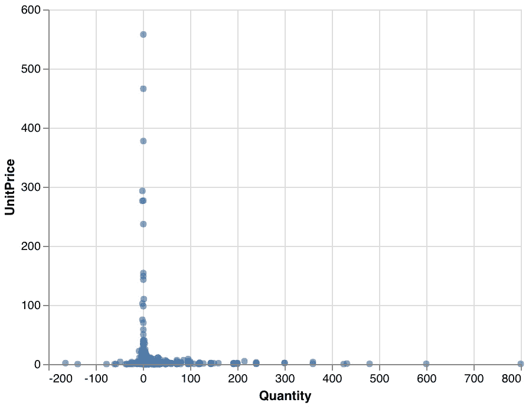

# 第十章：10\. 分析数据集

概览

本章结束时，您将能够解释进行探索性数据分析的关键步骤；识别数据集中包含的数据类型；总结数据集并对每个变量进行详细分析；可视化每一列的数据分布；找到变量之间的关系，并分析每个变量的缺失值和异常值。

本章将向您介绍如何进行探索性数据分析并可视化数据，以便识别质量问题、潜在的数据转换以及有趣的模式。

# 介绍

上一章主要讨论了如何改进我们的机器学习模型，并解释其结果和参数，以便为业务提供有意义的见解。本章开启了本书的第三部分：*提升您的数据集*。在接下来的三章中，我们将退后一步，专注于任何机器学习模型的关键输入：数据集。我们将学习如何探索一个新的数据集，准备它进入建模阶段，并创建新的变量（也叫做**特征工程**）。这些都是非常激动人心且重要的主题，所以让我们开始吧。

当我们提到数据科学时，大多数人想到的是构建精密的机器学习算法来预测未来的结果。他们通常不会想到数据科学项目中涉及的所有其他关键任务。实际上，建模步骤只涵盖了这样一个项目的一个小部分。你可能已经听说过一个*经验法则*，即数据科学家将 20%的时间花在建模上，剩下的 80%时间用于理解和准备数据。这个说法其实很接近现实。

在业界用于开展数据科学项目的一个非常流行的方法论是**CRISP-DM**。

注意

我们不会对这个方法论进行过多的详细介绍，因为它超出了本书的范围。但如果你有兴趣了解更多，可以在这里找到关于 CRISP-DM 的描述：[`packt.live/2QMRepG`](https://packt.live/2QMRepG)。

该方法论将数据科学项目分解为六个不同的阶段：

1.  业务理解

1.  数据理解

1.  数据准备

1.  建模

1.  评估

1.  部署

如你所见，建模只占六个阶段中的一个阶段，而且发生在项目的后期。在本章中，我们将主要聚焦于 CRISP-DM 的第二步：数据理解阶段。

你可能会想，为什么理解数据如此重要，为什么我们不应该把更多的时间花在建模上。实际上，一些研究者已经证明，在高质量数据上训练非常简单的模型，效果超过了在差的数据上训练复杂的模型。

如果你的数据不正确，即使是最先进的模型也无法找到相关的模式并预测正确的结果。这就是*垃圾进，垃圾出*，意味着错误的输入会导致错误的输出。因此，我们需要充分了解数据集的局限性和问题，并在将其应用于模型之前加以修正。

理解输入数据如此重要的第二个原因是，它还将帮助我们定义正确的方法，并相应地筛选出相关的算法。例如，如果你发现在数据集中某个特定类别的样本比其他类别少，那么你可能需要使用能够处理不平衡数据的算法，或者预先使用一些重采样技术来使类别分布更均匀。

本章中，你将学习一些关键概念和技术，以深入理解你的数据。

# 探索你的数据

如果你按照 CRISP-DM 方法论进行项目管理，第一步将是与相关方讨论项目，并清楚地定义他们的需求和期望。只有当这一点明确后，你才能开始查看数据，并判断是否能够实现这些目标。

在接收到数据集后，你可能想确认数据集是否包含你项目所需的信息。例如，如果你正在进行监督学习项目，你将检查数据集中是否包含你需要的目标变量，以及该字段是否存在缺失值或错误值。你还可以检查数据集包含多少观察值（行）和变量（列）。这些是你在处理新数据集时可能会首先遇到的问题。本节将向你介绍一些可以用来回答这些问题的技术。

本节剩余部分，我们将使用一个包含在线零售店交易的数据库。

注意

该数据集存储在我们的 GitHub 库中：[`packt.live/36s4XIN`](https://packt.live/36s4XIN)。

数据集来自[`packt.live/2Qu5XqC`](https://packt.live/2Qu5XqC)，由 Daqing Chen、Sai Liang Sain 和 Kun Guo 提供，标题为《在线零售行业的数据挖掘》，来源于 UCI 机器学习库。

我们的数据集是一个 Excel 电子表格。幸运的是，`pandas`包提供了一个方法，可以用来加载这种类型的文件：`read_excel()`。

让我们使用`.read_excel()`方法读取数据，并将其存储在一个`pandas` DataFrame 中，如下代码片段所示：

```py
import pandas as pd
file_url = 'https://github.com/PacktWorkshops/'\
           'The-Data-Science-Workshop/blob/'\
           'master/Chapter10/dataset/'\
           'Online%20Retail.xlsx?raw=true'
df = pd.read_excel(file_url)
```

在将数据加载到 DataFrame 后，我们想知道这个数据集的大小，即它的行数和列数。为了获取这些信息，我们只需要调用`pandas`的`.shape`属性：

```py
df.shape
```

你应该得到以下输出：

```py
(541909, 8)
```

这个属性返回一个元组，包含行数作为第一个元素，列数作为第二个元素。加载的数据集包含`541909`行和`8`列。

由于这个属性返回的是一个元组，我们可以通过提供相关索引独立访问其每个元素。让我们提取行数（索引`0`）：

```py
df.shape[0]
```

你应该得到如下输出：

```py
541909
```

类似地，我们可以通过第二个索引获取列数：

```py
df.shape[1]
```

你应该得到如下输出：

```py
8
```

通常，数据集的第一行是表头，包含每一列的名称。默认情况下，`read_excel()`方法假设文件的第一行是表头。如果`header`存储在其他行，可以通过`read_excel()`方法的`header`参数指定其他的表头行索引，例如`pd.read_excel(header=1)`用于指定表头在第二行。

一旦加载到`pandas`数据框中，你可以通过直接调用它来打印出其内容：

```py
df
```

你应该得到如下输出：


图 10.1: 加载的在线零售数据框的前几行

要访问这个数据框的列名，我们可以调用`.columns`属性：

```py
df.columns
```

你应该得到如下输出：


图 10.2: 在线零售数据框的列名列表

该数据集的列包括`InvoiceNo`、`StockCode`、`Description`、`Quantity`、`InvoiceDate`、`UnitPrice`、`CustomerID`和`Country`。我们可以推测该数据集的每一行代表了一个特定客户在特定日期购买某件商品的销售记录，包括数量和价格。

看着这些列名，我们或许能猜到这些列中包含的是什么类型的信息，但为了确保准确无误，我们可以使用`dtypes`属性，代码如下所示：

```py
df.dtypes
```

你应该得到如下输出：


图 10.3: 数据框每列的数据类型描述

从这个输出中，我们可以看到`InvoiceDate`列是日期类型（`datetime64[ns]`），`Quantity`是整数类型（`int64`），`UnitPrice`和`CustomerID`是小数类型（`float64`）。其余的列是文本类型（`object`）。

`pandas`包提供了一个方法，可以显示我们迄今为止看到的所有信息，这个方法是`info()`方法：

```py
df.info()
```

你应该得到如下输出：


图 10.4: `info()`方法的输出

仅通过几行代码，我们就能了解有关该数据集的一些高级信息，例如其大小、列名及其类型。

在下一部分，我们将分析数据集的内容。

# 分析你的数据集

之前，我们了解了数据集的整体结构以及其中包含的信息类型。现在，是时候深入探讨每一列的具体值了。

首先，我们需要导入 `pandas` 包：

```py
import pandas as pd
```

然后，我们将数据加载到一个 `pandas` DataFrame 中：

```py
file_url = 'https://github.com/PacktWorkshops/'\
           'The-Data-Science-Workshop/blob/'\
           'master/Chapter10/dataset/'\
           'Online%20Retail.xlsx?raw=true'
df = pd.read_excel(file_url)
```

`pandas` 包提供了多个方法，方便你查看数据集的快照。最常用的有 `head()`、`tail()` 和 `sample()`。

`head()` 方法将显示数据集的前几行。默认情况下，`pandas` 将显示前五行：

```py
df.head()
```

你应该会看到以下输出：


图 10.5：使用 `head()` 方法显示前五行

`head()` 方法的输出显示，`InvoiceNo`、`StockCode` 和 `CustomerID` 列是每个采购发票、销售商品和客户的唯一标识符字段。`Description` 字段是描述所售商品的文本。`Quantity` 和 `UnitPrice` 分别表示售出商品的数量和单价。`Country` 是一个文本字段，用于指定客户或商品的位置，或指定客户在哪个国家版本的在线商店下的订单。在实际项目中，你可以联系提供此数据集的团队，确认 `Country` 列的含义，或者任何其他你可能需要的列信息。

使用 `pandas` 时，可以通过在 `head()` 方法中提供整数参数来指定显示的前几行数量。我们通过显示前 `10` 行来尝试一下：

```py
df.head(10)
```

你应该会看到以下输出：


图 10.6：使用 `head()` 方法显示前 10 行

从这个输出来看，我们可以假设数据是按 `InvoiceDate` 列升序排序，并按 `CustomerID` 和 `InvoiceNo` 分组的。在 `Country` 列中，我们只看到一个值：`United Kingdom`。让我们通过查看数据集的最后几行来确认这是否属实。这可以通过调用 `tail()` 方法实现。与 `head()` 方法类似，默认情况下，该方法将仅显示五行，但你可以通过参数指定要显示的行数。这里，我们将显示最后八行：

```py
df.tail(8)
```

你应该会看到以下输出：


图 10.7：使用 `tail()` 方法显示最后八行

看起来我们之前的假设是正确的，数据确实是按 `InvoiceDate` 列升序排序的。我们也可以确认，`Country` 列中实际上有不止一个值。

我们还可以使用 `sample()` 方法，利用 `n` 参数随机选择指定数量的行。你也可以指定 `random_state` 参数：

```py
df.sample(n=5, random_state=1)
```

你应该会看到以下输出：


图 10.8：使用 sample()方法显示五个随机采样的行

在这个输出中，我们可以看到`Country`列中有一个额外的值：`Germany`。我们还可以注意到几个有趣的点：

+   `InvoiceNo` 也可以包含字母（第`94,801`行以`C`开头，这可能有特殊意义）。

+   `Quantity` 可以有负值：`-2`（第`94801`行）。

+   `CustomerID`包含缺失值：`NaN`（第`210111`行）。

## 练习 10.01：使用描述性统计分析 Ames Housing 数据集

在本次练习中，我们将探索`Ames Housing dataset`，通过分析其结构并查看其中的一些行来充分理解它。

我们将在这个练习中使用的数据显示集是 Ames Housing 数据集，您可以在我们的 GitHub 仓库中找到它：[`packt.live/35kRKAo`](https://packt.live/35kRKAo)。

注意

该数据集由 Dean De Cock 编制。

该数据集包含 2016 年到 2010 年间爱荷华州 Ames 市的住宅房屋销售数据。

更多关于每个变量的信息可以在[`packt.live/2sT88L4`](https://packt.live/2sT88L4)找到。

以下步骤将帮助你完成这个练习：

1.  打开一个新的 Colab 笔记本。

1.  导入`pandas`包：

    ```py
    import pandas as pd
    ```

1.  将 AMES 数据集的链接分配给一个名为`file_url`的变量：

    ```py
    file_url = 'https://raw.githubusercontent.com/'\
               'PacktWorkshops/The-Data-Science-Workshop/'\
               'master/Chapter10/dataset/ames_iowa_housing.csv'
    ```

1.  使用`pandas`包中的`.read_csv()`方法，将数据集加载到一个名为`df`的新变量中：

    ```py
    df = pd.read_csv(file_url)
    ```

1.  使用`pandas`包中的`shape`属性打印 DataFrame 的行数和列数：

    ```py
    df.shape
    ```

    你应该得到以下输出：

    ```py
    (1460, 81)
    ```

    我们可以看到这个数据集包含了`1460`行和`81`个不同的列。

1.  使用`pandas`库中的`columns`属性打印此 DataFrame 包含的变量名：

    ```py
    df.columns
    ```

    你应该得到以下输出：

    

    图 10.9：房屋数据集的列列表

    我们可以通过查看变量名称来推测一些变量所包含的信息类型，例如`LotArea`（房产大小）、`YearBuilt`（建造年份）和`SalePrice`（房产销售价格）。

1.  使用`pandas`包中的`dtypes`属性打印此 DataFrame 包含的每个变量的类型：

    ```py
    df.dtypes
    ```

    你应该得到以下输出：

    

    图 10.10：房屋数据集的列及其类型

    我们可以看到，变量要么是数值型的，要么是文本类型的。这个数据集中没有日期列。

1.  使用`pandas`库中的`head()`方法显示 DataFrame 的前几行：

    ```py
    df.head()
    ```

    你应该得到以下输出：

    

    图 10.11：房屋数据集的前五行

1.  使用`pandas`中的`tail()`方法显示 DataFrame 的最后五行：

    ```py
    df.tail()
    ```

    你应该得到以下输出：

    

    图 10.12：房屋数据集的最后五行

    看起来 `Alley`（巷道）列有很多缺失值，这些缺失值由 `NaN` 表示（表示“不是一个数字”）。`Street`（街道）和 `Utilities`（公用设施）列似乎只有一个值。

1.  现在，使用 `pandas` 中的 `sample()` 方法显示 `5` 行随机抽样数据，并为其传入 `'random_state'` 参数值 `8`：

    ```py
    df.sample(n=5, random_state=8)
    ```

    你应该得到以下输出：

    

图 10.13：房屋数据集的五个随机抽样行

通过这些随机样本，我们还可以看到 `LotFrontage`（地块前沿）列也有一些缺失值。我们还看到这个数据集中包含了数值和文本数据（对象类型）。我们将在 *练习 10.02* 中分析这些分类变量， *《从 Ames 房屋数据集中分析分类变量》*，以及 *练习 10.03* 中分析数值变量， *《从 Ames 房屋数据集中分析数值变量》*。

注意

要访问该特定部分的源代码，请参考 [`packt.live/2E8HMdH`](https://packt.live/2E8HMdH)。

你也可以在线运行这个示例，网址：[`packt.live/3g62zLT`](https://packt.live/3g62zLT)。

通过这几行代码，我们已经学到了很多关于这个数据集的内容，比如行数和列数、每个变量的数据类型以及它们的信息。我们还发现了一些缺失值的问题。

# 分析分类变量的内容

现在我们已经对 `在线零售数据集` 中包含的信息有了初步了解，我们想深入探讨每一列数据：

```py
import pandas as pd
file_url = 'https://github.com/PacktWorkshops/'\
           'The-Data-Science-Workshop/blob'\
           '/master/Chapter10/dataset/'\
           'Online%20Retail.xlsx?raw=true'
df = pd.read_excel(file_url)
```

例如，我们希望通过调用 `nunique()` 方法来了解每个变量中包含多少不同的值。这对于一个具有有限值数量的分类变量，像 `Country`（国家）这种情况特别有用：

```py
df['Country'].nunique()
```

你应该得到以下输出：

```py
38
```

我们可以看到，这个数据集中有 38 个不同的国家。如果我们能获得这一列中所有值的列表，那就太好了。幸运的是，`pandas` 包提供了一个方法来获取这些结果：`unique()`：

```py
df['Country'].unique()
```

你应该得到以下输出：


图 10.14：'Country'（国家）列的唯一值列表

我们可以看到，来自不同大陆的多个国家，但大多数国家来自欧洲。我们还看到有一个值叫做 `Unspecified`（未指定）和另一个值 `European Community`（欧洲共同体），这可能是指所有欧元区的国家，这些国家没有单独列出。

`pandas`中的另一个非常有用的方法是`value_counts()`。这个方法列出了给定列中的所有值，还包括它们的出现次数。通过提供`dropna=False`和`normalize=True`参数，该方法将包括缺失值并分别计算出现次数的比率：

```py
df['Country'].value_counts(dropna=False, normalize=True)
```

你应该得到以下输出：


图 10.15：'Country'列唯一值及其出现百分比的截断列表

从输出中，我们可以看到`United Kingdom`的值在这一列中完全占据主导地位，它代表了超过 91%的行，而`Austria`和`Denmark`等其他值则相当稀有，代表了该数据集中不到 1%的行。

## 练习 10.02：分析 Ames Housing 数据集中的分类变量

在本次练习中，我们将通过分析数据集的分类变量继续进行数据集探索。为此，我们将实现我们自己的`describe`函数。

我们将在本次练习中使用的数据集是 Ames Housing 数据集，可以在我们的 GitHub 仓库找到：[`packt.live/35kRKAo`](https://packt.live/35kRKAo)。让我们开始吧：

1.  打开一个新的 Colab 笔记本。

1.  导入`pandas`包：

    ```py
    import pandas as pd
    ```

1.  将以下链接分配给名为`file_url`的变量：

    ```py
    file_url = 'https://raw.githubusercontent.com/'\
               'PacktWorkshops/The-Data-Science-Workshop/'\
               'master/Chapter10/dataset/ames_iowa_housing.csv'
    ```

1.  使用`pandas`包中的`.read_csv()`方法，将数据集加载到一个名为`df`的新变量中：

    ```py
    df = pd.read_csv(file_url)
    ```

1.  创建一个名为`obj_df`的新 DataFrame，只包含使用`pandas`包中的`select_dtypes`方法选出的数值类型的列。然后，将`object`值传递给`include`参数：

    ```py
    obj_df = df.select_dtypes(include='object')
    ```

1.  使用`pandas`中的`columns`属性，提取该 DataFrame `obj_df`的列列表，并将其分配给一个名为`obj_cols`的新变量，然后打印出其内容：

    ```py
    obj_cols = obj_df.columns
    obj_cols
    ```

    你应该得到以下输出：

    

    图 10.16：分类变量列表

1.  创建一个名为`describe_object`的函数，该函数接受一个`pandas` DataFrame 和一个列名作为输入参数。然后，在函数内部，打印出给定列的名称、使用`nunique()`方法计算的唯一值数量，以及使用`value_counts()`方法列出的值及其出现次数，代码示例如下：

    ```py
    def describe_object(df, col_name):
        print(f"\nCOLUMN: {col_name}")
        print(f"{df[col_name].nunique()} different values")
        print(f"List of values:")
        print(df[col_name].value_counts\
                           (dropna=False, normalize=True))
    ```

1.  通过提供`df` DataFrame 和`'MSZoning'`列来测试这个函数：

    ```py
    describe_object(df, 'MSZoning')
    ```

    你应该得到以下输出：

    

    图 10.17：展示为 MSZoning 列创建的函数

    对于`MSZoning`列，`RL`值几乎代表了`79%`的值，而`C`（全部）仅出现在不到`1%`的行中。

1.  创建一个`for`循环，调用为`obj_cols`列表中的每个元素创建的函数：

    ```py
    for col_name in obj_cols:
        describe_object(df, col_name)
    ```

    你应该得到以下输出：

    

图 10.18: 展示在 obj_cols 中创建的函数的第一个列

前一步的输出在*图 10.18*中被截断了。我们可以确认`Street`列几乎是常数，因为 99.6%的行包含相同的值：`Pave`。对于`Alley`列，几乎 94%的行包含缺失值。

注意

若要访问此部分的源代码，请参见[`packt.live/3kWoRn2`](https://packt.live/3kWoRn2)。

你也可以在线运行这个示例，链接：[`packt.live/3gbPnp0`](https://packt.live/3gbPnp0)。

我们刚刚分析了数据集中所有的类别变量。我们展示了如何查看任何特征中所有值的分布。我们还发现其中一些特征由单一值主导，而其他特征则主要包含缺失值。

# 总结数值变量

现在，让我们来看看一个数值列，深入了解它的内容。我们将使用一些统计度量来总结一个变量。所有这些度量被称为描述性统计。在本章中，我们将介绍一些最常见的度量方法。

使用`pandas`包，许多这些度量已经作为方法实现。例如，如果我们想知道`'数量'`列中包含的最大值是什么，我们可以使用`.max()`方法：

```py
df['Quantity'].max()
```

你应该得到以下输出：

```py
80995
```

我们可以看到，在这个数据集中，某个商品的最大销售数量是`80995`，这对于零售业务来说似乎极高。在实际项目中，这种意外的值需要与数据所有者或关键利益相关者讨论并确认，看看这是有效值还是错误值。现在，让我们使用`.min()`方法查看`'数量'`的最小值：

```py
df['Quantity'].min()
```

你应该得到以下输出：

```py
-80995
```

该变量的最小值极低。我们可以认为退货商品的负值是可能的，但这里的最小值（`-80995`）非常低。这同样需要与你组织中的相关人员确认。

现在，我们将看看此列的集中趋势。**集中趋势**是一个统计学术语，指的是数据将围绕其聚集的中心点。最著名的集中趋势度量是平均数（或均值）。平均数是通过将列中的所有值相加并除以值的数量来计算的。

如果我们将`数量`列绘制在带有平均值的图表上，它将如下所示：


图 10.19: '数量'列的平均值

我们可以看到`数量`列的平均值非常接近 0，且大多数数据位于`-50`和`+50`之间。

我们可以通过使用`pandas`中的`mean()`方法来获得某个特征的平均值：

```py
df['Quantity'].mean()
```

你应该得到以下输出：

```py
9.55224954743324
```

在这个数据集中，销售的平均数量约为`9.55`。平均值对异常值非常敏感，正如我们之前看到的，`Quantity`列的最小值和最大值非常极端（`-80995 到 +80995`）。

我们也可以使用中位数作为另一种集中趋势的度量。中位数的计算方法是将列分成两个长度相等的组，然后通过分隔这两组来获得中间点的值，如以下示例所示：


](img/B15019_10_21.jpg)

图 10.20：示例中位数

在`pandas`中，你可以调用`median()`方法来获得这个值：

```py
df['Quantity'].median()
```

你应该得到以下输出：

```py
3.0
```

这个列的中位数是 3，和我们之前找到的平均数（`9.55`）差别很大。这告诉我们这个数据集中有一些异常值，等我们进一步调查后，需要决定如何处理它们（这将在*第十一章*，*数据准备*中讲解）。

我们还可以评估这一列的分布情况（数据点与中心点的差异）。一个常见的分布度量是标准差。这个度量越小，数据越接近其平均值。相反，如果标准差很高，意味着有一些观测值远离平均值。我们将使用`pandas`中的`std()`方法来计算这个度量：

```py
df['Quantity'].std()
```

你应该得到以下输出：

```py
218.08115784986612
```

如预期的那样，这一列的标准差相当高，因此数据点分布较广，离平均值`9.55`相差较大。

在`pandas`包中，有一个方法可以通过一行代码显示大部分描述性统计数据：`describe()`：

```py
df.describe()
```

你应该得到以下输出：


](img/B15019_10_21.jpg)

图 10.21：`describe()`方法的输出

我们得到了与之前相同的`Quantity`列值。这个方法已经计算了三个数值列（`Quantity`、`UnitPrice`和`CustomerID`）的描述性统计信息。

虽然`CustomerID`列仅包含数值数据，但我们知道这些值用于标识每个客户，并没有数学意义。例如，表格中将客户 ID `12680 到 17850` 相加或计算这些标识符的平均值是没有意义的。这个列实际上不是数值型，而是类别型。

`describe()`方法不知道这些信息，只注意到有数字，因此假设这是一个数值变量。这正是为什么你应该完全理解你的数据集，并在将数据输入算法之前识别需要修复的问题的完美例子。在这种情况下，我们将需要将该列的类型更改为分类类型。在*第十一章*，*数据准备*中，我们将看到如何处理此类问题，但现在，我们将看看一些图形工具和技术，这些工具将帮助我们更好地理解数据。

## 练习 10.03：分析 Ames Housing 数据集中的数值变量

在本练习中，我们将通过分析此数据集的数值变量继续我们的数据集探索。为此，我们将实现我们自己的`describe`函数。

我们将在本练习中使用的数据集是 Ames Housing 数据集，可以在我们的 GitHub 仓库找到：[`packt.live/35kRKAo`](https://packt.live/35kRKAo)。让我们开始吧：

1.  打开一个新的 Colab 笔记本。

1.  导入`pandas`包：

    ```py
    import pandas as pd
    ```

1.  将 AMES 数据集的链接赋值给一个名为`file_url`的变量：

    ```py
    file_url = 'https://raw.githubusercontent.com/'\
               'PacktWorkshops/The-Data-Science-Workshop/'\
               'master/Chapter10/dataset/ames_iowa_housing.csv'
    ```

1.  使用`pandas`包中的`.read_csv()`方法，将数据集加载到一个名为`df`的新变量中：

    ```py
    df = pd.read_csv(file_url)
    ```

1.  创建一个新的 DataFrame，名为`num_df`，仅包含数值型的列，使用`pandas`包中的`select_dtypes`方法，并将`'number'`值传递给`include`参数：

    ```py
    num_df = df.select_dtypes(include='number')
    ```

1.  使用`pandas`中的`columns`属性，提取此 DataFrame (`num_df`) 的列列表，将其赋值给一个名为`num_cols`的新变量，并打印其内容：

    ```py
    num_cols = num_df.columns
    num_cols
    ```

    你应该得到以下输出：

    

    图 10.22：数值列列表

1.  创建一个名为`describe_numeric`的函数，该函数接受一个`pandas` DataFrame 和一个列名作为输入参数。然后，在函数内部，打印给定列的名称、使用`min()`的最小值、使用`max()`的最大值、使用`mean()`的平均值、使用`std()`的标准差和`median()`的中位数：

    ```py
    def describe_numeric(df, col_name):
        print(f"\nCOLUMN: {col_name}")
        print(f"Minimum: {df[col_name].min()}")
        print(f"Maximum: {df[col_name].max()}")
        print(f"Average: {df[col_name].mean()}")
        print(f"Standard Deviation: {df[col_name].std()}")
        print(f"Median: {df[col_name].median()}")
    ```

1.  现在，通过提供`df` DataFrame 和`SalePrice`列来测试此函数：

    ```py
    describe_numeric(df, 'SalePrice')
    ```

    你应该得到以下输出：

    

    图 10.23：为'SalePrice'列创建的函数显示

    销售价格范围从`34,900`到`755,000`，平均值为`180,921`。中位数略低于平均值，这告诉我们存在一些高销售价格的异常值。

1.  创建一个`for`循环，调用为`num_cols`列表中的每个元素创建的函数：

    ```py
    for col_name in num_cols:
        describe_numeric(df, col_name)
    ```

    你应该得到以下输出：

    

图 10.24：显示为'num_cols'中包含的前几列创建的函数

*图 10.25* 显示了截断的输出。`Id` 列的范围从 `1` 到 `1460`，这正是该数据集行数的准确值。这意味着该列肯定是已售财产的唯一标识符。看起来 `MSSubClass` 的值都是四舍五入的，这可能表明该列中的信息已被分成了 10 为一组的类别变量。

注意

要访问这一特定部分的源代码，请参考：[`packt.live/2Q2TJEc`](https://packt.live/2Q2TJEc)。

你也可以在线运行此示例，网址：[`packt.live/2Yez18U`](https://packt.live/2Yez18U)。

我们看到如何通过几行代码探索一个新收到的数据集。这帮助我们理解其结构、每个变量中包含的信息类型，并帮助我们识别一些潜在的数据质量问题，如缺失值或不正确的值。

# 可视化你的数据

在上一节中，我们看到了如何探索一个新的数据集并计算一些简单的描述性统计数据。这些度量帮助我们将数据集总结成可解释的度量，例如平均值或最大值。现在是时候更深入地分析每一列数据，利用数据可视化获得更细致的视图。

在数据科学项目中，数据可视化可以用于数据分析或传达获得的见解。以一种利益相关者可以轻松理解和解释的方式展示结果，绝对是任何优秀数据科学家的必备技能。

然而，在本章中，我们将重点介绍使用数据可视化来分析数据。与阅读书面信息相比，大多数人倾向于更容易通过图表来解释信息。例如，在查看以下描述性统计数据和同一变量的散点图时，哪一种你认为更容易理解？我们来看看：


图 10.25：示例可视化数据分析

尽管通过描述性统计显示的信息更加详细，但通过查看图表，你已经能够看到数据被拉伸并且主要集中在 0 值附近。你可能用了不到 1 到 2 秒的时间就得出了这个结论：数据点聚集在 0 值附近，且随着远离该值而减少。如果你是在解读描述性统计数据，得出这个结论可能会花费更多时间。这就是为什么数据可视化是分析数据的一个非常强大的工具。

## 使用 Altair API

我们将使用一个名为`altair`的包（如果你还记得，我们在*第五章*《执行你的第一次聚类分析》中已经简要使用过它）。市面上有很多用于数据可视化的 Python 包，比如`matplotlib`、`seaborn`或`Bokeh`，与它们相比，`altair`相对较新，但由于其简单的 API 语法，用户社区正在快速增长。

让我们看看如何逐步在在线零售数据集上显示条形图。

首先，导入`pandas`和`altair`包：

```py
import pandas as pd
import altair as alt
```

然后，将数据加载到`pandas`的 DataFrame 中：

```py
file_url = 'https://github.com/PacktWorkshops/'\
           'The-Data-Science-Workshop/blob/'\
           'master/Chapter10/dataset/'\
           'Online%20Retail.xlsx?raw=true'
df = pd.read_excel(file_url)
```

我们将随机抽取 5,000 行数据使用`sample()`方法（`altair`需要额外的步骤来显示更大的数据集）：

```py
sample_df = df.sample(n=5000, random_state=8)
```

现在，从`altair`实例化一个`Chart`对象，并将`pandas`的 DataFrame 作为输入参数：

```py
base = alt.Chart(sample_df)
```

接下来，我们调用`mark_circle()`方法来指定我们想绘制的图表类型：散点图：

```py
chart = base.mark_circle()
```

最后，我们使用`encode()`方法指定将在*x*轴和*y*轴上显示的列名称：

```py
chart.encode(x='Quantity', y='UnitPrice')
```

我们仅用七行代码就绘制了一个散点图：



图 10.26：散点图输出

Altair 提供了将其方法组合成一行代码的选项，像这样：

```py
alt.Chart(sample_df).mark_circle()\
   .encode(x='Quantity', y='UnitPrice')
```

你应该得到以下输出：


图 10.27：结合 altair 方法的散点图输出

我们可以看到，输出和之前完全相同。这个图表显示了两个变量都有很多离群值（极端值）：`UnitPrice`的大多数值都在 100 以下，但也有超过 300 的值，`Quantity`的范围从-200 到 800，而大部分观测值都在-50 到 150 之间。我们还可以注意到一个模式，单位价格高的物品其数量较低（单位价格超过 50 的物品数量接近 0），反之亦然（数量超过 100 的物品单位价格接近 0）。

现在，假设我们想在同一个图表中展示`Country`列的信息。实现这一点的一个简单方法是使用`encode()`方法中的`color`参数。这样就可以根据`Country`列的值为所有数据点上色：

```py
alt.Chart(sample_df).mark_circle()\
   .encode(x='Quantity', y='UnitPrice', color='Country')
```

你应该得到以下输出：


图 10.28：基于“Country”列颜色的散点图

我们将`Country`列的信息加入到图表中，但正如我们所见，值太多了，难以区分不同的国家：有很多蓝色的点，但很难判断它们代表的是哪个国家。

使用`altair`，我们可以轻松地在图表上添加一些交互，以便为每个观测点显示更多的信息；我们只需使用`encode()`方法中的`tooltip`参数，并指定要显示的列列表，然后调用`interactive()`方法使整个图表变得可交互（如在*第五章*，*执行第一次聚类分析*中所见）：

```py
alt.Chart(sample_df).mark_circle()\
   .encode(x='Quantity', y='UnitPrice', color='Country', \
           tooltip=['InvoiceNo','StockCode','Description',\
                    'InvoiceDate','CustomerID']).interactive()
```

你应该得到以下输出：


图 10.29：带有工具提示的交互式散点图

现在，如果我们将鼠标悬停在`UnitPrice`值最高的观测点（即接近 600 的那个），我们可以看到工具提示显示的信息：这个观测点没有`StockCode`的值，它的`Description`是`Manual`。因此，看起来这不是网站上发生的正常交易。这可能是一个手动输入到系统中的特殊订单。这个问题你需要与相关方讨论并确认。

## 数值型变量的直方图

现在我们已经熟悉了`altair` API，让我们来看看一些特定类型的图表，这些图表将帮助我们分析并理解每个变量。首先，我们关注在线零售数据集中的数值型变量，如`UnitPrice`或`Quantity`。

对于这种类型的变量，通常使用直方图来展示给定变量的分布情况。直方图的 x 轴显示此列中的可能值，y 轴绘制落在每个值下的观测数量。由于数值型变量的可能值非常多（可能是无限多个潜在值），因此最好将这些值分组为若干个区间（也叫做箱体）。例如，我们可以将价格分为 10 步的区间（即每组 10 个项目），比如 0 到 10，11 到 20，21 到 30，依此类推。

让我们通过实际的例子来看这个问题。我们将使用`mark_bar()`和`encode()`方法，结合以下参数来绘制`'UnitPrice'`的直方图：

+   `alt.X("UnitPrice:Q", bin=True)`：这是另一个`altair` API 语法，允许你调整 x 轴的一些参数。在这里，我们告诉`altair`使用`'UnitPrice'`列作为轴。`':Q'`表示这一列是定量数据（即数值型），而`bin=True`强制将可能的值分组为箱体。

+   `y='count()'`：用于计算观测数量并将其绘制在 y 轴上，如下所示：

```py
alt.Chart(sample_df).mark_bar()\
   .encode(alt.X("UnitPrice:Q", bin=True), \
           y='count()')
```

你应该得到以下输出：


图 10.30：带有默认箱体步长的 UnitPrice 直方图

默认情况下，`altair`将观测值按 100 步的区间进行分组：从 0 到 100，然后是 100 到 200，以此类推。选择的步长并不理想，因为几乎所有的观测值都落在第一个区间（0 到 100）内，我们看不到其他的区间。使用`altair`时，我们可以指定`bin`参数的值，我们将尝试使用步长为 5，即`alt.Bin(step=5)`：

```py
alt.Chart(sample_df).mark_bar()\
   .encode(alt.X("UnitPrice:Q", bin=alt.Bin(step=5)), \
           y='count()')
```

你应该得到如下输出：


图 10.31：单价的直方图，步长为 5

这样好多了。通过这个步长，我们可以看到大多数观测值的单价低于 5（几乎 4,200 个观测值）。我们还可以看到有 500 多个数据点的单价低于 10。随着单价的增加，记录的数量逐渐减少。

现在，让我们绘制`Quantity`列的直方图，步长为 10：

```py
alt.Chart(sample_df).mark_bar()\
   .encode(alt.X("Quantity:Q", bin=alt.Bin(step=10)), \
           y='count()')
```

你应该得到如下输出：


图 10.32：数量的直方图，步长为 10

在这个直方图中，大多数记录的数量在 0 到 30 之间（前几个最高的区间）。还有一个区间约有 50 个观测值，它们的数量在-10 到 0 之间。如前所述，这些可能是客户退货的商品。

## 类别变量的条形图

现在，我们将来看一下类别变量。对于这类变量，不需要将值分组为区间，因为它们的潜在值数量有限。我们仍然可以通过简单的条形图绘制这些列的分布。在`altair`中，这非常简单——它与绘制直方图类似，但没有`bin`参数。我们将尝试在`Country`列上进行这个操作，查看每个值的记录数量：

```py
alt.Chart(sample_df).mark_bar()\
   .encode(x='Country',y='count()')
```

你应该得到如下输出：


图 10.33：国家列的出现次数的条形图

我们可以确认`United Kingdom`是这个数据集中最具代表性的国家（远远超过其他国家），其次是`Germany`、`France`和`EIRE`。我们显然有不平衡的数据，这可能会影响预测模型的性能。在*第十三章*，*不平衡数据集*中，我们将探讨如何处理这种情况。

现在，让我们分析日期时间列，即`InvoiceDate`。`altair`包提供了一些功能，我们可以利用这些功能按时间段（如天、星期几、月等）对日期时间信息进行分组。例如，如果我们希望查看一个变量的按月分布，可以使用`yearmonth`函数对日期时间进行分组。我们还需要通过在列名后添加`:O`来指定该变量的类型是顺序型（值之间有顺序）：

```py
alt.Chart(sample_df).mark_bar()\
   .encode(alt.X('yearmonth(InvoiceDate):O'),\
           y='count()')
```

你应该得到如下输出：


图 10.34：按月分布的发票日期

该图表告诉我们，2011 年 11 月的销售量出现了巨大的峰值。该月售出了 800 件商品，而平均销售量大约为 300 件。那时是否有促销或广告活动？这些都是你可能需要向利益相关者提问的问题，以便他们能确认这一销售激增的原因。

# 箱形图

现在，我们将看看另一种特殊类型的图表——**箱形图**。这种图表用于显示基于四分位数的变量分布。四分位数是将数据集分成四个部分的值。每个部分包含 25%的观测值。例如，在以下样本数据中，四分位数如下：


图 10.35：给定数据的四分位数示例

因此，第一个四分位数（通常称为 Q1）是 4；第二个四分位数（Q2），也就是中位数，是 5；第三个四分位数（Q3）是 8。

箱形图将显示这些四分位数，还会显示一些额外的信息，如下所示：

+   **四分位差（IQR）**，即 Q3 - Q1

+   *最低*值，等于 Q1 - (1.5 * IQR)

+   *最高*值，等于 Q3 + (1.5 * IQR)

+   异常值，也就是任何超出最低点和最高点的点：

图 10.36：箱形图示例

使用箱形图，我们很容易看到中心点（中位数），50%的数据落在（IQR）下方，以及异常值。

使用箱形图的另一个好处是，可以绘制分类变量与数值变量的分布，并进行比较。让我们通过`mark_boxplot()`方法尝试一下`Country`和`Quantity`列：

```py
alt.Chart(sample_df).mark_boxplot()\
   .encode(x='Country:O', y='Quantity:Q')
```

你应该得到以下输出：


图 10.37：'Country'和'Quantity'列的箱形图

此图显示了`Quantity`变量在不同国家之间的分布情况。我们可以看到`United Kingdom`有很多异常值，尤其是在负值上。`Eire`是另一个有负值异常值的国家。除`Japan`、`Netherlands`和`Sweden`外，大多数国家的销售量都非常低。

在本节中，我们展示了如何使用`altair`包生成图表，这些图表帮助我们深入了解数据集，并识别出一些潜在问题。

## 练习 10.04：使用 Altair 可视化 Ames Housing 数据集

在本次练习中，我们将学习如何使用数据可视化功能，如直方图、散点图或箱形图，来更好地理解数据集以及变量之间的关系。

注意

你将使用与之前练习中相同的 Ames housing 数据集。

1.  打开一个新的 Colab 笔记本。

1.  导入`pandas`和`altair`包：

    ```py
    import pandas as pd
    import altair as alt
    ```

1.  将 AMES 数据集的链接赋值给名为`file_url`的变量：

    ```py
    file_url = 'https://raw.githubusercontent.com/'\
               'PacktWorkshops/The-Data-Science-Workshop/'\
               'master/Chapter10/dataset/ames_iowa_housing.csv'
    ```

1.  使用`pandas`包中的`read_csv`方法，将数据集加载到名为`'df'`的新变量中：

    ```py
    df = pd.read_csv(file_url)
    ```

    使用`altair`包中的`mark_bar()`和`encode()`方法绘制`SalePrice`变量的直方图。使用`alt.X`和`alt.Bin` API 来指定箱子步长的数量，即`50000`：

    ```py
    alt.Chart(df).mark_bar()\
       .encode(alt.X("SalePrice:Q", bin=alt.Bin(step=50000)),\
               y='count()')
    ```

    你应该得到如下输出：

    

    图 10.38：`SalePrice`的直方图

    该图表显示，大多数房产的售价集中在`100,000 – 150,000`之间。也有少数异常值，其售价超过`500,000`。

1.  现在，让我们绘制`LotArea`的直方图，但这次使用步长为`10000`的箱子：

    ```py
    alt.Chart(df).mark_bar()\
       .encode(alt.X("LotArea:Q", bin=alt.Bin(step=10000)),\
               y='count()')
    ```

    你应该得到如下输出：

    

    图 10.39：`LotArea`的直方图

    `LotArea`的分布与`SalePrice`完全不同。大多数观测值介于`0`和`20,000`之间，其余观测值则占数据集的一小部分。我们还可以注意到有一些极端的异常值，超过`150,000`。

1.  现在，绘制一个散点图，将`LotArea`作为*X*轴，`SalePrice`作为*Y*轴，以了解这两个变量之间的关系：

    ```py
    alt.Chart(df).mark_circle()\
       .encode(x='LotArea:Q', y='SalePrice:Q')
    ```

    你应该得到如下输出：

    

    图 10.40：`SalePrice`和`LotArea`的散点图

    显然，房产大小和售价之间存在一定的相关性。如果我们仅观察`LotArea`小于 50,000 的房产，可以看到它们之间呈线性关系：如果我们从（`0,0`）坐标画一条直线到（`20000,800000`）坐标，可以说`SalePrice`随着`LotArea`每增加 1,000 而增加 40,000。这个直线（或回归线）的公式为`SalePrice = 40000 * LotArea / 1000`。我们还可以看到，对于某些房产，尽管它们的面积相当大，但价格并未遵循这种模式。例如，面积为 160,000 的房产以不到 300,000 的价格售出。

1.  现在，让我们绘制`OverallCond`的直方图，但这次使用默认的箱子步长，即（`bin=True`）：

    ```py
    alt.Chart(df).mark_bar()\
       .encode(alt.X("OverallCond", bin=True), \
               y='count()')
    ```

    你应该得到如下输出：

    

    图 10.41：`OverallCond`的直方图

    我们可以看到该列中的值是离散的：它们只能取有限的值（介于`1`和`9`之间的任何整数）。这个变量不是数值型的，而是有序的：顺序很重要，但你不能对其执行一些数学运算，比如将值`2`加到值`8`上。这个列是对房产整体质量的一个任意映射。在下一章，我们将探讨如何改变这种列的数据类型。

1.  使用`mark_boxplot()`方法，构建一个箱线图，将`OverallCond:O`（`':O'`表示该列为有序列）作为 *x* 轴，将`SalePrice`作为 *y* 轴，如下代码片段所示：

    ```py
    alt.Chart(df).mark_boxplot()\
       .encode(x='OverallCond:O', y='SalePrice:Q')
    ```

    你应该得到以下输出：

    

    图 10.42：OverallCond 的箱线图

    看起来`OverallCond`变量是按升序排列的：条件值高时销售价格较高。然而，我们会发现，`SalePrice`在条件值为 5 时较高，这似乎代表中等状态。可能有其他因素影响这一类别的销售价格，例如，买家之间的竞争较为激烈。

1.  现在，让我们绘制一个柱状图，以`YrSold`作为 *x* 轴，`count()`作为 *y* 轴。不要忘记使用`':O'`来指定`YrSold`是有序变量而非数值变量：

    ```py
    alt.Chart(df).mark_bar()\
       .encode(alt.X('YrSold:O'), y='count()')
    ```

    你应该得到以下输出：

    

    图 10.43：YrSold 的柱状图

    我们可以看到，除 2010 年外，几乎每年售出的房产数量相同。从 2006 年到 2009 年，平均每年售出 310 套房产，而 2010 年仅售出 170 套。

1.  绘制一个类似于*步骤 8*中的箱线图，但将`YrSold`作为其 *x* 轴：

    ```py
    alt.Chart(df).mark_boxplot()\
       .encode(x='YrSold:O', y='SalePrice:Q')
    ```

    你应该得到以下输出：

    

    图 10.44：YrSold 与 SalePrice 的箱线图

    总体来看，销售价格的中位数在各年份之间相当稳定，2010 年略有下降。

1.  让我们通过绘制类似于*步骤 9*中的柱状图，来分析`SalePrice`与`Neighborhood`之间的关系：

    ```py
    alt.Chart(df).mark_bar()\
       .encode(x='Neighborhood',y='count()')
    ```

    你应该得到以下输出：

    

    图 10.45：邻里的柱状图

    已售房产的数量根据位置不同有所差异。`'NAmes'`邻里售出的房产数量最多，超过 220 套。相反，像`'Blueste'`或`'NPkVill'`这样的邻里仅售出了几套房产。

1.  让我们通过绘制一个类似于*步骤 10*中的箱线图，来分析`SalePrice`与`Neighborhood`之间的关系：

    ```py
    alt.Chart(df).mark_boxplot()\
       .encode(x='Neighborhood:O', y='SalePrice:Q')
    ```

    你应该得到以下输出：

    

图 10.46：邻里与 SalePrice 的箱线图

已售房产的地理位置对销售价格有显著影响。`noRidge`、`NridgHt`和`StoneBr`等邻里地区的房价普遍较高。值得注意的是，`NoRidge`中存在一些极端的异常值，某些房产的售价远高于该邻里其他房产的价格。

注意

若要访问此特定部分的源代码，请参考[`packt.live/2CDWfO4`](https://packt.live/2CDWfO4)。

此部分目前没有在线互动示例，但可以像往常一样在 Google Colab 上运行。

通过数据可视化进行此分析，我们完成了此练习。通过数据可视化，我们可以获得关于数据集的一些宝贵见解。例如，使用散点图，我们确定了`SalePrice`与`LotArea`之间的线性关系，即随着物业面积的增大，价格倾向于增加。直方图帮助我们了解数值变量的分布，条形图则为分类变量提供了类似的视图。例如，我们看到某些社区出售的房产比其他社区更多。最后，通过箱线图，我们能够分析和比较不同变量值对`SalePrice`的影响。我们看到，房产的良好状态将会使销售价格更高。数据可视化是数据科学家的重要工具，让他们能够探索和分析数据集。

## 活动 10.01：使用视觉数据分析技术分析流失数据

你正在为一家主要的电信公司工作。市场部门注意到最近客户流失率出现了上升（*停止使用或取消公司服务的客户*）。

要求您分析客户配置文件并预测未来的客户流失。在构建预测模型之前，您的第一个任务是分析市场部门与您共享的数据并评估其整体质量。

注意

可以在我们的 GitHub 仓库中找到此活动中要使用的数据集：[`packt.live/2s1yquq`](https://packt.live/2s1yquq)。

我们将使用的数据集最初由 Eduardo Arino De La Rubia 在 Data.World 上共享：[`packt.live/2s1ynie`](https://packt.live/2s1ynie)。

以下步骤将帮助您完成此活动：

1.  使用 `.read_csv()` 在 Python 中下载并加载数据集。

1.  通过使用`.shape`、`.dtypes`、`.head()`、`.tail()`或`.sample()` 探索数据集的结构和内容。

1.  使用 `.describe()` 计算并解释描述性统计信息。

1.  使用条形图、直方图或箱线图分析每个变量。

1.  识别需要向市场部门澄清的问题和潜在的数据质量问题。

**期望的输出**

这是预期的条形图输出：


图 10.47：预期的条形图输出

这是预期的直方图输出：


图 10.48：预期的直方图输出

这是预期的箱线图输出：


图 10.49：预期的箱线图输出

注意

此活动的解决方案可在此处找到：[`packt.live/2GbJloz`](https://packt.live/2GbJloz)。

你刚刚完成了本章的活动。你已经分析了与客户流失相关的数据集。你通过描述性统计和数据可视化学到了很多关于这个数据集的内容。在几行代码中，你理解了 DataFrame 的结构（行数和列数）以及每个变量中包含的信息类型。通过绘制某些列的分布，我们发现对于白天、晚上或国际电话存在特定的收费。我们还看到流失变量是不平衡的：大约只有 10%的客户会流失。最后，我们发现其中一个变量`numbervmailmessages`，对于流失客户和非流失客户的分布有很大不同。这可能是一个强有力的客户流失预测因子。

# 总结

你刚刚学到了很多关于如何分析数据集的知识。这是任何数据科学项目中非常关键的一步。深入了解数据集将帮助你更好地评估实现业务要求的可行性。

获取正确格式、质量合格的数据，对于任何机器学习算法来说，都是获得良好预测性能的关键。这就是为什么在进入下一阶段之前，花时间分析数据是如此重要。这一任务在 CRISP-DM 方法论中被称为数据理解阶段，也可以称为**探索性数据分析**（**EDA**）。

你学会了如何使用描述性统计来总结数据集的关键属性，比如数值列的平均值、标准差或范围（最小值和最大值）、类别变量的唯一值以及它的最频繁值。你还学习了如何使用数据可视化来获得每个变量的有价值见解。现在，你知道如何使用散点图、条形图、直方图和箱线图来理解列的分布。

在分析数据时，我们遇到了需要在正常项目中与业务讨论的额外问题。我们还发现了一些潜在的数据质量问题，比如缺失值、离群值或需要修正的不正确值。这将是我们在下章中讨论的主题：数据准备。敬请期待。
