# 第十二章：12. 特征工程

概述

本章结束时，你将能够将多个数据集合并在一起；对分类变量和数值变量进行分箱处理；对数据进行聚合操作；以及使用`pandas`操作日期。

本章将向你介绍一些在现有数据集上创建新变量的关键技术。

# 介绍

在前几章中，我们学习了如何分析和准备数据集，以提高其质量水平。在本章中，我们将向你介绍另一个有趣的话题：创建新特征，也叫做特征工程。你已经在*第三章*《二分类》中看到了一些这些概念，但我们将在本章中对其进行更深入的探讨。

特征工程的目标是为你所进行的分析或将要训练的机器学习算法提供更多的信息。增加更多的信息将帮助你获得更好、更准确的结果。

新特征可以来自内部数据源，如数据库中的另一个表，或者来自不同的系统。例如，你可能想要将公司使用的 CRM 工具中的数据与营销工具中的数据连接起来。添加的特征也可以来自外部数据源，如开源数据或来自合作伙伴或供应商的共享数据。例如，你可能想要将销售量与天气 API 或政府普查数据联系起来。但它也可以通过从现有特征中创建新变量而来自原始数据集。

让我们暂停片刻，理解为什么特征工程对训练机器学习算法如此重要。我们都知道，这些算法近年来在从数据中发现极其复杂的模式方面取得了令人难以置信的成果。但它们的主要局限性在于，它们只能分析和发现输入数据中存在的有意义的模式。如果数据不正确、不完整，或缺少重要特征，算法将无法正确执行。

另一方面，我们人类往往能轻松地理解更广泛的背景并看到更宏观的全貌。例如，如果你被要求分析客户流失，在查看现有数据之前，你就已经可以预期数据中会包含一些描述客户属性的特征，比如人口统计信息、订阅的服务或产品以及订阅日期等。一旦我们收集到数据，我们可以突出那些我们认为重要但数据集中缺失的特征。这就是为什么数据科学家需要凭借他们的专业知识和经验，思考哪些附加信息能够帮助算法理解并从丰富的数据中发现更有意义的模式。事不宜迟，让我们深入探讨。

## 合并数据集

大多数组织将其数据存储在数据存储中，例如数据库、数据仓库或数据湖。信息的流动可以来自不同的系统或工具。大多数时候，数据存储在由多个表组成的关系型数据库中，而不是单一的表，且这些表之间有明确的关系。

例如，一个在线商店可能有多个表来记录平台上所有的购买。一个表可能包含有关现有客户的信息，另一个表可能列出所有现有和过去的目录产品，而第三个表可能包含所有发生的交易，等等。

如果你在为像亚马逊这样的电子商务平台开发产品推荐系统，你可能只得到了交易表的数据。在这种情况下，你可能需要获取每个产品和客户的一些属性，并要求提取这些额外的表格，然后将三个表格合并在一起，最后再构建推荐系统。

让我们看看如何通过一个实际的例子来合并多个数据源：我们在上一章使用的在线零售数据集。我们将添加关于交易是否发生在英国的公共假期的信息。这些附加数据可能帮助模型理解销售和一些公共假期之间是否有相关性，例如圣诞节或女王生日，这在像澳大利亚这样的国家是一个假期。

注意

英国的公共假期列表将从此网站中提取：[`packt.live/2twsFVR`](https://packt.live/2twsFVR)。

首先，我们需要将在线零售数据集导入到`pandas` DataFrame 中：

```py
import pandas as pd
file_url = 'https://github.com/PacktWorkshops/'\
           'The-Data-Science-Workshop/blob/'\
           'master/Chapter12/Dataset/'\
           'Online%20Retail.xlsx?raw=true'
df = pd.read_excel(file_url)
df.head()
```

你应该得到以下输出。

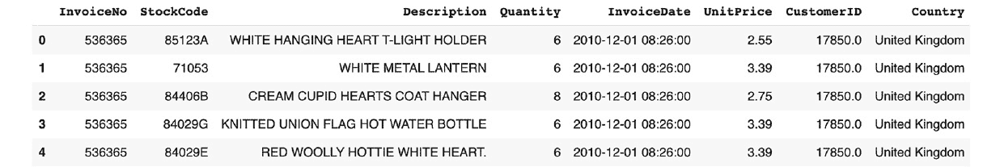

图 12.1：在线零售数据集的前五行

接下来，我们将把所有英国的公共假期加载到另一个`pandas` DataFrame 中。从*第十章*，*数据集分析*中我们知道，这个数据集的记录仅限于 2010 年和 2011 年。因此，我们将提取这两年的公共假期，但需要分两步进行，因为`date.nager`提供的 API 仅按单一年份进行分割。

首先让我们关注 2010 年：

```py
uk_holidays_2010 = pd.read_csv\
                   ('https://date.nager.at/PublicHoliday/'\
                    'Country/GB/2010/CSV')
```

我们可以打印它的形状，看看它有多少行和列：

```py
uk_holidays_2010.shape
```

你应该得到以下输出。

```py
(13, 8)
```

我们可以看到，那一年有`13`个公共假期，并且有`8`个不同的列。

让我们打印这个 DataFrame 的前五行：

```py
uk_holidays_2010.head()
```

你应该得到以下输出：

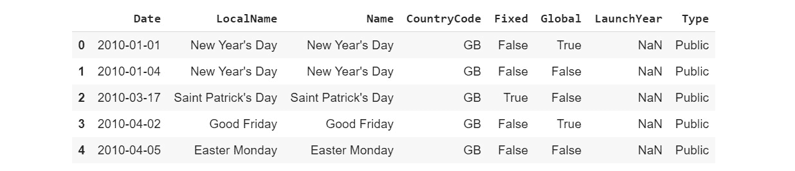

图 12.2：英国 2010 年公共假期 DataFrame 的前五行

现在我们有了 2010 年的公共假期列表，让我们提取 2011 年的公共假期：

```py
uk_holidays_2011 = pd.read_csv\
                   ('https://date.nager.at/PublicHoliday/'\
                    'Country/GB/2011/CSV')
uk_holidays_2011.shape
```

你应该得到以下输出。

```py
(15, 8)
```

2011 年共有`15`个公共假期。现在我们需要将这两个数据框的记录合并。我们将使用`pandas`的`.append()`方法，并将结果分配到一个新的数据框中：

```py
uk_holidays = uk_holidays_2010.append(uk_holidays_2011)
```

让我们检查在合并这两个数据框后，是否得到了正确的行数：

```py
uk_holidays.shape
```

你应该得到如下输出：

```py
(28, 8)
```

我们得到了`28`条记录，正好对应 2010 年和 2011 年的公共假期总数。

为了将两个数据框合并，我们需要确保它们之间至少有一列公共列，也就是说，两个数据框应至少有一列包含相同类型的信息。在我们的例子中，我们将通过`Date`列和在线零售数据框中的`InvoiceDate`列进行合并。我们可以看到这两列的数据格式不同：一个是日期格式（`yyyy-mm-dd`），另一个是日期时间格式（`yyyy-mm-dd hh:mm:ss`）。

所以，我们需要将`InvoiceDate`列转换为日期格式（`yyyy-mm-dd`）。一种方法是将此列转换为文本，然后使用`.str.slice()`方法提取每个单元格的前 10 个字符。

例如，日期`2010-12-01 08:26:00`将首先被转换为字符串，然后我们将只保留前 10 个字符，即`2010-12-01`。我们将这些结果保存到一个新列`InvoiceDay`中：

```py
df['InvoiceDay'] = df['InvoiceDate'].astype(str)\
                                    .str.slice(stop=10)
df.head()
```

输出如下：


图 12.3：创建`InvoiceDay`后的前五行

现在，来自在线零售数据框的`InvoiceDay`列和来自英国公共假期数据框的`Date`列包含相似的信息，因此我们可以使用`pandas`的`.merge()`方法将这两个数据框合并在一起。

有多种方法可以将两张表连接在一起：

+   左连接

+   右连接

+   内连接

+   外连接

### 左连接

左连接将保留第一个数据框（即*在线零售*数据集，位于左侧）中的所有行，并将其与第二个数据框（即*英国公共假期*数据集，位于右侧）中的匹配行连接，如*图 12.04*所示：


图 12.4：左连接的文氏图

要执行左连接，我们需要在`.merge()`方法中指定以下参数：

+   `how = 'left'`表示进行左连接

+   `left_on = InvoiceDay` 用于指定从左侧（这里是在线零售数据框中的`InvoiceDay`列）合并的列

+   `right_on = Date` 用于指定从右侧（这里是英国公共假期数据框中的`Date`列）合并的列

这些参数如下面的代码片段所示，已被组合在一起：

```py
df_left = pd.merge(df, uk_holidays, left_on='InvoiceDay', \
                   right_on='Date', how='left')
df_left.shape
```

你应该得到如下输出：

```py
(541909, 17)
```

我们得到了与原始在线零售数据框完全相同的行数，这是左连接所期望的结果。让我们看看前五行：

```py
df_left.head()
```

你应该得到以下输出：

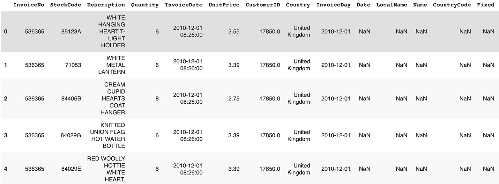

图 12.5：左连接合并后的前五行数据

我们可以看到，来自公共假期数据框的八列已经与原始数据框合并。如果第二个数据框（在这种情况下是公共假期数据框）没有匹配的行，`pandas` 将用缺失值（`NaT` 或 `NaN`）填充所有单元格，如*图 12.05*所示。

### 右连接

右连接与左连接类似，不同之处在于它会保留第二个数据框（右侧）的所有行，并尝试将其与第一个数据框（左侧）进行匹配，如*图 12.06*所示：


图 12.6：右连接的韦恩图

我们只需要指定以下参数：

+   `how` `= 'right'`到`.merge()`方法中来执行这种类型的连接。

+   我们将使用与前一个示例相同的列进行合并，即`InvoiceDay`（在线零售数据框）和`Date`（英国公共假期数据框）。

这些参数被组合在一起，如下所示的代码片段：

```py
df_right = df.merge(uk_holidays, left_on='InvoiceDay', \
                    right_on='Date', how='right')
df_right.shape
```

你应该得到以下输出：

```py
(9602, 17)
```

我们可以看到，右连接的结果行数较少，但它并没有得到与公共假期数据框相同的行数。这是因为在线零售数据框中有多行与公共假期数据框中的单一日期匹配。

例如，查看合并后的数据框的前几行，我们可以看到 2011 年 1 月 4 日有多次购买，因此所有这些购买都已与相应的公共假期匹配。看看以下代码片段：

```py
df_right.head()
```

你应该得到以下输出：

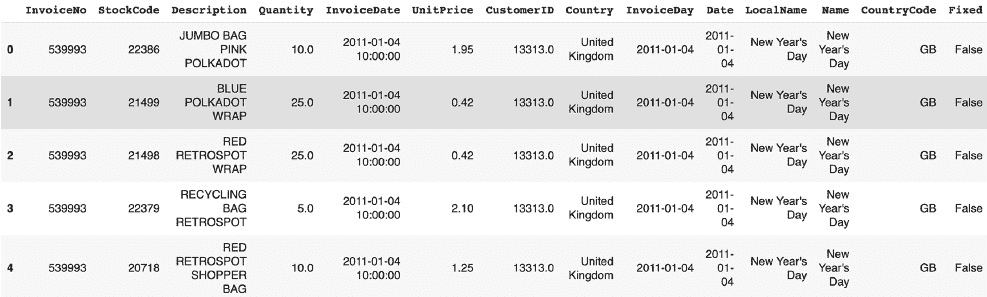

图 12.7：右连接合并后的前五行数据

还有两种其他类型的合并：内连接和外连接。

内连接将只保留两个表之间匹配的行：


图 12.8：内连接的韦恩图

你只需要在`.merge()`方法中指定`how = 'inner'`参数。

这些参数被组合在一起，如下所示的代码片段：

```py
df_inner = df.merge(uk_holidays, left_on='InvoiceDay', \
                    right_on='Date', how='inner')
df_inner.shape
```

你应该得到以下输出：

```py
(9579, 17)
```

我们可以看到，在英国有 9,579 条观察记录发生在公共假期期间。

外连接将保留两个表中的所有行（匹配的和不匹配的），如*图 12.09*所示：


图 12.9：外连接的韦恩图

如你所猜测的那样，你只需要在`.merge()`方法中指定`how == 'outer'`参数：

```py
df_outer = df.merge(uk_holidays, left_on='InvoiceDay', \
                    right_on='Date', how='outer')
df_outer.shape
```

你应该得到以下输出：

```py
(541932, 17)
```

在合并两张表之前，了解你的重点非常重要。如果你的目标是通过添加另一个数据集的列来扩展原始数据集的特征数量，那么你可能会使用左连接或右连接。但请注意，由于两个表之间可能存在多重匹配，你可能会得到更多的观测值。另一方面，如果你对两张表之间的匹配或不匹配的观测值感兴趣，那么你将使用内连接或外连接。

## 练习 12.01：将 ATO 数据集与 Postcode 数据集合并

在这个练习中，我们将把 ATO 数据集（28 列）与 Postcode 数据集（150 列）合并，以得到一个列数更多的丰富数据集。

注意

澳大利亚税务局（ATO）数据集可以在 Packt GitHub 库中找到：[`packt.live/39B146q`](https://packt.live/39B146q)。

Postcode 数据集可以在这里找到：[`packt.live/2sHAPLc`](https://packt.live/2sHAPLc)。

数据集的来源如下：

**澳大利亚税务局**（**ATO**）：[`packt.live/361i1p3`](https://packt.live/361i1p3)。

Postcode 数据集：[`packt.live/2umIn6u`](https://packt.live/2umIn6u)。

以下步骤将帮助你完成这个练习：

1.  打开一个新的 Colab 笔记本。

1.  现在，开始导入`pandas`包：

    ```py
    import pandas as pd
    ```

1.  将 ATO 数据集的链接赋值给一个名为`file_url`的变量：

    ```py
    file_url = 'https://raw.githubusercontent.com/'\
               'PacktWorkshops/The-Data-Science-Workshop/'\
               'master/Chapter12/Dataset/taxstats2015.csv'
    ```

1.  使用`pandas`包中的`.read_csv()`方法，将数据集加载到一个名为`df`的新 DataFrame 中：

    ```py
    df = pd.read_csv(file_url)
    ```

1.  使用`.shape`属性显示此 DataFrame 的维度：

    ```py
    df.shape
    ```

    你应该得到以下输出：

    ```py
    (2473, 28)
    ```

    ATO 数据集包含`2471`行和`28`列。

1.  使用`.head()`方法显示 ATO DataFrame 的前五行：

    ```py
    df.head()
    ```

    你应该得到以下输出：

    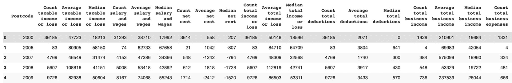

    图 12.10：ATO 数据集的前五行

    两个 DataFrame 都有一个名为`Postcode`的列，包含邮政编码，因此我们将使用它来合并它们。

    注意

    Postcode 是澳大利亚用于表示邮政编码的名称，是邮政区域的标识符。

    我们希望了解每个邮政编码的更多信息。让我们确保它们在该数据集中都是唯一的。

1.  使用`.nunique()`方法显示`Postcode`变量的唯一值数量：

    ```py
    df['Postcode'].nunique()
    ```

    你应该得到以下输出：

    ```py
    2473
    ```

    该列中有`2473`个唯一值，且 DataFrame 有`2473`行，因此我们可以确认`Postcode`变量只包含唯一值。

1.  现在，将第二个 Postcode 数据集的链接赋值给一个名为`postcode_df`的变量：

    ```py
    postcode_url = 'https://github.com/PacktWorkshops/'\
                   'The-Data-Science-Workshop/blob/'\
                   'master/Chapter12/Dataset/'\
                   'taxstats2016individual06taxablestatusstate'\
                   'territorypostcodetaxableincome%20(2).xlsx?'\
                   'raw=true'
    ```

1.  使用`.read_excel()`方法将第二个 Postcode 数据集加载到一个名为`postcode_df`的新 DataFrame 中。

    我们只加载 *Individuals Table 6B* 表单，因为数据就在这里，所以我们需要将此名称提供给 `sheet_name` 参数。此外，此电子表格中包含变量名称的标题行位于第三行，因此我们需要将其指定给 header 参数。

    ```py
    postcode_df = pd.read_excel(postcode_url, \
                                sheet_name='Individuals Table 6B', \
                                header=2)
    ```

1.  使用 `.shape` 属性打印 `postcode_df` 的维度：

    ```py
    postcode_df.shape
    ```

    你应该得到以下输出：

    ```py
    (2567, 150)
    ```

    该 DataFrame 包含 `2567` 行和 `150` 列。通过与 ATO 数据集的合并，我们将获得每个邮政编码的附加信息。

1.  使用 `.head()` 方法打印 `postcode_df` 的前五行：

    ```py
    postcode_df.head()
    ```

    你应该得到以下输出：

    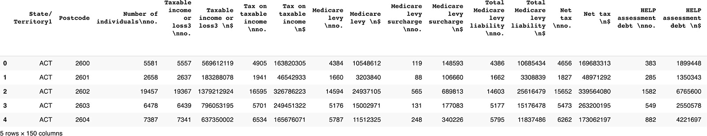

    图 12.11：邮政编码数据集的前五行

    我们可以看到第二列包含邮政编码值，这就是我们用来与 ATO 数据集合并的列。让我们检查一下它们是否唯一。

1.  使用 `.nunique()` 方法打印该列中唯一值的数量，如下代码片段所示：

    ```py
    postcode_df['Postcode'].nunique()
    ```

    你应该得到以下输出：

    ```py
    2567
    ```

    有 `2567` 个唯一值，这恰好对应于此 DataFrame 的行数，因此我们可以完全确定这一列包含唯一值。这也意味着，在合并两个表后，将会是一对一的匹配。我们不会遇到某个数据集中的多行与另一个数据集的单行匹配的情况。例如，ATO 数据集中的邮政编码 `2029` 将会在第二个邮政编码 DataFrame 中恰好匹配一行。

1.  使用 `.merge()` 方法对两个 DataFrame 执行左连接，并将结果保存到一个名为 `merged_df` 的新 DataFrame 中。指定 `how='left'` 和 `on='Postcode'` 参数：

    ```py
    merged_df = pd.merge(df, postcode_df, \
                         how='left', on='Postcode')
    ```

1.  使用 `.shape` 属性打印新合并的 DataFrame 的维度：

    ```py
    merged_df.shape
    ```

    你应该得到以下输出：

    ```py
    (2473, 177)
    ```

    合并后我们得到了正好 `2473` 行，这是我们期望的结果，因为我们使用了左连接，并且两个原始 DataFrame 中的 `Postcode` 列存在一对一的匹配。此外，我们现在有了 `177` 列，这也是本次练习的目标。但在得出结论之前，我们想看看两个数据集之间是否有不匹配的邮政编码。为此，我们将查看来自右侧 DataFrame（邮政编码数据集）的一列，看看是否有任何缺失值。

1.  通过结合 `.isna()` 和 `.sum()` 方法打印 `'State/Territory1'` 列中缺失值的总数：

    ```py
    merged_df['State/ Territory1'].isna().sum()
    ```

    你应该得到以下输出：

    ```py
    4
    ```

    ATO 数据集中有四个邮政编码未与邮政编码代码匹配。

    让我们看看它们是什么。

1.  使用 `.iloc()` 方法打印缺失的邮政编码，如下代码片段所示：

    ```py
    merged_df.loc[merged_df['State/ Territory1'].isna(), \
                  'Postcode']
    ```

    你应该得到以下输出：

    

图 12.12：不匹配的邮政编码列表

Postcode 数据集中的缺失邮政编码有`3010`、`4462`、`6068`和`6758`。在实际项目中，你需要联系你的利益相关者或数据团队，看看是否能获取这些数据。

我们已经成功地合并了两个感兴趣的数据集，并将特征数量从`28`扩展到了`177`。现在，我们有了一个更丰富的数据集，可以对其进行更详细的分析。

注意

要访问这一特定部分的源代码，请参考[`packt.live/324bV67`](https://packt.live/324bV67)。

你也可以在网上运行这个例子，链接：[`packt.live/2CDYv80`](https://packt.live/2CDYv80)。

在下一个主题中，你将学习分箱变量。

## 分箱变量

如前所述，特征工程不仅仅是获取数据集中没有的信息。很多时候，你需要从现有特征中创建新的特征。一个例子就是将现有列的值合并成一个新的值列表。

例如，你的数据集中某些分类列可能包含非常多的唯一值，比如每个变量超过 1,000 个值。这实际上是非常庞大的信息量，需要额外的计算能力才能让算法处理并从中学习模式。如果你使用的是云计算服务，这可能会对项目成本产生重大影响，或者会延迟项目的交付时间。

一种可能的解决方案是不使用这些列并将其删除，但在这种情况下，你可能会失去一些对业务非常重要和关键的信息。另一种解决方案是通过减少唯一值的数量，创建这些列的一个更简化版本，比如将数量减少到 100 个。这样可以大大加快算法的训练过程，同时不会丢失太多信息。这种转化方法称为分箱（binning），传统上它是指数值变量，但同样的逻辑也可以应用于分类变量。

让我们看看如何在“在线零售”数据集上实现这一点。首先，我们需要加载数据：

```py
import pandas as pd
file_url = 'https://github.com/PacktWorkshops/'\
           'The-Data-Science-Workshop/blob/'\
           'master/Chapter12/Dataset/'\
           'Online%20Retail.xlsx?raw=true'
df = pd.read_excel(file_url)
```

在*第十章*，*数据集分析*中，我们了解到`Country`列包含`38`个不同的唯一值：

```py
df['Country'].unique()
```

你应该得到以下输出：

![图 12.13：Country 列的唯一值列表]

](img/B15019_12_13.jpg)

图 12.13：Country 列的唯一值列表

我们将把一些国家分组到不同的地区，比如亚洲、中东和美洲。我们会保持欧洲国家不变。

首先，让我们通过复制`Country`列来创建一个新的列，命名为`Country_bin`：

```py
df['Country_bin'] = df['Country']
```

然后，我们将创建一个名为`asian_countries`的列表，包含`Country`列中唯一值列表中的亚洲国家名称：

```py
asian_countries = ['Japan', 'Hong Kong', 'Singapore']
```

最后，使用`pandas`的`.loc()`和`.isin()`方法，我们将把`Country_bin`的值更改为`Asia`，适用于`asian_countries`列表中所有的国家：

```py
df.loc[df['Country'].isin(asian_countries), \
       'Country_bin'] = 'Asia'
```

现在，如果我们打印这个新列的唯一值列表，我们会看到三个亚洲国家（`Japan`、`Hong Kong`和`Singapore`）已经被替换为`Asia`：

```py
df['Country_bin'].unique()
```

你应该会得到以下输出：


图 12.14：对亚洲国家进行分箱后的`Country_bin`列唯一值列表

让我们对中东国家执行相同的操作：

```py
m_east_countries = ['Israel', 'Bahrain', 'Lebanon', \
                    'United Arab Emirates', 'Saudi Arabia']
df.loc[df['Country'].isin(m_east_countries), \
       'Country_bin'] = 'Middle East'
df['Country_bin'].unique()
```

你应该会得到以下输出：


图 12.15：对中东国家进行分箱后的`Country_bin`列唯一值列表

最后，让我们将所有来自北美和南美的国家归为一组：

```py
american_countries = ['Canada', 'Brazil', 'USA']
df.loc[df['Country'].isin(american_countries), \
       'Country_bin'] = 'America'
df['Country_bin'].unique()
```

你应该会得到以下输出：


图 12.16：对北美和南美国家进行分箱后的`Country_bin`列唯一值列表

```py
df['Country_bin'].nunique()
```

你应该会得到以下输出：

```py
30
```

`30`是`Country_bin`列的唯一值数量。所以我们将该列的唯一值从`38`减少到`30`：

我们刚刚看到如何将分类值分组在一起，但同样的过程也可以应用于数值值。例如，将人的年龄分为不同的区间，如 20 岁（20 到 29 岁）、30 岁（30 到 39 岁）等，这是很常见的做法。

看一下*练习 12.02*，*从 AMES Housing 数据集中对 YearBuilt 变量进行分箱*。

## 练习 12.02：从 AMES Housing 数据集中对 YearBuilt 变量进行分箱

在这个练习中，我们将通过对现有的数值列进行分箱，来创建一个新特征，从而将唯一值的数量从`112`减少到`15`。

注意

我们将在此练习中使用的数据集是 Ames Housing 数据集，可以在我们的 GitHub 仓库中找到：[`packt.live/35r2ahN`](https://packt.live/35r2ahN)。

这个数据集是由 Dean De Cock 编制的：[`packt.live/2uojqHR`](https://packt.live/2uojqHR)。

该数据集包含 2010 年至 2016 年期间，爱荷华州阿姆斯市的住宅房屋销售清单。

有关每个变量的更多信息可以在这里找到：[`packt.live/2sT88L4`](https://packt.live/2sT88L4)。

1.  打开一个新的 Colab 笔记本。

1.  导入`pandas`和`altair`包：

    ```py
    import pandas as pd
    import altair as alt
    ```

1.  将数据集链接赋值给一个名为`file_url`的变量：

    ```py
    file_url = 'https://raw.githubusercontent.com/'\
               'PacktWorkshops/The-Data-Science-Workshop/'\
               'master/Chapter12/Dataset/ames_iowa_housing.csv'
    ```

1.  使用`pandas`包的`.read_csv()`方法，将数据集加载到一个新的 DataFrame 中，命名为`df`：

    ```py
    df = pd.read_csv(file_url)
    ```

1.  使用`.head()`方法显示前五行：

    ```py
    df.head()
    ```

    你应该会得到以下输出：

    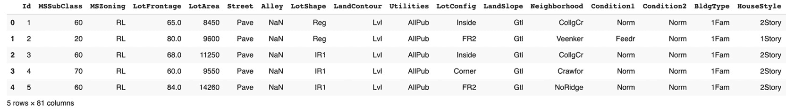

    图 12.17：AMES housing DataFrame 的前五行

1.  使用 `.nunique()` 显示列中的独特值数量：

    ```py
    df['YearBuilt'].nunique()
    ```

    你应该得到以下输出：

    ```py
    112
    ```

    `YearBuilt` 列中有 `112` 个不同或独特的值：

1.  使用 `altair` 打印一个散点图，来可视化每年建筑的记录数量。在 `.encode()` 方法中指定 `YearBuilt:O` 作为 x 轴，`count()` 作为 y 轴：

    ```py
    alt.Chart(df).mark_circle().encode(alt.X('YearBuilt:O'),\
                                       y='count()')
    ```

    你应该得到以下输出：

    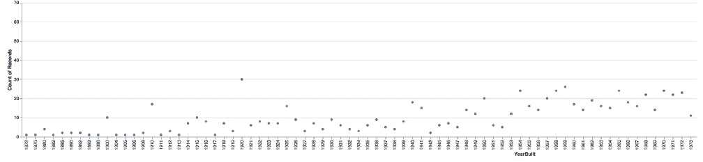

    图 12.18：AMES housing DataFrame 的前五行

    注意

    由于 GitHub 的限制，输出未显示。如果你在 Colab 文件中运行，图形将会显示。

    在某些年份中，出售的房产不多。因此，你可以按十年（10 年一组）进行分组。

1.  创建一个名为 `year_built` 的列表，包含 `YearBuilt` 列中的所有独特值：

    ```py
    year_built = df['YearBuilt'].unique()
    ```

1.  创建另一个列表，用于计算 `year_built` 中每年对应的十年。使用列表推导遍历每一年并应用以下公式：`year - (year % 10)`。

    例如，应用此公式于 2015 年，将得到 2015 - (2015 % 10)，即 2015 - 5 等于 2010。

    ```py
    decade_list = [year - (year % 10) for year in year_built]
    ```

1.  创建一个包含 `decade_list` 中所有独特值的排序列表，并将结果保存在一个名为 `decade_built` 的新变量中。为此，将 `decade_list` 转换为集合（这将排除所有重复项），然后使用 `sorted()` 函数，如以下代码片段所示：

    ```py
    decade_built = sorted(set(decade_list))
    ```

1.  打印 `decade_built` 的值：

    ```py
    decade_built
    ```

    你应该得到以下输出：

    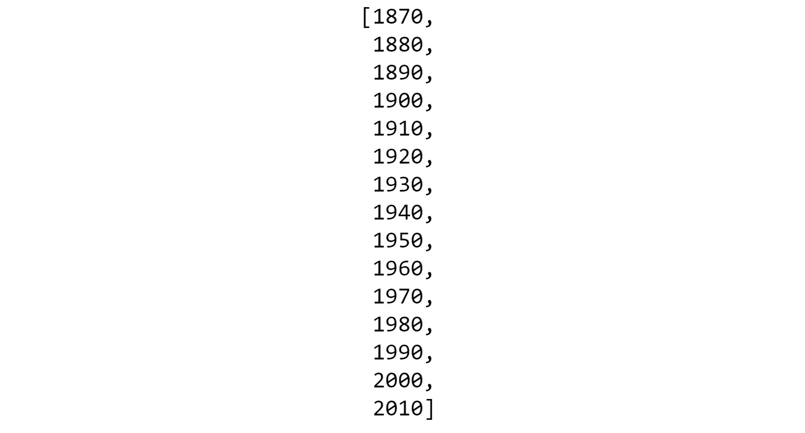

    图 12.19：十年列表

    现在我们有了将 `YearBuilt` 列进行分组的十年列表。

1.  在 `df` DataFrame 中创建一个名为 `DecadeBuilt` 的新列，将 `YearBuilt` 中的每个值按十年分组。你将使用 `pandas` 的 `.cut()` 方法，并指定 `bins=decade_built` 参数：

    ```py
    df['DecadeBuilt'] = pd.cut(df['YearBuilt'], \
                               bins=decade_built)
    ```

1.  打印 DataFrame 的前五行，仅显示 `'YearBuilt'` 和 `'DecadeBuilt'` 列：

    ```py
    df[['YearBuilt', 'DecadeBuilt']].head()
    ```

    你应该得到以下输出：

    

图 12.20：分组后的前五行

我们可以看到每年已正确地分配到了相关的十年。

注意

要访问此部分的源代码，请参考 [`packt.live/3kXnC7c`](https://packt.live/3kXnC7c)。

本节目前没有在线互动示例，但可以在 Google Colab 上照常运行。

我们已经通过将 `YearBuilt` 列的值按十年分组，成功创建了一个新特征。我们将独特值的数量从 `112` 减少到 `15`。

## 操作日期

在你将要处理的大多数数据集中，会有一列或多列包含日期信息。通常，你不会将此类信息直接作为输入提供给机器学习算法。原因是你不希望它学习到过于特定的模式，例如顾客 A 在 2012 年 8 月 3 日上午 08:11 购买了产品 X。如果这样，模型将会过拟合，无法对未来数据进行泛化。

你真正希望的是模型学习到一些模式，例如，带小孩的顾客倾向于在 12 月购买独角兽玩具。与其提供原始日期，你希望提取一些周期性的特征，如年份的月份、星期几等。我们将在本节中看到，使用 `pandas` 包提取这些信息是多么简单。

注意

这个经验法则有一个例外。如果你正在进行时间序列分析，这种算法需要一个日期列作为输入特征，但这超出了本书的范围。

在 *第十章*，*分析数据集* 中，你已了解了 `pandas` 中数据类型的概念。那时，我们主要关注的是数值变量和类别变量，但还有一个重要的数据类型：`datetime`。让我们再次查看在线零售数据集中每列的类型：

```py
import pandas as pd
file_url = 'https://github.com/PacktWorkshops/'\
           'The-Data-Science-Workshop/blob/'\
           'master/Chapter12/Dataset/'\
           'Online%20Retail.xlsx?raw=true'
df = pd.read_excel(file_url)
df.dtypes
```

你应该得到以下输出：

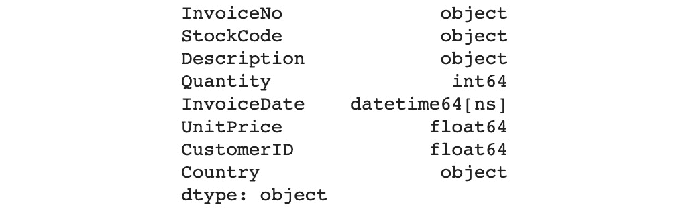

图 12.21：在线零售数据集中变量的数据类型

我们可以看到，`pandas` 自动检测到 `InvoiceDate` 是 `datetime` 类型。但对于一些其他数据集，它可能无法正确识别日期。在这种情况下，你需要使用 `.to_datetime()` 方法手动转换它们：

```py
df['InvoiceDate'] = pd.to_datetime(df['InvoiceDate'])
```

一旦列被转换为 `datetime` 类型，pandas 提供了许多属性和方法来提取与时间相关的信息。例如，如果你想获取某个日期的年份，可以使用 `.dt.year` 属性：

```py
df['InvoiceDate'].dt.year
```

你应该得到以下输出：


图 12.22：为每行提取的 `InvoiceDate` 列的年份

如你所料，提取日期的月和日的属性分别是 `.dt.month` 和 `.dt.day`。你可以使用 `.dt.dayofweek` 属性从日期中获取星期几：

```py
df['InvoiceDate'].dt.dayofweek
```

你应该得到以下输出。


图 12.23：为每行提取的 `InvoiceDate` 列的星期几

注意

你可以在这里找到所有可用属性的完整列表：[`packt.live/2ZUe02R`](https://packt.live/2ZUe02R)。

对于 datetime 列，你还可以进行一些数学运算。例如，我们可以通过使用 pandas 的时间序列偏移对象 `pd.tseries.offsets.Day(3)`，为每个日期添加 `3` 天：

```py
df['InvoiceDate'] + pd.tseries.offsets.Day(3)
```

您应该得到以下输出：

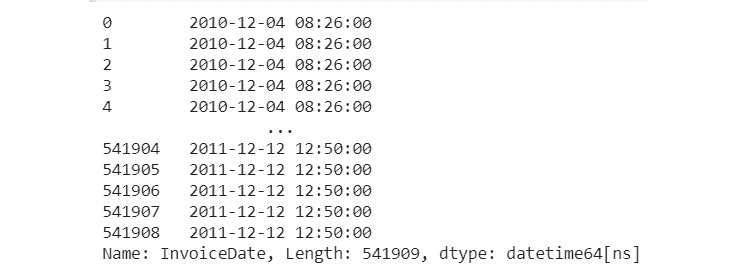

图 12.24：InvoiceDate 列偏移了三天

您还可以使用 `pd.tseries.offsets.BusinessDay()` 按工作日偏移天数。例如，如果我们想获得前一个工作日，可以这样做：

```py
df['InvoiceDate'] + pd.tseries.offsets.BusinessDay(-1)
```

您应该得到以下输出：

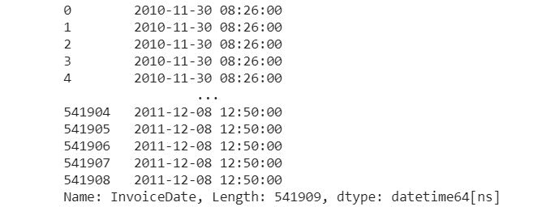

图 12.25：InvoiceDate 列偏移了 -1 个工作日

另一个有趣的日期操作是使用 `pd.Timedelta()` 应用特定的时间频率。例如，如果您想从某个日期获取该月的第一天，可以这样做：

```py
df['InvoiceDate'] + pd.Timedelta(1, unit='MS')
```

您应该得到以下输出：

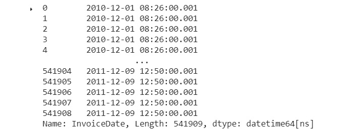

图 12.26：InvoiceDate 列转换为月初

如您在本节中所见，`pandas` 包提供了许多不同的 API 来操作日期。您已经学会了如何使用其中一些最常用的 API。现在，您可以自行探索其他的 API。

## 练习 12.03：金融服务消费者投诉的日期操作

在本次练习中，我们将学习如何使用 `pandas` 从两个现有的日期列中提取与时间相关的信息，并创建六个新列：

注意

我们将在本次练习中使用的数据集是金融服务客户投诉数据集，您可以在我们的 GitHub 仓库中找到它：[`packt.live/2ZYm9Dp`](https://packt.live/2ZYm9Dp)。

原始数据集可以在这里找到：[`packt.live/35mFhMw`](https://packt.live/35mFhMw)。

1.  打开一个新的 Colab 笔记本。

1.  导入 `pandas` 包：

    ```py
    import pandas as pd
    ```

1.  将数据集的链接赋值给一个名为 `file_url` 的变量：

    ```py
    file_url = 'https://raw.githubusercontent.com/'\
               'PacktWorkshops/The-Data-Science-Workshop/'\
               'master/Chapter12/Dataset/Consumer_Complaints.csv'
    ```

1.  使用 `pandas` 包中的 `.read_csv()` 方法将数据集加载到一个名为 `df` 的新数据框中：

    ```py
    df = pd.read_csv(file_url)
    ```

1.  使用 `.head()` 方法显示前五行：

    ```py
    df.head()
    ```

    您应该得到以下输出：

    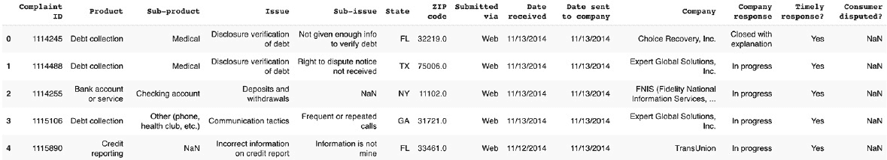

    图 12.27：客户投诉数据框的前五行

1.  使用 `.dtypes` 属性打印每一列的数据类型：

    ```py
    df.dtypes
    ```

    您应该得到以下输出：

    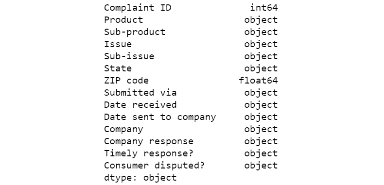

    图 12.28：客户投诉数据框的各列数据类型

    `Date received` 和 `Date sent to company` 列尚未被识别为日期时间格式，因此我们需要手动将它们转换为日期时间。

1.  使用 `pd.to_datetime()` 方法将 `Date received` 和 `Date sent to company` 列转换为日期时间格式：

    ```py
    df['Date received'] = pd.to_datetime(df['Date received'])
    df['Date sent to company'] = pd.to_datetime\
                                 (df['Date sent to company'])
    ```

1.  使用 `.dtypes` 属性打印每一列的数据类型：

    ```py
    df.dtypes
    ```

    您应该得到以下输出：

    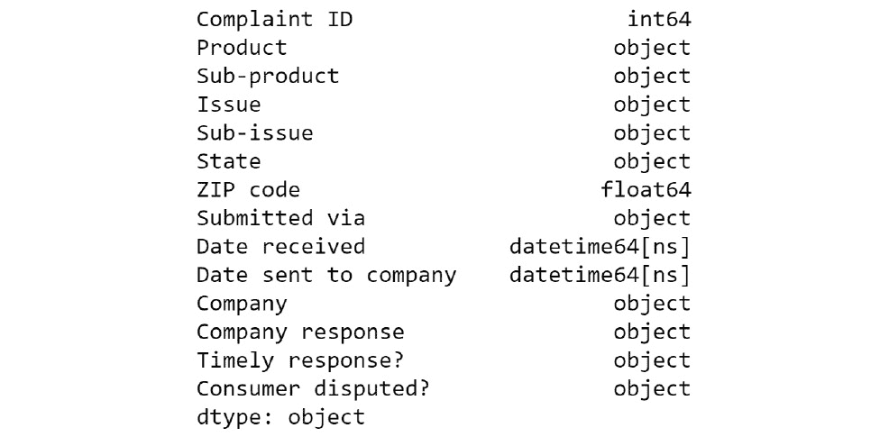

    图 12.29：客户投诉数据框在转换后的数据类型

    现在这两列的数据类型已经正确。接下来，让我们从这两列日期中创建一些新特征。

1.  创建一个名为`YearReceived`的新列，其中将使用`.dt.year`属性提取`Date Received`列中的年份：

    ```py
    df['YearReceived'] = df['Date received'].dt.year
    ```

1.  创建一个名为`MonthReceived`的新列，其中将使用`.dt.month`属性提取每个日期的月份：

    ```py
    df['MonthReceived'] = df['Date received'].dt.month
    ```

1.  创建一个名为`DayReceived`的新列，其中将使用`.dt.day`属性提取每个日期的天：

    ```py
    df['DomReceived'] = df['Date received'].dt.day
    ```

1.  创建一个名为`DowReceived`的新列，其中将使用`.dt.dayofweek`属性提取每个日期的星期几：

    ```py
    df['DowReceived'] = df['Date received'].dt.dayofweek
    ```

1.  使用`.head()`方法显示前五行：

    ```py
    df.head()
    ```

    你应该得到以下输出：

    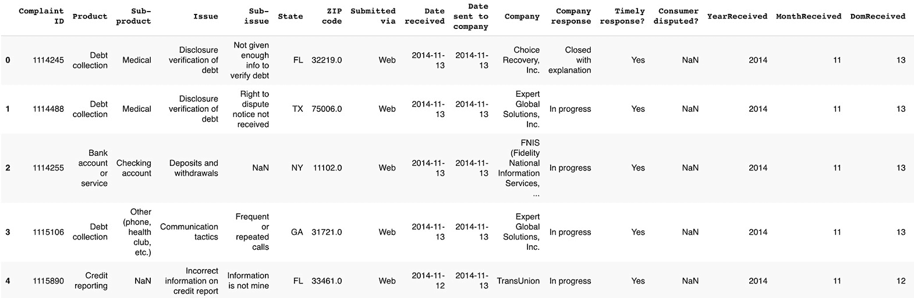

    图 12.30：在创建四个新特征后，客户投诉数据框的前五行

    我们可以看到，我们成功地创建了四个新特征：`YearReceived`、`MonthReceived`、`DayReceived`和`DowReceived`。现在让我们创建另一个特征，指示日期是否在周末。

1.  创建一个名为`IsWeekendReceived`的新列，其中将包含二进制值，指示`DowReceived`列的值是否大于或等于`5`（`0`代表星期一，`5`和`6`分别代表星期六和星期日）：

    ```py
    df['IsWeekendReceived'] = df['DowReceived'] >= 5
    ```

1.  使用`.head()`方法显示前`5`行：

    ```py
    df.head()
    ```

    你应该得到以下输出：

    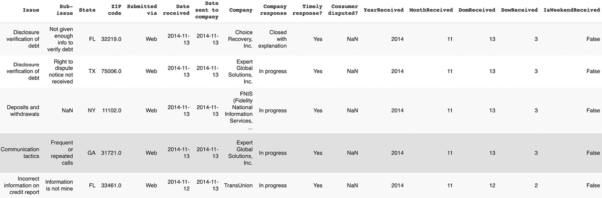

    图 12.31：在创建周末特征后，客户投诉数据框的前五行

    我们已经创建了一个新特征，表明每个投诉是否是在周末收到的。接下来，我们将创建一个新列，表示`Date sent to company`和`Date received`之间的天数差。

1.  创建一个名为`RoutingDays`的新列，其中将包含`Date sent to company`和`Date received`之间的差值：

    ```py
    df['RoutingDays'] = df['Date sent to company'] \
                        - df['Date received']
    ```

1.  使用`.dtype`属性打印新列`'RoutingDays'`的数据类型：

    ```py
    df['RoutingDays'].dtype
    ```

    你应该得到以下输出：

    

    图 12.32：`RoutingDays`列的数据类型

    从两个日期时间列相减的结果是一个新的日期时间列（`dtype('<M8[ns]'`），这是一种特定的日期时间类型，属于`numpy`包）。我们需要将该数据类型转换为`int`，以便计算这两天之间的天数。

1.  使用`.dt.days`属性转换`RoutingDays`列：

    ```py
    df['RoutingDays'] = df['RoutingDays'].dt.days
    ```

1.  使用`.head()`方法显示前五行：

    ```py
    df.head()
    ```

    你应该得到以下输出：

    

图 12.33：在创建`RoutingDays`后，客户投诉数据框的前五行

在这个练习中，你将实践不同的技术，从真实世界的数据集中基于日期时间列进行特征工程，生成新的变量。通过 `Date sent to company` 和 `Date received` 两列，你成功创建了六个新特征，这些特征将提供额外的有价值信息。

注意

若要访问此特定部分的源代码，请参考 [`packt.live/3kWvhmf`](https://packt.live/3kWvhmf)。

你也可以在网上运行这个示例：[`packt.live/316YT8z`](https://packt.live/316YT8z)。

例如，我们能够发现一些模式，比如投诉数量通常在十一月或星期五较高。我们还发现，当投诉在周末收到时，处理投诉需要更多时间，这可能是由于那时工作人员有限。

## 执行数据聚合

好的，我们已经接近本章的结尾了。但在结束之前，还有一个要探索的技术：数据聚合。其背后的想法是，通过另一列中的特定分组来总结某个数值列。我们已经看到如何使用 `.pivot_table()` 方法在 *第五章*《进行第一次聚类分析》中，对 ATO 数据集中的两个数值变量（平均净税和平均总扣除）进行聚合。但那时，我们进行数据聚合并非为了创建新特征，而是为了理解这些聚类之间的差异。

你可能会好奇，在什么情况下你会想使用数据聚合进行特征工程。如果你已经有一个数值列，其中包含每个记录的值，为什么还需要对其进行汇总，并将这些信息添加回 DataFrame 中呢？这似乎是在添加相同的信息，只是没有那么详细。但其实，使用这种技术有多个合理的原因。

一个潜在的原因可能是你希望通过这种聚合来规范化另一个数值列。例如，如果你正在处理一个零售商的数据集，包含全球每个门店的所有销售数据，不同国家的销售量可能会有很大差异，因为它们的人口不同。在这种情况下，与其使用每个门店的原始销售数字，你可以计算一个比例（或百分比），即某个门店的销售额除以该国家的总销售额。通过这个新的比例特征，那些看起来因为销售额较低而表现不佳的门店，实际上可能在该国的平均水平上表现更好。

在 `pandas` 中，进行数据聚合非常简单。我们只需要依次结合以下方法：`.groupby()` 和 `.agg()`。

我们需要将需要分组的列名列表提供给 `.groupby()` 方法。如果你熟悉 Excel 透视表，这相当于 `Rows` 字段。

`.agg()` 方法期望一个字典，其中列名作为键，聚合函数作为值，例如 `{'column_name': 'aggregation_function'}`。在 Excel 透视表中，聚合后的列称为 `values`。

让我们看看如何在在线零售数据集上实现这个操作。首先，我们需要导入数据：

```py
import pandas as pd
file_url = 'https://github.com/PacktWorkshops/'\
           'The-Data-Science-Workshop/blob/'\
           'master/Chapter12/Dataset/'\
           'Online%20Retail.xlsx?raw=true'
df = pd.read_excel(file_url)
```

让我们计算每个国家的总销售数量。我们将 `Country` 列作为分组列：

```py
df.groupby('Country').agg({'Quantity': 'sum'})
```

你应该得到以下输出：

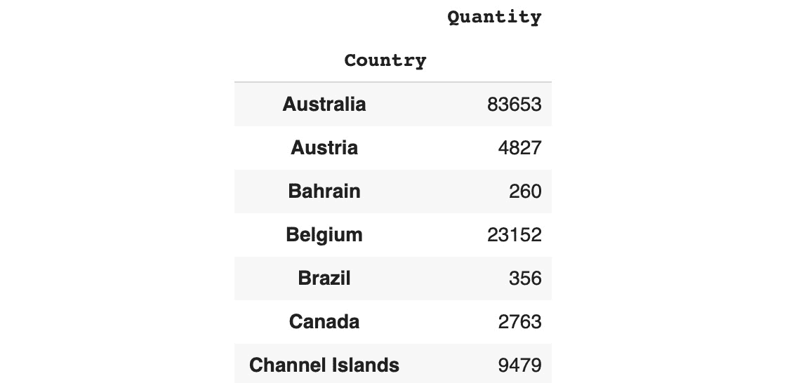

图 12.34：每个国家的数量总和（截断）

这个结果给出了每个国家销售的物品总量。我们可以看到，澳大利亚的销售量几乎是比利时的四倍。这种层级的信息可能太过粗略，我们可能需要更多的细节。让我们进行相同的聚合，但这次我们将根据两列进行分组：`Country` 和 `StockCode`。我们只需要将这些列的名称作为列表传递给 `.groupby()` 方法：

```py
df.groupby(['Country', 'StockCode']).agg({'Quantity': 'sum'})
```

你应该得到以下输出：

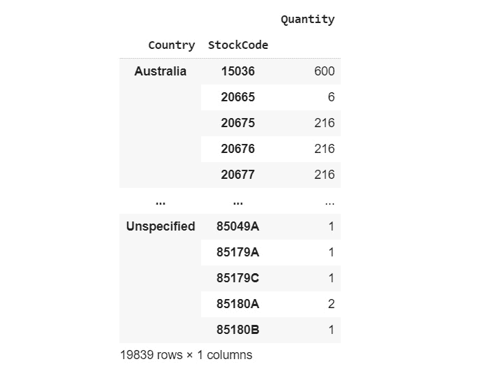

图 12.35：每个国家和 StockCode 的数量总和

我们可以看到每个国家的销售数量。可以注意到，澳大利亚对产品 `20675`、`20676` 和 `20677` 销售数量相同（每个 `216` 件）。这可能表示这些产品总是一起销售。

我们可以添加更多的信息层级，获取每个国家、每个产品和每个日期的销售数量。为此，我们首先需要创建一个新特征，从 `InvoiceDate` 中提取日期组件（我们在上一节中刚刚学到如何做这件事）：

```py
df['Invoice_Date'] = df['InvoiceDate'].dt.date
```

然后，我们可以在 `.groupby()` 方法中添加这个新列：

```py
df.groupby(['Country', 'StockCode', \
            'Invoice_Date']).agg({'Quantity': 'sum'})
```

你应该得到以下输出：

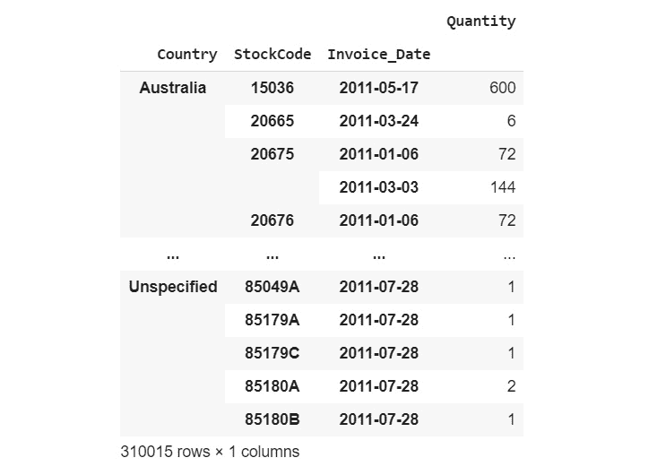

图 12.36：每个国家、StockCode 和 Invoice_Date 的数量总和

我们已经生成了一个新的数据框，其中包含每个国家、物品 ID 和日期的总销售数量。我们可以看到 `StockCode 15036` 在 `2011-05-17` 在 `Australia` 非常畅销，共售出了 `600` 件。而另一方面，在 `2011-03-24`，`StockCode 20665` 在 `Australia` 只售出了 `6` 件。

现在，我们可以将这些额外的信息合并回原始数据框中。但是在此之前，需要执行一个额外的数据转换步骤：重置列索引。`pandas` 包默认在数据聚合后创建一个多级索引。你可以把它想象成列名被存储在多行中，而不是仅存储在一行中。要将其更改回单级索引，你需要调用 `.reset_index()` 方法：

```py
df_agg = df.groupby(['Country', 'StockCode', 'Invoice_Date'])\
           .agg({'Quantity': 'sum'}).reset_index()
df_agg.head()
```

你应该得到以下输出：

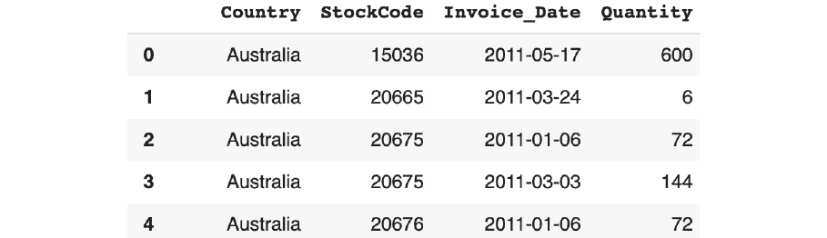

图 12.37：包含数据汇总信息的 DataFrame

现在我们可以使用本章前面提到的`.merge()`方法，将这个新的 DataFrame 合并到原始的 DataFrame 中：

```py
df_merged = pd.merge(df, df_agg, how='left', \
                     on = ['Country', 'StockCode', \
                           'Invoice_Date'])
df_merged
```

你应该得到以下输出：

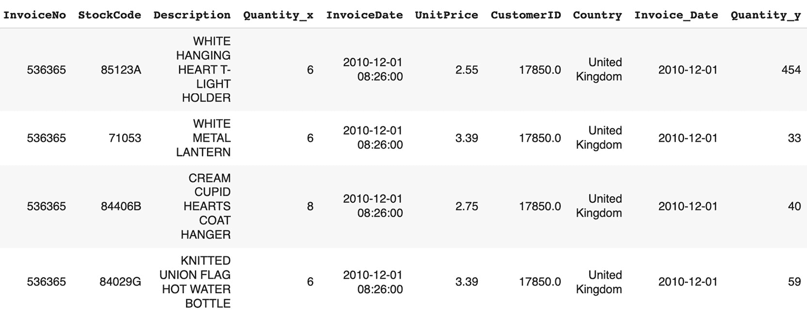

图 12.38：合并后的 DataFrame（已截断）

我们可以看到，原来的`Quantity`列被替换成了`Quantity_x`和`Quantity_y`。

原因是，在合并后，出现了两个具有完全相同名称的不同列（`Quantity`），因此默认情况下，pandas 添加了后缀以区分它们。

我们可以通过合并前替换其中一列的名称，或者合并后替换两列的名称来解决这个问题。要替换列名，我们可以使用`pandas`的`.rename()`方法，提供一个字典，其中旧名称为键，新名称为值，例如`{'old_name': 'new_name'}`。

合并后，我们将列名替换为`Quantity`和`DailyQuantity`：

```py
df_merged.rename(columns={"Quantity_x": "Quantity", \
                          "Quantity_y": "DailyQuantity"}, \
                 inplace=True)
df_merged
```

你应该得到以下输出：

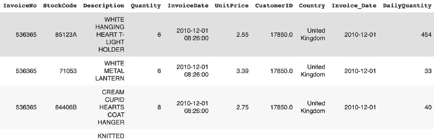

图 12.39：重命名后的 DataFrame（已截断）

现在我们可以创建一个新特征，用于计算每个国家中售出物品的数量与该国家每日总售出数量之间的比例：

```py
df_merged['QuantityRatio'] = df_merged['Quantity'] \
                             / df_merged['DailyQuantity']
df_merged
```

你应该得到以下输出：


图 12.40：包含新`QuantityRatio`特征的最终 DataFrame

在这一部分中，我们学习了如何通过数据汇总，帮助我们通过计算每个感兴趣的分组的比率或百分比来创建新特征。看第一行和第二行，我们可以看到在`StockCode`交易`84123A`和`71053`中，卖出了`6`个商品。但是如果我们看一下新创建的`DailyQuantity`列，我们会发现`StockCode` `84123A`更受欢迎：在那一天（`2010-12-01`），该店售出了`454`个`84123A`，但仅售出了`33`个`71053`。`QuantityRatio`显示，第三笔交易卖出了`StockCode` `84406B`的`8`个商品，这笔单笔交易占当天该商品销售量的 20%。通过进行数据汇总，我们为每一条记录获得了额外的信息，并且将数据集中的原始信息放到了一个新的视角中。

## 练习 12.04：使用数据汇总进行特征工程，基于 AMES 房价数据集

在本次练习中，我们将通过数据汇总创建新的特征。首先，我们将计算每个街区的最大`SalePrice`和`LotArea`，并按`YrSold`分组。然后，我们将这些信息添加回数据集，最后，我们将计算每个房产销售量与这两个最大值的比率：

注意

本次练习中我们将使用的数据库是 Ames Housing 数据库，可以在我们的 GitHub 仓库中找到：[`packt.live/35r2ahN`](https://packt.live/35r2ahN)。

1.  打开一个新的 Colab 笔记本。

1.  导入`pandas`和`altair`包：

    ```py
    import pandas as pd
    ```

1.  将数据集的链接赋值给一个名为`file_url`的变量：

    ```py
    file_url = 'https://raw.githubusercontent.com/'\
               'PacktWorkshops/The-Data-Science-Workshop/'\
               'master/Chapter12/Dataset/ames_iowa_housing.csv'
    ```

1.  使用`pandas`包的`.read_csv()`方法，将数据集加载到一个名为`df`的新数据框中：

    ```py
    df = pd.read_csv(file_url)
    ```

1.  使用`.groupby.agg()`方法进行数据聚合，找出每个`Neighborhood`和`YrSold`的最大`SalePrice`，并将结果保存到一个名为`df_agg`的新数据框中：

    ```py
    df_agg = df.groupby(['Neighborhood', 'YrSold'])\
               .agg({'SalePrice': 'max'}).reset_index()
    ```

1.  将`df_agg`的列名重命名为`Neighborhood`、`YrSold`和`SalePriceMax`：

    ```py
    df_agg.columns = ['Neighborhood', 'YrSold', 'SalePriceMax']
    ```

1.  打印出`df_agg`的前五行：

    ```py
    df_agg.head()
    ```

    你应该得到以下输出：

    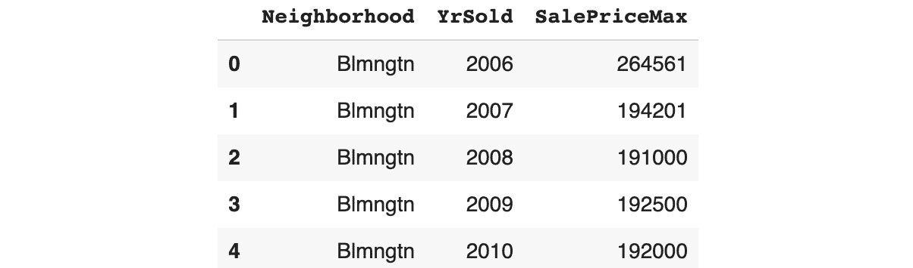

    图 12.41：聚合后的数据框前五行

1.  使用`merge()`方法，通过对`Neighborhood`和`YrSold`列进行左连接（`how='left'`），将原始数据框`df`与`df_agg`合并，并将结果保存到一个名为`df_new`的新数据框中：

    ```py
    df_new = pd.merge(df, df_agg, how='left', \
                      on=['Neighborhood', 'YrSold'])
    ```

1.  打印出`df_new`的前五行：

    ```py
    df_new.head()
    ```

    你应该得到以下输出：

    

    图 12.42：`df_new`的前五行

    请注意，我们显示的是输出的最后八列。

1.  创建一个名为`SalePriceRatio`的新列，将`SalePrice`除以`SalePriceMax`：

    ```py
    df_new['SalePriceRatio'] = df_new['SalePrice'] \
                               / df_new['SalePriceMax']
    ```

1.  打印出`df_new`的前五行：

    ```py
    df_new.head()
    ```

    你应该得到以下输出：

    

    图 12.43：特征工程后`df_new`的前五行

    请注意，我们显示的是输出的最后八列。

1.  使用`.groupby.agg()`方法进行数据聚合，找出每个`Neighborhood`和`YrSold`的最大`LotArea`，并将结果保存到一个名为`df_agg2`的新数据框中：

    ```py
    df_agg2 = df.groupby(['Neighborhood', 'YrSold'])\
                .agg({'LotArea': 'max'}).reset_index()
    ```

1.  将`df_agg2`的列名重命名为`Neighborhood`、`YrSold`和`LotAreaMax`，并打印出前五列：

    ```py
    df_agg2.columns = ['Neighborhood', 'YrSold', 'LotAreaMax']
    df_agg2.head()
    ```

    你应该得到以下输出：

    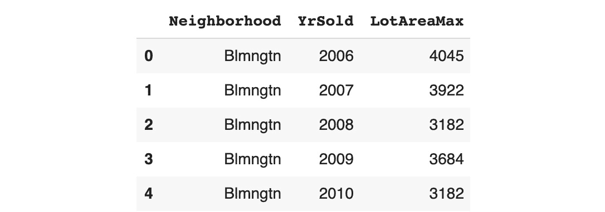

    图 12.44：聚合后的数据框前五行

1.  使用`merge()`方法，通过对`Neighborhood`和`YrSold`列进行左连接（`how='left'`），将原始数据框`df`与`df_agg2`合并，并将结果保存到一个名为`df_final`的新数据框中：

    ```py
    df_final = pd.merge(df_new, df_agg2, how='left', \
                        on=['Neighborhood', 'YrSold'])
    ```

1.  创建一个名为`LotAreaRatio`的新列，将`LotArea`除以`LotAreaMax`：

    ```py
    df_final['LotAreaRatio'] = df_final['LotArea'] \
                               / df_final['LotAreaMax']
    ```

1.  打印出`df_final`的前五行，包含以下列：`Id`、`Neighborhood`、`YrSold`、`SalePrice`、`SalePriceMax`、`SalePriceRatio`、`LotArea`、`LotAreaMax`、`LotAreaRatio`：

    ```py
    df_final[['Id', 'Neighborhood', 'YrSold', 'SalePrice', \
              'SalePriceMax', 'SalePriceRatio', 'LotArea', \
              'LotAreaMax', 'LotAreaRatio']].head()
    ```

    你应该得到以下输出：

    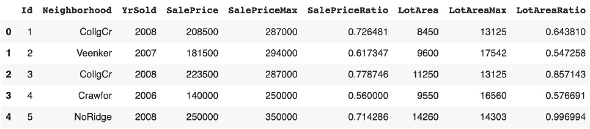

图 12.45：最终数据框的前五行

注意

要访问该特定部分的源代码，请参考 [`packt.live/2Q8a5eU`](https://packt.live/2Q8a5eU)。

你还可以在在线环境中运行此示例，网址为 [`packt.live/2Q8dhXI`](https://packt.live/2Q8dhXI)。

就这样。我们刚刚创建了两个新特征，分别表示一个房产的 `SalePrice` 与 `LotArea` 与同一年同一社区出售的最大房产的比率。现在我们可以轻松且公正地比较这些房产。例如，从上一步的输出中我们可以看到，第五个房产的大小（`Id` `5` 和 `LotArea` `14260`）几乎与同一地区、同一年售出的最大房产（`LotArea` `14303`）一样接近（`LotAreaRatio` `0.996994`）。但它的售价（`SalePrice` `250000`）显著低于（`SalePriceRatio` 为 `0.714286`）最高售价（`SalePrice` `350000`）。这表明房产的其他特征对售价产生了影响。

## 活动 12.01：财务数据集的特征工程

你在捷克共和国的一家大银行工作，负责分析现有客户的交易数据。数据团队已经从他们的数据库中提取了所有认为对你分析数据集有用的表格。你需要将这些表格中的数据合并成一个单一的 DataFrame，并创建新特征，以获得一个丰富的数据集，从中你可以进行深入的客户银行交易分析。

你将只使用以下四个表格：

+   `account`: 给定分行的客户银行账户特征

+   `client`: 与银行客户相关的个人信息

+   `disp`: 将账户与客户关联的表格

+   `trans`: 记录每个账户的所有历史交易

    注意

    如果你想了解这些表格的更多信息，可以查看该数据集的数据字典：[`packt.live/2QSev9F`](https://packt.live/2QSev9F)。

以下步骤将帮助你完成此任务：

1.  下载并将此数据集中的不同表格加载到 Python 中。

1.  使用 `.shape` 和 `.head()` 方法分析每个表格。

1.  根据*步骤 2*的分析，找到用于合并的表格之间的共同/相似列。

1.  应该有四个公共表格。使用 `pd.merge()` 将四个表格合并在一起。

1.  使用 `.rename()` 在合并后重命名列名。

1.  合并后，使用 `.duplicated()` 和 `.sum()` 检查是否存在重复项。

1.  使用 `.to_datetime()` 转换日期列的数据类型。

1.  从 `birth_number` 中创建两个单独的特征，以获取每个客户的出生日期和性别。

    注意

    本列中与生日和性别相关的数据编码规则如下：男性的号码为 YYMMDD 格式，女性的号码为 YYMM+50DD 格式，其中 YYMMDD 表示出生日期。

1.  使用 `.isna()` 修复数据质量问题。

1.  创建一个新特征，使用日期操作计算客户开户时的年龄：

    注意

    数据集最初由 Berka, Petr 在 Discovery Challenge PKDD'99 中共享：[`packt.live/2ZVaG7J`](https://packt.live/2ZVaG7J).

    你将在这个活动中使用的数据集可以在我们的 GitHub 仓库找到：

    [`packt.live/2QpUOXC`](https://packt.live/2QpUOXC).

    [`packt.live/36sN2BR`](https://packt.live/36sN2BR).

    [`packt.live/2MZLzLB`](https://packt.live/2MZLzLB).

    [`packt.live/2rW9hkE`](https://packt.live/2rW9hkE).

    CSV 版本可以在这里找到：[`packt.live/2N150nn`](https://packt.live/2N150nn).

**预期输出：**

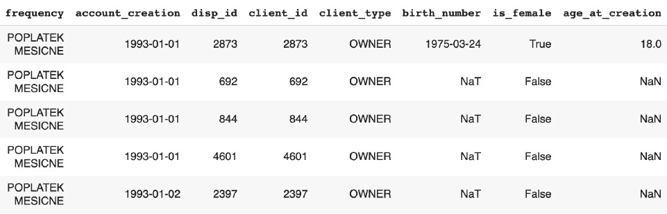

图 12.46：期望输出与合并行

注意

这个活动的解决方案可以在以下地址找到：[`packt.live/2GbJloz`](https://packt.live/2GbJloz).

## 概要

我们首先学习了如何分析数据集并通过数据汇总和数据可视化对其数据进行深入理解。这对于发现数据集的限制和识别数据质量问题非常有用。我们看到如何使用`pandas`的 API 来处理和修复一些最常见的问题（重复行、类型转换、值替换和缺失值）。

最后，我们介绍了几种特征工程技术。不可能涵盖所有用于创建特征的现有技术。本章的目标是介绍可以显著提高分析质量和模型性能的关键步骤。但是请记住，在数据转换过于激进之前，务必定期与业务或数据工程团队联系以确认。准备数据集并不总是意味着拥有最干净的数据集，而是获得最接近业务感兴趣的真实信息的数据集。否则，您可能会发现不正确或无意义的模式。正如我们所说，*伴随着巨大的权力而来的是巨大的责任*。

下一章将开启本书呈现数据科学应用案例的新篇章。*第十三章*，*不平衡数据集*，将通过一个不平衡数据集的示例来引导你如何处理这种情况。
