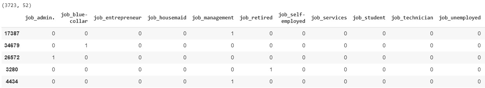

# 第十三章：13\. 不平衡数据集

概述

到本章结束时，您将能够识别数据集可能不平衡的用例；制定处理不平衡数据集的策略；在平衡数据集后构建分类模型，例如逻辑回归模型；并分析分类指标以验证所采用的策略是否产生了期望的结果。

在本章中，您将处理非常常见于现实场景中的不平衡数据集。您将使用`SMOTE`、`MSMOTE`和随机欠采样等技术来解决不平衡数据集问题。

# 介绍

在前一章节*第十二章*，*特征工程*中，我们处理与日期相关的数据点，我们正在处理与特征相关的场景。在本章中，我们将处理整体数据集中例子比例构成挑战的情况。

让我们重新审视我们在*第三章*，*二元分类*中处理的数据集，即针对'否'存款的例子远远超过了'是'的例子，比例为 88%对 12%。我们还确定，导致该数据集上逻辑回归模型表现不佳的原因之一是示例的倾斜比例。像我们在*第三章*，*二元分类*中分析过的那种数据集，称为不平衡数据集，在真实世界的用例中非常普遍。

我们遇到不平衡数据集的一些用例包括以下情况：

+   信用卡或保险理赔的欺诈检测

+   在医疗诊断中，我们必须检测罕见疾病的存在

+   网络入侵检测

在所有这些用例中，我们可以看到我们真正想要检测的将是少数情况。例如，在医疗诊断罕见疾病的领域，存在罕见疾病的例子甚至可能少于总例子的 1%。不平衡数据集用例的一个固有特征是，如果没有使用正确的度量标准，分类器的质量并不明显。这使得不平衡数据集的问题确实具有挑战性。

在本章中，我们将讨论识别不平衡数据集的策略以及缓解不平衡数据集影响的方法。

# 理解业务背景

作为数据科学家为一家银行工作，最近业务负责人对您在*第三章*，*二元分类*中构建的存款倾向模型的结果提出了警告。观察到，大部分被识别为潜在目标市场的客户，最终拒绝了提供的服务。这已经对销售团队的交叉销售和增值销售的业绩指标造成了重大影响。业务团队急需您的帮助来解决这个问题，以达到本季度的销售目标。不过，别担心，这是我们将在本章后期解决的问题。

首先，我们从分析问题开始。

## 练习 13.01：对数据集上的逻辑回归模型进行基准测试

在本练习中，我们将分析预测客户是否会购买定期存款的问题。为此，你将拟合一个逻辑回归模型，就像在*第三章*，*二元分类*中做的那样，并且你将仔细观察各项指标：

注意

你将在本练习中使用的数据集可以在我们的 GitHub 仓库找到：[`packt.live/2twFgIM`](https://packt.live/2twFgIM)。

1.  在 Google Colab 中打开一个新的笔记本。

1.  接下来，`import` `pandas` 并从 GitHub 仓库加载数据：

    ```py
    import pandas as pd
    filename = 'https://raw.githubusercontent.com/PacktWorkshops'\
               '/The-Data-Science-Workshop/master/'\
               'Chapter13/Dataset/bank-full.csv'
    ```

1.  现在，使用 `pandas` 加载数据

    ```py
    #Loading the data using pandas
    bankData = pd.read_csv(filename,sep=";")
    bankData.head()
    ```

    你的输出将如下所示：

    

    图 13.1：bankData 的前五行

    现在，为了进一步分解数据集，让我们执行一些特征工程步骤。

1.  通过缩放对数值特征（年龄、余额和时长）进行归一化，这在*第三章*，*二元分类*中已经讲解过。请输入以下代码：

    ```py
    from sklearn.preprocessing import RobustScaler
    rob_scaler = RobustScaler()
    ```

    在上面的代码片段中，我们使用了一个名为 `RobustScaler()` 的缩放函数来缩放数值数据。`RobustScaler()` 是一个类似于*第三章*，*二元分类*中的 `MinMaxScaler` 的缩放函数。

1.  在缩放数值数据后，我们将每一列转换为缩放版，如下所示的代码片段：

    ```py
    # Converting each of the columns to scaled version
    bankData['ageScaled'] = rob_scaler.fit_transform\
                            (bankData['age'].values.reshape(-1,1))
    bankData['balScaled'] = rob_scaler.fit_transform\
                            (bankData['balance']\
                             .values.reshape(-1,1))
    bankData['durScaled'] = rob_scaler.fit_transform\
                            (bankData['duration']\
                             .values.reshape(-1,1))
    ```

1.  现在，使用 `.drop()` 函数删除原始特征，然后引入缩放特征：

    ```py
    # Dropping the original columns
    bankData.drop(['age','balance','duration'], \
                  axis=1, inplace=True)
    ```

1.  使用 `.head()` 函数显示前五列：

    ```py
    bankData.head()
    ```

    输出如下所示：

    

    图 13.2：带有缩放特征的 bankData

    数据集中的分类特征必须通过将其转换为虚拟变量来转换为数值，这在*第三章*，*二元分类*中已经介绍过。

1.  使用 `.get_dummies()` 函数将所有分类变量转换为虚拟变量：

    ```py
    bankCat = pd.get_dummies(bankData[['job','marital','education',\
                                       'default','housing','loan',\
                                       'contact','month',\
                                       'poutcome']])
    ```

1.  分离数值数据并观察其形状：

    ```py
    bankNum = bankData[['ageScaled','balScaled','day',\
                        'durScaled','campaign','pdays','previous']]
    bankNum.shape
    ```

    输出将如下所示：

    ```py
    (45211, 7)
    ```

    在转换分类变量后，必须将其与数据框的缩放数值结合，以获得特征工程化的数据集。

1.  从合并的数据集中创建独立变量 `X` 和依赖变量 `Y` 以供建模，如下代码片段所示：

    ```py
    # Merging with the original data frame
    # Preparing the X variables
    X = pd.concat([bankCat, bankNum], axis=1)
    print(X.shape)
    # Preparing the Y variable
    Y = bankData['y']
    print(Y.shape)
    X.head()
    ```

    输出如下所示：

    

    图 13.3：独立变量和合并数据（截断）

    我们现在已经准备好进行建模任务。让我们首先导入所需的包。

1.  现在，从 `sklearn` 中 `import` 所需的 `train_test_split()` 和 `LogisticRegression` 函数：

    ```py
    from sklearn.model_selection import train_test_split
    from sklearn.linear_model import LogisticRegression
    ```

1.  在拆分函数中将数据分为训练集和测试集，设置 `test_size = 0.3`。我们还设置了 `random_state` 来确保代码的可重复性：

    ```py
    X_train, X_test, y_train, y_test = train_test_split\
                                       (X, Y, test_size=0.3, \
                                        random_state=123)
    ```

1.  现在，使用 `.fit` 在训练数据上拟合模型：

    ```py
    # Defining the LogisticRegression function
    bankModel = LogisticRegression()
    bankModel.fit(X_train, y_train)
    ```

    你的输出应如下所示：

    

    图 13.4：拟合模型

    现在模型已经拟合，接下来我们对测试集进行预测并生成指标。

1.  接下来，找到测试集上的预测结果并打印准确度分数：

    ```py
    pred = bankModel.predict(X_test)
    print('Accuracy of Logistic regression model prediction on '\
          'test set: {:.2f}'\
          .format(bankModel.score(X_test, y_test)))
    ```

    你应该得到如下输出：

    ```py
    Accuracy of Logistic regression model prediction on test set: 0.90
    ```

1.  现在，使用 `confusion_matrix()` 和 `classification_report()` 两个函数生成进一步分析的指标，详细内容将在*结果分析*部分中讨论：

    ```py
    # Confusion Matrix for the model
    from sklearn.metrics import confusion_matrix
    confusionMatrix = confusion_matrix(y_test, pred)
    print(confusionMatrix)
    from sklearn.metrics import classification_report
    print(classification_report(y_test, pred))
    ```

    你应该得到如下输出：

    

图 13.5：显示准确度结果及混淆矩阵的指标

注意

你将得到类似以下的指标。然而，由于建模过程中的变异性，数值会有所不同。

在这次练习中，我们发现了一份报告，可能导致了预期购买定期存款计划的客户数量出现问题。从指标中，我们可以看到 `No` 的值相对比 `Yes` 的值要高。

注意

要访问此特定部分的源代码，请参阅 [`packt.live/3hapnvB`](https://packt.live/3hapnvB)。

你也可以在线运行这个例子，访问 [`packt.live/3hh6Xta`](https://packt.live/3hh6Xta)。

为了更好地理解结果偏差的原因，我们将在接下来的部分详细分析这些指标。

## 结果分析

为了分析在上一部分中获得的结果，让我们将混淆矩阵扩展成以下形式：


图 13.6：结果指标的混淆矩阵

我们从前一个练习中获得的输出中输入了值 `11707`、`291`、`1060` 和 `506`。然后我们将这些值按图示方式排列。我们将表示选择定期存款（`No`）的倾向作为正类，其他作为负类。因此，从混淆矩阵中，我们可以计算出准确度度量，这些内容在*第三章*，*二元分类*中有介绍。模型的准确度由以下公式给出：


图 13.7：模型的准确度

在我们的例子中，它将是（11707 + 506）/（11707 + 1060 + 291 + 506），即 90%。

从准确度的角度来看，模型似乎做得不错。然而，现实可能大不相同。为了找出实际情况，我们来看看精确度和召回率值，这些值可以从我们获得的分类报告中得到。任何类别的精确度公式在*第三章*，*二元分类*中有介绍。

任何类别的精确度值由以下公式给出：


图 13.8：模型的精确度

在我们的例子中，对于正类，精确度是 *TP/(TP + FP)*，即 11707 / (11707 + 1060)，大约为 92%。

对于负类，精度可以写作 *TN / (TN + FN)*，即 506 / (506 + 291)，大约为 63%。

类似地，任何类别的召回率都可以表示如下：


图 13.9：召回模型

正类的召回率，*TP / (TP + FN)* = 11707 / (11707 + 291)，大约为 98%。

负类的召回率，*TN / (TN + FP)* = 506 / (506 + 1060)，大约为 32%。

召回率表示分类器正确识别各类别的能力。从这些指标中我们可以看到，我们构建的模型在识别正类方面表现良好，但在正确识别负类方面表现很差。

你认为分类器为什么会偏向于某一类？这个问题的答案可以通过查看训练集中各类别的平衡情况来揭示。

以下代码将生成训练数据中各类别的百分比：

```py
print('Percentage of negative class :',\
      (y_train[y_train=='yes'].value_counts()\
       /len(y_train) ) * 100)
print('Percentage of positive class :',\
      (y_train[y_train=='no'].value_counts()\
       /len(y_train) ) * 100)
```

你应该得到以下输出：

```py
Percentage of negative class: yes    11.764148
Name: y, dtype: float64
Percentage of positive class: no    88.235852
Name: y, dtype: float64
```

从中我们可以看到，大多数训练集（88%）由正类组成。这种不平衡是我们选择的逻辑回归分类器表现不佳的主要原因之一。

现在，让我们来看一下不平衡数据集的挑战。

# 不平衡数据集的挑战

从分类器的例子中可以看出，不平衡数据集的最大挑战之一是对多数类的偏向，在上一个例子中这个偏向为 88%。这将导致次优的结果。然而，更具挑战性的是，如果不使用正确的指标，结果会具有欺骗性。

假设我们有一个数据集，其中负类约占 99%，正类约占 1%（例如，用于检测一种罕见疾病的情况）。

看一下下面的代码片段：

```py
Data set Size: 10,000 examples
Negative class : 9910
Positive Class : 90
```

假设我们有一个差的分类器，它只能预测负类；我们将得到如下的混淆矩阵：


图 13.10：差的分类器的混淆矩阵

从混淆矩阵中，我们来计算准确性指标。看一下下面的代码片段：

```py
# Classifier biased to only negative class
Accuracy = (TP + TN ) / ( TP + FP + FN + TN)
 = (0 + 9900) / ( 0 + 0 + 90 + 9900) = 9900/10000
 = 99%
```

使用这样的分类器，如果我们使用像准确率这样的指标，我们仍然会得到大约 99% 的结果，在正常情况下这看起来很出色。然而，在这种情况下，分类器的表现很差。想一想使用这样的分类器和像准确率这样的指标的现实影响。对于罕见疾病的患者，错误地将其分类为没有疾病可能是致命的。

因此，识别不平衡数据集的情况非常重要，同时选择正确的度量标准来分析这些数据集同样重要。在本例中，正确的度量标准应该是查看两个类别的召回值：

```py
Recall Positive class  = TP / ( TP + FN ) = 0 / ( 0 + 90)
 = 0
Recall Negative Class = TN / ( TN + FP) = 9900 / ( 9900 + 0)
= 100%
```

从召回值来看，我们本可以识别出分类器对多数类的偏倚，这促使我们查看缓解此类偏倚的策略，这是我们接下来要关注的主题。

# 应对不平衡数据集的策略

现在我们已经识别出不平衡数据集的挑战，接下来让我们看一下应对不平衡数据集的策略：


图 13.11：应对不平衡数据集的策略

## 收集更多数据

在遇到不平衡数据集时，你需要问的第一个问题是，是否有可能获取更多的数据。这看起来可能有些天真，但收集更多的数据，尤其是来自少数类的数据，然后再平衡数据集，应该是解决类别不平衡的首要策略。

## 重采样数据

在许多情况下，收集更多的数据，尤其是来自少数类的数据，可能是一个挑战，因为少数类的数据点通常非常稀少。在这种情况下，我们需要采用不同的策略来应对我们的约束条件，并努力平衡数据集。一种有效的策略是对数据集进行重采样，使数据集更加平衡。重采样意味着从现有数据集中提取样本，以创建一个新的数据集，从而使新数据集更加平衡。

让我们详细了解一下这个思想：


图 13.12：对多数类进行随机欠采样

如*图 13.8*所示，重采样的思想是从多数类中随机选取样本，以使最终的数据集更加平衡。在该图中，我们可以看到少数类的样本数量与原始数据集相同，而多数类则被欠采样，从而使最终的数据集更加平衡。这种类型的重采样被称为随机欠采样，因为我们是在对多数类进行欠采样。在接下来的练习中，我们将执行随机欠采样。

## 练习 13.02：在我们的银行数据集上实现随机欠采样和分类，以找到最佳结果

在本次练习中，你将对多数类（倾向性为 `'No'`）进行欠采样，然后使数据集平衡。在新的平衡数据集上，你将拟合一个逻辑回归模型，并分析结果：

注意

你将在本次练习中使用的数据集可以在我们的 GitHub 仓库中找到：[`packt.live/2twFgIM`](https://packt.live/2twFgIM)。

1.  为本次练习打开一个新的 Colab 笔记本。

1.  执行 *练习 13.01* 的前 12 步，*在数据集上对逻辑回归模型进行基准测试*，以便将数据集拆分为训练集和测试集。

1.  现在，先将 `X` 和 `y` 变量合并成训练集，之后再进行重采样：

    ```py
    """
    Let us first join the train_x and train_y for ease of operation
    """
    trainData = pd.concat([X_train,y_train],axis=1)
    ```

    在此步骤中，我们将 `X_train` 和 `y_train` 数据集合并为一个数据集。这是为了使后续的重采样过程更简单。合并这两个数据集时，我们使用 `pandas` 中的 `.concat()` 函数。在代码中，我们使用 `axis = 1` 表示沿列方向水平合并。

1.  现在，使用 `.head()` 函数显示新数据：

    ```py
    trainData.head()
    ```

    你应该得到以下输出：

    

    图 13.13：使用 .head() 显示数据集的前五行

    上述输出显示了数据集中的一些列。

    现在，让我们开始将少数类别和多数类别分开到不同的数据集中。

    接下来，我们将分离少数类别和多数类别。这是必要的，因为我们必须分别从多数类别中采样，以构建平衡的数据集。要分离少数类别，我们必须识别数据集中标记为“yes”的索引。可以使用 `.index()` 函数来识别这些索引。

    一旦识别出这些索引，它们将被从主数据集中分离出来，并使用 `.loc()` 函数存储在一个新的变量中，表示少数类别。少数类别数据集的形状也会被打印出来。对于多数类别，执行类似的过程，完成这两个步骤后，我们将得到两个数据集：一个是少数类别数据集，一个是多数类别数据集。

1.  接下来，找到样本数据集中倾向为 `yes` 的索引：

    ```py
    ind = trainData[trainData['y']=='yes'].index
    print(len(ind))
    ```

    你应该得到以下输出：

    ```py
    3723
    ```

1.  按照以下代码片段分离少数类别：

    ```py
    minData = trainData.loc[ind]
    print(minData.shape)
    ```

    你应该得到以下输出：

    ```py
    (3723, 52)
    ```

1.  现在，找到多数类别的索引：

    ```py
    ind1 = trainData[trainData['y']=='no'].index
    print(len(ind1))
    ```

    你应该得到以下输出：

    ```py
    27924
    ```

1.  按照以下代码片段分离多数类别：

    ```py
    majData = trainData.loc[ind1]
    print(majData.shape)
    majData.head()
    ```

    你应该得到以下输出：

    

    图 13.14：分离多数类别后的输出

    一旦大多数类别被分离出来，我们就可以开始从大多数类别中进行采样。一旦采样完成，大多数类别数据集的形状及其头部将被打印出来。

    随机采样的数量应与少数类别的长度相等，以使数据集保持平衡。

1.  使用 `.sample()` 函数提取样本：

    ```py
    majSample = majData.sample(n=len(ind),random_state = 123)
    ```

    采样的例子数量等于少数类别的例子数量。这是通过参数 `(n=len(ind))` 实现的。

1.  现在，采样完成后，大多数类别数据集的形状及其头部将被打印出来：

    ```py
    print(majSample.shape)
    majSample.head()
    ```

    你应该得到以下输出：

    

    图 13.15：显示多数类数据集形状的输出

    现在，我们继续准备新的训练数据

1.  准备好各个数据集后，我们可以使用`pd.concat()`函数将它们连接在一起：

    ```py
    """
    Concatenating both data sets and then shuffling the data set
    """
    balData = pd.concat([minData,majSample],axis = 0)
    ```

    注意

    在这种情况下，我们是在垂直方向上进行连接，因此使用`axis = 0`。

1.  现在，使用`shuffle()`函数打乱数据集，使少数类和多数类均匀分布：

    ```py
    # Shuffling the data set
    from sklearn.utils import shuffle
    balData = shuffle(balData)
    balData.head()
    ```

    您应该得到以下输出：

    

    图 13.16：打乱数据集后的输出

1.  现在，将打乱的数据集分为自变量`X_trainNew`和因变量`y_trainNew`。可以使用`.iloc()`函数，在`pandas`中通过索引特征`0`到`51`来分离因变量。因变量通过子集化列名`'y'`来分离：

    ```py
    # Making the new X_train and y_train
    X_trainNew = balData.iloc[:,0:51]
    print(X_trainNew.head())
    y_trainNew = balData['y']
    print(y_trainNew.head())
    ```

    您应该得到以下输出：

    

    图 13.17：将数据集打乱为自变量

    现在，将模型拟合到新数据上，并生成混淆矩阵和分类报告供我们分析。

1.  首先，定义`LogisticRegression`函数，代码如下：

    ```py
    from sklearn.linear_model import LogisticRegression
    bankModel1 = LogisticRegression()
    bankModel1.fit(X_trainNew, y_trainNew)
    ```

    您应该得到以下输出：

    

    图 13.18：拟合模型

1.  接下来，使用以下代码片段对测试数据进行预测：

    ```py
    pred = bankModel1.predict(X_test)
    print('Accuracy of Logistic regression model prediction on '\
          'test set for balanced data set: {:.2f}'\
          .format(bankModel1.score(X_test, y_test)))
    ```

    您应该得到以下输出：

    ```py
    Accuracy of Logistic regression model prediction on test set for balanced data set:0.83
    ```

    `'{:.2f}'.format`用于打印字符串值以及准确率分数，这是通过`bankModel1.score(X_test, y_test)`输出的。在这里，`2f`表示带有两位小数的数值分数。

1.  现在，生成模型的混淆矩阵并打印结果：

    ```py
    from sklearn.metrics import confusion_matrix
    confusionMatrix = confusion_matrix(y_test, pred)
    print(confusionMatrix)
    from sklearn.metrics import classification_report
    print(classification_report(y_test, pred))
    ```

    您应该得到以下输出：

    

图 13.19：模型的混淆矩阵

注意

输出中的值可能会有所不同，因为建模过程会受到变化的影响。

要访问该特定部分的源代码，请参阅[`packt.live/348njjY`](https://packt.live/348njjY)。

您也可以在线运行此示例，网址为[`packt.live/318R81I`](https://packt.live/318R81I)。

## 分析

让我们分析结果并与我们在本章开始时构建的基准逻辑回归模型进行比较。在基准模型中，我们面临着模型偏向于多数类，且`yes`类的召回率非常低的问题。

通过平衡数据集，我们发现少数类的召回率大幅提高，从`0.32`增加到大约`0.82`。这意味着通过平衡数据集，分类器在识别负例方面的能力得到了提升。

然而，我们可以看到整体准确率出现了下降。从大约 90%的高准确率下降到约 85%。准确率下降的一个主要原因是虚假正例的数量增加了，即那些错误地预测为`Yes`的`No`案例。

从业务角度分析结果，这比我们在基准模型中得到的结果要好得多。在基准模型中，1,566 个`Yes`案例中，只有 506 个被正确识别。然而，在平衡数据集后，我们能够从 1,566 个数据中识别出 1,277 个可能购买定期存款的客户，这可能带来更高的转化率。然而，另一方面，销售团队还需要花费大量时间处理那些不太可能购买定期存款的客户。从混淆矩阵中，我们可以看到虚假负例的数量从基准模型中的 291 个上升到了 1,795 个。理想情况下，我们希望第二和第三象限的数量下降，以便有利于另外两个象限。

# 生成合成样本

在前一部分中，我们讨论了欠采样方法，通过缩小多数类样本来平衡数据集。然而，使用欠采样时，我们减少了数据集的大小。在许多情况下，缩小数据集可能会对分类器的预测能力产生不利影响。应对数据集缩小的有效方法是过采样少数类。过采样是通过生成类似于少数类的合成数据点来实现，从而平衡数据集。

生成此类合成点的两种非常流行的方法是：

+   **合成少数类过采样技术** (**SMOTE**)

+   **修改后的 SMOTE** (**MSMOTE**)

`SMOTE`算法生成合成数据的方式是通过观察少数类的邻域，并在邻域内生成新的数据点：


](img/B15019_13_20.jpg)

图 13.20：包含两类数据集

让我们通过图示来解释生成合成数据集的概念。假设*图 13.15*表示一个包含两类的 dataset：灰色圆圈代表少数类，黑色圆圈代表多数类。

在创建合成点时，会创建一条连接所有少数类样本的假想线，并在这条线上生成新的数据点，如*图 13.16*所示，从而平衡数据集：


](img/B15019_13_21.jpg)

图 13.21：连接邻域中的样本

然而，`MSMOTE`是对`SMOTE`算法的改进，并且在生成合成点的方式上有所不同。`MSMOTE`将少数类分为三组：**安全样本**、**边界样本**和**潜在噪声样本**。根据每个少数类所属的组，采用不同的策略来生成邻域点。

我们将在接下来的部分中看到`SMOTE`和`MSMOTE`的实现。

## 实现 SMOTE 和 MSMOTE

`SMOTE`和`MSMOTE`可以通过一个名为`smote-variants`的包在 Python 中实现。该库可以通过在 Colab 笔记本中使用`pip install`进行安装，如下所示：

```py
!pip install smote-variants
```

注意

更多关于该包及其不同版本的详细信息，请访问 [`packt.live/2QsNhat`](https://packt.live/2QsNhat)。

现在让我们实现这两种方法并分析结果。

## 练习 13.03：在我们的银行数据集上实现 SMOTE，以找到最佳结果

在本练习中，我们将使用`SMOTE`生成少数类的合成样本，并使数据集达到平衡。然后，在新的平衡数据集上，我们将拟合一个逻辑回归模型并分析结果：

1.  实现*练习 13.01*、*在数据集上基准化逻辑回归模型*的所有步骤，直到拆分训练集和测试集（*步骤 12*）。

1.  现在，在我们进行过采样之前，打印两个类的计数：

    ```py
    # Shape before oversampling
    print("Before OverSampling count of yes: {}"\
          .format(sum(y_train=='yes')))
    print("Before OverSampling count of no: {} \n"\
          .format(sum(y_train=='no')))
    ```

    你应该会看到以下输出：

    ```py
    Before OverSampling count of yes: 3694
    Before OverSampling count of no: 27953
    ```

    注意

    这个输出中提到的计数可能会有所不同，因为采样过程具有变异性。

    接下来，我们将使用`SMOTE`对训练集进行过采样。

1.  首先导入`sv`和`numpy`：

    ```py
    !pip install smote-variants
    import smote_variants as sv
    import numpy as np
    ```

    用于对训练集进行过采样的库文件包括我们之前安装的`smote_variants`库，它被导入为`sv`。另一个需要的库是`numpy`，因为训练集必须提供一个`numpy`数组给`smote_variants`库。

1.  现在，使用`sv.SMOTE()`函数将`SMOTE`库实例化为一个名为`oversampler`的变量：

    ```py
    # Instantiating the SMOTE class
    oversampler= sv.SMOTE()
    ```

    这是实例化`smote_variants`库中任何`SMOTE`变体的常见方式。

1.  现在，使用`oversampler`的`.sample()`函数对过程进行采样：

    ```py
    # Creating new training set
    X_train_os, y_train_os = oversampler.sample\
                             (np.array(X_train), np.array(y_train))
    ```

    注意

    在应用`.sample()`函数之前，`X`和`y`变量都已转换为`numpy`数组。

1.  现在，打印新`X`和`y`变量的形状，以及各类的`counts`。你会注意到，整体数据集的大小从先前约 31,647（3694 + 27953）增加到了 55,906。大小的增加可以归因于少数类的过采样，从 3,694 增加到 27,953：

    ```py
    # Shape after oversampling
    print('After OverSampling, the shape of train_X: {}'\
          .format(X_train_os.shape))
    print('After OverSampling, the shape of train_y: {} \n'\
          .format(y_train_os.shape))
    print("After OverSampling, counts of label 'Yes': {}"\
          .format(sum(y_train_os=='yes')))
    print("After OverSampling, counts of label 'no': {}"\
          .format(sum(y_train_os=='no')))
    ```

    你应该会看到以下输出：

    ```py
    After OverSampling, the shape of train_X: (55906, 51)
    After OverSampling, the shape of train_y: (55906,) 
    After OverSampling, counts of label 'Yes': 27953
    After OverSampling, counts of label 'no': 27953
    ```

    注意

    这个输出中提到的计数可能会有所不同，因为采样过程具有变异性。

    现在，我们使用`SMOTE`生成了合成点并平衡了数据集，让我们在新的样本上拟合逻辑回归模型，并使用混淆矩阵和分类报告分析结果。

1.  定义`LogisticRegression`函数：

    ```py
    # Training the model with Logistic regression model
    from sklearn.linear_model import LogisticRegression
    bankModel2 = LogisticRegression()
    bankModel2.fit(X_train_os, y_train_os)
    ```

1.  现在，在测试集上使用`.predict`进行预测，如以下代码片段所示：

    ```py
    pred = bankModel2.predict(X_test)
    ```

1.  接下来，`print`准确度值：

    ```py
    print('Accuracy of Logistic regression model prediction on '\
          'test set for Smote balanced data set: {:.2f}'\
          .format(bankModel2.score(X_test, y_test)))
    ```

    你的输出应如下所示：

    ```py
    Accuracy of Logistic regression model prediction on test set for Smote balanced data set: 0.83
    ```

1.  然后，为模型生成`ConfusionMatrix`：

    ```py
    from sklearn.metrics import confusion_matrix
    confusionMatrix = confusion_matrix(y_test, pred)
    print(confusionMatrix)
    ```

    矩阵如下所示：

    ```py
    [[10042  1956]
     [  306  1260]]
    ```

1.  为模型生成`Classification_report`：

    ```py
    from sklearn.metrics import classification_report
    print(classification_report(y_test, pred))
    ```

    你应该得到以下输出：

    

    ](img/B15019_13_22.jpg)

图 13.22：模型的分类报告

从生成的指标中，我们可以看到结果与欠采样结果非常相似，唯一不同的是，`'Yes'`类的召回值从`0.82`下降到了大约`0.80`。生成的结果会因使用案例的不同而有所变化。`SMOTE`及其变种已被证明在数据平衡方面具有强大的效果，因此在遇到高度不平衡数据的使用案例时，成为最受欢迎的方法。

注意

输出值可能有所变化，因为建模过程本身会有波动。

要访问该特定部分的源代码，请参考[`packt.live/2Ycxu34`](https://packt.live/2Ycxu34)。

你也可以在线运行此示例，访问[`packt.live/2FDvTgo`](https://packt.live/2FDvTgo)。

在下一个练习中，我们将实现`MSMOTE`。

## 练习 13.04：在我们的银行数据集上实现 MSMOTE 以找到最佳结果

在这个练习中，我们将使用`MSMOTE`生成少数类的合成样本，然后使数据集平衡。接着，在新的平衡数据集上，我们将拟合一个逻辑回归模型并分析结果。这个练习将与之前的练习非常相似。

1.  实现*练习 13.01*的所有步骤，*基准化逻辑回归模型在数据集上的表现*，直到训练集和测试集的拆分（*步骤 12*）。

1.  现在，打印我们进行过采样前两类的计数：

    ```py
    # Shape before oversampling
    print("Before OverSampling count of yes: {}"\
          .format(sum(y_train=='yes')))
    print("Before OverSampling count of no: {} \n"\
          .format(sum(y_train=='no')))
    ```

    你应该得到以下输出：

    ```py
    Before OverSampling count of yes: 3723
    Before OverSampling count of no: 27924
    ```

    注意

    输出中提到的计数值可能会有所不同，因为采样过程具有变异性。

    接下来，我们将使用`MSMOTE`对训练集进行过采样。

1.  开始时导入`sv`和`numpy`：

    ```py
    !pip install smote-variants
    import smote_variants as sv
    import numpy as np
    ```

    用于对训练集进行过采样的库文件包括我们之前安装的`smote_variants`库，已作为`sv`导入。另一个必需的库是`numpy`，因为训练集需要提供`numpy`数组供`smote_variants`库使用。

1.  现在，通过`sv.MSMOTE()`函数将`MSMOTE`库实例化为一个名为`oversampler`的变量：

    ```py
    # Instantiating the MSMOTE class
    oversampler= sv.MSMOTE()
    ```

1.  现在，使用`oversampler`的`.sample()`函数对过程进行采样：

    ```py
    # Creating new training set
    X_train_os, y_train_os = oversampler.sample\
                             (np.array(X_train), np.array(y_train))
    # Shape after oversampling
    print('After OverSampling, the shape of train_X: {}'\
          .format(X_train_os.shape))
    print('After OverSampling, the shape of train_y: {} \n'\
          .format(y_train_os.shape))
    print("After OverSampling, counts of label 'Yes': {}"\
          .format(sum(y_train_os=='yes')))
    print("After OverSampling, counts of label 'no': {}"\
          .format(sum(y_train_os=='no')))
    ```

    你应该得到以下输出：

    ```py
    After OverSampling, the shape of train_X: (55848, 51)
    After OverSampling, the shape of train_y: (55848,) 
    After OverSampling, counts of label 'Yes': 27924
    After OverSampling, counts of label 'no': 27924
    ```

    现在，我们已经使用`MSMOTE`生成了合成样本并平衡了数据集，接下来让我们在新样本上拟合逻辑回归模型，并使用混淆矩阵和分类报告分析结果。

1.  定义`LogisticRegression`函数：

    ```py
    # Training the model with Logistic regression model
    from sklearn.linear_model import LogisticRegression
    # Defining the LogisticRegression function
    bankModel3 = LogisticRegression()
    bankModel3.fit(X_train_os, y_train_os)
    ```

1.  现在，像下面的代码片段一样，在测试集上使用`.predict`进行预测：

    ```py
    pred = bankModel3.predict(X_test)
    ```

1.  接下来，`print`精度值：

    ```py
    print('Accuracy of Logistic regression model prediction on '\
          'test set for MSMOTE balanced data set: {:.2f}'\
          .format(bankModel3.score(X_test, y_test)))
    ```

    你应该得到以下输出：

    ```py
    Accuracy of Logistic regression model prediction on test set for MSMOTE balanced data set: 0.84
    ```

1.  为模型生成`ConfusionMatrix`：

    ```py
    from sklearn.metrics import confusion_matrix
    confusionMatrix = confusion_matrix(y_test, pred)
    print(confusionMatrix)
    ```

    矩阵应如下所示：

    ```py
    [[10167  1831]
     [  314  1252]]
    ```

1.  为模型生成`Classification_report`：

    ```py
    from sklearn.metrics import classification_report
    print(classification_report(y_test, pred))
    ```

    你应该得到以下输出：

    

图 13.23：模型的分类报告

注意

由于建模过程存在变动，输出的值可能会有所不同。

要访问此特定部分的源代码，请参阅 [`packt.live/34bCWHd`](https://packt.live/34bCWHd)。

你也可以在线运行此示例，网址是 [`packt.live/2Edccvh`](https://packt.live/2Edccvh)。

从`MSMOTE`的实现中可以看出，与*练习 13.03*中实现的`SMOTE`方法相比，指标有所下降，*练习 13.03*是*在我们的银行数据集上实现 SMOTE 以找到最佳结果*。因此，我们可以得出结论，`MSMOTE`可能不是该用例的最佳方法。

## 在电信数据集上应用平衡技术

现在我们已经看到了不同的平衡技术，接下来让我们将这些技术应用到一个与电信客户流失相关的新数据集上。该数据集可以通过以下链接获取：[`packt.live/37IvqSX`](https://packt.live/37IvqSX)。

该数据集包含与移动连接使用水平相关的各种变量，如总通话时长、通话费用、在某些时间段内拨打的电话、国际电话的详细信息以及拨打客户服务电话的详细信息。

问题陈述是预测客户是否会流失。这个数据集是高度不平衡的，其中客户流失的案例占少数。你将在接下来的活动中使用这个数据集。

## 活动 13.01：通过在电信流失数据集上拟合分类器来寻找最佳平衡技术

你在一家电信公司担任数据科学家。你遇到了一个高度不平衡的数据集，你希望在拟合分类器进行流失分析之前，先纠正类不平衡。你知道不同的纠正数据集不平衡的方法，并且你希望比较它们，以找出最适合的最佳方法，之后再拟合模型。

在这个活动中，你需要实现到目前为止遇到的所有三种方法，并比较结果。

注意

你将使用你在*第十章*，*分析数据集*中使用的电信流失数据集。

使用`MinMaxscaler`函数来缩放数据集，而不是你一直使用的鲁棒缩放器函数。通过拟合逻辑回归模型比较两种方法的结果。

步骤如下：

1.  实现所有初始步骤，包括安装 smote-variants 并使用 pandas 加载数据。

1.  使用我们在*第三章，二元分类*中学习的`MinMaxScaler()`函数规范化数值原始数据。

1.  使用`pd.get_dummies()`函数为分类变量创建虚拟数据。

1.  从原始数据框中分离数值数据。

1.  使用`pd.concat()`函数连接数值数据和虚拟分类数据。

1.  使用`train_test_split()`函数将早期的数据集拆分为训练集和测试集。

    由于数据集不平衡，你需要执行以下步骤中提到的各种技术。

1.  对于欠采样方法，使用`.index()`函数找到少数类的索引并分离少数类。然后，采样多数类并使用`.sample()`函数将多数数据集调整为与少数类相同的大小。将少数类和欠采样后的多数类合并，形成一个新的数据集。打乱数据集并分离`X`和`Y`变量。

1.  在欠采样的数据集上拟合一个逻辑回归模型，并命名为`churnModel1`。

1.  对于`SMOTE`方法，使用`sv.SMOTE()`函数创建过采样器，并创建新的`X`和`Y`训练集。

1.  使用`SMOTE`拟合逻辑回归模型，并命名为`churnModel2`。

1.  导入`smote-variant`库并使用`sv.MSMOTE()`函数实例化`MSMOTE`算法。

1.  使用过采样器创建过采样数据。请注意，`X`和`y`变量在过采样之前必须转换为`numpy`数组。

1.  使用`MSMOTE`数据集拟合逻辑回归模型，并将模型命名为`churnModel3`。

1.  为每个模型生成三个独立的预测。

1.  为每个预测生成单独的准确性度量、分类报告和混淆矩阵。

1.  分析结果并选择最佳方法。

**预期输出**：

你可以期待的最终指标将与这里看到的类似。

**欠采样输出**


图 13.24：欠采样输出报告

**SMOTE 输出**


图 13.25：SMOTE 输出报告

**MSMOTE 输出**


图 13.26：MSMOTE 输出报告

注意

由于建模是随机性的，你将获得不同的输出。

该活动的解决方案可以在此处找到：[`packt.live/2GbJloz`](https://packt.live/2GbJloz)。

# 总结

在本章中，我们学习了不平衡数据集和解决不平衡数据集的策略。我们介绍了会遇到不平衡数据集的应用场景。我们探讨了不平衡数据集所带来的挑战，并介绍了在不平衡数据集的情况下应使用的评估指标。我们制定了处理不平衡数据集的策略，并实现了不同的策略，如随机欠采样和过采样，用于平衡数据集。然后，在平衡数据集后，我们训练了不同的模型并分析了结果。

平衡数据集是一种提高分类器性能的非常有效的方法。然而，应该注意的是，平衡数据集可能会导致大类的整体准确度下降。应该根据问题陈述以及在这些问题陈述下进行严格实验后，来确定在不同情况下采取哪些策略。

学习了处理不平衡数据集的方法后，我们将介绍另一种在许多现代数据集中常见的重要技术——**降维**。降维的不同技术将在*第十四章*，*降维*中讨论。
