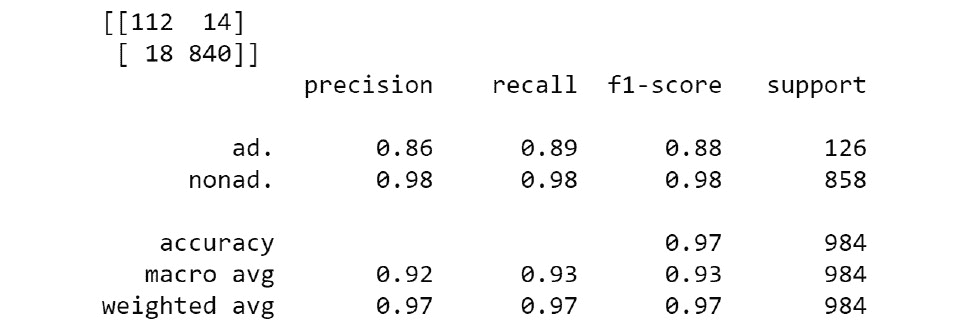
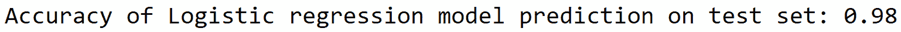
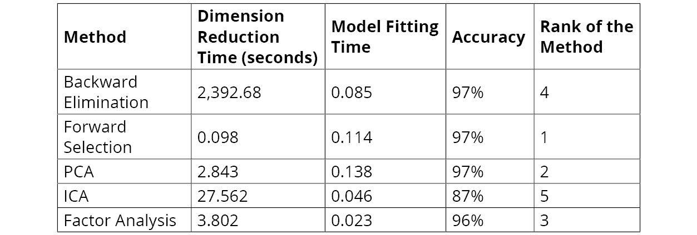

# 第十四章：14. 降维

概述

本章介绍了数据科学中的降维。你将使用互联网广告数据集来分析和评估不同的降维技术。在本章结束时，你将能够分析高维数据集并应对这些数据集带来的挑战。同时，你将应用不同的降维技术处理大型数据集，并基于这些数据集拟合模型并分析其结果。到本章结束时，你将能够处理现实世界中的巨型数据集。

# 介绍

在上一章关于数据集平衡的内容中，我们处理了银行营销数据集，该数据集有 18 个变量。我们能够非常轻松地加载该数据集，拟合模型并获得结果。但你是否考虑过，当你需要处理的变量数量非常大时，会是什么情况？例如，当变量数量达到 1800 万，而不是上一章中的 18 个时，你该如何加载如此庞大的数据集并进行分析？如何处理需要如此大量计算资源的建模问题？

这是一些现代数据集中在以下领域的现实：

+   医疗保健领域，其中遗传数据集可能有数百万个特征

+   高分辨率成像数据集

+   与广告、排名和爬取相关的网页数据

在处理如此庞大的数据集时，可能会出现许多挑战：

+   存储和计算挑战：高维的大型数据集需要大量的存储空间和昂贵的计算资源来进行分析。

+   探索挑战：在尝试探索数据并提取洞察时，高维数据可能非常繁琐。

+   算法挑战：许多算法在高维设置下扩展性较差。

那么，当我们必须处理高维数据时，解决方案是什么？这就是降维技术发挥作用的地方，本章将详细探讨这些技术。

降维的目的是减少数据集的维度，以克服高维数据所带来的挑战。在本章中，我们将探讨一些常见的降维技术：

+   反向特征消除或递归特征消除

+   正向特征选择

+   **主成分分析**（**PCA**）

+   **独立成分分析**（**ICA**）

+   因子分析

让我们首先检查一下我们的商业背景，然后将这些技术应用到问题陈述中。

## 商业背景

你公司市场部的负责人向你提出了一个她一直在处理的问题。许多客户投诉你公司网站在浏览过程中弹出广告太多，影响了他们的浏览体验。你公司希望在网页服务器上建立一个引擎，识别潜在的广告，并在广告弹出之前将其删除。

为了帮助您实现这一目标，我们提供了一个包含一组可能广告的数据集，这些广告出现在各种网页上。数据集的特征代表了可能广告的图像几何形状，以及 URL 中的短语、图像 URL、锚文本和锚文本附近的词汇。这个数据集已经被标注，每个可能的广告都被标注为是否为广告。使用此数据集，您需要构建一个模型来预测某个内容是否为广告。您可能认为这是一个相对简单的问题，可以使用任何二分类算法来解决。然而，数据集存在一个挑战：特征数量非常庞大。您已经开始着手解决这个高维数据集的挑战。

此数据集已上传到 GitHub 仓库，用于完成后续所有练习。数据集的属性可以通过以下链接访问：[`packt.live/36rqiCg`](https://packt.live/36rqiCg)。

## 练习 14.01：加载和清理数据集

在本练习中，我们将下载数据集，加载到 Colab 笔记本中，并进行一些基本的探索，例如使用 `.shape()` 和 `.describe()` 函数打印数据集的维度，同时还要清理数据集。

注意

`internet_ads` 数据集已上传到我们的 GitHub 仓库，并可通过 [`packt.live/2sPaVF6`](https://packt.live/2sPaVF6) 访问。

以下步骤将帮助您完成此练习：

1.  打开一个新的 Colab 笔记本文件。

1.  现在，将 `import pandas` 导入到您的 Colab 笔记本中：

    ```py
    import pandas as pd
    ```

1.  接下来，设置已上传 `ad.Data` 文件所在驱动器的路径，如以下代码片段所示：

    ```py
    # Defining file name of the GitHub repository
    filename = 'https://raw.githubusercontent.com'\
               '/PacktWorkshops/The-Data-Science-Workshop'\
               '/master/Chapter14/Dataset/ad.data'
    ```

1.  使用 pandas 数据框中的 `pd.read_csv()` 函数读取文件：

    ```py
    adData = pd.read_csv(filename,sep=",",header = None,\
                         error_bad_lines=False)
    adData.head()
    ```

    `pd.read_csv()` 函数的参数是文件名字符串和 CSV 文件的分隔符，通常是 `","`。请注意，由于数据集没有标题行，我们特别使用 `header = None` 命令来指定这一点。最后一个参数 `error_bad_lines=False` 是跳过文件格式中的任何错误，然后加载数据。

    读取文件后，使用 `.head()` 函数打印数据框。

    您应该得到以下输出：

    

    图 14.1：将数据加载到 Colab 笔记本中

1.  现在，打印数据集的形状，如以下代码片段所示：

    ```py
    # Printing the shape of the data
    print(adData.shape)
    ```

    您应该得到以下输出：

    ```py
    (3279, 1559)
    ```

    从数据的形状来看，我们可以看到特征数量非常大，共有 `1559` 个特征。

1.  使用 pandas 的 `.describe()` 函数查找原始数据的数值特征摘要，如以下代码片段所示：

    ```py
    # Summarizing the statistics of the numerical raw data
    adData.describe()
    ```

    您应该得到以下输出：

    

    图 14.2：将数据加载到 Colab 笔记本中

    如我们从数据的形状中看到的，数据集有`3279`个示例，`1559`个变量。变量集包含分类变量和数值变量。汇总统计仅针对数值数据得出。

1.  从我们的数据集中分离出因变量和自变量，如以下代码片段所示：

    ```py
    # Separate the dependent and independent variables
    # Preparing the X variables
    X = adData.loc[:,0:1557]
    print(X.shape)
    # Preparing the Y variable
    Y = adData[1558]
    print(Y.shape)
    ```

    你应该得到以下输出：

    ```py
    (3279, 1558)
    (3279, )
    ```

    如前所见，数据集中有`1559`个特征。前`1558`个特征是自变量。它们通过`.loc()`函数从初始的`adData`数据框中分离出来，并给出相应特征的索引（`0`到`1557`）。这些自变量被加载到一个新的变量`X`中。因变量，即数据集的标签，被加载到变量`Y`中。因变量和自变量的形状也被打印出来。

1.  打印自变量的前`15`个示例：

    ```py
    # Printing the head of the independent variables
    X.head(15)
    ```

    你可以通过在`head()`函数中定义数字来打印任意数量的行。在这里，我们打印了数据的前`15`行。

    输出如下：

    

    图 14.3：自变量的前 15 个示例

    从输出结果中，我们可以看到数据集存在许多缺失值，这些缺失值用`?`表示。为了进一步分析，我们必须去除这些特殊字符，并将这些单元格替换为假定值。替换特殊字符的一种常见方法是用相应特征的均值进行填充。我们就采用这种策略。然而，在此之前，让我们先查看这个数据集的变量类型，以便采用合适的替换策略。

1.  打印数据集的变量类型：

    ```py
    # Printing the data types
    print(X.dtypes)
    ```

    我们应该得到以下输出：

    

    图 14.4：我们数据集中的变量类型

    从输出结果中，我们可以看到前四列是对象类型，表示字符串数据，其他列则是整数数据。在替换数据中的特殊字符时，我们需要注意数据的类型。

1.  将前四列中的特殊字符替换为`NaN`值。

    将前四列（对象类型）的特殊字符替换为`NaN`值。`NaN`是“不是数字”（not a number）的缩写。用`NaN`值替换特殊字符使得后续填充数据变得更加容易。

    这是通过以下代码片段实现的：

    ```py
    """
    Replacing special characters in first 3 columns 
    which are of type object
    """
    for i in range(0,3):
        X[i] = X[i].str.replace("?", 'nan')\
                   .values.astype(float)
    print(X.head(15))
    ```

    为了替换前面三列，我们使用`for()`循环和`range()`函数来遍历这些列。由于前面三列的数据类型是`object`或`string`类型，我们使用`.str.replace()`函数，即“字符串替换”。在用`nan`替换数据中的特殊字符`?`后，我们通过`.values.astype(float)`函数将数据类型转换为`float`，这是进一步处理所必需的。通过打印前 15 个示例，我们可以看到所有特殊字符都已被`nan`或`NaN`值替换。

    你应该获得以下输出：

    

    图 14.5：替换特殊字符为 NaN 之后

1.  现在，替换整数特征中的特殊字符。

    如*步骤 9*所示，让我们使用以下代码片段，替换`int64`数据类型特征中的特殊字符：

    ```py
    """
    Replacing special characters in the remaining 
    columns which are of type integer
    """
    for i in range(3,1557):
        X[i] = X[i].replace("?", 'NaN').values.astype(float)
    ```

    注意

    对于整数特征，我们在`.replace()`函数前没有`.str`，因为这些特征是整数值，而不是字符串值。

1.  现在，为`NaN`值填充每列的均值。

    现在我们已经将数据中的特殊字符替换为`NaN`值，我们可以使用 pandas 中的`fillna()`函数将`NaN`值替换为该列的均值。可以使用以下代码片段来执行此操作：

    ```py
    import numpy as np
    # Impute the 'NaN'  with mean of the values
    for i in range(0,1557):
        X[i] = X[i].fillna(X[i].mean())
    print(X.head(15))
    ```

    在前面的代码片段中，`.mean()`函数计算每列的均值，然后用该列的均值替换`nan`值。

    你应该获得以下输出：

    

    图 14.6：NaN 列的均值

1.  使用`minmaxScaler()`函数对数据集进行缩放。

    与*第三章*，*二分类*中一样，缩放数据在建模步骤中是有用的。让我们按照*第三章*，*二分类*中学到的方法，使用`minmaxScaler()`函数对数据集进行缩放。

    如下代码片段所示：

    ```py
    # Scaling the data sets
    # Import library function
    from sklearn import preprocessing
    # Creating the scaling function
    minmaxScaler = preprocessing.MinMaxScaler()
    # Transforming with the scaler function
    X_tran = pd.DataFrame(minmaxScaler.fit_transform(X))
    # Printing the output
    X_tran.head() 
    ```

    你应该获得以下输出。这里，我们展示了前 24 列：

    

图 14.7：使用 MinMaxScaler()函数缩放数据集

注意

要访问此特定部分的源代码，请参阅[`packt.live/2Yi7Nym`](https://packt.live/2Yi7Nym)。

你也可以在[`packt.live/2Q6l9ZZ`](https://packt.live/2Q6l9ZZ)在线运行此示例。

你已经完成了第一个练习。在本练习中，我们加载了数据集，提取了汇总统计信息，清洗了数据，并且对数据进行了缩放。你可以看到，在最终输出中，所有原始值都已转换为缩放值。

在下一节中，让我们尝试通过添加更多的特征来增强这个数据集，使其成为一个庞大的数据集，然后在这个数据集上拟合一个简单的逻辑回归模型，作为基准模型。

让我们首先看一下如何通过示例增强数据。

# 创建高维数据集

在之前的部分，我们处理了一个约有`1,558`个特征的数据集。为了演示高维数据集的挑战，我们将从已有的互联网数据集中创建一个极高维度的数据集。

我们将通过多次复制现有特征的数量来实现这一点，使数据集变得非常大。为了复制数据集，我们将使用一个名为`np.tile()`的函数，它可以在我们指定的轴上多次复制数据框。我们还将使用`time()`函数来计算活动所需的时间。

让我们通过一个简单的例子来看一下这两个函数的作用。

你首先需要导入必要的库函数：

```py
import pandas as pd
import numpy as np
```

然后，为了创建一个虚拟数据框，我们将使用一个包含两行三列的小数据集作为示例。我们使用`pd.np.array()`函数来创建数据框：

```py
# Creating a simple data frame
df = pd.np.array([[1, 2, 3], [4, 5, 6]])
print(df.shape)
df
```

你应该获得以下输出：


图 14.8：示例虚拟数据框的数组

接下来，你将复制虚拟数据框，列的复制是通过以下代码片段中的`pd.np.tile()`函数来完成的：

```py
# Replicating the data frame and noting the time
import time
# Starting a timing function
t0=time.time()
Newdf = pd.DataFrame(pd.np.tile(df, (1, 5)))
print(Newdf.shape)
print(Newdf)
# Finding the end time
print("Total time:", round(time.time()-t0, 3), "s")
```

你应该获得以下输出：


图 14.9：数据框的复制

如片段所示，`pd.np.tile()`函数接受两组参数。第一组是我们要复制的数据框`df`，下一组参数`(1,5)`定义了我们要复制的轴。在这个示例中，我们定义行保持不变，因为参数是`1`，而列将被复制`5`次，因为参数是`5`。从`shape()`函数中我们可以看到，原始数据框形状为`(2,3)`，经过转换后变为形状为`(2,15)`的数据框。

总时间的计算是通过`time`库来完成的。为了开始计时，我们调用`time.time()`函数。在这个例子中，我们将初始时间存储在一个名为`t0`的变量中，然后从结束时间中减去它，得到该过程所需的总时间。因此，我们已经扩展并向现有的互联网广告数据集添加了更多的数据框。

## 活动 14.01：在高维数据集上拟合逻辑回归模型

你希望在数据集较大时测试模型的性能。为此，你将人工增大互联网广告数据集，使得数据集的维度比原始数据集大 300 倍。你将拟合一个逻辑回归模型，并观察结果。

**提示**：在本次活动中，我们将使用类似于*练习 14.01*、*加载和清理数据集*的笔记本，并且我们还将像*第三章*、*二元分类*中一样拟合一个逻辑回归模型。

注意

我们将在本次活动中使用相同的广告数据集。

`internet_ads` 数据集已上传到我们的 GitHub 仓库，并可以通过 [`packt.live/2sPaVF6`](https://packt.live/2sPaVF6) 访问。

完成此活动的步骤如下：

1.  打开一个新的 Colab 笔记本。

1.  实现 *练习 14.01*，*加载和清理数据集*，直到数据标准化的所有步骤。推导变换后的自变量 `X_tran`。

1.  使用 `pd.np.tile()` 函数将列复制 300 次来创建一个高维数据集。打印新数据集的形状并观察新数据集中的特征数量。

1.  将数据集拆分为训练集和测试集。

1.  在新数据集上拟合一个逻辑回归模型，并注意拟合模型所需的时间。注意你 Colab 笔记本中 RAM 指标的颜色变化。

    **预期输出**：

    在对新数据集拟合逻辑回归模型后，你应该得到类似以下的输出：

    ```py
    Total training time: 23.86 s
    ```

    

    图 14.10：Google Colab RAM 使用情况

1.  在测试集上进行预测，并打印分类报告和混淆矩阵。

    你应该得到以下输出：

    

图 14.11：混淆矩阵和分类报告结果

注意

该活动的解决方案可以在此处找到：[`packt.live/2GbJloz`](https://packt.live/2GbJloz)。

在这个活动中，你将通过复制现有数据库的列来创建一个高维数据集，并识别出该高维数据集的资源利用率非常高。由于维度较大，资源利用率指示器的颜色变为橙色。你还注意到，在该数据集上的建模时间较长，为 `23.86` 秒。你还会在测试集上进行预测，并使用逻辑回归模型得到大约 `97%` 的准确率。

首先，你需要了解为什么 Colab 上的 RAM 使用情况指示器变成了橙色。由于我们通过复制创建了一个庞大的数据集，Colab 必须使用访问 RAM，这导致颜色变为橙色。

但是，出于好奇，如果你将复制次数从 300 增加到 500，你认为这会对 RAM 使用情况产生什么影响呢？让我们来看一下以下示例。

注意

你不需要在你的 Colab 笔记本上执行此操作。

我们首先定义 GitHub 仓库中“ads”数据集的路径：

```py
# Defining the file name from GitHub
filename = 'https://raw.githubusercontent.com'\
           '/PacktWorkshops/The-Data-Science-Workshop'\
           '/master/Chapter14/Dataset/ad.data'
```

接下来，我们使用 pandas 加载数据：

```py
# import pandas as pd
# Loading the data using pandas
adData = pd.read_csv(filename,sep=",",header = None,\
                     error_bad_lines=False)
```

创建一个具有 `500` 缩放因子的高维数据集：

```py
# Creating a high dimension dataset
X_hd = pd.DataFrame(pd.np.tile(adData, (1, 500)))
```

你将看到以下输出：


图 14.12：Colab 崩溃

从输出中，您可以看到会话崩溃，因为 Colab 提供的所有 RAM 已被用尽。会话将重启，您将失去所有变量。因此，始终保持对所提供资源的敏感性是很重要的，尤其是在处理数据集时。作为数据科学家，如果您觉得数据集庞大，特征众多，但处理这些数据集的资源有限，您需要联系组织，获取所需资源或制定相应的策略来处理这些高维数据集。

# 处理高维数据集的策略

在*活动 14.01*，*在高维数据集上拟合逻辑回归模型*中，我们见识了高维数据集带来的挑战。我们看到，当复制因子为 300 时，资源受到了挑战。您还看到了，当复制因子增加到 500 时，笔记本崩溃了。当复制因子为 500 时，特征数量大约为 750,000。在我们的案例中，在特征数量达到 100 万之前，资源就会失败扩展。现代数据集中有时会有数亿个特征，或在许多情况下达到数十亿个特征。想象一下，要从这些数据集中提取任何可操作的见解需要多少资源和时间。

幸运的是，我们有许多强大的方法来处理高维数据集。这些技术中的许多都非常有效，并且帮助解决了由庞大数据集带来的挑战。

让我们来看看处理高维数据集的一些技巧。在*图 14.14*中，您可以看到本章中我们将要介绍的处理此类数据集的策略：


图 14.13：处理高维数据集的策略

## 后向特征消除（递归特征消除）

后向特征消除算法的机制是递归地消除特征，并在消除所有特征后，基于剩余的特征构建模型。

让我们一步步地看看这个算法的工作原理：

1.  最初，在给定的迭代中，选定的分类算法会首先在所有 `n` 个特征上进行训练。例如，假设我们有一个原始数据集，包含 `1,558` 个特征。在第一次迭代中，算法会使用所有的 `1,558` 个特征开始。

1.  在下一步中，我们一次去除一个特征，并使用剩下的 `n-1` 个特征来训练模型。这个过程重复 `n` 次。例如，首先我们去除特征 1，然后使用剩余的 1,557 个变量拟合模型。在下一次迭代中，我们保留特征 `1`，而去除特征 `2`，然后再拟合模型。这个过程会重复 `n` 次（即 1,558 次）。

1.  对于每个拟合的模型，都会计算模型的性能（使用准确率等衡量指标）。

1.  替换后导致性能变化最小的特征将被永久移除，并且*步骤 2*会在`n-1`个特征下重复。

1.  然后，该过程会在`n-2`个特征下重复进行，以此类推。

1.  该算法不断地消除特征，直到达到我们所需的特征数量阈值。

让我们来看一下在下一个练习中，后向特征消除算法如何在扩展的广告数据集上应用。

## 练习 14.02：使用后向特征消除进行降维

在这个练习中，我们将在消除特征后，使用后向消除技巧拟合一个逻辑回归模型，以找到该模型的准确度。我们将使用之前相同的广告数据集，并且在这个练习中我们将对其进行增强，添加更多特征。

以下步骤将帮助你完成这个练习：

1.  打开一个新的 Colab 笔记本文件。

1.  实现所有初始步骤，类似于*练习 14.01*，*加载和清理数据集*，直到使用`minmaxscaler()`函数对数据集进行缩放：

    ```py
    filename = 'https://raw.githubusercontent.com'\
               '/PacktWorkshops/The-Data-Science-Workshop'\
               '/master/Chapter14/Dataset/ad.data'
    import pandas as pd
    adData = pd.read_csv(filename,sep=",",header = None,\
                         error_bad_lines=False)
    X = adData.loc[:,0:1557]
    Y = adData[1558]
    import numpy as np
    for i in range(0,3):
        X[i] = X[i].str.replace("?", 'NaN').values.astype(float)
    for i in range(3,1557):
        X[i] = X[i].replace("?", 'NaN').values.astype(float)
    for i in range(0,1557):
        X[i] = X[i].fillna(X[i].mean())
    from sklearn import preprocessing
    minmaxScaler = preprocessing.MinMaxScaler()
    X_tran = pd.DataFrame(minmaxScaler.fit_transform(X))
    ```

1.  接下来，创建一个高维数据集。我们将通过一个`2`的因子人工扩展数据集。后向特征消除是一个计算密集型过程，使用更高的维度会导致更长的处理时间。这就是为什么扩展因子保持为`2`的原因。该过程通过以下代码片段实现：

    ```py
    # Creating a high dimension data set
    X_hd = pd.DataFrame(pd.np.tile(X_tran, (1, 2)))
    print(X_hd.shape)
    ```

    你应该得到以下输出：

    ```py
    (3279, 3116)
    ```

1.  定义后向消除模型。后向消除通过向`RFE()`函数提供两个参数来工作，这个函数是我们想要尝试的模型（在我们这个例子中是逻辑回归）以及我们希望数据集缩减到的特征数量。具体实现如下：

    ```py
    from sklearn.linear_model import LogisticRegression
    from sklearn.feature_selection import RFE
    # Defining the Classification function
    backModel = LogisticRegression()
    """
    Reducing dimensionality to 250 features for the 
    backward elimination model
    """
    rfe = RFE(backModel, 250)
    ```

    在这个实现中，我们给定的特征数量`250`是通过反复试验确定的。该过程是先假设一个任意数量的特征，然后根据最终的度量结果，确定最适合模型的特征数量。在这个实现中，我们对`250`的初步假设意味着我们希望后向消除模型开始消除特征，直到我们得到最佳的`250`个特征。

1.  适配后向消除法以识别最佳的`250`个特征。

    我们现在准备将后向消除法应用于高维数据集。我们还将记录后向消除法所需的时间。这是通过以下代码片段实现的：

    ```py
    # Fitting the rfe for selecting the top 250 features
    import time
    t0 = time.time()
    rfe = rfe.fit(X_hd, Y)
    t1 = time.time()
    print("Backward Elimination time:", \
          round(t1-t0, 3), "s")
    ```

    使用`.fit()`函数来适配后向消除法。我们给定独立和依赖的训练集。

    注意

    后向消除法是一个计算密集型过程，因此该过程将花费大量时间来执行。特征数量越大，所需时间就越长。

    后向消除的时间会在通知的最后显示：

    

    图 14.14：向后淘汰过程所需时间

    你可以看到，向后淘汰法找到最佳`250`个特征的过程花费了`230.35`秒。

1.  显示通过向后淘汰法识别的特征。我们可以使用`get_support()`函数来显示通过向后淘汰法识别的`250`个特征。实现代码如下：

    ```py
    # Getting the indexes of the features used
    rfe.get_support(indices = True)
    ```

    你应该得到以下输出：

    

    图 14.15：展示已识别特征

    这些是通过向后淘汰法从整个数据集中最终选择出的`250`个最佳特征。

1.  现在，将数据集划分为训练集和测试集以进行建模：

    ```py
    from sklearn.model_selection import train_test_split
    # Splitting the data into train and test sets
    X_train, X_test, y_train, y_test = train_test_split\
                                       (X_hd, Y, test_size=0.3,\
                                        random_state=123)
    print('Training set shape',X_train.shape)
    print('Test set shape',X_test.shape)
    ```

    你应该得到以下输出：

    ```py
    Training set shape (2295, 3116)
    Test set shape (984, 3116)
    ```

    从输出中，你可以看到训练集和测试集的形状。

1.  转换训练集和测试集。在*步骤 5*中，我们通过向后淘汰法识别了前`250`个特征。现在，我们需要将训练集和测试集减少到这`250`个特征。这可以通过`.transform()`函数来完成。以下代码片段实现了这一点：

    ```py
    # Transforming both train and test sets
    X_train_tran = rfe.transform(X_train)
    X_test_tran = rfe.transform(X_test)
    print("Training set shape",X_train_tran.shape)
    print("Test set shape",X_test_tran.shape)
    ```

    你应该得到以下输出：

    ```py
    Training set shape (2295, 250)
    Test set shape (984, 250)
    ```

    我们可以看到，训练集和测试集都已被缩减为`250`个最佳特征。

1.  在训练集上拟合逻辑回归模型，并记录时间：

    ```py
    # Fitting the logistic regression model
    import time
    # Defining the LogisticRegression function
    RfeModel = LogisticRegression()
    # Starting a timing function
    t0=time.time()
    # Fitting the model
    RfeModel.fit(X_train_tran, y_train)
    # Finding the end time
    print("Total training time:", \
          round(time.time()-t0, 3), "s")
    ```

    你应该得到以下输出：

    ```py
    Total training time: 0.016 s
    ```

    如预期所示，在减少特征集后拟合模型所需的总时间比*活动 14.01*中对更大数据集进行拟合所需的时间要低，后者需要`23.86`秒。这是一个很大的改进。

1.  现在，对测试集进行预测并打印准确度指标，如以下代码片段所示：

    ```py
    # Predicting on the test set and getting the accuracy
    pred = RfeModel.predict(X_test_tran)
    print('Accuracy of Logistic regression model after '\
          'backward elimination: {:.2f}'\
          .format(RfeModel.score(X_test_tran, y_test)))
    ```

    你应该得到以下输出：

    

    图 14.16：逻辑回归模型的准确度

    你可以看到，与我们在*活动 14.01*中获得的高维数据集模型的准确率（`0.97`）相比，这个模型的准确度有所提高。这一提高可能归因于从完整特征集识别出的非相关特征，这可能提升了模型的表现。

1.  打印混淆矩阵：

    ```py
    from sklearn.metrics import confusion_matrix
    confusionMatrix = confusion_matrix(y_test, pred)
    print(confusionMatrix)
    ```

    你应该得到以下输出：

    

    图 14.17：混淆矩阵

1.  打印分类报告：

    ```py
    from sklearn.metrics import classification_report
    # Getting the Classification_report
    print(classification_report(y_test, pred))
    ```

    你应该得到以下输出：

    

图 14.18：分类矩阵

注意

若要访问此特定部分的源代码，请参考[`packt.live/31ca5k6`](https://packt.live/31ca5k6)。

你也可以在[`packt.live/329yJkF`](https://packt.live/329yJkF)上在线运行此示例。

从后向消除过程可以看出，我们能够通过 `250` 个特征将准确率提高到 `98%`，相比于 *活动 14.01* 中的模型，*在高维数据集上拟合逻辑回归模型*，当时使用了一个人为增强的数据集，准确率为 `97%`。

然而，应该注意的是，降维技术不应被视为提高任何模型性能的方法。降维技术应该从帮助我们在具有大量特征的数据集上拟合模型的角度来看待。当维度增加时，拟合模型变得不可行。如果将 *活动 14.01* 中使用的缩放因子从 `300` 增加到 `500`，就可以观察到这种现象。在这种情况下，使用当前资源无法完成模型拟合。

降维在这种情况下的作用是通过减少特征数量，从而使得模型能够在减少维度的情况下进行拟合，并且不会导致性能的大幅下降，有时甚至会带来结果的改善。然而，也应该注意到，像后向消除这样的算法计算量大。你应该已经注意到，当缩放因子仅为 2 时，识别前 250 个特征所需的时间。如果缩放因子更高，识别前 250 个特征所需要的时间和资源将大大增加。

在了解了后向消除方法后，我们来看看下一种技术，即前向特征选择。

## 前向特征选择

前向特征选择的工作原理与后向消除相反。在这个过程中，我们从一个初始特征开始，特征逐个加入，直到性能不再提升为止。详细过程如下：

1.  从一个特征开始建立模型。

1.  迭代模型构建过程 *n* 次，每次选择一个特征。选择能带来性能最大提升的特征。

1.  一旦选择了第一个特征，就可以开始选择第二个特征。选择第二个特征的过程与 *步骤 2* 完全相同。将剩余的 *n-1* 个特征与第一个特征一起迭代，并观察模型的性能。选择能带来最大性能提升的特征作为第二个特征。

1.  特征的迭代将继续，直到提取出我们设定的阈值数量的特征。

1.  最终选择的特征集合将是那些能提供最大模型性能的特征。

现在让我们在下一个练习中实现这个算法。

## 练习 14.03：使用前向特征选择进行降维

在这个练习中，我们将通过前向特征选择来选择最佳特征，并观察模型的性能，从而拟合一个逻辑回归模型。我们将使用与之前相同的广告数据集，并且在这个练习中通过增加额外的特征来增强数据集。

以下步骤将帮助你完成这个练习：

1.  打开一个新的 Colab 笔记本。

1.  实现所有与 *练习 14.01*，*加载和清理数据集* 类似的初步步骤，直到使用 `MinMaxScaler()` 进行数据集缩放：

    ```py
    filename = 'https://raw.githubusercontent.com'\
               '/PacktWorkshops/The-Data-Science-Workshop'\
               '/master/Chapter14/Dataset/ad.data'
    import pandas as pd
    adData = pd.read_csv(filename,sep=",",header = None,\
                         error_bad_lines=False)
    X = adData.loc[:,0:1557]
    Y = adData[1558]
    import numpy as np
    for i in range(0,3):
        X[i] = X[i].str.replace("?", 'NaN')\
                   .values.astype(float)
    for i in range(3,1557):
        X[i] = X[i].replace("?", 'NaN').values.astype(float)
    for i in range(0,1557):
        X[i] = X[i].fillna(X[i].mean())
    from sklearn import preprocessing
    minmaxScaler = preprocessing.MinMaxScaler()
    X_tran = pd.DataFrame(minmaxScaler.fit_transform(X))
    ```

1.  创建一个高维数据集。现在，将数据集人工扩展到 `50` 的倍数。将数据集扩展到更高倍数会导致笔记本因内存不足而崩溃。可以通过以下代码片段来实现：

    ```py
    # Creating a high dimension dataset
    X_hd = pd.DataFrame(pd.np.tile(X_tran, (1, 50)))
    print(X_hd.shape)
    ```

    你应该得到如下输出：

    ```py
    (3279, 77900)
    ```

1.  将高维数据集拆分为训练集和测试集：

    ```py
    from sklearn.model_selection import train_test_split
    # Splitting the data into train and test sets
    X_train, X_test, y_train, y_test = train_test_split\
                                       (X_hd, Y, test_size=0.3, \
                                        random_state=123)
    ```

1.  现在我们定义阈值特征。一旦训练集和测试集创建完成，下一步是导入特征选择函数 `SelectKBest`。我们给这个函数的参数是我们想要的特征数量。特征是通过实验选择的，作为第一步，我们假设一个阈值。在这个例子中，我们假设阈值为 `250`。可以通过以下代码片段来实现：

    ```py
    from sklearn.feature_selection import SelectKBest
    # feature extraction
    feats = SelectKBest(k=250)
    ```

1.  迭代并获取最佳的阈值特征集。根据我们定义的阈值特征集，我们必须拟合训练集并获取最佳的阈值特征集。训练集拟合使用 `.fit()` 函数进行。我们还需要记录找到最佳特征集所花费的时间。可以通过以下代码片段来执行：

    ```py
    # Fitting the features for training set
    import time
    t0 = time.time()
    fit = feats.fit(X_train, y_train)
    t1 = time.time()
    print("Forward selection fitting time:", \
          round(t1-t0, 3), "s")
    ```

    你应该得到如下类似的输出：

    ```py
    Forward selection fitting time: 2.682 s
    ```

    我们可以看到，前向选择方法大约花费了 `2.68` 秒，这比反向选择方法的时间要短得多。

1.  创建新的训练集和测试集。一旦我们确定了最佳特征集，我们需要修改训练集和测试集，使它们只包含这些选定的特征。可以通过 `.transform()` 函数来完成：

    ```py
    # Creating new training set and test sets 
    features_train = fit.transform(X_train)
    features_test = fit.transform(X_test)
    ```

1.  让我们在转换前和转换后验证训练集和测试集的形状：

    ```py
    """
    Printing the shape of training and test sets 
    before transformation
    """
    print('Train shape before transformation',\
          X_train.shape)
    print('Test shape before transformation',\
          X_test.shape)
    """
    Printing the shape of training and test sets 
    after transformation
    """
    print('Train shape after transformation',\
          features_train.shape)
    print('Test shape after transformation',\
          features_test.shape)
    ```

    你应该得到如下输出：

    

    图 14.19：训练集和测试集的数据形状

    你可以看到，训练集和测试集的特征数都减少到每个 `250` 个特征。

1.  现在我们在转换后的数据集上拟合一个逻辑回归模型，并记录拟合模型所需的时间：

    ```py
    # Fitting a Logistic Regression Model
    from sklearn.linear_model import LogisticRegression
    import time
    t0 = time.time()
    forwardModel = LogisticRegression()
    forwardModel.fit(features_train, y_train)
    t1 = time.time()
    ```

1.  打印总时间：

    ```py
    print("Total training time:", round(t1-t0, 3), "s")
    ```

    你应该得到如下输出：

    ```py
    Total training time: 0.035 s
    ```

    你可以看到，训练时间比在 *活动 14.01*，*在高维数据集上拟合逻辑回归模型* 中拟合的模型要少，后者花费了 `23.86` 秒。这较短的时间归因于前向选择模型中的特征数量。

1.  现在，对测试集进行预测并打印准确率指标：

    ```py
    # Predicting with the forward model
    pred = forwardModel.predict(features_test)
    print('Accuracy of Logistic regression'\
          ' model prediction on test set: {:.2f}'
          .format(forwardModel.score(features_test, y_test)))
    ```

    你应该得到以下输出：

    ```py
    Accuracy of Logistic regression model prediction on test set: 0.94
    ```

1.  打印混淆矩阵：

    ```py
    from sklearn.metrics import confusion_matrix
    confusionMatrix = confusion_matrix(y_test, pred)
    print(confusionMatrix)
    ```

    你应该得到类似以下输出：

    

    图 14.20：结果混淆矩阵

1.  打印分类报告：

    ```py
    from sklearn.metrics import classification_report
    # Getting the Classification_report
    print(classification_report(y_test, pred))
    ```

    你应该得到类似以下输出：

    

图 14.21：结果分类报告

注意

要访问此特定部分的源代码，请参考[`packt.live/2YhQE7X`](https://packt.live/2YhQE7X)。

本节目前没有在线交互示例，但可以像往常一样在 Google Colab 上运行。

正如我们从前向选择过程可以看到的，我们能够在使用`250`个特征时获得`94%`的准确率。这一得分低于使用后向消除法（`98%`）和在*Activity 14.01*中构建的基准模型（`97%`）所取得的分数，*在高维数据集上拟合逻辑回归模型*。然而，寻找最佳特征所花费的时间（2.68 秒）远低于后向消除法（230.35 秒）。

在接下来的部分中，我们将介绍主成分分析（PCA）。

## 主成分分析（PCA）

PCA 是一种非常有效的降维技术，它在不损害数据内容的情况下实现降维。PCA 的基本思想是首先识别数据集内不同变量之间的相关性。一旦识别出相关性，算法会决定以一种方式去除变量，以保持数据的变异性。换句话说，PCA 旨在找到不相关的数据源。

在原始变量上实施 PCA 会将其转化为一组全新的变量，称为主成分。每个主成分代表数据在与其他主成分正交的轴向上的变异性。这意味着第一个轴会沿着数据变异性最大的位置进行拟合。接下来，第二个轴的选择方式是它与第一个选定的轴正交（垂直），并覆盖下一个最高的变异性。

让我们通过一个示例来看一下 PCA 的概念。

我们将创建一个包含 2 个变量和每个变量 100 个随机数据点的样本数据集。使用`rand()`函数生成随机数据点。以下代码实现了这一过程：

```py
import numpy as np
# Setting the seed for reproducibility
seed = np.random.RandomState(123)
# Generating an array of random numbers
X = seed.rand(100,2)
# Printing the shape of the dataset
X.shape
```

结果输出为：`(100, 2)`。

注意

使用`RandomState(123)`函数定义一个随机状态。这是为了确保任何复现此示例的人都能得到相同的输出。

让我们使用`matplotlib`可视化这些数据：

```py
import matplotlib.pyplot as plt
%matplotlib inline
plt.scatter(X[:, 0], X[:, 1])
plt.axis('equal')
```

你应该得到以下输出：

```py
(-0.04635361265714105,
 1.0325632864350174,
 -0.003996887112708292,
 1.0429468329457663)
```


图 14.22：数据可视化

在图中，我们可以看到数据均匀地分布开来。

现在让我们为这个数据集找到主成分。我们将把这个二维数据集降维为一维数据集。换句话说，我们将把原始数据集压缩为它的一个主成分。

代码实现如下：

```py
from sklearn.decomposition import PCA
# Defining one component
pca = PCA(n_components=1)
# Fitting the PCA function
pca.fit(X)
# Getting the new dataset
X_pca = pca.transform(X)
# Printing the shapes
print("Original data set:   ", X.shape)
print("Data set after transformation:", X_pca.shape)
```

你应该得到以下输出：

```py
original shape: (100, 2)
transformed shape: (100, 1)
```

如代码中所示，我们首先通过`'n_components' = 1`参数定义主成分的数量。之后，PCA 算法会对输入数据集进行拟合。拟合后，初始数据集被转换为一个只有一个变量的新数据集，这个变量就是它的主成分。

该算法通过使用数据变异性最大化的轴将原始数据集转换为其第一个主成分。

为了可视化这个概念，假设我们将`X_pca`数据集从其原始形式进行逆转化，然后将这个数据与原始数据一起可视化。为了逆转化，我们使用`.inverse_transform()`函数：

```py
# Reversing the transformation and plotting 
X_reverse = pca.inverse_transform(X_pca)
# Plotting the original data
plt.scatter(X[:, 0], X[:, 1], alpha=0.1)
# Plotting the reversed data
plt.scatter(X_reverse[:, 0], X_reverse[:, 1], alpha=0.9)
plt.axis('equal');
```

你应该得到以下输出：


图 14.23：带有逆转化的图示

正如我们在图中所看到的，橙色的数据点代表了具有最大变异性的轴。所有数据点都被投影到该轴上，从而生成第一个主成分。

当数据在不同的主成分中转换时，生成的数据点会与转换前的原始数据点有很大不同。每个主成分都会位于与其他主成分正交（垂直）的轴上。如果为上述示例生成第二个主成分，那么第二个主成分将在图中蓝色箭头所示的轴上。我们为模型构建选择主成分的方式是选择那些解释了某个方差阈值的主成分数量。

例如，如果原本有 1,000 个特征，我们将其减少到 100 个主成分，然后发现这 100 个主成分中，前 75 个主成分解释了数据 90%的变异性，那么我们就选择这 75 个主成分来构建模型。这个过程叫做根据解释的方差百分比选择主成分。

现在让我们看看如何在我们的用例中使用 PCA 作为降维工具。

## 练习 14.04：使用 PCA 进行降维

在这个练习中，我们将通过选择解释最大数据变异性的主成分来拟合一个逻辑回归模型。我们还将观察特征选择和模型构建过程的表现。我们将使用之前的相同广告数据集，并在此练习中增加一些额外的特征。

以下步骤将帮助你完成这个练习：

1.  打开一个新的 Colab 笔记本文件。

1.  实现*练习 14.01*中的初始步骤，*加载和清理数据集*，直到使用`minmaxscaler()`函数进行数据集缩放：

    ```py
    filename = 'https://raw.githubusercontent.com'\
               '/PacktWorkshops/The-Data-Science-Workshop'\
               '/master/Chapter14/Dataset/ad.data'
    import pandas as pd
    adData = pd.read_csv(filename,sep=",",header = None,\
                         error_bad_lines=False)
    X = adData.loc[:,0:1557]
    Y = adData[1558]
    import numpy as np
    for i in range(0,3):
        X[i] = X[i].str.replace("?", 'NaN').values.astype(float)
    for i in range(3,1557):
        X[i] = X[i].replace("?", 'NaN').values.astype(float)
    for i in range(0,1557):
        X[i] = X[i].fillna(X[i].mean())
    from sklearn import preprocessing
    minmaxScaler = preprocessing.MinMaxScaler()
    X_tran = pd.DataFrame(minmaxScaler.fit_transform(X))
    ```

1.  创建一个高维数据集。现在，我们将人工增加数据集的大小，倍增到 50 倍。将数据集增大到更高的倍数将导致笔记本崩溃，因为内存不足。这是通过以下代码片段实现的：

    ```py
    # Creating a high dimension data set
    X_hd = pd.DataFrame(pd.np.tile(X_tran, (1, 50)))
    print(X_hd.shape)
    ```

    你应该得到以下输出：

    ```py
    (3279, 77900)
    ```

1.  让我们将高维数据集拆分为训练集和测试集：

    ```py
    from sklearn.model_selection import train_test_split
    # Splitting the data into train and test sets
    X_train, X_test, y_train, y_test = train_test_split\
                                       (X_hd, Y, test_size=0.3, \
                                        random_state=123)
    ```

1.  现在，我们将在训练集上拟合 PCA 函数。这是通过`.fit()`函数完成的，代码如下所示。我们还将记录在数据集上拟合 PCA 模型所需的时间：

    ```py
    from sklearn.decomposition import PCA
    import time
    t0 = time.time()
    pca = PCA().fit(X_train)
    t1 = time.time()
    print("PCA fitting time:", round(t1-t0, 3), "s")
    ```

    你应该得到以下输出：

    ```py
    PCS fitting time: 179.545 s
    ```

    我们可以看到，在数据集上拟合 PCA 函数所花的时间少于后向淘汰模型（230.35 秒），但高于前向选择方法（2.682 秒）。

1.  现在，我们将通过绘制所有主成分所解释的累计方差来确定主成分的数量。方差的解释由`pca.explained_variance_ratio_`方法确定。这个结果通过以下代码片段在`matplotlib`中绘制：

    ```py
    %matplotlib inline
    import numpy as np
    import matplotlib.pyplot as plt
    plt.plot(np.cumsum(pca.explained_variance_ratio_))
    plt.xlabel('Number of Principal Components')
    plt.ylabel('Cumulative explained variance');
    ```

    在代码中，`np.cumsum()`函数用于获取每个主成分的累计方差。

    你将得到以下图形作为输出：

    

    图 14.24：方差图

    从图中，我们可以看到前`250`个主成分解释了超过`90%`的方差。根据这个图，我们可以决定希望保留多少个主成分，取决于它所解释的变异性。我们选择`250`个主成分来拟合我们的模型。

1.  现在我们已经确认`250`个主成分解释了大量的变异性，让我们用`250`个主成分重新拟合训练集。这在以下代码片段中描述：

    ```py
    # Defining PCA with 250 components
    pca = PCA(n_components=250)
    # Fitting PCA on the training set
    pca.fit(X_train)
    ```

1.  现在，我们使用 200 个主成分来转换训练集和测试集：

    ```py
    # Transforming training set and test set
    X_pca = pca.transform(X_train)
    X_test_pca = pca.transform(X_test)
    ```

1.  在转换之前和转换之后，让我们验证训练集和测试集的形状：

    ```py
    """
    Printing the shape of train and test sets before 
    and after transformation
    """
    print("original shape of Training set:   ", \
          X_train.shape)
    print("original shape of Test set:   ", \
          X_test.shape)
    print("Transformed shape of training set:", \
          X_pca.shape)
    print("Transformed shape of test set:", \
          X_test_pca.shape)
    ```

    你应该得到以下输出：

    

    图 14.25：转换后的训练集和测试集以及原始训练集和测试集

    你可以看到，训练集和测试集都被缩减为各自`250`个特征。

1.  现在，我们将在转换后的数据集上拟合逻辑回归模型，并记录拟合模型所需的时间：

    ```py
    # Fitting a Logistic Regression Model
    from sklearn.linear_model import LogisticRegression
    import time
    pcaModel = LogisticRegression()
    t0 = time.time()
    pcaModel.fit(X_pca, y_train)
    t1 = time.time()
    ```

1.  打印总时间：

    ```py
    print("Total training time:", round(t1-t0, 3), "s")
    ```

    你应该得到以下输出：

    ```py
    Total training time: 0.293 s
    ```

    你可以看到，训练时间远低于在*活动 14.01*中拟合的模型，*在高维数据集上拟合逻辑回归模型*，其时间为 23.86 秒。这个更短的时间归因于在 PCA 中选择了更少的特征，即`250`个特征。

1.  现在，在测试集上进行预测，并打印出准确性指标：

    ```py
    # Predicting with the pca model
    pred = pcaModel.predict(X_test_pca)
    print('Accuracy of Logistic regression model '\
          'prediction on test set: {:.2f}'\
          .format(pcaModel.score(X_test_pca, y_test)))
    ```

    你应该得到以下输出：

    

    图 14.26：逻辑回归模型的准确性

    你可以看到，所有特征的准确性（`97%`）和前向选择模型（`94%`）的准确性均优于基准模型。

1.  打印混淆矩阵：

    ```py
    from sklearn.metrics import confusion_matrix
    confusionMatrix = confusion_matrix(y_test, pred)
    print(confusionMatrix)
    ```

    你应该得到以下输出：

    

    图 14.27：结果混淆矩阵

1.  打印分类报告：

    ```py
    from sklearn.metrics import classification_report
    # Getting the Classification_report
    print(classification_report(y_test, pred))
    ```

    你应该得到以下输出：

    

图 14.28：结果分类矩阵

注意

要访问本节的源代码，请参考[`packt.live/3iXNVbq`](https://packt.live/3iXNVbq)。

本节目前没有在线交互示例，但可以像往常一样在 Google Colab 上运行。

从结果可以明显看出，我们得到了 98% 的分数，优于基准模型。其表现较高的一个原因可能是通过 PCA 方法创建了无关的主成分，从而提升了性能。

在下一节中，我们将讨论独立成分分析（ICA）。

## 独立成分分析（ICA）

ICA 是一种降维技术，其概念上与 PCA 路径相似。ICA 和 PCA 都试图通过线性组合原始数据来推导新的数据源。

然而，它们之间的区别在于它们用于寻找新数据源的方法。PCA 尝试寻找无关的数据源，而 ICA 则尝试寻找独立的数据源。

ICA 在降维方面有与 PCA 非常相似的实现。

让我们看看 ICA 在我们用例中的实现。

## 练习 14.05：使用独立成分分析进行降维

在本次练习中，我们将使用 ICA 技术拟合一个逻辑回归模型，并观察模型的表现。我们将使用之前相同的广告数据集，并在本次练习中增加额外的特征。

以下步骤将帮助你完成本次练习：

1.  打开一个新的 Colab 笔记本文件。

1.  实现 *练习 14.01*、*加载和清理数据集* 中的所有步骤，直到使用 `MinMaxScaler()` 对数据集进行缩放：

    ```py
    filename = 'https://raw.githubusercontent.com'\
               '/PacktWorkshops/The-Data-Science-Workshop'\
               '/master/Chapter14/Dataset/ad.data'
    import pandas as pd
    adData = pd.read_csv(filename,sep=",",header = None,\
                         error_bad_lines=False)
    X = adData.loc[:,0:1557]
    Y = adData[1558]
    import numpy as np
    for i in range(0,3):
        X[i] = X[i].str.replace("?", 'NaN')\
                   .values.astype(float)
    for i in range(3,1557):
        X[i] = X[i].replace("?", 'NaN')\
                   .values.astype(float)  
    for i in range(0,1557):
        X[i] = X[i].fillna(X[i].mean())
    from sklearn import preprocessing
    minmaxScaler = preprocessing.MinMaxScaler()
    X_tran = pd.DataFrame(minmaxScaler.fit_transform(X))
    ```

1.  现在让我们将数据集人工扩展至 `50` 倍。将数据集扩展到超过 `50` 倍的因子将导致笔记本因内存不足而崩溃。以下代码片段实现了这一点：

    ```py
    # Creating a high dimension data set
    X_hd = pd.DataFrame(pd.np.tile(X_tran, (1, 50)))
    print(X_hd.shape)
    ```

    你应该得到以下输出：

    ```py
    (3279, 77900)
    ```

1.  让我们将高维数据集分割成训练集和测试集：

    ```py
    from sklearn.model_selection import train_test_split
    # Splitting the data into train and test sets
    X_train, X_test, y_train, y_test = train_test_split\
                                       (X_hd, Y, test_size=0.3,\
                                        random_state=123)
    ```

1.  让我们加载 ICA 函数 `FastICA`，然后定义我们所需的成分数。我们将使用与 PCA 相同数量的成分：

    ```py
    # Defining the ICA with number of components
    from sklearn.decomposition import FastICA 
    ICA = FastICA(n_components=250, random_state=123)
    ```

1.  一旦 ICA 方法被定义，我们将在训练集上拟合该方法，并将训练集转换为一个具有所需数量组件的新训练集。我们还会记录拟合和转换所需的时间：

    ```py
    """
    Fitting the ICA method and transforming the 
    training set import time
    """
    t0 = time.time()
    X_ica=ICA.fit_transform(X_train)
    t1 = time.time()
    print("ICA fitting time:", round(t1-t0, 3), "s")
    ```

    在代码中，`.fit()`函数用于在训练集上拟合，`transform()`方法用于获取具有所需特征数量的新训练集。

    你应该得到以下输出：

    ```py
    ICA fitting time: 203.02 s
    ```

    我们可以看到，实现 ICA 花费的时间远超过 PCA（179.54 秒）。

1.  我们现在使用`250`个成分对测试集进行转换：

    ```py
    # Transforming the test set 
    X_test_ica=ICA.transform(X_test)
    ```

1.  让我们在转换前后验证训练集和测试集的形状：

    ```py
    """
    Printing the shape of train and test sets 
    before and after transformation
    """
    print("original shape of Training set:   ", \
          X_train.shape)
    print("original shape of Test set:   ", \
          X_test.shape)
    print("Transformed shape of training set:", \
          X_ica.shape)
    print("Transformed shape of test set:", \
          X_test_ica.shape)
    ```

    你应该得到以下输出：

    

    图 14.29：原始数据集和转换后数据集的形状

    你可以看到训练集和测试集都被减少到每个`250`个特征。

1.  现在让我们在转换后的数据集上拟合逻辑回归模型，并记录所花费的时间：

    ```py
    # Fitting a Logistic Regression Model
    from sklearn.linear_model import LogisticRegression
    import time
    icaModel = LogisticRegression()
    t0 = time.time()
    icaModel.fit(X_ica, y_train)
    t1 = time.time()
    ```

1.  打印总时间：

    ```py
    print("Total training time:", round(t1-t0, 3), "s")
    ```

    你应该得到以下输出：

    ```py
    Total training time: 0.054 s
    ```

1.  现在让我们对测试集进行预测，并打印准确性指标：

    ```py
    # Predicting with the ica model
    pred = icaModel.predict(X_test_ica)
    print('Accuracy of Logistic regression model '\
          'prediction on test set: {:.2f}'\
          .format(icaModel.score(X_test_ica, y_test)))
    ```

    你应该得到以下输出：

    ```py
    Accuracy of Logistic regression model prediction on test set: 0.87
    ```

    我们可以看到，ICA 模型的结果比其他模型差。

1.  打印混淆矩阵：

    ```py
    from sklearn.metrics import confusion_matrix
    confusionMatrix = confusion_matrix(y_test, pred)
    print(confusionMatrix)
    ```

    你应该得到以下输出：

    

    图 14.30：结果混淆矩阵

    我们可以看到，ICA 模型在广告分类方面表现不佳。所有的示例都被错误地分类为非广告。我们可以得出结论，ICA 不适用于此数据集。

1.  打印分类报告：

    ```py
    from sklearn.metrics import classification_report
    # Getting the Classification_report
    print(classification_report(y_test, pred))
    ```

    你应该得到以下输出：

    

图 14.31：结果分类报告

注意

要访问此特定部分的源代码，请参考[`packt.live/325H88Q`](https://packt.live/325H88Q)。

本节目前没有在线交互示例，但可以在 Google Colab 上照常运行。

如我们所见，将数据转换为前 250 个独立成分并未捕获数据中所有必要的变异性。这导致了该方法分类结果的下降。我们可以得出结论，ICA 不适用于此数据集。

还观察到，找到最佳独立特征所需的时间比 PCA 要长。然而，应该注意的是，不同的方法根据输入数据会有不同的结果。尽管 ICA 不适合此数据集，但它仍然是一个强大的降维方法，应该是数据科学家工具库中的一部分。

通过这个练习，你可能会提出几个问题：

+   你认为我们如何利用 ICA 改善分类结果？

+   增加成分数量会导致准确性指标的边际提高。

+   由于提高结果的策略是否会产生其他副作用？

增加组件数量也会导致逻辑回归模型的训练时间延长。

## 因子分析

因子分析是一种通过将高度相关的变量进行分组来实现降维的技术。让我们来看一个来自广告预测的示例。

在我们的数据集中，可能有许多特征描述了网页上广告图像的几何形状（图像的大小和形状）。这些特征可能是相关的，因为它们指向图像的特定特征。

同样，可能有许多特征描述了 URL 中出现的锚文本或短语，这些特征高度相关。因子分析从数据中查看这些相关的组，并将它们分组为潜在因子。因此，如果有 10 个原始特征描述图像的几何形状，因子分析将它们分组为一个特征，来描述图像的几何形状。这些组中的每一个都被称为因子。由于许多相关特征被组合成一个组，最终的特征数量将比数据集的原始维度要小得多。

现在让我们看看如何将因子分析作为一种降维技术来实现。

## 练习 14.06：使用因子分析进行降维

在这个练习中，我们将在将原始维度降至一些关键因子后，拟合一个逻辑回归模型，然后观察模型的表现。

以下步骤将帮助你完成这个练习：

1.  打开一个新的 Colab 笔记本文件。

1.  实现与*练习 14.01*、*加载和清理数据集*相同的初始步骤，直到使用 `minmaxscaler()` 函数对数据集进行缩放：

    ```py
    filename = 'https://raw.githubusercontent.com'\
               '/PacktWorkshops/The-Data-Science-Workshop'\
               '/master/Chapter14/Dataset/ad.data'
    import pandas as pd
    adData = pd.read_csv(filename,sep=",",header = None,\
                         error_bad_lines=False)
    X = adData.loc[:,0:1557]
    Y = adData[1558]
    import numpy as np
    for i in range(0,3):
        X[i] = X[i].str.replace("?", 'NaN')\
                   .values.astype(float)
    for i in range(3,1557):
        X[i] = X[i].replace("?", 'NaN')\
                   .values.astype(float)  
    for i in range(0,1557):
        X[i] = X[i].fillna(X[i].mean())
    from sklearn import preprocessing
    minmaxScaler = preprocessing.MinMaxScaler()
    X_tran = pd.DataFrame(minmaxScaler.fit_transform(X))
    ```

1.  现在让我们将数据集人工增大到 `50` 倍。将数据集增大到超过 `50` 的因子数会导致笔记本崩溃，因为内存不足。实现代码片段如下：

    ```py
    # Creating a high dimension data set
    X_hd = pd.DataFrame(pd.np.tile(X_tran, (1, 50)))
    print(X_hd.shape)
    ```

    你应该得到以下输出：

    ```py
    (3279, 77900)
    ```

1.  让我们将高维数据集拆分为训练集和测试集：

    ```py
    from sklearn.model_selection import train_test_split
    # Splitting the data into train and test sets
    X_train, X_test, y_train, y_test = train_test_split\
                                       (X_hd, Y, test_size=0.3,\
                                        random_state=123)
    ```

1.  因子分析中的一个重要步骤是定义数据集中的因子数量。这个步骤是通过实验来实现的。在我们的案例中，我们将任意假设有 `20` 个因子。实现方式如下：

    ```py
    # Defining the number of factors
    from sklearn.decomposition import FactorAnalysis
    fa = FactorAnalysis(n_components = 20,\
                        random_state=123)
    ```

    因子的数量是通过 `n_components` 参数来定义的。我们还为可重复性定义了随机状态。

1.  一旦定义了因子方法，我们将把方法应用于训练集，并将训练集转化为一个新的训练集，得到所需数量的因子。我们还将记录拟合所需因子数量的时间：

    ```py
    """
    Fitting the Factor analysis method and 
    transforming the training set
    """
    import time
    t0 = time.time()
    X_fac=fa.fit_transform(X_train)
    t1 = time.time()
    print("Factor analysis fitting time:", \
          round(t1-t0, 3), "s")
    ```

    在代码中，`.fit()` 函数用于拟合训练集，`transform()` 方法用于获取一个新的训练集，该训练集具有所需数量的因子。

    你应该得到以下输出：

    ```py
    Factor analysis fitting time: 130.688 s
    ```

    因子分析也是一种计算密集型方法。这也是只选择 20 个因子的原因。我们可以看到，它已经花费了 `130.688` 秒来处理 `20` 个因子。

1.  现在我们使用相同数量的因子来转换测试集：

    ```py
    # Transforming the test set 
    X_test_fac=fa.transform(X_test)
    ```

1.  在转换前后，我们来验证训练集和测试集的形状：

    ```py
    """
    Printing the shape of train and test sets 
    before and after transformation
    """
    print("original shape of Training set:   ", \
          X_train.shape)
    print("original shape of Test set:   ", \
          X_test.shape)
    print("Transformed shape of training set:", \
          X_fac.shape)
    print("Transformed shape of test set:", \
          X_test_fac.shape)
    ```

    你应该得到以下输出：

    

    图 14.32：原始和转换后的数据集值

    你可以看到训练集和测试集都已经缩减为每个`20`个因子。

1.  现在我们来对转换后的数据集拟合逻辑回归模型，并记录拟合模型所需的时间：

    ```py
    # Fitting a Logistic Regression Model
    from sklearn.linear_model import LogisticRegression
    import time
    facModel = LogisticRegression()
    t0 = time.time()
    facModel.fit(X_fac, y_train)
    t1 = time.time()
    ```

1.  打印总时间：

    ```py
    print("Total training time:", round(t1-t0, 3), "s")
    ```

    你应该得到以下输出：

    ```py
    Total training time: 0.028 s
    ```

    我们可以看到，拟合逻辑回归模型所需的时间与其他方法相当。

1.  现在我们来对测试集进行预测并打印准确率指标：

    ```py
    # Predicting with the factor analysis model
    pred = facModel.predict(X_test_fac)
    print('Accuracy of Logistic regression '\
          'model prediction on test set: {:.2f}'
          .format(facModel.score(X_test_fac, y_test)))
    ```

    你应该得到以下输出：

    ```py
    Accuracy of Logistic regression model prediction on test set: 0.92
    ```

    我们可以看到，因子模型的结果优于 ICA 模型，但比其他模型的结果差。

1.  打印混淆矩阵：

    ```py
    from sklearn.metrics import confusion_matrix
    confusionMatrix = confusion_matrix(y_test, pred)
    print(confusionMatrix)
    ```

    你应该得到以下输出：

    

    图 14.33：结果混淆矩阵

    我们可以看到，因子模型在分类广告方面的表现优于 ICA 模型。然而，仍然有大量的假阳性。

1.  打印分类报告：

    ```py
    from sklearn.metrics import classification_report
    # Getting the Classification_report
    print(classification_report(y_test, pred))
    ```

    你应该得到以下输出：

    

图 14.34：结果分类报告

注意

要访问此特定章节的源代码，请参考 [`packt.live/32b9SNk`](https://packt.live/32b9SNk)。

本节目前没有在线交互示例，但可以像往常一样在 Google Colab 上运行。

正如我们在结果中看到的，通过将变量减少到仅 20 个因子，我们能够获得不错的分类结果。尽管结果有所退化，但我们仍然有一个可管理的特征数量，这将在任何算法中很好地扩展。准确度度量与特征管理能力之间的平衡需要通过更多实验来探索。

你认为我们如何改进因子分析的分类结果？

好吧，增加组件的数量会导致准确率指标的提高。

# 比较不同的降维技术

现在我们已经了解了不同的降维技术，让我们将所有这些技术应用到一个新的数据集上，这个数据集将从现有的广告数据集中创建。

我们将从已知分布中随机抽取一些数据点，然后将这些随机样本添加到现有数据集中，以创建一个新数据集。让我们进行一个实验，看看如何从现有数据集中创建一个新数据集。

我们导入必要的库：

```py
import pandas as pd
import numpy as np
```

接下来，我们创建一个虚拟数据框。

我们将使用一个包含两行三列的小数据集作为本示例。我们使用`pd.np.array()`函数创建数据框：

```py
# Creating a simple data frame
df = pd.np.array([[1, 2, 3], [4, 5, 6]])
print(df.shape)
df
```

你应该得到以下输出：


图 14.35：示例数据框

接下来，我们将采样一些数据点，数据框的形状与我们创建的数据框相同。

从均值为`0`，标准差为`0.1`的正态分布中采样一些数据点。我们在*第三章，二分类*中简要提到了正态分布。正态分布有两个参数，第一个是均值，它是分布中所有数据的平均值；第二个是标准差，它是衡量数据点分布程度的指标。

通过假设均值和标准差，我们将能够使用`np.random.normal()` Python 函数从正态分布中绘制样本。我们需要为此函数提供的参数是均值、标准差和新数据集的形状。

让我们看看如何在代码中实现这一点：

```py
# Defining the mean and standard deviation
mu, sigma = 0, 0.1 
# Generating random sample
noise = np.random.normal(mu, sigma, [2,3]) 
noise.shape
```

你应该得到以下输出：

```py
(2, 3)
```

正如我们所看到的，我们提供了均值（`mu`）、标准差（`sigma`）以及数据框形状`[2,3]`，以生成新的随机样本。

打印采样的数据框：

```py
# Sampled data frame
noise
```

你将得到类似以下的输出：

```py
array([[-0.07175021, -0.21135372,  0.10258917],
       [ 0.03737542,  0.00045449, -0.04866098]])
```

下一步是将原始数据框和采样数据框添加在一起，得到新的数据集：

```py
# Creating a new data set by adding sampled data frame
df_new = df + noise
df_new
```

你应该得到类似以下的输出：

```py
array([[0.92824979, 1.78864628, 3.10258917],
       [4.03737542, 5.00045449, 5.95133902]])
```

在了解如何创建新数据集后，让我们在接下来的活动中应用这些知识。

## 活动 14.02：在增强广告数据集上比较降维技术

你已经学会了不同的降维技术。现在你想确定哪种技术最适合你将要创建的数据集。

**提示**：在本活动中，我们将使用你迄今为止在所有练习中使用的不同技术。你还将像前一部分那样创建一个新的数据集。

完成此活动的步骤如下：

1.  打开一个新的 Colab 笔记本。

1.  对原始广告数据进行归一化，并推导出转化后的自变量`X_tran`。

1.  使用`pd.np.tile()`函数通过复制列两次来创建高维数据集。

1.  从均值=0，标准差=0.1 的正态分布中创建随机样本。根据*第 3 步*创建的数据集形状，制作新的数据集。

1.  添加高维数据集和随机样本，得到新的数据集。

1.  将数据集分为训练集和测试集。

1.  使用以下步骤实现向后消除法：

    使用`RFE()`函数实现向后消除法步骤。

    使用逻辑回归作为模型，选择最佳的`300`个特征。

    在训练集上拟合`RFE()`函数，并测量拟合 RFE 模型所需的时间。

    使用 RFE 模型变换训练集和测试集。

    在变换后的训练集上拟合逻辑回归模型。

    在测试集上进行预测，并打印准确率、混淆矩阵和分类报告。

1.  使用以下步骤实现前向选择技术：

    使用`SelectKBest()`函数定义特征数量。选择最佳的`300`个特征。

    使用`.fit()`函数在训练集上拟合前向选择，并记录拟合所需的时间。

    使用`.transform()`函数变换训练集和测试集。

    在变换后的训练集上拟合逻辑回归模型。

    在变换后的测试集上进行预测，并打印准确率、混淆矩阵和分类报告。

1.  实现 PCA：

    使用`PCA()`函数定义主成分。使用 300 个组件。

    在训练集上拟合`PCA()`。注意时间。

    使用`.transform()`函数变换训练集和测试集，获取这些数据集的相应组件数量。

    在变换后的训练集上拟合逻辑回归模型。

    在变换后的测试集上进行预测，并打印准确率、混淆矩阵和分类报告。

1.  实现 ICA：

    使用`FastICA()`函数并使用`300`个组件定义独立成分。

    在训练集上拟合独立成分并变换训练集。记录实现的时间。

    使用`.transform()`函数将测试集变换，获取这些数据集的相应组件数量。

    在变换后的训练集上拟合逻辑回归模型。

    在变换后的测试集上进行预测，并打印准确率、混淆矩阵和分类报告。

1.  实现因子分析：

    使用`FactorAnalysis()`函数定义因子数量，并使用`30`个因子。

    在训练集上拟合因子并变换训练集。记录实现的时间。

    使用`.transform()`函数将测试集变换，获取这些数据集的相应组件数量。

    在变换后的训练集上拟合逻辑回归模型。

    在变换后的测试集上进行预测，并打印准确率、混淆矩阵和分类报告。

1.  比较所有方法的输出结果。

**预期输出**：

以下是结果的示例汇总表：



图 14.36：所有降维技术的汇总输出

注意事项

本活动的解决方案可以在这里找到：[`packt.live/2GbJloz`](https://packt.live/2GbJloz)。

在本活动中，我们使用从互联网广告数据集创建的新数据集实现了五种不同的降维方法。

从表格化的结果中，我们可以看到三种方法（反向淘汰、前向选择和 PCA）具有相同的准确度分数。因此，选择最佳方法的标准应该是基于降维所需的时间。根据这一标准，前向选择方法是最好的，其次是 PCA。

对于第三名，我们应该在准确性和降维所花时间之间找到平衡。我们可以看到因子分析和反向淘汰的准确度非常接近，分别为 96%和 97%。然而，反向淘汰所需的时间比因子分析长得多。因此，我们应该将因子分析作为第三名，即使它的准确度略低于反向淘汰。最后的位置应归于 ICA，因为它的准确度远低于其他所有方法。

# 总结

在这一章中，我们学习了各种降维技术。让我们总结一下本章所学内容。

本章开始时，我们介绍了现代数据集在可扩展性方面的一些挑战。为了更好地理解这些挑战，我们下载了互联网广告数据集，并进行了一项活动，在其中我们亲眼见证了大数据集所带来的可扩展性问题。在这个活动中，我们人工创建了一个大数据集，并对其进行了逻辑回归建模。

在后续部分，我们介绍了五种不同的降维方法。

**反向特征淘汰**是基于逐步淘汰特征，直到没有明显的准确度下降为止。这个方法计算量较大，但我们得到了比基准模型更好的结果。

**前向特征选择**与反向淘汰方法相反，它一次选择一个特征，以获得我们预定的最佳特征集。这个方法也计算量较大。我们还发现这个方法的准确度稍微低一些。

**主成分分析**（**PCA**）旨在寻找彼此正交的成分，并最好地解释数据的变异性。我们使用 PCA 得到了比基准模型更好的结果。

**独立成分分析**（**ICA**）与 PCA 相似；然而，它在选择成分的方式上有所不同。ICA 从数据集中寻找独立的成分。我们看到，ICA 在我们的实验中取得了最差的结果之一。

**因子分析**的核心是寻找最佳描述数据的相关特征组或因子。我们通过因子分析取得的结果远优于 ICA。

本章的目标是为你提供一套技术，帮助应对模型可扩展性面临挑战的场景。获得良好结果的关键是理解在不同场景中应使用哪种方法。这可以通过大量的实践和对许多大规模数据集的实验来实现。

在本章中，我们学习了一套用于管理可扩展性的工具，接下来我们将进入下一章，讨论提升性能的问题。在下一章中，你将接触到一种叫做集成学习的技术，这种技术将帮助提升你的机器学习模型的性能。
