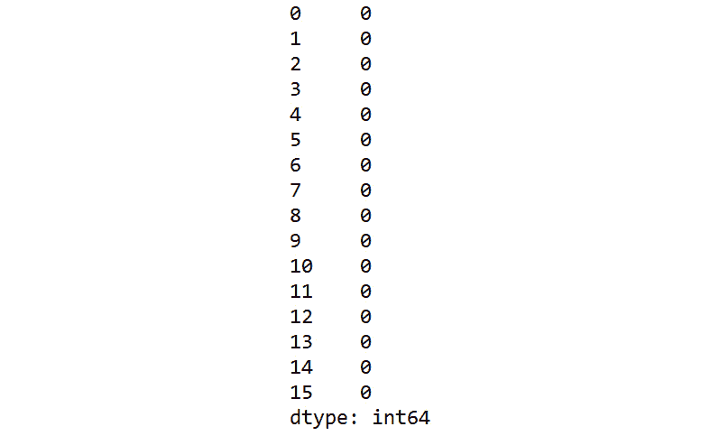

# 第十五章：15\. 集成学习

概述

到本章结束时，你将能够描述集成学习，并将不同的集成学习技术应用到你的数据集上。你还将能够将数据集拟合到模型上，并分析集成学习后的结果。

在本章中，我们将使用信用卡申请数据集，尝试预测信用卡申请是否会被批准。

# 介绍

在上一章中，我们学习了多种技术，如向后淘汰技术、因子分析等，帮助我们处理高维数据集。

在本章中，我们将通过另一组技术进一步丰富我们的技能库，称为 **集成学习**，我们将在其中涉及不同的集成学习技术，如下所示：

+   平均

+   加权平均

+   最大投票法

+   装袋法

+   提升法

+   融合

# 集成学习

集成学习，顾名思义，是一种将多个机器学习模型结合起来生成更优模型的方法，从而降低变异性/方差和偏差，并提高性能。

在探讨什么是集成学习之前，让我们通过经典的偏差-方差象限来理解偏差和方差的概念，如下图所示：


图 15.1：偏差-方差象限

## 方差

方差是衡量数据分散程度的指标。在机器学习中，高方差的模型意味着在相同的测试集上生成的预测结果，在使用不同的训练集来拟合模型时，会有显著的差异。高方差的根本原因可能是模型过于关注训练数据的特定细节，而没有对输入和输出之间的关系进行有效的概括。理想情况下，我们希望每个机器学习模型的方差都很低。

## 偏差

偏差是实际值和我们预测的平均值之间的差异。低偏差表示预测值与实际值非常接近。高偏差则意味着模型将输入与输出之间的关系过于简化，导致测试集上的错误率较高，这同样是一个不理想的结果。

*图 15.1* 帮助我们可视化偏差和方差之间的权衡。左上角展示的是偏差高、方差低的情景。右上象限显示的是偏差和方差都高的情景。从图中可以看出，当偏差高时，它距离真实值较远，在此情况下，真实值即为 *靶心*。方差的存在表现为箭头是分散的还是聚集在某一处。

集成模型结合了许多较弱的模型，这些模型在方差和偏差上有所不同，从而创建一个更好的模型，超越单个较弱的模型。集成模型体现了“*群体的智慧*”这一格言。在本章中，我们将学习不同的集成技术，分为两类：简单技术和高级技术：


图 15.2：不同的集成学习方法

## 商业背景

你在银行的信用卡部门工作。公司运营部门的负责人请求你帮助确定一个客户是否值得信贷。你已经获得了信用卡操作数据。

这个数据集包含了大约 15 个变量的信用卡申请数据。变量包括与信用卡操作相关的连续数据和分类数据。数据集的标签是一个标志，指示申请是否已被批准。

你希望为数据集拟合一些基准模型，并尝试一些集成学习方法，以解决问题并制定一个工具，预测某个客户的信用申请是否应被批准。

## 练习 15.01：加载、探索和清理数据

在本次练习中，我们将下载信用卡数据集，将其加载到 Colab 笔记本中，并进行一些基本的探索。此外，我们还将清理数据集，以移除不需要的字符。

注意

我们将在本次练习中使用的数据集来自 UCI 机器学习库：[`packt.live/39NCgZ2`](https://packt.live/39NCgZ2)。你可以从我们的 GitHub 下载该数据集：[`packt.live/3018OdD`](https://packt.live/3018OdD)。

以下步骤将帮助你完成本次练习：

1.  打开一个新的 Colab 笔记本文件。

1.  现在，将 `pandas` 导入到你的 Colab 笔记本中：

    ```py
    import pandas as pd
    ```

1.  接下来，设置 `crx.data` 上传至 GitHub 仓库的路径，如以下代码片段所示：

    ```py
    #Load data from the GitHub repository
    filename = 'https://raw.githubusercontent.com'\
               '/PacktWorkshops/The-Data-Science-Workshop'\
               '/master/Chapter15/Dataset/crx.data'
    ```

1.  使用 `pandas` 数据框架的 `pd.read_csv()` 函数读取文件：

    ```py
    credData = pd.read_csv(filename,sep= ",",\
                           header = None,\
                           na_values =  "?")
    credData.head()
    ```

    `pd.read_csv()` 函数的参数是文件名（以字符串形式）和 CSV 文件的分隔符，默认是`,`。

    注意

    数据集没有标题行；我们通过使用 `header = None` 命令来特别指定这一点。

    我们通过使用 `na_values = "?"` 参数，将数据集中的缺失值（表示为 `?`）替换为 `na` 值。这一替换便于后续处理。

    读取文件后，使用 `.head()` 函数打印数据框架。你应该会得到以下输出：

    

    图 15.3：将数据加载到 Colab 笔记本

1.  将类别更改为 `1` 和 `0`。

    如果你注意到数据集中的话，第 15 列表示的类别是特殊字符：`+`代表已批准，`-`代表未批准。你需要将其更改为数值`1`（表示已批准）和`0`（表示未批准），如下代码片段所示：

    ```py
    # Changing the Classes to 1 & 0
    credData.loc[credData[15] == '+' , 15] = 1
    credData.loc[credData[15] == '-' , 15] = 0
    credData.head()
    ```

    你应该得到以下输出：

    

    ```py
    .loc() was used to locate the fifteenth column and replace the + and - values with 1 and 0, respectively.
    ```

1.  查找数据集中的`null`值数量。

    现在，我们将使用`.isnull()`函数查找每个特征中的`null`值数量。`.sum()`函数将汇总数据集中每列的所有空值。

    这在以下代码片段中表示：

    ```py
    # Finding number of null values in the data set
    credData.isnull().sum()
    ```

    你应该得到以下输出：

    

    图 15.5：总结数据集中的空值

    从前面的输出可以看到，有许多列包含`null`值。

1.  现在，打印每列的形状和数据类型：

    ```py
    # Printing Shape and data types
    print('Shape of raw data set',credData.shape)
    print('Data types of data set',credData.dtypes)
    ```

    你应该得到以下输出：

    

    图 15.6：每列的形状和数据类型

1.  移除包含`na`值的行。

    为了清理数据集，我们使用`.dropna()`函数和以下代码片段来移除所有包含`na`值的行：

    ```py
    # Dropping all the rows with na values
    newcred = credData.dropna(axis = 0)
    newcred.shape
    ```

    你应该得到以下输出：

    ```py
    (653, 16)
    ```

    如你所见，大约有 37 行包含`na`值的行被移除。在代码片段中，我们定义了`axis = 0`，表示删除`na`值时应该沿着行进行。

1.  验证是否存在`null`值：

    ```py
    # Verifying no null values exist
    newcred.isnull().sum()
    ```

    你应该得到以下输出：

    

    图 15.7：验证没有空值存在

1.  接下来，将类别变量转换为虚拟值。

    从数据类型可以看出，很多变量是类别类型的，需要使用`pd.get_dummies()`函数将它们转换为虚拟变量。这可以通过以下代码片段完成：

    ```py
    """
    Separating the categorical variables to 
    make dummy variables
    """
    credCat = pd.get_dummies(newcred[[0,3,4,5,6,8,9,11,12]])
    ```

1.  分离数值变量。

    我们还将从原始数据集中分离出数值变量，并将它们与虚拟变量进行连接。此步骤如下所示：

    ```py
    # Separating the numerical variables
    credNum = newcred[[1,2,7,10,13,14]]
    ```

    注意

    你可以通过运行命令`credCat`和`credNum`来查看这些新的 DataFrame。

1.  创建`X`和`y`变量。虚拟变量和数值变量将被连接起来形成`X`变量。`y`变量将通过提取数据集中的标签单独创建。让我们通过以下代码片段看看这些步骤的实际操作：

    ```py
    """
    Making the X variable which is a concatenation 
    of categorical and numerical data
    """
    X = pd.concat([credCat,credNum],axis = 1)
    print(X.shape)
    # Separating the label as y variable
    y = pd.Series(newcred[15], dtype="int")
    print(y.shape)
    ```

    你应该得到以下输出：

    ```py
    (653, 46)
    (653,)
    ```

1.  使用`MinMaxScaler()`函数对数据集进行归一化：

    ```py
    # Normalizing the data sets
    # Import library function
    from sklearn import preprocessing
    # Creating the scaling function
    minmaxScaler = preprocessing.MinMaxScaler()
    # Transforming with the scaler function
    X_tran = pd.DataFrame(minmaxScaler.fit_transform(X))
    ```

1.  将数据集分成训练集和测试集。

    作为数据准备的最后一步，我们将使用`train_test_split()`函数将数据集划分为训练集和测试集：

    ```py
    from sklearn.model_selection import train_test_split
    # Splitting the data into train and test sets
    X_train, X_test, y_train, y_test = train_test_split\
                                       (X_tran, y, test_size=0.3,\
                                        random_state=123)
    ```

    注意

    要访问此特定部分的源代码，请参考[`packt.live/31hM3od`](https://packt.live/31hM3od)。

    你也可以在线运行这个示例：[`packt.live/3glWdZf`](https://packt.live/3glWdZf)。

我们现在有了准备好的数据集可以进行进一步的操作。像往常一样，让我们从在清洗后的数据集上使用逻辑回归拟合基准模型开始。这将在下一活动中实现。

## 活动 15.01：在信用卡数据上拟合逻辑回归模型

你刚刚清洗了收到的数据集，目的是预测客户的信用度。在应用集成学习方法之前，你希望先在数据集上拟合一个基准模型。

执行以下步骤来完成本活动：

1.  打开一个新的 Colab 笔记本。

1.  完成所有来自*练习 15.01*、*加载、探索和清理数据*的适当步骤，直到你将数据集分割为训练集和测试集。

1.  在训练集上拟合逻辑回归模型。

1.  获取测试集上的预测结果。

1.  打印基准模型的混淆矩阵和分类报告。

    在对数据集进行逻辑回归模型拟合后，你应该得到类似以下的输出：

    

图 15.8：拟合逻辑回归模型后的预期输出

注意

请注意，由于预测过程中的变动，你的输出结果可能不会完全相同。

本活动的解决方案可以在这里找到：[`packt.live/2GbJloz`](https://packt.live/2GbJloz)。

在本活动中，我们创建了一个基准模型，以便与后续的模型进行比较。

从输出中可以看出，我们通过基准模型达到了`0.89`的准确率。

现在我们已经拟合了基准模型，接下来将在下一部分探索不同的集成学习方法，从简单方法开始。

# 集成学习的简单方法

正如本章早些时候定义的，集成学习的核心就是将各个模型的优点结合起来，获得一个更强大的模型。在本部分中，我们将探索一些简单的技术，比如：

+   平均法

+   加权平均

+   最大投票

让我们依次看看每一种方法。

## 平均法

平均法是一种简单的集成学习方式；然而，它也非常有用。这种技术的基本思想是取多个独立模型的预测结果，然后将这些预测结果平均，从而生成最终的预测。假设通过平均不同个体学习者的预测结果，我们可以消除各个学习者的错误，从而生成一个优于基模型的模型。使得平均法有效的一个前提是基模型的预测结果必须是互不相关的。这意味着各个独立模型不应该犯相同类型的错误。模型的多样性是确保错误互不相关的关键因素。

在实现平均技术时，预测结果中有一些细微差别需要注意。在预测时，到目前为止，我们一直在使用 `predict()` 函数。正如你现在可能已经知道的那样，`predict()` 函数输出的是概率最高的类别。例如，在我们的基准模型中，当我们对测试集进行预测时，得到的输出是每个测试样本的 '1' 或 '0'。还有另一种预测方式，即生成每个类别的概率。如果我们为我们的基准模型输出每个类别的概率，我们会得到每个样本对应每个类别的两个输出。这在以下表格中的示例预测中得到了展示：


图 15.9：一个例子预测

从前面的例子中，我们可以看到每个测试样本有两个输出，分别对应每个类别的概率。因此，对于第一个样本，预测结果是类别 '1'，因为类别 `1`（`0.902`）的概率高于类别 `0`（`0.098`）。对于样本 `2` 和 `3`，各自的预测结果是类别 `0` 和类别 `1`。

当我们通过平均法生成集成时，我们生成的是每个类别的概率，而不是类别预测结果。每个类别的概率是通过一个名为 `predict_proba()` 的单独函数来预测的。我们将在*练习 15.02*中看到平均法的实现，*使用平均技术的集成模型*。

## 练习 15.02：使用平均技术的集成模型

在本练习中，我们将使用平均技术实现一个集成模型。我们将用于本练习的基本模型是逻辑回归模型，我们将其作为基准模型，KNN 和随机森林模型，它们分别在*第四章*，*使用随机森林进行多类分类*和*第八章*，*超参数调优*中介绍：

1.  打开一个新的 Colab 笔记本。

1.  执行*练习 15.01*中的所有适当步骤，*加载、探索和清理数据*，将数据集分成训练集和测试集。

1.  让我们定义三个基本模型。导入我们将作为基本模型使用的分类器：

    ```py
    from sklearn.linear_model import LogisticRegression
    from sklearn.neighbors import KNeighborsClassifier
    from sklearn.ensemble import RandomForestClassifier
    model1 = LogisticRegression(random_state=123)
    model2 = KNeighborsClassifier(n_neighbors=5)
    model3 = RandomForestClassifier(n_estimators=500)
    ```

1.  在训练集上拟合所有三个模型：

    ```py
    # Fitting all three models on the training data
    model1.fit(X_train,y_train)
    model2.fit(X_train,y_train)
    model3.fit(X_train,y_train)
    ```

1.  我们现在将使用 `predict_proba()` 函数预测每个模型的概率：

    ```py
    """
    Predicting probabilities of each model 
    on the test set
    """
    pred1=model1.predict_proba(X_test)
    pred2=model2.predict_proba(X_test)
    pred3=model3.predict_proba(X_test)
    ```

1.  对所有三个模型生成的预测结果进行平均：

    ```py
    """
    Calculating the ensemble prediction by 
    averaging three base model predictions
    """
    ensemblepred=(pred1+pred2+pred3)/3
    ```

1.  显示集成预测数组的前四行：

    ```py
    # Displaying first 4 rows of the ensemble predictions
    ensemblepred[0:4,:]
    ```

    你应该得到类似以下的输出：

    

    图 15.10：集成预测的前四行

    从前面的输出可以看到，对于每个样本，我们有两个概率值，分别对应每个类别。

1.  打印每个类别的预测顺序。如*步骤 6*所示，预测输出有两列，分别对应每个类别。为了找到类别预测的顺序，我们使用了一种叫做`.classes_`的方法。以下代码片段实现了这一功能：

    ```py
    # Printing the order of classes for each model
    print(model1.classes_)
    print(model2.classes_)
    print(model3.classes_)
    ```

    你应该得到以下输出：

    

    图 15.11：类别顺序

1.  现在，我们需要从输出的概率中获取每个例子的最终预测。最终预测将是概率最高的类别。为了得到概率最高的类别，我们使用`numpy`函数，`.argmax()`。执行方式如下：

    ```py
    import numpy as np
    pred = np.argmax(ensemblepred,axis = 1)
    pred
    ```

    从前面的代码中，`axis = 1`意味着我们需要在列中找到最大值的索引。

    你应该得到以下输出：

    

    图 15.12：数组输出

1.  生成预测的混淆矩阵：

    ```py
    # Generating confusion matrix
    from sklearn.metrics import confusion_matrix
    confusionMatrix = confusion_matrix(y_test, pred)
    print(confusionMatrix)
    ```

    你应该得到类似以下的输出：

    

    图 15.13：混淆矩阵

1.  生成分类报告：

    ```py
    # Generating classification report
    from sklearn.metrics import classification_report
    print(classification_report(y_test, pred))
    ```

    你应该得到类似以下的输出：

    

图 15.14：分类报告

注意

要访问该特定部分的源代码，请参见[`packt.live/31aLa0w`](https://packt.live/31aLa0w)。

你也可以在线运行这个示例，访问[`packt.live/31hMpex`](https://packt.live/31hMpex)。

在本练习中，我们实现了集成学习的平均技术。从分类报告中可以看出，我们通过平均方法将准确率从基准模型的`0.89`提升至`0.91`。然而，需要注意的是，集成方法并不能保证在所有情况下都能提高结果。有时，可能不会观察到性能的提升。

让我们还看看信用卡申请的业务背景下的结果。`91%`的准确率意味着在测试集中的`196`个案例中，我们能够正确预测客户是否具有信用的比例为`91%`。同时，查看类别`0`的召回率也很有趣，它是`91%`。在这种情况下，我们正确识别出了`91%`的不合格客户。另一个值得关注的地方是，有`9%`的不合格客户被错误地识别为信用合格，这实际上对信用卡部门构成了风险。理想情况下，如果我们想减少信用卡部门的风险，我们需要提高不合格客户的召回率。

另一方面，还存在一个问题，即通过正确预测信用良好客户（`1`）来最大化业务机会。我们已经看到，在总共 `107` 位信用良好客户中，有 `91%` 被正确预测，这是一个积极的结果。剩余的 `9%` 信用良好客户则将成为一个失去的商业机会。

调优模型是一个平衡的过程，数据科学家必须对此有所认识。数据科学家必须根据业务的偏好行事。如果业务风险规避，并且愿意放弃业务机会，那么模型将需要调整以增加非良好客户的召回率。另一方面，如果业务积极并且希望增长，那么首选路线将是提高信用良好客户的召回率。总之，调优模型是基于业务现实的平衡行为。

## 加权平均

加权平均是我们之前看到的平均方法的扩展。这两种方法的主要区别在于生成组合预测的方式。在加权平均方法中，我们为每个模型的预测分配权重，然后生成组合预测。这些权重最初是根据我们对哪个模型在集成中最有影响力的判断而任意分配的。这些权重在经过大量实验后需要进化。首先，我们假设一些权重，然后使用不同的权重迭代每个模型，以验证是否在性能上有所改进。让我们在接下来的练习中实现加权平均方法。

## 练习 15.03：使用加权平均技术的集成模型

在这个练习中，我们将使用加权平均技术实现集成模型。我们将使用与 *练习 15.02* 中相同的基本模型，逻辑回归、KNN 和随机森林：

1.  打开一个新的 Colab 笔记本。

1.  执行所有从 *练习 15.02*，*使用平均技术的集成模型* 开始到预测三个模型概率的步骤。

1.  对预测值进行加权平均。在加权平均方法中，权重是根据我们对每个预测的判断任意分配的。具体操作如下：

    ```py
    """
    Calculating the ensemble prediction by applying 
    weights for each prediction
    """
    ensemblepred=(pred1 *0.60 + pred2 * 0.20 + pred3 * 0.20)
    ```

    请注意，这些权重的分配方式是使所有权重的总和为 `1`（`0.6 + 0.2 + 0.2 = 1`）。

1.  显示集成预测数组的前四行：

    ```py
    # Displaying first 4 rows of the ensemble predictions
    ensemblepred[0:4,:]
    ```

    您应该会得到类似以下的输出：

    

    图 15.15：集成预测数组输出

    正如您从输出中看到的那样，每个示例对应每个类别有两个概率。

1.  打印预测输出中每个类的顺序：

    ```py
    # Printing the order of classes for each model
    print(model1.classes_)
    print(model2.classes_)
    print(model3.classes_)
    ```

    您应该会得到以下输出：

    

    图 15.16：从预测输出中得到的类别顺序

1.  从概率中计算最终的预测值。

    我们现在需要使用 `np.argmax()` 函数，从输出的概率中获取每个示例的最终预测：

    ```py
    import numpy as np
    pred = np.argmax(ensemblepred,axis = 1)
    pred
    ```

    你应该得到类似以下的输出：

    

    图 15.17：最终预测的数组

1.  生成预测的混淆矩阵：

    ```py
    # Generating confusion matrix
    from sklearn.metrics import confusion_matrix
    confusionMatrix = confusion_matrix(y_test, pred)
    print(confusionMatrix)
    ```

    你应该得到类似以下的输出：

    

    图 15.18：混淆矩阵

1.  生成分类报告：

    ```py
    # Generating classification report
    from sklearn.metrics import classification_report
    print(classification_report(y_test, pred))
    ```

    你应该得到类似以下的输出：

    

图 15.19：分类报告

注意

要访问此特定部分的源代码，请参见 [`packt.live/2CINUc5`](https://packt.live/2CINUc5)。

你也可以在网上运行此示例，访问 [`packt.live/2YfrTZK`](https://packt.live/2YfrTZK)。

### 迭代 2：使用不同的权重

从第一次迭代中，我们看到我们得到了 `89%` 的准确率。这个指标反映了我们在第一次迭代中应用的权重。现在让我们尝试改变权重，看看它对指标有什么影响。尝试不同权重的过程是基于我们对数据集和数据分布的判断。假设我们认为数据分布更线性，因此决定增加线性回归模型的权重，并减少其他两个模型的权重。现在让我们在*第二次迭代*中尝试新的权重组合：

1.  取预测的加权平均值。

    在这个迭代中，我们将逻辑回归预测的权重从 `0.6` 增加到 `0.7`，并将另外两个权重从 `0.2` 减少到 `0.15`：

    ```py
    """
    Calculating the ensemble prediction by applying 
    weights for each prediction
    """
    ensemblepred=(pred1 *0.70+pred2 * 0.15+pred3 * 0.15)
    ```

1.  从概率中计算最终的预测值。

    我们现在需要使用 `np.argmax()` 函数，从输出的概率中获取每个示例的最终预测：

    ```py
    # Generating predictions from probabilities
    import numpy as np
    pred = np.argmax(ensemblepred,axis = 1)
    ```

1.  生成预测的混淆矩阵：

    ```py
    # Generating confusion matrix
    from sklearn.metrics import confusion_matrix
    confusionMatrix = confusion_matrix(y_test, pred)
    print(confusionMatrix)
    ```

    你应该得到类似以下的输出：

    

    图 15.20：混淆矩阵

1.  生成分类报告：

    ```py
    # Generating classification report
    from sklearn.metrics import classification_report
    print(classification_report(y_test, pred))
    ```

    你应该得到类似以下的输出：

    

图 15.21：分类报告

在这个练习中，我们实现了集成学习的加权平均技术。我们使用权重进行了两次迭代。我们看到，在第二次迭代中，当我们将逻辑回归预测的权重从`0.6`增加到`0.7`时，准确率实际上从`0.89`提高到了`0.90`。这验证了我们关于逻辑回归模型在集成中的重要性的假设。为了检查是否还有进一步提升的空间，我们应该像在迭代`2`中那样再次调整权重，然后根据度量标准进行验证。我们应继续进行这些迭代，直到度量标准不再有任何改进为止。

与平均方法的度量标准进行比较时，我们可以看到，准确率从`0.91`降至`0.90`。然而，类别`1`的召回值从`0.91`升至`0.92`，而类别`0`的对应值从`0.91`降至`0.88`。这可能是因为我们应用的权重导致了结果的轻微下降，相比于我们从平均方法中得到的结果。

从商业角度来看，我们可以看到，随着类别`1`的召回值的提高，信用卡部门获得了更多有信用的客户。然而，这也伴随着风险的增加，更多的不合格客户被标记为有信用客户，`12%`（`100% - 88%`）被标记为信用客户。

### 最大投票法

最大投票法基于多数规则原理。在这种方法中，多数人的意见占主导地位。在这种技术中，个别模型，或者在集成学习术语中，个别学习者，是在训练集上进行训练的，然后在测试集上生成预测结果。每个个别学习者的预测被视为一票。在测试集中，获得最多票数的类别就是最终的获胜者。我们用一个简单的示例来演示这一点。

假设我们有三个独立的学习者，他们在训练集上进行了学习。每个学习者都在测试集上生成了预测结果，这些结果汇总在下表中。预测结果要么是类别'1'，要么是类别'0'：


图 15.22: 学习者的预测

在前面的示例中，我们可以看到，对于`Example 1`和`Example 3`，多数投票支持类别'1'，而对于其他两个示例，大多数投票支持类别'0'。最终的预测是根据哪个类别获得多数票来确定的。这种投票方法，即输出一个类别，被称为“硬”投票。

在使用`scikit-learn`库实现最大投票法时，我们使用一个名为`VotingClassifier()`的特殊函数。我们将单个学习器作为输入提供给`VotingClassifier`，以创建集成模型。然后，这个集成模型用于拟合训练集，并最终用于在测试集上进行预测。我们将在*练习 15.04*中探索最大投票法的动态，*使用最大投票的集成模型*。

## 练习 15.04：使用最大投票的集成模型

在本次练习中，我们将使用最大投票法实现集成模型。我们将选择的单个学习器与之前练习中选择的相似，即逻辑回归、KNN 和随机森林：

1.  打开一个新的 Colab 笔记本。

1.  执行*练习 15.01*中所有步骤，*加载、探索和清理数据*，直到将数据集拆分为训练集和测试集。

1.  现在我们将导入选定的分类器，作为单独的学习器：

    ```py
    """
    Defining the voting classifier and three 
    individual learners
    """
    from sklearn.ensemble import VotingClassifier
    from sklearn.linear_model import LogisticRegression
    from sklearn.neighbors import KNeighborsClassifier
    from sklearn.ensemble import RandomForestClassifier
    # Defining the models
    model1 = LogisticRegression(random_state=123)
    model2 = KNeighborsClassifier(n_neighbors=5)
    model3 = RandomForestClassifier(n_estimators=500)
    ```

1.  在定义了单个学习器后，我们现在可以使用`VotingClassifier()`函数构建集成模型。以下是实现的代码片段：

    ```py
    # Defining the ensemble model using VotingClassifier
    model = VotingClassifier(estimators=[('lr', model1),\
                            ('knn', model2),('rf', model3)],\
                             voting= 'hard')
    ```

    如代码片段所示，单个学习器作为输入通过`estimators`参数传递。估计器会接受每个定义的学习器以及用来表示模型的字符串值。例如，`lr`表示逻辑回归。此外，注意投票是“硬投票”（hard voting），这意味着输出将是类别标签，而不是概率。

1.  在集成模型上拟合训练集：

    ```py
    # Fitting the model on the training set
    model.fit(X_train,y_train)
    ```

1.  训练后打印准确率得分：

    ```py
    """
    Predicting accuracy on the test set using 
    .score() function
    """
    model.score(X_test,y_test)
    ```

    你应该得到类似如下的输出：

    ```py
    0.9081632653061225
    ```

1.  从集成模型生成测试集上的预测结果：

    ```py
    # Generating the predictions on the test set
    preds = model.predict(X_test)
    ```

1.  生成预测结果的混淆矩阵：

    ```py
    # Printing the confusion matrix
    from sklearn.metrics import confusion_matrix
    # Confusion matrix for the test set
    print(confusion_matrix(y_test, preds))
    ```

    你应该得到类似如下的输出：

    

    图 15.23：混淆矩阵

1.  生成分类报告：

    ```py
    # Printing the classification report
    from sklearn.metrics import classification_report
    print(classification_report(y_test, preds))
    ```

    你应该得到类似如下的输出：

    

图 15.24：分类报告

注意

要访问本节的源代码，请参考[`packt.live/3aESLr6`](https://packt.live/3aESLr6)。

你也可以在[`packt.live/31cL7RJ`](https://packt.live/31cL7RJ)上运行此示例。

在本次练习中，我们实现了最大投票法用于集成学习。正如分类报告所示，结果与我们从平均法（`0.91`）得到的结果相似。从商业角度来看，我们可以看到这个结果更加平衡。值得客户的召回值很高，达到了`92%`；然而，这也带来了更多的风险，因为更多的不值得客户被包含在内。在这种情况下，不值得客户的比例约为`10%`（`100%` - `90%`）。

# 集成学习的高级技术

在学习了集成学习的一些简单技术之后，让我们来探索一些高级技术。在这些高级技术中，我们将处理三种不同的集成学习方法：

+   自助法

+   提升（Boosting）

+   堆叠/混合

在我们处理每种技术之前，有一些关于这些高级集成学习技术的基本动态需要解读。如本章开头所述，集成学习的本质是将多个单独的模型结合起来，形成一个更优的模型。在这些高级技术中，生成优越模型的方式有一些微妙的差异。在这些技术中，单个模型或学习者会生成预测结果，这些预测结果将用于形成最终的预测结果。生成第一组预测结果的单个模型或学习者被称为**基础**学习器或**基础**估计器，而将基础学习器的预测结果结合起来的模型称为**元**学习器或**元**估计器。元学习器从基础学习器学习的方式在每种高级技术中都有所不同。让我们详细了解每种高级技术。

## 自助法

自助法（Bagging）是**B**ootstrap **Agg**regat**ing**的缩写。在解释自助法如何工作之前，我们先来描述什么是自助法。自助法的词源来源于短语*Pulling oneself up by one's bootstrap*。该短语的精髓是充分利用现有的资源。在统计学中，自助法指的是通过替换从现有数据集中抽取样本。我们通过一个简单的例子来了解这个概念。

假设我们有一个包含从 1 到 10 的 10 个数字的数据集。现在我们需要从现有数据集中创建 4 个每个包含 10 个数据的新数据集。我们该如何做呢？这就是自助法派上用场的地方。在这种方法中，我们从现有数据集中逐个抽取样本，并在每次抽取样本后将已抽取的数字放回数据集，然后继续抽取，直到获得我们需要的数据点数量。

由于我们在选择每个数字后都会将其替换，因此可能会出现某个数据点在样本中出现多次的情况。下面的图示解释了这一点：


图 15.25：自助法

现在我们已经理解了自助法（bootstrapping），让我们将这个概念应用到机器学习的背景中。在本章的前面，我们讨论了集成学习有助于减少预测的方差。减少方差的一种方式是通过对多个学习者的预测结果进行平均。在自助法中，使用自助法创建数据的多个子集。在这些数据的每个子集上，都会训练一个基础学习器并生成预测结果。所有基础学习器的预测结果将被平均，以得到元学习器或最终的预测结果。

在实现集成学习时，我们使用一个名为`BaggingClassifier()`的函数，该函数可以在`Scikit learn`库中找到。创建集成模型时提供的一些重要参数包括以下内容：

+   `base_estimator`：该参数用于定义要使用的基本估计器。

+   `n_estimator`：该参数定义将在集成中使用的基本估计器的数量。

+   `max_samples`：该参数定义了用于拟合基本估计器的自助样本的最大大小。它表示为一个比例（例如 0.8，0.7 等）。

+   `max_features`：在拟合多个个体学习器时，发现随机选择用于每个数据集的特征会带来更好的性能。`max_features`参数表示要使用的特征数量。例如，如果数据集中有 10 个特征，并且将`max_features`参数定义为 0.8，那么将使用 8 个（0.8 x 10）特征来拟合使用基本学习器的模型。

让我们在*练习 15.05*中探索使用集成学习进行 bagging，*使用 Bagging 进行集成学习*。

## 练习 15.05：使用 Bagging 进行集成学习

在本练习中，我们将使用 bagging 实现一个集成模型。我们将选择的个体学习器是随机森林：

1.  打开一个新的 Colab 笔记本。

1.  执行*练习 15.01*中所有步骤，*加载、探索和清理数据*，直到将数据集拆分为训练集和测试集。

1.  定义基本学习器，即随机森林分类器：

    ```py
    # Defining the base learner
    from sklearn.ensemble import RandomForestClassifier
    bl1 = RandomForestClassifier(random_state=123)
    ```

1.  在定义了个体学习器之后，我们可以使用`BaggingClassifier()`函数来构建集成模型。以下代码片段实现了这一点：

    ```py
    # Creating the bagging meta learner
    from sklearn.ensemble import BaggingClassifier
    baggingLearner = \
    BaggingClassifier(base_estimator=bl1, n_estimators=10, \
                      max_samples=0.8, max_features=0.7)
    ```

    我们提供的参数是任意的。最优值需要通过实验来确定。

1.  在集成模型上拟合训练集：

    ```py
    # Fitting the model using the meta learner
    model = baggingLearner.fit(X_train, y_train)
    ```

1.  在测试集上生成集成模型的预测：

    ```py
    # Predicting on the test set using the model
    pred = model.predict(X_test)
    ```

1.  生成预测的混淆矩阵：

    ```py
    # Printing the confusion matrix
    from sklearn.metrics import confusion_matrix
    print(confusion_matrix(y_test, pred))
    ```

    你应该得到类似以下的输出：

    

    图 15.26：混淆矩阵

1.  生成分类报告：

    ```py
    # Printing the classification report
    from sklearn.metrics import classification_report
    print(classification_report(y_test, pred))
    ```

    你应该得到类似以下的输出：

    

图 15.27：分类报告

注意

要访问此特定部分的源代码，请参考[`packt.live/3iYcHZ3`](https://packt.live/3iYcHZ3)。

你也可以在[`packt.live/3hfRCbZ`](https://packt.live/3hfRCbZ)上在线运行此示例。

在本次练习中，我们使用了袋装法实现集成学习。从分类报告中可以看出，我们的结果（`0.90`）略低于平均和最大投票方法的结果（`0.91`）。然而，从业务角度来看，我们可以看到两个类别的召回值存在较大波动。我们发现，信用良好的客户的召回率约为 87%。这意味着大约有 `13%` 的机会丧失。我们还看到，识别不可信客户的风险也在减少。识别不可信客户的召回率约为 93%，这意味着只有大约 7% 的不可信客户被错误分类为信用良好的客户。因此，对于更注重风险的企业，建议使用该模型。

## 提升

我们在上一节中讨论的袋装技术可以被称为并行学习技术。这意味着每个基学习器都是独立训练的，并将它们的预测结果进行汇总。与袋装方法不同，提升法是按顺序进行的。它的原理是通过纠正每个基学习器的预测误差来工作。基学习器是按顺序一个接一个地训练的。每个基学习器试图纠正前一个学习器产生的错误，这个过程会一直进行，直到生成一个优越的元学习器。提升技术的步骤如下：

1.  基学习器在数据集的一个子集上进行训练。

1.  模型拟合完成后，对整个数据集进行预测。

1.  通过将预测结果与实际标签进行比较，识别预测中的错误。

1.  那些产生错误预测的示例会被赋予更大的权重。

1.  另一个基学习器会在数据集上进行训练，其中前一步中错误预测示例的权重会被调整。

1.  该基学习器试图纠正之前模型的错误，并给出其预测结果。

1.  *步骤 4*、*步骤 5* 和 *步骤 6* 会重复进行，直到生成一个强大的元学习器。

在实现提升技术时，我们可以使用 `AdaBoostClassifier()` 方法，该方法在 scikit-learn 中非常常用。与袋装估计器类似，`AdaBoostClassifier()` 方法中的一些重要参数包括 `base_estimator` 和 `n_estimators`。接下来我们将在 *练习 15.06* 中实现提升算法，*使用提升的集成学习*。

## 练习 15.06：使用提升的集成学习

在本次练习中，我们将使用提升方法实现一个集成模型。我们选择的单个学习器将是逻辑回归模型。实现此算法的步骤与袋装算法非常相似：

1.  打开一个新的 Colab 笔记本文件。

1.  执行 *练习 15.01* 中的所有步骤，*加载、探索和清理数据*，直到将数据集划分为训练集和测试集。

1.  定义基学习器，该学习器将是一个逻辑回归分类器：

    ```py
    # Defining the base learner
    from sklearn.linear_model import LogisticRegression
    bl1 = LogisticRegression(random_state=123)
    ```

1.  在定义了个体学习器后，我们现在可以使用 `AdaBoostClassifier()` 函数构建集成模型。以下是实现该功能的代码片段：

    ```py
    # Define the boosting meta learner
    from sklearn.ensemble import AdaBoostClassifier
    boosting = AdaBoostClassifier(base_estimator=bl1, \
                                  n_estimators=200)
    ```

    我们给定的参数值是任意的。最优值需要通过实验来识别。

1.  在集成模型上拟合训练集：

    ```py
    # Fitting the model on the training set
    model = boosting.fit(X_train, y_train)
    ```

1.  从集成模型中生成测试集的预测结果：

    ```py
    # Getting the predictions from the boosting model
    pred = model.predict(X_test)
    ```

1.  为预测结果生成混淆矩阵：

    ```py
    # Printing the confusion matrix
    from sklearn.metrics import confusion_matrix
    print(confusion_matrix(y_test, pred))
    ```

    你应该得到类似于以下的输出：

    

    Figure 15.28: 混淆矩阵

1.  生成分类报告：

    ```py
    # Printing the classification report
    from sklearn.metrics import classification_report
    print(classification_report(y_test, pred))
    ```

    你应该得到类似于以下的输出：

    

Figure 15.29: 分类报告

注意

要访问此特定部分的源代码，请参考[`packt.live/3iUas96`](https://packt.live/3iUas96)。

你也可以在线运行此示例，网址为[`packt.live/2EkkW2J`](https://packt.live/2EkkW2J)。

在这个练习中，我们使用提升法实现了集成学习模型。从分类报告中可以看出，我们得到了与先前练习中实现的袋装法非常相似的结果（0.90）。从业务角度来看，与袋装法（召回率为 0.93 和 0.87）得到的结果相比，这里结果更为平衡。在这里，我们可以看到不值得信任的客户（90%）和值得信任的客户（91%）的召回值非常接近，这表明结果非常平衡。

## 堆叠

堆叠（Stacking）从原则上来说，与袋装法（bagging）和提升法（boosting）类似，都是通过结合基础学习器来形成元学习器。然而，在堆叠中，从基础学习器获取元学习器的方法有很大不同。在堆叠中，元学习器是通过基础学习器的预测结果进行拟合的。堆叠算法可以解释如下：

1.  训练集被分割成多个部分，比如五个部分。

1.  一个基础学习器（比如，KNN）被拟合到训练集的四个部分，然后对第五个部分进行预测。这个过程会一直继续，直到基础学习器在训练集的五个部分上都进行了预测。所有这些预测结果将被汇总，以获得完整训练集的预测。

1.  然后使用相同的基础学习器对测试集进行预测。

1.  *步骤 2* 和 *步骤 3* 随后将使用不同的基础学习器（比如，随机森林）重复进行。

1.  接下来进入一个新的模型，它作为元学习器（比如，逻辑回归）。

1.  元学习器在基础学习器在训练集上生成的预测结果上进行拟合。

1.  一旦元学习器在训练集上进行拟合，便可以使用相同的模型在基础学习器在测试集上生成的预测结果上进行预测。

    所有这些过程通过图示方式解释如下：

    

Figure 15.30: 堆叠过程

堆叠的实现是通过一个名为`StackingClassifier()`的函数完成的。这个函数来自一个叫做`mlxtend`的包。此函数的各种参数是我们指定为基础学习器的模型以及作为元学习器的模型。堆叠技术的实现将在*练习 15.07*，*使用堆叠法的集成学习*中进行。

## 练习 15.07：使用堆叠法的集成学习

在这个练习中，我们将使用堆叠法实现一个集成模型。我们将使用的基础学习器是 KNN 和随机森林。我们的元学习器将是逻辑回归：

1.  打开一个新的 Colab 笔记本。

1.  执行*练习 15.01*中的所有步骤，即*加载、探索和清理数据*，直到将数据集分割为训练集和测试集。

1.  导入基础学习器和元学习器。在此实现中，我们将使用两个基础学习器（KNN 和随机森林）。元学习器将使用逻辑回归：

    ```py
    # Importing the meta learner and base learners
    from sklearn.linear_model import LogisticRegression
    from sklearn.neighbors import KNeighborsClassifier
    from sklearn.ensemble import RandomForestClassifier
    bl1 = KNeighborsClassifier(n_neighbors=5)
    bl2 = RandomForestClassifier(random_state=123)
    ml = LogisticRegression(random_state=123)
    ```

1.  一旦定义了基础学习器和元学习器，我们将继续创建堆叠分类器：

    ```py
    # Creating the stacking classifier
    from mlxtend.classifier import StackingClassifier
    stackclf = StackingClassifier(classifiers=[bl1, bl2],\
                                  meta_classifier=ml)
    ```

    我们所给出的参数是两个基础学习器和一个元学习器。

1.  将训练集拟合到集成模型：

    ```py
    # Fitting the model on the training set
    model = stackclf.fit(X_train, y_train)
    ```

1.  在测试集上生成集成模型的预测：

    ```py
    # Generating predictions on test set
    pred = model.predict(X_test)
    ```

1.  生成分类报告：

    ```py
    # Printing the classification report
    from sklearn.metrics import classification_report
    print(classification_report(y_test, pred))
    ```

    你应该得到类似以下的输出：

    

    图 15.31：分类报告

1.  为预测生成混淆矩阵：

    ```py
    # Printing the confusion matrix
    from sklearn.metrics import confusion_matrix
    print(confusion_matrix(y_test, pred))
    ```

    你应该得到类似以下的输出：

    

图 15.32：混淆矩阵

注意

要访问此特定章节的源代码，请参考[`packt.live/31dZRjy`](https://packt.live/31dZRjy)。

你也可以在线运行此示例，网址是[`packt.live/2Fwsdgf`](https://packt.live/2Fwsdgf)。

在这个练习中，我们通过堆叠实现了集成学习模型。从分类报告中可以看出，我们使用堆叠分类器并未带来相对于基准模型的任何改进。导致这一结果的原因可能有很多，从我们选择的基础学习器和元学习器，到数据集的大小。需要注意的是，并不是所有的集成学习方法都会是理想的“灵丹妙药”。许多高级方法可能无法提高性能，这个练习就证明了这一点。然而，提升性能的最佳方法往往需要大量的实验，这才是能够取得成效的关键。毕竟，在机器学习中，没有免费的午餐。

从商业角度来看，结果在收入方面具有重大影响，因为大量信用良好的客户（`16%`（`100%` - `84%`））被标记为不值得信任。而召回的风险方面表现相当好，较高的比例（`92%`）的不合格客户被识别出来。

到目前为止，我们已经看到三种集成学习的高级技术。现在，让我们将这些技术应用于信用卡数据集，然后选择最佳方法。我们将在*活动 15.02*中进行此操作，*使用平均技术的集成模型*。

## 活动 15.02：高级集成技术的比较

场景：你已经在信用卡数据集上尝试过基准模型，并获得了一些基准指标。通过学习一些高级集成技术，你希望确定要为信用卡审批数据集使用哪种技术。

在这个活动中，你将使用所有三种高级技术，并在选择最终技术之前比较它们的结果。

步骤如下：

1.  打开一个新的 Colab 笔记本。

1.  实现*练习 15.01*中所有步骤，*加载、探索和清洗数据*，直到将数据集划分为训练集和测试集。

1.  实现使用逻辑回归模型作为基学习器的袋装技术。在袋装分类器中，定义`n_estimators = 15`，`max_samples = 0.7`，`max_features = 0.8`。将模型拟合到训练集，生成预测结果，并打印混淆矩阵和分类报告。

1.  使用随机森林作为基学习器实现提升。在`AdaBoostClassifier`中，定义`n_estimators = 300`。将模型拟合到训练集，生成预测结果，并打印混淆矩阵和分类报告。

1.  实现堆叠技术。将 KNN 和逻辑回归模型作为基学习器，随机森林作为元学习器。将模型拟合到训练集，生成预测结果，并打印混淆矩阵和分类报告。

1.  比较所有三种技术的结果，并选择最佳技术。

1.  输出：对于这三种方法，你应该得到类似于以下的输出。请注意，由于预测过程中的变异性，你的输出值可能与此不同。

    袋装的输出结果如下：

    

图 15.33：袋装的输出

提升的输出结果如下：


图 15.34：提升的输出

堆叠的输出结果如下：


图 15.35：堆叠的输出

注意

此活动的解决方案可以在这里找到：[`packt.live/2GbJloz`](https://packt.live/2GbJloz)。

在这个活动中，我们在信用卡数据集上实现了所有三种高级集成技术。根据指标，我们发现提升法（`0.91`）的结果优于袋装法（`0.90`）和堆叠法（`0.87`）。因此，我们选择提升算法来提升模型的性能。从商业角度来看，提升算法产生了更平衡的结果，其中信用良好与不良客户的召回值（91%）相似。

# 总结

在本章中，我们学习了各种集成学习技术。让我们总结一下本章所学的内容。

在本章开始时，我们介绍了方差和偏差的概念，并了解到集成学习是一种旨在将个体模型结合起来，创建更优模型的技术，从而减少方差和偏差，提升性能。为了进一步探索不同的集成学习技术，我们下载了信用卡审批数据集，并使用逻辑回归拟合了一个基准模型。

在随后的部分中，我们学习了六种不同的集成学习技术；其中三种是简单的技术，另外三种是高级技术。平均法通过结合基础学习器的预测并对预测概率进行平均，创建了一个集成模型。我们使用这种方法得到了比基准模型更好的结果。加权平均法与平均法类似，不同之处在于预测组合的方式。在这种方法中，给每个学习器的预测结果分配任意权重，从而得到最终的预测结果。最大投票法是一种基于大多数基础学习器投票结果来得出最终预测的技术。

使用装袋法（bagging）进行集成学习利用了自助法（bootstrapping）技术。基础学习器在自助法数据集上进行训练，结果通过聚合得到元学习器。提升法（boosting）是一种顺序学习方法，其工作原理是对基础学习器进行错误修正。我们发现，提升法技术为我们的应用场景提供了一些优越的结果。我们使用堆叠技术通过学习基础学习器的预测结果来生成最终预测。

本章的目标是为你提供一套旨在提升机器学习模型性能的技能。然而，需要注意的是，机器学习技术中并没有灵丹妙药，并非所有技术在所有场景下都有效。帮助你成为一名优秀数据科学家的“秘诀”是不断实验不同的技术、使用案例和数据集。

学习了一套旨在提升性能的工具后，你现在已经准备好将这些工具应用到一系列现实世界的项目中。本章标志着本书的结束，也是你反思自己在各个章节中所学技能的好机会。然而，你仍然可以在[`packt.live/2ZagB9y`](https://packt.live/2ZagB9y)获取三章附加内容。

## 目录

1.  数据科学工作坊

1.  第二版

1.  前言

    1.  关于本书

        1.  受众

        1.  章节介绍

        1.  约定

        1.  代码展示

        1.  设置您的环境

            1.  如何设置 Google Colab

            1.  如何使用 Google Colab

        1.  访问代码文件

1.  1. Python 数据科学简介

    1.  介绍

    1.  数据科学的应用

        1.  什么是机器学习？

            1.  监督学习

            1.  无监督学习

            1.  强化学习

    1.  Python 概述

        1.  变量类型

            1.  数值变量

            1.  文本变量

            1.  Python 列表

            1.  Python 字典

        1.  练习 1.01: 创建包含机器学习算法的字典

    1.  Python 数据科学

        1.  pandas 包

            1.  数据框和系列

            1.  CSV 文件

            1.  Excel 电子表格

            1.  JSON

        1.  练习 1.02: 将不同格式的数据加载到 pandas 数据框中

    1.  Scikit-Learn

        1.  什么是模型？

            1.  模型超参数

            1.  sklearn API

        1.  练习 1.03: 使用 sklearn 从数据集中预测乳腺癌

        1.  活动 1.01: 训练垃圾邮件检测算法

    1.  总结

1.  2. 回归

    1.  介绍

    1.  简单线性回归

        1.  最小二乘法

    1.  多元线性回归

        1.  估计回归系数（β0，β1，β2 和 β3）

        1.  变量的对数变换

        1.  相关矩阵

    1.  使用 Python 进行回归分析

        1.  练习 2.01：加载并准备数据进行分析

        1.  相关系数

        1.  练习 2.02：使用 Python 进行线性关系的图形化调查

        1.  练习 2.03：使用 Python 检查可能的对数-线性关系

        1.  Statsmodels 公式 API

        1.  练习 2.04：使用 Statsmodels 公式 API 拟合简单线性回归模型

        1.  分析模型摘要

        1.  模型公式语言

        1.  截距处理

        1.  活动 2.01：使用 Statsmodels 公式 API 拟合对数-线性模型

    1.  多元回归分析

        1.  练习 2.05：使用 Statsmodels 公式 API 拟合多元线性回归模型

    1.  回归分析的假设

        1.  活动 2.02：拟合多元对数-线性回归模型

    1.  解释回归分析结果

        1.  回归分析的检查和平衡

        1.  F 检验

        1.  t 检验

    1.  总结

1.  3\. 二元分类

    1.  介绍

    1.  理解商业背景

        1.  商业发现

        1.  练习 3.01：加载并探索数据集中的数据

        1.  使用探索性数据分析测试商业假设

        1.  探索性数据分析的可视化

        1.  练习 3.02：年龄与定期贷款倾向的商业假设检验

        1.  来自探索性分析的直觉

        1.  活动 3.01：业务假设检验，以确定就业状态与定期存款倾向的关系

    1.  特征工程

        1.  业务驱动的特征工程

        1.  练习 3.03：特征工程 – 探索单一特征

        1.  练习 3.04：特征工程 – 从现有特征中创建新特征

    1.  数据驱动的特征工程

        1.  快速了解数据类型及描述性摘要

    1.  相关性矩阵与可视化

        1.  练习 3.05：在银行数据中寻找数据的相关性并生成相关性图

        1.  数据的偏度

        1.  直方图

        1.  密度图

        1.  其他特征工程方法

        1.  总结特征工程

        1.  使用逻辑回归函数构建二元分类模型

        1.  揭开逻辑回归的神秘面纱

        1.  评估模型性能的指标

        1.  混淆矩阵

        1.  准确率

        1.  分类报告

        1.  数据预处理

        1.  练习 3.06：用于预测银行定期存款购买倾向的逻辑回归模型

        1.  活动 3.02：模型迭代 2 – 使用特征工程变量的逻辑回归模型

        1.  下一步

    1.  总结

1.  4. 多类分类与随机森林

    1.  介绍

    1.  训练随机森林分类器

    1.  评估模型的性能

        1.  练习 4.01：构建分类动物类型的模型并评估其性能

        1.  树木数量估算器

        1.  练习 4.02：调整 n_estimators 以减少过拟合

    1.  最大深度

        1.  练习 4.03：调整 max_depth 以减少过拟合

    1.  叶子节点的最小样本数

        1.  练习 4.04：调整 min_samples_leaf

    1.  最大特征数

        1.  练习 4.05：调整 max_features

        1.  活动 4.01：在 ISOLET 数据集上训练随机森林分类器

    1.  总结

1.  5. 执行首次聚类分析

    1.  介绍

    1.  使用 k-means 聚类

        1.  练习 5.01：对 ATO 数据集进行首次聚类分析

    1.  解释 k-means 结果

        1.  练习 5.02：通过商业收入和支出对澳大利亚邮政编码进行聚类

    1.  选择聚类数量

        1.  练习 5.03：寻找最佳聚类数量

    1.  初始化聚类

        1.  练习 5.04：使用不同的初始化参数以获得合适的结果

    1.  计算与质心的距离

        1.  练习 5.05：在我们的数据集中寻找最接近的质心

    1.  标准化数据

        1.  练习 5.06：标准化我们的数据集中的数据

        1.  活动 5.01：使用 k-means 在银行中进行客户分群分析

    1.  总结

1.  6. 如何评估性能

    1.  介绍

    1.  拆分数据

        1.  练习 6.01：导入和拆分数据

    1.  评估回归模型的性能

        1.  数据结构 – 向量与矩阵

            1.  标量

            1.  向量

            1.  矩阵

        1.  R2 得分

        1.  练习 6.02：计算线性回归模型的 R2 得分

        1.  平均绝对误差

        1.  练习 6.03：计算模型的 MAE

        1.  练习 6.04：计算第二个模型的平均绝对误差

            1.  其他评估指标

    1.  评估分类模型的性能

        1.  练习 6.05：创建分类模型以计算评估指标

    1.  混淆矩阵

        1.  练习 6.06：为分类模型生成混淆矩阵

        1.  关于混淆矩阵的更多内容

        1.  精度

        1.  练习 6.07：计算分类模型的精度

        1.  召回率

        1.  练习 6.08：计算分类模型的召回率

        1.  F1 得分

        1.  练习 6.09：计算分类模型的 F1 得分

        1.  准确率

        1.  练习 6.10：计算分类模型的准确率

        1.  对数损失

        1.  练习 6.11：计算分类模型的对数损失

    1.  接收者操作特征曲线（ROC Curve）

        1.  练习 6.12：计算并绘制二分类问题的 ROC 曲线

    1.  ROC 曲线下的面积

        1.  练习 6.13：计算剖腹产数据集的 ROC AUC

    1.  保存和加载模型

        1.  练习 6.14：保存和加载模型

        1.  活动 6.01：训练三种不同的模型，并使用评估指标选择表现最佳的模型

    1.  总结

1.  7. 机器学习模型的泛化

    1.  简介

    1.  过拟合

        1.  在特征过多的情况下训练模型

        1.  训练时间过长

    1.  欠拟合

    1.  数据

        1.  数据集拆分比例

        1.  创建数据集拆分

        1.  练习 7.01：导入和拆分数据

    1.  随机状态

        1.  练习 7.02：拆分数据时设置随机状态

    1.  交叉验证

        1.  K 折交叉验证

        1.  练习 7.03：创建一个五折交叉验证数据集

        1.  练习 7.04：使用循环调用创建五折交叉验证数据集

    1.  cross_val_score

        1.  练习 7.05：从五折交叉验证中获取评分

        1.  理解实现交叉验证的估计器

    1.  LogisticRegressionCV

        1.  练习 7.06：使用交叉验证训练 Logistic 回归模型

    1.  使用 GridSearchCV 进行超参数调优

        1.  决策树

        1.  练习 7.07：使用 GridSearch 和交叉验证找到模型的最佳参数

    1.  使用 RandomizedSearchCV 进行超参数调优

        1.  练习 7.08：使用随机搜索进行超参数调优

    1.  Lasso 回归的模型正则化

        1.  练习 7.09：使用 Lasso 回归修正模型过拟合

    1.  Ridge 回归

        1.  练习 7.10：使用 Ridge 回归修正模型过拟合

        1.  活动 7.01：找到一个最优模型来预测超导体的临界温度

    1.  总结

1.  8. 超参数调优

    1.  简介

    1.  什么是超参数？

        1.  超参数与统计模型参数的区别

        1.  设置超参数

        1.  关于默认设置的说明

    1.  寻找最佳超参数化

        1.  练习 8.01：手动调优 k-NN 分类器的超参数

        1.  手动搜索的优缺点

    1.  使用网格搜索调优

        1.  网格搜索策略的简单演示

    1.  GridSearchCV

        1.  使用 GridSearchCV 进行调优

            1.  支持向量机（SVM）分类器

        1.  练习 8.02：使用网格搜索调优 SVM 的超参数

        1.  网格搜索的优缺点

    1.  随机搜索

        1.  随机变量及其分布

        1.  随机搜索过程的简单演示

        1.  使用 RandomizedSearchCV 调优

        1.  练习 8.03：随机搜索超参数调优，适用于随机森林分类器

        1.  随机搜索的优缺点

        1.  活动 8.01：蘑菇是否有毒？

    1.  总结

1.  9. 解释机器学习模型

    1.  简介

    1.  线性模型系数

        1.  练习 9.01：提取线性回归系数

    1.  随机森林特征重要性

        1.  练习 9.02：提取随机森林特征重要性

    1.  通过置换提取特征重要性

        1.  练习 9.03：通过置换提取特征重要性

    1.  部分依赖图

        1.  练习 9.04：绘制部分依赖图

    1.  使用 LIME 进行局部解释

        1.  练习 9.05：使用 LIME 进行局部解释

        1.  活动 9.01：训练和分析网络入侵检测模型

    1.  总结

1.  10\. 分析数据集

    1.  介绍

    1.  探索你的数据

    1.  分析你的数据集

        1.  练习 10.01：使用描述性统计分析 Ames 房屋数据集

    1.  分析分类变量的内容

        1.  练习 10.02：分析 Ames 房屋数据集中的分类变量

    1.  总结数值变量

        1.  练习 10.03：分析 Ames 房屋数据集中的数值变量

    1.  可视化你的数据

        1.  使用 Altair API

        1.  数值变量的直方图

        1.  分类变量的条形图

    1.  箱型图

        1.  练习 10.04：使用 Altair 可视化 Ames 房屋数据集

        1.  活动 10.01：使用可视化数据分析技术分析流失数据

    1.  总结

1.  11\. 数据准备

    1.  介绍

    1.  处理行重复

        1.  练习 11.01：处理乳腺癌数据集中的重复项

    1.  转换数据类型

        1.  练习 11.02：转换 Ames 房屋数据集的数据类型

    1.  处理错误值

        1.  练习 11.03：修复州列中的错误值

    1.  处理缺失值

        1.  练习 11.04：修复马疝数据集中的缺失值

        1.  活动 11.01：准备速配数据集

    1.  总结

1.  12\. 特征工程

    1.  介绍

        1.  合并数据集

            1.  左连接

            1.  右连接

        1.  练习 12.01：将 ATO 数据集与邮政编码数据合并

        1.  对变量进行分箱

        1.  练习 12.02：对 AMES 住房数据集中的 YearBuilt 变量进行分箱

        1.  日期操作

        1.  练习 12.03：对金融服务消费者投诉数据进行日期操作

        1.  执行数据聚合

        1.  练习 12.04：通过数据聚合在 AMES 住房数据集上进行特征工程

        1.  活动 12.01：在金融数据集上进行特征工程

        1.  总结

1.  13. 不平衡数据集

    1.  简介

    1.  理解业务背景

        1.  练习 13.01：在数据集上对逻辑回归模型进行基准测试

        1.  结果分析

    1.  不平衡数据集的挑战

    1.  应对不平衡数据集的策略

        1.  收集更多数据

        1.  重采样数据

        1.  练习 13.02：在我们的银行数据集上实现随机欠采样和分类，以找到最佳结果

        1.  分析

    1.  生成合成样本

        1.  SMOTE 和 MSMOTE 的实现

        1.  练习 13.03：在我们的银行数据集上实现 SMOTE 以找到最佳结果

        1.  练习 13.04：在我们的银行数据集上实现 MSMOTE 以找到最佳结果

        1.  在电信数据集上应用平衡技术

        1.  活动 13.01：通过在电信流失数据集上拟合分类器来找到最佳平衡技术

    1.  总结

1.  14. 降维

    1.  简介

        1.  业务背景

        1.  练习 14.01：加载和清洗数据集

    1.  创建高维数据集

        1.  活动 14.01：在高维数据集上拟合逻辑回归模型

    1.  处理高维数据集的策略

        1.  向后特征消除（递归特征消除）

        1.  练习 14.02：使用向后特征选择的降维

        1.  向前特征选择

        1.  练习 14.03：使用向前特征选择的降维

        1.  主成分分析（PCA）

        1.  练习 14.04：使用 PCA 的降维

        1.  独立成分分析（ICA）

        1.  练习 14.05：使用独立成分分析的降维

        1.  因子分析

        1.  练习 14.06：使用因子分析的降维

    1.  比较不同的降维技术

        1.  活动 14.02：在增强广告数据集上比较降维技术

    1.  总结

1.  15\. 集成学习

    1.  介绍

    1.  集成学习

        1.  方差

        1.  偏差

        1.  业务背景

        1.  练习 15.01：加载、探索和清理数据

        1.  活动 15.01：在信用卡数据上拟合逻辑回归模型

    1.  集成学习的简单方法

        1.  平均法

        1.  练习 15.02：使用平均法的集成模型

        1.  加权平均法

        1.  练习 15.03：使用加权平均法的集成模型

            1.  使用不同权重的第二次迭代

            1.  最大投票法

        1.  练习 15.04：使用最大投票的集成模型

    1.  集成学习的高级技术

        1.  袋装法

        1.  练习 15.05：使用袋装法的集成学习

        1.  提升方法

        1.  练习 15.06：使用提升法进行集成学习

        1.  堆叠法

        1.  练习 15.07：使用堆叠法进行集成学习

        1.  活动 15.02：高级集成技术比较

    1.  总结

## 地标

1.  封面

1.  目录
