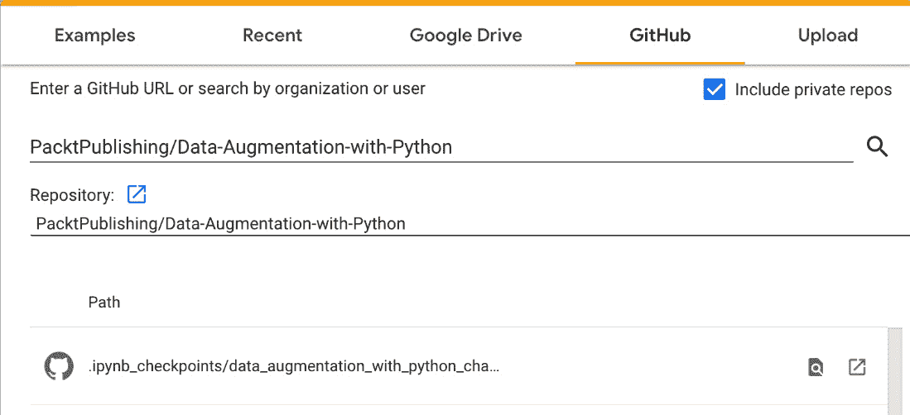
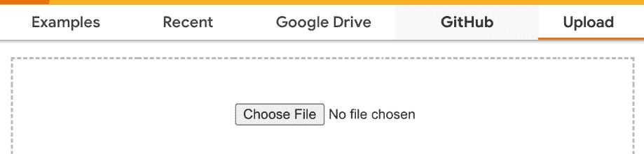
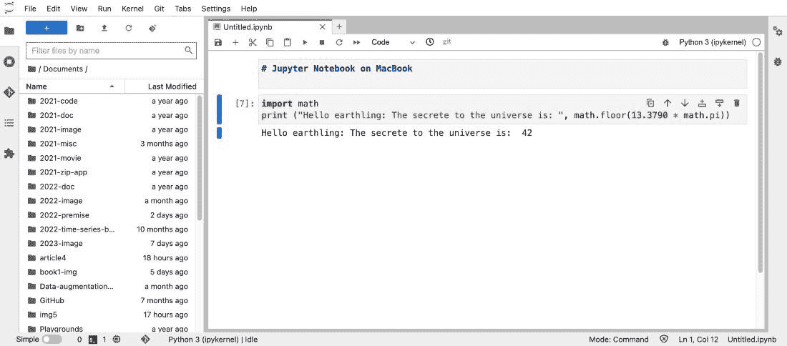
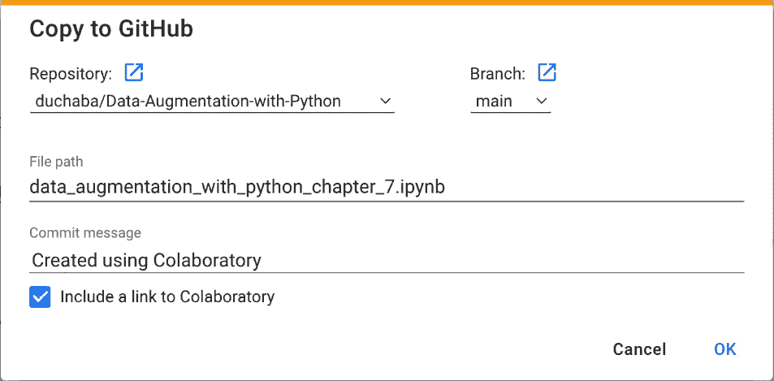

# 第一章：数据增强简化

数据增强对开发成功的**深度学习**（**DL**）项目至关重要。然而，数据科学家和开发者往往忽视了这一关键步骤。在一个实际的 DL 项目中，你将花费大部分时间来收集、清理和增强数据集，这一点不是什么秘密。因此，学习如何在不购买新数据的情况下扩展数据集是非常必要的。本书涵盖了扩展图像、文本、音频和表格数据集的标准和高级技术。此外，你还将了解数据偏差，并学习如何在**Jupyter** **Python 笔记本**中编写代码。

*第一章*将介绍各种数据增强概念，设置编码环境，并创建基础类。后续章节将详细解释各种技术，包括 Python 编程。数据增强的有效应用已经被证明是**机器学习**（**ML**）成功与失败之间的决定性因素。许多现实世界的 ML 项目停留在概念阶段，原因是缺乏足够的数据来训练 ML 模型。数据增强是一种成本效益高的技术，可以增加数据集的大小，降低训练误差率，并生成更准确的预测。

趣味事实

汽车汽油类比对首次学习数据增强和**人工智能**（**AI**）的学生非常有帮助。你可以将 AI 引擎的“数据”看作是汽油，将数据增强看作是添加剂，比如雪佛龙的 Techron 燃油清洁剂，它能使你的汽车引擎在不增加额外油料的情况下运转得更快、更平稳、行驶得更远。

在本章中，我们将定义数据增强的作用以及在不改变数据完整性的情况下扩展数据的局限性。我们将简要讨论不同类型的输入数据，如图像、文本、音频和表格数据，以及补充数据时面临的挑战。最后，我们将在随附的 Python 笔记本中设置系统要求和编程风格。

我设计这本书是为了让读者进行动手实践。最有效的学习方法是：阅读一章，运行代码，重新阅读让你困惑的部分，再跳回去修改代码，直到你牢固掌握所介绍的概念或技术。

我鼓励你修改或添加新的代码到 Python 笔记本中。这本书的主要目的是互动式学习。所以，如果遇到问题，可以从本书的 GitHub 下载一个新的副本。学习的最佳方式就是犯错并创造新东西。

数据增强是一个迭代过程，没有固定的方案。换句话说，根据数据集的不同，你可以选择增强函数并调整参数。领域专家可能会提供关于多少失真是可以接受的见解。在本章结束时，你将了解数据增强的一般规则、可以增强的输入数据类型、编程风格，以及如何在线或离线设置 Python 笔记本。

本章主要涵盖以下主题：

+   数据增强的作用

+   数据输入类型

+   Python 笔记本

+   编程风格

让我们从数据增强的作用开始。

# 数据增强的作用

数据在任何 AI 项目中都是至关重要的。这在使用**人工神经网络**（**ANN**）算法时尤其如此，也被称为**深度学习**（**DL**）。一个深度学习项目的成败主要取决于输入数据的质量。

数据增强之所以重要，主要原因之一是开发一个用于预测和预报的 AI 相对容易，而这些模型需要强大的数据输入。随着开发、训练和部署深度学习项目的显著进步，例如使用**FastAI**框架，你可以在几行 Python 代码中创建一个世界级的深度学习模型。因此，扩展数据集是提高深度学习模型准确性、超越竞争对手的有效方式。

传统的获取额外数据的方法困难、昂贵且不切实际。有时，唯一可行的选择就是使用数据增强技术来扩展数据集。

趣闻

数据增强方法可以将数据量增加十倍。例如，获取额外的皮肤癌图像相对困难。因此，使用随机组合的图像变换技术，如垂直翻转、水平翻转、旋转和扭曲，是一种可以扩展皮肤癌照片数据的实用方法。

如果没有数据增强，获取新的皮肤癌照片并进行标注既昂贵又耗时。**国际皮肤成像合作组织**（**ISIC**）是皮肤病的权威数据来源，由一组皮肤科医生验证和分类这些图片。ISIC 将数据集免费提供给公众下载。如果你无法从 ISIC 找到特定的数据集，找到其他途径将非常困难，因为访问医院或大学实验室获取皮肤病图像涉及法律和后勤障碍。获取照片后，聘请皮肤科医生团队对图像进行分类以纠正疾病会非常昂贵。

另一个例子是，通过增强获得额外图片的不可行性，例如当你从社交媒体或在线搜索引擎下载照片时。社交媒体是图像、文本、音频和视频数据的丰富来源。搜索引擎，如**Google**或**Bing**，使得下载额外数据用于项目相对容易，但版权和法律使用问题则是一个泥潭。大多数社交媒体上的图像、文本、音频和视频，如**YouTube**、**Facebook**、**TikTok**和**Twitter**，并未明确标注是否具有版权或属于公有领域。

此外，社交媒体推动流行内容，而非不受欢迎或冷门的素材。例如，假设你想为你的鹦鹉分类 AI 系统添加更多的鹦鹉图片。在线搜索会返回大量的蓝黄金刚鹦鹉、红绿金刚鹦鹉或白顶凤头鹦鹉，但不会有那么多的吉拉鹦鹉、凯阿鹦鹉或神话中的挪威蓝鹦鹉——这是一只来自蒙提·派森喜剧小品的假鹦鹉。

AI 训练所需数据不足的问题在文本、音频和表格数据类型中尤为严重。通常，获取额外的文本、音频和表格数据既昂贵又费时。文本数据受到强有力的版权保护。音频文件在网络上较为稀少，而表格数据主要来自私人公司数据库。

接下来的部分将定义四种常用的数据类型。

# 数据输入类型

四种数据输入类型是不言自明的，但值得明确界定这些数据输入类型及其不包括的内容：

+   图像定义

+   文本定义

+   音频定义

+   表格数据定义


图 1.1 – 图像、文本、表格和音频增强

*图 1**.1* 提供了图像、文本、表格和音频增强的预览。在本书的后续章节中，你将学习如何实现增强方法。

让我们从图像开始吧。

## 图像定义

图像是一个大类别，因为几乎任何事物都可以通过图像来表示，比如人、风景、动物、植物和我们周围的各种物体。图片还可以表现动作，比如运动、手语、瑜伽姿势等等。图像的一个特别富有创意的用法是通过捕捉计算机鼠标的运动轨迹来预测用户是否为黑客。

增加图片数量的技巧包括水平翻转、垂直翻转、放大、缩小、拉伸、扭曲和光照。人类在处理图像方面是专家。因此，即使图片稍微失真或变暗，你仍然可以辨认出它是同一张图像。然而，对于计算机而言情况并非如此。AI 将彩色图片表示为一个三维数组，包含宽度、高度和 RGB 作为深度。任何图像失真都会导致一个包含不同值的数组。

图形，例如时间序列数据图表和数学方程图，如 3D 拓扑图，不在图像增强的范围内。

有趣的事实

你可以通过创造性地使用数据增强方法来消除深度学习（DL）图像分类训练中的**过拟合**问题。

文本增强与图像增强有不同的关注点。我们来看看。

## 文本定义

主要的文本输入数据是英文，但相同的文本增强技术也可以应用于其他西日耳曼语言。Python 课程使用英文作为文本输入数据。

补充文本输入的技术包括回译、简单数据增强和 albumentation。有些方法乍看之下可能违反直觉，例如删除或交换句子中的单词。然而，这是一种可接受的做法，因为在现实生活中，并非每个人都写完美的英语。

例如，**美国多厅影院**（**AMC**）网站上的电影评论员写的句子通常不完整或语法错误。他们省略动词或使用不合适的词汇。一般来说，你不应期望在许多自然语言处理（NLP）项目中，文本输入数据会是完美的英语。

如果一个 NLP 模型以完美的英语作为文本输入数据进行训练，这可能会导致对典型在线评论员的偏见。换句话说，当部署到实际用户时，NLP 模型可能会预测不准确。例如，在情感分析中，AI 系统将预测一篇电影评论是否为积极或消极情绪。假设你使用完美的英语数据集来训练系统。那么，当人们写下一些带有拼写错误和语法错误的简短评论时，AI 系统可能会预测出**假阳性**或**假阴性**。

语言翻译、表意文字和象形文字不在本书的讨论范围内。现在，让我们来看看音频增强。

## 音频定义

音频输入数据可以是任何声音波形的记录，如音乐、语音和自然声音。声音波形的属性，如振幅和频率，以图形的形式表示，这些图形在技术上是图像，但你不能对音频输入数据使用任何图像增强方法。

扩展音频输入的技术分为两种类型：**波形**和**频谱图**。对于原始音频，转换方法包括时间偏移、音高缩放和随机增益，而对于频谱图，功能包括时间遮蔽、时间拉伸、音高缩放等许多其他方法。

使用非英语语言的语音不在本书的讨论范围内。这并不是因为技术上的困难，而是因为本书是用英语写成的。讨论切换到其他语言后的后果会有问题。音频增强很有挑战性，但表格数据的扩展更加困难。

## 表格数据定义

表格数据是关系数据库、电子表格或文本文件中的信息，格式通常为**逗号分隔值**（**CSV**）。表格数据增强是 ML 和 DL 领域的一个快速发展方向。表格数据增强技术包括转换、交互、映射和提取。

有趣的挑战

这是一个思维实验。除了图像、文本、音频和表格数据外，你能想到其他数据类型吗？一个提示是 *卡萨布兰卡* 和 *银翼杀手*。

本章分为两部分。前半部分讨论了各种概念和技巧；接下来的部分是基于 Python Notebook 的实践编码。本书将在所有章节中使用这种“学习-然后编码”的模式。现在是时候动手编写 Python 代码了。

# Python Notebook

**Jupyter Notebook** 是一个开源网页应用程序，是 AI、ML 和数据科学家的事实标准选择。Jupyter Notebook 支持多种编程语言，其中最受欢迎的是 Python。

在本书中，**Python Notebook** 这个术语将与 **Jupyter Notebook**、**JupyterLab** 和 **Google Colab** **Jupyter Notebook** 同义使用。

对于 Python 开发者来说，有很多集成开发环境（**IDE**）平台可供选择，例如**集成开发和学习环境**（**IDLE**）、PyCharm、Microsoft Visual Studio、Atom、Sublime 等等。然而，Python Notebook 是 AI、ML 和数据科学家首选的工具。它是一个互动式的 IDE，适合探索、编写和部署 AI 项目。

有趣的事实

最简单的学习方法是阅读本书，运行代码并进行修改。本书无法覆盖所有场景，因此你必须熟悉修改代码，使其适应你的实际数据集。Python Notebook 旨在实现交互性，赋予我们自由去玩、探索并犯错。

Python Notebook 是开发工具的首选，特别是，我们将回顾以下内容：

+   Google Colab

+   Python Notebook 选项

+   安装 Python Notebook

让我们从 Google Colab 开始。

# Google Colab

**Google Colab Jupyter Notebook** 配合 Python 是开发 AI 和 ML 项目的流行选择。你只需要一个 Gmail 账户。

Colab 可以通过 [`colab.research.google.com/`](https://colab.research.google.com/) 访问。本书中的代码使用免费版本的 Colab 足够了，Pro+ 版本提供更多的 CPU 和 GPU RAM。

登录 Colab 后，你可以从以下 GitHub URL 获取本书的 Python Notebooks：[`github.com/PacktPublishing/data-augmentation-with-python`](https://github.com/PacktPublishing/data-augmentation-with-python)。

你可以通过以下任意一种方式开始使用 Colab：

+   打开 Python Notebook 的*第一种方法*是从 GitHub 复制它。从 Colab 中，转到 `.ipynb` 文件：



图 1.2 – 从 GitHub 加载 Python Notebook

+   打开 Python Notebook 的*第二种方法*是通过 GitHub 自动加载。前往之前提到的 GitHub 链接并点击 Python Notebook (`ipynb`) 文件。点击蓝色的**在 Colab 中打开**按钮，如*图 1.3*所示；它应该出现在 Python Notebook 的第一行。这将启动 Colab 并自动加载 Python Notebook：


图 1.3 – 从 Colab 加载 Python Notebook

+   确保通过点击**文件**菜单并选择**将副本保存到 Drive**选项，将 Python Notebook 保存到本地 Google Drive。之后，关闭原文件并使用副本版本。

+   打开 Python Notebook 的*第三种方法*是通过从 GitHub 下载副本。通过点击**文件**菜单，选择**打开 Notebook**，然后点击**上传**选项卡，将 Python Notebook 上传到 Colab，如*图 1.4*所示：



图 1.4 – 通过上传到 Colab 加载 Python Notebook

有趣的事实

若要快速了解 Colab 的功能，请访问[`colab.research.google.com/notebooks/basic_features_overview.ipynb`](https://colab.research.google.com/notebooks/basic_features_overview.ipynb)。有关如何使用 Python Notebook 的教程，请访问[`colab.research.google.com/github/cs231n/cs231n.github.io/blob/master/jupyter-notebook-tutorial.ipynb`](https://colab.research.google.com/github/cs231n/cs231n.github.io/blob/master/jupyter-notebook-tutorial.ipynb)。

选择**Colab**的理由与选择 IDE 相同：主要基于您的偏好。以下部分描述了额外的 Python Notebook 选项。

## 其他 Python Notebook 选项

Python Notebooks 提供免费版和付费版，许多在线公司提供，例如 Microsoft、Amazon、Kaggle、Paperspace 等。使用多个供应商是常见的做法，因为 Python Notebook 在不同供应商间表现相同。然而，这就像选择 IDE 一样——一旦选择了一个，通常会继续在同一个环境中工作。

您可以使用以下功能标准来选择一个 Python Notebook：

+   易于设置。您能在 15 分钟内加载并运行一个 Python Notebook 吗？

+   一种免费的版本，您可以在此书中运行 Python Notebooks。

+   免费的 CPU 和 GPU。

+   Python Notebooks 和版本的免费永久存储。

+   轻松访问 GitHub。

+   易于上传和下载 Python Notebooks 到本地磁盘驱动器。

+   升级到付费版以获得更快的处理速度和更多的 CPU 与 GPU 内存。

选择 Python Notebook 的方式取决于您的需求、偏好或熟悉程度。您不必在本书的学习中使用 Google Colab。本书中的 Python Notebooks 可以在以下供应商上运行，但不限于这些：

+   Google Colab

+   Kaggle Notebooks

+   Deepnote

+   Amazon SageMaker Studio Lab

+   Paperspace Gradient

+   DataCrunch

+   Visual Studio Code 中的 Microsoft Notebooks

基于云的选项依赖于始终有快速的互联网连接，因此如果网络连接是一个问题，你可能需要在笔记本电脑/计算机上本地安装 Python Notebook。安装过程非常简单。

## 安装 Python Notebook

Python Notebook 可以在 Windows、Mac 和 Linux 的本地桌面或笔记本上安装。在线版本的优势如下：

+   完全可定制

+   无运行时限制——即在长时间训练过程中，Python Notebook 不会超时

+   没有规则或随意的限制

缺点是你必须设置并维护环境。例如，你需要做以下操作：

+   安装 Python 和 Jupyter Notebook

+   安装并配置 NVIDIA 显卡（对于数据增强可选）

+   维护和更新几十个依赖的 Python 库

+   升级硬盘驱动器、CPU 和 GPU 内存

安装 Python Notebook 很简单，只需要一个控制台或终端命令，但首先要检查 Python 版本。在终端或控制台应用中输入以下命令：

```py
>python3 --version
```

你应该安装 3.7.0 或更高版本。如果你没有 Python 3 或安装的是较旧版本，请从 [`www.python.org/downloads/`](https://www.python.org/downloads/) 安装 Python。

使用 `pip` 安装 JupyterLab，其中包含 Python Notebook。在 Windows、Mac 或 Linux 笔记本上，使用以下命令适用于所有三种操作系统：

```py
>pip install jupyterlab
```

如果你不喜欢 `pip`，可以使用 `conda`：

```py
>conda install -c conda-forge jupyterlab
```

除了 `pip` 和 `conda`，你还可以使用 `mamba`：

```py
>mamba install -c conda-forge jupyterlab
```

使用以下命令启动 JupyterLab 或 Python Notebook：

```py
>jupyter lab
```

在 Mac 上安装 Python Notebook 的结果如下：



图 1.5 – 本地 MacBook 上的 Jupyter Notebook

下一步是从相应的 GitHub 链接克隆本书的 Python Notebook。你可以使用 GitHub 桌面应用程序、终端命令行上的 GitHub 命令，或者使用带有魔法字符感叹号（`!`）和标准 GitHub 命令的 Python Notebook，具体如下：

```py
url = 'https://github.com/PacktPublishing/Data-Augmentation-with-Python'
!git clone {url}
```

无论你选择基于云的选项（如 Google Colab 或 Kaggle）还是离线工作，Python Notebook 代码都能一样运行。接下来的部分将深入探讨 Python Notebook 编程风格，并介绍 Pluto。

# 编程风格

编码风格是面向对象编程的标准、经过验证的方法，并且是函数和变量的命名约定。

趣味事实

大多数你在博客和网站上找到的 Python 代码只是代码片段。因此，它们在学习像数据增强这样的基础主题时帮助不大。此外，在 Notebook 上使用 Python 会导致懒惰的编程习惯，因为程序员认为每个 Notebook 的代码单元都是一个与整体分开的片段。实际上，整个 Python Notebook 是一个程序。使用最佳编程实践的主要好处之一是，它能帮助你更容易地学习和记住知识。一种编程风格可能包括许多标准的最佳实践，但它也独具个性。通过这种方式，你可以更快地学习新概念和技巧，比如如何编写数据增强代码。

本节包含了不少主题，特别是我们将覆盖以下几个概念：

+   源代码管理

+   `PackTDataAug` 类

+   命名规范

+   扩展基础类

+   引用库

+   导出 Python 代码

+   Pluto

让我们从源代码管理开始。

## 源代码管理

编程的第一条规则是管理源代码版本。这将帮助你回答以下问题：*你上周写了什么代码？*、*昨天修复了什么？*、*今天添加了什么新功能？* 和 *如何与我的团队共享代码？*

Git 过程管理一个人或一个团队的源代码。Git 的诸多优点之一是它允许犯错误。换句话说，Git 允许你尝试新的东西或破坏代码，因为你始终可以回滚到先前的版本。

对于源代码管理，**GitHub** 是一个流行的网站，而 **Bitbucket** 排名第二。你可以通过命令行终端或 Git 应用程序（如 GitHub Desktop）使用 Git 过程。

Google Colab 内置了 Git 功能。你已经看到将 Python Notebook 加载到 Google Colab 上是多么简单，保存它也同样容易。在 Git 中，你必须进行提交并推送。步骤如下：

1.  从 **Colab** 菜单中，点击 **文件**。

1.  选择 **保存副本** **到 GitHub**。

1.  在 **仓库** 字段中输入你的 GitHub URL 并选择代码分支。

1.  输入提交信息。

1.  点击 **确定**：



图 1.6 – Google Colab – 保存到 GitHub

*图 1.6* 显示了 Google Colab Python Notebook 和 GitHub 之间的界面。接下来，我们将查看基础类 `PacktDataAug`。

## PacktDataAug 类

基础类的代码既不是原创的，也不是本书独有的。它是构建面向对象类的标准 Python 代码。对象的名称在每个项目中都不同。对于本书来说，类的名称是 `PacktDataAug`。

每一章都以这个基础类开始，随着我们学习新概念和数据增强技巧，我们将使用 Python 装饰器向对象添加新方法。

本练习的 Python 代码在 Python Notebooks 和本书的 GitHub 仓库中。因此，我不会在本书中复制或展示完整代码。我会展示相关代码行，解释其意义，并依赖你在 Python Notebooks 中学习整个代码。

基类的定义如下：

```py
# class definition
class PacktDataAug(object):
  def __init__(self,
    name="Pluto",
    is_verbose=True,
    args, **kwargs):
```

`PacktDataAug`继承自基础的`Object`类，定义中有两个可选参数：

+   `name`参数是一个字符串，它表示你的对象的名称。它没有其他实质性功能，仅用于标记对象。

+   `is_verbose`是一个布尔值，指示对象在实例化时是否打印对象信息。

下一部分我们将讨论代码命名规范。

## 命名规范

代码命名规范如下：

+   函数的名称将以动词开头，如`print_`、`fetch_`或`say_`。

+   返回布尔值的函数以`is_`或`has_`开头。

+   变量名称以名词开头，而不是动词。

+   Python 社区关于是否使用驼峰命名法——例如`fetchKaggleData()`——还是使用小写字母加下划线——例如`fetch_kaggle_data()`——展开了激烈的讨论。本书采用小写字母加下划线的命名方式。

+   以单下划线开头的函数或变量是临时变量或辅助函数——例如`_image_auto_id`、`_drop_images()`和`_append_full_path()`。

+   变量或函数的缩写很少使用，因为描述性名称更容易理解。此外，Colab 有自动补全功能，因此使用长而描述性的名称可以更容易输入且减少打错字的机会。

实例化基类的代码是标准的 Python 代码。我使用了`pluto`作为对象名称，但你可以选择任何名称：

```py
# Instantiate Pluto
pluto = PackTDataAug("Pluto")
```

输出如下：

```py
--------------------------- : ---------------------------
            Hello from class : <class '__main__.PacktDataAug '> Class: PacktDataAug
                   Code name : Pluto
                   Author is : Duc Haba
---------------------------- : ---------------------------
```

基类带有两个简单的辅助方法。它们都用于打印美观的输出——也就是将状态或输出信息整齐地居中打印。

`self._ph()`方法打印带有等长破折号的头部行，破折号两侧各有一个冒号字符，而`self._pp()`函数有两个参数，一个用于左侧，另一个用于右侧。

你已经看到过使用`is_verbose=True`默认参数实例化`pluto`的结果。作为标准做法，我不会在本书中打印完整代码。我依赖你在 Python Notebook 中查看和运行代码，但在这一章中我会破例，展示`is_verbose`选项的代码片段。这展示了在 Python Notebook 中阅读 Python 代码是多么容易。代码片段如下：

```py
# code snippet for verbose option
if (is_verbose):
  self._ph()
  self._pp(f"Hello from class {self.__class__} Class: {self.__class__.__name__}")
  self._pp("Code name", self.name)
  self._pp("Author is", self.author)
  self._ph()
```

趣味小贴士

本书的主要目标是帮助你编写干净且易于理解的代码，而不是编写可能导致混淆的紧凑代码。

另一个强大的编程技巧是使用 Python 装饰器扩展基类。

## 扩展基类

本书被设计为一个互动式的学习旅程，您将逐步学习和发现新的数据增强概念和技术，从图像、文本和音频数据到表格数据。随着旅程的推进，对象`pluto`将获得新的方法。因此，拥有一种扩展类并添加新功能的技术至关重要。相比之下，若在本书开始时就提供完全构建好的类，您将无法开始学习之旅。通过探索式学习，您能比通过死记硬背更长时间地保持知识。

`@add_method()`装饰器函数能够为任何类扩展新功能。

这是扩展基类的一个出色示例。Python 中最常见且令人沮丧的错误根本原因是库版本与类作业或从 Python 社区复制的代码片段不同。Python 数据科学家很少从零开始编写代码，而是大量依赖现有的库。因此，在本地或云服务器上打印 Python 库版本，将节省数小时烦人的调试时间。

为了解决此问题，我们可以扩展`PacktDataAug`类，或者使用将 Pluto 教会新技能的旅程隐喻。新的方法`say_sys_info()`将在左侧打印本书预期的系统库版本，在您的本地或远程服务器上打印实际的库版本。扩展 Pluto 类的装饰器定义如下：

```py
# using decorator to add new method
@add_method(PackTDataAug)
def say_sys_info(self):
```

在运行上述代码单元后，您可以使用以下命令让 Pluto 打印出库版本：

```py
# check Python and libraries version
pluto.say_sys_info()
```

结果如下：

```py
---------------------------- : ---------------------------
                 System time : 2022/07/23 06:36
                    Platform : linux
     Pluto Version (Chapter) : 1.0
            Python (3.7.10)  : actual: 3.7.12 (default, Apr 24 2022, 17:11:25) [GCC 7.5.0]
            PyTorch (1.11.0) : actual: 1.12.1+cu113
              Pandas (1.3.5) : actual: 1.3.5
                 PIL (9.0.0) : actual: 7.1.2
          Matplotlib (3.2.2) : actual: 3.2.2
                   CPU count : 2
                  CPU speed : NOT available
---------------------------- : ---------------------------
```

如果您的结果包含比本书预期版本更旧的库版本，在学习过程中可能会遇到错误。例如，**Pillow**（**PIL**）库的版本是 7.1.2，低于本书预期的 9.0.0 版本。

为了解决这个问题，请在 Notebook 中运行以下代码行来安装 9.0.0 版本：

```py
# upgrade to Pillow library version 9.0.0
!pip install Pillow==9.0.0
```

重新运行`pluto.say_sys_info()`应该会显示**PIL**版本为 9.0.0。

有趣的挑战

扩展 Pluto 类，新增一个函数来显示系统的 GPU 总 RAM 和可用的空闲 RAM。该函数名可以是`fetch_system_gpu_ram()`。提示：可以使用`torch`库以及`torch.to cuda.memory_allocated()`和`torch.cuda.memory_reserved()`函数。您可以使用这种技巧扩展任何 Python 库类。例如，要向`numpy`库添加新函数，可以使用`@add_method(numpy)`装饰器。

还有一些编程风格的话题。接下来，您将学习如何最佳地引用库。

## 引用库

Python 是一种灵活的语言，支持导入库时使用别名或直接导入。以下是导入相同函数`plot()`的一些例子：

```py
# display many options to import a function
from matplotlib.pyplot import plot
import matplotlib.pyplot
import matplotlib.pyplot as plt # most popular
# more exotics importing examples
from matplotlib.pyplot import plot as paint
import matplotlib.pyplot as canvas
from matplotlib import pyplot as plotter
```

关键点是所有这些示例都是有效的，这既好又坏。它提供了灵活性，但同时，当在线分享代码片段或维护代码时，出现问题时会让人感到沮丧，因为 Python 经常在系统无法找到函数时给出难以理解的错误信息。要修复这个问题，你需要知道需要升级哪个库。当许多库使用相同的函数名时，问题变得更加复杂，例如`imread()`方法，它至少出现在四个库中。

遵循本书的编程风格，当`imread()`方法失败时，你就知道需要升级或在极少数情况下降级哪个库。代码如下：

```py
# example of use full method name
import matplotlib
matplotlib.pyplot.imread()
```

`matplotlib`可能需要升级，或者你可能正在使用错误的`imread()`方法。它可能来自`cv2.imread()`。

下一个概念是导出。它可能不严格属于编程风格的一部分，但如果你希望重用并为本章的代码添加额外功能，它是必要的。

## 导出 Python 代码

本书确保每一章都有自己的 Python Notebook。高级的图像、文本和音频章节需要上一章的代码。因此，需要从 Python Notebook 中导出选定的 Python 代码单元。

Python Notebook 既有标记单元也有代码单元，并不是所有的代码单元都需要导出。你只需要导出那些定义新函数的代码单元。对于你希望导出到 Python 文件的代码单元，在代码单元的开头使用 Python Notebook 中的`%%writefile file_name.py`魔法命令，并使用`%%writefile -a file_name.py`将额外的代码追加到文件中。`file_name`是 Python 文件的名称——例如，`pluto_chapter_1.py`。

编程风格中最后也是最重要的部分是将**Pluto**引入作为你的编程伴侣。

## Pluto

Pluto 采用了一种异想天开的教学方式，通过与虚拟数字角色的对话来进行教学。我们可以给 Pluto 分配任务。它的语气友好，有时作者会直接与你对话。它摒弃了直接讲授的方式。有学术论文解释了单口相声式讲授不是学习新概念的最佳方法，例如 Michelene T. H. Chi、Seokmin Kang 和 David L. Yaghmourian 于 2016 年在《学习科学杂志》上发表的文章*Why Students Learn More From Dialogue- Than Monologue-Videos: Analyses of Peer Interactions*。

你很可能是独自阅读本书，而不是与小组一起学习如何编写增强代码。因此，创建一个虚拟伴侣作为实例化对象可能会激发想象力。它让编写和阅读变得更容易——例如，`pluto.fetch_kaggle_data()`函数一目了然，几乎不需要额外文档。它将 Python 代码简化为一个常见的主题和动词句式。

有趣的挑战

将对象名称从`pluto = PackTDataAug("Pluto")`更改为`hanna =` `PackTDataAug("Hanna")`。

**友情提醒**：不要选择你心爱的猫作为对象名称，因为猫咪不会听从任何命令。想象一下，问你的猫玩接飞盘游戏。

# 总结

在本章中，你学到了数据增强在深度学习（DL）和生成式 AI 中对于提高预测准确性至关重要。数据增强是一种经济的方式，可以在不需要购买和标注新数据的情况下扩展数据集。

四种输入数据类型分别是图像、文本、音频和表格。每种数据类型面临不同的挑战、技术和局限性。此外，数据集决定了哪些函数和参数是合适的。例如，人脸和航拍照片是图像数据集，但你不能通过垂直翻转人脸图像来扩展数据；然而，你可以垂直翻转航拍照片。

本章的第二部分，你使用了**Python 笔记本**来加深对这些增强概念的理解。你选择了 Python 笔记本作为默认的 IDE，以便访问基于云的平台，如**Google Colab**或**Kaggle**，或者在你的笔记本电脑上本地安装 Python 笔记本。

*编程风格*部分为 Python 笔记本的结构奠定了基础。它提到了**GitHub**作为一种源代码管理形式，使用基类、扩展基类、长函数名、导出到 Python 以及引入 Pluto。

本章以 Pluto 作为主要对象奠定了基础。Pluto 并没有从完整的数据增强功能开始——他从一个最小的结构开始，并随着每一章学习新的数据增强概念和技术，逐步将新方法添加到他的工具库中。

到本书结束时，Pluto 和你将学到关于如何增强图像、文本、音频和表格数据的技术。换句话说，你将学会如何从零开始编写强大的图像、文本、音频和表格增强类，使用真实世界的数据，这些类可以在未来的数据增强项目中复用。

本章中有*有趣的事实*和*有趣的挑战*。Pluto 希望你能利用提供的内容，拓展你的经验，超越本章的范围。

在*第二章*，*数据增强中的偏差*中，Pluto 和你将探讨数据增强如何增加偏差。将数据偏差作为数据增强的指导原则是一个常被忽视的技巧。
