# 第二章：数据增强中的偏差

随着 **人工智能**（**AI**）在我们的社会中逐渐深入，它在 AI 系统中的偏差将不利于你的生活质量。这些 AI 系统，特别是在 **深度学习**（**DL**）和生成式 AI 中，依赖于你用来扩展数据增强的输入数据。

AI 系统在做出决策时高度依赖数据，如果用于训练系统的数据存在偏差，那么 AI 系统将做出不公平的决策。这将导致对个人或群体的不公正对待，并 perpetuate 系统性的不平等。AI 在改变生活的决策中扮演着决定性角色，例如每月的房贷保险费是多少，是否可以获得汽车贷款批准，求职资格，谁能获得政府援助，牛奶的价格，你在社交媒体新闻源上看到的内容，以及你国家的石油进口或出口量，等等。

通过在深入学习数据增强之前了解数据偏差，你将能够帮助开发出有益于社会的道德和公平的 AI 系统。这将帮助你做出关于数据使用的明智决策，防止现有偏差和不平等的延续。此外，理解数据偏差将帮助你做出关于数据收集过程的明智决策，确保数据具有代表性且不带偏见。

数据偏差可能对数据科学家和大学生来说是一个问题，因为它们很少在大学课程中讨论或没有提供。没有现成的公平矩阵可以用于数据增强的编程。也许通过使用最新的生成式 AI，偏差甚至可能来源于计算机系统，而不完全是由人类造成的。

提供受保护和安全的软件产品与服务有许多策略，但 AI 系统需要新的流程和视角。值得信赖和负责任的 AI 是关于公平、道德设计以及最小化偏差。实现值得信赖的 AI 从透明度、数据集、**测试、评估、验证和确认**（**TEVV**）开始，正如 *《人工智能偏差识别与管理标准，国家标准与技术研究所（NIST）》* 特别出版物 1270 所定义。

趣闻

2016 年，Twitter 在 1 天内让微软的 AI 聊天机器人 **Tay** 变得堕落。微软创建 Tay 主要用于在线的休闲和玩乐对话。Tay 被设计为从网络中的未经整理的数据和评论中学习和获取输入。Twitter 社区觉得用厌女症、种族主义和暴力的推文来教 Tay 很有趣。直到今天，Tay 仍然是关于数据偏差输入教训的典型案例。正如一位博主所说：“*火焰垃圾堆进，火焰垃圾堆出*。”

本章将为你提供一个快速教程，帮助你认识到**计算**、**人类**和**系统性**偏差的区别。我们将了解偏差的概念，但不会练习如何编程计算偏差。公平性和混淆矩阵用于衡量 AI 预测的**真正正例**、**假正例**、**真负例**和**假负例**。然而，公平性和混淆矩阵是用于构建 AI 系统的，而不是数据增强。在观察真实世界的文本数据集时，我们将尝试编写 Python 代码来生成包含单词计数和拼写错误的公平性矩阵，但大多数情况下，我们将依赖 Pluto 和你的观察来命名图像和文本数据中的偏差。

本章中的 Python 代码将重点帮助你学习如何从*Kaggle*网站下载真实世界的数据集。后续章节将重复使用本章中展示的辅助函数和封装函数。

到本章结束时，你将更加深刻地理解平衡数据集。特别是，我们将涵盖以下主题：

+   计算偏差

+   人类偏差

+   系统性偏差

+   Python Notebook

+   图像偏差

+   文本偏差

冥王星将从三种偏差中最容易的——计算偏差开始。

# 计算偏差

在我们开始之前，提前提醒一下，你不会学习如何编写 Python 代码来计算数据集中的计算偏差的数值评分。本章的主要目的是帮助你学习如何从 Kaggle 网站获取真实世界的数据集，并通过观察来发现数据中的偏差。虽然会有一些代码用于计算数据集中的公平性或平衡性，但重点还是在观察。

比如，我们将计算文本数据集中每条记录的单词计数和拼写错误的单词。

你可能认为所有的偏差都是一样的，但将它们分为三类会更有帮助。偏差类别之间的差异在初次阅读数据偏差时可能很微妙。一个帮助区分这些差异的方法是思考你如何去除或减少 AI 预测中的误差。例如，计算偏差可以通过改变数据集来解决，而系统性偏差则可以通过改变 AI 系统的部署和访问策略来解决。

计算偏差源于数据集中针对一般人群的不均衡。换句话说，它偏向或低估了某个群体或数据类别。这些偏见可能是无意的，也可能是根深蒂固的。数据比通常的随机性更为偏斜。因此，算法将面临更高的假正例和假负例预测问题。

**数据集表示** (**DR**) 和 **机器学习算法** (**MLAs**) 是两种计算偏差。DR 更容易理解，并且与数据增强更为密切相关。本节中的许多例子都来自 DR 偏差。MLA 则特定于某个项目，无法广泛推广。

以下是一些计算偏差的例子：

+   *从 1970 年代中期开始的柯达“雪莉卡片”设定了摄影的肤色标准*是技术偏见中较为著名的例子之一。**雪莉卡片**是柯达用来校准图像的工具，如肤色和阴影，目的是在打印人们的照片之前进行调整。它是设置过程的一部分，并且在打印设施中经常使用。雪莉是柯达的一名员工的名字。由于这种无心且非故意的歧视，三十年来，美国打印的照片并未显示出非白人肤色的真实肤色。

+   *谷歌开放 AI DALL-E 2*，是 2022 年发布的一个 AI 模型，可以根据文本生成图片。例如，你可以输入*一只吃西兰花穿粉色波点泳衣的河马*，DALL-E 2 就会生成这张图片。尽管这一技术突破备受推崇，但也存在偏见，正如*NBC 科技*新闻的杰克·特雷洛（Jake Traylor）在文章《没有快捷解决方案：OpenAI 的 DALL-E 2 如何揭示 AI 偏见的挑战》中所报道的那样。例如，在 DALL-E 中，某个构建者生成的图像只展示了男性，而某个航班乘务员的标题则只生成了女性的图像。DALL-E 2 还继承了其训练数据中的各种偏见，有时其生成的结果会加剧社会刻板印象。

+   英国**信息专员办公室**（**ICO**）在 2022 年 7 月披露，AI 自动化的潜在歧视可能会对社会产生严重后果。例如，这可能导致不公平或带有偏见的工作拒绝、银行贷款或大学录取。此外，与 ICO 同时发布的还有*卫报*的文章《英国数据监管机构调查 AI 系统是否存在种族偏见》，由丹·米尔莫（Dan Milmo）撰写。ICO 的目标是制定一个公平且符合伦理的 AI 系统指南。

有趣的事实

使用生成式 AI 和**稳定扩散**在*GitHub*上的 Python Notebook，由 Duc Haba 分支，冥王星写道：“*一只用水晶球做成的可爱小河马，带有低多边形的眼睛，四周环绕着发光的光晕，细节精致复杂的概念艺术，流行艺术站点 8K，吃西兰花，身穿粉色波点衣服，位于城市中。*”经过多次运行并稍微调整措辞后，他最喜欢的生成图像被创作出来。这些是原始图像：


图 2.1 – 生成式 AI，稳定扩散分支

*图 2**.1* 显示了一只吃西兰花的河马。在这个有趣的插曲后，我们已结束关于计算偏见的这一部分。冥王星是一个数字狗，但它能讲述人类的偏见，接下来它将在下一部分进行讲解。

# 人类偏见

使用 Python 代码计算人类偏见更为困难。没有 Python 或其他编程语言库可以计算数据集中的人类偏见的数值评分。我们依赖观察来识别这些人类偏见。在推导出可能的人类偏见之前，手动研究特定数据集非常耗时。我们可以辩称，这不是程序员或数据科学家的工作，因为没有可编程的方法可供遵循。

人类偏见反映了人类思维中的系统性错误。换句话说，当你开发一个人工智能系统时，你会受到你所选择的算法和数据的限制。因此，有限结果的预测可能会因为你的选择而产生偏见。这些偏见在个人、群体、机构、企业、教育和政府中隐性存在。

人类偏见种类繁多。认知偏见和感知偏见在各个领域都表现得很明显，并不仅限于人类与人工智能的互动。围绕思维、决策和行为经济学中的偏见与启发式方法，有一个专门的研究领域，如锚定偏见和确认偏见。

作为增强数据的数据科学家，仅仅意识到固有的人类偏见，我们就可以在开发和训练模型之前指出数据中的缺陷。

以下是现实世界中人工智能系统中人类偏见的几个例子：

+   **中华人民共和国**（**PRC**）在新疆省实施了面部识别人工智能，用于监控少数民族，如维吾尔族。这是已知的第一个政府专门使用人工智能进行种族画像的例子。该系统存在缺陷，存在歧视，因为它将贫穷和年长的人误判为少数民族的假阳性预测。问题的复杂化在于缅甸购买了中国的系统来打压政治异见者，正如**外交关系委员会**在其 2022 年发表的《人工智能伦理中国际规范的重要性》一文中所报告的那样。

+   为了阻止广告商滥用 Facebook 新闻推送算法，Meta 限制了广告定向算法，禁止使用健康、种族、民族、政治立场、宗教和性取向等信息。**NPR**在文章中报道，Facebook 已经取消了基于政治、种族及其他“*敏感*”话题的广告定向。此项变化已于 1 月 10 日生效，涵盖 Meta 的所有应用程序，包括 Facebook、Instagram、Messenger 和 Audience Network。据报道，广告商对人群进行了微定向，传递量身定制的信息。换句话说，广告商基于受保护的特征排除了某些人群，并使用反犹太的短语定向广告。

+   《**科学美国人**》于 2019 年 10 月 4 日发布的文章《在一个主要的医疗风险算法中发现种族偏见》揭示了医疗系统中的许多偏见。黑人患者在干预和急诊就诊时支付更多费用。除了支付更高的费用，黑人患者还会获得较低质量的护理。AI 科学家使用历史数据中的种族和财富信息来训练医疗系统。因此，该系统对少数群体表现出偏见，影响了 2 亿美国人。

趣味挑战

这个挑战是一个思想实验。如果给定充足的预算和时间，你如何建立一个没有偏见的 AI？提示：想想我们曾经拥有过世界和平或没有犯罪的城市的时候。它不可能是一个绝对的答案。它必须是一个接受度的水平。

看清人类偏见与计算偏见之间的区别可能具有挑战性。有些偏见并不是单一的。换句话说，它们不是互相排斥的——你可以在一个 AI 系统中同时存在人类偏见和计算偏见。

人类偏见很难识别，因为它们塑造了我们对世界的感知。然而，系统性偏见在理论上可能更容易解决，但在实践中可能具有挑战性。

# 系统性偏见

如果我们无法构思出一种方法来计算计算偏见和人类偏见，那么就不可能设计出一个算法来程序化地计算系统性偏见。我们必须依赖人类判断来发现数据集中的系统性偏见。此外，它必须特定于某个特定的数据集，并具有明确的 AI 预测目标。没有通用的规则，也没有公平矩阵可循。

AI 中的系统性偏见是所有 AI 偏见中最臭名昭著的一种。简单来说，系统性歧视指的是当一个企业、机构或政府限制某一群体获得 AI 的利益，同时排除其他弱势群体时的情况。它具有隐蔽性，因为它隐藏在社会现有的规则和规范背后。制度性种族主义和性别歧视是最常见的例子。另一个在日常生活中常见的 AI 可及性问题是限制或排除残疾人士的入场，比如视力和听力受限的人群。

贫困群体和弱势群体在 AI 系统开发过程中没有代表权，但他们却被迫接受 AI 的预测或预测结果。这些 AI 会做出重大生活决策，包括针对贫困和弱势群体的决策，比如汽车或健康保险的费用、住房或商业银行贷款的选择，或者是否有资格接受医疗治疗。

以下是一些 AI 系统性偏见的现实例子：

+   2022 年 7 月 4 日，《洛杉矶时报》发布的文章*研究人员利用人工智能预测犯罪，揭示洛杉矶等美国大城市的偏见性执法*发现了执法中的人工智能偏见。芝加哥大学的 AI 犯罪预测系统没有解决执法中的系统性偏见。对潜在犯罪地点或热点的预测基于有缺陷的输入和与贫困社区相关的环境因素，而不是犯罪发生的实际地点。人工智能反映了执法实践和程序中的系统性偏见。因此，它预测贫困社区的犯罪率较高，因为警察在过去的系统性偏见。

+   美国司法部审查了**囚犯评估工具：估算风险和需求**（**PATTERN**），并发现谁能使用 PATTERN 存在系统性偏见。此问题在 2020 年 5 月 10 日由《监管审查》发布的*解决算法性 PATTERN 偏见*一文中进行了讨论。报告强化了司法部对低风险罪犯应为唯一符合提前释放条件的偏见观点。PATTERN 将囚犯分为低、中、高风险，预测这些人是否会在释放后再次犯罪。由于 PATTERN 仅限于特定群体，它排除了其他囚犯的提前释放机会。

+   文章*机器学习中的偏见潜力及健康保险公司应对的机会*报告了关于机器学习如何反映并延续过去和现在的系统性不公正与偏见的日益关注。该文于 2022 年 2 月由《健康事务》杂志发布。对住院可能性、药房入驻情况以及缺失或不完整数据的有限访问是种族主义和代表性不足群体的几种系统性偏见。因此，人工智能的预测可能会反映这些系统性偏见，而基于这些预测风险做出的政策决策可能会加剧现有的不平等。

趣味挑战

这个挑战是一个思想实验。哪个类别的偏见更容易发现？提示：考虑公司利润。

计算偏见、人为偏见和系统性偏见有相似之处，并且它们不是相互排斥的。没有算法或库来指导你的编码工作，它依赖于你通过学习数据集所做的观察。此时，Pluto 已经准备好学习如何从*Kaggle*网站获取真实世界的数据集。作为选择性任务，他将要求你在数据集中发现偏见。

# Python 笔记本

本章的编码课程主要集中在从*Kaggle*网站下载真实世界的数据集。后续章节将依赖或重用这些数据获取功能。

在上一章中，你学习了本书关于在 Python Notebook 上进行开发的一般规则。名为 **Pluto** 的面向对象类包含方法和属性，你在学习新概念和技术时将向 Pluto 添加新的方法。如果你不确定开发理念，可以回顾 *第一章*。

在本书中，**Python Notebook** 一词与 **Jupyter Notebook**、**JupyterLab** 和 **Google Colab Notebook** 同义使用。

有趣的挑战

Pluto 挑战你将对象的名称从 `pluto.draw_batch_image()` 改为 `sandy.draw_batch_image()`。

从本章开始，使用 Python Notebook 的设置过程将在每一章中保持一致。本章的目标是帮助你更深入地理解数据集，而不是编写用于计算每个数据集偏差值的 Python 代码。设置步骤如下：

1.  加载 Python Notebook。

1.  克隆 GitHub。

1.  实例化 Pluto。

1.  验证 Pluto。

1.  创建 Kaggle ID。

1.  下载真实世界的数据集。

让我们从加载 Python Notebook 开始。

## Python Notebook

第一步是定位 `data_augmentation_with_python_chapter_2.ipynb` 文件。该文件位于本书的 GitHub 仓库中，链接为 [`github.com/PacktPublishing/Data-Augmentation-with-Python`](https://github.com/PacktPublishing/Data-Augmentation-with-Python)。如果你忘记了如何加载 Python Notebook，请参考 *第一章*。

下一步是克隆 GitHub 仓库。

## GitHub

第二步是定位 `~/Data-Augmentation-with-Python/pluto/pluto_chapter_1.py` 文件。该文件位于本书的主要 GitHub 仓库中的 `pluto` 文件夹下。

Pluto 在 **Google Colab** 上使用 Python Notebook。每次都会启动一个新的会话——也就是说，不会保存上次会话的永久存储。因此，加载所有所需文件的更快、更简单的方法是克隆 GitHub 仓库。它可以是本书的 GitHub 仓库，或者是你自己 Fork 的 GitHub 仓库。

从这一点开始，所有命令、代码和引用都来自 `data_augmentation_with_python_chapter_2.ipynb` Python Notebook。

Pluto 使用 `!git clone {url}` 命令来克隆一个 GitHub 仓库，其中 `{url}` 是 GitHub 仓库的链接。代码片段如下：

```py
# load from official GitHub repo.
!git clone https://github.com/PacktPublishing/Data-Augmentation-with-Python
# optional step, sustitute duchaba with your GitHub space
!git clone https://github.com/duchaba/Data-Augmentation-with-Python
```

在 Python Notebook 中，任何以感叹号（`!`）开头的代码单元将告诉系统将其作为系统 shell 命令行运行。对于 Google Colab，它是 `%`）这样的特殊命令，它们被称为 **魔法关键词** 或 **魔法命令**。

有趣的事实

Jupyter Notebook 的内置魔法命令为底层 `%` 提供了便捷的功能。例如，`%ldir` 用于列出当前目录文件，`%cp` 用于复制本地目录中的文件，`%debug` 用于调试，等等。一个有用的 `%lsmagic` 命令用于列出当前 Python Notebook 环境支持的所有可用魔法命令。感叹号字符 (`!`) 用于运行底层操作系统命令行功能。例如，在 Linux 系统中，`!ls -la` 用于列出当前目录中的文件，而 `!pip` 用于安装 Python 库。

现在你已经下载了 Pluto 的 Python 代码，下一步是实例化 Pluto。

## Pluto

实例化 Pluto 的 Python Notebook 魔法命令如下：

```py
# instantiate pluto
pluto_file='Data-Augmentation-with-Python/pluto/pluto_chapter_1.py'
%run {pluto_file}
```

输出如下：

```py
---------------------------- : ---------------------------
            Hello from class : <class '__main__.PackTDataAug'> Class: PackTDataAug
                   Code name : Pluto
                   Author is : Duc Haba
---------------------------- : ---------------------------
```

设置过程中的倒数第二步是验证 Pluto 是否正在运行正确版本。

## 验证 Pluto

为了进行双重检查，Pluto 运行以下函数：

```py
# Are you ready to play?
pluto.say_sys_info()
```

结果应与以下输出类似：

```py
---------------------------- : ----------------------------
                 System time : 2022/08/16 06:26
                    Platform : linux
       Python version (3.7+) : 3.7.13 (default, Apr 24 2022, 01:04:09) [GCC 7.5.0]
     Pluto Version (Chapter) : 1.0
            PyTorch (1.11.0) : actual: 1.12.1+cu113
              Pandas (1.3.5) : actual: 1.3.5
                 PIL (9.0.0) : actual: 7.1.2
          Matplotlib (3.2.2) : actual: 3.2.2
                   CPU count : 2
                  CPU speed : NOT available
---------------------------- : ----------------------------
```

由于这段代码来自于*第一章*，Pluto 的版本是**1.0**。在 Pluto 从 *Kaggle* 网站下载数据集之前，他需要 Kaggle 的 **密钥** 和 **访问令牌**。

## Kaggle ID

Pluto 使用 Kaggle 数据集，因为他想学习如何获取用于数据增强的真实世界数据。这比使用一小套虚拟数据更有影响力。因此，前两步是安装库以帮助下载 Kaggle 数据并在[Kaggle.com](https://Kaggle.com)上注册。

安装和导入的代码可以在开源 **opendatasets** 库中找到，该库由 **Jovian** 提供。功能代码位于 Python Notebook 中；以下是其中的一个代码片段：

```py
# install opendatasets library
!pip install opendatasets --upgrade
import opendatasets
```

在你在[Kaggle.com](http://Kaggle.com)上创建账户后，你将拥有一个 **Kaggle 用户名** 并收到一个 **Kaggle 密钥**。接下来，进入 **账户** 页面，向下滚动到 **API** 部分，点击 **创建新 API 令牌** 按钮以生成 **Kaggle 密钥**：

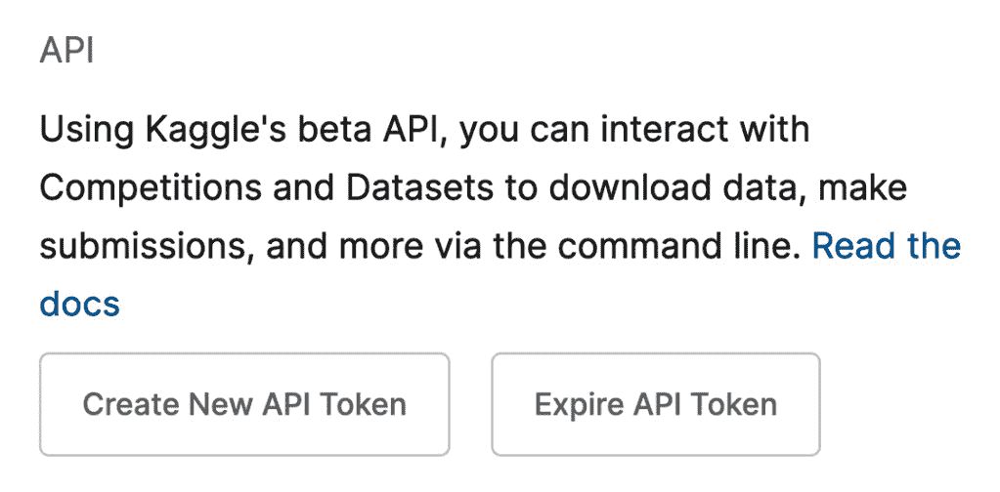

图 2.2 – Kaggle 账户页面 – 新的令牌

一旦你有了 `remember_kaggle_access_key()` 包装方法来存储对象中的属性。代码使用 Python 的 `self` 关键字来存储这些信息 – 例如，`self.kaggle_username`。该方法的定义如下：

```py
# method definition
def remember_kaggle_access_keys(self,username,key):
```

其他方法将自动使用这些属性。Pluto 运行以下方法来记住你的 Kaggle 用户名和密钥：

```py
# save Kaggle username and key
pluto.remember_kaggle_access_keys("your_username_here",
  "your_key_here")
```

`_write_kaggle_credit()` 方法将你的 Kaggle 用户名和密钥写入两个位置 – `~/.kaggle/kaggle.json` 和 `./kaggle.json`。它还会将文件属性更改为 `0o600`。这个函数以一个下划线开头；因此，它是一个主要供其他方法使用的辅助函数。

Pluto 从 Kaggle 抓取数据有两种方法：`fetch_kaggle_comp_data(competition_name)`，其中`competition_name`是比赛的名称，和`fetch_kaggle_dataset(url)`，其中`url`是数据集的链接。

在`fetch_kaggle_comp_data()`包装方法中，完成大部分工作的主要代码行如下：

```py
# code snippet for fetcing competition data
kaggle.api.competition_download_cli(str(path))
```

在`fetch_kaggle_dataset()`方法中，完成大部分工作的主要代码行如下：

```py
# fetching real-world dataset for the Kaggle website
opendatasets.download(url,data_dir=dest)
```

有趣的事实

截至 2022 年，Kaggle 网站上有超过 2500 个历史和当前的比赛，超过 150,000 个数据集。这些数据集涵盖了从医学、金融到其他行业的各种领域。

# 图像偏差

Pluto 可以访问成千上万的数据集，下载这些数据集就像替换**URL**一样简单。特别是，他将下载以下数据集：

+   *State Farm distracted drivers detection（**SFDDD**）* 数据集

+   *Nike* *shoes* 数据集

+   *Grapevine* *leaves* 数据集

让我们从 SFDDD 数据集开始。

## State Farm distracted drivers detection

开始时，Pluto 会慢下来并解释下载真实世界数据集的每一个步骤，尽管他将使用一个包装函数，看起来非常简单。Pluto 不会写任何用于程序化计算偏差公正矩阵值的 Python 代码。他依赖于你的观察力来发现数据集中的偏差。

给 Pluto 一个命令让他去抓取数据，他会将数据下载并**解压**或**解 tar**到你的本地磁盘。例如，在从比赛中获取数据时，要求 Pluto 通过以下命令去抓取：

```py
# fetch real-world data
pluto.fetch_kaggle_comp_data(
  "state-farm-distracted-driver-detection")
```

由于此数据来自比赛，必须加入 State Farm 比赛才能下载数据集。你应该前往**State Farm Distracted Driver Detection**比赛并点击**Join**按钮。比赛的描述来自*Kaggle*网站，如下所示：

“State Farm 希望通过测试仪表盘摄像头是否能自动检测驾驶员的分心行为来改善这些令人担忧的统计数据，并更好地为客户提供保险。给定一个 2D 仪表盘摄像头图像数据集，State Farm 正在挑战 Kaggler 们对每个驾驶员的行为进行分类。”

*State Farm*提供了该数据集，并于 2016 年发布。规则和使用许可可以在[`www.kaggle.com/competitions/state-farm-distracted-driver-detection/rules`](https://www.kaggle.com/competitions/state-farm-distracted-driver-detection/rules)找到。

有趣的事实

你必须加入 Kaggle 比赛才能下载比赛数据，但下载 Kaggle 数据集时无需参加比赛。

不是所有方法都在 Python 笔记本的`pluto`中。例如，你不能这样做：

**# 错误语法示例**

```py
fetch_kaggle_dataset(url)
```

然而，使用`pluto`前缀是正确的，如下所示：

```py
# example of correct syntax
pluto.fetch_kaggle_dataset(url)
```

在 Pluto 批量显示图像之前，他必须写几行简单的代码来检查下载是否正确：

```py
# read the image file
f = 'state-farm-distracted-driver-detection/imgs/train/c0/img_100026.jpg'
img = PIL.Image.open(f)
# display image using Python Notebook build-in command
display(img)
```

输出如下：


图 2.3 – State Farm 分心驾驶员

SFDDD 数据集包含 22,423 张图像，每次查看一张照片，如*图 2.3*所示，并不能帮助 Pluto 看到偏差。Pluto 喜欢将列表和表格数据放入 Python pandas 库中。幸运的是，State Farm 比赛自带 `fetch_df(self, csv)` 方法，使这一过程更简单。相关的代码行如下：

```py
# code snippet to import into Pandas
df = pandas.read_csv(csv)
```

Pluto 使用 `fetch_df(self, csv)` 封装函数来下载数据，并使用 Pandas 显示最后三行。代码如下：

```py
# fetch data
pluto.df_sf_data = pluto.fetch_df('state-farm-distracted-driver-detection/driver_imgs_list.csv')
# display last three records
pluto.df_sf_data.tail(3)
```

结果如下：

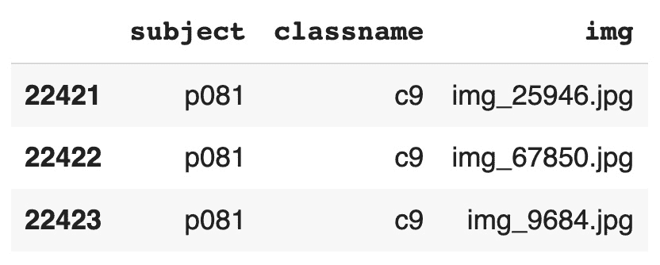

图 2.4 – State Farm 数据 – 最后三行

Pluto 喜欢原始 CSV 文件中的数据，如*图 2.4*所示，但它没有包含图像文件完整路径的列。Pandas 使得创建包含完整图像路径的新列变得非常容易。没有复杂的`build_sf_fname(self, df)`，其中 `df` 是原始 DataFrame。代码片段如下：

```py
# code snippet to create full image path
root = 'state-farm-distracted-driver-detection/imgs/train/'
df["fname"] = f'{root}/{df.classname}/{df.img}
```

完整的功能代码可以在 Python Notebook 中找到。Pluto 添加了完整路径列，并使用以下代码显示前 3 行：

```py
#create new fname column
pluto.build_sf_fname(pluto.df_sf_data)
pluto.df_sf_data.head(3)
```

结果如下：

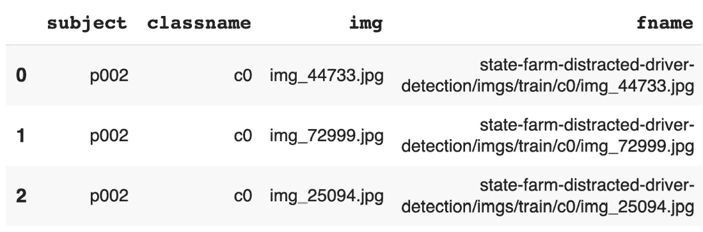

图 2.5 – State Farm 数据 – 完整路径图像名称

为了双重检查，Pluto 写了几行简单的代码来显示来自 pandas `fname` 列的图像，如*图 2.5*所示，使用 **PIL** 库。代码如下：

```py
# display the image
img = PIL.Image.open(pluto.df_sf_data.fname[0])
display(img)
```

结果图像如下：


图 2.6 – State Farm 数据 – fname 列

*图 2.6* 显示了一个驾驶员。使用 `fname` 列，绘制一个批次或图像集合相对容易。`draw_batch()` 封装函数的定义如下：

```py
# function definition
def draw_batch(self, df_filenames,
  disp_max=10,
  is_shuffle=False,
  figsize=(16,8)):
```

= `df_filenames` 是文件名列表，存储在 pandas DataFrame 中。`disp_max` 默认值为 10，这是一个增量为 5 的值，例如每行 5 张照片。`is_shuffle` 默认为 `False`。如果设置为 `True`，每个批次将是随机选择的。最后，`figsize` 是输出图像的大小，默认为 `(16,8)`。

使用 `draw_batch()` 封装方法，Pluto 可以绘制任何照片集合。例如，Pluto 可以使用以下代码从 SFDDD 比赛中绘制 10 张随机图像：

```py
# display image batch
x = pluto.draw_batch(pluto.df_sf_data["fname"],
  is_shuffle=True)
```

结果如下：

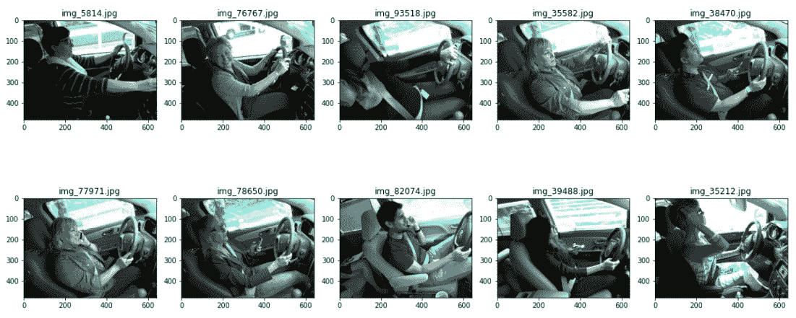

图 2.7 – State Farm 数据 – draw_patch()

Pluto 重复运行代码来查看数据集中的不同图像，如*图 2.7*所示。例如，他可以一次性使用以下代码随机绘制 20 张图片：

```py
# display image batch
x = pluto.draw_batch(pluto.df_sf_data["fname"],
  is_shuffle=True,
  disp_max=20,
  figsize=(18,14))
```

输出结果如下：

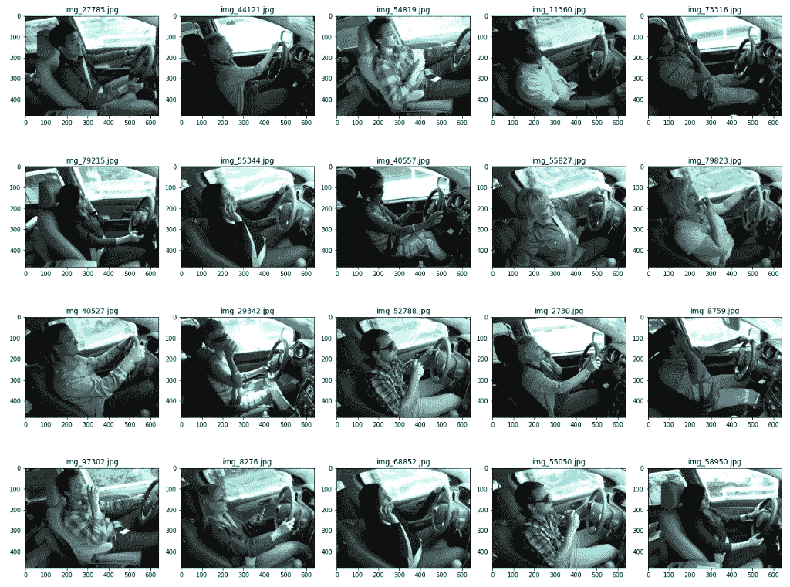

图 2.8 – State Farm 数据 – 随机选择的 20 张图片

*图 2**.8*显示了 20 张司机的照片。通过使用`fetch_kaggle_comp_data()`、`fetch_df()`和`draw_batch()`包装函数，Pluto 可以从 Kaggle 获取任何千余个真实世界的数据集。

有趣的挑战

这个挑战是一个思维实验。在阅读 Pluto 的答案之前，你在图像中看到了哪些偏见？这是可选的，没有算法或库可以用来计算偏见公平性值。这依赖于你的观察。

Pluto 阅读了 SFDDD 的目标，并考虑了计算偏见、人为偏见和系统偏见。以下要点不是需要修复的错误，但它们可能是偏见。这些偏见来自*图 2**.7*，关于代表性不足群体的观察。Pluto 假设 SFDDD 的长期目标是将其部署到美国：

+   Pluto 在数据集中没有看到任何年长的成年人作为司机。

+   司机的人口统计分布是有限的。数据集中约有十几位司机，长期目标是将该 AI 系统部署到美国。因此，AI 系统将基于有限数量的司机进行训练。

+   数据集中表示的车辆类型较少，主要是轿车、紧凑型车或 SUV。跑车或卡车的内部结构不同，可能会影响假阳性或假阴性的预测。

+   驾驶时有其他干扰活动没有在数据集中表示出来，比如吃冰淇淋、观看车外发生的事件、梳理头发或整理发型等。

+   数据集中的所有司机都穿着城市风格的衣服。更精致或以民族为中心的衣服风格可能会导致 AI 预测出假阳性或假阴性。

+   目标是拯救生命。因此，系统性偏见可能是让每个人都能负担得起，而不仅仅是技术精通的城市精英。

有趣的挑战

这个挑战是一个思维实验。你能找到其他的偏见吗？没有绝对正确或错误的答案。这里列出的偏见无法通过编程方式发现。

这是一段关于 SFDDD 数据集的详细讨论。Pluto 将从*Kaggle*网站获取另一个数据集——*Nike* *鞋子*数据集。

## Nike 鞋子

选择 Nike 鞋子数据集是因为它将展示不同的偏见。像 State Farm 的照片一样，没有算法或库来计算公平性矩阵。我们依赖于 Pluto 和你的观察。

*Nike，Adidas 和 Converse 鞋子图片*（Nike）数据集包含按文件夹组织的图像，没有**CSV**文件。Nike 数据集在 Kaggle 网站上的描述如下：

“*这个数据集非常适合使用深度神经网络（如 CNNs）或更简单的机器学习分类模型进行多分类。你可以使用 TensorFlow 及其高级 API Keras，sklearn，PyTorch 或其他深度/机器学习库。*”

作者是 *Iron486*，许可协议为 **CC0: 公共领域**：[`creativecommons.org/publicdomain/zero/1.0/`](https://creativecommons.org/publicdomain/zero/1.0/)。

由于 Pluto 没有 CSV 文件可以导入到 pandas 中，Pluto 编写了 `build_df_fname(self,` `start_path)` 方法，其中 `start_path` 是数据存储的目录。

关键代码行是 `os.walk()` 函数：

```py
# code snippet for generating meta data
for root, dirs, files in os.walk(start_path, topdown=False):
   for name in files:
```

Pluto 将执行查看 Nike 数据集的三步熟悉操作，具体如下：

```py
# 1\. fetch data
fname='https://www.kaggle.com/datasets/die9origephit/nike-adidas-and-converse-imaged'
pluto.fetch_kaggle_dataset(fname)
# 2\. import meta data to Pandas
pluto.df_shoe_data = pluto.build_shoe_fname(
  'kaggle/nike-adidas-and-converse-imaged/train')
# 3\. display image batch
x = pluto.draw_batch(pluto.df_shoe_data["fname"],
  is_shuffle=True,
  disp_max=20,
  figsize=(18,14))
```

输出结果如下：


图 2.9 – Nike 数据 – 随机选择的 20 张图片

以下是 Pluto 从 *图 2.9* 提取的数据偏见观察列表：

+   鞋子太干净了。哪里有泥泞或脏的鞋子？

+   照片拍摄得非常专业。因此，当 AI 驱动的应用程序部署时，人们可能会发现他们的应用程序做出错误预测，因为他们的照片拍摄得很随意。

+   在城市、农业或远足环境中缺少鞋子的图片。

让我们让 Pluto 再抓取一个图像数据集，然后再切换到文本数据集的分析。

## 葡萄藤叶

葡萄藤叶数据集是 Pluto 从 Kaggle 网站抓取的第三个也是最后一个真实世界图像数据集。主要目的是让你练习下载数据集并将元数据导入 pandas。顺便说一下，Pluto 将使用葡萄藤叶数据集通过观察命名其他类型的数据偏见。他不依赖于通过编码定义公平性矩阵，因为这尚不可行。也许下一代生成性 AI 将能够处理数据集中的所有照片，并推断出偏见。

这是来自葡萄藤叶数据集的摘录：

“葡萄藤的主要产品是鲜食或加工的葡萄。此外，葡萄藤叶作为副产品每年采摘一次。葡萄藤叶的品种在价格和口感上非常重要。”

作者是 *Koklu M.、Unlersen M. F.、Ozkan I. A.、Aslan M. F. 和 Sabanci K.*，许可协议为 **CC0: 公共领域**：[`creativecommons.org/publicdomain/zero/1.0/`](https://creativecommons.org/publicdomain/zero/1.0/)。

葡萄藤数据集中的文件名包含空格字符，这可能会使许多 Python 库混淆。因此，Pluto 运行了几个简单的 Linux 脚本，将空格转换为下划线。代码片段如下：

```py
# remove white space from file and directory name
f2 = 'kaggle/grapevine-leaves-image-dataset/Grapevine_Leaves_Image_Dataset'
!find {f2} -name "* *" -type f | rename 's/ /_/g'
```

清理完文件名后，Pluto 将执行三步熟悉的操作：获取、导入和显示葡萄藤数据集。图片与 Nike 照片位于相同的文件夹结构中。因此，Pluto 重用了相同的 `pluto.fetch_df()` 方法：

```py
# fetch data
fname=' https://www.kaggle.com/datasets/muratkokludataset/grapevine-leaves-image-dataset'
pluto.fetch_kaggle_dataset(fname)
# import to Pandas
pluto.df_grapevine_data=pluto.fetch_df("kaggle/grapevine-leaves-image-dataset/Grapevine_Leaves_Image_Dataset")
# display image batch
x = pluto.draw_batch(pluto.df_grapevine_data["fname"],
  is_shuffle=True,
  disp_max=20,
  figsize=(18,14))
```

输出结果如下：

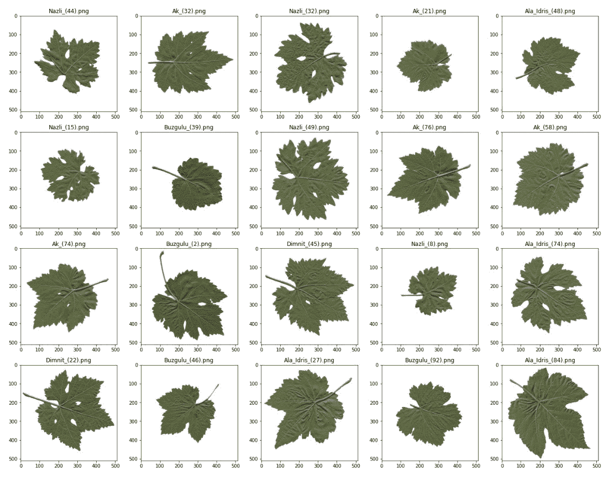

图 2.10 – 葡萄藤数据 – 随机选择的 20 张图片

以下是 Pluto 从 *图 2.10* 提取的数据偏见列表：

+   这些照片太完美了，无疑它们非常容易增强和训练，但普通用户是如何使用 AI 系统的呢？如果酿酒师通过 iPhone 访问 AI 系统，他们拍摄的葡萄藤叶照片与数据集中的完美照片完全不同。结果可能会产生假阳性。

+   类似于完美照片偏差，叶子是平的，背景是白色的，这在现实世界的使用中并不常见。训练周期能够达到高准确度，但这对于实际使用来说并不适用。

+   如果模型按原样训练并部署，那么生成的 AI 将具有系统性偏差，仅适用于实验室技术人员，而不适用于农民。

趣味挑战

在 *Kaggle* 网站上有成千上万的图像数据集。Pluto 挑战你选择、下载、展示并列出三个不同图像数据集的偏差。

除了分心的司机、耐克鞋和葡萄藤叶外，Python 笔记本中还有更多的例子。不过接下来，Pluto 会从偏差转到文本增强。

# 文本偏差

到目前为止，你应该已经能识别出获取真实世界图像数据集和导入元数据到 pandas 的模式。文本数据集也是相同的模式。Pluto 会通过两节课程带领你，利用他的观察力来命名偏差。他可能会使用最新的生成 AI，如 OpenAI GPT3 或 GPT4，列出文本中的偏差。也许他以后会这么做，但现在，他会用自己的大脑来处理。不过，Pluto 会尝试编写 Python 代码，洞察文本的结构，如单词计数和拼写错误。这里并不是公平性矩阵，而是朝着正确方向迈出的第一步。

Pluto 在 Kaggle 网站上搜索 **自然语言处理** (**NLP**) 数据集，结果显示超过 2,000 个数据集。他选择了 *Netflix Shows* 和 *Amazon Reviews* 数据集。获取和查看 NLP 数据集的步骤与图像数据集的获取、导入和打印步骤相同。

让我们从 Netflix 数据开始。

## Netflix

Pluto 重用包装函数来下载数据。命令如下：

```py
# fectch real-world dataset
fname='https://www.kaggle.com/datasets/infamouscoder/dataset-Netflix-shows'
pluto.fetch_kaggle_dataset(fname)
```

Netflix 数据集的描述来自 Kaggle 网站，如下所示：

“原始数据是通过 Selenium 网络爬虫抓取的。它包含了大约 9,000 部 Netflix 电视剧和电影的未标注文本数据，以及完整的详细信息，如演员表、发行年份、评分、描述等。”

作者是 *InFamousCoder*，许可协议为 **CC0: 公共领域**：[`creativecommons.org/publicdomain/zero/1.0/`](https://creativecommons.org/publicdomain/zero/1.0/).

第二步是将数据导入到 pandas DataFrame 中。Netflix 数据自带一个 `fetch_df()` 方法，可以将 Netflix 评论导入到 DataFrame，并显示前三行，如下所示：

```py
# import metadata into Pandas
pluto.df_netflix_data = pluto.fetch_df(
  'kaggle/dataset-Netflix-shows/Netflix_titles.csv')
pluto.df_netflix_data[['show_id',
  'type', 'title', 'director', 'cast']].head(3)
```

结果如下：


图 2.11 – Netflix 数据，左侧列

*图 2**.11* 显示了 Netflix 元数据。前两步不需要 Pluto 编写新代码，但 Pluto 需要为第三步编写代码，即显示电影的标题和描述。目标是让 Pluto 查找电影描述中的任何偏见。

Pandas 使得编写 `display_batch_text()` 包装方法变得轻松。这段方法没有**循环**、**索引计数器**、**洗牌算法**、**if-else** 语句。它只有三行代码，因此 Pluto 在这里展示了完整的代码：

```py
# define wrapper function
def print_batch_text(self, df_orig,
  disp_max=10,
  cols= ["title", "description"]):
  df = df_orig[cols]
  with pandas.option_context("display.max_colwidth", None):
    display(df.sample(disp_max))
  return
```

Pluto 使用以下代码批量显示 Netflix 电影的标题和描述：

```py
# print text batch
pluto.print_batch_text(pluto.df_netflix_data)
```

结果如下：


图 2.12 – Netflix 电影标题和描述

有趣的事实

每次 Pluto 运行 `print_batch_text()` 包装函数时，都会显示电影标题和描述。最好多次运行该包装函数，以便更深入地了解数据。

*图 2**.12* 显示了一个文本批次。Pluto 已经阅读了数百个电影描述，未发现明显的偏见。这是语言学家的工作。一般来说，英语语言可能存在以下偏见：

+   宗教偏见

+   性别偏见

+   民族偏见

+   种族偏见

+   年龄偏见

+   精神健康偏见

+   前科偏见

+   精英主义偏见

+   LGBTQ 偏见

+   残障偏见

Pluto 不是语言学家，但其他数据属性可能会影响语言偏见，如单词数和拼写错误的单词。换句话说，Netflix 的电影描述是否大体相同长度？并且是否有很多拼写错误的单词？

这是尝试编码公平矩阵的一小部分。当使用 pandas DataFrame 时，`count_words()` 方法只有一行代码。其内容如下：

```py
# attempt at fairness matrix, count words
def count_word(self, df, col_dest="description"):
  df['wordc'] = df[col_dest].apply(lambda x: len(x.split()))
  return
```

Pluto 计算了 Netflix 电影的单词数，并通过以下代码重新检查了结果：

```py
# count words and dislay result
pluto.count_word(pluto.df_netflix_data)
pluto.print_batch_text(pluto.df_netflix_data,
  cols=['description','wordc'])
```

结果如下：

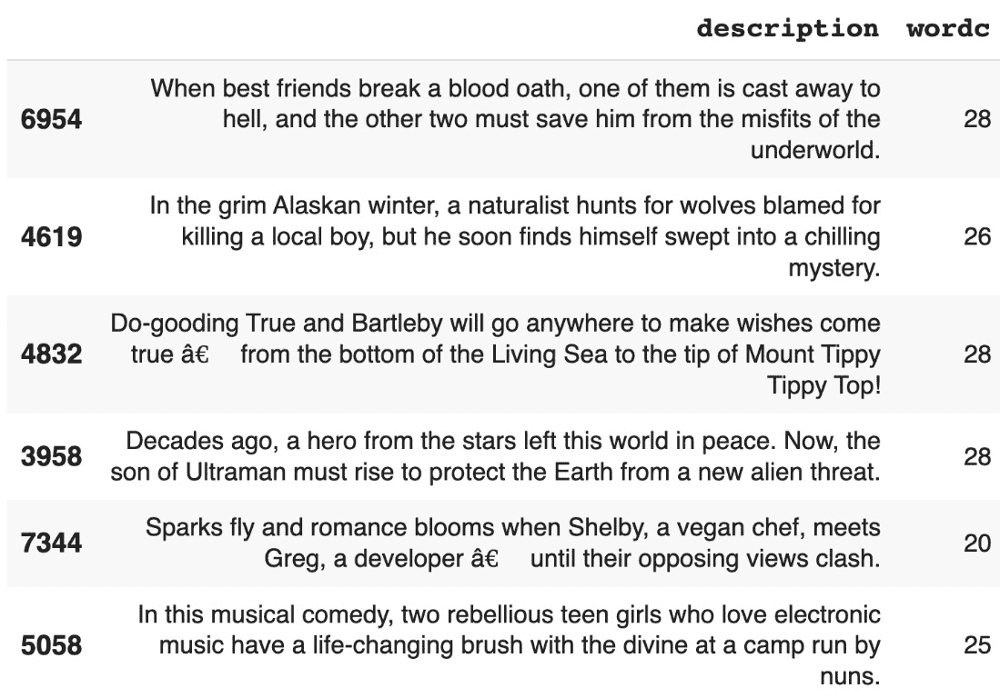

图 2.13 – 电影描述字数

*图 2**.13* 显示了每个记录的字数。下一步是使用 `draw_word_count()` 函数绘制字数分布，结果如下：

```py
# code snippet for draw word count
df.boxplot(ax=pic[0],
  column=[wc],
  vert=False,
  color="black")
df[wc].hist(ax=pic[1],
  color="cornflowerblue",
  alpha=0.9)
```

完整的函数代码可以在 Python Notebook 中找到。Pluto 使用以下代码绘制 BoxPlot 和直方图：

```py
# draw word count
pluto.draw_word_count(pluto.df_netflix_data)
```

结果如下：

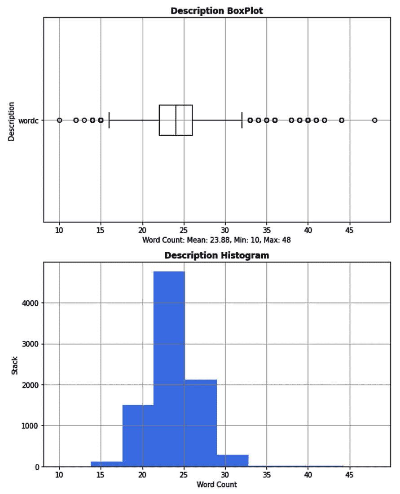

图 2.14 – Netflix 电影描述字数

如 *图 2**.14* 所示，BoxPlot 和直方图显示分布均匀。有少数异常值，均值为 23.88，Netflix 电影描述的大部分字数在 22 到 25 字之间。因此，这里没有偏见。接下来 Pluto 将检查拼写错误的单词。

Pluto 使用 `pip` 命令安装 `spellchecker` 类。`check_spelling()` 方法将 pandas DataFrame 和指定的列作为参数。函数的关键代码行如下：

```py
# code snippet for check spelling
df["misspelled"] = df[col_dest].apply(
  lambda x: spell.unknown(self._strip_punc(x).split()))
df["misspelled_count"] = df["misspelled"].apply(
  lambda x: len(x))
```

Pluto 检查了 Netflix 电影描述的拼写，并使用 `print_batch_text()` 函数显示结果。代码如下：

```py
# check spelling
pluto.check_spelling(pluto.df_netflix_data)
# print batch text withh correct spelling
pluto.print_batch_text(pluto.df_netflix_data,
  cols=['description', 'misspelled'])
```

结果如下：

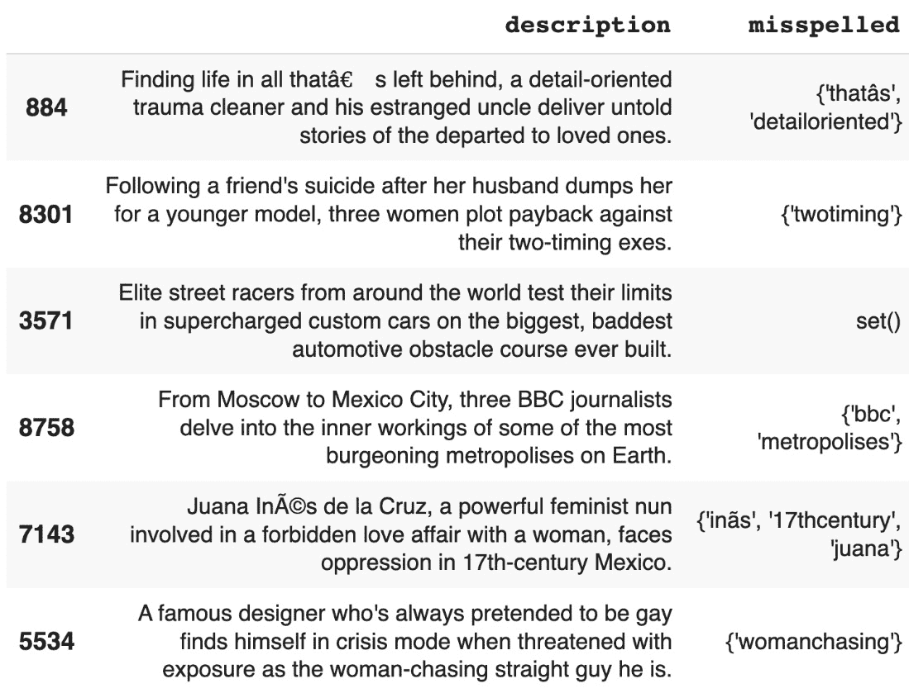

图 2.15 – Netflix 错别字

*图 2**.15* 显示了错别字。Pluto 通过重用相同的 `draw_word_count()` 函数，在图表中展示这些数据，如下所示：

```py
# draw word count
pluto.draw_word_count(pluto.df_netflix_data,
  wc='misspelled_count')
```

结果如下：

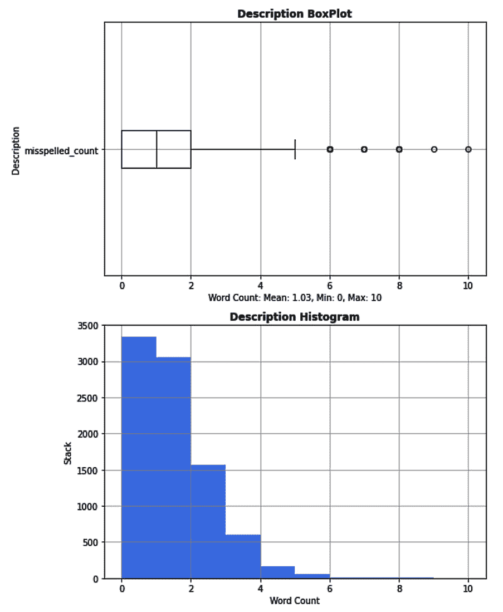

图 2.16 – Netflix 错别字图

错别字大多数是人名或产品名，如 *图 2**.16* 所示。Netflix 的电影描述平均每个有 0.92 个错别字，且只有少数几个异常值。没有语言学家的帮助，Pluto 无法在 Netflix 电影描述中发现任何偏差。接下来我们来看一下亚马逊评论，看看是否能找到任何偏差。

## 亚马逊评论

亚马逊评论数据集是本章下载的最后一个真实世界文本数据集。Pluto 按照相同的模式进行处理，你现在应该已经熟悉这些代码，并准备好从 Kaggle 网站下载任何真实世界的数据集。此外，像处理 Netflix 数据一样，Pluto 将利用他作为数字狗的强大洞察力，找出文本中的偏差。他将使用相同的技术和库，程序化地找到单词计数和错别字。

Pluto 不会解释如何为亚马逊评论编写代码，因为他在 Netflix 数据中重用了相同的函数。完整的代码可以在 Python Notebook 中找到。以下是代码片段：

```py
# fetch data
pluto.fetch_kaggle_dataset(
  'https://www.kaggle.com/datasets/tarkkaanko/amazon')
# import to Pandas
pluto.df_amazon_data = pluto.fetch_df(
  'kaggle/amazon/amazon_reviews.csv')
# count words and misspell
pluto.count_word(pluto.df_amazon_data,
  col_dest='reviewText')
pluto.check_spelling(pluto.df_amazon_data,
  col_dest='reviewText')
```

亚马逊评论数据集在 Kaggle 上的数据描述如下：

“电子商务中最重要的问题之一是正确计算售后产品的积分。解决这个问题的方法是为电子商务网站提供更高的客户满意度，为卖家提供产品的突出展示，并为买家提供无缝的购物体验。另一个问题是正确排序产品的评论。误导性评论的突出展示将导致财务损失和客户流失。”

作者是 *Tarık kaan Koç*，并且许可证是 **CC BY-NC-SA** **4.0**：[`creativecommons.org/licenses/by-nc-sa/4.0/`](https://creativecommons.org/licenses/by-nc-sa/4.0/)。

Pluto 使用以下代码打印批次：

```py
# display misspelled words
pluto.print_batch_text(pluto.df_amazon_data,
  cols=['reviewText','misspelled'])
```

结果如下：


图 2.17 – 亚马逊评论错别字

Pluto 选择在 `print_batch` 函数中显示两列数据，如 *图 2**.17* 所示，但数据集中有 12 列数据。它们如下：

+   `reviewerName`

+   `overall`

+   `reviewText`

+   `reviewTime`

+   `day_diff`

+   `helpful_yes`

+   `helpful_no`

+   `total_vote`

+   `score_pos_neg_diff`

+   `score_average_rating`

+   `wilson_lower_bound`

Pluto 使用以下代码绘制单词计数和错别字：

```py
# display word count
pluto.draw_word_count(pluto.df_amazon_data)
# draw misspelled words
pluto.draw_word_count(pluto.df_amazon_data,
  wc='misspelled_count')
```

单词计数的结果如下：

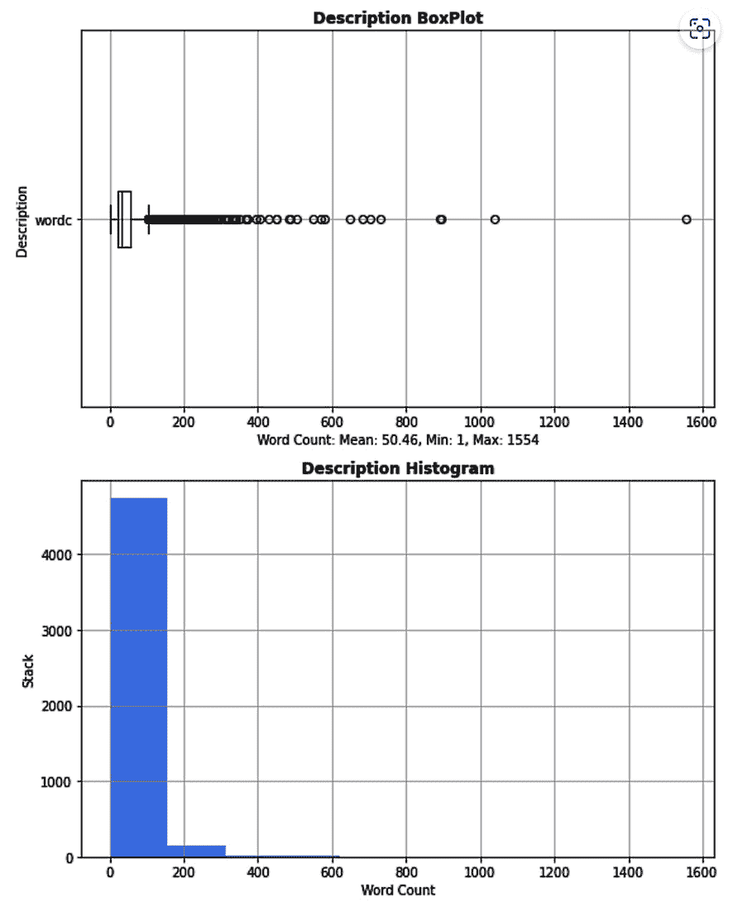

图 2.18 – 亚马逊评论字数

这是拼写错误单词的图表：

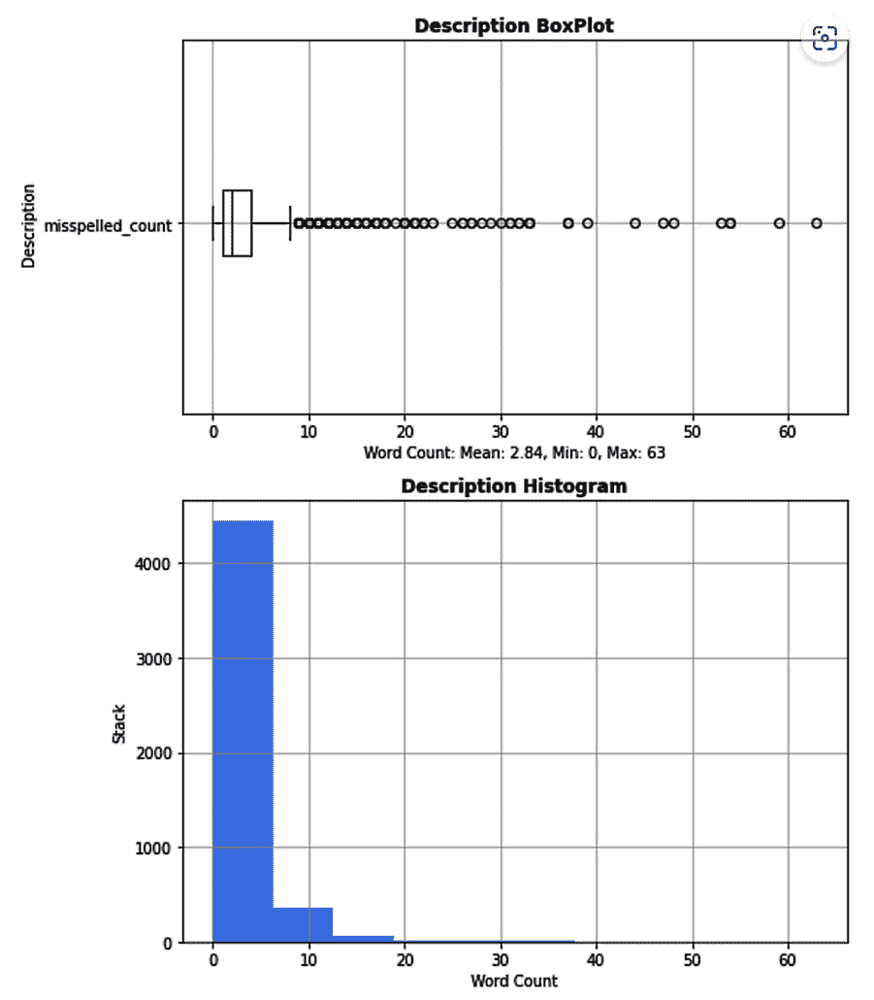

图 2.19 – 亚马逊评论拼写错误单词图表

普鲁托（Pluto）注意到，亚马逊评论中的偏见，如*图 2.17*、*2.18*和*2.19*所示，具体如下：

+   亚马逊评论中的语法错误比 Netflix 电影描述中的更多。因此，可能会对写得好的评论产生偏见。

+   评论中有更多的技术产品名称和术语。因此，可能会对非技术性评论者产生偏见。

+   评论中有很多大纲。平均每条评论有 50.46 个单词，反馈大多集中在 20 到 180 个单词之间。通过其他列（如 `helpful_yes`、`total_vote` 和 `score_pos_neg_diff`）进行更深入的挖掘，看看每个类别的评论长度是否存在偏见，是很有意义的。

+   亚马逊评论中的拼写错误单词比 Netflix 电影描述中的更多，这强化了对写得好的评论者的偏见。

在进入总结之前，有一个有趣的事实。

有趣的事实

凯西·奥尼尔（Cathy O’Neil）在 2016 年出版的书籍《**数学毁灭武器：大数据如何增加不平等并威胁民主**》描述了算法和人工智能中的许多偏见，这本书是数据科学家和大学生的必读书。书中有两个突出示例：一位经验丰富的教师被计算机算法解雇，一位合格的大学生被候选人筛选软件拒绝。

# 总结

本章不同于本书的其他章节，因为我们讨论了更多的理论内容，而非实际的数据增强技术。起初，数据偏见和数据增强之间的联系似乎微弱。然而，随着你开始了解计算偏见、人为偏见和系统性偏见，你会看到它们之间有着强烈的联系，因为它们都有确保成功的伦理 AI 系统使用和接受的共同目标。

换句话说，数据增强提高了 AI 的预测准确性，同时减少了数据增强中的偏见，确保了 AI 预测的假阴性和真阴性结果更少。

计算偏见、人为偏见和系统性偏见虽然相似，但并不互相排斥。然而，通过提供大量现实世界中的偏见示例，并观察三个现实世界的图像数据集和两个现实世界的文本数据集，这些偏见变得更加容易理解。

数据增强中的偏见性质使得编程计算偏见变得具有挑战性。然而，你已经学会了如何使用单词计数和拼写错误单词技术为文本数据集编写 Python 代码来生成公平性矩阵。你还可以使用生成型 AI，如 Stable Diffusion 或 DALL-E，自动识别照片中的偏见，并使用 OpenAI GPT3、GPT4 或 Google Bard 来计算文本数据中的偏见。不幸的是，生成型 AI 超出了本书的讨论范围。

最初，Pluto 倾向于通过一步一步的解释来讲解，但随着学习的深入，他简化了论证过程，只展示了最基础的代码。完整的代码可以在 Python Notebook 中找到。

大部分 Python 代码都用于教你如何从 *Kaggle* 网站下载真实世界的数据集，并将元数据导入 pandas。后续章节将复用这些助手和包装函数。

在本章中，有许多*有趣的事实*和*有趣的挑战*。Pluto 希望你能充分利用这些，并将你的经验扩展到本章之外。

Pluto 期待着*第三章*，他将在那里展示如何在 Python 中进行图像增强。

# 第二部分：图像增强

本部分包括以下章节：

+   *第三章*，*用于分类的图像增强*

+   *第四章*，*用于分割的图像增强*
