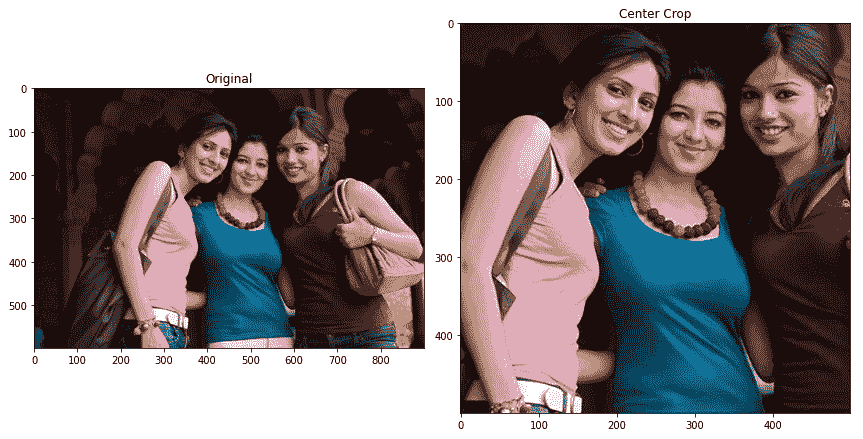

# 第三章：图像增强用于分类

**机器学习**（**ML**）中的图像增强是一种提高预测准确性的稳定方法，尤其是在图像分类领域。因果逻辑是线性的，这意味着数据输入越强大，预测准确度越高。

**深度学习**（**DL**）是机器学习的一个子集，使用人工神经网络来学习模式并根据输入数据进行预测。与依赖程序员编码和规则来分析数据的传统机器学习算法不同，深度学习算法能够自动学习、解决问题并分类数据与标签之间的关系。因此，扩展数据集直接影响深度学习模型对新见解的预测，这些见解在训练数据中尚未出现。

深度学习算法旨在模仿人类大脑，具有多层神经元来处理信息并将其传递到下一层。每一层神经元都会学习从输入数据中提取越来越复杂的特征，从而使网络能够识别模式并随着准确度的提高做出预测。

深度学习（**DL**）在图像分类领域已被证明在多个行业中都非常有效，从医疗、金融、交通、消费品到社交媒体。举些例子，如*识别 120 种狗狗品种*、*检测颈椎骨折*、*编目地标*、*分类耐克鞋*、*识别名人面孔*以及*分离纸张和塑料* *用于回收*。

没有标准公式来估计需要多少图像才能达到图像分类所需的预测准确度。由于成本和时间的限制，获取更多图像可能不是一个可行的选择。另一方面，图像数据增强是一种经济有效的技术，它能够增加用于图像分类训练的图像数量。

本章由两部分组成。首先，你将学习图像分类增强的概念和技术，随后进行动手的 Python 编程，并详细解释图像增强技术。

有趣的事实

在图像分类模型中，图像数据集通常被划分为 75%的训练集、20%的验证集和 5%的测试集。通常，分配给训练集的图像会进行增强，但验证集和测试集之外的图像不会进行增强。

图像增强的两种主要方法是预处理和动态方法。它们使用相同的技术，但在增强的时间点上有所不同。预处理方法在训练之前创建并保存增强后的图像，而动态方法则在训练周期中扩展输入图像。

在*第二章*中，你学习了数据偏差，值得记住的是，图像增强虽然能提高深度学习模型的准确性，但也可能增加偏差。

除了偏差，另一个值得注意的概念是 *安全性*。它指的是在变换后不会改变原始图像标签的失真幅度。不同的照片领域具有不同的 *安全性* 水平。例如，水平翻转一个人的肖像照片是一个可接受的增强技术，但翻转手势图像在手语中则是不安全的。

到本章结束时，你将掌握分类图像增强的概念和 Python 编程的实践技巧，使用真实世界的数据集。此外，你还将了解几种用于图像增强的 Python 开源库。本章特别涵盖以下主题：

+   几何变换

+   光度变换

+   随机擦除

+   组合

+   通过 Python 代码加强学习

几何变换是常用的主要图像增强技术，广泛应用于多个图像数据集中。因此，这是讨论图像增强的一个好起点。

# 几何变换

几何变换会改变照片的几何形状，这可以通过沿 X 轴或 Y 轴翻转、裁剪、填充、旋转、扭曲和位移来实现。复杂的增强技术使用这些基本的照片变换方法。在进行几何变换时，必须根据图像主题保持失真幅度在安全范围内。因此，并没有一个适用于所有照片的通用几何变换公式。在本章后半部分的 Python 编程部分，你和 Pluto 将下载真实世界的图像数据集，以定义每个图像集的安全水平。

以下技术并非互相排斥。你可以将水平翻转与裁剪、调整大小、填充、旋转或任何组合技术结合使用。唯一的限制是失真的安全级别。

特别是，你将学习以下技术：

+   翻转

+   裁剪

+   调整大小

+   填充

+   旋转

+   位移

+   噪声注入

我们从翻转开始。

## 翻转

翻转的两种类型是水平 Y 轴翻转和垂直 X 轴翻转。沿 Y 轴翻转照片就像看镜子一样。因此，除了方向性图像（如路标）外，这种翻转适用于大多数类型的照片。有很多情况下，沿 X 轴旋转是不安全的，例如风景或城市景观图像，其中天空应位于照片的顶部。

这不是非此即彼的选择，图像可以同时使用水平和垂直翻转，例如来自飞机的航拍照片。因此，翻转通常是安全的。然而，有些照片对于任何变换都不安全，比如路标，任何旋转都会改变原始标签的完整性。

本章后面，你将学习如何使用 Python 代码和图像增强库翻转图像，但现在，这里有一个预告演示。函数名称是 `pluto.draw_image_teaser_flip()`；解释将稍后进行。

图像输出如下：


图 3.1 – 图像垂直翻转

翻转保持所有图像内容不变。然而，下面的技术称为裁剪，会丢失信息。

## 裁剪

裁剪图像涉及删除图片的边缘。大多数卷积神经网络（CNNs）使用正方形图像作为输入。因此，纵向或横向模式的照片通常被裁剪为正方形图像。在大多数情况下，裁剪边缘基于图片的中心，但没有规则表明它必须是图片的中心。

照片的中心点是宽度的 50%和高度的 50%。然而，在图像增强中，你可以选择将裁剪中心移动到宽度的 45%和高度的 60%。裁剪中心可以根据照片的主题而变化。一旦确定了移动裁剪中心的安全范围，你可以尝试在每个训练周期动态裁剪图像。因此，每个训练周期都有一组不同的照片。这样做的效果是，机器学习模型不太可能过拟合，并且由于拥有更多的图像，准确率更高。

`pluto.draw_image_teaser_crop()` 函数是另一个预告演示。在接下来的章节中，我将只展示一些增强方法的预览图像，因为你稍后会通过 Python 代码更深入地了解它们。

**中心裁剪** 的输出图像如下：



图 3.2 – 图像中心裁剪

裁剪不同于调整图像大小，我们将在下面讨论。

## 调整大小

可以通过保持或不保持相同的纵横比来调整大小：

+   **缩放（Zooming）** 相当于放大、裁剪并保持相同的纵横比。

+   **压缩（Squishing）** 相当于放大或缩小并改变原始纵横比。对于缩放、压缩或其他调整技术的安全级别取决于图像类别。

`pluto.draw_image_teaser_resize()` 函数是使用 **压缩** 模式调整图像大小的有趣演示。输出如下：


图 3.3 – 使用压缩模式调整图像大小

当调整照片大小而不保持原始纵横比时，需要对新图像进行填充。有不同的填充方法。

## 填充

填充涉及填充不是图像的画布外边缘。填充有三种常用方法：

+   **零填充（Zero padding）** 指的是使用黑色、白色、灰色或高斯噪声填充图像。

+   **反射填充（Reflection padding）** 会镜像填充区域与原始图像

+   **边框填充**涉及在填充区域中重复边界线

填充与裁剪、调整大小、平移和旋转相结合使用。因此，安全比例取决于裁剪、调整大小和旋转。

## 旋转

旋转图像涉及顺时针或逆时针旋转图片。旋转的度量单位是度数，并且旋转方向为顺时针。因此，旋转 180 度相当于垂直翻转，而旋转 360 度则将照片恢复到原始位置。

一般的旋转操作是在 X-Y 平面上进行的，而在 Z 平面上的旋转被称为**倾斜**。**倾斜**或**剪切**涉及在三个平面（即 X、Y 和 Z 平面）上旋转。与大多数几何变换一样，旋转是一种安全操作，对某些图像数据集有固定的限制，而对其他数据集则没有。

`pluto.draw_image_teaser_rotate()`函数是一个有趣的示范，展示了如何使用**反射填充**模式旋转图像。输出如下：


图 3.4 – 图像旋转与反射填充模式

类似于旋转的是图像平移，这导致了下一种技术，称为平移。

## 平移

翻译方法通过沿 X 轴向左或向右移动图像，或沿 Y 轴向上或向下移动图像。它使用填充来填补因移动照片而留下的负空间。平移有助于减少图像中心偏差，例如当人的肖像被居中时。照片的主体将决定平移图像的安全参数。

下一个几何变换与我们到目前为止讨论的有所不同，因为噪声注入会降低照片的清晰度。

## 噪声注入

噪声注入会向图片中添加随机的黑色、白色或彩色像素，从而在原始图像上创建颗粒感效果。高斯噪声是生成自然噪声的事实标准，基于数学家卡尔·弗里德里希·高斯在 1830 年代提出的高斯分布算法。

`pluto.draw_image_teaser_noise()`函数是一个有趣的示范，展示了使用**高斯**模式进行的**噪声注入**。输出如下：


图 3.5 – 使用高斯模式的图像噪声注入

有趣的挑战

这是一个思维实验：你能想到其他几何图像变换吗？提示：使用 Z 轴，而不仅仅是 X 轴和 Y 轴。

本章的第二部分，Pluto 和你将一起发现如何编写几何变换的代码，如翻转、裁剪、调整大小、填充、旋转和噪声注入，但首先有一些其他图像增强技术需要学习。下一个类别是光度变换。

# 光度变换

光度变换也称为光照变换。

图像表示为一个三维数组或一个三阶张量，前两个维度是图像的宽度和高度坐标，对应每个像素的位置。第三个维度是**红色、蓝色和绿色**（**RGB**）值，范围从零到 255，或在十六进制表示中为 #0 到 #FF。打印中 RGB 的等价物是**青色、品红色、黄色和黑色**（**CMYK**）。另一个流行的格式是**色相、饱和度和数值**（**HSV**）。重点是，图像在归一化时是一个整数或浮点矩阵。

将图像可视化为一个数字矩阵，可以方便地对其进行转换。例如，在 HSV 格式中，将矩阵中的**饱和度**值调整为零，会将图像从彩色转换为灰度图像。

数十种滤镜改变色彩空间的特性，从基础到独特的都有。基础方法包括**变暗**、**变亮**、**锐化**、**模糊**、**对比度**和**色调偏移**。除了基础方法，还有许多滤镜类别无法在此一一列举，比如**复古**、**动感**、**蒸汽朋克**等。此外，像 Adobe Photoshop 这样的照片软件，以及在线图像编辑器，常常会创造出新的图像滤镜。

特别地，本节将涵盖以下主题：

+   基本和经典

+   高级与独特

让我们从基础和经典开始。

## 基本和经典

在图像增强中的光度变换是一种提高 AI 模型准确性的有效技术。大多数学术论文，如 Nour Eldeen Khalifa、Mohamed Loey 和 Seyedali Mirjalili 发表的《深度学习在数字图像增强中的最新趋势综述》（*A comprehensive survey of recent trends in deep learning for digital images augmentation*），由*Artificial Intelligence Review*于 2021 年 9 月 4 日发表，专门使用经典滤镜，因为代码执行速度快。经典滤镜有许多开源 Python 库，Pluto 和你将在本章后续内容中进一步探索。

特别地，你将学习以下经典技术：

+   变暗与变亮

+   色彩饱和度

+   色调偏移

+   色调偏移

+   对比度

让我们从最常见的技术开始：变暗和变亮滤镜。

### 变暗与变亮

亮化图像意味着增加亮度值，而降低亮度值则意味着变暗图像。在 Python 代码中，照片是一个整数或浮点值的矩阵，一旦转换为 HSV 格式，增加或降低 HSV 矩阵中的**数值**（**V**）就可以增加或减少图像的亮度。

当你需要为 Pluto 对象编写图像变亮或变暗的函数时，你将使用 Python 图像库来完成繁重的工作，但从头编写代码并不困难。亮度值的安全范围取决于图像的主题和标签目标。

`pluto.draw_image_teaser_brightness()` 函数是一个有趣的**变暗**图像演示。输出结果如下：


图 3.6 – 图像亮度，变暗模式

类似地，色彩饱和度在 Python 中也很容易编码。

### 色彩饱和度

色彩饱和度涉及增加或减少照片中颜色的强度。通过将饱和度值降低到接近零，图像将变成灰度图像。相反，抬高饱和度值，图像会显示出更加浓烈或鲜艳的颜色。

类似于亮度水平编码，在 HSV 矩阵中操作图像的**饱和度**（**S**）值可以产生期望的效果。色彩饱和度的安全范围取决于图像的主题和标签目标。

到目前为止，我们已经看过了*S*和*V*在*HSV*中的作用，那么*H*值是做什么的呢？它是用来做色调偏移的。

### 色调偏移

在 HSV 格式的 Python 图像矩阵中，移动**色调**（**H**）值会改变照片的颜色。通常，色调值用一个圆圈表示。因此，色调值从零开始，到 360 度结束。红色位于旋转的顶部，起始值为零，接着是黄色、绿色、青色、蓝色和洋红色。每种颜色之间相隔 60 度。因此，最后一种颜色——洋红色，从 310 度开始，到 360 度结束。

色调偏移是一个很好的图像编辑滤镜，但对于 AI 图像增强，它并没有太大帮助，因为它会使图像超出预期的标签。例如，假设你正在开发一个 AI 模型来分类不同物种的变色龙。在这种情况下，色调切换技术足以进行图像增强。但如果你的项目是区分猫和毛茸茸的玩具球，它可能会导致误报，因为你可能得到荧光粉色的猫。

`pluto.draw_image_teaser_hue()`函数是一个有趣的**色调偏移**演示。输出结果如下：


图 3.7 – 图像色调偏移

与色调偏移类似的是色彩投射。

### 色彩投射

色彩投射也称为色彩调 tinting。当白色不平衡或不准确时，就会发生色彩投射。常见的调色为**红色、绿色或蓝色**（**RGB**）。在 Python 中，给照片加上色调就像改变图像矩阵中的 RGB 值一样简单。与色调偏移滤镜一样，色彩投射的安全范围也要考虑到相同的因素。换句话说，色彩投射在 AI 图像增强中使用有限。

没有正式的定义来区分哪些滤镜是基础的或经典的，哪些是高级的或异国情调的。因此，我们选择查看对比度滤镜作为经典光度变换的最终示例。

### 对比度

对比度是区分图像中物体的亮度或颜色差异。例如，大多数摄影师希望前景中的人物与背景之间有很高的对比度。通常，前景物体比背景更明亮，焦点更清晰。对比度值的安全范围取决于图像的主题和标签目标。

Pluto 和你将在本章后半部分通过 Python 代码探索对比滤镜和所有其他经典光度变换。接下来的部分将涉及高级和异域滤镜。

## 高级与异域

高级或异域技术没有用于在数据增强中实现这些滤镜的 Python 库。在线照片编辑网站和桌面软件经常每月创建新的异域滤镜。

如果你查看*Adobe Photoshop*的滤镜部分，或许还能在许多在线照片编辑网站上找到如[www.fotor.com](https://www.fotor.com)这样的服务，你会发现数十种或数百种滤镜选项。专门针对图像主题的滤镜包括人物肖像、风景、城市景观、静物等。滤镜也按风格分类，如复古、老式、蒸汽朋克、时尚、温和、动感等。

异域滤镜在学术论文中并不常见，部分原因是缺乏可用的 Python 库，并且在训练周期中执行这些操作需要大量的 CPU 或 GPU 资源。然而，理论上，异域滤镜是图像增强的优秀技术。

有趣的挑战

让我们进行一个思维实验。像稳定扩散（stable diffusion）或 DALL-E 这样的生成性 AI 能否为数据增强创造新图像？生成性 AI 可以根据输入文本生成数百或数千张图像。例如，假设你的任务是开发一个 AI 来识别独角兽、飞马或弥诺陶洛斯，这些神话生物的图像是更容易在印刷品中找到还是在现实生活中找到？生成性 AI 可以做到这一点，但这是一种实用的技术吗？提示：思考静态与动态数据增强所需的磁盘空间和时间。

光度和几何变换可以操作照片，而随机擦除则为图像添加了新元素。

# 随机擦除

随机擦除选择图像中的一个矩形区域，并用灰色、黑色、白色或高斯噪声像素矩形替换或覆盖它。这种技术为何能提高 AI 模型的预测准确性，直觉上是难以理解的。

任何机器学习模型的强大之处，尤其是卷积神经网络（CNN），在于预测或预见训练或验证阶段未曾见过的数据。因此，随机丢弃（dropout）是一种经过验证的有效方法，可以减少过拟合并提高准确性，这意味着随机擦除具有与增加丢弃率相同的效果。

一篇名为《*随机擦除数据增强*》的论文于 2017 年 11 月 16 日通过 arXiv 发布，展示了随机擦除如何在基于 CNN 的模型中提高准确性并减少过拟合。该论文的作者为来自厦门大学和澳大利亚悉尼科技大学认知科学系的 Zhun Zhong、Liang Zheng、Guoliang Kang、Shaozi Li 和 Yi Yang。

通常，随机擦除矩形区域，也称为切割区域，会使用*高斯随机化*填充随机像素。随机擦除的安全范围取决于图像主题和标签目标。

有趣的事实

有一个创造性的例子，使用随机擦除进行图像增强，以减少偏差。在自动驾驶汽车系统中，一个图像分类模型是识别和分类路标。该 AI 模型使用清晰、完整的路标照片进行训练，因此它对美国贫困社区中那些被涂鸦和破坏的路标照片有偏见。通过随机添加涂鸦、油漆、污垢和弹孔的切割区域，提高了模型的准确性，减少了过拟合，并且减少了对贫困社区路标的偏见。

根据图像数据集的主题，可以混合和匹配随机擦除、光度和几何变换。我们来详细讨论一下。

# 结合

几何变换中的技术或滤镜可以轻松与大多数图像主题结合。例如，你可以将水平翻转、裁剪、调整大小、填充、旋转、平移和噪声注入等技术混合应用于多个领域，如人物、风景、城市景观等。

此外，以风景为主题，你可以将多种滤镜结合在光度变换中，例如暗化、亮化、色彩饱和度和对比度。色调偏移和色彩偏差可能不适用于风景照片。然而，先进的摄影变换滤镜，例如向风景图像中添加雨雪效果，是可以接受的。

还有更多：你可以将随机擦除应用于风景图像。因此，1,000 张风景图像可能会增加到 200,000 张用于训练的照片。这就是图像增强的力量。

有趣的挑战

这是一个思维实验：你应该增强整个图像数据集，还是只增强其中的一部分？

数据增强可以为训练生成数十万张新图像，减少过拟合问题，从而提高 AI 预测的准确性。但是，如果你还增强了验证和测试数据集呢？提示：考虑一下真实世界的应用、深度学习的泛化能力，以及假阴性和假阳性。

到目前为止，我们已经讨论了各种图像增强滤镜和技术。下一步是你和 Pluto 编写 Python 代码，以加深你对这些概念的理解。

# 通过 Python 代码强化你的学习

我们将采用与*第二章*相同的方法。首先，在 Google Colab 或你选择的 Jupyter Notebook 或 JupyterLab 环境中加载 `data_augmentation_with_python_chapter_3.ipynb` 文件。从此时起，代码片段将来自 Python Notebook，其中包含所有函数。

本章的编码学习主题如下：

+   Pluto 和 Python Notebook

+   真实世界的图像数据集

+   图像增强库

+   几何变换

+   光度变换

+   随机擦除

+   合并

下一步是下载、设置并验证 Pluto 和 Python Notebook 是否正常工作。

## Pluto 和 Python Notebook

在加载 Pluto 之前，需要通过克隆本书的 `%run` 魔法命令来获取 Pluto，我们可以调用它。如果你对 Pluto 进行了改进或修改，加载那个文件。如果这些步骤不熟悉，请查看 *第二章*。

有趣的事实

编码的启动过程对于每一章都是相同的。Pluto 只显示本书中的必要代码片段，剩下的完整代码需要你在 Python Notebook 中查看。

使用以下代码克隆 Python Notebook 并调用 Pluto：

```py
# clone the book repo.
f = 'https://github.com/PacktPublishing/Data-Augmentation-with-Python'
!git clone {f}
# invoke Pluto
%run 'Data-Augmentation-with-Python/pluto/pluto_chapter_2.py'
```

输出将类似于以下内容：

```py
---------------------------- : ---------------------------
            Hello from class : <class '__main__.PacktDataAug'> Class: PacktDataAug
                   Code name : Pluto
                   Author is : Duc Haba
---------------------------- : ---------------------------
```

通过在 Python Notebook 中运行以下代码来仔细检查 Pluto 是否正确加载：

```py
# display system and libraries version
pluto.say_sys_info()
```

输出将如下所示，具体内容根据你的系统可能有所不同：

```py
---------------------------- : ---------------------------
                 System time : 2022/09/18 06:07
                    Platform : linux
     Pluto Version (Chapter) : 2.0
       Python version (3.7+) : 3.7.13 (default, Apr 24 2022, 01:04:09) [GCC 7.5.0]
            PyTorch (1.11.0) : actual: 1.12.1+cu113
              Pandas (1.3.5) : actual: 1.3.5
                 PIL (9.0.0) : actual: 7.1.2
          Matplotlib (3.2.2) : actual: 3.2.2
                   CPU count : 2
                  CPU speed : NOT available
---------------------------- : ---------------------------
```

Pluto 已验证 Python Notebook 正常工作，接下来的步骤是从 *Kaggle* 网站下载真实世界图像数据集。

## 真实世界图像数据集

在 *第二章* 中，Pluto 学会了如何从 *Kaggle* 网站下载成千上万的真实世界数据集。在本章中，他选择了六个图像数据集来展示不同的图像增强技术。当然，你也可以通过将新的 URL 传递给 Python Notebook 中的代码来替换或添加新的 *Kaggle* 图像数据集。

有趣的挑战

从 Kaggle 网站下载另外两个真实世界数据集。Pluto 喜欢玩接飞盘，所以它取回新的数据集不成问题。提示：访问 [`www.kaggle.com/datasets`](https://www.kaggle.com/datasets) 并搜索 **图像分类**。下载更多的真实世界数据将进一步加深你对图像增强概念的理解。

Pluto 选择了六个图像数据集，基于每个主题对增强技术的挑战。换句话说，一个概念可能适用于某个主题，但对另一个主题则不适用。具体来说，六个图像数据集如下：

+   Covid-19 图像数据集

+   印度人

+   可食用和有毒的真菌

+   海洋动物

+   越南食物

+   商场人群

有趣的事实

从 *Kaggle* 网站下载这六个真实世界数据集的代码看起来有些重复。设计如此简单，因为 Pluto 花了很多心思创建了可重用的方法，在 *第二章*中，你可以查看完整的代码。他希望这个过程尽可能简单，这样你就能轻松地从 *Kaggle* 网站下载任何真实世界数据集。

让我们从 Covid-19 数据开始。

### Covid-19 图像数据集

医疗是人工智能图像预测模型的热门类别。因此，Pluto 选择了 *Covid-19 图像数据集*。他获取了图片，并使用 *第二章* 中展示的方法创建了所需的 pandas DataFrame。注意，完整代码在 Python Notebook 中。

以下命令用于获取并加载数据到 pandas：

```py
# fetch image data
pluto.fetch_kaggle_dataset('https://www.kaggle.com/datasets/pranavraikokte/covid19-image-dataset')
# import to Pandas data frame
f = 'kaggle/covid19-image-dataset/Covid19-dataset/train'
pluto.df_covid19 = pluto.make_dir_dataframe(f)
```

pandas DataFrame 的前三条记录如下：


图 3.8 – pandas DataFrame 的前三行

在 *Kaggle* 网站上，数据的背景如下：

“*帮助像我这样的深度学习和人工智能爱好者通过仅使用胸部 X 光片贡献改善 Covid-19 检测的工作。数据集包含约 137 张经过清理的 Covid-19 图像和 317 张包含病毒性肺炎和正常胸部 X 光片的图像，已经结构化为测试集和训练集目录。*”

该引用来自 *蒙特利尔大学*，列出的合作者是 **Pranav Raikote**（所有者），许可证：**CC BY-SA** **4.0**：[`choosealicense.com/licenses/cc-by-sa-4.0`](https://choosealicense.com/licenses/cc-by-sa-4.0)。

现在，Pluto 已经下载了 Covid-19 数据，他将开始处理 *People* 数据集。

### 印度人民

图像预测或分类中的第二个典型类别是人物。Pluto 选择了 *印度人民* 数据集。以下是 Python Notebook 中的一段代码，它获取并加载数据到 pandas：

```py
# fetch image data
pluto.fetch_kaggle_dataset('https://www.kaggle.com/datasets/sinhayush29/indian-people')
# import to Pandas DataFrame
f = 'kaggle/indian-people/Indian_Train_Set'
pluto.df_people = pluto.make_dir_dataframe(f)
```

在 *Kaggle* 网站上，数据集没有描述。没有解释或目标的情况并不少见，人们会被要求对其进行补充。列出的合作者是 **Ayush Sinha**（所有者），许可证：**无，公开可见**。

人物数据的典型用途是识别或分类年龄、性别、种族、情感倾向、面部识别等。

有趣的事实

有一些有争议的图像分类人工智能系统，例如预测人们是否是罪犯、预测对社会的价值、识别性取向以及选择移民或公民。然而，其他创造性的用途包括识别潜在的新“鲸鱼”——来自某赌场的超级高消费客户，通过在大厅安装摄像头并将数据输入人工智能系统。

现在，让我们看看真菌数据。

### 可食用和有毒的真菌

图像分类中第三个最常用的主题是安全性，比如分心的驾驶员、有毒的蛇或癌症肿瘤。Pluto 在 *Kaggle* 网站上找到了真实世界的 *可食用和有毒的真菌* 数据集。以下是 Python Notebook 中的一段代码，它获取并加载数据到 pandas：

```py
# fetch image data
pluto.fetch_kaggle_dataset('https://www.kaggle.com/datasets/marcosvolpato/edible-and-poisonous-fungi')
# import into Pandas data frame
f = 'kaggle/edible-and-poisonous-fungi'
pluto.df_fungi = pluto.make_dir_dataframe(f)
```

在 *Kaggle* 网站上，描述如下：

“*我们创建这个数据集是作为我们学校研究项目的一部分。由于我们在开始时没有找到类似的东西，我们决定在这里发布它，以便未来关于蘑菇和人工智能的研究能够受益于它。*”

列出的合作者是**Marcos Volpato**（所有者），许可证：**开放数据公约开放数据库许可证（****ODbL）**：[`opendatacommons.org/licenses/odbl/1-0/`](https://opendatacommons.org/licenses/odbl/1-0/)。

现在，我们来看看海洋动物数据。

### 海洋动物

第四个主题是自然。Pluto 选择了*海洋动物图像数据集*。以下命令将数据抓取并加载到 pandas 中：

```py
# fetch image data
pluto.fetch_kaggle_dataset('https://www.kaggle.com/datasets/vencerlanz09/sea-animals-image-dataste')
# import to Pandas data frame
f = 'kaggle/sea-animals-image-dataste'
pluto.df_sea_animal = pluto.make_dir_dataframe(f)
```

*Kaggle* 网站对此数据集的描述如下：

“*大多数生命形式的进化始于水生环境。海洋提供了世界 90% 的生活空间（按体积计算）。鱼类是唯一生活在水中的脊椎动物，它们是已知的第一批脊椎动物。这些鱼类中的一些转变为两栖动物，它们在白天的部分时间里生活在陆地和水域中。*”

列出的合作者是**Vince Vence**（所有者），许可证：**其他——教育用途和商业使用免费（****FFCU）**：[`www.flickr.com/people/free_for_commercial_use/`](https://www.flickr.com/people/free_for_commercial_use/)。

接下来，我们将查看食品数据。

### 越南食品

第五个广泛应用于图像分类的主题是食品。Pluto 找到了*30VNFoods – 越南食品图像识别数据集*。以下命令将数据抓取并加载到 pandas 中：

```py
# fetch image data
pluto.fetch_kaggle_dataset('https://www.kaggle.com/datasets/quandang/vietnamese-foods')
# import to Pandas DataFrame
f = 'kaggle/vietnamese-foods/Images/Train'
pluto.df_food = pluto.make_dir_dataframe(f)
```

*Kaggle* 网站的描述如下：

“*本文介绍了一个包含 25,136 张关于 30 种受欢迎越南食品的图像的大型数据集。多种机器学习和深度学习图像分类技术已经应用于测试此数据集，结果被比较并报告。*”

列出的合作者是**Quan Dang**（所有者），**Anh Nguyen Duc Duy**（编辑），**Hoang-Nhan Nguyen**（查看者），**Phuoc Pham Phu**（查看者），**Tri Nguyen**（查看者），许可证：**CC BY-SA** **4.0**：[`choosealicense.com/licenses/cc-by-sa-4.0`](https://choosealicense.com/licenses/cc-by-sa-4.0)。

现在，我们来看看购物中心人群数据。

### 购物中心人群

Pluto 选择了第六个也是最后一个数据集，用于创意的 AI 图像分类——*购物中心 - 人群估算*数据集。以下 Python Notebook 代码片段将数据抓取并加载到 pandas 中：

```py
# fetch image data
pluto.fetch_kaggle_dataset('https://www.kaggle.com/datasets/ferasoughali/mall-crowd-estimation')
# import to Pandas DataFrame
f = 'kaggle/mall-crowd-estimation/mall_dataset/frames'
pluto.df_crowd = pluto.make_dir_dataframe(f)
```

*Kaggle* 网站的描述如下：

“购物中心数据集是从一个公开可访问的网络摄像头收集的，用于人群计数和画像研究。”

列出的合作者是**Feras**（所有者），许可证：**无，公开可见**。

有趣的挑战

重构提供的代码并编写一个函数来下载所有六个数据集。提示：将六个*Kaggle*数据集的 URL 放入一个数组中。Pluto 不编写超大方法，因为他专注于让增强技术更易于理解，而不是编写可能使意义模糊的紧凑代码。

下载完所有六个数据集后，Pluto 必须绘制图像批次。

### 绘制图像批次

让我们看看这六个数据集中的图片。Pluto 将从 pandas DataFrame 中提取样本，并使用在*第二章*中定义的`draw_batch()`函数。

以下是两张 Covid-19 图片、两个人物图片、两张真菌图片、两张海洋动物图片、一张食物图片和一张商场人群图片的输出：


图 3.9 – 六个图像数据集

Pluto 已经下载了大量真实世界的图片，接下来的步骤是选择一个图像增强库。

## 图像增强库

有许多开源的 Python 图像增强和处理库。大多数库提供几何和光度变换的滤镜。此外，少数库针对特定的图像主题提供了专门的功能。

Pluto 只会介绍其中的一部分库。最流行的库有 Albumentations、Fast.ai、**Pillow** (**PIL**)、OpenCV、scikit-learn、Mahotas 和 pgmagick：

+   **Albumentations** 是一个快速且高度可定制的 Python 图像增强库。它已经成为与计算机视觉和深度学习相关研究领域的事实标准。Albumentations 高效地实现了超过 70 种图像变换操作，并且在性能上进行了优化。Albumentations 的显著优势在于它与许多深度学习框架的广泛集成。该库于 2019 年推出，可以在 GitHub 上找到：[`github.com/albumentations-team/albumentations`](https://github.com/albumentations-team/albumentations)。

+   **Fast.ai** 是一个顶级的深度学习和人工智能库与框架。它由 Jeremy Howard 和 Rachel Thomas 于 2016 年创立，旨在使深度学习更加普及。Fast.ai 提供了广泛的内建功能用于图像增强。此外，它的图像增强操作使用 GPU，因此可以在训练周期中进行动态图像增强。换句话说，由于 GPU 的加持，它是市场上性能最强的图像增强库。可以在 GitHub 上找到它：[`github.com/fastai`](https://github.com/fastai)。

+   **Pillow** 是 **Python Imaging Library** (**PIL**) 库的现代友好分支。PIL 是一个流行的开源图像处理与增强库，最早发布于 1995 年。许多开源的 Python 图像处理、显示和增强库都基于 PIL 构建。可以在 GitHub 上找到它：[`github.com/python-pillow/Pillow`](https://github.com/python-pillow/Pillow)。

+   **AugLy** 是 Meta（Facebook）推出的一个开源 Python 数据增强项目。该库提供了超过 100 种音频、视频、图像和文本数据增强方法。可以在 GitHub 上找到它：[`github.com/facebookresearch/AugLy`](https://github.com/facebookresearch/AugLy)。

+   **OpenCV**是英特尔于 2000 年开发的开源库。机器学习主要在计算机视觉任务中使用 OpenCV，例如物体分类和检测、人脸识别以及图像分割。此外，OpenCV 还包含了机器学习的基本方法。可以在 GitHub 上找到：[`github.com/opencv/opencv`](https://github.com/opencv/opencv)。

+   **scikit-learn**是 2009 年早期发布的开源图像增强库之一。部分 scikit-learn 是用 Cython 编写的，Cython 是一种 Python 的超集编程语言。其主要优点之一是高性能速度，使用 NumPy 数组作为图像的结构。可以在 GitHub 上找到：[`github.com/scikit-image/scikit-image`](https://github.com/scikit-image/scikit-image)。

+   **Mahotas**是一个专注于生物图像信息学的图像处理与增强库。Mahotas 使用 NumPy 数组，并且是用 C++编写的，提供 Python 接口。它于 2016 年发布。可以在 GitHub 上找到：[`github.com/luispedro/mahotas`](https://github.com/luispedro/mahotas)。

+   **pgmagick**：pgmagick 是 Python 的 GraphicsMagick 绑定库。GraphicsMagick 最著名的是支持大尺寸图像，达到吉像素级别。它最初源自于 2002 年的 ImageMagick。可以在 GitHub 上找到：[`github.com/hhatto/pgmagick`](https://github.com/hhatto/pgmagick)。

没有哪个库比另一个更好，你可以在项目中使用多个库。然而，Pluto 建议选择两三个库，并在它们上面精通，甚至成为专家。

Pluto 将隐藏库或多个库，并创建一个包装函数，例如`draw_image_flip()`，该函数使用其他库来执行转换。编写包装函数的另一个原因是切换库并尽量减少代码更改。Pluto 在本章中选择了**Albumentations**、**Fast.ai**和**PIL**库作为幕后引擎。

你有两种选择：每批次动态地创建图像增强，或静态创建。当采用静态方法时，也称为预处理，你需要在本地或云驱动器中创建并保存增强后的图像。

在本章中，Pluto 选择动态增强图像，因为根据滤镜的组合，你可以生成超过一百万张合格的变化图像。这两种方法的唯一区别是，预处理方法将增强后的图像保存到本地或云驱动器，而动态方法则不保存。

有趣的挑战

这里有一个思维实验：你应该选择一个拥有更多增强方法的增强库，还是选择一个支持 GPU 的库？提示：考虑你的项目目标以及其磁盘和时间资源。

让我们开始为几何变换滤镜编写代码。

## 几何变换滤镜

Pluto 可以编写许多几何变换滤镜的 Python 代码，他将选择两个或三个图像数据集来说明每个概念。此外，通过使用多个图像主题，他可以发现安全级别。安全级别的范围是主观的，您可能需要咨询领域专家，以了解照片应扭曲到什么程度。在方便的情况下，Pluto 会使用不同的库编写相同的方法。

让我们开始翻转图像吧。

### 翻转

Pluto 将从最简单的滤镜开始：水平翻转。它会镜像图像，换句话说，它沿 Y 轴翻转照片。包装函数被称为`draw_image_flip()`。所有的图像增强方法都以`draw_image_`为前缀，这样方便 Pluto 记住它们。此外，他可以使用 Python Notebook 的自动完成输入功能。通过输入`pluto.draw_im`，将弹出一个包含所有滤镜函数的菜单。

在`draw_image_flip_pil()`函数中，使用 PIL 库时，相关代码行如下：

```py
# use PIL to flip horizontal
mirror_img = PIL.ImageOps.mirror(img)
```

因此，Pluto 从人物数据集中选择一张图像，并使用以下代码进行翻转：

```py
# Select an image from Pandas and show the original and flip
pluto.draw_image_flip_pil(pluto.df_people.fname[100])
```

结果如下，原始图像位于顶部，翻转后的图像位于底部：


图 3.10 – 使用 PIL 库进行水平翻转

与一次查看一张图片不同，一次查看整个数据集的一个批次更有利。这是因为一个滤镜可能适用于一张图像，或者**安全**范围对于某一张图像可接受，但对于同一数据集中的另一张图像则不可接受。**Fast.ai**库有一个数据批处理类，支持许多机器学习功能，包括接受转换方法并显示一组随机图片，这也叫做显示一个批次。

Pluto 将编写两个新方法：`_make_data_loader()`，这是一个辅助函数，用于创建`draw_image_flip()`函数，该函数对水平翻转进行编码并使用数据加载器`show_batch()`方法显示图像批次。

`show_batch()`将随机选择一组图片进行显示，其中`max_n`设置每批图片的数量。Fast.ai 的转换默认以 75%的概率进行修改。换句话说，数据集中的四张图像中有三张会被转换。

水平翻转滤镜没有安全级别，无论它是否适用于图像集。Pluto 将使用`draw_image_flip()`方法并设置`aug`值，这有所不同。整个翻转包装器代码如下：

```py
# use fast.ai to flip image in wrapper function
def draw_image_flip(self,df,bsize=15):
  aug = [fastai.vision.augment.Flip(p=0.75)]
  item_fms = fastai.vision.augment.Resize(480)
  dsl_org = self._make_data_loader(df, aug,item_fms)
  dsl_org.show_batch(max_n=bsize)
  return dsl_org
```

`aug`变量的定义因包装函数不同而有所不同。Pluto 需要在 Python Notebook 中运行一个针对人物数据集的函数，代码如下：

```py
# Show random flip-image batch 15 in Pandas, wraper function
pluto.dls_people = pluto.draw_image_flip(pluto.df_people)
```

结果如下：


图 3.11 – 人物数据集上的水平翻转

趣味小知识

完整的面向对象代码可以在 Python Notebook 中找到。您可以入侵以显示翻转、旋转、倾斜和其他几十种增强技术。

要确保水平翻转可接受，您可以在 Python Notebook 中重复运行 `draw_image_flip()` 函数，以查看各种不同的图像批次。水平翻转适用于菌类、海洋动物、食物和商场人群的图片。常识告诉我们，不会有其他预期。以下是菌类数据集的命令：

```py
# use flip wrapper function on Fungi data
pluto.dls_fungi = pluto.draw_image_flip(pluto.df_fungi)
```

结果如下：


图 3.12 – 菌类数据集的水平翻转

对于医学图像，如 Covid-19 照片，您需要专业领域的专家确认水平翻转不会改变图像的完整性。对于外行人来说，这没有任何区别，但可能会产生误报或漏报。以下是相应的命令：

```py
# use flip wrapper function on covid data
pluto.dls_covid19 = pluto.draw_image_flip(pluto.df_covid19)
```

结果如下：


图 3.13 – Covid-19 数据集的水平翻转

注意，Fast.ai 转换裁剪了图像的中心正方形。因此，在某些图片中，内容会丢失 – 例如，一个大部分面部缺失的女性照片。这是因为 Fast.ai 用于机器学习，所以图像需要是正方形的。默认行为是中心正方形裁剪。

在冥王星开始裁剪和填充之前，他必须通过将水平翻转与垂直翻转结合起来来完成翻转过滤器。人群、Covid-19、菌类和商场人群图片不能垂直翻转，但海洋动物和食品图片可以。

对于此操作，冥王星需要创建 `draw_image_flip_both()` 方法，并将转换设置为以下内容：

```py
# using fast.ai for fliping
aug = fastai.vision.augment.Dihedral(p=0.8,pad_mode=pad_mode)
```

现在，冥王星必须使用以下代码在人群数据集上运行该函数：

```py
# use wrapper function on both flip on people images
pluto.dls_people = pluto.draw_image_flip_both(
  pluto.df_people)
```

结果如下：


图 3.14 – 人群数据集的不安全水平和垂直翻转

他可以将同样的函数应用于食品图片，如下所示：

```py
# use flip wrapper function on food photos
pluto.dls_food = pluto.draw_image_flip_both(pluto.df_food)
```

结果如下：


图 3.15 – 食品数据集的安全水平和垂直翻转

有趣的事实

冥王星喜欢一遍又一遍地玩同一个游戏。你知道，因为他是一只狗。:-) 因此，您可以要求冥王星在 Python Notebook 上重复运行任何包装函数，以查看存储在 pandas 中的数据的不同图像批次。每个现实世界的图像数据集包含数千张照片，每批显示 15 张图片；因此，您必须重复运行包装函数，以对数据集有一个良好的思维图像。

接下来我们将看看裁剪和填充的过滤器。

### 裁剪和填充

复用与编写翻转过滤器时相同的过程，Pluto 可以编写 `draw_image_crop()` 方法。新的代码行使用了不同的项变换：

```py
# use fast.ai to crop image in wrapper function
item_tfms=fastai.vision.augment.CropPad(480,
   pad_mode="zeros")
```

填充模式可以是**零填充**，即填充颜色为黑色；**边框填充**，即填充重复边缘像素；或者**镜像填充**，即填充内容为图片的镜像。

经过多次尝试和调整，Pluto 在 Python Notebook 中找到了每个六个数据集的安全裁剪和填充范围。在继续之前，Pluto 鼓励你使用 Python Notebook 找出最佳安全参数。

Pluto 发现对于 people 数据集的安全设置是裁剪后的图像大小为 640，并使用边框填充模式：

```py
# use wrapper function to crop and pad people photo
pluto.dls_people = pluto.draw_image_crop(pluto.df_people,
  pad_mode="border",
  isize=640)
```

结果如下：


图 3.16 – 对 People 数据集进行水平和垂直翻转

对于下一个数据集，Pluto 发现 fungi 图像的安全设置是裁剪后的图像大小为 240，并使用零填充模式：

```py
# use wrapper function to crop and pad Fungi image
pluto.dls_fungi = pluto.draw_image_crop(pluto.df_fungi,
  pad_mode="zeros",
  isize=240)
```

结果如下：


图 3.17 – 对 fungi 数据集进行水平和垂直翻转

对于食物图片，Pluto 发现安全参数是裁剪后的图像大小为 640，填充模式为镜像填充：

```py
# use wrapper function to crop and pad food image
pluto.dls_food = pluto.draw_image_crop(pluto.df_food,
  pad_mode="reflection",
  isize=640)
```

结果如下：


图 3.18 – 对食物数据集进行水平和垂直翻转

有趣的挑战

找到所有六个图像数据集的安全裁剪参数。如果你能将这些新功能应用到你项目中的图像集或从 Kaggle 网站下载的图像，你将获得额外的加分。

对于其他图像数据集，结果已在 Python Notebook 中。对于海洋动物图像，安全参数为 340 像素，并使用镜像填充；对于商场人群图像，安全参数为 512 像素，并使用边框填充。Covid-19 图片不适用裁剪过滤器。

接下来，Pluto 将进行图像旋转，这与翻转类似。

### 旋转

旋转指定图像顺时针或逆时针旋转多少度。由于 Pluto 设置了最大旋转值，因此实际旋转角度是在最小值和最大值之间的一个随机数。最小默认值为零。因此，较高的最大值会生成更多的增强图像，因为每次系统获取新的数据批次时，都会选择不同的旋转值。此外，随机性也是选择动态增强选项而非将图像保存到本地硬盘的原因，就像静态选项那样。

为此，Pluto 编写了 `draw_image_rotate()` 方法，使用 `max_rotate = max_rotate` 变换参数，其中第二个 `max_rotate` 是传入的值。包装函数中的关键代码行如下：

```py
# use fast.ai for rotating
aug = [fastai.vision.augment.Rotate(max_rotate,
  p=0.75,
  pad_mode=pad_mode)]
```

再次，Pluto 在经过多次试验后，在 Python Notebook 上找到了旋转的安全参数，但不要仅仅相信 Pluto 的说法。Pluto 挑战你通过实验 Python Notebook 找出更好的安全参数。

对于海洋动物数据，Pluto 找到了一个安全的最大旋转参数 `180.0`，并使用反射进行填充。Python Notebook 中的命令如下：

```py
# use wrapper function to rotate sea animal photo
pluto.dls_sea_animal = pluto.draw_image_rotate(
  pluto.df_sea_animal,
  max_rotate=180.0,
  pad_mode='reflection')
```

结果如下：


图 3.19 – 海洋动物数据集上的旋转

对于人物图片，Pluto 找到了一个安全的最大旋转参数 `25.0`，并使用边框进行填充。Python Notebook 中的命令如下：

```py
# user wrapper function to rotate people photo
pluto.dls_people = pluto.draw_image_rotate(pluto.df_people,
  max_rotate=25.0,
  pad_mode='border')
```

结果如下：


图 3.20 – 人物数据集上的旋转

对于其他图像数据集，结果已记录在 Notebook 中。安全参数为：对于购物中心人群照片，最大旋转角度为 `16.0`，并使用边框填充；对于真菌照片，最大旋转角度为 `45.0`，并使用边框填充；对于食物图像，最大旋转角度为 `90.0`，并使用反射填充；对于 Covid-19 数据，最大旋转角度为 `12.0`，并使用零边框填充。我鼓励你在 Notebook 上超出 Pluto 的安全范围进行实验，亲自看看图像会发生什么。

现在，让我们继续探索移动图像的主题。下一个我们要看的滤镜是平移滤镜。

### 翻译

平移滤镜将图像向左、右、上或下移动。它不是最常用的滤镜之一。Pluto 在 `draw_image_shift()` 函数中使用了 `ImageChops.offset()` 方法。负的水平偏移值将图像向左移动，正值将图像向右移动，垂直偏移参数将图像向上或向下移动。包装函数中的相关代码行如下：

```py
# using PIL for shifting image
shift_img = PIL.ImageChops.offset(img,x_axis,y_axis)
```

为了测试功能，Pluto 选择了一张图片，并将其向左移动 150 像素，向上移动 50 像素。命令如下：

```py
# select an image in Pandas
f = pluto.df_people.fname[30]
# user wrapper function to shift the image
pluto.draw_image_shift_pil(f, -150, -50)
```

输出如下：


图 3.21 – 使用 PIL 库进行平移；上图为原图

平移滤镜很少使用，因为它很容易为一张图片找到安全水平，但对于整个数据集来说却不容易找到。

到目前为止，Pluto 已经展示了 **翻转**、**裁剪**、**填充**、**调整大小**、**旋转**和 **平移** 等滤镜。然而，还有许多其他几何变换滤镜，如 **扭曲**、**缩放**、**倾斜**和 **缩放比例**。不幸的是，种类繁多，无法全部涵盖，但编码过程是相同的。

有趣的挑战

实现另外两种几何变换技术，例如扭曲和倾斜。提示：从 Pluto 的包装函数中复制并粘贴，修改 `aug` 和 `item_tfms` 变量。

从几何变换到光度变换遵循相同的编码过程。首先，Pluto 使用 Albumentations 库编写包装函数，然后使用实际的图像数据集进行测试。

## 摄影变换

Pluto 选择了 Albumentations 库来支持光度变换。主要原因是 **Albumentations** 库提供了超过 70 种滤镜，而且可以将其集成到 **Fast.ai** 框架中。Fast.ai 提供了大多数基本的光度滤镜，例如色调偏移、对比度和光照调整，但只有 Albumentations 提供了更多复杂的滤镜，比如添加雨、运动模糊和 FancyPCA。使用这些高级滤镜时要小心。虽然它们很容易实现，但你应该查阅 AI 学术论文，了解这些滤镜是否对提高准确率有所帮助。

与几何变换的编码过程一样，Pluto 创建基础方法并为每个光度变换编写包装函数。`_draw_image_album()` 方法用于从数据中选择一个样本集，将其转换为 `numpy` 数组，执行变换，并以批处理模式显示它们。`_draw_image_album()` 函数的相关代码如下：

```py
# select random images
samp = df.sample(int(ncol * nrow))
# convert to an array
img_numpy = numpy.array(PIL.Image.open(samp.fname[i]))
# perform the transformation using albumentations
img = aug_album(image=img_numpy)['image']
# display the image in batch modde
ax.imshow(img)
```

包装函数的代码很简单。例如，亮度滤镜的代码如下：

```py
def draw_image_brightness(self,df,
  brightness=0.2,
  bsize=5):
  aug_album = albumentations.ColorJitter(
    brightness = brightness,
    contrast=0.0,
    saturation=0.0,
    hue=0.0,
    always_apply=True,
    p=1.0)
  self._draw_image_album(df,aug_album,bsize)
  Return
```

趣味小知识

对于任何 Albumentations 函数，你可以在函数后附加一个问号 (`?`)，并运行代码单元来查看 Python Notebook 中的文档；例如，`albumentations.ColorJitter?`。附加两个问号 (`??`) 可以查看该函数的 Python 源代码；例如，`albumentations.ColorJitter??`。一个有趣的事实是，Albumentations 类型后面跟着一个点——例如，`albumentations.`——然后稍等片刻。在下拉列表中会显示所有可用的函数，你可以选择其中一个。换句话说，Python Notebook 支持自动完成功能。

`aug_albm` 变量的定义因包装函数而异。让我们来测试一下亮度滤镜。

### 亮度

由于你是在书中阅读，大多数光度变换在灰度下难以查看。这更加强调了将 Pluto 与 Notebook 中的编码结合起来的重要性，因为你可以看到颜色。Pluto 不会为每个滤镜显示所有最佳的安全参数，而是会展示一个数据集的 *不安全* 范围和另一个数据集的安全参数。包装函数中与亮度相关的关键代码行如下：

```py
# use the Albumentations library function for brightness
aug_album = albumentations.ColorJitter(brightness=brightness,
  contrast=0.0,
  saturation=0.0,
  hue=0.0,
  always_apply=True,
  p=1.0)
```

你可以通过夸大亮度来看到书中的错误——例如，如果图像过亮或过暗。再次提醒，应该在 Notebook 中查看亮度效果的颜色。对于人物照片，*不安全* 的值是亮度等于 `1.7`。Pluto 在 Python Notebook 中运行以下命令：

```py
# use the brightness wrapper function for people photo
pluto.draw_image_brightness(pluto.df_people, brightness=1.7)
```

输出如下：


图 3.22 – 人物数据集的不安全亮度水平

人物数据集没有明确的目标。因此，找出安全的参数较为困难。如果目标仅仅是分类人们的年龄，亮度水平可以相对较高，但在不知道数据集的预期用途的情况下，你无法知道应该扭曲多少图片。

Pluto 发现食品数据集的安全亮度值为`0.3`，但在本书中可能不容易看到效果。以下是他在 Python Notebook 中使用的命令：

```py
# use the brightness wrapper function for food image
pluto.draw_image_brightness(pluto.df_food, brightness=0.3)
```

输出如下：


图 3.23 – 食品数据集的安全亮度水平

其他四个数据集的亮度水平类似。Pluto 将实验的任务交给你，你可以在 Python Notebook 中尝试并找到安全的亮度水平。Covid-19 图像是灰度图像，目的是通过胸部 X 光照片预测 Covid-19 患者。亮度水平的增加或减少可能导致假阳性或假阴性预测。你应该与领域专家咨询，以确认 Covid-19 图像的安全参数。

本章前半部分没有讨论灰度滤镜，但它与亮度滤镜相似。

### 灰度

一些学术论文描述了灰度的好处，例如 2021 年由 Jinyeong Wang 和 Sanghwan Lee 在《*Data Augmentation Methods Applying Grayscale Images for Convolutional Neural Networks in Machine Vision*》一文中提出，来自韩国首尔汉阳大学机械融合工程系（Hanyang University, Seoul 04763, Korea）。该论文解释了在基于卷积神经网络（CNN）和单目摄像头的机器视觉中，应用灰度图像的数据增强方法。

在`draw_image_grayscale()`方法中，Pluto 使用了如下的 Albumentations 库函数：

```py
# use albumentations for grayscale
aug_album = albumentations.ToGray(p=1.0)
```

真菌数据集的目标是分类蘑菇是可食用的还是有毒的，而蘑菇的颜色会显著影响分类。因此，转换为灰度图像是不建议的。然而，Pluto 通过以下命令演示了灰度滤镜：

```py
# use the grayscale wrapper function for fungi image
pluto.draw_image_grayscale(pluto.df_fungi)
```

输出如下：


图 3.24 – 在真菌数据集上不安全的灰度使用

商场人群数据集的目标是估计商场内的人员数量。因此，将照片转换为灰度图像不应影响预测。Pluto 执行了以下命令：

```py
# use the grayscale wrapper function for crowd photo
pluto.draw_image_grayscale(pluto.df_crowd)
```

结果如下：


图 3.25 – 在商场人群数据集上安全使用灰度

Pluto 已为你留下了其他四个数据集，你可以实验并确定是否可以安全使用灰度滤镜。使用 Python Notebook 探索这些数据集后，回来这里，我们将一起研究对比度、饱和度和色相偏移滤镜。

### 对比度、饱和度和色相偏移

对比度、饱和度和色相偏移滤镜是有益的。它们已被证明有助于训练 AI 模型，从而提高准确率，例如 Luke Taylor 和 Geoff Nitschke 于 2017 年在 *Arxiv* 网站上发布的学术论文《*Improving Deep Learning using Generic Data Augmentation*》中就有论述。

对比度、饱和度和色相偏移的包装函数代码在 Albumentations 库中非常简单。我们来看看：

```py
# for contrast
aug_album = albumentations.ColorJitter(brightness=0.0,
  contrast=contrast, saturation=0.0,
  hue=0.0, always_apply=True, p=1.0)
# for saturation
aug_album = albumentations.ColorJitter(brightness=0.0,
  contrast=0.0, saturation=saturation,
  hue=0.0, always_apply=True, p=1.0)
# for hue shifting
aug_album = albumentations.ColorJitter(brightness=0.0,
  contrast=0.0, saturation=0.0,
  hue=hue, always_apply=True, p=1.0)
```

Pluto 已将 *不安全* 值夸大，以便你能在本书中看到结果。海洋动物数据集中对比度的 *不安全* 参数如下：

```py
# use the contrast wrapper function on sea animal image
pluto.draw_image_contrast(pluto.df_sea_animal,
  contrast=8.5,
  bsize=2)
```

输出如下：


图 3.26 – 在海洋动物数据集上不安全使用对比度

食品数据集中饱和度的 *不安全* 参数如下：

```py
# use the contrast wrapper function on food image
pluto.draw_image_saturation(pluto.df_food,
  saturation=10.5)
```

输出如下：


图 3.27 – 在食品数据集上不安全使用饱和度

人物数据集中色相偏移的 *不安全* 参数如下：

```py
# use the contrast wrapper function on people photo
pluto.draw_image_hue(pluto.df_people,hue=0.5)
```

输出如下：


图 3.28 – 在人物数据集上不安全使用色相偏移

对比度、饱和度和色相偏移适用于五个图像数据集，关键是找到每个数据集的安全范围。例外的是医学图像——Covid-19 照片。你需要咨询领域专家，以了解你可以在多大程度上扭曲图像而保持其完整性。

有趣的挑战

这是一个思想实验：你能想到一个可以安全使用色相偏移的图像类别吗？换句话说，在哪种照片主题中，你可以改变色相值而不损害图像的完整性？提示：想想通过声纳或热源捕猎的动物。

接下来我们将介绍噪声注入滤镜，它可以在本书的灰度图像中轻松识别。

### 噪声注入

噪声注入是一个奇怪的滤镜，因为它是反直觉的。图像增强在安全范围内扭曲原始图像，但向照片中注入噪声会故意使图像退化。

Murtaza Eren Akbiyik 于 2019 年发布的学术论文《*Data Augmentation in Training CNNs: Injecting Noise to Images*》，并在 *ICLR 2020 Conference* 上进行了评审，分析了将不同噪声模型应用于 CNN 架构的效果。论文显示，噪声注入有助于更好地理解图像分类的最佳学习程序。

对于`draw_image_noise()`封装方法，Pluto 使用了 Albumentation 的高斯噪声方法，如下所示：

```py
# use Albumentations for noise injection
aug_album = albumentations.GaussNoise(var_limit=var_limit,
  always_apply=True,
  p=1.0)
```

Pluto 将噪声水平提升到极限，用于夸张的*不安全*案例。Python 笔记本中的命令如下：

```py
# use noise wrapper function on fungi photo
pluto.draw_image_noise(pluto.df_fungi,
  var_limit=(10000.0, 20000.0), bsize=2)
```

输出如下：


图 3.29 – 在真菌数据集上不安全使用噪声注入

由于商场人群数据集的目标是估计人群数量，因此在图像中加入一些噪声是可以接受的。Pluto 发现，*安全*的噪声水平大约在`200`到`400`之间。命令如下：

```py
# use noise wrapper function on crowd image
pluto.draw_image_noise(pluto.df_crowd,
  var_limit=(200.0, 400.0),
  bsize=2)
```

输出如下：


图 3.30 – 在商场人群数据集上安全使用噪声注入

有趣的挑战

这里有一个思考和动手实验。你能为每种图像增强定义一个适用于特定图像主题（如风景、鸟类或家用电器）的范围吗？如果你认为这可能，能否编写一个使用 Pluto 封装函数的 Python 函数？

这是 Pluto 开始尝试更为异域的滤镜时，但他将选择限制在已发表学术论文中研究过的图像增强方法。接下来我们将看两个滤镜：雨和阳光光晕滤镜。

### 雨和阳光光晕

在图像增强中，雨和阳光光晕效果在 AI 中并不广泛使用。然而，如果图像领域是风景或城市风景，则这是一个可接受的选择。雨和阳光光晕的实现相对简单，因为它们优化的是速度，而非雨或阳光光晕的逼真表现。

如果你需要自然的雨效果，可以参考一篇提出使用**生成对抗网络**（**GAN**）合成逼真雨景的新方法的论文：《合成雨图像用于去雨算法》，由 Jaewoong Choi、Dae Ha Kim、Sanghyuk Lee、Sang Hyuk Lee 和 Byung Cheol Song 于 2022 年在*Neurocomputing* *第 492 卷*上发表。

由于逼真渲染需要一些时间，因此你应使用预处理增强方法，该方法生成图像并将其保存到本地或云磁盘存储中，然后再训练 AI 模型。

Pluto 无法使用 GAN 方法，因此他使用 Albumentations 库来动态生成效果。`draw_image_rain()`和`draw_image_sunflare()`封装函数中的关键代码如下：

```py
# for rain
aug_album = albumentations.RandomRain(
  drop_length = drop_length,
  drop_width=drop_width,
  blur_value=blur_value,
  always_apply=True,
  p=1.0)
# for sun flare
aug_album = albumentations.RandomSunFlare(
  flare_roi = flare_roi,
  src_radius=src_radius,
  always_apply=True, p=1.0)
```

Pluto 将阳光光晕滤镜的效果夸大到*不安全*的水平。命令如下：

```py
# use sunflare wrapper function with people photo
pluto.draw_image_sunflare(pluto.df_people,
  flare_roi=(0, 0, 1, 0.5),
  src_radius=400,
  bsize=2)
```

输出如下：


图 3.31 – 在人群数据集上不安全使用阳光光晕滤镜

Pluto 发现，*安全*的真菌数据集噪声水平是`120`的半径，`flare-roi`为`(0, 0, 1)`。命令如下：

```py
# use the sunflare wrapper function on fungi image
pluto.draw_image_sunflare(pluto.df_fungi, src_radius=120)
```

输出如下：


图 3.32 – 在真菌数据集上安全使用太阳耀斑滤镜

对于 People 数据集，Pluto 发现安全参数是 `drop_length` 等于 `20`，`drop_width` 等于 `1`，`blur_value` 等于 `1`：

```py
# use the rain wrapper function on people photo
pluto.draw_image_rain(pluto.df_people, drop_length=20,
  drop_width=1, blur_value=1)
```

结果如下：


图 3.33 – 在 People 数据集上安全使用雨滤镜

还有许多其他光度变换可用；例如，Albumentations 提供了超过 70 种图像滤镜。然而，目前 Pluto 将展示两个其他效果：褐色和 FancyPCA 滤镜。

### 褐色和 FancyPCA

褐色滤镜涉及将颜色调节为棕色。这种棕色类似于墨鱼墨汁的颜色，效果类似于旧照片或经过岁月洗礼的图片。Fancy **主成分分析** (**FancyPCA**) 色彩增强会沿着图像的自然变化改变 RGB 通道的强度。

一篇学术研究论文使用 FancyPCA 滤镜提高了深度学习预测储层岩性属性的准确性：2022 年，Dokyeong Kim, Junhwan Choi, Dowan Kim 和 Joongmoo Byun 发表的《*使用深度神经网络和 Fancy PCA 预测矿物学*》一文，在 *SEG 国际博览会及年会* 上展示。

对于 `draw_image_sepia()` 和 `draw_image_fancyPCA()` 包装函数，Pluto 使用了 Albumentations 库：

```py
# for sepia use albumentations library
aug_album = albumentations.ToSepia(always_apply=True, p=1.0)
# for FancyPCA use albumentations library
aug_album = albumentations.FancyPCA(alpha=alpha,
  always_apply=True,
  p=1.0)
```

你可以在 Python Notebook 的彩色输出图像中看到结果。Pluto 选择 People 数据集来试验褐色和 FancyPCA 滤镜，因为它没有特定目标。假设目标是对人群的年龄范围进行分类，这两个滤镜都适用。对于褐色滤镜，命令如下：

```py
# use the sepia wrapper function on people photo
pluto.draw_image_sepia(pluto.df_people)
```

输出结果如下：


图 3.34 – 在 People 数据集上安全使用褐色滤镜

Pluto 将 FancyPCA 滤镜的效果提高到一个*不安全*的水平，通过将 alpha 值设置为 `5.0`。命令如下：

```py
# use fancyPCA wrapper function on people photo
pluto.draw_image_fancyPCA(pluto.df_people,alpha=5.0,bsize=2)
```

结果如下：


图 3.35 – 在 People 数据集上不安全使用 FancyPCA

到目前为止，你和 Pluto 已经为光度变换编写了许多包装函数，例如照明、灰度、对比度、饱和度、色调变化、噪声注入、雨、太阳耀斑、褐色和 FancyPCA。但在 Albumentations 库中还有更多的图像滤镜。Pluto 遵循黄金图像增强法则，选择能够提高预测准确度的滤镜，正如一篇已发布的学术论文所描述的那样，例如 **Luis Perez, Jason Wang** 所著的《*使用深度学习的图像分类中数据增强的有效性*》一文，发表于 2017 年 12 月的 *Cornell University Arxiv*。

有趣的挑战

这里有一个思维实验：有太多的图像增强技术难以计数。那么，如何知道哪种增强功能适合使用呢？例如，电影变形照片滤镜是否是一种有效的图像增强技术？提示：考虑一下主题领域和处理速度。

在脱离摄影转换后，接下来，Pluto 将深入探讨随机擦除滤镜。

## 随机擦除

随机擦除添加了一块噪声，而噪声注入则是逐次添加一个像素。

两篇最近发表的论文表明，随机擦除滤镜和扩展随机擦除提高了深度学习模型的预测准确性。第一篇论文是 2020 年由 Zhun Zhong、Liang Zheng、Guoliang Kang、Shaozi Li 和 Yi Yang 提出的《随机擦除数据增强》（*Random Erasing Data Augmentation*），并在*AAAI 人工智能会议*上发表。第二篇论文是 2021 年由 Murat Saran、Fatih Nar 和 Ayşe Nurdan Saran 提出的《Perlin 随机擦除数据增强》（*Perlin Random Erasing for Data Augmentation*），并在第 29 届*信号处理与通信应用会议*（*Signal Processing and Communications Applications Conference*，简称 SIU）上发表。

Pluto 在`draw_image_erasing()`封装函数中使用了 Fast.ai 库。相关代码如下：

```py
# use fastai library for random erasing
aug = [fastai.vision.augment.RandomErasing(p=1.0,
  max_count=max_count)]
itfms = fastai.vision.augment.Resize(480)
```

找到随机擦除的安全级别是具有挑战性的。这取决于图像主题、深度学习基础模型和目标标签。通常，Pluto 会选择一个随机擦除安全参数并训练 AI 模型。如果深度学习模型出现过拟合现象，他会增加随机擦除的效果；如果模型的预测准确性偏离，他会减少随机擦除的参数。以下是食品数据集的安全起点：

```py
# use random erasing wrapper function on food image
pluto.dls_food = pluto.draw_image_erasing(
  pluto.df_food,
  bsize=6,
  max_count=4)
```

输出结果如下：


图 3.36 – 在食品数据集上不安全地使用 FancyPCA

目前，Pluto 每次只使用一个滤镜。接下来，他将结合多个地理和摄影转换与随机擦除。

## 合并

图像增强的强大之处在于，Pluto 可以将多个图像滤镜合并到一个数据集中。这将通过倍增因子增加训练图像的数量。

有趣的事实

水平翻转滤镜的默认概率设为 50%。结果是图像大小增加了一半——即`total_flip = image_size + (0.5 * image_size)`。当随机裁剪和填充与填充模式 3 一起使用时，图像大小将按倍数增加——即`total_2_combine = total_flip + (3 * (image_size + (0.5 * image_size)) + (image_size * random_cropping_factor))`，其中`random_cropping_factor`介于零与安全裁剪值之间，安全裁剪值小于 1.0。

本章中，Pluto 介绍了 15 种图像增强方法。因此，将大部分或全部滤镜合并到一个数据集中，将大幅增加其大小。在深度学习中，增加训练图像的总数是一种经过验证的方法，可以减少或消除过拟合问题。

针对大多数图像数据集，有一些适用的滤镜和安全参数的通用规则。然而，Pluto 遵循图像增强的黄金法则。这个黄金法则会根据照片的主题和预测模型的目标，选择使用哪些图像滤镜并设置安全参数。换句话说，每个项目的图像增强滤镜和安全参数都不相同。

在展示每个滤镜在六个真实世界图像数据集中的安全参数表之前，Pluto 必须回顾这些图像数据集的主题和目标：

+   **Covid-19** 数据集包含人类胸部 X 射线图像。目标是预测 Covid-19、病毒性肺炎和正常情况之间的区别。

+   **People** 数据集包含日常人物的照片。虽然没有明确目标，但 Pluto 假设这些图像可用于分类年龄、性别、种族、情感情绪和面部识别。

+   **Fungi** 数据集包含自然环境中的真菌照片。目标是预测真菌是可食用的还是有毒的。

+   **Sea Animal** 数据集包含海洋动物的图像，主要是水下拍摄的。目标是分类提供的 19 种海洋动物。

+   **Food** 数据集包含常见越南菜肴的图像。目标是对 31 种菜肴进行分类。

+   **Mall Crowd** 数据集包含典型购物中心中人群的图像。目标是预测人群的大小。

为了为每个图像数据集生成滤镜和安全参数表，Pluto 使用 pandas 编写了一个快速函数 `print_safe_parameters()`，因为他认为编程很有趣。为了提高可读性，表格分为两部分，如下所示：


图 3.37 – 每个图像数据集的安全参数 – 第一部分

*图 3**.37* 显示了大表格的前半部分，而 *图 3**.38* 显示了后半部分。


图 3.38 – 每个图像数据集的安全参数 – 第二部分

安全参数来自 Pluto 在 Python Notebook 中的探索，但你可能会找到比 Pluto 更合适的值。图像增强没有严格或固定的规则。因此，你应该使用 Python Notebook 来探索不同的可能性。如果你阅读到有关新图像增强技术的学术论文，可以使用 Albumentations 或其他图像库来实现它。

Pluto 为每个图像数据集编写了六个封装函数，通过编码强化学习。

趣味事实

你可以反复运行这个封装函数，因为它每次都会生成不同的图像集。此外，它还会从真实世界数据集中随机选择其他基础图像。因此，你可以运行一千次，只有一次会看到相同的输出。

每个封装函数定义了一组 Fast.ai 图像增强滤镜；例如：

```py
# use fastai library for brightness and contrast
aug = [
  fastai.vision.augment.Brightness(max_lighting=0.3,p=0.5),
  fastai.vision.augment.Contrast(max_lighting=0.4, p=0.5)]
# use albumentation library
albumentations.Compose([
  albumentations.GaussNoise(var_limit=(100.0, 300.0),
    p=0.5)])
```

此外，包装函数使用了一个辅助方法来获取`Albumentations`过滤器——例如，`_fetch_album_covid19()`。

Pluto 在 Python Notebook 中使用以下命令回顾了 Covid-19 数据集的图像增强：

```py
# use covid 19 wrapper function
pluto.draw_augment_covid19(pluto.df_covid19)
```

输出如下：


图 3.39 – Covid-19 数据集的图像增强

人物数据集的组合过滤器的相关代码行如下：

```py
# use both fastai and albumentation library
aug = [
  fastai.vision.augment.Brightness(max_lighting=0.3,p=0.5),
  fastai.vision.augment.Contrast(max_lighting=0.4, p=0.5),
  AlbumentationsTransform(self._fetch_album_covid19())]
# use alpbumentation library in the _fetch_albm_covid()
albumentations.Compose([
  albumentations.ColorJitter(brightness=0.3,
    contrast=0.4, saturation=3.5,hue=0.0, p=0.5),
  albumentations.ToSepia(p=0.5),
  albumentations.FancyPCA(alpha=0.5, p=0.5),
  albumentations.GaussNoise(var_limit=(300.0, 500.0), p=0.5)
  ])
```

Pluto 在 Python Notebook 中使用以下命令回顾了人物数据集的图像增强：

```py
# use people wrapper function
pluto.draw_augment_people(pluto.df_people)
```

输出如下：


图 3.40 – 人物数据集的图像增强

真菌组合过滤器的相关代码行如下：

```py
# use both fastai and albumentations libraries
aug = [
  fastai.vision.augment.Flip(p=0.5),
  fastai.vision.augment.Rotate(25.0,p=0.5,pad_mode='border'),
  fastai.vision.augment.Warp(magnitude=0.3,
    pad_mode='border',p=0.5),
  fastai.vision.augment.RandomErasing(p=0.5,max_count=2),
  AlbumentationsTransform(self._fetch_album_fungi())]
# use albumentation inside the _fetch_album_fungi()
albumentations.Compose([
  albumentations.ColorJitter(brightness=0.3,
    contrast=0.4, saturation=2.0,hue=0.0, p=0.5),
  albumentations.FancyPCA(alpha=0.5, p=0.5),
  albumentations.RandomSunFlare(flare_roi=(0, 0, 1, 0.5),
    src_radius=200, always_apply=True, p=0.5),
  albumentations.RandomRain(drop_length=20,
    drop_width=1.1,blur_value=1.1,always_apply=True, p=0.5),
  albumentations.GaussNoise(var_limit=(200.0, 400.0), p=0.5)
  ])
```

Pluto 使用以下命令回顾了真菌数据集的图像增强：

```py
# use fungi wrapper function
pluto.draw_augment_fungi(pluto.df_fungi)
```

输出如下：


图 3.41 – 真菌数据集的图像增强

海洋动物组合过滤器的相关代码行如下：

```py
# use both fastai and albumentations library
aug = [
  fastai.vision.augment.Dihedral(p=0.5,
    pad_mode='reflection'),
  fastai.vision.augment.Rotate(180.0,
    p=0.5,pad_mode='reflection'),
  fastai.vision.augment.Warp(magnitude=0.3,
    pad_mode='reflection',p=0.5),
  fastai.vision.augment.RandomErasing(p=0.5,max_count=2),
  AlbumentationsTransform(self._fetch_album_sea_animal())]
# use albumentations for _fetch_album_sea_animal()
albumentations.Compose([
  albumentations.ColorJitter(brightness=0.4,
    contrast=0.4, saturation=2.0,hue=1.5, p=0.5),
  albumentations.FancyPCA(alpha=0.5, p=0.5),
  albumentations.GaussNoise(var_limit=(200.0, 400.0),
    p=0.5)])
```

Pluto 在 Python Notebook 中使用以下命令回顾了海洋动物数据集的图像增强：

```py
# use the sea animal wrapper function
pluto.draw_augment_sea_animal(pluto.df_sea_animal)
```

输出如下：


图 3.42 – 海洋动物数据集的图像增强

食品组合过滤器的相关代码行如下：

```py
# use both fastai and albumentations libraries
aug = [
  fastai.vision.augment.Dihedral(p=0.5,
    pad_mode='reflection'),
  fastai.vision.augment.Rotate(180.0,
    p=0.5,pad_mode='reflection'),
  fastai.vision.augment.Warp(magnitude=0.3,
    pad_mode='reflection',p=0.5),
  fastai.vision.augment.RandomErasing(p=0.5,max_count=2),
  AlbumentationsTransform(self._fetch_album_food())]
# use albumentation library for _fetch_album_food()
albumentations.Compose([
  albumentations.ColorJitter(brightness=0.4,
    contrast=0.4, saturation=2.0,hue=1.5, p=0.5),
  albumentations.FancyPCA(alpha=0.5, p=0.5),
  albumentations.GaussNoise(var_limit=(200.0, 400.0),
    p=0.5)])
```

Pluto 使用以下命令回顾了食品数据集的图像增强：

```py
# use food wrapper function
pluto.draw_augment_food(pluto.df_food)
```

输出如下：


图 3.43 – 食品数据集的图像增强

商场人群组合过滤器的相关代码行如下：

```py
# use both fastai and albumentations libraries
aug = [
  fastai.vision.augment.Flip(p=0.5),
  fastai.vision.augment.Rotate(25.0,
    p=0.5,pad_mode='zeros'),
  fastai.vision.augment.Warp(magnitude=0.3,
    pad_mode='zeros',p=0.5),
  fastai.vision.augment.RandomErasing(p=0.5,max_count=2),
  AlbumentationsTransform(self._fetch_album_crowd())]
# use albumentation library for _fetch_album_crowd()
albumentations.Compose([
  albumentations.ColorJitter(brightness=0.3,
    contrast=0.4, saturation=3.5,hue=0.0, p=0.5),
  albumentations.ToSepia(p=0.5),
  albumentations.FancyPCA(alpha=0.5, p=0.5),
  albumentations.GaussNoise(var_limit=(300.0, 500.0),
    p=0.5)])
```

Pluto 使用以下命令回顾了商场人群数据集的图像增强：

```py
# use the crowd wrapper function
pluto.draw_augment_crowd(pluto.df_crowd)
```

输出如下：


图 3.44 – 商场人群数据集的图像增强

每次 Pluto 运行任何绘制增强方法时，都有相同的机会选择一个过滤器，并且每个图像在批次中的 50%过滤器将被应用。Pluto 可以通过 `bsize` 参数覆盖默认的批次大小 15。由于 Pluto 对所有过滤器采用安全范围，您可能不会注意到区别。然而，这是预期的，因为目标是扭曲图像而不破坏目标标签，直到预处理阶段。

有趣的挑战

为真实世界的数据集编写一个新的组合包装函数。如果您尚未下载或导入新的真实世界图像数据集，请现在进行下载并编写像 Pluto 那样的组合包装函数。

这是一个具有挑战性的章节。在这个章节中，你和 Pluto 一起学习了图像增强技术以及如何使用 Python 代码深入理解这些技术。现在，让我们来总结一下本章内容。

# 总结

本章的第一部分，你和 Pluto 一起学习了分类任务中的图像增强概念。Pluto 将滤镜分为几何变换、光度变换和随机擦除，以便让图像滤镜更加易于管理。

在处理几何变换时，Pluto 介绍了水平和垂直翻转、裁剪与填充、旋转、扭曲和位移等技术。这些滤镜适用于大多数图像数据集，还有其他几何变换，例如倾斜或扭曲。不过，Pluto 遵循了已发布学术论文中描述的金标准图像增强规则，选择那些有助于提高预测准确性的滤镜。

这个金规则更适用于光度变换，因为 Albumentations 库中大约有 70 个图像滤镜，其他图像增强库中还有数百种滤镜可用。本章介绍了在已发布的学术论文中最常用的光度变换：光照、灰度、对比度、饱和度、色调偏移、噪声注入、雨、棕褐色和 FancyPCA。你被鼓励在提供的 Python Notebook 中探索 Albumentations 库中的更多滤镜。

本章的第二部分包含了 Python 代码，用以加深你对各种图像增强技术的理解。Pluto 带你完成了从*Kaggle*网站下载六个真实世界图像数据集的过程。Pluto 在*第二章*中编写了获取数据的代码。他重用了获取函数来检索 Covid-19、人类、真菌、海洋动物、食物和购物中心人群这六个真实世界的图像数据集。

在深入代码之前，Pluto 回顾了七个流行的图像增强库：Albumentations、Fast.ai、PIL、OpenCV、scikit-learn、Mahotas 和 GraphicsMagick。Pluto 使用了 Albumentations、Fast.ai 和 PIL 库来编写这些封装函数。

这些封装函数的目标是清楚地解释每个图像滤镜。在所有情况下，函数都使用了库中的增强方法。许多光度变换在 Python Notebook 的彩色输出中更加显著。Pluto 展示了每个滤镜应用于六个图像数据集时的安全和*不安全*参数。你被鼓励运行甚至修改 Python Notebook 中的代码，因为没有绝对的正确或错误的安全级别。

提供了大量 Python 代码，但这些代码是简单的封装函数，遵循良好的面向对象编程（OOP）标准，没有其他方法。目标是让你深入了解每个图像滤镜，并使你能够轻松探索和修改提供的代码。

在本章结束时，Pluto 整合并创建了一个为每个图像数据集定制的图像滤波器组合表。然后，他为每个图像数据集编写了六个组合增广方法。

在本章中，包含了*有趣的事实*和*有趣的挑战*。Pluto 希望你能利用这些内容，拓展你的经验，超越本章的范围。

在下一章中，我们将讨论图像分割，这一部分将重用本章中涵盖的许多图像分类功能。
