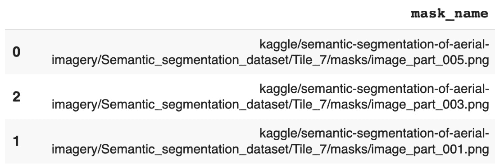
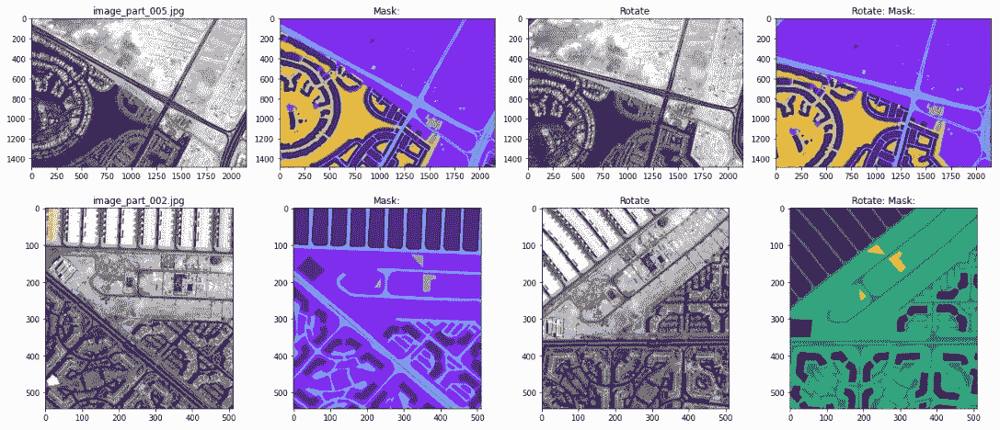
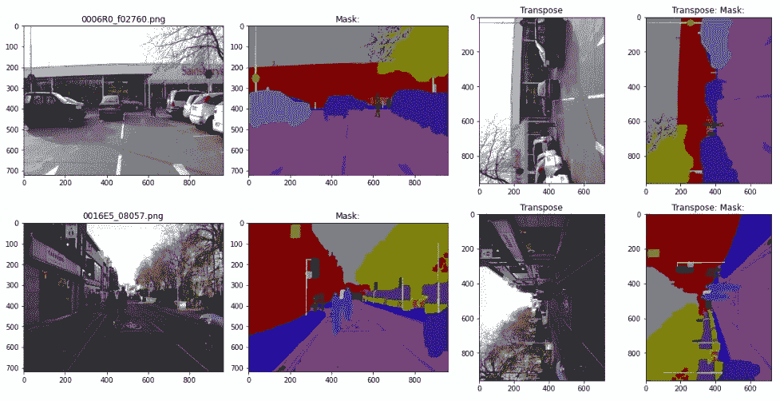
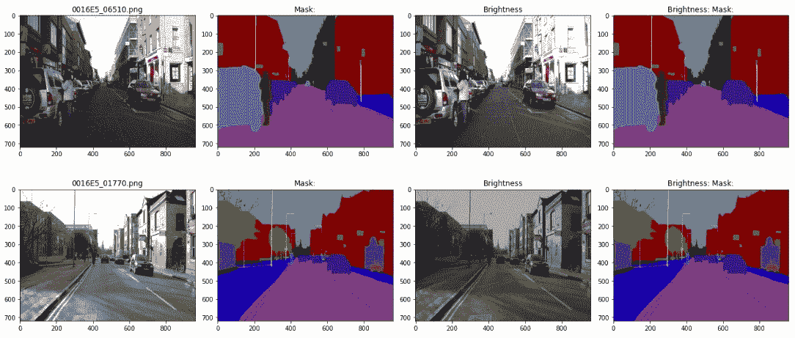

# 第四章：图像增强用于分割

图像分割，像图像分类一样，是计算机视觉领域的基石。图像分割涉及将属于同一对象的图像部分进行分组，也称为像素级分类。与图像分类不同，图像分类是识别和预测照片的主题或标签，而图像分割则决定一个像素是否属于某个对象列表——例如，一张城市照片包含街道、路标、汽车、卡车、自行车、建筑物、树木和行人。图像分割的任务是判断这个图像像素是否属于汽车、树木或其他物体。

**深度学习**（**DL**），一种**人工神经网络**（**ANN**）算法，在图像分割中取得了巨大的突破。例如，深度学习中的图像分割使得自动驾驶车辆和**高级驾驶辅助系统**（**ADAS**）能够检测可导航的表面或行人。许多医学应用利用分割技术绘制肿瘤边界或测量组织体积。

图像增强方法无论是用于分割还是分类都是相同的，不同的是分割还需要附加的掩膜图像或真实图像。因此，我们在*第三章*中学到的关于增强图像用于分类的内容，也适用于增强图像分割。

本章旨在提供持续的几何和光度变换，用于图像分割。具体来说，你将学习以下主题：

+   几何和光度变换

+   现实世界中的分割数据集

+   通过 Python 代码强化你的学习

有趣的事实

图像分割或语义分割在许多自动驾驶汽车的 AI 控制系统中都有应用。它用于识别街道上的物体和行人。世界各地的比赛胜负，主要取决于图像分割增强技术，例如*Kaggle*竞赛中的*Udacity 和 Lyft 感知挑战*的获胜者，采用了随机调整大小裁剪、水平翻转以及亮度、对比度和饱和度的随机颜色扰动。

让我们从分割的几何和光度变换开始。

# 几何和光度变换

如在*第三章*中讨论的那样，几何变换会改变图像的几何形状，例如通过翻转、裁剪、填充、旋转或调整大小。对于图像分割，当水平**翻转**图像时，必须对掩膜进行相同的处理。Pluto 将向你展示如何翻转原始图像及其对应的掩膜图像；下面是一个预览：


图 4.1 – 图像分割水平翻转

在 *第三章* 中讨论的许多**安全**值大多保持不变。例如，如果图像的主题是人或城市景观，分类增强不能垂直翻转，因为预测人的年龄或城市的名称依赖于图像不被颠倒。然而，分割的目的是将人或车进行分组或勾画轮廓。因此，垂直翻转是可以接受的。

对于许多真实世界的应用，安全范围需要进一步研究。例如，对于自动驾驶汽车，如果你遇到车祸并且你的车辆翻倒了呢？AI 是否仍然需要正确地分类周围环境？

光度变换，如亮度、饱和度、对比度、色相偏移和 FancyPCA，在应用于分割时更具挑战性，因为原始图像会被扭曲，但掩码图像不会。一个大问题是，仅增强原始图像而不增强掩码图像，会否提高预测的准确性？

`Albumentations` 库定义了 37 种变换，认为它们在扭曲原图和掩码图像时是安全的。

从技术上讲，你可以使用光度变换来进行分割，并用 Python 代码实现，但最好查阅已发布的学术论文以确认。我们在 *第三章* 中讨论的黄金增强规则也适用于此——你选择一种能提高预测准确性的过滤器，这种方法在已发布的学术论文中有描述。

使用 Python 代码进行学习是理解图像分割的另一种途径。然而，在我们进行之前，让我们请 Pluto 从 Kaggle 下载一些真实世界的分割数据集。

# 真实世界的分割数据集

*Kaggle* 网站是一个为数据科学家和机器学习爱好者提供的在线社区平台。它包含了成千上万的真实世界数据集，如在*第一章*、*第二章*和*第三章*中所提到的。

在寻找图像分割数据集时，Pluto 找到了大约 500 个可用的真实世界分割数据集。这些数据集的主题从自动驾驶汽车和医学到微型化石不等。Pluto 从热门市场领域中挑选了两个分割数据集。

另一个考虑因素是图像类型必须易于在 Albumentations 库中处理。Pluto 使用**PIL**和**NumPy**库来读取并将照片转换成三维数组。原始图像的**shape**是（宽度、高度和深度），其中深度通常等于三。掩码图像的**shape**是（宽度、高度），值为 0、1、2 等，直到标签的数量。

有趣的事实

PIL 库可以读取 `.jpg`、`.gif`、`.tiff`、`.png` 等格式的图像文件，还有大约 50 种其他图像格式。然而，有时真实世界的分割数据集会带有 PIL 无法读取的图像格式。在这种情况下，Pluto 借助 Python 的**ImageIO**库，该库可以读取超过 100 种图像格式。

选中的两个分割数据集如下：

+   *Cambridge-Driving Labeled Video (CamVid)* 数据库是第一个真实世界的分割数据集。*Kaggle* 网站上的背景如下：

“*Cambridge-Driving Labeled Video Database (CamVid) 提供了将每个像素与 32 个语义类别之一关联的地面真值标签。该数据集常用于（实时）语义分割研究。*”

它于 2020 年由**剑桥大学**发布，许可证为**CC BY-NC-SA 4.0**：[`creativecommons.org/licenses/by-nc-sa/4.0/`](https://creativecommons.org/licenses/by-nc-sa/4.0/)。

+   第二个真实世界数据集叫做 *空中图像语义分割*。来自 *Kaggle* 网站的描述如下：

“*数据集由通过 MBRSC 卫星获取的迪拜空中图像组成，并通过像素级语义分割标注为 6 个类别。数据集的总容量为 72 张图像，分为 6 个较大的瓦片。*”

它于 2020 年由**叙利亚 Roia 基金会**发布，许可证为**CC0: 公共领域**：[`creativecommons.org/publicdomain/zero/1.0/`](https://creativecommons.org/publicdomain/zero/1.0/)。

选择两个分割数据集后，接下来的四个步骤你应该已经熟悉。如果需要澄清，请复习*第二章*和*第三章*。步骤如下：

1.  获取 Python Notebook 和 Pluto。

1.  下载真实世界的数据。

1.  将数据加载到 pandas 中。

1.  查看数据图像。

有趣的挑战

从 *Kaggle* 网站或其他来源查找并下载两个额外的图像分割数据集。*Kaggle* 的竞赛和数据包含数百个图像分割数据集。因此，找到对你或你的工作有意义的图像分割数据集应该不成问题。提示：使用 Pluto 的 `fetch_kaggle_dataset()` `or` `fetch_kaggle_comp_data()` 函数。

让我们从 Pluto 开始。

## Python Notebook 和 Pluto

从加载 `data_augmentation_with_python_chapter_4.ipynb` 文件到 Google Colab 或你选择的 Jupyter Notebook 或 JupyterLab 环境开始。从这一点起，代码片段将来自 Python Notebook，其中包含完整的函数。

接下来，你必须克隆仓库并使用`%run`命令启动 Pluto：

```py
# clone the github
!git clone 'https://github.com/PacktPublishing/Data-Augmentation-with-Python'
# instantiate Pluto
%run 'Data-Augmentation-with-Python/pluto/pluto_chapter_3.py'
```

输出将如下所示，或类似：

```py
---------------------------- : ---------------------------
            Hello from class : <class '__main__.PacktDataAug'> Class: PacktDataAug
                   Code name : Pluto
                   Author is : Duc Haba
---------------------------- : ---------------------------
                fastai 2.6.3 :  actual 2.7.9
---------------------------- : ---------------------------
        albumentations 1.2.1 : actual 1.2.1
---------------------------- : ---------------------------
```

仔细检查 Pluto 是否已正确加载：

```py
# display Python and libraries version number
pluto.say_sys_info()
```

输出将如下所示，或根据你的系统类似：

```py
---------------------------- : ---------------------------
                 System time : 2022/10/21 15:46
                    Platform : linux
     Pluto Version (Chapter) : 3.0
       Python version (3.7+) : 3.7.13 (default, Apr 24 2022, 01:04:09) [GCC 7.5.0]
            PyTorch (1.11.0) : actual: 1.12.1+cu113
              Pandas (1.3.5) : actual: 1.3.5
                 PIL (9.0.0) : actual: 7.1.2
          Matplotlib (3.2.2) : actual: 3.2.2
                   CPU count : 2
                  CPU speed : NOT available
---------------------------- : ---------------------------
```

Pluto 已验证 Python Notebook 正常工作。下一步是从 Kaggle 下载真实世界的图像数据集。

## 真实世界数据

以下下载功能来自*第二章*。Pluto 已在此处重用：

```py
# Fetch Camvid photo
url = 'https://www.kaggle.com/datasets/carlolepelaars/camvid'
pluto.fetch_kaggle_dataset(url)
# Fetch Aerial image
url = 'https://www.kaggle.com/datasets/humansintheloop/semantic-segmentation-of-aerial-imagery'
pluto.fetch_kaggle_dataset(url)
```

在查看下载的照片之前，Pluto 需要将数据加载到 pandas DataFrame 中。

## Pandas

这里需要进行一些清理任务，比如将目录或文件名中的空格字符替换为下划线，并将原始图像与掩码图像分开。清理后，Pluto 重用`make_dir_dataframe()`函数将原始图像数据读取到 pandas 数据框中。CamVid 数据的命令如下：

```py
# import data to Pandas
f = 'kaggle/camvid/CamVid/train'
pluto.df_camvid = pluto.make_dir_dataframe(f)
```

前三条记录的输出如下：


图 4.2 – CamVid pandas 数据框，前 3 行

掩码图像位于不同的文件夹中，且掩码图像的文件名在原文件名后加上了`_L`。

Pluto 使用 pandas 的主要原因是，为匹配的掩码和原始文件名添加新列是个简单的任务。只有两行关键代码。第一行是在帮助函数中生成正确的掩码图像路径，第二行是创建新列以应用帮助函数。相关代码如下：

```py
# define helper function
@add_method(PacktDataAug)
def _make_df_mask_name(self,fname):
  p = pathlib.Path(fname)
  return (str(p.parent.parent) +
    '/' + str(p.parent.name) + '_labels/' +
    str(p.stem) + '_L' + str(p.suffix))
# method definition
@add_method(PacktDataAug)
def make_df_mask_name(self,df):
  df['mask_name'] = df.fname.apply(self._make_df_mask_name)
  return
```

完成 CamVid 数据框的命令如下：

```py
# create mask file name
pluto.make_df_mask_name(pluto.df_camvid)
```

输出结果如下：


图 4.3 – 完整的 CamVid 数据框，前 3 行

一旦 Pluto 将所有信息整理到数据框中，下一步就是展示原始图像与掩码图像。

## 查看数据图像

Pluto 可以重用*第二章*中的`draw_batch()`函数，以分批显示原始图像和掩码图像，但结果无法加强原始图像与掩码图像的结合。因此，Pluto 将修改`draw_batch()`方法，创建一个新的`draw_batch_segmentation()`方法，并设计一个名为`_draw_batch_segmentation()`的帮助函数。

结果展示了原始图像，接着是掩码图像，并重复此过程。显示 CamVid 分割照片的命令如下：

```py
# use new batch display method for segmentation
pluto.draw_batch_segmentation(pluto.df_camvid,
  is_shuffle=True)
```

输出结果如下：


图 4.4 – CamVid 的原始图像与掩码图像批次

分割批次看起来是正确的，因此 Pluto 对航拍分割数据重复相同的过程。

使用以下命令下载数据：

```py
# fetch real-world data
url = 'https://www.kaggle.com/datasets/humansintheloop/semantic-segmentation-of-aerial-imagery'
pluto.fetch_kaggle_dataset(url)
```

清理目录和文件名，然后使用以下命令将它们导入到 pandas 中：

```py
# import to Pandas
f = 'kaggle/semantic-segmentation-of-aerial-imagery'
pluto.df_aerial = pluto.make_dir_dataframe(f)
```

前五条记录的输出如下：


图 4.5 – 航拍 pandas 数据框，前 3 行

使用新的帮助函数添加掩码的文件名，如下所示：

```py
# create mask filename
pluto.make_df_mask_name_aerial(pluto.df_aerial)
```

前三条记录的输出如下：



图 4.6 – 完整的航拍数据框，前 3 行

使用以下命令显示分割图像批次：

```py
# draw batch image
pluto.draw_batch_segmentation(pluto.df_aerial,
  is_shuffle=True)
```

输出结果如下：


图 4.7 – 航拍 pandas 数据框，前五行

有趣的挑战

这是一个思维实验：给定一个图像数据集，你如何为这些照片创建掩膜？提示：你可以使用高级图像软件自动描绘物体或轮廓，然后进行标注。其他选择是使用 Mechanical Turk 或众包。你应该考虑成本与时间的平衡。

Pluto 已经成功下载并展示了 CamVid 和航拍分割照片。现在，让我们用 Python 进行一些图像增强。

# 强化你的学习

分类图像变换的相同概念适用于分割图像变换。在这里，Pluto 重复使用或稍微修改了*第三章*中的包装函数。特别地，Pluto 为分割处理黑客化了以下方法：

+   水平翻转

+   垂直翻转

+   旋转

+   随机调整大小和裁剪

+   转置

+   光照

+   FancyPCA

有趣的事实

你无法完成或理解本章节，除非你已经阅读了*第三章*。这是因为 Pluto 重复使用或稍微修改了现有的图像增强包装函数。

Pluto 选择这些滤镜是因为 Albumentations 库将它们标记为**安全**的分割方法。所以，让我们从水平翻转开始。

## 水平翻转

Pluto 在*第三章*中使用 PIL 库演示了水平翻转，因为代码易于理解。因此，他将`draw_image_flip_pil()`函数黑客化为`draw_image_flip_pil_segmen()`函数。转换代码是相同的——即，`PIL.ImageOps.mirror(img)`。变化之处在于将图像并排显示。

在 Python Notebook 中，翻转 CamVid 数据集图像的命令如下：

```py
# use wrapper function to flip image
pluto.draw_image_flip_pil_segmen(pluto.df_camvid.fname[0])
```

输出结果如下：


图 4.8 – 使用 PIL 库翻转图像

Pluto 使用相同的函数处理掩膜图像，并将`mask_image`列传入 pandas 数据框。这就是这么简单。Pluto 必须使用相同的滤镜来转换原始图像和掩膜图像。

翻转掩膜图像的命令如下：

```py
# use wrapper function to flip image mask
pluto.draw_image_flip_pil_segmen(pluto.df_camvid.mask_name[0]
```

输出结果如下：


图 4.9 – 使用 PIL 库翻转掩膜

有趣的事实

Pluto 在本书中仅展示相关的代码片段，但完整的面向对象方法可以在 Python Notebook 中找到。本章的代码与*第三章*中的代码非常相似。Pluto 使用*第一章*提供的原则布局设计了软件架构。因此，代码看起来简洁，但在后台包含了较高的复杂性。

从底层来看，彩色图像是一个三维数组或**Rank 3 张量**。图像的形状为（宽度、高度和深度），其中深度通常为 3，而掩码图像的形状为（宽度、高度），其中值为 0、1、2 等，一直到标签数量。因此，镜像**Rank 3 张量**的操作与镜像**Rank 1 张量**的操作相同。

对于 Albumentations 库，分割的包装函数与在*第三章*中提供的非常简单。`draw_image_flip_segmen()` 方法的代码如下：

```py
# method definition
@add_method(PacktDataAug)
def draw_image_flip_segmen(self,df):
  aug_album = albumentations.HorizontalFlip(p=1.0)
  self._draw_image_album_segmentation(df,aug_album,
    'Horizontal Flip')
  return
```

它与我们在*第三章*中提供的 `draw_image_flip()` 函数相同。不同之处在于，使用了不同的辅助函数。它没有使用 `_draw_image_album()` 辅助函数，而是使用了 `_draw_image_album_segmentation()` 方法。

对 CamVid 分割数据在 Python Notebook 中执行水平翻转的命令如下：

```py
# use wrapper function to flip both image and image mask
pluto.draw_image_flip_segmen(pluto.df_camvid)
```

输出如下：


图 4.10 – CamVid 数据集的水平翻转

对航拍分割数据执行水平翻转的命令如下：

```py
# use the same flip segmentation wrapper function on arial
pluto.draw_image_flip_segmen(pluto.df_aerial)
```

输出如下：


图 4.11 – 航拍数据集的水平翻转

如同在*第三章*中所述，本章中的包装函数每次都会随机选择一批新的图像。

有趣的挑战

这里有一个思维实验：你如何利用图像分割来支持环保组织，例如野生动物保护组织？提示：考虑海关人员如何使用 iPhone 或**闭路电视（CCTV）**监控系统，在开放市场中发现有人出售濒危物种的部分，如象牙或萨嘎角。

Pluto 使用垂直翻转滤镜完成了翻转操作。

## 垂直翻转

垂直翻转的包装函数几乎与水平翻转方法相同。Pluto 本可以写一个通用函数来替代每个包装方法的独立实现。但目标是解释每个转换，而不是将其重构为更紧凑或更高效的代码。包装函数的关键代码行如下：

```py
# use albumentations library function
aug_album = albumentations.Flip(p=1.0)
```

在 Python Notebook 中对 CamVid 分割数据执行垂直翻转的命令如下：

```py
# use flip wrapper function for camvid data
pluto.draw_image_flip_both_segmen(pluto.df_camvid)
```

输出如下：


图 4.12 – CamVid 数据集的垂直翻转

对航拍分割数据执行垂直翻转的命令如下：

```py
# use flip wrapper function for aerial image
pluto.draw_image_flip_both_segmen(pluto.df_aerial)
```

输出如下：


图 4.13 – 航拍数据集的垂直翻转

翻转操作到此为止。现在，让我们来看一下旋转。

## 旋转

旋转的安全参数可以顺时针或逆时针旋转 45 度。Albumentations 方法如下：

```py
# use albumentation library function for rotating
aug_album = albumentations.Rotate(limit=45, p=1.0)
```

用于在 Python Notebook 中旋转 CamVid 分割数据的命令如下：

```py
# use rotate wrapper function for camvid image
pluto.draw_image_rotate_segmen(pluto.df_camvid)
```

输出如下：


图 4.14 – 旋转 CamVid 数据集

用于旋转航拍分割数据的命令如下：

```py
# use rotate wrapper function for aerial image
pluto.draw_image_rotate_segmen(pluto.df_aerial)
```

输出如下：



图 4.15 – 旋转航拍数据集

下一个滤镜是调整大小和裁剪。

## 调整大小和裁剪

分类模型旨在识别对象，而分割模型则按像素对对象进行分组。因此，裁剪和调整大小是在相对较高的安全参数下可以接受的变换。包装函数的关键代码行如下：

```py
# use albumentations function for resizing and cropping
aug_album = albumentations.RandomSizedCrop(
  min_max_height=(500, 600),
  height=500,
  width=500,
  p=1.0)
```

用于随机调整大小和裁剪 CamVid 分割数据的 Python Notebook 命令如下：

```py
# use resize and crop wrapper functiion for camvid photo
pluto.draw_image_resize_segmen(pluto.df_camvid)
```

输出如下：


图 4.16 – 调整大小和裁剪 CamVid 数据集

用于随机调整大小和裁剪航拍分割数据的命令如下：

```py
# use resize and crop wrapper functiion for aerialphoto
pluto.draw_image_resize_segmen(pluto.df_aerial)
```

输出如下：


图 4.17 – 调整大小和裁剪航拍数据集

接下来，我们将介绍转置滤镜。

## 转置

Pluto 没有在*第三章*中使用转置滤镜进行分类，但对于分割是可以接受的。转置是指交换 *x 轴* 和 *y 轴*。包装函数的关键代码行如下：

```py
# use albumentations library for transpose
aug_album = albumentations.Transpose(p=1.0)
```

用于转置 CamVid 分割数据的命令如下：

```py
# use transpose wrapper function for camvid data
pluto.draw_image_transpose_segmen(pluto.df_camvid)
```

输出如下：



图 4.18 – 转置 CamVid 数据集

用于转置航拍分割数据的命令如下：

```py
# use transpose wrapper function for aerial data
pluto.draw_image_transpose_segmen(pluto.df_aerial)
```

输出如下：


图 4.19 – 转置航拍数据集

有趣的挑战

在 Python Notebook 中实现光学畸变。提示：使用与 Albumentations 库函数 `albumentations.OpticalDistortion()` 方法类似的 Pluto 包装函数。

转置是 Pluto 用于几何变换的最后一个示例。光照，也称为亮度，属于光度变换类。

## 光照

光照或亮度在 Albumentations 库中是可以接受的分割变换，但它属于光度变换类。原始图像会变更为随机亮度级别，直到安全水平，但掩码图像不会改变。对于两个数据集，安全参数的亮度为 0.5。包装函数中的关键代码行如下：

```py
# use albumentations library for brightness
aug_album = albumentations.ColorJitter(
  brightness=brightness,
  contrast=0.0,
  saturation=0.0,
  hue=0.0,
  always_apply=True,
  p=1.0)
```

用于对 CamVid 分割数据应用光照的命令如下：

```py
# use the brightmess wrapper function for camvid image
pluto.draw_image_brightness_segmen(pluto.df_camvid)
```

输出如下：



图 4.20 – 在 CamVid 数据集上使用闪电

使用闪电处理空中分割数据的命令如下：

```py
# use the brightmess wrapper function for aerial image
pluto.draw_image_brightness_segmen(pluto.df_aerial)
```

输出如下：


图 4.21 – 在空中数据集上使用闪电

类似于光照滤镜，FancyPCA 属于光度变换类。

## FancyPCA

FancyPCA 是 Pluto 演示的最后一个光度变换示例。对于这两个数据集，安全的参数是 alpha 值为 0.3。再次强调，FancyPCA 不会改变掩码图像。包装函数中的关键代码行如下：

```py
# use albumentations library for fancyPCA
aug_album = albumentations.FancyPCA(
  alpha=alpha,
  always_apply=True,
  p=1.0)
```

使用 FancyPCA 处理 CamVid 分割数据的命令如下：

```py
# use the fancyPCA wrapper function for camvid image
pluto.draw_image_fancyPCA_segmen(pluto.df_camvid)
```

输出如下：


图 4.22 – 在 CamVid 数据集上使用 FancyPCA

使用 FancyPCA 处理空中分割数据的命令如下：

```py
# use the fancyPCA wrapper function for aerial image
pluto.draw_image_fancyPCA_segmen(pluto.df_aerial)
```

输出如下：


图 4.23 – 在空中数据集上使用 FancyPCA

有趣的挑战

这里有一个思维实验，或者也许是一个实践题：你能做什么看起来在图像增强中是可接受的，但在实际部署中有很高概率产生 **假阳性** 或 **假阴性** 预测？抱歉，没有提示。

Pluto 发现，分割增强与分类增强并没有太大区别。包装函数几乎相同，只有辅助方法以不同的方式显示图像。Pluto 已经展示了翻转、调整大小、裁剪、旋转、转置、光照和 FancyPCA 变换的分割处理。与 *第三章* 类似，接下来，Pluto 将把各个滤镜组合成一个超级函数。

## 组合

在 Python 中编码超级组合方法之前，Pluto 需要使用 pandas 汇总本章中的滤镜。分割操作适用更多的变换，因此如果你在 Python 笔记本中试验其他滤镜，可以通过你的新滤镜扩展 pandas 表格。

Pluto 使用以下命令显示汇总表格：

```py
# use Pandas to display the combination filters
pluto.print_safe_parameters_segmen()
```

输出如下：


图 4.24 – 汇总分割滤镜

使用汇总表格，Pluto 编写了包装函数。关键的代码行如下：

```py
# use albumentations library
aug_album = albumentations.Compose([
  albumentations.ColorJitter(brightness=0.5,
    contrast=0.0,
    saturation=0.0,
    hue=0.0,p=0.5),
  albumentations.HorizontalFlip(p=0.5),
  albumentations.Flip(p=0.5),
  albumentations.Rotate(limit=45, p=0.5),
  albumentations.RandomSizedCrop(
    min_max_height=(500, 600),
    height=500,
    width=500,
    p=0.5),
  albumentations.Transpose(p=0.5),
  albumentations.FancyPCA(alpha=0.2, p=0.5)])
```

Pluto 显示了 CamVid 数据集的组合分割变换，如下所示：

```py
# use combination wrapper function for camvid photo
pluto.draw_uber_segmen(pluto.df_camvid)
```

输出如下：


图 4.25 – 组合 CamVid 数据集的滤镜

空中数据集在 Python 笔记本中的命令如下：

```py
# use combination wrapper function for aerial photo
pluto.draw_uber_segmen(pluto.df_aerial)
```

输出如下：


图 4.26 – 为航拍数据集组合过滤器

有趣的挑战

Pluto 挑战你重构 **Pluto 类**，使其更快、更紧凑。你被鼓励创建并上传你的库到 *GitHub 和 PyPI.org*。此外，你不必将类命名为 **PacktDataAug**，但如果你引用或提到本书，Pluto 和他的人类伙伴将非常高兴。代码的目标是易于理解、可重用的模式以及在 **–Python Notebook** 中教学。因此，将代码重构为 Python 库将相对轻松且有趣。

到这里，你已经学会了如何组合分割转换。接下来，我们将总结本章所涵盖的内容。

# 摘要

图像分割由原始图像和附带的掩膜图像组成。目标是确定某个像素是否属于某个对象列表。例如，一张城市照片包含街道、街道标志、汽车、卡车、自行车、建筑物、树木和行人。图像分割的任务是判断这个像素是属于汽车、树木还是其他物体。

图像分割和图像分类共享相同的转换。换句话说，大多数几何转换，如翻转、旋转、调整大小、裁剪和转置，适用于图像分割中的原始图像和掩膜图像。光度转换，如亮度、对比度和 FancyPCA，技术上可以通过 Python 实现，但这些过滤器不会改变掩膜图像。另一方面，像噪声注入和随机擦除这样的过滤器不适用于分割，因为它们会在原始图像中添加或替换像素。

在本章中，有许多 *有趣的事实* 和 *有趣的挑战*。Pluto 希望你能利用这些内容，拓展你的经验，超越本章的范围。

切换话题，下一章将讨论文本增强。Pluto 不能使用任何图像增强功能，但他可以重用用于从 *Kaggle* 网站下载数据集的包装函数。

# 第三部分：文本增强

本部分包含以下章节：

+   *第五章*，*文本增强*

+   *第六章*，*机器学习中的文本增强*
