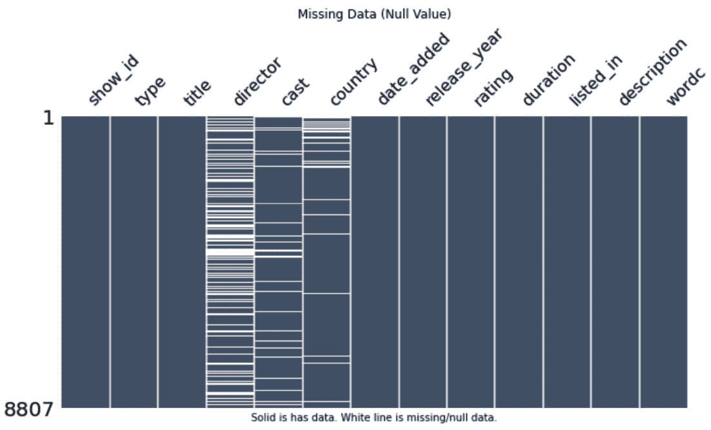

# 第五章：文本增强

文本增强是一种在**自然语言处理**（**NLP**）中使用的技术，通过修改或从现有文本数据创建新文本来生成额外数据。文本增强涉及的技术包括字符交换、噪声注入、同义词替换、单词删除、单词插入和单词交换。图像和文本增强的目标相同，它们都旨在增加训练数据集的大小并提高 AI 预测的准确性。

文本增强相对较难评估，因为它不像图像增强那样直观。图像增强技术的意图很明确，比如翻转照片，但字符交换技术可能会让读者感到困惑。因此，读者可能会将其益处视为主观的。

文本增强的效果取决于生成数据的质量以及正在执行的具体 NLP 任务。确定给定数据集所需的适当*安全*级别的文本增强可能会非常具有挑战性，这通常需要实验和测试才能获得预期的结果。

客户反馈或社交媒体上的聊天内容是文本增强的合理素材，因为这些内容通常杂乱无章，并且大多数包含语法错误。相反，法律文件或书面医疗通讯，如医生处方或报告，则不适合进行文本增强，因为这些内容要求精确表达。换句话说，错误注入、同义词替换甚至 AI 生成的文本可能会改变法律或医学的含义，超出*安全*水平。

文本增强中的偏差同样很难察觉。例如，通过故意拼写错误单词来使用键盘增强方法添加噪声，可能会引入对现实世界推文的偏见，而这些推文通常包含拼写错误的单词。没有普遍适用的规则可循，答案只有在深入研究数据并审查 AI 预测目标后才能显现出来。

有趣的事实

随着生成型 AI 的普及，你可以使用**OpenAI 的 GPT-3**、**Google Bard**或**Facebook 的 Roberta**系统生成原创文章用于文本增强。例如，你可以让生成型 AI 创建关于公司产品的正面或负面评论，然后使用 AI 编写的文章来训练情感分析预测 AI。

在*第五章*中，你将学习文本增强，并如何在 Python 笔记本中编写相关方法。特别是，我们将涵盖以下主题：

+   字符增强

+   单词增强

+   句子和流程增强

+   文本增强库

+   真实世界文本数据集

+   通过 Python 笔记本强化学习

让我们从最简单的主题开始，字符增强。

# 字符增强

字符增强会替换或注入字符到文本中。换句话说，它会制造打字错误。因此，这种方法似乎是违反直觉的。然而，就像图像增强中的噪声注入一样，学术论文展示了字符增强在提高 AI 预测准确性方面的好处，例如*Zhuosheng Zhang, Yafang Huang, Pengfei Zhu 和 Hai Zhao*于 2018 年在《*CCF 国际自然语言处理会议*》上发表的《*有效的字符增强词嵌入用于机器阅读理解*》。

三种标准的字符增强方法如下所示：

+   **光学字符识别（OCR）增强**功能通过将图像转换为文本来替代 OCR 中常见的错误，例如将字母*o*转换为数字*0*，或将大写字母*I*转换为数字*1*。

+   **键盘增强**方法将字符替换为其相邻的其他字符。例如，字符*b*的常见打字错误是按下*v*键或*n*键。

+   **随机字符**功能会在文本中随机交换、插入或删除字符。

有趣的事实

计算机编码文本在 1963 年至 1970 年期间有很大不同；例如，计算机会将字母*A*编码为整数 64 或十六进制 41。这一做法起源于 1964 年的**美国国家标准学会**（**ANSI**），并在 1970 年左右被**国际标准化组织**（**ISO**）采纳。1980 年，**统一码**（**Unicode**）取代了 ISO 标准，适用于所有国际语言。然而，如果你遇到来自 1964 年左右的计算机文本，它可能采用**扩展二进制编码十进制交换码**（**EBCDIC**），它将字母*A*编码为 193 或十六进制 C1。作为程序员，你可能需要回答这样一个问题：*你的网站或移动应用是否支持 Unicode？*

在字符增强之后，接下来的类别是单词增强。

# 单词增强

单词增强与字符增强具有相同的偏差和*安全*级别警告。超过一半的这些增强方法会向文本中注入错误，但其他功能则使用同义词或预训练的 AI 模型生成新文本。标准的单词增强功能如下所示：

+   **拼写错误增强**功能使用预定义的字典模拟拼写错误。它基于**Claude Coulombe**在 2018 年发布的学术论文《*通过利用 NLP 云 API 简化文本数据增强*》。

+   **分割增强**功能会将单词随机分成两个词元。

+   **随机词**增强方法通过四个参数对文本应用随机行为：**替换**、**交换**、**删除**和**裁剪**。它基于两篇学术论文：**Yonatan Belinkov 和 Yonatan Bisk**于 2018 年发表的《*Synthetic and Natural Noise Both Break Neural Machine Translation*》以及**Gozde Gul Sahin**和**Mark Steedman**的《*Data Augmentation via Dependency Tree Morphing for Low-Resource Languages*》。

+   **同义词增强**功能用来自预定义数据库的同义词替换单词。第一个选项是使用**WordNet**。WordNet 是普林斯顿大学提供的一个广泛的英语词汇数据库。该数据库将名词、动词、形容词和副词分组为认知同义词集。第二个选项是使用**同义词数据库**（**PPDB**）。PPDB 是一个自动提取的数据库，包含 16 种语言的数百万个同义词。PPDB 旨在通过增强系统对语言变异性和未见过单词的鲁棒性来改善语言处理。整个 PPDB 资源可在美国**创意共享署名****3.0**许可证下免费获取。

+   **反义词增强**功能用反义词替换单词。它基于**Tong Niu**和**Mohit Bansal**于 2018 年发表的学术论文《*Adversarial Over-Sensitivity and Over-Stability Strategies for Dialogue Models*》。

+   **保留字增强**方法在你定义的单词列表中交换目标单词。它与同义词相似，只是这些术语是手动创建的。

有趣的挑战

这里有一个思想实验：你能想出一种新的字符或单词增强技术吗？一个提示是考虑一下阅读障碍者是如何阅读的。

接下来，我们将看看句子增强。

# 句子增强

句子增强使用生成式 AI 来创建新文本。AI 模型的例子有 BERT、Roberta、GPT-2 等。

三种句子增强方法如下所示：

+   **上下文词嵌入**使用 GPT-2、Distilled-GPT-2 和 XLNet。

+   **抽象总结**使用 Facebook Roberta 和 T5-Large。

+   **Top-n 相似词**使用 LAMBADA。

在 Pluto 解释 Python 笔记本中的代码之前，我们先来回顾一下文本增强库。

# 文本增强库

比起文本增强库，Python 中开源的图像增强库更多。有些库对特定类别的适应性比其他库更强，但通常来说，选择一到两个库并精通它们是一个不错的选择。

知名的库有**Nlpaug**、**自然语言工具包**（**NLTK**）、**生成相似**（**Gensim**）、**TextBlob**、**TextAugment**和**AugLy**：

+   **Nlpaug**是一个用于深度学习文本增强的库。其目标是通过生成文本数据来提高深度学习模型的表现。GitHub 链接是[`github.com/makcedward/nlpaug`](https://github.com/makcedward/nlpaug)。

+   **NLTK** 是一个用于构建 Python 程序以处理人类语言数据的平台。它提供了对超过 50 种语料库和词汇资源的接口，例如 WordNet。NLTK 包含用于分类、分词、词干提取、标注、解析和语义推理的文本处理库。GitHub 链接是 [`github.com/nltk/nltk`](https://github.com/nltk/nltk)。

+   **Gensim** 是一个流行的开源 NLP 库，用于无监督主题建模。它利用学术模型和现代统计机器学习来执行词向量、语料库、主题识别、文档比较和分析纯文本文档。GitHub 链接是 [`github.com/RaRe-Technologies/gensim`](https://github.com/RaRe-Technologies/gensim)。

+   **TextBlob** 是一个用于处理文本数据的库。它提供了一个简单的 API，方便处理典型的 NLP 任务，如词性标注、名词短语提取、情感分析、分类和翻译。GitHub 链接是 [`github.com/sloria/TextBlob`](https://github.com/sloria/TextBlob)。

+   **TextAugment** 是一个用于增强 NLP 应用中文本的库。它使用并结合了 NLTK、Gensim 和 TextBlob 库。GitHub 链接是 [`github.com/dsfsi/textaugment`](https://github.com/dsfsi/textaugment)。

+   **AugLy** 是 Facebook 提供的一个数据增强库，支持音频、图像、文本和视频模块，并提供超过 100 种增强方法。每种模态的增强被分类到不同的子库中。GitHub 链接是 [`github.com/facebookresearch/AugLy`](https://github.com/facebookresearch/AugLy)

)

与图像增强包装函数类似，Pluto 将编写包装函数，通过库实现底层功能。你可以为一个项目选择多个库，但 Pluto 将使用 **Nlpaug** 库来支持这些包装函数。

让我们从 *Kaggle* 网站下载真实世界的文本数据集。

# 真实世界的文本数据集

*Kaggle* 网站是一个面向数据科学家和机器学习爱好者的在线社区平台。Kaggle 网站有成千上万的真实世界数据集；Pluto 在其中找到了约 2,900 个 **NLP** 数据集，并选择了两个 NLP 数据集用于本章内容。

在 *第二章* 中，Pluto 以 **Netflix** 和 **Amazon** 数据集为例，帮助理解偏差问题。Pluto 保留了 **Netflix** 的 NLP 数据集，因为电影评论是经过筛选的。虽然存在一些语法错误，但整体上输入文本质量较高。

第二个 **NLP** 数据集是 **Twitter 情感分析** (**TSA**)。29,530 条真实世界的推文包含许多语法错误和拼写错误。挑战在于将推文分类为两类： (1) 正常，或 (2) 种族歧视和性别歧视。

数据集由 **Mayur Dalvi** 于 2021 年发布，许可证为 **CC0: 公共领域**，[`creativecommons.org/publicdomain/zero/1.0/`](https://creativecommons.org/publicdomain/zero/1.0/)。

选择两个 NLP 数据集后，您可以使用相同的四个步骤，通过 Python Notebook 开始实际学习的过程。如果需要澄清，可以参考*第二章*和*第三章*。步骤如下：

1.  获取 Python Notebook 和 Pluto。

1.  下载真实世界数据。

1.  导入到 pandas。

1.  查看数据。

让我们从 Pluto 开始。

## Python Notebook 和 Pluto

从将 `data_augmentation_with_python_chapter_5.ipynb` 文件加载到 **Google Colab** 或您选择的 Jupyter notebook 或 JupyterLab 环境开始。从此开始，代码片段来自 Python Notebook，其中包含完整代码。

下一步是克隆代码库。Pluto 将重用来自*第二章*的代码，因为它包含下载 Kaggle 数据的方法，而不包含图像增强功能。`!git` 和 `%run` 语句用于启动 Pluto。命令如下：

```py
# clone GitHub repo
!git clone 'https://github.com/PacktPublishing/Data-Augmentation-with-Python'
# instantiate Pluto
%run 'Data-Augmentation-with-Python/pluto/pluto_chapter_2.py'
```

输出如下：

```py
---------------------------- : ---------------------------
            Hello from class : <class '__main__.PacktDataAug'> Class: PacktDataAug
                   Code name : Pluto
                   Author is : Duc Haba
---------------------------- : ---------------------------
```

我们需要进行最后一次检查，以确保 Pluto 已经成功加载。以下命令让 Pluto 报告他的状态：

```py
pluto.say_sys_info()
```

输出应该如下所示，或根据您的系统可能有所不同：

```py
---------------------------- : ---------------------------
                 System time : 2022/10/30 06:52
                    Platform : linux
     Pluto Version (Chapter) : 2.0
             Python (3.7.10) : actual: 3.7.15 (default, Oct 12 2022, 19:14:55) [GCC 7.5.0]
            PyTorch (1.11.0) : actual: 1.12.1+cu113
              Pandas (1.3.5) : actual: 1.3.5
                 PIL (9.0.0) : actual: 7.1.2
          Matplotlib (3.2.2) : actual: 3.2.2
                   CPU count : 2
                  *CPU speed : NOT available
---------------------------- : ---------------------------
```

在这里，Pluto 报告说他来自*第二章*，也就是**版本 2.0**。这正是我们所需要的，因为我们不需要来自*第三章*和*第四章*的任何图像增强功能。下一步是下载真实世界的 **Netflix** 和 **Twitter** NLP 数据集。

## 真实世界的 NLP 数据集

目前尚未为本章编写新代码。Pluto 重用 `fetch_kaggle_dataset()` 方法下载 **Netflix** 数据集，具体如下：

```py
# fetch data
url = 'https://www.kaggle.com/datasets/infamouscoder/dataset-netflix-shows'
pluto.fetch_kaggle_dataset(url)
```

`dataset-netflix-shows.zip` 文件大小为 1.34 MB，功能会自动解压到 **kaggle** 目录中。

获取 Twitter 数据集的方法如下：

```py
# fetch data
url = 'https://www.kaggle.com/datasets/mayurdalvi/twitter-sentiments-analysis-nlp'
pluto.fetch_kaggle_dataset(url)
```

`twitter-sentiments-analysis-nlp.zip` 文件大小为 1.23 MB，功能会自动解压到 **kaggle** 目录中。

有趣的挑战

挑战是从 Kaggle 网站搜索并下载两个额外的真实世界 NLP 数据集。提示：使用 `pluto.fetch_kaggle_dataset()` 方法。Pluto 是一只虚拟的数字西伯利亚哈士奇犬。因此，他会一直开心地获取数据，直到你的磁盘空间用尽。

下一步是将数据加载到 pandas 中。

## Pandas

`fetch_df()` 方法。请注意，`df` 是 pandas **DataFrame** 类的典型缩写。

对于 **Netflix** 数据，Pluto 使用以下两个命令将数据导入 pandas 并打印出数据批次：

```py
# import into Panda
f = 'kaggle/dataset-netflix-shows/netflix_titles.csv'
pluto.df_netflix_data = pluto.fetch_df(f)
# display data batch
pluto.print_batch_text(pluto.df_netflix_data,
  cols=['title', 'description'])
```

输出如下：


图 5.1 – Netflix 电影描述

有趣的事实

`fetch_df()` 方法随机选择若干记录显示在数据批次中。记录的数量或批次大小是 `bsize` 参数，默认是 10 条记录。

**Netflix** 电影评论数据经过整理，因此是干净的。Pluto 不需要清洗这些数据。然而，**Twitter** 数据就另当别论了。

清洗、导入并批量显示 **Twitter** 数据到 pandas 的命令如下：

```py
# clean space-char
f = 'kaggle/twitter-sentiments-analysis-nlp'
!find {f} -name "* *" -type f | rename 's/ /_/g'
# import into Pandas
f = 'kaggle/twitter-sentiments-analysis-nlp/Twitter_Sentiments.csv'
pluto.df_twitter_data = pluto.fetch_df(f)
# display data batch
pluto.print_batch_text(pluto.df_twitter_data,cols=['label', 'tweet'])
```

输出如下：


图 5.2 – Twitter 推文

由于来自 **Twitter** 的现实世界推文是由公众编写的，它们包含拼写错误、脏话以及各种胡闹。

目标是预测普通推文与种族主义或性别歧视推文。Pluto 重点学习文本论证，因此他希望推文中包含可打印字符，没有 HTML 标签，也没有脏话。

Pluto 编写了两个简单的辅助方法来清洗文本并去除脏话。`_clean_text()` 函数使用了 `regex` 库，代码如下：

```py
return (re.sub('[^A-Za-z0-9 .,!?#@]+', '', str(x)))
```

`_clean_bad_word()` 辅助函数使用了 `filter-profanity` 库，代码如下：

```py
return (profanity.censor_profanity(x, ''))
```

`clean_text()` 方法利用 pandas 强大的 `apply` 函数结合这两个辅助函数。利用 pandas 内建的函数，Pluto 用两行代码编写了 `clean_text()` 函数，而不是用十几行标准的 `if-else` 和 `for` 循环构造。代码如下：

```py
# clean text
df['clean_tweet'] = df.tweet.apply(self._clean_text)
# remove profanity words
df['clean_tweet'] = df['clean_tweet'].apply(
    self._clean_bad_word)
```

清洁推文和显示数据批次的命令如下：

```py
# clean tweets
pluto.clean_text(pluto.df_twitter_data)
# display data batch
pluto.print_batch_text(pluto.df_twitter_data,
    cols=['label', 'clean_tweet'])
```

输出如下：


图 5.3 – 清洁后的 Twitter 推文

趣味事实

谁能想到狗和熊猫能合作得这么好？下一部 *功夫熊猫* 电影讲述的是 **Po** 和 **Pluto** 联手抵御世纪风暴的故事，这场风暴是由全球变暖引起的，它正摧毁着城市墙。

让我们使用 pandas 和其他一些库来可视化 NLP 数据集。

## 可视化 NLP 数据

*第二章* 使用 `draw_word_count()` 方法显示每条记录的平均单词数，以及最短和最长的电影评论。图表的右侧显示了电影评论单词计数的直方图。pandas 库生成了漂亮的单词计数图表。Pluto 重用了这个函数来显示 **Netflix** NLP 数据，具体如下：

```py
# draw word count
pluto.draw_word_count(pluto.df_netflix_data)
```

输出如下：


图 5.4 – Netflix 单词计数

Netflix 电影描述的平均字数为 23.88 字，最少 10 字，最多 48 字。Pluto 对 **Twitter** NLP 数据做了同样的处理，具体如下：

```py
# draw word count
pluto.draw_word_count(pluto.df_twitter_data)
```

输出如下：


图 5.5 – Twitter 单词计数

Twitter 推文的平均字数为 12.78 字，最少 1 字，最多 33 字。

Pluto 编写了 `draw_text_null_data()` 方法来检查是否存在缺失数据，也就是使用 `Missingno` 库生成图表，关键代码行如下：

```py
missingno.matrix(df,color=color,ax=pic)
```

Pluto 为 Netflix 数据绘制了 `null` 数据图表，如下所示：

```py
# draw missing data/null value
pluto.draw_text_null_data(pluto.df_netflix_data)
```

输出结果如下：



图 5.6 – Netflix 缺失数据

**Netflix** 数据中的 **director**、**cast** 和 **country** 分类存在缺失数据，但 **description** 分类，也就是电影评论，没有缺失数据。

Pluto 对 **Twitter** 数据做了相同的操作，如下所示：

```py
# draw missing data/null value
pluto.draw_text_null_data(pluto.df_twitter_data)
```

输出结果如下：


图 5.7 – Twitter 缺失数据

**Twitter** 数据中没有缺失数据。

有趣的事实

许多价值数百万美元的 AI 系统失败的主要原因是缺乏对输入数据的控制。例如，2020 年的 *Amazon Recruiting* 系统失败了，因为数据集中缺乏多样性，最严重的失败是 2016 年的 *Microsoft Chatbot Tay*。它被 Twitter 用户输入的性别歧视和种族主义推文所破坏。

下一个图表是字词云信息图。这是一种极好的 NLP 文本可视化方法。最常用的词语以大字号显示，而最少使用的词语则以较小字号显示。**WordCloud** 库生成了信息图表，关键代码片段如下：

```py
# generate word cloud
img = wordcloud.WordCloud(width = 1600,
        height = 800,
        background_color ='white',
        stopwords = xignore_words,
        min_font_size = 10).generate(words_str)
# covert Pandas to word string input
orig = df_1column.str.cat()
word_clean = re.sub('[^A-Za-z0-9 ]+', '', orig)
```

Pluto 使用 `_draw_text_wordcloud()` 辅助函数和 `draw_text_wordcloud()` 方法，展示了真实世界的 **Netflix** 数据的字词云信息图，如下所示：

```py
# draw word cloud
pluto.draw_text_wordcloud(pluto.df_netflix_data.description,
    xignore_words=wordcloud.STOPWORDS,
    title='Word Cloud: Netflix Movie Review')
```

输出结果如下：


图 5.8 – Netflix 字词云，包含大约 246,819 个单词

Pluto 对真实世界的 **Twitter** 数据也做了相同的操作，如下所示：

```py
# draw word cloud
pluto.draw_text_wordcloud(pluto.df_twitter_data.clean_tweet,
    xignore_words=wordcloud.STOPWORDS,
    title='Clean Tweets Word Cloud')
```

输出结果如下：


图 5.9 – Twitter 字词云，包含大约 464,992 个单词

有趣的事实

这里有一个关于字词云图的有趣小知识。字词云，又称标签云、Wordle 或加权列表，最早由 **Douglas Coupland** 在 1995 年的书籍 *Microserfs* 中以印刷形式使用。但直到 2004 年，字词云才在 *Flickr* 网站上以数字格式存在。今天，字词云信息图在互联网上和学术论文中广泛应用。

到目前为止，Pluto 已经讨论了字符、单词和句子增强理论，选择了 **Nlpaug** 文本增强库，并下载了真实世界的 **Netflix** 和 **Twitter** NLP 数据集。现在是时候通过 Python 代码执行文本增强来强化他的学习了。

# 通过 Python Notebook 强化学习

Pluto 使用 Python Notebook 加深我们对文本增强的理解。他使用批处理函数以批次的形式显示文本。它的工作方式类似于图像的批处理函数。换句话说，它会随机选择新的记录，并使用增强方法进行转换。

有趣的事实

Pluto 推荐重复运行批处理函数，以深入了解文本增强方法。在 **Twitter** 和 **Amazon** 数据集中有成千上万的文本记录。每次运行批处理函数时，它会显示来自数据集的不同记录。

与图像增强实现类似，包装函数在幕后使用 **Nlpaug** 库。这个包装函数让你可以专注于文本转换的概念，而不被库的实现所分心。你也可以使用其他文本增强库，包装函数的输入和输出将保持不变。

Pluto 可以编写一个复杂的函数，包含所有文本转换技术，这可能更高效，但这并不是本书的目标。阅读完本书后，你可以自信地选择重写或修改 Python Notebook 以适应你的风格。

在本章中，Pluto 使用 **查尔斯·狄更斯** 的《双城记》中的开篇句子作为控制文本。Pluto 通过将短语之间的逗号替换为句号来改写文本，因为这样更有利于文本增强过程。控制文本如下：

*“这是最好的时代，也是最坏的时代。是智慧的时代，也是愚蠢的时代。是信仰的纪元，也是怀疑的纪元。”*

Python Notebook 涵盖以下主题：

+   字符增强

+   单词增强

让我们从三种字符增强技术开始。

## 字符增强

字符增强是指向文本中注入错误。这个过程是违反直觉的，因为它故意向数据中添加错误。换句话说，它使得文本对于人类来说更难理解。相反，计算机使用深度学习算法来预测结果，尤其是 **卷积神经网络**（**CNN**）和 **递归神经网络**（**RNN**）算法。例如，推文的情感分类不会受到拼写错误的影响。

特别是，Pluto 将解释以下三种方法：

+   OCR 增强

+   键盘增强

+   随机增强

让我们从 OCR 开始。

### OCR 增强

OCR 过程将图像转换为文本，在转换过程中常出现错误，如将 *0* 和 *o* 混淆。

Pluto 编写了 `_print_aug_batch()` 辅助函数，随机选择 NLP 数据中的样本记录，应用文本增强方法，并使用 pandas 打印。输入或方法定义如下：

```py
# method definition
def _print_aug_batch(self, df,
    aug_func,
    col_dest="description",
    bsize=3,
    aug_name='Augmented'):
```

这里，`df` 是 pandas DataFrame，`aug_function` 是包装函数中的增强方法，`col_dest` 是选择的目标列，`bsize` 是批次中的样本数，默认为三，`title` 是图表的可选标题。

OCR 包装函数是基础的。两行代码分别是 `aug_func` 和辅助函数。整个代码如下：

```py
# method definiton
@add_method(PacktDataAug)
def print_aug_ocr(self, df,
    col_dest="description",
    bsize=3,
    aug_name='Augmented'):
    aug_func = nlpaug.augmenter.char.OcrAug()
    self._print_aug_batch(df,
        aug_func,
        col_dest=col_dest,
        bsize=bsize,
        aug_name=aug_name)
    return
```

Pluto 使用 `print_aug_ocr()` 方法处理 **Netflix** 数据，如下所示：

```py
# use OCR method
pluto.print_aug_ocr(pluto.df_netflix_data,
    col_dest='description',
    aug_name='OCR Augment')
```

输出如下：


图 5.10 – Netflix OCR 增强

在 *图 5.10* 中，第一行是 **狄更斯** 的控制文本，左侧是增强后的文本，右侧是原始文本。接下来的三行是从 **Netflix** NLP 数据中随机抽取的。Pluto 推荐先阅读左侧的增强文本。停下来并试着解读其含义，然后再阅读原始文本。

趣味事实

Pluto 推荐反复运行 `print_aug_ocr()` 方法以查看其他电影描述。你可以增加 `bsize` 来查看一次超过两条记录。

Pluto 同样对 **Twitter** 的 NLP 数据进行处理，如下所示：

```py
# print the batch
pluto.print_aug_ocr(pluto.df_twitter_data,
    col_dest='clean_tweet',
    aug_name='OCR Augment')
```

输出如下：


图 5.11 – Twitter OCR 增强

接下来，Pluto 从 OCR 方法转向键盘技术。

### 键盘增强

键盘增强方法通过用键盘上相近的键替换字符。例如，字符 *b* 的典型打字错误是按了键 *v* 或键 *n*。增强变量定义如下：

```py
# define augmentation function variable definition
aug_func = nlpaug.augmenter.char.KeyboardAug()
```

Pluto 使用 `print_aug_keyboard()` 包装函数处理 **Netflix** 的 NLP 数据，如下所示：

```py
# use keyboard augmentation technique
pluto.print_aug_keyboard(pluto.df_netflix_data,
    col_dest='description',
    aug_name='Keyboard Augment')
```

输出如下：


图 5.12 – Netflix 键盘增强

Pluto 同样对 **Twitter** 的 NLP 数据进行处理，如下所示：

```py
# use keyboard augmentation technique
pluto.print_aug_keyboard(pluto.df_twitter_data,
    col_dest='clean_tweet',
    aug_name='Keyboard Augment')
```

输出如下：


图 5.13 – Twitter 键盘增强

三种文本增强方法中的最后一种是随机技术。

### 随机增强

随机字符功能会随机交换、插入或删除文本中的字符。随机过程的四种模式是 **插入**、**删除**、**替换** 和 **交换**。增强变量定义如下：

```py
# define augmentation function variable definition
aug_func = nlpaug.augmenter.char.RandomCharAug(action=action)
```

Pluto 在 **Netflix** 的 NLP 数据中使用 `print_aug_random()` 包装函数，并将 `action` 设置为 `insert`，如下所示：

```py
# use random insert augmentation technique
pluto.print_aug_char_random(pluto.df_netflix_data,
    action='insert',
    col_dest='description',
    aug_name='Random Insert Augment')
```

输出如下：


图 5.14 – Netflix 随机插入增强

Pluto 同样对 **Twitter** 的 NLP 数据进行处理，如下所示：

```py
# use random insert augmentation technique
pluto.print_aug_char_random(pluto.df_twitter_data,
    action='insert',
    col_dest='clean_tweet',
    aug_name='Random Insert Augment')
```

输出如下：


图 5.15 – Twitter 随机插入增强

Pluto 在 **Netflix** NLP 数据上使用 `print_aug_random()` 包装函数，`action` 设置为 `delete`，具体如下：

```py
# use random delete augmentation technique
pluto.print_aug_char_random(pluto.df_netflix_data,
    action='delete',
    col_dest='description',
    aug_name='Random Delete Augment')
```

输出结果如下：


图 5.16 – Netflix 随机删除增强

Pluto 对 Twitter 的 NLP 数据也进行了相同处理，具体如下：

```py
# use random delete augmentation technique
pluto.print_aug_char_random(pluto.df_twitter_data,
    action='delete', col_dest='clean_tweet',
    aug_name='Random Delete Augment')
```

输出结果如下：


图 5.17 – Twitter 随机删除增强

Pluto 在 **Netflix** NLP 数据上使用 `print_aug_random()` 包装函数，`action` 设置为 `substitute`，具体如下：

```py
# use random substitute augmentation technique
pluto.print_aug_char_random(pluto.df_netflix_data,
    action='substitute',
    col_dest='description',
    aug_name='Random Substitute Augment')
```

输出结果如下：


图 5.18 – Netflix 随机替换增强

Pluto 对 **Twitter** NLP 数据也进行了相同处理，具体如下：

```py
# use random substitude augmentation technique
pluto.print_aug_char_random(pluto.df_twitter_data,
    action='substitute',
    col_dest='clean_tweet',
    aug_name='Random Substitute Augment')
```

输出结果如下：


图 5.19 – Twitter 随机替换增强

Pluto 在 **Netflix** NLP 数据上使用 `print_aug_random()` 包装函数，`action` 设置为 `swap`，具体如下：

```py
# use random swap augmentation technique
pluto.print_aug_char_random(pluto.df_netflix_data,
    action='swap',
    col_dest='description',
    aug_name='Random Swap Augment')
```

输出结果如下：


图 5.20 – Netflix 随机交换增强

Pluto 对 **Twitter** NLP 数据也进行了相同处理，具体如下：

```py
# use random swap augmentation technique
pluto.print_aug_char_random(pluto.df_twitter_data,
    action='swap',
    col_dest='clean_tweet',
    aug_name='Random Swap Augment')
```

输出结果如下：


图 5.21 – Twitter 随机交换增强

有趣的挑战

这里有一个思维实验：如果输入文本包含拼写错误和语法错误，比如推文，那么纠正拼写和语法是否可以作为有效的增强方法？

Pluto 已涵盖 **OCR**、**键盘** 和四种模式的 **随机** 字符增强技术。下一步是增强单词。

## 单词增强

到目前为止，Pluto 可能会觉得文本增强毫不费力，实际上这是真的。我们在 *第一章* 中打下了坚实的基础，使用面向对象的类并学习如何在学习新增强技术时扩展对象。在 *第二章* 中，Pluto 添加了用于下载任何 *Kaggle* 真实世界数据集的函数，*第三章* 和 *第四章* 给我们提供了包装函数模式。因此，到了这一点，Pluto 复用了这些方法和模式，使 Python 代码简洁易懂。

单词增强过程类似于字符增强。Pluto 使用相同的 `_print_aug_batch()` 辅助方法。特别是，Pluto 将涵盖 **拼写错误**、**分割**、**随机**、**同义词**、**反义词** 和 **保留** 单词增强技术。

让我们从拼写错误增强技术开始。

### 拼写错误增强

拼写错误增强函数使用预定义字典模拟拼写错误。增强变量定义如下：

```py
# define augmentation function variable definition
aug_func = nlpaug.augmenter.word.SpellingAug()
```

Pluto 在 **Netflix** NLP 数据上使用 `print_aug_word_misspell()` 包装函数，具体如下：

```py
# use word missplell augmentation
pluto.print_aug_word_misspell(pluto.df_netflix_data,
    col_dest='description',
    aug_name='Word Spelling Augment')
```

输出结果如下：


图 5.22 – Netflix 拼写错误单词增强

Pluto 对**Twitter** NLP 数据执行相同操作，如下所示：

```py
# use word missplell augmentation
pluto.print_aug_word_misspell(pluto.df_twitter_data,
    col_dest='clean_tweet',
    aug_name='Word Spelling Augment')
```

输出结果如下：


图 5.23 – Twitter 拼写错误单词增强

与**拼写错误**类似的是**分割**单词增强技术。

### 分割增强

分割增强函数随机将单词拆分为两个标记。增强变量定义如下：

```py
# define augmentation function variable definition
aug_func = nlpaug.augmenter.word.SplitAug()
```

Pluto 在**Netflix** NLP 数据上使用 `print_aug_word_split()` 包装函数，如下所示：

```py
# use word split augmentation
pluto.print_aug_word_split(pluto.df_netflix_data,
    col_dest='description',
    aug_name='Word Split Augment')
```

输出结果如下：


图 5.24 – Netflix 分割单词增强

Pluto 对**Twitter** NLP 数据执行相同操作，如下所示：

```py
# use word split augmentation
pluto.print_aug_word_split(pluto.df_twitter_data,
    col_dest='clean_tweet',
    aug_name='Word Split Augment')
```

输出结果如下：


图 5.25 – Twitter 分割单词增强

在分割单词方法之后，Pluto 展示了随机单词增强方法。

### 随机增强

随机单词增强方法对文本应用随机行为，具有四个参数：**交换**、**裁剪**、**替换**或**删除**。增强变量定义如下：

```py
# define augmentation function variable definition
aug_func = nlpaug.augmenter.word.RandomWordAug(action=action)
```

Pluto 在**Netflix** NLP 数据上使用 `print_aug_word_random()` 包装函数进行交换模式，如下所示：

```py
# use word random swap augmentation
pluto.print_aug_word_random(pluto.df_netflix_data,
    action='swap',
    col_dest='description',
    aug_name='Word Random Swap Augment')
```

输出结果如下：


图 5.26 – Netflix 随机交换单词增强

Pluto 对**Twitter** NLP 数据执行相同操作，如下所示：

```py
# use word random swap augmentation
pluto.print_aug_word_random(pluto.df_twitter_data,
    action='swap',
    col_dest='clean_tweet',
    aug_name='Word Random Swap Augment')
```

输出结果如下：


图 5.27 – Twitter 随机交换单词增强

Pluto 在**Netflix** NLP 数据上使用 `print_aug_word_random()` 包装函数进行裁剪模式，如下所示：

```py
# use word random crop augmentation
pluto.print_aug_word_random(pluto.df_netflix_data,
    action='crop',
    col_dest='description',
    aug_name='Word Random Crop Augment')
```

输出结果如下：


图 5.28 – Netflix 随机裁剪单词增强

Pluto 对**Twitter** NLP 数据执行相同操作，如下所示：

```py
# use word random swap augmentation
pluto.print_aug_word_random(pluto.df_twitter_data,
    action='crop',
    col_dest='clean_tweet',
    aug_name='Word Random Crop Augment')
```

输出结果如下：


图 5.29 – Twitter 随机裁剪单词增强

所以，Pluto 描述了**交换**和**裁剪**单词增强方法，但没有涉及**替换**和**删除**方法。这是因为它们类似于字符增强函数，并且已经在 Python Notebook 中。接下来的内容是同义词增强。

### 同义词增强

同义词增强函数将单词替换为预定义数据库中的同义词。**WordNet** 和 **PPBD** 是两个可选的数据库。增强变量定义该过程如下：

```py
# define augmentation function variable definition
aug_func = nlpaug.augmenter.word.SynonymAug(
    aug_src='wordnet')
```

Pluto 在**Netflix** NLP 数据上使用 `print_aug_word_synonym()` 包装函数，如下所示：

```py
# use word synonym augmentation
pluto.print_aug_word_synonym(pluto.df_netflix_data,
    col_dest='description',
    aug_name='Synonym WordNet Augment')
```

输出结果如下：


图 5.30 – Netflix 同义词单词增强

有趣且好笑的是，*It* 的同义词对于控制文本来说是 **信息技术**。写下《双城记》的狄更斯先生，1859 年时肯定无法预见到 IT 是信息技术的流行缩写。Pluto 在 **Twitter** NLP 数据上做了相同的处理，如下所示：

```py
# use word synonym augmentation
pluto.print_aug_word_synonym(pluto.df_twitter_data,
    col_dest='clean_tweet',
    aug_name='Synonym WordNet Augment')
```

输出如下：


图 5.31 – Twitter 同义词增强

当有同义词时，你也会找到反义词。

### 反义词增强

反义词增强功能会随机用反义词替换词汇。增强变量定义了这个过程，如下所示：

```py
# define augmentation function variable definition
aug_func = nlpaug.augmenter.word.AntonymAug()
```

Pluto 使用 `print_aug_word_antonym()` 包装函数处理 **Netflix** NLP 数据，如下所示：

```py
# use word antonym augmentation
pluto.print_aug_word_antonym(pluto.df_netflix_data,
    col_dest='description',
    aug_name='Antonym Augment')
```

输出如下：


图 5.32 – Netflix 反义词增强

Pluto 在 **Twitter** NLP 数据上做了相同的处理，如下所示：

```py
# use word antonym augmentation
pluto.print_aug_word_antonym(pluto.df_twitter_data,
    col_dest='clean_tweet',
    aug_name='Antonym Augment')
```

输出如下：


图 5.33 – Twitter 反义词增强

在同义词和反义词增强（自动化处理）之后，保留字增强需要手动词汇表。

### 保留字增强

保留字增强方法通过定义一个词汇表来交换目标词汇。它与同义词增强相同，只不过这些词是手动创建的。Pluto 使用 **Netflix** 和 **Twitter** 的词云图，*图 5.8* 和 *5.9*，来选择 NLP 数据集中排名前三的重复词汇。增强变量定义了这个过程，如下所示：

```py
# define augmentation function
aug_func = nlpaug.augmenter.word.ReservedAug(
    reserved_tokens=reserved_tokens)
# define control sentence reserved words
pluto.reserved_control = [['wisdom', 'sagacity',
    'intelligence', 'prudence'],
    ['foolishness', 'folly', 'idiocy', 'stupidity']]
# define Netflix reserved words
pluto.reserved_netflix = [['family','household', 'brood',
    'unit', 'families'],
    ['life','existance', 'entity', 'creation'],
    ['love', 'warmth', 'endearment','tenderness']]
pluto.reserved_netflix = pluto.reserved_control +
    pluto.reserved_netflix
# define Twitter reserved words
pluto.reserved_twitter = [['user', 'users', 'customer',
    'client','people','member','shopper'],
    ['happy', 'cheerful', 'joyful', 'carefree'],
    ['time','clock','hour']]
pluto.reserved_twitter = pluto.reserved_control +
    pluto.reserved_twitter
```

Pluto 使用 `print_aug_word_reserved()` 包装函数处理 **Netflix** NLP 数据，如下所示：

```py
# use word reserved augmentation
pluto.print_aug_word_reserved(pluto.df_netflix_data,
    col_dest='description',
    reserved_tokens=pluto.reserved_netflix)
```

输出如下：


图 5.34 – Netflix 保留字增强

请注意，**wisdom** 和 **foolishness** 被替换为 **Intelligence** 和 **idiocy**，**life** 被替换为 **existance**，**family** 被替换为 **brood**。Pluto 在 **Twitter** NLP 数据上做了相同的处理，如下所示：

```py
# use word reserved augmentation
pluto.print_aug_word_reserved(pluto.df_twitter_data,
    col_dest='clean_tweet',
    reserved_tokens=pluto.reserved_twitter)
```

输出如下：


图 5.35 – Twitter 保留字增强

请注意，**wisdom** 和 **foolishness** 被替换为 **sagacity** 和 **idiocy**，**user** 被替换为 **people** 和 **customer**。

**保留字** 增强是本章的最后一种词汇增强方法。Pluto 涵盖了 **拼写错误**、**拆分**、**随机**、**同义词**、**反义词**、**保留字**增强，但这些只是你可以使用的一些词汇增强技术。

有趣的挑战

挑战是使用 Augly 库或 NLTK、Gensim 或 Textblob 库编写一个新的包装函数。这相对简单。第一步是复制一个包装函数，比如 `print_aug_keyboard()` 函数。第二步也是最后一步是将 `aug_func = nlpaug.augmenter.char.KeyboardAug()` 替换为 `aug_func = augly.text.functional.simulate_typos()`。Augly 函数中有更多参数。一个提示是使用 `augly.text.functional.simulate_typos?` 命令来显示该函数的文档。

**Nlpaug** 库和其他文本增强库，如 **NLTK**、**Gensim**、**Textblob** 和 **Augly**，提供了更多的文本增强方法。此外，最新发布的学术论文也是发现新文本增强技术的绝佳来源。

让我们总结一下本章内容。

# 总结

初看之下，文本增强似乎违反直觉且有问题，因为这些技术会向文本中注入错误。然而，基于 CNN 或 RNN 的深度学习仍然能够识别模式，不管是拼写错误还是同义词替换。此外，许多已发布的学术论文都描述了文本增强在提高预测或预报准确性方面的好处。

在*第五章*中，你学习了三种**字符**增强技术，分别是**OCR**、**键盘**和**随机**。此外，还有六种**单词**增强技术，分别是**拼写错误**、**分割**、**随机**、**同义词**、**反义词**和**保留**词。在 Nlgaug、NLTK、Gensim、TextBlob 和 Augly 库中还有更多文本增强方法。

使用 Python Notebook 实现文本增强方法看似简单。因为 Pluto 在*第一章*中构建了一个面向对象的类，并学习了如何使用**装饰器**扩展对象，从而在发现新的增强技术时能够加以利用。在*第二章*中，Pluto 添加了用于下载任何*Kaggle*真实世界数据集的功能，*第三章*和*第四章*为我们提供了包装函数模式。因此，在本章中，Pluto 复用了这些方法和模式，使得 Python Notebook 代码简洁易懂。

在整个章节中，包含了*有趣的事实*和*有趣的挑战*。Pluto 希望你能够利用这些内容，拓展你的经验，超越本章的范围。

下一章将深入探讨使用机器学习方法的文本增强。具有讽刺意味的是，文本增强的目标是使机器学习和深度学习能够准确预测和预报，而我们将使用相同的 AI 系统来提高文本增强的效率。这是一个循环逻辑或周期性过程。

Pluto 正在下一章等你，*使用机器学习进行文本增强*。
