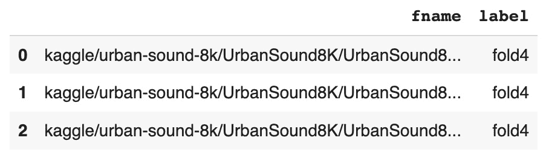
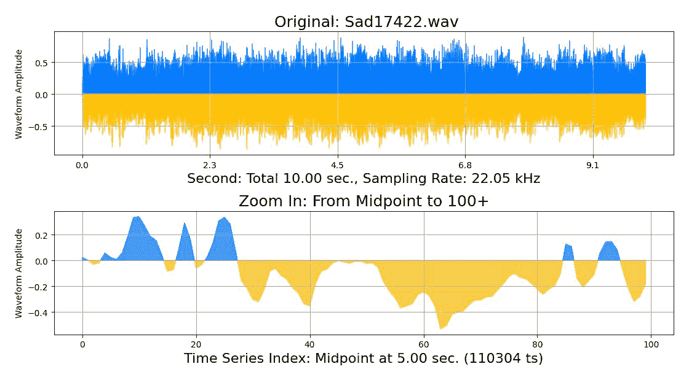
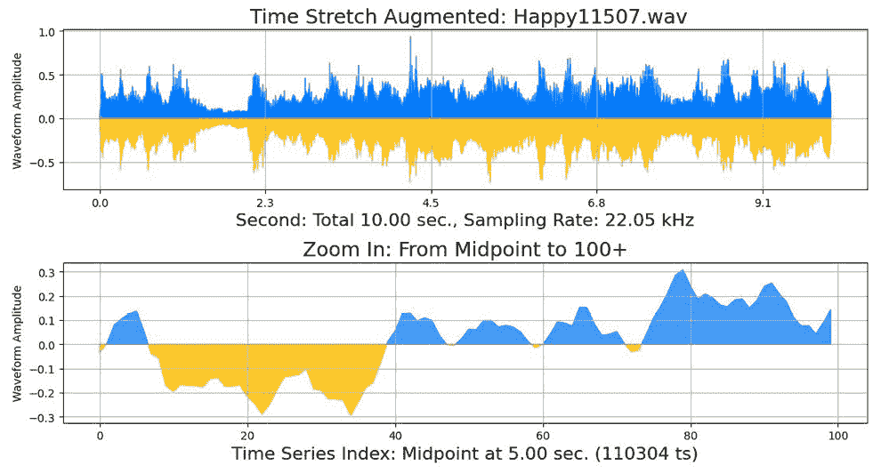
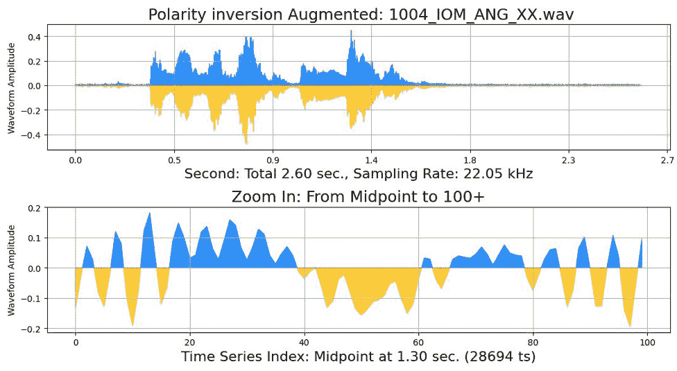
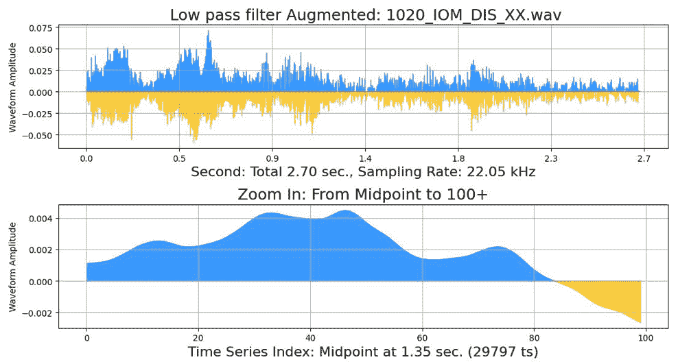

# 第七章：音频数据增强

与图像和文本增强类似，音频数据增强的目标是扩展数据集，从而在生成 AI 系统中获得更高的准确预测或预测。音频增强具有成本效益，并且当获取额外音频文件既昂贵又耗时时，是一个可行的选择。

关于音频增强方法的写作面临独特的挑战。首先，音频不像图像或文本那样具有视觉特性。如果格式是有声书、网页或移动应用，我们播放声音，但介质是纸张。因此，我们必须将音频信号转换为可视化的表示形式。**波形**图，也称为**时间序列图**，是表示音频信号的标准方法。你可以在附带的 Python 笔记本中聆听音频。

在本章中，你将学习如何编写 Python 代码从零开始读取音频文件并绘制波形图。Pluto 在这里提供了一个预览，以便我们可以讨论波形图的各个组成部分。功能如下：

```py
# sneak peek at a waveform plot
pluto.draw_audio(pluto.df_audio_control_data)
```

以下是 D 大调钢琴音阶的波形图：


图 7.1 – D 大调钢琴音阶

在*图 7.1*中，Pluto 将波形图中的正振幅用蓝色表示，负振幅用黄色表示。这使得图表更易于阅读，也更加美观。**振幅**是*Y*轴的值。它衡量空气分子振动或压缩与膨胀的程度。振幅越大，空气位移越大。换句话说，零振幅值代表静音，离零点越远的绝对值代表声音越响亮。

**频率**，也称为**采样率**，是*X*轴的值。采样率衡量的是每秒钟记录的振幅值次数。声音频率或采样率的单位是**赫兹**（**Hz**）。例如，1,000 Hz 或 1 **千赫**（**kHz**）的采样率意味着你在 1 秒钟内记录了 1,000 个振幅值。换句话说，你每毫秒记录一个振幅值。因此，频率越高，声音越精确，声音文件的大小也越大。这是因为记录了更多的振幅值。1 kHz 等于 1,000 Hz。

趣味事实

人类的听力范围是 20 Hz 到 20 kHz。年幼的孩子能够听到超过 20 kHz 的声音，而年长的成年人则无法听到超过 17 kHz 的声音。深沉的低音乐音频在 20 Hz 到 120 Hz 之间，而日常人类语言的频率范围是 600 Hz 到 5 kHz。与此相对，犬类的听力频率大约是 40 Hz 到 60 kHz，优于人类的听力频率。这就是为什么你无法听到超过 20 kHz 的狗哨声的原因。

**音高**与**频率**相同，但从人类的角度来看。它指的是声音的响亮程度，单位是**分贝**（**dB**）。因此，高音高频率。

分贝（dB）是响度的单位。火箭声约为 165 dB，繁忙交通的噪音约为 85 dB，人类语音约为 65 dB，雨声约为 45 dB，零分贝表示静音。

MP3 和其他音频格式的标准采样率为 22.05 kHz。高质量声音的频率，也被称为**光盘**（**CD**）音频的频率为 44.1 kHz。

在计算机上存储音频文件时，**比特深度**表示振幅值的准确性。**16 位**有 65,536 个细节级别，而**24 位**有 16,777,216 个信息级别。比特深度越高，数字录音越接近模拟声音，同时音频文件的大小也会更大。

**比特率**类似于采样率，比特率衡量的是每秒传输的比特数。在音频处理过程中，播放功能使用比特率，而录制功能使用采样率。

**单声道音频**只有一个通道（**1 通道**），而**立体声音频**有两个通道（**2 通道**）。立体声音频为右耳提供一个通道，为左耳提供另一个通道。

*图 7.1*中的底部图显示了一个放大的波形图。它只显示 100 个采样率点，从顶部波形图的中点开始。仔细观察，波形是一个简单的时间序列图。许多数据类型，如文本和图像，都可以表示为时间序列图，因为 Python 可以将数据表示为一维数组，而不考虑数据类型。

趣味小知识

**音高修正**是指在录音中调整人声表现，使得歌手能够准确地唱出音符。你可以使用**Antares Auto-Tune Pro**或**Waves Tune Real Time**等软件来修正歌声的高低音。它可以节省重新录音的时间和成本。在 1977 年之前，音高修正相对较少见，而在**Antares Audio Technology**发布**Auto-Tune 音高修正插件**后，音高修正得到了广泛应用。如今，大约 90%的广播、电视、网站或应用中的歌曲都使用了音高修正。**自动调音**用于声效，而音高修正则用于修正歌声。

由于大多数数据可以用于波形图，Pluto 可以为短语“*玛丽有只小羊羔，它的羊毛像雪一样白。玛丽走到哪里，小羊就跟到哪里*”绘制时间序列图。Pluto 使用以下函数：

```py
# fun use of waveform graph
pluto.draw_time_series_text(pluto.text_marry_lamb)
```

输出如下：


图 7.2 – 文本作为时间序列图

在*图 7.2*中，蓝色表示字母数字字符，黄色表示标点符号。*Y*轴表示字符的 ASCII 值。

转换过程是直接的，因为每个字母都被编码为**ASCII**值，例如“A”是 65，“B”是 66，依此类推。同样，一个由三维数组（宽度、高度和深度）组成的图像也有 RGB 值。通过乘以 RGB 值来压缩深度维度的结果介于零和 16,581,375 之间。将剩余的二维数组展平成一维数组，并将其绘制为时间序列图。

本章将介绍使用**波形**变换进行音频增强，特别是以下主题：

+   标准音频增强技术

+   滤波器

+   音频增强库

+   现实世界的音频数据集

+   强化你的学习

让我们先讨论一些常见的音频增强方法。

# 标准音频增强技术

类似于*第三章*中的图像增强，许多音频库提供了比增强所需的更多功能。因此，我们只会介绍所选音频库中一些可用的方法。

在图像增强中，**安全水平**的定义是指不改变或扭曲原始图像超过可接受的水平。对于将原始音频信号扭曲到超出允许范围的情况，并没有标准的术语。因此，**安全**或**真实**这两个词将交替使用，表示音频信号的极限点。

有趣的挑战

这里有一个思想实验：所有音频文件都以时间序列格式表示数字。那么，你能创建一个不考虑人类听觉感知的统计有效的增强方法吗？换句话说，使用数学操作统计有效的数字数组，但从不听取前后效果。毕竟，音频增强的目的是为了提供更多数据，以增强 AI 预测，而 AI 并不能理解人类的言语或区分好音乐和坏音乐。

以下是音频增强中常用的功能：

+   时间拉伸

+   时间位移

+   音高缩放

+   噪声注入

+   极性反转

我们从时间拉伸开始。

## 时间拉伸

**时间拉伸**是指延长或缩短音频信号的持续时间，而不改变音高。例如，在人类的语言中，你会放慢语速，拖长词语，或者加快语速，像松鼠卡通角色一样说话。

**时间拉伸**的**安全**水平是多少？这取决于音频类型和 AI 预测的目标。一般来说，你可以加速或减慢人类的言语，并且仍然能听懂。但如果目标是预测说话者的名字，那么你可以对语音应用小范围的时间拉伸，同时保持**真实**的说话风格。

另一方面，音乐通常被认为对时间拉伸是**不安全**的。改变音乐片段的节奏会改变音乐，超出真正音乐家的意图。

环境或自然声音通常在可接受的安全范围内对时间拉伸是**安全**的。

本增强技术，以及所有其他方法，都在 Python Notebook 中讲解；因此，通过听原始音频和增强后的音频，可以更容易理解效果。

类似于时间拉伸的是时间移位。

## 时间移位

**时间移位**是指将音频片段向前或向后移动。例如，如果你想在演讲者的宣布和观众的掌声之间制造更戏剧性的暂停，你可以将掌声向前移几秒钟。

带翻转的时间移位意味着最后的声音将被添加到开头。如果没有翻转，根据你是向前移位还是向后移位，音频的开头或结尾将会有静音。

例如，假设 AI 预测的目标是识别城市中的枪声并报警。那么，带翻转的时间移位是一种可接受的**安全**增强技术。另一个良好的使用带翻转时间移位的例子是循环的背景音乐。

人类语音或音乐通常对于时间移位来说是**不安全**的，因为顺序对保持音频的**真实性**至关重要。

离开时间后，音高移位或音高缩放是另一个增强参数。

## 音高移位

**音高移位**或**音高缩放**是在不改变速度或时间移位的情况下改变声音的频率。例如，男性的声音音高低于女性。增加声音记录中的音高水平可能会使男性听起来像女性。

在增强人类语音、音乐、环境和自然音频文件时，音高移位应谨慎使用。对于相同的数据集，**安全**级别可能会根据 AI 预测目标的不同而大幅变化。

例如，记录日常草地的声音可以用来统计每天有多少只鸟访问草地，或者 AI 可以预测哪些种类的鸟类栖息在该领域。用于计算鸟类数量的音高移位**安全**范围比用于识别鸟类的范围要高。将音高移位应用于鸟鸣声可能会无意中使一种鸟的叫声听起来像其他鸟的叫声。

另一种音高变化方法是极性反转。

## 极性反转

**极性反转**是指将幅度值从正数转为负数，反之亦然。从数学角度来看，它通过负值乘以幅度。从图形角度来看，它改变了蓝色并将其变为黄色，反之亦然，详见*图 7.1*。

对大多数人来说，极性反转后的播放听起来与原始音频相同。当与相位意识模型一起使用时，它对机器学习最为有利。没有**安全**范围，因为它要么被使用，要么不被使用。

以下增强方法是向音频文件中添加噪声。

## 噪声注入

**噪声注入**向音频文件添加信号噪声。添加噪声的效果是增强后的声音看起来像是由爆裂声和噼啪声组成的。通常用于音频增强的五种噪声类型是**背景噪声**、**高斯噪声**、**随机噪声**、**信噪比**（**SNR**）和**短暂** **突发噪声**。

噪声或**安全**级别的高低取决于 AI 项目的目标和录音内容。有时，您可能需要聘请领域专家来达到**安全**级别。

许多其他技术可以归类为常用的音频增强技术，如剪辑、增益过渡、归一化、填充或反向处理，但我们接下来将讨论滤波器和掩蔽技术。

# 滤波器

音频滤波器有助于消除音频录音中的不必要干扰或噪声。其结果是改善人声、音乐、自然和环境录音的音调和播放效果。

音频滤波器通过**增加**、**增强**或**放大**一定范围的频率来改变频率。滤波器还可以**减少**、**删除**、**切除**、**衰减**或**通过**某个频率范围。例如，使用低通滤波器，可以去除城市中两人对话录音中的交通噪声。

特别地，我们将介绍以下滤波器：

+   低通滤波器

+   高通滤波器

+   带通滤波器

+   低架滤波器

+   高架滤波器

+   带阻滤波器

+   峰值滤波器

让我们从低通滤波器开始。

## 低通滤波器

**低通滤波器**切除或删除低频声音，如交通噪声、机器发动机轰鸣声或大象叫声。

通常，最小截止频率为 150 Hz，最大截止频率为 7.5 kHz，最小滚降为 12 dB，最大滚降为 24 dB。

这里有个有趣的事实：大象的叫声低于 20 Hz，或进入次声波范围。接下来我们要讨论的滤波器是高通滤波器。

## 高通滤波器

与低通滤波器类似，**高通滤波器**切除高频声音，如口哨声、婴儿哭声、指甲刮擦声或钟声。

通常，最小和最大截止频率分别为 20 Hz 和 2.4 kHz，最小和最大滚降分别为 12 dB 和 24 dB。

有趣的事实：人类的口哨声音大约在 3 到 4 kHz 之间。我们还需要了解另一个滤波器：带通滤波器。

## 带通滤波器

**带通滤波器**将声波限制在一定范围的频率内。换句话说，它结合了低带和高带滤波器。例如，带通滤波器可以让您更清楚地听到巴黎户外餐厅中两人对话的录音。同样，它也可以用于在嘈杂的亚马逊丛林中隔离鸟鸣录音。

通常，最小和最大中心频率分别为 200 Hz 和 4 kHz，最小和最大带宽比例分别为 0.5 和 1.99，最小和最大滚降分别为 12 dB 和 24 dB。

现在，让我们从通滤波器转到架滤波器。

## 低架滤波器

**架滤波**也叫做**架均衡**。特别是，**低架滤波器**会提升或削减频谱低端的频率。例如，你可以使用低架滤波器来减少重金属歌曲中的低音。

通常，最小和最大中心频率分别为 50 Hz 和 4 kHz，最小和最大增益分别为-18 dB 到 18 dB。

下一个技术是高架滤波器。

## 高架滤波器

类似地，**高架滤波器**会增加或减少频谱高端的频率幅度。例如，你可以使用高架滤波器来使音乐录音更加明亮。

通常，最小和最大中心频率分别为 300 Hz 和 7.5 kHz，最小和最大增益分别为-18 dB 和 18 dB。

带阻滤波器是我们接下来要讲解的技术。

## 带阻滤波器

**带阻滤波器**也叫做**带阻滤波器**或**陷波滤波器**。它删除位于两个截止点之间或在频率范围两侧的频率。此外，它在内部使用低通和高通滤波器。例如，带阻滤波器可以去除后院音乐会即兴演奏中的不需要的尖峰和噪音。

通常，最小和最大中心频率分别为 200 Hz 和 4 kHz，最小和最大带宽分数分别为 0.5 和 1.99，最小和最大滚降分别为 12 dB 和 24 dB。

峰值滤波器是本章将要讲解的最后一种音频增强技术。

## 峰值滤波器

**峰值**或**钟形滤波器**与带阻滤波器相反。换句话说，它增强具有窄带和更高增益信号的架滤波器，或允许围绕中心频率进行增益或削减。

通常，最小和最大中心频率分别为 50 Hz 和 7.5 kHz，最小和最大增益分别为-24 dB 和 24 dB。

音频增强库中有很多方法。因此，下一步是为 Pluto 的包装函数选择一个或两个音频增强库。

# 音频增强库

有许多商业和开源的音频数据增强库。在本章中，我们将重点介绍**GitHub**上可用的开源库。有些库比其他库更强大，有些库专注于某一特定主题，例如人类语音。Pluto 将使用提供的库编写包装函数来进行繁重的计算，因此，你可以在项目中选择多个库。如果一个库是用**CPU**实现的，它可能不适合在机器学习训练周期中进行动态数据增强，因为它会减慢过程。因此，选择一个可以在**GPU**上运行的库。选择一个强大且易于实现的库，以便学习新的音频增强技术或将增强后的数据输出到本地或云端磁盘空间。

知名的开源音频增强库如下：

+   **Librosa** 是一个开源的 Python 库，用于音乐和音频分析。它在 2015 年发布，并长期以来一直是流行的选择。许多其他音频处理和增强库将 Librosa 的功能作为构建模块。它可以在 GitHub 上找到，网址为 [`github.com/librosa/librosa`](https://github.com/librosa/librosa)。

+   **Audiomentations** 是一个专门用于音频数据增强的 Python 库。其主要优点是其鲁棒性和易于集成到项目中。它被许多 Kaggle 比赛的获胜者引用。它可以在 GitHub 上找到，网址为 [`github.com/iver56/audiomentations`](https://github.com/iver56/audiomentations)。

+   Facebook 或 Meta 研究发布了 **Augly**，这是一个用于图像和音频增强的开源 Python 库。其目标是为实际项目提供特定的数据增强。它可以在 GitHub 上找到，网址为 [`github.com/facebookresearch/AugLy/tree/main/augly/audio`](https://github.com/facebookresearch/AugLy/tree/main/augly/audio)。

+   **Keras** 是一个用于音频和音乐信号预处理的 Python 库。它实现了频率转换和使用 **GPU** 预处理的数据增强。它可以在 GitHub 上找到，网址为 [`github.com/keunwoochoi/kapre`](https://github.com/keunwoochoi/kapre)。

+   **Nlpaug** 是一个多功能的 Python 库，适用于语言和音频数据增强。*第五章*使用 Nlpaug 进行文本增强，但在本章中，我们将使用音频库。它可以在 GitHub 上找到，网址为 [`github.com/makcedward/nlpaug`](https://github.com/makcedward/nlpaug)。

+   Spotify 的音频智能实验室发布了 **Pedalboard** Python 库。其目标是为机器学习提供工作室级别的音频效果。它可以在 GitHub 上找到，网址为 [`github.com/spotify/pedalboard`](https://github.com/spotify/pedalboard)。

+   **Pydiogment** 是一个旨在简化音频增强的 Python 库。它易于使用，但不如其他音频增强库强大。它可以在 GitHub 上找到，网址为 [`github.com/SuperKogito/pydiogment`](https://github.com/SuperKogito/pydiogment)。

+   **Torch-augmentations** 是 **Audiomentations** 库在 **GPU** 上的实现。它可以在 GitHub 上找到，网址为 [`github.com/asteroid-team/torch-audiomentations`](https://github.com/asteroid-team/torch-audiomentations)。

趣味事实

**Audiomentations** 库的版本 0.28.0 包含 36 个增强函数，**Librosa** 库的版本 0.9.2 包含超过 400 个方法，**Pydiogment** 库的最新更新（2020 年 7 月）包含 14 个增强方法。

Pluto 将主要使用 **Audiomentations** 和 **Librosa** 库来演示我们在 Python 代码中提到的概念。但首先，我们将下载 Pluto 并使用它从 *Kaggle* 网站下载真实世界的音频数据集。

# 真实世界的音频数据集

到现在为止，你应该已经熟悉如何从 *Kaggle* 网站下载 Pluto 和真实世界数据集。我们选择从 *第二章* 下载 Pluto，因为在 *第三章* 和 *第四章* 中展示的图像增强功能，以及在 *第五章* 和 *第六章* 中展示的文本增强技术，对于音频增强并没有太大帮助。

我们将使用的三个真实世界音频数据集如下：

+   来自 Kaggle 的 *Musical Emotions Classification*（*MEC*）真实世界音频数据集包含 2,126 首歌曲，分为 **训练** 和 **测试** 文件夹。它们是器乐音乐，目标是预测 **快乐** 或 **悲伤** 的音乐。每首歌曲大约 9 到 10 分钟，格式为 ***.wav**。该数据集于 2020 年发布，并对公众开放，许可证为 **Attribution-ShareAlike 4.0 International (CC BY-SA** **4.0)**：[`creativecommons.org/licenses/by-sa/4.0/`](https://creativecommons.org/licenses/by-sa/4.0/)。

+   来自 Kaggle 的 *Crowd Sourced Emotional Multimodal Actors Dataset*（*CREMA-D*）真实世界音频数据集包含 7,442 个来自 91 位演员的原始片段。这些演员中，48 位为 **男性**，43 位为 **女性**，年龄介于 20 至 74 岁之间，种族包括 **非裔美国人**、**亚洲人**、**白人**、**西班牙裔**和 **未指定**。此外，语音片段表达了六种不同的情感，包括 **愤怒**、**恶心**、**恐惧**、**快乐**、**中立**和 **悲伤**。该数据集没有固定的目标，但你可以用它来预测年龄、性别、种族或情感。该数据集于 2019 年发布，并对公众开放，许可证为 **Open Data Commons Attribution License (ODC-By)** **v1.0**：[`opendatacommons.org/licenses/by/1-0/index.html`](https://opendatacommons.org/licenses/by/1-0/index.html)。

+   来自 Kaggle 的 *urban_sound_8k*（*US8K*）真实世界数据集包含来自城市环境的 8,732 个标注音频片段。每个片段长度为 2 到 4 秒，分类包括 **空调、汽车喇叭、儿童玩耍、狗吠、钻孔、发动机怠速、枪声、电锯声、警笛声和街头音乐**。该数据集于 2021 年发布并对公众开放，许可证为 **CC0 1.0 Universal (CC0 1.0) Public Domain** **Dedication**：[`creativecommons.org/publicdomain/zero/1.0/`](https://creativecommons.org/publicdomain/zero/1.0/)。

这三个音频数据集——音乐、人类语音和环境声音——代表了你每天听到的典型声音。

以下四个步骤在每一章中都是相同的。如果需要澄清，请回顾 *第二章* 和 *第三章*。步骤如下：

1.  获取 Python Notebook 和 Pluto。

1.  下载真实世界的数据。

1.  将数据加载到 pandas 中。

1.  听并查看音频。

让我们从在 Python Notebook 中下载 Pluto 开始。

## Python Notebook 和 Pluto

首先，将`data_augmentation_with_python_chapter_7.ipynb`文件加载到 Google Colab 或您选择的 Jupyter Notebook 或 JupyterLab 环境中。从此开始，代码片段将来自 Python Notebook，包含完整的函数。

下一步是克隆仓库。我们将重用来自*第二章*的代码。`!git`和`%run`语句用于启动冥王星：

```py
# clone the GitHub repo.
f='https://github.com/PacktPublishing/Data-Augmentation-with-Python'
!git clone {f}
# instantiate Pluto
%run 'Data-Augmentation-with-Python/pluto/pluto_chapter_2.py'
```

输出将如下所示或类似：

```py
---------------------------- : ----------------------------
            Hello from class : <class '__main__.PacktDataAug'> Class: PacktDataAug
                   Code name : Pluto
                   Author is : Duc Haba
---------------------------- : ----------------------------
```

我们需要再做一次检查，以确保冥王星已正确加载。以下命令会要求冥王星报告其状态：

```py
# How are you doing Pluto?
pluto.say_sys_info()
```

输出将如下所示或类似，具体取决于您的系统：

```py
---------------------------- : ----------------------------
                 System time : 2022/12/30 19:17
                    Platform : linux
     Pluto Version (Chapter) : 2.0
             Python (3.7.10) : actual: 3.8.16 (default, Dec  7 2022, 01:12:13) [GCC 7.5.0]
            PyTorch (1.11.0) : actual: 1.13.0+cu116
              Pandas (1.3.5) : actual: 1.3.5
                 PIL (9.0.0) : actual: 7.1.2
          Matplotlib (3.2.2) : actual: 3.2.2
                   CPU count : 2
                  CPU speed : NOT available
---------------------------- : ----------------------------
```

接下来，冥王星将下载音频数据集。

## 现实世界数据与 pandas

冥王星已通过`fetch_kaggle_dataset(url)`函数从*第二章*下载了现实世界的音乐数据集 MEC。他发现数据集由逗号分隔的变量（CSV）头文件组成。因此，他使用`fetch_df(fname)`函数将其导入到 pandas 中：

```py
# download from Kaggle
url = 'https://www.kaggle.com/datasets/kingofarmy/musical-emotions-classification'
pluto.fetch_kaggle_dataset(url)
# import to Pandas
f = 'kaggle/musical-emotions-classification/Train.csv'
pluto.df_music_data = pluto.fetch_df(f)
# out a few header record
Pluto.df_music_data.head(3)
```

结果如下：


图 7.3 – 音乐（MEC）前三条记录

`_append_music_full_path()`和`fetch_music_full_path()`辅助函数。关键代码行如下：

```py
# helper function snippet
y = re.findall('([a-zA-Z ]*)\d*.*', x)[0]
return (f'kaggle/musical-emotions-classification/Audio_Files/Audio_Files/Train/{y}/{x}')
# main function snippet
df['fname'] = df.ImageID.apply(self._append_music_full_path)
```

函数的代码可以在 Python Notebook 中找到。结果如下：


图 7.4 – 音乐（MEC）前三条记录修订版

来自 Kaggle 的下一个现实世界数据集是人类语音（**CREMA-D**）。冥王星必须使用以下命令下载并将其导入到 pandas 中：

```py
# download the dataset
url = 'https://www.kaggle.com/datasets/ejlok1/cremad'
pluto.fetch_kaggle_dataset(url)
# import to Pandas and print out header record
f = 'kaggle/cremad/AudioWAV'
pluto.df_voice_data = pluto.make_dir_dataframe(f)
pluto.df_voice_data.head(3)
```

输出如下：


图 7.5 – 声音（CREMA-D）前三条记录修订版

来自 Kaggle 的第三个音频数据集是城市声音（**US8K**）。顺便提一下，截至 2022 年 12 月，Kaggle 包含大约 1,114 个现实世界的音频数据集。冥王星必须下载并使用以下命令将其导入到 pandas 中：

```py
# download dataset from Kaggle website
url='https://www.kaggle.com/datasets/rupakroy/urban-sound-8k'
pluto.fetch_kaggle_dataset(url)
# import to Pandas and print header records
f = 'kaggle/urban-sound-8k/UrbanSound8K/UrbanSound8K/audio'
pluto.df_sound_data = pluto.make_dir_dataframe(f)
pluto.df_sound_data.head(3)
```

输出如下：



图 7.6 – 城市声音（US8K）前三条记录修订版

最后，在`pluto_data`目录中，他将控制剪辑存储在`pluto.audio_control_dmajor`变量中。

有趣的挑战

冥王星挑战你搜索并下载一个额外的音频数据集，来自*Kaggle*网站或你的项目。如果你使用与你有关的数据工作，它将更具意义。只要你下载并将其导入到 pandas 中，所有的数据增强包装函数都会对你的音频文件起作用。提示：使用冥王星的`fetch_kaggle_dataset()`和`fetch_df()`函数。

至此，冥王星已下载了三个现实世界的音频数据集。下一步是播放音频并查看音频**波形**图。

## 听取和查看

Pluto 写了三个新函数来播放音频并展示 `_draw_area_with_neg()` 辅助方法，该方法展示同一数据集中正负数的面积图。顺便提一下，Pandas 和 **Matplotlib** 面积图只能显示正值。该函数的核心代码行如下：

```py
# draw area code snippet fill top/positive/blue section
pic.fill_between(
    i, xzero, ndata, where=(ndata >= xzero),
    interpolate=True, color=tcolor, alpha=alpha,
    label="Positive"
)
# fill bottom/negative/yellow section
pic.fill_between(
    i, xzero, ndata, where=(ndata < xzero),
    interpolate=True, color=bcolor, alpha=alpha,
    label="Negative"
)
```

完整的函数代码可以在 Python Notebook 中找到。下一个辅助函数是 `_draw_audio()`。它的主要目标是使用 **Librosa** 库加载或读取音频文件，绘制两个 **Waveform** 图表，并显示播放音频按钮。Pandas 使用与提取音频数据集时相同的文件名。该函数的关键代码行如下：

```py
# code snippet, load/read and import to Pandas DataFrame
data_amp, sam_rate = librosa.load(samp.fname[0], mono=True)
# draw the Waveform graphs
self._draw_area_with_neg(data_amp,pic[0])
# draw the zoom in Waveform plot
self._draw_area_with_neg(data_amp[mid:end],pic[1])
# display the play-audio button
display(IPython.display.Audio(data_amp, rate=sam_rate))
```

该函数的完整内容可以在 Python Notebook 中找到。`draw_audio()` 方法调用了两个辅助函数。此外，它还从 Pandas DataFrame 中选择了一个随机音频文件。因此，Pluto 会反复执行命令，以便聆听并查看来自现实世界数据集的不同音频文件。

Pluto 可以使用以下命令展示来自 **MEC** 数据集的音乐片段：

```py
# display the play button the waveform plot
pluto.draw_audio(pluto.df_music_data)
```

音频播放按钮如下：


图 7.7 – 音频播放按钮

**Waveform** 图表如下：


图 7.8 – 音乐波形图 (Happy36521)

*图 7.7* 和 *7.8* 中的音频播放按钮 (`Happy36521.wav`) 将播放包含长笛、鼓和吉他的器乐音乐。

有趣的事实

Pluto 将该函数命名为 `draw_audio()` 而非 `play_audio()`，因为本书需要一个 Waveform 图表，并且要听音频，你必须进入 Python Notebook 并点击 *图 7.7* 中显示的播放按钮。像所有包装函数一样，你可以反复运行 `draw_audio()` 方法，查看并听取数据集中不同的音频文件。

Pluto 使用以下命令展示来自 **CREMA-D** 数据集的人类语音片段：

```py
# display the play button the waveform plot
pluto.draw_audio(pluto.df_voice_data)
```

音频播放按钮的输出此处没有显示，因为它与 *图 7.7* 中的播放按钮相同。**Waveform** 图表的结果如下：


图 7.9 – 人类语音波形图 (1078_TIE_HAP_XX)

*图 7.9* 的音频 (`1078_TIE_HAP_XX.wav`) 是一位女性说出短语：*这正是发生的事情*。她听起来很开心，年龄中等。

Pluto 使用以下命令展示来自 **US8K** 数据集的城市声音片段：

```py
# display the play button the waveform plot
pluto.draw_audio(pluto.df_sound_data)
```

**Waveform** 图表的结果如下：


图 7.10 – 城市声音波形图 (119455-5-0-7)

*图 7.10* 的音频 (`119455-5-0-7.wav`) 是电锤的声音。

到这里，我们已经讨论了各种音频增强概念，选择了音频库，下载了 Pluto，并要求他获取音乐、人声和城市声音的真实世界数据集。现在，Pluto 也会播放音频并显示每个文件的波形图。

下一步是从头开始编写 Python 包装代码，以更深入地理解我们所涵盖的音频增强技术。

# 强化你的学习

`_audio_transform()`辅助函数的主要目标是选择一个随机剪辑，使用 Audiomentations 库函数进行增强，使用`_fetch_audio_data()`和`_draw_audio()`辅助函数显示波形图，并显示音频播放按钮。关键代码如下：

```py
# code snippet, use Pandas to select a random/sample record
p = df.sample(dsize)
# fetch the audio data
data_amp, sam_rate, fname = self._fetch_audio_data(lname)
# do the transformation
xaug = xtransform(data_amp, sample_rate=sam_rate)
# display the Waveform graphs and the audio play button
self._draw_audio(xaug, sam_rate, title + ' Augmented: ' + fname)
display(IPython.display.Audio(xaug, rate=sam_rate))
```

完整函数的代码可以在 Python 笔记本中找到。Pluto 将按之前讨论的顺序编写音频增强的 Python 包装函数，具体如下：

+   时间位移

+   时间拉伸

+   音高缩放

+   噪声注入

+   极性反转

让我们从**时间位移**开始。

## 时间位移

`play_aug_time_shift()`函数的定义和关键代码如下：

```py
# function definition
def play_aug_time_shift(self, df,
  min_fraction=-0.2,
  max_fraction=0.8,
  rollover=True,
  title='Time Shift'):
# code snippet for time shift
xtransform = audiomentations.Shift(
  min_fraction = min_fraction,
  max_fraction = max_fraction,
  rollover = rollover,
  p=1.0)
```

完整函数的代码可以在 Python 笔记本中找到。Pluto 测试了音频控制文件上的时间位移包装函数，如下所示：

```py
# augment using time shift
pluto.play_aug_time_shift(
  pluto.audio_control_dmajor,
  min_fraction=0.2)
```

时间位移增强音频剪辑的输出如下：


图 7.11 – 时间位移（control-d-major.mp3）

包装函数显示了增强后的音频剪辑，*图 7.11*，以及原始音频剪辑，*图 7.12*，以便进行比较。有时，您需要查看底部的放大波形图来观察增强效果。听到增强效果的另一种方式是点击播放按钮，如*图 7.13*所示，听听在 Python 笔记本中播放前后的音频文件：


图 7.12 – 原始时间位移（control-d-major.mp3）

Pluto 通过点击 Python 笔记本中的音频播放按钮播放音频：


图 7.13 – 音频播放按钮，前后对比

有趣的事实

每次运行包装函数命令时，您将看到并听到一个具有随机位移的新音频文件，位移范围在最小和最大值之间。它将从真实世界数据集中选择不同的音频文件。

*图 7.11*中的音频显示，D 大调的钢琴音阶几乎被移位至中点。因此，它从**C#**音阶向下到**D**，然后从**D**音阶向上到**C#**。因此，对于具有时间顺序依赖关系的音乐，时间位移技术并不是最佳选择。

接下来是三个数据集中的第一个，Pluto 使用默认参数在 MEC 数据集中的音乐剪辑上运行时间位移功能，如下所示：

```py
# augment audio using time shift
pluto.play_aug_time_shift(
  pluto.df_music_data)
```

增强后的输出文件如下：


图 7.14 – 时间移位，音乐片段 (Sad17422.wav)

用于比较的原始文件输出如下：



图 7.15 – 时间移位的原始音乐片段 (Sad17422.wav)

在波形图中，很难看到 *图 7.14* 和 *图 7.15* 之间的效果，但如果 Pluto 专注于较低的缩放图表，他可以看到它已经发生了偏移。当 Pluto 播放音频时，他无法察觉前后片段之间的任何区别。

*图 7.14* 中的音乐听起来像是一部西部电影的冒险电影乐队片段，在循环中重复播放，因此移位和循环回放效果完美。Pluto 反复运行包装函数以获取不同的音频文件，并确认没有不良影响。因此，使用默认参数对 MEC 数据集中的音乐进行时间移位是 **安全** 的。

转到第二个真实世界数据集，Pluto 知道在人类语音是时间序列依赖的 CREMA-D 数据集中。因此，`0.5` 让你可以看到有害的结果。命令如下：

```py
# augment audio using time shift
pluto.play_aug_time_shift(pluto.df_voice_data,
  min_fraction=0.5)
```

增强后的时间移位音频片段输出如下：


图 7.16 – 时间移位语音片段 (1027_IEO_DIS_HI.wav)

包装函数还显示了原始音频片段以便比较：


图 7.17 – 原始时间移位语音片段 (1027_IEO_DIS_HI.wav)

在 *图 7.16* 的音频中，一位男士的声音说：“十一点 [停顿] 是的”，而在 *图 7.17* 的音频中，他说：“是十一点”。再次证明，时间移位技术对人类语音 (CREMA-D) 数据集并不是一个安全的选项。

在第三个数据集中，Pluto 重复运行以下命令来处理来自 US8K 数据库的城市声音：

```py
# augment audio using time shift
pluto.play_aug_time_shift(pluto.df_sound_data,
  min_fraction=0.5)
```

增强后的时间移位音频片段输出如下：


图 7.18 – 时间移位城市声音 (135526-6-3-0.wav)

包装函数还显示了原始音频片段以便比较：


图 7.19 – 原始时间移位城市声音 (135526-6-3-0.wav)

*图 7.17* 和 *图 7.18* 是带有高水平城市噪音的枪声音频。时间移位使枪声稍微延后。经过多次运行命令后，Pluto 发现时间移位的 **最小分数** 0.5 对于 US8K 真实世界数据集是可以接受的。

接下来我们要介绍的音频增强技术是时间拉伸。

## 时间拉伸

`play_aug_time_stretch()` 函数的定义和关键代码行如下：

```py
# function definition
def play_aug_time_stretch(self, df,
  min_rate=0.2,
  max_rate=6.8,
  leave_length_unchanged=True,
  title='Time Stretch'):
# code snippet for time stretch
xtransform = audiomentations.TimeStretch(
  min_rate = min_rate,
  max_rate = max_rate,
  leave_length_unchanged = leave_length_unchanged,
  p=1.0)
```

填充函数的代码可以在 Python Notebook 中找到。Pluto 使用音频控制文件和 `5.4` 来测试时间拉伸包装函数，如下所示：

```py
# augment using time stretch
pluto.play_aug_time_stretch(pluto.audio_control_dmajor,
  max_rate=5.4)
```

时间拉伸增强音频片段的输出如下：


图 7.20 – 时间拉伸 (control-d-major.mp3)

包装函数还会显示原始音频片段以供对比：


图 7.21 – 原始时间拉伸 (control-d-major.mp3)

Pluto 多次运行包装函数，每次都能辨认出音频的音调。*图 7.20* 中的音频播放了 D 大调片段，大约是原速的三倍，但音调仍然可以辨认出来。

包装函数在控制音频文件上运行良好，因此 Pluto 对音乐（MEC）数据集应用 `3.0`，如下所示：

```py
# augment using tim stretch
pluto.play_aug_time_stretch(pluto.df_music_data,
  max_rate=3.0)
```

时间拉伸增强音频片段的输出如下：



图 7.22 – 时间拉伸音乐 (Sad44404.wav)

包装函数还会显示原始音频片段以供对比：


图 7.23 – 原始时间拉伸音乐 (Sad44404.wav)

*图 7.22* 和 *图 7.23* 中的音频是一个下午花园午餐的声音，伴随着强烈的主奏吉他和电影交响乐片段。在 `3.0` 的时间拉伸滤镜下，*图 7.22* 中的音频播放速度稍微加快，但 Pluto 没有注意到音乐情绪的下降。Pluto 多次在 MEC 数据集上运行包装函数，并得出结论，时间拉伸技术的安全范围是 `3.0`。

有趣的挑战

为所有类型的音乐（MEC）找到一个通用的 **安全** 范围。你可以使用 Python Notebook 来找到 MEC 数据集的安全范围，并从 Kaggle 网站下载其他音乐数据集。另一方面，这是否是一个不可能完成的任务？对于流行音乐、古典音乐、民间音乐、乡村音乐和嘻哈音乐，是否存在一个通用的安全范围？

Pluto 对人声（CREMA-D）数据集进行了相同的处理。命令如下：

```py
# augment using time stretch
pluto.play_aug_time_stretch(pluto.df_voice_data,
  max_rate=3.5)
```

时间拉伸增强音频片段的输出如下：


图 7.24 – 时间拉伸语音片段 (1073_WSI_SAD_XX.wav)

包装函数还会显示原始音频片段以供对比：


图 7.25 – 原始时间拉伸语音片段 (1073_WSI_SAD_XX.wav)

*图 7.24* 和 *7.25* 中的音频是一个女人的声音说：“*我们休息几分钟*”，而 *图 7.24* 中的音频稍微快一些，但仍然可以辨认出来。Pluto 多次在 CREMA-D 数据集上运行包装函数，使用 `3.5`，并且没有发现录音质量下降。因此，他得出结论，CREMA-D 数据集的安全范围是 `3.5`。

Pluto 对城市声音（US8K）数据集也做了同样的操作。命令如下：

```py
# augment using time stretch
pluto.play_aug_time_stretch(pluto.df_sound_data,
  max_rate=2.4)
```

时间拉伸增强音频片段的输出如下：


图 7.26 – 时间拉伸城市声音（76266-2-0-50.wav）

包装函数还会显示原始音频片段以供比较：


图 7.27 – 原始时间拉伸城市声音（76266-2-0-50.wav）

*图 7.26* 和 *图 7.27* 中的音频是城市声音，录音中包含成人和儿童在操场上说话的声音，以及高强度交通或风声。*图 7.26* 中的音频播放略快。Pluto 在 US8K 数据集上反复运行包装函数，并使用了`2.4`，他得出结论，US8K 数据集对时间拉伸技术是**安全**的。

接下来，我们将介绍的技术是**音高缩放**。

## 音高缩放

`play_aug_pitch_scaling()`函数的定义和关键代码行如下：

```py
# function definition
def play_aug_pitch_scaling(self, df,
  min_semitones = -6.0,
  max_semitones = 6.0,
  title='Pitch Scaling'):
# code snippet for pitch shift
xtransform = audiomentations.PitchShift(
  min_semitones = min_semitones,
  max_semitones = max_semitones,
  p=1.0)
```

Pluto 使用默认参数测试音高缩放包装函数，音频控制文件如下所示：

```py
# augment using pitch scaling
pluto.play_aug_pitch_scaling(pluto.audio_control_dmajor)
```

输出的增强音频片段如下：


图 7.28 – 音高缩放（control-d-major.mp3）

包装函数还会显示原始音频片段以供比较：


图 7.29 – 原始音高缩放（control-d-major.mp3）

Pluto 无法从*图 7.28*和*图 7.29*中的完整波形图中看出区别，但如果他聚焦于放大的图表，就可以看到差异。听音频文件是最好的方法。为此，你必须进入 Python 笔记本并点击音频播放按钮。*图 7.28*中的音频听起来更像是大键琴，而不是原始的大调钢琴音阶。

接下来，Pluto 将音高缩放包装函数应用于音乐（MEC）数据集，如下所示：

```py
# augment using pitch scaling
pluto.play_aug_pitch_scaling(pluto.df_music_data,
  min_semitones=-11.0,
  max_semitones=-9.0)
```

增强音频片段的输出如下：


图 7.30 – 音高缩放音乐（Sad11601.wav）

包装函数还会显示原始音频片段以供比较：


图 7.31 – 原始音高缩放音乐（Sad11601.wav）

*图 7.30* 中的音频播放较为温暖，旋律感强，突出了戏剧性电影片段的情绪变化。就像是戏剧性转折前的宁静黄昏。Pluto 通过设置`-11.0`和`-9.0`，故意夸大了音高效果。*图 7.31* 中的音频播放的是原始片段。使用默认参数，Pluto 发现 MEC 数据集的音高缩放效果极小。因此，这是一种**安全**的技术。

使用默认参数值，Pluto 对语音 (CREMA-D) 数据集执行相同操作。命令如下：

```py
# augment using pitch scaling
pluto.play_aug_pitch_scaling(pluto.df_voice_data)
```

增强音频片段的输出如下：


图 7.32 – 音高缩放语音 (1031_IEO_ANG_LO.wav)

包装函数还会显示原始音频片段以供比较：


图 7.33 - 原始音高缩放语音 (1031_IEO_ANG_LO.wav)

Pluto 比较了 *图 7.32* 和 *7.33* 中的放大图，以查看效果。在听这些音频文件时，他听到了增强版，从 *图 7.32* 中的一个高音调孩子的声音说：“现在是十一点。” 原版是一个成年男子的声音。经过反复运行包装命令，并将安全的 **最小和最大半音** 设置为 -2.4 和 2.4，Pluto 发现这对 CREMA-D 数据集的效果最小化。

城市声音 (US8K) 数据集具有多样化的频率范围。机器噪声是重复的低频声音，而警笛是高频声音。除非他限制了 `4.0` 和 `14.0`，否则 Pluto 找不到安全范围。命令如下：

```py
# augment using pitch scaling
pluto.play_aug_pitch_scaling(pluto.df_sound_data,
  min_semitones=4.0,
  max_semitones=11.0)
```

增强音频片段的输出如下：


图 7.34 – 音高缩放城市声音 (93567-8-3-0.wav)

包装函数还会显示原始音频片段以供比较：


图 7.35 – 原始音高缩放城市声音 (93567-8-3-0.wav)

*图 7.34* 和 *7.35* 中的音频播放的是繁忙城市街道上警笛的城市片段。*图 7.34* 中的音频警笛声音更清晰，交通噪声干扰稍少。

有趣的挑战

这个挑战是一个思维实验。你能为哪些音频增强方法适用于特定的音频类别（例如人声、音乐、鸟鸣等）定义规则吗？例如，能否安全地使用小范围音高变化来增强人声？

我们接下来要看的技术是 **噪声注入**。

## 噪声注入

`play_aug_noise_injection()` 函数的定义和关键代码行如下：

```py
# function definition
def play_aug_noise_injection(self, df,
  min_amplitude = 0.002,
  max_amplitude = 0.2,
  title='Gaussian noise injection'):
# code snippet for noise injection
xtransform = audiomentations.AddGaussianNoise(
  min_amplitude = min_amplitude,
  max_amplitude = max_amplitude,
  p=1.0)
```

完整的函数代码可以在 Python Notebook 中找到。Pluto 在这里不会解释结果，因为它们与之前三种音频增强技术相似。你应该在 Python Notebook 中尝试它们，查看和听取结果。

对于 **背景噪声注入** 方法，代码片段如下：

```py
# code snippet for adding background noise
xtransform = audiomentations.AddBackgroundNoise(
  sounds_path="~/background_sound_files",
  min_snr_in_db=3.0,
  max_snr_in_db=30.0,
  noise_transform=PolarityInversion(),
  p=1.0)
```

对于 **短噪声注入** 方法，代码片段如下：

```py
# code snippet for adding short noise
xtransform = audiomentations.AddShortNoises(
  sounds_path="~/background_sound_files",
  min_snr_in_db=3.0,
  max_snr_in_db=30.0,
  noise_rms="relative_to_whole_input",
  min_time_between_sounds=2.0,
  max_time_between_sounds=8.0,
  noise_transform=audiomentations.PolarityInversion(),
  p=1.0)
```

完整的函数代码可以在 Python Notebook 中找到。接下来我们要看的技术是 **极性反转**。

## 极性反转

`play_aug_polar_inverse()` 函数的定义和关键代码行如下：

```py
# function definition
def play_aug_polar_inverse(self, df,
  title='Polarity inversion'):
# code snippet for polarity inversion
xtransform = audiomentations.PolarityInversion(
  p=1.0)
```

再次说明，Pluto 在这里不会解释结果，因为它们与之前看到的输出类似。你可以在 Python Notebook 中尝试它们，查看和听取结果。Pluto 已经为你编写了 Python 代码。

有趣的事实

有一个关于极性反转技术的有趣事实：你不会听出增强录音和原始录音之间的任何差异。你甚至在波形图中也看不出差别，但你可以在放大图表中看到。蓝色/正和黄色/负被翻转了。

例如，Pluto 将包装函数应用于语音（CREMA-D）数据集，如下所示：

```py
# augment using polar inverse
pluto.play_aug_polar_inverse(pluto.df_voice_data)
```

增强音频片段的输出如下：



图 7.36 – 极性反转语音（1081_WSI_HAP_XX.wav）

包装函数还会显示原始音频片段以供比较：


图 7.37 – 原始极性反转语音（1081_WSI_HAP_XX.wav）

另一个有趣的事实是，极性反转就像将**振幅**数组乘以负一，像这样：

```py
# implement using numpy
xaug = numpy.array(data_amp) * -1
```

有趣的挑战

这里有一个思想实验：为什么极性反转不会影响声音？毕竟，这在数据上是一个剧烈的变化，如波形图所示。提示：考虑从压缩和膨胀引起的分子振动的技术复杂性，涉及绝对测量。

接下来我们将介绍一些使用**滤波器**的技巧。

## 低通滤波器

在 Pluto 深入解释滤波器的音频技巧之前，他只会部分展示本书中的所有滤波器。这是因为过程是重复的，通过在 Python Notebook 中运行代码，你能获得更多的洞察力。Pluto 将详细解释**低通**和**带通**滤波器的代码和波形图；对于其他滤波器，他将解释代码，但不解释输出的波形图。

`play_aug_low_pass_filter()` 函数的定义和关键代码行如下：

```py
# function definition
def play_aug_low_pass_filter(self, df,
  min_cutoff_freq=150, max_cutoff_freq=7500,
  min_rolloff=12, max_rolloff=24,
  title='Low pass filter'):
# code snippet for low pass filter
xtransform = audiomentations.LowPassFilter(
  min_cutoff_freq = min_cutoff_freq,
  max_cutoff_freq = max_cutoff_freq,
  min_rolloff = min_rolloff,
  max_rolloff = max_rolloff,
  p=1.0)
```

完整功能的代码可以在 Python Notebook 中找到。Pluto 使用默认参数，测试低通滤波器包装函数与音频控制文件，如下所示：

```py
# augment using low pass filter
pluto.play_aug_low_pass_filter(pluto.audio_control_dmajor)
```

增强音频片段的输出如下：


图 7.38 – 低通滤波器控制（control-d-major.mp3）

包装函数还会显示原始音频片段以供比较：


图 7.39 – 原始低通滤波器控制（control-d-major.mp3）

Pluto 没有检测到 *图 7.38* 和 *7.39* 中的增强录音与原始录音之间的任何区别。初看 WaveForm 图，Pluto 没有看到任何差异，直到他检查了放大图。正值（蓝色）**幅度**略有减少，相反，负值（黄色）略有增加。换句话说，前后音频的绝对差异表现为幅度值略低。

接下来，Pluto 将低通滤波器包装函数应用于音乐 (MEC) 数据集，如下所示：

```py
# augment using low pass filter
pluto.play_aug_low_pass_filter(pluto.df_music_data)
```

增强后的音频片段的输出如下：


图 7.40 – 低通滤波音乐 (Sad21828.wav)

包装函数还显示了原始音频片段以供比较：


图 7.41 – 原始低通滤波音乐 (Sad21828.wav)

*图 7.40* 和 *7.41* 中的音频是一段电影管弦乐音乐片段，伴随着强烈的鼓点。这可能是印第安纳·琼斯电影中，在巨石滚下山洞前的背景音乐。特别是 *图 7.40* 中显示的增强文件声音更为平滑，边缘已被修整。Pluto 反复使用默认参数设置运行包装函数处理 MEC 数据集，发现增强后的音频文件并未改变音乐的悲伤或快乐情感。因此，这是一个 **安全的** 技术。

对于语音 (CREMA-D) 数据集，Pluto 做了同样的处理：

```py
# augment using low pass filter
pluto.play_aug_low_pass_filter(pluto.df_voice_data)
```

增强后的音频片段的输出如下：



图 7.42 – 低通滤波语音 (1067_IEO_HAP_LO.wav)

包装函数还显示了原始音频片段以供比较：


图 7.43 – 原始低通滤波语音 (1067_IEO_HAP_LO.wav)

*图 7.42* 和 *7.43* 中的音频都说了 *现在是十一点*。此外，*图 7.42* 中的音频较少有啪嗒声和爆裂声。Pluto 有一个不太科学的想法，即放大图显示了一个更平滑的曲线，较少的波动和凹陷，这可能意味着增强录音中的声音更加清晰。在反复将包装函数应用于 CREMA-D 数据集之后，Pluto 认为低通滤波器是 **安全的**。

三个真实世界数据集中的最后一个是城市声音 (US8K) 数据集。Pluto 通过以下方式应用包装函数：

```py
# augment using low pass filter
pluto.play_aug_low_pass_filter(pluto.df_sound_data)
```

增强后的音频片段的输出如下：


图 7.44 – 低通滤波城市声音 (185373-9-0-6.wav)

包装函数还显示了原始音频片段以供比较：


图 7.45 – 原始低通滤波器城市声音（185373-9-0-6.wav）

*图 7.44* 和 *图 7.45* 中的音频是带有交通和城市噪声的街头音乐。重复执行包装函数时，US8K 数据集的结果混合。Pluto 不知道哪些参数值是**安全**的，他需要咨询领域专家——即音响工程师。

我们接下来要了解的技巧是**带通滤波器**。

## 带通滤波器

`play_aug_band_pass_filter()` 函数的定义及关键代码行如下：

```py
# function definition
def play_aug_band_pass_filter(self, df,
  min_center_freq=200, max_center_freq=4000,
  min_bandwidth_fraction=0.5, max_bandwidth_fraction=1.99,
  min_rolloff=12, max_rolloff=24,
  title='Band pass filter'):
# code snippet for band pass filter
xtransform = audiomentations.BandPassFilter(
  min_center_freq = min_center_freq,
  max_center_freq = max_center_freq,
  min_bandwidth_fraction = min_bandwidth_fraction,
  max_bandwidth_fraction = max_bandwidth_fraction,
  min_rolloff = min_rolloff,
  max_rolloff = max_rolloff,
  p=1.0)
```

完整的函数代码可以在 Python Notebook 中找到。Pluto 使用默认参数测试带通滤波器包装函数与音频控制文件，命令如下：

```py
# augment using band pass filter
pluto.play_aug_band_pass_filter(pluto.audio_control_dmajor)
```

增强音频片段的输出如下：


图 7.46 – 带通滤波器控制（control-d-major.mp3）

包装函数还会显示原始音频片段以供对比：


图 7.47 – 原始带通滤波器控制（control-d-major.mp3）

从*图 7.46*中，Pluto 可以推测声音略有改变。听音频文件时，他确认音阶是一样的，但听起来有一种嗡嗡声。

接下来，Pluto 对音乐（MEC）数据集应用带通滤波器函数。命令如下：

```py
# augment using band pass filter
pluto.play_aug_band_pass_filter(pluto.df_music_data)
```

增强音频片段的输出如下：


图 7.48 – 带通滤波器音乐（Happy15804.wav）

包装函数还会显示原始音频片段以供对比：


图 7.49 – 原始带通滤波器音乐（Happy15804.wav）

该音频片段的声音是一段快乐随意的电影音乐，并带有一丝鼓点。增强后的声音，显示在*图 7.48*中，显得更明亮、更紧凑，同时也更加平滑。Pluto 对**MEC** 数据集重复执行包装函数，它增强了**更快乐**的情绪音乐，并为**更悲伤**的片段注入了更有深度的音调。因此，它对 MEC 数据集是**安全**的。

Pluto 对语音（CREMA-D）数据集做了相同的处理。命令如下：

```py
# augment using band pass filter
pluto.play_aug_band_pass_filter(pluto.df_voice_data)
```

增强音频片段的输出如下：


图 7.50 – 带通滤波器语音（1071_IWL_NEU_XX.wav）

包装函数还会显示原始音频片段以供对比：


图 7.51 – 原始带通滤波器语音（1071_IWL_NEU_XX.wav）

*图 7.50* 和 *7.51* 中的音频是一个女人说的，*“我想要一个新的闹钟”*。增强后的音频文件听起来更清晰，噪声干扰比原始片段少。对 CREMA-D 数据集中的大多数文件进行了相同的处理，得到了相似的结果。因此，CREMA-D 数据集对于带通滤波器技术是**安全的**。

Pluto 怀疑对城市声音（US8K）数据集进行相同的改进，或者至少达到一个安全的水平。命令如下：

```py
# augment using band pass filter
pluto.play_aug_band_pass_filter(pluto.df_sound_data)
```

增强后的音频片段输出如下：


图 7.52 – 带通滤波器城市声音 (95404-3-0-0.wav)

这个包装函数还展示了原始音频片段以供比较：


图 7.53 – 原始带通滤波器城市声音 (95404-3-0-0.wav)

这段音频文件是一个有风的后院，鸟儿在唱歌，远处有狗叫的声音。增强后的音频文件，*图 7.52*，听起来更为清晰，但带有隧道回声效果。Pluto 认为带通滤波器对 US8K 数据集是**安全的**。

有趣的挑战

Pluto 挑战你实现反向音频技术。你能想到一个使用反向音频的应用场景吗？它是一个 `play_aug_time_shift()` 的包装函数。将 `xtransform = audiomentations.Shift()` 改为 `xtransform = audiomentations.Reverse()`。

音频增强过程略显重复，但结果非常有趣。因此，Pluto 分享了以下音频滤波器技术的代码，但生成的波形图和音频播放按钮位于 Python 笔记本中。

接下来我们要介绍的滤波器是**高通滤波器**。

## 高通和其他滤波器

`play_aug_high_pass_filter()` 函数的定义和关键代码行如下：

```py
# function definition
def play_aug_high_pass_filter(self, df,
  min_cutoff_freq=20, max_cutoff_freq=2400,
  min_rolloff=12, max_rolloff=24,
  title='High pass filter'):
# code snippet for high pass filter
xtransform = audiomentations.HighPassFilter(
  min_cutoff_freq = min_cutoff_freq,
  max_cutoff_freq = max_cutoff_freq,
  min_rolloff = min_rolloff,
  max_rolloff = max_rolloff,
  p=1.0)
```

结果可以在 Python 笔记本中找到。

有趣的挑战

Pluto 挑战你实现 Audiomentations 库中的其他音频滤波器，如 `audiomentations.HighPassFilter`、`audiomentations.LowShelfFilter`、`audiomentations.HighShelfFilter`、`audiomentations.BandStopFilter` 和 `audiomentations.PeakingFilter`。

至此，我们已经涵盖了音频增强的基本原理并实践了相关编码。接下来，我们将总结这一章的内容。

# 概要

正如我们一开始所看到的，音频增强是一个具有挑战性的主题，因为我们无法直接听到待处理的音频录音，但我们可以通过**波形**图和放大图来可视化技术的效果。然而，仍然没有什么能代替直接聆听增强前后音频录音。你可以访问包含完整代码和音频播放按钮的 Python 笔记本，以便播放增强后的音频和原始录音。

首先，我们讨论了音频文件的理论和概念。音频文件的三个基本组成部分是**振幅**、**频率**和**采样率**。频率的单位是**赫兹**（**Hz**）和**千赫**（**kHz**）。**音高**类似于频率，但测量单位是**分贝**（**dB**）。类似地，**比特率**和**比特深度**是表示采样率的其他形式。

接下来，我们解释了标准的音频增强技术。三个基本要素是**时间拉伸**、**时间偏移**和**音高缩放**。其他的包括**噪声注入**和**极性反转**。增强库中还提供了更多方法，比如剪辑、增益、归一化和**双曲正切**（**tanh**）失真。

在下载现实世界的音频数据集之前，我们讨论了八大开源音频增强库。有许多强大的音频增强库可供选择。Pluto 选择了**Librosa**库——毕竟，它是最成熟的。其次是**Audiomentations**库，因为它功能强大且易于与其他库集成。Facebook 的**Augly**库也很有竞争力，Pluto 在其他项目中也使用过它们。最终，因 Pluto 使用了包装函数的概念，他可以选择任何库或库的组合。

与图像和文本增强一样，Pluto 从*Kaggle*网站下载了三个现实世界的音频数据集。每个数据集代表日常经验中的一个音频类别：音乐、人声和城市声音。

在 Python Notebook 中编写代码帮助我们巩固对每种音频增强技术的理解。Pluto 会详细解释代码和输出结果。

输出非常棒，但编码过程看起来有些重复。这很简单，因为 Pluto 遵循了创建可重用类、添加新方法、从*Kaggle*网站下载现实世界数据、导入 pandas、利用一流的增强库并编写新的包装函数的既定模式。

在本章中，有很多*有趣的事实*和*有趣的挑战*。Pluto 希望你能利用这些内容，扩展你在本章之外的经验。

在下章中，Pluto 将用**频谱图**揭开音频的神秘面纱。
