# 第八章：使用频谱图进行音频数据增强

在上一章中，我们使用波形图可视化了声音。音频频谱图是另一种可视化音频成分的方法。频谱图的输入是一个一维的 **幅度** 值数组和 **采样率**。它们与波形图的输入相同。

音频 **频谱图** 有时也称为 **声谱图**、**声纹图**、**声印图**或 **语音图**。频谱图是比波形图更详细的声音表现方式。它展示了频率和幅度（响度）随时间变化的关系，有助于可视化信号中的频率成分。频谱图使得识别音乐元素、检测旋律模式、识别基于频率的效果、以及比较不同音量设置的结果变得更加容易。此外，频谱图在识别信号的非音乐方面也更为有用，例如噪声和其他频率的干扰。

典型的应用场景包括音乐、人类语音和声呐。其简短的标准定义是：时间持续下的频率映射谱。换句话说，*y* 轴表示频率（单位为 **Hz 或 kHz**），*x* 轴表示时间（单位为 **秒或毫秒**）。有时，图表会附带一个用于幅度等级的颜色索引。

Pluto 会在本章后面解释 Python Notebook 中的代码，但这里先简单展示一下音频频谱图。绘制 *D 大调控制钢琴音阶* 音频文件的命令如下：

```py
# draw Spectrogram
pluto.draw_spectrogram(pluto.audio_control_dmajor)
```

输出如下：

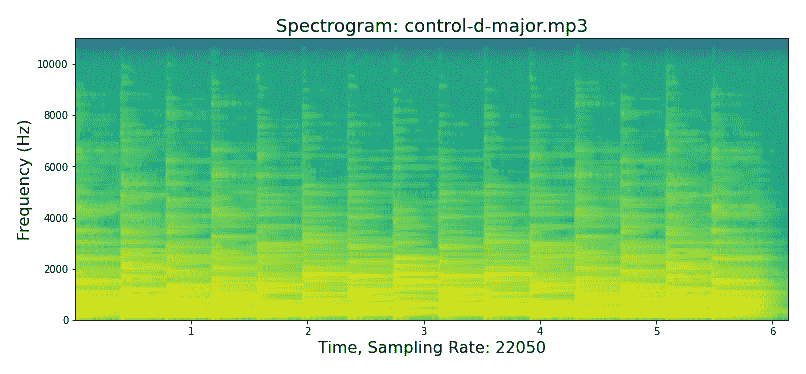

图 8.1 – D 大调钢琴音阶的音频频谱图

在 Pluto 阐明音频频谱图之前，如果音频概念和关键词对你来说很陌生，应该先复习一下 *第七章*。本章内容很大程度上依赖于 *第七章* 中的知识和实践。

在 *图 8.1* 中，Pluto 使用 Matplotlib 库绘制音频频谱图。主要输入是幅度数组和采样率。该库执行所有复杂的计算，其他库，如 Librosa 或 SciPy 也能完成相同的任务。特别地，Matplotlib 能够从相同的输入生成多种类型的音频频谱图。Pluto 会在稍后深入探讨频谱图的类型，但首先，让我们分解一下该库是如何构建音频频谱图的。主要的五个步骤如下：

1.  将音频流分割成重叠的片段，也称为 **窗口**。

1.  对每个窗口计算 **短时傅里叶变换**（**STFT**）值。

1.  将窗口的值转换为 **分贝**（**dB**）。

1.  将窗口链接在一起，形成原始音频序列。

1.  在图表中展示结果，*y* 轴表示 Hz，*x* 轴表示秒，dB 为颜色编码值。

前面五个步骤的数学计算比较复杂，本章的目标是通过频谱图可视化声音并增广音频文件。因此，我们依赖音频库来执行数学计算。

如前所述，表示频谱图的底层数据与波形格式相同。因此，音频增广技术也是相同的。因此，生成的增广音频文件听起来是一样的。唯一的区别是频谱图和波形图的视觉表示。

本章的大部分内容将介绍音频频谱图标准格式、频谱图的变体**梅尔频谱图**和**色度**STFT。增广技术部分较短，因为你在上一章已经学习了该方法。本章将涵盖以下主题：

+   初始化与下载

+   音频频谱图

+   各种频谱图格式

+   梅尔频谱图和色度 STFT 图

+   频谱图增广

+   频谱图图像

趣味事实

**凯电气公司**于 1951 年推出了首个商业化的音频频谱分析机器。该黑白图像被称为声谱仪或声谱图，用于可视化鸟鸣声。1966 年，**圣马丁出版社**使用声谱学为书籍 *《北美鸟类黄金田野指南》* 制作插图。到 1995 年，频谱图术语逐渐取代了声谱图术语，尤其是在数字时代。早期，频谱图或声谱图的应用并不限于鸟类研究。美国军方在 20 世纪 40 年代初期就使用频谱图进行加密，直到今天仍然如此，这一点可以通过 2019 年**密码学历史中心**出版的《密码学季刊》第 38 期得到证明。

本章将重用上一章中介绍的音频增广函数和真实世界的音频数据集（参见 *第七章*）。因此，我们将从初始化 Pluto 并下载真实世界数据集开始。

# 初始化与下载

从 Google Colab 或你选择的 Python Notebook 或 JupyterLab 环境加载 `data_augmentation_with_python_chapter_8.ipynb` 文件开始。从此时起，代码片段来自 Python Notebook，其中包含完整的函数。

以下初始化和下载步骤应该对你来说比较熟悉，因为我们已经做了六次。以下代码片段与 *第七章*中的代码相同：

```py
# Clone GitHub repo.
url = 'https://github.com/PacktPublishing/Data-Augmentation-with-Python'
!git clone {url}
# Intialize Pluto from Chapter 7
pluto_file = 'Data-Augmentation-with-Python/pluto/pluto_chapter_7.py'
%run {pluto_file}
# Verify Pluto
pluto.say_sys_info()
# Fetch Musical emotions classification
url = 'https://www.kaggle.com/datasets/kingofarmy/musical-emotions-classification'
pluto.fetch_kaggle_dataset(url)
f = 'kaggle/musical-emotions-classification/Train.csv'
pluto.df_music_data = pluto.fetch_df(f)
# Fetch human speaking
url = 'https://www.kaggle.com/datasets/ejlok1/cremad'
pluto.fetch_kaggle_dataset(url)
f = 'kaggle/cremad/AudioWAV'
pluto.df_voice_data = pluto.make_dir_dataframe(f)
# Fetch urban sound
url='https://www.kaggle.com/datasets/rupakroy/urban-sound-8k'
pluto.fetch_kaggle_dataset(url)
f = 'kaggle/urban-sound-8k/UrbanSound8K/UrbanSound8K/audio'
pluto.df_sound_data = pluto.make_dir_dataframe(f)
```

趣味挑战

Pluto 挑战你从 *Kaggle* 网站或你的项目中搜索并下载额外的真实世界音频数据集。提示是使用 Pluto 的 `fetch_kaggle_data()` 和 `fetch_df()` 方法，以及任何音频增广包装函数。

一些背后的方法使得这个过程变得非常简便。Pluto 强烈建议你在继续学习频谱图之前，先回顾一下 *第七章*。

# 音频频谱图

在解析频谱图之前，让我们回顾一下频谱图与波形图的基本区别。频谱图显示了声音信号随时间变化的频率成分，重点是频率和强度。相比之下，波形图专注于声音的时序和振幅。它们的区别在于声音波形的可视化表示。底层的数据表示和转换方法是相同的。

音频频谱图是声音波形的另一种可视化表示，您在*第七章*中看到了波形图。`_draw_spectrogram()` 辅助方法使用 Librosa 库导入音频文件，并将其转换为幅度数据一维数组以及采样率（以赫兹为单位）。下一步是使用 Matplotlib 库绘制频谱图。同样，Pluto 从 Librosa 库函数获取输出，并使用 Matplotlib 函数绘制*第七章*中的漂亮蓝色和黄色波形图。相关代码片段如下：

```py
# read audio file
data_amp, sam_rate = librosa.load(lname, mono=True)
# draw the spectrogram plot
spectrum, freq, ts, ax = pic.specgram(data_amp, Fs=sam_rate)
```

返回的值如下：

+   `spectrum` 是 `numpy.array` 类型，具有 `shape(n,m)`。例如，绘制 D 大调音频文件的控制钢琴音阶频谱图的结果 `shape()` 为 `(129, 1057)`。它表示每个片段或窗口的周期图的 m 列。

+   `freq` 是 `numpy.array` 类型，具有 `shape(n,)`。以相同的例子为例，`freq shape` 为 `(129,)`。它表示与 `spectrum` 数组中的元素（行）对应的频率。

+   `ts` 是 `numpy.array` 类型，具有 `shape(n,)`。以之前的例子为例，`ts shape` 为 `(1057,)`。它表示与 `spectrum` 的 n 列中点对应的时间。

+   `ax` 是 `matplotlib.image.AxesImage` 类型。它是来自 Matplotlib 库的图像。

Pluto 使用以下命令为 D 大调音频文件绘制控制钢琴音阶的频谱图：

```py
# plot the Spectrogram
pluto.draw_spectrogram(pluto.audio_control_dmajor)
```

输出结果如下：

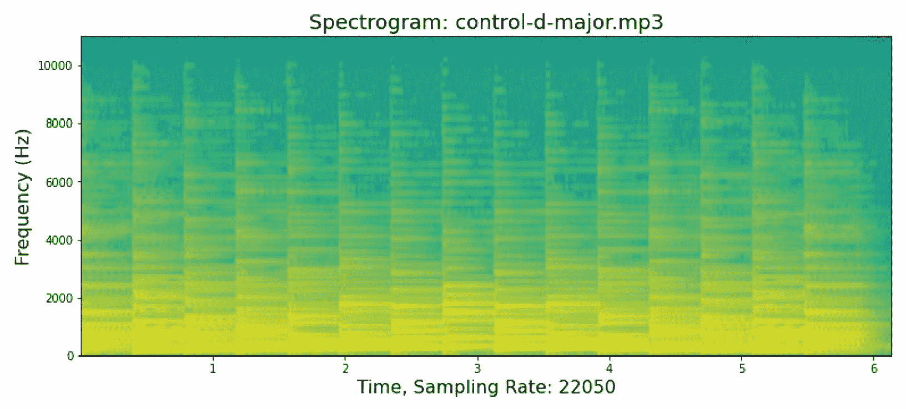

图 8.2 – 钢琴大调音阶的音频频谱图

Pluto 在 Python 笔记本中显示音频播放按钮，您可以点击按钮听音频。按钮的图像如下所示：


图 8.3 – 音频播放按钮

为了进行比较，以下是来自*第七章*的波形图，使用了辅助函数：

```py
# plot the Waveform
pluto._draw_audio(data_amp, sam_rate, 'Original: ' + fname)
```

输出结果如下：

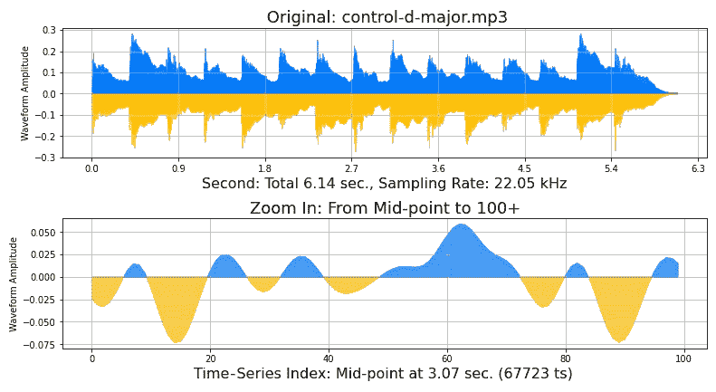

图 8.4 – 钢琴大调音阶的音频波形

音乐声音相同，只有视觉展示不同。

声音工程师训练阅读频谱图以识别和去除不需要的噪声，例如：

+   **嗡嗡声**：通常是录音中的电噪声，其频率范围通常在 50 Hz 到 60 Hz 之间。

+   **嗡嗡声**：这与低频的嗡嗡声相反。它是高频的电气噪声。常见的来源有荧光灯、摄像机麦克风和高频电机。

+   **嘶嘶声**：这是一种宽带噪声，区别于嗡嗡声和嗡声。它通常集中在上下频谱的特定频率。常见的来源是**供暖、通风和空调**（**HVAC**）系统或电动风扇。

+   **间歇性噪声**：这些噪声通常是由城市环境中的声音引起的，例如雷声、鸟鸣、风声、警笛、汽车喇叭声、脚步声、敲击声、咳嗽声或手机铃声。

+   **数字削波**：当音频太响，无法被录制时，就会发生数字削波。这是音频信号峰值的丧失。

+   **间隙**：间隙或丢失是由于音频录制中的缺失切割部分导致的静音。

+   **点击声和爆裂声**：这些是由黑胶唱片和其他有槽介质录音设备产生的噪声。

Pluto 使用**Matplotlib**库函数，该函数有许多参数控制频谱图的显示。我们将使用三个真实世界的音频数据集来展示频谱图的其他可视化表示。

# 各种频谱图格式

Pluto 可以将许多参数传递给 Matplotlib 库的底层`specgram()`方法。他将重点介绍其中的一些参数。

有趣的事实

你可以通过在 Python Notebook 中在函数后加上问号（`?`）来打印任何函数的文档。

例如，打印`specgram()`函数文档的命令如下：`matplotlib.pyplot.specgram?` 部分输出如下：

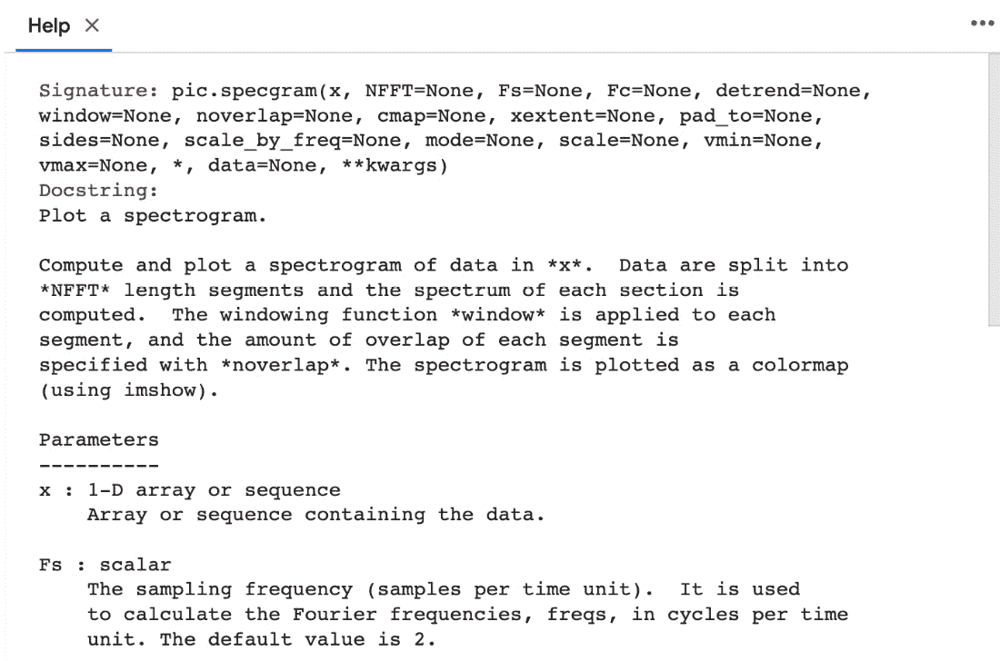

图 8.5 – specgram()的部分打印定义

你可以在 Python Notebook 中查看*图 8.5*的完整输出。另一个示例是打印 Pluto 的`draw_spectrogram()`函数文档，命令如下：`pluto.draw_spectrogram?`。

输出如下：

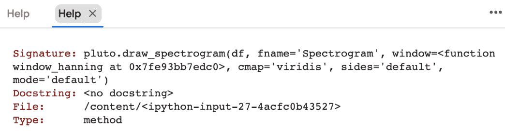

图 8.6 – draw_spectrogram()的打印定义

从*图 8.5*可以看出，简单的方法是改变颜色映射（`cmap`）变量。Matplotlib 库中有超过 60 种颜色映射。因此，Pluto 将为每个音频数据集选择不同的`cmap`颜色。声音工程师可能使用不同的颜色映射来突出特定频率属性，以便识别模式或噪声。更改视觉表示不会影响声音质量或数据。因此，仅根据个人喜好选择颜色映射是可以接受的。如果你喜欢鲜艳的粉色和蓝色，可以选择`cool` `cmap`值。

音乐数据集的频谱图代码如下：

```py
# plot the spectrogram in different color map
pluto.draw_spectrogram(pluto.df_music_data, cmap='plasma')
```

输出如下：

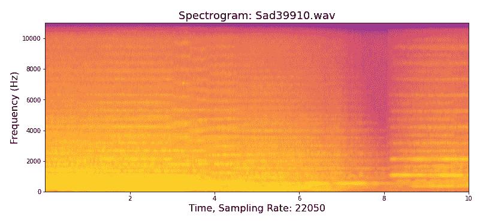

图 8.7 – 音乐文件的频谱图（Sad39910）

每次 Pluto 运行 `draw_spectrogram()` 包装函数时，都会从数据集中随机选择一个音频文件。*图 8**.7* 是具有强烈大提琴主奏的电影音乐音频，`plasma` 色图是一种从亮黄色过渡到橙色和深蓝紫色的色彩。

同样，对于人声数据集，命令如下：

```py
# plot the Spectrogram in different color map
pluto.draw_spectrogram(pluto.df_voice_data, cmap='cool')
```

输出如下：

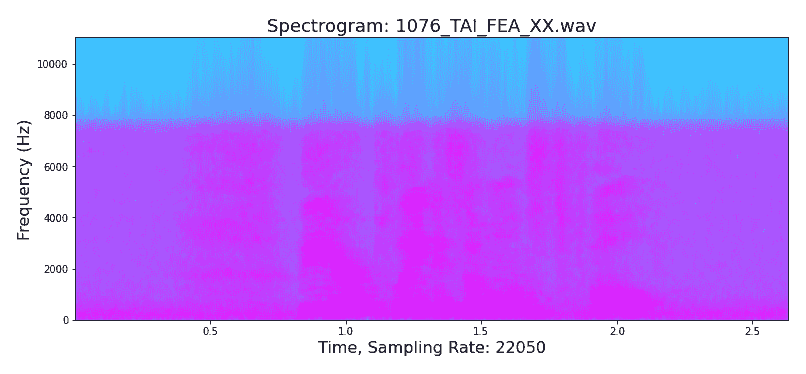

图 8.8 – 人声的频谱图 (1076_TAI_FEA_XX)

*图 8**.8* 是一位女性说“*飞机几乎满了*”的音频。`cool` 色图是从紫红色过渡到淡蓝色。

接下来，Pluto 使用以下命令对城市声音数据集执行相同操作：

```py
# plot the Spectrogram with different color map
pluto.draw_spectrogram(pluto.df_sound_data, cmap='brg')
```

输出如下：

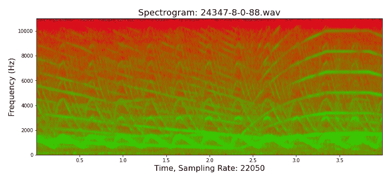

图 8.9 – 城市声音的频谱图 (24347-8-0-88)

*图 8**.9* 听起来像是一辆救护车的警笛声。`brg` 色图是蓝色、红色和绿色，形成了一个引人注目且戏剧性的图形。

有趣的挑战

这个挑战是一个思维实验。对于不同类型的音频（如城市声音或音乐），使用具有多种颜色的色图（例如 `rainbow cmap`）还是使用两种颜色（如 `ocean cmap`）更有利？换句话说，用粉色和品红色阴影来显示人类演唱的音频片段，还是用多彩的地球色调更好？

在音频工程中，`window_hanning` 参数使用加权余弦函数来减少音频频谱的幅度。Hanning 窗口是一种用于减少音频信号频域伪影的技术。它使用 `window` 函数在信号的边缘附近平滑地衰减信号的幅度，从而最小化频谱泄漏的影响，并减少信号中的不必要噪音。Hanning 窗口还提高了信号的时域分辨率，使得更容易精确地识别开始和结束的时刻。

Pluto 的 `draw_spectrogram()` 方法将其用作默认值。如果 Pluto 想查看没有 `window_hanning` 的原始信号怎么办？他可以在控制和语音数据集上使用 `window_none`，如下命令所示：

```py
# control audio file
pluto.draw_spectrogram(pluto.audio_control_dmajor,
  window=matplotlib.mlab.window_none)
# Human speech
pluto.draw_spectrogram(pluto.df_voice_data,
  cmap='cool',
  window=matplotlib.mlab.window_none)
```

控制钢琴音阶（D 大调）音频文件的输出如下：

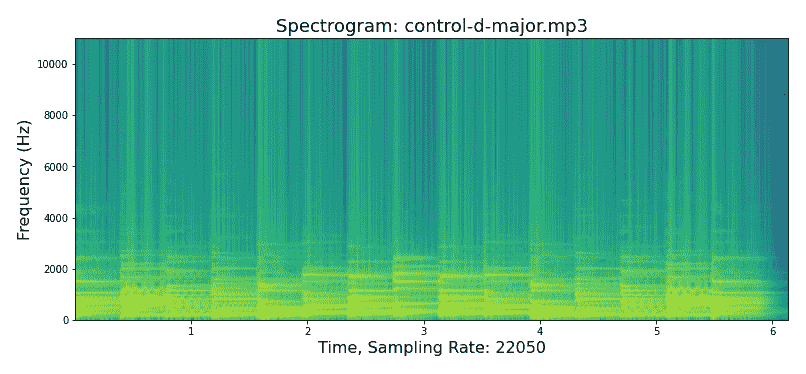

图 8.10 – 使用 window_none 的频谱图，钢琴音阶（控制-D-大调）

人声数据集的输出如下：

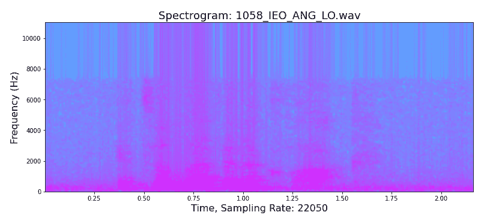

图 8.11 – 使用 window_none 的人声频谱图 (1058_IEO_ANG_LO)

window 参数的其他值包括 `numpy.blackman`、`numpy.bartlett`、`scipy.signal` 和 `scipy.signal.get_window`，*图 8**.11* 中的音频是一个女人说“*现在是* *11 点钟*”。

有趣的挑战

这是一个思维实验。给定一个频谱图作为图像，你能否逆向工程并从图像中播放音频？提示是研究逆频谱图软件和理论。

Pluto 继续绘制各种频谱图和色彩图，因为音频工程师可能需要夸大或突出特定的频率或音频属性。此外，增强技术与上一章类似。因此，花更多时间扩展你对频谱图的理解是值得的。

Pluto 可以单独使用参数，也可以组合多个参数来产生不同的结果，例如在真实音乐数据集上使用 `sides` 参数，或将 `sides` 和 `mode` 参数组合在控制钢琴音阶数据上。命令如下：

```py
# the control piano scale in D major
pluto.draw_spectrogram(pluto.df_music_data,
  cmap='plasma',
  sides='twosided')
# the music dataset
pluto.draw_spectrogram(pluto.audio_control_dmajor,
  window=matplotlib.mlab.window_none,
  sides='twosided',
  mode='angle')
```

`sides`等于`twosided`时，音乐的输出如下：

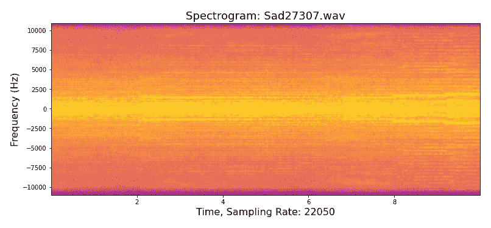

图 8.12 – 具有 twosided 的频谱图，音乐（Sad27307）

`sides`等于`twosided`且`mode`等于`angle`时，控制钢琴音阶音频的输出如下：

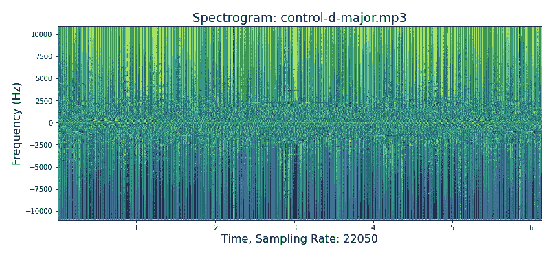

图 8.13 – 具有 twosided 和 angle 的频谱图，音乐（control-d-major）

有趣的挑战

Pluto 在 Python 笔记本中有更多的参数组合。因此，最好修改或破解代码。体验不同的频谱图如何呈现不同的真实世界数据集将会很有趣。

接下来是 Mel 频谱图和 Chroma STFT 图。它们与频谱图类似。

# Mel 频谱图和 Chroma STFT 图

Pluto 花更多时间绘制各种频谱图，因为增强技术与*第七章*中的波形图相同。Pluto 将编写更少的新包装函数。他将重用上一章的方法，但在此之前，让我们绘制更多频谱图。

音高的主观单位，也称为 **Mel 音阶**，是一种音高单位，音高之间的距离是相等的。*S. S. Stevens、John Volkmann 和 E. B. Newmann* 在 1937 年发表于名为《音高心理量度的音阶》的学术论文中提出了 Mel 音阶。

Mel 频率尺度的数学计算很复杂。因此，Pluto 依赖于 Librosa 库中的 `melspectrogram()` 方法来执行计算。Pluto 的 `draw_melspectrogram()` 包装方法使用 Librosa 的 `melspectrogram()` 函数，代码片段如下：

```py
# code snippeet for the melspectrogram
mel = librosa.feature.melspectrogram(y=data_amp,
  sr=sam_rate,
  n_mels=128,
  fmax=8000)
mel_db = librosa.power_to_db(mel, ref=numpy.max)
self._draw_melspectrogram(mel_db, sam_rate, data_amp,
  cmap=cmap,
  fname=tname)
```

整个函数代码在 Python 笔记本中。Pluto 为控制钢琴音阶和人类语音数据集绘制了 Mel 频谱图，结果如下：

```py
# Control piano scale
pluto.draw_melspectrogram(pluto.audio_control_dmajor)
# Music dataset
pluto.draw_melspectrogram(pluto.df_voice_data, cmap='cool')
```

控制钢琴音阶的 Mel 频谱图输出如下：

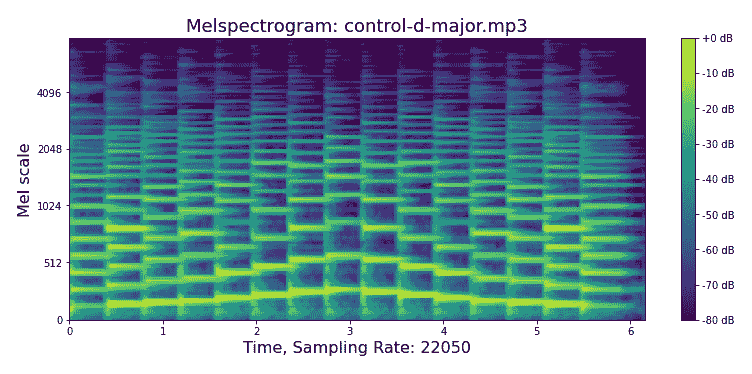

图 8.14 – Mel-谱图控制钢琴音阶（control-d-major）

人类语音数据集的 Mel-谱图输出如下：

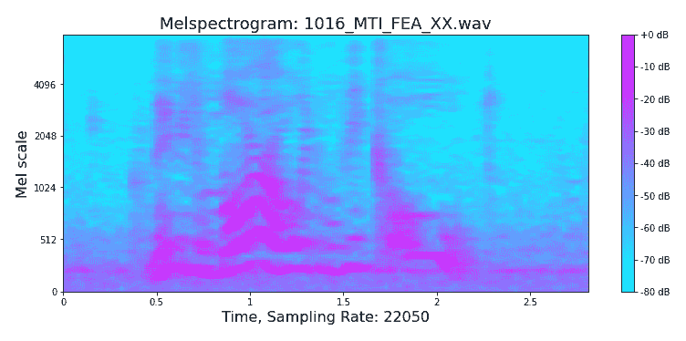

图 8.15 – Mel-谱图音乐（1016_MTI_FEA_XX）

*图 8**.15* 的音频是一个男人说：“*也许明天会很冷*。” 每个 Mel-谱图在 Python Notebook 中都有一个音频播放按钮，你可以听到音频文件。

Chroma STFT 是信号的正弦频率和局部阶段内容随着时间变化的表现。*Dennis Gabor 博士* 在 1944 年的学术论文《通信理论》中首次提出 STFT，也被称为 **Gabor 变换**，并在 1945 年进行了修订。

Chroma STFT 是一种通过将音乐音频信号分解为其成分频率和振幅与时间的关系来分析音乐音频信号的方法。它用于表征所使用的乐器，并在短小的音乐片段中识别独特的特征。Chroma STFT 最常用于识别音乐信号的谱特征，从而能够对这些成分进行量化，并与同一乐曲的其他版本进行比较。

Pluto 在 `draw_melspectrogram()` 包装方法中稍作修改，以适应 Chroma STFT 图。新增的参数是 `is_chroma`，默认值为 `False`。`_draw_melspectrometer()` 辅助函数没有变化。代码片段如下：

```py
# code snippet for the chroma_stft
stft = librosa.feature.chroma_stft(data_amp,
  sr=sam_rate)
self._draw_melspectrogram(stft, sam_rate, data_amp,
  cmap=cmap,
  fname=tname,
  y_axis=yax,
  y_label=ylab)
```

整个函数代码位于 Python Notebook 中。Pluto 会为控制钢琴音阶、音乐和城市声音数据集绘制 Chroma STFT 图，如下所示：

```py
# Control piano scale
pluto.draw_melspectrogram(pluto.audio_control_dmajor,
  is_chroma=True)
# Music dataset
pluto.draw_melspectrogram(pluto.df_music_data,
  is_chroma=True,
  cmap='plasma')
# Urban sound dataset
pluto.draw_melspectrogram(pluto.df_sound_data,
  is_chroma=True,
  cmap='brg')
```

D 大调控制钢琴音阶的 Chroma STFT 图如下：

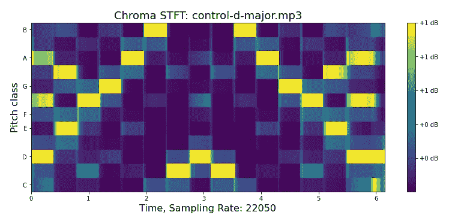

图 8.16 – Chroma STFT，控制钢琴音阶（control-d-major）

音乐数据集的输出如下：

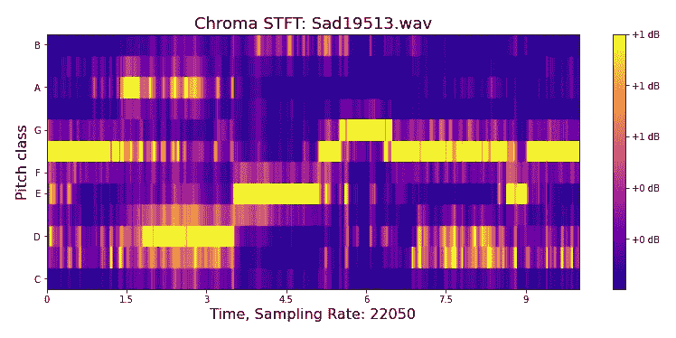

图 8.17 – Chroma STFT，音乐（Sad19513）

城市声音数据集的输出如下：

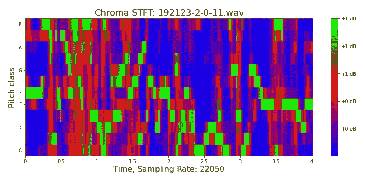

图 8.18 – Chroma STFT，城市声音（192123-2-0-11）

*图 8**.17* 的音频是带有强烈小提琴主旋律的电影配乐，而 *图 8**.18* 听起来像是在户外操场上玩耍的嘈杂孩子们的声音。

有趣的事实

在生成新图像或图表时，Pluto 会自动将图像文件写入或导出到`~/Data-Augmentation-with-Python/pluto_img`目录。因此，Pluto 会自动保存增强的图像到*第三章*和*第四章*，以及波形图、音频声谱图、梅尔声谱图和色度 STFT 图表到*第七章*和*第八章*。辅助函数的名称为`_drop_image()`，文件格式为`pluto[id].jpg`，其中`id`是来自`self.fname_id`变量的自增整数。

我们已经详细讨论并编写了音频声谱图、梅尔声谱图和色度 STFT 的 Python 代码。接下来，Pluto 将描述如何使用声谱图进行音频增强。

# 声谱图增强

Pluto 将重用大部分*第七章*中的包装函数。如果以下代码看起来有些难度，您可以重新阅读前一章。Pluto 将简化对包装函数的解释，因为他假设您已经是编写音频增强包装函数的专家。

音频声谱图、梅尔声谱图、色度 STFT 和波形图表从 Librosa 的`load()`函数读取音频文件时返回的幅度数据和采样率。这些数据经过了额外的变换，但它们的共同目标是可视化声波和频率。

在审阅了许多学术论文后，Pluto 得出结论，*第七章*中的音频增强技术同样适用于音频声谱图、梅尔声谱图和色度 STFT。特别是，他参考了 2015 年 Tom Ko、Vijayaditya Peddinti、Daniel Povey 和 Sanjeev Khudanpur 发表的学术论文《Speech Recognition 的音频增强》；2020 年 Loris Nannia、Gianluca Maguoloa 和 Michelangelo Paci 发表的《提高动物音频分类的数据增强方法》；以及 2017 年 Justin Salamon 和 Juan Pablo Bello 发表的《深度卷积神经网络与环境声音分类的数据增强》。

直观地说，这与*第七章*中的技术应该没有区别，因为底层的幅度数据和采样率是相同的。换句话说，您可以使用*第七章*中的音频增强函数来处理音频声谱图、梅尔声谱图和色度 STFT，像以下这些技术：

+   时间拉伸

+   时间偏移

+   音高缩放

+   噪声注入

+   极性反转

+   低通滤波器

+   高通滤波器

+   带通滤波器

+   低棚滤波器

+   高棚滤波器

+   带阻滤波器

+   峰值滤波器

还有其他功能，如`Masking`和`Gaps`，它们可以通过`audiomentation`库获得。前一章中提到的**安全**级别同样适用于音频声谱图、Mel-声谱图和 Chroma STFT。

有趣的事实

你可以通过在`correct`类中覆盖任何 Python 函数来进行更改。Pluto 的函数属于`PacktDataAug`类。因此，你可以通过在函数定义之前添加`@add_method(PacktDataAug)`代码行来黑客入侵并覆盖 Pluto 的任何方法。

Pluto 需要修改`_audio_transform()`辅助函数，并包括新的`is_waveform`参数，默认设置为`True`，以便它不会影响*第七章*中的方法。新方法的定义如下：

```py
# add is_waveform parameter
@add_method(PacktDataAug)
def _audio_transform(self, df, xtransform,
  Title = '',
  is_waveform = True):
```

更新后的代码片段如下：

```py
# keep the default to be same for Chapter 7, Waveform graph
if (is_waveform):
  # augmented waveform
  self._draw_audio(xaug, sam_rate,
    title + ' Augmented: ' + fname)
  display(IPython.display.Audio(xaug, rate=sam_rate))
  # original waveform
  self._draw_audio(data_amp, sam_rate, 'Original: ' + fname)
# update to use spectrogram, me-spectrogram, and Chroma
else:
  xdata = [xaug, sam_rate, lname, 'Pluto']
  self.draw_spectrogram(xdata)
  self.draw_melspectrogram(xdata)
  self.draw_melspectrogram(xdata, is_chroma=True)
```

因此，`is_waveform`参数用于在*第七章*中使用波形图，或音频声谱图、Mel-声谱图和 Chroma STFT 图表。就是这样，这也是我们喜欢使用 Pluto 编程的原因。他遵循最佳的面向对象编程实践，所有函数都在一个类中。

Pluto 将新参数添加到`play_aug_time_shift()`包装函数中，并用控制数据进行测试。命令如下：

```py
# augment the audio with time shift
pluto.play_aug_time_shift(pluto.audio_control_dmajor,
  min_fraction=0.8,
  is_waveform=False)
```

音频声谱图的输出如下：

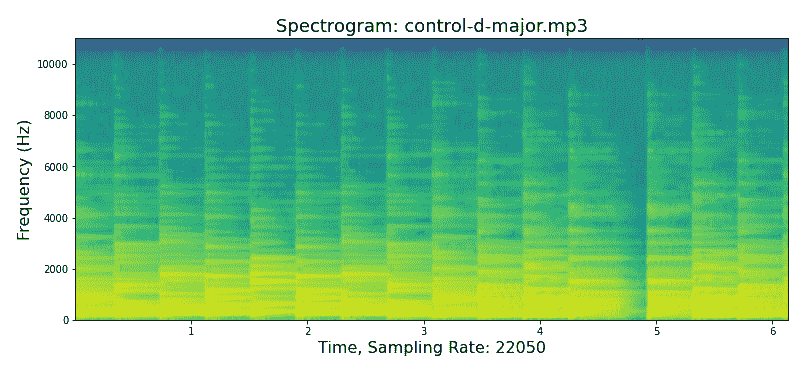

图 8.19 – 声谱图，时间偏移，钢琴音阶（control-d-major）

Mel-声谱图的输出如下：

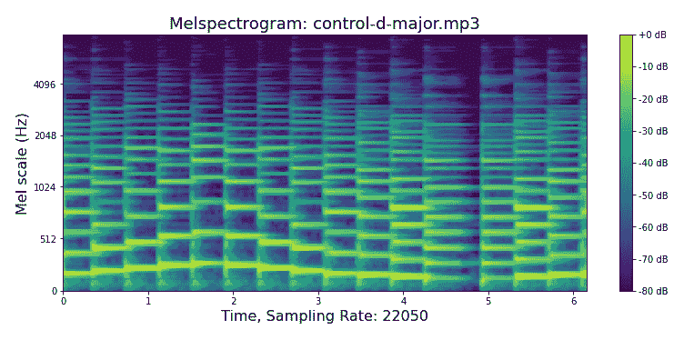

图 8.20 – Mel-声谱图，时间偏移，钢琴音阶（control-d-major）

Chroma STFT 的输出如下：

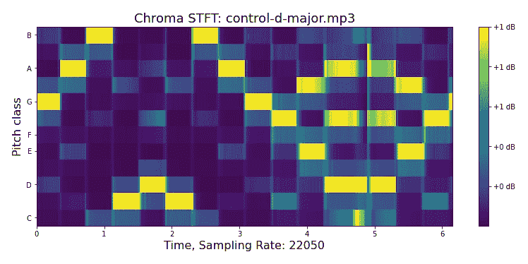

图 8.21 – Chroma STFT，时间偏移，钢琴音阶（control-d-major）

*图 8.19*、*图 8.20* 和 *图 8.21* 将钢琴音阶（D 大调）向左偏移约 2 秒。换句话说，音频以**G 音**开始，循环后以**F#音**结束。Pluto 建议听听 Python 笔记本中的前后效果，这样是理解它的最简单方法。

Pluto 对人声数据集做相同的操作，使用以下命令：

```py
# augment audio using time shift
pluto.play_aug_time_shift(pluto.df_voice_data,
  min_fraction=0.8,
  is_waveform=False)
```

音频声谱图的输出如下：

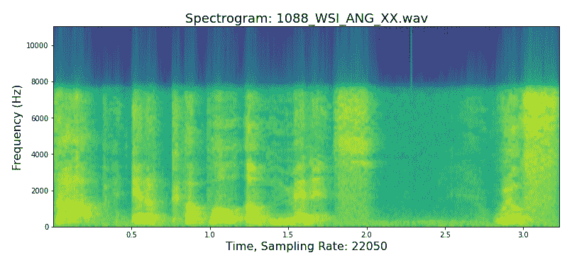

图 8.22 – 声谱图，时间偏移，人声（1085_ITS_ANG_XX）

Mel-声谱图的输出如下：

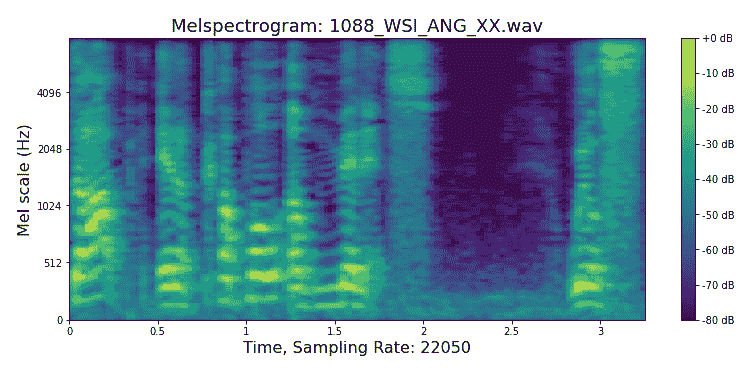

图 8.23 – Mel-声谱图，时间偏移，人声（1085_ITS_ANG_XX）

Chroma STFT 的输出如下：

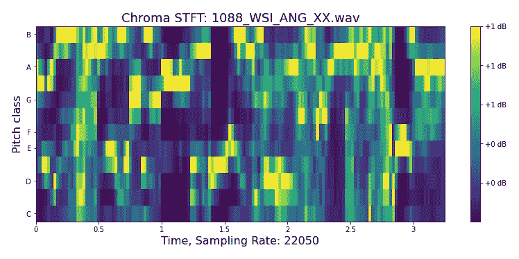

图 8.24 – Chroma STFT，时间偏移，人声（1085_ITS_ANG_XX）

*图 8**.22*、*图 8**.23*和*图 8**.24*的原始音频是一位男性的声音，说：“*我们将在几分钟内停下*。”增强版本则变成了“*停下几分钟[静音]我们将停下*。”Pluto 可以在 Python Notebook 中听到增强前后的差异。音频增强的目标对于谱图和波形图是相同的，即通过增加输入数据来提高 AI 的预测准确性。

音乐和城市声音数据集的结果变化类似。Pluto 在 Python Notebook 中有时间偏移的代码，你可以运行它并看到、听到结果。此外，Pluto 将跳过在本章中描述其他音频增强功能的结果。因为结果与*第七章*中的相同，包装函数代码也在 Python Notebook 中。然而，他会解释`play_aug_noise_injection()`函数，因为这个函数可以扩展到特定话题，讨论声音工程师如何使用谱图。

声音工程师使用标准的音频谱图和其他各种谱图来发现并去除不需要的噪声，如嗡嗡声、嗡嗡声、嘶嘶声、剪辑、间隙、点击声和爆裂声。音频增强的目标是相反的。我们在安全范围内向录音中加入不需要的噪声。因此，我们增加了训练数据集并提高了 AI 的预测准确性。

Pluto 使用以下命令将白噪声添加到音乐数据集中：

```py
# augment audio with noise injection
pluto.play_aug_noise_injection(pluto.df_music_data,
  min_amplitude=0.008,
  max_amplitude=0.05,
  is_waveform=False)
```

音频谱图的输出如下：

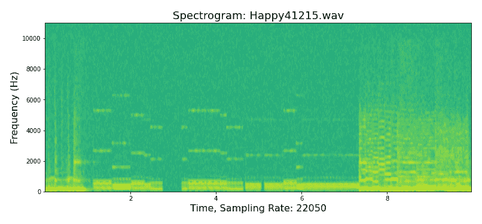

图 8.25 – 谱图，噪声注入，音乐（Happy41215）

Mel-谱图的输出如下：

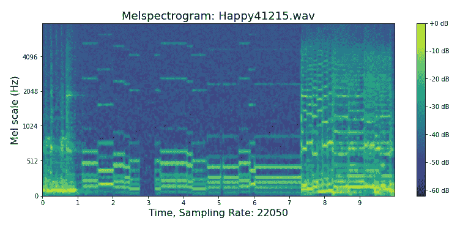

图 8.26 – Mel-谱图，噪声注入，音乐（Happy41215）

Chroma STFT 的输出如下：

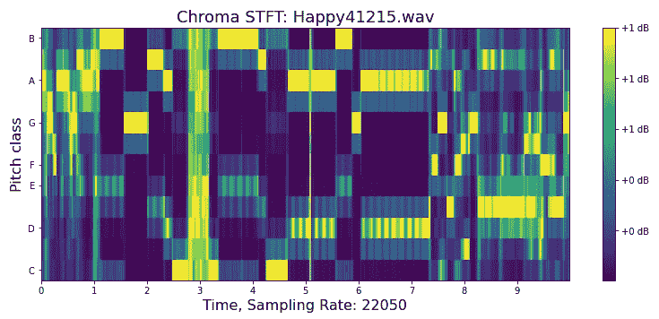

图 8.27 – Chroma STFT，噪声注入，音乐（Happy41215）

*图 8**.25*、*图 8**.26*和*图 8**.27*播放重鼓、轻电子铃声和重电子吉他，伴有中等强度的白噪声。

有趣的挑战

这是一个思维实验。你是一个自动驾驶汽车系统开发团队的一员，你的目标是在驾驶时识别或识别汽车鸣笛声。你将如何增强音频数据？一个提示是考虑现实世界中的驾驶条件，例如交通或城市噪声。

如果你有嗡嗡声、嗡嗡声或爆裂声的音频文件，你可以通过交替使用`play_aug_noise_injection()`包装函数将它们注入到录音中，如下所示：

```py
# Original use white noise, code snippet
xtransform = audiomentations.AddGaussianNoise(
  min_amplitude=min_amplitude,
  max_amplitude=max_amplitude,
  p=1.0)
# Update to using unwanted noise file
xtransform = audiomentations.AddShortNoises(
  sounds_path="~/path_to_unwanted_noise_file",
  min_snr_in_db=3.0,
  max_snr_in_db=30.0,
  noise_rms="relative_to_whole_input",
  min_time_between_sounds=2.0,
  max_time_between_sounds=8.0,
  noise_transform=PolarityInversion(),
  p=1.0)
```

前面的代码片段和完整文档可以在 GitHub 上的`audiomentations`库中找到。

下一个话题是使用谱图作为深度学习图像分类的图像输入的新颖想法。

# 谱图图像

从根本上讲，音频数据是时间序列数据。因此，AI 使用时间序列算法，如**自回归积分滑动平均**（**ARIMA**）或**指数平滑**（**ES**）算法进行音频分类。然而，还有更好的方法。你可以使用声谱图作为代表音频声音的图像输入，而不是时间序列数值数组。使用图像作为输入数据，你可以利用强大的神经网络算法更准确地对音频进行分类。

严格来说，这个话题并不直接涉及新的音频增强技术。然而，它是数据科学家必须理解的重要话题。尽管如此，Pluto 不会编写用于构建神经网络模型的 Python 代码，使用声谱图作为输入。

深度学习图像分类，也就是使用人工神经网络算法的机器学习模型，最近达到了前所未有的准确度，超过了 98%。许多 AI 科学家将深度学习技术应用于音频数据集，例如 Lonce Wyse 在 2017 年发布的《*Audio Spectrogram Representations for Processing with Convolutional Neural Networks*》和 Ciro Rodriguez、Daniel Angeles、Renzo Chafloque、Freddy Kaseng、Bishwajeet Pandey 于 2020 年发布的《*Deep Learning Audio Spectrograms Processing to the Early COVID-19 Detection*》。

该技术将音频声谱图作为图像输入，而不是音频振幅、采样率或 Mel 频率尺度。例如，音乐数据集（MEC）的目标是将一段音乐片段分类为`快乐`或`悲伤`的情感。Pluto 可以将所有音频文件转换为音频声谱图并保存到本地驱动器。他将使用 Fast.ai 强大的 AI 框架和库来创建图像分类模型。他可以达到 95%以上的准确度。

关键问题是你能否使用在*第三章*和*第四章*中讨论的图像增强方法来应用于声谱图？

这取决于 AI 模型的安全级别和目标。例如，使用图像增强技术，垂直翻转声谱图意味着将高频率翻转为低频率，反之亦然。Pluto 想知道这会如何影响音乐的情感。它可能是一个**不安全**的技术。然而，带有低噪声值的图像噪声注入方法可能是声谱图的安全技术。Pluto 认为，保持使用*第七章*中的音频增强技术更为合适。

类似的深度学习方法也可以应用于人类语音（`CREMA-D`）数据集，用于分类说话者的年龄、性别或种族。

有趣的挑战

这是一个思维实验。你能否使用语音转文本软件将语音转换为文本，并使用*第五章*和*第六章*中的文本增强功能？一个提示是思考项目的范围。例如，如果 AI 旨在推断情感分析，它可能有效，但如果目标是识别男性或女性声音，则可能无效。

对于城市声音（US8K）数据集，Pluto 可以使用深度学习多标签分类技术来识别城市声音片段中的不同类型声音，比如电锯声、风声、孩子们玩耍的声音、雨声、狗叫声或枪声。

有趣的挑战

Pluto 挑战你重构 `Pluto` 类，以使其更加快速和紧凑。你还应该包括之前章节中的所有图像和文本包装器以及辅助函数。Pluto 鼓励你将你的库创建并上传到 *GitHub 和 PyPI.org*。此外，你不必将类命名为 `PacktDataAug`，但如果你引用或提到这本书，Pluto 和他的人类伙伴会露出灿烂的笑容。代码目标是易于理解、可重用的模式，并教你使用 Python Notebook。因此，将代码重构为 Python 库将是相对轻松且有趣的。

我们已经涵盖了音频频谱图、梅尔频谱图和色度 STFT 表示与增强的内容，包括将频谱图用作深度学习图像分类模型的图像输入技术。现在是时候做一个总结了。

# 总结

音频增强在书籍格式中很难解释，但通过附加的可视化技术，如音频频谱图、梅尔频谱图和色度 STFT，我们能更深入地理解音频的幅度、频率和采样率。此外，在 Python Notebook 中，你可以听到音频增强前后的效果。

与上一章相比，波形图显示信号随时间变化的幅度，帮助理解信号的形状和结构。频谱图显示信号随时间变化的频率的可视化表示，提供了对声音谐波内容的更深入了解。

音频频谱图有很多变种，无论是 `specgram()` 函数。Pluto 在一些频谱图类型上使用了 Python 代码包装器函数。大多数频谱图变种由你来探索，方法是通过额外的包装函数扩展 `Pluto` 对象。利用 Pluto 的面向对象最佳实践、函数包装器概念和 audiomentations 库，扩展 Pluto 添加额外的包装函数非常容易。

对于谱图增强技术，它们与*第七章*中的技术相同，如时间平移、时间拉伸、音高缩放、噪声注入、带通滤波器等。直观地看，这些方法应该没有区别，因为在上一章中，你选择将声音波形可视化为波形图，而在这一章中，你将它们绘制为音频谱图、梅尔谱图和色度 STFT 图。因此，底层数据是相同的。

Pluto 只需修改 `_audio_transform()` 辅助方法，新增一个 `is_waveform` 参数。此后，Python 代码变得简单而重复，但它隐藏了 audiomentations 库和 Pluto 面向对象最佳实践的强大功能。

在本章中，有许多 **有趣的事实** 和 **有趣的挑战**。Pluto 希望你能利用这些优势，并将体验扩展到本章之外的领域。

下一章将超越典型的数据类型，如图像、文本和音频，探讨表格数据增强。

# 第五部分：表格数据增强

本部分包括以下章节：

+   *第九章*，*表格数据增强*
