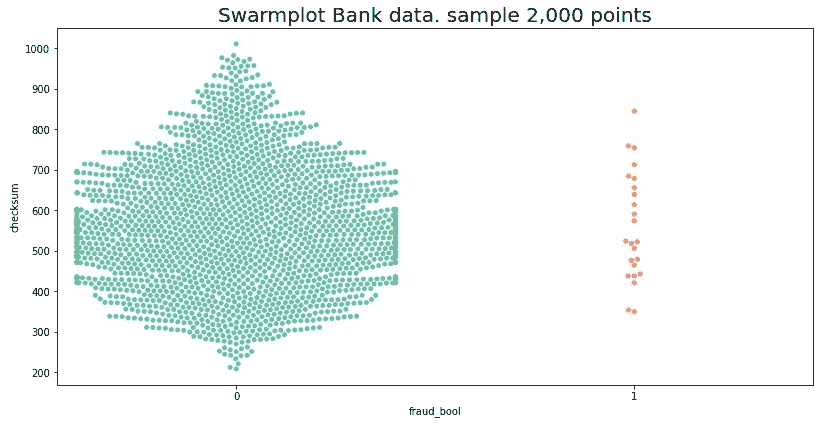
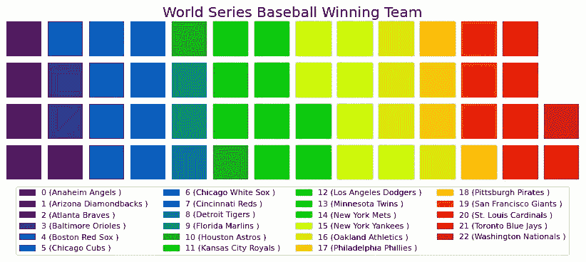

# 第九章：表格数据增强

表格增强通过向表格数据添加额外信息，使其在预测分析中更具实用性。数据库、电子表格和表格数据是表格数据的例子。它涉及将不足的数据集转化为强大的机器学习输入。表格增强可以帮助将非结构化数据转化为结构化数据，还可以协助将多个数据源合并为一个数据集。它是数据预处理中的一个关键步骤，有助于提高 AI 预测的准确性。

表格增强的想法是向给定的数据集中添加额外的信息，从而生成有价值的洞察。这些数据集可以来自各种来源，例如客户反馈、社交媒体帖子和物联网设备日志。表格增强可以通过用更多有意义的标签来丰富现有列，从而向数据集中添加新的信息列。它增加了数据集的完整性，并提供了更准确的洞察。

表格增强是在数据预处理和生成洞察时需要考虑的重要方法。它通过组织和丰富数据，以提高准确性和速度，为处理不完整和非结构化的数据集提供了一种方法。通过实施表格增强，你可以更好地挖掘现实世界数据集的价值，并做出更明智的决策。

表格增强是数据科学家们的一个年轻领域。它与使用分析进行报告、总结或预测是相反的。在分析中，改变或添加数据以扭曲结果以达到预设的期望结果是不道德的。而在数据增强中，目的是从现有数据集中衍生出新的数据。这两个目标可能不一致，但它们并不矛盾。深度学习（DL）是与传统分析完全不同的技术。一个是基于神经网络算法，另一个则基于统计分析和数据关系。

重要的一点是，即使你可能会向数据集中引入合成数据，这也是一种可接受的做法。Lei Xu 和 Kalyan Veeramachaneni 在 2018 年 11 月发布的《使用生成对抗网络合成表格数据》论文，在 *arXiv 论坛* 上支持这一观点。

本章专注于描述概念。它有一些使用 Python Notebook 的实际编码示例。主要原因之一是，目前只有少数几种开放源代码的表格增强库可用。你将花费大部分时间绘制各种图表，以从数据集中激发更多的洞察。

在继续之前，让我们先窥探一下一个真实的表格数据集。接下来，Pluto 会详细解释如何编写 Python 代码来处理以下内容：

```py
# print out the tabular data
pluto.df_bank_data[['fraud_bool',
  'proposed_credit_limit',
  'customer_age',
  'payment_type']].sample(5)
```

输出如下：


图 9.1 – 银行账户欺诈数据集套件（NeurIPS 2022）

增强表格数据的一个挑战是没有固定的方法可以普遍适用，例如翻转图像、注入拼写错误的单词或时间拉伸音频文件。你将了解到，数据集决定了哪些增强技术是**安全的**或处于**安全范围内**。在增强数据集之前，彻底审查表格数据集是非常重要的。

趣味事实

**深度神经网络**（**DNNs**）在预测未来股市价值和表格数据方面表现出色，基于学术论文*Deep learning networks for stock market analysis and prediction: Methodology, data representations, and case studies*，由 Eunsuk Chong, Chulwoo Han 和 Frank C. Park 撰写。该论文由 Elsevier 出版，刊登于*Expert Systems with Applications*，第 83 卷，于 2017 年 10 月 15 日发布。

表格增强是一种通过合成数据增强表格数据集的方法。它包括通过衍生计算中的特征向表格数据集添加新列。你将花费大部分时间在 Python 代码中可视化现实世界的表格数据集，并用奇异的图表进行展示。在本章中，我们将涵盖以下主题：

+   表格增强库

+   增强类别

+   现实世界的表格数据集

+   探索和可视化表格数据

+   转换增强

+   提取增强

让我们从增强库开始。

# 表格增强库

表格数据增强不像图像、文本或音频增强那样被广泛建立。通常，数据科学家会根据项目开发特定的表格增强技术。GitHub 网站上有一些开源项目，但深度学习和生成式 AI 将继续推进时间序列和表格数据预测的预测能力，表格数据增强也将随之发展。以下开源库可以在 GitHub 网站上找到：

+   **DeltaPy**是一个针对生成和合成数据的表格增强工具，专注于金融应用，如时间序列股市预测。它基本上适用于广泛的数据集。GitHub 网站链接是[`github.com/firmai/deltapy`](https://github.com/firmai/deltapy)。已发布的学术论文名为*DeltaPy: A Framework for Tabular Data Augmentation in Python*，由 Derek Snow, Alan Turing Institute 于 2020 年发表。

+   **Synthetic Data Vault**（**SDV**）用于通过从单个表、多个表和时间序列数据生成合成数据来增强表格数据。2020 年，Kalyan Veeramachaneni、Neha Patki 和 Saman Amarsinghe 开发了一个名为*Datacebo*的商业版本。GitHub 链接是[`github.com/sdv-dev/SDV`](https://github.com/sdv-dev/SDV)。

+   表格**生成对抗网络**（**GAN**）采用成功生成真实图像的算法，并将其应用于表格增强。相关的学术论文是*Tabular GANs for uneven distribution*，由 Insaf Ashrapov 撰写，2020 年由*康奈尔大学*出版，发布于*Arxiv*。GitHub 网站链接是[`github.com/Diyago/GAN-for-tabular-data`](https://github.com/Diyago/GAN-for-tabular-data)。

Pluto 选择了**DeltaPy**库作为其表格增强包装函数背后的引擎，但首先，我们来看一下增强类别。

# 增强类别

将表格增强分组为不同的类别是有优势的。以下概念是 DeltaPy 库的新特性。增强函数被分为以下几个类别：

+   **变换**技术可以应用于横截面数据和时间序列数据。表格增强中的变换技术用于修改现有的行或列，以创建新的、合成的数据，这些数据代表了原始数据。这些方法可以包括以下内容：

    +   **缩放**：增加或减少列值，以扩展数据集中值的多样性

    +   **分箱**：将两列或多列合并为一个单一的桶，以创建新特征

    +   **类别编码**：使用数值表示分类数据

    +   **平滑**：补偿数据集中的异常高值或低值

    +   **异常值检测与移除**：检测并移除偏离正常值的数据点

    +   **基于相关性的增强**：根据现有特征之间的相关性添加新特征

+   **交互**功能是一个横截面或时间序列的表格增强，包括归一化、离散化和自回归模型。在表格增强中，这些功能用于指定两个或更多变量之间的交互，并帮助生成表示原始变量组合的新特征。当建模多个输入特征和目标变量之间的关系时，这种类型的增强非常有益，因为它允许模型考虑不同组件之间的交互。

+   **映射**方法使用**特征分解**进行表格增强，是一种无监督学习方法，利用数据分解通过特征向量和特征值将数据转化为低维空间。这种特征转换对于聚类、异常值检测和降维非常有用。通过将数据投影到特征向量上，数据可以在降低维度的同时，保持数据的结构。

+   **提取**方法是一种表格数据增强技术，利用**自然语言处理**（**NLP**）从表格数据集中的文本引用中生成附加信息。它使用**TSflesh**库——一组规则和启发式方法——从文本中提取附加数据，如姓名、日期和地点。这种方法有助于增强结构化数据集，其中**句子分割**、**分词**和**词性标注**的输出可以用来创建特征，供进一步处理使用。

+   **时间序列合成**（**TSS**）是一种表格数据增强方法，其中将来自多个来源或不同时间点的数据行进行合成。你可以使用它来增加数据集的大小，并创建一个更一致的特征集。

+   **横截面合成**（**CSS**）是一种表格数据增强方法，其中将来自多个来源的数据列进行合并。你可以使用它来增加数据集的特征，并创建更完整、更全面的数据视图。

+   **组合**技术采用现有方法中的混合搭配过程。

在 DeltaPy 库中，每个类别都有相关的函数。然而，Pluto 必须构建一个神经网络模型，比如**卷积神经网络**（**CNN**）或**递归神经网络**（**RNN**），以评估这些方法的有效性。这是一个复杂的过程，而 Pluto 在本章中不会实现 CNN。不过，Pluto 会展示如何在 Python Notebook 中使用 DeltaPy 库的机制，但他不会解释这些方法是如何工作的。

现在是从*Kaggle*网站下载真实世界数据集的时候了。

# 真实世界的表格数据集

*Kaggle*网站上有成千上万的真实世界表格数据集。Pluto 选择了两个表格数据集来进行这一过程。

*银行账户欺诈数据集套件（NeurIPS 2022）*包含六个合成的银行账户欺诈表格数据集。每个数据集包含 100 万个记录。它们基于真实世界的欺诈检测数据，每个数据集侧重于不同类型的偏差。Sergio Jesus、Jose Pombal 和 Pedro Saleiro 在 2022 年以**署名-非商业性使用-相同方式共享 4.0 国际（CC BY-NC-SA 4.0）**许可证发布了该数据集。*Kaggle*链接为[`www.kaggle.com/datasets/sgpjesus/bank-account-fraud-dataset-neurips-2022`](https://www.kaggle.com/datasets/sgpjesus/bank-account-fraud-dataset-neurips-2022)。

*世界大联盟棒球电视收视率*是一个数据集，记录了 1969 到 2022 年间收看棒球世界大联盟赛的电视观众数据。Matt OP 在 2022 年以**CC0 1.0 通用（CC0 1.0）公共领域献身**许可证发布了该数据集。*Kaggle*链接为[`www.kaggle.com/datasets/mattop/world-series-baseball-television-ratings`](https://www.kaggle.com/datasets/mattop/world-series-baseball-television-ratings)。

实例化 Pluto 并从 *Kaggle* 网站下载真实世界数据集的步骤是相同的。首先，加载 `data_augmentation_with_python_chapter_9.ipynb` 文件到 Google Colab 或你选择的 Jupyter Notebook 或 JupyterLab 环境。从这一点开始，代码片段来自于 Python Notebook，包含了完整的功能。

你将使用来自 *第二章* 的代码，因为你需要用于下载 *Kaggle* 数据集的包装函数，而不是用于图像、文本和音频增强的包装函数。如果步骤不熟悉，应该复习 *第二章* 和 *第三章*：

```py
# Clone GitHub repo.
url = 'https://github.com/PacktPublishing/Data-Augmentation-with-Python'
!git clone {url}
# Initialize Pluto from Chapter 2
pluto_file = 'Data-Augmentation-with-Python/pluto/pluto_chapter_2.py'
%run {pluto_file}
# Verify Pluto
pluto.say_sys_info()
# Fetch Bank Fraud dataset
url = 'https://www.kaggle.com/datasets/sgpjesus/bank-account-fraud-dataset-neurips-2022'
pluto.fetch_kaggle_dataset(url)
# Import to Pandas
f = 'kaggle/bank-account-fraud-dataset-neurips-2022/Base.csv'
pluto.df_bank_data = pluto.fetch_df(f)
# Fetch World Series Baseball dataset
url = 'https://www.kaggle.com/datasets/mattop/world-series-baseball-television-ratings'
pluto.fetch_kaggle_dataset(url)
# Import to Pandas
f = 'kaggle/world-series-baseball-television-ratings/world-series-ratings.csv'
pluto.df_world_data = pluto.make_dir_dataframe(f)
```

趣味挑战

在 *第八章* 结束时，Pluto 挑战你对 Pluto 代码进行重构以提高速度和紧凑性。目标是将 Pluto 上传到 [Pypi.org](https://Pypi.org)。这个挑战扩展了这一概念，要求你将设置代码合并成一个超级包装函数，例如 `pluto.just_do_it()`。Pluto 不使用超级方法，因为本书的目的是让概念和函数更容易学习，并揭开过程的神秘面纱。

收集 Pluto 系统信息的输出如下：

```py
---------------------------- : ----------------------------
                                 System time : 2023/01/31 07:03
                                        Platform : linux
         Pluto Version (Chapter) : 2.0
                         Python (3.7.10) : actual: 3.8.10 (default, Nov 14 2022, 12:59:47) [GCC 9.4.0]
                        PyTorch (1.11.0) : actual: 1.13.1+cu116
                            Pandas (1.3.5) : actual: 1.3.5
                                 PIL (9.0.0) : actual: 7.1.2
                    Matplotlib (3.2.2) : actual: 3.2.2
                                     CPU count : 2
                                    CPU speed : NOT available
---------------------------- : ----------------------------
```

趣味挑战

Pluto 挑战你从 *Kaggle* 网站或你的项目中搜索、下载并导入两个额外的表格数据集到 pandas。

至此，你已经选择了一个表格数据增强库，克隆了 GitHub 仓库，实例化了 Pluto，并从 *Kaggle* 网站下载了两个真实世界的表格数据集。现在，是时候让 Pluto 探索和可视化数据了。

# 探索和可视化表格数据

表格数据增强比图像、文本和音频增强更具挑战性。主要原因是你需要构建一个 CNN 或 RNN 模型，以查看合成数据的效果。

Pluto 将花更多时间解释他调查真实世界银行欺诈和世界大赛数据集的历程，而不是使用 DeltaPy 库实现表格增强函数。一旦你理解了数据可视化过程，你可以将其应用于其他表格数据集。

趣味事实

通常，Pluto 通过在该章节的 Python Notebook 中编写代码来开始一个章节。它包含大约 150 到 250 个代码和文本单元格。它们是未经组织的研究笔记和尝试错误的 Python 代码单元格。一旦 Pluto 通过编码证明概念和技术正确无误，他便开始编写该章节。作为写作过程的一部分，他会清理并重构 Python Notebook，添加包装函数并删除无用的代码。Python Notebook 的干净版本包含原始代码和文本单元格的 20% 到 30%。

尤其是在探索表格数据时，我们将涵盖以下主题：

+   数据结构

+   第一个图表视图

+   校验和

+   专门的图表

+   探索世界大赛棒球数据集

让我们从数据结构开始。

## 数据结构

Pluto 通过使用 pandas 的内置函数检查数据结构。他使用以下命令：

```py
# display tabular data in Pandas
pluto.df_bank_data.info()
```

结果如下：

```py
<class 'pandas.core.frame.DataFrame'>
RangeIndex: 1000000 entries, 0 to 999999
Data columns (total 32 columns):
#     Column                                                    Non-Null Count        Dtype
---    ------                                                 --------------        ----
0     fraud_bool                                            1000000 non-null    int64
1     income                                                    1000000 non-null    float64
2     name_email_similarity                     1000000 non-null    float64
3     prev_address_months_count             1000000 non-null    int64
4     current_address_months_count        1000000 non-null    int64
5     customer_age                                        1000000 non-null    int64
6     days_since_request                            1000000 non-null    float64
7     intended_balcon_amount                    1000000 non-null    float64
8     payment_type                                        1000000 non-null    object
9     zip_count_4w                                        1000000 non-null    int64
10    velocity_6h                                         1000000 non-null    float64
11    velocity_24h                                        1000000 non-null    float64
12    velocity_4w                                         1000000 non-null    float64
13    bank_branch_count_8w                        1000000 non-null    int64
14    date_of_birth_distinct_emails_4 1000000 non-null    int64
15    employment_status                             1000000 non-null    object
16    credit_risk_score                             1000000 non-null    int64
17    email_is_free                                     1000000 non-null    int64
18    housing_status                                    1000000 non-null    object
19    phone_home_valid                                1000000 non-null     int64
20    phone_mobile_valid                            1000000 non-null    int64
21    bank_months_count                             1000000 non-null    int64
22    has_other_cards                                 1000000 non-null     int64
23    proposed_credit_limit                     1000000 non-null    float64
24    foreign_request                                 1000000 non-null     int64
25    source                                                    1000000 non-null    object
26    session_length_in_minutes             1000000 non-null    float64
27    device_os                                             1000000 non-null    object
28    keep_alive_session                            1000000 non-null    int64
29    device_distinct_emails_8w             1000000 non-null    int64
30    device_fraud_count                            1000000 non-null    int64
31    month                                                     1000000 non-null    int64
dtypes: float64(9), int64(18), object(5)
memory usage: 244.1+ MB
```

银行欺诈数据集由 32 列、100 万条记录或行、没有空值，以及五列非数值型数据组成。Pluto 想要找出哪些列是**连续的**或**分类的**。他通过计算每列的唯一值来实现这一点。他使用以下 pandas 函数：

```py
# count uniqueness
pluto.df_bank_data.nunique()
```

部分输出如下：

```py
fraud_bool                                                             2
income                                                                     9
name_email_similarity                             998861
prev_address_months_count                            374
current_address_months_count                     423
customer_age                                                         9
```

Python Notebook 包含了完整的结果。共有 7 个连续列和 25 个分类列。通常，连续列有很多独特的值，如总记录数，而分类列的唯一值通常介于 2 到几百之间。

在使用图表展示数据之前，Pluto 将使用以下命令查看银行欺诈数据集的样本数据：

```py
# display the tabular data using Pandas
pluto.df_bank_data[['fraud_bool',
    'proposed_credit_limit',
    'customer_age',
    'payment_type']].sample(5)
```

输出如下：


图 9.2 – 示例银行欺诈数据

在反复运行命令和变体后，Pluto 发现数据中没有什么意外。数据是干净的。Python Notebook 还包含额外的检查函数，如 pandas 的`describe()`方法。

趣味事实

对于表格数据集，你将编写自定义代码来检查、可视化和扩展数据。换句话说，更多的可重用概念和过程将被带到下一个项目，而不是可重用的代码。

银行欺诈数据集包含 3200 万个元素，这也是数据科学家处理的典型数据量。然而，如果你尝试使用默认设置通过 pandas 和 Matplotlib 绘制 3200 万个点，Python Notebook 会崩溃。Pluto 创建了一个简单的图表`pluto.df_bank_data.plot()`，但他的 Google Colab Pro 版本 Python Notebook 崩溃了，原因是需要更多的内存。

## 第一个图形视图

各种图表并没有直接帮助表格扩展过程。主要目标是帮助你想象一个大型表格数据集。阅读数百万个数据点比将它们绘制在图表上更不有效。你可以跳过关于绘图的部分，直接进入使用 DeltaPy 库的表格扩展技术。

对于大型数据集，解决方案是选择计算或汇总值的图表。因此，将绘制更少的点。例如，**直方图**图表是一个可行的选择，因为它将频率范围分组。Pluto 使用一个包装函数来绘制直方图：

```py
# display histogram plot
pluto.draw_tabular_histogram(pluto.df_bank_data,
    title='Bank Fraud data with 32 million points')
```

包装函数的关键代码行如下：

```py
# code snippet, use Pandas histogram function
df.plot.hist()
```

输出如下：


图 9.3 – 银行欺诈直方图

*图 9.3*没有提供任何有益的见解。因此，Pluto 继续通过**校验和**概念来总结数据。

## 校验和

Pluto 花了几周的时间与不同类型的图表和绘图库进行尝试，如**Matplotlib**、**Seaborn**、**Joypi** 和 **PyWaffle**。他玩得很开心，但大多数并没有提升银行欺诈和世界系列数据集的可视化效果。

此时，Pluto 将继续进行更多的绘图操作。在表格数据中，显示字符串类型的非数字数据具有挑战性。一种简洁的解决方案是将分类字符串数据转换为整数令牌索引。Pluto 编写了 `_fetch_token_index()` 辅助函数，用于从列表中索引值。关键代码片段如下：

```py
# code snippet for token index
for i, x in enumerate(xarr):
  if (val == x):
    return i
```

`add_token_index()` 包装函数使用了辅助函数和 pandas 的 `apply()` 函数。核心代码片段如下：

```py
# code snippet for tokenize
arrname = numpy.array(df[cname].unique())
df[tname] = df[cname].apply(
  self._fetch_token_index,
  args=(arrname,))
```

综合起来，Pluto 使用以下命令来复制并创建数据欺诈数据集的令牌化列：

```py
# tokenize the data
pluto.df_bank_tokenize_data = pluto.df_bank_data.copy()
pluto.add_token_index(
  pluto.df_bank_tokenize_data,
  ['payment_type', 'employment_status',
  'housing_status', 'source', 'device_os'])
```

Pluto 通过查看以下命令中的示例值，双重检查了令牌化过程：

```py
# print out first 6 row of the tabular data
pluto.df_bank_tokenize_data[['payment_type',
  'payment_type_tokenize']].head(6)
```

输出结果如下：


图 9.4 – 银行欺诈样本令牌化数据

Pluto 对其他列进行了双重检查，确保它们是正确的。你可以通过阅读 Python Notebook 查看代码和结果。

对于数据分析来说，具有一个使用 pandas `apply()` 方法和 `lambda` 的 `_fetch_checksum()` 辅助函数是很实用的。代码片段如下：

```py
# code snippet for calculate the checksum
df['checksum'] = df.apply(
  lambda x: numpy.mean(tuple(x)), axis=1)
```

Pluto 使用以下命令计算银行欺诈数据集的校验和：

```py
# compute the checksum
pluto._fetch_checksum(pluto.df_bank_tokenize_data)
```

计算 3200 万个数据点的校验和花费了 27 秒。现在，让我们探索一些与**校验和**概念相关的专业绘图。

## 专业绘图

Pluto 想提醒你，以下图表和练习与表格增强并不直接相关。目标是提高你在理解和可视化大型真实世界数据集方面的技能——例如，银行欺诈数据集包含 100 万条记录，旨在为数据增强做准备。如果你愿意，可以跳过绘图练习，直接进入表格增强的课程。

Pluto 创建了一个包含有限列的 `self.df_bank_half_data`，以便于展示。他使用 `heatmap()` 函数绘制了**相关图**。命令如下：

```py
# plot correlogram
pluto.draw_tabular_correlogram(pluto.df_bank_half_data,
  title='Bank Fraud half Correlogram')
```

输出结果如下：


图 9.5 – 银行欺诈半相关图

*图 9.5* 显示了 `credit_risk_score` 与 `proposed_credit_limit` 之间的高相关性，达到了 61%。`fraud_bool` 与其他所有参数的相关性较低。

当 Pluto 使用整个数据集绘制相关图时，揭示了**校验和**与**velocity_6h**、**velocity_24h**和**velocity_4w**之间的高相关性。代码和输出结果可以在 Python Notebook 中找到。

`draw_tabular_heatmap()` 包装函数看起来像是热图。命令如下：

```py
# plotting heatmap
pluto.draw_tabular_heatmap(
  pluto.df_bank_tokenize_data,
  x='checksum',
  y='month')
```

输出结果如下：


图 9.6 – 银行欺诈 校验和与月份热力图

*图 9.6* 显示了一个模式，但 **校验和** 与 **月份** 之间的关系并不明确。

趣味小知识

Pluto 并不是银行欺诈数据的专家，而你也不可能在每个领域都是专家。Pluto 向银行和消费者保护机构的朋友咨询，进行背景研究。以下是他在工作中使用的一些图表。

欺诈数据 `fraud_bool == 1` 占总数据的 1%。因此，Pluto 可能希望增强更多欺诈数据。他使用以下命令创建了一个 pandas DataFrame：

```py
# tokenize the text or categorical columns
pluto.df_bank_fraud_data = pluto.df_bank_tokenize_data[
  pluto.df_bank_tokenize_data.fraud_bool == 1]
pluto.df_bank_fraud_data.reset_index(
  drop=True,
  inplace=True)
```

Pluto 的银行专家朋友建议的以下两个图形非常有趣，但可能对银行欺诈数据增强没有益处。完整代码在 Python Notebook 中。尽管如此，它们仍然是超越标准线性或条形图的发人深省的概念：


图 9.7 – 银行欺诈 Seaborn 带掩码的热力图

下一个图形是群集图（Swarmplot）。



图 9.8 – 银行欺诈 Seaborn 群集图

趣味挑战

你能否利用 `tripcolor()` 3D 图，展示在 *图 9.9* 中的内容，使用银行欺诈数据集？`tripcolor()` 的代码在 Python Notebook 中：


图 9.9 – 趣味挑战 – 随机值的 tripcolor 图

## 探索 World Series 数据

在这一部分，Pluto 将花费大量时间绘制各种图形，以便理解和可视化 World Series 数据。他并没有执行表格数据增强。尽管理解数据在决定应用哪些增强功能之前至关重要，但你可以跳过这一练习，直接进入表格数据增强的封装函数。

趣味小知识

据说，Pluto，一只虚构的西伯利亚哈士奇，喜欢冲到前面，开始编写增强代码，而不花时间嗅探数据集的内容。因此，他的 AI 模型有 9 次中的 10 次会出现偏差，导致高水平的假阴性和假阳性。因此，花费 40% 到 70% 的时间研究数据集似乎效率不高，但事实并非如此。这在处理实际数据集时是一个可以接受的现实。

Pluto 对 World Series 数据集执行类似的处理。他首先运行 `info()` 方法，然后是 `nunique(), describe()`，接着运行 `sample()`。World Series 数据集包含 14 列和 54 行，代表 756 个数据点。数据集中有 11 列数字型数据和 3 列标签类别。其他因素包括以下的 `pluto.df_world_data.info()` 命令：

```py
# describe the tabular dataset
<class 'pandas.core.frame.DataFrame'>
RangeIndex: 54 entries, 0 to 53
Data columns (total 14 columns):
#   Column              Non-Null Count  Dtype
---  ------              --------------  -----
0   year                54 non-null     int64
1   network             54 non-null     object
2   average_audience    54 non-null     int64
3   game_1_audience     53 non-null     float64
4   game_2_audience     52 non-null     float64
5   game_3_audience     53 non-null     float64
6   game_4_audience     53 non-null     float64
7   game_5_audience     44 non-null     float64
8   game_6_audience     31 non-null     float64
9   game_7_audience     18 non-null     float64
10  total_games_played  54 non-null     int64
11  winning_team        54 non-null     object
12  losing_team         54 non-null     object
13  losing_team_wins    54 non-null     int64
dtypes: float64(7), int64(4), object(3)
memory usage: 6.0+ KB
```

其他结果可以在 Python Notebook 中找到。直方图绘图是 World Series 数据集的首要数据可视化技术。命令如下：

```py
# plot histogram graph
pluto.draw_tabular_histogram(pluto.df_world_data,
  title='World Series Baseball',
  maxcolors=14)
```

输出结果如下：


图 9.10 – World Series 直方图

*图 9.10*中的直方图没有突出显示七场比赛观众之间的比较。Pluto 使用来自**joypy**库的`joyplot()`方法显示观众与电视网络之间的关系。命令如下：

```py
# plot joyplot graph
pluto.draw_tabular_joyplot(pluto.df_world_data,
  x=['game_1_audience', 'game_2_audience', 'game_3_audience',
     'game_4_audience', 'game_5_audience', 'game_6_audience',
     'game_7_audience'],
  y='network',
  t='World series baseball audience')
```

输出如下：


图 9.11 – 世界大赛观众与电视网络

*图 9.11*是一个美丽且富有洞察力的可视化图。NBC 电视网络在第七场比赛中拥有最多的观众，但在第五场比赛中拥有最少的观众。Fox 电视台的观众最少，而 ABC 电视台的总观众数最多，仅略高于 NBC 电视台。第三场比赛的观众最少，而第七场比赛的观众最多。

Pluto 通过将标签类别转换为整数令牌索引并计算校验和，为世界大赛数据集的增强做准备。命令如下：

```py
# copy tokenize data
pluto.df_world_tokenize_data = pluto.df_world_data.copy()
# eliminate the null value
pluto.df_world_tokenize_data=pluto.df_world_tokenize_data.fillna(0)
# tokenize the data
pluto.add_token_index(pluto.df_world_tokenize_data,
  ['network', 'winning_team', 'losing_team'])
pluto.df_world_tokenize_data =
  pluto.df_world_tokenize_data.drop(
  ['network', 'winning_team', 'losing_team'],
  axis=1)
# calculate the checksum
pluto._fetch_checksum(pluto.df_world_tokenize_data)
```

用于双重检查并打印分词和校验和结果的代码可以在 Python Notebook 中找到。Pluto 使用以下命令快速绘制了相关图：

```py
# draw the correlogram graph
pluto.draw_tabular_correlogram(pluto.df_world_tokenize_data,
  title='World Series Baseball Correlogram')
```

结果如下：


图 9.12 – 世界大赛相关图

*图 9.12*揭示了数据之间许多有趣的关系。例如，**losing_team_wins**和**total_game_played**之间有 100%的相关性，**average_audience、game_1_audience**、**game_2_audience**、**game_3_audience**和**game_4_audience**之间也存在强烈的关系。

Pluto 使用`joyplot()`方法将校验和与按电视网络分组的平均观众进行比较。命令如下：

```py
# draw the joyplot graph
pluto.draw_tabular_joyplot(pluto.df_world_tokenize_data,
  x=['checksum', 'average_audience'],
  y='network_tokenize',
  t='World series baseball, checksum and average auidence',
  legloc='upper right')
```

输出如下：


图 9.13 – 世界大赛校验和，按电视网络分组的平均观众

在*图 9.13*中，Pluto 使用`mean()`函数计算校验和值。因此，与平均观众数的比较呈现出相似的形状。与*图 9.11*相比，平均观众人数与每场比赛的总观众人数之间的关系并不显而易见，因为 CBS 电视台的平均观众数最高，但似乎每场比赛的观众较少。

此时，Pluto 在想，绘制更多图表是否有助于他更好地理解数据集。你很可能也在想同样的问题。

探索更多图表的理由有两点。首先，现实世界中的表格数据非常多样化。因此，了解各种图表能让你更好地为下一个项目做好准备。其次，没有任何标准或算法可以告诉你，数据集是否已经学得足够深入。因此，如果你已经了解数据，可以跳过数据增强函数部分，或者像 Pluto 一样继续学习新的图表。

Pluto 使用 `draw_tabular_waffle()` 方法调用 **pywaffle** 库中的 `Waffle` 类。显示世界大赛冠军队的命令如下：

```py
# plot the waffle graph
pluto.draw_tabular_waffle(pluto.df_world_data,
  col='winning_team',
  title='World Series Baseball Winning Team')
```

输出结果如下：



图 9.14 – 世界大赛冠军队

Pluto 对显示失败队伍做了相同的处理。命令如下：

```py
# draw the waffle graph
pluto.draw_tabular_waffle(pluto.df_world_data,
  col='losing_team',
  title='World Series Baseball Losing Team')
```

输出结果如下：


图 9.15 – 世界大赛失败队

*图 9.14* 和 *9.15* 是色彩鲜艳的华夫图。没有明显的强队或弱队。Pluto 对电视网络做了相同的处理。命令如下：

```py
# draw the waffle graph
pluto.draw_tabular_waffle(pluto.df_world_data,
  col='network',
  title='World Series Baseball Network',
  anchor=(0.5, -0.2))
```

输出结果如下：


图 9.16 – 世界大赛电视网络

*图 9.16* 显示了数据中一个令人惊讶的隐藏事实：Fox TV 播出了最多的比赛，但从 *图 9.11* 和 *图 9.12* 中来看，它似乎不是观众最多的电视网络。

趣味挑战

这是一个思想实验：你能想象一个 **四维**（**4D**）图表吗？提示：一个二维图显示两个度量标准，例如每场比赛的电视观众人数，或者一个带有时间序列隐含的 X 轴的向量，例如银行成员的收入，X 轴表示日期或月份。三维图通常显示山上的积雪深度。时间可以作为第四维。

Pluto 探索并解释了现实世界中的银行欺诈和世界大赛数据集。他使用 pandas 函数来展示统计信息，并提供了许多图表来进行可视化。在对表格数据进行增强之前，理解和可视化数据是第一步，也是最重要的一步。

趣味事实

数据增强是深度学习（DL）和生成式人工智能（AI）实现前所未有的准确性和成功的秘密。许多学术论文加强了数据增强的重要性，例如 Cherry Khosla 和 Baljit Singh Saini 撰写的*Enhancing Performance of Deep Learning Models with Different Data Augmentation Techniques: A Survey*，该论文发表于*IEEE 2020 Intelligent Engineering and Management (ICIEM)*，*国际会议*。

# 数据增强的转变

在深入探讨表格数据增强方法之前，Pluto 重申他不会建立神经网络模型来验证增强对特定数据集的效果。此外，编写包装函数的模式遵循以前的做法：使用选定的库来执行关键的增强步骤。

正如 Python Notebook 中所述，DeltaPy 库的依赖是 **fbprophet** 和 **pystan** 库。这三个库都处于测试版，可能不稳定。Pluto 已反复测试过 Python 代码。一旦这些库加载完成，代码就能完美运行。

表格变换是一种技术集合，它通过变换方法基于一个变量生成新的数据集。它适用于横截面数据和时间序列数据。DeltaPy 库定义了 14 个变换函数。

这些变换技术包括用于当前信息的**操作**函数、用于历史数据的**平滑**方法，以及用于滞后和领先值的**选择过滤器**过程。

在图像增强中，Pluto 可以运行这些函数并查看照片中发生了什么变化。这里的效果非常明显，例如**裁剪**、**放大**或**改变**色调值。表格增强需要对深度学习和时间序列数据有一定的了解。换句话说，输出效果不那么明显，因此选择适合特定数据集的增强函数可能会令人望而却步。Pluto 将演示如何为表格增强编写 Python 代码，但他不会详细解释何时使用这些函数。

时间序列预测是人工智能中一个成熟且高度研究的分支。理解时间序列及其如何预测或预示未来结果可能需要数门大学课程。时间序列的简洁定义是一个依赖于时间的数据序列。典型的时间序列数据是市场股票价值。例如，Pluto 使用过去 10 年的微软股票数据来预测明天、下周或下个月的收盘价。天气预报是时间序列算法的另一个广泛应用。

时间序列数据中的两个关键概念是**滞后时间**和**窗口**。滞后时间是从观察者到某一特定点的时间，而窗口是分段的元素范围。时间序列算法中还有几十个其他关键概念，从最早的**长短期记忆**（**LSTM**）神经网络到**ARIMA**、**SARIMA**、**HWES**、**ResNet**、**InceptionTime**、**MiniRocket**等。

大多数表格数据可以转换为时间序列数据。**世界系列**数据是基于年份的时间序列数据。**银行诈骗**数据没有直接的时间向量。然而，通过添加时间数据，Pluto 可以预测一天中的哪个时段——无论是清晨还是深夜——大多数在线银行诈骗发生的时刻，或者他可以预测季节性银行诈骗的发生时间，例如圣诞节或大学春假期间。

共有 14 种变换方法，特别地，Pluto 将介绍以下三种函数：

+   鲁棒缩放器

+   标准缩放器

+   上限限制

让我们从鲁棒缩放器开始。

## 鲁棒缩放器

**K-means**和**主成分分析**（**PCA**）时间序列算法使用欧几里得距离。因此，缩放适用于世界系列数据集。当你不确定数据分布时，鲁棒缩放器，也称为**归一化**，是一种可行的技术。该算法用于预测未来结果。

Pluto 的 `augment_tabular_robust_scaler()` 封装函数使用了 DeltaPy 库函数和喜悦图与华夫图。核心代码片段如下：

```py
# define robust scaler
def augment_tabular_robust_scaler(self, df):
  return deltapy.transform.robust_scaler(df.copy(),
    drop=["checksum"])
```

完整的函数代码可以在 Python 笔记本中找到。世界大赛数据的命令如下：

```py
# augment using robust scaler
df_out = pluto.augment_tabular_robust_scaler(
  pluto.df_world_tokenize_data)
# plot joy plot
pluto.draw_tabular_joyplot(df_out,
  x=['game_1_audience', 'game_2_audience', 'game_3_audience',
     'game_4_audience', 'game_5_audience', 'game_6_audience',
     'game_7_audience'],
  y='network_tokenize',
  t='World series baseball audience')
```

输出如下：


图 9.17 – 世界大赛和稳健缩放器喜悦图

*图 9**.17* 确认了 Pluto 成功实现了稳健缩放器增强技术。它在预测中的实际效果则是另一个问题，这取决于预测目标和所使用的基础深度学习模型或算法。

**标准缩放器**与稳健缩放器类似。

## 标准缩放器

依赖于高斯分布或线性回归和逻辑回归的深度学习模型将从标准化缩放器增强方法中受益。Pluto 的 `augment_tabular_standard_scaler()` 封装函数使用了 DeltaPy 库函数和喜悦图与华夫图。核心代码片段如下：

```py
# define standard scaler
def augment_tabular_standard_scaler(self, df):
  return deltapy.transform.standard_scaler(df.copy(),
    drop=["checksum"])
```

完整的函数代码可以在 Python 笔记本中找到。命令如下：

```py
# augment using standard scaler
df_out = pluto.augment_tabular_standard_scaler(
  pluto.df_world_tokenize_data)
# draw using joy plot
pluto.draw_tabular_joyplot(df_out,
  x=['game_1_audience', 'game_2_audience', 'game_3_audience',
     'game_4_audience', 'game_5_audience', 'game_6_audience',
     'game_7_audience'],
  y='network_tokenize',
  t='World series baseball audience',
  legloc='upper right')
```

输出如下：


图 9.18 – 世界大赛和标准缩放器喜悦图

*图 9**.18* 演示了 Pluto 正确进行了数据增强。他并未使用增强后的数据构建并训练深度学习模型，以确认它是否提高了预测准确性。许多表格数据增强方法需要定义深度学习项目的目标，以验证增强是否有效。例如，Pluto 可以构建一个深度学习模型来预测下一次世界大赛的观众人数。

我们将要查看的下一个表格数据转换技术是 **封顶**。

## 封顶

封顶技术限制了分布值，例如平均值、最大值、最小值或任意值。特别地，它通过统计分析来限制数值，并用特定的百分位数值替换异常值。

Pluto 的 `augment_tabular_capping()` 封装函数使用了 DeltaPy 库函数和相关图。核心代码片段如下：

```py
# define capping
def augment_tabular_capping(self, df):
  x, y = deltapy.transform.outlier_detect(df, "checksum")
  return deltapy.transform.windsorization(df.copy(),
    "checksum",
    y,
    strategy='both')
```

银行欺诈数据的命令如下：

```py
# augment using capping
df_out = pluto.augment_tabular_capping(
  pluto.df_bank_tokenize_data)
# draw correlogram plot
pluto.draw_tabular_correlogram(df_out,
  title='Bank Fraud Capping Transformation')
```

输出如下：


图 9.19 – 银行欺诈封顶相关图，半数据

*图 9**.19* 表示 Pluto 正确实施了封顶技术。与 *图 9**.4*（原始数据）相比，数值相似，符合预期。

表格数据转换封装函数的 Python 实现变得重复。因此，Pluto 会简要介绍 DeltaPy 库中的其他九种方法。它们如下：

+   **操作**是一种使用幂函数、对数函数或平方根函数替换数据集元素的技术。

+   **平滑**是一种使用三重指数平滑或 Holt-Winters 指数平滑函数的技术。

+   **分解**是一种使用朴素分解函数处理时间序列数据中的季节性向量的技术。

+   **过滤**是一种使用 Baxter-King 带通滤波器对时间序列数据进行平滑的技术。

+   **谱分析**是一种使用周期图函数估计谱密度的技术。

+   **波形**是一种使用连续谐波波形雷达函数来增强波形数据的技术。

+   **滚动**是一种使用均值或标准差计算固定窗口大小下的滚动平均值的技术，适用于时间序列数据。

+   **滞后**是一种计算时间序列数据中滞后值的技术。

+   **预测模型**是一种使用 Prophet 算法来预测时间序列数据中季节性趋势（如每周或每年）的技术。

有趣的挑战

Pluto 挑战你在 Python Notebook 中实现九种表格转换技术中的三个包装函数。

现在我们已经回顾了各种表格转换技术，让我们来看看**交互**技术。

# 交互增强

交互技术在机器学习和统计建模中用于捕捉数据集中两个或更多特征之间的关系，以进行增强。其目标是创建新的增强数据，捕捉现有组件之间的交互关系，这有助于提高模型的性能，并为数据提供更多的见解。你可以将这些技术应用于横截面数据或特定时间数据，包括归一化、离散化和自回归模型。

Pluto 从七种方法中选择了两种进行 Python 编程演示。与转换增强方法一样，编码是重复性的。因此，Pluto 将为其他五种交互增强技术提供有趣的挑战。

Pluto 将从**回归**方法开始，然后是**操作符**方法。

## 回归增强

回归方法使用**lowess 平滑器**函数，通过局部加权给定点附近的观测值来平滑数据曲线。这是一种有用的表格增强技术，适用于探索散点图中因变量和自变量之间的关系，这种关系需要通过线性函数来很好地描述。该方法可能会受到前瞻性偏差的影响。因此，Pluto 建议在用于预测建模时要谨慎使用。

Pluto 的`augment_tabular_regression()`包装函数使用 DeltaPy 库函数、愉悦图和自相关图。核心代码片段如下：

```py
# define regression
def augment_tabular_regression(self, df):
  return deltapy.interact.lowess(
    df.copy(),
    ["winning_team_tokenize","losing_team_tokenize"],
    pluto.df_world_tokenize_data["checksum"],
    f=0.25, iter=3)
```

世界系列数据的命令如下：

```py
# augment using tabular regression
df_out = pluto.augment_tabular_regression(
  pluto.df_world_tokenize_data)
# draw joy plot
pluto.draw_tabular_joyplot(df_out,
  x=['game_1_audience', 'game_2_audience', 'game_3_audience',
     'game_4_audience', 'game_5_audience', 'game_6_audience',
     'game_7_audience'],
  y='network_tokenize',
  t='World series baseball audience: Regression',
  legloc='upper right')
```

输出如下：


图 9.20 – 世界系列回归增强，愉悦图

*图 9.20*确认 Pluto 正确地实现了回归表格增强。DeltaPy 库执行实际计算。因此，如果 Pluto 出错，结果将是一个错误，或者数据集将包含随机数并无法正确显示。Pluto 只能声明回归技术对世界系列数据的有效性。接下来我们将讨论的表格增强技术是运算符增强方法。

## 运算符增强

运算符方法是一个简单的乘法或除法函数，作用于表格数据中的两个变量。

Pluto 的`augment_tabular_operator()`包装函数使用 DeltaPy 库函数和相关图。其核心代码片段如下：

```py
# define tabular operator
def augment_tabular_operator(self, df):
  return deltapy.interact.muldiv(
    df.copy(),
    ["credit_risk_score","proposed_credit_limit"])
```

Pluto 运行了用于银行欺诈数据的命令，结果如下：

```py
# augment using tabular operator
df_out = pluto.augment_tabular_operator(
  pluto.df_bank_tokenize_data)
# draw the correlogram plot
pluto.draw_tabular_correlogram(df_out,
  title='Bank Fraud Operator Interaction')
```

输出结果如下：


图 9.21 – 银行欺诈运算符增强，相关图

*图 9.21*显示了三个新向量之间的强关系：`credit_risk_score_X_proposed_credit_limit`（乘法）、`proposed_credit_limit/credit_risk_score`（除法）和`proposed_credit_limit_X_credit_risk_score`（乘法）。Pluto 正确地实现了运算符功能，但仍需确定深度学习预测准确度的收益。

其他五种交互表格增强技术如下：

+   **离散化**是一种使用**决策树**、**等宽分箱**、**等频分箱**和**K 均值聚类**来增强表格数据的方法。离散化方法取决于 AI 模型和表格数据的特性。Pluto 建议尝试多种方法并评估其性能。

+   **分位数归一化**方法通过转换数据集，使它们具有相同的累计分布值，从而使数据集的分布具有可比性。

+   **哈弗辛距离**计算两个角度点之间的最短距离，例如地球表面的距离。表格增强还使用**欧几里得**、**马哈拉诺比斯**和**闵可夫斯基**距离算法。

+   **技术**指标是表格增强中的**专业**方法之一。它利用技术分析来帮助预测证券或金融工具的未来价格走势。这些指标基于价格、交易量和未平仓合约的数学计算。

+   **遗传**方法，或**遗传**表格增强，是一种使用进化算法来优化 AI 模型的机器学习技术。其概念是为一个问题创建一群候选解，即**染色体**，然后通过应用交叉、变异和选择等遗传操作，随着时间的推移进化这些解的群体。目标是通过自然选择找到问题的最佳解决方案。

趣味挑战

Pluto 挑战你在 Python Notebook 中实现更多的交互增强。

下一个表格增强类别是**映射**增强。Pluto 会描述映射函数，但不会在 Python Notebook 中实现它们。

# 映射增强

映射方法使用机器学习（ML）和数据分析来总结和减少数据的维度，以进行增强。可以通过无监督学习或监督学习来完成。一些映射方法的例子包括**特征分解**和 PCA。PCA 是一种统计程序，它将一组相关变量转换为称为主成分的无关变量。

在 DeltaPy 库中，有七种映射方法用于表格增强。Pluto 在 Python Notebook 中做了一些实现，但他不会在这里解释代码。Python 包装函数是重复的，可以很容易地应用于任何映射方法。函数如下：

+   **特征分解**（**ED**）是用于表格增强的**PCA**的一种形式。在特征分解中，**特征向量**是数据的协方差矩阵，而相应的**特征值**表示每个组件的方差量。特征分解包括**线性判别分析**（**LDA**）、**奇异值分解**（**SVD**）和**马尔可夫链**。

+   **交叉分解**方法，包括**典型相关分析**（**CCA**），用于揭示两块多变量表格数据之间的线性关系。各种应用，如降维、特征提取和特征选择，都使用交叉分解方法。目标是找到表格数据变量之间的线性组合。

+   **核近似**方法用于支持向量机（SVM）等机器学习算法，将表格数据转换到一个更高维的空间，在该空间中可以找到一个线性边界来分离不同的类别。**加性 Chi2 核**是一种特定的**核近似**方法，用于衡量两个变量集之间的独立性。

+   **自编码器**在多个领域中都有应用，例如图像压缩、异常检测，以及为表格增强生成新数据。我们在监督学习任务的预训练步骤中使用自编码器，以提高后续模型的性能。

+   **流形学习**是一类用于非线性降维的技术，旨在保持表格数据的基本非线性结构。**局部线性嵌入**（**LLE**）是一种方法，其思想是近似高维空间中数据点之间的局部线性关系。目标是找到一个低维的高维数据表示，同时仍然捕捉到表格数据中的基本模式和关系。

+   **聚类**是一种流行的无监督机器学习技术，用于将相似的表格数据点分组到聚类中。聚类方法有助于识别表格数据中的模式和结构。

+   **邻近**是用于分类和回归问题的监督式机器学习算法的最近邻方法，也用于表格增强。你还可以将最近邻方法扩展为更复杂的版本，称为**k-最近邻**（**k-NN**）分类。

接下来我们要看的表格增强分类是**提取**增强。

# 提取增强

提取方法是时间序列分析中的一种过程，其中多个构建的元素作为输入，每个时间序列从中提取一个单一的值，进而创建新的增强数据。此方法使用名为**TSfresh**的包，包含默认和自定义特征。提取方法的输出与转换和交互方法的输出不同，后者输出的是完全新的时间序列数据。当需要从时间序列数据中提取特定值时，可以使用此方法。

DeltaPy 库包含 34 种提取方法。编写提取的包装函数与包装转换函数相似。难点在于如何区分预测的有效性与表格增强之间的差异。此外，这些方法是组件，而不是完整的表格增强函数。

Pluto 不会解释每个函数，但以下是 DeltaPy 库中提取函数的列表：`Amplitude`、`Averages`、`Autocorrelation`、`Count`、`Crossings`、`Density`、`Differencing`、`Derivative`、`Distance`、`Distribution`、`Energy`、`Entropy`、`Exponent`、`Fixed Points`、`Fluctuation`、`Fractals`、`Information`、`Linearity`、`Location`、`Model` `Coefficients`、`Non-linearity`、`Occurrence`、`Peaks`、`Percentile`、`Probability`、`Quantile`、`Range`、`Shape`、`Size`、`Spectral` `Analysis`、`Stochasticity`、`Streaks`、`Structural` 和 `Volatility`。

提取方法是最后一个表格增强类别。因此，现在是时候做一个总结了。

# 总结

表格增强是一种通过增加使用的数据量来提高机器学习模型准确性的技术。它通过现有特征或来自其他来源的数据，向数据集添加列或行。它增加了可用的输入数据，使得模型能够做出更准确的预测。表格增强增加了当前数据集中未包含的新信息，增强了模型的实用性。当与其他机器学习技术（如深度学习）结合使用时，表格增强有助于提高预测模型的准确性和性能。

Pluto 从*Kaggle*网站下载了真实世界的银行欺诈和世界系列数据集。他在 Python Notebook 中编写了大部分代码，用于通过各种图表（如直方图、热图、相关图、华夫图和快乐图）可视化大型数据集。他之所以这样做，是因为在进行数据增强之前，理解数据集至关重要。然而，他并没有编写 CNN 或 RNN 模型来验证增强方法，因为构建 CNN 模型是一个复杂的过程，值得写成一本独立的书籍。

DeltaPy 开源库包含了数十种表格数据增强方法，但它是一个测试版，加载时可能不稳定。不过，Pluto 演示了一些表格数据增强技术，比如鲁棒缩放器、标准缩放器、截断、回归和操作符方法。

在本章中，有*有趣的事实*和*有趣的挑战*。Pluto 希望你能够利用这些内容，将你的经验扩展到本书的范围之外。

这是本书的最后一章。你和 Pluto 已经涵盖了图像、文本、音频和表格数据的增强技术。随着人工智能和生成式人工智能继续扩展并融入我们的生活，数据将扮演着至关重要的角色。数据增强方法是扩展数据集的最佳实用选择，而不需要高成本地收集或购买额外的数据。此外，生成式人工智能正在改变我们的工作和娱乐方式，例如 OpenAI 的 GPT3、GPT4、Google Bard 和 Stability.ai 的 Stable Diffusion。你上个月在会议室或课堂上讨论的关于人工智能的内容可能会过时，但数据增强的概念和技术依然不变。

你和 Pluto 已经学会了使用包装函数编码数据增强技术，并从 Kaggle 网站下载真实世界的数据集。随着新的、更好、更快的增强库的出现，你可以将它们添加到你的工具集，或者更换背后的库。你实现的内容可能会略有变化，但你对数据增强的理解将保持不变。

我希望你和我一样，享受了阅读本书和操作 Python Notebook 的过程。谢谢你。
