# 第三章：*第三章*：读取和写入文件

在上一章中，我们探讨了如何安装各种工具，例如 NiFi、Airflow、PostgreSQL 和 Elasticsearch。在本章中，你将学习如何使用这些工具。数据工程中最基本的一项任务是将数据从文本文件移动到数据库。在本章中，你将读取来自不同基于文本格式的数据，例如 CSV 和 JSON，并将数据写入这些格式。

在本章中，我们将涵盖以下主要内容：

+   在 Python 中读取和写入文件

+   在 Airflow 中处理文件

+   NiFi 处理器用于处理文件

+   在 Python 中读取和写入数据库中的数据

+   Airflow 中的数据库

+   NiFi 中的数据库处理器

# 在 Python 中编写和读取文件

这个小节的标题可能听起来有些奇怪，因为你可能习惯于看到它被写成读取和写入，但在这个小节中，你将首先写入数据到文件，然后读取它。通过写入，你将了解数据的结构，并且你会知道你试图读取的内容是什么。

要写入数据，你将使用一个名为 `faker` 的库。`faker` 允许你轻松地为常见字段创建假数据。你可以通过调用 `address()` 生成地址，或者使用 `name_female()` 生成女性名字。这将简化假数据的创建，同时使其更加真实。

要安装 `faker`，你可以使用 `pip`：

```py
pip3 install faker
```

现在已经安装了 `faker`，你可以开始编写文件了。下一节将从 CSV 文件开始。

## 编写和读取 CSV 文件

你最常遇到的文件类型是 **逗号分隔值**（**CSV**）。CSV 是由逗号分隔的字段组成的文件。因为逗号在文本中相当常见，所以你需要能够在 CSV 文件中处理它们。这可以通过使用转义字符来实现，通常是在可能包含逗号的文本字符串周围使用一对引号，而这个逗号不是用来表示新字段的。这些引号被称为转义字符。Python 标准库简化了处理 CSV 数据的过程。

### 使用 Python CSV 库编写 CSV 文件

使用 CSV 库编写 CSV 文件时，你需要遵循以下步骤：

1.  以写入模式打开文件。要打开文件，你需要指定一个文件名和模式。写入模式为 `w`，但你也可以使用 `r` 打开文件进行读取，使用 `a` 进行追加，或者使用 `r+` 进行读写。最后，如果你正在处理非文本文件，你可以在任何前面提到的模式中添加 `b`，以二进制模式写入；例如，`wb` 将允许你以字节形式写入：

    ```py
    output = open('myCSV.CSV',mode='w')
    ```

1.  创建`CSV_writer`。至少，你必须指定一个要写入的文件，但你也可以传递额外的参数，例如方言。方言可以是定义好的 CSV 类型，如 Excel，或者是一些选项，如要使用的分隔符或引号级别。默认值通常是您所需要的；例如，分隔符默认为逗号（毕竞这是一个 CSV 写入器），引号默认为`QUOTE_MINIMAL`，这意味着只有当字段中有特殊字符或分隔符时才会添加引号。因此，你可以像下面这样创建写入器：

    ```py
    mywriter=csv.writer(output) 
    ```

1.  包含标题。你可能能够记住 CSV 中的字段，但最好还是包含标题。写入标题与写入任何其他行相同：定义值，然后使用`writerow()`，如下所示：

    ```py
    header=['name','age']
    mywriter.writerow(header)
    ```

1.  将数据写入文件。现在，你可以通过使用`writerow(0)`并传递一些数据来写入一行数据，如下所示：

    ```py
    data=['Bob Smith',40]
    mywriter.writerow(data)
    output.close()
    ```

现在，如果你查看目录，你将有一个名为`myCSV.CSV`的 CSV 文件，其内容应如下截图所示：


图 3.1 – mycsv.csv 的内容

注意，当你使用`cat`查看文件时，新行被添加了。默认情况下，`CSV_writer`使用回车和换行符（`'\r\n'`）。

上述示例非常基础。然而，如果你试图写入大量数据，你很可能希望通过某种条件循环或遍历现有数据。在以下示例中，你将使用`Faker`生成 1,000 条记录：

```py
from faker import Faker
import csv
output=open('data.CSV','w')
fake=Faker()
header=['name','age','street','city','state','zip','lng','lat']
mywriter=csv.writer(output)
mywriter.writerow(header)
for r in range(1000):
    mywriter.writerow([fake.name(),fake.random_int(min=18, 
    max=80, step=1), fake.street_address(), fake.city(),fake.
    state(),fake.zipcode(),fake.longitude(),fake.latitude()])
    output.close()
```

现在你应该有一个包含 1,000 行姓名和年龄的`data.CSV`文件。

现在你已经写入了 CSV，下一节将指导你使用 Python 读取它。

### 读取 CSV

读取 CSV 与写入 CSV 有些类似。遵循相同的步骤，但略有修改：

1.  使用`with`打开文件。使用`with`有一些额外的优势，但就目前而言，你将获得的好处是不必在文件上使用`close()`。如果你没有指定模式，`open`默认为读取模式（`r`）。在`open`之后，你需要指定要引用的文件名；在这种情况下，你将打开`data.CSV`文件并将其命名为`f`：

    ```py
    with open('data.csv') as f:
    ```

1.  创建读取器。你将使用`DictReader()`而不是仅仅使用`reader()`。通过使用字典读取器，你将能够通过名称而不是位置来调用数据中的字段。例如，你不再需要将行中的第一个项目称为`row[0]`，现在你可以将其称为`row['name']`。就像写入器一样，默认值通常足够，你只需要指定一个要读取的文件。以下代码使用`f`变量名打开`data.CSV`：

    ```py
    myreader=CSV.DictReader(f)
    ```

1.  通过使用`next()`读取一行来获取标题：

    ```py
    headers=next(myreader)
    ```

1.  现在，你可以使用以下方式遍历其余的行：

    ```py
    for row in myreader:
    ```

1.  最后，你可以使用以下方式打印名称：

    ```py
        print(row['name'])
    ```

你应该只看到 1,000 个名字滚动过去。现在你有一个可以按任何需要操作的 Python 字典。在 Python 中处理 CSV 数据还有另一种方法，这需要 `pandas`。

## 使用 pandas DataFrames 读取和写入 CSV

`pandas` DataFrame 是一个强大的工具，不仅用于读取和写入数据，还用于查询和操作数据。它确实需要比内置的 CSV 库更大的开销，但在某些情况下，这可能值得权衡。根据你的 Python 环境，你可能已经安装了 `pandas`，如果没有，你可以使用以下命令安装它：

```py
pip3 install pandas
```

你可以将 pandas DataFrame 想象成一个 Excel 表格或表格。你将拥有行、列和索引。要将 CSV 数据加载到 DataFrame 中，必须遵循以下步骤：

1.  导入 `pandas`（通常作为 `pd`）：

    ```py
    import pandas as pd
    ```

1.  然后，使用 `read_csv()` 方法读取文件。`read_csv()` 方法有几个可选参数和一个必需参数 – 文件或文件缓冲区。可能对你感兴趣的两个可选参数是 `header`，默认情况下尝试推断标题。如果你设置 `header=0`，则可以使用 `names` 参数与列名数组一起使用。如果你有一个大文件，只想查看其中的一部分，可以使用 `nrows` 来指定要读取的行数，所以 `nrows=100` 意味着它只会读取 100 行数据。在以下代码片段中，你将使用默认值加载整个文件：

    ```py
    df=pd.read_csv()('data.CSV')
    ```

1.  让我们使用以下方式查看前 10 条记录：

    ```py
    df.head(10)
    ```

因为使用了 `Faker` 生成数据，所以你将拥有以下截图中的相同模式，但值将不同：

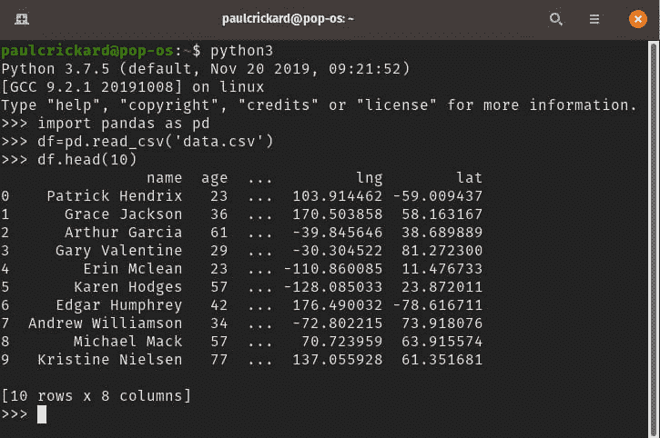

图 3.2 – 将 CSV 读取到 DataFrame 并打印 head()

你可以使用以下步骤在 Python 中创建一个 DataFrame：

1.  创建一个数据字典。字典是一种数据结构，它将数据存储为键：值对。值可以是任何 Python 数据类型 – 例如，一个数组。字典有用于查找 `keys()`、`values()` 和 `items()` 的方法。它们还允许你通过使用括号中的键名来查找键的值 – 例如，`dictionary['key']` 将返回该键的值：

    ```py
    data={'Name':['Paul','Bob','Susan','Yolanda'],
    'Age':[23,45,18,21]}
    ```

1.  将数据传递给 DataFrame：

    ```py
    df=pd.DataFrame(data)
    ```

1.  列被指定为字典中的键。现在你有了 DataFrame，你可以使用 `to_csv()` 方法并将文件名传递给它来将内容写入 CSV。在示例中，我们没有设置索引，这意味着行名将是从 0 到 *n* 的数字，其中 *n* 是 DataFrame 的长度。当你导出为 CSV 时，这些值将被写入文件，但列名将是空的。所以，在你不需要将行名或索引写入文件的情况下，将 `index` 参数传递给 `to_csv()`，如下所示：

    ```py
    df.to_csv('fromdf.CSV',index=False)
    ```

现在，你将有一个包含 DataFrame 内容的 CSV 文件。我们将在下一章中介绍如何使用此 DataFrame 的内容来执行 SQL 查询。它们将成为你工具箱中的重要工具，本书的其余部分将大量依赖它们。

现在，让我们继续下一节，你将学习另一种常见的文本格式 - **JSON**。

## 使用 Python 写入 JSON

你可能会处理另一种常见的数据格式 - `JSON–JSON`。

要使用 Python 和标准库写入 JSON，需要遵循以下步骤：

1.  导入库并打开你要写入的文件。你还需要创建 `Faker` 对象：

    ```py
    from faker import Faker
    import json
    output=open('data.JSON','w')
    fake=Faker()
    ```

1.  我们将创建 1,000 条记录，就像在 CSV 示例中做的那样，因此你需要创建一个字典来保存数据。如前所述，键的值可以是任何 Python 数据类型 - 包括值的数组。在创建保存记录的字典后，添加一个 `'records'` 键，并用一个空数组初始化，如下所示：

    ```py
    alldata={}
    alldata['records']=[]
    ```

1.  要写入记录，你使用 `Faker` 创建一个字典，然后将其追加到数组中：

    ```py
    for x in range(1000):
    	data={"name":fake.name(),"age":fake.random_int
               (min=18, max=80, step=1),
               "street":fake.street_address(),
               "city":fake.city(),"state":fake.state(),
               "zip":fake.zipcode(),
               "lng":float(fake.longitude()),
               "lat":float(fake.latitude())}
    	alldata['records'].append(data)	
    ```

1.  最后，要将 JSON 写入文件，使用 `JSON.dump()` 方法。传递要写入的数据和要写入的文件：

    ```py
    json.dump(alldata,output)
    ```

现在，你有一个包含 1,000 条记录的数组 `data.JSON` 文件。你可以通过以下步骤读取此文件：

1.  使用以下方式打开文件：

    ```py
    with open("data.JSON","r") as f:
    ```

1.  使用 `JSON.load()` 并将文件引用传递给该方法：

    ```py
    data=json.load(f)
    ```

1.  通过查看第一条记录来检查 json，使用以下方式：

    ```py
    data['records'][0]
    ```

    或者直接使用文件名：

    ```py
    data['records'][0]['name']
    ```

当你使用 `loads` 和 `dumps` 时，与 `load` 和 `dump` 不同。它们都是 JSON 库的有效方法。区别在于 `loads` 和 `dumps` 用于字符串 - 它们不会序列化 JSON。

### pandas DataFrame

使用 DataFrame 读取和写入 JSON 与我们处理 CSV 类似。唯一的区别是将 `to_csv` 改为 `to_json()`，将 `read_csv()` 改为 `read_json()`。

如果你有一个干净、格式良好的 JSON 文件，你可以使用以下代码读取它：

```py
df=pd.read_json('data.JSON')
```

在 `data.JSON` 文件的情况下，记录嵌套在一个 `records` 字典中。因此，加载 JSON 不像前面的代码那样直接。你需要额外的几个步骤，如下所示。要从文件加载 JSON 数据，请执行以下操作：

1.  使用 `pandas` 的 `JSON` 库：

    ```py
    import pandas.io.json as pd_JSON
    ```

1.  使用 `pandas` 版本的 `JSON.loads()` 打开文件并加载：

    ```py
    f=open('data.JSON','r')
    data=pd_JSON.loads(f.read())
    ```

1.  要创建 DataFrame，你需要规范化 JSON。规范化是将 JSON 展平以适应表格的过程。在这种情况下，你想要获取存储在 `records` 字典中的单个 JSON 记录。将此路径 - `records` - 传递给 `json_normalize()` 的 `record_path` 参数：

    ```py
    df=pd_JSON.json_normalize(data,record_path='records')
    ```

现在，你将有一个包含 `data.JSON` 文件中所有记录的 DataFrame。你现在可以使用 DataFrame 将它们写回 JSON 或 CSV。

在写入 JSON 时，你可以传递 `orient` 参数，该参数确定返回的 JSON 格式。默认为列，对于你在上一节中创建的 `data.JSON` 文件，它看起来如下所示的数据：

```py
>>> df.head(2).to_json()
'{"name":{"0":"Henry Lee","1":"Corey Combs DDS"},"age":{"0":42,"1":43},"street":{"0":"57850 Zachary Camp","1":"60066 Ruiz Plaza Apt. 752"},"city":{"0":"Lake Jonathon","1":"East Kaitlin"},"state":{"0":"Rhode Island","1":"Alabama"},"zip":{"0":"93363","1":"16297"},"lng":{"0":-161.561209,"1":123.894456},"lat":
{"0":-72.086145,"1":-50.211986}}'
```

通过将 `orient` 值更改为 `records`，你将得到 JSON 中的每一行作为一个记录，如下所示：

```py
>>> df.head(2).to_JSON(orient='records')
'[{"name":"Henry Lee","age":42,"street":"57850, Zachary Camp","city":"Lake Jonathon","state":"Rhode Island", "zip":"93363","lng":-161.561209,"lat":72.086145},{"name":"Corey Combs DDS","age":43,"street":"60066 Ruiz Plaza Apt. 752","city":"EastKaitlin","state":"Alabama","zip":"16297","lng":123.894456, "lat":-50.211986}]'
```

我发现，围绕 `records` 定向的 JSON 在 Airflow 等工具中处理起来比其他格式（如 split、index、columns、values 或 table）的 JSON 要容易得多。现在你已知道如何在 Python 中处理 CSV 和 JSON 文件，是时候学习如何使用 Airflow 和 NiFi 将任务组合成数据管道了。在下一节中，你将学习如何在 Apache Airflow 中构建管道。

# 构建 Apache Airflow 中的数据管道

Apache Airflow 使用 Python 函数以及 Bash 或其他操作符来创建可以组合成 **有向无环图**（**DAG**）的任务——这意味着每个任务在完成时都朝一个方向移动。Airflow 允许你组合 Python 函数来创建任务。你可以指定任务的运行顺序以及哪些任务依赖于其他任务。这种顺序和依赖性使其成为 DAG。然后，你可以在 Airflow 中安排你的 DAG 以指定 DAG 应该何时以及多久运行一次。使用 Airflow GUI，你可以监控和管理你的 DAG。通过使用前面章节中学到的知识，你现在将在 Airflow 中构建数据管道。

构建 CSV 到 JSON 数据管道

从一个简单的 DAG 开始将帮助你理解 Airflow 的工作原理，并有助于你添加更多函数来构建更好的数据管道。你构建的 DAG 将使用 Bash 打印一条消息，然后读取 CSV 并打印所有名称的列表。以下步骤将指导你构建数据管道：

1.  使用 Python IDE 或任何文本编辑器打开一个新文件。导入所需的库，如下所示：

    ```py
    import datetime as dt
    from datetime import timedelta
    from airflow import DAG
    from airflow.operators.bash_operator import BashOperator
    from airflow.operators.python_operator import PythonOperator
    import pandas as pd
    ```

    前两个导入引入了 `datetime` 和 `timedelta`。这些库用于安排 DAG。三个 Airflow 导入引入了构建 DAG 和使用 Bash 和 Python 操作符所需的库。这些是你将用于构建任务的操作符。最后，你导入 `pandas` 以便你可以轻松地在 CSV 和 JSON 之间进行转换。

1.  接下来，编写一个函数来读取 CSV 文件并打印出名称。通过结合之前章节中读取 CSV 数据和写入 JSON 数据的步骤，你可以创建一个函数，该函数读取 `data.CSV` 文件并将其写入 JSON，如下面的代码所示：

    ```py
    def CSVToJson():
        df=pd.read_CSV('/home/paulcrickard/data.CSV')
        for i,r in df.iterrows():
            print(r['name'])
        df.to_JSON('fromAirflow.JSON',orient='records')
    ```

    此函数在 DataFrame 中打开文件。然后，它遍历行，仅打印名称，最后将 CSV 写入 JSON 文件。

1.  现在，您需要实现管道的 Airflow 部分。指定将传递给 `DAG()` 的参数。在这本书中，您将使用一组最小的参数。本例中的参数分配了一个所有者、开始日期、失败时的重试次数以及重试前的等待时间。它们在以下字典中显示：

    ```py
    default_args = {
        'owner': 'paulcrickard',
        'start_date': dt.datetime(2020, 3, 18),
        'retries': 1,
        'retry_delay': dt.timedelta(minutes=5),
    }
    ```

1.  接下来，将参数字典传递给 `DAG()`。创建 DAG ID，设置为 `MyCSVDAG`，参数字典（前述代码中的 `default_args` 变量），以及调度间隔（数据管道的运行频率）。调度间隔可以使用 `timedelta` 设置，或者您可以使用以下预设或 crontab 格式：

    a) `@once`

    b) `@hourly` – `0 * * * *`

    c) `@daily` – `0 0 * * *`

    d) `@weekly` – `0 0 * * 0`

    e) `@monthly` – `0 0 1 * *`

    f) `@yearly` – `0 0 1 1 *`

    crontab 使用分钟、小时、月份中的天、月份、星期的格式。`@yearly` 的值为 `0 0 1 1 *`，这意味着在每年的 1 月 1 日（`1 1`）午夜运行，在星期的任何一天（`*`）。

    ```py
    with DAG('MyCSVDAG',
             default_args=default_args,
             schedule_interval=timedelta(minutes=5),      
             # '0 * * * *',
             ) as dag:
    ```

1.  您现在可以使用运算符来创建任务。Airflow 有几个预构建的运算符。您可以在文档中查看它们，链接为 [`airflow.apache.org/docs/stable/_api/airflow/operators/index.html`](https://airflow.apache.org/docs/stable/_api/airflow/operators/index.html)。在这本书中，您将主要使用 Bash、Python 和 Postgres 运算符。这些运算符允许您移除执行常见任务所需的大部分样板代码。在下面的代码片段中，您将使用 Bash 和 Python 运算符创建两个任务：

    ```py
        print_starting = BashOperator(task_id='starting',
                         bash_command='echo "I am reading the                       
                         CSV now....."')

        CSVJson = PythonOperator(task_id='convertCSVtoJson',
                                 python_callable=CSVToJson)
    ```

    以下代码片段使用 `BashOperator` 运算符创建了一个任务，该任务打印一条语句以通知您它正在运行。此任务除了允许您看到如何连接多个任务外，没有其他用途。下一个任务 `CSVJson` 使用 `PythonOperator` 运算符调用文件开头定义的函数（`CSVToJson()`）。该函数读取 `data.CSV` 文件并打印每一行的 `name` 字段。

1.  定义了任务后，您现在需要建立任务之间的连接。您可以使用 `set_upstream()` 和 `set_downstream()` 方法或使用位移运算符来完成此操作。通过使用上游和下游，您可以使用两个代码片段中的任何一个将图从 Bash 任务转换为 Python 任务；以下是最初的代码片段：

    ```py
    print_starting .set_downstream(CSVJson)
    ```

    下面的代码片段是第二个：

    ```py
    CSVJson.set_upstream(print_starting)
    ```

    使用位移运算符，您可以执行相同的操作；以下是一个选项：

    ```py
    print_starting >>  CSVJson
    ```

    以下是一个选项：

    ```py
    CSVJson << print_starting
    ```

    注意

    您选择哪种方法取决于您；然而，您应该保持一致。在这本书中，您将看到位移运算符设置下游。

1.  要在 GUI 中使用 Airflow 和调度器，您首先需要为您的 DAGs 创建一个目录。在上一章中安装和配置 Apache Airflow 时，我们删除了示例，因此 DAG 目录缺失。如果您查看 `airflow.cfg`，您将看到 `dags_folder` 的设置。它的格式是 `$AIRFLOW_HOME/dags`。在我的机器上，`$AIRFLOW_HOME` 是 `home/paulcrickard/airflow`。这是您将创建 `dags folder.e` 配置文件的目录，显示文件夹应该在哪里。

1.  将您的 DAG 代码复制到文件夹中，然后运行以下命令：

    ```py
    airflow webserver
    airflow scheduler
    ```

1.  通过打开您的网页浏览器并访问 `http://localhost:8080` 来启动 GUI。您将看到您的 DAG，如下面的截图所示：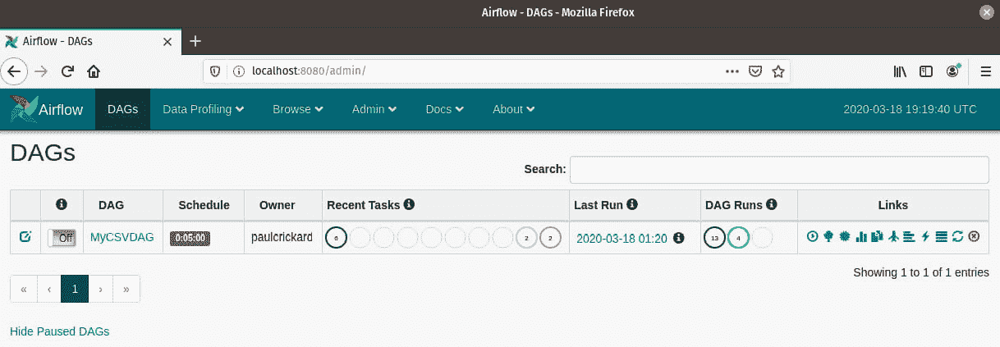

    图 3.3 – Airflow GUI 主屏幕显示 MyCSVDAG

1.  点击 **DAGs** 并选择 **树视图**。开启 DAG，然后点击 **Go**。随着任务的开始运行，您将看到每个运行的状况，如下面的截图所示：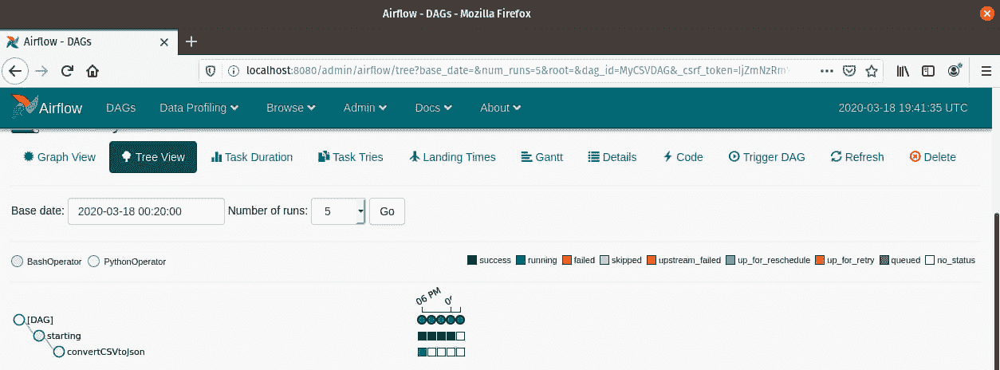

    图 3.4 – DAG 的多次运行和每个任务的状况

1.  您将看到已经成功运行 – 每个任务都运行成功了。但没有输出或结果。要查看结果，请点击其中一个已完成的方块，如下面的截图所示：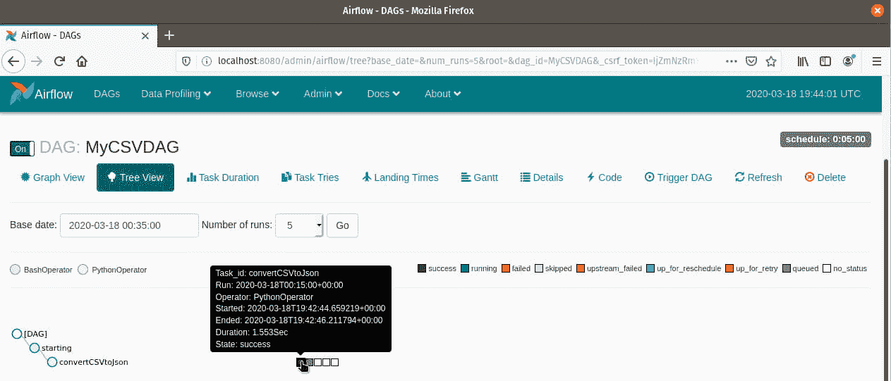

    图 3.5 – 通过悬停在已完成的任务上检查结果

1.  您将看到一个带有几个选项的弹出窗口。点击以下截图所示的 **查看日志** 按钮：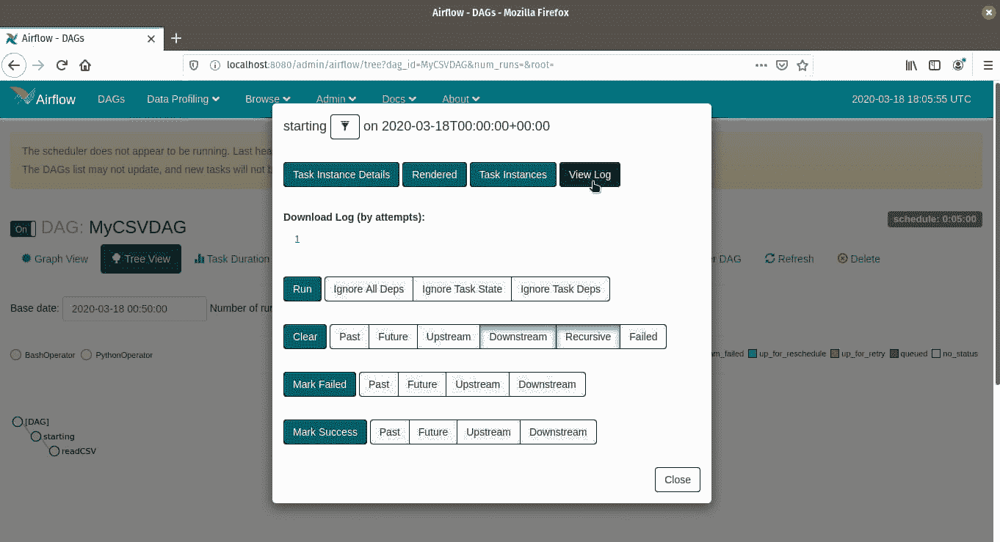

    图 3.6 – 选择查看日志以查看任务中发生的情况

1.  您将被重定向到任务的日志屏幕。查看 CSV 任务的成功运行，您应该看到一个类似于以下截图的日志文件：

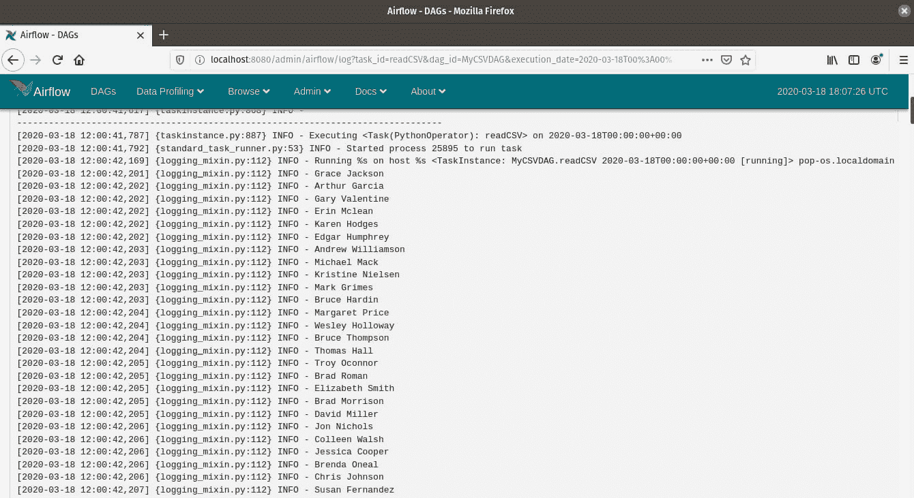

图 3.7 – Python 任务的日志显示正在打印的名称

恭喜！您已使用 Python 和 Airflow 构建了一个数据管道并成功运行。您的管道结果是一个 JSON 文件，位于 `dags` 目录中，该目录是从您的 `data.CSV` 文件创建的。您可以让它继续运行，它将在指定的 `schedule_interval` 时间继续运行。构建更高级的管道只需要您编写更多的函数并将它们通过相同的过程连接起来。但在您继续学习更高级的技术之前，您需要学习如何使用 Apache NiFi 来构建数据管道。

# 使用 NiFi 处理器处理文件

在前面的章节中，您学习了如何使用 Python 读取和写入 CSV 和 JSON 文件。读取文件是一项如此常见的任务，以至于像 NiFi 这样的工具已经预置了处理器来处理它。在本节中，您将学习如何使用 NiFi 处理器处理文件。

## 在 NiFi 中处理 CSV

在 NiFi 中处理文件比在 Python 中执行相同任务需要更多步骤。使用更多步骤和 NiFi 的好处包括，即使不知道代码的人也能查看您的数据管道并理解您正在做什么。您甚至可能会发现，当您将来回到管道时，更容易记住您当时试图做什么。此外，对数据管道的更改不需要重构大量代码；相反，您可以通过拖放重新排序处理器。

在本节中，您将创建一个数据管道，该管道读取您在 Python 中创建的`data.CSV`文件。它将运行针对 40 岁以上人群的查询，然后将该记录写入文件。

本节的结果如图所示：

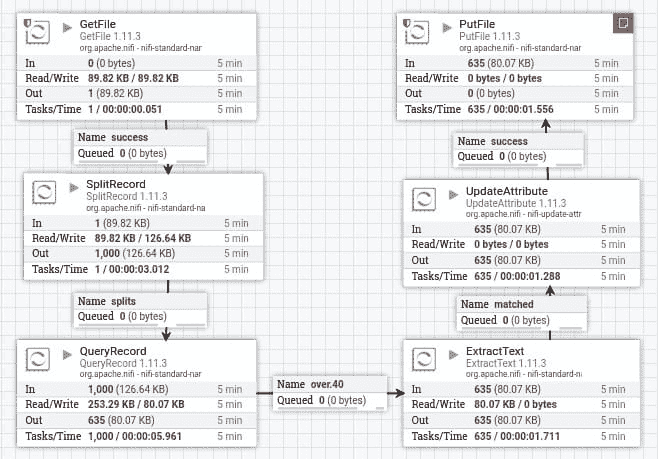

图 3.8 – 本节中您将构建的数据管道

以下章节将指导您构建数据管道。

### 使用 GetFile 读取文件

您的数据管道的第一步是读取`data.csv`文件。为此，请执行以下步骤：

1.  从 NiFi 工具栏拖动**处理器**图标到画布上。搜索**GetFile**并选择它。

1.  要配置`GetFile`处理器，您必须指定输入目录。在本章前面的 Python 示例中，我将`data.CSV`文件写入我的家目录，即`home/paulcrickard`，因此我将使用它作为输入目录。

1.  接下来，您需要指定一个文件过滤器。该字段允许使用 NiFi 表达式语言，因此您可以使用`[^\.].*\.CSV`——但在这个例子中，您可以将值设置为`data.csv`。

1.  最后，将**保留源文件**属性设置为**true**。如果您将其保留为**false**，NiFi 在处理完文件后将其删除。完整的配置如图所示：

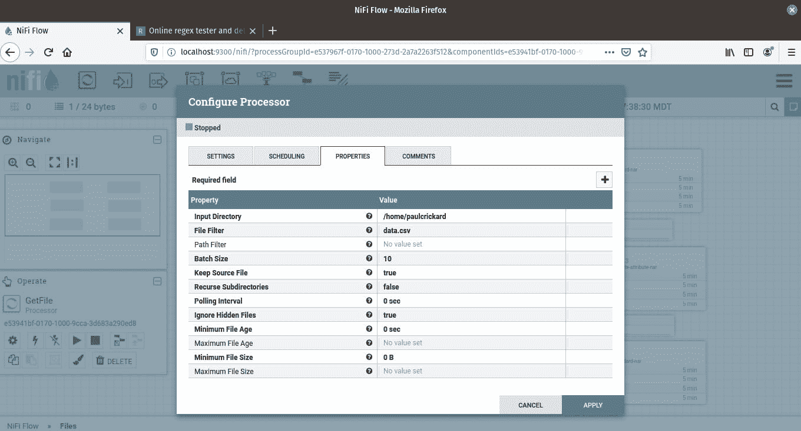

图 3.9 – GetFile 处理器配置

### 将记录分割成独立的 flowfiles

现在，您可以将`GetFile`处理器到`SplitRecord`处理器的成功关系传递：

1.  `SplitRecord`处理器将允许您将每一行分离成单独的 flowfile。将其拖放到画布上。您需要创建一个记录读取器和记录写入器——NiFi 已经预置了几个您可以选择配置的。点击**Record Reader**旁边的框，选择**创建新服务**，如图所示：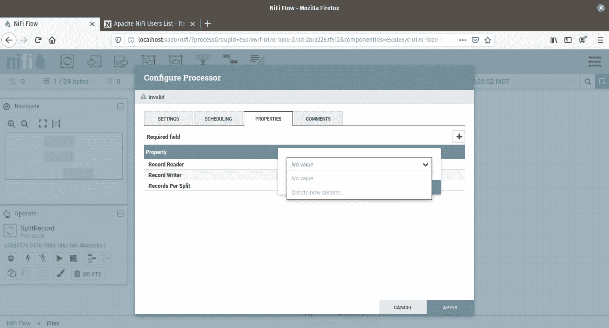

    图 3.10 – 可用读取器列表

1.  您需要选择读取器的类型。从下拉菜单中选择**CSVReader**。选择**Record Writer**的下拉菜单并选择**CSVRecordSetWriter**：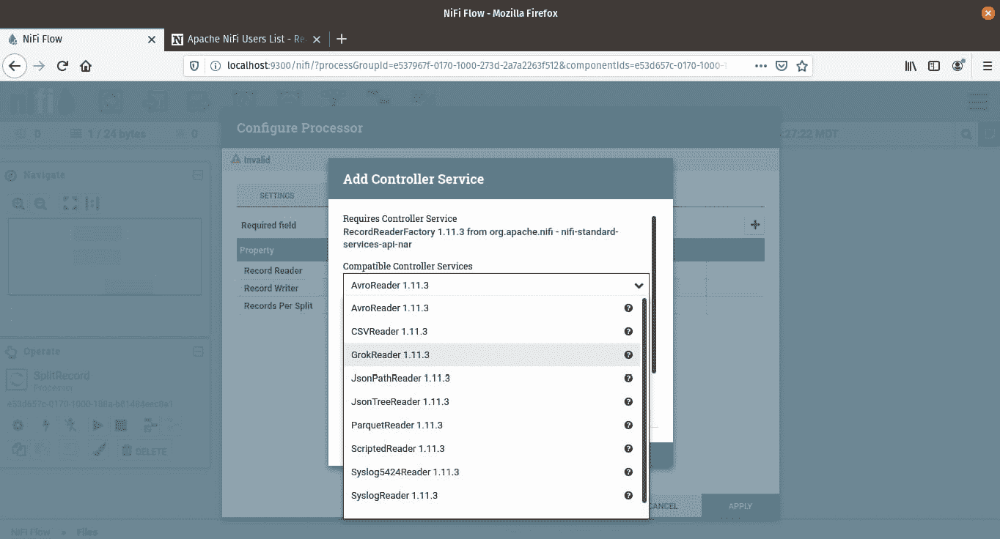

    图 3.11 – 可用读取器的列表

1.  要配置**CSVReader**和**CSVRecordSetWriter**，点击任一右侧的箭头。这将打开**CONTROLLER SERVICES**选项卡上的**文件配置**窗口。您将看到以下截图所示的屏幕：

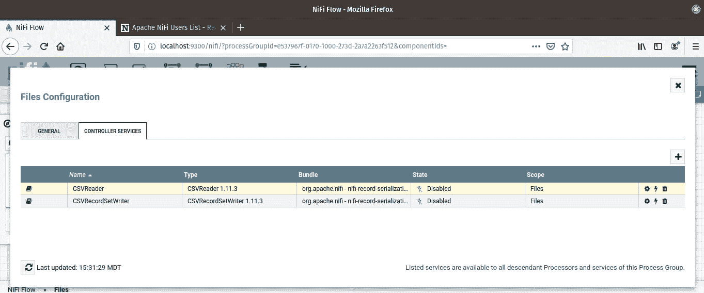

图 3.12 – 配置读取器和写入器

右侧的三个图标如下：

+   一个齿轮用于设置

+   用于启用和禁用服务的闪电符号（目前处于禁用状态）

+   一个垃圾桶用于删除它

选择**CSVReader**的齿轮。默认配置将工作，除了**Treat First Line as Header**属性，应设置为**true**。点击**CSVRecordSetWriter**的齿轮，您可以看到可用的属性。在这个例子中，默认值足够。现在，点击闪电符号以启用服务。

### 使用 QueryRecord 处理器过滤记录

您现在有一个管道，可以读取 CSV 并将行拆分为单独的 flowfile。现在您可以使用`QueryRecord`处理器处理每一行。此处理器将允许您对 flowfile 执行 SQL 命令。新 flowfile 的内容将是 SQL 查询的结果。在这个例子中，您将选择所有年龄超过 40 岁的人的记录：

1.  将`QueryRecord`处理器拖放到画布上。要查询 flowfile，您需要指定一个记录读取器和写入器。您已经创建了一个，现在它们都可在下拉菜单中找到。**Include Zero Record FlowFiles**属性应设置为**false**。此属性将不符合条件的记录路由到相同的关系（您不希望这样做）。

1.  最后，点击右上角的加号并在弹出窗口中指定一个属性名称。当您从这个处理器创建连接时，属性名称将成为一个关系。将属性命名为`over.40`。然后，将出现值弹出窗口。这就是您将输入 SQL 查询的地方。查询的结果将成为 flowfile 的内容。由于您想要 40 岁以上的人的记录，查询如下：

    ```py
    Select * from FlowFile where age > 40
    ```

    `Select` `*` 查询返回整个 flowfile。如果您只想获取人的姓名并且字段为`full_name`，您可以运行以下 SQL：

    ```py
    Select name as full_name from FlowFile where age > 40
    ```

我在这里试图强调的是，您可以执行 SQL 并修改 flowfile 的内容，使其不同于行内容 – 例如，运行聚合和分组。

### 从 flowfile 中提取数据

下一个处理器将从 flowfile 中提取一个值。该处理器是 `ExtractText`。该处理器可用于包含文本的任何 flowfile，并使用正则表达式从 flowfile 中提取任何数据并将其分配给属性。

要配置处理器，点击加号并命名属性。你将从 flowfile 中提取人名，因此你可以命名属性为 name。值将是正则表达式，应该如下所示：

```py
\n([^,]*),
```

没有完整的正则表达式教程，前面的正则表达式语句查找换行符和逗号 – `\n` 和结尾的逗号 – 并抓取其间的文本。括号表示取文本并返回任何不是 `^` 或逗号的字符。这个正则表达式返回的是人的名字。Flowfile 包含 CSV 字段名的标题，一个换行符，然后是 CSV 中的值。`name` 字段是第二行的第一个字段 – 在换行符之后，在指定 `name` 字段结束的第一个逗号之前。这就是为什么正则表达式查找换行符和逗号之间的文本。

### 修改 flowfile 属性

现在你已经将人名作为属性提取出来，你可以使用 `UpdateAttribute` 处理器来更改现有属性值。通过使用此处理器，你将修改 NiFi 在 `GetFile` 处理器一开始提供的默认文件名属性。每个 flowfile 都将具有 `data.CSV` 的文件名。如果你尝试将 flowfiles 写入 CSV，它们都将具有相同的名称，并且可能会覆盖或失败。

在 `UpdateAttribute` 处理器的配置中点击加号并命名新属性文件名。值将使用 NiFi 表达式语言。在表达式语言中，你可以使用格式 `${attribute name}` 来获取属性的值。因此，要使用 name 属性，将值设置为 `${name}`。

### 将 flowfile 保存到磁盘

使用 `PutFile` 处理器，你可以将 flowfile 的内容写入磁盘。要配置处理器，你需要指定一个写入文件的目录。我将继续使用我的家目录。

接下来，你可以指定一个冲突解决策略。默认情况下，它将被设置为失败，但它允许你覆盖现有文件。如果你运行这个数据管道，每小时聚合数据并将结果写入文件，你可能将属性设置为覆盖，以便文件始终包含最新的数据。默认情况下，flowfile 将写入磁盘上的文件，文件名为属性文件名。

### 在处理器之间建立关系

最后一步是为处理器之间的指定关系建立连接：

1.  捕获 `GetFile` 处理器，将箭头拖到 `SplitRecord` 处理器，并在弹出窗口中检查关系成功。

1.  从 `SplitRecord` 处理器连接到 `QueryRecord` 处理器，并选择关系拆分。这意味着任何被拆分的记录将被发送到下一个处理器。

1.  从 `QueryRecord` 连接到 `ExtractText` 处理器。注意你创建的关系被命名为 `over.40`。如果你添加了更多的 SQL 查询，你会得到更多的关系。对于这个例子，使用 `over.40` 关系。

1.  将 `ExtractText` 连接到匹配关系的 `UpdateAttribute` 处理器。

1.  最后，将 `UpdateAttribute` 连接到 `PutFile` 处理器以成功处理关系。

数据管道现在已完成。你可以点击每个处理器并选择**运行**来启动它 – 或者点击操作窗口中的运行图标来一次性启动所有处理器。

当管道完成时，你将有一个包含所有超过 40 岁的人的行的目录。在 1,000 条记录中，我有 635 个以每个人命名的 CSV 文件。你将根据 `Faker` 使用的年龄值得到不同的结果。

本节向你展示了如何读取 CSV 文件。你还学习了如何将文件拆分为行并对它们进行查询，以及如何修改流文件的属性并在另一个处理器中使用它。在下一节中，你将使用 JSON 构建另一个数据管道。

## 在 NiFi 中处理 JSON

尽管结构不同，在 NiFi 中处理 JSON 与处理 CSV 非常相似。然而，有几个处理器专门用于处理 JSON。在本节中，你将构建一个类似于 CSV 示例的流程 – 读取一个文件，将其拆分为行，并将每一行写入一个文件 – 但你将在管道中对数据进行一些修改，以便写入磁盘的行与原始文件中的不同。以下图显示了完成的数据管道：

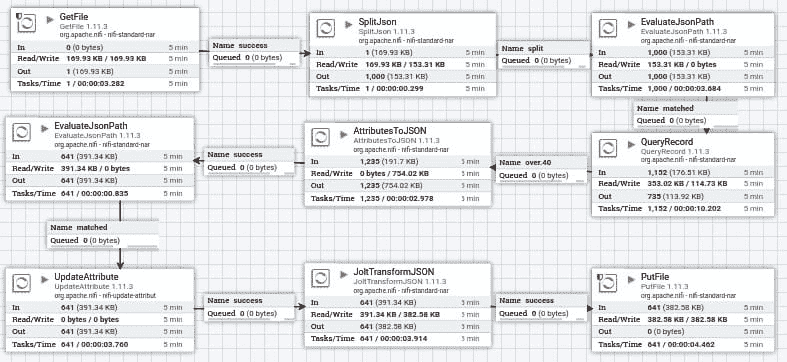

图 3.13 – 完成的 JSON 数据管道

要构建数据管道，请按照以下步骤操作：

1.  将 `GetFile` 处理器放置到画布上。要配置处理器，指定 `home/paulcrickard` – 和 `data.JSON`。

1.  在 CSV 示例中，你使用了 `SplitRecord` 处理器。这里，对于 JSON，你可以使用 `SplitJson` 处理器。你需要配置 **JsonPath 表达式**属性。此属性正在寻找包含 JSON 元素的数组。JSON 文件格式如下：

    ```py
    {"records":[ { } ] }
    ```

    因为每个记录都在一个数组中，你可以将以下值传递给 **JsonPath 表达式**属性：

    ```py
    $.records
    ```

    这将拆分数组内的记录，这是你想要的结果。

1.  记录现在将成为单独的 flowfile。你将文件传递给`EvaluateJsonPath`处理器。此处理器允许你从 flowfile 中提取值。你可以将结果传递到 flowfile 内容或属性中。设置`flowfile-attribute`的值。然后你可以选择使用加号创建的属性。你需要为属性命名，然后指定值。值是 JSON 路径，你使用格式`$.key`。配置的处理器如下面的截图所示：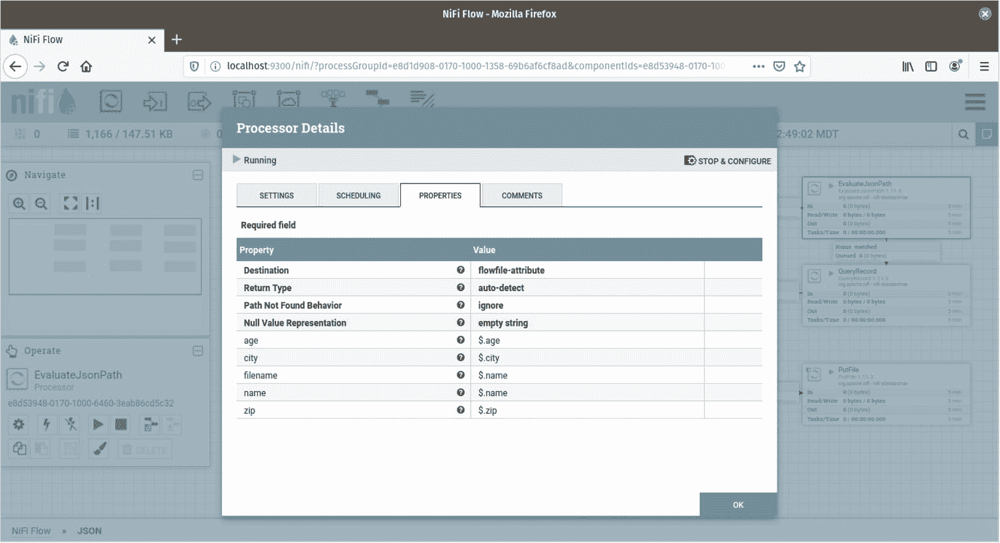

    图 3.14 – 从 flowfile 中提取值的配置

    这些属性不会随着 flowfile 流经数据管道。

1.  现在，你可以使用`QueryRecord`处理器，就像你在 CSV 示例中所做的那样。与 JSON 的区别在于你需要创建一个新的记录读取器和记录集写入器。选择创建新服务的选项。选择`over.40`并将值设置为以下内容：

    ```py
    Select * from FlowFile where age > 40
    ```

1.  下一个处理器是`AttributesToJSON`处理器。此处理器允许你用在*步骤 3*中显示的`EvaluateJsonPath`处理器中提取的属性替换 flowfile 内容。设置`flowfile-content`。此处理器还允许你在**属性列表**属性中指定以逗号分隔的属性列表。如果你只想使用某些属性，这可能会很有用。在这个例子中，你将其留空，并且一些你没有提取的属性将被添加到 flowfile 内容中。NiFi 写入的所有元数据属性现在将成为 flowfile 的一部分。flowfile 现在将看起来如下面的片段所示：

    ```py
    ### Run it at night ###
    ```

1.  再次使用`EvalueJsonPath`处理器，你将创建一个名为`uuid`的属性。现在 NiFi 的元数据已经在 flowfile 中，你有 flowfile 的唯一 ID。请确保设置`flowfile-attribute`。你现在将提取它，以便将其传递给下一个处理器`UpdateAttribute`。

1.  在 CSV 示例中，你使用`UpdateAttribute`处理器更新了文件名。你在这里也将这样做。点击加号并添加一个名为`filename`的属性。将值设置为`${uuid}`。

1.  使用 NiFi 修改 JSON 的一种方法是通过 flowfile 中的`zip`字段。

1.  最后，使用`PutFile`处理器将每一行写入磁盘。配置**目录**和**冲突解决策略**属性。通过将**冲突解决策略**属性设置为**忽略**，处理器在已经处理了具有相同名称的文件时不会警告你。

创建处理器之间的连接和关系：

+   将`GetFile`连接到`SplitJson`以实现关系成功。

+   将`SplitJson`连接到`EvaluateJsonPath`以实现关系拆分。

+   将`EvaluateJsonPath`连接到`QueryRecord`以实现关系匹配。

+   将`QueryRecord`连接到`AttributesToJSON`以实现关系`over.40`。

+   将`AttributesToJSON`连接到`UpdateAttribute`以实现关系成功。

+   将`UpdateAttributes`连接到`JoltTransformJSON`以实现关系成功。

+   将`JoltTransformJSON`连接到`PutFile`以实现关系成功。

通过启动每个处理器或在操作框中点击**运行**来运行数据管道。完成后，你将在磁盘上拥有一个包含 1,000 个文件的子集——所有 40 岁以上的人——并且按其唯一 ID 命名。

# 摘要

在本章中，你学习了如何使用 Python 处理 CSV 和 JSON 文件。通过这项新技能，你通过创建一个 Python 函数来处理 CSV 并将其转换为 JSON，在 Apache Airflow 中创建了一个数据管道。你现在应该对 Airflow GUI 以及如何运行 DAGs 有一个基本的了解。你还学习了如何使用处理器在 Apache NiFi 中构建数据管道。构建更高级数据管道的过程是相同的，你将在本书的其余部分学习完成此任务所需的所有技能。

在下一章中，你将学习如何使用 Python、Airflow 和 NiFi 读取和写入数据库中的数据。你将学习如何使用 PostgreSQL 和 Elasticsearch。使用两者将让你接触到可以使用 SQL 查询的标准关系型数据库，以及允许你存储文档并使用它们自己的查询语言的 NoSQL 数据库。
