# 第四章：*第四章*：与数据库一起工作

在上一章中，你学习了如何读取和写入文本文件。从数据湖中读取日志文件或其他文本文件并将它们移动到数据库或数据仓库是数据工程师的常见任务。在本章中，你将使用你在处理文本文件时获得的技能，并学习如何将数据移动到数据库中。本章还将教你如何从关系型和 NoSQL 数据库中提取数据。到本章结束时，你将具备使用 Python、NiFi 和 Airflow 与数据库一起工作的技能。你的大多数数据管道很可能以数据库结束，并且很可能以数据库开始。有了这些技能，你将能够构建可以提取和加载，以及开始和结束于关系型和 NoSQL 数据库的数据管道。

在本章中，我们将涵盖以下主要主题：

+   在 Python 中插入和提取关系型数据

+   在 Python 中插入和提取 NoSQL 数据库数据

+   在 Airflow 中构建数据库管道

+   在 NiFi 中构建数据库管道

# 在 Python 中插入和提取关系型数据

当你听到“数据库”这个词时，你可能想象的是一个关系型数据库——也就是说，由包含列和行的表组成，这些表之间存在关系；例如，一个包含库存、采购和客户信息的采购订单系统。关系型数据库已经存在了 40 多年，起源于 20 世纪 70 年代末由 E. F. Codd 开发的关系数据模型。有几个关系型数据库的供应商——包括 IBM、Oracle 和 Microsoft——但所有这些数据库都使用类似的 **SQL** 方言，它代表 **结构化查询语言**。在这本书中，你将使用一个流行的开源数据库——**PostgreSQL**。在下一节中，你将学习如何创建数据库和表。

### 创建 PostgreSQL 数据库和表

在*第二章*，*构建我们的数据工程基础设施*中，你使用 pgAdmin 4 在 PostgreSQL 中创建了一个数据库。该数据库命名为 `dataengineering`，你创建了一个名为 `users` 的表，其中包含名称、街道、城市、ZIP 和 ID 列。数据库在以下屏幕截图中显示：

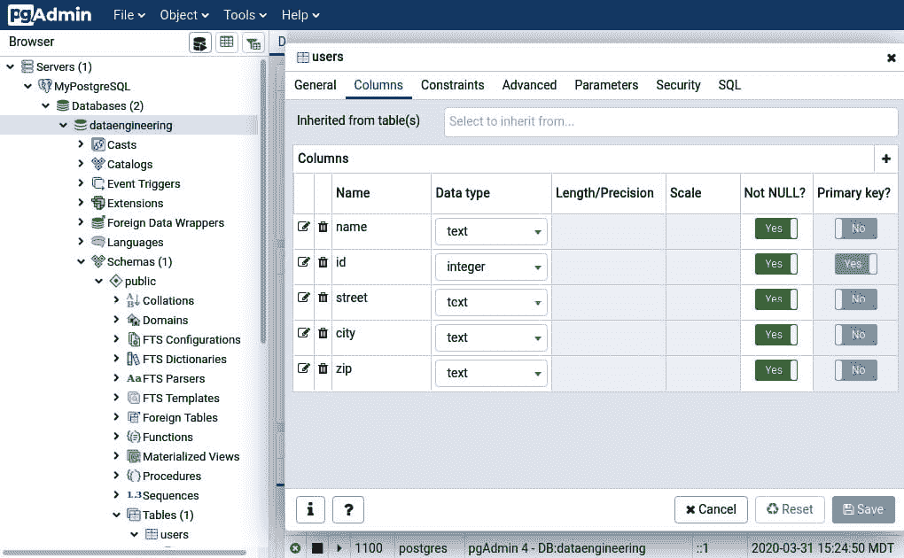

图 4.1 – 数据工程数据库

如果你已经创建了数据库，你可以跳过这一部分，但如果你没有，这一部分将快速带你通过创建数据库的过程。

要使用 pgAdmin 4 在 PostgreSQL 中创建数据库，请按照以下步骤操作：

1.  浏览到 `http://localhost/pgadmin4` 并使用你在*第二章*，*构建我们的数据工程基础设施*安装 `pgAdmin` 时创建的账户登录。

1.  在 **浏览器** 面板中展开服务器图标。右键单击 **MyPostgreSQL** 图标，然后选择 **创建** | **数据库**。

1.  将数据库命名为 `dataengineering`。您可以保留用户为 `postgres`。

1.  展开 `dataengineering` 图标，然后展开 **Schemas**，然后 **public**，然后 **Tables**。右键单击 **Tables**，然后点击 **创建** | **表**。

1.  将表命名为 `users`。点击 `name`: `text`

    b) `id`: `integer`

    c) `street`: `text`

    d) `city`: `text`

    e) `zip`: `text`

现在，您已在 PostgreSQL 中创建了一个数据库和一个表，可以使用 Python 加载数据。您将在下一节中填充该表。

## 将数据插入到 PostgreSQL 中

在 Python 中连接到数据库有几个库和方法 – `pyodbc`、`sqlalchemy`、`psycopg2`，以及使用 API 和请求。在这本书中，我们将使用 `psycopg2` 库来连接到 PostgreSQL，因为它专门用于连接 PostgreSQL。随着您技能的提高，您可能想了解像 **SQLAlchemy** 这样的工具。SQLAlchemy 是一个用于 Python 的工具包和对象关系映射器。它允许您以更 Pythonic 的方式执行查询 – 不使用 SQL – 并将 Python 类映射到数据库表。

### 安装 psycopg2

您可以通过运行以下命令来检查您是否已安装 `psycopg2`：

```py
python3 -c "import psycopg2; print(psycopg2.__version__)"
```

上述命令以命令标志运行 `python3`。标志告诉 Python 将命令作为 Python 程序运行。引号中的文本导入 `psycopg2` 并打印版本。如果您收到错误，则表示未安装。您应该看到一个类似于 2.8.4 的版本，后面跟一些括号中的文本。该库应在安装 Apache Airflow 时已安装，因为您使用了 *第二章*，*构建我们的数据工程基础设施* 中提到的所有附加库。

如果它尚未安装，您可以使用以下命令添加它：

```py
pip3 install psycopg2
```

使用 `pip` 需要存在额外的依赖项才能正常工作。如果您遇到问题，您还可以使用以下命令安装预编译的二进制版本：

```py
pip3 install psycopg2-binary
```

这两种方法中的一种将安装库并使其准备好我们开始下一节。

### 使用 Python 连接到 PostgreSQL

要使用 `psycopg2` 连接到数据库，您需要创建一个连接、创建一个游标、执行一个命令并获取结果。无论您是查询还是插入数据，您都会采取相同的步骤。让我们按以下步骤进行：

1.  导入库并将其引用为 `db`：

    ```py
    import psycopg2 as db
    ```

1.  创建一个包含主机、数据库、用户名和密码的连接字符串：

    ```py
    conn_string="dbname='dataengineering' host='localhost' user='postgres' password='postgres'"
    ```

1.  通过将连接字符串传递给 `connect()` 方法来创建连接对象：

    ```py
    conn=db.connect(conn_string)
    ```

1.  接下来，从连接创建游标：

    ```py
    cur=conn.cursor()
    ```

您现在已连接到数据库。从这里，您可以发出任何 SQL 命令。在下一节中，您将学习如何将数据插入到 PostgreSQL 中。

### 插入数据

现在你已经打开了连接，你可以使用 SQL 插入数据。要插入单个人员，你需要格式化一个 SQL `insert` 语句，如下所示：

```py
query = "insert into users (id,name,street,city,zip) values({},'{}','{}','{}','{}')".format(1,'Big Bird','Sesame Street','Fakeville','12345')
```

要查看此查询的外观，你可以使用 `mogrify()` 方法。

什么是 mogrify？

根据 `psycopg2` 文档，`mogrify` 方法将在参数绑定后返回一个查询字符串。返回的字符串正是将要发送到运行 `execute()` 方法或类似方法的数据库中的字符串。简而言之，它返回格式化的查询。这很有用，因为你可以看到你发送到数据库的内容，因为你的 SQL 查询通常可能是错误的一个来源。

将你的查询传递给 `mogrify` 方法：

```py
cur.mogrify(query)
```

上述代码将创建一个正确的 SQL `insert` 语句；然而，随着你的进步，你将在单个语句中添加多条记录。要这样做，你需要创建一个元组的元组。要创建相同的 SQL 语句，你可以使用以下代码：

```py
query2 = "insert into users (id,name,street,city,zip) values(%s,%s,%s,%s,%s)"
data=(1,'Big Bird','Sesame Street','Fakeville','12345')
```

注意，在 `query2` 中，你不需要在作为参数传递的字符串周围添加引号，就像你在使用 `{}` 时在 `query` 中做的那样。使用前面的格式，`psycopg2` 将处理查询字符串中的类型映射。要查看执行查询时的查询外观，你可以使用 `mogrify` 并将数据与查询一起传递：

```py
cur.mogrify(query2,data)
```

`mogrify` 对 `query` 和 `query2` 的结果应该是相同的。现在，你可以执行查询并将其添加到数据库中：

```py
cur.execute(query2,data)
```

如果你回到 pgAdmin 4，右键点击 `insert` 语句，你需要通过以下代码提交事务使其永久化：

```py
conn.commit()
```

现在，在 pgAdmin 4 中，你应该能够看到记录，如下面的截图所示：

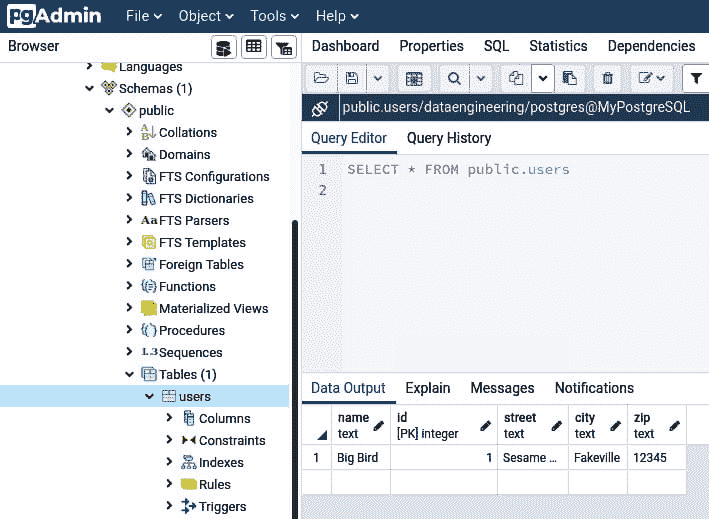


记录现在已添加到数据库中，并在 pgAdmin 4 中可见。现在你已经输入了一条记录，下一节将展示如何输入多条记录。

### 插入多条记录

要插入多条记录，你可以遍历数据并使用前面章节中显示的相同代码，但这需要在数据库中为每条记录进行一次事务。更好的方法是使用单个事务并发送所有数据，让 `psycopg2` 处理批量插入。你可以通过使用 `executemany` 方法来完成此操作。以下代码将使用 `Faker` 创建记录，然后使用 `executemany()` 插入它们：

1.  导入所需的库：

    ```py
    import psycopg2 as db
    from faker import Faker
    ```

1.  创建 `faker` 对象和一个数组来存储所有数据。你将初始化一个变量 `i` 来存储 ID：

    ```py
    fake=Faker()
    data=[]
    i=2
    ```

1.  现在，你可以查看、迭代，并将一个假元组追加到你在上一步创建的数组中。为下一条记录递增 `i`。记住，在前面章节中，你为 `Big Bird` 创建了一个 ID 为 `1` 的记录。这就是为什么在这个例子中你会从 `2` 开始。数据库表中的主键不能相同：

    ```py
    for r in range(1000):
        data.append((i,fake.name(),fake.street_address(),
                   fake.city(),fake.zipcode()))
        i+=1
    ```

1.  将数组转换为元组的元组：

    ```py
    data_for_db=tuple(data)
    ```

1.  现在，你回到了 `psycopg` 代码，它将类似于上一节的示例：

    ```py
    conn_string="dbname='dataengineering' host='localhost' user='postgres' password='postgres'"
    conn=db.connect(conn_string)
    cur=conn.cursor()
    query = "insert into users (id,name,street,city,zip) values(%s,%s,%s,%s,%s)"
    ```

1.  你可以使用 `data_for_db` 变量中的一个单个记录打印出代码将发送到数据库的内容：

    ```py
    print(cur.mogrify(query,data_for_db[1]))
    ```

1.  最后，使用 `executemany()` 而不是 `execute()` 来让库处理多个插入。然后，提交事务：

    ```py
    cur.executemany(query,data_for_db)
    conn.commit()
    ```

现在，你可以在 pgAdmin 4 中查看 1,000 条记录。你的数据将类似于以下截图所示：

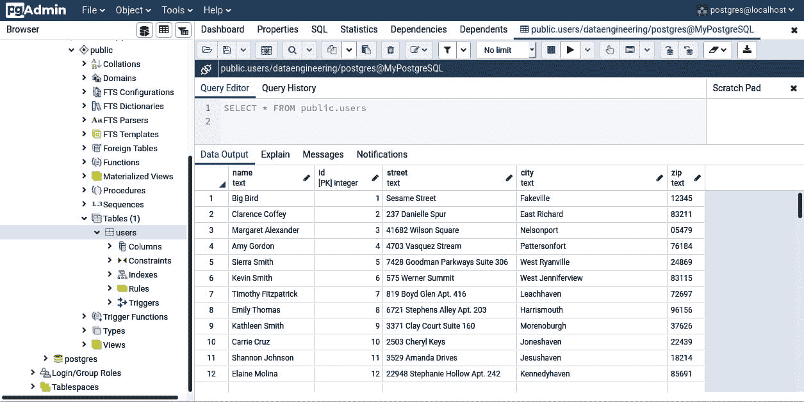

图 4.3 – 数据库中添加了 1,000 条记录

你的表现在应该有 1,001 条记录。现在，你可以在 PostgreSQL 中插入数据，下一节将展示如何在 Python 中查询它。

### 从 PostgreSQL 提取数据

使用 `psycopg2` 提取数据遵循与插入完全相同的程序，唯一的区别在于你将使用 `select` 语句而不是 `insert`。以下步骤展示了如何提取数据：

1.  导入库，然后设置你的连接和游标：

    ```py
    import psycopg2 as db
    conn_string="dbname='dataengineering' host='localhost' user='postgres' password='postgres'"
    conn=db.connect(conn_string)
    cur=conn.cursor()
    ```

1.  现在，你可以执行一个查询。在这个例子中，你将选择 `users` 表中的所有记录：

    ```py
    query = "select * from users"
    cur.execute(query)
    ```

1.  现在，你有一个包含结果的可迭代对象。你可以像下面这样遍历游标：

    ```py
    for record in cur:
        print(record)
    ```

1.  或者，你也可以使用 `fetch` 中的任何一种方法：

    ```py
    cur.fetchall()
    cur.fetchmany(howmany)  # where howmany equals the number of records you want returned 
    cur.fetchone()
    ```

1.  要获取单个记录，你可以将其分配给一个变量并查看它。请注意，即使你选择了一个记录，游标也会返回一个数组：

    ```py
    data=cur.fetchone()
    print(data[0])
    ```

1.  无论你是获取一个还是多个，你都需要知道你在哪里以及有多少条记录。你可以使用以下代码获取查询的行数：

    ```py
    cur.rowcount
    # 1001
    ```

1.  你可以使用 `rownumber` 获取当前行号。如果你使用 `fetchone()` 然后再次调用 `rownumber`，它应该随着你的新位置递增：

    ```py
    cur.rownumber
    ```

    最后要提到的是，你也可以使用 `copy_to()` 方法查询一个表并将其写入 CSV 文件。

1.  创建连接和游标：

    ```py
    conn=db.connect(conn_string)
    cur=conn.cursor()
    ```

1.  打开一个文件以将表写入：

    ```py
    f=open('fromdb.csv','w')
    ```

1.  然后，调用 `copy_to` 并传递文件、表名和分隔符（如果你不包括它，将默认为制表符）。关闭文件，你将拥有所有行的 CSV 文件：

    ```py
    cur.copy_to(f,'users',sep=',')
    f.close()
    ```

1.  你可以通过打开文件并打印内容来验证结果：

    ```py
    f=open('fromdb.csv','r')
    f.read()
    ```

现在你已经知道如何使用 `psycopg2` 库读取和写入数据库，你也可以使用 DataFrame 读取和写入数据，你将在下一节中学习。

#### 使用 DataFrame 提取数据

你也可以使用 `pandas` DataFrame 查询数据。为此，你需要使用 `psycopg2` 建立连接，然后你可以跳过游标直接进行查询。DataFrame 在过滤、分析和转换数据方面为你提供了很多功能。以下步骤将指导你使用 DataFrame：

1.  设置连接：

    ```py
    import psycopg2 as db
    import pandas as pd
    conn_string="dbname='dataengineering' host='localhost' user='postgres' password='postgres'"
    conn=db.connect(conn_string)
    ```

1.  现在，你可以在 DataFrame 中使用 `pandas` 的 `read_sql()` 方法执行查询。该方法接受一个查询和一个连接：

    ```py
    df=pd.read_sql("select * from users", conn)
    ```

1.  结果是一个包含完整用户表的 DataFrame，`df`。现在您可以使用所有 DataFrame 工具来处理数据——例如，您可以使用以下代码将其导出为 JSON：

    ```py
    df.to_json(orient='records')
    ```

现在您已经知道如何处理关系型数据库中的数据，是时候学习 NoSQL 数据库了。下一节将向您展示如何使用 Python 与 Elasticsearch 一起工作。

# 在 Python 中插入和提取 NoSQL 数据库数据

当您听到数据库这个词时，可能会想到关系型数据库，但还有几种其他类型的数据库，例如列式、键值和时间序列。在本节中，您将学习如何使用 Elasticsearch，它是一个 NoSQL 数据库。NoSQL 是一个通用术语，指的是不按行和列存储数据的数据库。NoSQL 数据库通常将数据存储为 JSON 文档，并使用除 SQL 之外的其他查询语言。下一节将教您如何将数据加载到 Elasticsearch 中。

## 安装 Elasticsearch

要安装`elasticsearch`库，您可以使用`pip3`，如下所示：

```py
pip3 install elasticsearch
```

使用`pip`将安装最新版本，如果您按照*第二章*中“构建我们的数据工程基础设施”的说明安装了 Elasticsearch，那么这就是您所需要的。您可以为 Elasticsearch 版本 2、5、6 和 7 获取库。要验证安装并检查版本，您可以使用以下代码：

```py
import elasticsearch
elasticsearch.__version__
```

上述代码应该打印出类似以下内容：

```py
(7.6.0)
```

如果你有适合您 Elasticsearch 版本的正确版本，您就可以开始导入数据了。

## 将数据插入 Elasticsearch

在您能够查询 Elasticsearch 之前，您需要将一些数据加载到索引中。在上一个章节中，您使用了`psycopg2`库来访问 PostgreSQL。要访问 Elasticsearch，您将使用`elasticsearch`库。要加载数据，您需要创建连接，然后您可以向 Elasticsearch 发出命令。按照以下步骤向 Elasticsearch 添加记录：

1.  导入库。您还可以创建`Faker`对象以生成随机数据：

    ```py
    from elasticsearch import Elasticsearch
    from faker import Faker
    fake=Faker()
    ```

1.  创建到 Elasticsearch 的连接：

    ```py
    es = Elasticsearch()
    ```

1.  上一段代码假设您的`Elasticsearch`实例正在`localhost`上运行。如果不是，您可以指定 IP 地址，如下所示：

    ```py
    es=Elasticsearch({'127.0.0.1'})
    ```

现在，您可以向您的`Elasticsearch`实例发出命令。`index`方法将允许您添加数据。该方法接受索引名称、文档类型和正文。正文是发送到 Elasticsearch 的内容，是一个 JSON 对象。以下代码创建一个 JSON 对象以添加到数据库，然后使用`index`将其发送到`users`索引（该索引将在索引操作期间自动创建）：

```py
doc={"name": fake.name(),"street": fake.street_address(), "city": fake.city(),"zip":fake.zipcode()}
res=es.index(index="users",doc_type="doc",body=doc)
print(res['result']) #created
```

上一段代码应在控制台打印出单词 `created`，这意味着文档已被添加。Elasticsearch 返回一个包含结果键的对象，这将告诉你操作是否失败或成功。在这种情况下，`created` 表示索引操作成功并在索引中创建了文档。就像本章前面提到的 PostgreSQL 示例一样，你可以迭代并运行 `index` 命令，或者你可以使用批量操作让库为你处理所有插入。

### 使用助手插入数据

使用 `bulk` 方法，你可以一次插入多个文档。这个过程与插入单个记录类似，只是你需要生成所有数据，然后插入。步骤如下：

1.  你需要导入 `helpers` 库来访问 `bulk` 方法：

    ```py
    from elasticsearch import helpers
    ```

1.  数据需要是一个 JSON 对象数组。在之前的例子中，你创建了一个具有属性的 JSON 对象。在这个例子中，对象需要一些额外的信息。你必须指定索引和类型。名称中的下划线用于 Elasticsearch 字段。`_source` 字段是你要将 JSON 文档插入数据库的地方。JSON 外面有一个 `for` 循环。这个循环创建了 999 个文档（你已经添加了一个，索引从 0 到 998）：

    ```py
    actions = [
      {
        "_index": "users",
        "_type": "doc",
        "_source": {
    	"name": fake.name(),
    	"street": fake.street_address(), 
    	"city": fake.city(),
    	"zip":fake.zipcode()}
      }
      for x in range(998) # or for i,r in df.iterrows()
    ]
    ```

1.  现在，你可以调用 `bulk` 方法并传递 `elasticsearch` 实例和数据数组。你可以打印结果以检查是否成功：

    ```py
    res = helpers.bulk(es, actions)
    print(res['result'])
    ```

现在，你应该在名为 `users` 的 Elasticsearch 索引中拥有 1,000 条记录。我们可以在 Kibana 中验证这一点。要将新索引添加到 Kibana，浏览到你的 Kibana 仪表板 `http://localhost:5601`。在工具栏左下角选择 **管理**，然后你可以通过点击蓝色 **+ 创建索引模式** 按钮来创建索引模式，如以下截图所示：

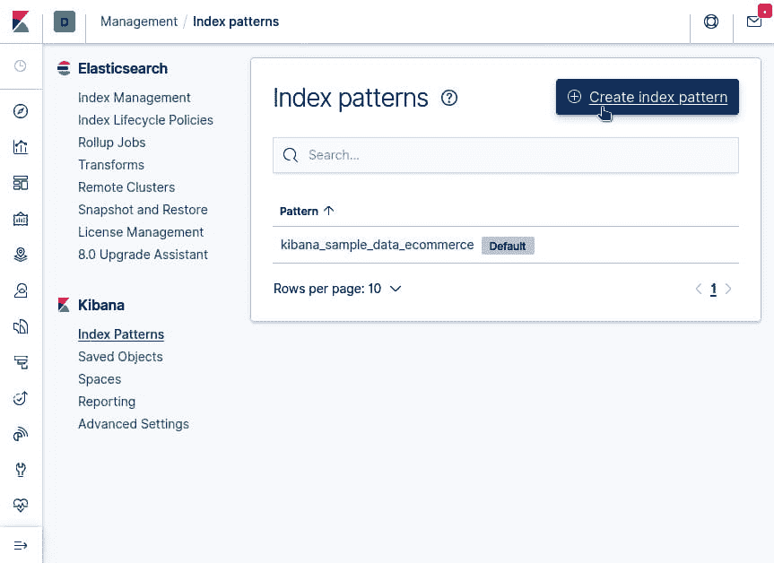

图 4.4 – 创建索引模式

将 Elasticsearch 索引模式添加到 Kibana。在下一屏中，输入索引的名称 – `users`。Kibana 将开始模式匹配以查找索引。从下拉菜单中选择 `users` 索引并点击 `users`），如以下截图所示；你应该能看到你的文档：

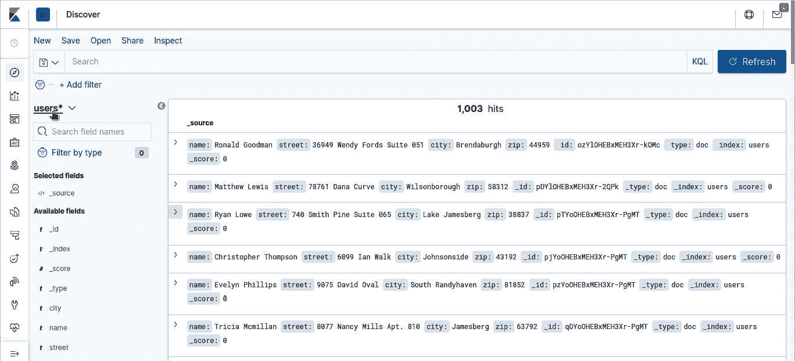

图 4.5 – 发现标签页中的所有文档

现在你已经可以单独创建记录或使用 `bulk` 方法，下一节将教你如何查询你的数据。

### 查询 Elasticsearch

查询 Elasticsearch 的步骤与插入数据完全相同。唯一的区别是，你使用不同的方法 – `search` – 发送不同的请求体对象。让我们通过一个简单的查询来查看所有数据：

1.  导入库并创建你的 `elasticsearch` 实例：

    ```py
    from elasticsearch import Elasticsearch
    es = Elasticsearch() 
    ```

1.  创建要发送到 Elasticsearch 的 JSON 对象。该对象是一个查询，使用 `match_all` 搜索：

    ```py
    doc={"query":{"match_all":{}}}
    ```

1.  使用`search`方法将对象传递给 Elasticsearch。传递索引和返回大小。在这种情况下，你将只返回 10 条记录。最大返回大小是 10,000 个文档：

    ```py
    res=es.search(index="users",body=doc,size=10)
    ```

1.  最后，你可以打印文档：

    ```py
    print(res['hits']['hits'])
    ```

    或者，你可以迭代地只获取`_source`：

    ```py
    for doc in res['hits']['hits']:
        print(doc['_source'])
    ```

你可以将查询结果加载到`pandas` DataFrame 中——它是 JSON 格式，你已经在*第三章*中学习了如何读取 JSON，即*读取和写入文件*。要将结果加载到 DataFrame 中，从`pandas`的`json`库中导入`json_normalize`，并使用它（`json_normalize`）对 JSON 结果进行操作，如下面的代码所示：

```py
from pandas.io.json import json_normalize
df=json_normalize(res['hits']['hits'])
```

现在，你将在 DataFrame 中看到搜索结果。在这个例子中，你只是抓取了所有记录，但除了`match_all`之外，还有其他查询可用。

使用`match_all`查询，我知道有一个名为`Ronald Goodman`的文档。你可以使用`match`查询在字段上进行查询：

```py
doc={"query":{"match":{"name":"Ronald Goodman"}}}
res=es.search(index="users",body=doc,size=10)
print(res['hits']['hits'][0]['_source'])
```

你还可以使用 Lucene 语法进行查询。在 Lucene 中，你可以指定`field:value`。在执行此类搜索时，你不需要发送文档。你可以将`q`参数传递给`search`方法：

```py
res=es.search(index="users",q="name:Ronald Goodman",size=10)
print(res['hits']['hits'][0]['_source'])
```

使用`City`字段，你可以搜索`Jamesberg`。它将返回两个记录：一个是`Jamesberg`，另一个是`Lake Jamesberg`。Elasticsearch 会将包含空格的字符串进行分词，将其拆分为多个字符串进行搜索：

```py
# Get City Jamesberg - Returns Jamesberg and Lake Jamesberg
doc={"query":{"match":{"city":"Jamesberg"}}}
res=es.search(index="users",body=doc,size=10)
print(res['hits']['hits'])
```

以下代码块中的结果是两个记录：

```py
[{'_index': 'users', '_type': 'doc', '_id': 'qDYoOHEBxMEH3Xr-PgMT', '_score': 6.929674, '_source': {'name': 'Tricia Mcmillan', 'street': '8077 Nancy #Mills Apt. 810', 'city': 'Jamesberg', 'zip': '63792'}}, {'_index': 'users', '_type': 'doc', '_id': 'pTYoOHEBxMEH3Xr-PgMT', '_score': 5.261652, '_source': {'name': 'Ryan Lowe', 'street': '740 Smith Pine Suite 065', 'city': 'Lake Jamesberg', 'zip': '38837'}}]
```

你可以使用布尔查询来指定多个搜索条件。例如，你可以在查询之前使用`must`、`must not`和`should`。使用布尔查询，你可以过滤掉`Lake Jamesberg`。使用`must`匹配城市为`Jamesberg`（这将返回两个记录），并添加 ZIP 的过滤器，你可以确保只返回 ZIP 为`63792`的`Jamesberg`。你还可以在`Lake Jameson` ZIP 上使用`must not`查询：

```py
# Get Jamesberg and filter on zip so Lake Jamesberg is removed
doc={"query":{"bool":{"must":{"match":{"city":"Jamesberg"}},
"filter":{"term":{"zip":"63792"}}}}}
res=es.search(index="users",body=doc,size=10)
print(res['hits']['hits'])
```

现在，你只得到了你想要的单个记录：

```py
[{'_index': 'users', '_type': 'doc', '_id': 'qDYoOHEBxMEH3Xr-
PgMT', '_score': 6.929674, '_source': {'name': 'Tricia 
Mcmillan', 'street': '8077 Nancy #Mills Apt. 810', 'city': 
'Jamesberg', 'zip': '63792'}}]
```

你的查询只返回了少量文档，但在实际生产中，你可能会遇到返回成千上万文档的大查询。下一节将展示如何处理所有这些数据。

### 使用滚动处理更大的结果

在第一个例子中，你为搜索使用了 10 的大小。你可以抓取所有 1,000 条记录，但当你有超过 10,000 条记录并且需要所有这些记录时，你该怎么办？Elasticsearch 有一个滚动方法，允许你迭代结果直到获取所有结果。要滚动数据，请遵循以下步骤：

1.  导入库并创建你的`Elasticsearch`实例：

    ```py
    from elasticsearch import Elasticsearch
    es = Elasticsearch() 
    ```

1.  搜索您的数据。由于您没有超过 10,000 条记录，您将大小设置为`500`。这意味着您将错过初始搜索中的 500 条记录。您将向搜索方法传递一个新参数 – `scroll`。此参数指定您希望结果可用多长时间。我使用 20 毫秒。调整此数字以确保您有足够的时间获取数据 – 它将取决于文档大小和网络速度：

    ```py
    res = es.search(
      index = 'users',
      doc_type = 'doc',
      scroll = '20m',
      size = 500,
      body = {"query":{"match_all":{}}}
    )
    ```

1.  结果将包括`_scroll_id`，您稍后需要将其传递给`scroll`方法。保存滚动 ID 和结果集的大小：

    ```py
    sid = res['_scroll_id']
    size = res['hits']['total']['value']
    ```

1.  要开始滚动，使用`while`循环获取记录，直到大小为 0，这意味着没有更多数据。在循环内部，您将调用`scroll`方法并传递`_scroll_id`和滚动时间。这将从原始查询中获取更多结果：

    ```py
    while (size > 0):
        res = es.scroll(scroll_id = sid, scroll = '20m')
    ```

1.  接下来，获取新的滚动 ID 和大小，以便在数据仍然存在时再次循环：

    ```py
        sid = res['_scroll_id']
        size = len(res['hits']['hits'])
    ```

1.  最后，您可以对滚动结果进行一些操作。在以下代码中，您将打印每条记录的源：

    ```py
        for doc in res['hits']['hits']:
            print(doc['_source'])
    ```

现在您已经知道如何在 Elasticsearch 中创建文档以及如何查询它们，即使返回值超过 10,000 个最大值。您也可以使用关系数据库做同样的事情。现在是时候开始将这些技能用于构建数据管道了。接下来的两个部分将教会您如何使用 Apache Airflow 和 NiFi 在数据管道中使用数据库。

# 在 Apache Airflow 中构建数据管道

在上一章中，您使用 Bash 和 Python 操作符构建了您的第一个 Airflow 数据管道。这次，您将结合两个 Python 操作符从 PostgreSQL 中提取数据，将其保存为 CSV 文件，然后读取并写入 Elasticsearch 索引。完整的管道在以下屏幕截图中显示：

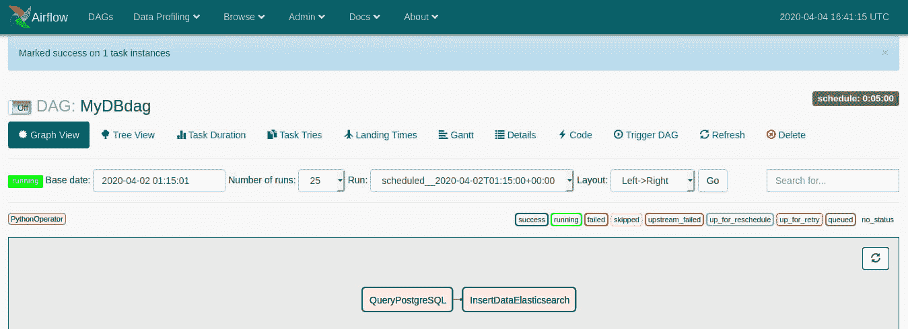

图 4.6 – Airflow DAG

前面的**有向无环图**（**DAG**）看起来非常简单；它只有两个任务，您可以将任务合并成一个函数。这不是一个好主意。在*第二部分*，*将管道部署到生产中*，您将学习如何修改您的数据管道以适应生产。生产管道的一个关键原则是每个任务应该是原子的；也就是说，每个任务应该能够独立存在。如果您有一个读取数据库并插入结果的单一函数，当它失败时，您必须追踪查询是否失败或插入是否失败。随着您的任务变得更加复杂，调试将需要更多的工作。下一节将引导您构建数据管道。

## 设置 Airflow 模板

每个 DAG 都将有一些标准的、模板化的代码，以便在 Airflow 中运行。你将始终导入所需的库，然后导入你任务所需的任何其他库。在下面的代码块中，你导入了操作符 `DAG` 和 Airflow 的时间库。对于你的任务，你导入了 `pandas`、`psycopg2` 和 `elasticsearch` 库：

```py
import datetime as dt
from datetime import timedelta
from airflow import DAG
from airflow.operators.bash_operator import BashOperator
from airflow.operators.python_operator import PythonOperator
import pandas as pd
import psycopg2 as db
from elasticsearch import Elasticsearch
```

接下来，你将为你的 DAG 指定参数。记住，如果安排任务每天运行，开始时间应该比任务运行时间晚一天：

```py
default_args = {
    'owner': 'paulcrickard',
    'start_date': dt.datetime(2020, 4, 2),
    'retries': 1,
    'retry_delay': dt.timedelta(minutes=5),
}
```

现在，你可以将参数传递给 DAG，给它命名，并设置运行间隔。你也将在这里定义你的操作符。在这个例子中，你将创建两个 Python 操作符——一个用于从 PostgreSQL 获取数据，另一个用于将数据插入 Elasticsearch。`getData` 任务将位于上游，而 `insertData` 任务位于下游，因此你将使用 `>>` 位移操作符来指定这一点：

```py
with DAG('MyDBdag',
         default_args=default_args,
         schedule_interval=timedelta(minutes=5),      
                           # '0 * * * *',
         ) as dag:
    getData = PythonOperator(task_id='QueryPostgreSQL',
         python_callable=queryPostgresql)

    insertData = PythonOperator
    (task_id='InsertDataElasticsearch',
         python_callable=insertElasticsearch)
getData >> insertData
```

最后，你将定义任务。在前面的操作符中，你将它们命名为 `queryPostgresql` 和 `insertElasticsearch`。这些任务中的代码看起来非常熟悉；它与本章前几节中的代码几乎相同。

要查询 PostgreSQL，你将创建连接，使用 `pandas` 的 `read_sql()` 方法执行 `sql` 查询，然后使用 `pandas` 的 `to_csv()` 方法将数据写入磁盘：

```py
def queryPostgresql():
    conn_string="dbname='dataengineering' host='localhost'
    user='postgres' password='postgres'"
    conn=db.connect(conn_string)
    df=pd.read_sql("select name,city from users",conn)
    df.to_csv('postgresqldata.csv')
    print("-------Data Saved------")
```

要将数据插入 Elasticsearch，你将创建连接到 `localhost` 的 Elasticsearch 对象。然后，从上一个任务中读取 CSV 到 DataFrame，遍历 DataFrame，将每一行转换为 JSON，并使用 `index` 方法插入数据：

```py
def insertElasticsearch():
    es = Elasticsearch() 
    df=pd.read_csv('postgresqldata.csv')
    for i,r in df.iterrows():
        doc=r.to_json()
        res=es.index(index="frompostgresql",
                    doc_type="doc",body=doc)
        print(res)	
```

现在，你已经在 Airflow 中拥有了一个完整的数据管道。在下一节中，你将运行它并查看结果。

## 运行 DAG

要运行 DAG，你需要将你的代码复制到 `$AIRFLOW_HOME/dags` 文件夹。移动文件后，你可以运行以下命令：

```py
airflow webserver
airflow scheduler
```

当这些命令完成后，浏览到 `http://localhost:8080` 以查看 Airflow GUI。选择 **MyDBdag**，然后选择 **树视图**。你可以安排 DAG 运行五次，并点击 **Go**。运行时，你应该在下面看到结果，如下面的截图所示：

![图 4.7 – 显示成功运行和排队运行的任务]

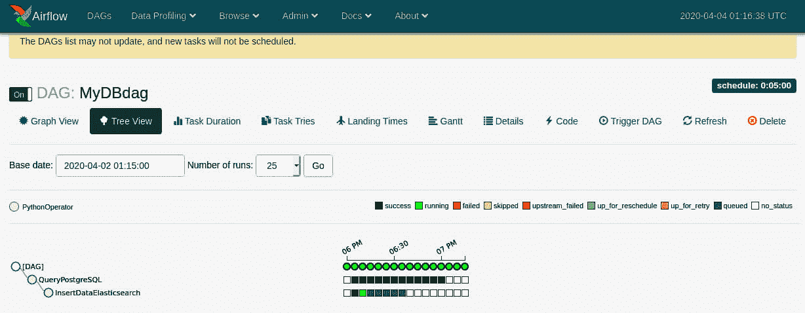

图 4.7 – 显示成功运行和排队运行的任务

要验证数据管道是否成功，你可以使用 Kibana 查看 Elasticsearch 中的数据。要查看结果，浏览到 Kibana 的 `http://localhost:5601`。你需要在 Kibana 中创建一个新的索引。你在这个章节的*使用辅助工具插入数据*部分执行了这个任务。但为了回顾，你将在 Kibana 的左侧工具栏底部选择**管理**，然后通过点击**创建索引模式**按钮创建索引模式。开始输入索引的名称，Kibana 将找到它，然后点击**创建**。然后，你可以转到工具栏上的**发现**选项卡并查看数据。你应该看到如下所示的记录：

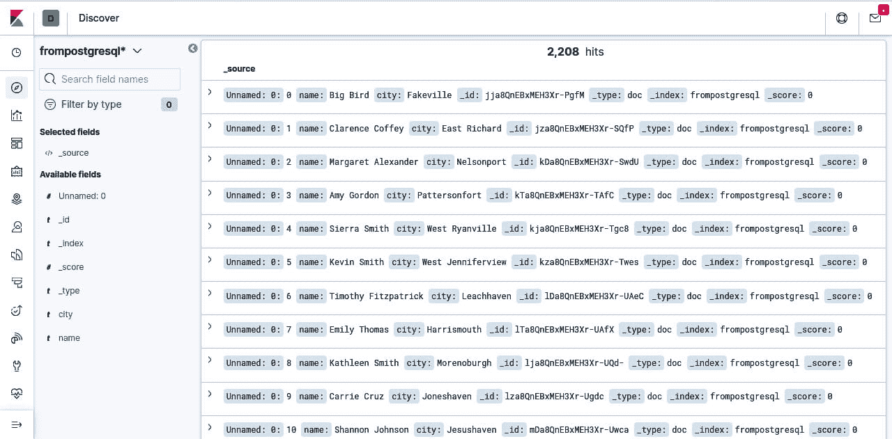

图 4.8 – 显示 Elasticsearch 中记录的 Airflow 数据管道结果

你将看到包含仅名称和城市的文档，正如你在数据管道任务中指定的那样。需要注意的是，我们现在有超过 2,000 条记录。在 PostgreSQL 数据库中之前只有 1,000 条记录，那么发生了什么？数据管道运行了多次，每次都从 PostgreSQL 插入记录。数据管道的第二个原则是它们应该是幂等的。这意味着无论你运行多少次，结果都应该是相同的。在这种情况下，它们并不是。你将在*第二部分*，*在生产中部署管道*，在*第七章*，*生产管道的特点*中学习如何解决这个问题。现在，本章的下一节将教你如何在 Apache NiFi 中构建相同的数据管道。

# 使用 NiFi 处理器处理数据库

在前面的章节中，你学习了如何使用 Python 读取和写入 CSV 和 JSON 文件。读取文件是一项如此常见的任务，以至于像 NiFi 这样的工具有预构建的处理器来处理它。在本节中，你将构建与上一节相同的数据管道。在 NiFi 中，数据管道将看起来如下所示：

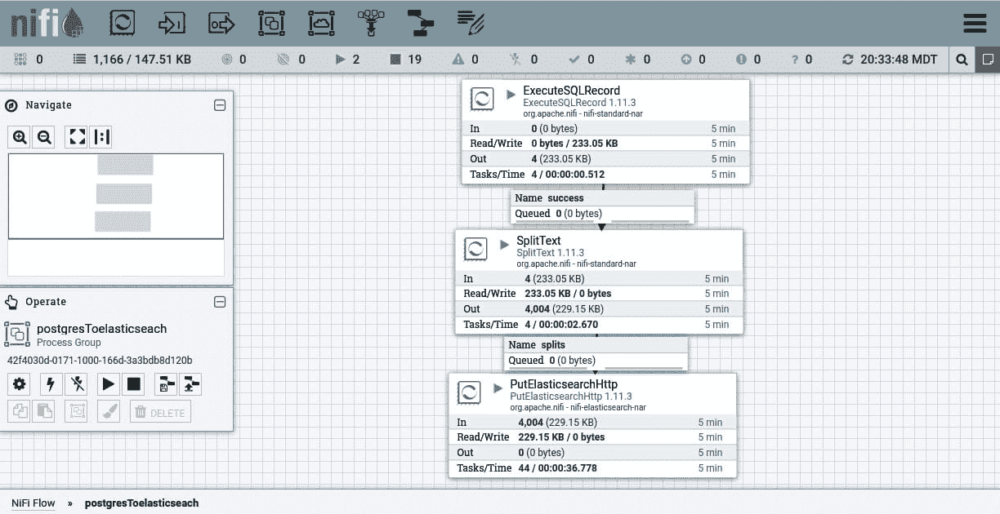

图 4.9 – 将数据从 PostgreSQL 移动到 Elasticsearch 的 NiFi 数据管道

数据管道比 Airflow 版本多一个任务，但除此之外，它应该看起来很直接。以下几节将指导你构建数据管道。

## 从 PostgreSQL 提取数据

在 NiFi 中处理关系数据库最常用的处理器是 `ExecuteSQLRecord` 处理器。拖动 `ExecuteSQLRecord` 处理器。一旦它被添加到画布上，你需要配置它。

### 配置 ExecuteSQLCommand 处理器

要配置处理器，你需要创建一个数据库连接池，如下面的截图所示：

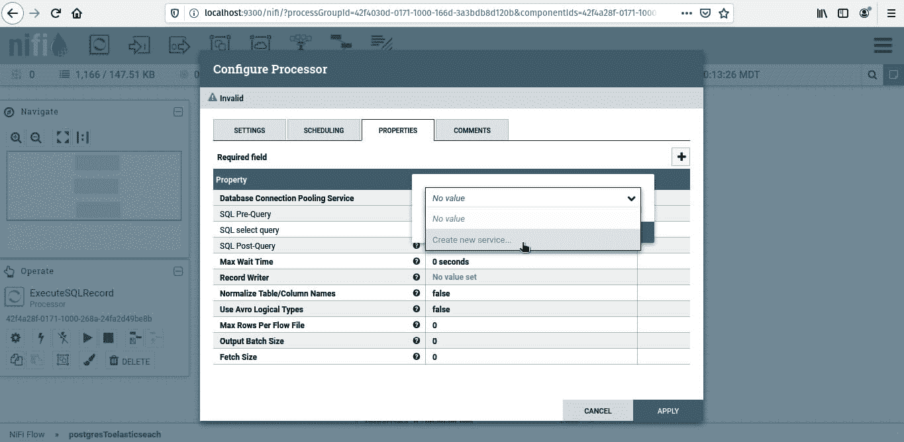

图 4.10 – 创建数据库连接池服务

在选择 `dataengineering` 后，注意我没有将其命名为 `PostgreSQL`。随着你添加更多服务，你将为不同的数据库添加更多 PostgreSQL 连接。那时，记住哪个 PostgreSQL 数据库对应于哪个服务将变得很困难。

要配置服务，选择处理器配置中的箭头。服务的配置应如下截图所示：

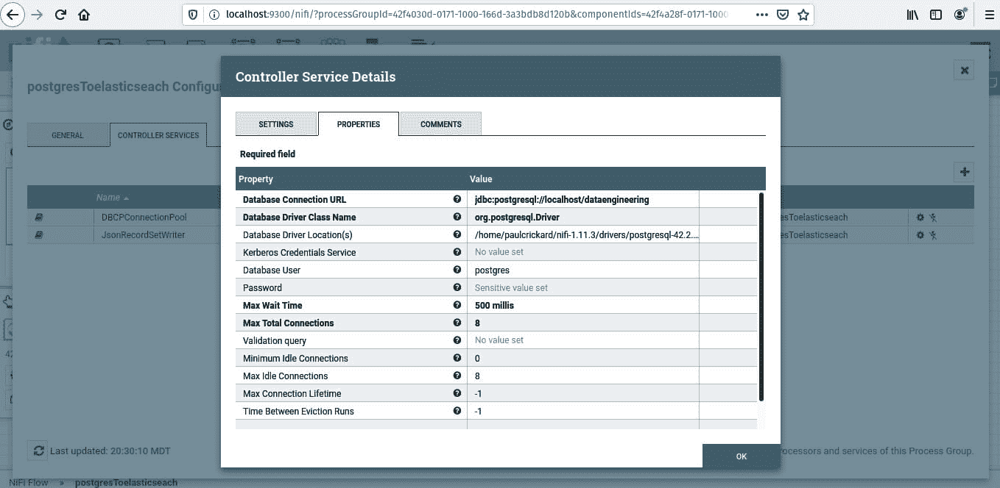

图 4.11 – 配置数据库服务

配置需要你指定连接 URL，这是一个 Java 数据库连接字符串。该字符串指定 `PostgreSQL`。然后命名主机，`localhost`，和数据库名称，`dataengineering`。驱动类指定 `postgresql` 驱动。驱动程序的位置是你下载它的位置，在 *第二章*，*构建我们的数据工程基础设施*。它应该位于你的主目录中的 `nifi` 文件夹中，在名为 `drivers` 的子目录中。最后，你需要输入数据库的用户名和密码。

接下来，你需要创建一个记录写入服务。选择 **创建新服务…**，选择 **JSONRecordSetWriter**，然后点击箭头进行配置。有一个重要的配置设置你不能跳过 – **输出分组**。你必须将此属性设置为 **每对象一行**。完成的配置将如下截图所示：

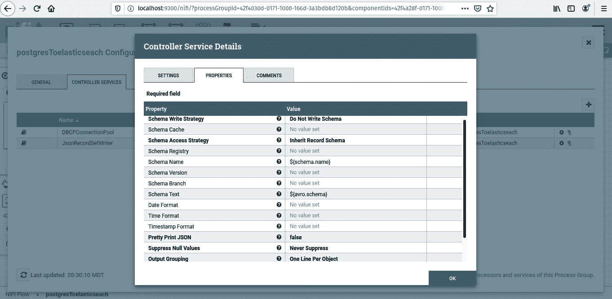

图 4.13 – JSONRecordSetWriter 配置

现在你已经为处理器设置了服务，你需要完成配置过程。你需要配置的最后参数是 **SQL 选择查询**。这是你可以指定运行数据库的 SQL 命令的地方。例如，你可以输入以下内容：

```py
select name, city from users
```

这将抓取 PostgreSQL 数据库中的所有记录，但只包括 `name` 和 `city` 字段。你现在可以继续到管道中的下一个处理器。

### 配置 SplitText 处理器

现在你已经配置了 **ExecuteSQLRecord** 处理器，你将收到一个记录数组。要处理这些数据，你需要为每条记录有一个 flowfile。为此，你可以使用 **SplitText** 处理器。将其拖到画布上，通过双击处理器打开 **属性** 选项卡 – 或者右键单击并选择 **属性**。处理器的默认设置有效，但请确保 **行分割计数** 设置为 **1**，**标题行计数** 为 **0** – 当数据来自 **ExecuteSQLRecord** 处理器时，你的数据没有标题，并且 **删除尾随换行符** 为 **true**。

这些设置将允许处理器将 flowfile 的每一行分割成一个新的 flowfile。因此，你的一个输入 flowfile 将从这个处理器输出 1,000 个 flowfile。

### 配置 PutElasticsearchHttp 处理器

数据管道的最后一步是将 flowfiles 插入 Elasticsearch。您可以使用 **PutElasticsearchHttp** 处理器来完成此操作。有四个不同的 **PutElasticsearch** 处理器。在这本书中，只有两个是相关的 – **PutElasticsearchHttp** 和 **PutelasticsearchHttpRecord**。这些处理器用于插入单个记录或使用批量 API。其他两个处理器 – **Putelasticsearch** 和 **Putelasticsearch5** – 用于 Elasticsearch 的旧版本（2 和 5）。

要配置处理器，您必须指定 URL 和端口。在这个例子中，您将使用 `http://localhost:9200`。索引将是 `fromnifi`，但您可以将其命名为任何您想要的名称。类型是 `doc`，索引操作将是 `index`。在 *第二部分*，*在生产中部署管道* 中，您将使用其他索引操作，并且您将指定您插入的记录的 ID。

## 运行数据管道

现在您已经配置了所有处理器，您可以通过将箭头从 **ExecuteSQLRecord** 拖动到 **SplitRecord** 处理器来连接它们以实现成功。然后，将 **SplitRecord** 处理器连接到 **PutElasticsearchHttp** 处理器以进行拆分。最后，终止 **PutElasticsearchHttp** 处理器以完成所有关系。

运行每个处理器，或在 **操作** 面板中，选择 **运行** 以启动它们。您将看到第一个队列中的一个 flowfile，然后它将在第二个队列中拆分为 1,000 个 flowfiles。随着它们被插入 Elasticsearch，队列将以每批 100 个的方式清空。

为了验证结果，您可以使用 `elasticsearch` API，而不是 Kibana。在您的浏览器中，访问 `http://localhost:9200/_cat/indices`。这是查看您 Elasticsearch 数据库中索引的 REST 端点。您应该看到您的新索引 `fromnifi` 和文档总数，如下面的截图所示：

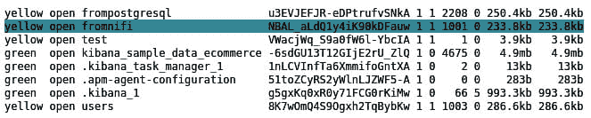

图 4.13 – 索引包含 PostgreSQL 的所有记录

索引中的文档数量将根据您是否让管道运行而变化。就像在 Airflow 示例中一样，这个管道不是幂等的。在运行过程中，它将不断将具有不同 ID 的相同记录添加到 Elasticsearch 中。这不是您在生产中想要的操作，我们将在 *第二部分*，*在生产中部署管道* 中修复这个问题。

# 摘要

在本章中，你学习了如何使用 Python 查询和将数据插入到关系型数据库和 NoSQL 数据库中。你还学习了如何使用 Airflow 和 NiFi 创建数据管道。数据库技能对于数据工程师来说是最重要的技能之一。几乎所有的数据管道都会以某种方式涉及到它们。本章中你学到的技能为你将需要学习的其他技能提供了基础——主要是 SQL。将强大的 SQL 技能与本章中学到的数据管道技能相结合，将使你能够完成你将遇到的大多数数据工程任务。

在示例中，数据管道不具有幂等性。每次运行时，你都会得到新的结果，以及你不想得到的结果。我们将在*第二部分*，*将管道部署到生产中*中解决这个问题。但在你到达那里之前，你需要学习如何处理常见的数据问题，以及如何丰富和转换你的数据。

下一章将教你如何使用 Python 在数据管道的提取和加载阶段之间处理你的数据。
