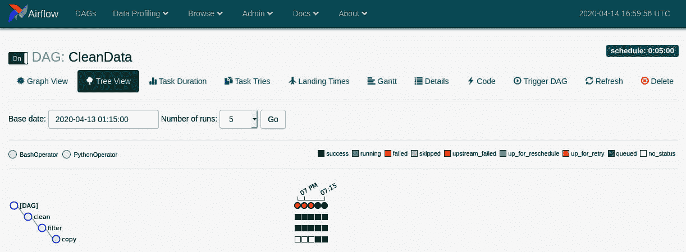

# 第五章：*第五章*：清理、转换和丰富数据

在前两章中，你学习了如何构建能够从文件和数据库中读取和写入的数据管道。在许多情况下，仅这些技能就足以让你构建生产级的数据管道。例如，你将读取数据湖中的文件并将它们插入到数据库中。你现在有了完成这项任务的能力。然而，有时在提取数据之后但在加载之前，你可能需要对数据进行一些操作。你需要做的是清理数据。清理是一个模糊的术语。更具体地说，你需要检查数据的有效性，并回答以下问题：它是否完整？值是否在适当的范围内？列的类型是否正确？所有列是否都有用？

在本章中，你将学习执行探索性数据分析所需的基本技能。一旦你对数据有了了解，你将利用这些知识来解决你发现的一些常见数据问题——例如删除列和替换空值。你将学习`pandas`库中许多有用的方法。这些技能将使你能够快速执行探索性数据分析，并允许你在 Python 中清理数据。这些技能将成为 ETL 数据工程流程转换阶段的工具。

在本章中，我们将涵盖以下主要主题：

+   在 Python 中执行探索性数据分析

+   使用 pandas 处理常见数据问题

+   使用 Airflow 清理数据

# 在 Python 中执行探索性数据分析

在你清理数据之前，你需要了解你的数据看起来是什么样子。作为一个数据工程师，你并不是领域专家，也不是数据的最终用户，但你应该知道数据将用于什么，以及有效的数据应该是什么样子。例如，你不需要是人口统计学家就能知道一个`年龄`字段不应该为负数，并且超过 100 的值的频率应该很低。

## 下载数据

在本章中，你将使用来自阿尔伯克基市的真实电动滑板车数据。这些数据包含从 2019 年 5 月到 7 月 22 日使用电动滑板车进行的行程。你需要从[`github.com/PaulCrickard/escooter/blob/master/scooter.csv`](https://github.com/PaulCrickard/escooter/blob/master/scooter.csv)下载电动滑板车数据。该存储库还包含原始的 Excel 文件以及阿尔伯克基市提供的其他一些总结文件。

## 基本数据探索

在你清理数据之前，你必须知道你的数据看起来是什么样子。理解你的数据的过程被称为 **探索性数据分析** （**EDA**）。你将查看数据的形状、行数和列数，以及列中的数据类型和值的范围。你可以执行更深入的分析，例如数据的分布或偏度，但在这个部分，你将学习如何快速理解你的数据，以便在下一部分中你可以清理它。

在前两个章节中，你学习了如何将文件和数据库导入 pandas DataFrame。这部分知识将在本节中扩展，因为 DataFrame 将是用于 EDA 的工具。

首先，你需要导入 `pandas` 并读取 `.csv` 文件：

```py
import pandas as pd
df=pd.read_csv('scooter.csv')
```

在 DataFrame 中有了数据后，你现在可以探索它，然后分析它。

### 探索数据

现在，你可以开始查看数据了。你可能会做的第一件事就是打印它。但在你做到这一点之前，看看列和数据类型，使用 `columns` 和 `dtypes`：

```py
df.columns
Index(['month', 'trip_id', 'region_id', 'vehicle_id', 
'started_at', 'ended_at', 'DURATION', 
'start_location_name', 'end_location_name', 
       'user_id', 'trip_ledger_id'],
      dtype='object')
df.dtypes
month                  object
trip_id                 int64
region_id               int64
vehicle_id              int64
started_at             object
ended_at               object
DURATION               object
start_location_name    object
end_location_name      object
user_id                 int64
trip_ledger_id          int64
```

你会看到你有 11 列，其中 5 列是整数（所有名称中包含 ID 的列）其余的是对象。对象是 DataFrame 在存在混合类型时用作 `dtype` 的内容。此外，`DURATION` 应该很突出，因为它是所有大写字母的唯一列名。在下一节中，你将修复常见的错误，例如列的大小写不统一（全部小写或大写）以及将 `dtypes` 对象转换为适当的类型，例如 `strings` 用于文本数据，`datetimes` 用于日期和时间。

现在你已经知道了列和类型，让我们来看看数据。你可以使用 `head()` 打印出前五条记录：

```py
df.head()
  month  trip_id  ...   user_id  trip_ledger_id
0   May  1613335  ...   8417864         1488546
1   May  1613639  ...   8417864         1488838
2   May  1613708  ...   8417864         1488851
3   May  1613867  ...   8417864         1489064
4   May  1636714  ...  35436274         1511212
[5 rows x 11 columns]
```

`head()` 的对立面是 `tail()`。这两个方法默认显示 5 行。然而，你可以传递一个整数作为参数来指定要显示的行数。例如，你可以传递 `head(10)` 来查看前 10 行。

注意在 `head()` 和 `tail()` 输出中，第三列是 `...`，然后是此之后的两个更多列。显示正在裁剪中间的列。如果你要打印整个 DataFrame，行也会发生相同的事情。要显示所有列，你可以使用 `set_options` 方法更改要显示的列数：

```py
pd.set_option('display.max_columns', 500)
```

现在，当你使用 `head()` 时，你会看到所有列。然而，根据你显示器的宽度，输出可能会被换行以适应。

`head` 和 `tail` 方法显示所有列，但如果你只对单个列感兴趣，你可以像在 Python 字典中一样指定它。以下代码打印了 `DURATION` 列：

```py
df['DURATION']
0        0:07:03
1        0:04:57
2        0:01:14
3        0:06:58
4        0:03:06
          ...   
34221    0:14:00
34222    0:08:00
34223    1:53:00
34224    0:12:00
34225    1:51:00
```

再次注意，输出被 `...` 截断，但这次是针对行的。结果是 `head()` 和 `tail()` 的组合。你可以使用 `display_max_rows` 选项来改变它，就像你之前改变列一样，但在这个探索中，这是不必要的。

就像你可以显示单个列一样，你可以使用双 `[]` 显示列的列表，如下面的代码块所示：

```py
df[['trip_id','DURATION','start_location_name']]     
       trip_id DURATION     start_location_name
0      1613335  0:07:03       1901 Roma Ave NE, Albuquerque, NM 
                              87106, USA
1      1613639  0:04:57  1 Domenici Center en Domenici Center, 
                           Albuquer...
2      1613708  0:01:14  1 Domenici Center en Domenici Center, 
                           Albuquer...
3      1613867  0:06:58  Rotunda at Science & Technology Park, 
                         801 Univ...
4      1636714  0:03:06          401 2nd St NW, Albuquerque, NM
                                 87102, USA
...        ...      ...                                     ...
34221  2482235  0:14:00     Central @ Broadway, Albuquerque, NM 
                            87102, USA
34222  2482254  0:08:00     224 Central Ave SW, Albuquerque, NM 
                            87102, USA
34223  2482257  1:53:00     105 Stanford Dr SE, Albuquerque, NM 
                            87106, USA
34224  2482275  0:12:00   100 Broadway Blvd SE, Albuquerque, NM 
                          87102, USA
34225  2482335  1:51:00     105 Stanford Dr SE, Albuquerque, NM 
                            87106, USA
```

你也可以使用 `sample()` 从你的数据中抽取样本。样本方法允许你指定你想要抽取多少行。结果如下面的代码块所示：

```py
df.sample(5)
     month  trip_id  ...   user_id  trip_ledger_id
4974   June  1753394  ...  35569540         1624088
18390  June  1992655  ...  42142022         1857395
3132    May  1717574  ...  37145791         1589327
1144    May  1680066  ...  36146147         1553169
21761  June  2066449  ...  42297442         1929987
```

注意，行的索引不是递增的，而是跳跃式的。它应该是这样的，因为它是一个样本。

你也可以切片数据。切片的格式为 `[start:end]`，其中空白表示第一行或最后一行，具体取决于哪个位置是空的。要切片前 10 行，你可以使用以下表示法：

```py
df[:10]  
     month  trip_id  ...   user_id  trip_ledger_id
0      May  1613335  ...   8417864         1488546
1      May  1613639  ...   8417864         1488838
2      May  1613708  ...   8417864         1488851
3      May  1613867  ...   8417864         1489064
4      May  1636714  ...  35436274         1511212
5      May  1636780  ...  34352757         1511371
6      May  1636856  ...  35466666         1511483
7      May  1636912  ...  34352757         1511390
8      May  1637035  ...  35466666         1511516
9      May  1637036  ...  34352757         1511666
```

同样，要获取从第 10 行到结束（34,225）的行，你可以使用以下表示法：

```py
df[10:] 
```

你也可以从第三行开始切片，到第九行之前结束，如下面的代码块所示：

```py
df[3:9]
  month  trip_id  ...   user_id  trip_ledger_id
3   May  1613867  ...   8417864         1489064
4   May  1636714  ...  35436274         1511212
5   May  1636780  ...  34352757         1511371
6   May  1636856  ...  35466666         1511483
7   May  1636912  ...  34352757         1511390
8   May  1637035  ...  35466666         1511516
```

有时候，你知道你想要的确切行，而不是切片，你可以使用 `loc()` 来选择它。`loc` 方法接受索引名称，在这个例子中是一个整数。下面的代码和输出显示了使用 `loc()` 选择的单行：

```py
df.loc[34221]
month                                                      July
trip_id                                                 2482235
region_id                                                   202
vehicle_id                                              2893981
started_at                                      7/21/2019 23:51
ended_at                                         7/22/2019 0:05
DURATION                                                0:14:00
start_location_name  Central @ Broadway, Albuquerque, NM 87102,
                                                            USA
end_location_name    1418 4th St NW, Albuquerque, NM 87102, USA
user_id                                                42559731
trip_ledger_id                                          2340035
```

使用 `at()`，与切片示例中的位置一样，以及列名，你可以选择单个值。例如，这可以用来知道第二行的行程时长：

```py
df.at[2,'DURATION']
'0:01:14'
```

切片和使用 `loc()` 和 `at()` 是基于位置拉取数据，但你也可以使用 DataFrames 根据某些条件选择行。使用 `where` 方法，你可以传递一个条件，如下面的代码块所示：

```py
user=df.where(df['user_id']==8417864)
user
      month    trip_id  ...    user_id  trip_ledger_id
0       May  1613335.0  ...  8417864.0       1488546.0
1       May  1613639.0  ...  8417864.0       1488838.0
2       May  1613708.0  ...  8417864.0       1488851.0
3       May  1613867.0  ...  8417864.0       1489064.0
4       NaN        NaN  ...        NaN             NaN
...     ...        ...  ...        ...             ...
34221   NaN        NaN  ...        NaN             NaN
34222   NaN        NaN  ...        NaN             NaN
34223   NaN        NaN  ...        NaN             NaN
34224   NaN        NaN  ...        NaN             NaN
34225   NaN        NaN  ...        NaN             NaN
```

上述代码和结果显示了 `where` 方法在用户 ID 等于 `8417864` 的条件下的结果。结果将不符合标准的数据替换为 `NaN`。这将在下一节中介绍。

你可以使用与前面示例类似的结果，只是使用不同的表示法，并且这种方法将不包括 `NaN` 行。你可以将条件传递到 DataFrame 中，就像你传递列名一样。以下示例展示了如何操作：

```py
df[(df['user_id']==8417864)]
```

上述代码的结果与 `where()` 示例相同，但没有 `NaN` 行，因此 DataFrame 将只有四行。

使用这两种表示法，你可以组合条件语句。通过使用相同的用户 ID 条件，你可以添加行程 ID 条件。以下示例展示了如何操作：

```py
one=df['user_id']==8417864
two=df['trip_ledger_id']==1488838
df.where(one & two)
      month    trip_id  ...    user_id  trip_ledger_id
0       NaN        NaN  ...        NaN             NaN
1       May  1613639.0  ...  8417864.0       1488838.0
2       NaN        NaN  ...        NaN             NaN
3       NaN        NaN  ...        NaN             NaN
4       NaN        NaN  ...        NaN             NaN
```

使用第二种表示法，输出如下：

```py
df[(one)&(two)]
  month  trip_id  ...  user_id  trip_ledger_id
1   May  1613639  ...  8417864         1488838
```

在前面的例子中，条件被分配给一个变量，并在 `where` 和二级表示法中结合，生成了预期的结果。

### 分析数据

现在你已经看到了数据，你可以开始分析它。通过使用 `describe` 方法，你可以看到一系列与你的数据相关的统计数据。在统计学中，有一组被称为五数摘要的统计数据，`describe()` 是其变体：

```py
df.describe()
           trip_id  region_id    vehicle_id       user_id  trip_ledger_id
count  3.422600e+04    34226.0  3.422600e+04  3.422600e+04    3.422600e+04
mean   2.004438e+06      202.0  5.589507e+06  3.875420e+07    1.869549e+06
std    2.300476e+05        0.0  2.627164e+06  4.275441e+06    2.252639e+05
min    1.613335e+06      202.0  1.034847e+06  1.080200e+04    1.488546e+06
25%    1.813521e+06      202.0  3.260435e+06  3.665710e+07    1.683023e+06
50%    1.962520e+06      202.0  5.617097e+06  3.880750e+07    1.827796e+06
75%    2.182324e+06      202.0  8.012871e+06  4.222774e+07    2.042524e+06
max    2.482335e+06      202.0  9.984848e+06  4.258732e+07    2.342161e+06
```

`describe` 方法在没有数值数据的情况下并不很有用。例如，如果你在查看年龄，它会快速显示年龄分布，你能够快速看到错误，如负年龄或超过 100 岁的年龄过多。

在单个列上使用 `describe()` 有时更有帮助。让我们尝试查看 `start_location_name` 列。代码和结果如下所示：

```py
df['start_location_name'].describe()
count                                               34220
unique                                               2972
top       1898 Mountain Rd NW, Albuquerque, NM 87104, USA
freq                                                 1210
```

数据不是数值型的，所以我们得到一组不同的统计数据，但这些提供了一些见解。在 `34220` 个起始位置中，实际上有 `2972` 个独特的位置。最热门的位置（`1898 Mountain Rd NW`）占 `1210` 个行程的起始位置。稍后，你将对这些数据进行地理编码——为地址添加坐标——知道唯一值意味着你只需要地理编码这 2,972 个，而不是全部 34,220 个。

另一种允许你查看数据细节的方法是 `value_counts`。`value_counts` 方法将为你提供所有唯一值的值和计数。我们需要将其调用到一个单列上，如下面的代码片段所示：

```py
df['DURATION'].value_counts()
0:04:00    825
0:03:00    807
0:05:00    728
0:06:00    649
0:07:00    627
```

从这个方法中，你可以看到 `0:04:00` 是频率最高的，频率为 `825` —— 你可以用 `describe()` 找到这个信息——但你也可以看到其他所有值的频率。要查看频率作为百分比，你可以传递 `normalize` 参数（默认值为 `False`）：

```py
df['DURATION'].value_counts(normalize=True)
0:04:00    0.025847
0:03:00    0.025284
0:05:00    0.022808
0:06:00    0.020333
0:07:00    0.019644
```

你会注意到没有任何单个值占用了显著的比例。

你还可以传递 `dropna` 参数。默认情况下，`value_counts()` 将其设置为 `True`，你将看不到它们。将其设置为 `False`，你可以看到 `end_location_name` 缺少 `2070` 个条目：

```py
df['end_location_name'].value_counts(dropna=False)
NaN                                                2070
1898 Mountain Rd NW, Albuquerque, NM 87104, USA     802
Central @ Tingley, Albuquerque, NM 87104, USA       622
330 Tijeras Ave NW, Albuquerque, NM 87102, USA      529
2550 Central Ave NE, Albuquerque, NM 87106, USA     478
... 
507 Bridge Blvd SW, Albuquerque, NM 87102, USA        1
820 2nd St NW, Albuquerque, NM 87102, USA             1
909 Alcalde Pl SW, Albuquerque, NM 87104, USA         1
817 Slate Ave NW, Albuquerque, NM 87102, USA          1
```

要找出你列中缺失值的数量，最好的方法是使用 `isnull()` 方法。以下代码将 `isnull()` 与 `sum()` 结合起来以获取计数：

```py
df.isnull().sum()
month                     0
trip_id                   0
region_id                 0
vehicle_id                0
started_at                0
ended_at                  0
DURATION               2308
start_location_name       6
end_location_name      2070
user_id                   0
trip_ledger_id            0
```

`value_counts()` 的另一个参数是 `bins`。滑板车数据集没有很好的列来表示这个参数，但使用数值列，你会得到以下结果：

```py
df['trip_id'].value_counts(bins=10)
(1787135.0, 1874035.0]      5561
(1700235.0, 1787135.0]      4900
(1874035.0, 1960935.0]      4316
(1960935.0, 2047835.0]      3922
(2047835.0, 2134735.0]      3296
(2221635.0, 2308535.0]      2876
(2308535.0, 2395435.0]      2515
(2134735.0, 2221635.0]      2490
(2395435.0, 2482335.0]      2228
(1612465.999, 1700235.0]    2122
```

这些结果相当没有意义，但如果它用于像 `age` 这样的列，它将非常有用，因为你能够快速创建年龄组并了解分布情况。

现在你已经探索并分析了数据，你应该了解数据是什么以及存在的问题——例如，空值、不正确的 `dtypes`、组合字段等。有了这些知识，你就可以开始清理数据。下一节将指导你如何修复常见的数据问题。

# 使用 pandas 处理常见数据问题

你的数据可能感觉特别，它是独特的，你已经创建了世界上最好的系统来收集它，并且你已经尽了一切努力确保它是干净和准确的。恭喜！但你的数据几乎肯定会有一些问题，这些问题并不特殊或独特，可能是你的系统或数据输入的结果。电动滑板车数据集是通过 GPS 收集的，几乎没有人工输入，但仍有结束位置缺失。一辆滑板车被租用、骑行并停止，但数据却不知道它停在哪里？这似乎很奇怪，但我们就在这里。在本节中，你将学习如何使用电动滑板车数据集来处理常见的数据问题。

## 删除行和列

在你修改数据中的任何字段之前，你应该首先决定你是否将使用所有字段。查看电动滑板车数据，有一个名为`region_id`的字段。这个字段是供应商用来标记阿尔伯克基的代码。由于我们只使用阿尔伯克基的数据，我们不需要这个字段，因为它对数据没有任何贡献。

你可以使用`drop`方法来删除列。该方法将允许你指定是删除行还是列。默认情况下是行，所以我们将指定`columns`，如下面的代码块所示：

```py
df.drop(columns=['region_id'], inplace=True)
```

指定要删除的列时，你还需要添加`inplace`以使其修改原始 DataFrame。

要删除一行，你只需要指定`index`而不是`columns`。要删除索引为`34225`的行，你需要使用以下代码：

```py
df.drop(index=[34225],inplace=True)
```

前面的代码在你想要删除整个列或行时有效，但如果你想要根据条件删除它们怎么办？

你可能首先想要考虑的第一个条件是存在 null 值。如果你缺失数据，列和行可能没有用，或者可能扭曲数据。为了处理这种情况，你可以使用`dropna()`。

通过使用`dropna()`，你可以将`axis`、`how`、`thresh`、`subset`和`inplace`作为参数传递：

+   `axis`指定具有索引或列的行或列（0 或 1）。默认为行。

+   `how`指定如果所有值都是 null 或任何值是 null（全部或任何）时，是删除行还是列。默认为`any`。

+   `thresh`允许你比指定必须存在的 null 值的整数数量有更多的控制。

+   `subset`允许你指定要搜索的行或列的列表。

+   `inplace`允许你修改现有的 DataFrame。默认为`False`。

观察电动滑板车数据，有六行没有起始位置名称：

```py
df['start_location_name'][(df['start_location_name'].isnull())]
26042    NaN
26044    NaN
26046    NaN
26048    NaN
26051    NaN
26053    NaN
```

要删除这些行，你可以使用`dropna`在`axis=0`上，`how=any`，这是默认设置。然而，这将会删除存在其他 null 值的行，例如`end_location_name`。因此，你需要指定列名作为子集，如下面的代码块所示：

```py
df.dropna(subset=['start_location_name'],inplace=True)
```

然后，当你像前面代码块中那样在`start_location_name`字段中选择 null 值时，你将得到一个空序列：

```py
df['start_location_name'][(df['start_location_name'].isnull())]
Series([], Name: start_location_name, dtype: object)
```

基于缺失值删除整个列可能只有在一定百分比的行是空的情况下才有意义。例如，如果超过 25%的行是空的，您可能想删除它。您可以通过使用以下代码为`thresh`参数指定这个阈值：

```py
thresh=int(len(df)*.25)
```

在展示更高级的删除行的过滤器之前，您可能不想删除空值。您可能想用值填充它们。您可以使用`fillna()`来填充空列或行：

```py
df.fillna(value='00:00:00',axis='columns')
9201     00:00:00
9207     00:00:00
9213     00:00:00
9219     00:00:00
9225     00:00:00
```

如果您想使用`fillna()`但根据列使用不同的值怎么办？您可能不想每次都指定一个列并多次运行`fillna()`。您可以指定一个映射到 DataFrame 的对象，并将其作为`value`参数传递。

在下面的代码中，我们将复制起始位置和结束位置都为空的行。然后，我们将创建一个`value`对象，将街道名称分配给`start_location_name`字段，并将不同的街道地址分配给`end_location_name`字段。使用`fillna()`，我们将值传递给`value`参数，然后通过显示变化在 DataFrame 中打印这两个列：

```py
startstop=df[(df['start_location_name'].isnull())&(df['end_location_name'].isnull())]
value={'start_location_name':'Start St.','end_location_name':'Stop St.'}
startstop.fillna(value=value)
startstop[['start_location_name','end_location_name']]
      start_location_name end_location_name
26042           Start St.          Stop St.
26044           Start St.          Stop St.
26046           Start St.          Stop St.
26048           Start St.          Stop St.
26051           Start St.          Stop St.
26053           Start St.          Stop St.
```

您可以根据更高级的过滤器删除行；例如，如果您想删除所有月份为五月的行怎么办？您可以遍历 DataFrame 并检查月份，如果是五月就删除它。或者，一个更好的方法是对行进行过滤，然后将索引传递给`drop`方法。您可以对 DataFrame 进行过滤并将其传递给一个新的 DataFrame，如下面的代码块所示：

```py
may=df[(df['month']=='May')]
may
     month  trip_id  ...   user_id trip_ledger_id
0      May  1613335  ...   8417864        1488546
1      May  1613639  ...   8417864        1488838
2      May  1613708  ...   8417864        1488851
3      May  1613867  ...   8417864        1489064
4      May  1636714  ...  35436274        1511212
...    ...      ...  ...       ...            ...
4220   May  1737356  ...  35714580        1608429
4221   May  1737376  ...  37503537        1608261
4222   May  1737386  ...  37485128        1608314
4223   May  1737391  ...  37504521        1608337
4224   May  1737395  ...  37497528        1608342
```

然后，您可以在原始 DataFrame 上使用`drop()`并传递`may` DataFrame 中行的索引，如下所示：

```py
df.drop(index=may.index,inplace=True)
```

现在，如果您查看原始 DataFrame 中的月份，您会看到五月是缺失的：

```py
df['month'].value_counts()
June    20259
July     9742
```

现在您已经删除了您不需要的行和列，或者由于缺失数据而无法使用的行和列，是时候对它们进行格式化了。

## 创建和修改列

在前面的部分中，最引人注目的是有一个单独的列，即持续时间，它全部是大写字母。大写是一个常见问题。您经常会发现全大写的列，或者首字母大写的列——每个单词的首字母都大写——如果是一个程序员编写的，您可能会发现驼峰式命名——首字母小写，下一个单词的首字母大写，没有空格，就像**camelCase**。下面的代码将所有列转换为小写：

```py
df.columns=[x.lower() for x in df.columns] print(df.columns)
Index(['month', 'trip_id', 'region_id', 'vehicle_id', 'started_at', 'ended_at','duration', 'start_location_name', 'end_location_name', 'user_id', 'trip_ledger_id'], dtype='object')
```

上述代码是`for`循环的简化版本。循环中的内容在`for`循环之前发生。上述代码表示对于`df.columns`中的每个项目，将其转换为小写，并将其赋值回`df.columns`。您也可以使用`capitalize()`，它是标题大小写，或者使用`upper()`，如下所示：

```py
df.columns=[x.upper() for x in df.columns] print(df.columns)
Index(['MONTH', 'TRIP_ID', 'REGION_ID', 'VEHICLE_ID', 'STARTED_AT', 'ENDED_AT', 'DURATION', 'START_LOCATION_NAME', 'END_LOCATION_NAME', 'USER_ID', 'TRIP_LEDGER_ID'], dtype='object')
```

您也可以使用`rename`方法将`DURATION`字段转换为小写，如下所示：

```py
df.rename(columns={'DURATION':'duration'},inplace=True)
```

你会注意到一个设置为 `True` 的 `inplace` 参数。当你使用 psycopg2 修改数据库时，你需要使用 `conn.commit()` 来使其永久，你也需要对 DataFrame 做同样的事情。当你修改 DataFrame 时，结果会被返回。你可以将那个新的 DataFrame（结果）存储在一个变量中，而原始 DataFrame 保持不变。如果你想修改原始 DataFrame 而不是将其分配给另一个变量，你必须使用 `inplace` 参数。

`rename` 方法适用于修复列名的大小写，但不是最佳选择。它更适合用于实际更改多个列名。你可以传递一个具有多个列名重映射的对象。例如，你可以使用 `rename` 来移除 `region_id` 中的下划线。在以下代码片段中，我们将 `DURATION` 列转换为小写并移除 `region_id` 中的下划线：

```py
df.rename(columns={'DURATION':'duration','region_id':'region'},inplace=True)
```

了解完成同一任务的不同方法是有好处的，你可以决定哪种方法对你的用例最有意义。现在你已经对列名应用了更改，你也可以将这些函数应用到列的值上。你将不再使用 `df.columns`，而是指定要修改的列，然后决定是否将其设置为 `upper()`、`lower()` 或 `capitalize()`。在以下代码片段中，我们将 `month` 列全部转换为大写：

```py
df['month']=df['month'].str.upper()
df['month'].head()
0    MAY
1    MAY
2    MAY
3    MAY
4    MAY
```

列名或值的大小写可能并不重要。然而，保持一致性是最好的。在电动滑板车数据的情况下，如果有一个列名全部大写，而其余的都是小写，可能会造成混淆。想象一下数据科学家从多个数据库或你的数据仓库查询数据，并需要记住所有他们的查询都需要考虑到 `duration` 字段是大写的，当他们忘记时，他们的代码就会失败。

你可以通过使用 `df['new column name']=value` 格式创建列来向 DataFrame 添加数据。

上述格式将创建一个新列并将值分配给每一行。你可以遍历 DataFrame 并根据条件添加值，例如：

```py
for i,r in df.head().iterrows():
    if r['trip_id']==1613335:
        df.at[i,'new_column']='Yes'
    else:
        df.at[i,'new_column']='No'
df[['trip_id','new_column']].head()
   trip_id new_column
0  1613335        Yes
1  1613639         No
2  1613708         No
3  1613867         No
4  1636714         No
```

通过 DataFrame 迭代操作可行，但可能会非常慢。为了更高效地完成与前面示例相同的事情，你可以使用 `loc()` 并传递条件、列名和值。以下示例展示了代码和结果：

```py
df.loc[df['trip_id']==1613335,'new_column']='1613335'
df[['trip_id','new_column']].head()
   trip_id new_column
0  1613335    1613335
1  1613639         No
2  1613708         No
3  1613867         No
4  1636714         No
```

创建列的另一种方法是分割数据，然后将它插入到 DataFrame 中。你可以在一个序列上使用 `str.split()` 来分割文本，使用任何分隔符，或者 `(expand=True)`。如果你不将 `expand` 设置为 `True`，你将得到一个列表在列中，这是默认的。此外，如果你没有指定分隔符，将使用空白字符。默认值如下所示：

```py
d['started_ad=df[['trip_id','started_at']].head()
d['started_at'].str.split()
d
   trip_id          started_at
0  1613335  [5/21/2019, 18:33]
1  1613639  [5/21/2019, 19:07]
2  1613708  [5/21/2019, 19:13]
3  1613867  [5/21/2019, 19:29]
4  1636714  [5/24/2019, 13:38]
```

你可以扩展数据并将其传递给新变量。然后你可以将列分配到原始 DataFrame 的列中。例如，如果你想创建 `date` 和 `time` 列，你可以这样做：

```py
new=d['started_at'].str.split(expand=True)
new
           0      1
0  5/21/2019  18:33
1  5/21/2019  19:07
2  5/21/2019  19:13
3  5/21/2019  19:29
4  5/24/2019  13:38
d['date']=new[0]
d['time']=new[1]
d
   trip_id       started_at       date   time
0  1613335  5/21/2019 18:33  5/21/2019  18:33
1  1613639  5/21/2019 19:07  5/21/2019  19:07
2  1613708  5/21/2019 19:13  5/21/2019  19:13
3  1613867  5/21/2019 19:29  5/21/2019  19:29
4  1636714  5/24/2019 13:38  5/24/2019  13:38
```

如果你还记得在*探索数据*部分，数据有几个`dtypes`对象。`started_at`列是一个对象，从外观上看，很明显它是一个`datetime`对象。如果你尝试使用日期对`started_at`字段进行过滤，它将返回所有行，如下所示：

```py
when = '2019-05-23'
x=df[(df['started_at']>when)]
len(x)
34226
```

整个 DataFrame 的长度是`34226`，所以过滤返回了所有行。这并不是我们想要的。使用`to_datetime()`，你可以指定列和格式。你可以将结果分配给同一个列或指定一个新的列。在以下示例中，`started_at`列被替换为新的`datetime`数据类型：

```py
d['started_at']=pd.to_datetime(df['started_at'],format='%m/%d/%Y %H:%M')
d.dtypes
trip_id                int64
started_at    datetime64[ns]
```

现在，`started_at`列是`datetime`数据类型，而不是对象。你现在可以使用日期运行查询，就像我们之前在`full` DataFrame 上尝试的那样，但失败了：

```py
when = '2019-05-23'
d[(d['started_at']>when)]
   trip_id          started_at
4  1636714 2019-05-24 13:38:00
```

其余的行都是在 2019-05-21，所以我们得到了预期的结果。

现在你已经可以添加和删除行和列，替换空值，并创建列，在下一节中，你将学习如何通过外部来源丰富你的数据。

## 数据丰富

电动滑板车数据是地理数据——它包含位置——但它缺少坐标。如果你想将数据映射到地图上，或对此数据进行空间查询，你需要坐标。你可以通过地理编码位置来获取坐标。幸运的是，阿尔伯克基市有一个我们可以使用的公共地理编码器。

对于这个例子，我们将取数据的一个子集。我们将使用最频繁的前五个起始位置。然后我们将使用以下代码将它们放入一个 DataFrame 中：

```py
new=pd.DataFrame(df['start_location_name'].value_counts().head())
new.reset_index(inplace=True)
new.columns=['address','count']
new
                            address  			count
0  1898 Mountain Rd NW, Albuquerque, NM 87104, USA   1210
1    Central @ Tingley, Albuquerque, NM 87104, USA    920
2  2550 Central Ave NE, Albuquerque, NM 87106, USA    848
3  2901 Central Ave NE, Albuquerque, NM 87106, USA    734
4   330 Tijeras Ave NW, Albuquerque, NM 87102, USA    671
```

`address`字段包含的信息比我们用于地理编码所需的多。我们只需要街道地址。你也会注意到第二个记录是一个交叉路口——`Central @ Tingley`。地理编码器希望街道之间有单词*和*。让我们清理数据并将其放入自己的列中：

```py
n=new['address'].str.split(pat=',',n=1,expand=True)
replaced=n[0].str.replace("@","and")
new['street']=n[0]
new['street']=replaced
new
                                           address  count               street
0  1898 Mountain Rd NW, Albuquerque, NM 87104, USA   1210  1898 Mountain Rd NW
1    Central @ Tingley, Albuquerque, NM 87104, USA    920  Central and Tingley
2  2550 Central Ave NE, Albuquerque, NM 87106, USA    848  2550 Central Ave NE
3  2901 Central Ave NE, Albuquerque, NM 87106, USA    734  2901 Central Ave NE
4   330 Tijeras Ave NW, Albuquerque, NM 87102, USA    671   330 Tijeras Ave NW
```

现在，你可以遍历 DataFrame 并对街道字段进行地理编码。在这个部分，你将使用另一个 CSV 文件并将其与 DataFrame 连接。

你可以通过结合其他数据源来丰富数据。就像你可以在数据库中的两个表中连接数据一样，你可以在 pandas DataFrame 中做同样的事情。你可以从书籍的 GitHub 仓库中下载`geocodedstreet.csv`文件。使用`pd.read_csv()`加载数据，你将有一个包含`street`列以及`x`和`y`坐标列的 DataFrame。结果如下所示：

```py
geo=pd.read_csv('geocodedstreet.csv')
geo
                street           x          y
0  1898 Mountain Rd NW -106.667146  35.098104
1  Central and Tingley -106.679271  35.091205
2  2550 Central Ave NE -106.617420  35.080646
3  2901 Central Ave NE -106.612180  35.081120
4   330 Tijeras Ave NW -106.390355  35.078958
5       nothing street -106.000000  35.000000
```

要用这些新数据丰富原始 DataFrame，你可以连接或合并 DataFrame。使用连接，你可以从一个 DataFrame 开始，然后添加另一个作为参数。你可以通过`left`、`right`或`inner`来传递如何连接，就像在 SQL 中一样。你可以添加`left`和`right`后缀，这样重叠的列就有一种确定它们来源的方法。以下示例中，我们连接了两个 DataFrame：

```py
joined=new.join(other=geo,how='left',lsuffix='_new',rsuffix='_geo')
joined[['street_new','street_geo','x','y']]
            street_new           street_geo           x          y
0  1898 Mountain Rd NW  1898 Mountain Rd NW -106.667146  35.098104
1  Central and Tingley  Central and Tingley -106.679271  35.091205
2  2550 Central Ave NE  2550 Central Ave NE -106.617420  35.080646
3  2901 Central Ave NE  2901 Central Ave NE -106.612180  35.081120
4   330 Tijeras Ave NW   330 Tijeras Ave NW -106.390355  35.078958
```

`street`列被重复，并带有`left`和`right`后缀。这可以工作，但不是必需的，我们最终会删除一个列并将剩余的列重命名，这只是一些额外的工作。

你可以使用合并来在列上连接 DataFrame，而不需要重复。合并允许你传递要合并的 DataFrame 以及要连接的字段，如下所示：

```py
merged=pd.merge(new,geo,on='street')
merged.columns
Index(['address', 'count', 'street', 'x', 'y'], dtype='object')
```

注意新的字段`x`和`y`如何被引入到新的 DataFrame 中，但只有一个`street`列。这要干净得多。在`joined`或`merged`的情况下，只有当你在两个 DataFrame 上都设置了索引时，你才能使用索引。

现在你已经知道了如何清理、转换和丰富数据，是时候将这些技能结合起来，利用新获得的知识构建数据管道了。接下来的两个部分将展示如何使用 Airflow 和 NiFi 构建数据管道。

# 使用 Airflow 清理数据

现在你可以在 Python 中清理你的数据，你可以创建执行不同任务的函数。通过组合这些函数，你可以在 Airflow 中创建数据管道。以下示例将清理数据，然后过滤它并将其写入磁盘。

从与之前示例中相同的 Airflow 代码开始，设置导入和默认参数，如下所示：

```py
import datetime as dt
from datetime import timedelta
from airflow import DAG
from airflow.operators.bash_operator import BashOperator
from airflow.operators.python_operator import PythonOperator
import pandas as pd
default_args = {
    'owner': 'paulcrickard',
    'start_date': dt.datetime(2020, 4, 13),
    'retries': 1,
    'retry_delay': dt.timedelta(minutes=5),
}
```

现在，你可以编写执行清理任务的函数了。首先，你需要读取文件，然后你可以删除区域 ID，将列转换为小写，并将`started_at`字段更改为`datetime`数据类型。最后，将更改写入文件。以下是对应的代码：

```py
def cleanScooter():
    df=pd.read_csv('scooter.csv')
    df.drop(columns=['region_id'], inplace=True)
    df.columns=[x.lower() for x in df.columns]
    df['started_at']=pd.to_datetime(df['started_at'],
                                   format='%m/%d/%Y %H:%M')
    df.to_csv('cleanscooter.csv')
```

接下来，管道将读取清理后的数据，并根据开始和结束日期进行过滤。代码如下：

```py
def filterData():
    df=pd.read_csv('cleanscooter.csv')
    fromd = '2019-05-23'
    tod='2019-06-03'
    tofrom = df[(df['started_at']>fromd)&
                (df['started_at']<tod)]
    tofrom.to_csv('may23-june3.csv')	
```

这两个函数看起来应该很熟悉，因为代码与前面的示例完全相同，只是重新分组了。接下来，你需要定义操作符和任务。你将使用`PythonOperator`并将其指向你的函数。创建 DAG 和任务，如下所示：

```py
with DAG('CleanData',
         default_args=default_args,
         schedule_interval=timedelta(minutes=5),      
         # '0 * * * *',
         ) as dag:
    cleanData = PythonOperator(task_id='clean',
                                 python_callable=cleanScooter)

    selectData = PythonOperator(task_id='filter',
                                 python_callable=filterData)
```

在这个例子中，我们将再次使用`BashOperator`添加另一个任务。如果你还记得，你在*第三章**，读取和写入文件*中使用过它，只是为了在终端打印一条消息。这次，你将使用它将文件从`selectData`任务移动到桌面。以下是代码：

```py
copyFile = BashOperator(task_id='copy',
                                 bash_command='cp /home/paulcrickard/may23-june3.csv /home/paulcrickard/Desktop')
```

之前的命令只是使用了 Linux 复制命令来复制文件。当处理文件时，你需要小心确保你的任务可以访问它们。如果有多个进程尝试访问同一文件或用户尝试访问它，你可能会破坏你的管道。最后，指定任务的顺序——创建 DAG 的方向，如下所示：

```py
cleanData >> selectData >> copyFile
```

现在你已经完成了一个 DAG。将此文件复制到你的`$AIRFLOW_HOME/dags`文件夹。然后，使用以下命令启动 Airflow：

```py
airflow webserver
airflow scheduler
```

现在，您可以通过 `http://localhost:8080/admin` 浏览到 GUI。选择您的新 DAG，然后点击 **树形视图** 选项卡。您将看到您的 DAG，并可以将其开启并运行。在下面的屏幕截图中，您将看到 DAG 以及每个任务的运行情况：



图 5.1 – 运行 DAG

您会看到 DAG 有两次失败的运行。这是由于任务运行时文件不存在导致的。我在 `BashOperator` 中使用了 `move` 而不是 `copy`，因此出现了关于在 Airflow 中处理文件时要小心谨慎的警告。

恭喜！您已成功完成本章内容。

# 摘要

在本章中，您学习了如何进行基本的 EDA，目的是在您的数据中寻找错误或问题。然后您学习了如何清理您的数据并修复常见的数据问题。通过这些技能，您在 Apache Airflow 中构建了一个数据管道。

在下一章中，您将进行一个项目，构建一个在 Kibana 中的 311 数据管道和仪表板。这个项目将利用您到目前为止所掌握的所有技能，并介绍一些新技能——例如构建仪表板和进行 API 调用。
