# 第七章：*第七章*：生产管道的特性

在本章中，你将学习到使数据管道为生产准备就绪的几个特性。你将了解如何构建可以多次运行而不改变结果（幂等）的数据管道。你还将了解在事务失败时应该做什么（原子性）。此外，你还将学习在预演环境中验证数据。本章将使用一个我在生产中当前运行的数据管道示例。

对于我来说，这个管道是一个额外的收获，我对错误或缺失数据并不关心。正因为如此，这个管道中缺少了一些在关键任务或生产管道中应该存在的元素。每个数据管道都会有不同的可接受错误率——缺失数据——但在生产中，你的管道应该有一些你尚未学习的额外功能。

在本章中，我们将涵盖以下主要主题：

+   数据预演和验证

+   构建幂等数据管道

+   构建原子数据管道

# 数据预演和验证

当构建生产数据管道时，数据预演和验证变得极其重要。虽然你在*第五章**，数据清洗、转换和丰富*中已经看到了基本的数据验证和清理，但在生产中，你需要一种更正式和自动化的方式来执行这些任务。接下来的两个部分将指导你如何在生产中完成数据预演和验证。

## 数据准备

在 NiFi 数据管道示例中，数据被提取，然后通过一系列连接的处理器传递。这些处理器对数据进行了一些操作，并将结果发送到下一个处理器。但如果处理器失败会发生什么？你是否需要从头开始？根据源数据，这可能是不可能的。这就是预演发挥作用的地方。我们将预演分为两种不同类型：文件或数据库转储的预演，以及将数据预演到准备加载到仓库的数据库中。

### 文件预演

我们将要讨论的第一种预演类型是在从源（通常是事务型数据库）提取后，在文件中的数据预演。让我们通过一个常见的场景来了解一下为什么我们需要这种类型的预演。

你是 Widget Co 公司的数据工程师——这家公司颠覆了小部件制造行业，是唯一一家在线小部件零售商。每天，来自世界各地的人们都会在公司网站上订购小部件。你的老板指示你构建一个数据管道，每小时将网站的销售数据放入数据仓库，以便分析师可以查询数据并创建报告。

由于销售是全球性的，让我们假设唯一需要的数据转换是将本地销售日期和时间转换为 GMT。这个数据管道应该是直接的，如下面的截图所示：

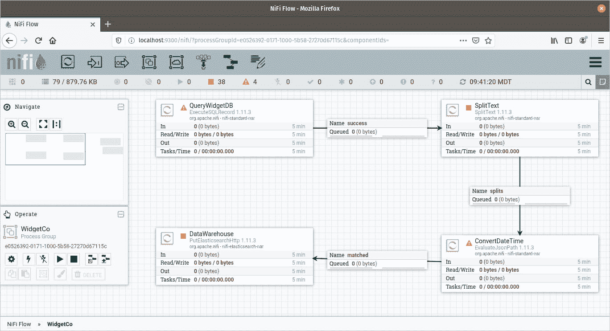

图 7.1 – 将小部件销售加载到仓库的数据管道

前面的数据管道查询小部件数据库。它将记录作为一个单独的 flowfile 传递给`SplitText`处理器，该处理器将每个记录发送到处理器，该处理器将日期和时间转换为 GMT。最后，它将结果加载到数据仓库中。

但是当你分割记录，然后日期转换失败会发生什么？你可以重新查询数据库，对吧？不，你不能，因为每分钟都在发生事务，失败的事务已被取消并且不再在数据库中，或者他们改变了顺序，现在想要一个红色的部件而不是最初订购的五个蓝色部件。你的营销团队不会高兴，因为他们不再了解这些变化，也无法计划如何转化这些销售。

示例的目的是为了说明在一个事务型数据库中，事务是持续发生的，数据正在被修改。运行一个查询会产生一组结果，如果你 5 分钟后再次运行相同的查询，结果可能会完全不同，你现在已经失去了原始数据。这就是为什么你需要分阶段提取数据的原因。

如果使用前面的管道示例进行分阶段处理，你最终会得到以下截图所示的管道：

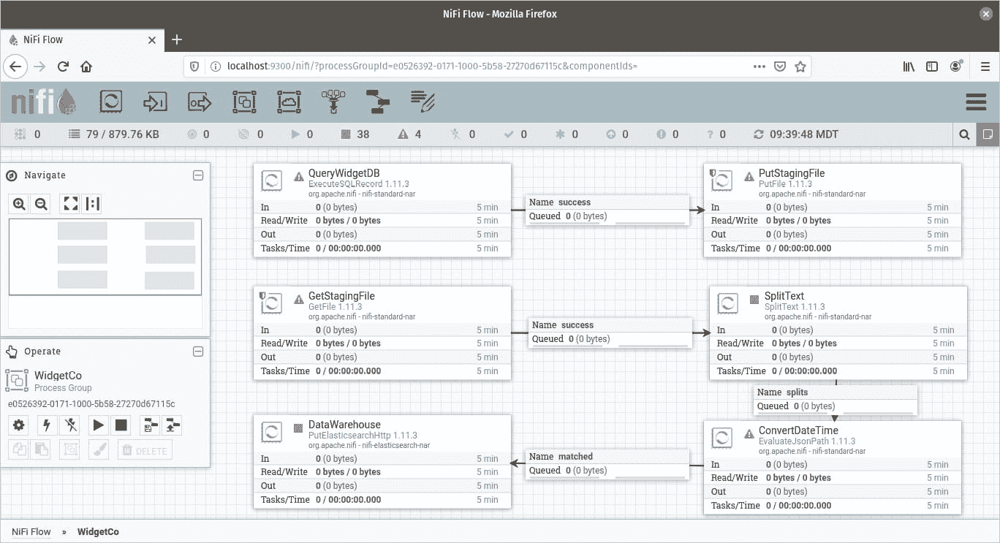

图 7.2 – 使用分阶段将小部件销售加载到仓库的数据管道

前面的数据管道以两个图表的形式显示。第一个图表查询小部件数据库并将结果放在磁盘上的文件中。这是分阶段步骤。从这里，下一个图表将加载数据，将记录分割成 flowfiles，转换日期和时间，最后将其加载到仓库中。如果这部分管道崩溃，或者你需要出于任何原因重放你的管道，你只需重新加载 CSV 文件，方法是重新启动数据管道的第二部分。你在原始查询时有一个数据库的副本。如果 3 个月后你的仓库被损坏，你可以使用每次查询的数据重放你的数据管道，即使数据库已经完全不同。 

在 CSV 文件中保留数据库提取副本的另一个好处是，它减少了重放管道的负载。如果你的查询资源密集型，可能只能在夜间运行，或者如果你查询的系统属于另一个部门、机构或公司。你不必再次使用他们的资源来修复错误，你只需使用副本即可。

在你到目前为止构建的 Airflow 数据管道中，你已经进行了查询预演。Airflow 的工作方式鼓励良好的实践。每个任务都已将结果保存到文件中，然后你在下一个任务中加载该文件。然而，在 NiFi 中，你的查询通常被发送到`SplitRecords`或`Text`处理器，到管道中的下一个处理器。这在生产中运行管道不是好的做法，并且从现在起，示例将不再是这样。

### 数据库中的预演

在数据管道的提取阶段，将数据存储在文件中是有帮助的。在管道的另一端，即加载阶段，最好将数据存储在数据库中，最好是仓库相同的数据库。让我们通过另一个例子来看看原因。

你已经查询了你的数据小部件数据库并进行了预演。下一个数据管道拾取数据，对其进行转换，然后将其加载到仓库中。但现在如果加载不正确会发生什么？也许记录已经进入并且一切看起来都很成功，但映射错误，日期是字符串。请注意，我没有说加载失败。你将在本章后面学习如何处理加载失败。

没有将数据实际加载到数据库中，你只能猜测可能会遇到的问题。通过预演，你将数据加载到数据仓库的副本中。然后你可以运行验证套件和查询，以查看是否得到预期的结果——例如，你可以从表中运行一个`select count(*)`查询，以查看是否得到正确的记录数。这将帮助你确切地知道你可能遇到的问题，或者如果没有问题，你不会遇到什么问题。

使用管道两端都进行预演的 Widget Co 数据管道应该看起来像以下截图中的管道：

![Figure 7.3 – 在管道两端使用预演的生产

![img/Figure_7.3_B15739.jpg]

Figure 7.3 – 在管道两端使用预演的生产

前一个截图中的数据管道查询了小部件数据库，并将结果存储在文件中。下一个阶段拾取该文件，并转换日期和时间。与早期示例的不同之处在于，数据管道现在将数据加载到数据仓库的副本中。数据管道的新部分随后查询此副本，执行一些验证，然后将它加载到最终的数据库或仓库中。

ETL 与 ELT

到目前为止，你已经看到了提取、转换和加载。然而，越来越多的人转向提取、加载和转换的过程。在 ELT 过程中，数据在提取后立即存储在数据库中，而不进行任何转换。你将在数据库中处理所有的转换。如果你使用基于 SQL 的转换工具，这将非常有帮助。没有正确或错误的方式，只有偏好和用例。

通过在数据管道的前端和末端进行数据阶段，您现在更适合处理错误，并在数据通过管道移动时验证数据。不要认为这些是数据阶段放置的唯一两个地方，或者数据必须放置在文件中。您可以在数据管道中的每个转换之后阶段数据。这样做将使调试错误更容易，并在错误发生后在任何数据管道点继续。随着转换变得更加耗时，这可能更有帮助。

您将小部件数据库的提取放置在文件中，但没有理由阻止您将数据提取到关系型或 noSQL 数据库中。将数据转储到文件中比将其加载到数据库中稍微简单一些 – 您不需要处理模式或构建任何额外的基础设施。

虽然阶段数据对于回放管道、处理错误和调试管道很有帮助，但它也有助于管道的验证阶段。在下一节中，您将学习如何使用 Great Expectations 在文件和数据库阶段数据上构建验证套件。

## 使用 Great Expectations 验证数据

当您的数据放置在文件或数据库中时，您有完美的机会来验证它。在*第五章**，清理、转换和丰富数据*中，您使用了 pandas 来执行探索性数据分析，了解哪些列存在，查找空值的数量，查看列内值的范围，并检查每个列的数据类型。Pandas 功能强大，通过使用 `value_counts` 和 `describe` 等方法，您可以获得大量关于数据的见解，但有一些工具可以使验证更加清晰，并使您对数据的期望更加明显。

本节中您将学习的库是 **Great Expectations**。以下是大纲页面的截图，您可以在其中加入并参与其中：

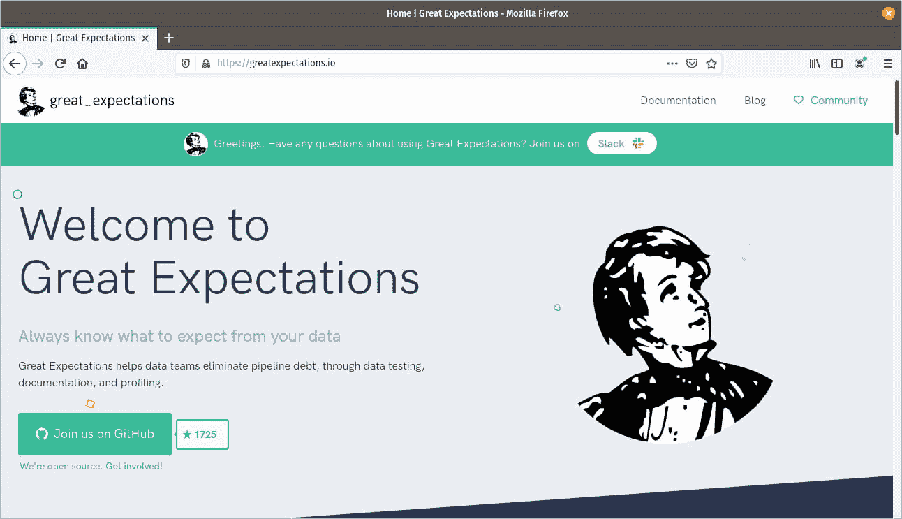

图 7.4 – 用于验证数据的 Great Expectations Python 库，以及其他功能

为什么选择 Great Expectations？因为使用 Great Expectations，您可以指定人类可读的期望，并让库处理实现。例如，您可以在代码中指定 `age` 列不应包含空值，如下所示：

```py
expect_column_values_to_not_be_null('age')
```

无论您的数据是在 DataFrame 中还是在数据库中，Great Expectations 都将处理执行此操作的逻辑。相同的期望将在任何数据上下文中运行。

### 开始使用 Great Expectations

使用 `pip3` 安装 Great Expectations 可以按照以下步骤进行：

```py
pip3 install great_expectations 
```

要查看 Great Expectations 生成的文档，您还需要在您的机器上安装 Jupyter Notebook。您也可以使用 `pip3` 安装 Notebook：

```py
pip3 install jupyter
```

安装完所需的要求后，你现在可以设置一个项目了。在 `$HOME/peoplepipeline` 目录下创建一个目录并按 *Enter* 键。你可以在 Linux 上使用以下命令来完成此操作：

```py
mkdir $HOME/peoplepipeline
cd $HOME/peoplepipeline
```

现在，你已经进入了项目目录，在设置 Great Expectations 之前，我们将导出我们将要处理的数据样本。使用来自 *第三章**，阅读和写入文件* 的代码，我们将生成 1,000 条与人物相关的记录。代码如下：

```py
from faker import Faker
import csv
output=open('people.csv','w')
fake=Faker()
header=['name','age','street','city','state','zip','lng','lat']
mywriter=csv.writer(output)
mywriter.writerow(header)
for r in range(1000):
    mywriter.writerow([fake.name(),fake.random_int(min=18,
    max=80, step=1), fake.street_address(), fake.city(),fake.
    state(),fake.zipcode(),fake.longitude(),fake.latitude()])
output.close()
```

上述代码创建了一个包含人物记录的 CSV 文件。我们将把这个 CSV 文件放入项目目录中。

现在，你可以通过使用命令行界面来设置这个项目上的 Great Expectations。以下命令将初始化你的项目：

```py
great_expectations init
```

你现在将经历一系列步骤来配置 Great Expectations。首先，Great Expectations 将询问你是否准备好继续。你的终端应该看起来如下截图所示：

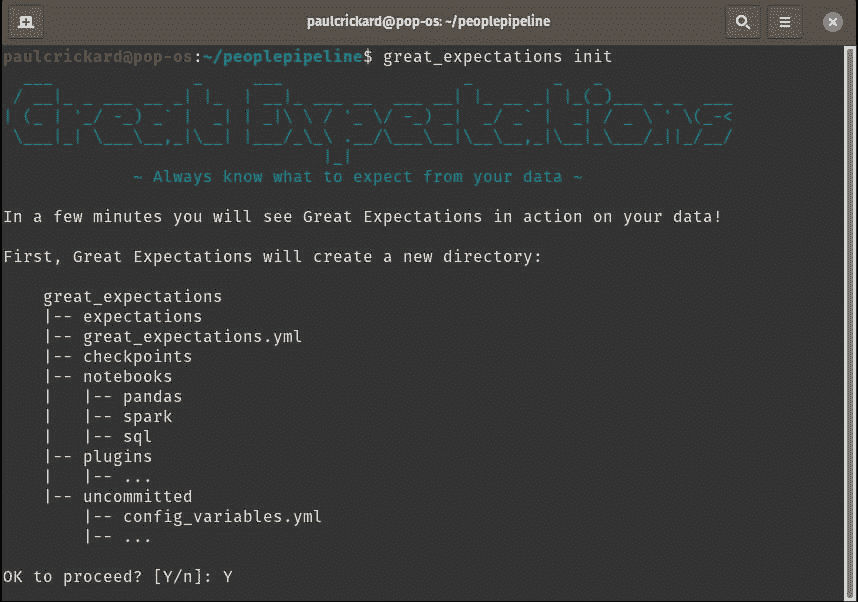


图 7.5 – 在项目上初始化 Great Expectations

输入 *Y* 并按 *Enter* 键后，你将收到一系列问题的提示：

```py
What data would you like Great Expectations to connect to?
What are you processing your files with?
Enter the path (relative or absolute) of a data file.
Name the new expectation suite [people.warning].
```

问题的答案显示在以下截图中，但应该是 `Files`、`Pandas`，即你放置文件的位置，以及你希望为其命名的任何名称：

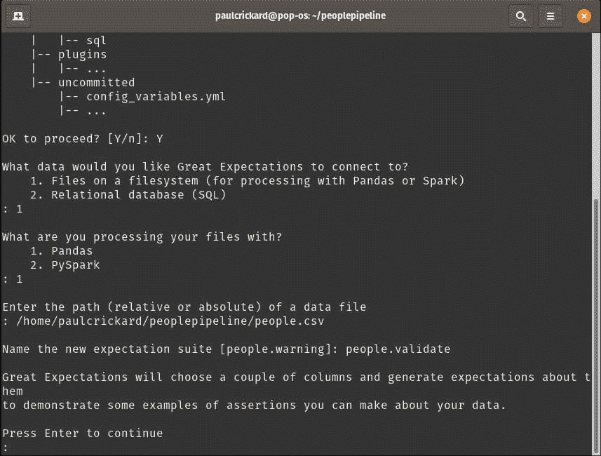


图 7.6 – 通过回答问题初始化 Great Expectations

当 Great Expectations 运行完成后，它会告诉你已经完成，并给出它生成的文档的路径，并在你的浏览器中打开该文档。文档看起来如下截图所示：

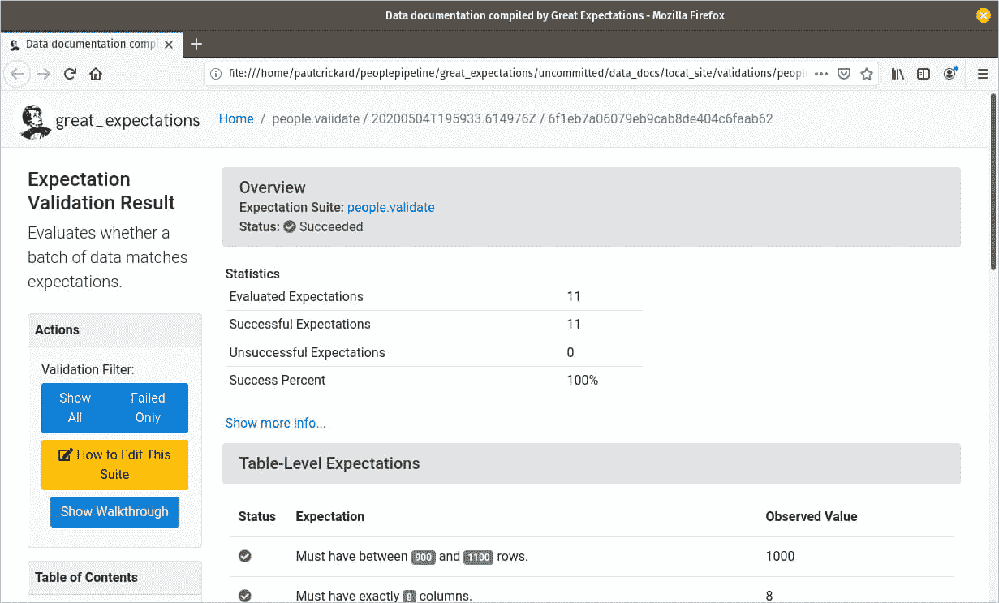


图 7.7 – Great Expectations 生成的文档

上一张截图显示了为 Great Expectations 套件生成的文档。你可以看到有 **11** 个预期，并且我们已经通过了所有的预期。这些预期非常基础，指定了应该存在多少条记录以及哪些列应该以什么顺序存在。此外，在代码中我指定了一个年龄范围。因此，**年龄** 有一个最小值和最大值。年龄必须大于 17 且小于 81 才能通过验证。你可以通过滚动查看生成的预期样本。以下截图显示了其中的一些：

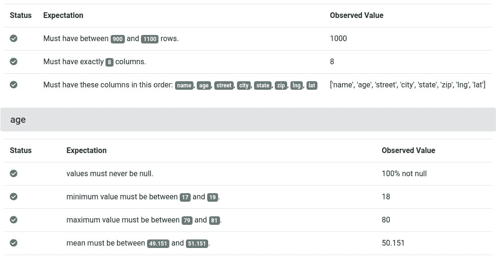


图 7.8 – 生成的预期样本

如你所见，预期非常严格——例如，年龄不能为空。让我们编辑预期。因为你已经安装了 Jupyter Notebook，所以你可以运行以下命令来一次性启动你的预期套件：

```py
great_expectations suite edit people.validate
```

你的浏览器将打开一个 Jupyter notebook，应该看起来如下截图所示：

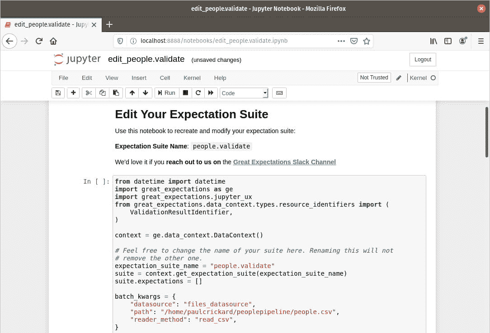

](img/Figure_7.9_B15739.jpg)

图 7.9 – 您的期望套件在 Jupyter 笔记本中

一些项目应在代码中突出显示 – 期望套件名称，以及`batch_kwargs`变量中您的数据文件路径。当您滚动浏览时，您将看到带有其类型标题的期望。如果您滚动到`Table_Expectation(s)`标题，我将通过删除单元格或删除单元格中的代码来删除行计数期望，如下面的截图所示：

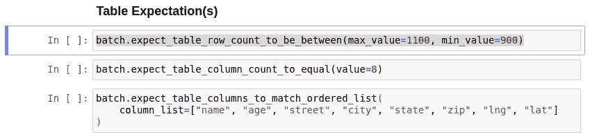

图 7.10 – 表期望

另一个需要编辑的期望是在`age`标题下。我将删除一个期望，具体来说是`expect_quantile_values_to_be_between`期望。确切的行如下面的截图所示：

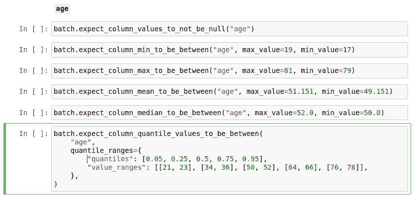

图 7.11 – 要删除的量分期望的年龄期望

您可以继续删除期望，或者添加新的期望，或者甚至只是修改现有期望的值。您可以在[`docs.greatexpectations.io/en/latest/reference/glossary_of_expectations.html`](https://docs.greatexpectations.io/en/latest/reference/glossary_of_expectations.html)找到可用期望的词汇表。

一旦您完成所有更改并且满意，您可以通过运行整个笔记本来保存对您的期望套件的更改。以下截图显示了如何操作 – 选择**单元格** | **运行所有**：

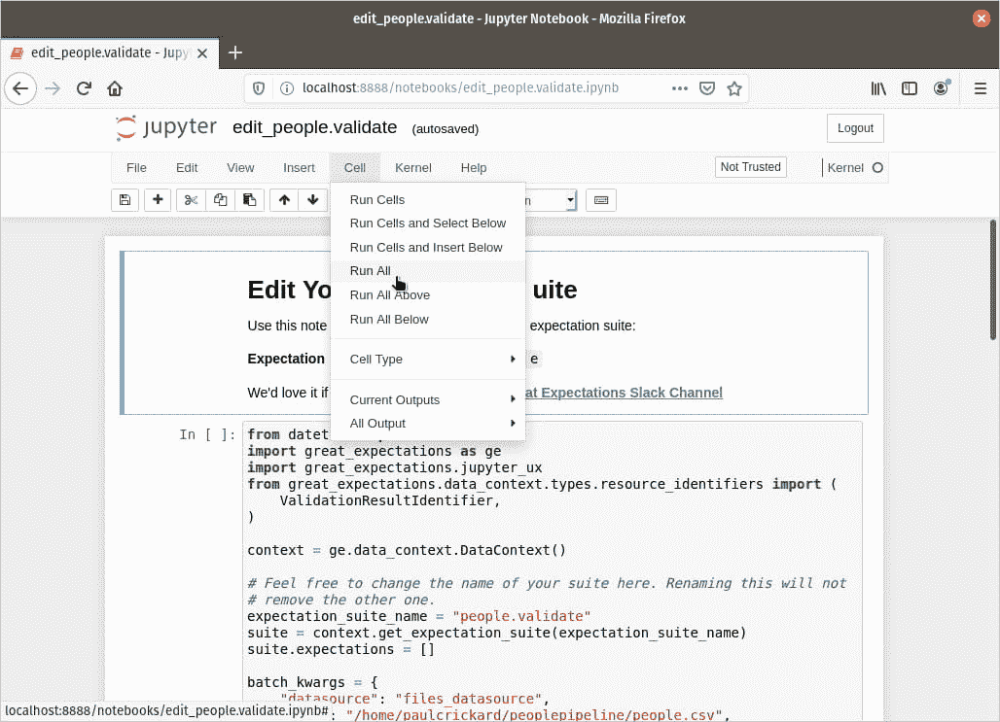

图 7.12 – 通过运行笔记本保存您的期望套件中的更改

现在您有了期望套件，是时候将其添加到您的管道中。在接下来的两个部分中，您将学习如何将其添加到您的管道中以供 NiFi 使用，或者将代码嵌入到您的管道中以供 Airflow 使用。

### 管道外部的 Great Expectations

到目前为止，您在编辑 Jupyter 笔记本内的期望套件时验证了数据。您可以使用像 Papermill 这样的库继续这样做，但这超出了本书的范围。然而，在本节中，您将创建一个 Tap 并从 NiFi 中运行它。

Papermill

Papermill 是 Netflix 创建的一个库，允许您创建参数化的 Jupyter 笔记本，并通过命令行运行它们。您可以为结果笔记本更改参数并指定输出目录。它与另一个 Netflix 库 Scrapbook 配合良好。您可以在 [`github.com/nteract`](https://github.com/nteract) 找到它们，以及其他有趣的项目，包括 Hydrogen。

Tap 是 Great Expectations 创建可执行 Python 文件以运行您的期望套件的方式。您可以使用命令行界面创建一个新的 Tap，如下所示：

```py
great_expectations tap new people.validate peoplevalidatescript.py
```

上述命令接受一个期望套件和一个 Python 文件名来创建。当它运行时，它会要求你提供一个数据文件。我已经将其指向你在上一节创建套件时使用的 `people.csv` 文件。这是数据管道在阶段数据时将覆盖的文件：

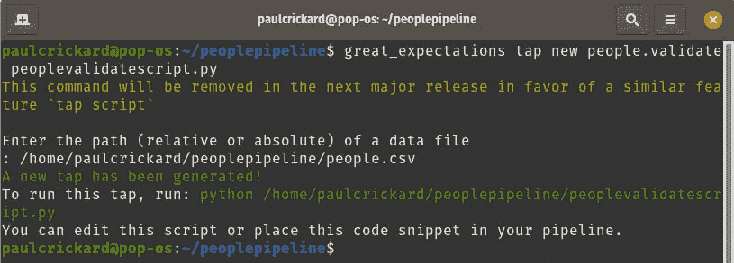

图 7.13 – 指定位置的 Python 文件的结果

如果你运行 tap，你应该会看到它成功了，如下面的截图所示：

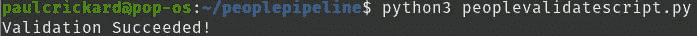

图 7.14 – Great Expectation tap 运行

你现在可以开始在 NiFi 中构建管道并使用 Great Expectations 验证你的数据了。下一节将带你了解这个过程。

#### NiFi 中的 Great Expectations

结合 NiFi 和 Great Expectations 需要对上一节中创建的 tap 进行一些修改。首先，你需要将所有的出口都改为 `0`。如果你有一个 `system.exit(1)` 的出口，NiFi 处理器会因为脚本失败而崩溃。我们希望脚本能够成功关闭，即使结果不成功，因为你要更改的第二件事是 `print` 语句。将 `print` 语句改为带有结果键和通过或失败值的 JSON 字符串。现在，即使脚本成功退出，我们也会在 NiFi 中知道它实际上是否通过。以下代码块显示了 tap 的代码，其中修改的部分用粗体表示：

```py
import sys
from great_expectations import DataContext
context = DataContext("/home/paulcrickard/peoplepipeline/great_expectations")
suite = context.get_expectation_suite("people.validate")
batch_kwargs = {
    "path": "/home/paulcrickard/peoplepipeline/people.csv",
    "datasource": "files_datasource",
    "reader_method": "read_csv",
}
batch = context.get_batch(batch_kwargs, suite)
results = context.run_validation_operator(
                               "action_list_operator", [batch])
if not results["success"]:
    print('{"result":"fail"}')
    sys.exit(0)
print('{"result":"pass"}')
sys.exit(0)
```

在完成对 tap 的更改后，你现在可以在 NiFi 中构建数据管道。以下截图是使用 tap 开始的数据管道：

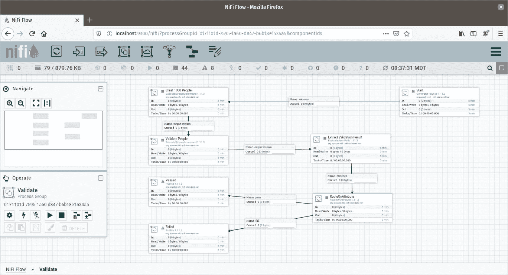

图 7.15 – 使用 Great Expectations 的 NiFi 数据管道

上述数据管道创建了 1,000 条记录并将其保存为 CSV 文件。然后它在数据上运行 tap 并读取结果——来自脚本的通过或失败 JSON。最后，它提取结果并将 flowfile 路由到通过或失败处理器。从那里，你的数据管道可以继续，或者它可以记录错误。你将在以下步骤中走过这个管道：

1.  数据管道首先生成一个没有任何数据的假 flowfile 来触发下一个处理器。你可以用查询你的事务数据库或从你的数据湖读取文件的处理器来替换这个处理器。我已经安排这个处理器每小时运行一次。

1.  一旦收到空流文件，`ExecuteStreamCommand` 处理器会调用 `loadcsv.py` Python 脚本。此文件来自 *第三章**，读取和写入文件*，并使用 `Faker` 创建 1,000 条虚假人物记录。`ExecuteStreamCommand` 处理器将读取脚本的输出。如果你有打印语句，每一行都会成为一个流文件。脚本有一个输出，那就是 `{"status":"Complete"}`。

1.  要配置处理器以运行脚本，你可以设置 `python3` – 如果你可以使用完整路径运行命令，你不需要全部输入。最后，设置 `loadcsv.py`。当处理器运行时，输出流文件将在以下屏幕截图显示：

    图 7.16 – 流文件显示 JSON 字符串

1.  下一个处理器也是一个 `ExecuteStreamCommand` 处理器。这次，脚本将是你的 tap。配置应该与上一步相同，除了 `peoplevalidatescript.py`。处理器完成后，流文件将包含带有通过或失败结果的 JSON。`pass` 流文件在以下屏幕截图显示：

    图 7.17 – 拨号结果，验证通过

1.  下一个处理器中提取了结果值 – `EvaluateJsonPath`。通过点击加号添加一个新属性，命名为 `result` 并将其值设置为 `$.result`。这将提取 `pass` 或 `fail` 值并将其作为流文件属性发送。

1.  下一个过程是 `RouteOnAttribute`。此处理器允许你创建可以用于连接到另一个处理器的属性的属性，这意味着你可以将每个属性发送到不同的路径。创建两个新属性 – `pass` 和 `fail`，其值在以下代码片段中显示：

    ```py
    ${result:startsWith('pass')}
    ${result:startsWith('fail')}
    ```

1.  前面的命令使用 NiFi 表达式语言读取流文件中结果属性的值。

1.  从这里，我在 `PutFile` 处理器处终止了数据管道。但现在你可以通过将 `pass` 和 `fail` 路径连接到上一个处理器中的相应关系来继续。如果通过了，你可以读取暂存文件并将数据插入到仓库中。

在本节中，你将 Great Expectations 连接到你的数据管道。tap 是使用你的数据生成的，因此测试通过了。管道以将文件写入磁盘结束。然而，你可以继续数据管道，将成功路由到数据仓库。在现实世界中，你的测试有时会失败。在下一节中，你将学习如何处理失败的测试。

### 验证失败

验证总是会通过，因为我们使用的脚本生成的记录都符合验证规则。如果我们更改了脚本怎么办？如果你编辑`loadcsv.py`脚本并更改最小和最大年龄，我们可以使验证失败。编辑如下所示：

```py
fake.random_int(min=1, max=100, step=1)
```

这将创建低于最小值和高于最大值的记录——希望如此，因为它是随机的，但 1000 条记录应该能让我们达到目标。一旦你编辑了脚本，你可以重新运行数据管道。最终的 flowfile 应该已经被路由到`fail`路径。Great Expectations 为你的验证创建文档。如果你记得，你最初在创建验证套件时看到了它们。现在你将有一个记录了通过和失败的运行。使用你的浏览器打开这些文档。路径位于你的项目文件夹中。例如，我的文档位于以下路径：

`file:///home/paulcrickard/peoplepipeline/great_expectations/uncommitted/data_docs/local_site/validations/people/validate/20200505T145722.862661Z/6f1eb7a06079eb9cab8de404c6faa b62.html`

文档应该显示所有的验证运行。文档将看起来像以下截图：

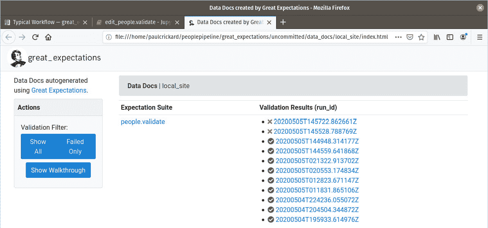

图 7.18 – 多次验证运行的结果

前面的截图显示了所有的验证运行。你可以看到表示失败的红色**x**。点击一个失败的运行，查看哪些期望未满足。结果应该是最小和最大年龄都没有达到。你应该看到这一点，如下面的截图所示：

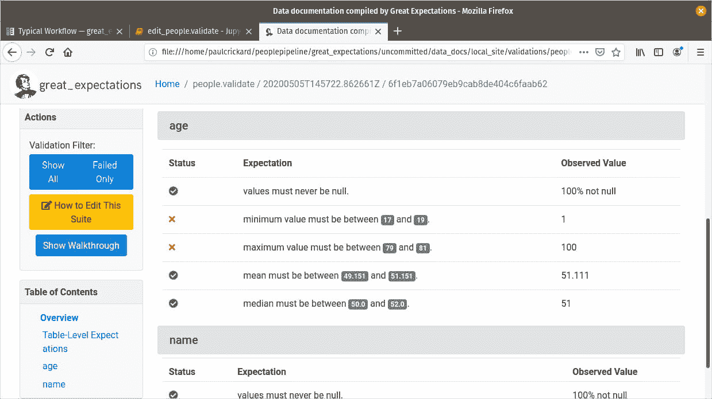

图 7.19 – 年龄期望未达到

在本节中，你创建了一个 Great Expectations 套件并指定了你的数据期望。以前，你将不得不手动使用 DataFrames 和大量的代码来完成这项工作。现在你可以使用可读性强的语句，并让 Great Expectations 来做这项工作。你已经创建了一个可以在你的 NiFi 数据管道内运行或使用 Cron 或其他工具调度的 tap。

### 关于 Airflow 的简要说明

在前面的例子中，你在管道外部运行了验证套件 – 脚本在管道中运行，但被处理器调用。你还可以在管道内运行代码，而不需要调用它。在 Apache Airflow 中，你可以创建一个具有来自 tap 的代码的验证任务。为了处理失败，你需要抛出一个异常。为此，在你的 Airflow 代码中导入库。我在下面的代码块中包含了你需要包含在你标准样板之上的库：

```py
import sys
from great_expectations import DataContext
from airflow.exceptions import AirflowException
from airflow import DAG
from airflow.operators.bash_operator import BashOperator
from airflow.operators.python_operator import PythonOperator
```

在导入所有库之后，你可以编写你的任务，如下面的代码块所示：

```py
def validateData():
	context = DataContext("/home/paulcrickard/peoplepipeline/great_expectations")
	suite = context.get_expectation_suite("people.validate")
	batch_kwargs = {
    	"path": "/home/paulcrickard/peoplepipeline/people.csv",
    	"datasource": "files_datasource",
    	"reader_method": "read_csv",
}
	batch = context.get_batch(batch_kwargs, suite)
	results = context.run_validation_operator(
                               "action_list_operator", [batch])
	if not results["success"]:
    		raise AirflowException("Validation Failed")
```

上述代码将引发错误，或者如果验证成功，则结束。然而，选择处理失败取决于您。您需要做的只是检查`results["success"]`是否为`True`。您现在可以编写其他函数，使用`PythonOperator`创建任务，然后设置与所有其他 Airflow 示例相同的下游关系。

以下几节将讨论生产数据管道的两个其他特性——幂等性和原子性。

# 构建幂等数据管道

生产数据管道的一个关键特性是它必须是幂等的。幂等被定义为*表示一个集合的元素，当它自身乘以或以其他方式操作时，其值不变*。

在数据科学中，这意味着当您的管道失败时，这不是一个“是否”的问题，而是一个“何时”的问题，它可以重新运行，并且结果相同。或者，如果您不小心连续三次错误地点击了管道的运行按钮，则不会有重复的记录——即使您连续多次错误地点击运行按钮。

在*第三章**，读取和写入文件*中，您创建了一个数据管道，生成了 1,000 条人员记录，并将这些数据放入 Elasticsearch 数据库中。如果您让这个管道每 5 分钟运行一次，那么 10 分钟后您将会有 2,000 条记录。在这个例子中，记录都是随机的，您可能没问题。但如果记录是从另一个系统中查询的行呢？

每次管道运行时，它都会反复插入相同的记录。您如何创建幂等数据管道取决于您使用的是哪些系统和您希望如何存储您的数据。

在前一章的 SeeClickFix 数据管道中，您查询了 SeeClickFix API。您没有指定任何滚动时间范围，以仅获取最新的记录，并且您的回填代码抓取了所有归档的问题。如果您按照计划每 8 小时运行此数据管道一次，那么您将抓取新问题，但也会抓取您已经有的问题。

SeeClickFix 数据管道使用 Elasticsearch 中的`upsert`方法来使管道幂等。使用`EvaluteJsonPath`处理器，您提取了问题 ID，然后将其用作`PutElasticsearchHttp`处理器中的`Identifier Attribute`。您还设置了`upsert`。这相当于在 SQL 中使用更新。不会重复记录，并且只有在有更改的情况下才会修改记录。

使数据管道幂等的另一种方法，一些功能数据工程倡导者所推崇的方法，是在每次运行数据管道时创建一个新的索引或分区。如果您将索引命名为带有时间戳后缀的名称，那么每次管道运行时都会得到一个新的具有不同记录的索引。这不仅使数据管道幂等，还从您的数据库索引中创建了一个不可变对象。索引永远不会改变；只是会添加新的索引。

# 构建原子数据管道

本章我们将讨论生产数据管道的最后一个特性，即原子性。原子性意味着如果事务中的单个操作失败，那么所有操作都会失败。如果你正在将 1,000 条记录插入数据库，就像你在*第三章*“读取和写入文件”中所做的那样，如果有一条记录失败，那么所有 1,000 条都会失败。

在 SQL 数据库中，如果记录编号 500 失败，数据库将回滚所有更改，并且将不再尝试继续。你现在可以自由地重试事务。失败可能由许多原因引起，其中一些是你无法控制的。如果你在插入记录时电源或网络中断，你希望这些记录被保存到数据库中吗？那么你需要确定事务中哪些记录成功，哪些失败，然后只重试失败的记录。这将比重试整个事务容易得多。

在你构建的 NiFi 数据管道中，没有原子性。在 SeeClickFix 示例中，每个问题都作为一个 flowfile 发送，并在 Elasticsearch 中更新。唯一存在的原子性是文档（问题）中的每个字段都成功或失败。但可能存在这样的情况：所有问题都失败了，只有一个成功了，这会导致数据管道成功。

Elasticsearch 没有原子事务，因此任何实现 Elasticsearch 的数据管道都需要在逻辑中处理这一点。例如，你可以跟踪在 Elasticsearch 中索引的每条记录以及每个失败关系。如果在运行过程中出现失败关系，那么就会删除所有成功索引的问题。以下截图显示了示例数据管道：

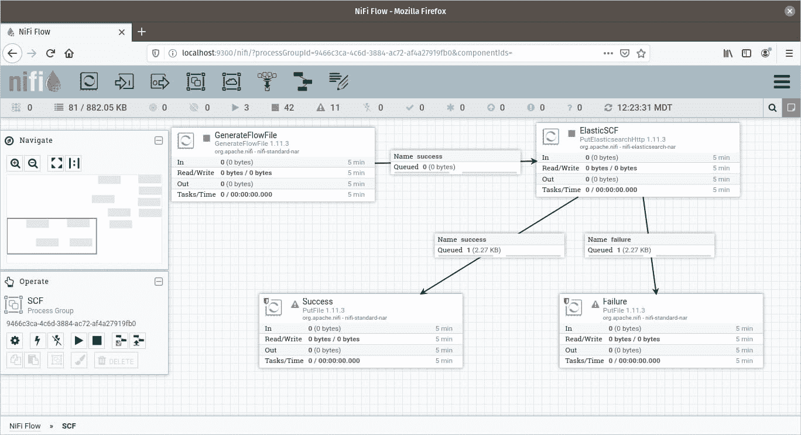

图 7.20 – 将原子性构建到数据管道中

前面的数据管道创建了两个 flowfiles；一个成功，一个失败。两个的内容都放在磁盘上的文件中。从这里，你的数据管道可以列出失败目录中的文件。如果有零个或多个，那么可以读取成功文件并将它们从 Elasticsearch 中删除。

这并不优雅，但原子性很重要。当失败只是部分时，调试数据管道失败非常困难且耗时。为了引入原子性所需的额外工作是非常值得的。

SQL 数据库在事务中内置了原子性。使用如`psycopg2`这样的库，你可以将多个插入、更新或删除操作合并为一个事务，并保证结果要么是所有操作都成功，要么是事务失败。

创建幂等性和原子性的数据管道在创建数据管道时需要额外的工作。但是，如果没有这两个特性，你的数据管道在意外多次运行时（非幂等）或存在缺失记录时（非原子）会对结果进行更改。调试这些问题是困难的，因此，在使你的数据管道幂等和原子性上花费的时间是值得的。

# 摘要

在本章中，你学习了生产数据管道的三个关键特性：预演和验证、幂等性和原子性。你学习了如何使用 Great Expectations 为你的数据管道中的预演数据添加生产级验证。你还学习了如何将幂等性和原子性融入你的管道中。掌握这些技能后，你可以构建更健壮、适用于生产环境的管道。

在下一章中，你将学习如何使用 NiFi 注册表进行版本控制。
