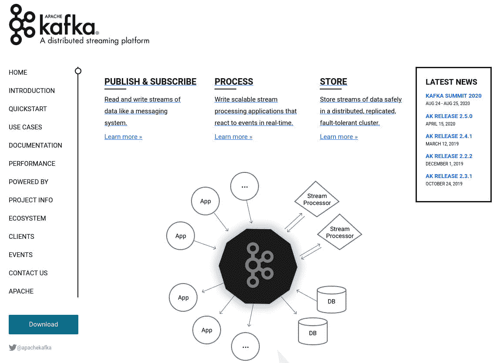
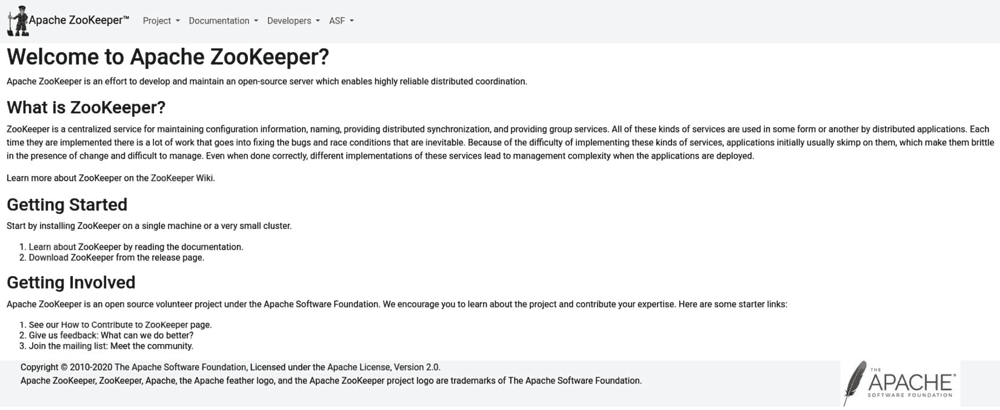
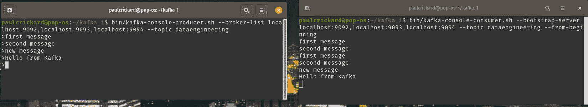

# 第十二章：*第十二章*：构建 Kafka 集群

在本章中，您将超越批量处理 – 在完整数据集上运行查询 – 并了解流处理中使用的工具。在流处理中，数据在查询时可能是无限的和不完整的。处理流数据的主要工具之一是 Apache Kafka。Kafka 是一个允许您将数据实时发送到主题的工具。这些主题可以被消费者读取并处理数据。本章将教您如何构建一个三节点 Apache Kafka 集群。您还将学习如何创建和发送消息（**生产**）以及从主题中读取数据（**消费**）。

在本章中，我们将涵盖以下主要主题：

+   创建 ZooKeeper 和 Kafka 集群

+   测试 Kafka 集群

# 创建 ZooKeeper 和 Kafka 集群

大多数关于运行可分布式应用程序的教程通常只展示如何运行单个节点，然后您会想知道如何在生产环境中运行。在本节中，您将构建一个三节点 ZooKeeper 和 Kafka 集群。它将在一台机器上运行。然而，我将每个实例分割到其自己的文件夹中，每个文件夹模拟一个服务器。在运行在不同服务器上的唯一修改就是将 localhost 更改为服务器 IP。

下一章将详细介绍 Apache Kafka 的主题，但到目前为止，了解 Kafka 是一个用于构建实时数据流的工具就足够了。Kafka 是在 LinkedIn 开发的，现在是一个 Apache 项目。您可以在 [`kafka.apache.org`](http://kafka.apache.org) 上找到 Kafka。网站截图如下：



图 12.1 – Apache Kafka 网站

Kafka 需要另一个应用程序 ZooKeeper 来管理有关集群的信息，处理发现并选举领导者。您可以自己安装和构建 ZooKeeper 集群，但在此示例中，您将使用 Kafka 提供的 ZooKeeper 脚本。要了解更多关于 ZooKeeper 的信息，您可以在 [`zookeeper.apache.org`](http://zookeeper.apache.org) 上找到它。网站截图如下：



图 12.2 – Apache ZooKeeper 网站

以下部分将指导您构建集群。

## 下载 Kafka 和设置环境

您可以从网站上的 `wget` 下载 Apache Kafka，从命令行运行以下命令：

```py
Wget https://downloads.apache.org/kafka/2.5.0/kafka_2.12-2.5.0.tgz
tar -xvzf kafka_2.12-2.5.0.tgz 
```

之前的命令下载了当前的 Kafka 版本并将其提取到当前目录中。由于您将运行三个节点，您需要为 Kafka 创建三个单独的文件夹。使用以下命令创建目录：

```py
cp kafka_2.12-2.5.0 kafka_1
cp kafka_2.12-2.5.0 kafka_2
cp kafka_2.12-2.5.0 kafka_3
```

现在，您将拥有三个 Kafka 文件夹。您还需要为 Kafka 的每个实例指定一个日志目录。您可以使用 `mkdir` 命令创建三个文件夹，如下所示：

```py
mkdir logs_1
mkdir logs_2
mkdir logs_2
```

接下来，您需要为 ZooKeeper 创建一个 `data` 文件夹。创建该目录，然后使用 `cd` 进入，如下所示：

```py
mkdir data
cd data
```

您将运行三个 ZooKeeper 实例，因此您需要为每个实例创建一个文件夹。您可以使用 `mkdir` 命令来完成，如下所示：

```py
mkdir zookeeper_1
mkdir zookeeper_2
mkdir zookeeper_3
```

每个 ZooKeeper 实例需要一个 ID。它将寻找一个名为 `myid` 的文件，其中包含一个整数值。在每个文件夹中，创建相应的 `myid` 文件并设置正确的值。以下命令将创建该文件：

```py
echo 1 > zookeeper_1/myid
echo 2 > zookeeper_2/myid
echo 3 > zookeeper_3/myid
```

您已完成配置 ZooKeeper 和 Kafka 的先决任务。现在您可以编辑两者的配置文件。下一节将指导您完成这个过程。

## 配置 ZooKeeper 和 Kafka

ZooKeeper 和 Kafka 的配置文件都位于 Kafka 目录下的 `conf` 文件夹中。由于您有三个 Kafka 目录，我将通过 `Kafka_1` 进行说明，步骤需要应用到其他每个目录。

从 `~/kafka_1/conf` 目录，您需要编辑 `zookeeper.properties` 文件。您将编辑数据目录和服务器，以及添加属性。配置文件如下所示，其中修改的内容用粗体标出（完整文件请参考 GitHub 仓库）：

```py
# the directory where the snapshot is stored.
dataDir=/home/paulcrickard/data/zookeeper_1
# the port at which the clients will connect
clientPort=2181
# disable the per-ip limit on the number of connections since this is a non-production config
maxClientCnxns=0
# Disable the adminserver by default to avoid port conflicts.
# Set the port to something non-conflicting if choosing to enable this
admin.enableServer=false
# admin.serverPort=8080
tickTime=2000
initLimit=5
syncLimit=2
server.1=localhost:2666:3666
server.2=localhost:2667:3667
server.3=localhost:2668:3668
```

修改完成后，您可以保存文件。现在您需要修改 `kafka_2` 和 `kafka_3` 目录中的此文件。请注意，`dataDir` 设置将分别以 `zookeeper_2` 和 `zookeeper_3` 结尾。此外，端口号应递增到 `2182` 和 `2183`。其他所有内容都将保持不变。再次强调，您更改目录和端口号的唯一原因是可以在单台机器上运行三个服务器。在三个不同的服务器上，您将保持设置不变，只需将 localhost 更改为服务器的 IP 地址。

现在，ZooKeeper 已配置完毕，您可以配置 Kafka。在相同的 `conf` 目录中，打开 `server.properties` 文件。文件中用粗体标出了编辑内容（完整文件请参考 GitHub 仓库）：

```py
############################# Server Basics #############################
# The id of the broker. This must be set to a unique integer for each broker.
broker.id=1
############################# Socket Server Settings #############################
# The address the socket server listens on. It will get the value returned from 
# java.net.InetAddress.getCanonicalHostName() if not configured.
#   FORMAT:
#     listeners = listener_name://host_name:port
#   EXAMPLE:
#     listeners = PLAINTEXT://your.host.name:9092
listeners=PLAINTEXT://localhost:9092
############################# Log Basics #############################
# A comma separated list of directories under which to store log files
log.dirs=/home/paulcrickard/logs_1
############################# Zookeeper #############################
# Zookeeper connection string (see zookeeper docs for details).
# This is a comma separated host:port pairs, each corresponding to a zk
# server. e.g. "127.0.0.1:3000,127.0.0.1:3001,127.0.0.1:3002".
# You can also append an optional chroot string to the urls to specify the
# root directory for all kafka znodes.
zookeeper.connect=localhost:2181,localhost:2182,localhost:2183
```

对于每个 Kafka 目录，您需要修改 `server.properties` 文件，使其具有 `1`、`2` 和 `3` 的代理 ID。您可以使用任何整数，但我会保持它们与文件夹名称相同。此外，您需要将监听器设置为 `localhost:9092`、`localhost:9093` 和 `localhost:9094`。`log.dirs` 属性将被设置为 `log_1`、`log_2` 和 `log_3` 文件夹中的每一个。所有三个配置的 `zookeeper.connect` 属性都将具有相同的值。

您已创建了模拟三个服务器所需的所有必要目录，并已配置了 ZooKeeper 和 Kafka。现在您可以开始启动集群。

## 启动 ZooKeeper 和 Kafka 集群

要运行服务器，您需要打开六个终端 – 您不能在后台运行它们。

Docker

您可以使用 Docker Compose 来运行多个容器，并通过单个文件启动所有内容。容器是一个出色的工具，但超出了本书的范围。

在前三个终端中，您将启动 ZooKeeper 集群。在每个终端中，输入每个实例的 Kafka 文件夹。运行以下命令：

```py
bin/zookeeper-server-start.sh config/zookeeper.properties 
```

当您启动所有服务器时，服务器将寻找彼此并举行选举，因此会有大量文本滚动。一旦它们连接，文本将停止，集群将准备就绪。

要启动 Kafka 集群，在每个剩余的三个终端中输入 `kafka` 目录的一个实例。然后，您可以在每个终端中运行以下命令：

```py
bin/kafka-server-start.sh config/server.properties
```

当您完成时，每个终端都应该有一行看起来像以下这样的行：

```py
INFO [ZookeeperClient Kafka server] Connected. (kafka.zookeeper.zookeeperClient)
```

现在，您有两个由三个节点组成的集群正在运行，分别用于 ZooKeeper 和 Kafka。为了测试集群并确保一切正常工作，下一节将创建一个主题、一个消费者和一个生产者，并发送一些消息。

# 测试 Kafka 集群

Kafka 附带了一些脚本，允许您从命令行执行一些基本功能。要测试集群，您可以创建一个主题，创建一个生产者，发送一些消息，然后创建一个消费者来读取它们。如果消费者可以读取它们，则您的集群正在运行。

要创建一个主题，从您的 `kafka_1` 目录运行以下命令：

```py
bin/kafka-topics.sh --create --zookeeper localhost:2181,localhost:2182,localhost:2183 --replication-factor 2 --partitions 1 --topic dataengineering
```

上述命令使用 `create` 标志运行 `kafka-topics` 脚本。然后指定 ZooKeeper 集群的 IP 地址和主题。如果主题已创建，终端将打印以下行：

```py
created topic dataengineering
```

您可以通过使用相同的脚本并带有 `list` 标志来列出 Kafka 集群中的所有主题来验证这一点：

```py
bin/kafka-topics.sh –list --zookeeper localhost:2181,localhost:2182,localhost:2183
```

结果应该是一行：`dataengineering`。现在您已经有一个主题，您可以在其上发送和接收消息。下一节将向您展示如何操作。

## 使用消息测试集群

在接下来的章节中，您将使用 Apache NiFi 和 Python 来发送和接收消息，但为了快速测试集群，您也可以使用提供的脚本来完成这项工作。要创建一个生产者，请使用以下命令：

```py
bin/kafka-console-producer.sh --broker-list localhost:9092,localhost:9093,localhost:9094 --topic dataengineering
```

上述命令使用带有 `broker-list` 标志的 `kafka-console-producer` 脚本，该标志传递 `kafka` 集群服务器。最后，它接受一个主题，因为我们只有一个，所以它是 `dataengineering`。当它准备好时，您将有一个 `>` 提示符，可以输入消息。

要读取消息，您需要使用 `kafka-console-consumer` 脚本。命令如下所示：

```py
bin/kafka-console-consumer.sh --zookeeper localhost:2181,localhost:2182,localhost:2183 --topic dataengineering –from-beginning
```

消费者传递带有服务器列表的 `zookeeper` 标志。它还指定了主题和 `from-beginning` 标志。如果您已经读取了消息，您可以指定带有最后一条消息索引的 `offset` 标志，这样您就可以从您的最后位置开始。

将生产者和消费者终端并排放置，您应该会有以下截图类似的东西：



图 12.3 – 生产者和消费者

在前面的屏幕截图中，你会注意到我两次输入了“第一条消息”和“第二条消息”。当消费者启动时，它会读取该主题上的所有消息。一旦它读取完毕，它将等待新的消息。如果你在生产者那里输入一条消息，它将在短暂的延迟后出现在消费者窗口中。

现在，你已经拥有了一个完全功能化的 Kafka 集群，并准备好在下一章中继续使用 NiFi 和 Python 进行流处理。

# 摘要

在本章中，你学习了如何创建一个 Kafka 集群，这需要创建一个 ZooKeeper 集群。虽然你是在一台机器上运行所有实例，但你采取的步骤也适用于不同的服务器。Kafka 允许创建实时数据流，并且需要与之前你进行的批量处理不同的思维方式。

下一章将深入解释流中涉及的概念。你还将学习如何在 NiFi 和 Python 中处理流。
