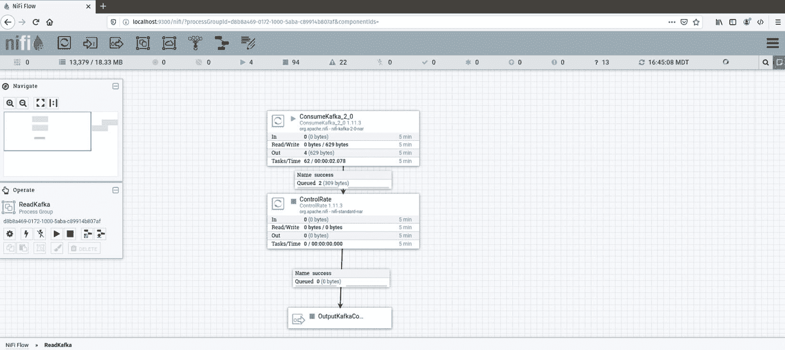

# 第十三章：*第十三章*：使用 Apache Kafka 进行流数据

Apache Kafka 打开了实时数据流的世界。虽然流处理和批处理之间存在基本差异，但你构建数据管道的方式将非常相似。理解流数据与批处理之间的差异将使你能够构建考虑这些差异的数据管道。

在本章中，我们将涵盖以下主要主题：

+   理解日志

+   理解 Kafka 如何使用日志

+   使用 Kafka 和 NiFi 构建数据管道

+   区分流处理和批处理

+   使用 Python 进行生产和消费

# 理解日志

如果你编写过代码，你可能熟悉软件日志。软件开发者使用日志将应用程序的输出写入文本文件以存储软件内部发生的事件。然后，他们使用这些日志来帮助调试出现的任何问题。在 Python 中，你可能实现了类似于以下代码的代码：

```py
import logging
logging.basicConfig(level=0,filename='python-log.log', filemode='w', format='%(levelname)s - %(message)s')
logging.debug('Attempted to divide by zero')
logging.warning('User left field blank in the form')
logging.error('Couldn't find specified file')
```

前面的代码是一个基本的日志记录示例，它将不同的级别——`debug`、`warning`和`error`——记录到名为`python-log.log`的文件中。该代码将产生以下输出：

```py
DEBUG - Attempted to divide by zero
WARNING - User left field blank in the form
ERROR - Couldn't find specified file
```

消息按照它们发生的顺序记录到文件中。然而，你并不知道事件发生的确切时间。你可以通过添加时间戳来改进这个日志，如下面的代码所示：

```py
logging.basicConfig(level=0,filename='python-log.log', filemode='w', format='%(asctime)s - %(levelname)s - %(message)s')
logging.info('Something happened')
logging.info('Something else happened, and it was bad')
```

前面代码的结果显示在下面的代码块中。注意现在有一个时间戳。日志是有序的，就像之前的日志一样。然而，在这个日志中，确切的时间是已知的：

```py
2020-06-21 10:55:40,278 - INFO - Something happened
2020-06-21 10:55:40,278 - INFO - Something else happened, and it was bad
```

在前面的日志中，你应该注意到它们遵循一个非常特定的格式，或者说是模式，这个模式在`basicConfig`中定义。另一个你可能熟悉的常见日志是`web`日志。

Web 服务器日志类似于软件日志；它们按时间顺序报告事件——通常是请求——包括时间戳和事件。这些日志遵循一个非常特定的格式，并且有许多工具可用于解析它们。数据库也使用日志来帮助复制并记录事务中的修改。

如果应用程序、Web 服务器和数据库都使用日志，并且它们都有所不同，那么日志究竟是什么？

**日志**是有序事件或记录的集合，是只追加的。

这就是全部内容。简单。直接。然而，在软件开发和数据处理中却是一个极其强大的工具。以下图表显示了一个示例日志：


图 13.1 – 日志的一个示例

上述图显示了单个记录作为块。第一个记录在左侧。时间由记录在日志中的位置表示。另一个记录右侧的记录较新。因此，记录**3**比记录**2**新。记录不会被从日志中删除，而是追加到末尾。记录**9**被添加到日志的右侧，因为它是最新的记录——直到记录 10 出现。

# 理解 Kafka 如何使用日志

Kafka 维护由生产者写入并由消费者读取的日志。以下章节将解释主题、消费者和生产者。

## 主题

Apache Kafka 使用日志来存储数据——记录。Kafka 中的日志被称为`dataengineering`。主题被保存为日志文件存储在磁盘上。主题可以是一个单独的日志，但通常它们会水平扩展到分区。每个分区是一个日志文件，可以存储在另一台服务器上。在具有分区的主题中，消息顺序保证不再适用于主题，而只适用于每个分区。以下图显示了将主题分割成三个分区的情况：


图 13.2 – 具有三个分区的 Kafka 主题

上述主题——**事务**——有三个标记为**P1**、**P2**和**P3**的分区。在每个分区内部，记录是有序的，左侧的记录比右侧的记录旧——框中的数字越大，记录越新。你会注意到记录在**P1**中有**K:A**，在**P2**和**P3**中分别有**K:B**和**K:C**。那些是与记录关联的键。通过分配键，你可以保证包含相同键的记录将进入同一个分区。虽然主题中记录的顺序可能是不规则的，但每个分区是有序的。

## Kafka 生产者和消费者

Kafka 生产者将数据发送到主题和分区。记录可以轮询发送到分区，或者你可以使用键将数据发送到特定的分区。当你使用生产者发送消息时，你可以以三种方式之一进行：

+   **发送后即忘**：你发送一条消息并继续操作。你不需要等待 Kafka 的确认。在此方法中，记录可能会丢失。

+   **同步**：发送一条消息，并在继续之前等待响应。

+   **异步**：发送一条消息和一个回调。消息发送后，你可以继续操作，但会在某个时候收到一个你可以处理的响应。

生产者相当直接——它们向主题和分区发送消息，可能请求确认，如果消息失败则重试——或者不重试——然后继续。然而，消费者可能更复杂一些。

消费者从主题中读取消息。消费者在一个无限循环的轮询中运行，等待消息。消费者可以从开始处读取——它们将从主题中的第一条消息开始读取整个历史记录。一旦追上，消费者将等待新消息。

如果消费者读取五条消息，偏移量是五。偏移量是消费者在主题中的位置。它是消费者停止读取的位置的标记。消费者可以从偏移量或指定的偏移量开始读取主题，该偏移量由 Zookeeper 存储。

当你在 `dataengineering` 主题上有消费者，但主题有三个分区且写入记录的速度比你读取的速度快时，会发生什么？以下图显示了一个消费者试图消费三个分区：


图 13.3 – 单个消费者读取多个分区

使用消费者组，您可以扩展 Kafka 主题的读取。在前面的图中，消费者 **C1** 在一个消费者组中，但它是唯一的消费者。通过添加额外的消费者，可以将主题进行分配。以下图显示了这种情况：


图 13.4 – 消费者组中的两个消费者消费三个分区

前面的图显示，组中的分区数仍然多于消费者数，这意味着一个消费者将处理多个分区。您可以根据以下图添加更多消费者：


图 13.5 – 消费者数量多于分区数导致一个空闲

在前面的图中，消费者组中的消费者数量多于分区数。当消费者数量多于分区数时，消费者将处于空闲状态。因此，没有必要创建多于分区数的消费者。

然而，您可以创建多个消费者组。以下图显示了这种情况：


图 13.6 – 多个消费者组从单个主题读取

多个消费者组可以读取同一个分区。为每个需要访问主题的应用程序创建一个消费者组是良好的实践。

现在你已经了解了与 Kafka 一起工作的基础知识，下一节将向你展示如何使用 NiFi 和 Kafka 构建数据管道。

# 使用 Kafka 和 NiFi 构建数据管道

要使用 Apache Kafka 构建数据管道，您需要创建一个生产者，因为我们没有可连接的生产 Kafka 集群。在生产者运行时，您可以像读取其他文件或数据库一样读取数据。

## Kafka 生产者

Kafka 生产者将利用来自*第十一章**，项目 — 构建生产数据管道*的生产数据管道。生产者数据管道所做的只是将数据发送到 Kafka 主题。以下截图显示了完成的生产者数据管道：


Figure 13.7 – NiFi 数据管道

要创建数据管道，请执行以下步骤：

1.  打开终端。在 NiFi 中向其发送消息之前，您需要先创建主题。输入以下命令：

    ```py
    3. This will allow you to test using Consumer Groups in the next section.
    ```

1.  按照以下截图所示，将输入端口拖动并连接到 `ReadDataLake` 处理器组的输出：

    Figure 13.8 – 连接输入端口到输出端口

1.  接下来，将 `ControlRate` 处理器拖放到画布上。`ControlRate` 处理器将允许我们比仅使用队列中的背压有更多控制地减慢数据流。这将使数据看起来是流式传输到 Kafka 主题，而不是一次性全部存在。如果您一次性写入所有内容，一旦读取完毕，管道将停止，直到您添加更多数据。

1.  要配置 `ControlRate` 处理器，设置 `flowfile count`。设置为 `1`。这两个属性允许您指定通过的数据量。由于您使用了 flowfile count，最大速率将是一个整数，表示允许通过的 flowfile 数量。如果您使用了默认选项，则应设置为 `1 MB`。最后，在 **Time Duration** 属性中指定允许最大速率通过的频率。我将其设置为 1 分钟。每分钟，将有一个 flowfile 发送到用户的 Kafka 主题。

1.  要将数据发送到 Kafka，将 `PublishKafka_2_0` 处理器拖放到画布上。有多个 Kafka 处理器用于不同版本的 Kafka。要配置处理器，您将设置 `localhost:9092`、`localhost:9093` 和 `localhost:9094`。Kafka broker 是 Kafka 服务器。由于您正在运行一个集群，您将输入所有 IP 地址作为逗号分隔的字符串——就像您在前一章的命令行示例中所做的那样。输入 **Topic Name** 作为用户和 **Delivery Guarantee** 属性为 **Guarantee Replication Delivery**。

您现在已在 NiFi 中配置了 Kafka 生成器，它将从 `ReadDataLake` 获取输出，并以一分钟间隔将每条记录发送到 Kafka。要读取主题，您将创建一个 NiFi 数据管道。

## Kafka 消费者

作为数据工程师，您可能需要或不需设置 Kafka 集群和生成器。然而，正如您在本书的开始所学的，数据工程师的角色差异很大，构建 Kafka 基础设施可能是您工作的一部分。Kafka 在主题上接收消息后，是时候读取这些消息了。

完成后的数据管道如图所示：




Figure 13.9 – Consuming a Kafka topic in NiFi

要创建数据管道，请执行以下步骤：

1.  将`ConsumeKafka_2_0`处理器拖放到画布上。要配置处理器，将 Kafka 代理设置为您的集群——`localhost:9092`、`localhost:9093`和`localhost:9094`。设置`users`和`Earliest`。最后，设置`NiFi Consumer`。**Group ID**属性定义了消费者（处理器）将成为其一部分的消费者组。

1.  接下来，我已经将`ControlRate`处理器添加到画布上。`ControlRate`处理器将减慢对主题上已有记录的读取速度。如果主题不是太大，您可以使用队列上的背压，这样一旦您处理了历史数据，新的记录将实时移动。

1.  要配置`ControlRate`处理器，设置`flowfile count`为`1`，`1`分钟。

1.  在画布上添加一个输出端口并命名它。我将其命名为`OutputKafkaConsumer`。这将允许您将此处理器组连接到其他处理器组以完成数据处理管道。

1.  启动处理器组，您将每分钟看到处理记录。您正在使用单个消费者在一个消费者组中读取 Kafka 主题。如果您还记得，当您创建主题时，您将分区数设置为三个。因为有多个分区，您可以向组中添加更多消费者。为此，您只需添加另一个`ConsumeKafka_2_0`处理器并对其进行配置。

1.  将另一个`ConsumeKafka_2_0`处理器拖放到画布上。使用相同的 Kafka 代理进行配置——`localhost:9092`、`localhost:9093`和`localhost:9094`——以及相同的主题——`users`。设置`NiFi Consumer`。

1.  现在两个处理器具有相同的组 ID，它们将成为同一个消费者组的成员。在两个消费者和三个分区的情况下，一个消费者将读取两个分区，另一个将读取一个。如果主题正在流式传输大量数据，您可以添加另一个`ConsumeKafka_2_0`处理器，但超过三个将处于空闲状态。

新的数据管道在以下屏幕截图中显示：

![图 13.10 – 在消费者组中使用多个消费者消费 Kafka

![img/Figure_13.10_B15739.jpg]

图 13.10 – 在消费者组中使用多个消费者消费 Kafka

运行处理器组，您将开始看到记录通过两个`ConsumerKafka_2_0`处理器流动。生产者的配置将决定哪些分区记录被发送以及有多少将通过您的消费者。由于默认设置和消费者数量，您可能会看到每个由另一个消费者处理的 flowfile，只有一个消费者处理两个 flowfile。

正如您可以向消费者组添加更多消费者一样，您可以让多个消费者组读取一个主题——消费者组的数量与分区数量没有任何关系。

要将另一个消费者组添加到数据管道中，拖放另一个 `ConsumeKafka_2_0` 处理器。设置 `localhost:9092`、`localhost:9093` 和 `localhost:9094`，并设置 `users`。组 ID 是消费者组的名称。将其设置为除 `NiFi Consumer` 之外的其他任何名称 – 因为这个消费者组已经存在。我将其设置为 `NiFi Consumer2` – 几乎没有创意或原创性，但它完成了工作。现在数据管道将看起来像以下屏幕截图：


图 13.11 – NiFi 中的两个消费者组

在前面的屏幕截图中，您会注意到第二个消费者组上没有 `ControlRate` 处理器。一旦启动，处理器将消费主题的全部历史记录并将记录发送到下游。主题中有 17 条记录。其他队列要小得多，因为主题正在被节流。

您现在可以将处理器组连接到任何其他处理器组，以创建一个从 Apache Kafka 读取的数据管道。在下面的屏幕截图中，我已经将 `ReadKafka` 处理器组连接到来自 *第十一章* 的生产数据管道 – 项目 – 构建生产数据管道：


图 13.12 – 完成的数据管道

与从数据湖读取数据不同，新的数据管道从 Kafka 主题 users 读取数据。记录被发送到临时处理器组以继续数据管道。最终结果是 PostgreSQL 生产表将包含 Kafka 主题的所有记录。现在读取数据湖的操作变成了 Kafka 生产者。

在 NiFi 中创建生产者和消费者只需要使用单个处理器 – `PublishKafka` 或 `ConsumeKafka`。配置取决于您将发布到或从中读取的 Kafka 集群。在 NiFi 中，Kafka 只是一个数据输入。一旦接收数据，您处理数据的方式将与运行数据库查询时没有区别。您必须考虑数据性质的一些差异，下一节将讨论它们。

# 区分流处理和批处理

虽然处理工具不会改变您是处理流还是批处理，但在处理流时，您应该注意两点 – **无限** 和 **时间**。

数据可以是有限或无限的。有限数据有一个终点，而无限数据是不断创建的，可能是无限的。有限数据是去年的小部件销售额。无限数据是高速公路上交通传感器的汽车计数和记录它们的速度。

为什么这在构建数据管道时很重要？因为对于有界数据，你会知道关于数据的一切。你可以一次性看到所有内容。你可以查询它，将其放入临时环境，然后运行 Great Expectations 来了解范围、值或其他指标，这些指标可以在处理数据时用于验证。

对于无界数据，它是流式进入的，你不知道下一份数据将是什么样子。这并不意味着你不能验证它 – 你知道一辆车的速度必须在某个范围内，并且不能有值 *h* – 它将是一个介于 0 和 200 左右的整数。

在有界数据上，你可以查询字段的平均值或最大值。在无界数据上，你需要随着数据流通过数据管道时不断重新计算这些值。在下一章中，你将学习 Apache Spark 以及它是如何帮助处理无界或流数据的。

你可能会想，是的，去年的销售额是有界的，但今年的不是。一年还没有结束，数据仍在流式传输。这引出了你在处理流时应注意的第二件事，那就是时间。有界数据是在一个时间段或窗口内完成的。而窗口化是将无界数据有界化的方法。

常见的窗口有三种 – **固定**、**滑动**和**会话**：

+   **固定** – 有时称为**滚动窗口**，这些是覆盖固定时间且记录不重叠的窗口。如果你指定一个一分钟窗口，记录将落在每个间隔内，如下面的图表所示：


图 13.13 – 固定窗口中的数据

+   **滑动** – 这是一个窗口，其中窗口被定义，例如 1 分钟，但下一个窗口在窗口长度内开始 – 比如，每 30 秒开始一次。这种窗口会有重复，适合滚动平均值。以下图表显示了滑动窗口：


图 13.14 – 滑动窗口中的数据

图表显示了两个窗口，一个从 0 开始，持续 1 分钟。第二个窗口在 0:30 处重叠，持续 1 分钟直到 1:30。

+   **会话** – 会话不会有一个相同的时间窗口，但它们是事件。例如，一个用户登录购物，他们的数据会在这个登录会话中流式传输，会话由记录中的某些数据定义，称为会话令牌。

当讨论窗口和时间时，你也必须考虑使用什么时间 – **事件**、**摄取**或**处理**。三个不同的时间可能具有不同的值，而你选择哪一个取决于你的用例：

+   **事件时间**是事件发生的时间。这可能在发送到 Kafka 之前被记录在记录中。例如，在 1:05，一辆车被记录以 55 英里/小时的速度行驶。

+   **摄入时间**是数据记录在 Kafka 主题中的时间。事件与记录之间的延迟可能会根据网络延迟而波动。

+   **处理时间**是你从 Kafka 主题中读取数据并对其进行操作（例如，通过你的数据管道处理并将其放入仓库）的时间。

通过认识到你可能正在处理无界数据，你将通过一次不尝试分析所有数据，而是通过选择适当的窗口以及使用适合你用例的正确时间来避免你的数据管道中的问题。

# 使用 Python 进行生产和消费

你可以使用 Python 为 Kafka 创建生产者和消费者。有多个 Kafka Python 库 – Kafka-Python、PyKafka 和 Confluent Python Kafka。在本节中，我将使用 Confluent Python Kafka，但如果你想要使用基于开源和社区的库，你可以使用 Kafka-Python。无论你选择哪个库，Python 程序的原理和结构都将相同。

要安装库，你可以使用`pip`。以下命令将安装它：

```py
pip3 install confluent-kafka
```

一旦库安装完成，你就可以通过将其导入到你的应用程序中来使用它。接下来的部分将介绍如何编写生产者和消费者。

## 在 Python 中编写 Kafka 生产者

要在 Python 中编写生产者，你需要创建一个生产者、发送数据并监听确认。在之前的示例中，你使用了`Faker`来创建关于人的假数据。你将再次使用它来生成本例中的数据。要编写生产者，执行以下步骤：

1.  导入所需的库并创建一个 faker：

    ```py
    from confluent_kafka import Producer
    from faker import Faker
    import json
    import time
    fake=Faker()
    ```

1.  接下来，通过指定你的 Kafka 集群的 IP 地址来创建生产者：

    ```py
    p=Producer({'bootstrap.servers':'localhost:9092,localhost:9093,localhost:9094'})
    ```

1.  你可以列出可用于发布的主题如下：

    ```py
    p.list_topics().topics
    ```

1.  对于确认及其处理有不同的设置，但就目前而言，创建一个将接收错误（`err`）和确认（`msg`）的回调函数。在每次调用中，只有其中一个将是真实的并且有数据。使用`if`语句检查是否存在错误，否则可以打印消息：

    ```py
    0, 1, 2) and then the value of the message. The messages come back as bytes so you can decode them to utf-8.
    ```

1.  接下来，创建生产者循环。代码通过一个范围创建一个假数据对象。该对象与*第三章**，与文件一起工作*相同。然后它将字典导出，以便可以将其发送到 Kafka：

    ```py
    for i in range(10):
        data={'name':fake.name(),'age':fake.random_
              int(min=18, max=80, step=1),'street':fake.
              street_address(),'city':fake.city(),
              'state':fake.state(),'zip':fake.zipcode()}
        m=json.dumps(data)
    ```

1.  在将数据发送到 Kafka 之前，调用`poll()`以获取之前消息的任何确认。这些确认将被发送到回调函数（`receipt`）。现在你可以调用`produce()`并传递主题名称、数据和发送确认的函数：

    ```py
        p.poll(0)
        p.produce('users',m.encode('utf-8'),callback=receipt)
    ```

1.  要完成，刷新生产者。这将获取任何现有的确认并将它们发送到`receipt()`：

    ```py
    p.flush()
    ```

上述代码的结果将是发送到 Kafka 集群中`user`主题的消息，终端将打印确认，如下所示：

```py
2020-06-22 15:29:30 : Message on topic users on partition 1 with value of {'name': 'Willie Chambers', 'age': 66, 'street': '13647 Davis Neck Suite 480', 'city': 'Richardside', 'state': 'Nebraska', 'zip': '87109'}
```

现在你已经可以向 Kafka 主题发送数据，下一节将展示如何消费它。

## 在 Python 中编写 Kafka 消费者

要在 Python 中创建消费者，你需要创建指向 Kafka 集群的消费者，选择一个要监听的主题，然后进入一个循环，监听新消息。下面的代码将指导你如何编写 Python 消费者：

1.  首先，导入 `Consumer` 库并创建消费者。你需要传递 Kafka 集群的 IP 地址、消费者组名称——这可以是任何你想要的名字，但如果你要将多个消费者添加到该组，它们需要相同的名称，并且 Kafka 会记住这个消费者组停止读取主题的位置——最后，你需要传递偏移量重置，或者你想从哪里开始读取：

    ```py
    from confluent_kafka import Consumer
    c=Consumer({'bootstrap.servers': 'localhost:9092,localhost:9093,localhost9093','group.id':'python-consumer','auto.offset.reset':'earliest'})
    ```

1.  你可以获取可以订阅的主题列表以及特定主题的分区数：

    ```py
    c.list_topics().topics
    t.topics['users'].partitions
    ```

1.  一旦你知道你想要消费哪个主题，你就可以订阅它：

    ```py
    c.subscribe(['users'])
    ```

1.  要接收消息，创建一个无限循环——如果你想要永远监听。你可以始终使用偏移量来开始和停止，以便从上次离开的地方继续。调用 `poll()` 来获取消息。结果将是以下三种情况之一——还没有，错误，或消息。使用 `if` 语句检查没有，错误，或解码消息并对数据进行处理，在这种情况下是打印它。当你完成时，关闭连接：

    ```py
    while True:
        msg=c.poll(1.0) #timeout
        if msg is None:
            continue

        if msg.error():
            print('Error: {}'.format(msg.error()))
            continue
        data=msg.value().decode('utf-8')
        print(data)
    c.close()
    ```

结果将在终端中滚动显示几个 JSON 对象，如下所示：

```py
{'name': 'Joseph Vaughn', 'age': 39, 'street': '978 Jordan Extensions Suite 684', 'city': 'Zunigamouth', 'state': 'Michigan', 'zip': '38090'}
```

这是一个使用 Python 消费主题的基本示例，但应该能给你一个架构和如何开始构建更复杂消费者的想法。

# 摘要

在本章中，你学习了 Apache Kafka 的基础知识——从日志是什么以及 Kafka 如何使用它，到分区、生产者和消费者。你学习了 Apache NiFi 如何使用单个处理器创建生产者和消费者。本章简要介绍了流数据的无界性以及时间和窗口如何与流一起工作。这些是在处理流数据时的重要考虑因素，如果你假设你一次就有所有数据，可能会导致错误。最后，你学习了如何使用 Confluent Python Kafka 在 Python 中编写基本的生产者和消费者。

拥有这些技能，下一章将展示如何构建实时数据管道。
