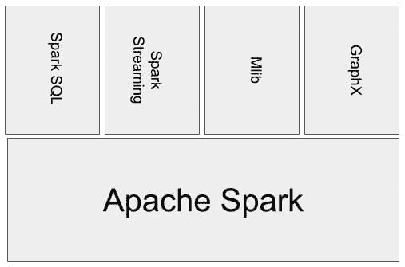
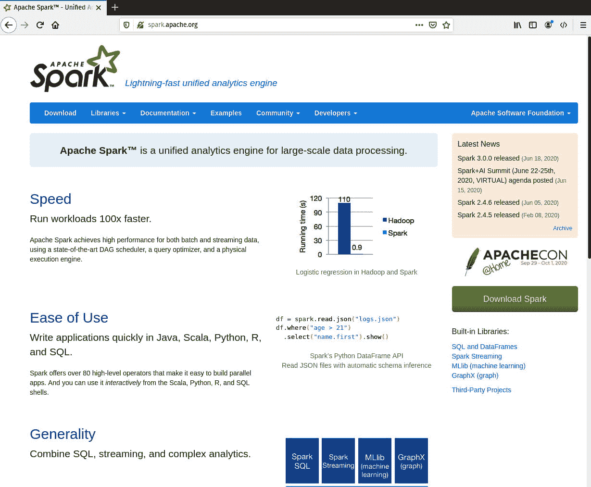
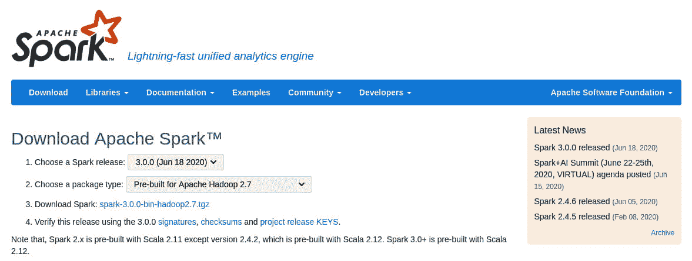
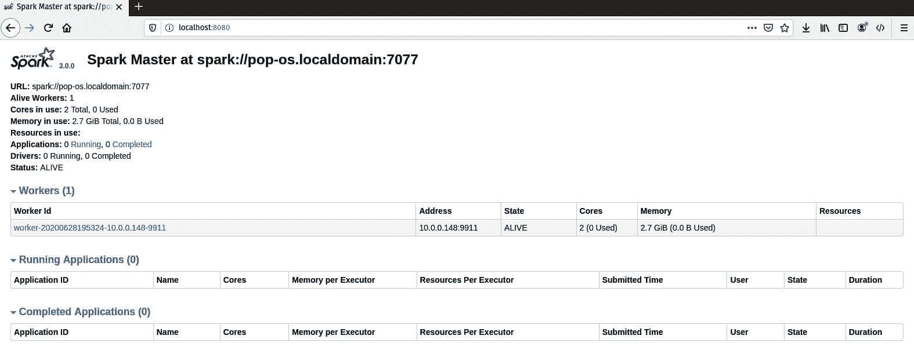
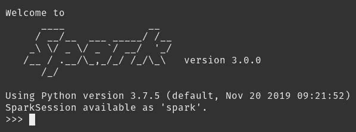
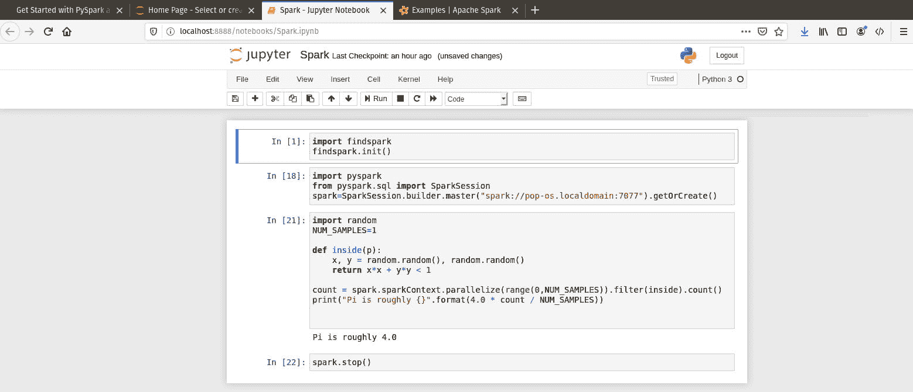
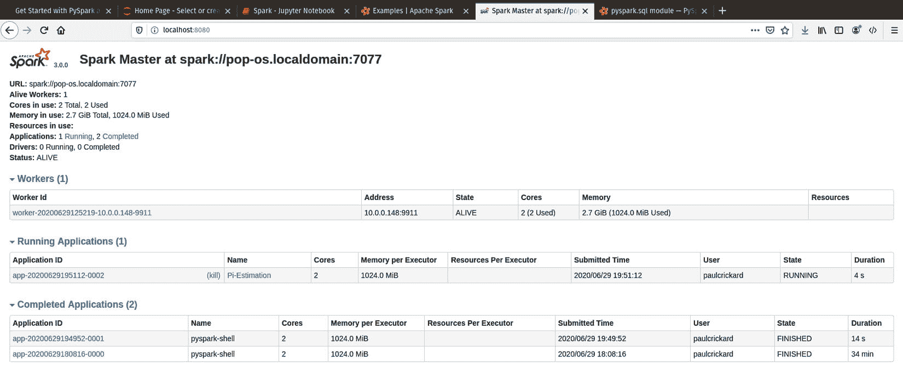
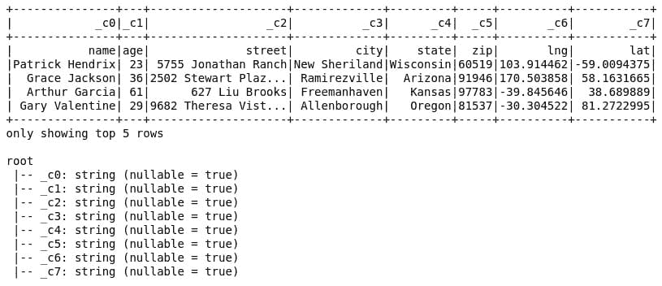
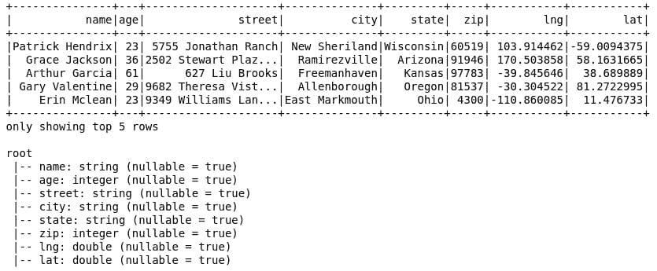

# 第十四章：*第十四章*：使用 Apache Spark 进行数据处理

在上一章中，您学习了如何将流数据添加到您的数据管道中。使用 Python 或 Apache NiFi，您可以提取、转换和加载数据。然而，为了对大量流数据进行转换，数据工程师转向 Apache Spark 等工具。Apache Spark 比大多数其他方法（如非平凡转换上的 MapReduce）都要快，并且它允许分布式数据处理。

在本章中，我们将涵盖以下主要主题：

+   安装和运行 Spark

+   安装和配置 PySpark

+   使用 PySpark 处理数据

# 安装和运行 Spark

Apache Spark 是一个可以处理流和批量数据，甚至图数据的分布式数据处理引擎。它有一组核心组件和其他用于添加功能的库。以下图表显示了 Spark 生态系统的常见表示：



图 14.1 – Apache Spark 生态系统

要以集群模式运行 Spark，您有几个选项。Spark 可以在独立模式下运行，这使用 Spark 提供的简单集群管理器。它也可以在 Amazon EC2 实例上运行，使用 YARN、Mesos 或 Kubernetes。在生产环境中，如果您的工作负载很大，您可能不想在独立模式下运行；然而，在本章中，我们将这样建立我们的集群。原则将是相同的，但独立集群提供了最快的启动和运行方式，无需深入研究更复杂的基础设施。

要安装 Apache Spark，请按照以下步骤操作：

1.  访问 [`spark.apache.org`](http://spark.apache.org) 网站浏览。从这里，您可以了解 Apache Spark 的新版本，阅读文档，了解库，并查找代码示例：

    图 14.2 – Apache Spark 网站

1.  从网站中选择**下载**菜单选项。选择您想要使用的 Spark 版本 – 在撰写本文时，最新版本是 3.0.0。您将被要求选择一个包类型。我们不会使用 Hadoop，但必须选择一个版本或提供自己的。我选择了**为 Apache Hadoop 2.7 预构建**。在 Windows 上，您可能需要通过设置环境变量来欺骗操作系统认为已安装了 Hadoop，但在 Linux 和 macOS 上，这应该不会是问题。下载选项如下所示：

    图 14.3 – 为 Hadoop 2.7 下载 Apache Spark

1.  下载文件后，您将提取它，然后将其移动到名为 `spark3` 的目录中的主目录。您可以使用以下命令完成此操作：

    ```py
    tar -xvzf spark-3.0.0-bin-hadoop2.7.tgz
    mv spark-3.0.0-bin-hadoop2.7 ~/spark3
    ```

1.  接下来，您需要创建一个集群。就像您对 Kafka 所做的那样，您将在同一台机器上复制 Spark 目录，并使其作为另一个节点运行。如果您还有另一台机器，您也可以在该服务器上放置 Spark 的另一个副本。复制目录并将其重命名为`spark-node`，如下所示：

    ```py
    cp -r spark3/ spark-node
    ```

1.  要运行 Spark 集群，您可以使用提供的脚本。运行集群的脚本使用过时的术语 – `master`和`slave`。这种语言在技术空间中很常见；然而，长期以来，很多人反对使用这些术语。最终，似乎有一些进展正在被做出，GitHub 将从分支名称中移除`master`。我也已将脚本重命名，使用术语`head`和`node`。要这样做，请使用以下命令：

    ```py
    cd ~/spark3/sbin
    cp start-master.sh start-head.sh
    cd ~/spark-node/sbin
    cp start-slave.sh start-node.sh
    ```

1.  要启动集群，您现在可以像下面这样运行脚本：

    ```py
    ./start-head.sh
    ./start-node.sh spark://pop-os.localdomain:7077 -p 9911
    ```

1.  您可以向脚本传递参数，在先前的命令中，您通过传递端口标志（`-p`）来告诉脚本您希望节点在哪个端口上运行。您还可以传递以下参数：

    a) `-h, --host`: 要运行的计算机名。`i, -ip`标志已被弃用。

    b) `-p, --port`: 要监听的端口。

    c) `--webui-port`: Web GUI 的端口，默认为`8080`。

    d) `-c, --cores`: 要使用的核心数。

    e) `-m, --memory`: 要使用的内存量。默认情况下，它比您的全部内存少 1 吉字节。

    f) `-d, --work-dir`: 工作节点的临时空间目录。

    g) `--properties-file`: 您可以在`spark.conf`文件中指定这些标志中的几个。

集群将花费一分钟来加载，加载完成后，您可以浏览到 Web UI，网址为[`localhost:8080/`](http://localhost:8080/)。您将看到集群的详细信息，它将如下截图所示：



图 14.4 – Spark 集群 Web UI

当集群启动并运行时，您需要设置 Python 环境，以便您可以针对它进行编码。下一节将指导您完成这些步骤。

# 安装和配置 PySpark

PySpark 与 Spark 一起安装。您可以在`~/spark3/bin`目录中看到它，以及其他库和工具。要配置 PySpark 以运行，您需要导出环境变量。变量如下所示：

```py
export SPARK_HOME=/home/paulcrickard/spark3
export PATH=$SPARK_HOME/bin:$PATH
export PYSPARK_PYTHON=python3 
```

先前的命令设置了`SPARK_HOME`变量。这将是指定 Spark 安装的位置。我已经将变量指向 Spark 集群的头部，因为节点实际上将位于另一台机器上。然后，它将`SPARK_HOME`添加到您的路径中。这意味着当您输入命令时，操作系统将在您路径中指定的目录中查找它，因此现在它将搜索`~/spark3/bin`，这是 PySpark 所在的位置。

在终端中运行前面的命令将允许 Spark 在终端打开时运行。您每次都必须重新运行这些命令。要使它们永久，可以将命令添加到您的 `~/.bashrc` 文件中。保存 `.bashrc` 文件后，您需要重新加载它。您可以通过运行以下命令来完成此操作：

```py
source ~/.bashrc
```

您现在应该能够打开一个终端并运行 PySpark，结果将是 PySpark 交互式 shell，如下所示：



图 14.5 – 交互式 Spark shell

如果您看到了前面的截图，恭喜您，您已经配置好了 PySpark。在本章中，示例将使用 Jupyter notebooks 中的 PySpark。有两种方法可以配置 PySpark 以与 Jupyter 一起工作：

+   使用以下命令将 `PYSPARK_DRIVER_PYTHON` 环境变量和 `_OPTS` 变量添加到 Jupyter Notebook 中（如果您想使其永久，请将其添加到 `~/.bashrc`）：

    ```py
    export PYSPARK_DRIVER_PYTHON=jupyter
    export PYSPARK_DRIVER_PYTHON_OPTS='notebook'
    ```

+   使用 `findspark` 库并将代码添加到您的 Jupyter notebook 中，以在运行时获取 Spark 信息。本章中的示例将使用此方法。您可以使用 `pip` 安装 `findspark`，如下所示：

    ```py
    findspark method, add the following two lines to your notebook and run it:

    ```

    导入 findspark

    findspark.init()

    ```py

    If the preceding lines ran without error, then the code was able to find Spark. 
    ```

您现在可以在您的 Spark 集群上运行 PySpark 代码。下一节将带您了解一些基本的 PySpark 示例。

# 使用 PySpark 处理数据

在使用 PySpark 处理数据之前，让我们运行一个示例来展示 Spark 的工作原理。然后，在后续示例中我们将跳过模板代码，专注于数据处理。以下截图显示了 Spark 网站上 [`spark.apache.org/examples.html`](http://spark.apache.org/examples.html) 的 **Pi 估计** 示例的 Jupyter notebook：



图 14.6 – Jupyter notebook 中的 Pi 估计示例

网站上的示例未经修改将无法运行。在以下要点中，我将带您浏览单元格：

1.  第一个单元格导入 `findspark` 并运行 `init()` 方法。这在前一节中已解释为在 Jupyter notebooks 中包含 PySpark 的首选方法。代码如下：

    ```py
    import findspark
    findspark.init()
    ```

1.  下一个单元格导入 `pyspark` 库和 `SparkSession`。然后通过传递 Spark 集群的头部节点来创建会话。您可以从 Spark web UI 获取 URL – 您也用它来启动工作节点：

    ```py
    import pyspark
    from pyspark.sql import SparkSession
    spark=SparkSession.builder.master('spark://pop-os.localdomain:7077').appName('Pi-Estimation').getOrCreate()
    ```

1.  运行前两个单元格，您可以浏览到 Spark GUI 并看到有一个任务正在运行。运行的任务如下截图所示 – 注意工作节点的名称是 `Pi-Estimation`，这是前面代码中的 `appName` 参数：

    图 14.7 – 带有运行会话和两个完成会话的 Spark web UI

    前面的代码将在您的所有 Spark 代码中使用。这是模板代码。

1.  下一个单元包含工作内容。下面的代码将估算 π 的值。代码的细节并不重要，但请注意，`count` 变量使用 `sparkContext` 并在集群上并行化一个任务。在样板代码之后，您的 Spark 代码将执行一个任务并获取结果：

    ```py
    import random
    NUM_SAMPLES=1
    def inside(p):
        x, y = random.random(), random.random()
        return x*x + y*y < 1
    count = spark.sparkContext.parallelize(range(0,
                         NUM_SAMPLES)).filter(inside).count()
    print('Pi is roughly {}'.format(4.0 * count / 
                                    NUM_SAMPLES))
    ```

1.  最后，停止会话：

    ```py
    spark.stop()
    ```

一旦会话停止，它将在 web UI 中显示为一个已完成的应用程序。下一节将使用 Spark 和 DataFrame 将数据发送到 Kafka。

## 数据工程中的 Spark

上一节展示了 Spark 应用的结构：我们使用 `findspark` 获取路径，导入库，创建会话，执行一些操作，然后停止会话。当您执行某些操作时，它很可能涉及到 Spark DataFrame。本节将简要概述 Spark DataFrame 的工作原理——它与 `pandas` 略有不同。

您必须做的第一件事是使用 `findspark` 设置环境。然后，您可以导入所需的库。然后，创建会话。以下代码显示了设置所需的样板代码：

```py
import findspark
findspark.init()
import pyspark
from pyspark.sql import SparkSession
import os
os.chdir('/home/paulcrickard')
spark=SparkSession.builder.master('spark://pop-os.localdomain:7077').appName('DataFrame-Kafka').getOrCreate()
```

现在，您已连接到 Spark 集群上的一个会话。您可以像在 *第三章**，*读取和写入文件* 和 *第四章**，*与数据库交互* 中使用 DataFrame 一样读取 CSV 和 JSON 数据，有一些细微的修改。当读取数据时，您可以使用 `read.csv` 而不是 `pandas` 中的 `read_csv`。Spark 和 `pandas` 之间的另一个区别是 Spark 中使用 `.show()` 来查看 DataFrame。在 `pandas` 中，您可以查看 DataFrame 的 `dtypes`，而在 Spark 中，您可以使用 `printSchema()` 做到同样的事情。以下代码读取 `data.csv` 文件并打印前五行和模式：

```py
df = spark.read.csv('data.csv')
df.show(5)
df.printSchema()
```

输出将类似于以下截图所示的 DataFrame：



图 14.8 – 带有模式和 CSV 的 DataFrame

您会注意到标题是第一行，并且有默认的 `_c0` 列名。输出还显示所有列都是字符串类型。您可以指定一个模式并将其作为参数传递；然而，您也可以告诉 Spark 推断模式。以下代码传递存在标题并告诉 Spark 推断模式：

```py
df = spark.read.csv('data.csv',header=True,inferSchema=True)
df.show(5)
```

结果正如您所预期的：一个具有正确类型的 DataFrame。以下截图显示了结果：



图 14.9 – 带有标题和正确类型的 DataFrame

您可以通过使用 `select()` 函数并传递列名作为参数来选择一列。别忘了添加 `.show()`，否则它将返回一个 DataFrame 而不会显示：

```py
df.select('name').show()
```

你会注意到在 `pandas` 中，你会使用 `[]` 和列名，并且不需要 `select` 方法。在 `pandas` 中，你也可以使用 `df[(df['field']< value)]` 格式来过滤 DataFrame。在 Spark 中，你可以使用 `select` 和 `filter` 来做同样的事情，区别在于 `select` 方法对于一个条件返回 `True` 和 `False`，而 `filter` 将返回该条件的 DataFrame。使用 `filter`，你还可以添加一个 `select` 方法并传递一个列名的数组来返回。代码如下所示：

```py
df.select(df['age']<40).show()
df.filter(df['age']<40).show()
df.filter('age<40').select(['name','age','state']).show()
```

注意，在最后一行中，你没有使用 `df['age']`，而是直接传递了列名。当你想要遍历 DataFrame 时，你可以在 `pandas` 中使用 `iterrows`。在 Spark 中，你使用 `collect()` 创建一个行数组。以下代码将使用 `filter` 方法获取所有 40 岁以下的人并打印数组：

```py
u40=df.filter('age<40').collect()
u40
```

要获取单行，你只需传递索引。你可以将行转换为不同的格式，在这个例子中，我将它转换成了字典。作为字典，你可以通过指定键来选择任何值。代码如下所示：

```py
u40[0]
u40[0].asDict()
u40[0].asDict()['name']
```

前面代码的输出是一个 `Row` 对象、一个字典和键名的值字符串，如下所示：

```py
Row(name='Patrick Hendrix', age=23, street='5755 Jonathan Ranch', city='New Sheriland', state='Wisconsin', zip=60519, lng=103.914462, lat=-59.0094375)
{'name': 'Patrick Hendrix', 'age': 23, 'street': '5755 Jonathan Ranch', 'city': 'New Sheriland', 'state': 'Wisconsin', 'zip': 60519, 'lng': 103.914462, 'lat': -59.0094375}
'Patrick Hendrix'
```

要在 Spark 中遍历 DataFrame，你调用 `collect()`，然后使用 `for` 循环遍历数组。然后你可以将每一行转换为字典，并对其进行处理。以下代码片段打印了字典：

```py
for x in u40:
    print(x.asDict())
```

如果你更熟悉 SQL，你可以使用 `spark.sql` 来过滤 DataFrame。要使用 SQL，你必须首先创建一个视图，然后你可以用 SQL 查询它，如下面的代码所示：

```py
df.createOrReplaceTempView('people')
df_over40=spark.sql('select * from people where age > 40')
df_over40.show()
```

结果将与 `filter` 方法相同，但只是达到相同结果的不同方法。

有几个函数可以对 DataFrame 中的列或数据进行修改或分析。在 Spark 中，你可以使用 `describe()` 来获取列中数据的简要概述。以下代码在 `age` 列上使用它：

```py
df_over40.describe('age').show()
```

输出是常见的描述性统计，包括 `count`、`mean`、`standard deviation`、`min` 和 `max`。这五个统计量为你提供了数据的良好概述。

你也可以像在 `pandas` 中一样对数据进行分组和聚合。要按州分组计数，你可以使用 `groupBy()`，如下所示：

```py
df.groupBy('state').count().show()
```

聚合允许你传入一个字段和方法的字典。要计算 `age` 列的平均值，你会使用以下代码：

```py
df.agg({'age':'mean'}).show()
```

对于 `groupBy` 和 `agg`，您可以使用 `mean`、`max`、`min`、`sum` 以及您可以在文档中阅读到的其他方法。您可以使用大量其他函数，这些函数需要您导入 `pyspark.sql.functions` 模块。以下代码将其导入为 `f` 并演示了一些有用的函数。同样，有关所有函数的更多信息，您可以在 [`spark.apache.org/docs/latest/api/python/pyspark.sql.html`](https://spark.apache.org/docs/latest/api/python/pyspark.sql.html) 阅读 Python API 文档：

```py
import pyspark.sql.functions as f
df.select(f.collect_set(df['state'])).collect()
# Returns a Row of unique states which will be all 50.
df.select(f.countDistinct('state').alias('states')).show()
#returns a single column named states with a single value of 50.
df.select(f.md5('street').alias('hash')).collect()
#Returns an md5 hash of the street value for each row
# Row(hash='81576976c4903b063c46ed9fdd140d62'),
df.select(f.reverse(df.state).alias('state-reverse')).collect()
# returns each rows street value reversed
# Row(state-reverse='nisnocsiW')
select(f.soundex(df.name).alias('soundex')).collect()
# returns a soundex of the name field for each row
# Row(soundex='P362')
```

当您完成数据处理后，使用 `stop()` 停止会话，如下所示：

```py
spark.stop()
```

恭喜！您已成功使用 PySpark 处理数据。

# 摘要

在本章中，您学习了使用 Apache Spark 的基础知识。首先，您下载并安装了 Spark，并配置 PySpark 在 Jupyter 笔记本中运行。您还学习了如何通过添加节点来水平扩展 Spark。Spark 使用类似于 `pandas` 中使用的 DataFrame。最后一节教您了在 Spark 中操作数据的基本方法。

在下一章中，您将使用 Spark 与 Apache MiNiFi 一起在边缘或物联网设备上移动数据。
