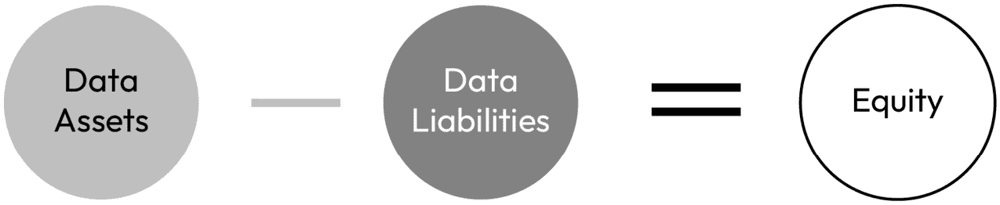
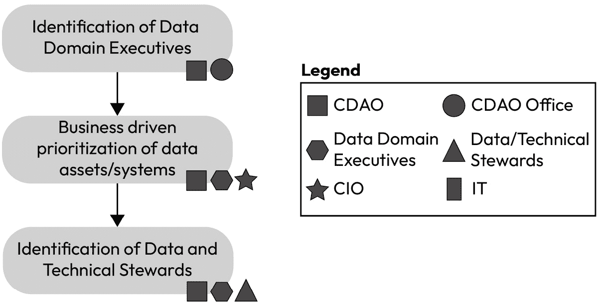
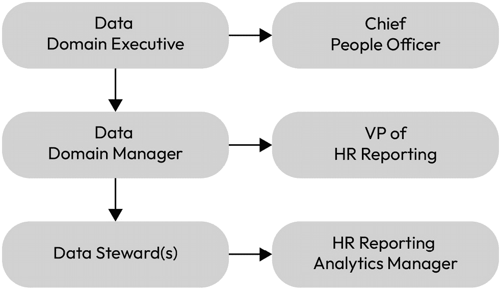
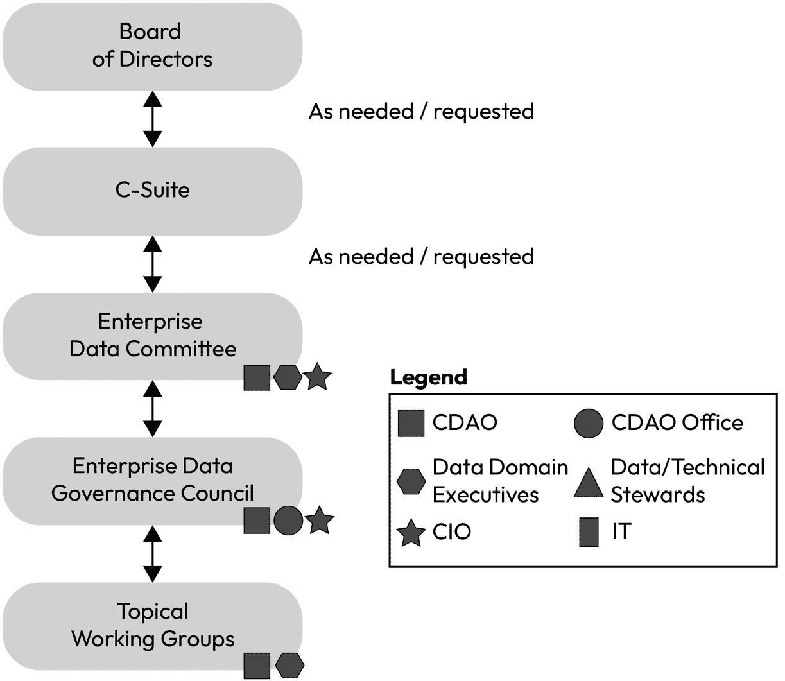
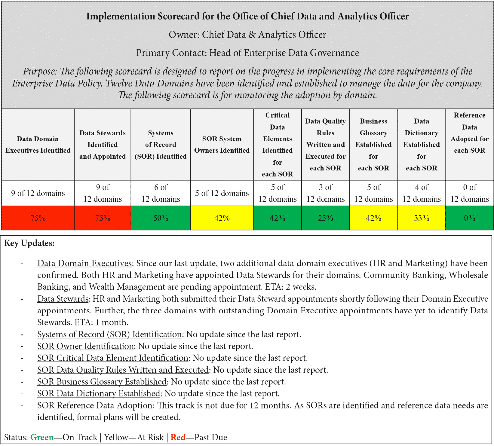
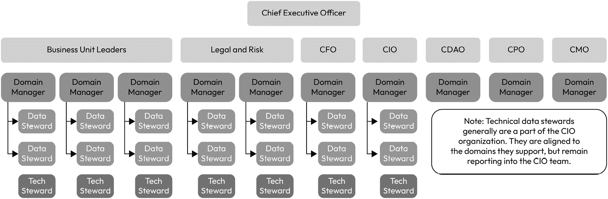
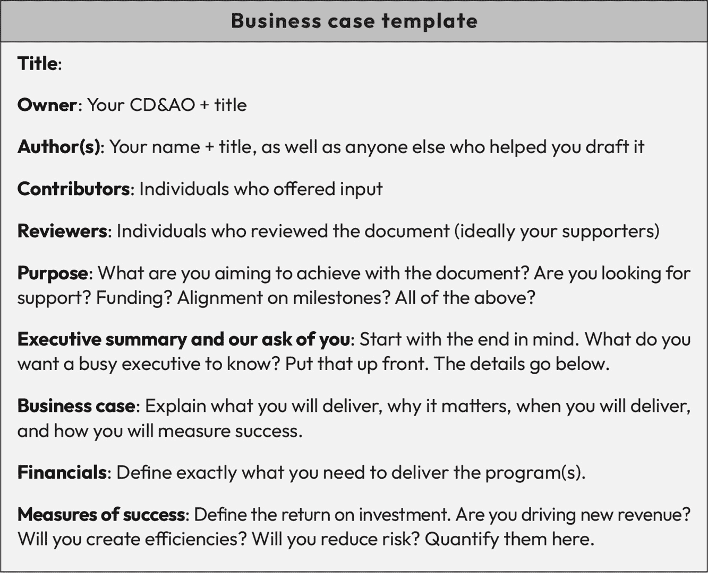

# 第一章：什么是数据治理？

作为数据专业人员，你将经历的一些最令人沮丧的关于数据治理的对话是，数据程序常常被看作是一系列约束，而不是战略推动力，认为你是在拖慢业务进程，而不是促进卓越。我曾在三家财富 500 强公司领导数据转型，听到过许多类似的反馈。在我看来，这是反馈；我们在“数据语言”中发言，未能从利益相关者的角度创建一个以价值生成为核心的商业案例。相反，我们传递的商业案例关注的是数据需求而非业务需求。

从利益相关者的角度来看，推动业务的力量有很多：通过销售团队创造收入、面向现有和潜在客户的营销、经济因素和供应链挑战。数据是所有这些关键业务组成部分的一部分，但它并不是我们利益相关者首先想到的东西。它嵌入在业务运作的方式中，是日常工作的组成部分。它不应该也不应该被看作是一个独立的职能。

因此，我们的责任是服务于业务，并让它对我们所支持的业务利益相关者来说是无缝的。当事情感觉像是摩擦时，不一定是因为我们没有得到支持，而是因为我们只是领导者面临的众多问题之一。这常常表现为缺乏支持或反对意见、看似无穷无尽的问题，或者仅仅是缺乏参与。对于数据专业人员来说，这样的对话往往以沮丧和数据治理计划资金不足告终。我亲眼见过这个情形在各个组织中一再上演，并且听到过每个行业中的数据高管说过类似的话。过于频繁地，它最终以首席数据与分析官未能在组织中存活下来而告终。

问题是，为什么？

在接下来的 17 章中，我将解释为什么首席数据与分析官未能在他们的组织中建立自己作为战略业务伙伴的地位，以及你如何克服这些常见的陷阱并取得成功。我将涵盖你需要了解的所有内容，以建立数据治理的案例，号召你的组织支持你，部署强有力的数据治理计划，利用核心的数据治理解决方案，并将这一切应用于一个虚构金融机构的案例研究。让我们深入探讨。

# 你可以期待学习的内容

在本书中，我承诺会透明且直截了当地分享我的经验，我们将从一开始就明确：治理项目失败的原因是我们失败了。我们未能以让业务相关者理解的方式解释数据治理。我们没有深入且亲密地理解我们的解决方案如何推动业务成功。简而言之，我们未能从业务价值的角度进行解释。相反，我有机会与之合作的最成功的数据高管之所以成功，是因为他们深刻理解自己的公司。他们花时间深入了解业务，制定能够促进业务成功的数据解决方案，并成功地以业务结果而非数据结果的方式阐明其好处。

在深入探讨这些话题时，我不会假设你在实施成功的数据治理计划方面的经验。我将从基础开始，通过为你奠定定义和基础能力的基础，逐步介绍如何启动一个成功且有影响力的计划，并提供一系列成功的衡量标准，这些标准将引起高层管理层的共鸣，并最终获得公司董事会的认可。最终，我们将通过案例研究将所有内容汇总。在本书结束时，你将具备启动并在自己组织中卓越交付项目所需的一切。你的组织将不再被数据淹没，也不会缺乏洞察力。我们将共同改变这种局面。

本章将帮助我们扎实掌握数据治理的基础知识以及它与相关能力的关系。然后，我们将定义数据治理计划的组成部分、每个组成部分的重要性，并探讨为什么我们将数据治理视为商业价值的推动力。后续章节将深入探讨数据治理计划的基础能力以及如何实施它们。

我们将讨论以下主要话题：

+   什么是数据治理？

+   什么因素推动了对数据治理需求的增加？

+   数据治理组成部分的简要概述

+   数据治理作为一种战略推动力

+   为公司建立商业案例

+   何时以及为什么启动数据治理计划

# 什么因素推动了对数据治理需求的增加？

当我与各行业的数据专业人士会面时，我清楚地看到，数据治理比以往任何时候都更为重要。高管们对数据的期望越来越高，但没有适当的投资，就比以往更难以跟上业务的步伐。

那么，为什么我们在以业务节奏回应高层管理者时变得越来越困难？有许多关键因素，包括以下几方面的持续增长：

+   **数据量**：我们今天拥有的数据比昨天多（每天都在增加！）。事实上，数据量每两年翻一番。然而，我们不能期望能够翻倍我们的努力、员工数量或技术支出。

+   **法规**：监管环境正在不断演变，数据处理的期望也在增加。在美国，截至本文写作时，已有六个州通过了隐私和数据保护立法。这增加了数据处理合规性的复杂性。

+   **期望**：高管们的期望在上升，但我们对数据的使用并没有相应增长。在最近的一项 Tableau 调查中，超过 80%的 CEO 希望他们的组织能够以数据驱动，但不到 35%的员工认为他们的数据在决策中得到了使用。

+   **用户基础**：越来越多的人参与到数据中，他们希望自己能够使用数据，但也需要信任它。这使得我们的治理专业人员能够通过为组织提供可信且良好治理的数据，带来巨大的价值。

我们必须变得更加创新并更加深入，利用更多的技术（例如自动化和人工智能），比以往任何时候都要多。我们谈论这对我们的客户意味着什么，但这对我们意味着什么？如果今天很难回答一些关键的基本业务问题，那么我们如何期待在未来两到三年内，用更多的数据来回答这些问题？我们必须从这种紧迫感出发，构建能够扩展并在我们业务的规模、复杂性、期望和用户基础以空前速度持续增长的同时保持长久的能力。

# 什么是数据治理？

在深入讨论之前，我们有必要从基本定义开始。当我第一次从事数据管理工作时，我们犯了一个错误，假设组织中的利益相关者在我们讨论某一特定数据领域时，已对我们所指的数据达成一致。经过几个月围绕范围（如果某个数据元素、报告或系统在范围内）展开艰难对话后，我们意识到我们需要回过头来，向所有利益相关者明确几个非常简单的问题。

数据治理是通过对人员、流程和技术的正式协调，使组织能够在正确的时间以正确的控制方式将正确的数据汇集在一起，从而推动公司实现高效和有效的业务成果。这种正式的协调应当控制、保护、交付并进一步提升数据的价值，并为组织创造公平。数据治理是积极主动的，通过以下能力进行交付：

+   元数据管理

+   数据血统

+   数据质量

+   数据架构

+   主数据管理

+   数据操作

我们将在后续章节中详细探讨这些核心能力以及其他方法。构成成功数据治理计划的能力在几乎每个组织中的定义略有不同。因此，为了本书的目的，我们有必要在这里定义它们。你可以在自己的组织中或业务的常用语言中使用本书中的术语。

重要提示

花些时间建立一个快速参考指南，定义围绕您数据治理项目使用的最基本术语（例如，数据、治理、元数据等等）。让整个组织能够访问这个快速参考指南。根据需要进行补充。

### 数据与信息

我想指出，业内资深人士在使用“数据”与“信息”术语时有很强的热情。有些从业者坚信这两个术语并不相同，且不应互换使用。而另一些人则毫不思考地将它们当作同义词使用。依我个人的看法，这两者都可以适用于您的组织。重要的是要区分二者，以便您的组织理解这些定义，并能够在组织中恰当地使用它们。就我个人而言，我认为没有哪种立场是对的或错的。更重要的是，您需要从利益相关者的角度出发，并确保您的组织对所选用的对齐方式达成一致。对于本书的目的，我主要使用“数据”一词，并且会确保具体说明它的含义。

### 用例——金融服务公司

在我担任第一个数据治理职位时，我们启动了一个强大且价值数百万美元的转型项目，以遵守有关数据管理和监管报告的法规要求。在努力进行大约六个月后，我们发现自己在定义项目范围的“内”与“外”时遇到了困难。经过几次课程和充满热情的讨论后，我们意识到，最终我们无法很好地界定范围，因为我们的利益相关者对“数据”和“指标”有什么不同的看法。我们最终构建了一个完整的方法论，帮助公司和我们的监管机构理解我们如何看待报告，从而确保符合范围，列出了所有报告的完整清单，并记录了每一项报告是否符合标准，或未符合标准，这些信息可以供任何感兴趣的人或团体进行有据可查的挑战。我们没有从理论上辩论，而是具体记录了标准，并清晰地阐明了其理由。

我在这次经验中学到的有两点：在界定数据项目的范围时，不能假设人们知道或不知道什么；其次，您必须有可以社交化、达成一致并记录的基本定义，这样所有参与者才能保持一致。

我会要求我们在本书中都这样做。请根据需要回到这些定义，以确保我们保持一致。

## 什么是数据治理的误区

许多公司常常倾向于将问题归咎于数据和/或数据团队。数据治理（团队或计划）并不是解决所有问题的万能钥匙。数据就像空气一样，遍布整个组织，真正要做到良好管理，需要全组织的共同参与。就像火灾发生时空气的质量一样，差的数据就像火灾中的烟雾一样在组织中传播。有效的数据管理需要预防、检测和纠正，良好的数据管理要求整个公司都参与其中。单一的数据团队无法单方面解决所有数据问题。只有组织的广泛参与和行动，才能推动变革并有效管理数据。

其次，数据永远不会完美。如果你或你的高层管理团队期望数据治理能够完美无缺，我建议你调整你的期望。为了确保我们对成功的数据治理计划的适当期望和目标达成一致，我们必须定义成功。为此，我们必须从数据治理的目标开始。

## 数据治理的目标——创造业务价值

简单来说，公司存在的目的是为利益相关者创造价值。对于数据来说，数据有一个非常重要的目标，即为利益相关者增加公平性。有效地管理数据是公司为组织增加价值的一种方式。

图 1.1——一个简单的价值方程

资产是指组织拥有的具有经济价值的东西。负债是指减少组织整体价值的义务（无论是当前的还是未来的）。因此，当资产减去负债得到正值时，组织的价值增加（即创造了公平性）；而当资产减去负债得到负值时，组织的价值减少（即减少了公平性）。

相同的思维方式也可以应用于数据。数据可以通过多种方式影响公平性。通过持续的合规性管理，避免罚款和处罚，以及增加或创造收入，来应对和最小化操作风险，可以创造公平性。我将这一概念分解为两个关键子部分，以便更具体地管理数据治理。这两个子部分（资产和负债）直接受我的会计和 IT 审计专业培训的影响，当管理层将数据解决方案转化为可衡量的价值（理想情况下是货币价值，但也可以考虑员工的时间价值）时，通常能产生共鸣。

重要提示

当数据为组织创造价值时，它就是一种资产。

一些例子包括：

+   用于多种目的的精心整理的数据集

+   客户健康评分

+   授权配置点

+   用于预测建模的数据模型

重要提示

当数据对组织构成风险时，它就是一种负债。数据可以是这两者，但不能只是其中之一（例如，一个数据解决方案可能会创造价值并减少风险）。

以下是一些例子：

+   未分类的数据

+   没有被分类，因此没有得到适当保护的数据

+   数据泄露/泄露的数据

理想情况下，组织应该管理数据的负债，同时最大化数据作为战略资产的价值，从而创造数据股权。根据你的业务和数据治理实践的成熟度，资产管理或负债管理可能是更优先的事项。

数据治理应通过增加数据作为资产的价值并减少数据负债来创造数据股权。作为你将本书中的原则应用到自己的组织时，我鼓励你回到这一框架。在你推销数据解决方案时，考虑以下几点：

**这个解决方案如何增加我的数据价值（增加资产）和/或减少** **负债？**

两者都有价值。交付所创造的势能应直接转化为数据股权的增长。

一个数据资产的例子可能是一个经过精心筛选的数据集，因为它有明确的所有权，质量高，并且可以在整个组织范围内用于多个商业目的。一个数据负债的例子可能就是组织不知道自己拥有什么数据，这些数据存储在哪里，或者应该如何处理它们。这从安全角度来看对公司构成风险，而且，由于缺乏责任感，个别人员可能会错误地使用这些数据来做出本不适合的数据决策，增加公司基于不适用的数据做出错误决策的风险。

资产的价值衡量对每个组织来说都是独特的，但简而言之，能够将影响与组织联系起来是一个很好的指导原则。以下是一些在你尝试评估数据资产时可以考虑的问题：

+   这个资产能带来额外的收入吗？多少？

+   这个资产节省了时间吗？你能否通过按小时计算来估算个人节省的工时？

+   这个资产能改善客户满意度吗？这种满意度是否可以转化或计算为组织的价值，表现为额外的支出或增加的客户留存率？

图 1.2 – 数据资产、负债和股权公式

数据资产可能在这些组成部分中提供价值，且价值应根据情况进行相应计算。这一估值过程最重要的部分并非计算本身，而是与业务的对齐和一致。计算出价值后，重要的是去与业务沟通并征求反馈。他们是否同意你的评估？如果同意，那么你就有了一个经过充分审查的数据资产价值。如果不同意，就需要与业务一起对数据资产估值进行反复调整，直到达成共识。如果跳过这一步（验证价值），数据团队往往会被视为过度夸大自己在组织中的价值，这会直接削弱你在组织中的可信度。达成对业务价值的共识有助于建立强有力的业务关系，并为未来在数据解决方案上的投资提供可信度。

责任部分的衡量同样重要。与数据资产类似，组织所承担的数据责任的衡量将依据你的组织而有所不同。

重要提示

数据的增加并不意味着责任的增加是那么简单。

相反，数据管理越少，责任越大。当数据未被管理时，组织面临的风险更高。

一个很好的例子是安全风险。当一个组织不了解数据的位置时，它就无法有效或充分地保护这些数据。这带来了对组织的高风险（责任），并可能导致数据泄露，甚至更严重的数据泄密。以下是计算你组织数据责任时需要考虑的一些问题：

+   数据责任是否增加了组织的风险？多少？我们是否会因此责任而面临罚款或监管处罚？

+   责任是否推动了我们业务中的低效？你能否通过为个人计算小时费率来计算由于低效导致的工时损失（例如，手工流程与自动化流程之间的差异）？

+   这种责任会影响客户满意度吗？这种满意度能否转化或计算为组织在额外支出或客户流失减少方面的价值损失？

一旦你评估了数据资产的价值和数据责任的价值，就可以将其应用于计算数据权益。其核心思想是随着时间的推移增加权益。这个初步的计算可以作为你的基准，用于衡量随时间的进展。组织还可能希望利用数据成熟度模型来衡量进展；然而，这些模型在组织中可能会有广泛的解读，并且没有考虑到与数据解决方案相关的业务价值。相反，它们侧重于数据能力的发展，而这并不总是能很好地转化为高层管理的需求。我更倾向于关注业务价值，而不是组织与成熟度模型之间的对比。

本书将不会深入探讨数据货币化的工作。数据货币化的经济学在 Doug Laney 的《*信息经济学*》一书中有深入的描述，我强烈推荐任何有意深入了解数据货币化的人阅读他的书。

# 数据治理组件的简要概述

现在我们已将数据解决方案分为资产和负债，并定义了如何计算价值，让我们进一步深入探讨各个组件。我倾向于将数据治理的组件分为构建块。我喜欢这种方法，并在几家公司中采用了这一框架，因为它使组织能够将每个构建块直接与特定且简单的结果联系起来。第一个构建块，**政策与标准**，相对基础，可以由一个小团队设计。这是启动数据治理项目的一个好地方。

## 政策与标准

这一构建块的目的是定义数据所有权和设计管理组织数据资产所需的责任结构。这个构建块将确保公司能够依赖的有效、可持续和标准化的数据治理。这一构建块是未来构建块的前提，因为它定义了**需要**什么来推动有效的数据治理，以及**谁**需要参与其中。此外，这一构建块的组成部分可以简化创建，并可以随着公司在数据之旅中的成熟而扩展。

一个简单的起点是草拟一份简洁明了的数据治理政策。数据治理政策的目的是告诉公司需要做什么、为什么要做，以及由谁负责。

强有力的数据政策的目标包括以下几点：

+   建立统一的数据管理政策和标准

+   建立政策范围内的能力和数据资产，进而为首席数据与分析官办公室提供支持

+   定义实施政策和数据管理能力运作的责任和职责

+   为数据管理设置最低标准，特别是针对治理、质量、元数据和主数据管理

+   定义推动一致、稳健地采纳最低标准的工具的程序和使用要求

+   在适当的情况下提供灵活性，以便在可能的情况下简化实施

+   定义政策的适用范围外的内容

与任何政策一样，明确数据治理政策的负责人非常重要，该负责人将负责管理政策，至少每年更新一次内容，并向公司传播该政策。负责人还需确保得到公司各关键利益相关者的支持。理想情况下，负责人应为**首席数据官**、**数据治理负责人**或类似职务。如果公司尚未设立此职位，可以考虑由**首席信息官**、**首席信息安全官**、**首席隐私官**或甚至是法律顾问来担任此角色。

一份政策不需要过于冗长才能有效。理想情况下，政策应当阐明基本内容，并通过更具体、更聚焦的主题数据标准来支持该政策。这种方法通常能让政策通过更正式的公司治理审批流程，同时允许在组织逐步成熟的过程中，对数据标准进行稍微更易更新的处理。我建议为本书第二部分中涉及的每项核心能力实施数据标准，并且针对你的业务需要额外指导的数据利益相关者提供具体要求。记住，政策设定了公司**最低**的期望。

为开始制定数据治理政策，建议的政策大纲可能包含以下内容：

1.  **目的和范围声明**（例如，通过创建额外的收入来源并同时减少数据风险，来转变公司如何利用数据）

1.  **负责人**（例如，首席数据官）

1.  **审阅者/贡献者及职务**（例如，IT 负责人、首席运营官和数据管理人员）

1.  **签署/批准**（例如，首席执行官、首席财务官等）

1.  **数据** **治理要求**

1.  **实施的角色与职责**

1.  **反馈环路用于改进** **和/或新增**

1.  **成功的衡量标准**

1.  **合规/审计期望** **及频率**

1.  **术语表**

### 数据治理政策示例

以下是企业数据治理政策的示例：

**负责人**：首席数据与分析官

**最后批准**：2023 年 12 月 31 日

**政策负责人**：数据治理负责人

**贡献者**：

+   信息技术负责人/首席信息官

+   人力资源负责人/首席人力资源官

+   市场营销负责人/首席营销官

+   销售负责人/首席营收官

+   产品/业务单元负责人

+   产品/业务单元数据管理员

**目的** **和范围**

本数据管理政策适用于公司持有或处理的所有数据，可能包括客户数据、交易数据、财务信息、监管和风险报告，以及与公司业务相关的任何其他数据。这些数据可以是第一方数据、派生数据或来自其他公司的数据（第三方数据）。此政策的结果包括：

+   降低风险

+   解锁收入机会

+   提高运营效率

**介绍**

公司负责确保所有数据的准确性、完整性、安全性，并且仅允许那些需要访问以履行工作职责的人员访问。此政策规定了企业在上述结果下交付的要求。

**数据治理**

数据治理在前述政策和范围部分中为所有被认为“在范围内”的企业数据确立了要求和标准。此政策下建立的数据治理能力旨在推动公司数据的透明度和问责制，并推动数据管理、存储和使用的一致性、控制和监管的改进。

**角色** **和职责**

1.  企业数据委员会：将设立一个由首席数据与分析官主持的企业数据委员会，负责提供监督和优先级管理，管理数据和分析项目，并解决全企业范围内的问题。数据领域执行者将被要求参加该委员会，确保在所有数据领域之间的优先级安排得当。

1.  首席信息官将与首席数据与分析官合作，确保为组织的数据和分析需求提供技术要求和系统支持，不仅为首席数据与分析官办公室提供支持，还为所有职能数据领域提供支持。

1.  每个职能领域将设立一名数据领域执行者，以确保为管理数据提供适当的关注、资金和资源支持，符合本政策以及业务需求。

1.  数据管理员将由每个数据领域执行者分配，以确保数据要求的日常执行按照政策和业务需求完成。数据管理员还需要与首席数据与分析官办公室合作，以确保在领导层、监管机构和各个领域之间保持透明度和持续的运营效果。

**要求**

本节提供了合规性的最低期望。

**数据治理**

每个数据领域将制定一个计划，以推动合规性并将政策要求落地实施。数据领域执行者将确保适当的优先级安排，而数据管理员将代表数据领域执行者执行计划。此外，技术数据管理员将支持所有技术要求的交付，以确保符合本政策以及更广泛的业务需求。最低要求如下：

1.  识别所有数据资产和系统

1.  为每个资产和系统识别所有数据和技术数据管理员

1.  将每个资产和系统分配到适当的数据领域

1.  制定计划，满足每个资产和系统的要求，并确保今后的合规性

**数据目录管理**

数据目录的目的是在整个组织中集中管理和发布业务和技术元数据，以便以清晰、透明的方式加速发现可用的数据。随着数据目录的实施，首席数据与分析办公室将评估元数据，以确定给定数据资产的最佳数据源，并识别减少公司内部数据扩散和冗余的机会。这样可以随着时间的推移进一步简化我们的数据生态系统，并减少重复数据处理/管理和存储的成本。最低要求如下，在企业数据目录中发布：

1.  数据资产/系统的描述

1.  技术元数据

1.  架构和表的描述

1.  关键数据元素（CDE）的识别

1.  关键数据元素（CDE）的业务定义

1.  根据公司数据分类政策，对资产/系统中所有数据元素进行分类

**数据质量**

数据质量的目的是确保数据适合使用。为了集中制定数据质量规则、提供分析资源和工具，并监控数据卫生，确保数据可以用于分析和业务使用并且可以信任，已经设定了以下要求，以识别需要披露和/或修复的问题。最低要求如下：

1.  为每个关键数据元素（CDE）定义数据质量规则，并将其输入到企业数据质量工具中

1.  启用关键数据元素（CDE）的数据质量监控

1.  提供数据质量仪表盘，透明地报告当前的质量水平

1.  识别数据质量问题，并制定计划解决重要的数据质量问题

**政策管理**

+   **反馈循环**：关于政策的反馈和/或政策实施的疑问应直接提交给上面定义的政策负责人。

+   **成功衡量标准**：将为每个数据领域和公司层面建立一个强大的企业数据治理评分卡。定期报告遵守该政策的进展情况，并向首席数据与分析官办公室和企业数据委员会报告。可能还需要进一步的成功衡量标准。

+   **合规性/审计**：内部审计、外部审计和监管机构可能会定期审计此政策的合规性。所有审计请求应向首席数据与分析官办公室披露，以便协调并通过企业数据委员会推动审计请求。

+   **频率**：该政策将至少每年进行一次审查、更新和重新批准。

现在我们已经回顾了一个优秀政策的组成部分，让我们转向数据治理计划的关键角色和职责。

## 角色和职责

任何数据治理专家都会告诉你，人员是成功数据治理计划的关键。人员负责关心数据，确保其准确性，适用性，并且如何改进数据，使其变得更好。这个概念被称为**数据管理**。数据管理需要合作才能推动成功。为每个数据领域指定的高层管理人员会任命数据管理员来推动该数据领域的日常活动。

数据管理员的主要职责包括以下内容：

+   作为数据领域的单一领导点

+   确保数据领域的高层管理人员了解关键活动

+   确保为充分的数据管理提供必要的资金，并将其合理分配到数据管理活动中

+   收集数据领域的需求，并执行数据领域内的数据管理要求

首席数据与分析官办公室的主要职责包括以下内容：

+   定义数据政策、发布政策，并至少每年进行一次审查更新

+   引导数据领域的高层管理人员和数据管理员理解需求，确保全面了解

+   提供数据工具以推动企业范围内的数据管理能力

+   尽可能简化合规性操作

+   定期向执行团队汇报，并在必要时向监管机构和董事会汇报

重要说明

数据治理中最困难的部分之一是获得所需的合作，以推动组织利用其数据取得所需的成果。

在我曾经工作过的每家公司中，初衷几乎总是好的：人们希望合作。数据治理专家希望合作以推动成功；然而，竞争的优先级、缺乏明确的愿景以及很难衡量数据治理计划的影响，通常导致数据管理被放在了次要位置。最终，成功推动数据治理计划的组织认识到良好数据治理的重要性，并且意识到这不仅仅是理解记录、字段和表格。他们认识到，这不仅仅是建立另一个数据仓库。他们认识到，人是成功的中心，确定那些对强数据负责并需要承担责任的个人，是任何数据治理计划的基石。

为了确保数据质量，数据管理员必须是优秀的。优秀的管理员对数据的质量、访问权限和整体管理负责。我曾与之合作过的最佳数据管理员确保每一步治理过程都能获得业务用户的支持，因为数据治理的目标不仅仅是清洁数据；而是让数据的用户能够自信且轻松地使用数据，以实现他们的业务目标。

让我们通过两个例子来进行比较说明：

+   **示例 1**：一位业务用户，A，需要数据 X 以向监管机构报告。在一个治理良好的数据环境中，A 可以前往企业数据目录，在那里搜索数据 X。A 找到他们需要报告给监管机构的度量标准，但他们有几个问题。在目录中，B 被标识为数据管理员。A 可以联系 B 提问并了解更多关于数据 X 的信息，以确认它是适合与监管机构分享的度量标准。

+   **示例 2**：这里有一家公司，几乎没有数据治理。业务用户 A 需要获取数据 X 给监管机构，但不知道从哪里开始。没有数据目录，所以他们问他们认为可能了解数据的 C。C 建议 A 联系 D。A 拨打 D 的电话，依此类推。几天甚至几个月过去了，A 并不确信他们拥有正确的信息来提供给监管机构，但还是提供了他们知道的最佳信息。最终，由于 A 对数据缺乏信心，监管机构对数据也没有信心。

通常，将组织中的数据管理员对齐比说起来容易做。开始时最简单的方法之一是从高管层开始。我将这些人称为 **数据领域高管**。这些人最终对其所在部门负责的数据负责。例如，**首席人力资源官**（**CPO**）被指派为人力资源数据的数据领域高管。这将使 CHRO 对人力资源数据最终负责。CPO 会将日常活动委派给他们的数据管理员，后者负责确保人力资源数据按照数据治理政策和标准进行管理。

作为数据治理计划的一部分，首先要做的活动之一是识别组织的数据领域高管。根据我的经验，将数据按逻辑类型定义为数据领域，并指派数据领域高管是最好的起点。在定义数据领域和数据领域高管后，您将有负责整个组织数据的高管被命名。这些个人应该组成您的赞助人，如果您选择成立一个企业数据委员会或理事会，他们应该成为您的投票成员：

图 1.3 – 数据领域高管和数据/技术数据管理员的识别

根据组织的规模，您可能会在数据管理的业务方面增加第三个关键角色。对于较大的组织，您可以考虑设立一位更高级别的人员担任**数据领域经理**。该人员将承担前面章节中描述的数据管理员角色，并且通常与多个数据管理员有 1:M 的关系，数据管理员可能直接向其报告或与业务方面有虚线关系。我曾在一家组织工作过，我们为该组织的部门设立了数据领域经理，并为每个子小组定义了数据管理员。如下所示：

图 1.4 – 数据领域任命示例

## 治理论坛

企业数据委员会是一种有效的方式，可以使组织围绕数据战略和数据治理计划达成一致，并作为优先级和升级机构。每个参与委员会的数据领域高层应该指派一名数据管理员，推动其数据领域内的活动。通常，组织会建立子小组（例如，**人力资源数据委员会**或**人力资源数据工作组**）来实施和持续治理各自的领域。这使得数据治理活动能够在组织内更深层次地实施。首席数据官（或同等职位）应当担任该委员会主席，并负责管理议程、节奏和会议主持，以及向 C 级高层和董事会汇报进展。

图 1.5 – 各种数据治理论坛如何协同工作的示例

重要提示

如果您发现企业数据委员会被下放到数据领域高层以下，可能存在问题。委派一次可能不成问题（例如，因度假）；但是，如果您开始看到某一领域或整体上有这种模式，这就意味着委员会没有提供价值。请迅速联系数据领域高层，了解是什么原因导致了委派。只需问：“我注意到您已将最近几次的 EDC 会议委派给了您团队中的某个成员。我能做些什么，让会议对您更具吸引力吗？您的观点对整个委员会至关重要，我想确保这对您的时间是一种有价值的利用。”

数据治理项目中可能还会有其他关键角色，包括业务单元利益相关者（通常是数据的使用者）和信息技术团队。我们将在*第二部分*深入探讨元数据章节，但现在，我也在前面的图表中加入了 IT 应用负责人（见 IT）。在任何项目中，IT 应用负责人都在数据治理项目的成功中发挥着关键作用。IT 应用负责人是负责执行企业数据治理政策及数据领域执行官或其代表设定的任何数据治理要求的个人。我们将在*第三章*中深入讨论操作模型。

## 治理进展报告

理想情况下，随着实施的推进，企业数据委员会应收到持续的报告，以展示数据治理的改进情况。一种报告信息的方式是使用**企业数据治理评分卡**（**EDG 评分卡**）。EDG 评分卡应提供公司在实施数据治理能力方面的透明状态，以及在实施后这一能力的持续情况。最终，EDG 评分卡应向用户传达公司在使数据更易查找、理解，并最终信任方面的进展。

在尝试为整个公司设计和实施 EDG 评分卡之前，我建议选择一个数据领域进行该过程的试点。我更倾向于从一个数据治理实践至少比其他领域稍微成熟的数据领域开始。大多数组织中，财务和/或合规报告通常是一个更成熟的数据领域。通过试点数据领域，其他数据领域的执行官（构成企业数据委员会的成员）可以了解 EDG 评分卡的样子，以及他们应该如何在各自的数据领域中实施它。

### 示例实施度量标准

应该定义度量标准，以衡量数据管理政策的实施情况以及能力的运营效果。为了衡量跨领域的政策实施情况，每个领域应定期（根据组织预期，每两周、每月或每季度）衡量进展并将其报告给首席数据与分析官办公室。

首席数据和分析官办公室的示例如下：

+   数据领域的总数（这将成为以下度量的分母）

+   确认/识别了数据领域执行官的领域数量

+   确认/识别了数据管理人员的数据领域数量

+   确认了系统记录的领域数量

+   已分配系统记录所有者的系统数据领域数量

+   每个系统记录的关键数据元素数量

+   为每个记录系统编写并执行数据质量规则的领域数量

+   为每个记录系统建立业务词汇表的领域数量

+   为每个记录系统建立数据字典的领域数量

+   为每个记录系统采纳参考数据的领域数量

### 使用案例

一家大型跨国公司有七个业务单元和四个企业职能部门。为推动数据、分析和人工智能的使用，成立了首席数据与分析办公室。作为办公室第一年战略的一部分，CDAO 组织了一个专注于数据管理成熟度的团队。在此重点下，企业数据治理负责人被指派正式制定数据政策，并制定一个评分卡来跟踪其实施。

企业数据治理负责人制定了企业数据政策，以确立组织的期望，并定义了关键角色和职责，以推动政策的合规性。团队识别了 12 个数据领域：每个业务单元一个，财务数据一个，风险数据一个，市场数据一个，员工/人力资源数据一个，以及由 CDAO 负责的主数据和参考数据一个。

为了跟踪在 12 个已识别领域中的实施进度，专门为首席数据与分析官办公室制定了以下评分卡。此报告每两周更新一次，并向执行团队、数据领域高管及数据管理员报告，并在企业数据委员会会议中每月进行审查。

图 1.6 – 首席数据与分析办公室的数据治理评分卡示例

数据领域/数据管理员的示例包括以下内容：

+   分配给数据领域的记录系统总数（此为以下度量的分母）

+   已识别关键数据元素的记录系统数量

+   已编写并执行数据质量规则的记录系统数量

+   已建立业务词汇表的记录系统数量

+   已建立数据字典的记录系统数量

+   已采纳参考数据的记录系统数量

每个数据领域应跟踪各自的度量，并每两周向首席数据与分析官办公室提交报告。

| 人力资源数据领域实施评分卡所有者：首席人力资源官主要联系人：人力资源分析副总裁目的：以下评分卡旨在报告实施企业数据政策核心要求的进展情况。已识别并建立了 12 个数据领域，以管理公司的数据。以下评分卡用于监控人力资源数据领域的采纳情况。 |
| --- |
| 已识别 CDE 的系统 | 编写并执行数据质量规则的系统 | 已建立业务术语表的系统 | 已建立数据字典的系统 | 已采纳参考数据的系统 |
| 2 of 5 | 1 of 5 | 1 of 5 | 0 of 5 | 0 of 5 |
| 40% | 20% | 10% | 0% | 0% |
| 状态：绿色—正常进行 &#124; 黄色—存在风险 &#124; 红色—逾期 |

图 1.7 – 数据领域数据治理得分卡示例

## 实现成功所需的相关团队和能力

没有任何数据团队能独立运作。要在实施中取得成功，合作伙伴关系是你最宝贵的技能。你需要与一系列关键职能建立强大且可持续的关系。首先是业务职能。你必须与每个支持的业务职能建立信任。这一过程始于并结束于深度倾听。深度倾听要求你仅以学习为目的进行倾听。**你是在倾听以学习，而不是为了回应**。你的业务职能领导者会告诉你他们的需求，你的任务是倾听并能将他们的需求带回数据团队，以便传达并制定数据战略。随着你按他们的需求交付，信任将逐步建立。最初，不论他们过去与数据的经验如何，倾听他们的意见是最重要的起点。

#### 信息技术

你公司的**信息技术团队 (IT 团队)**，由首席信息官（CIO）领导，可能会通过至少提供支持团队数据解决方案的基础设施来帮助你的成功。你与 CIO 及其关键领导者之间建立的关系对你的成功至关重要。我发现，CDO 与 CIO 之间关系的质量是 CDO 成功最有力的指标之一。在 CDO 和 CIO 之间有高效且信任的关系时，我见证了两位领导者的成功。而在关系不高效，甚至最坏情况下是竞争关系的情况下，**两位**领导者的成功都会受到阻碍。

#### 信息安全

此外，随着 CISO 角色的崛起和正式化，以及所有行业日益严峻的威胁形势，CISO 的重要性从未如此之高。数据权益方程式中的责任部分的核心要素之一是保护公司数据。这自然体现在数据安全方面，但也涉及并与技术元数据管理紧密连接。简而言之，如果你不知道数据在哪里，你就无法保护数据。技术元数据是支持了解你拥有何种数据、数据存储在哪里、数据如何流动、如何分类数据，并确定需要采取哪些控制措施来妥善保护和确保数据安全的关键因素。我们将在*第六章*和*第七章*中详细讨论这一话题。作为数据领导者，这一能力将促进你 CISO 的成功，因此，我建议你在整个数据治理实施过程中，早期并频繁地与他们进行合作。

#### 首席财务官

在你建立关系并最终建立利益相关者名单的过程中，我鼓励你同时考虑业务职能和公司职能。你的利益相关者应包括前面提到的首席信息官（CIO）和首席信息安全官（CISO），以及首席财务官（CFO）、隐私负责人、总法律顾问、人力资源和运营部门，除了业务职能之外。如果你从事技术领域工作，产品和工程领导者至关重要，而在金融服务行业，风险管理和监管机构等小组可能具有相关性。关键是要从整体上看待公司，包括所有数据的管理者和用户，并识别出你需要合作的关键领导者，以实现有效合作。大多数未能成功的资料领导者，失败的原因通常是因为他们未能建立关系和/或未能通过创造价值来建立信任。

#### 人力资源

你的人力资源领导者将是关键利益相关者和战略合作伙伴，帮助你设计组织结构并制定人才管理的招聘、培训和留人战略。

#### 隐私和法律

隐私和法律团队将是推动你团队实现许多能力的关键。例如，虽然法律团队应该定义数据保留标准，隐私团队应该定义信息分类类型（例如，私人或公司机密），但你们团队的责任是根据这些政策实施发现、清单和自动分类数据的能力。GDPR 或 CCPA 等法规推动了各行各业的大部分这项工作，但其他行业也有特殊的考虑，例如 BCBS 239 或 HIPPA。务必与法律和隐私团队合作，找到正确的相关法规。

此外，要注意，新兴的州级法规正在迅速出台。本文写作时，美国爱荷华州是最近出台隐私法的州，该法律将于 2025 年 1 月生效。

# 定义价值

当你开始制定未来愿景时，重要的是要考虑你与利益相关者互动中收到的所有反馈。在接下来的章节中，我们将共同努力，制定商业案例、建立支持联盟以及组建团队，值得注意的是，没有两家公司会有一致的成功愿景或战略。你需要以全新的视角看待每个机会。尽管我曾在三家财富 500 强公司领导过数据转型，但每一次的数据战略都需要独特的视角。公司都有各自追求卓越的旅程，即使是最成熟的公司也需要在数据治理能力上进行改进。你必须从这个角度来评估每个情况，否则你将冒险在开始之前就采用错误的战略。

## 需要见面的人员

在为公司定制愿景时，仔细建立你的利益相关者名单，正如前面章节所介绍的那样：

1.  公司的业务部门有哪些？

1.  谁领导每个部门？他们是否有你也应该见面的首席工作人员或首席运营官？

1.  这些利益相关者各自负责哪些公司职能？每个职能由谁领导？

1.  组织内的资金如何分配？了解这个流程，并找出谁在影响资金的释放。

你在回答前面问题时列出的所有个人都将成为你制定愿景、商业案例并开始传播愿景时需要接触的关键人物。许多这些人未来可能会成为数据领域的高管。

图 1.8 – 域模型与公司组织结构图的示例对齐

重要提示

CDAO、CPO、CMO 等职务也会有与之对接的领域经理、数据管理员和技术管理员。

在第一次接触时，简单地倾听他们的业务优先事项。这不是解决方案的时机，你是在收集事实和意见，以便将这些作为未来愿景的输入。做详细记录。在会议结束前，要求安排 4–6 周后的跟进会议，届时你将根据他们的反馈和意见，提出你团队的使命、愿景和目标。

重要提示

在你的组织中，数据领域的高层管理人员应该距离首席执行官（CEO）不超过一位或两位。如果你的数据领域高管距离组织高层过远，无论你的组织规模有多大（50 人或 50 万人），你的项目将会被稀释。你必须创建一个明确的价值主张，清楚地定义为什么高级领导者必须共同推动这项工作。如果将其推得太低，你将有失去 C-suite 的优先级、资金和专注力的风险。理想情况下，直接向 CEO 汇报的人应该是你的数据领域高管。在大型组织中（即员工 50,000 人或更多），CEO 减去两级的层级可能是合适的。

## 制定一个有力的“为什么”声明

一个有力的愿景声明不仅仅是为首席数据与分析官而设，而是为公司整体的数据与分析能力而设。在起草愿景声明时，要清晰简洁地阐明你对公司未来使用数据和分析的愿望和目标。考虑以下问题：

1.  你希望做什么？

1.  谁会帮助你实现这一目标？

1.  你怎么知道自己何时达成目标？

一个有力的愿景声明应该清晰、简洁且易于理解和沟通。它应该直截了当，不使用行话（避免“数据语言”）。声明应该集中于未来，具有激励性和理想性，将所有利益相关者凝聚在一起，共同朝着这个理想的未来努力。确保它简单、简短且易于记住。它应该容易被记住。尽管着眼于未来，但它应当是可以实现的，并与公司的价值观保持一致。

重要提示

让我们考虑一个例子。假设你是一个领先保险公司的新任首席数据与分析官。你可能会拟定一个愿景声明，比如：

洞察力嵌入在业务流程中，依靠高度信任的、相关的和经过筛选的数据，以满足我们主动为客户提供令人愉悦且有意义的时刻的需求。我们相信我们的数据，而我们的客户也信任我们。

## 定制信息传递

在你制定愿景声明时，带着它去与你识别并会面的领导们的一对一会议。单独与他们分享，并征求他们的反馈：

+   它符合公司战略方向吗？

+   它具有远见吗？

+   它会激励你的团队成员并驱动对未来的有意义关注吗？

+   这对你的需求有意义吗？

+   你会做出什么改变？

在与你们这些人一起审阅时，要倾听并采纳反馈。你保持开放心态并考虑他们意见的程度，将直接影响他们的支持度。这并不意味着你必须采纳每一个细节，但你应该认真考虑，并与每个人沟通，感谢他们的支持，解释你所做的改变，未做的改变及其原因。至关重要的是，对于你没有做出的任何改变，要与他们关闭反馈循环，仔细解释为什么这些没有被采纳。这种透明度将建立与利益相关者的信任，而这种信任可以随着时间积累。

在你修改并最终确定了愿景声明之后，是时候提交最终审批了。我建议你在企业数据委员会会议中纳入审批流程，以进一步确立这一愿景不仅仅是首席数据与分析办公室的，而是整个公司的。通过让公司参与这一过程，你是在设定一个先例，即数据是每个人的责任，尽管最终首席数据与分析办公室负责落实。

# 数据治理作为战略推动者

在你开始构建数据治理业务案例之前，必须了解公司正在推动的业务成果。为了起草数据目标，你需要首先了解整个公司的战略。如果你还没有相关资料，要求获取公司战略的副本，并提出问题以确保完全理解它。然后，与数据领域的高层一起工作，了解他们的优先事项以及他们的业务单元或公司职能如何推动公司战略。为了创造公司所需的价值，他们需要达成哪些结果？最终，这些结果的定义将支持更广泛的公司战略，并促成对组织成功至关重要的业务成果。

关键是你必须定义一个清晰的路径，明确展示数据和分析将如何推动你的公司发展，而不是拖慢进程。通常，当人们听到“治理”这个词时，他们会将其与官僚主义、摩擦和进度延缓联系在一起。你必须展示你和你的团队将如何增值并赋能业务，同时不对进度产生负面影响。至关重要的是，你需要定义一个使命和明确的目标，清楚地展示这一点。

## 首席数据与分析办公室的使命

首席数据与分析办公室的目的是通过数据与分析解决方案推动所需的业务成果。它不是站在业务一边，而是通过与业务共同合作来实现组织成果。它是结果的加速器。成功由业务成果决定，因此，首席数据与分析办公室必须将其使命定义为此。首先，定义你的团队在业务中要做的事情。它可能包含如下指导原则：

+   激发企业思维

+   通过洞察力驱动业务成果

+   定义并实施通用数据与分析解决方案的交付模型

+   策划解决方案，在业务需要时提供洞察

+   确保业务在设计时就嵌入治理，成为流程的一部分

+   通过自动化提高运营效率

+   创建收入来源或加速收入生成周期

+   降低风险并整改合规问题

最终，你和你的团队应该制定一份强有力的使命声明，涵盖你们为公司提供的全方位服务。思考一个问题：我们的意图是什么？

重要提示

让我们考虑几个示例使命声明：

+   赋能公司，提供及时、可信和相关的洞察，推动收入达到 10 亿美元及以上。

+   首席数据与分析办公室将为 XYZ 银行解锁收入，提升效率，并降低合规风险。

## 数据治理计划的使命

在定义了首席数据与分析办公室的使命之后，接下来需要定义数据治理计划的使命。数据治理计划需要考虑你需要为公司解决的问题以及你打算如何解决这些问题。该计划应作为推动者和合作者，帮助公司以服务其广泛利益的方式解决问题。它可以简单到以下内容：

我们通过做 A、B 和 C 来为 Y 做 X。

*“我们通过在平台中实现设计治理，推动数据管理解决方案，并在关键时刻提供可信赖、精心策划的数据解决方案，为所有公司职能提供企业范围的数据治理能力。”*

确定支持公司数据与分析战略交付所需的项目、程序和预算。在我们进入本书的*第二部分*并深入探讨每项数据治理能力时，思考一下你所在公司当前的状况。这些能力是否存在？存在的程度如何？你看到哪些差距？这些差距将成为你的项目、计划和交付物。我建议你在**第四章**中回顾本节内容，作为组织的基准。

# 为公司建立业务案例

在与前面章节中识别的利益相关者会面并根据他们对愿景声明的反馈进行迭代时，正是询问他们哪些做得好的时候，哪些可以改进，未来一段时间的优先事项，以及他们团队面临的一些紧迫挑战的最佳时机。我经常发现，向公司各个关键领导提出开放性问题，并深入倾听他们的经验，对于发现推动数据治理为他们创造价值的机会非常有帮助。

例如，如果某个利益相关者告诉你，他们在董事会会议中很难应对，因为 CEO 总是质疑他们的数据，你可能有机会帮助他们。花时间拆解报告过程、报告中的指标、指标的定义、计算方式、来源以及数据本身的质量，可能会揭示出向董事会报告存在问题。相反，这个过程也可能证明数据是准确的，现在这个利益相关者就有了来自你这个数据组织领导者的有力支持，可以证明报告的准确性。通常，数据在证明无误之前是“有罪”的。支持你的利益相关者，帮助他们提供可靠且高度信任的数据，以便向董事会交付他们的成果，这是你的荣幸。务必以相应的态度对待这段经历。

无论你的利益相关者告诉你什么，这些对话的关键是倾听。利益相关者很少会直接告诉你他们需要更好的治理，或者需要更强的技术元数据，或者需要团队更频繁地对数据进行分析。他们不会用这些数据术语和你交流。他们会说**没有人信任报告**，或者**我在需要的时候拿不到我想要的数据**。他们给出的只是症状。你的任务是识别根本原因，诊断问题，并解决潜在的核心问题：数据治理。

在执行这些深度倾听会议并了解同事们面临的挑战时，开始识别出共同的主题。保持详细且有条理的笔记对你非常有帮助，这样你不仅能轻松回顾过去的记录，还可以开始将类似的问题归类。以之前的例子为参考，也许你会听到多个利益相关者反映，报告中的结果看起来相似，但数字实际上是不同的。高层管理团队现在开始质疑数据和领导者。你现在知道，数据治理业务案例的一个关键组成部分将集中在高层管理团队的关键指标对齐上。你需要强大的元数据功能（*第六章*）和数据质量（*第八章*）来帮助你，同时还需要强大的报告和/或数据分析师来推动这种对齐。最重要的是，你需要将大家聚集在一起，推动一致性。

在你准备撰写业务案例时，你的倾听会话将产生一些主题，你的交付将围绕战略实施能力和迭代交付（有时被称为**快速胜利**）展开，以展示在整个交付过程中的进展。当你构建你的业务案例时，一定要突出你将要构建的基础模块（即本书*第二部分*的内容）以及你将要进行的迭代交付，这些都是推动战略旅程中的影响力的关键。随着你根据已识别的主题，逐步为你的数据领域高管交付，你将把挑战转化为胜利，把反对者变成支持者，你将成为公司所需的可信顾问，从而为整个公司提供卓越的数据治理。

当你开始构建业务案例时，你将按迭代方式进行，就像我们在本书中所做的那样，有个好消息：你已经取得了一定的进展。前面提到的项目是你业务案例的关键组成部分。你需要包含以下内容：

+   你公司的战略愿景和目标

+   你团队的使命声明

+   你数据治理项目的使命声明

+   你的强大目标

从这里开始，你可以着手构建你为业务案例启动的项目框架。在此时，你可能还不知道大部分项目的具体内容；然而，你可能已经通过利益相关者倾听会话开始识别出一些主题性问题或挑战。或许你已经知道公司没有数据目录，或者没有透明的数据质量衡量方式。你可以开始规划出你需要交付的能力，并将这些能力作为“项目”来推进。

我倾向于使用备忘录格式来定义业务案例。六页的备忘录是一种非常有效的格式，可以在不失去观众注意力的情况下深入传达内容。一些公司使用幻灯片来展示业务案例。你需要确定哪种格式最适合你公司文化。无论你决定采用哪种方式，写备忘录是确保你在进入业务案例过程时思路清晰的一个良好练习。最终，业务案例的写作质量将决定你从利益相关者那里获得的支持程度和资金程度。业务案例的示例模板可能看起来如下所示：

图 1.9 – 业务案例模板

我建议你现在就把这个框架整理好，在我们接下来的书籍内容中，逐步填写出你公司所需的业务案例。当你从与利益相关者的会议中收集信息时，做些笔记，并开始逐步构建你的业务案例。

你已经拿起这本书并开始阅读，这是你旅程中的一个重要步骤。继续一章一章地阅读，并根据需要执行各个步骤。你可以根据自己公司需要的节奏，快慢自如地进行。将其作为参考、指南，最重要的是作为如何大规模交付强大数据治理的框架。在进入下一阶段之前，我们需要讨论一个最终的约束条件：何时以及何时不启动你的项目。

# 何时以及为什么启动数据治理项目

虽然数据治理项目可以随时启动，但**成功**的项目通常会精准地选择与其他相关业务项目的启动时机，并确保其影响对高层管理团队非常清晰，不仅是在单个项目中，而是作为一整套转型计划。如果管理层没有强烈的需求，未完全认同，或者过于分心（例如，正在进行一场大型的并购），你将无法成功启动项目。换句话说，时机很重要。

花时间了解你的业务、挑战、政治环境以及正在进行或即将启动的其他关键战略转型项目。与同行对齐，确保在任何业务职能和运营中都获得支持。然后，计划你的启动。如果没有掌握好时机，你将不得不重新启动项目，根据我的经验，这通常是一个非常困难的过程，通常需要新的领导者。

## 为什么你现在应该启动

有一些原因促使组织投资数据治理。虽然没有完美的时机，但通常有一些常见的原因：

+   **监管**：有多种监管原因可能促使你的公司实施数据治理项目。例如，在金融服务行业，大型全球系统重要性银行（GSIBs）被要求遵守 BCBS 239，这推动了早期对数据治理在风险报告中的关注。

+   **危机**：数据泄露是另一个常见的数据治理项目驱动因素。尤其是在公司没有很好地掌握其所有数据的位置、分类方式，或者没有信心自己已妥善保护数据时（你无法保护你不了解的数据）。

+   **高层需求**：高层管理团队已经意识到他们需要更多的数据，并愿意资助一项转型，以使你能够满足他们的需求。

+   **业务需求**：有一个关键且明确的业务需求，且已得到充分资助。

+   **实验性**：公司希望探索数据能力，并已经设立了一个资金池来支持这一领域的实验。你有权限使用这些资金来展示可能性的力量。

## 为什么你可能想要等待

最后，执行管理层愿意庆祝快速、迭代的胜利，这些胜利与长期的路线图以及充足的资金相一致，这一点至关重要。项目不会一夜之间成功，你必须与现实对接，理解一个长期、可持续的数据驱动文化需要不断的投资和支持。最终，如果公司不明白自己想要什么，或者没有做好准备为此提供适当的资金，你就不应该推进大规模的转型来建立强有力的数据治理。以下是一些需要关注的警告信号：

+   **高管请求**：高层管理团队已经意识到他们需要更多的数据，但他们*并不*理解转型所需的条件，以及你为了成功所需的资源。

+   **业务请求**：业务方有一个关键需求，但他们并没有明确界定这个需求，也没有为交付留出资金。

+   **实验性**：公司希望探索一些能力，但并不知道实现这些能力所需要的条件。

+   **未定义**：公司希望建立数据和分析功能，但没有完成完整功能的建设

这家公司永远无法完成数据转型的工作。这就像是锻炼一样。就像你不能为了一个比赛而锻炼，然后就声称自己一生都保持了健康，回到沙发上坐着，期待能够保持锻炼的效果。花时间提前为项目争取支持和资金。你的成功和公司的成功都取决于此。

## 如何构建交付时间线

一旦你为商业案例构建了框架，并决定了需要哪些能力，你应该提出一些时间线和资金选项。我发现最好向管理层提出三个选项，这样你可以进行健康的讨论，讨论应该做什么，做得多快，以及公司愿意花多少钱来交付。

### 选项#1——你首选的时间线

开始构建你的最佳时间线。如果交付内容由你决定，并且你能获得足够的资金按你认为合适的节奏进行工作，那么这个时间线是什么？你什么时候会发布新功能？每个发布后公司能做什么？

### 选项#2——快速且昂贵

构建一个能更快速交付的选项，但可能需要更多的资源（资金、员工人数或顾问参与）。这个选项能够更快地实现价值，但同时也带来了成本的增加。

### 选项#3——缓慢且便宜

最后，构建一个需要更长时间但成本较低的选项。根据我的经验，这通常是高管们一开始就会直接否决的选项。一旦他们决定推动数据战略，他们就希望看到结果。将这个选项列出来，能表明你经过深思熟虑，考虑了所有的选项，尽管这不是你的首选，但你考虑到了其他人的期望。

你还可能会发现，在这些审查讨论中，可能会产生一些不同的选项组合。要保持开放的心态。如果管理层投入时间和精力与你一起审查这些选项，这是一个好兆头。倾听他们的反馈，并愿意提出替代方案。最终，你的目标是获得支持和资金；你越灵活，获得支持的可能性就越大。

现在你已经拥有了建立数据治理计划和整合商业案例所需的框架和背景。在接下来的几章中，我们将深入探讨每个专题领域，这将为你提供设计一个强大的数据治理计划所需的细节，确保其为你的组织带来卓越的成果。

# 结论

在组织内启动数据治理转型之旅并不一定要困难。虽然可能需要一些时间并且需要支持，但你可以为你的组织建立一个强有力的数据治理职能。在这段旅程中，有几个关键步骤是你需要关注的，首先是确定一个数据治理负责人来拥有并推动公司的数据治理，这将为数据治理职能建立权威。你还需要定义在你公司背景下数据治理的含义，可以通过发布数据治理政策（以及必要时的标准）来实现这一点。通过建立明确的责任人（例如，数据领域的高管）、设立适当的委员会和工作组，并编写强有力的商业案例，继续推动这一政策的实施。

随着你逐步阅读本书的章节，我将引导你如何将数据治理融入你公司文化中，首先，通过建立一个支持者联盟。在*第二章*中，我将首先解释为什么联盟如此重要，如何评估潜在的支持者，以及如何收集广泛的支持。[链接](https://www.forbes.com/sites/bernardmarr/2018/05/21/how-much-data-do-we-create-every-day-the-mind-blowing-stats-everyone-should-read/?sh=302772a160ba)

# [参考文献](https://www.forbes.com/sites/bernardmarr/2018/05/21/how-much-data-do-we-create-every-day-the-mind-blowing-stats-everyone-should-read/?sh=302772a160ba)

+   [`www.forbes.com/sites/bernardmarr/2018/05/21/how-much-data-do-we-create-every-day-the-mind-blowing-stats-everyone-should-read/?sh=302772a160ba`](https://www.forbes.com/sites/bernardmarr/2018/05/21/how-much-data-do-we-create-every-day-the-mind-blowing-stats-everyone-should-read/?sh=302772a160ba)

+   [`medium.com/callforcode/the-amount-of-data-in-the-world-doubles-every-two-years-3c0be9263eb1`](https://medium.com/callforcode/the-amount-of-data-in-the-world-doubles-every-two-years-3c0be9263eb1)
