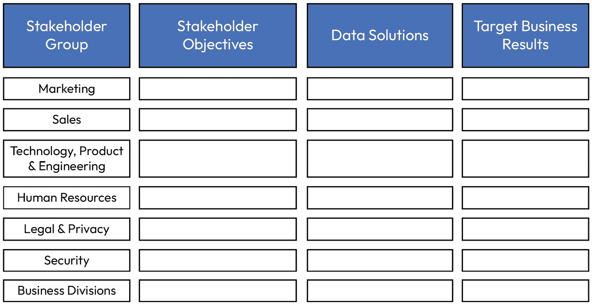
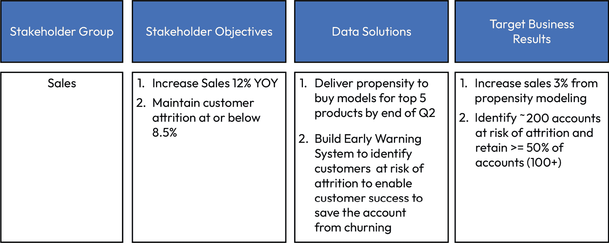
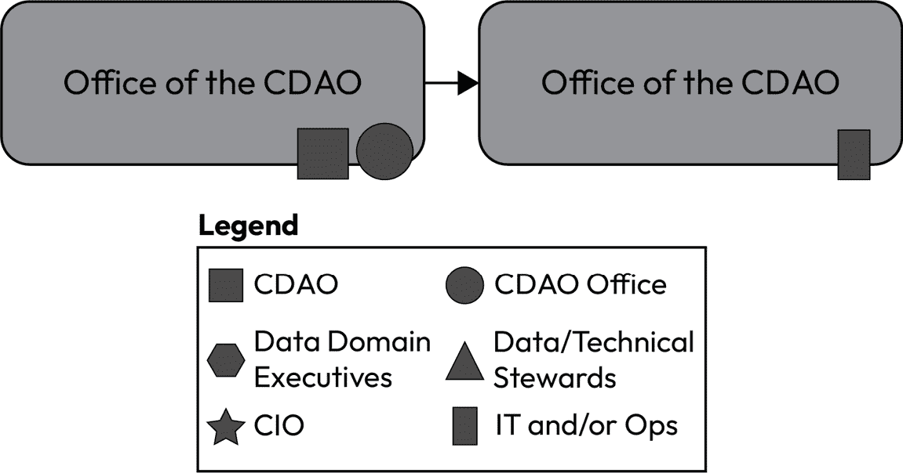
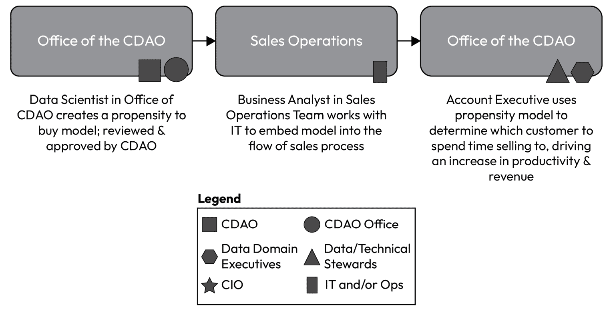

# 第二章：如何建立一个支持者联盟

可以说，启动一个能够产生影响的数据治理项目最重要的部分是获得对你项目的支持。考虑到全球数据创建的速度，公司运营的影响（如果管理得当，是积极的；管理不善，则不太积极）、数据滥用和误管理的风险以及随之而来的价值创造机会，数据成为一个有持久生命力的热门话题不足为奇。在我工作过的每一家公司，客户、员工和同行们都在各行各业提出一个非常常见且一致的问题：

*我们如何建立对* *我们数据的信任？*

信任的概念是复杂的。你不能购买它。你不能指指手指就能创造它。创造它需要时间，而失去它只需一瞬间。将信任的概念应用于数据时有一个有趣的现象：数据的使用者往往假设数据是错误的，他们不能信任它，尤其是当数据与他们预期的不符时。我常开玩笑说“数据是有罪的，直到被证明无罪”，这往往是数据在实践中的处理方式。作为数据从业者，责任在于我们肩上，证明数据是可靠的并推动信任。我们的同事要求如此。我们的客户要求如此。这个责任由我们来承担。

但这远不止于“数据是否正确和可信？”因为我们的工作远不止于简单地报告。**首席数据与分析官**（**CDAOs**）是事实陈述者、架构师、工程师和货币化领导者。如果没有跨能力的广泛关注，CDAO 的角色就会仅限于报告。仅仅做报告是无法建立信任的。我们的工作是建立组织内的信任，不仅仅是报告中的信任，而是那些直接影响业务结果的数据解决方案的信任。

在*麦肯锡*最近的一项研究中[1]，得出结论认为客户“*认为可信度和数据保护几乎与价格和交货时间同样重要*。”仅仅是价格合理或交货质量最高已经不再足够了。客户希望信任公司，并相信他们的数据在交易过程中以及交易后会得到适当保护。他们希望信任*你*会妥善处理他们的数据。数据量的急剧增加与客户对数据妥善保护的期望相结合，使得**首席数据官**（**CDOs**）/CDAOs 处于关于信任的新对话中心，且这一地位愈加重要。

*没有压力*。

从历史上看，CDAO 一直通过风险减少、运营效率和/或增加收入的视角进行工作。这种专注和对信任优先的需求要求我们采取一种全新的思维维度，并更加关注期望。我们如何在不断扩大的规模中，做好数据管理，同时满足客户、合作伙伴和员工的期望？我们如何将公司引导到数据治理卓越的旅程中？我们如何*准确地*在这个新世界中建立对数据的信任？

这一切始于*你*。我们必须与我们合作的人员建立信任。

本章将涵盖以下主要内容：

+   建立有影响力的关系

+   获得高层支持者

+   建立反馈循环

+   支持你的关键角色

+   如何赢得大众的支持

既然关系是建立信任关系和卓越数据解决方案的核心组成部分，让我们深入探讨如何建立有影响力的关系。

# 建立有影响力的关系

由于数据和分析是任何数字化企业的核心原则，CDAO 必须对与业务成果相关的可衡量结果负责。你为公司服务，覆盖全方位、上下层次。你必须从这个角度出发建立支持。在不深入探讨神经心理学基础的情况下，你需要建立的数据倡导者联盟，必须从建立对你的信任开始。你的同事和利益相关者必须相信*你*能够将混乱转化为秩序。他们必须相信你能够推动这种变革。最终，你在项目初期建立的关系可能会成就或破坏你的成功。根据*Gartner*的说法，“*文化和素养是数据与分析领导者面临的两大障碍*。”（《CDAO 如何在打造数据驱动型组织方面取得成功的 10 种方式》，2019 年 5 月 22 日，Gartner）。这两个术语“*文化*”和“*素养*”在数据行业中被频繁提及。

不受欢迎的观点：我不喜欢它们中的任何一个。让我们深入探讨一下：

+   **文化**被定义为“*一个种族、宗教或社会群体的习惯信仰、社会形式和物质特征*” [2]。因此，这不仅仅是创建一个数据文化，而是创建一个将数据作为公司文化基石的文化：以数据优先于意见、事实优先于感受。这是让数据成为公司日常运作的一部分——而不是作为一个独立的“数据文化”，而是融入公司整体文化之中。

数据文化的失败

根据我的经验，当 CDAO 推动“数据文化”时，他们传递的讯息是数据比文化的其他组成部分更为重要，我完全不同意这种做法。我曾见过一些 CDAO 因推动这一议程而失败。相反，将数据融入文化中，而不是作为一个独立的倡议，而是作为公司 DNA 的一部分，更为有效。

+   **素养**被定义为“*能够阅读和写作*；*拥有知识或能力*”[4]。因此，数据素养项目的目的是使整个公司能够读取和使用数据，并具备数据使用的能力；然而，启动数据素养项目往往会失败。相反，我建议将数据融入所有项目中（即政策培训、合规培训，并与技术培训并行，作为技术能力的一部分）。将数据相关的通识知识视为其他通用能力来对待，会让员工的学习过程更加自然，而为技术创造者（例如数据工程师）创建专门的培训，使这种重点更容易为公司接受。强迫高管团队参加“数据素养”项目/培训通常会让人反感，最糟糕的情况甚至让人觉得冒犯。找到一种让这种学习自然融入的方式，你会发现该项目更容易成功并被员工欢迎。

虽然有人可能建议你需要以强制和正式的方式在组织中创建数据文化，但我认为更实际、可衡量且恰当的方法是：建立信任。*通过*建立信任，你将改善整体数据文化并提升数据素养。不要犯启动“素养”运动或“文化”项目的错误。通过*交付*建立信任，文化自然会形成；数据驱动的决策会得到改善（例如，素养）。你必须将自己和你的团队确立为核心业务领导者的商业伙伴，而不仅仅是内部**服务提供商**（**SPs**），推动可衡量的商业影响。

+   **信任**被定义为“*对某人或某物的品格、能力、力量或信任的有保证的依赖；对某事物的信任*”[3]。我更愿意专注于建立对数据的信任，建立对我以及我团队能力和交付的信任，而不是专注于素养或文化。在我的经验中，专注于建立对数据的信任，比启动素养运动，是更高层次、更成熟的数据治理方式。素养是项目的一部分吗？当然是，但它只是项目的一部分。必须专注于建立一个受信任的数据治理项目，素养会随之而来。

因此，在本章以及本书的进一步内容中，我将专注于如何通过交付世界级的数据治理项目和解决方案，构建可信赖的解决方案，从而赋能数据驱动的决策。

建立信任

正如安娜·扬科夫斯卡在*《福布斯》*中所述：

“*在你充分了解对方及其需求之前，你将无法提供价值。你的判断可能会受到偏见的影响，并且根植于之前的商业经验。而你需要提供一个完全客观且不带感情的视角。只有这样，你才有资格讨论他们的业务需求和痛点，并向他们展示你的解决方案如何提升* *他们的表现*。”

## 一次建立一个关系的信任

信任的建立发生在你与利益相关者的每一次互动中。他们不仅仅是看重结果中的信任——他们在建立对你能交付这些结果的信任。有几种方式可以带领公司走向建立数据信任的旅程。你可以将其作为合规性练习（即“棒子”方法），通过推动数据治理活动来实现，因为你“必须”做这些事情。你也可以完全依赖激励措施（即“胡萝卜”方法），通过激励来推动数据治理活动。或者，你可以建立一个支持者联盟，从各方面推动数据治理。后者显然是最有效的，也是最具持久力的方法。

这种方法还可以将责任从你一个人身上转移出去，并创造一个环境，让整个公司都参与到项目的成功中。换句话说，它使数据治理成为一项团队运动。在这个支持者团队中，你是队长，最终对项目的成功（或失败）负责，但你不再是孤单一人。

更传统的 CDAO 或 CDO 角色入职方法建议你与同行合作，跨职能地收集信息，横跨整个组织。但我发现，这种方法只会让你获得公司运作的一个过滤视角，因为你处于一个管理层级，而这个层级接受到的是经过过滤的组织视图。更广泛和更具包容性的方法包括以下内容：

1.  **横向**：与组织内的同行进行交流（是的——这就是传统的方法）。

1.  **向上**：与经理（可能是 C 级高管，可能是 CEO）和董事会进行沟通。

1.  **向下**：倾听你的团队（直接和间接汇报的下属），了解组织内正在发生的事情以及你的机会所在。

1.  **横向**：与各级别的更大群体交流，获得全面的理解。这可能包括在一个大型跨职能项目中工作的团队，或组织中其他部分的团队。选择这些群体时要有战略性，但要广泛地跨组织进行样本抽取，以获得更广泛的理解。

1.  **外部**：与供应商、顾问以及离职的员工建立联系（包括你的前任，如果适用的话）。外部视角可以帮助你了解人们不愿意或无法告诉你的信息。

这种全面的方法会让一大群人感到被参与进来，并愿意在长期内支持你。这群人会觉得自己被看见和听到，因此更可能支持你和你的团队。询问建议和解决方案。利益相关者会觉得他们的意见重要。回到大群体中，分享你听到的内容以及你基于他们反馈所做的事情。如果你考虑过并采取了不同的路径，那也没关系！无论如何，分享出来。如果你采纳了某些意见，展示给他们看。

此外，我建议您进行 1 对 1 会议、小组讨论和更大群体的倾听会议来收集反馈。有些人更喜欢 1 对 1 的交流，而另一些人则可能更倾向于大群体讨论。无论您采用哪种模式，都需要建立信任并与会面的人建立融洽的关系。他们需要感到被看见，并且您在真正倾听他们的意见。

## 确定利益相关者

尽管很容易急于与每个人对话，但我建议您从构建利益相关者地图开始。这项工作将在衡量影响和持续成功时为您提供基础。记住 – 并非所有利益相关者的优先级都是相等的。这并不意味着他们不重要，他们是重要的。您需要评估每个利益相关者并共同努力，优先考虑最有意义和最具影响力的结果，以便在构建商业案例和战略时取得成功。规划这些互动与您在这个角色中的成功几率有直接关系。

首先将您的利益相关者列为不同的组别：

+   **内部**：受雇于贵公司的利益相关者

+   **外部**：不受雇于贵公司但与公司有某种关系的利益相关者

在确定每个组别中的利益相关者类型时，考虑哪些人将受到最大的影响，这取决于您的团队和工作是否成功，或者如果失败了。此外，您在制定商业案例和交付计划时需要优先考虑这些利益相关者，因此在建立利益相关者清单时，需要确保细化到一个可管理的层级（太多会导致难以追踪，太少则无法明确界定您将为每个业务组做什么）。

在接下来的两张表格中，我将展示内部利益相关者和外部利益相关者的示例，以帮助您理解上述信息。

内部利益相关者组别 – 一个银行案例

+   个人贡献者 – 出纳员或分析员

+   管理层 – 分支经理或信用经理

+   部门领导 – 社区银行区领导或信用风险副总裁

+   执行团队 – 社区银行执行副总裁或首席信用风险官

+   董事会

外部利益相关者组别 – 一个银行案例

+   客户 – 支票账户持有人或贷款申请人

+   合作伙伴 – 贷款发放的第三方供应商

+   供应商/供应商 – 信用报告机构（例如，Experian，TransUnion）

+   投资者 – 股东

在考虑您自己组织时，将利益相关者按客户、合作伙伴、供应商/供应商和投资者进行映射，类似于上面的示例，可能会很有帮助。然而，外部的定义正在扩大：

| **成功提示** |
| --- |
| 最近，我看到一些公司对外部利益相关者采取了更广泛的看法。一些公司已开始考虑如环境等利益相关者，以定义他们认为应支持或保护世界的责任。根据你公司业务的不同，可能会有额外的内部和/或外部利益相关者，值得考虑。 |

对每个群体，识别他们最关键的优先事项。考虑询问或研究以下内容：

1.  他们在组织中的角色是什么？

1.  他们的关系通常是积极的还是消极的？

1.  他们如何为组织做出贡献或从中获益？

1.  对他们来说，成功意味着什么？

从这些答案开始构建你的利益相关者图，并将其整理成表格或模板，以便在制定商业案例和执行项目时参考。你可以使用多种格式，但像这样的模板可以帮助你入手：

**内部** **利益相关者群体**

| 群体 | 角色 | 健康状况 | 贡献与收益 | 成功衡量标准 |
| --- | --- | --- | --- | --- |
| 个别贡献者 | 通过个人绩效计划完成公司计划 | 积极 | 通过小时工薪、薪水，可能包括医疗保健和财务福利（如 401k 等）获得报酬 | 员工满意度调查自愿离职/流失率 |
| 经理 | 管理个别贡献者按公司计划的交付 | 中立 | 通过薪水、佣金、医疗保健和财务福利（如 401k 等）获得报酬 | 客户满意度分数产品管理下的销售目标完成百分比 |
| 部门领导 | 管理部门/领域 | 积极 | 通过薪水、绩效奖金、医疗保健和财务福利（如 401k 等）获得报酬 | **客户生命周期** **价值**（**CLV**）按产品线汇总的销售目标完成百分比 |
| 执行团队 | 管理整个**业务** **单元**（**BUs**） | 消极 | 通过薪水、绩效奖金、股票期权/授予、医疗保健和财务福利（如 401k 等）获得报酬 | 所有产品的销售完成百分比**客户满意度** **分数**（**CSATs**）营销带来的销售漏斗贡献 |
| 董事会 | 招募、监督、留任、评估和补偿首席执行官（包括继任规划）监督组织的战略建立公司治理体系 | 中立 | 现金和股票；费用报销 | 公共公司股东选举；私营公司任命（不同） |

表 2.1 – 外部利益相关者群体示例

**内部利益相关者群体 – 一个** **银行实例**

| 群体 | 角色 | 健康状况 | 贡献与收益 | 成功衡量标准 |
| --- | --- | --- | --- | --- |
| 个别贡献者：柜员 | 在银行分行为客户服务；柜员自取窗口排队 | 中立 | 小时工（柜员）；薪水员工（柜员主管） | 每周开设的账户数 >= 25 每位客户服务时间 <= 4.3 分钟 |
| 管理者：分行经理 | 管理单一银行分行 | 积极 | 薪水；绩效奖金，非财务福利（例如，健康保险） | 每周开户数 >= 250 客户保留率 >= 90%服务成本在 6 个月内减少 10% |
| 分部领导：社区银行区域经理 | 管理一个区域的银行分行（有多个分行） | 中立 | 薪水、绩效奖金、健康保险和财务福利、股票授予（401k 等） | 改善每年客户获取成本降低 10%改善每个投诉的平均关闭时间 2 分钟/投诉每周开户数 >= 2,500 |
| 执行团队：社区银行执行副总裁 | 制定战略方向并推动公司社区银行部门的成功 | 积极 | 薪水、达成目标的绩效奖金、股票期权/授予、健康保险（401k 等） | 改善银行部门运营现金流每年增加 10%改善收入每年增加 5%减少客户投诉每年减少 10%减少开支每年减少 10% |
| 董事会 | 招聘、监督、留任、评估和薪酬 CEO（包括继任计划）管理组织战略建立公司治理体系（委员会、批准政策等） | 积极 | 现金和股票 | 留任 CEO 公司战略计划达成董事会成员重新选举 |

表 2.2 – 内部利益相关者组示例

在您努力确定和定义您的战略时，您需要回答以下问题：您将如何通过建立对数据的信任来帮助利益相关者实现他们的目标？

## 建立利益相关者地图

要开始为您的项目确定和对齐结果，请从建立利益相关者地图开始。利益相关者地图是一个持续更新的文件，您应该与您的团队一起建立。该地图识别出所有您将支持和/或已经支持的利益相关者群体。我建议将这张利益相关者地图提供给您的团队。您可能还希望向您的利益相关者开放它，以促进透明度、对齐和每季度的业务审查。

### 开始

要开始制作利益相关者地图，首先要明确利益相关者地图的目的，以便您和您的团队成员明确为何地图至关重要及未来的重要性。您可以利用一个简单的陈述来定义目的：“*这张利益相关者地图的目的是确定我们正在服务的人群，他们的目标是什么，我们如何促进他们的成功，以及我们在为他们提供服务时的成功度量*”。为了创建利益相关者地图，请收集以下信息：

+   公司战略

+   公司组织架构图

+   当前工作组合

+   在支持每个利益相关者的关键交付内容中是否有任何现有的成功度量、关键绩效指标（KPIs）或目标和关键成果（OKRs）

在收集完这些项后，你可以开始根据详细信息构建地图，首先从模板开始。

### 绘制地图

接下来，为这个练习创建一个模板。任何简单的表格都可以支持这一点。我见过很棒的利益相关者地图，它们被做成了演示文稿、电子表格，或者是虚拟白板软件中的内容。格式比内容不那么重要，所以要灵活处理方式，重点关注最终结果。如果你的团队有偏好，就按其喜好来。

一个示例模板可能如下所示：

图 2.1 – 利益相关者地图模板

当你与团队和利益相关者群体合作时，你将开始理解利益相关者的优先级，并按重要性排序。接着，你将识别出你将做什么或已经做了什么来支持该利益相关者，以及你的团队已经或将要交付的目标业务结果。

销售部门的一个示例可能如下所示：

图 2.2 – 利益相关者地图示例：销售部门

一旦你创建了地图，你将希望与你的利益相关者分享并维护这张地图。

### 维护地图

当你与**首席营收官**（**CRO**）或销售负责人合作时，使用这种格式或类似格式来支持你们的持续一对一会议。可以问以下问题：

1.  你的优先级发生变化了吗？有新的优先事项出现了吗？

1.  这些优先事项是否仍然与你希望我的团队做的事对齐？有什么遗漏的吗？

1.  这些解决方案是否仍然满足你的需求？你是否希望看到任何附加的功能或能力？

1.  这些目标业务结果合理吗？它们是你对我们的期望吗？它们是否足够具有挑战性？是否不够？

最后，在你交付这些解决方案时，你可以添加第五列，记录实际结果。然后，你可以提出一个非常重要的后续问题：

*我们在衡量的业务结果上是否达成一致？你是否同意我的团队在你们团队的成功上提供了这种影响？*

如果答案是否定的，从好奇心出发提出更多问题。一个过去对我有用的建议是：什么地方不太合适，或者以这种方式写不太合理？你愿意和我一起深入探讨这个问题吗？我真的希望能为你做好这件事。这个方法之所以有效，是因为它并非防御性的，而是源自于真正的合作伙伴关系。你向你的利益相关者展示了你致力于为他们实现正确的业务结果，不仅仅是在交付方面，而是在实际衡量的业务结果上。理想情况下，你希望你的利益相关者能告诉其他人你是如何帮助他们的团队的，而他们需要像你一样相信这一点。

## 建立信任数据的理由

根据 Gartner 的报告，“*只有 23%的受访者在 Gartner 第五届年度 CDO 调查中表示他们定义并跟踪衡量数据和分析为利益相关者结果创造的价值的指标*。”（《将数据和分析计划与利益相关者及其商业目标联系起来》，2020 年 6 月 9 日，Gartner）。我在我曾工作过的公司和同行中，每天都会看到这种情况。最常见的是，我看到的衡量标准通常是关于直接利益相关者的：

图 2.3 – 到直接利益相关者的价值链

就其价值而言，你并不孤单。各行业的数据团队和信息技术团队都在努力讲述最终的价值故事。有些我称之为“传统”的数据价值衡量标准对于你的数据团队来说至关重要。数据团队必须超越基本指标（即数据质量的改进百分比），深入研究影响利益相关者的指标。

例如，在交付购买倾向模型（即客户购买特定产品的可能性）时，数据团队通常会衡量他们通过实施该模型为组织节省的时间，即通过手动计算模型所节省的时间与通过 CDAO 办公室的数据科学团队实施人工智能（**AI**）/机器学习（**ML**）驱动的模型所节省的时间。虽然这种成功衡量方式是有力的（手动工作时间节省与模型使用的对比几乎总是能够呈现出积极的投资回报故事），但它并不是成功的最终衡量标准。销售团队的客户经理根据 CDAO 团队创建的模型推荐更合适的解决方案。这个现实生活中的例子为最终客户带来了实际的影响。

不幸的是，当数据团队专注于他们的第一度利益相关者（销售运营）时，我们未能看到我们工作的最终影响（销售团队和客户），并且失去了以下方面的机会：

1.  增加企业价值的衡量

    +   增加收入

    +   时间节省

    +   提升客户价值

1.  来自最终用户的关键反馈循环

    +   销售团队

    +   客户

1.  推动有意义解决方案所需的客户亲密度

    +   更好地衡量购买行为，最终增加销售

    +   更好的推荐

    +   更相关的销售

    +   提升客户满意度

    +   降低流失率/客户流失

为了全面捕捉影响的广度，你必须更广泛地工作，朝着最终利益相关者的方向努力，如下所示：

图 2.4 – 从数据办公室到业务和客户的价值链

实际上，影响要大得多。你应该通过确定以下几点来更具体地衡量：

1.  收入增加了多少？

1.  销售团队通过依赖这个模型节省了多少生产力？

1.  向客户销售他们真正想要的产品后，客户满意度评分变化了多少？

1.  客户信任度提高了多少？

几乎每家公司都未能将此转化为具体的、可衡量的、对客户有影响的结果。*业务将获得什么？* *为什么要做？* *谁将受益？* *受益多少？* *为什么？* *谁在乎？* CDAOs 的成功必须与利益相关者的战略性、关键性优先事项挂钩。这种思维方式将帮助你在争取获得执行赞助人的过程中。

# 获得执行赞助人

在你开始实施大规模计划之前，必须先确定并获得一位执行赞助人。执行赞助人是一个单独的个人，他将为你的项目提供自上而下的支持。在接下来的几页中，我将分享如何识别执行赞助人、什么样的赞助人是优秀的、还需要谁的支持，最后，如何让整个公司一起参与这一过程。

为了争取支持，最有效的起点是从组织的高层开始。理想情况下，你应该争取整个 C-suite 的全力支持。然而，你至少需要一位（理想情况下至少两位）C-suite 成员作为你的执行赞助人。执行赞助人与其他高层管理人员不同，他们将在你的整体数据治理工作中更加亲力亲为，并应帮助你在整个组织中争取支持，包括获取资金。如果你是新加入组织，执行赞助人还可以帮助你理解如何在组织内进行导航，了解可能存在的潜在政治因素，并识别谁做出投资决策，最终是谁决定优先事项。

没有执行赞助人，获得动力和资金可能会变得更加困难。在我第一次进行数据转型时，当我们未能及时获得合适高层管理人员的支持时，我亲身经历了更强的阻力。虽然最终我们完成了实现目标的项目，但花费了更多的时间才能获得动力和支持。这最终对我们能够快速取得可衡量进展产生了连锁反应。

## 识别和评估赞助人

识别执行赞助人的最佳方法之一是找到那些因为数据治理需求而未能成功的高层管理人员。在*第一章*中，我们讨论了通过深入的聆听会话来识别整个组织的需求。现在，既然你已经识别出了这些需求，请全面审查哪些高层领导有最重要和最紧迫的需求，这些需求可以通过数据治理解决方案来解决。结果就是你最合适的执行赞助人。

### 为什么商业赞助人是最好的赞助人

在寻找数据转型赞助人时，你最好的选择是找到一个高度积极的业务赞助人。业务赞助人之所以有动力，是因为他们有业务需求。听起来简单，但这是一种常常被忽视的简单驱动因素。首先要做的是评估他们的业务战略，并识别出你能够通过数据解决方案在他们的业务战略中推动成果的机会。

在前一节中，我分享了如何重新思考如何识别你的结果的最终影响。最终的内部利益相关者群体（意味着你通过未来交付所影响的群体）是最合适的候选者，因为他们能够看到、感知并衡量你数据解决方案的效果。我们将在*第五章*中更具体地讨论如何衡量结果。

使用案例 – 科技公司

在我担任数据岗位的早期，我遇到了一次很大的调整：学习如何在没有监管驱动的情况下定位数据解决方案。虽然监管可能会感觉像一种负担，但它也可以在推动变革方面发挥作用。在我早期的一次数据转型过程中，我不得不学会根据业务需求独立地定位数据投资。

之前，我一直在推动合规性的角色中工作，这要求实施特定的数据解决方案。在这个新角色中，我必须清楚地识别出业务的需求、他们为何需要这些需求，并且如何衡量成功，我必须在获得资金之前完成这一切。

尽管解决方案保持一致（**主数据管理**（**MDM**）平台），但定位完全不同。在那家科技公司，我与市场营销部门以及**首席营销官**（**CMO**）密切合作，定义了我们如何管理潜在客户的联系信息，以及主数据联系人改进对他们业务成功的意义。因此，CMO 成为了该项目的业务赞助人之一。此外，我们还识别了节省成本的机会，因此，**首席会计官**（**CAO**）担任了另一个赞助人。我们共同提出了解决方案，获得了资金，并在 12 个月的交付时间内持续衡量成功。

一旦你识别了能够推动业务成果的机会，你应该与他们坐下来，用业务术语解释你能交付哪些数据解决方案，帮助他们实现业务成功。你需要阐明你将做什么，如何交付，成本是多少，所需时间多长，如何衡量成功，以及他们将在业务中实现的成果。我们将在*第五章*中花更多时间讨论如何制定这些衡量标准。

最终，**业务赞助人**会相信你能够为他们带来业务成果，并会赞助你。他们有重要的业务需求，当你帮助他们取得成功时，你也会获胜。此外，当你为他们带来成功时，他们会讲述你的成功故事。最好的成功是由你的利益相关者替你讲述的，所以你应该确保他们完全相信你的交付成果，并且赋予他们值得炫耀的出色结果。

| **成功提示** **for success** |
| --- |
| 确保你的成功衡量标准超越了“虚荣指标”，不仅仅是提高数据质量、节省时间或降低成本，而是真正衡量业务影响。虽然提高数据质量、节省时间和降低成本都是有价值的，但要转化为业务影响，就需要将这些结果推向更深一步。例如，如果你提高了联系数据的质量，如前述的案例那样，那么更有价值的是说明，因为联系数据的质量得到提高，业务能够做出什么。在这个例子中，我们衡量了联系数据的改进（其质量提高了超过 40%）*以及*这对我们营销部门意味着什么。最终的结果是更高质量的销售渠道，这对市场可销售的联系人数产生了可衡量的影响，*并且*销售额也有了可衡量的增加。我们能够具体量化，由于我们的实施，创造了多少额外的收入。现在，这就是一个让整个 C-suite 都在谈论的数据解决方案。 |

### 为什么你的赞助人不是 CIO

许多组织（无论行业如何）在对齐过程中常犯的一个错误是将**首席信息官**（**CIO**）视为 CDAO 和数据治理项目的事实上的赞助人。你不能将 CIO 作为主要赞助人的四个明确原因如下：

+   你的首席信息官（CIO）是你的合作伙伴。

+   你的 CIO 是你的赋能团队。

+   你的 CIO 可能在与你作对。

+   你的 CIO 在与业务的关系中有自己的挑战。

为什么你的赞助人不是 CIO 的主要原因很简单：你的 CIO 是你的交付伙伴。他们是你在整个组织中最关键的合作伙伴之一，但不是赞助人。CDAO 和 CIO 都有共同的赞助人：业务。最好的赞助人是你一起服务的业务。你的 CIO 是来帮助你实现成功的。在实现你数据解决方案背后的技术时，CIO 是来帮助你成功的。此外，CIO 还在为你的业务成功赋能。这也是你可能与 CIO 发生挑战的原因之一。CIO 可能有动机直接为业务交付成果，而不是为你交付。

不幸的是，您可能会发现他们的首席信息官实际上可能会反对您，因为这种动态。如果涉及到优先级，您的首席信息官可能会有偏见，直接向业务交付而不是为您服务业务。这就是为什么与您合作，适当地与业务对齐以确保企业范围内的一致性至关重要的原因。理想情况下，首席数据分析官、首席信息官和业务将共同坐下来优先考虑和对齐优先级、可衡量的结果以及解决问题的计划。

| **成功的提示** |
| --- |
| 虽然首席信息官不是 CDO 报告的最有效位置之一，但这是更常见的结构之一。如果发现首席数据分析官报告给首席信息官，那么在数据治理计划成功的优先级成为风险时，拥有强大的业务赞助尤为重要。 |

### 一个优秀赞助人的特征

如果不是首席信息官，那么谁应该成为您的赞助人？答案是相信您的业务领导者。那么，如何识别一个优秀的赞助人？这归结为几个关键因素：

+   **他们会挑战您**：一个优秀的赞助人将在许多方面挑战您，但主要是挑战您以业务术语定义对他们重要的成功。您将被要求不仅在数据术语上定义您正在解决的问题，而且还要在影响企业整体业务结果方面定义。

+   **他们迫使您深入挖掘**：当您提出解决方案时，他们将挑战您使您的业务案例更加强大、更相关，并与企业战略对齐，这是您自己无法或不可能看到的方式。

+   **他们定义最终影响**：您的赞助人应该以公司成功的最终影响来定义成功的声誉。他们应该帮助您理解如何定位解决方案的影响，以便公司理解，从而使您能够以文化适当且能获得支持的方式传达解决方案的最终影响。

+   **他们得到 CEO 的支持**：最好的赞助人与首席执行官保持一致并得到支持。

+   **他们位于 C 级管理层**：您选择的赞助人需要直接向首席执行官汇报，以确保在组织顶层有足够的赞助，并确保首席执行官参与有关数据治理的对话。

现在我们已经讨论了什么是一个好的赞助人，让我们深入了解如何建立一个出色的业务案例，以帮助确保您所希望的赞助人。

## 建立业务案例以获得赞助人支持

当你深入倾听你的利益相关者，包括潜在的执行赞助人时，这是一个将他们与你分享的所有问题和需求转化为你的项目商业案例的时刻。我建议你从执行赞助人负责的领域开始，并将其定义为你关键的关注领域之一（即数据领域）。这个数据领域可以成为你的试点，帮助你起草企业数据战略，同时满足数据领域的需求。

### 关键组成部分

强有力商业案例的关键组成部分包括以下内容：

1.  价值主张/目标

1.  具体且可衡量的商业成果

1.  价值链创造，展示你将在何时何地交付价值

1.  时间表和关键里程碑

1.  支持交付所需的关键合作伙伴、角色和结构

这种方法有几个优点，包括能够展示交付具有商业价值的解决方案、获得快速且有意义的胜利，并且在为数据领域交付时能够迭代地调整你的企业数据战略。通过专注于这个领域，你能够平衡学习组织运作方式、为你的解决方案开发有意义的反馈循环，以便迭代地取得更好的成果，同时你也能与假定的执行赞助人建立信任，使他们对你在推动全公司数据治理方面的能力充满信心。

根据你的团队的规模、层次和质量，你或许可以启动第二个领域，并为你的次要执行赞助人交付成果（我们将在*第三章*中讨论团队）。然而，在一个领域内高质量地执行要比在多个领域中做出不高质量的成果要好得多。当你刚加入一个组织，正在努力建立个人品牌和信誉，并且希望公司能够支持你的战略时，这一点尤为重要。要小心不要过度承诺和无法交付。这是最快的离开公司之路。

首席数据官（CDO）的任期令人震惊地短。根据*哈佛商业评论*，CDO 角色快速更替的原因是高期望与低交付能力的结合，因为他们面临的挑战非常复杂。此外，CDO 需求量大，使得经验丰富的 CDO 成为外部招聘的目标。曾在三家*财富 500 强*公司工作过的我，可以证明亲眼目睹了我所合作过的 CDO 们的高流动率，以及我自己作为 CDO 时的经历。

关键学习

这里的目标是优化影响力和时间线。高影响力，交付过慢，首席数据官（CDO）会在他们的表现期待消失前没能做出改变。低影响力，交付过快，首席数据官的可信度会受到质疑。目标是在影响力大的领域找到一个可以快速、显著进展的地方。请明智选择。

商业案例的格式远不如内容重要。我见过很多优秀的商业案例，它们以幻灯片、文档或备忘录的形式存在，甚至是录音或视频形式。最重要的是商业案例中所包含的信息。与你的执行赞助人及其直属团队成员密切合作，你应该制定一个非常有力的*为什么*声明。为什么需要提供包含的数据能力？你将做什么？结果会是什么？最后，数据能力实施后，业务方面会发生什么变化？你的商业成果不是“实施数据目录”，而是数据目录实施后，企业能做什么。这可能意味着最重要的是公司在整个企业范围内标准化统一的业务术语。最终结果是对齐的业务术语；能力则是数据目录。明确这一点对你的成功至关重要。

最后，我建议你的商业案例保持常青。在你学习和交付的过程中，不要害怕回到原始的商业案例，并根据你在过程中学到的东西进行编辑。执行赞助人应该愿意并能够花时间确保在任何启动之前，商业案例内容完全对齐。我建议你首先与执行赞助人的直接下属对齐，然后再去找执行赞助人进行最终签字，这样你就已经获得了他们团队的对齐。

我曾写过一个非常成功的商业案例，它的结构是大约 10 页的备忘录，由我的企业数据团队编写，涉及销售运营、销售、市场营销、运营、IT 和法律/合规等部门的输入。这个商业案例的构建大约用了 10 到 12 周，最终提交给我们的转型委员会以获得资金和批准。格式的重要性远低于内容，但在这个例子中，以下几点做得很好：

### 数据项目的商业案例示例

以下概述了数据项目商业案例可能包含的内容：

项目名称

执行赞助人 [C-suite 成员]

业务赞助人 [CDAO；在这个案例中是我]

1.  背景和背景信息

    1.  目标

    1.  关键解决方案

    1.  项目的可衡量成果，如 KPIs/OKRs

1.  将工作组织成交付轨道

    1.  这为各个项目命名，并提供了每个项目的范围以及从能力角度看，成功的标准是什么

    1.  我们提供了一个简单的总结图表，解释了驱动因素、商业案例中包含的项目以及预期结果

1.  在接下来 6-9 个月中，业务将受益的短期可衡量结果

1.  我们对委员会的需求

1.  按项目分类：

    1.  它是什么

    1.  清晰交付的能力

    1.  为什么这很重要

    1.  项目的成果

    1.  在正式将其转化为项目之前，已经完成的工作

    1.  关键的短期里程碑

    1.  项目需要的内容

    1.  我们承诺交付的可衡量 KPI/OKR

1.  更多资源链接：

    1.  项目登陆页面

    1.  详细的路线图

    1.  关于数据转型的培训项目

1.  在文档中嵌入的项目概览幻灯片，方便参考

每次向委员会汇报季度更新时，我们都会回到这种格式，并仅更新它，以反映我们取得的进展和超出承诺的成就，以及任何未完成的事项。我们清晰地阐述了在实现我们的 KPI/OKR 方面的进度，并在需要调整时透明公开地进行修订。通过这种方式推进我们的项目，我们不仅为如何衡量数据的价值设定了先例，也展示了那些看似“难以衡量”的项目如何能够用业务能理解的方式衡量结果。这为数据团队赢得了信誉，也是我做出的最大改变之一：即对数据的信任。

| **成功提示** **成功秘诀** |
| --- |
| 不受欢迎的观点：不要试图说服“敌对”或公开持异议的利益相关者。根据我的经验，不支持的高层管理人员有他们的原因。你可能会耗费大量精力试图将他们“拉到自己这一边”，但通常是徒劳的。我的最佳建议是，展示给他们，而不是告诉他们，什么是好的。提供一个能帮助他们的能力，他们最终会逐渐接受。 |

## 关于转化为业务成果的说明

要取得成功，你必须将你的工作转化为业务成果。由于这一部分至关重要，而且根据我的经验，它是 CDAO 成功或失败的关键原因之一，我们将花整整一章的篇幅来讨论这个话题，以确保你掌握所有必要的信息，打造对你和你的团队成功有意义的业务成果。*第五章*将专门讨论这个话题。

# 建立反馈回路

在为你的执行赞助人交付正确的能力时，持续与他们会面是至关重要的。因为你应该在为执行赞助人所在领域交付的同时创建企业数据战略，所以你应至少每季度召开一次企业数据委员会会议，以分享进展，优先处理公司额外的需求，并争取来自其他领域领导的更多支持。你可能犯的一个最大错误就是会议频率不当。有两种极端需要考虑：

1.  会议过于频繁，却没有有意义的更新或进展可以分享

1.  会议过于少，委员会忘记了你承诺交付的内容，失去了兴趣

你的任务是找到合适的受众和合适的频率，以满足企业需求。除非有紧急情况（例如，法规要求、制裁或其他危机），我建议最初进行季度会议。根据委员会成员的需求，你可以进行调整。请求反馈，并在需要时继续调整。

有一些迹象表明你可能在与企业数据委员会和执行赞助商开会时步伐不对，值得注意：

1.  **你的成员构成发生变化**：如果你发现你的会议开始被委派给组织的较低层级，这表明你的成员觉得会议没有意义，已经把它推给了他们的团队成员。

1.  **你收到周期外会议的请求**：如果你发现你的成员请求在周期外或会议之间获取信息，可能需要更频繁地召开会议。

1.  **出现沉默**：如果你发现参与度很低或在周期外几乎没有问题，可能是你提供的信息不相关，或者你的成员没有理解你想要与他们沟通的内容。

如果这些（或全部）情况属实，我建议你尽快向委员会成员请求反馈。这些都是你需要改变与小组共享频率和/或内容的信号。如果成员组成发生了变化，你可能需要与成员进行一系列 1:1 会议，以重新激发他们的参与，并要求他们返回未来的会议周期。在他们彻底停止参加之前，你很可能还有一次机会重新激活他们的参与。

假设你的试点数据领域和执行赞助商一切顺利，你可能能够在稍微错开的启动日期上启动第二个数据领域。但需要提醒的是：除非你非常确信公司有强有力的支持，并且第一个数据领域的交付进展非常顺利，否则不要启动第二个数据领域。即使如此，最大化质量而非数量仍然至关重要。执行好一个领域远比交付两个领域却得不到好的结果要好得多。

# 支持你的关键角色

作为你的交付计划的一部分，针对你的第一个数据领域，我建议你花时间对齐你团队（数据业务）、技术团队（数据技术）和业务团队（数据领域）之间的角色和职责。这可以通过与执行数据领域领导团队、首席信息官（或其代表）和你的团队合作来完成。通过共同定义你负责的内容、数据领域负责的内容以及 IT 职能负责的内容，可以确保在进入交付阶段时，团队合作更加顺畅。

你还需要与财务业务伙伴建立牢固的关系，帮助你管理你的项目预算，以及在你建立团队时与人才团队（有时称为人力资源或招聘）合作，我将在*第三章*中更详细地描述这一点。根据你所在组织的规模和范围，可能还需要与其他不同职能部门合作。无论规模和复杂性如何，我建议你识别出所有需要参与的各方，以及你需要他们提供的支持或他们可能需要你提供的支持。

+   **首席信息官（CIO）**：尽管他们不是你的执行赞助人，但他们是你支持团队中的关键成员。CIO 对你的成功至关重要，因为他们的团队将确保你拥有适当的系统和工具，以及工程人员，以推动平台和数据管理工具的实施，并确保你的解决方案具有足够的基础设施来成功履行你的承诺。

+   **首席财务官（CFO）**：CFO 是一个出色的支持/次要赞助者，同时也是你争取资金支持的关键人物。带上 CFO 一起走过你的项目之旅至关重要，要向他们解释你提议的内容、价值（如成本降低、风险减少/管理、收入增加、节省时间等）以及关键的时间表。他们将帮助你确定如何争取资金，谁需要支持你，以及他们在资金分配中的角色。

+   **总法律顾问/首席隐私官（CPO）/首席信息安全官（CISO）**：这些关键角色将成为你在推动要求（即为了维护公司法律和安全保护所必需进行的活动）时的出色合作伙伴。他们作为独立且优秀的支持者，因为他们需要你。例如，这三位领导者必须知道公司拥有哪些数据，这些数据在哪里，以及如何对其进行分类，以便他们能够充分保护这些数据。在这三位领导者之间，你需要制定一份详细的要求清单，以支持公司的法律需求和确保公司数据安全所需的措施。

+   **首席人才官（CPO）/人力资源主管**：你的 CPO 或人力资源主管是你成功的另一个关键伙伴。这个领导者将帮助你构建和招聘团队，将其他部门的团队成员重新组织到你的职能部门，并建立持续的人才管理支持。通常，他们会指派一名人力资源业务伙伴与你的组织对接。你需要直接与这位领导者合作，但偶尔也要保持与 CPO 的联系，确保他们充分了解哪些方面运作良好以及你的团队的优先事项进展如何。他们可以帮助你发现公司内寻找新挑战的关键人才，这些人才可能非常适合你的团队。

+   **业务领导者**：业务领导者负责公司各部门，是你的最终利益相关者。你为公司交付的成果，是为了帮助他们实现目标。你应该与每一位业务领导者建立牢固的关系，正如之前所描述的。此外，确保通过向他们展示你团队为公司整体推动的成果，定期报告进展。你需要他们的口头支持。在一些公司中，业务领导者也可以为你的工作提供预算支持。

你的高层赞助人应该支持你，在公司最重要的高层论坛上定期早期汇报。有些公司将这个小组称为 C-suite、高层领导团队，或者是 e-Staff（即高管团队）。它可能仅包括 CEO 的直属下属，也可能根据 CEO 的偏好包括更多角色。我建议让你的高层赞助人为你铺路，解释他们为何决定在你的成功中扮演角色，为什么他们认为你能带来价值，并在介绍你之前支持你的项目。这将吸引听众的注意力，让他们专注于你的汇报。定期回到论坛，分享你取得的成果、调整和影响。

高层领导团队也可能希望你在董事会会议上进行汇报，这取决于你所在组织的数据状态和该问题的重要性。如果有机会，我强烈建议你向董事会汇报。他们可以是你强有力的支持者，并确保 CEO 支持你。作为一名董事会成员，我常常会问关于董事会材料中呈现的数据，以及管理层在决策过程中使用的数据。

# 如何获得大众的支持

到 2026 年，数据量将翻倍，且对基于信任的方法的需求也在增加，因此我们必须通过同样的视角来构建我们的项目：一个以信任为先的视角。要与整个组织建立信任，你需要通过你的交付来证明他们可以信任你。我们之前讨论过企业数据委员会的重要性，这是获得高层支持的关键。此外，你应该创建论坛和沟通机制，以保持团队对你所做的工作充满激情和活力，推动公司转型。

我建议设立一个不限制“谁”或“多少人”参加的论坛。一个广泛开放的论坛是展示你所做的工作，而不是单纯讲述它的好地方。当你逐步构建能力时，展示已交付的内容以及大众如何开始利用这些能力，是你开始展示自己交付成果并赢得信任的方式。记住——你不会通过谈论你将做什么来赢得信任；你通过展示你已经做了什么来赢得信任。信任是建立在行动上的，而不是空谈。

以一个非常基础的模型为基础进行沟通：员工在交付后能做什么，而今天却做不到？为什么这很重要？这两个基本问题的答案就是你的信息。清楚明确地表达这一点，具体且强烈地以员工在公司中的实际体验为出发点。

使你的进展透明化。使用内部维基、电子通讯，甚至是简短的视频片段来向大众传达正在发生的事情，以及交付进展情况。使用像 Confluence®这样的工具来发布关于你转型的关键信息（例如你的商业案例！）、路线图、最近的成就、关键文档链接（如业务需求和技术需求）以及度量指标，将节省你每次有人提问时都要召开会议的时间。

在前述步骤中，你将通过论坛和书面沟通，将一个支持性的执行赞助人、企业数据委员会和跨企业的利益相关者汇聚在一起，这些都是推动数据治理转型的动力源泉。通过这种方式联合大众是你的责任和荣幸。很少有项目能够或有兴趣像你一样团结起这个广泛的社区，通过建立对数据的信任。整个联盟的基石是关系。及早并频繁地投资，才能推动你想要的结果。

# 结论

与利益相关者建立强有力的关系是任何数据领导者成功的关键组成部分。当你考虑建立一个完整的支持者网络时，务必聚焦于哪些一两个角色可以成为最佳赞助人。在本章节中，我分享了什么样的赞助人最优秀，如何建立强有力的商业案例来确保一个领导者作为你的赞助人，以及为什么 CIO 是一个伟大的合作伙伴，但并不是最佳的赞助人选择。通过本章，你现在应该能够：

1.  与高层管理团队以及组织中各个层级的关键角色建立关系。

1.  确定至少一位，理想情况下是两位，执行赞助人。

1.  为你的执行赞助人的数据领域编写一个有说服力的商业案例。

1.  建立反馈机制和沟通机制。

1.  与企业沟通，以获得大众的支持。

当我们转向*第三章*，我们将讨论如何建立一个高效团队来推动公司成功时，记住你的赞助人需求，以及如何建立一个出色的团队来影响赞助人希望达成的目标。第二章和第三章可以同时进行，这两个话题都需要时间来完成。开始这两个任务的最佳时机就是现在。

# 参考文献

1.  [`www.mckinsey.com/capabilities/quantumblack/our-insights/why-digital-trust-truly-matters`](https://www.mckinsey.com/capabilities/quantumblack/our-insights/why-digital-trust-truly-matters)

1.  [`www.merriam-webster.com/dictionary/culture?utm_campaign=sd&utm_medium=serp&utm_source=jsonld`](https://www.merriam-webster.com/dictionary/culture?utm_campaign=sd&utm_medium=serp&utm_source=jsonld)

1.  [`www.merriam-webster.com/dictionary/trust`](https://www.merriam-webster.com/dictionary/trust)

1.  [`www.merriam-webster.com/dictionary/literate#h1`](https://www.merriam-webster.com/dictionary/literate#h1)
