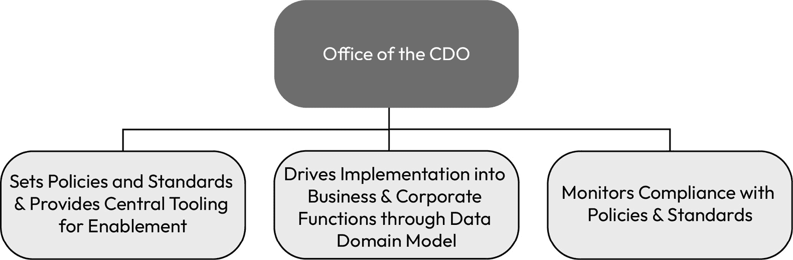
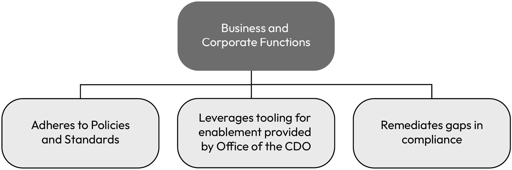
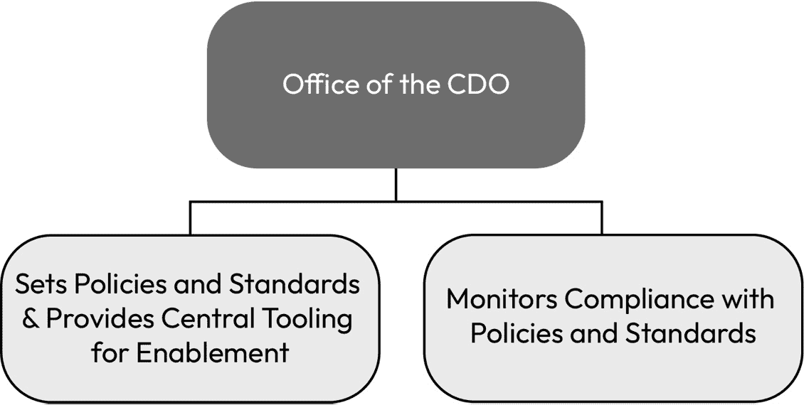
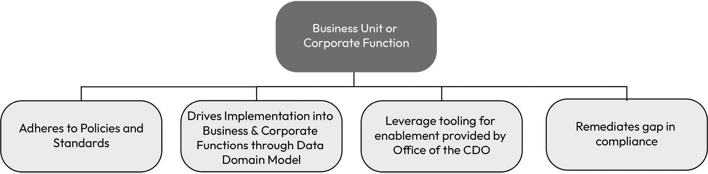
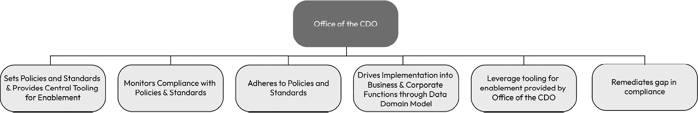
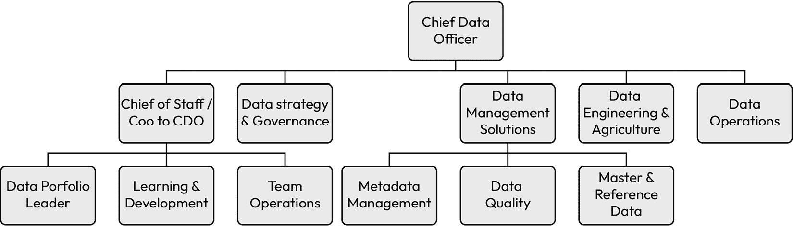

# 第三章：构建一个高效能的团队

建立一个高效能的数据治理团队是公司成功利用数据的关键性和长期投资。通过阅读本章内容，我假设你希望建立一个高效的数据治理团队和/或创建一个完整的数据与分析职能。最终，你的成功将取决于你组建的团队能否为你的组织提供卓越、高质量、具有影响力的解决方案。鉴于数据专业人才的稀缺，这是衡量你成功的第二个最重要指标；即聘用公司能负担得起的最优秀的人才（第一个是能够设定并衡量成功的标准，正如我在《第二章》《如何建立支持者联盟》和《第五章》《定义成功与成果对齐》中所提到的）。

根据你公司独特的情况，你可能会遇到几种不同的情景，促使你需要建立一个团队。你可能是数据领域的第一位员工，需要从零开始组建整个团队。你也可能是被引入来将公司内分散的团队整合到一起，在你的领导下统一协作。或者，你可能继承了一个完全完整但需要转型的现有团队。无论你处于哪种情况，从你踏入公司门口的那一刻起，团队的表现就牢牢地压在你的肩上。

在本章中，我们将讨论哪些角色很重要以及为什么，如何构建一个成功的团队，如何实施正确的日常工作和节奏，以及如何在团队内外培养人才。正如你可能已经猜到的，建立一个高效能的数据治理团队是公司成功利用数据的关键性和长期投资。**首席数据与分析官** (**CDAO**)及 CDAO 办公室直到 2002 年才开始设立（最早在*Capital One*），而到 2012 年，全球仅有 100 位 CDAO。然而，根据*LinkedIn*的数据，近年来 CDAO 的数量已经增长到超过 152,000。**首席数据官** (**CDO**)这一角色则更为常见，67.9%的大型公司已任命了 CDO，而 2012 年这一比例仅为 12%。随着 CDAO 角色需求的快速增长，这些专家的薪资也随之上涨，因此这些角色的**投资回报** (**ROI**)正受到持续的审视。对于 CDAO 办公室的成功而言，迅速、高效且有效地建立一个高效能团队至关重要。

我们将讨论以下主要话题：

+   聚焦成果优化

+   三种常见的数据组织模型

+   需要哪些角色

+   人工智能考量

+   如何为结果构建团队（及其原因）

+   构建数据业务的节奏

+   功能角色

+   人才发展

# 聚焦成果优化

当你开始设计一个组织模型和运营模型，以便公司交付重要的数据管理和分析结果时，必须从目标开始。你并不是在构建一个单一的部门；你是在构建一个数据赋能的企业。在设计组织模型之前，你必须先定义所需的能力。这些能力是你在根据*第二章*中的过程建立倡导者联盟时所进行对话的主要结果。

用例

在我之前的一家公司，我们非常关注报告中使用的数据质量。因此，我们的数据战略主要依托于一个重要能力：重新架构数据基础设施，以推动一个精简且策划的数据生态系统，能够生成高质量的报告，并且具有较高的通用数据元素的可重用性，这些元素为报告提供数据支持。这确保了通用数据元素的可靠性和高质量。这是一个明确且集中的计划，围绕着公司组织和优化了这一特定结果。

结果是，最大的员工配备专注于创建授权供应点，确保我们拥有一个全面且可靠的数据湖，并在所有环境中部署强有力的数据治理。分析和数据科学合并为一个领导者，而数据管理部分则被拆分出来，直接向 CDAO 报告，因这些能力的重要性和成熟度较低。这让 CDAO 对数据管理有了更直接的监督和关注，因为那是我们的主要投资和关注领域。

## 常见结果

数据和分析团队可能会关注无数种结果组合，而且新的关注点不断涌现。在撰写本文时，**生成性人工智能**（**GenAI**）已成为许多创新领域的前沿，因此，高质量数据的重要性正在重新回到 CDAO 议程的最前端。重要的考虑因素是，正如我们在*第二章*中讨论的那样，*如何建立倡导者联盟*，评估公司战略以确保你所优先考虑的事项支持业务需求。以下是根据我在数据治理经验中总结出的 10 个常见结果，预示着建立高效团队的成功：

+   **改进决策**：一个高效的数据管理团队通过确保所依赖的数据准确、最新且易于访问，从而加快和提高决策的准确性。

+   **提高效率**：通过建立明确的数据录入、存储和检索流程，一个高效的数据管理团队能够最大限度地减少在查找数据或修正错误上浪费的时间，从而提高组织效率。

+   **数据安全**：他们确保敏感数据得到保护，符合相关法规（如**通用数据保护条例**（**GDPR**）、**加利福尼亚消费者隐私法案**（**CCPA**）等），并且只有授权人员可以访问。

+   **提升数据质量**：他们实施数据验证和清洗流程，以保持数据的高质量，减少基于错误信息做出决策的风险。

+   **可扩展性**：一个组织良好的数据管理团队为未来的公司发展做好准备，确保数据基础设施具备可扩展性，能够处理公司扩展时增加的数据量。

+   **改善客户体验**：通过有效管理客户数据，团队可以帮助其他部门个性化客户体验，预测客户需求，并及时响应客户的咨询或问题。

+   **创新与洞察**：高效的数据管理团队可以帮助识别数据中的模式和趋势，从而得出推动创新和战略规划的新洞察。

+   **数据素养**：这样的团队还可以帮助提升组织内部的数据素养，赋予员工在各自岗位上有效使用数据所需的理解力和技能。

+   **合规性**：良好的数据管理确保公司遵守与数据隐私和管理相关的行业标准和法规，避免潜在的法律问题和罚款。

+   **节约成本**：适当的数据管理可以随着时间的推移带来显著的成本节省。这些节省可能来自提高效率、减少错误，或防止昂贵的数据泄露和不合规罚款。

你可以将这份成果清单作为组建数据团队的部分依据。如果你需要一个起点，可以从这个清单中选择适合你公司需求的内容。你应该定制需求领域，添加新的成果，删除不适用的部分。

## 定义核心职能

到目前为止，我们已经花时间定义了数据治理，并探索了如何建立出色的合作关系，现在，较为艰难的工作开始了。作为领导者，你的工作是根据这些输入开始塑造你的团队。由于如何将数据专业人员组合成团队的方式是无限的，我将引导你了解一些常见的模式，帮助你入门。不要害怕根据公司需求进行偏离。需要考虑的关键问题如下：

+   团队的核心能力将是什么？

+   团队的优先事项是什么？

+   什么是紧急的，需要立即处理的，什么是可以等待的？

+   作为领导者，我最需要参与的是什么？我最需要密切关注的是什么？

+   我团队中有哪些人才缺口，可能影响我需要将时间和精力集中在哪些人身上？

这些问题的答案将帮助确定哪些模型最适合推动团队结构的构建。我们将探讨三种设计数据职能的基础选项以及每种选项的优缺点。在继续评估这些选项时，不要过于纠结于哪个模型最完美。完美的模型并不存在。这些组织设计只是可以为团队设计提供借鉴的模板。

## 在组织设计中融入产品管理

最近，数据治理团队和分析团队有意将核心产品管理原则应用于数据能力交付。这一转变吸引了许多大大小小的公司，因为专注于少量、小规模的一次性交付，注重长期持续交付，且质量更高的方式带来了压倒性的好处。

就像软件开发领域的产品管理专注于创建和维护成功的产品一样，数据产品管理涉及将数据视为宝贵的资产，并制定战略性的方法来组织和利用数据。以下是如何在组织设计中融入产品管理：

1.  **识别利益相关者及其需求**。就像在产品管理中一样，了解利益相关者的需求对于数据组织设计至关重要。数据组织应识别与数据互动的各个团队、部门和个人，并收集他们的需求。这有助于将数据解决方案与最终用户的具体需求对接。

1.  **明确目标和目标设定**。数据产品管理包括为数据项目设定明确的目标和方向。这可以包括提高数据的可访问性和准确性，或支持数据驱动的决策。通过设定这些目标，数据组织能够专注于需要实现的内容并衡量成功。

1.  **优先考虑数据项目**。与产品经理根据业务价值和用户影响来优先考虑功能和改进类似，数据组织应根据数据项目的重要性和对组织目标的潜在影响来优先排序。这确保了资源的高效分配。

1.  **迭代开发和敏捷实践**。在数据组织设计中采用迭代开发方法和敏捷实践有助于持续改进。这种方法使数据团队能够根据用户反馈不断迭代其解决方案，适应变化的需求，并有效响应不断变化的业务需求。

1.  **以用户为中心的设计**。就像产品经理专注于创建用户友好的产品一样，数据组织应优先考虑以用户为中心的数据设计。这意味着提供易于理解和使用的数据格式，并以最终用户体验为核心来设计数据解决方案。

1.  **数据文档和沟通**。有效的产品管理包括清晰的文档和沟通。同样，数据组织应当记录数据定义、数据来源和数据血统，便于利益相关者更容易理解并有效使用数据。

1.  **绩效衡量和指标**（*没错，就是关于数据的数据！*）。数据产品管理需要将数据举措的绩效与既定的目标和关键绩效指标（KPI）进行衡量。通过跟踪与数据使用、数据质量和数据可访问性相关的指标，数据组织可以持续评估其绩效，并做出基于数据的改进。

通过采纳这些产品管理原则，数据组织可以确保其数据基础设施与业务目标对齐，向利益相关者提供价值，并保持对数据世界中不断变化需求的适应性。在本章接下来的部分中，我们将探讨常见的数据组织模型，我将结合产品管理的概念，使我们在组织设计中融入这些原则。

# 三种常见的数据组织模型

你所需要的角色应当由你要实现的目标来决定。事实上，组织可以也应该有无尽的可能性来构建一个成功的团队，只有你才能为你的独特情况设计出合适的团队。然而，在接下来的页面中，我将概述你可能需要领导的四种数据职能类型，并建议一些不同的组织结构，帮助这四种职能成功地交付。作为数据职能的领导者，你的工作是选择哪种职能类型最适合你组织的目标。

## 建立首席数据官（CDO）办公室

无论公司有何种数据和分析需求，组织至少应有一个小型的中央职能。我将这个中央职能称为首席数据官（CDO）办公室。根据你选择的组织结构，你可能会有一个规模更大、职责更广的办公室，或是一个规模更小、职责更集中的办公室。理想情况下，这个 CDO 中央办公室将负责制定组织应遵循的期望、政策和标准。至少，这个中央职能将负责设定这些要求，并应负责实施和持续监控合规性。

如果没有建立一个集中职能来负责需求、实施需求以及持续监控合规性，各个**业务单元**（**BUs**）将只能依靠自己的需求、实施做法和持续监控，这将导致公司数据管理上的不一致。如果一个组织想要有效管理数据，至少必须建立这个中央小组。为了保持政策和监控实践的客观性并消除偏见，CDO 办公室的领导应尽可能报告给公司内部一个中立的位置。

### 联邦数据办公室模型 – CDO 办公室

如果如前所述定义了一个狭义的集中的 CDO 办公室，那么该办公室设定的要求将需要由各自的业务单元来实施。这种模型是“联邦式”的，CDO 办公室做最低限度的工作，而业务单元和各自的企业职能（例如，财务、销售、研发）必须完成所有实施工作。在这种模型中，部门可能会或可能不会有部门级的 CDO 来推动部门内的要求。它们也可能被赋予设计和实施自身能力的权力，以遵循 CDO 办公室的企业政策：

图 3.1 – 联邦模型中的 CDO 办公室

这种模型赋予业务单元和企业职能根据自身需求创建所需能力的权力，但也使得这些能力难以整合，从而难以提供企业范围内的数据视图。通常，组织会从这样的模型开始，优先考虑每个业务单元/企业职能的需求，而忽视整个企业的需求，通常在数据工作变得优先且更加规范化后，企业需要进行合理化工作。

为了制定政策和标准，首席数据官（CDO）办公室应当创建一个企业数据委员会或企业数据理事会。这个小组应由 CDO 主持，并由所有主要业务单元和企业职能的领导组成。政策中列出的要求应由企业数据委员会/理事会批准，并向组织发布，业务单元和企业职能应当采纳这些要求。任何为了实现政策合规性所需的工具应由 CDO 办公室集中管理。任何政策的例外或违规行为应当透明地监控，并报告给相应的业务单元或企业职能负责人，以及 CDO 和企业数据委员会/理事会。

### 半自治数据办公室模型 – 业务单元（BUs）和企业职能

随着业务单元和企业职能设立领导人来对其部门内政策和标准的实施负责，每个应用、数据资产和服务应根据数据领域模型进行分类。数据领域模型为该资产、应用和/或服务指定数据管理员。数据管理员最终负责确保该资产、应用和/或服务在首席数据官办公室通过企业数据委员会/委员会设定的政策和标准下进行管理，并确保这些资产、应用和/或服务按照预期用途得当使用：

图 3.2 – 半联邦模型中业务单元（BUs）和企业职能的职责

## 通过中心辐射模型推动成熟和赋能

第二种模型，即中心辐射模型，旨在通过所谓的中心辐射模型来实施政策和标准，其中中央团队提供期望、政策标准、*以及能力*，而辐射部分（即业务单元和企业职能）则将实施推动到组织的各个层面。当然，这个模型的实施还需要考虑你所在的业务类型、需要遵守的法规以及组织的规模和复杂性。

### 中心辐射模型 – 首席数据官（CDO）办公室

中心辐射模型与联邦模型的主要区别在于，实施活动在这个模型中完全落在辐射部分或业务单元和企业职能上。在这个模型中，每个业务单元或企业职能可能也会有一个部门级的首席数据官（CDO），这与联邦模型类似。虽然联邦模型与中心辐射模型之间看似存在一个显著的区别，但这个区别是*重要的*，因为数据治理的艰巨工作并不在于定义需要做什么，而在于通过业务采纳中央能力来将能力传递给业务。中心辐射模型的主要好处是跨组织标准化能力，这使得整个公司保持一致：

图 3.3 – 中心辐射模型中首席数据官（CDO）办公室

### 中心辐射模型 – 业务单元和企业职能

该模型展示了业务单元或企业职能应如何设计：

图 3.4 – 中心辐射模型中的业务单元和企业职能

## 通过集中模型推动一致性

在集中模型中，所有职责都集中在 CDO 办公室内。当组织中不同部门的成熟度差异较大，存在需要整改的重大问题，或者公司希望在短期内最大化一致性或节省成本时，这一模型非常有效。如果您的组织发现自己完全集中化数据和分析，我建议您将其作为一个短期（12-24 个月）的解决方案，并在立即完成整改工作后，推动过渡到集线器和辐射模型。从长期来看，完全的集中模型将数据管理者与业务单元和公司职能分开，这会削弱专业知识，并随着时间的推移降低数据管理者的有效性。

理想情况下，集中化允许所有业务单元和公司职能集合在一起，充分利用彼此的专业知识，快速采用由 CDO 办公室推动的能力，然后再推回到集线器和辐射模型的各个辐射点，以便在长期内在整个组织中优化数据管理。

### 集中模型 – CDO 办公室

以下图示展示了如何为集中模型设计首席数据官办公室：

图 3.5 – CDO 办公室的集中模型

## 如何为您的组织选择正确的模型

我有机会在三家*财富 500 强*公司推动数据转型（至今为止），我可以自信地说这一点：没有任何公司能够完美管理数据。虽然有些公司做得比其他公司更好，但最终，最好的模型是那个能够推动进步、成熟以及全面使用洞察来运营公司或组织的模型。

根据我的经验，公司通常会尝试几种模型（如果不是全部的话），直到找到最适合自己情况和/或企业文化的模型。如果您的公司还没有建立*任何*数据要求或能力，我建议从建立一个 CDO 办公室开始，组建一个小型的启动团队，首先为数据构建商业案例（详见*第二章*，*如何建立支持者联盟*，深入探讨为数据构建案例）并逐步朝着集线器和辐射模型发展，随着各职能部门对数据成熟度成果的认同。

然而，如果您的组织在某些能力上的实施不一致*并且*存在数据质量、数据的适当使用或对数据洞察的信任等重大问题，那么将您的数据和分析专业人士集中到一个团队中，推动一致性、严格性，并提高对数据职能、能力和输出的信任，可能是一个明智的选择。

最后，如果你为数据倡议提供了普遍的支持，拥有嵌入各业务单元和公司职能中的强有力领导，并且希望提升整体成熟度、能力的采用或进一步强化现状，中心辐射模型是最好的选择。根据我的经验，中心辐射模型在中央 CDO 办公室也强大、稳定并得到适当资金支持（即人员、工具和能力）时，能够带来持久的成功，*只有在这个时候*它才是最有效的。

# 需要哪些角色

CDO 办公室中所需的角色会根据组织的规模和复杂性有所不同。CDO 在帮助组织通过提供高质量数据来做出更好决策方面起着至关重要的作用。他们还帮助组织遵守数据隐私法规。因此，我们首先要确立和定义的角色是 CDO。CDO 通常不会是组织中第一个从事数据相关工作的员工。

通常，在 CDO 的招聘或设立之前，已经有团队成员存在，甚至可能已经表现出色。通常发生过某种组织性事件（如危机、需要转向使用数据、意识到公司未能及时做出决策），这促使了数据高管的招聘。在这类招聘之前，公司通常已经有数据专业人员。他们通常未集中在一个职能部门，或者虽已集中但仍是低级别的专业人员。在我们进行职能结构化时，我将从上而下地定义这些职能的角色和结构，从 CDO 开始，但要认识到他们通常不是第一个存在的角色。

## CDO 与 CDAO 的区别

**CDO**最终对公司数据使用的成功或失败负责。这个责任是分散的，但最终，CDO 是设定愿景、使命和成功目标的人，负责使用和保护数据，并引导公司数据相关的各项举措。成功的 CDO 是商业伙伴的真正合作伙伴，了解他们的需求和战略，并为他们提供能够为其成功增值的解决方案。

在撰写本文时，大多数行业现在都有了确立的 CDO（首席数据官）。不同的是该角色的范围有所不同。为了帮助你开始确认作为数据职能负责人角色的范围，或帮助你为组织的 CDO 撰写职位描述，我分享了一个概要，你可以从中开始并根据需要进行定制。

关键是要确保为这个角色招聘的人能够在高层管理中导航，从数据挖掘中创造价值，并通过数据解决方案推动业务成果。虽然一些公司没有在该职位的名称中使用“首席”这一称谓，但我坚信这很重要，因为它为公司其他高层管理人员提供了信誉，表明 CDO 是公司中至关重要的高管。

CDO 角色概述

CDO 将监督其信息资产的管理，重点是建立并确保遵守数据治理政策、标准和实践框架，这些框架需在企业级和集团级实施，目标是实现与业务需求和成果相一致的期望一致性和质量。此人应具备技术技能、商业敏锐度和人际交往能力的平衡，以应对管理宝贵公司数据资产时可能遇到的技术和政治障碍。

主要职责如下：

+   定义数据战略

+   主办企业数据委员会、委员会和工作组

+   数据政策的所有权

+   推动并购（M&A）活动中的数据整合

+   数据计划的监督

+   数据治理和质量

+   从数据中生成商业价值

+   确保数据的可用性

+   主数据管理（MDM）

+   设计和实施数据架构

+   管理数据基础设施和平台

以下图示展示了首席数据官（CDO）团队可能的组织结构：

图 3.6 – CDO 的组织模型

一些组织将其顶级数据领导者称为**CDAO**。有时这与 CDO 是同义的，有时则不是。在某些组织中，CDO 可能同时负责数据管理和数据分析，而在其他组织中，CDO 可能只负责数据管理。我曾经在这两种定义下担任过 CDO。更少见的是，也可能设立**首席分析官**（**CAO**）一职。无论是 CDO 还是 CDAO，职称的差别并不重要，关键在于角色职责的定义和明确性。重要的是要知道，您的组织中所指的顶级数据领导者的职责范围是什么，并确保业务单位和公司职能的一致性。为了本书的目的，我将使用 CDO 来指代那些分析不属于组织的一部分的公司，而 CDAO 则指代分析已包括在组织中的公司。

CDAO 角色总结

公司正在寻找一位经验丰富的 CDAO 来领导公司的数据和分析愿景及战略。在这个角色中，您将负责评估公司当前的数据和分析生态系统的状况，与业务和技术领导者合作，设计并实施一个真正一流的战略，以支持公司近期和长期的愿景。

您将建立并领导一个集中式的数据和分析团队，专注于治理、数据管理、分析和数据科学。

主要职责包括：

+   将数据和分析确立为一项一流的独立职能（例如，集中式）

+   为公司定义整体的数据和分析愿景及战略

+   与职能和业务领导者一起，沟通组织范围内的数据战略和北极星架构、数据基础设施以及工具

+   与安全团队合作，定义一种数据访问策略，既能保护数据，又能推动数据在企业范围内的民主化

+   定义和推动关键数据用例，产生/解锁收入机会，最大化运营效率并降低风险

+   优化客户体验，并推动企业范围内的高质量决策

+   吸引、留住并提升/再培训数据、分析和人工智能领域的关键人才

+   提供数据、分析、**人工智能**（**AI**）合作伙伴关系、投资及并购活动的主题专家

## 数据管理角色

对于 CDO/CDAO 办公室的**数据管理**部分，我推荐四个核心子职能：数据治理、数据解决方案、数据工程/架构和数据运营。你可能还希望通过副 CDO（如其名所示）、幕僚长和/或项目经理等角色来补充你的领导团队。根据公司的规模和团队情况，你可能还需要添加其他角色。请将此视为一个建议的职能集合，而非详尽无遗的清单。根据你的行业需求，可能需要专门的领导者。

在建立数据职能时，最重要的招聘职位，且通常被低估的，是**数据治理和战略领导者**。此领导者将负责汇聚整个组织中的关键数据专业人员，与首席数据官（CDO）共同定义公司战略，并成为负责在组织内推广这一战略的主要人物。此领导者还将组建一个团队，负责管理企业数据委员会/委员会及实践社区，推动数据素养项目，并监控他们为公司制定的政策和标准的合规性。没有此人到位，公司很难设定衡量标准。在*第四章*，*基准化组织*中，我们将深入讨论如何衡量成熟度，理想情况下，数据治理和战略领导者也会衡量组织的成熟度，你将需要他们来执行*第四章*中概述的内容，*基准化* *组织*。

数据治理和战略领导者的概述

数据治理和战略领导者负责与 CDO 合作设定数据战略，并在整个组织中制定和实施数据治理政策和程序

这包括开发数据治理框架、识别和分类数据资产，以及建立数据质量标准。数据治理领导者还将与各业务部门合作，确保遵守数据治理政策和程序。

责任包括以下内容：

+   制定和实施数据治理政策和程序

+   识别和分类数据资产

+   建立数据质量标准

+   与业务部门合作，确保遵守数据治理政策和程序

+   进行数据审计和评估

+   开发并提供数据治理培训

+   管理数据治理计划

以下是所需的资格要求：

+   拥有 10 年以上的数据治理经验

+   具有数据建模、数据仓库和数据分析经验

+   具有数据质量管理经验

+   具有数据安全和合规性经验

+   出色的沟通和人际交往能力

+   强大的分析和问题解决能力

+   能够独立工作并能作为团队的一部分工作

## 数据解决方案领导者

我建议的第二个职位是**数据解决方案领导者**。这个角色也可以称为数据管理解决方案领导者、数据赋能领导者或类似职位。该角色也可以分拆为如元数据领导者、数据质量领导者和主数据领导者等职能。这个领导者和/或其子职能负责为公司赋能数据能力。他们应该设定能力要求，与 IT 部门合作选择适合公司需求的工具，并与业务部门和公司职能合作，确保这些工具的使用符合首席数据官办公室制定的政策和标准。领导者还将确保首席数据官办公室在处理任何直接负责的数据时（即通常所说的主数据；更多内容请见*第十章*，*主数据管理*）正确使用这些能力。

数据解决方案领导者总结

数据解决方案领导者负责为公司提供数据管理工具。这包括开发和实施产品管理流程，以及与跨职能团队合作，确保数据管理计划的成功。

理想的候选人将具有扎实的数据管理原则和技术的理解，以及产品管理经验。他们还应该能够有效地与公司各级利益相关者沟通和管理。

责任包括以下内容：

+   制定和实施数据管理工具的产品管理流程

+   与跨职能团队合作，确保数据管理计划的成功

+   开发和维持与关键利益相关者的关系

+   了解最新的数据管理技术和趋势

+   参与公司数据管理战略的制定

以下资格要求：

+   5 年以上数据管理经验

+   3 年以上产品管理经验

+   深刻理解数据管理原则和技术

+   出色的沟通和人际交往能力

+   独立工作和团队合作的能力

+   同时管理多个项目的能力

+   强大的分析和解决问题的能力

+   注重细节

### 信息架构师

我推荐的第三位员工是**信息架构师**。信息架构师负责为公司提供可获取的信息。理想情况下，这个人将设计信息通过系统、解决方案和洞察力的架构设计，供用户消费的方式。这个角色在重大项目的早期阶段最为有效，确保公司的数据需求与处理、财务等能力平等设计。通常，数据直到重大项目的后期才被纳入，这使得通过转型赋能公司变得更加困难。你的更广泛的**数据架构**团队将在设计跨组织的数据流动中发挥关键作用，以确保数据流的优化，并支持公司广泛的需求。

信息架构师的总结

信息架构师负责公司数据架构的设计和实施。理想的候选人将深刻理解数据建模、数据仓库和数据治理。他们还将具备产品管理经验，并能够与跨职能团队合作，设计和部署数据驱动的解决方案。

职责包括以下内容：

+   设计和实施公司的数据架构

+   开发和维护数据模型

+   创建和管理数据仓库

+   实施数据治理政策

+   与产品经理合作设计和部署数据驱动的解决方案

+   分析数据以识别趋势和机会

+   跟进最新的数据技术

以下资格要求：

+   5 年以上数据架构经验

+   拥有数据建模、数据仓库和数据治理的经验

+   拥有产品管理经验

+   强大的分析和解决问题的能力

+   出色的沟通和人际交往能力

+   独立工作和团队合作的能力

### 数据工程领导者

当你开始招聘之前提到的职位时，作为优先事项，尽早招聘或集中招聘**数据工程**专业人士会非常有用。数据工程师通常比前述职位稍微容易招聘；然而，优秀数据工程师的竞争依然激烈，尤其是在新兴技术或特定领域，如主数据（master data）等稀缺的深度经验人才。数据工程师负责在数据团队内提供工程解决方案，并供公司各部门使用。你的数据工程团队还可能会创建经过筛选并可信赖的数据集或视图，供全公司使用。通常，数据工程师还负责构建 API、数据交换，并广泛地在组织内移动数据。

数据工程负责人总结

数据工程负责人将为公司提供数据工程能力。在此角色中，您将负责领导数据工程师团队，开发和维护我们的数据基础设施。您还将与产品经理合作，了解他们的需求，并制定满足这些需求的解决方案。

职责包括以下内容：

+   领导数据工程师团队开发和维护我们的数据基础设施

+   与产品经理合作，了解他们的需求，并制定满足这些需求的解决方案

+   设计和实施数据管道和数据仓库

+   制定和实施数据质量及治理政策

+   监控和优化数据性能

+   紧跟最新的数据工程技术

以下资质要求：

+   5 年以上数据工程经验

+   有大数据技术的经验，如**Hadoop**、**Spark**和**Hive**

+   有数据仓库技术的经验，如**Redshift**、**Snowflake**和**BigQuery**

+   有使用数据可视化工具的经验，如**Tableau**、**Power BI**和**Looker**

+   有产品管理方法论的经验

+   优秀的沟通和团队合作能力

+   强大的分析和问题解决能力

+   能够独立工作并作为团队的一员协作

### 数据运营负责人

最后，**数据运营**团队负责管理团队的日常运营，可能还负责处理错误、手动移动或匹配主数据平台中出现的异常数据或不匹配记录。理想情况下，数据运营团队还可能承担数据修复的责任，即修正数据问题。在许多数据转换过程中，有时需要对数据进行批量修复或分组修复，以准备将数据迁移到新平台。数据运营团队可以为公司提供此类服务。

数据运营负责人总结

数据运营负责人负责制定和执行公司的数据运营战略。这包括设计和实施数据管道、管理数据质量，以及确保遵守数据治理政策。数据运营负责人还将与跨职能团队合作，开发和实施数据驱动的解决方案。

职责包括以下内容：

+   制定和执行公司的数据运营战略

+   设计和实施数据管道

+   管理数据质量

+   确保遵守数据治理政策

+   与跨职能团队合作，开发和实施数据驱动的解决方案

以下资格是必需的：

+   5 年以上的数据运营经验

+   拥有数据仓库和数据湖的经验

+   拥有数据质量和数据治理的经验

+   拥有大数据技术的经验

+   拥有 SQL 和 Python 的经验

+   优秀的沟通和人际交往能力

+   强大的分析和问题解决能力

+   独立工作和团队合作的能力

# 人工智能考虑事项

在撰写本文时，人工智能已经成为与数据相关的几乎所有对话的主题。像我这样的许多数据从业者对人工智能的潜力感到兴奋，但也希望看到在人工智能实践中应用治理。由于支持人工智能的数据治理需求，数据专业人员的需求比以往任何时候都要高。主要的问题包括以下内容：

+   如何确保用于训练人工智能的基础数据集是合适的？

+   如何保护提示？它们是否被保留？

+   如果将**知识产权**（**IP**，例如源代码）输入到开源人工智能解决方案中，我们如何保护它？

+   我的数据是如何受到保护的？

+   GenAI 产品是如何训练的？数据会发生什么？

+   我们如何确保输入和输出在道德上得到处理，并符合我们公司的价值观？

关于人工智能有很多需要定义的内容，而且变化的速度只会加快。许多组织希望其首席数据官（CDO）帮助定义他们应该采取哪些措施，以在人工智能的数据使用方面建立适当的实践。作为您组织的数据负责人，您应当对此负责，并急需优先考虑这个领域。随着全球监管者预计进行监督，确保公司定义数据治理和伦理使用实践，特别是如何将数据用于机器学习（**ML**）和**大型语言模型**（**LLMs**）的优先级，是至关重要的。

另一方面，您也可以考虑如何利用人工智能推动数据解决方案的卓越性。这个话题复杂且发展迅速。我鼓励您关注这些领域，因为随着新机会的出现，您可以利用人工智能。需要考虑的关键领域如下：

+   **数据质量**：AI 可以通过识别和修正错误、不一致和缺失值来提高数据质量。这有助于确保数据在决策过程中是准确可靠的。

+   **数据隐私**：AI 可以通过数据匿名化或假名化以及实施访问控制来保护数据隐私。这有助于确保数据不被滥用或泄露给未经授权的人。

+   **数据安全**：AI 可以通过检测和防止网络攻击以及实施数据加密来保护数据安全。这有助于确保数据不会丢失、被盗或被篡改。

+   **数据合规性**：AI 可以通过识别和修复合规风险来确保数据符合规定。这有助于确保组织遵守适用的法律和法规。

值得注意的是，AI 是一个快速发展的领域，随着 AI 技术的发展，数据治理团队对 AI 的考虑将不断变化。

# 如何构建以结果为导向的团队（以及原因）

虽然本书主要关注数据治理和数据管理团队的部分，但我还是想简要谈一下团队结构中的分析侧。坦率地说，我认为有无数种方式来构建分析团队结构，正如你可以在 John K. Thompson 的《构建分析团队》一书中进一步阅读到的那样（这是一本对于任何想要推动分析卓越的人的极好书籍）。有一些优化分析的方法，我在自己的团队中也曾应用过。在所有这些方法中，都基于我希望优化的业务成果。

首先，如果你专注于内部工作，目标是推动运营卓越、对齐高层指标，或者仅仅是支持内部运营功能，那么一个简单的单一团队可能是最佳选择。在我们优化公司内部需求时，我曾将分析团队整合到一个单一的分析领导下。其次，如果你专注于改进产品和其中的工程工作，那么我建议按业务单元（BU）来对齐分析团队。例如，如果你有软件和硬件两个业务单元，可以将你的分析团队分为软件分析团队和硬件分析团队。其优点是，团队现在可以集中精力，紧密对接所支持的业务领域，深入学习其驱动因素，并能够为利益相关者优化。缺点是，你必须亲自作为这两个团队之间的连接纽带，确保它们的对齐，并确保两个团队在需要合作取得成功的地方能够顺利衔接。

另外，根据你的业务性质，你可能也会非常专注于客户（不论业务类型，我希望你能专注于客户）。这种对外部利益相关者（市场营销、销售、客户成功）的关注，可能会导致为销售、市场营销和客户成功分别建立独立的分析团队，或者建立一个专注于客户分析的团队。在所有情况下，你应该以你要解决的成果为优化目标，并且不要害怕随着优先级的变化进行调整。当你组建团队时，可能会有一些亟需解决的紧迫问题；可以通过相应的团队结构来优化这些问题。然而，随着职能的发展，不要犹豫做出调整。毕竟，唯一不变的就是变化。

# 构建数据业务的节奏

在组织团队时，另一个必须尽早解决的优先事项是建立数据业务的节奏。在我曾经领导的所有数据项目中，我早期低估了这一点的重要性，并且不得不从后果中吸取教训。当你进入角色，倾听业务、团队并制定战略时，你的团队仍然在做……一些事情。在你与同行和高层管理人员合作，了解公司和团队未来的优先事项时，了解团队内部正在发生的事情至关重要。

我建议给团队分配一个人负责建立组织中正在进行的项目、计划和**日常业务**（**BAU**）工作的清单。项目负责人或幕僚长是一个非常适合带领这个工作的角色。根据我的经验，数据领导者通常不会把项目管理作为优先事项，因此，我还没有在任何一个数据领导职位上看到过明确而全面的项目管理。如果你们团队已经有了这样的安排，那就大有可为。如果没有，赶紧开始识别团队正在做的工作，并尽快完成。越早了解团队已经在进行的成果，越早能够识别快速成功的机会，并优化团队以确保成功。

作为这个项目管理工作的组成部分，我建议你设立一个例行论坛，来审查数据业务组合。理想情况下，你应该定期获得团队正在进行的工作、取得的进展、利益相关者的成果（*注意*：不是数据结果，而是你服务的利益相关者从团队的工作中得到的体验）、问题和风险，以及即将到来的里程碑的更新。团队是否需要你的支持才能推进？是否存在成功的障碍？这些见解还将帮助你在与高层利益相关者开会时做好准备，这样你在建立关系时就不会感到措手不及。你可能希望为此目的设立一个数据业务项目审查，至少每两周一次。当你在角色上逐渐进入状态时，你可以要求每个直属下属设定一个时间，向你更全面地汇报他们负责的项目部分，这样你可以在进入常规审查之前，深入了解具体情况。

当你开始汇聚组织内的关键领导者，来共同管理数据（作为公司的一项团队运动）时，你应该建立几个论坛，继续保持关键利益相关者的积极参与，支持公司的数据成果。最终你将拥有几个不同的论坛来实现这一目标，我将提供每个论坛的示例章程，你可以利用这些来启动工作。

## 企业数据委员会

当你开始与高层同事互动时，邀请他们加入**企业数据委员会**或委员会。如在*第一章*《什么是数据治理？》和*第二章*《如何建立支持者联盟》中所讨论的，这个论坛作为你的数据领域高层的联合平台。这个论坛也为优先排序项目、确保将正确的资金分配到合适的数据计划，并确保出现的问题能得到适当的可见性和优先级，以便由数据运营团队或公司各数据负责人进行必要的修复。这个小组应当影响并批准公司的数据战略及相关的转型。一个精心策划的数据业务项目摘要，可能是一个有用的视图，可以作为附录共享给委员会，或者在离线更新中分享。

企业数据委员会的示例章程

**目的**

数据治理委员会负责为组织制定和实施数据治理框架。该框架将确保数据得到有效和负责任的管理，并且支持组织的战略目标。

**重要性**

数据治理框架很重要，原因有几点。首先，它有助于确保数据的准确性、完整性和一致性。第二，它有助于保护数据免受未经授权的访问、使用或披露。第三，它有助于确保数据的使用符合法律法规要求。第四，它通过提供可靠和相关数据，帮助提升决策质量。

**关键代表**

数据治理委员会应包括来自组织中所有使用数据领域的高层管理人员（C-suite 领导），包括以下人员：

+   信息技术

+   业务单元（BUs）

+   法务

+   合规

+   人力资源

+   财务

**关键角色** **和责任**

数据治理委员会负责以下事项：

+   制定和批准数据治理战略

+   监督数据治理战略、政策和框架的实施

+   监控数据治理框架的有效性，基于 CDO 和企业数据委员会报告的信息

+   提出改进数据治理框架的建议

+   资助员工在数据治理方面的教育和培训

+   向首席执行官和董事会报告数据治理活动

+   **会议安排**

+   数据治理委员会将每季度召开一次会议。

**沟通计划**

数据治理委员会将通过多种渠道与员工沟通，包括以下方式：

+   电子邮件

+   内部网

+   市政厅会议

+   一对一会议

**评估计划**

数据治理委员会将每年评估一次数据治理框架的有效性。

## 企业数据委员会

委员会可以作为在向组织高层汇报和审核之前的讨论平台。虽然一些 C-suite 成员可能会参与企业数据委员会，但其他成员可能不会。因此，确保与合适的人员共享正确的信息是沟通计划的关键组成部分。通过委员会预览信息可以带来好处：你可以在向高层汇报前从委员会获得反馈，并且，你可以让委员会成员帮助争取他们管理层（通常是 C-suite）的支持。

企业数据委员会的示范章程

**目的**

数据治理委员会是一个跨职能的高级领导团队，负责设定战略方向并监督*组织名称*的数据治理实施。该委员会将制定和实施政策和程序，确保在整个组织中有效管理数据。

**重要性**

数据对*组织名称*而言是一个关键资产。它用于做出决策、开发产品和服务、以及改善运营。有效的数据治理对于确保数据得到负责任和道德的使用，并且保护数据不被未经授权的访问和披露至关重要。

**关键代表**

数据治理委员会将包括来自以下部门的代表，通常是他们所支持的 C-suite 成员下的 1-2 级人员：

+   信息技术

+   法务

+   财务

+   人力资源

+   市场营销

+   销售

+   运作

**关键角色和责任**

数据治理委员会将拥有以下关键角色和责任：

+   制定和实施数据治理政策和程序

+   监督数据治理计划的实施

+   监控数据质量和合规性

+   解决数据治理问题

+   推荐在数据领域之间的优先级排序

+   教育和培训员工关于数据治理的知识

**报告结构**

数据治理委员会将向数据治理委员会报告，后者是负责*组织名称*数据治理的最高层级机构。

# 功能角色

功能数据角色是指在业务单元（BU）或公司职能部门中，负责管理和使用数据的人。这些角色包括通常认为的数据分析师、数据科学家、数据工程师和数据架构师等角色。它们还包括定义数据责任的治理角色，如业务数据管理员、技术数据管理员和数据运营负责人。

功能数据角色对于任何希望有效利用数据的组织至关重要。它们帮助企业理解数据、识别趋势，并做出更好的决策。

在大组织中，每个业务单元或公司职能内可能有多个功能数据角色。功能数据角色的具体职责将根据组织和行业的不同而有所不同。然而，所有功能数据角色的共同目标是利用数据帮助组织实现目标。功能数据角色是任何希望在数字时代取得成功的组织的关键部分。通过有效使用数据，组织可以改善决策、提高效率并创造竞争优势。

对于每一个数据领域（即逻辑分组的数据，例如销售、市场营销、产品和人力资源），应该从三个关键角度定义责任：

1.  通过一个*高层数据* *领域领导*实现高层责任制

1.  通过一个*业务* *数据管理员*实现数据责任制

1.  通过一个*技术* *数据管理员*实现数据责任制

你可能已经注意到，我没有使用“所有者”一词，而是用了“责任”。使用“数据受托人”或“管理员”等术语会促使个人明确自己的责任，即确保数据被适当地管理，供他人使用。这与“所有权”的心态大不相同，“所有权”往往意味着没有共享的环境。数据管理的唯一目的是妥善照看数据，并将其用于预定的价值。所有权会阻碍实现这一目标，因此不推荐使用。数据是企业资产，应当被如此对待。数据管理员的角色是确保数据能够作为企业资产得到有效使用。

## 执行数据领域领导者

执行数据领域领导者是一位高级主管，通常是中型组织的 C-suite 成员，或在大型组织中是 C-suite 下一级的负责人，最终负责确保其数据领域内的数据得到适当管理，团队遵循首席数据官（CDO）的期望，包括数据战略、数据政策和流程以及任何支持性框架。他们还负责在其领域内进行数据赞助，并确保为领域特定的工作提供适当的资金支持。

执行数据领域领导者负责任命业务数据管理员和技术数据管理员，管理其领域内数据资产的日常维护。

## 业务数据管理员

业务数据管理员负责确保业务使用的数据的质量、准确性和一致性。他们与业务用户合作，了解其数据需求，然后制定和实施数据治理政策和流程。他们还会监控数据质量，识别并修正任何问题。

这些领导者通常在业务部门（BU）和/或数据领域内工作，可能负责大量数据资产或仅负责少量数据资产。虽然每个数据领域至少需要一名业务数据管理员，但通常会有很多。

## 技术数据管理员

技术数据管理员负责数据管理的技术方面，例如数据建模、数据仓库和数据集成。他们与 IT 专业人员合作，开发和实施数据管理解决方案。他们还会监控数据质量，识别并修正任何问题。这些领导者通常在技术部门和/或业务 IT 职能中工作，可能负责大量数据领域或仅负责一个数据领域。虽然每个数据领域至少需要一名技术数据管理员，但也可能有多个，具体取决于公司规模和复杂性。

简而言之，业务数据管理员专注于数据管理的业务方面，而技术数据管理员专注于技术方面。然而，他们是密切的合作伙伴，应当以此身份共同工作，确保数据作为企业资产得到良好管理。

# 人才发展

最后，建立公司高效数据实践的最后一个，也是至关重要的组成部分是管理人才。我不得不花点时间讨论如何有效地管理数据人才。在我担任的各种数据职位中，找到并招聘最优秀的人才一直是一个挑战。几乎每家公司都在招聘数据人才，因此，确保你在满足短期需求的同时，也在为长期构建人才管道，同样重要。

## 招聘人才

作为领导者，我发现招聘人才的最佳方式之一就是保持可见性。通过在当地大学参与公开演讲、指导高中生、和/或参与本地技术组织，你可以了解市场上新兴的人才。在你需要人才之前，你和你的领导团队应该意识到那些高质量的新兴人才。注意你所合作的学校和组织，确保从广泛多样的视角审视人才。提供实习机会是提前与新兴人才合作的一个好方法，为后续全职招聘做好准备。

## 扩大人才管道

有一些非传统的方式可以帮助你扩大数据人才的管道，我也曾在这些方法上取得过成功。首先，考虑在团队内部进行跨学科轮岗，同时也与业务部门进行轮换。考虑让你的团队成员轮换到他们所支持的业务部门工作（同时让业务部门的人进入你的团队），并与业务部门商定一个时间期限。你是否有风险让团队成员永久地转到业务部门？是的——然而，这也可能让更多具备数据素养的人员进入业务部门，他们可以成为你团队以及你所做工作的支持者。如果你愿意接受，这仍然是一个好的结果。理想情况下，那位员工会带着对所支持业务的全新视角回到你的团队。

我还建议你思考一下你的招聘标准。对于所有职位，*你真的*需要四年制大学学位来作为资格要求吗？还是四年的在职培训就足够了？那么，2 年的大专学历呢？你接受证书吗？你在列出要求时，究竟是希望从技能角度获得什么？我并不否定大学教育的重要性；然而，有些职位你或许可以拓宽视野，挖掘一个全新的候选人群体，这些人群你原本可能不会考虑。

招聘相关或相邻的角色也是拓宽招聘选项的一个好方法。例如，之前定义的数据项目领导者的职位，可以从公司内部的**项目管理办公室**（**PMO**）招聘和培养。或许他们已经接触过你的团队，并能将 PMO 团队的严谨性带到你的组织中。总的来说，超越传统招聘标准的思维方式，可能会创造出一个比你原先考虑的更加多样化、创新且深厚的人才池。

## 提升技能与再培训

最后，在考虑实施新技术或设计新解决方案时，要思考如何提升或再培训你的团队。虽然通过补充具备新技术或解决方案的专家可能会有帮助，但不要忽视那些积极进取的团队成员想要学习新知识的愿望。我见过数据专业人员在迁移到新技术时替换掉整个团队，这导致了业务的巨大干扰和机构知识的丧失。在解决人才短缺问题时，要保持开放的心态并富有创意。

本章包含了关于如何构建团队、可能需要的关键角色以及如何管理人才招聘/发展等诸多考量。可以说，有无数种组合和角色搭配需要考虑。最终，你可以根据自己的偏好来构建团队；然而，至少要考虑你正在努力达成的目标。确保你与最困难问题之间的距离尽可能近，这样你才能专注于公司的优先事项。

# 结论

在你着手为团队建立合适结构时，请记住——完美不是目标。开始行动。如果随着时间的推移需要做出调整，尤其是当你公司的数据管理能力逐渐成熟时，你需要随着发展进行调整。不要害怕这样做。我发现，提前与团队设定预期，说明可能需要不断演变，是非常有效的。唯一不变的就是变化，随着成功的到来，也会有改变、增加团队成员、优化和重组的需求，而这正是好事。这意味着你正在产生影响。选择适合你的模型，根据公司独特需求进行调整，然后开始行动。基于正确的信息越快做出改变，你的团队成员就会越受益，并且他们可以尽早专注于交付。

# 参考文献

+   [`www.dbmaestro.com/blog/featured/the-evolution-of-the-chief-data-officer#:~:text=According%20to%20LinkedIn%20(Sep%202022,companies%20across%20all%20business%20segments`](https://www.dbmaestro.com/blog/featured/the-evolution-of-the-chief-data-officer#:~:text=According%20to%20LinkedIn%20(Sep%202022,companies%20across%20all%20business%20segments)

+   [`www.forbes.com/sites/ciocentral/2019/06/24/chief-data-officers-struggle-to-make-a-business-impact/?sh=61092c90f1a4`](https://www.forbes.com/sites/ciocentral/2019/06/24/chief-data-officers-struggle-to-make-a-business-impact/?sh=61092c90f1a4)
