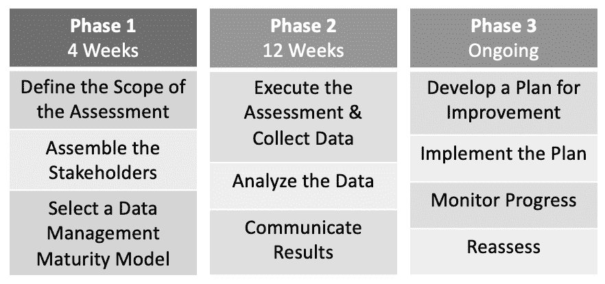
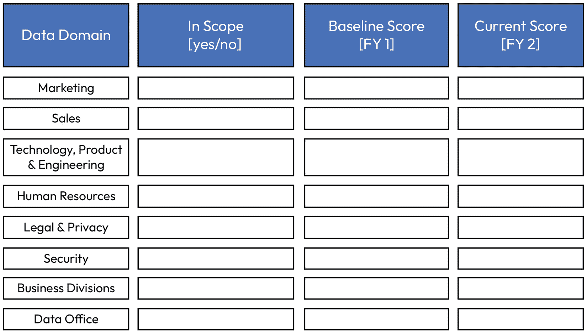

# 第四章：为你的组织设定基准

衡量成功的一个关键要素是衡量你的进展。要有效做到这一点，你需要了解自己的起点。在本章中，你将学习为整个组织和单个项目定义基准的重要性。接下来，你将学习如何捕捉基准以及应与谁沟通。最后，我们将讨论如何在开始工作之前确保对基准达成一致。

有很多方法可以为组织设定基准，以便衡量你的影响力，但最常见的一种方法是使用数据成熟度模型。在我过去十年领导数据转型的过程中，有一件事是肯定的：拥有一个强有力的基准对你和你的利益相关者都非常有益。它为你提供了一个展示机会，能够证明你作为领导者，在任期内所带来的影响，以及你的团队所取得的可量化进展。

我们将讨论如何为每个解决方案或产品逐个提供离散价值的问题。也需要能够在企业层面展示数据管理成熟度的系统演变。我们将讨论为何衡量成熟度很重要、衡量成熟度的不同方法、如何让利益相关者参与、如何定期重新评估以展示进展，以及强有力沟通的重要性。不要低估在这个层面上衡量进展的重要性。它是展示你价值和衡量进展的最佳方式之一。

# 什么是数据管理成熟度模型？

**数据管理成熟度模型**是一种衡量框架，用于评估一个组织在数据管理方面的整体成熟度。换句话说，它衡量公司在数据管理方面做得如何。评估通过类别提供分数，提供公司整体的成熟度水平，并指出需要改进的领域。成熟度评估是主观的。有一系列方法可以最小化主观性，我将在接下来的几页中进行详细介绍。数据管理成熟度模型分为不同的类别，并进一步细分为每个类别的成熟度级别，这有助于最小化但不能完全消除主观性。

一个非常简单（非数据）示例就是衡量某物的灰度程度：

图 4.1 – 灰度程度的视觉示例

在这个例子中，这些颜色都没有错，它们仅仅是从最浅的灰色到最深的灰色，逐步衡量当前的状态。当前的颜色只是告诉我们我们现在的状态。当前颜色与目标颜色之间的差异，类似于数据管理成熟度评估，告诉我们距离最佳状态还有多远。这个等级并不是“错误”的，它只是告诉我们距离最优状态还有多远，也告诉我们自上次评估以来取得了多少进展。

如果这是你第一次进行数据管理成熟度评估，那么你正在开始建立一个基准。这仅仅是公司当前状态的快照。你需要向相关方明确说明这个背景，他们可能需要帮助理解基准意味着什么，不是因为他们不理解成熟度模型，而是因为有些人可能会觉得低分代表低成熟度。你需要确保他们理解这只是一个基准，并且随着你们共同合作，这个分数会逐步提升。

这个基准将让组织了解目前的状况，并可用于与同行业中类似公司的对比。例如，如果你是银行，且你们的平均数据管理成熟度为 2.5，而行业平均水平为 3.5，那么你就知道自己落后于同行。

| **成功提示** |
| --- |
| 不要将成熟度模型与数据战略或方法论混淆。方法论非常有用（例如，DAMA），它们定义了能力的内容、部署程序以及提供数据解决方案的方法。而成熟度模型不是实施计划，它们评估的是你在数据旅程中的当前位置。 |

# 过程概述

在深入细节之前，让我们先预览一下数据管理成熟度过程。这个过程可以分为 10 个简单的步骤：

1.  **定义评估范围**：将包括哪些数据和流程？

1.  **组建利益相关者团队**：这个团队应当包括来自各个层级以及不同部门的代表。

1.  **选择一个数据管理成熟度模型**：有多种不同的模型可供选择，选择一个适合你组织需求的模型。

1.  **执行评估并收集数据**：这些数据可以通过问卷调查、访谈和文件审查来收集。

1.  **分析数据**：利用数据来识别组织数据管理实践中的优势和劣势。

1.  **沟通结果**：将评估结果告知所有相关方。

1.  **制定改进计划**：根据你的发现，制定一个改进组织数据管理实践的计划。

1.  **实施计划**：这可能涉及对政策、程序或技术的更改。

1.  **监控进展**：跟踪你的进展，并根据需要对计划进行调整。

1.  **重新评估你的成熟度**：定期重新评估你组织的数据管理成熟度，确保你在不断取得进展。

图 4.2 – 数据管理成熟度评估的阶段

在本章中，我将详细讲解这十个步骤，并解释如何应对每个步骤中的挑战。我还会分享一些我自己的经验教训，帮助你避免问题，并拥有一次愉快的数据管理成熟度评估体验。

# 为什么你应该为数据管理成熟度设定基准

当你完成*第二章*《建立支持者联盟》和*第三章*《建立高效能团队》时，你还应该启动数据管理成熟度评估（理想情况下，应同时进行）。这个过程将帮助你通过标准化方法，横向了解公司在整个组织中的数据成熟度，进而帮助你发现自己或团队未能发现的盲点，并识别在评估公司需求时可能存在的任何偏见（无论是无意识的还是有意识的）。此外，它还将帮助识别利益相关者是否意识到他们所在领域的成熟度水平，或者是否对此毫不知情。这将通过帮助他们了解公司现状，进一步帮助你建立与利益相关者的关系。

## 确立基准的基础理由

你需要从理解并传达此次评估的目的开始。你的沟通应该围绕一个基本问题展开：我们为什么要进行这项评估？执行数据成熟度评估的核心理由有五个，帮助你顺利起步：

+   **建立理解**：如前所述，完成成熟度评估最常见的原因是衡量公司数据实践的现状。第一次评估将为你提供所需的基准，帮助你全面公正地了解公司的现状。每次后续执行评估时，将衡量进展（稍后会详细介绍）。

+   **为数据战略提供信息**：初步基准的结果将部分为你的数据战略提供参考。通过清点公司在数据成熟度方面的现状，你将更清楚地了解哪些领域需要改进，尤其是在数据治理的整体状态上。请注意，仅仅因为某个领域不成熟，并不意味着你应该将所有资源投入其中。请参见*#8* *实施计划*，了解如何根据这些结果做出决策。

+   **评估信息风险**：评估的一个关键结果是了解当前数据管理/治理状态对组织构成的风险有多大。如果控制措施有限，值得与首席信息安全官（CISO）一起调查数据的保护措施是否到位，特别是在数据治理控制措施不足的情况下。如果数据治理和信息安全都不成熟，你可能会面临一个严重的问题。评估结果以及与 CISO 的讨论将成为你与高层管理层汇报时的关键议题。

+   **优先考虑解决方案**：在你逐步了解组织的数据管理现状时，你会开始看到改进的机会。根据我的经验，通常会有一些机会的“异常点”，即公司数据管理中存在的内在弱点。例如，如果元数据管理较差，很可能需要优先启动元数据管理改进项目。

+   **提升公司对数据价值的理解**：评估的一个最大好处不一定是评估本身，而是评估过程中围绕数据展开的对话。你会发现一些之前可能没有接触过的人，因这项工作开始提出问题。要拥抱这些问题。即使是一个对立的同事，只要以开放的心态和好奇的态度进行交流，也可能带来意想不到的成果。鼓励他们提问，并欢迎在评估过程中任何微小的教育机会。此外，一些人可能未意识到他们现有的工作中已经获得了多少收获。整个过程将帮助更好地理解数据今天是如何被使用的，或者如何未被使用。

对于为什么要启动组织数据成熟度基线评估，要保持自信。这个过程对你来说可能会感觉不自然，可能对你的一些利益相关者也是如此。对某些人来说，这可能像是一次审计或合规性工作。如果你能事先明确*为什么*要做这件事，你将会得到最大的支持和成功。

与利益相关者沟通时，提醒他们这个过程可能会让人感到不舒服，甚至很难讨论公司现状和/或其功能的实际情况。明确评估结果及其对公司的意义。你打算如何处理这些结果？公开分享可能带来的不适感，并鼓励集体利益相关者群体积极接受它。这是推动变革的一块垫脚石。

# 执行数据管理成熟度评估

执行评估可能是一个令人紧张的过程。你很可能会遇到一些支持者，也会遇到一些不太支持的利益相关者。至关重要的是，你要有一个强有力的价值主张，能够解释为什么这对利益相关者个人有利（他们将从这个过程中得到什么），为什么这对他们的团队有利，以及为什么这对公司整体有利。

这可能不言而喻，但沟通是这个过程最重要的部分。你的主要责任是保持公正，分享信息，确保跨企业各级别的理解，并推动评估结果，以便为你的战略提供依据，最终提高公司数据的价值。

## [#1] 确定评估范围

在准备启动评估之前，你需要定义评估的范围。通常，可能会有诱惑想说“全都包括”然后继续。但在定义数据管理成熟度评估的范围时，你有多个选项可供选择。主要有三种选择，你应该根据你的组织情况，考虑哪种选项最合适。这是一项需要投入时间的工作，无论是对你和你的团队，还是对利益相关者而言。

### 全企业范围

大多数公司选择进行全企业范围的评估。这是我的推荐做法，只有极少数例外（我会在后文详细说明）。如果你的目标是评估公司数据管理的现状，你需要评估整个公司，以实现这一目标。这也是确定在设置程序、推动变革和/或为整个组织建立能力时，是否存在需要考虑的优势或弱点的最佳方法。

在采取全企业范围的方法时，你应该利用在*第二章*中定义的数据领域。这将帮助你更好地了解哪些团队更强，或已经成熟到超过其他团队的水平。是否报告此领域模型是一个独立的考虑因素（参见*第六节*，*结果沟通*）。

| **成功的提示** |
| --- |
| 如果你没有评估整个企业，便不应声称结果是“企业评估”。我曾在一家公司看到过这种情况；评估只涵盖了公司的一半，但却声称这是“企业”得分。不幸的是，一旦我们对整个公司进行了基准评估，得分实际上比之前报告的要低得多。那些之前不愿参与的团队数据成熟度较低，因此，当他们被纳入基准评估时，平均得分下降了。 |

### 试点和数据办公室

如果你在获得对这一工作的支持时遇到困难，可以选择单一数据领域来试点这个过程。在与这个数据领域合作时，你将能够与试点数据领域单独合作，并建立更深入的关系。然而，当评估单一小组时，更容易产生偏见。

在评估试点数据领域时，你还应该评估你自己的数据办公室。这可能是一个令人谦卑的经历，因为你可能会发现试点数据领域的成熟度水平比你自己的数据办公室更高（我有过这种经历！）。这不应成为担忧或回避的事情。记住，这只是一个基准，用来为未来的投资提供依据。拥抱这个基准并利用它为自己谋取利益。不要害怕你的团队或试点数据领域的低分。

通常，这些早期的评估会揭示公司数据成熟度的弱点，特别是突出需要投资以推动企业范围采纳的能力（例如，元数据管理、参考数据、数据血缘等）。数据办公室中的低分将突出中央数据团队需要在哪些服务上进行投资，以便在公司内部建立并利用一致的能力。抓住这个机会，展示你们还有多长的路要走。

### 滚动评估

如果你能够获得企业范围评估的支持，但又没有足够的资源同时推动企业评估，可以使用滚动评估。这是一个适合对过程有高度兴趣但资源有限的情况的好选择。在跨公司进行滚动评估时，保持强一致性变得非常重要。随着你逐步评估各个数据领域，你和你的团队将变得更加高效，甚至可能更加有效；然而，你必须特别注意，确保第一个评估的团队和最后一个评估的团队得到相同的体验和等效的评估。

以下图表可以用来展示你的评估范围。在左侧输入数据领域，包括中央数据办公室的一行。在第二列，输入该数据领域是否在评估范围内（仅在不是所有小组都包括时使用此列）。在第三列，输入基准分数。在最后一列，输入当前分数。除非你打算公开分解结果（见第六章 结果沟通），否则你应该将整个图表视为数据办公室内部使用。

图 4.3 – 示例范围模型

## [#2] 确定利益相关者

数据管理成熟度评估的下一步是确定谁负责、谁承担责任、谁需要咨询以及谁需要知情。首先，先识别角色和小组，然后再给角色分配名字。这将帮助你创建一个可持续的方法，便于在公司人员进出时保持一致。

以下是一些额外的建议，用于识别参与数据管理成熟度评估所需的角色：

+   考虑组织内涉及数据管理的不同部门和职能

+   识别那些在数据管理项目成功中有既得利益的人

+   寻找那些对公司数据资产及其如何支持业务决策有深刻理解的人

+   在评估中涉及技术人员和非技术人员的混合。这有助于确保评估全面，并获得所有利益相关者的意见。

### 负责人

负责执行数据管理成熟度评估的角色，从定义方法论、执行到报告，是你的数据治理负责人。这个人通常向首席数据与分析官报告，并负责评估。

### 负责

**首席数据与分析官** (**CDAO**) 对公司的数据管理成熟度评估最终负有责任，因为他们对组织内的数据管理承担总体责任。由于 CDAO 还负责推动组织内的数据驱动决策，因此数据管理成熟度评估是 CDAO 了解组织当前数据管理状况并识别改进领域的关键工具。

评估将帮助 CDAO 完成以下任务：

+   识别数据管理流程和程序中的差距

+   评估数据治理政策和实践的成熟度

+   评估数据资产的质量

+   识别改善数据驱动决策的机会

CDAO 可以利用评估结果制定改善组织内部数据管理的计划。该计划应与公司整体业务战略相一致，并应传达给所有利益相关者。

通过对公司数据管理成熟度评估的负责，CDAO 可以确保数据得到有效管理，并且组织能够从其数据资产中获得最大价值。

除了上述原因外，CDAO 还负责公司的数据管理成熟度评估，因为他们有权对数据管理流程和程序进行修改。这一点很重要，因为评估可能会识别出数据管理需要改进的领域。CDAO 可以利用其权威实施有助于组织达到更高数据成熟度的变化。

最终，CDAO（首席数据分析官）负责公司的数据管理成熟度评估，因为他们是公司数据管理的公开面孔。CDAO 负责向公司其他部门传达数据管理的重要性，并确保数据管理被列为优先事项。数据管理成熟度评估是 CDAO 用来传达数据管理重要性并展示数据为组织带来价值的宝贵工具。

### 被咨询

在数据管理成熟度评估期间，应该咨询以下群体的人员，以便获得广泛的背景信息并进行评分：

+   **数据领域高管**：数据领域高管负责各自数据领域的管理，因此应该咨询他们，了解当前数据管理的状态，并确定改进的领域。

+   **业务数据管理者**：数据管理者负责确保数据的质量和准确性，因此应该咨询他们，听取他们对数据质量和治理过程的意见。

    +   **数据分析师**：数据分析师使用数据做出业务决策，因此应该咨询他们，了解他们对数据可用性和数据驱动决策有效性的看法。

    +   **业务用户**：业务用户是最终需要使用数据的人，因此应该咨询他们，听取他们对可用数据的意见以及他们在使用数据时面临的挑战。

+   **技术数据管理者**：IT 人员负责支持数据管理的基础设施，因此应该咨询他们，了解他们对数据管理系统和流程的意见。

除了这些关键利益相关者外，还需要与其他许多人进行咨询，收集背景信息，并提供数据管理的成功与失败案例，例如：

+   拥有公司数据资产深刻知识的主题专家

+   有数据管理最佳实践经验的人

+   参与过之前数据管理项目的人

通过与多方人员进行咨询，您可以全面了解公司数据管理的成熟度，并找出改进的领域。

### 已知

作为数据管理成熟度评估的一部分，您应该在整个过程中通知多个相关群体。在评估之前，您应该通知您的数据领域高层管理人员和企业数据委员会。您需要他们的支持和认可，以便他们可以与参与者设定期望，并优先处理这项工作。

评估完成后，您需要回去向数据领域高层管理人员和企业数据委员会通报评估结果及后续工作。此外，您还应该向 C-suite 和董事会汇报结果，以便他们理解公司的需求并能协助资助和优先处理数据管理领域后续所需的转型工作。

## [#3] 选择数据管理成熟度模型

在开始之前，您需要选择适合贵组织的数据管理成熟度模型。市面上有多种不同的模型，它们各有优缺点，您可以根据需要选择，或者可以选择创建自己的模型。如果贵公司从未进行过数据管理成熟度评估，我强烈建议您选择一个广泛使用的模型，因为它有助于您为评估标准和整体流程提供支持。如果贵公司在数据管理成熟度方面经验丰富，并且发现定制化模型更符合您的需求，那么（仅在此情况下）您可以创建自己的成熟度模型。

### 常见的行业模型

数据管理成熟度模型是组织用来评估当前数据管理实践并识别改进领域的框架。这些模型通常定义了一组成熟度阶段或层次，每个阶段代表数据管理实践中越来越高的复杂性水平。

一些最常见的数据管理成熟度模型包括以下内容：

+   **数据管理成熟度模型**（**DMMM**）由**数据管理协会**（**DAMA**）提出（已于 2021 年退役）

+   **数据治理成熟度模型**（**DGMM**）由 IBM 数据治理委员会提出

+   **数据管理能力模型**（**DCAM**）由 EDM 委员会提出，EDM 委员会是一个非营利性组织，旨在推广数据管理最佳实践

+   Gartner 数据与分析 IT 评分

+   斯坦福数据治理成熟度模型

+   TDWI 数据管理成熟度模型与评估

此外，大多数咨询公司都有自己独有的模型。使用咨询公司专有模型的风险在于它们是专有的。通常，公司会要求继续投入（即资金）以便长期使用该模型。如果您打算在多年的时间里执行评估，这可能不是您和贵公司最具成本效益的选择。

我使用得最多的模型是来自 DAMA 的 DMMM 模型，但该模型在 2021 年已被废弃。DMMM 被 DCAM 取代。DCAM 比 DMMM 更全面，根据我与其他首席数据官（CDAO）讨论的情况来看，DCAM 似乎是之前使用 DMMM 的公司选择的数据成熟度模型。我的建议是选择一个最符合贵公司需求的模型，并坚持使用它，这样你可以建立一致的成熟度对比。

### 构建你自己的模型

尽管较少见，但一种方法是创建自己的模型或将多个程序的模型进行融合以适应你的需求。在采取这种方法时，确保你有强有力的思维方法至关重要，因为你需要能够解释为什么你的模型是这样设计的，尤其是在某些团队或人员得分较低的情况下。我曾见过某些情况，得分低的团队攻击自创的模型，而不是看评估结果，因此你需要为此做好准备。

下面是如何构建你自己的模型：

1.  **定义模型的范围**：考虑你希望评估数据管理的哪些方面或领域。

1.  **识别每个成熟度级别的阈值**：考虑实现每个级别所需的具体标准。数据管理成熟度模型中的阶段可能有所不同，但常见的阶段包括：

    1.  **临时**：数据以反应性和临时的方式进行管理。没有正式的数据管理策略或计划。

    1.  **基础**：数据以更结构化的方式进行管理，但仍然没有正式的数据管理策略或计划。

    1.  **可重复**：数据管理流程是文档化且可重复的。虽然仍然没有正式的数据管理策略或计划，但已经有改进数据管理能力的承诺。

    1.  **定义**：数据管理流程已明确定义并记录。已经有正式的数据管理策略和计划。

    1.  **管理**：数据管理流程被积极管理和监控。对于提升数据管理能力有着强烈的承诺。

    1.  **优化**：数据管理流程已针对效率和效果进行了优化。数据管理有持续改进的过程。

1.  **开发评估工具**：考虑如何收集这些信息。工具可以是检查表、访谈指南/问卷，或是更复杂的工具。它应收集所需的数据，以生成评估结果。

## [#4] 执行评估并收集数据

现在我们已经了解了什么是数据管理成熟度模型，你已经选择了参与者，并且已经选择（或设计）了你的数据管理成熟度模型，接下来是时候开始执行评估了。让我们开始执行评估吧！

用例 - 操作系统

注意*谁*在执行评估。

在我之前的一家公司，我们进行了一次企业数据管理成熟度评估。当时，公司在每个主要部门都设有分布式数据办公室，并且还有一个中央数据办公室。为了进行评估，每位数据官员（包括分布式和中央的数据官员）都需要进行自我评分。这看起来似乎是一个高效的过程，对吧？

*错误*。

在进行评估之前，我们知道哪些数据办公室成立较久，拥有更多资源和资金，并且更为成熟。但结果却与实际情况不符。为什么会这样？

由于资金分散，一些数据官员利用评估来操控结果。这意味着他们故意将自己的成熟度评分定得较低，以便利用结果为自己的数据项目争取更多的资金，尽管他们比同领域的其他数据办公室更成熟。整体来看，公司的成熟度被低估了，而那些实际更成熟的数据办公室得分却低于那些成熟度较低的办公室。此外，一些数据官员还为自己的项目打高分，以展示影响力和进展。这同样不利，因为这表明数据办公室的成熟度更高，且需要完成的工作较少，以建立可靠、值得信赖的数据资产。

这使得结果无效，管理层感到困惑，最终破坏了数据管理成熟度评估的可信度，同时也影响了各个数据官员的个人信誉。

最终，我们不得不重新进行评估，并雇佣第三方独立进行评估。这使得公司能够得到一个客观的评估，结果也更值得信赖。由于第一次评估的情况，我们不得不进行许多访谈并收集证据来支持评估。我们还通过询问每位数据官员他们从同行那里了解的情况，增加了可信的挑战，以帮助验证结果并揭示访谈中的任何空白。

### 准备启动

在准备启动评估时，我建议您通过几种不同的方式与相关方沟通，确保他们知道应该期待什么。在企业数据委员会和企业数据理事会的会议中，确保提前充分展示这个主题，尤其是在年度评估之前。在企业数据委员会的会议中，我建议准备一份演示文稿，其中包含以下信息：

+   什么是数据管理成熟度模型？

+   为什么评估成熟度很重要？对公司、数据办公室和数据领域有哪些好处？

+   这些信息将如何使用？

+   他们将如何参与其中？

+   他们需要数据团队提供什么？

+   评估的时间线是什么？我们将如何验证结果？

+   我们什么时候报告结果？报告给谁？

+   在 RACI 模型中，每种角色预期的时间投入是多少？

### 沟通预期

在启动之前，您需要设定期望，说明这项工作是什么，为什么需要进行评估，评估结果将如何使用，以及为什么这个过程会对涉及的利益相关者带来益处。您还应该与参与评估的人员沟通他们的期望。参与者需要了解在评估过程中将会发生什么、他们需要为时间投入做好哪些准备、结果将如何处理，以及这个过程对他们（以及公司）的意义。参与者需要知道将会发生什么，并了解他们的责任。有效的沟通将成为评估过程中最重要的部分之一。

以下是您可以发送给利益相关者的电子邮件示例，用于启动评估：

数据管理成熟度评估公告电子邮件样本

收件人：所有业务数据管理者；技术数据管理者

抄送：数据领域高管、企业数据委员会成员、首席数据与分析官，以及参与评估的人员

主题：宣布企业数据管理成熟度评估

尊敬的各位利益相关者，

在接下来的几周内，我们将启动一项全公司的数据管理成熟度评估。我们选择了一个评估模型，以衡量公司在一系列数据管理维度上相对于既定成熟度水平的进展。我们选择了业界领先的评估模型：DCAM。您可以在此阅读更多关于该模型的信息：[`edmcouncil.org/frameworks/dcam/`](https://edmcouncil.org/frameworks/dcam/)。

为了支持这项工作，我们要求您在接下来的八周内提供两小时的时间。第一小时将用于与您及您的团队成员进行访谈，讨论您所在部门当前的数据管理状况。没有正确或错误的答案，我们只是想了解我们目前所处的位置。访谈后可能会要求提供一些支持材料，我们将在第一次会议后以书面形式发送这些材料。

第二次会议将包括根据我们成熟度模型展示第一次会议的结果，并为您提供提问、挑战我们假设、编辑内容的机会，以确保我们在进行全公司聚合时有最合适的得分。

最后，我们将把结果与企业数据委员会、执行团队以及董事会共享。您部门的个人得分不会被分享——只有公司层面的得分会共享。我们将提前将材料分享给您，以便您透明地看到所传达的内容。评估结果将有助于未来的资金安排、优先级设定，并帮助我们确定在哪些方面可以提升全公司的数据能力，以便更好地为您服务。

感谢您提前支持这一重要的年度活动。我们很高兴解答您可能有的任何问题。会议将在接下来的几天内从我们首席数据与分析官的日程中安排。

此致，

数据治理负责人

CDAO 办公室

### 如何启动数据管理成熟度评估

这是一个既可以评估当前状态，又可以教育您接触的利益相关者了解数据管理项目目标和宗旨的好机会。您可以通过这个过程向他们普及核心组件，同时也评估成熟度的状态。特别注意使用的语言。例如，并非每个人都知道什么是技术元数据，但如果您向他们解释这个术语，他们可能会理解，并能更好地表达他们对所在部门元数据管理成熟度状态的理解。

通过将这些评估会议作为双重目的，您或许能更充分地让利益相关者参与讨论，并用它来建立与他们的关系。越多面对面的交流越好。您可以使用研讨会式的形式将相同的群体聚集在一起。我发现这种方式特别有效，因为它给团队提供了一个机会，让他们在通常情况下不会聚集在一起时，能够一起参与。

#### 需要包括的人

如前所述，您的评估应面向最接近数据的人：业务数据管理人员和技术数据管理人员。您可能需要包括来自组织各个部门的多样化人员，特别是如果业务数据管理人员和技术数据管理人员的角色尚未正式化。至少，您应确保每个部门都有代表参与，同时，像信息技术和财务等数据涉及较多的部门应给予更多关注。

#### 不需要包括的人

您可能会遇到一些情况，似乎有些人会突然冒出来参加您的研讨会。可以公开并明确说明谁被选中以及为什么选中。您不希望出现这种情况：公司里的每个数据人员都被包括在内，否则您将难以在分配的时间内完成研讨会。坚持让每个数据领域都有一个业务数据管理人员和一个技术数据管理人员参与评估。如果其他人希望发表意见，可以鼓励他们在研讨会之前与他们所在数据领域的代表沟通。

#### 研讨会与一对一会议

根据您的利益相关者，您可能需要考虑是否最适合安排研讨会还是一对一会议（或两者结合）。理想情况下，您应将研讨会作为默认选择。研讨会能够创造最具包容性的环境，并减少过程中的偏见。然而，某些特定情况下，您可能更希望进行一对一会议。请参见下表，了解两者的具体理由：

| **研讨会** | **一对一会议** |
| --- | --- |
| 应该是默认选项可以帮助其他人听到彼此的想法有助于消除偏见推动一致性 | 最适合对立的个体可以在工作坊之前使用，以帮助获得不太支持个体的支持也可以用于非常支持的个体，帮助他们理解自己在指导积极工作坊中的重要角色 |

### 执行一对一

如果你正在与需要加入流程的人进行一对一工作坊，应该在工作坊之前进行。你可能需要花时间解释为什么这样做，并倾听他们的顾虑。常见的顾虑包括以下几点：

1.  希望看到个人结果而不支持聚合

1.  害怕低分

1.  害怕管理层对其成熟度的看法

1.  没有被纳入其中

1.  没有被提升为数据领域执行官

1.  没有得到公正代表

一定要倾听他们的意见，并尽力安抚他们的紧张情绪，解释原因，并始终保持透明。在这种情况下，事实至关重要。

### 执行工作坊

你的工作坊需要非常出色地执行。你不应在准备工作坊时马虎，也要方便与会者参与。记得再次强调，成熟度模型只是你用来评估公司在使用数据推动业务成果方面做得如何的工具。大多数模型会分解成关注领域或能力，并提供评分方法来确定公司或部门在该领域或能力上的成熟度。

示例议程

欢迎与介绍 *[欢迎与会者并花时间介绍所有参与者]*

对齐目的：我们为什么在这里？ *[解释评估的目的以及与会者可以期待什么* *内容]*

评估是什么

我们为什么要进行评估

留出时间提问

解释这对与会者有何益处

解释这对公司有何益处

目标和成果：我们将一起实现什么？

主题讨论和评估练习

评分

数据办公室的下一步

收集示例文档（避免说“证据”，因为这可能让人觉得像审计，会改变对话的语气）

聚合评分

与会者的后续步骤：解释接下来会发生什么，何时发生，如何继续参与

感谢并结束

#### 附加成果

由于以工作坊的形式进行成熟度评估，你将能够收集到一些附加成果，虽然这些并不是成熟度评估的本意，但将有助于你整体业务案例的发展，并为未来的战略和举措提供信息。一些附加成果包括：

1.  机会的想法

1.  举措的想法

1.  识别常见主题

1.  识别问题区域

1.  社区建设

## [#5] 分析数据

现在您已经完成了研讨会，过程的下一步是分析数据并准备传达结果。作为此步骤的一部分，您需要分析定量和定性数据。在这次练习中，两者都非常有价值。

### 数字 – 定量数据

可以说，分析数据中最简单的部分是孤立地查看分数本身。在研讨会期间收集了分数后，您需要将这些分数添加到一个共同的模板中，并进行简单平均以测量公司的聚合数据管理成熟度评分。平均分数将用于向企业数据委员会、高管团队（C 级）、董事会汇报您的结果。业务数据管理者和技术数据管理者也应在执行沟通计划之前收到这些信息。

### 上下文 – 定性数据

这种分析更具主观性，需要谨慎处理，以确保分析中不会出现偏见。在评估时，请记住以下几点：

+   **客观处理**：在分析过程中避免做任何假设或过早下结论。想象向利益相关者为这些结果辩护。您的结论是否站得住脚？利用这一思维过程有助于诚信地挑战您或您的团队的评估。

+   **保持现实**：不要指望一夜之间就完全理解定性数据的评估。这将是一个迭代的过程，需要与参与者反复交流，以确保正确捕捉到他们的见解。在您的时间表中预期这一点。

+   **强调协作**：您需要在分析的这一部分中涉及利益相关者。确保您的定性数据得到公平代表，并且在传达过程中不会有任何人感到意外。尝试使用如“我想我听到你说 ____，你能确认一下吗？”等短语有助于在结果中建立信任。

+   **迭代处理**：当您致力于整合发现并报告结果时，您应该期待再次回顾结果，因为您计划改进倡议。在现在和明年进行评估时，预计反复进行。保持文档易于访问供参考。

要分析评估结果中的数据，请按以下步骤顺序进行：

1.  **确认主要发现**：首先列出您在评估过程中听到的所有主要发现。

1.  **归类发现为主题**：您是否看到与客户标识数据质量低有关的问题模式跨组出现？工具缺失？将这些类型的发现归类为共同的桶/主题，以确定您在数据领域中的一致性所在。

1.  **与成熟度模型对比发现**：将这些定性发现与模型进行比较。将它们对齐到每个专题领域，以便您能够看到哪些特定领域需要改进可能会影响您的分数。

1.  **跨数据领域对比发现**：现在评估这些相同的主题在各个数据领域中的表现。某些领域的得分是否较低？这些定性结果在改进讨论中很有帮助。可能某个领域没有获得任何投资，或者他们可能没有意识到可以使用的中心能力。这些定性数据点非常适合用于总结讨论和持续的成熟度规划。

1.  **寻找根本原因**：是否有一个共同的原因导致定性结果如此？因果关系在报告结果时可能很有帮助。高层管理人员可能想知道为什么结果是这样的。如果可能的话，这是一个值得集中精力的领域。

1.  **优先排序发现**：并非每个发现或评论都是同等重要的。重点关注那些对公司实现更广泛战略最具影响力的发现，以最大化影响并确保成果的一致性。

1.  **制定你的改进计划**：你应该收集至少一个前五名的清单，列出你认为公司在评估后需要着重关注的事项。

# 对齐和达成一致

以下步骤讲述了数据管理成熟度评估中的对齐和达成一致部分。评估本身的执行有时是一个挑战，但最难的是达成对齐。确保获得利益相关者的支持至关重要，以确保他们愿意接受结果，支持实施计划，并与您共同制定数据战略。

## [#6] 传达结果

一旦你得到了数据成熟度评估的结果，你需要决定如何传达这些结果。你有多种选择，而且每种执行方式都有优缺点。你可以作为 CDAO 自行决定如何传达这些结果，或者你可以让企业数据委员会共同做出这个决定。无论哪种方式，都可以为你带来同样的好处（我在不同的公司/行业中见过这两种方式都取得了很好的效果）。

## 传达分解结果

你的第一个选择是通过部门来传达结果。通过部门传达结果意味着将市场部门的市场得分、销售部门的销售得分、工程部门的工程得分等分别给出。你的利益相关者很可能会为他们自己的结果辩护，因为他们觉得自己的得分比与公司其他部分合并后的得分更具关联性。然而，这不是我推荐的方法。根据我在多家公司中的经验，这种分解的报告方式通常会导致数据社区、数据资金和能力的分离。这会导致能力的重复、结果的脱节以及成本的增加。只有在非常有限的几个原因下，我才会推荐分解结果：

+   **没有中央团队**：当你没有一个完整的团队来帮助公司单独引导各项工作，并且你需要暂时让团队推进工作的同时，你也可以选择这种方法，直到你组建了团队并聘请了领导者。

+   **没有数据战略**：当公司在数据战略的制定上处于初期阶段时，报告拆分的结果可以显示出公司内部结果的差异性。然而，需要谨慎使用这一方法。有时这会适得其反，可能导致一些个别小组（尤其是那些成熟/强大的小组）主张公司应当合作推动企业级的努力。

### 优势

拆分结果的优势如下：

+   **利益相关者的偏好**：利益相关者很可能希望看到他们自己的分数，以便他们能够对结果感到拥有感，并独立于他人采取行动。

+   **问责制**：利益相关者会感到更多的责任感，因此他们可能会接受结果。

+   **行动偏向**：团队可能决定立刻采取行动，因为他们清楚了解团队的弱点，以及如何推动问题向前发展。

### 缺点

拆分结果的缺点如下：

+   **利益相关者的不信任**：如果没有看到详细数据，利益相关者可能不会相信结果，尤其是当结果与他们的预期不符时。

+   **操控系统**：当拆分结果被共享时，个别团队可能会被激励夸大他们的成熟度，尤其是在他们想展示自己的成熟度时，或者在寻求资金时低估自己的成熟度。

+   **缺乏协作**：当团队可以看到各自的独立分数时，他们没有动力合作提升分数。此时他们更倾向于改善自己的领域，而不是跨部门合作。这可能导致各团队投资于自身能力，而不是共同投资于公司范围内的能力，而后者通常更加具备成本效益和效率。

## 沟通汇总结果

你的第二个选择是传达公司汇总分数。仅在公司层面进行沟通意味着各个部门将*不会*收到独立的分数，只有汇总的公司分数会被披露。请注意：有些团队可能同意这种做法并认同其理由，但最终他们可能会尝试在未公开记录的情况下披露他们的分数。该方法只有在你坚持使用汇总分数而不披露各个团队的分数时才能奏效。你可以并且应该披露各个团队在异常情况下需要改进的地方（例如，特定的弱项）；然而，公司分数就是公司整体的分数。

### 优势

+   **公司视角**：仅提供汇总结果能够促使组织接受这一分数，认为它反映了公司在数据管理方面的表现，从而能够促使公司统一行动。

+   **合作伙伴关系**：汇总的结果可以推动各部门协作，提高标准，而不是各自为战。

+   **学习**：团队被激励相互分享和学习，以便在公司内推广最佳实践。

### 缺点

+   **个人团队责任**：团队可能会觉得自己无需采取行动，且可以依赖更大的组织来提升分数。

+   **现有能力可能会退化**：如果过度依赖中央团队，并且没有仔细传达现有能力的重要性，去中心化的团队可能不会继续保持其现有能力，这可能导致短期内数据管理成熟度的下降。

## 程序基准

类似于企业数据管理成熟度评估，你可以为特定的程序进行独立的成熟度评估。这对于那些尚未准备好进行整体公司评估的公司，或者在他们希望评估数据投资在大型转型项目中的提升效果时，是一个很好的起点。

你将执行相同的步骤，只不过是针对程序范围，而非整个数据领域结构。你可能希望通过基准数据质量来补充此评估，以便在程序实施前测量数据的可信度，并在部署结束时再次进行评估，展示针对特定系统、数据集或流程的改善效果。

## [#7] 制定计划

在最终确定沟通计划时，你应该同时开始与内部的数据办公室团队合作，并与利益相关者一起制定改进计划。这个计划应专注于你所识别的高优先级发现，并附上负责人、时间表和资金需求。

在制定这个计划时，要带着你的利益相关者一起前进。这是一个非常适合数据实践社区或数据管理工作组共同开发的主题。我建议优先考虑在评估过程中出现的、能为整个数据社区带来益处的共同主题，以及任何显著影响客户、违反法律或合同义务，或具有重大伦理影响的问题。在与公司法务团队和首席隐私官合作时，解决任何法律或合同义务问题。

除了主要问题外，专注于建设能够支持组织内部大多数人的能力是一个很好的起点。例如，如果你对数据来源和去向的可见性或数据质量存在若干问题，你可能希望从部署元数据管理计划和数据质量计划开始。当你阅读本书的*第二部分*时，我们将详细探讨这些能力的具体内容。

在你制定计划时，考虑哪些能力将产生最大的影响，并关注它们为何会产生这种影响。例如，如果你的利益相关者提到了低质量和低可信度的数据问题，定义出良好质量数据能够让他们做些什么。为什么高质量、可信的数据很重要？这个问题看似很明显，但试着更具体地思考。当利益相关者拥有了这种高质量数据后，他们能做些什么是今天无法做到的？它会影响收入吗？如何影响？你能衡量它吗？怎么衡量？这些答案将帮助你明确需要交付的内容以及如何为高层管理层的认同传达信息。

一旦你确定了要做什么、由谁推动、何时交付以及如何衡量成功，就将这些内容整合进项目计划中。这个计划可以并且应该成为你与企业数据委员会、C-suite 以及潜在董事会（取决于他们对你的数据项目的关注程度）沟通的一部分。你将在*第 8 步*、*第 9 步*和*第 10 步*中使用该计划。

## [#8] 执行计划

假设你已经成功获得了*第 7 步*中制定的计划的认同和资金支持，那么你将执行这个计划。通过利用你的数据管理员工作组和企业数据委员会，带领你的利益相关者一起参与这个过程，报告逐步进展、交付过程中的结果（即，快速获胜）、问题、风险以及你在衡量结果方面的进展。

在执行过程中，不要害羞于宣称成果。如果你看到了业务影响，不要仅仅标记里程碑为完成并继续前进；要求业务用户（不是你的数据管理员，而是最终用户）分享一个他们如何在日常业务中体验到你部署结果的故事。你的数据管理部署是否导致了客户流失率降低？衡量并报告它！

## [#9] 监控进展

在执行你在*第 8 步*中制定的计划时，你应当设置衡量进展的指标。例如，如果你和你的团队要交付的解决方案之一是将 500 个数据资产编入企业数据目录，那么你应该创建一个计分卡，在整个项目过程中跟踪该指标。在执行过程中，将编入目录的资产数量除以 500，得到的百分比可以用来报告给利益相关者和高管团队。

报告和监控进展也是确保每个人都对项目开始时所定义的成功保持一致的好方法。范围蔓延是数据项目中的一个真实风险，因为数据无处不在。同时，数据如何“感知”给利益相关者也是一个风险，因此，衡量和监控数据举措是将改进基于事实而非情感的一个重要方式。

监控进展的结果还可以帮助建立团队交付的信心，这对未来的资金支持也有帮助，甚至可以在最终交付之前就争取到资金。你可以展示到目前为止的投资是按照约定推动进展，并通过这个故事为下一个计划争取更多的资金。

定期以透明的方式报告。你应将衡量结果融入所有与数据相关的项目和计划中，以展示在公司数据成熟度上的投资所带来的影响。当你重新评估你的成熟度（见步骤 #10）时，你可以将这些计划投资的影响与数据管理成熟度分数随时间的提升进行关联。双赢！

## [#10] 重新评估你的成熟度

### 重新评估的频率

你应该制定重新评估的计划。我发现最有用的方法是决定一个评估模式并始终坚持下去。这能为结果提供更多的可信度和一致性，从而在企业范围内获得更好的认同。

我是每年进行一次评估的忠实支持者，作为默认时间表。当然，也可能有一些特殊情况需要调整评估频率：

+   **新收购**：如果你的公司正在收购新组织，你可能希望要求在交易完成后的 90 天内进行简化版的评估，然后将收购逐步纳入标准流程中。这将突显出需要快速关注的弱点，帮助收购方调整到组织的运营模式。

+   **剥离**：如果你的公司正在进行剥离，你可能需要作为尽职调查的一部分执行特别目的评估。

+   **重大变化**：如果某个部门在数据方面做出了重大投资，完成了一个重要项目，或经历了重大重组，它可能希望进行特别目的评估，以显示这种提升作为成功的衡量标准。

# 衡量成功

在回顾数据管理成熟度评估时，你应当考虑如何衡量评估的成功。一些需要考虑的因素包括：

+   所有相关方都参与了吗？

+   你达成了对结果的认同吗？

+   你收到了来自执行团队多少个问题？

+   董事会对你的进展感兴趣吗？

+   评分随着时间的推移有所改善吗？改善了多少？

你也可以考虑每年进行评估所花费的时间，来判断你的团队是否在提高评估效率，或相关方在过程中的参与度是否更高（在设定持续时间指标时要小心考虑这两点）。

评估结束时，重要的是你们公司如何使用这些信息。如果评估完成后只是被放在象征性的架子上，直到下一次再用，那么它很可能只是一次纸面工作，而没有真正的价值。考虑将你的价值建立在评估如何促进额外投资、引发数据讨论，以及你的数据社区如何相互互动的基础上。这是一个很好的过程，能推动对话，建立社区，并提高对可信数据如何提升公司价值的认知。

# 结论

在进行基准测试时，确保你做得好非常重要。你的可信度将部分取决于你的基准测试过程有多透明。确保你提前沟通好方法论、分享结果的计划以及受众，这将帮助你的利益相关者认同这一过程。对于你团队的成熟度，也要坦诚相待。通过务实的态度来处理这一过程，你能够建立起信誉，帮助你为公司设计出需要主导的项目。进行这一基准测试是一个很好的起点，它能为你在象征性的高层会议桌上争取到一个值得信赖的、重要的位置。花时间做得好并彻底。
