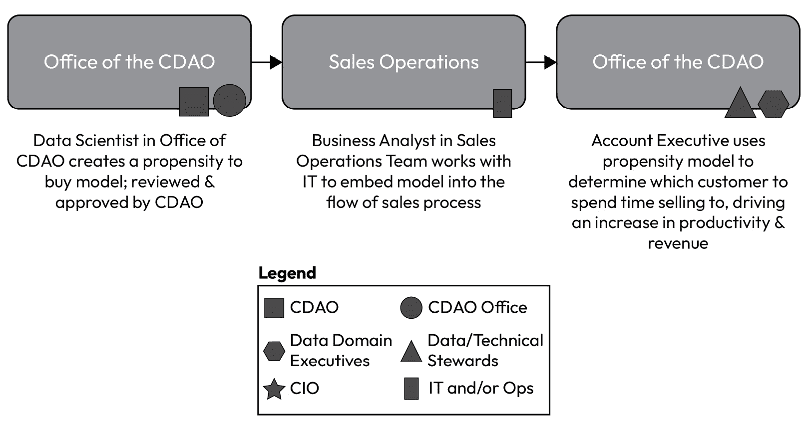

# 第五章：定义成功与对齐成果

数据管理的范围远大于管理一个成熟度框架。管理框架仅关注提升分数的策略。它可能不会促进使用数据、信任数据以及整体数据管理的提升。我们需要以全新的视角重新审视数据管理。我们需要建立能够扩展的基础能力，而不是在数据量每隔几年翻倍时就增加团队的规模。我挑战你超越成熟度框架（尽管它很重要），进入你利益相关者的思维。

想象一下：你已经成立了一个数据与分析团队。你的团队充满热情，专注于工作，你甚至已经制定了一个出色的战略、易于理解的政策，并设定了具体的里程碑来交付卓越的成果。你按照这个计划执行，并且交付成果超出了预期。

只有一个问题。

*没有人相信团队在* *创造价值*。

这怎么可能呢？你花时间听取了利益相关者的需求；你制定了围绕这些需求展开的计划。你建立了一个强大的项目并拥有良好的沟通渠道，但来自利益相关者的反馈是：这对我并没有什么帮助。

*出了什么问题？*

这种常见的问题在数据转型和数据能力建设中经常发生，尤其是在预期商业成果的清晰对齐没有得到业务用户在工作开始前的确认和签署时。不幸的是，这种情形经常发生，而唯一的解决办法是在规划阶段定义成功并与结果对齐。

本章将重点讨论许多数据转型失败的领域：与业务相关的成果对齐。大多数数据转型停留在数据成果上，未能转化为最后一公里：即业务如何利用交付的数据能力来推动运营效率、增加收入和获得更好的洞察。在本章中，你将学习为什么超越数据并与业务对齐的成功定义如此重要，如何成功地映射所有相关利益相关者（包括次级和三级利益相关者），以及如何将结果转化为业务术语。

本章涵盖以下主题：

+   能力与成果

+   商业成果*和*数据能力

+   什么是成功？

+   对齐成果

+   实现商业价值的障碍

+   将价值衡量标准纳入利益相关者图谱

# 能力与成果

在我们定义成功之前，我们需要从一些关键定义开始。首先，我们需要定义什么是能力和结果，然后将其区分为商业和数据的不同层面：

+   **能力**：做某事并达到预期成果的能力或容量。

+   **成果**：事件或情况的最终结果或后果。这可以是正面的，也可以是负面的结果。

请记住，能力会带来结果。对于每个能力，应该明确一个或多个结果。在开始交付能力之前，你应该花时间定义预期的结果。如果你还没有定义，也永远不晚，随时可以为每个能力定义预期的结果。你可能会有预期的结果和意外的结果。例如，我今天锻炼了，预期明天会感到肌肉酸痛。没想到的是，疼痛到走路都很困难。

现在，让我们更清晰地划分业务能力与结果以及数据能力与结果之间的区别：

+   **业务能力**：定义业务的核心“做什么”。这与“如何”做或者“在哪里”做是分开的。它包含一套技能、资源和流程，使公司能够实现某个目标。

+   **业务结果**：定义能力的结果。这包括深入理解交付能力的结果。

+   **数据能力**：定义组织汇聚的技能、流程、技术和资源，利用这些数据来实现特定目标。

+   **数据结果**：定义数据能力的结果。这指的是通过交付数据能力所实现的结果或后果（正面或负面）。

因为我们最关心的是数据能力，在进入数据结果的讨论之前，让我们深入探讨数据能力的关键组成部分。

## 能力

特定的数据能力将在本书的*第二部分*中详细描述，在本章之后；然而，让我们先来明确强大能力的组成部分：

1.  **技能和知识**：这包括数据专业人员的专业知识，如数据分析师、数据科学家和数据工程师。它还涵盖了组织内一般用户的数据素养，这些用户需要有效地理解和利用数据。

1.  **流程和方法论**：这包括用于数据治理、数据质量管理、数据收集、数据分析和数据安全的既定程序。标准化的流程确保了在数据生命周期内处理数据的一致性、效率和可靠性。

1.  **技术与工具**：这包括管理和分析数据所需的硬件、软件和基础设施。它可以包括数据仓库、数据湖、数据可视化工具、分析平台，以及各种特定于数据管理和分析的软件应用。

1.  **资源**：这包括为数据项目分配的财务资源、基础设施维护以及专门从事数据管理和分析的人员。有效的数据能力需要充足的资源来支持必要的流程、技术和人员。

1.  **文化方面**：这指的是一种重视数据、鼓励数据驱动决策，并促进不同部门在有效利用数据方面合作的组织文化。数据驱动的文化对于最大化组织内数据能力的采用和利用至关重要。

这些组成部分共同构成了强大的数据能力。每个部分都是独立必需的，必须在整体上强大才能提供高质量、可信赖的数据能力。如果缺少其中任何一个组成部分，公司将难以成功*或*在结果上达成一致。总的来说，完善的数据能力使组织能够做到以下几点：

+   **从数据中获得更深刻的洞察**：通过有效分析和解读数据，组织可以发现隐藏的模式、趋势和改进机会

+   **做出数据驱动的决策**：利用可靠且富有洞察力的数据可以让组织基于证据做出明智的决策，从而提高效率、效果和竞争优势

+   **优化运营和流程**：数据驱动的洞察可以帮助识别改进领域、简化流程和优化资源分配，从而提升绩效

+   **提升客户体验**：分析客户数据可以帮助了解客户行为、偏好和需求，从而改善产品开发、营销策略和整体客户体验

开发强大的数据能力绝非易事，需要随着技术和业务需求的变化不断改进和适应。然而，通过投资必要的技能、流程、技术和资源，并培养以数据为驱动的文化，组织可以释放数据的巨大潜力，并在当今数据驱动的世界中获得竞争优势。

## 结果

正如我们已经阐明的，构建强大能力所需的内容之后，接下来的任务是明确结果。如我之前所说，结果是公司因能力而体验到的效果。它回答了我最喜欢的一个问题：*那又怎样？*

我的团队非常了解这个问题，因为它是我最常用的问题之一，帮助我们明确真正的结果是什么，以及它对公司的意义。例如，假设你正在处理以下情况：

+   **目标**：保持健康

+   **能力**：跑步

+   **结果**：在 30 分钟内完成 5 公里

大多数目标失败是因为我们没有明确所需的能力以及期望的结果。如果我们将这种框架应用于数据能力，它可能看起来像这样：

+   **目标**：确保公司清楚知道它拥有的数据、数据存储的位置、如何进行分类以及谁对其负责

+   **能力**：近实时元数据（业务和技术）、AI 驱动的分类和数据管理，以及数据目录

+   **成果**：可搜索的数据环境，以便支持客户合同义务，并能够在您的生态系统中识别其数据，在 24 小时内提供**联系人**（**POCs**）

请注意，在这两个示例中，有多种能力可以支持目标，但当您考虑所需的成果时，能力的选择会变得更少，您可以更专注于实现成功所需的内容。在接下来的部分中，我将进一步探讨如何将商业成果与数据能力结合，以便在您的商业利益相关者和数据团队之间实现更强大的对齐。

# 商业成果和数据能力

传统的数据能力由 IT 部门管理，这也是它们历史上不太成功的原因之一。IT 成功的衡量标准通常是以项目为基础的度量，例如是否达成里程碑，或是预算/时间度量，节省了多少资金或时间。这一早期的数据能力管理方式不可避免地导致了难以衡量和量化的成果，这也是从 IT 成果向以商业成果为重点的成功衡量演变的基础。

| **有用提示** |
| --- |
| 如果您继续以传统的、遗留的 IT（基于项目的）方式或仅依靠预算/时间来衡量数据能力，您可能会发现自己在业务利益相关者和激励机制之间创造了利益冲突。通常，您的利益相关者需要拥有可能无法提高速度或预算的商业成果，但实际上，他们可能会利用增加的预算来推动其他更有意义的事情（例如，收入、客户成功评分或潜在客户识别）。 |

## 您需要两者

您需要根据商业成果和数据成果建立您的成果框架。首先，您需要与业务方对齐，明确他们所期望的成功是什么，并用他们的术语表达，然后（只有在此之后）您应当将您的数据成果与他们的商业成果对齐，并展示您的交付如何与他们的成果需求相匹配。

如果我们将前面的例子整理成一个简单的框架，可能会是这样的：

| **第一层级示例** |
| --- |
| *目标*：确保公司知道其拥有哪些数据，数据存储在哪里，如何分类，以及谁对其负责。 |
| **商业成果** | **所需的数据能力/能力** |
| 可搜索的数据环境，以便在 24 小时服务水平协议（SLA）内，使客户能够识别其在您生态系统中的数据 |

+   接近实时的元数据（业务和技术）

+   基于 AI 的数据分类

+   数据管理

+   数据目录

|

表格 5.1 – 第一层级商业成果示例

您可能会注意到，将商业成果与将要交付以支持它的数据能力并排放置，可以帮助读者理解为了实现商业成果需要哪些数据能力。

接下来，您应该解释这些能力如何支持商业成果：

| **第二层级示例** |
| --- |
| *目标*：确保公司知道它拥有的数据，数据存储的位置，如何分类，以及谁对其负责。 |
| **业务结果** | **所需数据能力** |
| 可搜索的数据环境，确保客户合同义务能在 24 小时 SLA 内识别其在你生态系统中的数据 |

+   客户信息系统的近实时元数据（业务和技术）(例如，这可能意味着 5 到 6 个系统，而不是整个公司)

+   基于 AI 的数据分类用于客户信息系统

+   数据治理——客户成功数据领域的高管、业务数据管理员和技术数据管理员

+   适用系统的数据目录

|

表 5.2 – 第二级业务结果示例

如果你向公司提出第一级的例子并请求资金支持，可能很难就成功达成一致。为什么？因为这表明你需要为整个公司获取元数据，分类公司中的所有数据，确定所有数据管理员，且完成一个完整的数据目录，才能算成功。

然而，如果你回到业务结果，那个比目标更具体的概念，你会有一个更具体的数据能力来达成那个结果。这远比目标更理想、更专注，且**成功**的概率更高，这也是我们下一节讨论的主题。

# 什么是成功？

现在你已经明确了成功的定义（提醒：它是聚焦于业务结果的），你可以与业务利益相关者一起定义成功。在之前的例子中，我们与业务利益相关者就一个单一的结果达成了一致，这个结果是通过实施四个关键的数据能力来实现的。在我们的例子中，这些能力集中在客户数据领域。

为了取得成功，你必须确保有足够狭窄的聚焦，以便你能够定义一个简单且明确的**完成定义**。完成定义最好描述成功时，它是具体且可衡量的（你可以使用常见的 SMARTER 框架来帮助你）。理想情况下，你应当针对这些数据能力中的每一项，定义交付有价值能力所需要的条件。

## 什么是价值的定义？

价值由股东定义；因此，在没有他们确认你所提供的业务价值之前，你的理解是无关紧要的。你可以并且应该衡量并提供你认为自己为利益相关者创造的价值；然而，直到你们双方达成一致并共同支持结果之前，这个价值不应被视为最终的。最糟糕的情况是，当你为业务交付了解决方案，并且你认为它增加了价值，但他们却不这么认为。那样会立即破坏你的信誉。

让我们继续以之前的例子为基础。如何根据业务同意的价值来定义成功？

## 定义成功

从业务成果开始，首先定义一组核心指标，以衡量业务价值，使用他们能理解的术语：

1.  对整体业务成果达成一致。

1.  定义并映射实现业务成果所需的数据能力。

1.  定义每个数据能力需要完成的任务，以部分和整体的方式交付价值（例如，子里程碑）。

1.  对如何衡量价值达成一致。

1.  提供能力。

1.  迭代报告进展。

1.  根据数据结果来衡量数据能力的成功。

1.  根据业务成果衡量数据能力的成功。

这八个步骤可以用来构建一个强有力的交付路线图。让我们利用之前的示例，将这八个步骤分解为一个可操作的计划。

# 与成果对齐

现在让我们将这八个步骤分解为一个可操作的计划，利用之前的示例。这八个步骤将具体详细地解释如何与业务相关方对齐。当你对这个过程越来越有信心时，你会发现完成这个过程所需的时间会更少。然而，第一次做这个时，你可能会觉得需要一些时间来规划。这个过程最好和团队中的某个成员或一个小团队一起进行，确保你能捕捉到所有可能的成果，并在与相关方分享之前，将它们精炼成清晰的成果进行输入和讨论。如果相关方愿意和你更紧密地合作，这也是一个非常好的合作过程。

## 第一步 – 与业务成果对齐

首先确保你和业务相关方（称为业务赞助人）在他们所需的业务成果上达成一致，以支持他们的业务战略。你们可以共同编写这个成果，或者你可以基于你在数据角色初期进行的聆听环节中得到的信息来编写这个成果。

为了本节的目的，我将通过一系列表格展示这八步方法的组成部分，便于参考。如果这种格式适合你自己的公司，你也可以使用相同的格式。

| **业务成果** |
| --- |
| 可搜索的数据环境，能够使客户根据合同义务，在 24 小时服务级别协议内识别他们在你生态系统中的数据。 |

表 5.3 – 示例业务成果

## 第二步 – 定义数据能力

接下来，您将定义并推荐您和/或您的团队将交付的数据能力，以支持业务结果。这是一个很好的机会，您可以向您的利益相关者解释这些能力是什么，以及为什么它们是支持其结果的正确数据能力。如果您犯了一个常见的错误，即仅向利益相关者提供数据能力清单，而没有解释为什么它们是正确的能力，这将是您交付过程中的第一个风险。如果利益相关者没有完全理解和理解这些能力为什么是支持他们需求的正确能力，那么疑虑就会悄悄地产生。这个疑虑可能在后续步骤中才表现出来，但正是在这个步骤，您开始失去他们的信任以及您的信誉。不要跳过这个步骤，它对您的成功和与业务利益相关者建立信任至关重要。

| **数据** **所需能力** |
| --- |

|

+   客户信息系统的近实时元数据（业务和技术）（例如，这可能意味着 5-6 个系统，而不是整个公司）

+   基于 AI 的数据分类用于客户信息系统

+   数据管理 – 客户成功数据领域负责人、业务数据管理员和技术数据管理员

+   范围内系统的数据目录

|

表 5.4 - 示例数据能力要求

## 第 3 步 – 定义数据能力交付成果

对于每个定义的数据能力，您需要定义需要交付的内容。通常，您将为每个数据能力提供 1:M（一对多）的交付成果。这些交付成果可以迭代交付（如我们在*步骤 5*中看到的那样），并且在可能的情况下，应该如此，以便您能够展示进展。以下示例展示了如何识别能力交付成果：

| **数据** **所需能力** | **交付成果** |
| --- | --- |
| 客户信息系统的近实时元数据（业务和技术） |

+   确定并选择元数据工具供应商

+   实施元数据工具

+   确定包含客户信息的每个范围内的系统

+   为元数据工具构建连接器

+   将元数据工具连接到每个已识别的范围内系统

+   验证范围内系统的元数据完整性

+   为元数据工具构建持续的运营和可观察性，以确保元数据的持续有效性和可信度

|

| 基于 AI 的数据分类用于客户信息系统 |
| --- |

+   启用元数据工具中的数据分类功能

+   验证分类功能的适当性以确保准确性

+   实施数据管理员定期重新认证数据分类

|

| 数据管理 – 客户成功数据领域负责人、业务数据管理员和技术数据管理员 |
| --- |

+   确定客户成功数据领域的负责人并获得批准

+   确定所有在范围内的业务数据管理员并获得批准

+   确定所有在范围内的技术数据管理员并获得批准

+   上岗并培训数据领域的执行官、业务数据管理者和技术数据管理者在其角色和责任中

+   使数据领域执行者和业务/技术数据管理者能够

|

| 所涵盖系统的数据目录 |
| --- |

+   培训数据管理者了解数据目录要求。

+   根据数据治理政策为所涵盖系统实施数据目录要求的必要步骤，使数据管理者能够执行

|

表 5.5 – 交付映射的示例数据能力

## 步骤 4 – 对价值测量的对齐

一旦您定义了交付每个能力的步骤，基于具体的可交付成果，您的下一步是对交付的价值测量进行对齐。这是另一个需要与业务利益相关者密切合作的步骤。既然您已经定义了达到目标的计划（包括需要交付的内容以及每个能力），现在是时候对此方法进行确认，回答他们可能有的任何问题，并确认一旦这些能力交付，他们将能够实现整体业务目标。

在我们的先前示例中，整体业务目标是满足客户的合同义务，本质上是确保其数据得到良好的识别和治理。

假设您的公司有 500 位客户。确保您符合所有 500 位客户的合同义务对于每位客户的合同至关重要，考虑到协议语言的一致性。您可以使用这 500 位客户来计算合同违约的影响（例如，假设合同对每次违约处以$10,000 的罚款）。您可以使用 500 位客户 * 每次违约$10,000 来确定影响价值为$5,000,000。这是您正在努力减少的风险价值。

| **所需数据能力** | **可交付成果** | **价值** |
| --- | --- | --- |
| 客户信息系统的准实时元数据（业务和技术） |

+   确定并选择元数据工具供应商

+   实施元数据工具

+   确定包含客户信息的每个所涵盖系统

+   为元数据工具构建连接器

+   将元数据工具连接到每个已确定的所涵盖系统

+   验证所涵盖系统的元数据完整性

+   建立元数据工具的持续运营和可观察性，以确保元数据的持续有效性和可信度

| 在公司复杂的生态系统中查看、理解和报告所有客户数据的单一位置可以轻松提取每位客户的所有客户数据视图，以简洁易懂的方式展示对其信息的控制，每年节省约 3,000 小时的额外审计要求*注：价值不在于实施工具本身；而在于工具使公司能够做到什么。 |
| --- |

表 5.6 – 交付到价值映射的示例数据能力

## 步骤 5 – 迭代交付

这是一个描述起来相当简单的步骤，但实际操作起来要简单得多。此步骤涉及按你在*步骤 3*中定义的计划进行交付：

图 5.1 – 示例路线图幻灯片

## 步骤 6 – 持续报告进展

当你完成*步骤 5*中的项目交付时，应定期向相关方报告进展。我建议至少每月报告一次，最好每两周报告一次。这能确保你的团队持续保持动力，定期取得实质性进展，同时确保相关方继续全力支持你为他们交付的工作。记住，这可能不是他们唯一的优先事项（大概率如此），你需要在整个交付过程中保持他们的关注和注意力。

因为你已经就价值衡量达成一致，所以你能够清楚地阐述在交付过程中他们可以做什么，而不仅仅是在交付过程结束时。你可以创建类似以下的报告：

图 5.2 – 示例状态报告

## 步骤 7 – 衡量数据结果的成功

在你的团队完成实施交付后（理想情况下，在交付每个功能的同时），你应首先从数据结果的角度衡量交付的成功。这对于你的团队非常有帮助，并且能够确保最重要的是你已经达到了基本数据交付的期望。在将自己和团队的焦点聚焦于数据结果后，你应立即转向衡量业务结果的成功，并共同报告这两个衡量标准（*步骤 7* 和 *步骤 8* 一起）。

最后，如果你发现数据结果*或*业务结果偏离了预期结果，要对这种偏差保持透明，尽力找出偏差的根本原因，并努力确定其影响。

| **数据** **所需能力** | **交付成果** | **数据里程碑** | **数据结果** |
| --- | --- | --- | --- |
| 客户信息系统的近实时元数据（业务和技术） | 确定并选择元数据工具供应商 | 已选择工具供应商 [1/1] | 业务和技术元数据功能可供使用 |
| 实施元数据工具 | 工具投入使用（已实施） [1/1] |
| 确定每个包含客户信息的范围内系统 | 范围内系统已识别 [6/6] | 客户平台的系统清单已完成 |
| 为元数据工具构建连接器 | 范围内系统与元数据工具的连接已建立 [6/6] | 启用了近实时业务和技术元数据，用于客户数据平台的系统 |
| 将元数据工具连接到每个已识别的范围内系统 | 范围内系统与元数据工具的连接已实现 [6/6] |
| 验证范围内系统的元数据完整性 | 元数据完整性验证已完成 [1 of 1] | 客户元数据已验证 |
| 构建持续运营和元数据工具的可观测性，以确保元数据的持续有效性和可信度 | 已部署数据可观测性 [1 of 1] | 启用了数据可观测性功能 |

表 5.7 – 示例数据能力与结果的映射

## 第 8 步 – 衡量业务结果的成功

当你完成最后一步，衡量业务结果的成功时，你会发现这些结果与在这个过程中一开始定义的原始业务结果相对应。在这个例子中，我们将数据结果与业务结果进行了对齐。所有路径从业务开始并结束。过程的中间部分是定义、交付和启用数据能力以支持业务的地方。根据你专注于启用的能力，你会有不同的结果，但相同的框架仍然适用。

| **所需数据** **能力** | **数据结果** | **业务结果** |
| --- | --- | --- |
| 客户信息系统的近实时元数据（业务和技术） | 业务和技术元数据能力可用 | 可搜索的数据环境，以在 24 小时服务水平协议内支持客户履行合同义务并识别其数据 |
| 客户平台的系统清单已完成 |
| 为客户数据平台的系统启用近实时的业务和技术元数据 |
| 客户元数据已验证。 |
| 启用数据可观测性功能。 |

表 5.8 – 示例数据能力与数据和业务结果的映射

## 总结

完成所有八个步骤后，整理整个过程以便向业务汇报是很有帮助的。在所有情况下，我建议进行一个上线后的回顾，不仅要回顾结果，还要回顾过程。一个反馈循环是实施最佳实践的一个很好的可选第九步：

图 5.3 – 业务成功对齐过程总结

从这一点开始，你已准备好定义成功并与利益相关者对齐——恭喜你！遵循这个框架将使你能够轻松地驾驭对利益相关者重要的具体且明确的结果。记住要通过这些步骤进行迭代，以确保你和利益相关者都对期望有清晰的理解。接下来，我将带你了解一些你在落实这些步骤时需要注意的成功障碍。

# 实现业务价值的障碍

遵循之前概述的八步方法后，你有最大的成功机会。然而，在执行任何项目时，总是存在风险。我不得不指出最常见的成功障碍：

+   **组织文化和/或政治**：这些并不总是显而易见的，如果你是新加入公司，未必能够完全理解或识别这些风险。如果你是新加入的，理解公司如何取得成功的隐形网络更为困难。如果你是新加入的，询问成功是如何实现的。寻求理解公司中完成工作的无言文化方式。

+   **资金变化或挑战**：确保和维持资金，尤其是在多年度实施项目中，可能是一个挑战。如果你正在进行一个多年度交付的项目，确保你对整个项目有承诺，而不仅仅是第一年。

+   **赞助人更替**：人们会进行职业变动。你必须假设项目的赞助人可能在项目过程中不再担任同一角色（或同一公司）。如果你没有确保获得支持，可以尝试从赞助人下方的一两层寻找支持，以确保你有持久的支持。

+   **缺乏支持**：你没有获得项目赞助人的全力支持，或者仅仅得到了低层级（或完全不够高层级）的支持。你获得支持的人可能没有足够的权限为你提供推动项目完成所需的支持。

+   **缺乏技术专长**：也许你的团队缺乏完成工作所需的技术专长。你尝试让不够技术的专家处理过于技术化的工作，结果是得到了一个不尽如人意的解决方案。

+   **法规或经济变化**：经济或监管环境发生了重大变化，这影响了项目的优先级。

在内部和跨产品驱动统一的数据体验，以便在适当的时间、用适当的控制权限提供正确的数据，赋能组织和我们的客户。目标是实现以下内容：

+   技术驱动的治理

+   透明元数据

+   统一且可信的同意（用于营销）

+   可信的洞察

+   大规模和高速的结果

现在我们已经讨论了潜在的成功障碍，我们可以转向如何在你的利益相关者图谱中添加价值衡量标准。这是一个很棒但常被忽视的步骤：通过利益相关者整合成果，这样你就可以全面了解你为每个服务的利益相关者推动可衡量的业务成果所做的所有工作。然后，你可以在与利益相关者的定期回顾中使用这些信息（根据你的偏好，可能是年度、半年或季度业务回顾）。

# 将价值衡量标准融入你的利益相关者图谱

在你努力构建公司*价值衡量方法论*（如我们之前所做的那样）时，对于每个项目，你可以开始为所有利益相关者构建这个价值衡量和价值图谱。这个过程耗时但对于展示你团队在整个企业中的影响至关重要。

回想一下在 *第二章* 中，我们构建了利益相关者地图，你可以根据每个利益相关者群体添加价值衡量方法。一个最佳实践是定期与每个利益相关者坐下来（我喜欢每季度做一次）进行一次 *季度业务回顾*，回顾你的团队为他们带来的价值。这种季度业务回顾的理念将带领他们走过以下内容：

+   你与利益相关者的参与范围

+   你在本季度（或本年度）为他们完成的具体项目清单

+   你为他们（以及其他所有人）提供的企业服务清单

+   本季度（或本年度）的价值衡量

+   展望下个季度将要发生的事情

图 5.4 – 利益相关者地图示例：销售部门

还记得我们如何看待 CDAO 办公室如何支持这些目标吗？我们列出了 CDAO 到销售运营再到销售的直接影响，并清晰地阐明了每个角色在交付这些价值中的作用。我们还根据 CDAO 团队如何看待价值做了深入思考。

图 5.5 – 从数据办公室到业务再到客户的价值链

关键指标包括以下内容：

1.  *收入*增长了多少？

1.  *销售团队*通过依赖这个模型节省了多少生产力？

1.  *客户满意度*因销售他们真正想要的产品而变化了多少？

1.  *客户信任*增加了多少？

对于这个例子，我们将具体衡量这些内容，作为我们价值衡量方法的一部分，并将结果反馈给销售运营和销售执行领导层，向他们展示我们在多大程度上影响了他们的收入和利润，以及客户满意度和整体客户健康评分。

更高级的 CDAO 办公室会构建自己的价值衡量仪表板，以建立透明且易于访问的报告（理想情况下，可以深入挖掘支持这些汇总的细节，按利益相关者群体分类），这样你就能通过展示（而不仅仅是告诉）如何每天为他们创造价值，从而与利益相关者建立信任。通过这种高度先进的报告方式，你能够强有力地展示你为组织带来的价值，从而支持你团队的持续投资。

# 结论

为一个组织衡量价值并不容易。这需要与利益相关者进行深入的对齐，共同探讨如何衡量成功。没有任何一个团队能够独立解决这个问题；你必须在项目的初期阶段就将价值衡量的讨论引入，集中利益相关者的注意力，强调对齐的重要性，并将严格、透明的流程融入到日常业务流程中。根据我的经验，许多团队讨论过拥有这种能力，或者甚至声称拥有类似的东西。但在实践中，只有极少数团队能在整个公司范围内持续地做好这件事。让我们将这个过程规范化，以便作为一种实践，我们能够证明数据中有令人惊叹的**投资回报率**（**ROI**）。在本章中，我们介绍了八步对齐方法论，以推动与利益相关者的成果，常见的对齐挑战，以及如何将衡量的成果带入到利益相关者映射中进行聚合价值对齐。

本章结束了本书的*第一部分*。在*第一部分*中，我们概述了如何整合数据项目、如何基准化公司、如何组建优秀团队，以及如何与利益相关者对齐以实现强大的成果。在*第二部分*中，我们将深入探讨主要的数据治理能力，详细介绍它们是什么，如何有效部署它们，以及如何衡量每个能力的成功。

# 第二部分：数据治理能力深入探讨

在这一部分，你将概述六个关键数据治理能力，从关键定义开始，如何衡量成功，并提供哪些做得好、哪些做得不好的示例。你将被引导实施每个能力的基础性项目，并了解如何在组织中启动每个能力。

本部分包含以下章节：

+   *第六章*, *元数据管理*

+   *第七章*, *技术元数据与数据血缘*

+   *第八章*, *数据质量*

+   *第九章*, *数据架构*

+   *第十章*, *主数据管理*

+   *第十一章*, *数据运营*
