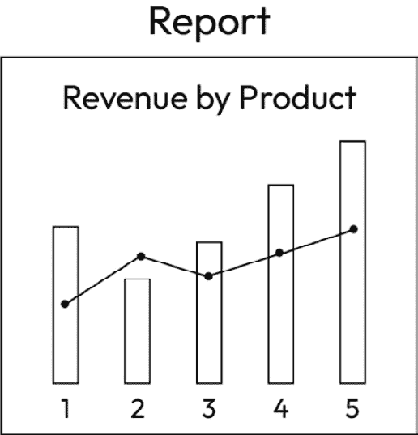
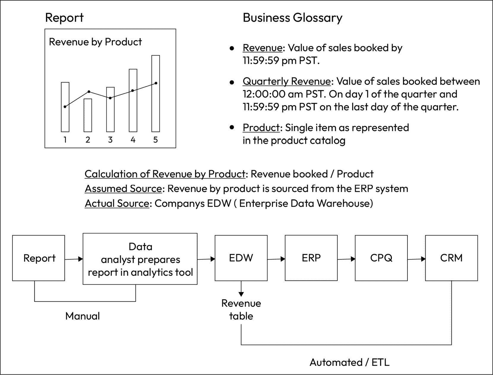
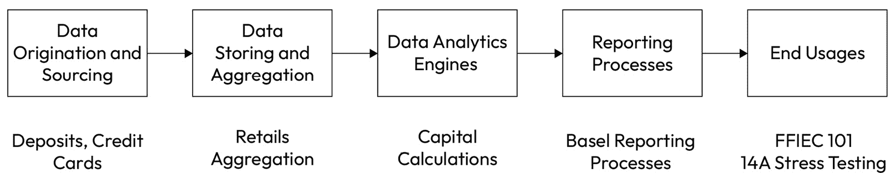

# 第七章：技术元数据和数据血缘

建立一个高价值、高**投资回报率**（**ROI**）的数据血缘能力是任何数据治理计划的基本能力。数据与分析首席官的成败在于能否回答几个核心问题：

+   我的数据在哪里？

+   谁拥有它？

+   它是如何分类的？

+   数据是否安全可靠？

+   当数据在公司内部流转时，它如何变化（或已经如何变化）？

+   我可以信任这些数据吗？它们的质量高吗？

数据血缘是能够看到数据在组织内部流转的过程。数据血缘捕捉了任何转置变化的来源以及数据的整体流转过程，展示了数据的来源、路径和演变。它提供了一个视角，帮助我们理解数据在其来源、流转和演变过程中的变化。

基于*第六章*中概述的元数据管理能力，本章将重点讨论元数据管理的更技术性方面。我们将专注于数据的存储位置、流动方式，以及理解数据所需的技术要求。尽管技术数据管理员最有可能与技术元数据，特别是数据血缘打交道，业务数据管理员也能从这一能力中受益。此外，技术元数据将为数据质量的测量奠定基础，我们将在*第八章*中讨论数据质量。

截至目前，完整的端到端数据血缘对于大多数公司来说仍然是一个挑战。我将概述我在部署数据血缘过程中的经验、面临的挑战，以及在没有完美解决方案的情况下我们可以采取的措施。我们不需要等待“神奇的工具”或技术来推动公司数据血缘能力的开发。我们可以立刻从现有条件出发，并在能力逐步成熟时不断完善。让我们从一些基本定义开始，确保我们有共同的语言基础。

我们将涵盖以下主要话题：

+   技术元数据

+   数据血缘

+   构建一个最优的数据血缘能力

# 技术元数据

**技术元数据**通常由更具技术背景的数据专业人员使用，如工程师、数据运营专家、系统工程师和一般的信息技术分析师。技术元数据是描述数据更技术性方面的信息，包括管理和理解数据物理方面的关键信息。技术元数据包含以下领域的位置信息和格式信息：

+   **数据架构**：数据库结构的描述，包括表、行/列以及它们之间的关系

+   **数据字典**：包含数据定义、数据血缘和数据质量规则

+   **数据血统**：数据如何被创建、处理和使用的历史；它用于支持数据发现、数据集成、数据治理和数据分析

## 为什么这很重要？什么是重要的？

记录物理数据资产、数据流动、转换以及物理数据元素之间关系的文档，能够帮助用户更好地理解数据。技术元数据的功能非常重要，原因包括以下几点：

+   帮助数据分析师和工程师了解可用的数据

+   帮助追踪数据创建和转化的历史，这对于调试和审计目的非常有用

+   可用于评估数据质量，帮助用户识别和修复数据质量问题，并确定数据质量问题在过程中的引入位置（从而帮助业务修复导致数据质量问题的过程问题）

+   保护数据免受未经授权的访问和/或修改

| **有用的提示** |
| --- |

当你开始接触技术元数据时，你可能需要选择一个领域来入手。你可能想从对业务至关重要的报告开始，这样你就能确保报告的可靠性。如果这看起来让人不知所措，你可以从报告中的一个简单指标开始。例如，也许你正在尝试了解你向利益相关者（可能特别是股东）报告的客户数量是否准确。以下是你可能会问的几个关于该指标的问题：

+   客户数量的定义是什么？

+   我们从哪里获取客户数量指标？

+   根据我们的定义，源头是否是提取客户数量指标的正确来源？

+   客户数量数据的血统是什么？谁在数据传输过程中接触到该数据？

+   我们是否有信心客户数量数据质量高？我们能信任它吗？

+   谁是客户数量指标的负责人？

+   我们是否测试了数据血统以确保数据可靠？我们是否测试了数据的准确性、完整性和可靠性？

通过评估这些问题的答案，我们能够确定：A）客户数量指标是否存在问题，或者 B）我们是否可以放心依赖该指标。通过详细探索该指标并将结果记录在共享的元数据系统中，我们可以减少对机构知识的依赖，并增强该指标的透明度和可见性。一旦评估完成，我们就能在公司内部自信地重用该指标。|

## 如何衡量这个值？

我经常被问到如何衡量数据治理中更技术性方面的价值（除了数据治理本身）。这个问题的根源是：如何用业务用户能理解并且同意的方式来衡量价值？这个答案的关键部分是，业务用户必须同意他们所得到的价值与你所描述的相符。大多数首席数据分析官（CDAOs）并没有采取额外步骤，从业务方获取确认，确认他们确实收到了数据办公室所说的价值。在这种情况下，CDAO 被发现推崇他们的团队提供了影响，但没有人同意，通常导致 CDAO 在业务方失去信誉，最终影响资金和支持。

为了避免这个问题，必须确保价值是基于事实的，并且业务在部署之前同意这些事实（通常，这意味着在部署之前对衡量价值的方法达成一致），并在部署后确认他们确实收到了价值。在此过程中，有几种方法可以衡量技术元数据的价值。

衡量价值的最直接方式是从衡量技术元数据为组织提供的好处开始：

+   寻找和理解数据所花时间的减少 [*节省的小时数 x 受影响的人数 * 每小时/每人的平均成本 = 通过提供* *技术元数据* 节省的成本减少]

    +   需要与业务对齐的假设：

        +   # 节省的小时数

        +   # 受影响的人数

        +   每小时/每人的成本

    +   注：事先对齐假设，这样当结果出来时，争论会更少。通常，数字会比预期的要高，这会引发对方法论的担忧。这种做法将减少价值对齐讨论中的摩擦。

    +   *附加说明*：我曾看到“搜索和查找”时间通过在组织中激活元数据管理能力，**最多减少了 80%**，所以不要低估此能力的重要性和影响力。

+   数据分析的质量和准确性的提高 [*已识别的数据问题 * 数据问题* *修复的价值*]

    +   需要与业务对齐的假设：

        +   数据问题修复的价值 [可以是实际的美元金额，可以是重要性百分比，也可以是由这些数字做出的决策价值]

    +   注：你可以简单地跟踪识别和修复的数据问题数量；然而，这假设所有数据问题都同等对待，但事实并非如此。

另一种或附加的价值衡量方法是衡量技术元数据为组织提供的成本规避。这些通常较难定义并与业务对齐，但同样具有价值。以下是一些示例：

+   合规性违规避免（示例：GDPR 罚款、CCPA 罚款、外部审计发现）[*避免的违规次数* *平均违规成本*]

    +   需要与业务对齐的假设：

        +   哪些违规行为被避免了（通常与首席隐私官、首席法律官或首席合规官对齐）

        +   违规行为的平均成本

+   错误避免 [*避免的错误数量* *避免的价值*]

    +   需要与业务对齐的假设：

        +   什么是被避免的错误？

        +   避免错误的价值是什么？

理想情况下，您的技术元数据负责人应该定期跟踪并报告这些指标。我建议将这些指标面向利益相关者，随时可以供审查，并保持完全透明。您可以邀请利益相关者对假设提出挑战，以建立对用于衡量成功的指标的信任，而不是采取防御态度。如果假设对业务没有意义，改正它们。确保与业务对假设达成一致，然后让解决方案的价值从此开始自我证明。

## 应该使用哪些指标来衡量成熟度？

在评估技术元数据管理能力的成熟度时，应该使用以下指标来内部衡量能力的实施情况：

+   已记录数据架构的数据源数量

+   已有完整信息的数据源数量

+   已识别技术数据管理员的数据源数量

+   已记录技术元数据的报告数量

+   已记录技术元数据的指标数量

+   从技术元数据中识别出的数据质量问题数量

示例

*我们的数据在哪里？*

一个常见的、也有些可怕的问题。

更可怕的是常见的回答：*我* *不知道*。

不幸的是，这对大多数公司来说是现实。许多人对数据所在的位置有一个“不错”的了解。他们可能知道它在哪个系统中……但是那些未知的情况呢？你能百分之百确定数据没有被复制吗？没有被复制存储在电子表格中？

这就是技术元数据如此重要的原因，能够回答问题：“*我的数据在哪里？*” 许多公司知道他们预期数据的位置，但却很难确保完整了解所有数据位置。

## 谁来管理它？

技术元数据应该由**技术数据管理员**管理。技术数据管理员是组织内的技术资源，通常位于信息技术职能部门，负责维护和管理您组织中的物理数据。尽管您的**业务数据管理员**负责政策合规、业务定义、使用和业务术语表的准确性，但技术数据管理员是业务数据管理员的技术对口人。这两个角色共同为公司资产——可用数据——创造信任。

## 成熟度是什么样子的？

一个成熟且完全运营的技术元数据解决方案将提供关于公司数据的全面、易于访问、清晰的技术信息，并且具有明确的管理责任（即回答以下问题：*谁对数据负责？*）。数据将是透明的、清晰的，并且任何用户都可以轻松理解。此外，解决方案将回答以下问题：

+   我们拥有何种数据？

+   我们的数据在哪里？

+   我们的数据是如何被使用的？

当我们能够持续和系统地回答这些数据相关的问题时，我们就拥有了成熟的技术元数据能力。如果每次问到这些问题（如上所述），我们都需要进行搜索和挽救，那么我们还需要做更多工作。通常，这种情况发生在一次危机中，可能是由客户驱动或合规驱动，在无法轻松回答这些问题时，才会促使高层管理人员迅速而大规模地投资于这一能力。

## 你应该如何使用它？

用户（无论是业务还是技术人员）可以通过多种方式使用技术元数据来帮助他们运营业务和履行各自的工作职责。一些常见的例子包括：

+   **当你在寻找数据时**。*例如*：某个用户正在尝试找到某个特定产品的最佳收入来源。

+   **当你发现问题并想要了解问题的根源时**。*例如*：用户发现报告中存在问题。他们查看业务和技术元数据，以查找数据的来源，从而发现错误的根源。

+   **当你试图确保和保护数据时**。*例如*：你需要在公司中找到**个人身份信息**（**PII**）并保护它免受未授权访问。首先，你需要找出 PII 的位置，以便将其分类为 PII，然后与安全团队合作进行保护。

+   **当你需要删除数据时**。*例如*：客户要求在合同中定义一个特定的时间范围内删除数据。客户要求公司删除其数据，你需要找到公司中所有与该客户相关的数据。

+   **当你试图理解一个端到端的流程时**。*例如*：你是业务分析师，正在寻找优化从报价到收款的流程的方法。你希望了解报价在公司系统中的流转路径，以寻找简化的机会。

+   **当你尝试理解变更管理的影响时**。*例如*：你的人力资源系统将在这个周末发布新的版本。你需要确定这些变更是否会影响到用于人员管理的报告，最好是在变更发生之前就能找到答案。

# 数据血统

**数据**血统（**Data Lineage**）是一种追踪和记录数据在组织系统中流动过程的能力。数据血统展示了数据是如何在系统中流动的，如何在这个过程中发生变化或被处理，以及它在哪里存储并最终被使用。简而言之，数据血统为数据提供了透明性。这一点至关重要，因为透明性有助于我们建立对数据的信任。当我们知道数据是什么以及它来自哪里时，我们对它的信任度会更高，这也是理解数据并相信其所提供信息的关键组成部分。

数据血统功能的另一个关键组件是它追踪数据随时间流动的过程。与本书中其他一些数据功能不同，数据血统提供有关数据生命周期的信息。通过更清楚地了解数据的来源、可能发生的变化以及数据最终存储的位置，我们能够看到数据在其生命周期中经历的所有转换，发生了什么变化，以及为什么发生这些变化。

## 这为什么重要？什么是重要的？

对数据的信任是确保公司做出数据驱动决策的首要条件。在上一轮评估中，83%的首席执行官希望他们的组织能以数据为驱动，而只有 30%的员工相信他们的组织正在实现这一目标（*Tableau*）。为什么会有这种差距？部分原因是数据不被信任，难以访问，人们不了解它，因此虽然数据会在决策中被考虑，但很少被实际使用。数据血统之所以重要，是因为它帮助公司更清楚地看到数据，理解数据的来源，从而建立对数据的信任。这种信任是数据使用的基础。当我们信任信息时，我们可以用它来做决策，从而做出更好的决策。最终，*数据血统为数据* *带来了完整性*。

数据血统是对物理数据资产、数据流动、数据转换和物理数据元素之间关系的文档化。数据血统告诉我们以下内容：

+   数据的位置

+   它是如何存储的（是存储在数据仓库、数据湖、内部服务器，还是云端（哪个云）？）

+   数据是如何创建的

+   数据的来源

+   上一次修改时间

+   它是如何更新的（系统化更新、人工更新，以及通过捕捉用户 ID 来确定更新者）

示例

在我过去建立数据治理职能的经验中，我曾有一位咨询合作伙伴告诉我，只要我们能够验证数据在起始时的质量与报告输出时的质量相符，就不需要端到端的数据血统。对于数据质量的目的来说，这可能是对的，但这并不能告诉我们关于安全管理等变更管理的任何技术性影响。

例如，如果一个变更在系统 A 中投入生产，而我们查看的报告来自系统 D，那么我们将无法看到数据在系统 B 或系统 C 的中途停留。如果没有数据血缘，我们将无法看到系统 B 包含该数据，并且变更可能会对其产生影响。这只是数据传输过程中的一个环节。我们只能看到系统 A 和 D 之间的不匹配，但无法得知数据来自系统 B 并被提取到不同的报告中，并且在变更过程中也会受到影响。

数据血缘还可以让我们了解哪些类型的变更可能会对其产生影响。想象一下，能够查询我们的数据血缘存储库。我们可以看到数据在其生命周期中的位置，而不仅仅是它的起点和终点。在做出此类决策时，考虑所有数据血缘的要求和相关的使用场景非常重要。

数据血缘的好处是广泛的，正如我们将在接下来的章节中探讨的那样。请记住，数据血缘是额外数据治理功能的基础，包括数据质量。我们将在*第八章*中详细介绍数据质量，*数据质量*。

## 如何衡量其价值？

与*技术元数据*部分中的衡量标准一致，数据血缘的价值可以通过成本节省、时间节省、风险规避和增值等指标来衡量。请参见前面部分，了解如何衡量数据血缘的价值，并获取具体示例和计算方法。更广泛地说，数据血缘可以通过以下几种方式来衡量：

+   **增加收入/节省成本**：如果你为用户提供更好的信息，他们能够做出更好的决策，进而增加收入。这也可以通过评估减少冗余和削减成本的机会，来提高营业利润。通过及早识别数据错误并防止用户基于错误数据做出决策，也能节省成本。

+   **降低风险**：通过识别带有风险的数据并尽早保护它，你可以帮助公司避免数据泄露的风险。

+   **改进决策**：通过使用数据血缘提供清晰的数据视图，你可以应用自动化技术，使报告更快、更有价值，从而使决策更加迅速，且减少人为错误的风险。

+   **增加/改善创新**：你可以利用数据血缘从现有数据中发现新的洞察，这些洞察可以用来创造新的产品和服务。

广义而言，数据血缘因以下几个关键原因而具有重要价值：

+   **提高数据质量**：数据血缘通过提供数据变动的洞察，帮助识别潜在的错误，从而提高数据质量。

+   **提高合规性**：数据血统帮助公司满足合规要求，这些要求需要理解数据主权，并支持避免因如 GDPR 或 CCPA 等要求而产生的罚款或处罚。

+   **增强的审计功能**：数据血统通过数据流的可用性增强了审计能力。通过能够透明地看到数据流向，数据血统可以帮助审计人员在与利益相关者会面之前理解一个过程。

+   **提升安全性**：数据血统是推动安全实践精准性的基础能力。与其采取一刀切的方法，深入了解需要保护的数据让安全团队能够精准地采取行动，对组织中的正确数据施加适当的控制。

+   **更快的故障排除**：数据血统可以用于调查数据问题，能够追溯整个数据供应链中的数据流。这样的可追溯性将帮助用户更快地识别问题源，从而节省（可能是非常可观的）时间。

+   **改进的变更管理**：数据血统通过让团队提前看到哪些数据将受到发布或变更的影响，推动了改进的变更管理，从而在生产发布之前和之后完成适当的测试，确保变更按预期运行。

+   **更强的数据治理**：数据血统可以用于改善数据治理，并帮助确定优先级。通过提供一种系统化的方式记录数据流，数据治理团队可以利用数据血统来确定关注领域的优先级，并确保数据的使用符合数据治理政策，保持一致性和合规性。

利用这里概述的领域，你可以通过计算上述好处，使用一个基本的计算来衡量数据血统的价值，然后进行简单的 ROI 计算：

**ROI =** **(****好处 − 成本****)** **/** **成本**

你可以计算公司在数据血统能力上的 ROI。要计算为提供此能力所需的成本，你应该包括以下费用：

+   **软件费用**：获得数据血统工具或工具的合同费用，这些工具用于在组织中为用户提供能力。

+   **实施成本（在一段时间内）**：实施工具的成本可能包括一次性费用，如实施顾问费用和人员增加（例如，承包商协助搭建平台或设计流程，或进行初步的数据血统收集）。

+   **维护成本，包括人员、流程和技术**：为持续提供此功能的人员成本、持续的服务器空间等费用。

综合来看，这个计算可以从成本角度评估收益，并为公司提供信心，表明维护数据血统所需的工作被其所带来的显著收益所超越。

## 应该使用什么指标来衡量成熟度？

除了之前提到的业务价值度量，数据治理团队可能会跟踪特定的项目范围内的价值度量，例如：

+   识别并解决的数据质量问题数量

+   在影响客户之前识别并预防的合规性违规次数

+   识别并预防的安全事件数量

+   **市场时间**（**TTM**）用于新产品或服务

+   数据分析的**价值时间**（**TTV**）增加

+   数据源退役或简化工作带来的成本节省

## 谁来管理它？

与其他类型的技术元数据（如数据字典）一样，技术数据管理员通常是负责数据血统的人（或人们），他们确保数据血统准确地表示公司内部物理数据的流动情况。业务用户可能会使用数据血统来证明对数据的信任，因为可以看到数据的流动路径、旅程中的质量以及数据的总体可靠性；然而，数据血统的管理通常掌握在技术数据管理员手中。

## 成熟度的表现是什么样的？

有许多成熟的数据血统能力是相关的，但简单来说，数据血统能力的广度和深度是成功的主要指标。当你开始推出这一能力时，可能从单个报告或指标开始。接着，可能扩展到整个数据领域或一套系统。最后，可能会有整个公司所有优先级数据资产的文档化，并具备可持续的数据血统。随着成熟度的提高，你应该能够通过验证发现数据血统中的问题和错误。验证是一种最佳实践，应在你的成熟过程中逐步实现。验证应包括连接数据提供者和数据消费者，以确认结果是否如预期。让我们深入探讨验证。

最佳实践 – 验证数据血统

通过进行端到端血统分析，数据分析师和业务用户可以提高对数据血统能力的信任。验证提供了对技术元数据能力完整性和准确性的信心。

要验证数据血统，选择一个对公司重要的报告；例如，一个包含**关键绩效指标**（**KPIs**）的高层管理仪表板可能是一个不错的选择。然后，进行以下操作：

1.  优先处理相关报告，并识别报告中的关键业务元素（数据点）。

1.  从报告中选择一部分项目进行验证。

1.  与产生报告或负责自动化生成报告的个人会面（取决于报告的生成方式）。

1.  记录*步骤 1*和*步骤 2*中识别的每个独特业务元素的端到端生成过程/关键业务元素。

1.  识别提供的文档中存在的任何问题或顾虑。

1.  将叙述与收集到的技术数据传承进行比较，并评估任何差距。

1.  与报告所有者/生产者讨论识别出的任何差距，验证是否理解或技术传承有误，对理解差距进行再教育，并更新技术传承以解决任何技术问题。

图 7.1 – 示例报告：按产品分类的收入

图 7.2 – 示例元数据流程

最佳实践 – 将技术元数据与业务元数据连接起来

为了将业务和技术元数据的力量结合起来，我们必须能够将这两者连接起来。理想情况下，您的业务和技术数据管理员将共同努力推动这一能力，以便公司能够从已经完成的工作中受益。

图 7.3 – 零售银行部门示例数据供应链

在将特定数据资产纳入元数据管理能力范围时，您的业务数据管理员将努力定义业务定义和计算，并识别数据的适当、最优来源。然后，技术数据管理员将介入，识别物理数据元素并提取技术元数据（或者读取技术元数据，具体取决于您的工具）。关于物理数据元素和数据供应链的细节应进行质量、一致性和准确性审查与验证。

最佳实践 – 优化数据流转

通过利用数据传承，数据团队可以识别全企业范围内的数据重复。当我们能够看到数据在数据供应链中的所有跳跃、跳过和转移时，就可以识别出供应链中的低效环节。这使我们能够发现数据可以更直接地流动的地方，从而减少错误的风险，并优化在多个位置维护相同数据的成本。

## 如何使用数据传承？

理想情况下，个人应该从他们的问题开始。通常发生的情况是，数据工程师或业务分析师会从诸如“*我需要访问数据库 ABC*”之类的事情开始。我总觉得这不是一个好的起点，但这却是*非常常见*的做法。

我的即时反应是“*为什么？*”，通常会得到一副困惑的表情。

对于回应通常是类似“因为我需要做我的工作”、“我需要制作一个仪表盘”或者“我的老板让我获取一些数据来创建洞察”的情况，这并不罕见。

这种思维方式的问题在于，我们将数据置于了业务理解之前，并且它基于一系列关于数据的假设。实际上，我们应该做的是，在开始请求任何数据访问权限之前，先明确我们要寻找的结果。从“*为什么？*”开始会得到一个更加具体且快速的结果。它使请求者能更深入地思考他们正在做什么的原因，并且能够让数据团队根据他们所需要的内容，而不是他们想从哪里开始查找的地方，提供更快速的支持。“给我访问权限”的方式基于一种假设，即请求者知道他们请求访问的位置是获取所需数据的最可信版本。

这通常是错误的。

继续前面的例子，如果在没有进一步对话的情况下授予请求的数据库访问权限，请求者将获得数据并继续他们的工作。然而（我不能强调这一点），很可能这个请求背后还有更多的需求，数据的情况也比最初想的要复杂。在这个例子中，可能会出错的地方有几个：

+   数据库中可能没有请求者认为它包含的数据

+   数据可能不适合使用

+   数据的质量可能较低

+   数据库可能不是获取数据的最佳途径，因为它可能并未经过认证

+   请求者需要的分析结果可能已经是现成的（例如指标、数据集，或许是一份报告）

因此，任何技术元数据搜索的第一步都应从业务元数据开始：具体来说，就是业务词汇表（有关业务词汇表的更多信息，请参见*第六章*，*元数据管理*）。我建议你回到请求者那里，问他们：“*你试图回答什么问题？*”

例如，请求者可能是为了获取某个特定产品的收入信息而请求访问财务数据库。他们希望能够访问数据库，以便查询所需的数据。然而，在这个例子中，他们可能不知道的是，你的团队已经制作了一个经过认证的仪表盘，其中包含按产品划分的收入数据，并且这些数据已在数据市场中提供（有关数据市场的更多信息，请参见*第六章*，*元数据管理*）。通过向请求者展示数据市场，并告诉他们如何更容易地找到所需的信息，可以节省他们大量的时间，并减少提供不一致信息的风险。

因为你的数据市场充满了经过认证、测试和信任的数据资产，请求者可以轻松搜索并找到他们需要的数据来回答问题。在这个例子中，请求者可以找到**按产品划分的收入**仪表板，并使用现有的筛选器按他们感兴趣的时间范围进行排序，另外，他们还可以放心，数据是经过认证、验证且值得信赖的。每个人都受益。

# 构建一个优化的数据血统能力

现在我们对数据血统有了更多的了解，知道了它的表现形式、涉及的人员和它的好处，让我们来探索如何为你的组织构建一个优化的数据血统能力。首先，你需要评估组织的复杂性。你是一个大型的、受严格监管的行业，还是一个小型的、单一产品的公司？并不是每个组织都需要一个完全完善、最先进的数据血统工具。你也可以先手动构建数据血统，证明其可行性，然后再投入数十万甚至更多资金到更强大的工具中。

优先确定你的实施范围。从单一报告或单一指标作为试点开始，证明这一能力。组织一个小团队，参与到该报告的生产中，并帮助他们理解了解数据在组织中流转的价值，以生成报告或指标。追踪数据流转的过程，识别简化和解决问题的机会，并衡量数据质量。

广泛展示试点的好处，让整个组织都知道。更好的是，让报告或指标负责人代为讲述这个故事。让他们分享因为这项功能，他们的工作如何简化和/或得到改善。接下来的挑战将是优先考虑那些愿意站出来的人，他们希望在试点中看到相同的好处。

现在是讨论和优先考虑以下事项的好时机：

+   为什么你应该拥有完整的端到端数据血统（以及适用的使用场景）

+   为什么你*不*应该拥有完整的端到端数据血统以及替代方案

并不是所有企业范围内的数据元素都需要完整的数据血统。你需要优先考虑最重要的数据资产。记住 ROI 计算，集中精力处理回报最大的数据应用案例。最适合你组织的方法将取决于数据环境的规模和复杂性，以及可用资源的情况。可以从小规模开始，再逐步扩展。

# 结论

在推动您组织内部强大技术元数据能力的同时，与业务元数据能力的协同工作是非常有帮助的。在推动这一能力在不同项目或数据领域中的进展时，确保您的数据目录随时更新、定义关键数据元素，并与技术元数据（包括数据血缘）对齐，将有助于您建立对业务和技术元数据质量的信心。能够向您的用户展示您在业务和技术方面都有可靠的深度理解，将有助于增强他们对您能力的依赖。记住，从定义范围开始，以帮助设定对业务从此能力中获得的期望，以及何时获得。确保您有清晰的角色和责任划分，并拥有明确、透明且已发布的指标来衡量您的成功。最后，别忘了在过程中讲述成功的故事。
