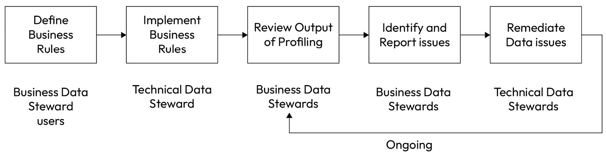
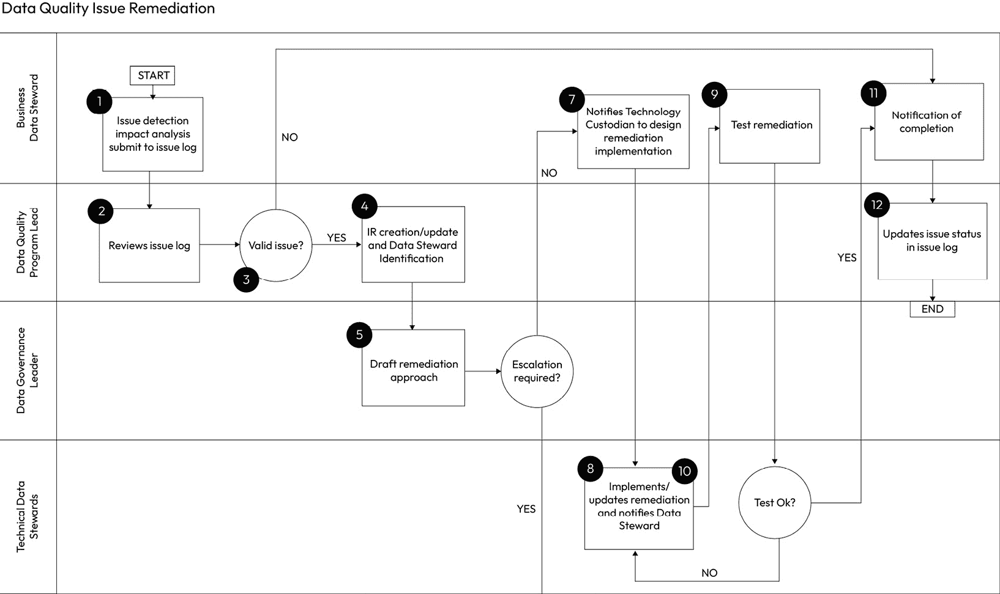
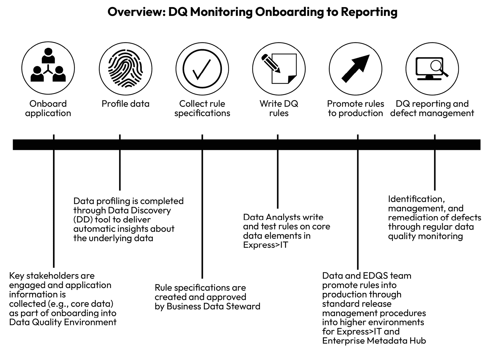

# 第八章：数据质量

决策的质量与支撑决策的数据质量紧密相关。因此，数据质量影响着组织的方方面面。这是一个（恰当的）大胆声明，但往往被低估。从日常运营到长期战略方向，拥有高质量、可靠且值得信赖的信息不只是“锦上添花”，而是任何公司都必须具备的。这是任何规模公司成功的关键。如何在组织中确保数据质量的操作化应该根据组织的规模和复杂性有所不同，但对数据质量的需求始终如一。它是经营任何业务的核心。

在数据驱动决策的不断发展之中，存在着一个深刻的真理，我们作为数据的管理者和守护者必须谦虚地承认：我们数据的质量是所有分析工作所依赖的基石。在本章中，我将深入探讨数据质量这一至关重要的领域，因为在这里，我们将面对作为我们公司信息守护者的责任的本质。怀着直接而坚定的关注，我旨在阐明数据质量在数据治理中的重要性。在本章中，我不仅会揭示高质量数据的内在价值，还会探讨它为组织带来的变革性潜力。我无法过多强调确保我们的数据不仅仅是数据，而是可靠的、有洞察力的，最重要的是值得信赖的。

很容易建议数据质量是“每个人的责任”（确实如此）；然而，最终，还是由你来定义所需内容、定义并实施数据质量能力，并推动公司对数据质量的重视。无论有多少数据在你直接控制之下，你都将为企业范围内的数据质量负责。这可能会让你觉得不公平，但作为数据负责人，这份责任属于你。当发现重大数据错误时，无论你是否直接参与，你都会被召来帮助解决问题。责任将落在你肩上。因此，本章及其中的指导对于你的成功至关重要。

我们将涵盖以下主要话题：

+   数据质量定义

+   核心能力

+   建立最佳的数据质量能力

+   为成功设立数据质量

首席数据与分析官成功的标志之一就是定义并实施可信的数据能力。这不仅向公司展示数据是值得信赖的，还能提供透明度，*让他们了解*为何可以信任这些数据。当谈到设计最佳数据质量能力时，**可信数据**是我们将在本章后面探讨的内容。首先，让我们从一些关键定义开始。

# 数据质量定义

数据质量是数据治理能力，指的是数据在特定背景下的准确性、可靠性和适用性的程度。数据质量的评估维度包括完整性、准确性、时效性、一致性和相关性。如前所述，数据质量是所有组织的核心能力。公司整体数据质量至关重要，单个数据元素、关键报告、运营中的数据质量，以及它们对业务整体运作的影响同样不可忽视。数据质量是建立对我们信息信任的核心。接下来，我们将定义每个数据质量维度，并提供一些示例，帮助理解数据质量是什么，以及它如何在公司中体现。了解基本概念后，我们将迅速进入应用这些核心维度所需的核心能力：

| **数据** **质量维度** | **定义** | **示例** |
| --- | --- | --- |
| 准确性 | 准确性指数据的正确性。准确的数据没有错误，能够真实反映它所代表的现实世界实体和事件。不准确的数据可能导致错误的结论和决策。 | 在客户数据库中，某人的出生日期被记录为 1980 年 1 月 15 日，而正确日期应为 1980 年 1 月 25 日。 |
| 完整性 | 完整性指是否所有必需的数据元素都已存在。不完整的数据可能会阻碍分析，并导致理解上的空白。 | 一个库存数据库缺少某些产品的记录，导致可用商品列表出现空缺。 |
| 一致性 | 一致性确保数据统一，并遵循既定标准。不一致的数据可能源于数据输入、格式或术语的变化，导致混淆和数据整合挑战。 | 在销售数据集中，货币单位被不一致地记录为“USD”、“US Dollars”或“$”，使得聚合销售数据变得困难。 |
| 时效性 | 时效性指数据的最新程度。及时的数据对决策和分析是相关的，而过时的数据可能导致错失机会或决策错误。 | 一份第一季度的财务报告直到第二季度的几个月后才更新，这使得它在决策时的相关性大打折扣。 |
| 相关性 | 相关性是指数据是否适用于当前的特定任务或分析。无关数据可能会混乱数据集，使得提取有意义的洞见变得更加困难。 | 在营销活动分析中，客户鞋码的数据被纳入其中，尽管它与活动效果无关。 |
| 有效性 | 有效性检查数据是否符合预定义的规则、约束或业务逻辑。有效的数据遵守定义的标准并确保数据完整性。 | 一个电子邮件地址字段包含了不符合有效电子邮件格式的条目，如 `user(at)example(dot)com` 而不是 `user@example.com`。 |
| 完整性 | 数据完整性确保数据在其生命周期中保持准确和一致，防止未经授权的更改或损坏。 | 数据库管理员不小心删除或修改了记录，而没有适当的授权，导致数据完整性问题。 |
| 可信度 | 可信度反映了数据源的可靠性和可信性。来自信誉良好的来源的数据更有可能具有较高的质量。 | 从知名、政府监管的金融机构获得的数据被认为比来自匿名在线来源的数据更值得信赖。 |

表 8.1 - 数据质量维度

## 数据质量策略

数据质量策略是任何数据质量计划的基础能力。数据质量策略定义了公司整合的、全公司范围内的方式，以实现并保持满足业务目标所需的质量水平。由公司首席数据与分析办公室设定，策略应包括目标、关键任务、计划和衡量标准，以提高和保持组织的数据质量。虽然该策略由中央设定，但应清晰阐明中央团队与业务数据管理人员、技术数据管理人员、架构师、数据分析师等的职责任务。

数据质量策略应包含以下核心组成部分：

+   **数据质量目标**：首先定义数据质量策略的目的是什么，通过该策略将交付哪些成果，以及成功的具体表现是什么，特别是对贵公司而言（例如，数据质量如何支持数据战略，包括数据治理成果）。

+   **当前状态评估**：向读者准确说明公司数据的真实情况（好或坏）。尽可能具体，并提供强有力的例子，解释当前数据质量问题对业务的影响。

+   **数据质量标准**：阐明可信数据的标准。您的标准可能包括数据质量维度的最低规则，以及每个关键数据资产应做什么。若您不确定包含哪些内容，*核心能力*部分是一个很好的起点。

+   **数据质量启用的实施计划**：定义实现数据质量所需的流程和工具，以及您和您的团队将如何实施所需的启用机制。

+   **修复和问题管理方法**：定义如何衡量、报告和修复数据质量。

+   **数据质量的所有权和责任**：明确哪些角色对于有效的数据质量管理是必要的，以及每个角色的期望是什么。

例如，你的目标可能是“建立一个支持优先级排序、治理和数据质量监管的企业数据质量框架，以提高对关键数据的透明度并增强关键报告的信任”，而评估方法的示例可能是“你可以对一个系统、报告或流程进行基准测试，显示数据的当前质量水平。”该策略的输出应具有可操作性，并转化为实施的路线图。

### 目的

**数据质量策略**的目的是在公司内部推动关于数据质量的清晰度和一致性，明确什么是数据质量，为什么它很重要，以及公司如何知道在将信任引入信息中时是否取得了成功。该策略是推动关于当前差距及如何在未来衡量成功的讨论的重要驱动力。大多数高层管理者很难理解策略的**投资回报率**（**ROI**）。我建议专注于你将通过策略所带来的业务成果，而不是策略本身。策略为这项工作设定了北极星，但它本身并不会单独交付结果。

你可能希望实施**数据质量标准**，作为企业数据治理政策的后续。数据质量标准应包括有关数据质量策略的具体信息，规范本章所述的数据质量管理角色和责任（并根据你特定业务的需求进行调整），并提供更多关于如何遵守政策的细节，具体通过采纳*数据质量* *赋能*部分所设定的能力。

### 责任

首席数据与分析官的组织负责公司的数据质量策略。根据团队的大小和规模，你可能有专门负责公司数据质量的人，或者你可能有负责所有数据治理功能的人；这两者都是负责推动首席数据与分析办公室这项工作的优秀候选人。如果可能的话，建立一位数据质量负责人，最终负责策略的交付以及实施推动公司策略所需的能力。其他相关方应包括以下人员：

+   业务数据管理员

+   技术数据管理员

+   架构师

+   数据工程师

+   数据分析师和业务分析师

+   依赖高质量数据做出决策的高层管理者

“我们到了吗？”

不可避免地，在你开始实施数据质量计划时，你会遇到一个利益相关者，他会问类似“我们什么时候完成？”这样的问题。

数据质量就像锻炼。当你身体不健康时，你需要制定计划并付出努力去恢复健康，但之后你还得保持健康。数据质量是公司锻炼的计划。你需要定义一个计划，创建一个恢复计划（实施），并持续支持数据质量。工作永远不会“完成”，如果不加以维护，公司很快会倒退。

## 数据质量赋能

数据质量赋能是任何数据质量计划的核心。数据质量赋能为公司提供集中化和标准化的能力，以满足公司的数据质量需求。赋能通常包括支持企业需求的人员、推动公司数据质量需求的流程，以及通常以工具形式提供的技术，支持有效管理数据质量。

### 目标

通过为公司提供中央能力，您可以确保公司对数据质量有一致的视角，定义了修复问题的通用流程，一种优先级排序方式，以及适当的沟通方式，以便需要了解数据质量问题的人员在最关键的时刻了解这些问题。

它归结为关于数据质量的透明信息、通用工具，重点是将预算和成本集中于共享工具（而不是竞争性工具），以及标准化的流程，旨在使人们能够在数据质量方面最大化他们的时间。

还有一个关键的向量是可重用性。例如，数据质量的赋能可以确保我们一次性衡量关键数据资产，并反复使用它们，而不是每次使用数据资产时都衡量数据质量。赋能团队或职能可以为关键数据资产提供认证流程，以便用户能够查看哪些数据资产已经过数据质量评估、符合预期并且可靠可用。这建立了信任，减少了在组织内寻找和衡量常用数据资产可靠性所花费的时间。公司规模越大，我们越有可能在不自觉的情况下使用通用数据资产，从而带来大规模冗余的风险。试想，当我们能够透明地看到我们拥有哪些关键资产（请参阅章节中关于元数据的*数据市场*）并知道数据是可靠的时，我们能够节省多少时间（这就是数据质量！）。

### 问责制

与数据质量战略和数据质量标准一样，数据质量赋能应由首席数据与分析办公室驱动。中央职能部门最适合为公司业务和技术数据管理者创建必要的能力，以推动他们负责的数据质量工作。通常，这个赋能团队要么在数据治理子团队中，要么与工具团队合作。鉴于元数据管理与数据质量紧密结合，通常会将其归为一类。

我曾见过非常有效的项目，其中数据治理团队负责主导数据质量战略、数据质量标准以及整个企业范围内的数据质量项目，而数据解决方案或数据工具团队则提供技术解决方案以支持这些能力。如果你的公司规模较大，这种模式非常有效，因为它将业务和技术技能与交付卓越数据组织所需的解决方案对齐。

电子表格无法扩展

在部署优秀的数据质量解决方案时，完美不能成为良好的敌人。然而，扩展性平衡是需要考虑的一个重要因素。

在我以前的公司之一，我们正在支持从端到端查看几份关键报告，以便在高层管理人员层面管理业务。我们的目标看似简单：这个报告是否足够可信，能让我们的高管做出业务决策？然而，将这个问题落实到操作上，远比我们预期的要难。

我们必须解构正在使用的关键指标。我们当时没有足够的技术解决方案来使这一过程高效或可重复，但我们还是向前推进了。问题是什么呢？报告的内容经常变化。我们没有从源头着手，去衡量数据源的整体情况，而是测量了单个指标。然而，随着指标的演变或新计算方法的引入，我们不得不重新开始，验证数据。如果我们采取更全面的方法，并使用技术来支持这一工作，我们就不会把数据质量记录在电子表格中（定义关键数据元素、映射到源系统以及手动测量质量）。每一次变化都需要大量的人工工作。我们无法扩展规模。

# 测量数据质量的价值

我相信，如果你在数据领域工作超过一天，你一定经历过这样的情况：有人联系你，坚信他们的数据“错误”。他们希望修复它。归根结底，他们对你说的是：我不信任这些数据。

当我们思考如何衡量数据质量的价值时，我们必须挑战自己，超越预期的思维方式。当我们考虑如何衡量数据质量的价值时，实际上我们是在问：如何衡量信任的价值？对我的公司来说，每天都能信任我们用于决策的信息，意味着什么？能够信任用于运营业务的信息，对我们而言价值几何？对我们的客户创造价值，意味着什么？有效运营呢？如果你能给这一切贴上一个美元的价值标签，那它会是多少？

数据信任的价值在很大程度上取决于你的业务。我们从一个真实的例子开始。

构建对数据质量的信任

市场营销是公司中的一个职能，很多人可能不认为它与数据有关系，但根据我的经验，最优秀的市场营销职能是高度数据驱动的。我曾与一个市场营销部门合作，他们在理解哪些个人可以成为他们的目标客户方面遇到了困难。他们拥有大量的潜在客户数据，但在以下方面感到困难重重：

哪些潜在客户具有准确的电子邮件地址和高质量的数据

潜在客户是否已全面同意接收营销信息，或者仅同意接收特定产品的营销信息（并且并购情况使得这一点更为复杂）

如果最近的同意符合其国家的规定（例如，同意的有效期是多久？）

最终，首席营销官需要衡量营销团队对销售的贡献，但没有可以信任的高质量潜在客户信息，衡量营销对销售的影响非常困难。他们认为自己的团队贡献了更多，但他们无法用数据来证明这一点。

在改善营销潜在客户数据可信度的初期，我们通过根据已确定的“关键字段”进行基本数据分析来设定数据质量的基准。我们将关键字段定义为与联系人记录相关的字段，这些字段是能够向该联系人进行营销所必需的，包括：名字、姓氏、电子邮件地址、公司以及有效同意。我们的初步分析显示，这些关键字段的质量大约为 43%，意味着只有约 43%的联系人在这五个字段中的数据是可靠的。

我们部署了一个数据增强服务，以提高联系人数据的可靠性。它允许我们覆盖低质量数据（例如，在名字和姓氏字段中使用首字母缩写，并填补空白），并通过第三方服务验证电子邮件地址。这样，我们能够纠正输入错误的地址。因此，我们可以处理那些已有同意但电子邮件地址无效的实例，并使用电子邮件地址。总体而言，这一努力使我们的可营销联系人比例从 43%提高到了 85%以上。因此，首席营销官能够证明他们的联系人数据更具价值，并且能够直接追溯到销售，且追溯率更高。这也是他们作为首席营销官成功的一个标志，最终帮助他们成为了一个出色的领导者。这位个人成为了我们数据与分析团队的支持者，并支持我们所主导的进一步转型工作。

最终，拥有可信数据的价值并不仅仅是简单的计算。对于营销部门来说，这是从确保他们可以市场推广到真实潜在客户中节省的成本，他们拥有市场推广到优质潜在客户的信心，并且*确保*他们遵守法律。他们还需要衡量从优质潜在客户中产生的收入贡献的价值。简而言之，这是成本节约 + 风险规避 + 罚款和处罚规避 + 收入贡献的结合。这种计算会根据用例、部门和公司而异。这里的重要信息是您用业务术语衡量价值。

大多数数据专业人员根据数据质量改进的百分比或错误减少来衡量改进，但不将其带回业务背景。这就是您作为数据领导者可以向公司展示其价值的地方，通过展示数据投资如何在收入增加、节省时间和风险规避方面产生实际的业务影响。这就是您展示对数据的信任和数据投资回报的方式。如果您从这本书中没有带走任何其他东西，就应该是这个。

# 核心能力

实施数据质量能力可以显著提升数据的完整性、准确性和可靠性，使其成为决策、分析和业务运营的可信资产。值得注意的是，角色可能会根据组织的大小和结构而有所不同。在较小的公司中，一个人可能会处理多个职责，而在较大的组织中，可能会有专门团队负责特定任务。这些角色之间的合作和清晰沟通对确保协调和有效的数据质量管理至关重要。

实现数据质量管理的成熟度表明组织不仅仅实施了核心能力，还将其精炼、优化并整合到日常运营中。

衡量每项数据质量能力的价值，确保组织能够证明其在数据质量管理上的投资，并识别改进的领域。对于每项能力，其价值可以进一步转化为有形的利益，如货币节省和收入增加，或者无形的利益，如增强的利益相关者信任、改善的品牌声誉和组织灵活性。将数据质量能力的价值转换为美元或时间，需要理解组织的具体财务和运营背景。为了准确地获得每项能力的美元或时间价值，组织需要进行详细评估，考虑其运营成本、业务背景以及数据问题的后果。计算价值的框架应由数据办公室定义；输入应由业务提供。我们在这里不会深入探讨细节，但可以使用之前在*衡量数据质量的价值*部分中定义的框架，应用到你的组织。

## 数据分析

通过一种名为**数据分析**的基础能力，建立对现有数据状态的理解，包括不一致性、异常和模式。数据分析通常由业务数据管理员和技术数据管理员共同执行。业务数据管理员可以提供关于数据的业务含义和使用方面的专业知识，而技术数据管理员可以提供关于数据的技术方面的专业知识：

+   **业务数据管理员**通常对他们所管理/负责的业务数据有深入的了解，这包括理解（或定义）数据的含义、使用方式以及质量要求。他们最有能力识别数据质量问题，并定义所识别问题的业务影响。业务数据管理员应当做以下事情：

    +   确定数据元素的数据质量业务需求

    +   确保对他们的数据元素实施数据质量分析

    +   定义管理数据的业务规则

    +   确定数据分析的频率（考虑数据变化的频率、数据量和他们管理的数据元素中的问题数量）

    +   审查和分析数据分析报告，以识别和理解数据质量问题，并向数据用户报告相关问题

    +   与数据管理员（其他业务数据管理员和技术数据管理员）一起解决数据质量问题

    +   确保数据分析完整、适当衡量、监控，并且对用户透明发布

+   **技术数据管理员**通常对数据有技术性的理解，例如结构、格式和系统。技术数据管理员负责协助业务数据管理员识别必须支持业务数据管理员需求的数据元素的物理位置。他们利用这种技术理解来识别并解决支持业务数据管理员的数据问题。技术数据管理员应该做以下事情：

    +   设计并实施数据分析作业

    +   配置并使用数据分析工具

    +   分析数据分析报告，与业务数据管理员合作，识别和排查数据质量问题

    +   与其他技术数据管理员合作，识别数据质量问题的上下游影响以及所需的修复措施

+   **数据工程师**负责在系统内实施分析需求，以便为业务数据管理员、技术数据管理员及最终用户提供有关数据状态的透明信息。

+   **用户**（数据分析师、业务分析师、高级管理人员）负责理解数据分析工作的结果，并在使用数据满足业务需求时考虑通过分析识别出的任何问题。

下图展示了业务数据和技术数据管理员合作的流程：

图 8.1 – 业务数据和技术数据管理员合作的简单流程

有一些简单的措施，你可以在团队内部采取这些措施，以展示你的团队在改善公司数据质量方面所取得的进展。基本的措施包括以下内容：

+   每个领域或系统中分析的数据集的百分比

+   在使用数据进行分析或运营时，减少意外或问题的发生（例如，开始时有多少问题，现在还有多少问题）

+   避免因错误的数据驱动决策或法规报告错误所带来的成本节约（例如，是否发现了一个重要错误，这个错误可能导致财务报告失误？）

+   通过采用自动化数据分析解决方案，减少手动识别和解决数据问题所花费的时间

## 数据清理

清洗数据的过程被称为**数据清洗**。数据清洗识别并修正数据集中的错误、不一致性和冗余。简而言之，数据清洗将数据修正到符合用户期望的标准。数据清洗应尽可能接近数据源进行，以确保正确且可信的数据能够在整个组织中流动，并且已经被修正。在数据修正的每个环节，业务数据管理员和技术数据管理员都有共同的责任，确保用户了解数据的修正（由业务数据管理员负责），并且修正后的数据能够上行和下行传递（由技术数据管理员负责）。

当修正后的数据看起来是错误的

在一次系统实施过程中，我的团队改进了一个特定数据集的质量。数据的用户报告了数据质量问题。为什么会发生这种情况？

我们没有适当地通知数据用户他们应该预期的变化及这些变化会是什么样子。因此，当数据发生变化时，尽管得到了改善，用户却认为它看起来与预期不同，从而导致他们认为数据是错误的。

就像数据分析一样，业务数据管理员和技术数据管理员之间的合作对这项能力的成功至关重要。业务数据管理员应该识别出需要清洗的数据元素（因为并非所有数据元素都同等重要，清洗是有成本的），并与数据用户合作，确定清洗能力的优先级和重要性。技术数据管理员则负责在系统中实现清洗活动，并确保上下游系统知晓正在进行的数据清洗，以预先警告消费者数据将发生变化。

由于公司中并非所有数据元素都能进行清洗，因此定义数据清洗策略非常重要，必须明确哪些数据元素对于清洗至关重要，并且要制定优先级机制，以确定哪些数据元素应当优先处理，为什么。你可能需要利用企业数据委员会或数据治理委员会来支持并批准你的优先级方法。

高级数据清洗功能可能会为公司提供集中式的清洗服务。例如，联系人地址标准化就是一个例子。联系人数据通常分布在整个组织中，可能包括市场营销、销售和客户服务数据。可以创建一个中央数据清洗服务，为这些部门提供地址标准化和数据丰富化服务，这样公司只需支付一次费用，就能为多个部门提供价值。

类似于数据分析，数据清洗的价值也通常以非常相似的方式进行衡量：即以商业价值、创造或节省的金额，以及时间缩短为标准。一些例子包括以下内容：

+   数据清洗后，数据错误的减少百分比（或按计数与百分比进行比较）。

+   增强决策分析中的信心（*注*：在衡量信心时，重要的是统一如何以时间或资金为衡量标准）。

+   通过避免基于错误数据做决策节省的资金。

+   减少手动纠正数据的时间。

+   自动化更正次数/已识别错误次数。

+   所需手动干预次数/已识别错误次数。

随着时间推移，手动干预应减少，数据质量应得到提升。随着数据质量的提高，您应该能够更轻松地识别问题。这应能释放资源，集中处理更关键的问题，专注于业务影响，而不是手动更正数据。

## 数据验证和标准化。

确定数据是否有效的过程称为**数据验证**。数据验证确定给定字段适合的值。例如，可能是一个数值范围（0-99）或一组特定值（例如，**北美行业分类系统**（**NAICS**）代码），该字段允许包含的内容。验证还可能包括字段是否可以包含字符或数值。验证要求字段符合特定的预期值。

同样，**数据标准化**通过统一数据格式、单位和定义，确保组织内部数据的一致性。通常与验证一起定义，这两项功能确保数据按预期格式和一致性展示。标准化工作确保相同的数据在各系统之间一致出现，并且在最成熟的状态下，可以在报告层级展现。

类似于数据剖析和数据清洗，业务数据管理员和技术数据管理员应协同工作，确保这些功能被全面采用：

+   **业务数据管理员**应定义适合字段的值，以满足数据用户的需求，并在整个公司范围内启用。

+   **技术数据管理员**应与工程师合作，在系统中实施验证规则，并确保验证在全公司范围内一致（标准化）。

衡量这两项功能的价值可以保持相对简单。几个常见的成功度量标准包括：

+   数据录入错误率（随着时间推移，应接近零）。

+   验证失败的次数/比率。

+   减少操作中断和减少数据修复/更正成本。

+   整合或数据摄取后，减少数据更正错误所节省的资金。

+   由于验证失败的减少，数据处理速度更快。

+   在所有数据摄取点进行自动化验证检查。

## 数据丰富化。

**数据丰富化**是向现有数据集添加新的补充信息的过程。此过程可以通过将来自内部来源的第一方数据（即贵公司的数据）与来自其他内部系统或第三方数据（即外部来源的数据）结合来实现。有几种方法可以丰富数据，一些常见的方式包括添加以下内容：

+   **人口统计数据**：这可能包括诸如年龄、性别、收入、位置和教育等信息。

+   **企业数据**：这可能包括公司规模、行业和收入等信息。

+   **行为数据**：这可能包括诸如网站访问、产品购买和社交媒体互动等信息。

+   **情境数据**：这可能包括诸如一天中的时间、地点和设备类型等信息。

数据丰富化可以用来提高数据的准确性、完整性和相关性。这对多种目的具有益处，如下所示：

+   **改善客户细分**：丰富的数据可以用来创建更准确和详细的客户细分。这有助于企业更好地了解客户的需求和偏好，并向他们推送更相关的营销和销售信息。

+   **个性化客户体验**：丰富的数据可以用来在所有渠道上个性化客户体验。例如，企业可以利用丰富的数据向客户推荐相关产品或服务，或为他们提供更个性化的支持。

+   **改进欺诈检测**：丰富的数据可以用于识别和防止欺诈行为。例如，企业可以利用丰富的数据来验证新客户的身份，或者检测欺诈交易。

+   **做出更好的商业决策**：丰富的数据可用于在组织的各个领域做出更好的商业决策。例如，企业可以利用丰富的数据识别新的市场机会，优化定价策略，并改进产品开发流程。

数据丰富化可能是一个复杂且耗时的过程，但它对各类企业来说都可能是一个有价值的投资。通过丰富数据，企业可以更深入地了解客户，改善市场营销和销售工作，并做出更好的商业决策。简单的价值衡量标准包括以下几点：

+   丰富后数据属性或特征的增加

+   提升洞察力和更强的预测建模能力

+   通过更精确的营销或分析洞察提高收入

+   降低人工数据收集过程的成本

更具体地，对于前述的例子，您可以通过以下业务指标来衡量这些丰富化服务的价值：

+   **改进的客户细分**：你可以通过将预测的细分成员与实际的细分成员进行对比，来追踪客户细分的准确性。你还可以追踪针对特定客户细分的营销活动的表现。

+   **个性化客户体验**：你可以追踪客户满意度和保持率，以衡量个性化客户体验的影响。你还可以追踪**点击率**（**CTR**）和转化率等指标，以衡量个性化营销活动的效果。

+   **改进的欺诈检测**：你可以追踪通过数据增强所检测和防止的欺诈交易数量。你还可以追踪通过防止欺诈交易所实现的成本节省。

+   **更好的业务决策**：你可以追踪使用增强数据所做的业务决策数量。你还可以追踪这些决策的财务影响，例如收入增加或成本减少。

这些可能很难具体衡量。这里有一个具体的例子，展示如何更具体地拆解衡量标准：

+   **业务目标**：提高客户细分的准确性。

+   **衡量标准**：正确分配到其客户细分市场的客户百分比。

+   **基准**：70%的客户被正确地分配到他们的客户细分市场。

+   **数据增强后**：85%的客户被正确地分配到他们的客户细分市场。

+   **结果**：客户细分的准确性提高了 15%。

## 反馈循环、异常处理和问题修复

尽管数据用户在数据质量程序的整个开发过程中都参与其中，但他们最为投入的阶段是程序启动并运行之后。当你通过数据分析、验证、增强等方式将业务规则配置到系统中时，数据质量程序的效果开始显现。首次发布的结果通常会让业务用户感到有些不适应。如果数据质量一直未受到重视，结果往往会令人震惊。作为数据专业人士，你的工作是帮助用户理解，第一次发布的结果只是一个**基准**。初始结果的作用是展示我们目前的状态。

### 反馈循环

当你开始与数据用户及各类数据管理员合作时，你的角色是确保数据质量项目为数据管理员和你的团队建立了适当的**反馈环**，以便你可以改进数据质量项目的实施，并支持管理员在提高数据可信度方面的工作。反馈环在你项目的多个环节中都很重要，但首先，它应当建立在用户和业务数据管理员之间。你可能需要帮助业务数据管理员指导如何建立适当的反馈论坛，以收集关于数据质量的反馈。他们可能会发现通过按数据领域建立**数据管理委员会**来提供反馈和优先级设置对数据质量修复重点的集中非常有价值。

你还应该为业务数据管理员和数据领域主管提供一个论坛，以便他们提出重要的跨职能数据质量问题，供企业优先处理（如有需要）。企业数据委员会和数据治理委员会是处理此类复杂数据问题的绝佳选择，这些问题需要企业资金、优先级安排或关注。让我们从探索数据问题如何被提交到这样一个论坛开始。

相反，业务数据管理员可能已经识别出一个数据质量问题，最终用户决定这个问题不重要，不值得采取修复措施。记录数据质量问题的优先级和处置过程非常重要。你不希望处于一种我们不确定数据质量问题是否真正存在，或者它只是一个不值得花时间和精力去修复的数据缺陷的情况。我建议创建一个处置日志，这样你可以跟踪你识别出的所有问题，并记录是谁批准了这一处置，从而为你的决策过程提供备查资料。

### 异常处理

在数据生命周期中，可能会有一些时刻对于数据质量流程作出例外处理。例如，某个数据度量可能已经定义了数据血统流程，并且为了财务报告目的，数据必须达到特定的质量标准。然而，为了进行临时分析，我们可能接受较低的数据质量水平，以便更快地获得见解。定义异常时，考虑数据的使用场景非常重要。在这个例子中，用户可能需要一次性提取收入数据，以便进行季度收入目标的合理性检查。此提取可能不需要完美。用户应当被告知，该数据提取没有经过所有正常的控制流程，但如果他们理解这一点，异常处理流程就显得非常合适，尤其是当时间紧迫时。

异常处理的重要性在于确保异常不会成为常态。你应该定义适当的时机来处理可能的异常。如果你发现某个特定请求经常出现，考虑它是否真的是一个异常，还是仅仅在绕过预期的信息流。

| **实用提示** |
| --- |
| 让我们从 IT 同行那里汲取经验，制定一个严重性评估方法。在 IT 领域，IT 问题根据一系列标准被分类为*Sev1*、*Sev2*等。根据该严重性等级，采用不同的流程来推动紧急处理。对于数据问题，我们也可以采用相同的方法。如果问题较为严重或导致系统停机，可能应该归为*Sev1*，并按最高级别的升级和修复流程处理；而对于轻微的数据问题，可以在几周或几个月内修复，不会对业务造成太大影响，可能只是*Sev3*。 |

在数据元素层面，你可能会发现数据中存在异常，这也可能被视为一个异常。你应该与业务数据管理员合作，确定这个异常是否真的是异常，以及为什么它会成为异常。是控制失效了吗？数据在传输过程中被损坏了吗？你是否从第三方收到错误的文件？数据出现某种异常可能有多种原因。重要的是，你需要遵循标准化流程来处理异常并最终解决它们。以下是如何管理特定类型数据质量异常的一些示例：

+   **缺失数据**：如果你的数据集中有大量缺失值，可能需要考虑对缺失值进行填补。可以通过多种方法来实现，例如使用列的平均值或中位数，或使用**机器学习**（**ML**）模型来预测缺失的值。

+   **不一致的数据**：如果你有不一致的数据，可能需要手动修正数据，或者更新数据质量规则以允许数据的不一致性。例如，如果你有一个日期列格式不同的数据集，可能需要在使用数据之前统一日期格式。

+   **重复数据**：如果你有重复数据，可能需要去除重复项或将其合并为一个单一记录。例如，如果你有一个数据集中有两个客户记录，且名字和地址相同，你可能需要将这两条记录合并成一条记录。

通过这个过程，你可能会发现这个所谓的异常根本就不是异常，而实际上是一个数据问题，应该按照问题修复流程进行处理。

### 问题修复

当识别出重大数据问题时，业务数据管理员应该审查并全面理解问题及其来源，并提出修复问题的方案。如果问题重大，跨多个数据领域，或者对公司有重大影响，则应将其上报至适当的论坛。简化后的问题修复流程可能如下所示：

图 8.2 – 示例问题修复流程

最重要的是定义一个问题修复流程。这将使你能够定义适合你公司情况的例外情况和反馈循环。

在我看来，最接近数据的人最有可能最好地理解数据，并且应该是那些在这些论坛中提出问题的人。这可能意味着分析师级别的人会向高级管理层汇报。作为数据负责人，你应该支持拥有最多信息的人，帮助他们根据合适的受众调整报告内容，这可能会导致偏离上述标准化流程。

有许多很好的方法来衡量反馈循环、例外处理和问题修复的价值。一个需要考虑的因素是：在数据质量管理的最初阶段，你会看到问题激增。我预计在 12 到 18 个月内问题数量会趋于平稳，但具体时间可能因数据质量衡量和修复工作投入的时间和资源不同而有所不同。不管怎样，以下指标是展示你的反馈循环、例外处理流程和问题修复工作的价值的好方法：

+   反馈实例数量导致的改进

+   用户满意度的提高（类似于**净推荐值**（**NPS**））

+   修复努力带来的效率提升（时间、金钱）

+   数据处理中的迭代周期减少

+   解决数据例外的平均时间

+   平均问题修复时间

+   待解决问题数量

# 建立优化的数据质量能力

成熟的数据驱动型公司不仅实现了前面章节中的各项独立能力，而且以整体的方式将它们整合在一起，确保数据质量融入公司运营和整体文化中——一个重视并期望信任信息的文化。在这种情况下，信任的信息是基础，任何其他信息都将被排除。这包括对报告、运营和分析中使用的数据质量进行测量、监控和报告的期望，*所有*范围内的数据元素、资产和集成都要符合此要求。

“在范围内”意味着什么？这并不意味着每一个数据元素、每一份报告或仪表板，或者每一个集成都需要被衡量、监控和报告。那样做与完全不做任何衡量、监控或报告（出于相反的原因）一样不合理。相反，最优的数据质量需要对正确的数据元素、正确的报告和正确的集成进行深思熟虑、有意的界定，以确保公司的资产（资金、资源、时间）在公司的最重要和最相关的数据上得到明智的应用。

理解数据质量，并能够在“我可以信任它吗？”这个问题上持有有据可依的立场，对于任何数据用户或用于决策的信息使用者来说都是至关重要的。建立数据质量能力使首席数据官（CDO）及其团队能够为其数据站台，并能够捍卫信息的质量。

当我们考虑最优的数据质量能力时，它归结为几个关键步骤：

1.  确定哪些数据是关键的，并利用优先级框架

1.  对数据进行分析，以提供有关基础数据的洞察

1.  与用户合作，定义数据的适当业务规则

1.  编写并测试数据元素规则

1.  将规则推广到生产环境中，以便生成数据质量的洞察

1.  监控并向业务数据管理员和数据用户报告数据质量

1.  解决适当的问题，利用反馈循环、例外管理和问题管理过程，在适当时利用委员会、管理小组和数据委员会

该过程的流转可能如下所示：

图 8.3 – 从入职到报告的最优数据质量监控

数据管理员（包括业务和技术人员）的角色不可过分强调。他们是实现最优数据质量能力的关键成功因素。没有高质量的管理员与信息用户互动，并对数据、其使用方式以及面临的挑战有深入理解，数据质量将仅仅是一个走形式的活动。当数据管理工作做到位时，公司的数据将获得高度信任，因为它将得到极其出色的照料。因此，确保您的数据管理员承担数据质量责任，对数据程序的成功至关重要。

## 认证数据

在建立强大的数据质量程序时，您可能想考虑启用**认证数据**过程。结合元数据和数据血统，数据质量可以帮助您部署数据认证过程，不仅能提高常见数据元素或精心策划的数据集的可重用性，还能提升数据质量工作的价值。

首先，确定组织中经常使用的数据元素或数据集。你可能想从一个用于运营和报告目的的指标开始（例如客户数量）。平均客户数量是一个很好的例子，因为它看起来简单，但往往有争议。为了认证公司的客户数量，首先需要定义谁是平均客户数量的业务数据管理员。这个人将与相关利益相关者合作，以对客户数量的定义达成一致。为了这个例子，我们假设客户的定义是：“在过去 12 个月内购买过一个或多个产品的个人或公司。”为了计算平均值，我们需要从多个系统中提取信息。

下一步是对“平均客户数量”这一术语的计算方式和数据源达成一致。对于这个例子，我们假设计算方法如下（截至 2023 年 1 月 1 日）：

*客户数量 = 过去 12 个月的交易总数 / 每个客户的平均交易次数*

每个客户的平均交易次数可以通过将某一时期的交易总数除以该时期的客户数量来计算。例如，如果一家公司在过去 12 个月有 100,000 次交易，并且每个客户的平均交易次数为 2 次，那么客户数量将是：

*客户数量 = 100,000 次交易 / 每个客户 2 次交易 =* *50,000 名客户*

这个公式可以适用于任何公司，无论其行业或规模如何。然而，需要注意的是，计算的准确性将取决于使用数据的质量。例如，如果公司没有一个良好的客户交易追踪系统，那么结果可能不准确。

这是计算过去 12 个月内与公司发生交易的客户数量的分步指南：

1.  收集过去 12 个月内的交易总数数据。此数据可以在公司的销售记录或**客户关系管理**（**CRM**）系统中找到。

1.  计算每个客户的平均交易次数。这可以通过将某一时期的交易总数除以该时期的客户数量来完成。

1.  将过去 12 个月的交易总数除以每个客户的平均交易次数，即可得到客户数量。

*注意*：*一旦你计算出过去 12 个月内与公司发生交易的客户数量，你可以使用这些信息来追踪客户流失、识别客户群体，并制定有针对性的* *营销活动*。

从这里开始，你应该识别此数据的最佳来源。例如，你可能从**客户数据平台**（**CDP**）提取客户信息，而销售信息可能来自你公司的 CRM 平台。业务数据管理员将负责确定该数据的授权来源。

一旦确定了数据的定义、计算方式和来源，业务数据管理员将与数据办公室合作，评估数据的溯源，验证溯源（请参见*第七章*了解溯源功能的详细信息），并衡量数据质量。任何溯源和质量的问题都应该得到修复（或披露给用户）。你需要利用数据溯源功能，追踪数据在系统中的流动，确定测量数据质量的地点。必要时，进行数据分析、补充和去重工作，以增强和改善数据质量。一旦该指标被验证为值得信赖，数据办公室可以将其标记为认证。

如果你已经部署了数据市场，这应该是发布用于消费并标记为认证的指标的地方。这将向数据市场的任何用户展示“平均客户数量”指标是值得信赖且可靠的。它还向用户表明，任何其他指标*不是*授权且认证的指标，因此不应像认证指标那样被信任。这个过程可以在组织的所有关键指标中重复应用，并适用于常用数据集、报告等。

## 透明度

建立信任的最佳方式是通过透明度。当数据质量低时，失去信任的最佳方式就是不公开分享结果。当你的数据质量工作结果表明数据不应该被依赖时，你应该公开这些结果，并利用用户的反馈推动修复工作。如果重要数据质量较低，揭示这种不足将获得对修复工作的支持，并且通常可以促使资金和资源的增加，以帮助推动你的数据质量项目。不要害怕报告你的不足，它会帮助你。

# 成功设置数据质量

我对建立数据质量程序的最佳建议是从小做起，具体明确，保持透明，并迅速扩大。选择少数几个指标或几个关键报告，展示理解数据、追踪溯源和衡量数据质量的价值。迅速且明确地修复问题，并展示这些关键指标和/或报告中的数据改进。

要与所有利益相关者，包括用户和高管，明确说明：目标不是为企业创建完美的数据。目标是将资源（时间、金钱、人员）投入到能带来最高回报的地方。你可以花费无限的时间和金钱去修复每一个数据元素，但这就像试图修补每个海洋中每只船上的所有漏洞。有时，你只需要建造一艘更好的船。你可能会遇到报告质量极差的情况。与其试图修复每一个错误，不如完全重建报告，使用不同的数据源或指标。你需要运用你的专业判断，决定针对关键指标和报告采取最佳的行动方案。做出明智选择，并快速交付可衡量的改进。

## 实时请求

你可能会遇到业务用户要求对其数据质量进行“实时”洞察的情况。作为数据专业人士，你的工作是以可信的方式质疑这个请求。带着好奇心，去了解业务希望实时衡量其数据质量的原因。首先，衡量实时数据质量需要在生产环境中测试数据，这可能会影响生产系统的性能。通常，数据是在较低环境中使用生产数据的副本进行分析，以避免影响性能。其次，大多数“实时”请求通过当日或每小时报告来满足，而不是“实时”报告。努力弄清楚推动请求的业务需求，然后做出相应的反应。有时，数据专业人士急于取悦他人，未经评估真实的业务需求就答应了。实时数据通常伴随着巨大的成本，甚至是轻微的延迟（几个小时）也会带来显著成本，而且需要不同的底层系统性能配置和集成，通常在基础设施、处理和人员监控交付上有着巨大的成本。

实时性可能适得其反

有时候，实时性可能会适得其反。当你在实时集成系统时，出于确保操作能够获得高质量数据的考虑，这样可以快速访问优质数据。然而，当事情出错时，你也会在实时传播数据问题。

设计 CDP 将清洗和丰富的客户数据推送到 CRM 平台并不罕见。客户数据通常会在 CRM 中捕获，推送到 CDP 进行丰富，然后再推送回 CRM。在一个实例中，CDP 中引入了一个 bug，导致层级信息（将各个公司与其母公司连接起来的结构，用于交易、销售区域映射、按地理位置、账户执行人等进行收入报告）被删除。当 CDP 中的层级数据被删除时，它被复制到 CRM 中。在 CRM 中，这些失去母公司信息的孤立客户记录丧失了区域分配。数据随后被推送回 CDP 时没有区域分配。结果是客户数据记录在两个系统中都出现了空白。我们从几个孤立账户在几分钟内增长到几千个，几个小时内增长到数十万个，直到我们不得不关闭同步过程。恢复并修复两个系统中的完整数据集的准确性花了几周的时间。

如果实时要求是几小时而不是实时，我们本可以在没有如此大影响范围的情况下发现复制问题。有时候，流程中的故意摩擦可以避免这些问题，且影响较小。一个简单的空字段验证检查可能也能阻止复制任务，并在问题扩散前提醒团队。

## 与其他系统的集成

强大数据质量程序的另一个方面是评估数据管道。通常，数据质量分析和测试是在系统级别或集成级别进行的，而不是在元素级别进行的。做这两者是有原因的，在合适的时间应用正确的方法是资源合理分配的最佳方式。集成数据质量可以通过几种方式进行衡量，以确定集成测量的价值：

+   从数据采集到验证以及后续修正之间的延迟

+   **决策时间** (**TTD**)，即从源系统数据采集到报告的时间

+   通过即时或实时错误检测和避免下游系统影响所带来的节省

+   无需人工干预的实时修正次数

+   成功集成的数量且没有数据质量问题

+   系统间数据流动的速度

数据质量的最终成功归结于理解业务需求、所需的质量标准，并产出透明的结果，让业务数据管理人员能够在符合需求的时间框架内采取行动修复问题。从小处着手，快速扩展，广泛分享结果。这就是如何在数据中建立信任。

# 结论

在本章中，我们探讨了数据质量的基本概念及其在推动明智决策中的关键作用。我们建立了一个框架，用于理解数据质量的各个维度，包括准确性、完整性、一致性和时效性。我们进一步深入分析了数据错误和缺陷的不同来源，强调了积极的数据质量管理实践的重要性。现在，你应已牢固掌握以下领域：

+   数据质量的重要性，包括它为何对建立数据信任至关重要

+   如何定义数据质量战略和框架

+   实施时的具体需求

+   如何设计具有影响力的数据质量解决方案

+   如何为公司成功设置数据质量

通过优先考虑数据质量，组织可以释放其信息资产的真正潜力。干净、一致、可靠的数据促进有效的分析，增强对洞察的信任，并最终推动更好的业务成果。接下来，以下章节将深入探讨具体的数据能力，但请始终牢记数据质量。数据质量是所有数据管理能力实施的关键，在实施主要数据和数据操作时应予以考虑，且将在*第十七章*的使用案例中展现。现在，你已具备了评估、改进和维持数据质量的实践知识，以实现最佳效果。
