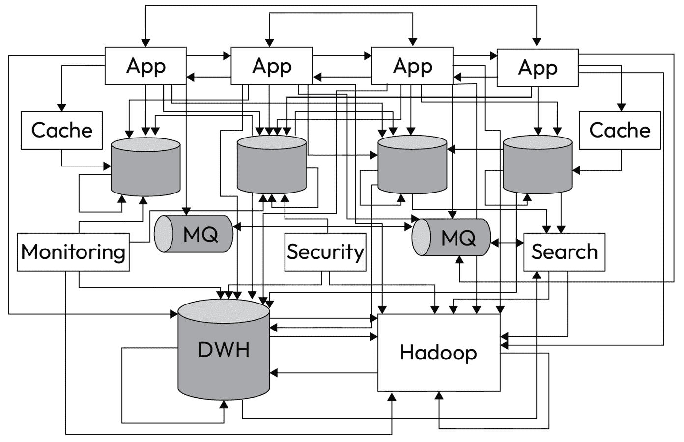
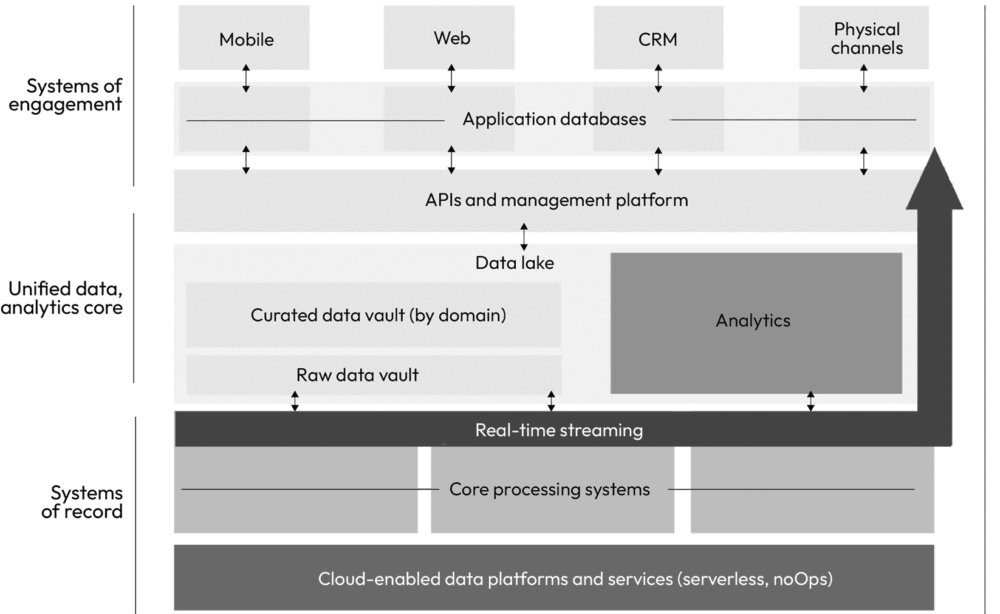

# 第九章：数据架构

在整个组织中设计信息流的模式和最佳流动，有时更多的是一种艺术而非科学。当涉及到优化信息的可访问性、实现治理和推动公司数据使用时，数据架构作为战略驱动因素的使用通常是在信息流动存在问题时才被考虑的。不幸的是，这导致了一个范式的转变，关于传统架构如何在利用公司数据的力量上存在不足。组织随后需要确定如何设计架构，以支持公司不断变化的需求，并采用一个新的范式：优化数据。

传统 IT 架构关注的是 IT 系统和基础设施的设计与实施，以支持业务操作。它涵盖了广泛的技术和组件，包括服务器、存储、网络和应用程序。另一方面，数据架构专注于组织内部数据资产的设计与管理。它涵盖了数据模型、数据标准和数据治理流程的定义。这就是为什么传统 IT 架构通常不能满足数据用户需求的原因：它并非专为他们设计。

传统 IT 架构和数据架构之间的主要区别在于，传统 IT 架构专注于支持业务操作的系统和基础设施，而数据架构专注于数据本身。换句话说，传统 IT 架构关注的是数据如何被收集、存储和处理，而数据架构关注的是数据如何被组织、定义和使用。

| **特点** | **传统** **IT 架构** | **数据架构** |
| --- | --- | --- |
| 关注点 | 系统和基础设施 | 数据 |
| 范围 | 广泛的技术和组件 | 数据模型、数据标准和数据治理流程 |
| 目标 | 支持业务操作 | 提高数据质量、可访问性、安全性和合规性 |

表 9.1 - 传统 IT 和数据架构之间的主要区别

数据架构很重要，因为它帮助组织最大化利用数据。一个设计良好的数据架构可以帮助组织做到以下几点：

+   改善数据质量和一致性

+   提高数据可访问性和可用性

+   增强数据安全性和合规性

+   支持数据驱动的决策制定

数据架构是任何希望充分利用数据的组织的核心组成部分。一个设计良好的数据架构可以帮助组织提高数据质量、可访问性、安全性和合规性。它还可以支持基于数据的决策，并提升业务表现。在设计数据架构时，重要的是要牢记简洁原则。一个简单的数据架构更易于理解、使用和维护，也能帮助提高数据分析的效率和效果。

我们将覆盖以下主要主题：

+   数据架构定义

+   数据架构的价值

+   核心能力

+   构建最佳数据架构能力

+   为成功搭建数据架构

# 数据架构定义

数据架构是指组织的数据系统的设计和结构，包括数据库、数据存储、数据集成和数据管理过程。它是组织整体 IT 基础设施的关键组成部分，并在数据的收集、存储、处理和利用中发挥至关重要的作用。就像建造房屋时，蓝图作为建房的规划一样，在数据治理中，数据架构则作为数据构建的蓝图。数据架构涵盖了数据系统和过程的设计、开发和治理。

## 简单制胜

在设计数据架构时，重要的是要牢记*简洁*的指导原则。复杂的数据架构难以维护和管理，也可能使得从数据中提取洞见变得困难。而简单的数据架构则更易于理解和使用，有助于提高数据分析的效率和效果。强大数据架构的范围包括以下几个方面：

1.  **数据来源**：识别数据的生成或收集地点，无论是来自内部系统、外部来源，还是用户生成的内容。

1.  **数据存储**：确定数据存储的方式和位置，是否存储在传统的关系型数据库、NoSQL 数据库、数据仓库或数据湖中。

1.  **数据集成**：定义将来自不同来源的数据组合和转换为统一格式的过程和机制，以便进行分析和报告。

1.  **数据处理**：决定数据如何处理，是通过批处理、实时流处理还是其他方法。

1.  **数据访问**：为用户和应用程序提供有效访问和检索数据的机制。

数据架构是任何希望充分利用数据的组织的核心组成部分。一个设计良好的数据架构可以帮助提高数据质量、可访问性、安全性和合规性。它还可以支持基于数据的决策，并提升业务表现。

# 数据架构的价值

总体来说，一个设计良好的数据架构对任何希望最大化利用其数据的组织来说都是必不可少的。通过遵循简洁性和可扩展性的原则，组织可以设计出满足当前和未来需求的数据架构。一个良好的数据架构可以帮助组织做到以下几点：

+   **推动强有力的数据治理实施**：通过确保数据得到有效组织、存储和处理，数据架构可以减少冗余和不一致。

+   **提高数据质量和一致性**：通过建立数据收集、存储和处理的标准和流程，数据架构可以确保数据在所有系统中准确、完整、一致。

+   **增加数据的可访问性和可用性**：数据架构可以帮助让数据对用户更易访问，并且便于分析使用。这可以通过开发数据仓库和数据湖，创建数据模型和仪表盘来实现。

+   **增强数据安全性和合规性**：数据架构可以帮助保护数据免受未经授权的访问和滥用。它还可以帮助组织遵守数据隐私和安全法规。

+   **支持数据驱动的决策制定**：通过使数据更易访问和使用，数据架构可以帮助组织基于数据做出更好的决策。这可以带来业务绩效的提升和竞争优势。一个良好的数据架构促进数据分析，使企业能够获得有价值的洞察并做出数据驱动的决策。

+   **确保可扩展性**：一个设计良好的数据架构应该能够随着公司业务需求和数据需求的增长而扩展。与公司战略和数据战略的紧密结合应当使可扩展性得到适当考虑。

+   **满足安全性和合规性需求**：有效的数据架构有助于保持数据安全并遵守监管要求。

+   **推动成本效率**：通过优化数据存储和处理，数据架构可以通过简化存储成本、减少处理量和消除冗余来节省成本。

优化聚合

考虑一个拥有数十年历史数据的非常大的组织。数据通过数百个源系统进入组织，点对点地连接和移动，没有“目标状态”或“北极星”架构。你可以想象，这会导致冗余、数据质量问题、在需要时提取数据的困难，以及整个企业信息的不一致性。

在这个具体的案例中，公司制定了一个计划，通过战略性地逐步优化信息流动。这需要对特定数据集的管理方式、它们如何在组织中流动、需要哪些共享数据（见*第十章*，*主要数据*）以及这些数据应当如何统一进行战略性思考。

在这次构建过程中，有些关键决策效果良好，包括以下几个方面：

+   我们在优化什么？成本？简洁性？聚合？

+   谁负责做出这些艰难的决策？

+   我们将多快重新架构公司？

这些决策被用来定义北极星，从而设计数据架构。当你在为你的组织考虑数据架构时，这些问题可以帮助你定义“目标状态”可能是什么样子，以及你将如何规划实现路径。

## 为什么数据架构常常被忽视

数据架构在组织中常常被忽视，原因有很多，包括对其好处缺乏理解。许多组织没有充分理解数据架构的好处，或者甚至不知道它的存在。许多组织专注于短期收益，比如完成季度收入目标。数据架构通常被视为一种长期投资，因此很难在一开始就证明其成本和努力是值得的。改变现有架构也是一项昂贵的工作，因此，大多数公司缺乏耐心和专注力去实现长期规划。此外，数据架构可能很复杂，且很难知道从哪里开始。这对资源有限的小型组织来说尤其具有挑战性。与此同时，数据架构师的短缺也使得寻找和聘用合格候选人变得困难。

这些挑战通常会导致数据架构被降级为次要任务，或者仅仅是一个参考因素，而不是一个做出决策的约束机制。这往往使得数据和分析专业人员在服务利益相关者时面临更多的困难，因为公司技术环境中的潜在复杂性。

然而，作为数据专业人员，你必须倡导数据架构的严谨性，因为数据架构是任何希望充分利用数据的组织的核心组成部分。一个设计良好的数据架构可以帮助组织提高数据质量、可访问性、安全性和合规性。它还可以支持数据驱动的决策制定，并推动业务绩效的提升。

下面是一些克服数据架构挑战的建议：

+   **从清晰了解你的业务需求开始**：你的业务目标是什么？你需要哪些数据来实现这些目标？一旦你清楚了解了业务需求，就可以开始制定一个满足这些需求的数据架构。

+   **采取分阶段方法**：数据架构是一个复杂的工作，采用分阶段方法非常重要。首先，制定数据架构的高层次概述。然后，您可以分阶段开始实施数据架构的不同组件。

+   **投资培训与发展**：如果贵公司没有内部技能来开发和实施数据架构，您可能需要考虑投资于员工的培训与发展。您也可以考虑聘请顾问来帮助您入门。

| **有用提示** |
| --- |
| 请记住——实现目标状态的数据架构是一个多年的过程，有时需要 5 到 7 年。由于公司不太可能实施完全新的平行生态系统，战略过渡通常会分多个阶段执行。我参与过的最成功的实施通常有多个阶段：第一阶段是可以快速完成的部分，第二阶段是整合或淘汰工具和平台的阶段。后续阶段是必须进行更多实质性变更的阶段，并且需要额外投资。将这些内容不断呈现给做出资金决策的人员非常关键，这样他们可以时刻记住你们的前进方向。 |

同样，衡量数据架构的成功能够越清晰越好，这样管理层可以更清楚地看到数据架构的价值。在接下来的部分，我将分享一些衡量数据架构价值的具体方法，以便您根据这些方法构建业务案例。

## 成功的衡量标准

以商业价值和结果来衡量成功需要结合定量和定性指标，以确保数据架构与组织的战略目标保持一致，并带来实际效益。定期监控和调整对于在业务需求变化时保持数据架构的有效性至关重要。理想情况下，这些衡量标准应由数据架构负责人定义，与首席架构师对齐，并得到数据用户、业务数据管理员和技术数据管理员的支持。企业数据委员会应批准既定架构及这些成功衡量标准。

示例指标可以包括以下内容：

+   **采用情况**：采用新数据服务或预定数据架构组件的用户数量。

+   **数据质量**：由于新设计解决的数据质量问题数量。

+   **需求**：新设计满足的数据需求数量。

+   **成本**：由于新设计节省的复制成本。通过优化数据存储和处理来衡量成本节约。

+   **可访问性**：衡量用户和应用程序访问所需数据的容易程度，方法是测量从请求到工单关闭的时间。

+   **性能**：数据处理速度和/或数据检索效率。

+   **安全性和合规性**：跟踪与安全性和/或隐私法规的合规情况。确保在架构中标识出敏感数据，并且架构能够支持合规要求（例如，不要将敏感数据放在多个地方；作为最佳实践，优先简化并减少存放敏感数据的地点数量）。

+   **可扩展性**：在不进行重大修改的情况下，利用新数据架构的程序数量。

此外，务必设计衡量成功的指标，以量化商业影响。评估数据架构如何助力实现商业目标和任务。这些指标可能包括增加收入、降低成本、提高客户满意度或其他相关的商业成果。根据你的业务不同，这些指标会有所不同。邀请用户、业务和技术数据负责人一起定义商业影响指标是最佳实践。

虽然这不是一个具体的衡量标准，但你应持续收集用户和利益相关者的反馈，并将其用于随着时间推移改进数据架构。你可能希望建立一些“计划”指标，以展示初步进展，例如指导原则的定义、未来状态的初步草案以及所提供反馈的数量。这将展示参与过程的情况，并且是定义阶段成功的衡量标准。

# 核心能力

数据架构需要比以往任何时候都更加灵活和动态。公司发展迅速，而**生成式 AI**（**GenAI**）的快速兴起就是企业需求不断变化的完美例证。你会注意到，接下来列出的能力并没有具体说明你需要部署*哪些*技术。这由你和你的利益相关者来决定。以下能力告诉你在数据架构计划中需要定义*什么*。

## 建立数据架构计划

理想情况下，数据架构师应该向你的首席数据与分析官报告。在一些组织中，你会看到数据架构职能向首席架构师报告；然而，在大多数情况下，这会导致数据架构师对公司数据战略的目标不够深入了解，进而导致不够友好的数据模型。当你的首席架构师能够很好地理解数据的复杂性并且支持优先考虑数据流动的顺畅时，这种模式是可行的。

不论汇报结构如何，你的公司都应该建立一个正式的数据架构项目。应该定义至少两个层级的数据架构：首先是总体的自上而下的数据架构，定义企业范围内的数据架构，包括原则、目标架构，以及全公司范围的赋能；其次，从更为自下而上的角度出发，数据架构师应该嵌入到各个具体解决方案中，以确保各个解决方案按照公司整体的数据架构项目来设计。这两者都至关重要。我曾见过一些案例，其中自上而下的部分由首席架构师负责，而自下而上的部分则由首席数据与分析办公室负责。在对齐良好的情况下，这种分工是可行的，但当缺乏对齐时，分离的方式将不会奏效。

作为数据架构项目的一部分，数据架构负责人应该为数据架构的定义、设计和实施确立一个“北极星”。在我看到的所有成功的数据项目中，这个“北极星”有三个共同要素：强有力的现状和目标模型、明确的角色与职责，以及强有力的高层支持。

## 现状与目标建模

现状与目标数据架构是数据管理中的两个关键概念。现状数据架构是组织数据格局的当前状态。它包括用于管理和处理数据的所有数据源、系统和流程。现状数据架构可能非常复杂，尤其是在部门众多、**业务单元**（**BUs**）众多的大型组织中。目标数据架构是组织希望实现的未来数据格局。它是组织希望未来如何管理和处理数据的蓝图。目标数据架构通常基于组织的商业目标和战略制定。

首先，记录当前状态。当前的“现状”将帮助企业了解当前的整体数据格局。你可以根据需要创建这张图表的详细程度，但要准备定义一个高层次的视图，便于高管理解，同时也准备好适合架构师和工程师的详细视图。如果你的组织像大多数组织一样，现状可能看起来像一团意大利面。这是因为数据集成通常是在没有考虑数据的情况下加入的，随着时间的推移，变得异常复杂：

图 9.1 – 当前状态架构示例

定义一个未来的数据架构绝非易事，尤其是当组织在历史上并未有意识地设计系统、数据或业务流程时。由于创建一个能满足所有需求的目标状态需要大量的跨部门协调，这一过程可能非常艰巨。这将需要妥协、充分的解释以及时间。

一旦组织开发了未来的数据架构，就可以开始制定计划，从当前状态过渡到未来状态。这可能涉及对现有系统和流程进行更改，或实施新系统和技术。以下是数据架构转型中可能涉及的一些变更示例：

+   **整合数据源**：当前数据架构可能包含多个不相干的数据源，这可能使得访问和管理数据变得困难。未来的数据架构可能涉及将这些数据源整合到一个单一的数据仓库或数据湖中。

+   **实施新的数据处理技术**：当前数据架构可能依赖于过时的数据处理技术。未来的数据架构可能涉及实施新的技术，如大数据处理平台和**机器学习**（**ML**）算法，以提高数据处理的效率和效果。

+   **改善数据治理**：当前数据架构可能存在较差的数据治理实践，这可能导致数据质量问题和安全风险。未来的数据架构可能涉及实施新的数据治理政策和流程，以改善数据质量和安全性。

一个目标或未来的架构可能如下所示：

图 9.2 – 目标状态数据架构示例

在这个未来的数据架构中，分析数据与操作数据是分开的。这将使得你的分析团队能够灵活应对业务需求，而不会减慢或影响公司的运营。这是一个我鼓励你们认真考虑的有意图的用例。然而，不要让这成为从简洁性中偏离的第一次。我的猜测是，你们公司会从“仅有”两个数据存储而不是多个存储中受益。大多数组织在开始时，往往拥有数十个，甚至更多的数据存储（有时每个部门都有）。在开始做出更改之前，要认真识别现有数据源及其用途，并明确你们的需求。

# 构建一个最佳的数据架构能力

在本章的前几节中，我们讨论了什么是数据架构、数据架构的价值以及两个主要阶段：现状和目标。在本节中，我将带您一步步构建成功的最佳能力。成功的关键是：在定义架构时要有目的性和意图。

## 建立设计原则

首先，您应该定义一套**数据架构设计原则**。设计原则应当建立起来，以便将所有参与者对齐，集中精力并将设计对齐到一个共同的方法。理想情况下，设计原则将实现以下目标：

+   为混乱增添简单性

+   推动简化思维

+   聚焦讨论

+   确保设计一致性

设计原则应作为设计数据架构过程的基础。将所有参与者与一组核心的、基础的设计原则对齐，将提供一个透镜，以便今后所有设计决策都依据这些原则。设计开始后，回退到既定的设计原则变得困难，因此我鼓励您在开始时就设定这些原则，以避免后期的返工。

数据架构设计原则的示例集合

1.  架构设计应能随着不断发展的商业模式进行扩展。

1.  商业和数据流程将尽可能自动化。

1.  数据将存储供中央使用，并从已建立的授权配置点提供。

1.  数据将根据文档化的业务规则进行对账或“主数据化”。

1.  用户将能够透明地查看数据质量和数据模型的变化。

## 制定架构标准

强大的数据架构项目的标志是定义了一套数据架构标准。数据架构标准设定了对架构元素的治理方式预期，以及批准的模型、访问预期、分发模型和基本数据资产控制，并规定了公司信息的使用。这些标准应当定义任何解决方案中对数据的期望。

根据解决方案的规模和复杂性，您可能需要设定参与、批准和审查流程的预期。例如，如果有人进行小的修改（添加列或向现有解决方案中添加表格），只要他们能够证明自己遵循了数据架构标准，可能无需通过正式流程。另一方面，如果部署的是新的 ERP 系统，则应当采取相反的做法。应创建一个端到端设计，记录当前和未来状态，定义消费模式，建立对新定义或创建的数据集的清晰责任和管理等。您应确保标准至少包括以下要求：

+   元数据管理

+   数据质量

+   数据访问

+   数据分发与消费

这些标准应当指导公司如何做出平台选择，如何选择技术和工具，以及跨组织使用什么样的集成模式，确保与先前设定的设计原则一致。业务和技术数据管理人员应积极参与设计数据架构标准，以确保满足他们的需求。记住——这些标准将决定数据架构的演变，并不会一夜之间改变一切。它们应当作为北极星，指引未来所有设计选择的方向。

建立目标状态

在我的职业生涯中，我见过两个成功的项目（到目前为止），它们利用全公司集体架构的力量，在技术和数据投资方面实现了最高水平的优化。这两个项目*本可以*更加成功。

在这两种情况下，项目成功且毫不妥协地定义了特定的设计原则，从而界定了目标架构；例如，强制性要求全公司范围内使用参考数据，并确保来自单一的真实数据源。这一要求的结果应该会显著提高效率，并便于全公司范围内的数据聚合。然而，实际上，公司对采用要求的态度要“宽松”一些。我们进入变革时，坚定地预期在 24 个月内要求强制采用参考数据，但当我们退出该项目时，这一预期已经放宽，只要求在平台进行“重大”更新时才采用参考数据，这意味着参考数据的真正效益需要几年时间（5 年以上）才能显现。像所有长期项目一样，动力丧失，效益未能早期实现。

在建立目标状态时，至关重要的是利用动力推动变革。这些变革非常昂贵，并且需要明确的关注点来实现期望的**投资回报率**（**ROI**）。

## 与业务架构和 IT 架构的紧密集成

建立强大架构的最佳方法之一是与业务架构、数据架构和 IT 架构紧密集成。大多数公司缺乏强大的业务架构功能。然而，业务架构可以是评估业务运营流程、所需数据以及支持最佳运营的技术的最佳方式。

最佳实践是建立一个**架构委员会**。这个委员会应包括业务、架构、数据架构和 IT 架构的代表。大多数公司没有专注于将这三类架构专家聚集在一起，因此当涉及到业务、数据或 IT 需求时，它们往往不会被整体考虑。通过将这些职能结合起来，公司可以简化并有效地设计出简洁的解决方案。

大多数公司并未关注业务架构，或者假设它是基本操作的一部分。但事实并非如此。架构委员会可以确保任何架构设计从整体上考虑到三个视角。从自私的角度来看，这可以确保数据架构既能支持最佳的业务流程，又能良好地支持技术。如果这两个相关的架构视角中的任何一个设计得不好，数据架构将不会有效。因此，如果你的公司没有架构委员会，应该为此争取。理想情况下，这个委员会应由首席架构师主持，并包含来自业务、数据架构和 IT 架构的代表。

## 将数据架构融入系统开发生命周期过程

理想情况下，你将制定一个未来状态和过渡计划，并获得全额资金和支持，以便在几年内过渡。但现实中，这并不常见。根据公司规模、规模和历史决策，现有状态可能非常难以解开。你将是在飞机飞行时修建飞机，这使得这些类型的计划变得极其复杂。因此，更常见的是看到组织将未来设计原则融入到**系统开发生命周期**（**SDLC**）中，以便随着时间的推移逐步采纳。

唯一能确保此计划成功，并且能够设定完成/结束日期的方法，是让一位推动者持续口头推动未来状态的业务价值，确保未来状态得到执行，并获得执行团队的支持以促使其实现。这不仅仅是在轻松时遵循，而是在困难时也必须遵循。首席信息官可以是你实现这一目标的强有力倡导者，因为他们通常有权批准或拒绝与程序相关的技术架构。确保获得他们的全力支持，以确保公司采纳软件开发生命周期（**SDLC**）以实现最佳成功。

# 为成功搭建数据架构

我相信你已经注意到，我在本章中并没有定义*你的*数据架构应该是什么。我给你提供了工具、理解和流程，帮助你为数据架构项目的成功奠定基础。技术变化迅速，公司的需求也各不相同。只有你能定义你的公司需要使用什么来构建符合数据和分析需求的最佳架构。我无法告诉你哪种架构适合你的公司；只有你能做出这个决定。

然而，有一些关键因素可以帮助你取得成功。这些*因素*在大公司和小公司中都是一致的，并能确保你拥有一个成功的项目：

1.  **任命首席数据架构师**：每个公司都应该有一个专人来推动公司内适当的数据架构。虽然你可能不会使用这个头衔，但你应该明确角色定义，并确保这个角色有权做出整体数据架构的决策。

1.  **定义程序例行工作和节奏**：建立关键的项目论坛、报告和价值故事讲述，以确保数据架构项目被视为一个正式的程序。

1.  **邀请合适的人参与**：公司历史学家，他们对公司做出决策的历史有深刻理解，并且拥有前瞻性视角，是此项工作的优秀支持者。他们了解为何做出某些选择以及如果做出改变会带来哪些后果。他们能够在紧迫性和深思熟虑的影响之间取得平衡。包括来自公司各部门的业务架构师、数据架构师和 IT 架构师。

1.  **获得高层支持**：确保你有合适的支持者。通常来说，这个人是首席信息官或首席技术官。确保他们愿意在公司高层为你代言，并能为项目提供长期的资金支持。

1.  **与首席架构师和首席数据分析官对齐**：最终，首席架构师必须理解强大数据架构的重要性，并明白他们需要你推动公司范围的架构成功。你的首席数据分析官也需要为此项工作提供支持。理想情况下，首席架构师和首席数据分析官共同主持这个项目，首席信息官或首席技术官作为执行赞助人。

1.  **保持长远的思维**：你必须记住，这些项目需要时间；它们是长期的，并且需要大量投资。它们不会一夜之间完成。你必须有耐心。

1.  **进行战略性投资**：选择一个高影响、结果较快的窗口来展示投资回报。首先投资于那些较小但能带来影响的部分，待你展示了成果后，再投资更大、更昂贵的组件。不要等到最终结果才展示其价值。

1.  **嵌入 SDLC 流程**：将程序绑定到 SDLC 流程中，以确保你随着时间的推移采用理想状态。

通过任命合适的人选、定义强有力的例行程序和节奏，并遵循严格的优先级排序过程，数据架构可以成为推动你数据和分析职能发展的战略驱动力。这是一个长期的过程。它需要长远的思维以及来自组织高层的持续支持才能成功。作为数据专业人员，你在数据和 IT 架构的成功以及推动简单、优雅解决方案方面将产生重要影响，这将推动公司优化数据。

# 结论

本章全面概述了数据治理背景下的数据架构。我们探讨了明确的数据架构在确保数据一致性、可访问性和可靠性方面的关键作用——这些都是有效数据治理的核心支柱。我们考察了各种架构设计因素，包括数据组织模型、数据存储解决方案和数据集成策略。你现在应该对以下领域有一个清晰的理解：

1.  数据架构的重要性，包括为什么它在构建成功的数据解决方案中是必需的

1.  如何设计数据架构功能

1.  实施过程中的具体需求

1.  如何设计数据架构解决方案

理解这些元素及其与组织特定需求的对齐，对建立稳固的数据基础至关重要。良好设计的数据架构有助于提高数据质量，简化数据管理流程，并支持数据治理工作的顺利进行。在接下来的数据治理旅程中，后续章节将探讨这些概念的实际应用。我们将深入研究数据治理框架、政策和实施策略，帮助你掌握有效治理组织数据的工具和知识。
