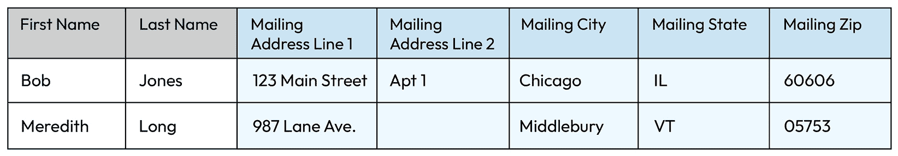

# 第十章：主数据管理

任何组织的核心能力之一是标准化其最核心、最关联的数据：**主数据和参考数据**。通过主数据，数据被多个部门使用且多种用途标准化和清洗，以造福整个组织。我们将从基础开始：什么是主数据？为什么它至关重要？是什么使其如此复杂和难以部署和采用？我们将深入探讨不同类型的数据以及它们与客户数据平台的区别。

我将解释如何优先考虑这种数据治理能力以及如何实施强大而集中的主数据解决方案，这将影响并提升企业数据为战略资产的能力。到目前为止介绍的所有能力将被编织到这一强大的能力中，以将它们紧密联系在一起。

在我们深入讨论之前，请注意使用术语“主数据管理”。

在撰写本文时，“主数据”作为一个术语和能力通常是行业中的突出术语。在“主人”的内在和历史根源中，“主”意味着对来自其他来源的某物的“所有权”。我们已经开始看到其他行业（如房地产列表中的主卧室，现在普遍被称为“主卧室”或“大卧室”）从术语“主”中逐渐移开。我对这个术语有很深的感受，并敦促整个行业改变这一点。我强烈建议我们采用“主要”数据，来指代这种类型的数据。

如果我们不改变它，我们就在选择它。作为一个专业人士，我不希望我们继续接受这种根源于种族主义的对数据类型的“所有权”。我选择将这种类型的数据称为“主要数据”，并敦促您在您的公司中采纳这个术语，以便我们共同改变这个行业。

# 定义主数据管理

主数据管理是核心数据治理能力，集成了一系列用于创建特定类型数据的单一统一视图的过程和技术。这种能力有助于确保这些特定和关键类型的数据在整个企业中具有一致性、准确性和可访问性。主要数据的示例包括：客户数据、产品数据、供应商数据和联系人数据。由于这些数据类型（客户、产品等）通常由组织中的各个部门创建，它们需要特殊处理以统一和供应，以便整个组织能够对数据拥有相同的视图。没有主数据管理，公司将在整体一致性、准确性和质量方面遇到困难，从而导致客户体验不佳。

示例 – 客户体验

假设您是某大型金融机构的客户，您在某分行开设了支票账户。几个月后，您拨打 1-800 电话，询问有关账户的问题。自从您开设支票账户以来，您还开设了抵押贷款账户并搬进了新家。当您致电客户服务查询支票账户时，客服要求您为安全起见验证您的地址。问题是，您的支票账户上的地址是您以前的地址。

如果没有客户主数据管理，当新产品售给客户时，客户地址不会在企业内得到更新。在这种情况下，您可能需要亲自到当地分行正式更新地址，而不是通过主数据管理能力自动更新。

主数据管理是企业中建立的较为复杂的能力之一，尤其是在大型企业中。然而，一旦完全采用，该能力对您的组织在规模化运营中提高效率的能力具有最重要的影响。建立**主数据管理（PDM）**能力使您的组织能够：

+   **识别和整合**。建立 PDM 能力使您的公司能够识别主要数据的来源，将数据整合到单一流程中，然后将数据更好地复制回原始来源，甚至比数据进入该能力时更为准确。这消除了数据孤岛，使整个公司能够基于相同的准确数据集进行工作。

+   **清理和丰富**。通过将主数据引入中央能力，公司能够通过评估数据质量、修复数据问题以及用第三方数据丰富数据，从而提高数据的质量和可靠性。这个过程去除了不一致、错误和缺失的数据。您还可以向记录中添加额外的数据（例如，人口统计信息、合规标记）。

+   **标准化和治理**。主数据管理使组织能够通过创建和执行数据质量规则来标准化和治理其主数据，以确保数据一致、准确且可靠。PDM 增强了公司最关键和核心数据的信任度。

+   **共享**。由于主数据由中央部门管理并在公司范围内提供，PDM 流程使得公司更容易将高质量的主数据共享到需要高度信任数据的其他系统中。这使得组织能够基于统一的数据做出高质量的决策。

在下面关于核心能力的部分中，我们将探讨如何在您的 PDM 部署中启用这些能力，并充分挖掘 PDM 投资的全部价值。

## 参考数据

参考数据管理是一种标准化数据类型，推动组织内部的一致性。参考数据的示例在各公司之间是相同的，例如：邮政编码、城市名称、行业代码（例如 NAICS 或 SIC），或者可能是某个公司特有的，如会计科目表。无论你的参考数据集是什么，这些代码都被视为一种主数据类型，因为公司遵循主数据的相同特征，包括合并与标准化、中心化增强、去重和简化（意味着数据由中央团队负责，服务于整个组织）。外部派生的参考数据可以通过政府机构（例如邮政编码）或第三方（例如邓白氏）获取。参考数据有许多供应商。

参考数据管理的一个常见业务支持者是财务部门。通常，财务部门是各种因素信息的聚合中心，例如地理位置、行业等，这些都可以通过参考数据的一致性得到改善。参考数据转型通常作为另一项重大转型的一部分出现，通常是企业资源规划（ERP）转型，在此过程中，公司被迫审查所有核心数据，以便运营、财务报告以及提供监管报告。

在我为每家公司部署参考数据时，这个需求通常出现在 ERP 或财务报表设计过程的发布规划阶段。财务团队意识到他们有多个相互冲突的参考数据版本，并需要支持将数据转化为标准模型。这时，数据团队通常会介入。参考数据通常可以相对快速地部署。一旦购买了软件并搭建了基础功能，发布参考数据并不算困难。由于参考数据是缓慢变化的数据，并且变化频率不高，一旦你定义了数据定义、指定了数据管理员，并具备了发布数据的能力，实际上将数据投入生产是一个相对快速的过程（尤其是与其他类型的主数据相比）。

## 主数据与参考数据

虽然参考数据是一种主要数据类型，但由于参考数据的变化较慢，它通常会单独管理。参考数据之所以称为“慢变”，是因为它不会频繁变化。以行业代码（如 NAICS 代码）为例，虽然有新兴行业，但这些代码通常用于报告或销售规划等，变化不频繁。因此，NAICS 代码每五年更新一次。参考数据还具有有效值数量的有限性。例如，行业代码或区号的数量是有限的。可以通过将参考数据理解为从下拉菜单中选择的内容来更好地理解这一点。它可能是一个非常长的下拉菜单，但仍然是一个下拉菜单。而主要数据（例如客户数据）可能具有无限数量的记录或有效值，并且随着时间的推移不断增加。

# 主要数据类型

除了参考数据外，还有其他类型的主要数据。主要数据按类型进行管理，每种类型都有独立的管理平台或系统。然而，这些类型中的每一种可能包含一些相关的参考数据。例如，客户数据可能包含客户的邮政编码，该编码可以从参考数据系统中定义的有效值中进行选择。

## 客户

客户主要数据在面向客户的部门（如销售、营销、收入等）中非常重要。未标准化客户主要数据的公司通常难以全面了解客户。缺乏客户主要数据系统的明显标志是，各部门对同一客户的信息不同，且很难看到公司内的完整客户旅程。销售部门可能对客户（如地址）的信息与收入、运营或营销部门不同。如果出现这种情况，这表明公司从实施和部署客户主要数据系统中可以获得好处，以统一公司内关于客户的信息。

客户数据可以来自多种来源，包括直接来自客户、第三方增值服务、社交媒体服务（如 LinkedIn）、以及营销和活动。联系数据（我们将在下文讨论）也是客户数据的重要来源。您还可以通过订单管理从销售流程中获取客户信息。

客户数据的典型支持部门通常是销售、客户成功或销售运营。由于这些数据主要分布在这些领域中，因此为此能力指定一位执行数据领域负责人通常比其他类型的主数据更加困难。在我看来，这通常取决于组织内的政治力量和资金。无论哪个团队拥有更多的权力、权威和预算，通常就会成为支持方。需要提醒的是：这种支持方相对容易确保客户主数据管理平台主要服务于他们的需求，而不是其他部门的需求。你需要确保这个平台上的数据服务于公司，而不仅仅是某个部门。一个有效的方式来应对这种偏见是利用现有的治理例程和节奏（如企业数据委员会）来规范发布计划并按优先顺序满足业务需求。

当销售和客户服务团队开始看到销售人员、客户服务代表和客户在其体验中表现出较低的质量评分时，客户主数据管理通常成为优先事项。低质量和矛盾的客户数据使得销售人员在处理交易、续签合同以及使用正确的信息与客户互动时感到困难。试想一下，你正准备给客户打电话，但在客户关系管理平台中却没有电话号码。这种情况时常发生。

随着公司发展，数据分布在更多的系统和平台中，保持数据的一致性变得越来越困难。由于客户是公司运作的核心，拥有高质量、可靠的客户信息来支持业务运营变得更加重要。

## 产品

与客户数据类似，产品数据是集中的、统一的数据，管理产品信息时需要这些数据。产品主数据可能包括产品名称、产品描述、产品特性（例如颜色、重量、尺寸）、制造商、型号、价格和图片等信息。这些信息被销售、运营、供应链管理和收入运营等多个部门使用。

产品主数据可以存储在多个地方，包括**企业资源规划（ERP）**系统、**产品信息系统（PIS）**和**客户关系管理（CRM）**系统。然而，重要的是要拥有一个单一的、集中的产品主数据存储库，以确保所有消费系统中的数据准确性和一致性。

产品数据通常来源于多个地方，包括供应商目录、网站、ERP 系统以及内部生产数据。这也是主数据管理至关重要的原因之一：数据来源于多个位置，在单一位置（主数据平台）进行标准化和丰富，然后推送到需要这些数据的系统。如果没有主数据平台，那么每个单独的系统都需要单独进行这项工作，这将导致成本、复杂性的大幅增加，并且跨系统的一致性差，造成汇总和报告异常困难。

产品数据的典型业务赞助商包括工程或产品管理、法律和合规部门或收入运营。由于产品主数据在公司内具有高度的普遍性，并且根据行业差异较大，因此像客户主数据一样，产品主数据的赞助商相对难以确定。按照上述相同的流程操作客户主数据，使用你的治理委员会来帮助确定赞助商。

## 供应商[或供应商]

供应商主数据管理（有时称为供应商主数据）是一个专门用于公司采购商品和/或服务的主数据平台。它可能包括关键信息，如供应商名称、地址、公司或行业代码数据、支付条款、使用的货币等。

供应商主数据用于组织内多种功能，包括采购、应付账款、供应链管理，并且也可能被人力资源用于承包商信息。该平台上的数据可能会被 ERP 系统、采购系统和供应商关系管理系统使用。像其他主数据平台一样，供应商主数据有许多潜在的数据来源和许多潜在的消费系统，这推动了信息需要集中管理的需求。

## 联系人

联系人主数据是公司所有联系人（包括客户、潜在客户（即销售线索）、员工、供应商和合作伙伴）的统一视图。联系人数据包括联系人姓名、地址、电话号码、电子邮件地址和公司隶属关系等信息。联系人主数据通常被公司内多个部门使用，例如销售、市场营销、财务、客户服务和人力资源。联系人主数据的赞助通常由市场营销部门提供，因为他们负责通过联系人获取和创造合格的潜在客户。

联系人主数据用于多种业务流程，包括：

+   **潜在客户生成**。联系人主数据用于识别和营销潜在客户。

+   **销售和市场营销活动**。联系人主数据用于创建和执行针对潜在客户的市场营销活动。

+   **客户服务**。联系人主数据用于提供客户支持和解决客户问题。

+   **人力资源**。联系人主数据用于管理员工记录和招聘新员工。

+   **会计**。联系人主数据用于支付费用和供应商。

联系人主数据存储在各种系统中，包括 CRM、ERP 和人力资源系统。数据来源包括各种渠道，如名片、邮件列表、社交媒体、联系人本身、事件注册等。

# 建立最佳主数据管理能力：成功的核心能力

关于主数据管理，最大的误解之一是围绕什么样的功能使一个平台或系统可以被认为是主数据管理功能，而不仅仅是其他平台。有一些核心功能是主数据管理系统独有的，如果没有这些功能，就无法实现真正的主数据管理。非专家常常用“主”或“主系统”来定义记录系统，或仅仅是定义为该数据类型的‘首选’来源。单凭这一点并不能构成主数据管理。要成为主数据管理系统，必须具备本节中所列的功能，首先是去重。

## 去重或去重处理

也被称为“匹配与合并”，**去重**在主数据管理中是识别并合并重复数据记录的过程。如果您的主数据管理平台没有提供这个功能，那么您就没有实现主数据管理。这个功能是主数据管理的关键部分，因为它确保了组织的数据是准确、一致和完整的。重复数据可能由于多种原因而产生，但通常是因为相似的数据被输入到多个系统中，输入错误、在不同系统中更新不同，或来自不同来源（例如，LinkedIn 与事件出席名单）。

### 去重方法

主数据管理系统有几种方法可以进行去重，从而实现每个客户、产品、供应商或联系人只有一个记录的目标。

1.  **模糊逻辑**。模糊逻辑是一种人工智能技术，用于匹配不完全相同的数据记录。该逻辑能够检测错误，例如拼写错误、缩写和格式不同等。

1.  **匹配算法**。匹配算法通过比较记录，使用姓名、地址、电话号码和电子邮件地址等多种因素来识别可能的重复记录。

1.  **人工审核**。人工审核通常是 PDM 功能中必要的，以确认两个记录是否为重复记录。对于未匹配的记录，需要一定程度的人工审核，具体取决于模糊逻辑或匹配算法的质量，你可能需要较多或较少的人工审核。这通常是决定 PDM 运营团队规模的主要因素，负责审核那些未通过去重方法匹配的潜在重复记录。

你可以通过衡量“未匹配”记录的数量来查看去重过程的效果，意思是，在去重过程开始之前，你开始时有多少记录。这是从源系统进入 PDM 系统的记录数量的总和。对于大型企业，这可能是 1 亿到 2 亿条记录或更多。我们来看一个简单的例子。

图 10.1 – 示例去重过程

在上面的示例中，我们从三个不同的系统中获取数据，每个系统声称拥有客户数据。正如你所看到的，每个系统对客户的记录数量不同。在每个系统中，可能会存在平台内部以及平台之间的重复数据。当我们将数据发送到中间的 PDM 平台时，去重过程会在这里运行（参见上文“去重过程”，这是 PDM 中的众多核心功能之一），该过程会标准化并去重 PDM 所消费的所有记录中的共同记录。

当数据推送到右侧的消费系统时，它们都会接收到更新后的客户记录，已去重并准备好使用。你可以设置数据流，让左侧的源系统也接收到更新后的去重数据，但这取决于你的业务需求。

#### 衡量成功的指标（内部 – 数据团队）

1.  降低重复记录的数量（计数）

1.  提高数据存储效率

1.  存储成本节约

1.  节省管理重复或冗余数据的时间

1.  提升数据质量

1.  客户数量的准确性（改进评分）

#### 衡量成功的指标（外部 – 利益相关者）

1.  提高分析的准确性

1.  提升客户成功评分（通过呼叫中心代表更容易识别客户，并看到更统一、更准确的客户视图）

1.  降低成本（例如，单一位置的丰富服务成本与多个位置相比。通常公司会多次购买相同的丰富服务而没有意识到。）

1.  降低营销成本（从营销到有效联系人一次性发送，而不是多次发送，或者避免使用错误的联系信息）

## 常见定义

建立强大的主数据系统的第一步是让公司达成共识，定义共同的标准。首先，你需要为你的组织定义“客户”的含义。这听起来简单，但实际上相当复杂。

客户数据定义问题

我参与的第一次客户主数据管理部署中，我们花了 18 个月（不是开玩笑！）在公司内外进行合作，定义“客户”是什么。我们在一些定义问题上争论不休，比如是否需要客户是活跃的，或者最近 12 个月有过购买是否足够。什么才算是“活跃”？他们需要购买什么？仅仅有一个账户就足够吗？如果账户没有存款（例如）呢？

在我参与的第二次客户主数据管理部署中，我直接找到了客户数据的数据领域负责人，并向他提出了一个定义。他做了一个小修改，我们共同批准了它，并向相关利益相关者宣布了这个定义。整个过程不到 18 分钟。与我第一次的经历形成了鲜明的对比。

什么是正确的做法？你需要为你的公司做出这个决定。但我建议你利用数据治理例行程序和报告流程，在进入元模型设计之前就将定义固化下来，以减少后续的返工。

你需要设置一个过程，定义每个客户记录的数据属性将如何**理顺**（其他人可能称这个过程为“主控”或“主控管理”，但像数据类型一样，我倾向于使用一个更具包容性的术语）。对于每个属性，你需要有一个定义，以便在公司内部达成一致，这样当你在报告、系统和数据目录或字典中引用它们时，大家就能有共同的词汇和理解。

## 黄金数据源归属

你的主数据管理平台将会有一组有限的属性，针对每个记录进行理顺。现在不是将 200 个属性放入主数据平台的时候。请记住，目的是标准化核心属性或你希望在公司内部推动一致性的常见属性。它并不打算成为一个客户数据平台。我们将在本章稍后的内容中更详细地讨论它们之间的差异，但目前要注意，这只是与客户相关的核心数据，而非所有客户相关的数据。

基于我的过往经验，我的目标是理顺不超过 50 个关于客户的核心属性。这个数量对你们公司来说可能看起来很多，也可能不多。这个数字可能迅速增长，尤其是当你开始考虑一些常见属性时，比如：

+   客户唯一 ID 号码

+   名字

+   姓氏

+   送货地址街道第 1 行

+   送货地址街道第 2 行（注意：可能包括公寓号或楼号）

+   送货城市

+   送货地址州

+   送货邮政编码

+   送货国家

+   邮寄地址街道第 1 行

+   邮寄地址街道第 2 行

+   邮寄城市

+   邮寄州

+   邮寄邮政编码

+   邮寄国家

+   国家代码

+   区号

+   电话号码

正如您所见，当您开始包括像运输地址与邮寄地址（+6 个新属性）这类差异时，情况会迅速变得复杂。您的业务模型将推动您所需属性的类型（B2B 还是 B2C）以及行业（例如，性别和/或出生时指定的性别对您的产品是否相关？如果您从事医疗行业，可能是相关的，但如果您从事技术销售，这可能就不那么相关了）。

对于这些属性中的每一项，您需要定义每个属性背后的含义。我还建议您在程序中此时明确每个属性的数据管理者是谁，可能会有所不同。例如，销售中的客户名字、客户姓氏和邮寄地址属性可能由一位数据管理者负责，但您的运输属性可能来自履行或收入运营团队。每个属性应该指派一个数据管理者，负责和关心这些数据。

## 层级结构

层级结构是主要数据背后的基础能力之一。主要数据的独特功能之一是能够提供**多层级管理**，跨公司进行管理。多层级管理是指能够应用多种方式来汇总相同的基础数据，这些数据已被标准化（或合理化）以满足独特的业务需求。客户数据的常见层级包括：

+   法律实体层级

+   销售层级

+   账户层级

+   位置层级

+   组织层级

层级结构还需要业务数据管理员和技术数据管理员。业务数据管理员应该定义层级的含义是什么，以及层级的规则是什么。有些可以由第三方定义（例如，法律实体），而其他则由业务定义并且是每个公司独特的（例如，销售层级——即公司如何划分客户进入不同的销售区域）。

组织可以拥有无限数量的层级，但我建议您部署和管理最少数量的层级。鉴于业务的快速变化和所需的调整，它们可能相当复杂。如果您的公司采用季度销售周期，他们可能会每季度划分一次销售区域，因此，您的销售层级可能会像季度一样频繁变化。

记住

PDM 的目标是为您的组织标准化常用数据，因此，如果您部署一个层级类型的多个版本，您就违反了主要数据管理的核心原则：标准化。

## 信任逻辑

对于每个你构建的主数据管理平台，你将定义**信任逻辑**。信任逻辑是用于确定主数据可信度的规则和流程。它对于数据模型的成功至关重要，因为它定义了你的数据如何整合，以推动准确性、一致性和可靠性。每家公司都有独特的方式来定义这个信任逻辑，最终的模型应该申请专利，因为它具有专有性质。特别是当使用了独特的技术时，你应该考虑保护这个模型。

在定义你的信任逻辑时，你需要查看你所识别的源系统中的原始数据。例如，假设你已经识别出公司内仅有的两个数据源，这些源将为你的客户主数据管理平台提供数据。你查看系统 1，看到的数据可能是这样的：

表 10.1 – 源数据：系统 1

系统 2 中的相同数据可能是这样的：

表 10.2 – 源数据：系统 2

我们在这两个系统之间也存在标准化问题：

1.  Mary 和 Meredith 在客户的名字上不一致。我们如何知道哪个是正确的名字？这两者是同一个人吗？还是两个人住在同一地址？

1.  第二个客户在任何系统中都没有邮政编码。我们将如何找到这个信息？

1.  系统 2 只有一个地址行，因此公寓号被附加到邮寄地址字段中，而不是像系统 1 中那样放在第二个字段里。

现在，如果这些是我们唯一的两个客户，我们可能可以逐一联系并验证他们的准确信息，手动更正这些数据。如果你有一千个客户呢？如果你有一百万个客户呢？1.5 亿个客户呢？手动更正数据已经无法扩展。这就是为什么我们需要自动化的主数据管理能力，帮助我们提高核心数据的质量和可靠性，并能满足我们业务的速度和规模。

我们定义信任逻辑的第一步是确定我们将使用哪个系统作为每个属性的来源。每个属性可以独立于其他属性进行定义。为了说明这个例子，我将使用两种不同的灰色来描绘下表中的数据差异，展示我们在这个例子中如何获取数据。记住，你可能有数千行或数百万行数据，而我的示例中只有两条记录。

表 10.3 – 每个属性来源的示意图

在这个示例中，名字属性和姓氏属性来自系统 2，而其余五个字段来自系统 1。为什么？简而言之——这取决于你。通常，会对各个系统的数据质量进行评估，以决定哪个系统的数据质量更高。

信任逻辑的另一个因素是，当第一个选定的系统提供空值或空白时，您还可以定义使用次级系统。例如，如果系统 2 的名字字段为空，您可以配置信任逻辑，首先从系统 2 拉取名字数据，如果为空，再从系统 1 拉取名字数据。您可以为每个属性定义 1:M 数据源，并定义希望从哪个顺序拉取数据。这种独特的信任逻辑是针对您组织的特定需求设计的。

### 注意事项

在构建信任逻辑时需要考虑许多因素。为了确定哪些来源先被信任，哪些后被信任，应该考虑以下因素：

+   来源系统。如果提供数据的系统比其他系统具有更高的完整性，您可能会考虑优先从更具完整性的系统中获取数据。

+   数据的年龄。较旧的数据往往不如较新的数据可信，因为它更可能过时或不准确。

+   完整性。不完整的数据可能比完整的数据集更不可信。您可能需要考虑某个来源是否具有更完整的信息。

+   一致性。与其他数据更一致的数据更可能是可信的。

+   变化。变化频繁的数据比稳定的数据更不可信。

+   数据是如何收集的。例如，如果数据是通过手动的注册表收集的，而不是数字化收集的，数字数据在大多数情况下更可能是准确的。

### 它是如何工作的？

信任逻辑可以用于为每个数据属性按来源系统分配信任分数。然后，可以使用该分数来确定数据在去重过程中的使用方式，以及该属性的可信度。信任逻辑还可以用于自动化数据质量流程。该逻辑可以自动识别在进入主数据管理去重流程之前不准确的数据。这有助于提高主数据的整体质量，使其更可靠。

## 集成

在创建主数据管理平台时，定义目标架构（即使是概念性的）时的早期步骤之一是确定所需的集成。我通常从左到右考虑这个问题（左侧是输入集成，右侧是输出集成）。集成不再是那么简单。许多将从图表左侧进入平台的系统，也将接收输出。这被称为双向集成。之所以是双向集成，是因为进入主数据管理平台的数据经过标准化、去重、增强后，再被推回到源系统。

图 10.2 – 集成模型示例

## 第三方质量增强

第三方增强服务是从外部机构购买的数据文件。使用第三方增强服务的目的是提高你公司内部数据的质量。

回到我们的示例，在客户主数据平台的第二条记录中，Meredith Long 的邮政编码缺失。可以使用第三方地址增强服务来提升客户主数据管理平台中的地址质量。结果输出可能如下所示：

表 10.4 – 丰富地址的示例

在这个例子中，增强服务能够为第二条记录提供正确的邮政编码。同样，记住可以通过简单的搜索来填充一个缺失的字段，但当你在大型企业规模上运作时，这些服务替代了成千上万小时的人工数据质量清理，通过使用第三方增强服务来提高数据质量。

在构建客户和联系人主数据的过程中，你可能会订阅数十种第三方数据增强服务，以确保拥有尽可能高质量的数据。每种服务都有其优缺点，因此在使用每种数据增强服务之前要明确你希望实现的目标。它们可能会相互矛盾。确保你有明确的流程来评估数据增强服务的质量，哪些服务你会优先信任，以及它们如何融入到你的匹配和合并流程中。

## 消费模型

作为主数据管理计划的一部分，你需要定义如何指导用户消费数据。由于主数据的特殊性，防止低质量数据进入你的 PDM 平台至关重要。因此，提供一个标准化的消费模式将帮助你的用户在不影响平台的情况下获取他们所需的数据。

通常，你需要同时满足操作性和分析性用户的需求。这意味着你需要定义这些用户类型的需求，并支持两者的消费模型。例如，在操作性用例中，你可能需要考虑像《萨班斯-奥克斯利法案》这样的监管报告要求，但在分析性用途上，你可能能够支持一个更为宽松和灵活的控制框架，这样可以更快速、无缝地处理数据以支持分析。

你很可能会将主数据推送到数据湖和/或数据仓库中以支持分析，同时将数据推送到你的 ERP 和 CRM 中以满足操作需求。你也可以提供一个发布/订阅（pub/sub）选项，以便在你的生态系统中分发数据。

我建议根据公司需求定义消费模型，并强制执行一项政策和技术流程，确保数据不再被进一步提供，以保持数据的技术完整性。如果不执行严格的消费模型，你就有可能重新创造你本来要解决的问题：企业中主要数据的不一致性。

# CRM 与 PDM

技术人员和业务用户常常混淆这两种平台。为澄清一些误解：这两个平台并不相互竞争。恰恰相反，它们互相支持。可以把 CRM 和 PDM 想象成人体的心脏和肺脏。两者都必不可少，都需要良好运作以确保最佳健康。CRM 和 PDM 也一样，它们是相互优化的。

## 什么是 CRM？

客户关系管理平台或 CRM 平台是一个使销售人员、客户服务团队和营销人员能够看到客户 360 度视图的系统。CRM 帮助公司跟踪客户互动，管理销售，提供客户支持，并自动化营销活动。CRM 帮助企业提高客户满意度、增加销售、降低成本、改善运营并做出更好的业务决策。

虽然 CRM 确实包含了通常在客户主数据管理平台中发现的大部分数据属性，但 CRM 并不是为了促进数据的丰富化和重用而设计的，也通常没有在整个公司用例中促进数据丰富性和重用性的治理方式。CRM 往往偏重于销售周期，而不是法规或风险报告、分析或收入运营。

根据 Gartner 的说法，“避免使用 MDM 的 CRM 领导者将得出错误的结果，这会让客户感到烦恼，导致潜在收入减少 25%”[1]。

## 关键区别

CRM 和 PDM 平台之间存在一些简单而深刻的区别。CRM 系统可用于识别和优先排序潜在客户，而 PDM 系统则用于确保潜在客户信息的准确性和完整性。CRM 将用于跟踪客户互动和购买情况，而 PDM 将用于创建客户信息的单一视图。PDM 平台将用于创建和管理层次结构，而 CRM 系统则会利用这些层次结构，从层次信息中创建更具针对性的营销活动和产品推荐。

| **特征** | **CRM** | **PDM** |
| --- | --- | --- |
| 主要目的 | 管理客户互动和关系，支持销售、市场营销和客户成功/支持。 | 管理主数据 |
| 核心数据 | 客户联系信息、销售潜在客户、客户支持工单。 | 客户数据、产品数据、供应商数据、员工数据。 |
| 主要特征 | 联系人管理、潜在客户管理、销售管道管理、客户支持、营销自动化 | 数据去重、数据增强、数据质量管理、层次结构管理 |
| 典型用户 | 客户执行人员/销售领导、市场团队、客户服务代表 | IT 团队、数据治理团队、商业智能团队 |

表格 10.5 - CRM 平台与 PDM 平台的区别

两个平台对组织都有价值，但它们服务不同的用户，具有不同的功能。两个平台一起使用时，效果更佳。

# 主数据管理的价值

主数据管理最难解决的挑战之一并不是平台的部署或复杂的集成，而是构建业务案例，包括清晰阐明主数据管理投资的价值。由于任何主数据管理平台的复杂性（无论是客户、联系人、供应商等）、数据源的数量以及采用情况的差异，业务相关方可能很难理解如此巨大的财务投资将如何带来商业成果。

大多数 PDM 投资会失败，当业务价值未能在项目初期清晰地记录下来时。在一些更具挑战性的实施中，公司未能理解投资价值的原因在于，业务案例主要是从技术角度出发，而非从业务角度出发。虽然从纯 IT 角度投资 PDM 有充分的理由（仅效率这一因素就很有说服力），但由于成本相较于其他投资通常较高，业务用户往往难以理解为何它是优先事项，因此 PDM 往往会在投资优先级清单中被推后。

相反，当一个强有力且清晰的业务价值故事被构建出来时，我看到 PDM 投资会跃升为优先投资清单的最顶部。我的建议是：在推进之前，花时间彻底阐明业务价值故事。业务案例的力量将帮助你在实施的漫长过程中，直至数据被采纳到最终系统中。

## 构建业务案例

在编写业务案例时，我建议与数据的使用者（你的相关方）密切合作，定义通过交付强大的主数据管理解决方案所期望的业务目标和成果。首先，定义一个强有力的目标声明，以支持项目的发展。

例如，您可能想说如下内容：

“我们的主数据管理计划将提供基础和根本的数据管理能力，帮助公司转型，并在员工、客户和合作伙伴需要时，为他们提供高度可靠和值得信赖的信息。”

很难反驳这样一个目的声明。大多数利益相关者都会同意，但也会挑战你更具体。这时候你的目标就显得尤为重要。你应该为 PDM 项目定义 3-5 个核心目标，这些将是你为利益相关者交付的核心内容。以下是一些示例：

+   建立明确统一的定义，并实施统一的客户数据模型，确保高质量和丰富的客户数据适用于企业范围的使用。

+   创建一个客户的单一统一视图，包括每个客户的唯一标识符、最细粒度的黄金源归属，并采用多层次管理以支持销售、营销、客户支持和收入运营的需求，确保一致性和可信度。

+   建立产品的统一视图，包括唯一标识符、黄金源归属和层级关系管理，以支持产品系列、销售和基于属性的定价。

## 项目范围说明

你应该非常明确地区分什么是项目中的内容（将交付的部分）与什么是项目后期的日常业务工作（BAU）。例如，通常将主要数据管理平台发布的数据采用作为项目的初步内容，但不会涉及公司所有系统，且不会永远进行。公司倾向于定期部署新技术，如果你让 PDM 项目持续运行以支持无期限，项目将永远无法完成。我建议在项目内进行前几个或关键系统的采用，一旦你证明了推动数据采纳（即，数据消费）到目标系统的有效方法，你就可以完成项目并将其余工作推入 BAU。

## 能力声明

在构建项目时，你应当明确告知利益相关者你将部署的具体能力。以下是你可能想使用的一些核心能力声明示例：

+   黄金客户记录与唯一 ID

+   单一数据源

+   唯一客户标识符的分配

+   客户标准化与准确性验证

+   验证过的血统透明性

+   客户状态（当前、曾用）

+   客户维护、工作流与管理

+   客户查找搜索功能

+   添加、更新、删除客户

+   第三方数据丰富

+   多层次管理

+   搜索并分类客户关系（即客户、合作伙伴）

+   添加、更新、删除关系

+   管理层次结构

+   客户分类、细分与丰富

+   第三方丰富服务（如：D&B，Lead Space）

+   地址丰富服务

+   行业垂直分配、分组与分类

+   销售和支持服务的地理位置、区域和地点

+   税务 ID、GULT、DUNS、NAICS 分配

## 概念架构

概念性架构通常定义了围绕主数据管理（PDM）环境的生态系统将如何呈现。这使得你可以为业务和技术利益相关者提供关于 PDM 部署时生态系统如何运作和交互的视角。

图 10.3 – 概念性 PDM 架构

## 定向目标与具体成功衡量标准

在定义项目目标时，对于每个目标，你应该定义一个具体的衡量标准和预期结果来支持该目标。

+   提高销售和营销效率：当联系人主数据准确且最新时，可以更有效地创建和执行针对性的销售和营销活动。

+   改善客户服务：当客户服务代表能够访问准确和完整的联系信息时，可以为客户提供更好的支持。

+   每个客户在 PDM 平台上都有一个唯一的标识符，这使得客户和服务代表都能够确保为正确的客户提供服务。

+   降低成本：通过消除重复联系信息，组织可以节省营销成本，并将营销活动定位到正确的受众。

+   改善潜在客户转化为销售的效果。衡量在实施 PDM 前和最终部署后潜在客户转化的情况。

+   合格潜在客户的数量。

+   拥有有效电子邮件地址的潜在客户数量。

+   更好的商业决策：组织可以通过访问客户基础的洞察（例如客户人口统计和购买历史）来做出更好的商业决策。

+   每个客户记录将具有有效的联系信息，并经过第三方数据增强服务验证，从而提高客户数据质量（在此示例中，请确保在实施 PDM 平台之前对数据质量进行基准测试，并在每次发布时再次测试，以显示测量到的提升）。

+   自动化的客户分群支持销售规划过程。衡量在 PDM 实施前后的手动干预/时间消耗量。

## PDM 的业务收益

在我们结束这个话题之前，我想给你留下一个非常具体的利益相关者、业务收益和关键绩效指标（KPI）清单，作为你商业案例的起点。你应该始终根据自己的公司来定制这个清单，但我希望你能从这个清单中找到价值，作为定义你 PDM 投资价值的起点。因为这些投资通常是数百万美元，涉及重构业务流程、实施新系统以及推动新的结果，它们很难在业务层面推动。但是，凭借明确的业务收益、投资回报率（ROI）声明和成功衡量标准（KPI），我相信你将能够在组织内启动这一能力。

| **利益相关者群体** | **业务收益** |
| --- | --- |
| 营销 |

+   潜在客户质量的提升。

+   提高基于账户的细分和营销效率。

+   提高了联系人与账户关联的质量。

+   增强衡量营销线索投资回报率的能力。

|

| 销售 |
| --- |

+   降低了销售/账户规划的维护成本。

+   降低销售/账户规划中的劳动力成本。

+   提升销售/账户规划的自动化程度。

+   基于更高质量的客户和账户数据，改进销售预测。

+   由于预测数据的可靠性提高，提升了销售佣金的准确性。

+   降低账户扩展，提升账户可见性，减少了错失的销售机会。

+   提升了客户数据的质量。

+   提升联系人数据的质量，导致客户参与度的提高。

|

| 财务 |
| --- |

+   准确的客户数量（用于内部和外部报告）。

+   由于账户完成度和订单与客户唯一 ID 映射的改进，提升了收入报告的准确性。

|

| 操作 |
| --- |

+   通过更好的账户数据卫生和准确性、持续报告，提升了运营效率。

+   提高跨职能报告的质量，导致更多依赖自动化报告并简化决策过程。

|

| 交易管理 |
| --- |

+   通过简化平台之间的客户数据，减少了交易周期中的人工干预，提升了交易速度。

+   降低配置、定价和报价交易的成本。

|

| 法务/合规 |
| --- |

+   由于配置“不允许销售”的单一标识，提高了合规性严格性。

+   减少法律部门在交易中的手动干预和咨询。

+   由于自动化和客户信息的可靠性，减少了法律成本。

|

| 客户成功/支持 |
| --- |

+   由于客户数据的改进、客户信息追踪的便捷性以及通过 PDM 到 CRM 的客户互动数据质量的提升，提升了客户满意度。

+   提升客户数据质量，使得机会数据能够更快速地在近实时中呈现给支持代表。

|

表 10.6 - PDM 的商业利益

在开始 PDM 旅程时，我希望你已经从本章中获得了足够的知识，能够构建一个高质量的商业案例，解释 PDM 的价值，了解 PDM 的类型，为什么消费模式很重要，以及 PDM 如何成为任何 CRM 的有力补充能力。

# 结论

部署 PDM 不仅仅是提升客户、产品、供应商或员工数据质量的方式，更是通过简化流程提升全公司效率和效果的一种手段。PDM 是数据治理为公司提供的最强大、最具潜力的能力之一。

正如我们在本章中讨论的，要在你的组织中成功启动 PDM 能力，需要四个关键技能：

1.  PDM 的重要性，包括为什么它是构建成功数据解决方案的必备条件。

1.  如何设计 PDM 功能。

1.  在实施过程中需要的具体需求。

1.  如何设计 PDM 解决方案。

现在我们已经讲解了元数据管理的重要性（包括业务和技术方面）以及数据质量和主数据管理，接下来的主题——数据操作，将讨论如何轻松且大规模地操作这些能力。

# 参考文献

1.  Gartner. 主数据管理对客户关系管理优化至关重要。Gartner 公司，2015 年 6 月 8 日更新。
