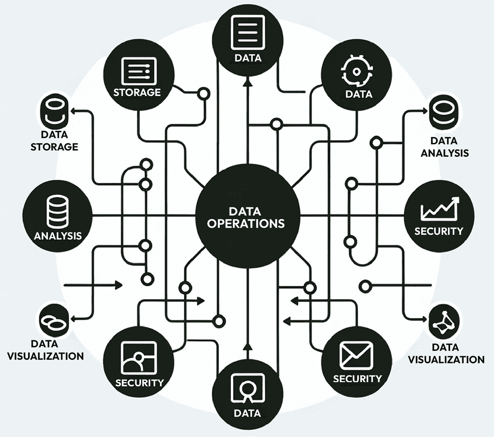
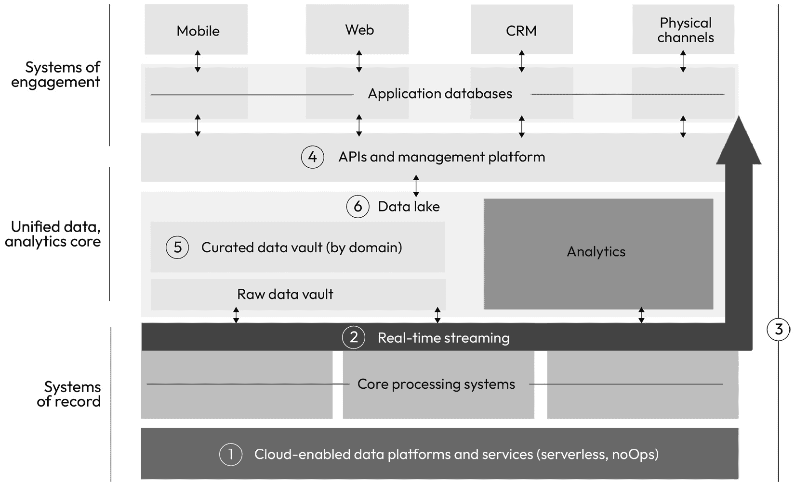
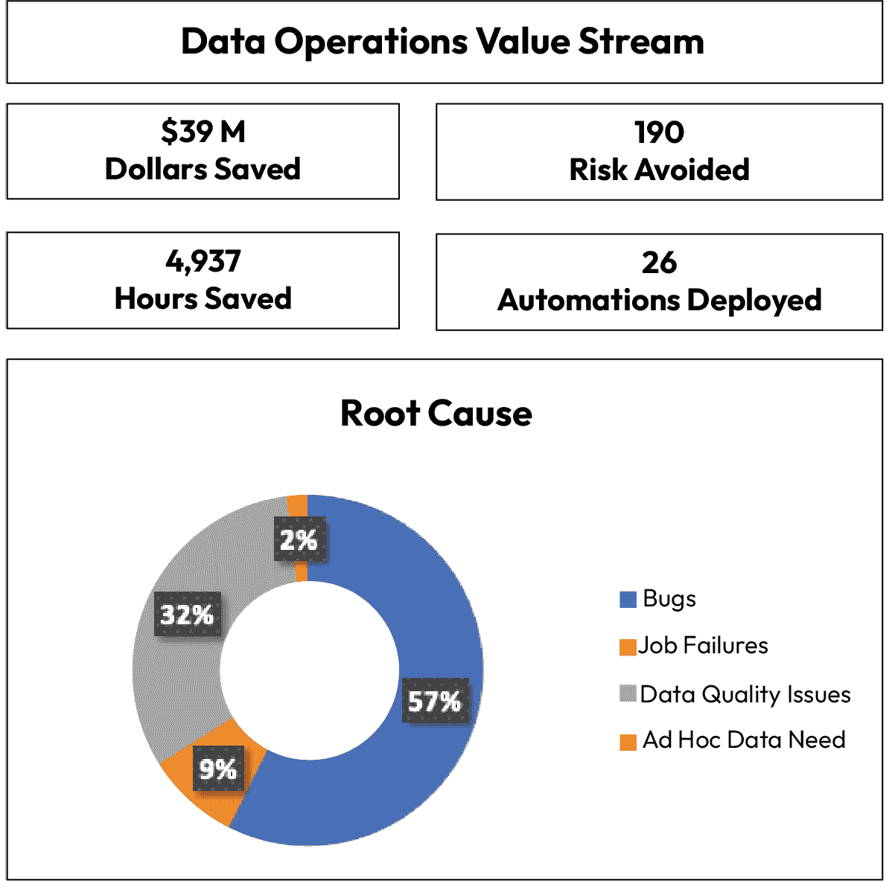

# 第十一章：数据运营

数据治理中一个较少关注的领域——数据运营，通常被忽视在对话之外。所有公司都有某种专注于数据的运营职能，但它们通常对领导者而言是不可见的。数据运营团队通常被埋没在可视化团队或治理职能后面，几乎不为公司所知。那么，它们到底是什么？数据运营团队为公司提供了什么？

本章将深入探讨这个话题。虽然我之前提到过数据治理往往被低估，但我想澄清的是，虽然这个说法是对的，我也认为数据专业人员在很大程度上应该为这种低价值感负部分责任。在本章中，我们将探讨*你*可以做些什么，帮助聚焦数据运营为你的组织带来的价值，并展示你如何向接触的高层展示可衡量的价值。

**例子**

想象一下：你是一个销售主管，现在是关键时刻。季度的最后一天，你有一个大单子需要签署。你已经从客户那里得到口头承诺，现在只需要把最终的订单发给他们处理，这样这笔交易就能算入这个季度的账目。但有一个问题。

*交易* *卡住了。*

在交易流程的某个环节，从报价流程到订单管理流程之间，数据停滞不前。时间越来越紧迫。你的客户准备签约，但你没有订单让他们签名。这笔交易意味着你能够完成季度销售目标，而如果没有这笔交易，嗯，意味着你将勉强错过目标。

*那现在怎么办？* *你该怎么做？*

很可能，你擦了擦额头上的汗水，开始拨打电话。常见的联系对象包括 CIO、CDO，甚至可能是最高层。在这些时间紧迫的时刻，销售团队直接联系高层并不罕见。然而，其实有一种更好的方法：联系你的数据运营团队。他们可以在这样的时刻帮助你。

我举这个例子是因为它非常真实。我在多个组织中看到过相同的情况：一些组织能够轻松地完成类似的交易，取得巨大成功。其他组织则没有那么幸运。那么它们之间的区别是什么呢？一个强大的数据运营团队。

我们将涵盖以下主要话题：

+   定义数据运营

+   数据运营能力

+   数据运营的价值

+   构建一个最佳的数据运营能力并为成功奠定基础

# 定义数据运营

在数据组织中，数据操作往往得不到足够的重视。我将数据操作比作电力：可能直到没有它，你才会意识到它的重要性。数据操作团队通常是公司内部保持一切运转的粘合剂，依据公司运营方式的不同，团队的规模和规模可能差异巨大。**数据操作**（**DataOps**）通常是一套实践、流程和技术，利用自动化和手动流程，提供对数据的集成和集中的视角，以提高数据质量、速度和跨组织的协作。数据操作是一个不断发展的领域，既包括从业者的视角，也有众多供应商的涌入。由于公司越来越依赖数据做出决策和执行日常运营，数据操作正成为一个更为重要的学科，并获得更多的关注。

数据操作通常处于组织内各项能力的核心，是维持一切协同运作的粘合剂：

图 11.1 – 数据操作作为数据治理的核心

## 数据操作与 IT 操作的区别

数据操作与传统 IT 操作之间存在一些共性。两者都负责公司运营的整体健康；然而，传统 IT 操作通常专注于以下活动：

+   监控 IT 系统

+   维护 IT 流程

+   实施 IT 系统

+   升级 IT 系统

+   确保持续的数据安全和合规性得到维护

在许多方面，数据操作和 IT 操作并没有太大区别，只是将“IT”替换为“数据”：

+   监控数据质量

+   维护数据处理

+   实施数据解决方案

+   升级数据处理流程和解决方案

+   确保持续的数据分类和合规性

目标和任务稍有不同，但总体上，这两个操作组都支持公司持续的运行。IT 操作的主要目标是确保 IT 系统的可靠性、安全性和高效性，而数据操作的主要目标是使数据更加易于访问、使用和价值化。

数据操作偶尔是数据工程团队的一部分，负责构建和维护数据管道。数据工程师通常是为支持组织内数据操作功能而雇佣的专业人才。关键的区别在于，数据操作团队更常被引入来修复和提供运营支持，而不是构建新功能，而数据工程团队则更多专注于构建。

## IT 与数据操作的合作伙伴关系

IT 和数据运维团队的协作越来越多。确保这两个团队在角色和责任上的对齐非常重要，以避免对哪个团队负责哪些任务产生混淆。然而，当 IT 和数据运维相互支持时，公司的结果和无缝体验将变得非常流畅和高效。

通过协作，这两个职能部门可以打破信息孤岛，改善数据从源头到洞察的整体流动。在许多情况下，业务领导者会要求某项任务在组织中“更快”地推进，但他们并未意识到这需要 IT 和数据团队的共同努力。要有效推进，IT 和数据团队必须共同合作，为业务领导者提供愉快的体验。当团队合作时，可以设计一种交互模型，确保实现以下结果：

+   数据团队与业务部门会面，了解业务需求并定义成功标准。

+   数据团队和 IT 团队共同定义业务和功能需求，并明确谁将负责交付这些需求。

+   IT 运维可以为数据运维团队提供构建适当数据管道所需的基础设施和资源。

+   数据运维可以为 IT 运维提供数据洞察，帮助识别是否存在来自 IT 运维的问题。

+   两个团队可以在治理和安全方面进行合作，以确保业务领导者的解决方案在设计时就已内置治理和安全，顺利迁移到生产环境中。

我曾看到这两个职能的界限模糊，甚至在某些情况下被合并。不幸的是，当这种情况发生时，IT 运维通常会被其主要工作（即 IT 运维）分散注意力，而数据需求往往在 IT 系统的运作中处于次要地位。我强烈建议保持这两个职能的分离，以便在服务数据方面实现流畅性。

| **有用提示** |
| --- |
| 当你有一个强大的数据运维团队时，一个很大的好处是事后回顾。考虑到数据运维团队应当使用工单系统工作，你可以获得有关数据运维团队关注焦点的宝贵数据。关于数据运维团队如何分配时间的信息是极其宝贵的：问题系统、事件频率、错误来源和常见问题类型。从这些数据中，你可以识别出推动转型和长期可持续修复的机会。 |

# 数据运维能力

数据运营团队在帮助组织有效管理和利用其数据资产方面发挥关键作用。他们提供一系列数据能力，支持数据驱动决策，并增强整体业务运营。数据运营团队通常由具有对各种系统广泛理解的个人组成，深谙各种计算机语言，并能在问题出现时快速响应。

| **有用的提示** |
| --- |
| 为您的数据运营团队聘请一位能在压力下工作良好、能在高管面前进行有效演示并能激励团队成员快速高效执行的领导者。您的数据运营领导对整个数据项目的成功至关重要。 |

数据运营团队负责广泛的能力，可能包括“根据指定的其他职责”，考虑到他们的访问级别和广泛的技能集。由于他们需要广泛的访问权限以便在问题出现时进行修复，因此需要强大的审计日志记录来追溯步骤，并采用强大的检测控制措施来查看完成了哪些工作。信任并非控制措施，因此在处理他们的广泛访问时需谨慎。

数据运营团队提供的关键数据能力包括以下内容：

1.  **数据集成**：数据运营团队促进来自各种源头的数据，包括结构化、半结构化和非结构化数据的无缝集成。他们采用数据集成工具和技术来协调数据格式，消除不一致性，创建统一的数据景观。

1.  **数据质量管理**：数据运营团队确保数据在整个生命周期内的准确性、一致性和完整性。他们实施数据质量监控和修复流程，以识别和纠正数据错误，确保数据驱动洞察的可靠性，如数据质量团队定义的那样。数据运营团队通常作为技术支持，按照数据质量团队设计的要求将数据质量规则配置到数据处理过程中。

1.  **数据仓库和数据湖**：数据运营团队建立和管理数据仓库和数据湖，这些存储库存储和组织大量用于分析目的的数据。他们设计和实施数据存储解决方案，以满足特定的业务需求，并支持各种数据分析工作负载。

1.  **数据管道**：数据运营团队构建和维护数据管道，这些管道自动化地从源系统到目标位置传输、转换和加载数据的路径。他们优化数据管道以提高效率，确保及时可靠地为分析和报告提供数据交付。

1.  **数据访问与自助服务**：数据操作团队使自助数据访问成为可能，赋能业务用户在不需要 IT 部门持续干预的情况下探索和分析数据。它们实施用户友好的数据访问工具和门户，促进组织内的数据驱动文化。

1.  **数据治理与安全**：数据操作团队执行由数据治理团队定义的数据治理政策和程序，以确保数据资产的适当管理、保护和合规性。它们实施数据安全措施来保护敏感信息并减少数据泄露风险。

1.  **数据实验与原型设计**：数据操作团队通过提供数据沙箱和敏捷开发环境来支持数据实验与原型设计。它们促进了新数据驱动项目的探索，并支持数据驱动解决方案的快速迭代。

1.  **数据可视化与分析支持**：数据操作团队与数据科学家和分析师合作，*提供*具有洞察力的可视化和报告，帮助有效地将数据驱动的见解传达给利益相关者。它们可能会为数据分析团队策划数据集，供其进行分析和可视化使用。*需要说明的是：数据操作团队并不创建可视化或分析报告，而是专注于策划数据，以便分析团队能够执行* *其职能*。

1.  **持续改进与监控**：数据操作团队采用持续改进方法论来识别瓶颈、优化流程并增强数据能力。它们实施数据监控工具来跟踪绩效指标，并确保数据操作的持续有效性。

1.  **变更管理与版本控制**：数据操作团队实施变更管理实践和**版本控制系统**（**VCS**）来管理数据管道、基础设施和数据模型的变更。它们确保变更是可控且可追踪的，从而最小化干扰并保持数据完整性。

图 11.2 – 示例数据生态系统

从整体上看，数据生态系统的集体能力是生态系统中各部分的粘合剂。数据架构设计了生态系统，IT 部门实现了系统，而数据操作团队则确保数据在生态系统中准确且可信地流动。它们与公司各个部门（数据治理、IT 和业务部门）保持连接，确保信息用户在需要时能够获得所需的内容。总之，数据操作团队提供了一套全面的数据能力，使组织能够最大化地利用其数据资产。通过有效管理和利用数据，组织可以获得竞争优势，做出明智的决策，并实现战略目标。

# 数据操作的价值

数据操作的价值在于它能够简化和优化数据在组织内部的收集、处理和利用方式。简而言之：简化。与数据架构（*第九章*）类似，操作越简化和流畅，发生故障、错误和业务影响的机会就越少。原则上，当数据操作从简化的角度设计时，其价值更容易理解，解决问题的时间通常也会更短。花费的时间较少在于排查根本原因（问题发生的地方更少）和爆炸半径（问题的影响）。

在评估全面且高效的数据操作的价值时，有许多附加价值，但这些是我建议在你的数据操作功能中突出展示的关键领域（无论是构建一个，还是单纯讲述其价值）。以下是其价值的一些关键方面：

1.  **提高数据质量和准确性**：数据操作实践确保数据始终准确可靠。通过实施强有力的数据验证和清洗流程，组织能够减少错误并提高数据的整体质量。虽然数据质量团队会设定期望、要求等，但数据操作团队将被雇佣来实施流程，以直接清洗和优化数据的质量。

1.  **增强的协作与敏捷性**：数据操作促进了数据科学家、工程师和业务分析师之间的协作。由于数据操作专业人员跨团队工作，创造解决方案并解决问题，团队能够推动跨团队的团结，以更快地解决问题。这种协作方法使得团队能够更加敏捷地应对不断变化的业务需求和数据要求。

1.  **提高效率和生产力**：数据流程的自动化减少了人工努力，加快了与数据相关的工作流程。这种效率提高了生产力，使得团队能够将更多精力集中在更具战略性的任务上，而不是日常的数据管理上。你的数据操作团队非常适合识别自动化的机会。我曾看到数据操作团队充当自动化寻求者，寻找所有的选项，并创建待处理的任务列表，逐步解决。

| 有用提示 |
| --- |
| 这是展示数据操作团队价值的*绝佳*方式——通过累积识别并自动化跨组织的数据流程和能力所节省的小时数。大多数公司都会惊讶于这种价值是如何迅速积累的。 |

**更好的决策制定**：通过高质量、及时且相关的数据，组织可以做出更明智的决策。有效的数据操作确保决策者能够在正确的时间访问到正确的数据。由于数据操作在识别自动化和简化机会方面独具优势，并能够迅速部署这些机会，因此它们可以加快洞察的速度，使决策能够更快地发生，达到业务所需的速度。

**可扩展性和灵活性**：数据操作实践旨在与组织一起扩展。随着数据量和复杂性的增长，数据操作策略有助于有效管理这些增长。通过出色的监控，数据操作专业人员可以识别出哪些系统和数据流管道受到压力，并能够主动提出和部署解决方案。

**风险缓解**：通过数据操作的适当管理，减少与数据泄露、合规性问题和操作低效相关的风险。它通过确保数据保护控制在整个数据生态系统中的一致应用，确保数据安全并遵守**通用数据保护条例**（**GDPR**）和**健康保险携带与责任法案**（**HIPAA**）等法规。

**提升客户体验**：通过更好地理解客户数据和行为，数据操作可以帮助组织量身定制其产品和服务，更好地满足客户需求，从而增强客户体验。这可以通过数据操作团队在数据管道中实施的数据可观测性指标来实现。

当你的数据操作团队从本章中概述的活动中创造价值时，我建议持续记录通过你的数据操作团队为组织带来的价值。它不需要过于复杂，但你需要提前决定如何衡量价值。我最喜欢的衡量方式有以下几种：

+   节省/避免的资金

+   节省的时间

+   缓解的风险（计数或总成本）

+   实施的自动化

一个简单的四列仪表板可以极大地展示你的数据操作价值。此外，你还可以通过标记每一类别的变化类型，添加趋势来展示最大的影响来源。一个示例草图可能如下所示：

图 11.3 – 数据操作价值流仪表板示例

总结来说，数据操作通过确保高质量、可访问和安全的数据、促进协作文化以及使决策更加高效来带来显著的价值，*但你必须清晰透明地捕捉这些价值，以帮助团队的投资回报率（ROI）在组织中可见*。

## 数据治理中的无名英雄

正如我之前提到的，数据操作在组织中常常被忽视，原因有很多。如果你正在努力教育你的赞助人，或者可能是你的 CFO 来为这样一个项目提供资金，你可能需要用这些观点来解释为什么这个职能不总是被视为增值项，帮助他们做出决策，并消除关于“操作”团队的误解：

1.  **缺乏意识**：许多组织并未完全意识到数据操作的概念及其潜在的好处。如果没有这种理解，他们可能不会优先考虑其实施和/或资金支持。

1.  **传统思维模式**：一些组织深陷于传统的数据处理方式，并且可能对采纳新方法持抵触态度。从封闭和层级化结构转向更具协作性和敏捷性的方法，对于那些习惯了传统方式的人来说可能是一个挑战。我建议将数据操作职能比作一个数据特种部队。他们能够随时迅速介入，解决优先级较高的数据问题。然后，他们可以回去彻底解决长期的方案，但没有其他团队具备在“老旧方式”下解决数据问题并同时满足当今快速变化的商业环境速度的能力。

1.  **复杂性和资源限制**：实施数据操作可能非常复杂，需要数据科学、工程和商业分析等多方面的技能组合。组织可能缺乏有效实施数据操作实践所需的资源或专业知识。在这一点上，确保高层的理解尤为重要。展示这种职能的价值很关键，这也是前面展示的仪表板发挥作用的地方。使其透明且所有人都能轻松访问。同时也要维护后端数据，以便任何希望了解数字生成方式的人都能轻松查看。

1.  **低估数据挑战**：一些组织可能低估了管理大量数据所面临的挑战。他们可能未能认识到需要专门的操作来有效管理和利用其数据资产。

1.  **关注短期目标**：组织往往专注于短期目标和即时结果。通过对数据操作进行战略性投资，您需要承诺长期的投入，虽然这可能不会立即展现出明显的好处，从而导致被低估。鼓励设定 6 个月或 12 个月的时间框架，给团队足够的时间来展示其影响力。前几个月可能进展较慢，但时间的积累和发展轨迹将最终带来成果。

主要数据管理

在一家公司，我们开始了一项大型的主数据管理计划。作为商业案例的一部分，我让我们的数据运营团队回顾了过去 12 个月内他们所维护的所有问题和案例数据，以确定这些问题、他们花费的时间以及为了解决这些问题或案例所做的投资，这些问题和案例将受到我们主数据管理计划的影响。对于所有人，包括我自己，结果都令人震惊。涉及客户层级不匹配、错误或无效的联系信息、用于运输的无效地址以及无效的行业代码等问题，所有这些问题将在我们的主数据管理实施中得到丰富和标准化。问题的数量、解决这些问题所花费的时间以及提供数据运营服务所需的成本，*仅仅*这些就足以证明我们实施主数据管理的成本是合理的。

1.  **预算限制**：数据运营需要在工具和人员方面进行投资。在预算紧张的组织中，可能会有不愿为被误解为非关键职能的内容分配资金的情况。

1.  **过度强调技术而非流程**：有时会过于注重获取最新的数据技术，而不是改进数据流程和协作。这种以技术为中心的观点可能忽视了数据管理的运营方面。

1.  **整合挑战**：将数据运营团队成员整合到现有的系统和流程中可能会面临挑战。组织可能会因感知到的干扰和整合新流程或进行更改所需的努力而犹豫不决，而没有充分理解这种投资的回报。

1.  **组织内的孤岛现象**：数据通常存在于组织内的孤岛中。打破这些孤岛以实施一个连贯的数据运营战略需要进行组织变革，而这可能是困难的。

1.  **竞争性优先事项**：组织通常会面临多个相互竞争的优先事项。数据运营可能会因为其他更紧急或看似更有影响力的项目而被降级。

解决这些挑战需要提高对数据运营价值的认知，确保高层管理的支持，投资于合适的技能和工具，并培养将数据视为战略资产的文化。接下来的部分将概述你可以采取哪些措施，以争取所需的支持，从而推动数据运营的成功融资和定位。

## 使数据运营更加可见

当你努力将数据运营团队推向聚光灯时，让数据运营在组织内更具可见性涉及多个战略和实际步骤。对于我来说，争取支持的道路一直很艰难，但接下来我将概述的步骤将帮助你更快地获得所需的全面支持。我建议按照这个顺序进行：

1.  **高层支持和倡导**：确保获得高层管理的承诺和支持。当领导者理解并倡导数据运营的价值时，他们将在整个组织中获得可见性和合法性。花时间进行教育并展示潜在的价值。使用对其**业务单元**（**BU**）或职能有实际影响的商业案例。

1.  **教育和宣传活动**：通过举办工作坊、研讨会和培训课程，教育员工数据运营的重要性和好处。通过展示成功的案例研究和最佳实践，也有助于提高意识。每月发送通讯，突出当月的关键成果。

1.  **通过试点项目展示价值**：最初在小规模、受控的环境中实施数据运营实践。利用这些试点项目展示实际效益，如提高数据质量、效率或决策能力，这些效益可以传达给整个组织。通过这些试点项目突出你的教育和宣传活动的价值。

1.  **将数据运营融入业务战略**：如果公司和赞助商对在此领域进行投资持抵触态度，这将有些困难。然而，重要的是要将数据运营定位为整体业务战略的关键组成部分。这种整合确保它能在战略会议中讨论，并在决策过程中得到考虑。可以提出以下问题：我们需要在数据生态系统中改进什么，才能使这个流程/报告/指标/解决方案更加高效或有效？

1.  **创建数据运营团队和推广者**：建立专门的团队并任命数据运营推广者（理想情况下，指派一名业务推广者），负责推广、资助和宣传数据运营实践。这个角色可以作为数据运营计划和讨论的焦点。有时，集中精力支持单一的业务单元可以有效地获得支持。你的推广者可能会从这个业务单元中出现。

1.  **制定度量标准和关键绩效指标（KPI）**：这可能是不言而喻的，但你应该定义明确的度量标准和 KPI 来衡量数据运营的影响。定期与利益相关者分享这些度量标准，可以帮助突出它们的重要性和有效性。利用你的教育和宣传活动，展示具有影响力的度量标准和 KPI。

1.  **内部营销和沟通**：通过内部通讯、会议和仪表板定期沟通数据运营计划的成功和进展。分享故事和见证也是有效的。尤其当见证来自高级管理人员时，见证更具说服力。

1.  **鼓励协作和跨职能团队**：通过组建跨职能团队，促进协作文化，团队成员可以来自 IT、数据科学、业务分析和运营等不同领域。这有助于打破壁垒，使数据操作成为更广泛组织讨论的一部分。你可能希望组建一个专门的数据操作核心团队，同时也拥有一个支持网络，在危机情况下参与。正式指定这些人员，以便明确你的团队需要他们提供什么支持。

1.  **利用技术和工具**：使用现代工具和技术，展示数据操作的效率和影响力。这不仅能改善操作，还能作为其价值的具体展示。

1.  **反馈和持续改进**：鼓励组织各个层级对数据操作实践提供反馈，并根据这些反馈不断改进。这种方法可以确保数据操作在组织中始终保持相关性，并时刻挂在脑海中。你最常收到的反馈是关于加快速度的。这是件好事——你可以利用这些反馈请求额外的支持（如资金和人员），如果你的公司已经看到了影响。

通过采用这些策略，数据操作可以获得更多的可见性和认可，成为组织整体效率、数据质量和决策能力的关键贡献者。通过以影响驱动的方式，你的团队将专注于产生影响，而不是仅仅解决问题。这样的思维方式将确保你的团队得到支持，并因其具有影响力的工作而得到认可，而不是仅仅作为后勤职能存在。

# 构建一个理想的数据操作能力并为成功奠定基础

构建一个理想的数据操作职能涉及战略规划、技术实施和培养协作与持续改进文化的结合。这个团队的核心设计是成功的、全组织范围的解决方案。以下是为影响力设置最佳团队的关键步骤：

1.  **定义明确的目标和范围**：首先明确你希望通过数据操作职能实现的目标。这可能包括提高数据质量、加速数据管道开发或增强团队之间的协作等目标。你可以首先集中精力解决某个领域的问题，然后随着时间推移，逐步支持其他职能。如果你的公司正在进行重大转型（例如，实施新的 ERP 系统），你可能会优先支持这一举措，以确保项目的成功实施。

1.  **评估当前能力和需求**：评估你当前的数据管理实践、工具和基础设施。识别数据操作职能可以解决的差距、低效和改进空间。你在哪些方面有需求？你在哪些地方能展示立即的影响？

1.  **制定战略和路线图**：制定一个战略计划，概述如何发展数据操作能力。这应该包括短期和长期目标、里程碑以及实施的路线图。你可能会立即解决优先问题，同时建立支持数据操作团队战略重点的例行工作、节奏和流程。在交付过程中，明确优先事项并规划如何构建功能。

1.  **建立跨职能团队**：数据操作需要不同领域的专家协作。组建一个包含数据工程师、数据科学家、IT 专业人员和业务分析师的团队。确保每个人都明确各自的角色和责任。我曾带领的最成功的数据操作团队来自公司不同部门，大家一起组成了初创团队。业务领域的专业知识帮助我们快速获得动力并提供有影响力的解决方案。外部招聘人员排在第二位，而这种顺序对于我们早期的成功至关重要。

1.  **投资合适的工具和技术**：选择支持数据操作原则的工具和技术，如自动化、版本控制、**持续集成/持续部署**（**CI/CD**）和监控。寻找能够与现有系统良好集成的解决方案。刚开始时，你不需要华丽的工具，但随着团队的规模扩大，你可能希望考虑投资更先进的工具。

1.  **实施敏捷和精益方法**：采用敏捷和精益方法来优化流程。这包括迭代开发、冲刺、站会和回顾，以确保持续改进。在大多数情况下，你需要快速行动。优先级的设定将是关键。制定一种方法论或分类流程，以支持敏捷工作流程。

1.  **自动化数据管道**：尽可能将数据管道中的各个环节进行自动化，从数据收集、处理到分析和报告。自动化减少了人为错误，腾出时间用于更具战略性的工作。随着团队对数据环境的逐渐熟悉，你们会自然而然地识别出自动化的机会。将这些机会记录下来，以便在危机过后的空档期，团队能够专注于这些长期影响。你也可以考虑将团队分成危机管理组和长期自动化组，以支持需求的不同变化。

1.  **确保数据质量和治理**：实施强有力的数据质量检查和治理政策。这包括数据验证、清洗，以及确保遵守数据隐私和保护法规。与数据治理负责人密切合作。

1.  **培养协作和实验的文化**：鼓励不同团队之间的开放沟通和协作。创建一个重视实验和创新的环境。在会议中庆祝协作，推动这种文化的发展。

1.  **定期监控、衡量与优化**：持续监控数据运营职能的表现。使用指标和关键绩效指标（KPI）来衡量成功并识别改进的领域。将这些指标和 KPI 公开透明。透明度至关重要。

1.  **培训和发展技能**：投资于培训和发展计划，确保你的团队具备必要的技能和知识。这包括技术技能以及如协作和解决问题等软技能。我强烈推荐定期轮换关键人才进入和退出这个团队。花时间从事数据运营工作将扩展他们对公司数据流动方式及面临挑战的了解，并能通过第一手经验获得更深入的认识。这种视角非常宝贵，将为你的高潜力领导者带来极大的财富。

1.  **与业务目标对齐**：确保你的数据运营举措与更广泛的业务目标和战略紧密对接。这有助于向组织展示数据运营的价值，并将精力集中在整体公司优先事项上，从而使转型变得更具影响力。这为更大投资提供了更高的投资回报率，这是你所在的数据组织展示影响力的绝佳方式。

1.  **反馈与迭代**：永远不要忘记反馈是一种礼物。创建机制从最终用户和利益相关者处收集反馈。利用这些反馈进行迭代改进。要愿意并能够在需求变化时进行调整。

# 结论

构建一个优化的数据运营职能是一个持续的过程，随着组织需求和技术进步不断演变。它需要对最佳实践的承诺、持续学习以及适应新的挑战和机遇。在本章中，你已经学习了以下内容：

1.  数据运营的重要性，包括为何它是构建成功数据解决方案所必需的

1.  如何设计数据运营职能

1.  实施过程中的具体需求

1.  如何设计数据运营解决方案

通过了解如何运营数据组织的运营，你的团队将能够支持一个非常广泛的能力，包括管理主要数据管理、数据仓库、数据湖以及其他由数据组织管理的授权供应点。整个能力是所有其他数据治理职能得以运行的动力。确保你构建并合理对待你的数据运营团队。没有它，你的团队将无法产生必要的可见影响，确保获得高层支持并推动其增长。

# 第三部分：通过基于价值的交付建立信任

在这一部分，我们将把从*第一部分*和*第二部分*学到的所有内容，转化为一次成功的程序启动。在本部分后续章节中，您将学习更多加速和优化成果的技巧，这些成果将为您的业务利益相关者所重视和理解。最后，我们将带您走过一个良性循环，帮助您快速取得胜利。

本部分包含以下章节：

+   *第十二章*，*强力启动*

+   *第十三章*，*通过有影响力的快速胜利实现成功*

+   *第十四章*，*数据自动化带来影响和更强大的成果*

+   *第十五章*，*推动业务成果的采用*

+   *第十六章*，*交付值得信赖的结果，实现重要成果*
