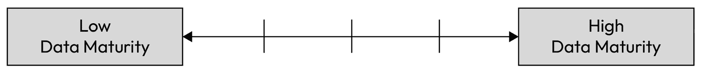
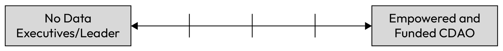
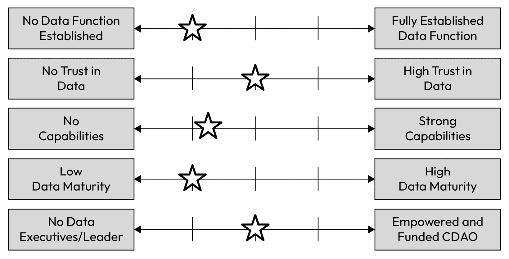
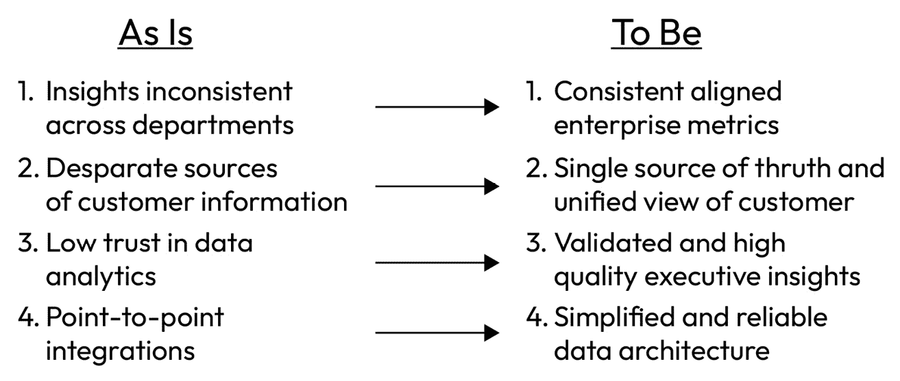
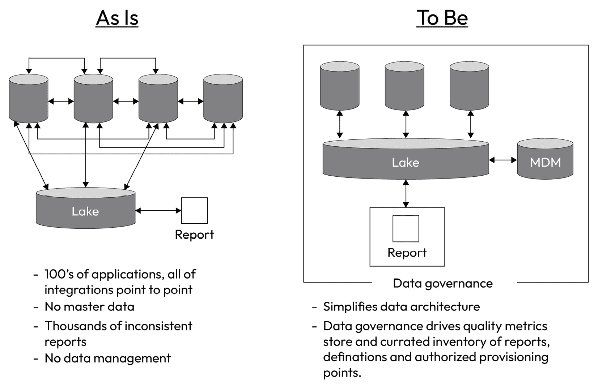

# 第十二章：强有力的启动

如果没有适当的启动，任何优秀的数据治理计划都可能迅速失去影响力。即使有明确的目标、里程碑和优秀的执行，启动的方式将决定计划的成功（或失败）。启动的重要性不容忽视。当我们进入本书的*第三部分*时，我们将详细讲解如何创建简单而有力的核心信息，以吸引并清楚地向利益相关者传达交付内容和交付方式。接着，我将引导你制定启动计划，设计反馈循环以确保持续改进，最后，如何定期报告以展示影响力。

本书的接下来的五章，共同构成了本书的*第三部分*，将前 11 章的所有知识点结合起来，指导你将这些信息转化为真正的数据治理转型。请注意，理解到目前为止本书中所概述的能力是一回事，但将这些信息转化为成功的数据治理转型计划则是另一回事。一些最优秀的技术数据治理领导者在将这些内容转化为实际影响时也会遇到困难，因为“技术能力”并不足够。这是成为数据专家的基本要求。然而，如果没有带领其他人共同走过这一过程的能力，也无法将其转化为有影响力的商业成果，你将无法取得成功。

当你开始着手启动数据治理转型时，确保早期启动计划正确非常重要。本章的重点将引导你完成这一关键步骤。作为数据领导者、商业领导者，或如果你是数据领导者的支持者，你的责任是确保业务深刻理解、接受并全程支持数据转型计划。鉴于大多数数据治理转型需要 24 到 36 个月的时间，确保公司整体支持你走得更远至关重要。某些关键能力，如主要数据管理、数据操作和目标架构，其投资回报期比其他方面要长得多。因此，启动时必须强有力，这包括交付快速胜利（我们将在*第十三章*中深入探讨）。

数据领导者和他们的执行赞助人应该共同制定一个充满前瞻性的未来愿景，帮助公司展望数据治理转型完成后的未来景象。作为数据专业人士，你知道数据工作永远不会结束。就像在长时间没有运动后恢复体形一样，爬坡是一个过程。然而，一旦你爬上了山坡，你不能停止锻炼。不，你必须继续锻炼，以保持你的体能水平。

数据也是如此。你需要进行转型（或实施）来推动*第六章*至*第十一章*中所概述的能力，融入到公司 DNA 中。这不仅仅是一次性的，而是一个可持续的过程。这是项目的“塑形”部分。除了转型外，你还将通过持续的数据实践，像保持身体健康一样维持公司在“数据健康”方面的水平。完成转型后，你的公司不应该再是原来的样子。

本章将涵盖以下主要主题：

+   评估启动准备情况

+   简单而有力的核心信息传递

+   执行全面的沟通策略以支持数据战略部署

+   设计反馈循环

+   为项目启动设定并满足期望

# 评估启动准备情况

在准备启动之前，你需要暂停并评估当前状况。我并不是说从数据管理成熟度的角度，而是从业务的准备情况来看。如果你在启动计划中假设业务准备改变的程度超出你的评估，你将面临阻力，并且很快会感到沮丧。如果你低估了准备情况，可能会发现自己在推销一个已经被接受的转型。这同样是糟糕的。如果业务尚未准备好，你可能会推动他们认为不需要的变革。如果他们已经准备好，你则会在他们希望看到变化发生时仍在讨论变革。两种情况都会导致你失去可信度和支持。这就是为什么评估准备情况如此重要。

你需要评估的程度有几个因素需要考虑：

+   你们有已建立的数据职能吗？

+   各级公司对数据的信任度有多高？

+   你们在生产中有核心能力吗？

+   你的成熟度得分是多少？它是否准确反映了公司在数据成熟度方面的现状？

+   你们是否有明确的数据负责人？他们是否被合理定位，并获得足够支持以推动大规模转型？

## 执行评估

为了帮助你评估你的组织是否准备好进行数据治理转型，花点时间反思一下你组织的现状。请在此处绘制之前问题的答案，以便在我们一起研究本章时，参考这些答案。对这五个问题的回答并不意味着你的公司不准备好——它们只是表明你在准备强有力地启动时需要采取的方式。

### 已建立的数据职能

第一个因素——数据职能的存在和成熟度——是一个重要的考虑因素，但任何答案都不是决定性的。如果你已经有了一个建立好的数据职能，这是一项需要考虑的因素，但并不构成开始的障碍。你可以利用没有中央职能的局面来推动对一个职能的投资，或者在需要时推动集中化。如果已经有了一个中央职能，你也许可以更快地推动转型。因此，在建立转型计划时，拥有一个团队将帮助你更快地走上转型之路。

图 12.1 – 已建立的数据功能

### 高度信任的数据

没有人会与你争辩，但拥有受信任的数据不再是一个*可有可无*的要求，而是任何公司必备的条件。当你对数据有高度信任时，这意味着高管团队不仅依赖数据来做出商业决策，还相信他们用来做这些决策的数据是可靠的。没有对数据的信任会在多个方面表现出来，包括高管层的信息不一致、对信息有效性的质疑、能力、数据和数据质量的明显缺乏，最终导致对数据职能的低信任。

当信任度低时，描绘一个信任数据的世界，其中信任数据不是例外而是常态，这会非常有说服力。一个简单而有效的用例是，询问你的高管团队，他们使用哪些指标（KPI 或 OKR）来衡量公司的成功。然后，问他们对这些数字的信心有多大。高管团队是否达成一致，认为这些指标是正确且可靠的？你信任这些数据吗？

大多数公司会告诉你，他们在最关键的指标上没有达成一致。或者，他们会说他们对自己团队负责的数字有信心，但对其他团队的数字没有信心。这表明数据的信任度较低，并且可以成为一个很好的切入点。

图 12.2 – 数据的信任度

### 已建立的能力

在评估已建立能力的状态时，下一个要考虑的因素是，现有的能力在数据转型启动前的适应性。在启动之前，评估已建立的数据治理能力的状态。无论是否集中化，你的组织是否有理事会、数据管理、Meta、日期管理、能力、数据质量、主要数据管理或数据操作？如果有，这些能力的成熟度如何？它们是否在整个组织中得到广泛应用？如果是，那么你在启动你的项目时就占了优势。仅仅拥有这些能力，就能让你在转型过程中取得一个强有力的起步，特别是它们能有效支持强大的数据赋能。

然而，没有建立数据管理能力并不意味着你无法启动一个项目。它仅仅意味着在你进行组织转型的过程中，你需要逐步建立这些能力。与前述因素一样，数据治理能力的强弱不会阻止你强力启动项目；这只是你在确定公司需要的转型程度时需要注意的一个问题。

图 12.3 – 核心能力

### 数据管理成熟度

正如我们在*第四章*中讨论的那样，你应该使用你的数据管理成熟度评分来提升公司数据治理现状的意识。较低的数据管理成熟度评分可以帮助提高透明度，并让高层领导了解数据能力的真实、公正状态。这是一种更纯粹的衡量组织状态的方式，相比仅仅评估能力的存在及之前的因素，因为数据管理成熟度考虑了这些能力在日常运营中的嵌入程度。

如果你有较高的数据管理成熟度评分，意味着达到 4 或 5 的水平，那么不太可能需要进行大规模的数据管理转型。它可能意味着你有一些聚焦的改进领域需要交付。大多数公司在数据管理成熟度评分上保持在 3 到 3.5 之间，尽管不同的行业有所不同。例如，金融服务和医疗行业通常比其他行业更为成熟，原因在于这些行业对数据控制和保护有更严格的监管要求。

图 12.4 – 数据管理成熟度

### 强有力的领导力

最后，评估你公司数据领导力的现状。你有首席数据与分析官吗？你有执行级别的赞助人吗？你有确保持续资金的路径吗？你得到了高层管理的支持吗？如果你没有这些支持，推动数据转型将会非常困难。你可能需要选择一个较小的项目或计划作为重点，以此在公司最高层建立信誉和可见度，作为第一步。然而，如果你幸运地得到了高级领导的支持，并且资金已经到位，或者有机会为数据转型争取到资金，那么你就处于一个很好的位置，可以为公司启动一场强有力的数据管理转型。大多数首席数据与分析官都会非常希望获得这种支持。

如果你没有高层支持，有一件事你可以做来开始争取支持。那就是传播你的愿景（我们稍后会讨论）和相应的计划。通过走访并逐一帮助你的高层了解公司目前的状况，因为公司还不够成熟，你将帮助他们睁开眼睛。

我怀疑，基于我多次主导此类工作的经验，仅仅通过教育你的高层并帮助他们看到“现状”的真相，将有助于你获得支持。这可能需要时间，但这些对话将逐步帮助你建立对强有力启动的认知。

图 12.5 – 数据领导力

## 共同的基准

大多数公司开始他们的数据之旅时，通常会有如下情况：

+   公司中分散着一些数据团队（有些可能比其他团队更成熟，但没有一致性）

+   在某些情况下，信息的信任度较高，通常是在财务领域，因为财务法规支持监管和财务报告

+   一些能力，通常更依赖手动操作；整个企业的一致性较低

+   结果数据的成熟度不是零，但由于努力的不一致和碎片化，它仍然处于较低水平

+   已经任命了一位数据领导者（通常这是数据转型得以进行的原因之一，因为他们会为此倡导），但仍需进行人员配备和正式化

    这些内容一起构成了你“现状”状态的快照视图。这个过程的情节可能看起来像这样：

图 12.6 – 现状示例

现在，你准备好开始制定你的信息了。这五项评估标准将决定你如何传达转型的信息，从而帮助你强有力地启动。

# 简单且强有力的核心信息

在你开始进行正式的数据治理转型时，至关重要的一点是要确保你的信息简洁明了，便于大众理解。实现这一点的一个好方法是，思考一下当你交付完毕后，生活将会是什么样子。一个好的方法是从列出你的*现状*和*未来*状态开始。我见过很多公司这样做并取得了成功，这是一个明确展示转型前后差异的好方式。这个过程应该以多种方式进行，但最重要的是，从商业的角度出发。

例如，如果在当前状态下，为客户完成报价需要 18 天，但在未来状态下，我们预计只需 8 小时，你应该为用户定义这一点。向他们展示并告诉他们*如何*实现这一目标：

+   你打算实施一个新的系统吗？

+   你打算自动化流程吗？

+   你打算去除冗余流程吗？

+   你打算创建新的模型吗？

+   可能这甚至是上述所有情况的结合

最终，你越能明确描述*将会是*的体验与*现在是*的体验之间的区别，你就越有机会获得业务支持，并且能够强有力地启动你的转型计划。

## 制定引人注目的愿景

在你开始向更广泛的群体推广公司的数据转型计划之前，你需要花时间创造一个引人注目的未来愿景。这是你为公司构建一个想象中的未来的时刻。公司未来会是什么样子？它将如何运作？员工、客户和利益相关者的实际体验会是什么样的？他们在未来的状态下能够做到什么是今天做不到的？他们不再需要做什么？

这更多的是一种艺术而非科学，因为这是你真正去梦想你和你的团队将要创造的未来状态的机会。现在是暂时放下技术组件，去触动数据的情感部分的时候。那种未来状态会是什么样的感觉？

示例

我最喜欢的数据转型之一开始时只是一个旁支项目。有一个复杂的报告流程，需要一致性和基础数据，才能进行一些最复杂的监管报告。我们从找到几个非常好的例子开始，了解在当前状态下完成这种监管要求报告流程需要什么。通过全面了解完成大规模企业报告所需的努力，我们能够识别出有数百人手动处理数据，以生成单一报告。大量的手动干预涉及跨系统协调不一致的数据，迫使人们进行手动干预。

我们能够制定出一个强有力的愿景，使公司清晰地了解，如果我们实施统一的参考数据并将这些数据发布供所有系统使用，未来的状态将会是什么样子。通过将公司与这些统一的参考数据对齐，得以解决了不一致性的问题。这使得整个组织内的数据汇总工作变得极为简化，并且实现了更自动化的流程。通过向公司内部的几位高层展示这个用例，包括首席财务官、首席风险官和首席数据官，我们很容易就达成了这一目标。

最难的部分是将故事讲得如此清晰，以至于任何听到的人都能理解并立即支持这一进程。这样才能有效启动。让你的基线清晰明了，让每个人都有共同的理解，并愿意在之后支持你。在这个例子中，最难的决策变成了资金将来自哪里——不是我们是否能够获得资金，而是资金来源。得到了三位高层的支持，这是一场重大胜利。

请记住，愿景声明旨在提供一个远大的长期视野。它应该是鼓舞人心的，并且具有较高的层次感。以下是一些示例：

1.  和谐地协调我们各异的数据源，将孤立的数据变成一股强大的行动洞察力合唱，推动我们在各个层面做出数据驱动的决策。

1.  让每个员工都能自助访问精心策划的、值得信赖的数据，激发全公司数据驱动的问题解决与创新文化。

1.  利用人工智能和预测分析，从被动应对趋势转变为主动预测趋势，预见市场变化，优化资源分配，并在商业环境中自信地航行。

1.  将操作数据转化为高效的强大灵丹，简化流程、减少浪费，并通过自动化工作流和实时洞察最大化投资回报率。

1.  打破部门之间的壁垒，民主化数据访问，促进跨职能协作，利用集体智慧实现改变游戏规则的成果。

1.  为每个客户打造个性化的旅程，将数据驱动的洞察力融入每一个接触点，超越客户期望，建立持久的忠诚度。

1.  挖掘历史数据中蕴藏的智慧，预测并缓解潜在风险，构建一个具有韧性和灵活性的组织，准备好应对任何挑战。

1.  以目标为导向引领我们的环境和社会影响，利用数据优化资源消耗、减少浪费，并推动负责任的增长，确保可持续的未来。

1.  将数据转化为战略武器，挖掘市场机会，超越竞争对手，在不断变化的市场中占据主导地位。

1.  赋能数据驱动的文化，在这种文化中，每个决策都由洞察力驱动，每位员工都成为数据素养的倡导者，而数据则助力我们不断追求卓越。

## 现状与目标状态（即当前状态与未来状态）

在将愿景付诸实践时，现状与目标状态的对比将把愿景带到一个更为实际的未来状态。创建一个具体而精炼的视图，展示当前状态与未来状态之间的差异，是清晰传达为何需要变革的关键步骤。将未来的机会凝练成一个简单的故事，能够描述未来，并在此基础上进一步拓展你所定义的吸引人的愿景，帮助激发实现公司转型所需的动力。这将有助于建立理解，并作为推动你所有行动的背景，朝着想象中的未来前进。

通过有效地定义这种现状与目标状态的对比视图，您将使所创建的愿景栩栩如生。这还将有助于进一步明确目前正在有效运行的内容。也许有一些组件正在有效运作，您可以承认并突出显示这些组件。这将使您设想的未来更具可信性和可信度。特别是如果您刚刚加入组织，其中一个风险是利益相关者假设（也许是错误地）您没有花足够的时间了解公司的特定细微差别。通过在您的现状描述中具体说明，您将能够进一步通过承认今天运行良好的内容来增强可信度。

我建议您从两张一页的现状与目标状态视图开始：

1.  简明地描述当前状态（例如，分析师需要几天到几周的时间来找到所需数据以产生洞察力）与未来状态（例如，分析师将能够在企业数据目录中找到经认证的数据集，从而在几小时而不是几个月内生成洞察力）。

1.  通过视觉描述（例如，市场架构视图）来展示未来将会是什么样子，而不是单纯地告知：

图 12.7 – 现状与目标状态概念

结合一页简明的项目符号方法和第二页的视觉描述，您就可以涵盖视觉学习者与语言学习者的不同需求。如果您在撰写时遇到困难，请从较长的视角开始，并朝向简明的叙述努力。最终，如果您无法简明地描述，您可能会难以获得支持。大多数高管需要明确的结果路径，通过保持您未来状态的简明性，您的高管团队将迅速理解为何这很重要。如果您无法简洁地描述结果，您可能尚未准备好推动未来。

图 12.8 – 现状与目标状态市场架构

为了达到这个目标状态并概述您组织的适当未来状态，您需要利用第*1*至*5*章节中概述的工作。您还需要深入了解公司当前状态，并清楚地了解需要发生什么来适当定义这个视图。这是准备启动转型过程中最困难的步骤之一——将公司的需求转化为所需的转型。这将是独特于您特定情况和公司的。收集利益相关者、高管和其他公司最佳实践的输入会有所帮助，但最终，您的策略是为您的公司制定的。

## 使您的消息变得简明扼要

在你准备启动战略时，你需要将*第一章*到*第五章*的内容提炼成战略，并将其转化为简洁的信息，以便能够打动你的利益相关者。你应该预期不同的利益相关者会需要不同层次的细节。定义启动信息的第一步是确定你需要传达给哪些受众，以及他们需要什么样的信息：

+   **个人贡献者/前线经理**：需要详细的信息，如项目计划和分配给个人的具体任务

+   **中高层管理**：需要一个更为汇总的战略视角，以及关键的里程碑和一致的成果

+   **高层管理团队和董事会**：需要一个高度概括的以结果为导向的计划，展示公司将通过这项工作实现或经历什么

为了满足这些不同受众的需求，你需要撰写几种不同类型的战略信息材料。然而，我可以提供的最佳建议之一是，从*北极星*战略备忘录开始。这个备忘录不仅可以作为你所有工作背后的基础，还能向任何受众展示你有一个经过深思熟虑的计划。我建议你将这份备忘录控制在 10 页以内。它将迫使你详细阐述你将交付什么、为什么以及如何衡量成功，而不会过于冗长。

## 撰写叙述性备忘录

如前所述，明确战略的最佳方法之一就是将其写下来。听起来很显而易见，但许多高管未能从图像过渡到战略的完整描述。备忘录有两个优点：它帮助你充分明确战略，并以非常具体的方式定义未来状态。它迫使你深入思考细节并清晰地完善信息。在图像或幻灯片中，你可以更自由地避免细节，而在叙述性文档中，你必须更加深思熟虑和具体。

在北极星战略中，你应该涵盖三个关键领域：为什么需要改变，什么将被改变，公司如何到达目标。我建议你充分利用这个机会进行深入思考，因为这将为接下来几年的工作定下基调；然而，你应该设定一个预期，即该文件是活文档，将定期（至少每年）更新，以确保它继续支持公司的战略。

+   **为什么公司需要** **改变**：

    +   当前状态下缺少什么？

    +   当前的成熟度状态如何？

    +   公司因为当前状态无法做到什么？

    +   公司在战略实施后，将能够做什么？

+   **将要** **改变的内容**：

    +   将部署哪些能力？

    +   什么将保持不变？

    +   将增强或丰富什么？

    +   什么将被淘汰或退役？

+   **你将如何** **实现目标**：

    +   我们如何到达目标？

    +   员工将如何体验这一变化？

    +   关键的里程碑是什么？你将如何达成这些目标？

+   **谁将** **参与**：

    +   C-suite 中谁需要支持这项策略？

    +   谁将参与其中？什么时候？如何？

    +   谁不需要参与策略？

在你为公司草拟战略备忘录时，要反复修改。在草拟过程中请求反馈。我建议你确定几位关键的支持高管来参与备忘录的撰写。这个建议将帮助你与利益相关者共同进入战略启动阶段，而不是单打独斗地试图改变公司。通过让他们参与草拟工作，你现在拥有了与使命共进的伙伴。

## 基于结果的设计

一个好的商业项目从结果开始。这意味着要向前看，真正思考在你完成项目后，生活将会是什么样子。你必须从公司战略开始，然后是聚焦于实现公司战略的部门战略。你的工作必须支持并促进战略。花时间具体列出公司旨在交付的内容，并说明你的工作如何在具体层面上支持这一点。公司是否关注运营利润率？展示你的团队如何通过成本节约活动创造利润。明确*如何做*。你可以关注的几个关键领域如下：

+   推动产品创新或效率

+   增加收入

+   提高运营效率和/或减少开支

+   可衡量的客户满意度或体验提升

+   降低业务风险

通过将你的转型工作框定为这些类别，并将其转化为你的北极星，你将帮助业务理解为什么你的团队交付的成果对他们重要，从而影响他们的成功。

失败的最大风险之一就是投资于那些与业务结果没有明确关联的项目或能力。如果业务没有清楚地理解你为公司所做的工作如何转化为对他们的影响，他们就不会支持你。更糟的是，他们可能会反对你。时间、金钱和资源都是有限的。如果你无法清晰地阐明你正在做的事情如何影响他们成功的能力，你就不会成功。

很容易过于偏重运营效率和风险缓解。这些是你对公司职责的重要组成部分。然而，越是能够将数据办公室的工作转化为收入，你就会越成功。有时候，这个连接可能会相对间接，但这没有问题。然而，不要犯没有连接到收入的错误，即使是间接的。

| 提示 |
| --- |
| 在你起草并启动数据战略的过程中，确保深入关注如何将其转化为业务术语。请让一位非数据专业人士阅读你的战略，并让他们标出任何未解释或未转化为业务结果的术语。通过去除*数据*术语，你将确保数据战略的撰写最大限度地产生影响。 |

# 创建可重复的过程

在准备发布计划时，确保你准备好在组织内广泛而深入地进行教育。你应该计划进行类似路演的沟通巡回活动，分享愿景、计划以及未来的样子。告诉他们，再告诉他们你所告诉的内容，然后再次告诉他们。你将需要利用几种不同的沟通机制，确保企业范围内的理解：

+   **备忘录**：确保你的数据战略备忘录已发布并广泛提供审阅。透明度是强力启动的一个重要优势。

+   **计划**：制定一个计划，展示你将交付的内容以及时间安排。具体说明每次发布或发布时利益相关者能够做什么，以便他们能够消化他们在此过程中可以期待的内容（而不仅仅是结束时的内容）。

+   **更新**：规划如何在整个过程中更新你的利益相关者群体。你将需要为董事会和直接参与数据战略的个人提供不同的更新。提前明确他们期望从你这里得到什么信息。

+   **状态报告**：定义状态报告的格式。明确你将如何分享它们。根据公司文化和偏好，考虑实时口头更新与书面异步更新的选择。不要害怕将这些报告公开给广泛的受众。透明度建立信任（尤其是当消息*不好*时）。如果你的利益相关者知道你能信任你分享艰难的消息，他们也会知道可以信任你分享好消息。

+   **预算**：虽然并非所有受众都相关，但你应该有一份详细的预算，用于衡量数据战略实施的财务方面。

+   **关键绩效指标（KPI）和成功度量**：定义如何衡量成功。一种最佳做法是发布一个分数卡，显示随时间推移的进展。定义度量标准以及它们的计算方式。同样，透明度是关键，因为你将发布自己的成功度量。

记住，整个数据团队和赞助者都是数据战略及其相应实施计划的传播者。在每个论坛上带来积极的能量。当你对战略和公司使用数据的未来充满激情时，其他人也会受到感染。

# 设计反馈循环

在启动（而不是之后）时，定义您将如何在整个过程中改进。只有在建立持续改进的途径时，您才能不断提升成果，这其中包括对反馈循环的关注。在启动时，您应向所有利益相关者（高层管理人员、经理和个体贡献者）解释他们如何提供意见，并鼓励他们这么做。如果他们看到有什么可以改进的地方，鼓励他们提出建议。

您可能希望为此建立几种选项：

+   **通过论坛收集口头反馈**：建立论坛让个人了解您的策略执行情况。您可能需要针对不同的受众组织几个不同的论坛。利用您的企业数据治理委员会或委员会向高层管理人员提供更新。您还可以考虑建立一个更广泛的市政厅式论坛，向更大的受众发布口头更新。

+   **通过调查收集正式反馈**：在实施数据策略的过程中，您可能需要定期请求正式反馈。对于广泛的受众，使用调查是一个很好的方式。如果您打算从广泛的受众那里收集书面反馈，您应该明确反馈将如何处理。我建议承诺将反馈（无论好坏）分享给您的利益相关者。

+   **通过工作流程收集书面反馈**：如果您的组织使用工作流工具，您可以选择允许反馈持续提交，以供数据团队考虑。这种方式在实施过程中可以更自由地流动信息，但需要您的团队来管理工作流。根据变更的程度，您可以考虑在较大的、快速推进的转型中采用此选项，以便快速调整。

在与利益相关者一起分享更新、聆听反馈并相应调整时，您将确保利益相关者继续从您通过实施数据策略所带来的转型中获得价值。如果未能建立反馈循环并将适当的反馈融入策略执行中，您可能会交付无法服务于公司目标的结果。

# 在项目启动时设定并达成期望

在启动您的项目时，您应明确利益相关者对成功的期望和感受是什么。清晰地定义他们可以期待您的什么以及何时能够实现。随着您履行对利益相关者的承诺，确保告知他们发生了什么，而不仅仅是向他们展示。您可以通过多种方式展示项目进展。这将帮助您的利益相关者看到并记住进展情况。每当达到一个里程碑时，发布一些信息性消息：

+   **微型培训**：小规模的个别培训（可以是现场或预录的视频），展示发布后可以做些什么。

+   **衡量结果**：以 KPI 或其他指标来展示结果。通过易于访问和使用的方式发布这些信息，比如仪表盘或内部网站。

+   **以前与现在**：展示现在可以做到的，而以前无法做到的事情。附加内容：展示未来发布版本中能够做到的事情，以保持利益相关者的兴奋感。

这里有一个最后的建议。当你规划启动会议时，不要等到交付才开始。现在就开始，并且在你启动战略后，已经交付了一个成果，展示你不是在等待产生影响，而是影响已经发生。尽早交付成果，并在启动会议中宣布。这将向利益相关者社区展示你迫切希望交付成果，并且你并非等待做出改变，而是已经开始了。这是一种强有力的启动方式，并且能够在你的数据战略交付中建立立刻的信任。

# 结论

正如你在本章中所学到的那样，强有力的启动是推动公司数据转型势头的最佳方式。通过快速且全面地推进，并通过成熟度评估（如在 *第四章*中所讲），你将建立一个坚实的基础，从而对你的组织产生重大影响。在本章中，我们讨论了成功启动计划的基础，包括以下内容：

1.  如何清晰地表达并使用商业术语

1.  如何设计启动前和启动时的沟通模式

1.  制定启动计划

1.  创建反馈循环以收集意见

1.  融入反馈，传递更强有力的信息

在下一章中，我将指导你如何识别并构建快速成功的案例，以帮助提升数据转型启动的速度，从而迅速且有效地获得组织的支持与关注。这两章相辅相成，帮助你建立强大的信誉，并获得全企业范围的支持。大胆地启动你的转型，适当归功于你团队的影响力，并通过逐步交付显著成果，来不断积累支持。
