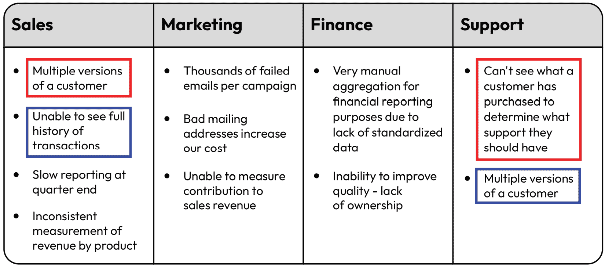
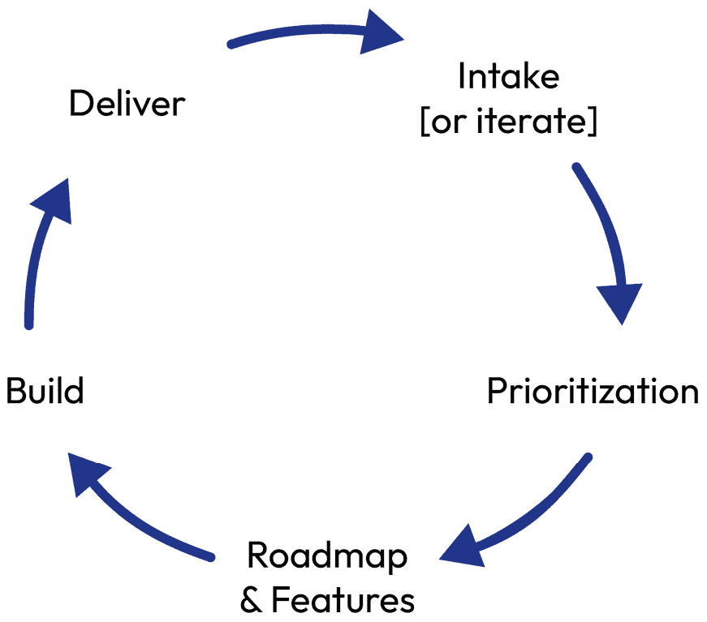

# 第十三章：通过有影响力的快速胜利交付

当你启动数据转型计划时，你的团队将快速且持续地交付成果。由于数据治理的性质，以及对数据是否能转化为真实、可衡量结果的怀疑，你需要尽可能缩短首次价值的实现时间，并清晰且持续地展示进展。在本章中，我将向你讲解如何通过快速胜利创造势头，如何有效地与业务沟通这些胜利，以及如何确保业务利益相关者理解你的成果如何转化为他们的成功。

根据我的经验，完全押注于大型变革性平台的数据领导者，往往在他们的成果显现时失去利益相关者的兴趣。你不能等到你的平台或能力上线后才宣布胜利。根据我的经验，宏大解决方案很重要，但不能成为一切。没有任何利益相关者或公司会等上 18 到 24 个月，才看到他们在数据投资上的成果。成果必须在小块时间内实现，同时你还需要交付增量的结果。

根据德勤的研究（请参见本章末的*进一步阅读*部分），首席数据与分析官的平均任期约为两年半，而其他高层管理人员的平均任期大约为五年。因此，展示你能够交付可持续、可衡量的成功至关重要。你的成功取决于此。在你意识到这个压力时，不要让它让你瘫痪，而是将其作为动力。请记住，你必须每天都要持续表现，并展示出影响力。

首先，你需要确定什么构成“快速胜利”。这意味着什么？什么对你的利益相关者有价值，什么对你自己重要？我建议你先为你自己和团队回答这些问题。招聘是你必须做的事情，但在利益相关者眼中并不是一种“胜利”。然而，解决一个长期存在的数据质量问题，这个问题导致了高层的指标错误，却是一个你应该庆祝并与大家沟通的胜利。那么，识别快速胜利需要什么条件呢？我们从这里开始。

本章涵盖以下主题：

+   寻找快速胜利

+   为什么政策、标准和程序能够引起轰动

+   数据所有权

+   将产品思维应用于数据能力

+   通过持续交付模式建立势头

# 寻找快速胜利

当你开始加快进度并与初始利益相关者会面时，正如我们在*第二章*中讨论的，你聆听了利益相关者的关注点，了解了哪些进展顺利，哪些进展不顺利，并开始更好地理解他们的需求。现在是时候与他们一起制定优先事项清单，明确他们当前的需求和长期需求了。在这个阶段，你需要与团队和利益相关者群体一起完善需求的优先级清单，以便在组织中产生重大影响。

## 确定需求领域

在你继续建立这些关系时，建立信任的关键一步是履行你所承诺的内容。当你与利益相关者会面时，你应该已经捕捉到他们的需求清单。以原始形式，这个清单可能会像这样：

| 销售 | 市场营销 | 财务 | 支持 |
| --- | --- | --- | --- |
| • 客户有多个版本 • 无法查看完整的交易历史 • 季末报告缓慢 • 按产品测量收入不一致 | • 每个营销活动有数千封失败的邮件 • 错误的邮寄地址增加了我们的成本 • 无法衡量对销售收入的贡献 | • 由于缺乏标准化数据，财务报告的汇总过程高度手动 • 无法提升质量 – 缺乏责任感 | • 无法看到客户购买的产品以确定应提供什么样的支持 • 客户有多个版本 |

表 13.1 - 通过利益相关者访谈识别的问题示例

这些只是你在与利益相关者交谈时可能听到的一些例子。在你的倾听之旅中，你可能已经识别出数十个问题。将它们按领域列出，即使是跨部门重复出现的问题。接下来，你应该做以下事情：

+   将单独的清单反馈给你会见的个人。一个简单的“感谢您与我会面，这是我所听到的，我是否遗漏了什么？”可能会非常有帮助。它可能激发新思路或澄清你没有正确捕捉的内容。

+   与你的团队会面，分享清单并分享你所听到的内容。请团队提供反馈。你可能会发现他们知道其他存在的问题（无论规模大小），你可以将这些问题加入到清单中。

一旦你得出了一个稳定的当前问题清单或缺失的能力清单，这些问题或能力正在影响业务和/或后台职能的成功，下一步就是查看跨部门和单一部门中现有的内容。这意味着寻找共同主题，也要关注差异所在，以便你能确定哪些是多个利益相关者的需求，哪些仅服务于单一部门。

## 合理化清单

在审查列表时，你会看到其中的主题。以下是我为参考而突出显示的两个一致主题的简短示例。请注意，在一个示例中，措辞相同，因此容易识别，但第二个问题的措辞并不完全相同。这是故意为之。你必须熟悉这个列表。仅仅拥有这个列表是不够的，你必须对内容非常了解。使用匹配逻辑在电子表格中可以发现语言一致性问题（如果你有一个长列表），但其他问题则无法通过这种方式发现。这是为了说明为什么与列表保持亲密关系是很重要的。

图 13.1 – 各部门识别出的共同问题

| **实用提示** |
| --- |
| 通过创建这个列表，你可能已经为利益相关者揭示了各组之间的共同点。考虑与利益相关者分享完整列表，让他们看到其他小组所面临的问题。他们可能没意识到其他小组也有他们面临的相同问题（例如，关于交易历史的前述示例——这与右侧的相同问题，只是措辞不同。它需要相同的解决方案，但如果没有数据专长，可能无法意识到这一点）。这可以激励你的利益相关者社区齐心协力，与你以及彼此之间进行合作。 |

你可能想重新格式化列表，使其基于问题，并标明哪些小组受到问题的影响，像这样：

| **问题** | **销售** | **营销** | **财务** | **支持** |
| --- | --- | --- | --- | --- |
| 客户的多个版本 | X |  |  | X |
| 无法查看交易的完整历史（以确定历史购买情况并评估适当的支持水平） | X |  |  | X |
| 季末报告迟缓 | X |  |  |  |
| 按产品的收入衡量不一致 | X |  | X |  |
| 每次营销活动中的数千封失败邮件 |  | X |  |  |
| 错误的邮寄地址增加了每次营销活动的成本 |  | X |  |  |
| 无法衡量营销对销售管道/收入产生的贡献 |  | X |  |  |
| 由于缺乏标准化数据，财务报告需要非常手动的汇总 |  |  | X |  |
| 无法改善数据质量，因缺乏所有权 |  |  | X |  |

表 13.2 - 各部门识别出的共同问题，重新格式化

从这个视图出发，你应该努力识别哪些问题可以在短期内至少以某种有意义的方式得到解决。这个想法并不是要立刻或完全解决所有问题，而是展示在短期内为利益相关者带来有意义的进展。通过解决“短期可赢”的问题，你能增强与利益相关者之间的信任，让他们相信你能为他们带来真正的变化。这将展示出短期的紧迫性，服务于长期可持续的发展视角。

## 优先排序列表

现在你已经列出清单，流程的下一步是确定你应该专注于什么，以及以什么顺序进行。您和您的团队应该问几个问题来帮助优先考虑重点：

1.  解决每个问题的影响是什么？

1.  您将如何衡量成功？节省的时间？生成的收入？避免的成本？如何量化影响？

1.  紧急程度是什么？

1.  现在能做些什么来解决紧急问题，与需要更可持续长期解决的问题有何不同？现在解决问题的一部分是否值得？

1.  你有解决问题所需的人员吗？专业知识？

例子 - 无法看到客户的购买历史记录

**场景**：在这个例子中，公司销售一种订阅产品，并提供附加的支持服务。

**销售需求**：销售专业人员需要能够看到客户购买了什么，以便他们能够 1) 销售额外的补充产品和服务，以及 2) 知道将来几年需要续订什么。没有这些信息，销售团队只能问客户：“您购买了什么？”这可能导致客户体验不佳，也为续订产品的收入机会造成损失。客户经常不会被续订，导致收入的流失。

**客户成功需求**：客户成功代理无法看到客户购买了什么，因此在他们打电话到呼叫中心时不知道客户是否有资格获得特定级别的支持。他们必须相信客户的话，没有办法验证他们对服务的资格。这导致假设过度为客户提供服务，但以牺牲收入为代价。

#### 优先框架

现在我们已经记录了清单，让我们定义如何建立一个框架来优先处理这个清单。考虑以下几点：

+   **解决业务问题的影响**：销售和服务都面临收入的泄漏风险，无论是销售的升级销售机会还是续售机会，还是客户成功的附加服务/支持。此外，我们可能过度为客户提供服务，而没有适当地收费，从而增加我们的服务成本。

+   **如何衡量成功和影响**：将自己置于企业的位置。问自己以下几个问题：解决了这个问题后，企业能做到什么他们今天无法做到或体验到的？我将如何衡量？在这个例子中，收入是这个问题的结果，以及过度提供服务，这增加了每个客户的服务成本，因为我们提供的服务比他们应得的要多（至少是增加的水平）。一个度量指标是收入的百分比续订，另一个是每个客户的服务成本，最后一个是流失率。

+   **紧迫感**：收入流失和服务成本通常是管理层非常关注的关键问题。可以合理假设，销售、服务和高层管理会非常急切地想要解决这个问题。

+   **短期工作与长期工作**：在这一阶段，你和你的团队应该集思广益，思考如何在非常短期内，同时也以长期和可持续的方式来解决这个问题。你今天、这周、这年能做些什么？

+   **资源配置**：你可能需要什么投资来完成这个短期和长期项目？今天你有没有可以利用的资源，通过重新优先排序或为团队成员创建一个具有挑战性的任务来调配资源？你是否需要资金？

在像前面这种例子中评估每个问题后，你应该重新优先排序，按照你打算解决问题的顺序来排列列表。你不需要一次解决一个问题。事实上，你可以选择 5-10 个问题，和团队的不同部分一起同时解决所有能迅速取得成果的问题。如果是我来处理这个列表，我会让数据治理团队负责财务的所有权问题，让平台/主要数据团队负责统一客户视图的问题，并让数据运营团队处理我们正在一起探索的购买历史例子。

## 短期与长期的胜利

在一个共同的问题或能力范围内，你应该有短期解决方案，能够迅速取得成效，也有长期解决方案，能够在长远来看提供稳定的解决方案。那么，如何做出选择？

1.  **创造选择性**：为利益相关者提供一些选择供他们考虑。理想情况下，提出三种解决方案来解决他们的问题。

1.  **涉及利益相关者**：听取他们对你提议的选项的看法。提出一些好奇的问题，例如：“我们遗漏了什么？这些选项可能会影响到哪些其他方面？”

1.  **利用现有资源**：考虑你所拥有的资源。每次做新事情时如果你都要求资金和/或资源，这可能会被视为一个警告信号。你能在没有一分钱或新增员工的情况下做些什么？

1.  **展示进展（而非单纯报告）**：在你取得进展时，定期与利益相关者进行沟通。展示进展比发送状态报告更能赢得可信度。向他们展示你是如何帮助他们取得胜利的。

1.  **迭代**：为了快速展示进展，你需要展示逐步的进展。随着功能的交付，迅速展示并寻求反馈。迭代时要保持紧迫感。

1.  **示范**：将你的迭代解决方案展示给利益相关者，向他们展示你和你的团队所创造的成果。获取他们的早期和频繁反馈，以便你能展示持续的进展，并在交付时包括任何反馈。不要等到解决方案完成后再向他们展示你为满足他们需求所做的工作。

1.  **上线**：简单来说，启动你的解决方案。一旦交付了初步功能，你将继续迭代并交付新功能，因此，请带着紧迫感上线。

1.  **广泛沟通**：与利益相关者分享你的解决方案，但也要与其他人分享。将这个新解决方案添加到月度沟通中，或者分享给更广泛的利益相关者群体的状态报告中。这将是一个很好的方式，展示你已经交付了一个有影响力的解决方案。

1.  **快速失败**：如果解决方案不起作用，或者你需要改变方向，不要害怕这样做。只需要尽快行动。你随时可以进行调整。

1.  **构建长期解决方案**：在你部署或交付了快速解决利益相关者需求的第一次迭代之后，开始着手构建长期解决方案。这可能意味着交付比快速胜利更可持续的解决方案/版本，或者可能是一个完全不同的可持续解决方案。无论哪种方式，一旦你交付了快速胜利，下一步就是立即着手解决长期稳定需求。

### 示例 – 无法查看客户的完整历史购买记录

+   **场景**：在这个例子中，公司销售一种带有附加支持服务的订阅产品。在当前状态下，销售和客户服务团队无法验证客户购买了什么，因此遇到了两个主要问题：

    +   客户服务代表不确定客户应享有哪一等级的服务套餐，导致过度或不足服务。

    +   销售代表不确定客户之前购买了什么，因此不确定该续订什么。这导致了收入未被开票。

+   **短期/快速胜利目标**：在 ERP 数据基础上构建一个简单的查找功能，以识别未被续订的流失收入。这一收入流失识别能够为长期解决方案的额外支出提供合理依据。（注意：这是一个非常常见的问题，在大企业中，通常会导致发现数千万或数亿美元的未开票收入。）

+   **长期目标**：构建一个购买历史工具，展示客户的所有历史记录，供市场营销、销售、客户服务和财务部门轻松查询任何客户的所有历史记录，且可以在全球范围内查看。

+   **需要考虑的事项**：在你开始构建快速胜利与长期解决方案的过程中，你需要了解你现有的资源。按照前面提到的 10 个步骤，你首先需要为利益相关者提出多种选择供他们参考。理想情况下，你应该能提出三个或更多的选项来解决他们的问题。其次，你需要让利益相关者参与这些选项的选择过程。你应该询问他们关于你准备的选项的问题。

+   **我们所做的**：在这个例子中，我们准备了包括能够从我们的企业资源规划平台获取原始交易数据并根据这些信息整理视图的选项，虽然这些数据的质量不是最高的，但足以让团队开始使用。这解决了*第 3 步*，即利用现有资源。当我们朝着*第 4 步*前进时，我们开始向利益相关者展示来自 ERP 系统的原始数据是什么样子的。尽管这些数据并不完全或详尽，但它为他们提供了一个起点。我们与利益相关者合作，基于我们生态系统中其他可用的数据源，提供了我们能够迅速修正的迭代视图。

通过与我们的利益相关者反复沟通，我们还通过在数据集上方添加一个非常简单的 GUI 界面来展示我们的解决方案，这使得利益相关者能够搜索他们需要的历史记录。一旦我们从利益相关者那里获得足够的信心，认为这能开始解决他们的问题，我们就将其投入实际使用，并有效地传达了该版本中的数据并不完全可靠，但足以开始使用。我们还与其他我们认为可能对这些信息感兴趣的团队分享了这个早期版本。IT、财务和市场营销等其他团队也对这个初步视图感兴趣。

从长远来看，我们需要为客户建立一个主要的数据管理平台，以便我们完全有信心掌握客户的完整视图及其围绕单一实体的层级结构。最终，我们自动化了购买历史平台，将购买历史与相应的客户关联，并能够查看最低法定实体的购买历史，同时也能够将购买历史汇总到最终的母公司（最高层级）。我们通过反复交付，直到相关利益相关者拥有一个完全自动化、端到端的可持续解决方案。我们为公司节省了数百万的运营效率和丧失的收入。

## 组织准备工作考虑事项

令人惊讶的是，几年前曾提出过类似的建议，但没有得到业务方的批准。为什么会这样呢？有时，组织可能因为各种外部因素而不了解自己的机会。或者，可能是之前的提案没有提出得很有效。仅仅因为之前没有成功并不意味着现在就不行。如果你的利益相关者第一次没有接受你的建议，过一段时间再试一次，特别是当领导层发生变化时，你可能需要考虑新的领导者可能有新的想法。

你还应该考虑公司的状况。如果公司正经历财务困境，可能不是请求数百万美元推动数据议程的合适时机。要专注于你需要交付的内容、公司为何需要这些内容以及如果你做到了，财务结果将如何。仅仅表明你的解决方案将带来“收入”是不够的。要清楚地说明如何以及为什么。如果公司处于财务增长阶段，可能是一个更好的时机去尝试和创新。

## 投资/资金模型

通常，有几种方式可以资助这些快速成功的项目。根据组织的偏好，具体选项可能会有所不同。常见的有三种选择：

1.  **CDAO 办公室资金**：你使用自己的预算为这个快速成功项目提供资金。我的建议是，当你尝试展示团队交付能力时使用这种方式。这通常被视为一种“善意”尝试，旨在展示有信誉的结果。

1.  **利益相关者资金**：你请求利益相关者为你的快速成功项目提供资金。我只推荐在你与利益相关者有良好关系且他们习惯为你的团队提供资金时使用这种方式。

1.  **混合资金**：你要求利益相关者资助解决方案的一部分，而你自己则提供解决方案的另一部分资金。当需要更多投资才能启动项目时，双方都认识到快速成功至关重要，并且在交付共享成功方面达成一致时，这种方式可能奏效。

根据我的经验，当你的团队自行资助快速成功，并且只有在你展示了团队能够交付时才向利益相关者寻求资金，这样的方式更有助于建立牢固的关系。只有在你完成“快速成功”阶段并开始交付长期可持续解决方案时，才应该向利益相关者请求资金。根据你的最佳判断，并遵循公司资金模型的规范。

## 跟进

这应该是显而易见的，但如果你想让利益相关者认真对待你，你必须在快速成功中交付卓越的结果。如果你的利益相关者正在资助你的快速成功项目，那么实际上没有失败的余地。有很多方法可以“成功”，但你必须交付一个符合或超出他们期望的结果。

一旦你交付了第一个版本，你应该立即要求对下一版本的解决方案提出反馈。在这个快速成功阶段的每一次交付都会在你的团队能够交付业务需求方面积累一点信誉和信任。不断向利益相关者展示他们可以依赖你提供卓越的结果，并且你是他们的合作伙伴。与他们一起构思下一步并继续交付。这种良性循环的交付将在你进入更大规模的交付时带来回报。

## 有效沟通以获取支持

在完成所有前期工作后，通过持续交付识别、生产和迭代结果，遗憾的是，许多数据领导者未能适当进行沟通。通常有两种情况：过度沟通低影响力的结果，或者对有影响力的交付沟通不足。试想一下这个非常简单的观点：

| **高影响/** **沟通不足** | **高影响/** **高度沟通** |
| --- | --- |
| 你已交付了很好的解决方案，但你没有有效地向你的利益相关者或用户讲述这个故事。 | 你已交付了很好的解决方案，并且你有效地与利益相关者沟通了。 |
| **结果**：利益相关者没有意识到你的快速获胜成果，因此没有为未来的投资和产品提供适当的支持。 | **结果**：利益相关者意识到你的有影响力的工作，并为未来的投资和产品提供支持。 |
| **低影响/** **沟通不足** | **低影响/** **高度沟通** |
| 你交付了低质量或低影响力的结果，并且你没有广泛地与利益相关者或用户分享这个结果。 | 你交付了低质量或低影响力的解决方案，但你已广泛地进行沟通。 |
| **结果**：你没有交付任何成果，而没有人注意到。你应该重新开始，找到另一个有影响力的数据解决方案并尽快交付。 | **结果**：你已经损害了自己的声誉。你过度沟通了一个低影响力的解决方案，这降低了利益相关者在未来你为他们提供高影响力成果时，信任你的结果的可能性。你可能会在为下一个产品/解决方案争取资金或支持时遇到困难。 |

表 13.3 - 快速获胜和沟通效果的影响

你希望处于右上角——高影响力和有效沟通。然而，接下来最好的位置是左下角。这个结果可能是意外的，但另外两个区域对于团队的成功而言，风险更高。

### 衡量结果

在你进行沟通时，别忘了我们在*第五章*中学到的内容，*与结果对齐*。衡量你交付的结果的影响是至关重要的。例如，在我们之前讨论的购买历史示例中，我们识别出了客户承诺续订但销售未完成续订的未计费收入。在该示例中，通过财务交易和订单表格，我们能够识别出承诺的年份、已经计费并支付的部分，以及未计费和未支付的部分。未计费的承诺可以被衡量并汇总。未计费收入总额达到了几百万美元。

通过向所有利益相关者群体（包括财务、销售和高层管理）进行外部报告，我们能够非常明确地说明，团队已识别出具体的未开票收入金额。当销售部门根据这些数据跟进客户时，大多数客户都很愿意支付这些服务费用，但没有人要求他们这么做，他们也没有意识到这一点。我听过其他许多公司也发生了完全相同的情况。

能够直接识别出其工作带来收入提升的数据团队，通常会发现为他们的项目获得资金比衡量结果不那么直接，或者没有直接的收入或运营节省关联时，要容易得多。如果可以的话，具体衡量结果并清晰地分享。争取利益相关者对你所识别的数字的支持，然后一起向高层管理汇报结果。这将增强你的可信度和合作伙伴关系。现在我们已经学习了关于快速成果的一切，在接下来的章节中，我们将探讨政策、标准和程序如何帮助你实现这些成果。

# 为什么政策、标准和程序能引发关注

在你的数据治理团队方面，你可以提供的最简单的快速成果之一就是建立有效且易于理解的政策、标准和程序。根据我的经验，你的一些利益相关者可能只是希望能够自助完成工作。我认为这是一个很好的信号，这意味着你的组织中有许多高素质的数据专业人士，他们希望能够开始工作。然而，如果他们希望你的团队告诉他们做什么，怎么做，以及如何与团队的工作对齐，那么这些就是积极参与的利益相关者。

你能做的最好的事情之一就是为他们提供他们所寻求的指导。做到这一点的最简单方法就是发布他们可以使用的指南。当你的一些数据工程师和分析专家在关注数据治理的技术性部分，取得其他快速成果时，其他团队成员可以并行地专注于发布这些文件，从而支持更广泛的企业。

特别是当你的团队规模小或较新时，制定简单、直接且不太复杂的政策、标准和程序，是一种极好的方式，让整个公司都能参与到数据工作中，而无需大量的团队成员。仅仅提供模板就是一种非常简单的方式，能够让你的管理社区参与进来，帮助他们如何记录简单的控制措施，定义如何衡量和报告数据质量的状态，或执行简单的数据操作。

虽然前面的购买历史示例在一个特定领域进行了深入分析，但政策、标准和程序则横跨整个组织。通过将技术解决方案与更广泛的解决方案（如简单的数据政策）相结合，你将获得多个利益相关者群体的支持。这是建立数据项目有效推动力的另一种方式，同时使公司清楚地知道他们需要做什么以及如何做。在发布政策、标准和程序，并交付数据治理能力后，你可以采取的下一个最佳步骤是明确数据所有权。通过指定数据所有者，你可以在一个联邦模式下实现数据治理，从而在整个企业中实现问责制。

# 数据所有权

在*第三章*中，我们讲解了如何建立一个高效能的团队。你可能还记得，建立高效能团队不仅仅是关于你直接管理的员工，还包括整个公司内的数据社区。建立高效能团队时，最重要的考虑因素之一是激活那些直接管理数据的人。这些数据管理员（无论是技术数据管理员还是业务数据管理员）是将我们在本书*第二部分*中讨论的所有能力付诸实践的关键组成部分，同时也是实施政策、标准和程序的关键。

获得快速成功的一种方式是激活你的数据管理社区。数据治理领导者（我们在*第三章*中提到过）应该识别出组织内的数据管理员，并利用这些管理员来实施政策、标准和程序，同时识别快速成功的机会！最接近数据的人是日常看到并经历数据问题的人，因此，他们是你识别快速解决机会的最大来源。

确保跟踪谁在提供这些创意。当这些创意到来时，你可以尝试以下几种方法：

+   **创建黑客马拉松**：通过收集需要解决的创意来激活你的社区。然后，将这些创意反馈回社区，创建一个类似竞赛的论坛，将这些创意“破解”成解决方案。请高管请获胜者吃午餐，或以**问我任何事**（**AMA**）为奖品。请注意，这不需要资金支持。

+   **请求提交**：收集创意的一种方式是创建一个提交创意的论坛。你可以使用 Slack 频道，或简单地通过一个监控的邮箱收集这些创意。

+   **创建报名表格**：允许个人在表格上记录他们的创意。确保记录下提交创意的人的名字，以便你可以对他们进行认可。

通过让整个数据社区参与进来，你的影响力和创意将比单纯依靠团队自己收集或生成创意时更加丰富和广泛。对于收集到的创意，人们会有很强的归属感，因此，要庆祝那些提出创意的个人。当解决方案被收集、解决并传达时，记得提及并发布是谁提出的。这是一个很好的方式，来表彰那些在公司内支持你们团队和数据的人。现在我们已经了解了数据所有权是什么，以及它如何帮助定义快速成功，我们接下来将学习如何将产品思维应用于最终解决方案的制定。

# 将产品思维应用于数据能力

持续对解决方案进行迭代的最佳方式之一，是将产品思维应用到数据能力中。这个概念在过去几年中已经在数据领域兴起，而在撰写本文时，我已经在我领导的两个团队中推行了这一模型。理解这一思维方式的最佳方式是看看技术行业中的产品是如何部署的。在你以数据产品思维来构建解决方案时，这是一个很好的时机，因为它与产品管理在根本上是对齐的。

## 数据产品管理

当你开始构建一个解决方案时，目标是通过一个立即可用的**最小可行产品**（**MVP**）解决方案上线，并在未来一段时间内定期发布新功能。理想情况下，至少应该遵循以下步骤：

1.  **指定产品经理**：每个解决方案应该有一个指定的产品经理来“拥有”该解决方案。产品经理应该是该解决方案的专家，并对解决方案的质量和性能负责。就像你在传统技术产品中看到的一样，这个人最终要为产品负责，不管发生什么。

1.  **利用功能待办事项列表并进行优先排序**：收集所有利益相关者请求的功能和那些需要改进数据产品的功能。根据影响和需求对功能进行优先排序。

1.  **制定路线图**：每个产品都应该有一个路线图，其中的功能会随着时间的推移进行迭代发布。对于利益相关者来说，应该清晰透明地了解他们能期望什么，并且什么时候能看到与数据产品相关的成果。

1.  **迭代交付**：如你的路线图所示，数据产品应该有明确的、随着时间推移而迭代交付的计划。这个路线图不应“结束”——你应该采用一个持续改进的模式。

1.  **使用户能够使用**：在交付时，一定要通过培训使用户能够充分发挥产品的潜力。

1.  **重复**：因为你正在部署一个产品，所以你应该不断地重复这个循环，直到产品退役为止。

因为你的目标是快速将解决方案投入生产，并实现快速的成果，所以要专注于交付最小可行产品（MVP），让你的利益相关者尽可能快地获得价值。利用前面的步骤来实现你的完整解决方案，并为未来的增强功能做好准备。不要让完美成为良好的敌人；要紧急交付。

## 产品与非产品解决方案

一旦你看到这种方法的有效性，可能会想要将产品管理思维应用到所有的数据能力和解决方案中。然而，并非所有的都应该这么处理。容易被这种模型吸引，并想把它应用到所有事情上，但这也有代价：将产品经理和工程团队对接到每个产品上是无法无限扩展的。

| **提示** |
| --- |
| 与团队明确什么构成数据产品与什么是服务，什么仅仅是仪表盘或商业智能指标非常重要。很容易过度倾向于产品管理，所以明确你将如何处理解决方案是一个重要的早期步骤。 |

### 基本标准

为帮助团队保持客观，你应该为公司创建基本标准，用来定义什么构成产品、服务或资产。为了帮助你入门，我已经列出了你可以作为起点的非常基本的标准：

| **产品** | **服务** | **资产** |
| --- | --- | --- |
| 将持续获得支持。将持续交付。需要新特性或功能。 | 为他人提供管理数据或生成分析和洞察的能力。 | 单一交付物，已经生成并使用。 |

| 以下是一些示例：

+   预警系统

+   购买历史系统

+   客户健康评分

| 以下是一些示例：

+   数据治理政策

+   数据目录

+   数据质量工具

| 以下是一些示例：

+   企业度量指标

+   收入仪表盘

+   客户流失

|

表格 13.4 – 各种数据解决方案的标准

在我部署此模型的第一个组织中，我们回顾了我们所做的每一件事，无论它是一个简单的仪表盘、一个策划的数据集，还是一个完整的解决方案，并确定每个解决方案属于哪一个类别。仅仅通过这项练习，我们就淘汰了许多仪表盘，意识到它们不仅不是产品，而且根本没有被使用。这让我们更加清晰地知道了我们需要做什么，而哪些工作完全可以停止。从那里开始，我们确定了哪些解决方案是真正的产品，并可以开始迭代快速的成功。

### 产品文化

当你专注于通过迭代交付实现快速胜利时，一个好的最佳实践是识别并指定一个人来定义你团队的产品管理最佳实践。这个人将定义前述标准，建立产品路线图评审的论坛，管理冲刺过程，并与工程团队合作，使产品和工程目标保持一致。通过定义这些期望，你将开始建立产品管理的文化。根据公司和数据团队的规模，这可能是一个兼职角色，也可能是一个完整的团队。

### 培训

你需要定义产品管理的要求（无论是针对快速胜利还是持续的产品管理）。特别是如果这个概念对你的公司或团队来说是新的，你将需要花时间进行培训。有一些专注于数据产品管理的在线课程，可以作为一个不错的起点。如果你发现你需要为公司定制一个培训计划，你可以自行制定。没有单一的方式来完成培训。最重要的是评估团队和公司的需求，并相应地进行培训。现在我们已经讲解了如何建立快速胜利并通过一些示例进行说明，我们需要专注于势头。

# 通过持续交付模型建立势头

快速胜利不仅仅是你在工作初期创造和交付的东西——它们恰恰相反。你应该创造快速胜利来建立势头，然后随着时间的推移保持高效交付。创造势头的最佳方法是通过制定**持续** **交付模型**。

## 持续交付模型

持续交付模型使团队能够进一步交付每个解决方案，通过采用之前讨论的产品思维方式，并使用相同的模型来识别和交付新的快速胜利机会。该模型适用于单个解决方案以及整体过程，这使得在团队中部署变得更加容易。对于工程师来说，这可能看起来像一个敏捷交付模型，它就是根据这个模型构建的。对于非工程师来说，这是一个向我们的技术同行学习并将他们的流程更广泛地应用到整体解决方案中的机会。下图提供了持续交付模型如何运作的可视化表示。请注意，这个模型没有终点，而是应该继续进行，只要数据产品在生产中并被利益相关者使用。

图 13.2 – 建立势头飞轮 – 持续交付模型

我们将在以下小节中探讨模型的每个阶段。

### 输入

在团队层面，您应该创建一个流程和机制，收集并记录所有您将要构建的解决方案，无论其大小。您可以使用像 Jira 或 Asana 这样的工具，也可以使用像电子表格这样简单的工具。无论您使用什么工具，都要确保记录下所有大小的创意。

在解决方案层面，您需要捕捉构建/维护的每个单独解决方案所需的新特性或更改。由于该模型本质上是持续的，您应持续评估改进、新功能和修复。

### 优先级排序

在团队层面，您应该审查已经记录在待办事项中的解决方案，以便进行优先级排序。理想情况下，您应定义一个优先级框架。它可以简单也可以复杂，以适应您的业务需求。然而，我发现简单的解决方案往往更具优雅性，例如以下内容：

+   **影响**：低/中/高

+   **成本/资源**：低/中/高

看起来很简单，简单有时就是最好的。要在解决方案层面进行优先级排序，您只需按优先级排序这些解决方案，以便快速影响业务。这个优先级框架可以帮助您根据资源情况识别应该优先处理哪些解决方案。例如，如果某人有一周的时间，而一周的工作量对您的组织来说被视为“低”成本，您可能会在列表中寻找一个低成本、高影响的解决方案来进行下一步工作。

在解决方案层面，您可以使用类似的方法来构建功能层面的优先级排序，例如以下内容：

+   **影响**：低/中/高

+   **成本/资源**：小时/天/周

您可以使用实际预计完成功能所需的小时数（例如：2 小时或 36 小时）。这也将帮助您为每个创建的解决方案优先排序功能待办事项。

| **有用提示** |
| --- |
| 在团队层面和解决方案层面，这种优先级排序方法还可以帮助您识别那些可能不被视为“快速”交付的工作。也许这个过程会帮助您识别更大规模的需求，例如本书*第二部分*中所涵盖的内容。 |

### 构建路线图并对功能进行对齐

在团队层面，一旦您制定了优先级框架，您应该构建一个集成的路线图，列出团队将继续交付的小型快速成功项目。这一视图将帮助您的团队了解并理解正在交付的内容。通过为利益相关者提供您团队能够推动的微小时刻，您将令利益相关者感到满意，同时也会增强团队在高效交付有影响力工作的能力的信心。这将激励您的团队寻找更多的快速成功案例，从而产生更多的动力。

在解决方案层面，你应该为你的快速获胜项目构建一个简化版的发布视图。这个视图不仅要与参与解决方案的个人共享，也要与利益相关者共享。通过展示这些内容，他们将更好地理解他们将能够使用的功能和/或功能，以及何时能够使用。确保不仅仅提到哪些内容可以使用，还要解释这些内容能帮助他们在业务中做什么（例如，客户健康评分可以帮助客户成功团队主动联系客户，通过改进的客户体验和更高的 NPS 分数让客户满意）。

### 构建/工程/分析

在团队层面和解决方案层面，简单来说，这一步骤就是执行你的计划。高质量地交付解决方案。

### 交付

在团队层面，这是向利益相关者社区展示已交付内容的好时机，可以通过你的企业数据委员会或理事会，每季度一次，展示已交付的内容。根据利益相关者的意愿，让他们在这个论坛上展示他们在获得你团队交付的解决方案后能够做的事情，这对利益相关者来说可能是非常有影响力的。

在解决方案层面，构建解决方案（例如仪表盘、整理后的数据集或新管道）后，你应该将这个解决方案交付给你的利益相关者。不要忘记向他们展示他们能用这个解决方案做什么，以及如何使用它。征求他们的即时印象和反馈。

### 重复/迭代

在团队层面，继续生成创意，遵循你的需求处理流程，并通过持续交付模型迭代以产生影响。这也是一个很好时机，可以通过快速获胜流程的结果来总结你团队所创造的影响。考虑追踪节省的时间、增加的收入、节省的成本等。尽量将这些信息保持在最精细的层级，以便你能提供详细数据。然而，汇总的数字可以迅速增长，以展示团队的价值。

在解决方案层面，交付后，你应该收集来自交付步骤的反馈和意见，并从需求处理开始，重复整个飞轮过程。询问他们需要哪些额外的功能或特性，并通过这个周期继续交付。只要解决方案还存在，这个过程应该持续进行。一旦解决方案不再需要或使用，便可以退役，但在此之前，继续遵循这一持续交付模型以产生影响。

## 跟进

这可能是显而易见的，但你必须履行在这些快速成功中的承诺。如果你没有兑现它们，那就不能算是成功。通过兑现对利益相关者的承诺，你开始建立信任。如果你发现自己无法交付，或者在解决方案构建过程中，发现其复杂程度远超预期，及时与利益相关者沟通。不要回避关于快速成功过程的成功或失败的消息。并非一切都会成功，这也是可以接受的。

保持透明，与利益相关者合作，并在这些过程中真正地与他们合作，保持可见性，将继续建立信任。你可以考虑邀请利益相关者与你共同开发，增加业务整合。如果你的团队是新加入公司，或者有大量新成员加入，这种方法可能会非常有帮助。庆祝每一次成功，无论大小，也要庆祝失败。当团队成员迅速意识到某个方案行不通并停止工作（例如，快速失败），这也是值得庆祝的。它将创造一种创新文化，在这里尝试和失败是安全的。失败不是失败，它是成功的一部分。一定要鼓励团队这样做，以保持团队的动力。

# 结论

在你为影响力建立快速成功文化的同时，你正在为你的团队打造一个交付机器，帮助建立你作为一个可靠且富有创新精神的团队的声誉。大多数组织并没有建立这种文化，他们总是在寻求大型项目，却不愿从小做起。没有理由不能同时做这两者。通过投资于快速成功和交付这些成功的过程，你可以迅速积累势头。通过采纳持续交付模型和数据产品思维，你的团队能够以可预测、可扩展的方式交付增量和强大的价值。

注意捕捉如何衡量你的快速成功的质量和影响力，以便你能快速有效地讲述你的价值故事。能够快速有效地量化你对公司影响的能力具有巨大的力量。这将吸引你的利益相关者，提升团队的影响力，并为团队的服务创造额外的需求。在这个模式下，大家都能获益。

强有力的开局是强大数据组织的关键指标，也是数据和分析领域强大领导者的标志。尽早并持续地积累势头将带领你和你的团队走向成功。如果你需要一些想法，可以考虑组织团队一起集思广益。无论做什么，都不要停滞不前。继续交付，专注于任何规模的高质量成果。你将建立一个无可匹敌的交付模型。下一章将帮助通过自动化的引入，推动更快的成功，进一步构建你的良性循环影响力。

# 深入阅读

CDO 2.0 – 首席数据官角色的演变：[`www2.deloitte.com/us/en/insights/industry/public-sector/chief-data-officer-government-playbook/2023/chief-data-officer-government-outlook.html`](https://www2.deloitte.com/us/en/insights/industry/public-sector/chief-data-officer-government-playbook/2023/chief-data-officer-government-outlook.html)
