# 第四章：读取 CSV 和 JSON 文件并解决问题

在处理数据时，我们会遇到多种不同的数据类型，例如结构化、半结构化和非结构化数据，以及来自其他系统输出的某些具体信息。然而，两种广泛使用的文件类型是**逗号分隔值**（**CSV**）和**JavaScript 对象表示法**（**JSON**）。这两种文件有许多应用，由于它们的通用性，它们被广泛用于数据导入。

在本章中，你将了解这些文件格式以及如何使用 Python 和 PySpark 导入它们，应用最佳实践，并解决导入和转换相关的问题。

在本章中，我们将涵盖以下食谱：

+   读取 CSV 文件

+   读取 JSON 文件

+   创建 PySpark 的 SparkSession

+   使用 PySpark 读取 CSV 文件

+   使用 PySpark 读取 JSON 文件

# 技术要求

你可以在这个 **GitHub** 仓库中找到本章的代码：[`github.com/PacktPublishing/Data-Ingestion-with-Python-Cookbook`](https://github.com/PacktPublishing/Data-Ingestion-with-Python-Cookbook)。

使用 **Jupyter Notebook** 不是强制性的，但它可以帮助你交互式地查看代码的工作方式。由于我们将执行 Python 和 PySpark 代码，它可以帮助我们更好地理解脚本。一旦安装，你可以使用以下命令执行 Jupyter：

```py
$ jupyter notebook
```

建议创建一个单独的文件夹来存储本章中我们将创建的 Python 文件或笔记本；然而，请随意按照最适合你的方式组织它们。

# 读取 CSV 文件

**CSV** 文件是一种纯文本文件，其中逗号分隔每个数据点，每行代表一条新记录。它在许多领域得到广泛应用，如金融、营销和销售，用于存储数据。例如 **Microsoft Excel** 和 **LibreOffice** 以及在线解决方案 **Google Spreadsheets** 等软件都提供了对此文件的读写操作。从视觉上看，它类似于结构化表格，这大大增强了文件的可用性。

## 准备工作

你可以从 **Kaggle** 下载这个 CSV 数据集。使用此链接下载文件：[`www.kaggle.com/datasets/jfreyberg/spotify-chart-data`](https://www.kaggle.com/datasets/jfreyberg/spotify-chart-data)。我们将使用与 *第二章* 中相同的 Spotify 数据集。

注意

由于 Kaggle 是一个动态平台，文件名可能会偶尔更改。下载后，我将文件命名为 `spotify_data.csv`。

对于这个食谱，我们将仅使用 Python 和 Jupyter Notebook 来执行代码并创建一个更友好的可视化。

## 如何做到这一点...

按照以下步骤尝试这个食谱：

1.  我们首先读取 CSV 文件：

    ```py
    import csv
    filename = "     path/to/spotify_data.csv"
    columns = []
    rows = []
    with open (filename, 'r', encoding="utf8") as f:
        csvreader = csv.reader(f)
        fields = next(csvreader)
        for row in csvreader:
            rows.append(row)
    ```

1.  然后，我们按以下方式打印列名：

    ```py
    print(column for column in columns)
    ```

1.  然后，我们打印前十个列：

    ```py
    print('First 10 rows:')
    for row in rows[:5]:
        for col in row:
            print(col)
        print('\n')
    ```

这就是输出看起来像什么：

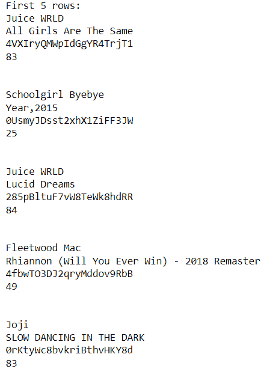

图 4.1 – spotify_data.csv 文件的前五行

## 它是如何工作的...

看看下面的代码：

```py
import csv
filename = "spotify_data.csv"
columns = []
rows = []
```

在“如何做...”部分的第一个步骤中，我们导入了内置库并指定了我们的文件名。由于它与我们的 Python 脚本位于同一目录级别，因此不需要包含完整路径。然后我们声明了两个列表：一个用于存储我们的列名（或 CSV 的第一行），另一个用于存储我们的行。

然后，我们使用了`with open`语句。在幕后，`with`语句创建了一个上下文管理器，它简化了文件处理器的打开和关闭。

`(filename, 'r')`表示我们想要使用`filename`并且只读取它（`'r'`）。之后，我们读取文件，并使用`next()`方法将第一行存储在我们的`columns`列表中，该方法从迭代器返回下一个项目。对于其余的记录（或行），我们使用了`for`迭代来将它们存储在一个列表中。

由于声明的变量都是列表，我们可以很容易地使用`for`迭代器读取它们。

## 更多内容...

对于这个菜谱，我们使用了 Python 内置的 CSV 库，并为处理 CSV 文件的列和行创建了一个简单的结构；然而，使用 pandas 有一个更直接的方法来做这件事。

pandas 是一个 Python 库，它被构建用来通过将其转换为称为**DataFrame**的结构来分析和操作数据。如果您对此概念感到陌生，请不要担心；我们将在接下来的菜谱和章节中介绍它。

让我们看看使用 pandas 读取 CSV 文件的一个例子：

1.  我们需要安装 pandas。为此，请使用以下命令：

    ```py
    $ pip install pandas
    ```

注意

请记住使用与您的 Python 版本关联的`pip`命令。对于一些读者来说，最好使用`pip3`。您可以使用 CLI 中的`pip –version`命令验证`pip`的版本和关联的 Python 版本。

1.  然后，我们读取 CSV 文件：

    ```py
    import pandas as pd
    spotify_df = pd.read_csv('spotify_data.csv')
    spotify_df.head()
    ```

您应该得到以下输出：

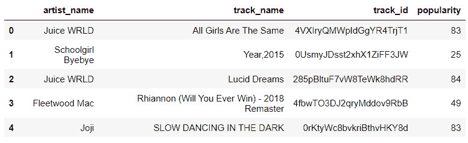

图 4.2 – spotify_df DataFrame 前五行

注意

由于其特定的渲染能力，这种**友好**的可视化只能在 Jupyter Notebook 中使用时看到。如果您在命令行或代码中执行`.head()`方法，输出将完全不同。

## 参见

安装 pandas 还有其他方法，您可以在以下链接中探索一种方法：[`pandas.pydata.org/docs/getting_started/install.xhtml`](https://pandas.pydata.org/docs/getting_started/install.xhtml)。

# 读取 JSON 文件

**JavaScript 对象表示法**（**JSON**）是一种半结构化数据格式。一些文章也将 JSON 定义为非结构化数据格式，但事实是这种格式可以用于多种目的。

JSON 结构使用嵌套的对象和数组，由于其灵活性，许多应用程序和 API 都使用它来导出或共享数据。这就是为什么在本章中描述这种文件格式是至关重要的。

本菜谱将探讨如何使用内置的 Python 库读取 JSON 文件，并解释这个过程是如何工作的。

注意

JSON 是 XML 文件的替代品，XML 文件非常冗长，并且需要更多的代码来操作其数据。

## 准备工作

这个食谱将要使用 GitHub 事件 JSON 数据，这些数据可以在本书的 GitHub 仓库中找到，网址为 [`github.com/jdorfman/awesome-json-datasets`](https://github.com/jdorfman/awesome-json-datasets)，以及其他免费 JSON 数据。

要检索数据，点击 `.json` 文件。

## 如何做到这一点...

按照以下步骤完成这个食谱：

1.  让我们先从读取文件开始：

    ```py
    import json
    filename_json = 'github_events.json'
    with open (filename_json, 'r') as f:
        github_events = json.loads(f.read())
    ```

1.  现在，让我们通过让这些行与我们的 JSON 文件交互来获取数据：

    ```py
    id_list = [item['id'] for item in github_events]
    print(id_list)
    ```

输出如下所示：

```py
['25208138097',
 '25208138110',
 (...)
 '25208138008',
 '25208137998']
```

## 它是如何工作的...

看看以下代码：

```py
import json
filename_json = 'github_events.json'
```

对于 CSV 文件，Python 也有一个内置的 JSON 文件库，我们通过导入它来开始我们的脚本。然后，我们定义一个变量来引用我们的文件名。

看看以下代码：

```py
with open (filename_json, 'r') as f:
    github_events = json.loads(f.read())
```

使用 `open()` 函数，我们打开 JSON 文件。`json.loads()` 语句不能打开 JSON 文件。为了做到这一点，我们使用了 `f.read()`，它将返回文件的内容，然后将其作为参数传递给第一个语句。

然而，这里有一个技巧。与 CSV 文件不同，我们并没有一行单独的列名。相反，每个数据记录都有自己的键来表示数据。由于 JSON 文件与 Python 字典非常相似，我们需要遍历每个记录来获取文件中的所有 `id` 值。

为了简化这个过程，我们在列表中创建了一个以下单行 `for` 循环：

```py
id_list = [item['id'] for item in github_events]
```

## 还有更多...

尽管使用 Python 的内置 JSON 库看起来非常简单，但更好地操作数据或通过一行进行过滤，在这种情况下，可能会创建不必要的复杂性。我们可以再次使用 **pandas** 来简化这个过程。

让我们用 pandas 读取 JSON。看看以下代码：

```py
import pandas as pd
github_events = pd.read_json('github_events.json')
github_events.head(3)
```

输出如下所示：

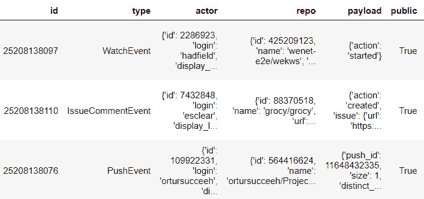

图 4.3 – github_events DataFrame 前五行

然后，让我们获取 `id` 列表：

```py
github_events['id']
```

输出如下所示：

```py
0     25208138097
1     25208138110
2     25208138076
(...)
27    25208138012
28    25208138008
29    25208137998
Name: id, dtype: int64
```

就像我们之前读取 CSV 文件一样，使用 pandas 读取 JSON 文件非常简单，节省了大量时间和代码来获取我们所需的信息。在第一个例子中，我们需要遍历 JSON 对象列表，而 pandas 本地将其理解为一个 DataFrame。由于每个列都表现得像一个一维数组，我们可以通过传递列名（或键）到 DataFrame 名称来快速获取值。

就像任何其他库一样，pandas 有其局限性，例如同时读取多个文件、并行处理或读取大型数据集。考虑到这一点可以防止问题发生，并帮助我们最优地使用这个库。

### 为什么使用 DataFrame？

DataFrame 是二维和大小可变的表格结构，在视觉上类似于结构化表格。由于它们的通用性，它们在如 pandas（如我们之前所见）等库中被广泛使用。

**PySpark** 与此不同。**Spark** 使用 DataFrame 作为分布式数据集合，并且可以 *并行化* 其任务，通过其他核心或节点来处理。我们将在 *第七章* 中更深入地介绍这一点。

## 参见

要了解更多关于 pandas 库支持的文件的信息，请点击以下链接：[`pandas.pydata.org/pandas-docs/stable/user_guide/io.xhtml`](https://pandas.pydata.org/pandas-docs/stable/user_guide/io.xhtml)。

# 为 PySpark 创建 SparkSession

在 *第一章* 中之前介绍过的，**PySpark** 是一个为与 Python 一起工作而设计的 Spark 库。PySpark 使用 Python API 来编写 **Spark** 功能，如数据处理、处理（批量或实时）和机器学习。

然而，在用 PySpark 导入或处理数据之前，我们必须初始化一个 SparkSession。本食谱将教会我们如何使用 PySpark 创建 SparkSession，并解释其重要性。

## 准备工作

我们首先需要确保我们拥有正确的 PySpark 版本。我们在 *第一章* 中安装了 PySpark；然而，检查我们是否使用正确的版本总是好的。运行以下命令：

```py
$ pyspark –version
```

你应该看到以下输出：

```py
Welcome to
      ____              __
     / __/__  ___ _____/ /__
    _\ \/ _ \/ _ `/ __/  '_/
   /___/ .__/\_,_/_/ /_/\_\   version 3.1.2
      /_/
Using Scala version 2.12.10, OpenJDK 64-Bit Server VM, 1.8.0_342
Branch HEAD
Compiled by user centos on 2021-05-24T04:27:48Z
Revision de351e30a90dd988b133b3d00fa6218bfcaba8b8
Url https://github.com/apache/spark
Type --help for more information.
```

接下来，我们选择一个代码编辑器，可以是任何你想要的代码编辑器。我将使用 Jupyter，因为它具有交互式界面。

## 如何操作...

让我们看看如何创建 SparkSession：

1.  我们首先创建 `SparkSession` 如下：

    ```py
    from pyspark.sql import SparkSession
    spark = SparkSession.builder \
          .master("local[1]") \
          .appName("DataIngestion") \
          .config("spark.executor.memory", '1g') \
          .config("spark.executor.cores", '3') \
          .config("spark.cores.max", '3') \
          .enableHiveSupport() \
          .getOrCreate()
    ```

这是收到的警告：

```py
22/11/14 11:09:55 WARN Utils: Your hostname, DESKTOP-DVUDB98 resolves to a loopback address: 127.0.1.1; using 172.27.100.10 instead (on interface eth0)
22/11/14 11:09:55 WARN Utils: Set SPARK_LOCAL_IP if you need to bind to another address
22/11/14 11:09:56 WARN NativeCodeLoader: Unable to load native-hadoop library for your platform... using builtin-java classes where applicable
Using Spark's default log4j profile: org/apache/spark/log4j-defaults.properties
Setting default log level to "WARN".
To adjust logging level use sc.setLogLevel(newLevel). For SparkR, use setLogLevel(newLevel).
```

执行代码时，我们不会得到任何输出。另外，不要担心 `WARN` 消息；它们不会影响我们的工作。

1.  然后我们获取 Spark UI。为此，在你的 Jupyter 单元中，按照以下方式输入并执行实例名称：

    ```py
    spark
    ```

你应该看到以下输出：

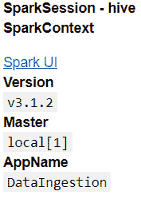

图 4.4 – 实例执行输出

1.  接下来，我们在浏览器中访问 SparkUI。为此，我们点击 **Spark UI** 超链接。它将在你的浏览器中打开一个新标签页，显示一个包含 **Executors** 和 **Jobs** 以及其他有用信息的图表：

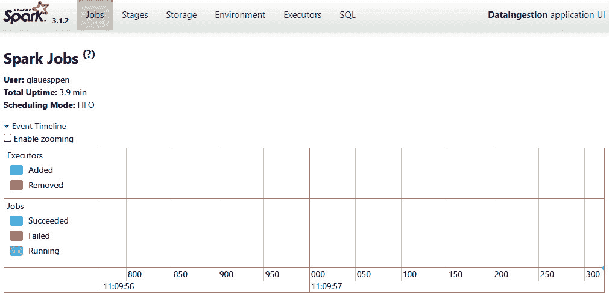

图 4.5 – 带有事件时间线图的 Spark UI 主页

由于我们还没有执行任何过程，图表是空的。不要担心；我们将在接下来的食谱中看到它的实际应用。

## 工作原理...

正如我们在本章开头所看到的，SparkSession 是启动我们的 Spark 作业的基本部分。它为 **Spark 的 YARN**（即 **Yet Another Resource Manager**）设置所有必需的配置，以便分配内存、核心、写入临时和最终输出的路径等。

在此基础上，让我们查看代码的每个步骤：

```py
 spark = .builder \
```

要执行创建 DataFrame 等操作，我们需要使用一个实例。`spark` 变量将用于访问 DataFrame 和其他程序。现在，看看这个：

```py
       .master("local[1]") \
      .appName("DataIngestion") \
```

`.master()`方法指示我们使用了哪种类型的分布式处理。由于这是我们仅用于教育目的的本地机器，我们将其定义为`"local[1]"`，其中整数值需要大于`0`，因为它表示分区数。`.appName()`方法定义了我们的应用程序会话名称。

在声明我们的应用程序名称后，我们可以设置`.config()`方法：

```py
      .config("spark.executor.memory", '1g') \
      .config("spark.executor.cores", '3') \
      .config("spark.cores.max", '3') \
      .enableHiveSupport() \
```

在这里，我们定义了两种类型的配置：内存分配和核心分配。`spark.executor.memory`告诉 YARN 每个执行器可以分配多少内存来处理数据；`g`代表其大小单位。

`spark.executor.cores`定义了 YARN 使用的执行器数量。默认情况下，使用`1`。接下来，`spark.cores.max`设置 YARN 可以扩展的核心数量。

最后，`.enableHiveSupport()`启用了对 Hive 查询的支持。

最后，让我们看看这个：

```py
      .getOrCreate()
```

`.getOrCreate()`就像它的名字一样简单。如果有这个名称的会话，它将检索其配置。如果没有，它将创建一个新的。

## 还有更多...

查看 Spark 文档页面，你会看到大多数配置不是启动我们的作业或数据摄取所必需的。然而，我们必须记住，我们正在处理一个可扩展的框架，该框架旨在在单个机器或集群中分配资源以处理大量数据。如果没有为 SparkSession 设置限制，YARN 将分配它处理或摄取数据所需的所有资源，这可能导致服务器停机，甚至冻结整个本地机器。

在现实世界的场景中，Kubernetes 集群通常用于与其他应用程序或用户摄取或处理共享数据，这些用户或团队与你或你的团队做同样的事情。物理内存和计算资源往往有限，因此始终设置配置是一个非常好的做法，即使在小型项目中使用无服务器云解决方案也是如此。

### 获取所有配置

使用以下代码也可以检索此应用程序会话当前使用的配置：

```py
spark.sparkContext.getConf().getAll()
```

这是我们的结果：

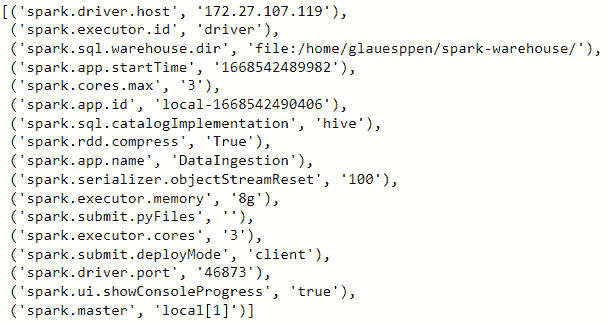

图 4.6 – 为配方设置的配置

## 参见

+   查看所有配置：[`spark.apache.org/docs/latest/configuration.xhtml`](https://spark.apache.org/docs/latest/configuration.xhtml)

+   在 Spark 的早期版本中，SparkContext 是处理数据时的起点，在最新版本中被取代。你可以在这里了解更多信息：[`sparkbyexamples.com/spark/-vs-sparkcontext/`](https://sparkbyexamples.com/spark/-vs-sparkcontext/)。

# 使用 PySpark 读取 CSV 文件

如预期，PySpark 为读取和写入 CSV 文件提供了原生支持。它还允许数据工程师在 CSV 具有不同类型的分隔符、特殊编码等情况时传递各种设置。

在这个菜谱中，我们将介绍如何使用 PySpark 读取 CSV 文件，使用最常用的配置，并解释为什么需要它们。

## 准备工作

您可以从 Kaggle 下载此菜谱的 CSV 数据集：[`www.kaggle.com/datasets/jfreyberg/spotify-chart-data`](https://www.kaggle.com/datasets/jfreyberg/spotify-chart-data)。我们将使用与 *第二章* 中相同的 Spotify 数据集。

就像在 *为 PySpark 创建 SparkSession* 菜谱中一样，请确保 PySpark 已安装并运行最新稳定版本。此外，使用 Jupyter Notebook 是可选的。

## 如何做到这一点…

让我们开始吧：

1.  我们首先导入并创建一个 SparkSession：

    ```py
    from pyspark.sql import
    spark = .builder \
          .master("local[1]") \
          .appName("DataIngestion_CSV") \
          .config("spark.executor.memory", '3g') \
          .config("spark.executor.cores", '1') \
          .config("spark.cores.max", '1') \
          .getOrCreate()
    ```

1.  然后，我们读取 CSV 文件：

    ```py
    df = spark.read.option('header',True).csv('spotify_data.csv')
    ```

1.  然后，我们展示数据

    ```py
    df.show()
    ```

这是我们的结果：

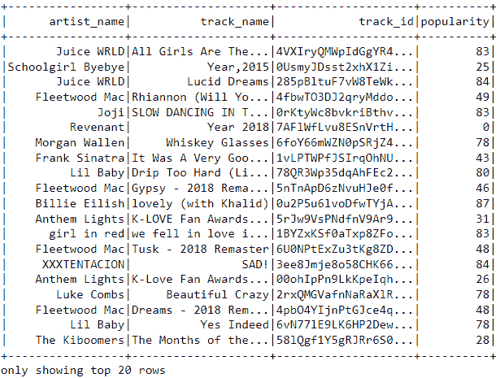

图 4.7 – 使用 Spark 查看 spotify_data.csv DataFrame

## 它是如何工作的…

虽然很简单，但我们需要了解 Spark 读取文件的方式，以确保它始终正确执行：

```py
df = spark.read.option('header',True).csv('spotify_data.csv')
```

我们将一个变量分配给我们的代码语句。在初始化任何文件读取时，这是一个好的做法，因为它允许我们控制文件的版本，如果需要做出更改，我们可以将其分配给另一个变量。变量的名称也是故意的，因为我们正在创建我们的第一个 DataFrame。

使用 `.option()` 方法允许我们告诉 PySpark 我们想要传递哪种类型的配置。在这种情况下，我们将 `header` 设置为 `True`，这使得 PySpark 将 CSV 文件的第一个行设置为列名。如果我们没有传递所需的配置，DataFrame 将看起来像这样：

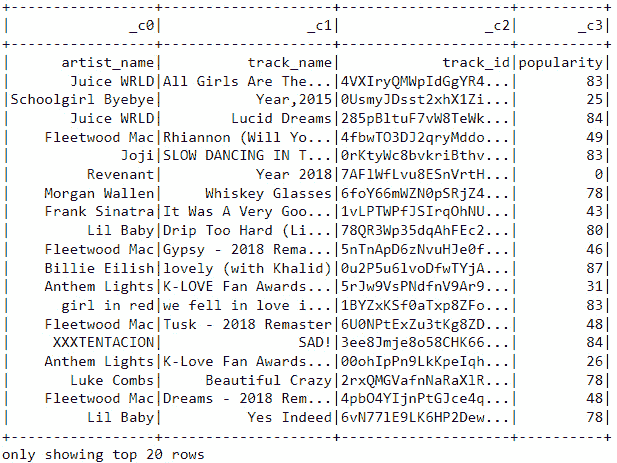

图 4.8 – 没有列名的 spotify_data.csv DataFrame

## 更多内容…

文件的内容可能不同，但在 PySpark 处理 CSV 文件时，一些设置是受欢迎的。在这里，请注意，我们将更改方法为 `.options()`：

```py
df = spark.read.options(header= 'True',
                       sep=',',
                       inferSchema='True') \
                .csv('spotify_data.csv')
```

`header`、`sep` 和 `inferSchema` 是读取 CSV 文件时最常用的设置。尽管 CSV 代表 `sep`（代表分隔符）声明。

让我们看看读取使用管道分隔字符串并传递错误分隔符的 CSV 文件时出现的错误示例：

```py
df = spark.read.options(header= 'True',
                       sep=',',
                       inferSchema='True') \
                .csv('spotify_data_pipe.csv')
```

这就是输出看起来像这样：

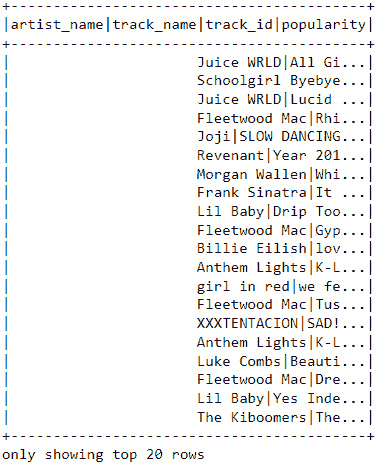

图 4.9 – 在没有正确设置 sep 定义的情况下读取 CSV DataFrame

如您所见，它只创建了一个包含所有信息的列。但如果我们传递 `sep='|'`，它将正确返回：

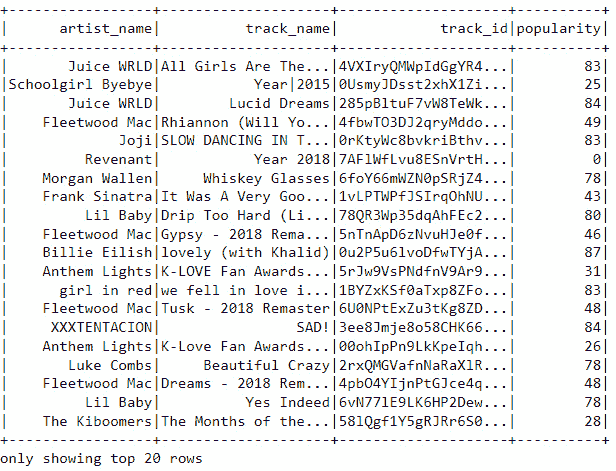

图 4.10 – 将 sep 定义设置为管道的 CSV DataFrame

### 其他常见的 `.options()` 配置

在数据导入过程中，还有其他复杂情况，如果不进行纠正，可能会导致其他 ETL 步骤出现一些问题。这里，我使用的是 `listing.csv` 数据集，可以在以下链接找到：[`data.insideairbnb.com/the-netherlands/north-holland/amsterdam/2022-03-08/visualisations/listings.csv`](http://data.insideairbnb.com/the-netherlands/north-holland/amsterdam/2022-03-08/visualisations/listings.csv)：

1.  我们首先读取我们的通用配置：

    ```py
    df_broken = spark.read.options(header= 'True', sep=',',
                           inferSchema='True') \
                    .csv('listings.csv')
    df_broken.show()
    ```

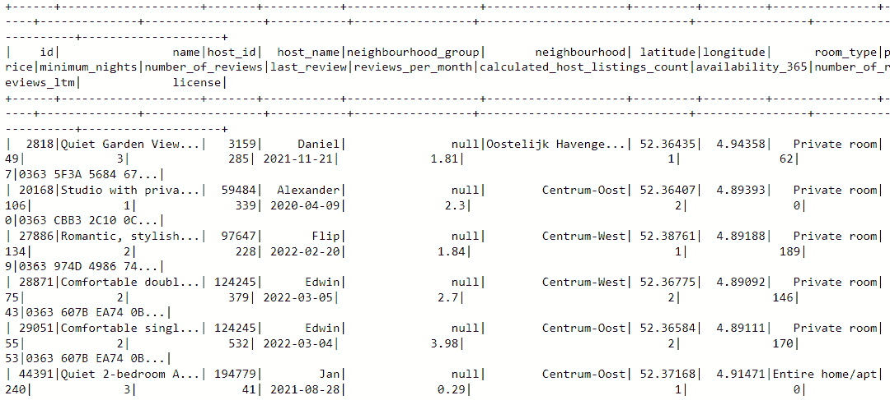

图 4.11 – listing.csv DataFrame

初看一切正常。然而，如果我尝试使用 `room_type` 执行一个简单的分组操作会发生什么呢？

```py
group = df_1.groupBy("room_type").count()
group.show()
```

这是我们的输出：

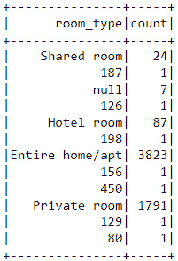

图 4.12 – 按房间类型分组 df_broken

目前忽略 `group by`，这是因为文件中有大量的转义引号和换行符。

1.  现在，让我们设置正确的 `.options()`：

    ```py
    df_1 = spark.read.options(header=True, sep=',',
                              multiLine=True, escape='"') \
                    .csv('listings.csv')
    group = df_1.groupBy("room_type").count()
    group.show()
    ```

这是结果：

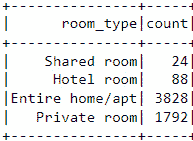

图 4.13 – 使用正确的 options() 设置按房间类型分组

## 参见

你可以在官方文档中查看更多 PySpark `.options()`：[`spark.apache.org/docs/latest/sql-data-sources-csv.xhtml`](https://spark.apache.org/docs/latest/sql-data-sources-csv.xhtml)。

# 使用 PySpark 读取 JSON 文件

在“读取 JSON 文件”的菜谱中，我们了解到 JSON 文件广泛用于在应用程序之间传输和共享数据，我们也看到了如何使用简单的 Python 代码读取 JSON 文件。

然而，随着数据量和共享的增加，仅使用 Python 处理大量数据可能会导致性能或弹性问题。这就是为什么，对于这种场景，强烈建议使用 PySpark 读取和处理 JSON 文件。正如你所预期的，PySpark 提供了一个直接的读取解决方案。

在这个菜谱中，我们将介绍如何使用 PySpark 读取 JSON 文件，以及常见的相关问题和解决方法。

## 准备工作

与之前的菜谱“读取 JSON 文件”一样，我们将使用 `GitHub Events` JSON 文件。此外，使用 Jupyter Notebook 是可选的。

## 如何做...

下面是这个菜谱的步骤：

1.  我们首先创建 SparkSession：

    ```py
    spark = .builder \
          .master("local[1]") \
          .appName("DataIngestion_JSON") \
          .config("spark.executor.memory", '3g') \
          .config("spark.executor.cores", '1') \
          .config("spark.cores.max", '1') \
          .getOrCreate()
    ```

1.  然后，我们读取 JSON 文件：

    ```py
    df_json = spark.read.option("multiline", "true") \
                        .json('github_events.json')
    ```

1.  然后，我们展示数据：

    ```py
    df_json.show()
    ```

这是输出结果：

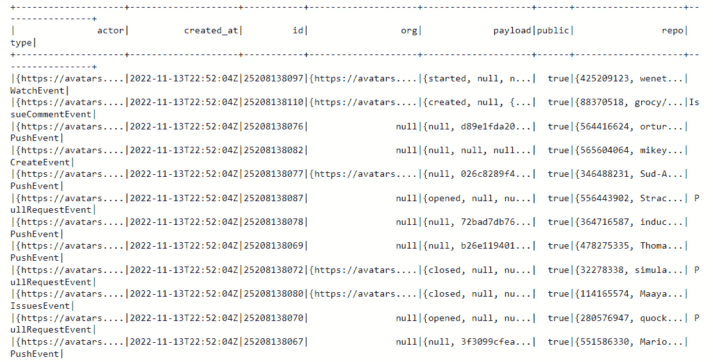

图 4.14 – df_json DataFrame

## 它是如何工作的...

与 CSV 文件类似，使用 PySpark 读取 JSON 文件非常简单，只需要一行代码。就像 pandas 一样，它忽略了文件中的括号，并创建了一个表格结构的 DataFrame，尽管我们正在处理一个半结构化数据文件。然而，真正的魔法在于 `.option("multiline", "true")`。

如果你记得这个文件的 JSON 结构，它可能像这样：

```py

  {
    "id": "25208138097",
    "type": "WatchEvent",
    "actor": {...},
    "repo": {...},
    "payload": {
      "action": "started"
    },
    "public": true,
    "created_at": "2022-11-13T22:52:04Z",
    "org": {...}
  },
  {
    "id": "25208138110",
    "type": "IssueCommentEvent",
    "actor": {...},
    "repo": {...},
  },...
```

由于它包含对象中的对象，这是一个多行 JSON。在读取文件时传递的 `.option()` 设置确保 PySpark 会按预期读取它，如果我们不传递此参数，将出现如下错误：


# 进一步阅读

+   [`docs.fileformat.com/spreadsheet/csv/`](https://docs.fileformat.com/spreadsheet/csv/)

+   [`codefather.tech/blog/python-with-open/`](https://codefather.tech/blog/python-with-open/)

+   [`www.programiz.com/python-programming/methods/built-in/next`](https://www.programiz.com/python-programming/methods/built-in/next)

+   [`spark.apache.org/docs/latest/sql-data-sources-csv.xhtml`](https://spark.apache.org/docs/latest/sql-data-sources-csv.xhtml)

+   [`sparkbyexamples.com/pyspark/pyspark-read-json-file-into-dataframe/`](https://sparkbyexamples.com/pyspark/pyspark-read-json-file-into-dataframe/)
