# 第八章：设计受监控的数据工作流程

日志代码是一种良好的实践，它允许开发者更快地调试并提供更有效的应用程序或系统维护。插入日志时没有严格的规则，但了解在使用时何时不要过度使用您的监控或警报工具是非常好的。不必要地创建多个日志消息会模糊重要事件发生的实例。这就是为什么理解在代码中插入日志的最佳实践至关重要。

本章将展示如何使用 Python 和 PySpark 为数据管道创建高效且格式良好的日志，并通过实际示例说明，这些示例可以应用于现实世界项目。

在本章中，我们有以下食谱：

+   插入日志

+   使用日志级别类型

+   创建标准化的日志

+   监控我们的数据摄入文件大小

+   基于数据的日志记录

+   获取 SparkSession 指标

# 技术要求

您可以从本章节的 GitHub 仓库中找到代码，网址为 [`github.com/PacktPublishing/Data-Ingestion-with-Python-Cookbook`](https://github.com/PacktPublishing/Data-Ingestion-with-Python-Cookbook)。

# 插入日志

如本章引言中所述，将日志功能添加到您的应用程序对于调试或以后进行改进至关重要。然而，不必要地创建多个日志消息可能会引起混淆，甚至导致我们错过关键警报。无论如何，了解显示哪种类型的信息是必不可少的。

本食谱将介绍如何使用 Python 创建有用的日志消息，以及何时插入它们。

## 准备工作

我们将仅使用 Python 代码。请确保您有 Python 3.7 或更高版本。您可以使用以下命令来检查您的 **命令行界面**（**CLI**）：

```py
$ python3 –-version
Python 3.8.10
```

以下代码执行可以在 Python 壳或 Jupyter 笔记本中完成。

## 如何操作…

为了进行这个练习，我们将创建一个函数，该函数使用最佳日志记录实践读取并返回 CSV 文件的第一行。以下是我们的操作方法：

1.  首先，让我们导入我们将使用的库，并设置我们的 `logging` 库的主要配置：

    ```py
    import csv
    import logging
    logging.basicConfig(filename='our_application.log', level=logging.INFO)
    ```

注意，我们向 `basicConfig` 方法传递了一个文件名参数。我们的日志将存储在那里。

1.  接下来，我们将创建一个简单的函数来读取并返回 CSV 文件的第一行。请注意，`logging.info()` 调用带有消息插入到函数内部，如下所示：

    ```py
    def get_csv_first_line (csv_file):
        logging.info(f"Starting function to read first line")
        try:
            with open(csv_file, 'r') as file:
                logging.info(f" Opening and reading the CSV file")
                reader = csv.reader(file)
                first_row = next(reader)
            return first_row
        except Exception as e:
            logging.error(f"Error when reading the CSV file: {e}")
            raise
    ```

1.  然后，让我们调用我们的函数，传递一个 CSV 文件作为示例。在这里，我将使用 `listings.csv` 文件，您可以在 GitHub 仓库中找到它，如下所示：

    ```py
    get_csv_first_line("listings.csv")
    ```

您应该看到以下输出：

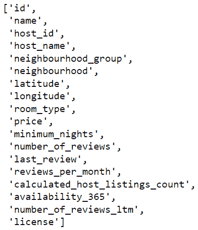

图 8.1 – gets_csv_first_line 函数输出

1.  让我们检查我们执行 Python 脚本或 Jupyter 笔记本所在的目录。您应该看到一个名为 `our_application.log` 的文件。如果您点击它，结果应该如下所示：

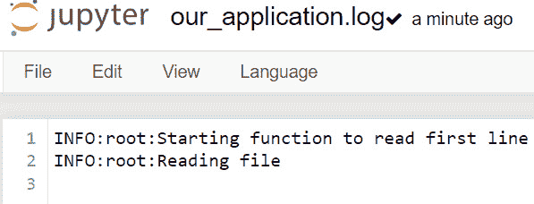

图 8.2 – our_application.log 内容

如你所见，我们有两个不同的输出：一个包含函数结果（*步骤 3*）的输出，另一个创建包含日志消息的文件（*步骤 4*）。

## 它是如何工作的...

让我们通过查看前几行来开始理解代码是如何工作的：

```py
import logging
logging.basicConfig(filename='our_application.log', level=logging.INFO)
```

在导入内置的日志库后，我们调用了一个名为`basicConfig()`的方法，它为我们的函数中的后续调用设置了主要配置。`filename`参数表示我们想要将日志保存到文件中，而`level`参数设置了我们想要开始看到消息的日志级别。这将在本章后面的“使用日志级别类型”菜谱中更详细地介绍。

然后，我们继续创建我们的函数并插入日志调用。仔细观察，我们插入了以下内容：

```py
logging.info(f"Starting function to read first line")
logging.info(f"Opening and reading the CSV file")
```

这两个日志是信息性的，跟踪一个动作或在我们通过代码或模块的一部分时通知我们。最佳实践是尽可能保持其清洁和客观，这样下一个人（甚至你自己）就可以确定从哪里开始解决问题。

下一个日志通知我们一个错误，正如你在这里可以看到的：

```py
logging.error(f"Error when reading the CSV file: {e}")
```

调用此错误方法的方式与`.info()`类似。在这种情况下，最佳实践是只使用异常子句并将错误作为字符串函数传递，就像我们通过在大括号中传递`e`变量所做的那样。这样，即使我们看不到 Python 跟踪信息，我们也会将其存储在文件或监控应用程序中。

注意

将异常输出封装在变量中是一种常见的做法，例如`except Exception as e`。这允许我们控制如何显示或获取错误消息的一部分。

由于我们的函数执行成功，我们预计在`our_application.log`文件中不会看到任何错误消息，正如你在这里可以看到的：

```py
INFO:root:Starting function to read first line
INFO:root:Reading file
```

如果我们仔细观察保存的日志结构，我们会注意到一个模式。每行的第一个单词`INFO`表示日志级别；之后我们看到`root`这个词，表示日志层次结构；最后，我们得到我们插入到代码中的消息。

我们可以通过多种方式优化和格式化我们的日志，但我们现在不会担心这个问题。我们将在“格式化日志”菜谱中更详细地介绍日志层次结构。

## 另请参阅

在这里了解更多关于在 Python 中初始化日志的官方文档：[`docs.python.org/3/howto/logging.xhtml#logging-to-a-file`](https://docs.python.org/3/howto/logging.xhtml#logging-to-a-file)

# 使用日志级别类型

现在我们已经介绍了如何以及在哪里插入日志，让我们了解日志类型或级别。每个日志级别在系统内部都有其自己的相关性程度。例如，默认情况下控制台输出不会显示调试信息。

我们已经在*第六章*的*将格式化的 SparkSession 日志插入以方便您的工作流程*中介绍了如何使用 PySpark 记录日志级别。现在我们将仅使用 Python 来完成同样的操作。这个菜谱旨在展示如何在脚本开始时设置日志级别，并在代码中插入不同级别的日志以创建日志的优先级层次结构。有了这个，您可以创建一个结构化的脚本，允许您或您的团队能够监控和识别错误。

## 准备工作

我们将仅使用 Python 代码。请确保您有 Python 3.7 或更高版本。您可以在 CLI 上使用以下命令来检查您的版本：

```py
$ python3 –-version
Python 3.8.10
```

以下代码执行可以在 Python shell 或 Jupyter 笔记本上完成。

## 如何操作…

让我们使用之前在*插入日志*菜谱中使用的相同示例，并进行一些改进：

1.  让我们从导入库和定义`basicConfig`开始。这次，我们将日志级别设置为`DEBUG`：

    ```py
    import csv
    import logging
    logging.basicConfig(filename='our_application.log', level=logging.DEBUG)
    ```

1.  然后，在声明函数之前，我们将插入一个`DEBUG`日志，告知我们即将测试此脚本：

    ```py
    logging.debug(f"Start testing function")
    ```

1.  接下来，正如我们在*插入日志*菜谱中所见，我们将构建一个函数，该函数读取 CSV 文件并返回第一行，但有一些细微的变化。让我们在 CSV 的第一行执行成功后插入一个`DEBUG`消息，如果遇到异常则插入一个`CRITICAL`消息：

    ```py
    def gets_csv_first_line (csv_file):
        logging.info(f"Starting function to read first line")
        try:
            with open(csv_file, 'r') as file:
                logging.info(f"Reading file")
                reader = csv.reader(file)
                first_row = next(reader)
                logging.debug(f"Finished without problems")
            return first_row
        except Exception as e:
            logging.debug(f"Entered into a exception")
            logging.error(f"Error when reading the CSV file: {e}")
            logging.critical(f"This is a critical error, and the application needs to stop!")
            raise
    ```

1.  最后，在我们调用函数之前，让我们插入一个警告消息，告知我们即将开始执行：

    ```py
    logging.warning(f"Starting the function to get the first line of a CSV")
    gets_csv_first_line("listings.csv")
    ```

1.  在调用函数后，您应该在`our_application.log`文件中看到以下输出：

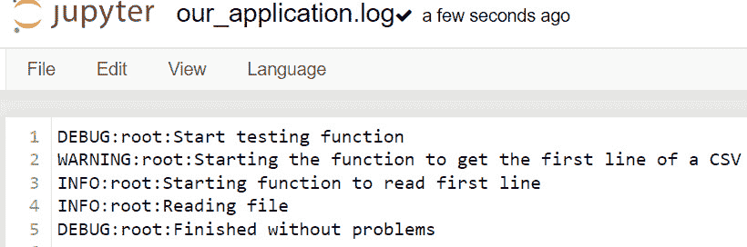

图 8.3 – our_application.log 更新了不同的日志级别

它告诉我们函数已正确执行且没有发生错误。

1.  现在我们模拟一个错误。您现在应该在`our_application.log`文件中看到以下消息：

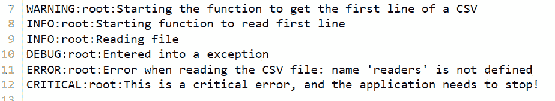

图 8.4 – our_application.log 显示的错误消息

如您所见，我们遇到了异常，并且我们可以看到`ERROR`和`CRITICAL`消息。

## 如何工作…

虽然这可能看起来无关紧要，但我们已经对我们的函数进行了有益的改进。每个日志级别都对应着不同程度的关键性，与正在发生的事情相关。让我们看看以下图表，它显示了每个级别的权重：

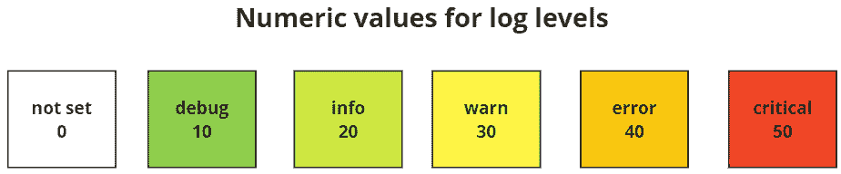

图 8.5 – 根据关键性日志级别的权重图

根据日志级别插入的位置，它可以防止脚本继续执行并创建错误链，因为我们可以根据级别添加不同的错误处理器。

默认情况下，Python 日志库配置为仅显示`DEBUG`级别的消息，正如您在这里所看到的：

```py
logging.basicConfig(filename='our_application.log', level=logging.DEBUG)
```

仅显示**警告**消息及以上的目的是为了避免在控制台输出或日志文件中充斥着不必要的系统信息。在以下图中，您可以查看 Python 内部如何组织其日志级别：

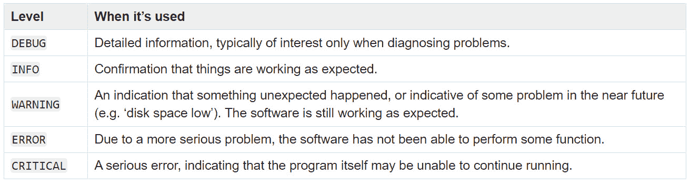

图 8.6 – 日志级别详细描述及其最佳使用时机（来源：[`docs.python.org/3/howto/logging.xhtml`](https://docs.python.org/3/howto/logging.xhtml)）

您可以在设置代码中的日志消息时使用此表作为参考。它也可以在官方 Python 文档中找到：[`docs.python.org/3/howto/logging.xhtml#when-to-use-logging`](https://docs.python.org/3/howto/logging.xhtml#when-to-use-logging)。

在这个菜谱中，我们试图涵盖所有日志严重级别，以展示推荐的插入位置。尽管这看起来可能很简单，但知道何时使用每个级别可以带来很大的不同，并使您的应用程序更加成熟。

## 更多内容…

通常，每种语言都有其结构化的日志级别形式。然而，在软件工程领域，关于如何使用这些级别存在一种*共识*。以下图显示了由*Taco Jan Osinga*创建的关于操作系统（**OS**）级别日志级别行为的出色决策图。

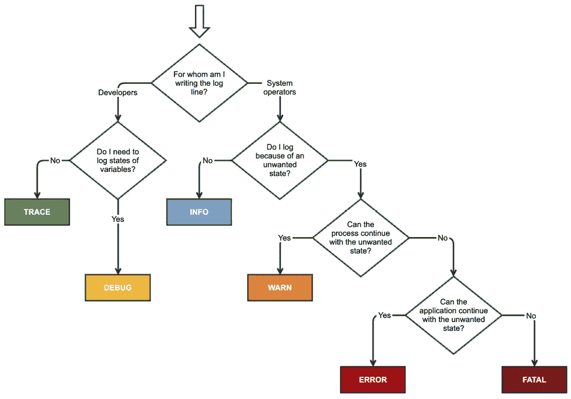

图 8.7 – Taco Jan Osinga 的日志级别决策图（来源：https://stackoverflow.com/users/3476764/taco-jan-osinga?tab=profile)

## 参见

更多关于 Python 日志基础的详细信息，请参阅官方文档：[`docs.python.org/3/howto/logging.xhtml`](https://docs.python.org/3/howto/logging.xhtml)

# 创建标准化的日志

现在我们已经了解了插入日志和使用日志级别的最佳实践，我们可以向日志中添加更多相关信息，以帮助我们监控代码。例如，日期和时间或执行过的模块或函数等信息，有助于我们确定问题发生的位置或需要改进的地方。

创建应用程序日志或（在我们的情况下）数据管道日志的标准格式，可以使调试过程更加易于管理，并且有各种方法可以实现这一点。其中一种方法就是创建`.ini`或`.conf`文件，这些文件包含日志的格式化和应用配置，例如。

在这个菜谱中，我们将学习如何创建一个配置文件，该文件将决定日志在代码中的格式以及执行输出中的显示方式。

## 准备工作

让我们使用与之前*使用日志级别类型*菜谱相同的代码，但进行更多改进！

你可以使用以下代码在新的文件或笔记本中遵循此配方的步骤，或者重用 *使用日志级别类型* 配方中的函数。我更喜欢复制，这样第一段代码就保持不变：

```py
Def gets_csv_first_line(csv_file):
    logger.debug(f"Start testing function")
    logger.info(f"Starting function to read first line")
    try:
        with open(csv_file, 'r') as file:
            logger.info(f"Reading file")
            reader = csv.reader(file)
            first_row = next(reader)
            logger.debug(f"Finished without problems")
        return first_row
    except Exception as e:
        logger.debug(f"Entered into a exception")
        logger.error(f"Error when reading the CSV file: {e}")
        logger.critical(f"This is a critical error, and the application needs to stop!")
        raise
```

## 如何操作...

执行此配方的步骤如下：

1.  为了开始我们的练习，让我们创建一个名为 `logging.conf` 的文件。我的建议是将它存储在与你的 Python 脚本相同的目录中。然而，你也可以自由地将它放在其他地方，但请记住我们稍后需要文件的路径。

1.  接下来，将以下代码粘贴到 `logging.conf` 文件中并保存：

    ```py
    [loggers]
    keys=root,data_ingest
    [handlers]
    keys=fileHandler, consoleHandler
    [formatters]
    keys=logFormatter
    [logger_root]
    level=DEBUG
    handlers=fileHandler
    [logger_data_ingest]
    level=DEBUG
    handlers=fileHandler, consoleHandler
    qualname=data_ingest
    propagate=0
    [handler_consoleHandler]
    class=StreamHandler
    level=DEBUG
    formatter=logFormatter
    args=(sys.stdout,)
    [handler_fileHandler]
    class=FileHandler
    level=DEBUG
    formatter=logFormatter
    args=('data_ingest.log', 'a')
    [formatter_logFormatter]
    format=%(asctime)s - %(name)s - %(levelname)s - %(message)s
    ```

1.  然后，插入以下 `import` 语句、`config.fileConfig()` 方法以及 `logger` 变量，在 `gets_csv_first_line()` 函数之前，如你所见：

    ```py
    import csv
    import logging
    from logging import config
    # Loading configuration file
    config.fileConfig("logging.conf")
    # Creates a log configuration
    logger = logging.getLogger("data_ingest")
    def gets_csv_first_line(csv_file):
        …
    ```

注意，我们正在将 `logging.conf` 作为参数传递给 `config.fileConfig()` 方法。如果你将其存储在 Python 脚本的不同目录级别，请传递整个路径。

1.  现在，让我们通过传递一个 CSV 文件来调用我们的函数。像往常一样，我将使用 `listings.csv` 文件进行此练习：

    ```py
    gets_csv_first_line("listings."sv")
    ```

你应该在笔记本单元格或 Python 命令行界面中看到以下输出：

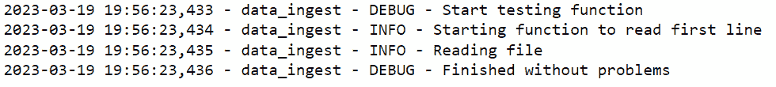

图 8.8 – 带有格式化日志的控制台输出

1.  然后，检查你的目录。你应该看到一个名为 `data_ingest.log` 的文件。打开它，你应该看到以下截图类似的内容：

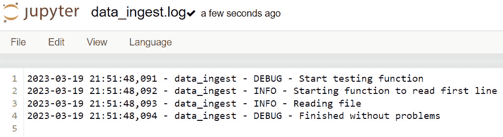

图 8.9 – 带有格式化日志的 data_ingest.log 文件

如你所观察到的，我们为控制台和文件输出创建了一个标准化的日志格式。现在，让我们在下一节中了解我们是如何做到这一点的。

## 工作原理...

在跳入代码之前，让我们首先了解配置文件是什么。`.conf` 或 `.ini` 文件扩展名提供了一种创建自定义应用程序以与其他应用程序交互的有用方式。你可以在操作系统的 `/etc` 或 `/var` 目录中找到一些。

我们的情况并无不同。在我们的配方开始时，我们创建了一个名为 `logging.conf` 的配置文件，该文件包含了我们将应用于整个应用程序的 Python 日志模式。

现在，让我们看看 `logging.conf` 文件内部。仔细观察，你可以在方括号内看到一些值。让我们从这里看到的第一个三个开始：

```py
[loggers]
[handlers]
[formatters]
```

这些参数是 Python 日志库的模块化组件，由于它们彼此分离，因此易于定制。简而言之，它们代表以下内容：

+   日志记录器被代码使用，并暴露了自身的接口。默认情况下，Python 使用一个 `root` 日志记录器。对于新的日志记录器，我们使用 `key` 参数。

+   处理器将日志发送到配置的目标位置。在我们的例子中，我们创建了两个：`fileHandler` 和 `consoleHandler`。

+   格式化器为日志记录创建布局。

在声明基本参数后，我们插入了两个自定义的日志记录器和处理器，如下所示：

```py
[logger_root]
[logger_data_ingest]
[handler_consoleHandler]
[handler_fileHandler]
```

为 `root` `Logger` 创建自定义不是强制性的，但在这里我们想要将默认日志级别更改为 `DEBUG` 并始终将其发送到 `fileHandler`。对于 `logger_data_ingest`，我们还传递了 `consoleHandler`。

说到处理器，它们在这里起着基本的作用。尽管它们共享相同的日志级别和 `Formatter`，但它们继承不同的类。`StreamHandler` 类捕获日志记录，通过 `args=(sys.stdout,)` 获取所有系统输出以在控制台输出中显示。`FileHandler` 的工作方式类似，将所有结果保存到 `DEBUG` 级别及以上。

最后，`Formatter` 决定了日志的显示方式。有许多方法可以设置格式，甚至可以传递执行日志的代码行。你可以在 https://docs.python.org/3/library/logging.xhtml#logrecord-attributes 查看所有可能的属性。

官方 Python 文档有一个优秀的图表，如下所示，概述了这些修饰符与我们未在此处介绍的其他修饰符之间的关系，称为 `Filter`。

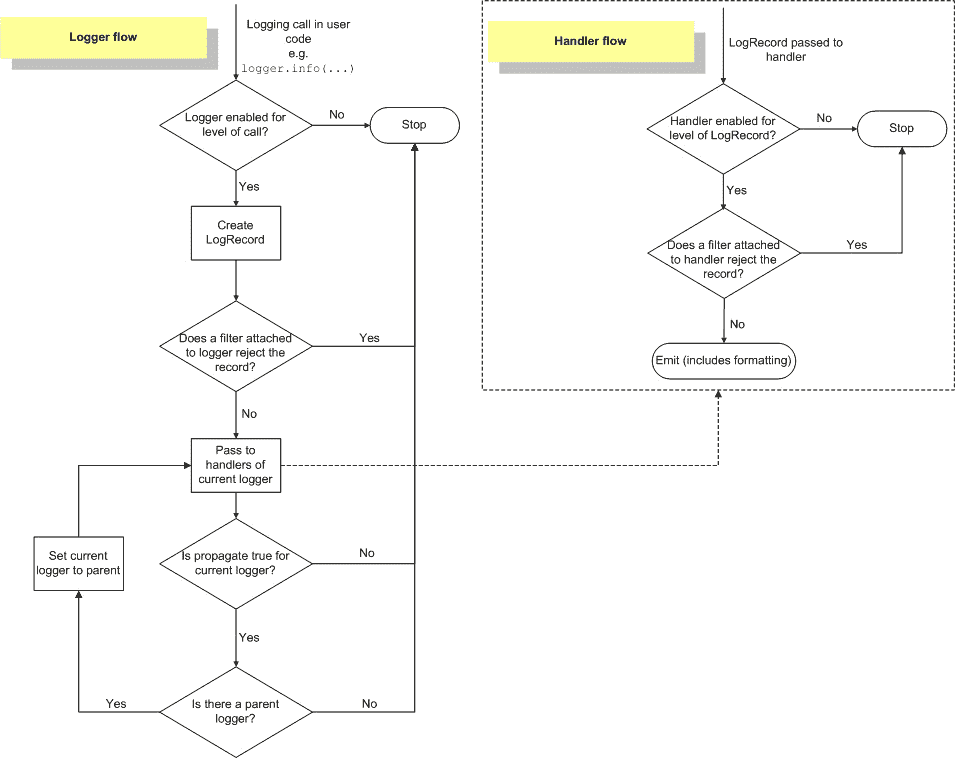

图 8.10 – 日志流程图（来源：https://docs.python.org/3/howto/logging.xhtml#logging-flow）

在我们的练习中，我们创建了一个简单的日志处理器，名为 `data_ingest`，以及 `gets_csv_first_line()` 函数。现在，想象一下它如何在整个应用程序或系统中扩展。使用单个配置文件，我们可以为不同的脚本或 ETL 阶段创建不同的模式。让我们看看我们代码的第一行：

```py
(...)
config.fileConfig("logging.conf")
logger = logging.getLogger("data_ingest")
(...)
```

`config.fileConfig()` 加载配置文件，`logging.getLogger()` 加载要使用的 `Logger` 实例。如果没有找到合适的 `Logger`，它将使用 `root` 作为默认值。

软件工程师通常在现实世界的应用程序中使用这种最佳实践来避免代码冗余并创建集中式解决方案。

## 还有更多…

有一些其他可接受的文件格式可以用来创建日志配置。例如，我们可以使用 **YAML Ain’t Markup Language**（**YAML**）文件或 Python 字典。

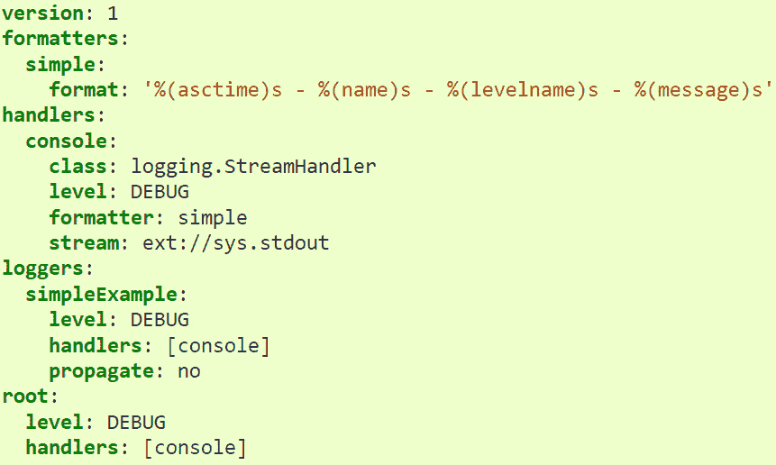

图 8.11 – 使用 YAML 格式配置文件（来源：https://docs.python.org/3/howto/logging.xhtml#configuring-logging）

如果你想了解更多关于使用 `logging.config` 包来创建改进的 YAML 或字典配置的信息，请参阅以下官方文档：[`docs.python.org/3/library/logging.config.xhtml#logging-config-api`](https://docs.python.org/3/library/logging.config.xhtml#logging-config-api)

## 参见

要阅读和理解更多关于处理器如何工作的信息，请参阅以下官方文档：[`docs.python.org/3/library/logging.handlers.xhtml`](https://docs.python.org/3/library/logging.handlers.xhtml)

# 监控我们的数据摄入文件大小

在摄入数据时，我们可以跟踪一些项目以确保传入的信息是我们预期的。其中最重要的项目之一是我们摄入的数据大小，这可能意味着文件大小或流数据的块大小。

记录摄入数据的尺寸允许创建智能和高效的监控。如果在某个时刻，摄入数据的尺寸与预期不符，我们可以采取行动进行调查和解决问题。

在本菜谱中，我们将创建简单的 Python 代码来记录摄入文件的尺寸，这在数据监控中非常有价值。

## 准备工作

我们将只使用 Python 代码。请确保您拥有 Python 3.7 或更高版本。您可以在您的命令行界面使用以下命令来检查您的版本：

```py
$ python3 –-version
Python 3.8.10
```

以下代码执行可以使用 Python shell 或 Jupyter notebook 完成。

## 如何做到这一点…

本练习将创建一个简单的 Python 函数，用于读取文件路径并默认返回其字节数。如果我们想以兆字节为单位返回值，我们只需要将输入参数作为 `True` 传递：

1.  让我们从导入 `os` 库开始：

    ```py
    import os
    ```

1.  然后，我们声明我们的函数，该函数需要一个文件路径，以及一个可选参数来将大小转换为兆字节：

    ```py
    def get_file_size(file_name, s_megabytes=False):
    ```

1.  让我们使用 `os.stat()` 从文件中检索信息：

    ```py
        file_stats = os.stat(file_name)
    ```

1.  由于它是可选的，我们可以创建一个 `if` 条件来将 `bytes` 值转换为 `megabytes`。如果没有标记为 `True`，我们将以 `bytes` 的形式返回值，如下面的代码所示：

    ```py
        if s_megabytes:
            return f"The file size in megabytes is: {file_stats.st_size / (1024 * 1024)}"
        return f"The file size in bytes is: {file_stats.st_size}"
    ```

1.  最后，让我们调用我们的函数，传递我们已使用的数据集：

    ```py
    file_name = "listings.csv"
    get_file_size(file_name)
    ```

对于 `listings.csv` 文件，您应该看到以下输出：

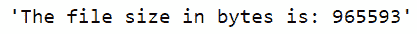

图 8.12 – 字节单位的文件大小

如果我们通过传递 `s_megabytes` 作为 `True` 来执行它，我们将看到以下输出：

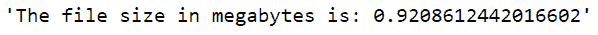

图 8.13 – 兆字节单位的文件大小

您可以自由地使用您机器上的任何文件路径进行测试，并检查大小是否与控制台输出中指示的一致。

## 它是如何工作的…

当处理数据时，文件大小的估计很方便。让我们了解我们用来实现这种估计的代码片段。

我们首先使用的是 `os.stat()` 方法来检索文件信息，正如您在这里看到的：

```py
file_stats = os.stat(file_name)
```

此方法直接与您的操作系统交互。如果我们单独执行它，对于 `listings.csv` 文件，我们将得到以下输出：

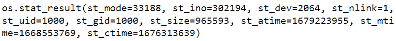

图 8.14 – 使用 os.stat_result 时 listings.csv 文件的特征

在我们的案例中，我们只需要`st_size`来估算`bytes`，所以我们后来在`return`子句中这样调用它：

```py
file_stats.st_size
```

如果您想了解更多关于其他显示结果的信息，您可以参考以下官方文档页面：[`docs.python.org/3/library/stat.xhtml#stat.filemode`](https://docs.python.org/3/library/stat.xhtml#stat.filemode)

最后，为了以兆字节为单位提供结果，我们只需要使用`st_size`值进行简单的转换，其中 1 KB 等于 1,024 字节，1 MB 等于 1,024 KB。您可以在以下链接中查看转换公式：

```py
file_stats.st_size / (1024 * 1024)
```

## 更多内容...

这个配方展示了创建一个 Python 函数来检索文件大小是多么容易。不幸的是，在撰写本文时，没有直接的方法来使用 PySpark 执行相同的事情。

软件工程师 Glenn Franxman 在他的 GitHub 上提出了一种使用 Spark 内部功能来估算 DataFrame 大小的解决方案。您可以在以下链接中查看他的代码 – 如果您确实使用了它，请确保给予适当的致谢：[`gist.github.com/gfranxman/4fd0719ff2618039182dd7ea1a702f8e`](https://gist.github.com/gfranxman/4fd0719ff2618039182dd7ea1a702f8e)

让我们用一个例子来使用 Glenn 的代码估算 DataFrame 的大小，看看它是如何工作的：

```py
from pyspark.serializers import PickleSerializer, AutoBatchedSerializer
def _to_java_object_rdd(rdd):
    """ Return a JavaRDD of Object by unpickling
    It will convert each Python object into Java object by Pyrolite, whenever the
    RDD is serialized in batch or not.
    """
    rdd = rdd._reserialize(AutoBatchedSerializer(PickleSerializer()))
    return rdd.ctx._jvm.org.apache.spark.mllib.api.python.SerDe.pythonToJava(rdd._jrdd, True)
def estimate_df_size(df):
    JavaObj = _to_java_object_rdd(df.rdd)
    nbytes = spark._jvm.org.apache.spark.util.SizeEstimator.estimate(JavaObj)
return nbytes
```

要执行前面的代码，您必须有一个已启动的 SparkSession。一旦您有了这个和 DataFrame，执行代码并调用`estimate_df_size()`函数，如下所示：

```py
estimate_df_size(df)
```

您应该看到以下以字节为单位的输出，具体取决于您使用的是哪个 DataFrame：


图 8.15 – DataFrame 的字节大小

请记住，这个解决方案只有在您将 DataFrame 作为参数传递时才会工作。我们的 Python 代码对其他文件估算工作良好，并且在估算大文件时没有性能问题。

## 参见

与 PySpark 不同，Scala 有一个`SizeEstimator`函数可以返回 DataFrame 的大小。您可以在以下链接中找到更多信息：[`spark.apache.org/docs/latest/api/java/index.xhtml?org/apache/spark/util/SizeEstimator.xhtml`](https://spark.apache.org/docs/latest/api/java/index.xhtml?org/apache/spark/util/SizeEstimator.xhtml)

# 基于数据的日志记录

如同在*监控我们的数据摄取文件大小*配方中提到的，在数据领域记录摄取是一个好的实践。有几种方法可以探索我们的摄取日志，以增加流程的可靠性和我们对它的信心。在这个配方中，我们将开始进入数据操作领域（或**DataOps**），其目标是跟踪数据从源头到最终目的地的行为。

这个配方将探索我们可以跟踪的其他指标，以创建一个可靠的数据管道。

## 准备工作

对于这个练习，让我们假设我们有两个简单的数据摄取，一个来自数据库，另一个来自 API。由于这是一个直接的管道，让我们用以下图表来可视化它：

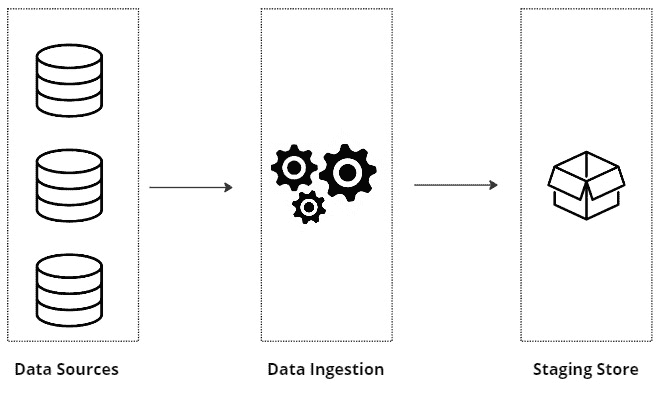

图 8.16 – 数据摄取阶段

在这个前提下，让我们探索我们可以记录以使监控高效的实例。

## 如何操作…

让我们根据前图中我们看到的每一层（或步骤）定义基本指标：

1.  **数据源**：让我们从摄取的第一层——源开始。我们知道我们正在处理两个不同的数据源，因此我们必须为它们创建额外的指标。参见以下图示以供参考：

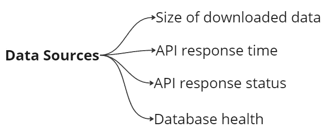

图 8.17 – 要监控的数据库指标

1.  **摄取**：现在，既然源已经进行了日志记录和监控，让我们继续到摄取层。正如我们在本章前面所看到的，我们可以记录诸如错误、代码执行的信息部分、文件大小等信息。让我们在这里插入更多内容，例如模式以及检索或处理数据所需的时间。我们将得到一个类似于以下图表的图表：

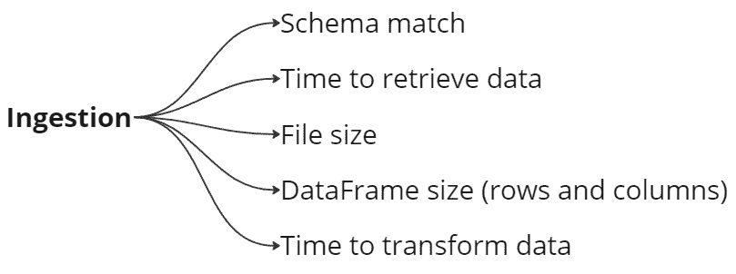

图 8.18 – 要监控的数据摄取指标

1.  **暂存层**：最后，让我们讨论摄取后的最后一层。目标是确保我们保持数据的完整性，因此验证模式是否仍然与数据匹配是至关重要的。我们还可以添加日志来监控 Parquet 文件的数量和大小。参见以下图示以供参考：

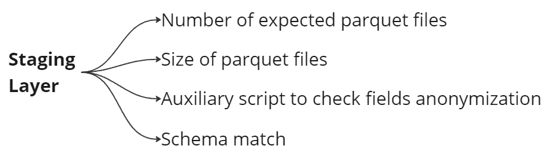

图 8.19 – 暂存层指标要监控

现在我们已经涵盖了需要监控的基本主题，让我们了解为什么选择了它们。

## 它是如何工作的…

自从本章的第一个配方以来，我们一直在强调日志对于使系统正确工作的重要性。在这里，我们将所有这些内容综合起来，尽管是从高层次来看，但我们可以看到存储特定信息如何帮助我们进行监控。

从数据源层开始，选择的指标基于数据的响应和检索数据的可用性。了解我们是否可以开始摄取过程是基本的，更重要的是知道数据大小是否符合我们的预期。

想象以下场景：我们每天从 API 中摄取 50 MB 的数据。然而，有一天我们只收到了 10 KB。通过适当的日志记录和监控功能，我们可以快速回顾历史事件中的问题。我们可以将数据大小检查扩展到我们在配方中覆盖的后续层。

注意

我们故意交替使用“步骤”和“层”这两个词来指代摄取过程的各个阶段，因为在不同的文献和不同公司的内部流程中可能会有所不同。

另一种记录和监控我们的数据的方式是使用模式验证。**模式验证**（当适用时）保证源数据没有发生变化。因此，转换或聚合的结果往往呈线性。我们还可以实现一个辅助函数或作业来检查包含**敏感**或**个人身份信息**（**PII**）的字段是否得到了充分的匿名化。

监控*parquet 文件大小或数量*对于验证质量是否得到保持至关重要。如第七章中所示，parquet 文件的数量可能会影响其他应用程序的读取质量，甚至影响 ETL 的后续阶段。

最后，必须指出，我们在这里讨论日志是为了确保数据摄取的质量和可靠性。请记住，最佳实践是将我们从代码中获取的记录与这里看到的示例对齐。

## 更多内容...

此配方的内容是更广泛主题的一部分，称为**数据可观察性**。数据可观察性是数据操作、质量和治理的结合。目标是集中一切，使数据过程的管理和监控高效且可靠，为数据带来健康。

我们将在第十二章中进一步讨论这个问题。然而，如果你对这个主题感兴趣，Databand（一家 IBM 公司）有一个很好的介绍，链接如下：[`databand.ai/data-observability/`](https://databand.ai/data-observability/)

## 另请参阅

在 DataGaps 博客页面上了解更多关于监控 ETL 管道的信息，链接如下：[`www.datagaps.com/blog/monitoring-your-etl-test-data-pipelines-in-production-dataops-suite/`](https://www.datagaps.com/blog/monitoring-your-etl-test-data-pipelines-in-production-dataops-suite/)

# 获取 SparkSession 指标

到目前为止，我们创建日志是为了提供更多信息，使其在监控方面更有用。日志使我们能够根据管道和代码的需求构建自定义指标。然而，我们也可以利用框架和编程语言内置的指标。

当我们创建一个`SparkSession`时，它提供了一个带有有用指标的 web UI，这些指标可以用来监控我们的管道。使用这个 UI，以下配方展示了如何访问和检索 SparkSession 的指标信息，并将其用作摄取或处理 DataFrame 的工具。

## 准备工作

您可以使用 PySpark 命令行或 Jupyter Notebook 执行此配方。

在探索 Spark UI 指标之前，让我们使用以下代码创建一个简单的`SparkSession`：

```py
from pyspark.sql import SparkSession
spark = SparkSession.builder \
      .master("local[1]") \
      .appName("chapter8_monitoring") \
      .config("spark.executor.memory", '3g') \
      .config("spark.executor.cores", '3') \
      .config("spark.cores.max", '3') \
      .getOrCreate()
```

然后，让我们读取一个 JSON 文件，并按如下方式调用`.show()`方法：

```py
df_json = spark.read.option("multiline","true") \
                    .json('github_events.json')
df_json.show()
```

我正在使用一个名为`github_events.json`的数据集，我们之前在第四章中处理过。然而，请随意使用你喜欢的任何数据集，因为这里的目的是观察数据集的模式，而不是从 Spark UI 中找出我们能了解什么。

## 如何做到这一点…

1.  如同在*准备就绪*部分概述的那样，我们使用`spark`命令检索 Spark UI 的链接，如下所示：

    ```py
    spark
    ```

你应该会看到以下输出：

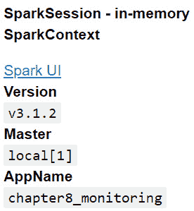

图 8.20 – spark 命令输出

1.  点击**Spark UI**，你的浏览器将打开一个新标签页。你应该会看到一个像这样的页面：

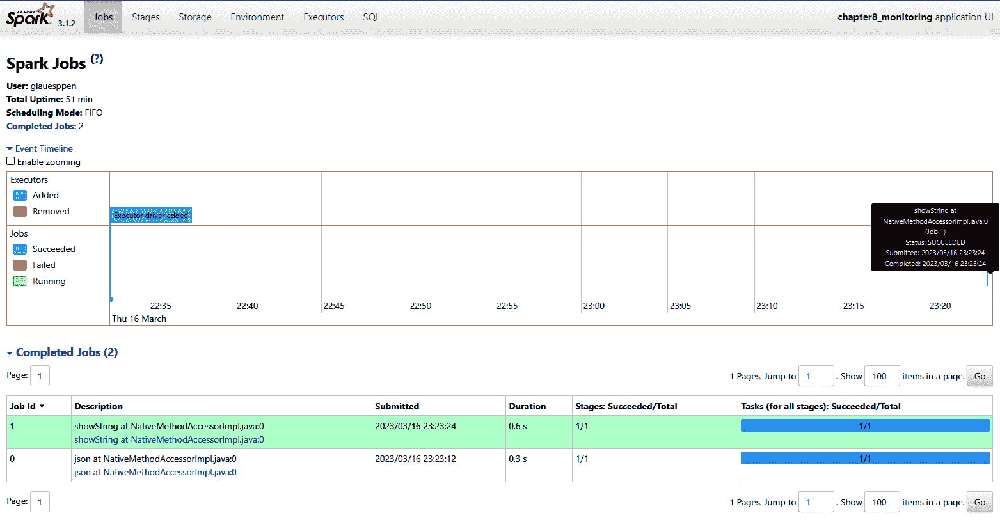

图 8.21 – Spark UI：作业页面视图

如果你没有使用 Jupyter Notebook，你可以通过将浏览器指向[`localhost:4040/`](http://localhost:4040/)来访问这个界面。

我的页面看起来更拥挤，因为我展开了**事件时间线**和**完成的作业** – 你可以通过点击它们来做到同样的效果。

1.  接下来，让我们进一步探索第一个完成的作业。点击**showString at NativeMethodAccessorImpl.java:0**，你应该会看到一个以下页面：

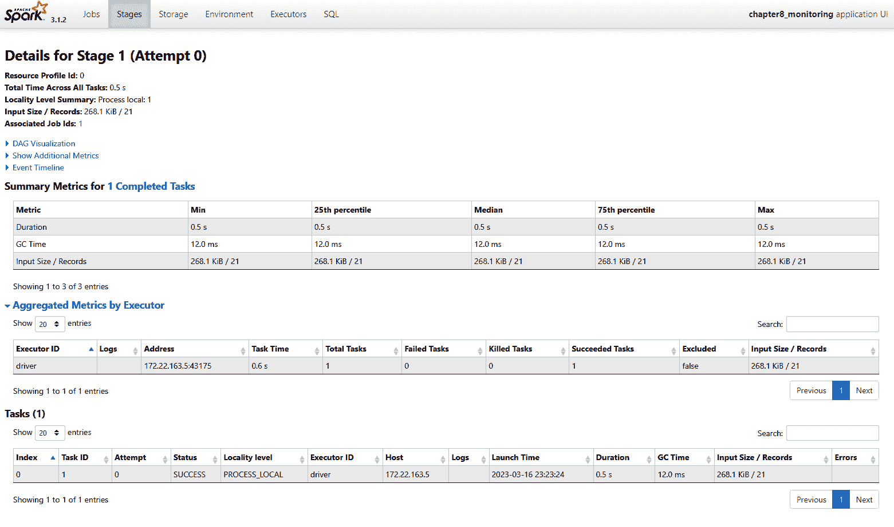

图 8.22 – Spark UI：特定作业的阶段页面视图

在这里，我们可以更详细地看到这个作业的任务状态，包括它使用了多少内存、执行它所需的时间等等。

注意，它切换到了顶部菜单的**阶段**标签。

1.  现在，点击页面顶部的**Executors**按钮。你应该会看到一个类似于这样的页面：

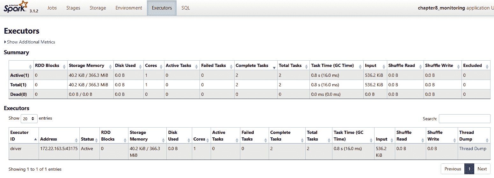

图 8.23 – Spark UI：执行器页面视图

这里所有的指标都与 Spark 驱动器和节点相关。

1.  然后，点击顶部菜单中的**SQL**按钮。你应该会看到以下页面：

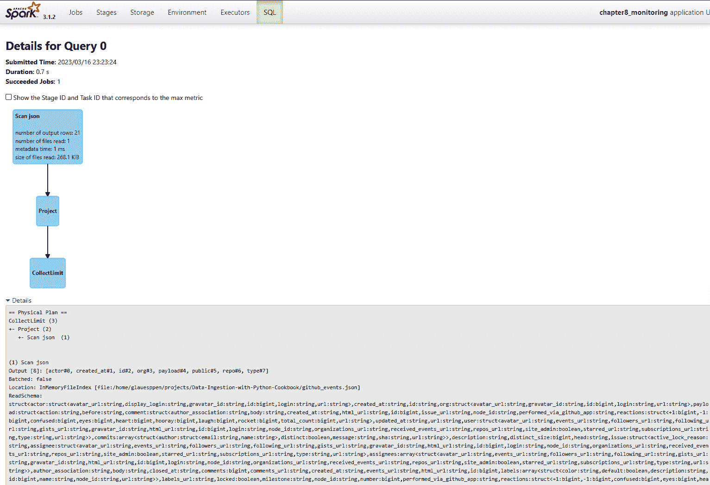

图 8.24 – Spark UI：SQL 页面视图

在这个页面上，你可以看到 Spark 内部执行的查询。如果我们代码中使用了显式查询，我们就会在这里看到它是如何内部执行的。

你不需要担心`.show()`方法。

## 它是如何工作的…

现在我们已经探索了 Spark UI，让我们了解每个标签是如何组织的，以及我们使用它们的步骤。

在*步骤 2*中，我们首次浏览了界面。这个界面使我们能够看到包含驱动器创建和执行时间信息的事件时间线。我们还可以观察到时间线上标记的作业，如下所示：

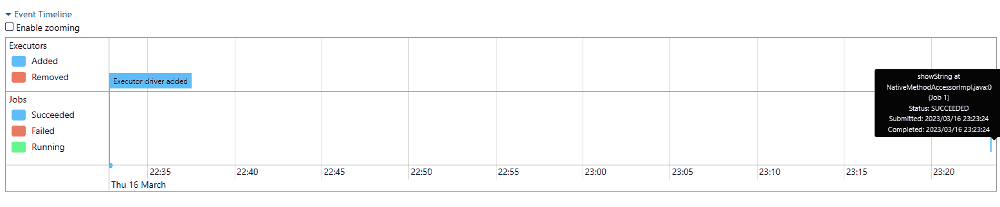

图 8.25 – 事件时间线展开菜单的详细视图

我们可以观察到它们在处理更大作业和更复杂的并行任务时的交互。不幸的是，我们需要一个专门的项目和几个数据集来模拟这种情况，但现在你知道了未来参考的地方。

然后，我们选择了 **NativeMethodAccessorImpl.java:0 中的 showString**，这引导我们进入 **阶段**页面。这个页面提供了关于 Spark 任务的更详细信息，包括任务是否成功。

一个优秀的指标和可视化工具是 **DAG 可视化**（指有向无环图），它可以扩展并显示如下内容：

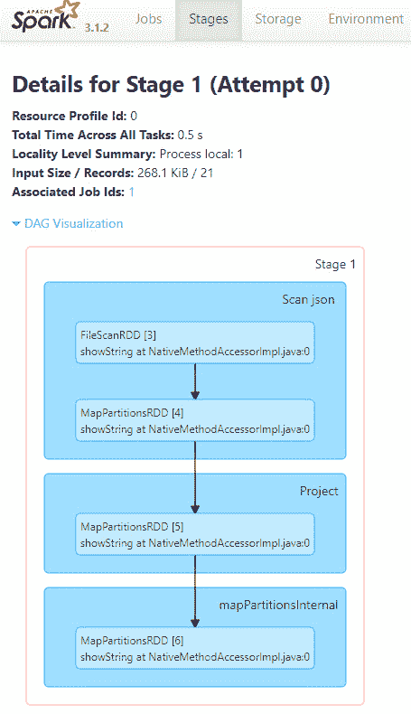

图 8.26 – 作业的 DAG 可视化

这提供了每个阶段每个步骤执行的优秀概览。我们还可以参考这些信息来了解在出现错误时，基于跟踪消息的哪个部分存在问题。

由于我们选择了特定的任务（或作业），它显示了其阶段和详细信息。然而，如果我们直接进入 **阶段**，我们可以显示所有执行的步骤。这样做，你应该会看到如下内容：

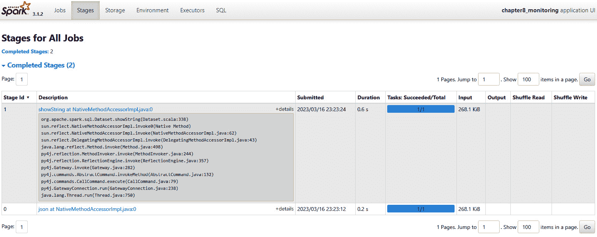

图 8.27 – Spark UI：所有执行作业的阶段概览

尽管描述信息并不直接，但我们仍能把握每个描述所表达的核心内容。`Stage id 0` 指的是读取 JSON 的函数，而带有 `showString` 消息的 `Stage id 1` 则指的是 `.show()` 方法的调用。

**执行器**页面显示了与 Spark 核心相关的指标以及其性能表现。你可以使用这些信息来了解你的集群行为以及是否需要调整。有关每个字段的更详细信息，请参阅 Spark 官方文档：https://spark.apache.org/docs/latest/monitoring.xhtml#executor-metrics。

最后但同样重要的是，我们看到了 **SQL** 页面，在这里可以看到 Spark 在幕后如何内部洗牌和聚合数据，就像 **阶段**一样，利用更直观的执行形式，如下面的截图所示：

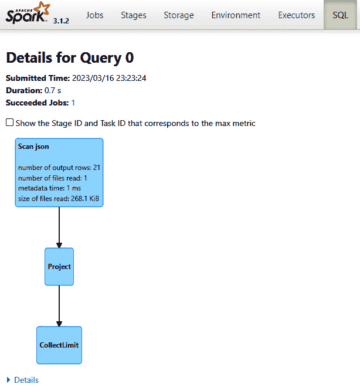

图 8.28 – 内部执行的 SQL 查询流程图

在这里，我们可以看到查询与 `.show()` 方法相关。其中包含有用的信息，包括输出行数、读取的文件及其大小。

## 还有更多...

尽管 Spark 指标很方便，但你可能会想知道如何在云提供商（如 AWS 或 Google Cloud）上托管 PySpark 作业时使用它们。

**AWS** 为在使用 **AWS Glue** 时启用 Spark UI 提供了一个简单的解决方案。你可以在此了解更多信息：[`docs.aws.amazon.com/glue/latest/dg/monitor-spark-ui-jobs.xhtml`](https://docs.aws.amazon.com/glue/latest/dg/monitor-spark-ui-jobs.xhtml)。

**Google Data Proc** 提供了其集群的 Web 界面，您还可以在此查看 **Hadoop** 和 **YARN** 的指标。由于 Spark 运行在 YARN 之上，因此您不会找到直接指向 Spark UI 的链接，但您可以使用 YARN 界面来访问它。您可以在此处了解更多信息：[`cloud.google.com/dataproc/docs/concepts/accessing/cluster-web-interfaces`](https://cloud.google.com/dataproc/docs/concepts/accessing/cluster-web-interfaces)。

## 参考以下内容

*《走向数据科学》* 上有一篇关于 Spark 指标非常棒的文章：https://towardsdatascience.com/monitoring-of-spark-applications-3ca0c271c4e0

# 进一步阅读

+   https://spark.apache.org/docs/latest/monitoring.xhtml#executor-task-metrics

+   [Here 开发者文档中的 Spark UI 主题](https://developer.here.com/documentation/metrics-and-logs/user_guide/topics/spark-ui.xhtml)

+   [LucaCanali 的 Miscellaneous 仓库中的 Spark Notes/Spark_TaskMetrics.md](https://github.com/LucaCanali/Miscellaneous/blob/master/Spark_Notes/Spark_TaskMetrics.md)

+   [Python 3 文档中的日志处理指南](https://docs.python.org/3/howto/logging.xhtml)

+   [datadoghq.com 博客中的 Python 日志最佳实践](http://datadoghq.com/blog/python-logging-best-practices/)

+   [Python 日志最佳实践和技巧](https://coralogix.com/blog/python-logging-best-practices-tips/)
