# 第十一章：自动化您的数据摄取管道

数据源经常更新，这需要我们更新我们的数据湖。然而，随着多个来源或项目的增加，手动触发数据管道变得不可能。数据管道自动化使摄取和处理数据变得机械化，消除了触发它的手动操作。自动化配置的重要性在于能够简化数据流并提高数据质量，减少错误和不一致性。

在本章中，我们将介绍如何在 Airflow 中自动化数据摄取管道，以及数据工程中的两个重要主题：数据复制和历史数据摄取，以及最佳实践。

在本章中，我们将介绍以下菜谱：

+   安排每日摄取

+   安排历史数据摄取

+   安排数据复制

+   设置 `schedule_interval` 参数

+   解决调度错误

# 技术要求

您可以从本章的 GitHub 仓库中找到代码，网址为 [`github.com/PacktPublishing/Data-Ingestion-with-Python-Cookbook/tree/main/Chapter_11`](https://github.com/PacktPublishing/Data-Ingestion-with-Python-Cookbook/tree/main/Chapter_11)。

# 安装和运行 Airflow

本章要求在您的本地机器上安装 Airflow。您可以直接在 **操作系统**（**OS**）上安装它，或使用 Docker 镜像。有关更多信息，请参阅 *第一章* 中的 *配置 Docker 以用于 Airflow* 菜谱。

在遵循 *第一章* 中描述的步骤后，请确保您的 Airflow 实例运行正确。您可以通过检查 `http://localhost:8080` 上的 Airflow UI 来做到这一点。

如果您像我一样使用 Docker 容器来托管您的 Airflow 应用程序，您可以使用以下命令在终端中检查其状态：

```py
$ docker ps
```

这是容器状态：

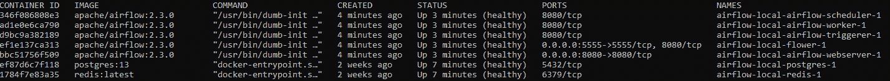

图 11.1 – 运行的 Airflow 容器

或者，您可以在 **Docker Desktop** 上检查容器状态：

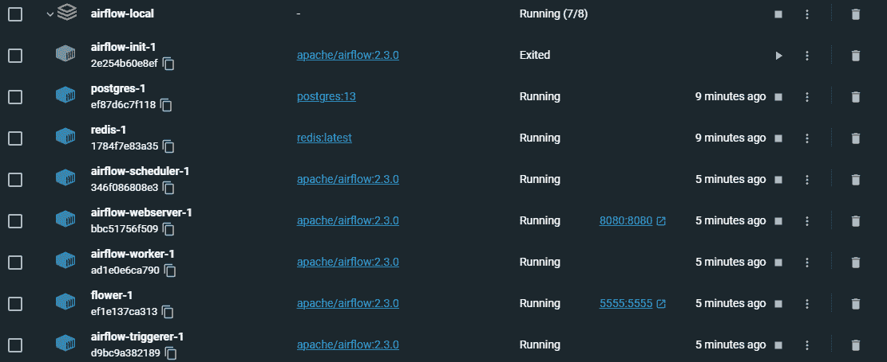

图 11.2 – Docker Desktop 显示运行中的 Airflow 容器

# 安排每日摄取

在我们动态的世界中，数据不断变化，每天都有新的信息被添加，甚至每秒都有。因此，定期更新我们的数据湖以反映最新的场景和信息至关重要。

在集成来自各种来源的新数据的同时，管理多个项目或管道并手动触发它们可能会很困难。为了解决这个问题，我们可以依赖调度器，Airflow 提供了一个简单直接的解决方案。

在这个菜谱中，我们将创建一个简单的 **有向无环图**（**DAG**）在 Airflow 中，并探讨如何使用其参数来安排管道每天运行。

## 准备工作

请参考此菜谱的*技术要求*部分，因为我们将以这里提到的相同技术来处理它。

在这个练习中，我们将创建一个简单的 DAG。你的 Airflow 文件夹的结构应该如下所示：

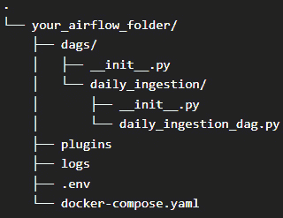

图 11.3 – daily_ingestion_dag DAG 文件夹结构

此菜谱中的所有代码都将放置在`daily_ingestion_dag.py`文件中。确保你已经按照*图 11.3*中的文件夹结构创建了该文件。

## 如何做…

这是此菜谱的步骤：

1.  让我们先导入所需的库：

    ```py
    from airflow import DAG
    from airflow.operators.bash import BashOperator
    from datetime import datetime, timedelta
    ```

1.  现在，我们将为我们的 DAG 定义`default_args`。对于`start_date`参数，插入今天的日期或你做这个练习前几天。对于`end_date`，插入今天日期几天后的日期。最后，它应该看起来像以下这样：

    ```py
    default_args = {
        'owner': 'airflow',
        'depends_on_past': False,
        'email': ['airflow@example.com'],
        'email_on_failure': True,
        'email_on_retry': True,
        'retries': 1,
        'retry_delay': timedelta(minutes=5),
        'start_date': datetime(2023, 4, 12),
        'end_date': datetime(2023, 4, 30),
        'schedule_interval': '@daily
    }
    ```

1.  然后，我们将定义我们的 DAG 及其内部的任务。由于我们想专注于如何安排每日摄取，我们的每个任务都将是一个`BashOperator`，因为它们可以简单地执行 Bash 命令，正如你在这里看到的：

    ```py
    with DAG(
        'daily_ingestion_dag',
        default_args=default_args,
        description='A simple ETL job using Bash commands',
    ) as dag:
        t1 = BashOperator(
                    task_id="t1",
                    bash_command="echo 'This is task no1 '",
                )
        t2 = BashOperator(
                    task_id="t2",
                    bash_command="echo 'This is task no2 '",
                )
    t1 >> t2
    ```

1.  DAG 编写完成后，让我们在 Airflow UI 上启用它，DAG 应该立即运行。运行后，DAG 将有一个`SUCCESS`状态，如下所示：

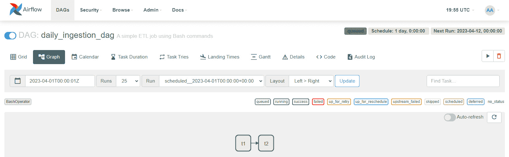

图 11.4 – Airflow UI 中的 daily_ingestion_dag DAG

如果我们检查日志，它将显示类似于以下内容的`echo`命令输出：

```py
[2023-04-12, 19:54:38 UTC] [ 1686 - airflow.hooks.subprocess.SubprocessHook ] {subprocess.py:74} INFO - Running command: ['bash', '-c', "echo 'This is task no2 '"]
[2023-04-12, 19:54:38 UTC] [ 1686 - airflow.hooks.subprocess.SubprocessHook ] {subprocess.py:85} INFO - Output:
[2023-04-12, 19:54:38 UTC] [ 1686 - airflow.hooks.subprocess.SubprocessHook ] {subprocess.py:92} INFO - This is task no2
```

1.  现在，我们需要确保 DAG 将每天运行。为了确认这一点，在你的 DAG 页面上选择**日历**选项。你会看到类似以下的内容：

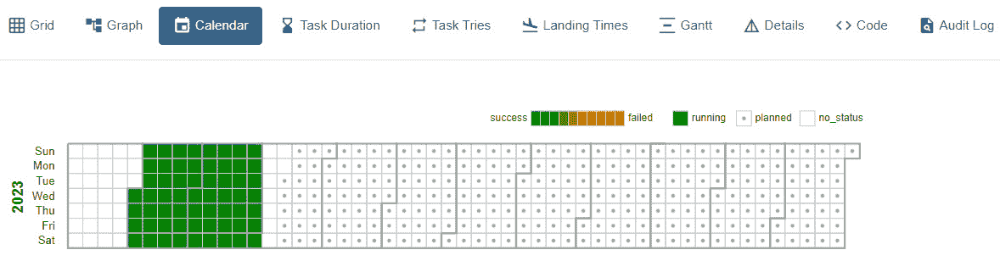

图 11.5 – Airflow UI 中 DAG 的日历可视化

如你所见，执行过程被描绘在左侧的阴影区域，表示成功的结果（`end_date`，用点标记，表示工作将在接下来的几天内每天运行）。

注意

*图 11.5*显示了工作成功执行的一些日子。这是向用户展示相同日历在先前执行中的行为。

## 它是如何工作的…

Airflow 的调度器主要由三个参数定义：`start_date`、`end_date`和`schedule_interval`。这三个参数定义了作业的开始和结束以及执行之间的间隔。

让我们来看看`default_args`：

```py
default_args = {
    'owner': 'airflow',
    ...
    'start_date': datetime(2023, 4, 12),
    'end_date': datetime(2023, 4, 30),
    'schedule_interval': '@daily
}
```

由于我是在 2023 年 4 月 12 日写这个练习的，我将我的`start_date`参数设置为同一天。这将使工作检索与 4 月 12 日相关的信息，如果我将它放在当前日期几天前，Airflow 将检索更早的日期。现在不用担心这个问题；我们将在*调度历史数据*摄取菜谱中更详细地介绍这一点。

关键在于`schedule_interval`参数。正如其名称所暗示的，该参数将定义每次执行的周期性或间隔，并且如您所观察到的，它简单地使用`@daily`值进行了设置。

DAG UI 页面上的**日历**选项是 Airflow 2.2 及以后版本的一个优秀功能。此功能允许开发者查看 DAG 的下一个执行日期，从而避免一些混淆。

## 更多内容…

DAG 参数不仅限于我们在本食谱中看到的那些。还有许多其他参数可供选择，可以使数据处理管道更加自动化和智能化。让我们看一下以下代码：

```py
default_args = {
    'owner': 'airflow',
    'depends_on_past': False,
    'email': ['airflow@example.com'],
    'email_on_failure': True,
    'email_on_retry': True,
    'retries': 1,
    'retry_delay': timedelta(minutes=5),
    'start_date': datetime(2023, 4, 12),
    'end_date': datetime(2023, 4, 30),
    'schedule_interval': '@daily,
    'queue': 'bash_queue',
    'pool': 'backfill',
    'priority_weight': 10
}
```

这里还有三个额外的参数：`queue`、`pool`和`priority_weight`。正如我们在*第九章*和*第十章*中看到的，Airflow 架构包括一个队列（通常由`pool`参数限制同时作业的数量。最后，`priority_weight`，正如其名称所暗示的，定义了 DAG 相对于其他 DAG 的优先级。

您可以在 Airflow 官方文档中了解更多关于这些参数的信息：

[`airflow.apache.org/docs/apache-airflow/1.10.2/tutorial.xhtml`](https://airflow.apache.org/docs/apache-airflow/1.10.2/tutorial.xhtml)

## 参考信息

您还可以在[`crontab.guru/`](https://crontab.guru/)上了解更多关于使用 crontab 进行调度的信息。

# 调度历史数据摄取

历史数据对于数据驱动决策至关重要，它提供了有价值的见解并支持决策过程。它也可以指代在一段时间内积累的数据。例如，一家销售公司可以使用以前营销活动的历史数据来查看它们如何影响特定产品多年的销售。

本练习将展示如何在 Airflow 中创建一个调度器，以使用最佳实践和与此过程相关的常见问题来摄取历史数据。

## 准备工作

请参考本食谱的**技术要求**部分，因为我们将会使用这里提到的相同技术来处理它。

在这个练习中，我们将在我们的 DAGs 文件夹内创建一个简单的 DAG。您的 Airflow 文件夹结构应该如下所示：

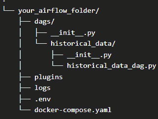

图 11.6 – 本地 Airflow 目录中 historical_data_dag 文件夹结构

## 如何操作…

这里是这个食谱的步骤：

1.  让我们从导入我们的库开始：

    ```py
    from airflow import DAG
    from airflow.operators.python_operator import PythonOperator
    from datetime import datetime, timedelta
    ```

1.  现在，让我们定义`default_args`。由于我们希望处理旧数据，我将设置`start_date`的`datetime`在当前日期之前，而`end_date`将接近当前日期。以下代码展示了这一点：

    ```py
    default_args = {
        'owner': 'airflow',
        'depends_on_past': False,
        'email': ['airflow@example.com'],
        'email_on_failure': True,
        'email_on_retry': True,
        'retries': 1,
        'retry_delay': timedelta(minutes=5),
        'start_date': datetime(2023, 4, 2),
        'end_date': datetime(2023, 4, 10),
        'schedule_interval': '@daily'
    }
    ```

1.  然后，我们将创建一个简单的函数来打印 Airflow 执行管道所使用的日期。您可以在以下位置看到它：

    ```py
    def my_task(execution_date=None):
        print(f"execution_date:{execution_date}")
    ```

1.  最后，我们将声明我们的 DAG 参数和一个`PythonOperator`任务来执行它，正如您所看到的：

    ```py
    with DAG(
        'historical_data_dag',
        default_args=default_args,
        description='A simple ETL job using Python commands to retrieve historical data',
    ) as dag:
        p1 = PythonOperator(
                    task_id="p1",
                    python_callable=my_task,
            )
    p1
    ```

1.  转向 Airflow UI，让我们按照常规步骤启用 DAG 并查看其执行情况。在`historical_data_dag`页面上，你应该看到以下截图类似的内容：

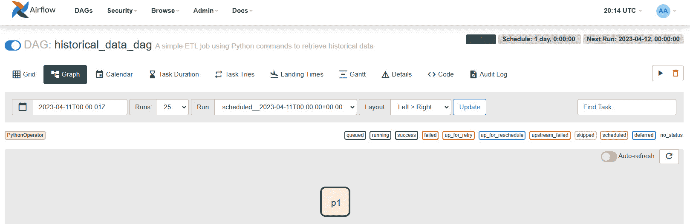

图 11.7 – Airflow UI 中的 historical_data_dag DAG

如您所见，任务成功运行。

1.  现在，让我们检查我们的`logs`文件夹。如果我们选择与创建的 DAG 同名（`historical_data_dag`）的文件夹，我们将观察到不同日期的`run_id`实例，从 4 月 2 日开始，到 4 月 10 日结束：

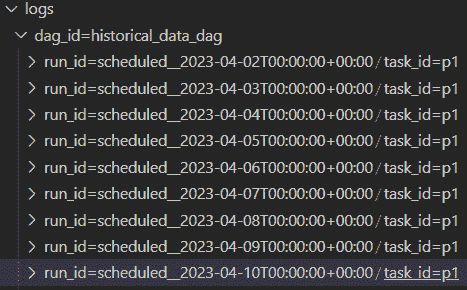

图 11.8 – 显示回溯摄入的 Airflow 日志文件夹

1.  让我们打开第一个`run_id`文件夹，以探索该次运行的日志：

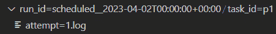

图 11.9 – 2023 年 4 月 2 日的 DAG 日志

日志告诉我们`execution_date`参数，它与`start_date`参数相同。

下面是日志的更详细查看：

```py
[2023-04-12 20:10:25,205] [ ... ] {logging_mixin.py:115} INFO - execution_date:2023-04-02T00:00:00+00:00
[2023-04-12 20:10:25,205] [ ... ] {python.py:173} INFO - Done. Returned value was: None
```

我们将观察到 4 月 3 日`run_id`相同的模式：

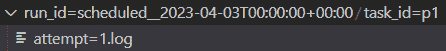

图 11.10 – 2023 年 4 月 3 日的 DAG 日志

下面是日志输出的更详细查看：

```py
2023-04-12 20:10:25,276] [ ... ] {logging_mixin.py:115} INFO - execution_date:2023-04-03T00:00:00+00:00
[2023-04-12 20:10:25,276] [...] {python.py:173} INFO - Done. Returned value was: None
```

`execution_date`也指的是 4 月 3 日。

这表明 Airflow 已经使用了在`start_date`和`end_date`上声明的间隔来运行任务！

现在，让我们继续了解调度器是如何工作的。

## 它是如何工作的…

正如我们所见，使用 Airflow 安排和检索历史数据很简单，关键参数是`start_date`、`end_date`和`schedule_interval`。让我们更详细地讨论它们：

+   `start_date`参数定义了当管道被触发时 Airflow 将查看的第一个日期。在我们的例子中，它是 4 月 2 日。

+   接下来是`end_date`。通常，即使对于周期性摄入，这也不是一个强制参数。然而，使用它的目的是为了展示我们可以设置一个日期作为停止摄入的限制。

+   最后，`schedule_interval`决定了两个日期之间的间隔。在这个练习中，我们使用了日间隔，但如果我们需要更细粒度的历史摄入，我们也可以使用`crontab`。我们将在*设置 schedule_interval 参数*菜谱中更详细地探讨这一点。

有了这个信息，理解我们从 Airflow 获得的日志就更容易了：

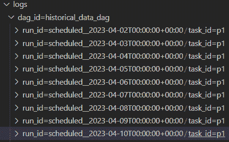

图 11.11 – 显示历史摄入的 Airflow 日志文件夹

每个文件夹代表每天发生一次的历史摄入。由于我们没有定义更细粒度的日期时间规范，文件夹名称使用的是作业被触发的时间。这些信息不包括在日志中。

为了展示 Airflow 在幕后使用的是哪个日期，我们创建了一个简单的函数：

```py
def my_task(execution_date=None):
    print(f"execution_date:{execution_date}")
```

函数的唯一目的是显示任务的执行日期。`execution_date` 参数是一个内部参数，显示任务何时执行，并且可以被操作员或其他函数用于根据日期执行某些操作。

例如，假设我们需要检索存储为分区的历史数据。我们可以使用 `execution_date` 将日期时间信息传递给 Spark 函数，该函数将读取并检索具有相同日期信息的分区中的数据。

如您所见，在 Airflow 中检索历史数据/信息需要一些配置。一个好的做法是为历史数据处理保留一个单独且专门的 DAG，这样就不会影响当前的数据摄取。此外，如果需要重新处理数据，我们可以通过一些参数更改来完成。

## 还有更多...

在使用 Airflow 摄取历史数据的技巧中，有两个重要的概念：*catchup* 和 *backfill*。

调度和运行可能因各种原因而遗漏的过去时期的 DAG，通常被称为 `schedule_interval`。默认情况下，此功能在 Airflow 中已启用。因此，如果暂停或未创建的 DAG 的 `start_date` 在过去，它将自动为遗漏的时间间隔进行调度和执行。以下图表说明了这一点：

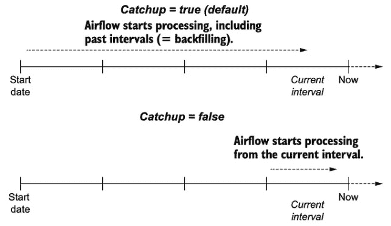

图 11.12 – Airflow 补充时间线。来源：https://medium.com/nerd-for-tech/airflow-catchup-backfill-demystified-355def1b6f92

另一方面，Airflow 的 *backfill* 功能允许您对过去可能因 DAG 暂停、尚未创建或其他任何原因而遗漏的 DAG 执行回溯性执行，以及它们相关的任务。在 Airflow 中，回填是一个强大的功能，可以帮助您填补空白并赶上过去可能遗漏的数据处理或工作流程执行。

您可以在以下链接的 Amit Singh Rathore 的博客页面上了解更多信息：[`medium.com/nerd-for-tech/airflow-catchup-backfill-demystified-355def1b6f92`](https://medium.com/nerd-for-tech/airflow-catchup-backfill-demystified-355def1b6f92).

# 调度数据复制

在本书的第一章中，我们介绍了数据复制是什么以及为什么它很重要。我们看到了这个过程在防止数据丢失和促进灾难恢复中的重要性。

现在，是时候学习如何创建一个优化的调度窗口，以便数据复制能够发生。在这个菜谱中，我们将创建一个图表，帮助我们决定复制数据的最佳时机。

## 准备工作

这个练习不需要技术准备。然而，为了使其更接近真实场景，让我们假设我们需要决定最佳方式来确保医院的数据得到充分复制。

我们将有两个管道：一个包含患者信息，另一个包含财务信息。第一个管道从患者数据库收集信息，并将其综合成医疗团队使用的可读报告。第二个管道将为医院管理层使用的内部仪表板提供数据。

由于基础设施限制，运维团队只有一个要求：只能快速复制一个管道的数据。

## 如何做...

下面是这个菜谱的步骤：

1.  **确定要复制的目标**：如“准备就绪”部分所述，我们已经确定了目标数据，即包含患者信息的管道和用于仪表板的财务数据管道。

然而，如果这个信息不是从利益相关者或其他相关人士那里及时获得的，那么我们必须始终从识别我们项目中最关键的表或数据库开始。

1.  **复制周期性**：我们必须根据我们数据的紧迫性或相关性来定义复制计划。让我们看看下面的图表：

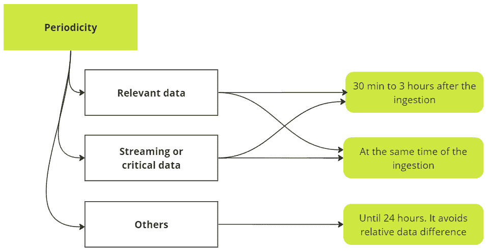

图 11.13 – 数据复制的周期性

如我们所见，数据越重要，建议的复制频率就越高。在我们的场景中，患者报告更适合在摄入后 30 分钟到 3 小时内进行，而财务数据可以复制到 24 小时后。

1.  **设置复制的时间窗口**：现在，我们需要创建一个复制数据的时间窗口。这个复制决策需要考虑两个重要因素，如下面的图表所示：


图 11.14 – 复制窗口

基于两条管道（并记住我们需要优先考虑其中一条），建议在业务工作结束后每天复制一次财务数据，而患者数据可以在新信息到达时同时处理。

如果这看起来有点混乱，请不要担心。让我们在“如何它工作”部分中探讨细节。

## 它是如何工作的...

数据复制是一个确保数据可用性和灾难恢复的重要过程。其概念比当前的 ETL 过程更早，并且在本地数据库中已经使用了多年。我们今天的优势在于我们可以在任何时刻执行此过程。相比之下，由于硬件限制，复制在几年前有一个严格的调度窗口。

在我们的例子中，我们处理了两个具有不同严重程度的管道。背后的想法是教会有警觉性的眼睛决定何时进行每次复制。

第一个管道，即患者报告管道，处理敏感数据，如个人信息和医疗历史。它还可能有助于医生和其他卫生工作者帮助患者。

基于此，最佳做法是在数据处理后的几分钟或几小时内复制这些数据，以实现高可用性和冗余。

初看之下，财务数据似乎非常关键，需要快速复制；我们需要记住这个管道为仪表板提供数据，因此，分析师可以使用原始数据生成报告。

决定调度数据复制时，除了涉及的数据之外，还必须考虑其他因素。了解谁对数据感兴趣或需要访问数据，以及当数据不可用时它如何影响项目、区域或业务，也是至关重要的。

## 还有更多...

本食谱涵盖了设置数据复制调度议程的简单示例。我们还在*步骤 3*中讨论了进行此类操作时需要考虑的两个主要点。尽管如此，许多其他因素都可能影响调度器的性能和执行。以下是一些例子：

+   Airflow（或类似平台）托管在服务器上的位置

+   CPU 容量

+   调度器的数量

+   网络吞吐量

如果你想了解更多信息，你可以在 Airflow 文档中找到这些因素的完整列表：[`airflow.apache.org/docs/apache-airflow/stable/administration-and-deployment/scheduler.xhtml#what-impacts-scheduler-s-performance`](https://airflow.apache.org/docs/apache-airflow/stable/administration-and-deployment/scheduler.xhtml#what-impacts-scheduler-s-performance)。

这份文档的伟大之处在于，其中许多点也适用于其他数据处理程序，并可以作为指南。

# 设置`schedule_interval`参数

在 Airflow DAG 调度器配置中最广泛使用的参数之一是`schedule_interval`。与`start_date`一起，它为管道创建了一个动态和连续的触发器。然而，在设置`schedule_interval`时，我们仍需注意一些小细节。

本食谱将涵盖设置`schedule_interval`参数的不同形式。我们还将探讨一个实际示例，以了解 Airflow 中的调度窗口是如何工作的，从而使管理管道执行更加简单。

## 准备工作

虽然这项练习不需要任何技术准备，但建议记录下管道应该开始的时间和每个触发器之间的间隔。

## 如何做到这一点...

在这里，我们将仅展示`default_args`字典以避免代码冗余。然而，你始终可以在 GitHub 仓库中查看完整的代码：[`github.com/PacktPublishing/Data-Ingestion-with-Python-Cookbook/tree/main/Chapter_11/settingup_schedule_interval`](https://github.com/PacktPublishing/Data-Ingestion-with-Python-Cookbook/tree/main/Chapter_11/settingup_schedule_interval)。

让我们看看如何声明`schedule_interval`：

+   `schedule_interval`的值可以使用诸如`@daily`、`@hourly`或`@weekly`这样的可访问名称。以下代码展示了它的样子：

    ```py
    default_args = {
        'owner': 'airflow',
        'depends_on_past': False,
        'retries': 1,
        'retry_delay': timedelta(minutes=5),
        'start_date': datetime(2023, 4, 2),
        'schedule_interval': '@daily'
    }
    ```

+   使用 crontab 语法表示的 `schedule_interval`：

    ```py
    default_args = {
        'owner': 'airflow',
        'depends_on_past': False,
        'retries': 1,
        'retry_delay': timedelta(minutes=5),
        'start_date': datetime(2023, 4, 2),
        'schedule_interval': '0 22 * * 1-5'
    }
    ```

在这种情况下，我们将调度器设置为每周工作日（周一至周五）晚上 10 点（或 22:00 小时）启动。

+   `schedule_interval` 是通过使用 `timedelta` 方法实现的。在下面的代码中，我们可以设置管道以一天为间隔触发：

    ```py
    default_args = {
        'owner': 'airflow',
        'depends_on_past': False,
        'retries': 1,
        'retry_delay': timedelta(minutes=5),
        'start_date': datetime(2023, 4, 2),
        'schedule_interval': timedelta(days=1)
    }
    ```

## 它是如何工作的…

`schedule_interval` 参数是 Airflow 中调度 DAG 的一个重要方面，它提供了一种灵活的方式来定义你的工作流程应该多久执行一次。我们可以将其视为 Airflow 调度器的核心。

这个菜谱的目标是展示设置 `schedule_interval` 的不同方法以及何时使用它们。让我们更深入地探讨它们：

+   **友好名称**：正如其名所示，这种表示法使用用户友好的标签或别名。它提供了一种简单方便的方式来指定计划任务运行的精确时间和日期。如果你没有特定的日期和时间来运行调度器，这可能是一个简单且直接的解决方案。

+   **Crontab 语法**：Crontab 在应用程序和系统中已经广泛使用很长时间了。Crontab 语法由五个字段组成，分别代表分钟、小时、月份中的日期、月份和星期几。当处理复杂的调度时，这是一个很好的选择，例如，在星期一和星期五下午 1 点执行触发器，或其他组合。

+   `timedelta(minutes=5)`）。它也是一个用户友好的表示法，但具有更细粒度的功能。

注意

虽然我们已经在这里看到了三种设置 `schedule_interval` 的方法，但请记住，Airflow 不是一个流式解决方案，并且当有多个 DAG 以小间隔运行时，可能会过载服务器。如果你或你的团队需要每 10-30 分钟或更短的时间进行调度，请考虑使用流式工具。

## 参见

*TowardsDataScience* 有一个关于 `schedule_interval` 在幕后如何工作的精彩博客文章。你可以在这里找到它：[`towardsdatascience.com/airflow-schedule-interval-101-bbdda31cc463`](https://towardsdatascience.com/airflow-schedule-interval-101-bbdda31cc463)。

# 解决调度错误

在这个阶段，你可能已经遇到了一些问题，即管道调度没有按预期触发。如果没有，请不要担心；这迟早会发生，而且是完全正常的。当有多个管道并行运行，在不同的窗口或连接到不同的时区时，出现一些纠缠是预料之中的。

为了避免这种纠缠，在这个练习中，我们将创建一个图表来辅助调试过程，识别 Airflow 中调度器不正确工作的可能原因，并了解如何解决它。

## 准备工作

这个菜谱不需要任何技术准备。尽管如此，记录下我们将遵循的步骤可能会有所帮助。在学习新事物时记录下来可以帮助我们在脑海中固定知识，使其更容易在以后记住。

回到我们的练习；Airflow 中的调度器错误通常会使 DAG 状态显示为 `None`，如下所示：

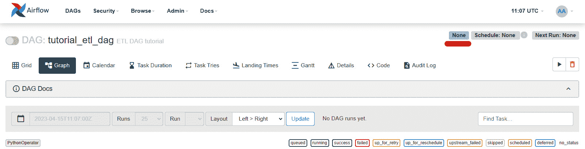

图 11.15 – Airflow UI 中的 DAG，调度器存在错误

我们现在将找出如何修复错误并再次运行作业。

## 如何做…

让我们尝试确定我们的调度器中错误可能的原因。不用担心理解我们为什么使用这些方法。我们将在 *如何工作* 中详细说明：

1.  我们首先检查 `start_date` 是否已设置为 `datetime.now()`。如果是这种情况，这里最好的方法是将此参数值更改为一个特定日期，如下所示：

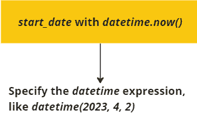

图 11.16 – 由 start_date 参数引起的错误

代码将看起来像这样：

```py
default_args = {
    'owner': 'airflow',
    'depends_on_past': False,
    'retries': 1,
    'retry_delay': timedelta(minutes=5),
    'start_date': datetime(2023, 4, 2),
    'schedule_interval': '@daily'
}
```

1.  现在我们可以验证 `schedule_interval` 是否与 `start_date` 参数对齐。在下面的图中，你可以看到三种修复问题的可能性：

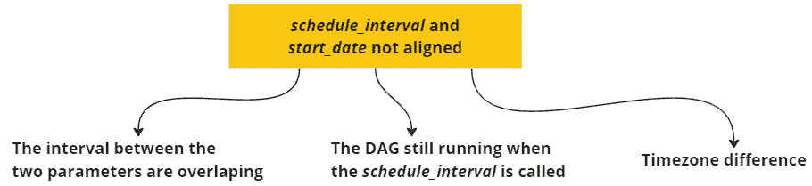

图 11.17 – 由 start_date 和 schedule_interval 参数引起的错误

你可以通过在 `schedule_interval` 中使用 crontab 语法来防止此错误，如下所示：

```py
schedule_interval='0 2 * * *'
```

如果你遇到时区问题，你可以通过使用 `pendulum` 库来定义 Airflow 将在哪个时区触发作业：

```py
pendulum.now("Europe/Paris")
```

1.  最后，另一个标准的错误场景是 DAG 运行一段时间后 `schedule_interval` 发生变化。在这种情况下，通常的解决方案是重新创建 DAG：

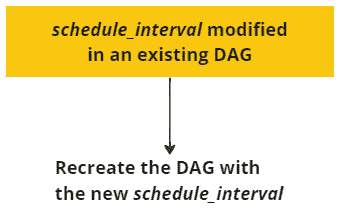

图 11.18 – 由 schedule_interval 变化引起的错误

在这些步骤结束时，我们将得到一个类似的调试图：

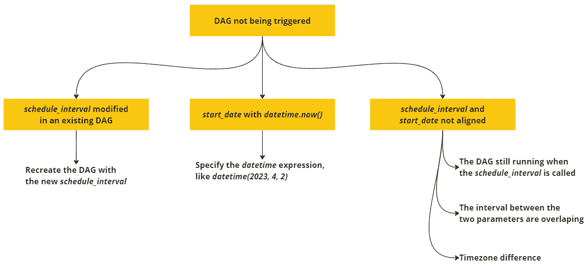

图 11.19 – 帮助识别 Airflow 调度器中错误引起的图

## 它是如何工作的…

如你所见，这个菜谱的目标是展示三种常见的与调度器相关的错误场景。调度器中的错误通常会导致 DAG 状态显示为 `None`，正如我们在 *准备就绪* 部分所看到的。然而，一个不符合预期行为的触发器也被认为是错误。现在，让我们探讨这三种解决场景及其解决方案。

第一个场景通常发生在我们想要为`start_date`使用当前日期时。虽然使用`datetime.now()`函数来表示当前日期时间似乎是个好主意，但 Airflow 不会像我们那样解释它。`datetime.now()`函数将创建我们所说的*动态调度器*，触发器永远不会被执行。这是因为执行调度使用`start_date`和`schedule_interval`来确定何时执行触发器，正如您在这里看到的：


图 11.20 – Airflow 执行调度方程

如果我们使用`datetime.now()`，它将随时间移动，永远不会被触发。我们建议使用静态调度定义，正如我们在*步骤 1*中看到的。

一个典型的错误是当`start_date`和`schedule_interval`不匹配时。根据*图 11.20*的解释，我们已能想象到为什么使这两个参数对齐并防止重叠如此重要。正如*步骤 2*中提到的，防止这种情况的一个好方法是通过使用 crontab 记法来设置`schedule_interval`。

一个重要的话题是涉及过程中的时区。如果您仔细查看 Airflow UI 的顶部，您将看到一个时钟及其关联的时区，如下所示：


图 11.21 – 显示时区的 Airflow UI 时钟

这表明 Airflow 服务器正在 UTC 时区运行，所有 DAG 和任务都将使用相同的逻辑执行。如果您在不同的时区工作并希望确保它将根据您的时区运行，您可以使用`pendulum`库，如下所示：

```py
schedule_interval = pendulum.now("Europe/Paris")
```

`pendulum`是一个第三方 Python 库，它使用内置的`datetime`Python 包提供简单的日期时间操作。您可以在`pendulum`官方文档中了解更多信息：[`pendulum.eustace.io/`](https://pendulum.eustace.io/)。

最后，最后一个场景有一个简单的解决方案：如果`schedule_interval`在执行一些操作后发生变化，则重新创建 DAG。尽管这种错误可能并不总是发生，但重新创建 DAG 以防止进一步的问题是良好的实践。

## 还有更多...

我们在这个菜谱中提供了一些示例，说明如果调度器不工作，您可以检查的内容，但 Airflow 中可能发生的其他常见错误。您可以在以下*Astronomer*博客页面上了解更多信息：[`www.astronomer.io/blog/7-common-errors-to-check-when-debugging-airflow-dag/`](https://www.astronomer.io/blog/7-common-errors-to-check-when-debugging-airflow-dag/)。

在博客中，您可以找到其他一些场景，其中 Airflow 会抛出静默错误（或没有明确错误消息的错误）以及如何解决它们。

# 进一步阅读

+   [关于 Airflow 的 FAQ：关于开始日期的处理](https://airflow.apache.org/docs/apache-airflow/stable/faq.xhtml#what-s-the-deal-with-start-date)

+   [为什么我的预定 DAG 没有运行？Apache Airflow 的动态开始日期用于等距或不等距间隔](https://se.devoteam.com/expert-view/why-my-scheduled-dag-does-not-runapache-airflow-dynamic-start-date-for-equally-unequally-spaced-interval/)

+   [Airflow DAG 在预定时间未触发的解决方案](https://stackoverflow.com/questions/66098050/airflow-dag-not-triggered-at-schedule-time)
