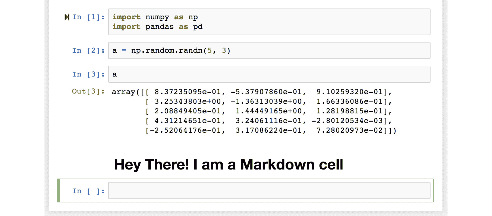

# 第一章：*前言*

## 关于

本节简要介绍了作者、本书涵盖的内容、开始学习所需的技术技能，以及完成所有包含的活动和练习所需的硬件和软件要求。

## 关于本书

为了使数据有用和有意义，它必须经过整理和精炼。“使用 Python 进行数据整理”教你这些过程背后的所有核心思想，并为你提供该领域最受欢迎的工具和技术知识。

本书从 Python 的绝对基础开始，主要关注数据结构，然后迅速跳入 NumPy 和 pandas 库，作为数据整理的基本工具。我们强调为什么你应该远离其他语言中传统的数据清洗方式，并利用 Python 中专门预构建的例程。之后，你将学习如何使用相同的 Python 后端，从互联网、大型数据库仓库或 Excel 财务表格等多样化的来源中提取和转换数据。然后，你还将学习如何处理缺失或不正确的数据，并根据下游分析工具的要求重新格式化。你将通过实际案例和数据集来了解这些概念。

在阅读完本书之后，你将足够自信地处理各种来源的数据，高效地进行数据的提取、清洗、转换和格式化。

### 关于作者

**Tirthajyoti Sarkar 博士**在半导体技术领域担任高级首席工程师，在那里他将尖端的数据科学/机器学习技术应用于自动化设计和预测分析。他经常撰写关于 Python 编程和数据科学主题的文章。他拥有伊利诺伊大学的博士学位，以及来自斯坦福和麻省理工学院的人工智能和机器学习认证。

**Shubhadeep Roychowdhury**在一家位于巴黎的网络安全初创公司担任高级软件工程师，在那里他应用最先进的计算机视觉和数据工程算法和工具来开发尖端产品。他经常撰写关于 Python 中的算法实现和类似主题的文章。他拥有西孟加拉技术大学的计算机科学硕士学位，以及来自斯坦福的机器学习认证。

### 学习目标

+   使用和操作复杂和简单的数据结构

+   充分利用 DataFrames 和 numpy.array 在运行时的全部潜力

+   使用 BeautifulSoup4 和 html5lib 进行网络爬取

+   使用 RegEX 执行高级字符串搜索和操作

+   使用 Pandas 处理异常值并进行数据插补

+   使用描述性统计和绘图技术

+   使用数据生成技术练习数据整理和建模

### 方法

使用 Python 进行数据处理采用实用方法，旨在在最短的时间内为初学者提供最基本的数据分析工具。它包含多个活动，使用真实业务场景让你练习并应用你的新技能，在高度相关的环境中。

### 读者对象

使用 Python 进行数据处理旨在为开发者、数据分析师和商业分析师提供，他们热衷于追求成为全职数据科学家或分析专家的职业。尽管这本书是为初学者准备的，但了解 Python 的相关知识对于轻松掌握这里涵盖的概念是必要的。对关系数据库和 SQL 的基本了解也将有所帮助。

### 最小硬件要求

为了获得最佳的学生体验，我们推荐以下硬件配置：

+   处理器：Intel Core i5 或同等性能

+   内存：8 GB RAM

+   存储：35 GB 可用空间

### 软件要求

你还需要预先安装以下软件：

+   操作系统：Windows 7 SP1 64 位、Windows 8.1 64 位或 Windows 10 64 位、Ubuntu Linux 或最新版本的 macOS

+   OS X 版本

+   处理器：Intel Core i5 或同等性能

+   内存：4 GB RAM（推荐 8 GB）

+   存储：35 GB 可用空间

### 习惯用法

文本中的代码单词、数据库表名、文件夹名、文件名、文件扩展名、路径名、虚拟 URL、用户输入和 Twitter 昵称如下所示：“这将返回与之关联的值- `["list_element1", 34]`”

代码块设置如下：

```py
list_1 = []
    for x in range(0, 10):
    list_1.append(x)
list_1
```

新术语和重要单词以粗体显示。屏幕上看到的单词，例如在菜单或对话框中，在文本中如下所示：“点击**新建**并选择**Python 3**。”

### 安装和设置

每一段伟大的旅程都始于一个谦卑的步伐。我们即将在数据处理领域的冒险也不例外。在我们能够用数据做些令人惊叹的事情之前，我们需要准备好最富有成效的环境。在本节中，我们将了解如何做到这一点。

本书对环境的要求只有一个，那就是安装 Docker。如果你从未听说过 Docker，或者你对它的了解非常有限，那么请不要担心。为了本书的目的，你需要了解的关于 Docker 的信息如下：Docker 是一个轻量级的容器化引擎，可以在所有三个主要平台（Linux、Windows 和 macOS）上运行。Docker 背后的主要思想是在你的原生操作系统之上提供安全、简单和轻量级的虚拟化。

**安装 Docker**

1.  要在 Mac 或 Windows 机器上安装 Docker，请创建一个 Docker 账户并下载最新版本。安装和设置都很简单。

1.  一旦你设置了 Docker，打开一个 shell（如果你是 Mac 用户，则为 Terminal）并输入以下命令以验证安装是否成功：

    ```py
    docker version
    ```

    如果输出显示了 Docker 的服务器和客户端版本，那么你已经设置好了。

**拉取镜像**

1.  拉取镜像后，你将拥有所有必要的软件包（包括 Python 3.6.6）安装并准备好供你开始工作。在 shell 中输入以下命令：

    ```py
    docker pull rcshubhadeep/packt-data-wrangling-base
    ```

1.  如果你想查看包含在这个镜像中的所有软件包及其版本的完整列表，你可以检查这本书源代码仓库中的`setup`文件夹下的`requirements.txt`文件。一旦镜像准备好了，你就可以开始使用了。下载可能需要时间，这取决于你的连接速度。

**运行环境**

1.  使用以下命令运行镜像：

    ```py
    docker run -p 8888:8888 -v 'pwd':/notebooks -it rcshubhadeep/packt-data-wrangling-base
    ```

    这将为你提供一个即用环境。

1.  在 Chrome 或 Firefox 中打开一个浏览器标签页，并转到[`http://localhost:8888`](http://localhost:8888)。你将被提示输入一个令牌。令牌是`dw_4_all`。

1.  在运行镜像之前，创建一个新的文件夹，并使用`cd`命令从 shell 导航到该文件夹。

    一旦你创建了一个笔记本并将其保存为`ipynb`文件，你可以使用*Ctrl +C*来停止运行镜像。

**Jupyter 笔记本简介**

Project Jupyter 是一个开源的免费软件，它允许你从特殊的笔记本中交互式地运行 Python 和其他语言的代码，类似于浏览器界面。它于 2014 年从`IPython`项目诞生，并已成为整个数据科学工作者的默认选择。

1.  一旦你运行了 Jupyter 服务器，点击**新建**并选择**Python 3**。一个新标签页将打开，显示一个新且空的笔记本。重命名 Jupyter 文件:

    ###### 图 0.1：Jupyter 服务器界面

    Jupyter 笔记本的主要构建块是单元格。有两种类型的单元格：**In**（代表输入）和**Out**（代表输出）。你可以在**In**单元格中编写代码、普通文本和 Markdown，按*Shift* + *Enter*（或*Shift* + *Return*），该特定**In**单元格中的代码将被执行。结果将显示在**Out**单元格中，你将进入一个新的**In**单元格，准备编写下一块代码。一旦你习惯了这种界面，你将逐渐发现它提供的强大功能和灵活性。

1.  关于 Jupyter 单元格的最后一件事是，当你开始一个新的单元格时，默认情况下，它假定你将在其中编写代码。然而，如果你想写文本，你必须更改类型。你可以使用以下键序列来完成：*Escape*->*m*->*Enter*:

    ###### 图 0.2：Jupyter 笔记本

1.  当你完成文本编写后，使用*Shift* + *Enter*来执行它。与代码单元格不同，编译后的 Markdown 的结果将显示在同一个位置，即“**In**”单元格中。

    #### 注意

    要获得 Jupyter 中所有便捷快捷键的“速查表”，你可以将此 Gist 添加到书签：[`gist.github.com/kidpixo/f4318f8c8143adee5b40`](https://gist.github.com/kidpixo/f4318f8c8143adee5b40)。有了这个基本的介绍和准备好的图像，我们就可以开始期待中的激动人心且富有启发的旅程了！

### 安装代码包

将课程代码包复制到`C:/Code`文件夹。

### 其他资源

本书代码包也托管在 GitHub 上：[`github.com/TrainingByPackt/Data-Wrangling-with-Python`](https://github.com/TrainingByPackt/Data-Wrangling-with-Python)。

我们还有来自我们丰富图书和视频目录的其他代码包，可在[`github.com/PacktPublishing/`](https://github.com/PacktPublishing/)找到。去看看吧！
