# 第四章：*第三章*

# NumPy、Pandas 和 Matplotlib 简介

## 学习目标

到本章结束时，您将能够：

+   创建并操作一维和多维数组

+   创建并操作 pandas DataFrame 和序列对象

+   使用 Matplotlib 库绘制和可视化数值数据

+   将 matplotlib、NumPy 和 pandas 应用于从 DataFrame/矩阵中计算描述性统计量

在本章中，您将了解 NumPy、pandas 和 matplotlib 库的基础知识。

## 简介

在前面的章节中，我们已经介绍了 Python 中的一些高级数据结构，例如栈、队列、迭代器和文件操作。在本节中，我们将介绍三个基本库，即 NumPy、pandas 和 matplotlib。

## NumPy 数组

在数据科学家的生活中，读取和操作数组是至关重要的，这也是最常遇到的任务。这些数组可能是一个一维列表、一个多维表格或一个充满数字的矩阵。

数组可以填充整数、浮点数、布尔值、字符串，甚至混合类型。然而，在大多数情况下，数值数据类型占主导地位。

一些需要处理数字数组的示例场景如下：

+   读取电话号码和邮政编码列表并提取特定模式

+   创建一个随机数字矩阵以运行某些统计过程的蒙特卡洛模拟

+   缩放和归一化销售数据表，包含大量财务和交易数据

+   从大型原始数据表中创建一个包含关键描述性统计量（例如，平均值、中位数、最小/最大范围、方差、四分位数范围）的小型表格

+   读取并分析一维数组中的时间序列数据，例如一个组织一年内的股价或气象站每日温度数据

简而言之，数组和数值数据表无处不在。作为一名数据整理专业人士，能够读取和处理数值数组的能力的重要性不容小觑。在这方面，NumPy 数组将是您在 Python 中需要了解的最重要对象。

### NumPy 数组和功能

**NumPy**和**SciPy**是 Python 的开源附加模块，它们提供了预编译的快速函数，以提供常见的数学和数值例程。这些库已经发展成为高度成熟的库，它们提供的功能满足或可能超过与常见商业软件（如**MATLAB**或**Mathematica**）相关联的功能。

NumPy 模块的主要优势是处理或创建一维或多维数组。这种高级数据结构/类是 NumPy 包的核心，它作为更高级类（如**pandas**和**DataFrame**）的基本构建块，我们将在本章稍后介绍。

NumPy 数组与常见的 Python 列表不同，因为 Python 列表可以被视为简单的数组。NumPy 数组是为**向量化**操作而构建的，这些操作只需一行代码就能处理大量的数值数据。NumPy 数组中的许多内置数学函数是用 C 或 Fortran 等低级语言编写的，并预先编译以实现真正的快速执行。

#### 注意

NumPy 数组是针对数值分析优化的数据结构，这就是为什么它们对数据科学家来说如此重要的原因。

### 练习 26：从列表创建 NumPy 数组

在这个练习中，我们将从列表创建一个 NumPy 数组：

1.  要使用 NumPy，我们必须导入它。按照惯例，我们在导入时给它一个简短的名字，`np`：

    ```py
    import numpy as np
    ```

1.  创建一个包含三个元素 1、2 和 3 的列表：

    ```py
    list_1 = [1,2,3]
    ```

1.  使用`array`函数将其转换为数组：

    ```py
    array_1 = np.array(list_1)
    ```

    我们刚刚从常规 Python 列表对象`list_1`创建了一个名为`array_1`的 NumPy 数组对象。

1.  创建一个包含浮点类型元素 1.2、3.4 和 5.6 的数组：

    ```py
    import array as arr
    a = arr.array('d', [1.2, 3.4, 5.6])
    print(a)
    ```

    输出如下：

    ```py
    array('d', [1.2, 3.4, 5.6])
    ```

1.  让我们使用`type`函数检查新创建的对象的类型：

    ```py
    type(array_1)
    ```

    输出如下：

    ```py
    numpy.ndarray
    ```

1.  在`list_1`上使用`type`：

    ```py
    type (list_1)
    ```

    输出如下：

    ```py
    list
    ```

因此，这确实与常规的`list`对象不同。

### 练习 27：添加两个 NumPy 数组

这个简单的练习将演示两个 NumPy 数组的相加，并因此展示常规 Python 列表/数组与 NumPy 数组之间的关键区别：

1.  考虑前一个练习中的`list_1`和`array_1`。如果你已经更改了 Jupyter 笔记本，你将需要再次声明它们。

1.  使用`+`符号将两个`list_1`对象相加，并将结果保存到`list_2`中：

    ```py
    list_2 = list_1 + list_1
    print(list_2)
    ```

    输出如下：

    ```py
     [1, 2, 3, 1, 2, 3]
    ```

1.  使用相同的`+`符号将两个`array_1`对象相加，并将结果保存到`array_2`中：

    ```py
    array_2 = array_1 + array_1
    print(array_2)
    ```

    输出如下：

    ```py
    [2, ,4, 6]
    ```

你注意到区别了吗？第一个打印显示了一个包含 6 个元素的列表[1, 2, 3, 1, 2, 3]。但第二个打印显示了一个包含元素[2, 4, 6]的另一个 NumPy 数组（或向量），这些元素只是`array_1`各个元素的求和。

NumPy 数组类似于数学对象——**向量**。它们是为元素级操作而构建的，也就是说，当我们添加两个 NumPy 数组时，我们将第一个数组的第一个元素添加到第二个数组的第一个元素——在这个操作中有元素到元素的对应关系。这与 Python 列表形成对比，在 Python 列表中，元素只是简单追加，没有元素到元素的关系。这正是 NumPy 数组的真正力量：它们可以被当作数学向量来处理。

向量是一组数字，可以表示，例如，三维空间中点的坐标或图片中数字的颜色（RGB）。自然地，相对顺序对这样的集合很重要，正如我们之前讨论的，NumPy 数组可以保持这种顺序关系。这就是为什么它们非常适合用于数值计算。

### 练习 28：NumPy 数组上的数学运算

现在你已经知道这些数组就像向量一样，我们将尝试在数组上进行一些数学运算。

NumPy 数组甚至支持逐元素指数运算。例如，假设有两个数组——第一个数组的元素将被提升到第二个数组元素的幂：

1.  使用以下命令乘以两个数组：

    ```py
    print("array_1 multiplied by array_1: ",array_1*array_1)
    ```

    输出如下：

    ```py
    array_1 multiplied by array_1:  [1 4 9]
    ```

1.  使用以下命令除以两个数组：

    ```py
    print("array_1 divided by array_1: ",array_1/array_1)
    ```

    输出如下：

    ```py
    array_1 divided by array_1:  [1\. 1\. 1.]
    ```

1.  使用以下命令将一个数组提升到第二个数组的幂：

    ```py
    print("array_1 raised to the power of array_1: ",array_1**array_1)
    ```

    输出如下：

    ```py
    array_1 raised to the power of array_1:  [ 1  4 27]
    ```

### 练习 29：NumPy 数组的高级数学运算

NumPy 拥有你所能想到的所有内置数学函数。在这里，我们将创建一个列表并将其转换为 NumPy 数组。然后，我们将对该数组执行一些高级数学运算。

在这里，我们正在创建一个列表并将其转换为 NumPy 数组。然后，我们将展示如何在该数组上执行一些高级数学运算：

1.  创建一个包含五个元素的列表：

    ```py
    list_5=[i for i in range(1,6)]
    print(list_5)
    ```

    输出如下：

    ```py
    [1, 2, 3, 4, 5]
    ```

1.  使用以下命令将列表转换为 NumPy 数组：

    ```py
    array_5=np.array(list_5)
    array_5
    ```

    输出如下：

    ```py
    array([1, 2, 3, 4, 5])
    ```

1.  使用以下命令计算数组的正弦值：

    ```py
    # sine function
    print("Sine: ",np.sin(array_5))
    ```

    输出如下：

    ```py
    Sine:  [ 0.84147098  0.90929743  0.14112001 -0.7568025  -0.95892427]
    ```

1.  使用以下命令计算数组的对数值：

    ```py
    # logarithm
    print("Natural logarithm: ",np.log(array_5))
    print("Base-10 logarithm: ",np.log10(array_5))
    print("Base-2 logarithm: ",np.log2(array_5))
    ```

    输出如下：

    ```py
    Natural logarithm:  [0\.         0.69314718 1.09861229 1.38629436 1.60943791]
    Base-10 logarithm:  [0\.         0.30103    0.47712125 0.60205999 0.69897   ]
    Base-2 logarithm:  [0\.         1\.         1.5849625  2\.         2.32192809]
    ```

1.  使用以下命令计算数组的指数值：

    ```py
    # Exponential
    print("Exponential: ",np.exp(array_5))
    ```

    输出如下：

    ```py
    Exponential:  [  2.71828183   7.3890561   20.08553692  54.59815003 148.4131591 ]
    ```

### 练习 30：使用 arange 和 linspace 生成数组

数值数组的生成是一个相当常见的任务。到目前为止，我们一直是通过创建 Python 列表对象并将其转换为 NumPy 数组来做到这一点。然而，我们可以绕过这一步，直接使用原生 NumPy 方法进行操作。

`arange`函数根据你给出的最小和最大界限以及指定的步长创建一系列数字。另一个函数`linspace`在两个极端之间创建一系列固定数量的中间点：

1.  使用以下命令创建一系列数字，使用`arange`方法：

    ```py
    print("A series of numbers:",np.arange(5,16))
    ```

    输出如下：

    ```py
    A series of numbers: [ 5  6  7  8  9 10 11 12 13 14 15]
    ```

1.  使用`arange`函数打印数字，使用以下命令：

    ```py
    print("Numbers spaced apart by 2: ",np.arange(0,11,2))
    print("Numbers spaced apart by a floating point number: ",np.arange(0,11,2.5))
    print("Every 5th number from 30 in reverse order\n",np.arange(30,-1,-5))
    ```

    输出如下：

    ```py
    Numbers spaced apart by 2:  [ 0  2  4  6  8 10]
    Numbers spaced apart by a floating point number:  [ 0\.   2.5  5\.   7.5 10\. ]
    Every 5th number from 30 in reverse order
     [30 25 20 15 10  5  0]
    ```

1.  对于线性间隔的数字，我们可以使用`linspace`方法，如下所示：

    ```py
    print("11 linearly spaced numbers between 1 and 5: ",np.linspace(1,5,11))
    ```

    输出如下：

    ```py
    11 linearly spaced numbers between 1 and 5:  [1\.  1.4 1.8 2.2 2.6 3\.  3.4 3.8 4.2 4.6 5\. ]
    ```

### 练习 31：创建多维数组

到目前为止，我们只创建了单维数组。现在，让我们创建一些多维数组（例如线性代数中的矩阵）。就像我们从简单的扁平列表创建一维数组一样，我们可以从列表的列表中创建一个二维数组：

1.  使用以下命令创建一个列表的列表并将其转换为二维 NumPy 数组：

    ```py
    list_2D = [[1,2,3],[4,5,6],[7,8,9]]
    mat1 = np.array(list_2D)
    print("Type/Class of this object:",type(mat1))
    print("Here is the matrix\n----------\n",mat1,"\n----------")
    ```

    输出如下：

    ```py
    Type/Class of this object: <class 'numpy.ndarray'>
    Here is the matrix
    ---------- 
    [[1 2 3] 
    [4 5 6] 
    [7 8 9]] 
    ----------
    ```

1.  可以使用以下代码将元组转换为多维数组：

    ```py
    tuple_2D = np.array([(1.5,2,3), (4,5,6)])
    mat_tuple = np.array(tuple_2D)
    print (mat_tuple)
    ```

    输出如下：

    ```py
    [[1.5 2\.  3\. ]
     [4\.  5\.  6\. ]]
    ```

因此，我们已经使用 Python 列表和元组创建了多维数组。

### 练习 32：二维数组的维度、形状、大小和数据类型

以下方法可让您检查数组的维度、形状和大小。注意，如果它是一个 3x2 矩阵，即它有 3 行和 2 列，那么形状将是(3,2)，但大小将是 6，因为 6 = 3x2：

1.  使用`ndim`通过以下命令打印矩阵的维度：

    ```py
    print("Dimension of this matrix: ",mat1.ndim,sep='')
    ```

    输出如下：

    ```py
    Dimension of this matrix: 2
    ```

1.  使用`size`打印大小：

    ```py
    print("Size of this matrix: ", mat1.size,sep='') 
    ```

    输出如下：

    ```py
    Size of this matrix: 9
    ```

1.  使用`shape`打印矩阵的形状：

    ```py
    print("Shape of this matrix: ", mat1.shape,sep='')
    ```

    输出如下：

    ```py
    Shape of this matrix: (3, 3)
    ```

1.  使用`dtype`打印维度类型：

    ```py
    print("Data type of this matrix: ", mat1.dtype,sep='')
    ```

    输出如下：

    ```py
    Data type of this matrix: int32
    ```

### 练习 33：零矩阵、单位矩阵、随机矩阵和向量

现在我们已经熟悉了 NumPy 中的基本向量（一维）和矩阵数据结构，我们将看看如何轻松创建特殊矩阵。通常，您可能需要创建填充有零、一、随机数或对角线上的单位矩阵的矩阵：

1.  使用以下命令打印零向量：

    ```py
    print("Vector of zeros: ",np.zeros(5))
    ```

    输出如下：

    ```py
    Vector of zeros:  [0\. 0\. 0\. 0\. 0.]
    ```

1.  使用以下命令打印零矩阵：

    ```py
    print("Matrix of zeros: ",np.zeros((3,4)))
    ```

    输出如下：

    ```py
    Matrix of zeros:  [[0\. 0\. 0\. 0.]
     [0\. 0\. 0\. 0.]
     [0\. 0\. 0\. 0.]]
    ```

1.  使用以下命令打印五矩阵：

    ```py
    print("Matrix of 5's: ",5*np.ones((3,3)))
    ```

    输出如下：

    ```py
    Matrix of 5's:  [[5\. 5\. 5.]
     [5\. 5\. 5.]
     [5\. 5\. 5.]]
    ```

1.  使用以下命令打印单位矩阵：

    ```py
    print("Identity matrix of dimension 2:",np.eye(2))
    ```

    输出如下：

    ```py
    Identity matrix of dimension 2: [[1\. 0.]
     [0\. 1.]]
    ```

1.  使用以下命令打印 4x4 的单位矩阵：

    ```py
    print("Identity matrix of dimension 4:",np.eye(4))
    ```

    输出如下：

    ```py
    Identity matrix of dimension 4: [[1\. 0\. 0\. 0.]
     [0\. 1\. 0\. 0.]
     [0\. 0\. 1\. 0.]
     [0\. 0\. 0\. 1.]]
    ```

1.  使用`randint`函数打印具有随机形状的矩阵：

    ```py
    print("Random matrix of shape (4,3):\n",np.random.randint(low=1,high=10,size=(4,3)))
    ```

    样本输出如下：

    ```py
    Random matrix of shape (4,3):
     [[6 7 6]
     [5 6 7]
     [5 3 6]
     [2 9 4]]
    ```

    #### 注意

    在创建矩阵时，您需要传递整数元组作为参数。

随机数生成是一个非常有用的工具，需要在数据科学/数据处理任务中掌握。我们将在统计部分再次探讨随机变量和分布的主题，并了解 NumPy 和 pandas 如何内置随机数和序列生成，以及操作函数。

### 练习 34：重塑、展平、最小值、最大值和排序

`reshape`是`ravel`函数，它将任何给定的数组展平为一维数组。这在许多机器学习和数据分析任务中是一个非常有用的操作。

以下函数可以重塑函数。我们首先生成一个两位数的随机一维向量，然后将向量重塑为多维向量：

1.  使用以下代码创建一个包含 30 个随机整数（从 1 到 99 中采样）的数组，并将其重塑成两种不同的形式：

    ```py
    a = np.random.randint(1,100,30)
    b = a.reshape(2,3,5)
    c = a.reshape(6,5)
    ```

1.  使用以下代码通过`shape`函数打印形状：

    ```py
    print ("Shape of a:", a.shape)
    print ("Shape of b:", b.shape)
    print ("Shape of c:", c.shape)
    ```

    输出如下：

    ```py
    Shape of a: (30,)
    Shape of b: (2, 3, 5)
    Shape of c: (6, 5)
    ```

1.  使用以下代码打印数组 a、b 和 c：

    ```py
    print("\na looks like\n",a)
    print("\nb looks like\n",b)
    print("\nc looks like\n",c)
    ```

    样本输出如下：

    ```py
    a looks like
     [ 7 82  9 29 50 50 71 65 33 84 55 78 40 68 50 15 65 55 98 38 23 75 50 57
     32 69 34 59 98 48]
    b looks like
     [[[ 7 82  9 29 50]
      [50 71 65 33 84]
      [55 78 40 68 50]]
     [[15 65 55 98 38]
      [23 75 50 57 32]
      [69 34 59 98 48]]]
    c looks like
     [[ 7 82  9 29 50]
     [50 71 65 33 84]
     [55 78 40 68 50]
     [15 65 55 98 38]
     [23 75 50 57 32]
     [69 34 59 98 48]]
    ```

    #### 注意

    "b"是一个三维数组——一种列表的列表的列表。

1.  使用以下代码将文件 b 展平：

    ```py
    b_flat = b.ravel()
    print(b_flat)
    ```

    样本输出如下：

    ```py
    [ 7 82  9 29 50 50 71 65 33 84 55 78 40 68 50 15 65 55 98 38 23 75 50 57
     32 69 34 59 98 48]
    ```

### 练习 35：索引和切片

**索引**和**切片**的 NumPy 数组与常规列表索引非常相似。我们甚至可以通过提供一个格式为（开始，步长，结束）的额外参数来以确定的步长遍历元素向量。此外，我们可以传递一个列表作为参数来选择特定元素。

在这个练习中，我们将学习一维和多维数组上的索引和切片操作：

#### 注意

在多维数组中，你可以使用两个数字来表示一个元素的位置。例如，如果元素位于第三行第二列，其索引为 2 和 1（因为 Python 的零基索引）。

1.  创建一个包含 10 个元素的数组，并通过使用不同的语法进行切片和索引来检查其各种元素。使用以下命令完成此操作：

    ```py
    array_1 = np.arange(0,11)
    print("Array:",array_1)
    ```

    输出如下：

    ```py
    Array: [ 0  1  2  3  4  5  6  7  8  9 10]
    ```

1.  使用以下命令打印第七位置的元素：

    ```py
    print("Element at 7th index is:", array_1[7])
    ```

    输出如下：

    ```py
    Element at 7th index is: 7
    ```

1.  使用以下命令打印第三和第六位置之间的元素：

    ```py
    print("Elements from 3rd to 5th index are:", array_1[3:6])
    ```

    输出如下：

    ```py
    Elements from 3rd to 5th index are: [3 4 5]
    ```

1.  使用以下命令打印直到第四个位置的元素：

    ```py
    print("Elements up to 4th index are:", array_1[:4])
    ```

    输出如下：

    ```py
    Elements up to 4th index are: [0 1 2 3]
    ```

1.  使用以下命令反向打印元素：

    ```py
    print("Elements from last backwards are:", array_1[-1::-1])
    ```

    输出如下：

    ```py
    Elements from last backwards are: [10  9  8  7  6  5  4  3  2  1  0]
    ```

1.  使用以下命令按反向索引打印元素，跳过三个值：

    ```py
    print("3 Elements from last backwards are:", array_1[-1:-6:-2])
    ```

    输出如下：

    ```py
    3 Elements from last backwards are: [10  8  6]
    ```

1.  使用以下命令创建一个名为`array_2`的新数组：

    ```py
    array_2 = np.arange(0,21,2)
    print("New array:",array_2)
    ```

    输出如下：

    ```py
    New array: [ 0  2  4  6  8 10 12 14 16 18 20]
    ```

1.  打印数组的第二个、第四个和第九个元素：

    ```py
    print("Elements at 2nd, 4th, and 9th index are:", array_2[[2,4,9]])
    ```

    输出如下：

    ```py
    Elements at 2nd, 4th, and 9th index are: [ 4  8 18]
    ```

1.  使用以下命令创建一个多维数组：

    ```py
    matrix_1 = np.random.randint(10,100,15).reshape(3,5)
    print("Matrix of random 2-digit numbers\n ",matrix_1)
    ```

    样本输出如下：

    ```py
    Matrix of random 2-digit numbers
      [[21 57 60 24 15]
     [53 20 44 72 68]
     [39 12 99 99 33]]
    ```

1.  使用双括号索引访问值，使用以下命令：

    ```py
    print("\nDouble bracket indexing\n")
    print("Element in row index 1 and column index 2:", matrix_1[1][2])
    ```

    样本输出如下：

    ```py
    Double bracket indexing
    Element in row index 1 and column index 2: 44
    ```

1.  使用单括号索引访问值，使用以下命令：

    ```py
    print("\nSingle bracket with comma indexing\n")
    print("Element in row index 1 and column index 2:", matrix_1[1,2])
    ```

    样本输出如下：

    ```py
    Single bracket with comma indexing
    Element in row index 1 and column index 2: 44
    ```

1.  使用以下命令通过行或列访问多维数组中的值：

    ```py
    print("\nRow or column extract\n")
    print("Entire row at index 2:", matrix_1[2])
    print("Entire column at index 3:", matrix_1[:,3])
    ```

    样本输出如下：

    ```py
    Row or column extract
    Entire row at index 2: [39 12 99 99 33]
    Entire column at index 3: [24 72 99]
    ```

1.  使用以下命令按指定的行和列索引打印矩阵：

    ```py
    print("\nSubsetting sub-matrices\n")
    print("Matrix with row indices 1 and 2 and column indices 3 and 4\n", matrix_1[1:3,3:5])
    ```

    样本输出如下：

    ```py
    Subsetting sub-matrices
    Matrix with row indices 1 and 2 and column indices 3 and 4
     [[72 68]
     [99 33]]
    ```

1.  使用以下命令按指定的行和列索引打印矩阵：

    ```py
    print("Matrix with row indices 0 and 1 and column indices 1 and 3\n", matrix_1[0:2,[1,3]])
    ```

    样本输出如下：

    ```py
    Matrix with row indices 0 and 1 and column indices 1 and 3
     [[57 24]
     [20 72]]
    ```

### 条件子集

**条件子集**是一种根据某些数值条件选择特定元素的方法。它几乎就像是一个简化的 SQL 查询，用于子集元素。请看以下示例：

```py
matrix_1 = np.array(np.random.randint(10,100,15)).reshape(3,5)
print("Matrix of random 2-digit numbers\n",matrix_1)
print ("\nElements greater than 50\n", matrix_1[matrix_1>50])
```

样本输出如下（请注意，由于是随机的，您的确切输出将不同）：

```py
Matrix of random 2-digit numbers
 [[71 89 66 99 54]
 [28 17 66 35 85]
 [82 35 38 15 47]]
Elements greater than 50
 [71 89 66 99 54 66 85 82]
```

### 练习 36：数组操作（数组-数组、数组-标量和通用函数）

NumPy 数组操作就像数学矩阵一样，操作是逐元素进行的。

创建两个矩阵（多维数组）并使用随机整数，演示逐元素数学运算，如加法、减法、乘法和除法。展示指数运算（将一个数提高到某个幂）如下：

#### 注意

由于随机数生成，您的具体输出可能与这里显示的不同。

1.  创建两个矩阵：

    ```py
    matrix_1 = np.random.randint(1,10,9).reshape(3,3)
    matrix_2 = np.random.randint(1,10,9).reshape(3,3)
    print("\n1st Matrix of random single-digit numbers\n",matrix_1)
    print("\n2nd Matrix of random single-digit numbers\n",matrix_2)
    ```

    样本输出如下（请注意，由于是随机的，所以您的确切输出将与您不同）：

    ```py
    1st Matrix of random single-digit numbers
     [[6 5 9]
     [4 7 1]
     [3 2 7]]
    2nd Matrix of random single-digit numbers
     [[2 3 1]
     [9 9 9]
     [9 9 6]]
    ```

1.  在矩阵上执行加法、减法、除法和线性组合：

    ```py
    print("\nAddition\n", matrix_1+matrix_2)
    print("\nMultiplication\n", matrix_1*matrix_2)
    print("\nDivision\n", matrix_1/matrix_2)
    print("\nLinear combination: 3*A - 2*B\n", 3*matrix_1-2*matrix_2)
    ```

    样本输出如下（请注意，由于是随机的，所以您的确切输出将与您不同）：

    ```py
    Addition
     [[ 8  8 10]
     [13 16 10]
     [12 11 13]] ^
    Multiplication
     [[12 15  9]
     [36 63  9]
     [27 18 42]]
    Division
     [[3\.         1.66666667 9\.        ]
     [0.44444444 0.77777778 0.11111111]
     [0.33333333 0.22222222 1.16666667]]
    Linear combination: 3*A - 2*B
     [[ 14   9  25]
     [ -6   3 -15]
     [ -9 -12   9]]
    ```

1.  执行标量、指数矩阵立方和指数平方根的加法：

    ```py
    print("\nAddition of a scalar (100)\n", 100+matrix_1)
    print("\nExponentiation, matrix cubed here\n", matrix_1**3)
    print("\nExponentiation, square root using 'pow' function\n",pow(matrix_1,0.5))
    ```

    样本输出如下（请注意，由于是随机的，所以您的确切输出将与您不同）：

    ```py
    Addition of a scalar (100)
     [[106 105 109]
     [104 107 101]
     [103 102 107]]
    Exponentiation, matrix cubed here
     [[216 125 729]
     [ 64 343   1]
     [ 27   8 343]]
    Exponentiation, square root using 'pow' function
     [[2.44948974 2.23606798 3\.        ]
     [2\.         2.64575131 1\.        ]
     [1.73205081 1.41421356 2.64575131]]
    ```

### 数组堆叠

**在数组上方（或旁边）堆叠**是一个有用的数据整理操作。以下是代码：

```py
a = np.array([[1,2],[3,4]])
b = np.array([[5,6],[7,8]])
print("Matrix a\n",a)
print("Matrix b\n",b)
print("Vertical stacking\n",np.vstack((a,b)))
print("Horizontal stacking\n",np.hstack((a,b)))
```

输出如下：

```py
Matrix a
 [[1 2]
 [3 4]]
Matrix b
 [[5 6]
 [7 8]]
Vertical stacking
 [[1 2]
 [3 4]
 [5 6]
 [7 8]]
Horizontal stacking
 [[1 2 5 6]
 [3 4 7 8]]
```

NumPy 有许多其他高级功能，主要与统计和线性代数函数相关，这些函数在机器学习和数据科学任务中得到了广泛的应用。然而，并非所有这些对初学者级别的数据处理直接有用，所以我们在这里不会涵盖它。

## Pandas 数据框

Pandas 库是一个 Python 包，它提供了快速、灵活且表达性强的数据结构，旨在使处理关系型或标记数据变得既简单又直观。它的目标是成为在 Python 中进行实际、现实世界数据分析的基本高级构建块。此外，它还有更广泛的目标，即成为任何语言中最强大和最灵活的开源数据分析/操作工具。

Pandas 的两种主要数据结构，`Series`（一维）和`DataFrame`（二维），可以处理绝大多数典型用例。Pandas 是建立在 NumPy 之上的，旨在与许多第三方库很好地集成到一个科学计算环境中。

### 练习 37：创建 Pandas 序列

在这个练习中，我们将学习如何从我们之前创建的数据结构中创建 pandas 序列对象。如果您已将 pandas 导入为 `pd`，则创建序列的函数简单为 `pd.Series`：

1.  初始化标签、列表和字典：

    ```py
    labels = ['a','b','c']
    my_data = [10,20,30]
    array_1 = np.array(my_data)
    d = {'a':10,'b':20,'c':30}
    print ("Labels:", labels)
    print("My data:", my_data)
    print("Dictionary:", d)
    ```

    输出如下：

    ```py
    Labels: ['a', 'b', 'c']
    My data: [10, 20, 30]
    Dictionary: {'a': 10, 'b': 20, 'c': 30}
    ```

1.  使用以下命令将 pandas 导入为 `pd`：

    ```py
    import pandas as pd
    ```

1.  使用以下命令从`my_data`列表创建一个序列：

    ```py
    series_1=pd.Series(data=my_data)
    print(series_1)
    ```

    输出如下：

    ```py
    0    10
    1    20
    2    30
    dtype: int64
    ```

1.  从`my_data`列表创建一个序列，并使用以下命令添加`labels`：

    ```py
    series_2=pd.Series(data=my_data, index = labels)
    print(series_2)
    ```

    输出如下：

    ```py
    a    10
    b    20
    c    30
    dtype: int64
    ```

1.  然后，从 NumPy 数组创建一个序列，如下所示：

    ```py
    series_3=pd.Series(array_1,labels)
    print(series_3)
    ```

    输出如下：

    ```py
    a    10
    b    20
    c    30
    dtype: int32
    ```

1.  从字典创建一个序列，如下所示：

    ```py
    series_4=pd.Series(d)
    print(series_4)
    ```

    输出如下：

    ```py
    a    10
    b    20
    c    30
    dtype: int64
    ```

### 练习 38：Pandas 序列和数据处理

pandas 系列对象可以存储多种类型的数据。这是构建更大表格的关键，其中多个系列对象堆叠在一起以创建类似数据库的实体：

1.  使用以下命令使用数值数据创建 pandas 系列：

    ```py
    print ("\nHolding numerical data\n",'-'*25, sep='')
    print(pd.Series(array_1))
    ```

    输出如下：

    ```py
    Holding numerical data
    -------------------------
    0    10
    1    20
    2    30
    dtype: int32
    ```

1.  使用以下命令使用标签创建 pandas 系列：

    ```py
    print ("\nHolding text labels\n",'-'*20, sep='')
    print(pd.Series(labels))
    ```

    输出如下：

    ```py
    Holding text labels
    --------------------
    0    a
    1    b
    2    c
    dtype: object
    ```

1.  使用以下命令创建一个带有函数的 pandas 系列：

    ```py
    print ("\nHolding functions\n",'-'*20, sep='')
    print(pd.Series(data=[sum,print,len]))
    ```

    输出如下：

    ```py
    Holding functions
    --------------------
    0      <built-in function sum>
    1    <built-in function print>
    2      <built-in function len>
    dtype: object
    ```

1.  使用以下命令使用字典创建 pandas 系列：

    ```py
    print ("\nHolding objects from a dictionary\n",'-'*40, sep='')
    print(pd.Series(data=[d.keys, d.items, d.values]))
    ```

    输出如下：

    ```py
    Holding objects from a dictionary
    ----------------------------------------
    0    <built-in method keys of dict object at 0x0000...
    1    <built-in method items of dict object at 0x000...
    2    <built-in method values of dict object at 0x00...
    dtype: object
    ```

### 练习 39：创建 Pandas DataFrame

pandas DataFrame 类似于 Excel 表格或关系数据库（SQL）表，它由三个主要组件组成：数据、索引（或行）和列。在底层，它是一堆 pandas 系列，这些系列本身又建立在 NumPy 数组之上。因此，我们之前关于 NumPy 数组的所有知识都适用于这里：

1.  从一个二维数字矩阵创建一个简单的 DataFrame。首先，代码从均匀分布中抽取 20 个随机整数。然后，我们需要将其重塑为 (5,4) 的 NumPy 数组——5 行和 4 列：

    ```py
    matrix_data = np.random.randint(1,10,size=20).reshape(5,4)
    ```

1.  将行标签定义为 `('A','B','C','D','E')`，列标签定义为 `('W','X','Y','Z')`：

    ```py
    row_labels = ['A','B','C','D','E']
    column_headings = ['W','X','Y','Z']
    df = pd.DataFrame(data=matrix_data, index=row_labels,
                      columns=column_headings)
    ```

1.  创建 DataFrame 的函数是 `pd.DataFrame`，它将在下面调用：

    ```py
    print("\nThe data frame looks like\n",'-'*45, sep='')
    print(df) 
    ```

    样本输出如下：

    ```py
    The data frame looks like
    ---------------------------------------------
       W  X  Y  Z
    A  6  3  3  3
    B  1  9  9  4
    C  4  3  6  9
    D  4  8  6  7
    E  6  6  9  1
    ```

1.  使用以下命令通过一些整数列表的 Python 字典创建 DataFrame：

    ```py
    d={'a':[10,20],'b':[30,40],'c':[50,60]}
    ```

1.  将此字典作为数据参数传递给 `pd.DataFrame` 函数。传递一个行或索引列表。注意字典键变成了列名，而值被分配到多行中：

    ```py
    df2=pd.DataFrame(data=d,index=['X','Y'])
    print(df2)
    ```

    输出如下：

    ```py
        a   b   c
    X  10  30  50
    Y  20  40  60
    ```

    #### 注意

    你最常遇到创建 pandas DataFrame 的方式是从本地磁盘或互联网上的文件中读取表格数据——CSV、文本、JSON、HTML、Excel 等等。我们将在下一章中介绍其中的一些。

### 练习 40：部分查看 DataFrame

在上一节中，我们使用 `print(df)` 来打印整个 DataFrame。对于大型数据集，我们只想打印数据的一部分。在这个练习中，我们将读取 DataFrame 的一部分：

1.  执行以下代码以创建一个包含 25 行并填充随机数的 DataFrame：

    ```py
    # 25 rows and 4 columns
    matrix_data = np.random.randint(1,100,100).reshape(25,4)
    column_headings = ['W','X','Y','Z']
    df = pd.DataFrame(data=matrix_data,columns=column_headings)
    ```

1.  运行以下代码以仅查看 DataFrame 的前五行：

    ```py
    df.head()
    ```

    样本输出如下（请注意，由于随机性，你的输出可能不同）：

    

    ###### 图 3.1：DataFrame 的前五行

    默认情况下，`head` 只显示五行。如果你想看到任何特定数量的行，只需将其作为参数传递。

1.  使用以下命令打印前八行：

    ```py
    df.head(8)
    ```

    样本输出如下：

    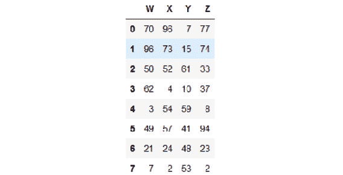

    ###### 图 3.2：DataFrame 的前八行

    就像 `head` 显示前几行一样，`tail` 显示最后几行。

1.  使用 `tail` 命令打印 DataFrame，如下所示：

    ```py
    df.tail(10)
    ```

    样本输出如下：

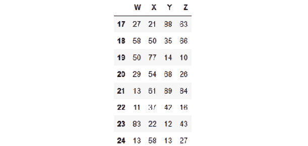

###### 图 3.3：DataFrame 的最后十行

### 索引和切片列

从 DataFrame 中索引和切片列有两种方法。如下所示：

+   **DOT 方法**

+   **括号方法**

DOT 方法适用于查找特定元素。括号方法直观且易于理解。在此方法中，您可以通过列的通用名称/标题访问数据。

以下代码说明了这些概念。在您的 Jupyter 笔记本中执行它们：

```py
print("\nThe 'X' column\n",'-'*25, sep='')
print(df['X'])
print("\nType of the column: ", type(df['X']), sep='')
print("\nThe 'X' and 'Z' columns indexed by passing a list\n",'-'*55, sep='')
print(df[['X','Z']])
print("\nType of the pair of columns: ", type(df[['X','Z']]), sep='')
```

输出如下（此处显示截图，因为实际列很长）：

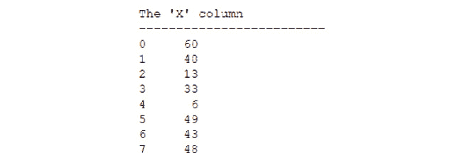

###### 图 3.4：'X' 列的行

这是显示列类型的输出：


###### 图 3.5：'X' 列的类型

这是通过传递列表索引 X 和 Z 列的输出：

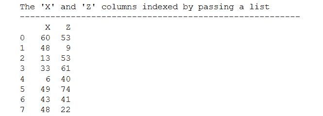

###### 图 3.6：'Y' 列的行

这是显示列对类型的输出：


###### 图 3.7：'Y' 列的类型

#### 注意

对于多个列，对象变为 DataFrame。但对于单个列，它是一个 pandas 系列对象。

### 索引和切片行

在 DataFrame 中，可以使用以下方法进行行索引和切片：

+   **基于标签的 'loc' 方法**

+   **基于索引的 'iloc' 方法**

`loc` 方法直观且易于理解。在此方法中，您可以通过行的通用名称访问数据。另一方面，`iloc` 方法允许您通过它们的数值索引访问行。对于具有数千行的大表，这非常有用，尤其是在您想使用数值计数器在循环中遍历表时。以下代码说明了 `iloc` 的概念：

```py
matrix_data = np.random.randint(1,10,size=20).reshape(5,4)
row_labels = ['A','B','C','D','E']
column_headings = ['W','X','Y','Z']
df = pd.DataFrame(data=matrix_data, index=row_labels,
                  columns=column_headings)
print("\nLabel-based 'loc' method for selecting row(s)\n",'-'*60, sep='')
print("\nSingle row\n")
print(df.loc['C'])
print("\nMultiple rows\n")
print(df.loc[['B','C']])
print("\nIndex position based 'iloc' method for selecting row(s)\n",'-'*70, sep='')
print("\nSingle row\n")
print(df.iloc[2])
print("\nMultiple rows\n")
print(df.iloc[[1,2]])
```

样本输出如下：

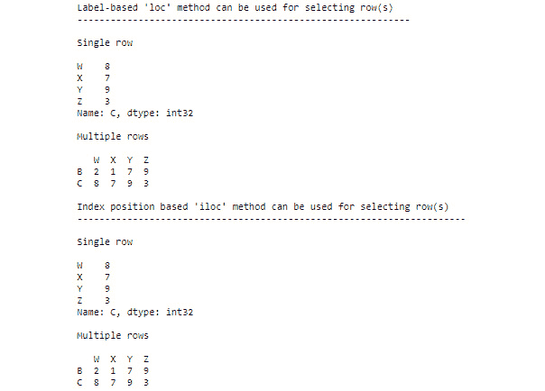

###### 图 3.8：loc 和 iloc 方法的输出

### 练习 41：创建和删除新列或行

数据清洗中最常见的任务之一是从 DataFrame 中创建或删除列或行。有时，您可能希望根据某些涉及现有列的数学运算或转换创建新列。这与操作数据库记录并在简单转换的基础上插入新列类似。我们在以下代码块中展示了这些概念：

1.  使用以下代码片段创建新列：

    ```py
    print("\nA column is created by assigning it in relation\n",'-'*75, sep='')
    df['New'] = df['X']+df['Z']
    df['New (Sum of X and Z)'] = df['X']+df['Z']
    print(df)
    ```

    样本输出如下：

    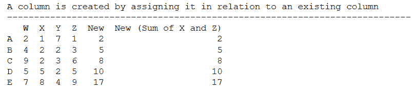

    ###### 图 3.9：添加新列后的输出

1.  使用 `df.drop` 方法删除列：

    ```py
    print("\nA column is dropped by using df.drop() method\n",'-'*55, sep='')
    df = df.drop('New', axis=1) # Notice the axis=1 option, axis = 0 is #default, so one has to change it to 1
    print(df)
    ```

    样本输出如下：

    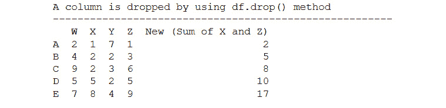

    ###### 图 3.10：删除列后的输出

1.  使用 `df.drop` 方法删除特定行：

    ```py
    df1=df.drop('A')
    print("\nA row is dropped by using df.drop method and axis=0\n",'-'*65, sep='')
    print(df1)
    ```

    以下是一个示例输出：

    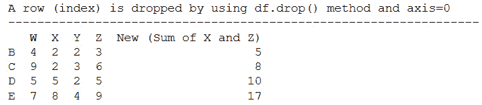

    ###### 图 3.11：删除行后的输出

    放弃方法会创建 DataFrame 的副本，而不会更改原始 DataFrame。

1.  通过将 `inplace` 参数设置为 `True` 来更改原始 DataFrame：

    ```py
    print("\nAn in-place change can be done by making inplace=True in the drop method\n",'-'*75, sep='')
    df.drop('New (Sum of X and Z)', axis=1, inplace=True)
    print(df)
    ```

    以下是一个示例输出：

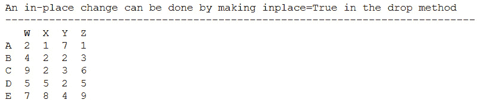

###### 图 3.12：使用 inplace 参数后的输出

#### 注意

所有常规操作都不是就地进行的，也就是说，它们不会影响原始 DataFrame 对象，而是返回原始数据的副本（或删除）。最后一段代码展示了如何使用 `inplace=True` 参数在现有 DataFrame 中进行更改。请注意，这种更改是不可逆的，应谨慎使用。

## 使用 NumPy 和 Pandas 进行统计和可视化

使用诸如 NumPy 和 pandas 这样的库的一个巨大优势是，有大量的内置统计和可视化方法可用，我们不需要搜索和编写新代码。此外，这些子程序大多数是用 C 或 Fortran 代码编写的（并且预编译），这使得它们执行速度极快。

### 复习基本描述性统计（以及用于可视化的 Matplotlib 库）

对于任何数据处理任务，从数据中提取基本描述性统计并创建一些简单的可视化/图表非常有用。这些图表通常是识别数据中的基本模式以及异常（如果有的话）的第一步。在任何统计分析中，描述性统计是第一步，随后是推断统计，它试图推断出可能生成数据的潜在分布或过程。

由于推断统计与数据科学管道的机器学习/预测建模阶段紧密相连，描述性统计自然与数据处理方面相关联。

描述性统计分析有两种主要方法：

+   图形技术：条形图、散点图、折线图、箱线图、直方图等

+   计算中心趋势和离散程度：平均值、中位数、众数、方差、标准差、范围等

在这个主题中，我们将展示如何使用 Python 完成这两个任务。除了 NumPy 和 pandas，我们还需要学习另一个优秀包的基础知识——**matplotlib**，这是 Python 中功能最强大且最灵活的可视化库。

### 练习 42：通过散点图介绍 Matplotlib

在这个练习中，我们将通过创建一些关于几个人的年龄、体重和身高数据的一些简单散点图来展示 matplotlib 的强大和简单性：

1.  首先，我们定义简单的姓名、年龄、体重（以千克为单位）和身高（以厘米为单位）列表：

    ```py
    people = ['Ann','Brandon','Chen','David','Emily','Farook',
              'Gagan','Hamish','Imran','Joseph','Katherine','Lily']
    age = [21,12,32,45,37,18,28,52,5,40,48,15]
    weight = [55,35,77,68,70,60,72,69,18,65,82,48]
    height = [160,135,170,165,173,168,175,159,105,171,155,158]
    ```

1.  导入 matplotlib 中最重要的模块，称为 `pyplot`：

    ```py
    import matplotlib.pyplot as plt
    ```

1.  创建年龄与体重之间的简单散点图：

    ```py
    plt.scatter(age,weight)
    plt.show()
    ```

    输出如下：

    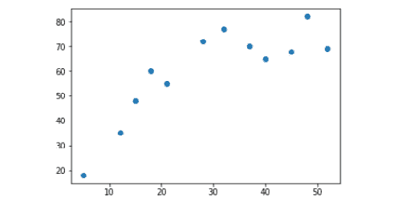

    ###### 图 3.13：包含年龄和体重的散点图截图

    可以通过放大图形大小、自定义纵横比、添加带有适当字体大小的标题、添加带有自定义字体大小的 X 轴和 Y 轴标签、添加网格线、将 Y 轴限制在 0 到 100 之间、添加 X 和 Y 刻度标记、自定义散点图的颜色以及改变散点的大小来改进图表。

1.  改进图表的代码如下：

    ```py
    plt.figure(figsize=(8,6))
    plt.title("Plot of Age vs. Weight (in kgs)",fontsize=20)
    plt.xlabel("Age (years)",fontsize=16)
    plt.ylabel("Weight (kgs)",fontsize=16)
    plt.grid (True)
    plt.ylim(0,100)
    plt.xticks([i*5 for i in range(12)],fontsize=15)
    plt.yticks(fontsize=15)
    plt.scatter(x=age,y=weight,c='orange',s=150,edgecolors='k')
    plt.text(x=20,y=85,s="Weights after 18-20 years of age",fontsize=15)
    plt.vlines(x=20,ymin=0,ymax=80,linestyles='dashed',color='blue',lw=3)
    plt.legend(['Weight in kgs'],loc=2,fontsize=12)
    plt.show()
    ```

    输出如下：

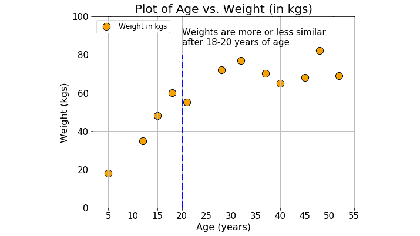

###### 图 3.14：显示年龄与体重关系的散点图截图

观察以下内容：

+   将一个`元组(8,6)`作为参数传递给图形大小。

+   在`Xticks`内部使用列表推导式创建一个自定义的 5-10-15-…-55 列表。

+   在`plt.text()`函数内部使用换行符（`\n`）来分割和分布文本为两行。

+   在最后使用`plt.show()`函数。想法是持续添加各种图形属性（字体、颜色、坐标轴限制、文本、图例、网格等），直到你满意，然后使用一个函数显示图表。如果没有这个最后的函数调用，图表将不会显示。

### 统计度量定义 – 中心趋势和分散

中心趋势的度量是一个单一值，它试图通过确定数据集中数据的中心位置来描述这组数据。它们也被归类为汇总统计量：

+   **均值**：均值是所有值的总和除以值的总数。

+   **中位数**：中位数是中间值。它是将数据集分成两半的值。要找到中位数，将你的数据从小到大排序，然后找到上方和下方值数量相等的那个数据点。

+   **众数**：众数是数据集中出现频率最高的值。在条形图中，众数是最高条。

通常，对于对称数据，均值是一个更好的度量，而对于具有偏斜（左重或右重）分布的数据，中位数是一个更好的度量。对于分类数据，你必须使用众数：

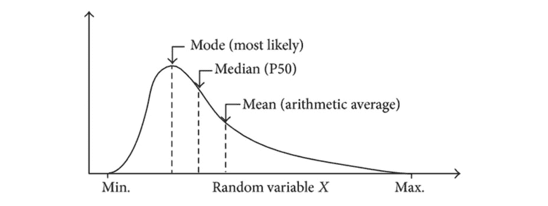

###### 图 3.15：显示均值、中位数和众数的曲线截图

数据的分散程度是衡量数据集中的值可能偏离值平均值的程度。如果所有值都彼此接近，则分散度低；另一方面，如果某些或所有值与平均值（以及彼此）相差很大，则数据中存在很大的分散度：

+   **方差**：这是最常见的分散度度量。方差是平均偏差平方的平均值。平方偏差确保了负偏差和正偏差不会相互抵消。

+   **标准差**：由于方差是通过平方距离来产生的，其单位与原始数据不匹配。标准差是一种数学技巧，用于恢复等价性。它是方差的正平方根。

### 随机变量和概率分布

**随机变量**被定义为表示统计实验或过程结果的给定变量的值。

虽然听起来非常正式，但我们周围几乎所有可以测量的东西都可以被视为随机变量。

原因在于几乎所有自然、社会、生物和物理过程都是大量复杂过程的最终结果，我们无法了解这些基本过程的细节。我们能做的只是观察和测量最终结果。

我们周围典型的随机变量例子如下：

+   一个国家的经济产出

+   患者的血压

+   工厂中化学过程的温度

+   一个人在 Facebook 上的朋友数量

+   一家公司的股票市场价格

这些值可以取任何离散或连续的值，并且遵循特定的模式（尽管模式可能会随时间变化）。因此，它们都可以被归类为随机变量。

### 什么是概率分布？

**概率分布**是一个函数，描述了随机变量可以假设的可能值的可能性。换句话说，变量的值基于潜在的概率分布而变化。

假设你前往一所学校，并测量随机选择的学生身高。身高在这里是一个随机变量的例子。当你测量身高时，你可以创建一个身高分布。这种类型的分布在你需要知道哪些结果最有可能、潜在值的分布范围以及不同结果的可能性时非常有用。

中心趋势和分散的概念适用于分布，并用于描述分布的性质和行为。

统计学家通常将所有分布分为两大类：

+   离散分布

+   连续分布

### 离散分布

**离散概率函数**也称为**概率质量函数**，可以假设离散的数值。例如，抛硬币和事件计数是离散函数。在抛硬币中，你只能得到正面或反面。同样，如果你每小时计算到达车站的火车数量，你可以计算 11 或 12 辆火车，但不能在两者之间。

一些显著的离散分布如下：

+   **二项分布**用于模拟二元数据，如抛硬币

+   **泊松分布**用于模拟计数数据，例如每小时图书馆图书借阅的数量

+   **均匀分布**用于模拟具有相同概率的多个事件，例如掷骰子

### 连续分布

**连续概率函数**也被称为**概率密度函数**。如果一个变量可以在任意两个值之间取无限多个值，那么你就有了一个连续分布。连续变量通常是实数尺度上的测量，例如身高、体重和温度。

最著名的连续分布是**正态分布**，也称为**高斯分布**或**钟形曲线**。这种对称分布适合广泛的现象，例如人类身高和智商分数。

正态分布与著名的**68-95-99.7 规则**相联系，该规则描述了如果数据遵循正态分布，那么数据落在平均值的 1、2 或 3 个标准差范围内的百分比。这意味着你可以快速查看一些样本数据，计算平均值和标准差，并可以有一个信心（不确定性的统计度量）认为任何未来的数据都将落在那些*68%-95%-99.7%*边界内。这个规则在工业、医学、经济学和社会科学中得到广泛应用：

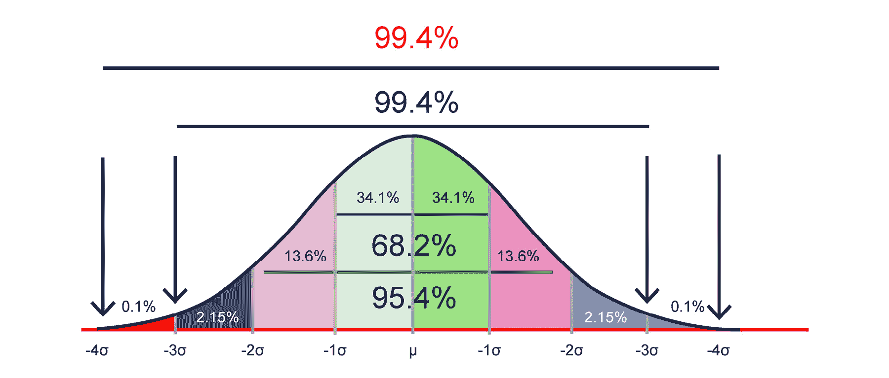

###### 图 3.16：显示著名 68-95-99.7 规则正态分布的曲线

### 统计学和可视化中的数据处理

一个优秀的数据处理专业人员每天都会遇到令人眼花缭乱的各种数据源。正如我们之前解释的，由于众多复杂的子过程和相互作用的组合产生了这样的数据，它们都属于离散或连续随机变量的范畴。

如果所有这些数据继续被当作完全随机且没有任何形状或模式来处理，这将使数据处理人员或数据科学团队感到极其困难和困惑。必须为这些随机数据流提供一个正式的统计基础，而开始这一过程的最简单方法之一就是测量它们的描述性统计数据。

将数据流分配给特定的分布函数（或许多分布的组合）实际上是**推断统计**的一部分。然而，推断统计只有在描述性统计与测量数据模式的全部重要参数同时进行时才开始。

因此，作为数据科学流程的前线，数据处理必须处理测量和量化这些描述性统计数据。除了格式化和清理后的数据，数据处理人员的主要任务是向下一个分析团队成员移交这些度量（有时还有相应的图表）。

**绘图** 和 **可视化** 帮助数据整理团队识别传入数据流中的潜在异常值和不符合的数据，并帮助他们采取适当的行动。我们将在下一章中看到一些这样的示例，我们将通过创建散点图或直方图来识别异常数据点，并对其进行插补或删除。

### 使用 NumPy 和 Pandas 在 DataFrame 上计算基本描述性统计

现在我们已经对 NumPy、pandas 和 matplotlib 有了一些基本了解，我们可以探索一些与这些库相关的附加主题，例如如何将它们结合起来进行高级数据生成、分析和可视化。

### 使用 NumPy 生成随机数

NumPy 提供了一系列令人眼花缭乱的随机数生成实用函数，所有这些函数都对应于各种统计分布，如均匀分布、二项分布、高斯正态分布、Beta/Gamma 分布和卡方分布。这些函数中的大多数都非常有用，在高级统计数据挖掘和机器学习任务中出现了无数次。强烈建议所有学习这本书的学生都要掌握它们。

在这里，我们将讨论三个可能在数据整理任务中派上用场的最重要分布——均匀分布、二项分布和高斯正态分布。我们的目标是展示一些简单的函数调用示例，用户需要时可以生成一个或多个随机数/数组。

#### 注意

当学生使用这些函数时，每个学生的结果都可能不同，因为它们应该是随机的。

### 练习 43：从均匀分布生成随机数

在这个练习中，我们将从均匀分布生成随机数：

1.  生成一个介于 `1` 和 `10` 之间的随机整数：

    ```py
    x = np.random.randint(1,10)
    print(x)
    ```

    样本输出如下（你的输出可能不同）：

    ```py
    1
    ```

1.  使用 size=1 作为参数生成介于 1 和 10 之间的随机整数。它生成一个大小为 1 的 NumPy 数组：

    ```py
    x = np.random.randint(1,10,size=1)
    print(x)
    ```

    样本输出如下（你的输出可能因随机抽取而不同）：

    ```py
    [8]
    ```

    因此，我们可以轻松编写代码来生成掷骰子（一个正常的六面骰子）10 次的结果。

    如果我们脱离整数，生成一些实数呢？比如说，我们想要生成 20 名成年人的体重（以千克为单位）的人工数据，并且我们可以测量精确到小数点后两位的体重。

1.  使用以下命令生成小数数据：

    ```py
    x = 50+50*np.random.random(size=15)
    x= x.round(decimals=2)
    print(x)
    ```

    样本输出如下：

    ```py
    [56.24 94.67 50.66 94.36 77.37 53.81 61.47 71.13 59.3  65.3  63.02 65.
     58.21 81.21 91.62]
    ```

    我们不仅限于使用一维数组。

1.  生成并显示一个介于 `0` 和 `1` 之间的随机数的 3x3 矩阵：

    ```py
    x = np.random.rand(3,3)
    print(x)
    ```

    样本输出如下（请注意，你的具体输出可能因随机性而不同）：

    ```py
    [[0.99240105 0.9149215  0.04853315]
     [0.8425871  0.11617792 0.77983995]
     [0.82769081 0.57579771 0.11358125]]
    ```

### 练习 44：从二项分布生成随机数并绘制条形图

二项分布是在特定次数的试验中，以预定的概率或机会获得特定成功次数的概率分布。

最明显的例子是抛硬币。一个公平的硬币可能有相等的机会出现正面或反面，但一个不公平的硬币可能有更多机会出现正面或反面。我们可以在 NumPy 中以以下方式模拟抛硬币。

假设我们有一个偏心的硬币，其正面朝上的概率为`0.6`。我们抛掷这个硬币十次，并记录每次出现的正面次数。那是一次试验或实验。现在，我们可以重复这个实验（10 次抛硬币）任意多次，比如 8 次。每次，我们记录正面次数：

1.  可以使用以下代码来模拟实验：

    ```py
    x = np.random.binomial(10,0.6,size=8)
    print(x)
    ```

    样本输出如下（注意，由于随机性，您的具体输出可能不同）：

    ```py
    [6 6 5 6 5 8 4 5]
    ```

1.  使用柱状图绘制结果：

    ```py
    plt.figure(figsize=(7,4))
    plt.title("Number of successes in coin toss",fontsize=16)
    plt.bar(left=np.arange(1,9),height=x)
    plt.xlabel("Experiment number",fontsize=15)
    plt.ylabel("Number of successes",fontsize=15)
    plt.show()
    ```

    样本输出如下：

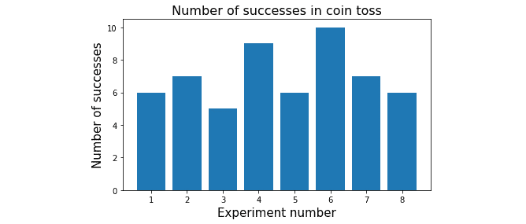

###### 图 3.17：显示二项分布和柱状图的图形截图

### 练习 45：从正态分布生成随机数和直方图

我们在上一个主题中讨论了正态分布，并提到它是最重要的概率分布，因为当样本数量大时，许多自然、社会和生物数据都紧密遵循这种模式。NumPy 提供了一个简单的方法来生成与这种分布相对应的随机数：

1.  使用以下命令从一个正态分布中抽取一个样本：

    ```py
    x = np.random.normal()
    print(x)
    ```

    样本输出如下（注意，由于随机性，您的具体输出可能不同）：

    ```py
    -1.2423774071573694
    ```

    我们知道正态分布由两个参数定义——均值（µ）和标准差（σ）。事实上，这个特定函数的默认值是µ = 0.0 和σ = 1.0。

    假设我们知道某所学校青少年（12-16 岁）学生的身高呈正态分布，平均身高为 155 厘米，标准差为 10 厘米。

1.  使用以下命令生成 100 名学生的直方图：

    ```py
    # Code to generate the 100 samples (heights)
    heights = np.random.normal(loc=155,scale=10,size=100)
    # Plotting code
    #-----------------------
    plt.figure(figsize=(7,5))
    plt.hist(heights,color='orange',edgecolor='k')
    plt.title("Histogram of teen aged students's height",fontsize=18)
    plt.xlabel("Height in cm",fontsize=15)
    plt.xticks(fontsize=15)
    plt.yticks(fontsize=15)
    plt.show()
    ```

    样本输出如下：

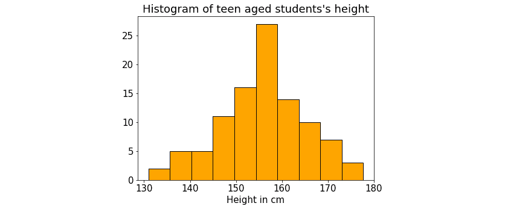

###### 图 3.18：青少年学生身高的直方图

注意使用`loc`参数来表示平均值（=155）和`scale`参数来表示标准差（=10）。大小参数设置为 100，以便生成可能样本。

### 练习 46：从 DataFrame 计算描述性统计

回想一下我们为绘图练习定义的`age`、`weight`和`height`参数。让我们将这些数据放入 DataFrame 中，以计算它们的各种描述性统计。

与 pandas DataFrame 一起工作的最好部分是它有一个内置的实用函数，可以单行代码显示所有这些描述性统计。它是通过使用`describe`方法来做到这一点的：

1.  使用以下命令使用可用的序列数据构建一个字典：

    ```py
    people_dict={'People':people,'Age':age,'Weight':weight,'Height':height}
    people_df=pd.DataFrame(data=people_dict)
    people_df
    ```

    输出如下：

    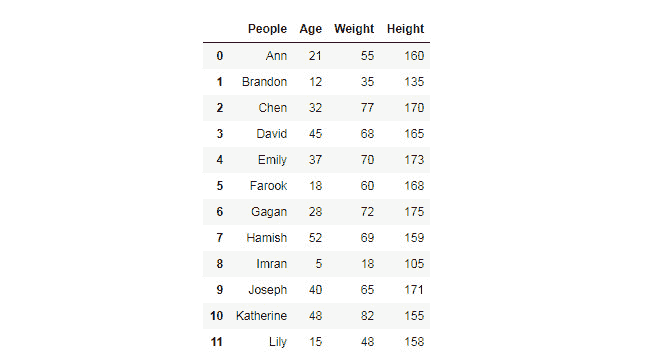

    ###### 图 3.19：创建的字典输出

1.  通过执行以下命令找出 DataFrame 的行数和列数：

    ```py
    print(people_df.shape)
    ```

    输出结果如下：

    ```py
    (12, 4)
    ```

1.  通过执行以下命令获取简单的`count`（任何列都可以用于此目的）：

    ```py
    print(people_df['Age'].count())
    ```

    输出结果如下：

    ```py
    12
    ```

1.  使用以下命令计算年龄的总和：

    ```py
    print(people_df['Age'].sum())
    ```

    输出结果如下：

    ```py
    353
    ```

1.  使用以下命令计算平均年龄：

    ```py
    print(people_df['Age'].mean())
    ```

    输出结果如下：

    ```py
    29.416666666666668
    ```

1.  使用以下命令计算中值重量：

    ```py
    print(people_df['Weight'].median())
    ```

    输出结果如下：

    ```py
    66.5
    ```

1.  使用以下命令计算最大高度：

    ```py
    print(people_df['Height'].max())
    ```

    输出结果如下：

    ```py
    175
    ```

1.  使用以下命令计算重量的标准差：

    ```py
    print(people_df['Weight'].std())
    ```

    输出结果如下：

    ```py
    18.45120510148239
    ```

    注意我们是如何直接从 DataFrame 对象调用统计函数的。

1.  要计算百分位数，我们可以从 NumPy 中调用一个函数并将特定的列（一个 pandas 序列）传递给它。例如，要计算年龄分布的 75 百分位数和 25 百分位数及其差（称为四分位距），请使用以下代码：

    ```py
    pcnt_75 = np.percentile(people_df['Age'],75)
    pcnt_25 = np.percentile(people_df['Age'],25)
    print("Inter-quartile range: ",pcnt_75-pcnt_25)
    ```

    输出结果如下：

    ```py
    Inter-quartile range:  24.0
    ```

1.  使用`describe`命令来查找 DataFrame 的详细描述：

    ```py
    print(people_df.describe())
    ```

    输出结果如下：

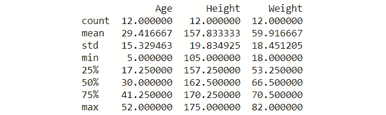

###### 图 3.20：使用 describe 方法得到的 DataFrame 输出

#### 注意

此函数仅适用于包含数值数据的列。它对非数值列没有影响，例如，DataFrame 中的 People。

### 练习 47：内置绘图实用工具

DataFrame 还包含内置的绘图实用工具，这些实用工具围绕 matplotlib 函数创建，并创建基本数值数据的图表：

1.  使用`hist`函数找出重量的直方图：

    ```py
    people_df['Weight'].hist()
    plt.show()
    ```

    输出结果如下：

    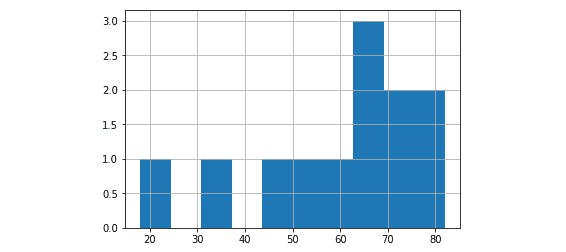

    ###### 图 3.21：重量的直方图

1.  使用以下命令直接从 DataFrame 创建简单的散点图，以绘制重量与身高之间的关系：

    ```py
    people_df.plot.scatter('Weight','Height',s=150,
    c='orange',edgecolor='k')
    plt.grid(True)
    plt.title("Weight vs. Height scatter plot",fontsize=18)
    plt.xlabel("Weight (in kg)",fontsize=15)
    plt.ylabel("Height (in cm)",fontsize=15)
    plt.show()
    ```

    输出结果如下：

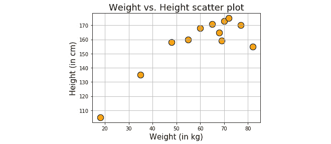

###### 图 3.22：重量与身高的散点图

#### 注意

你可以尝试在这个函数调用周围使用 matplotlib 的常规方法来使你的图表更美观。

### 活动 5：从 CSV 文件生成统计数据

假设你正在处理著名的波士顿房价（从 1960 年）数据集。这个数据集在机器学习社区中很有名。可以制定许多回归问题，并且可以在该数据集上运行机器学习算法。你将通过将其作为 pandas DataFrame 读取来执行基本的数据整理活动（包括绘制一些趋势）。

#### 注意

pandas 读取 CSV 文件的函数是`read_csv`。

这些步骤将帮助你完成此活动：

1.  加载必要的库。

1.  从本地目录中读取 Boston 住房数据集（以`.csv`文件形式给出）。

1.  检查前 10 条记录。找出记录总数。

1.  创建一个较小的 DataFrame，其中不包含`CHAS`、`NOX`、`B`和`LSTAT`列。

1.  检查你刚刚创建的新 DataFrame 的最后七条记录。

1.  绘制新 DataFrame 中所有变量（列）的直方图。

1.  使用`for`循环一次性绘制所有图表。尝试为每个图表添加一个独特的标题。

1.  创建犯罪率与价格之间的散点图。

1.  使用`log10(crime)`与`price`进行绘图。

1.  计算一些有用的统计数据，例如每套住宅的平均房间数、中位数年龄、平均距离五个波士顿就业中心以及价格低于$20,000 的房屋百分比。

    #### 注意

    这个活动的解决方案可以在第 292 页找到。

## 摘要

在本章中，我们首先介绍了 NumPy 数组的基础知识，包括如何创建它们及其基本属性。我们讨论并展示了 NumPy 数组是如何优化向量化的元素级操作的，以及它与常规 Python 列表的不同之处。然后，我们转向练习 NumPy 数组的各种操作，如索引、切片、过滤和重塑。我们还涵盖了特殊的一维和二维数组，例如零数组、一数组、单位矩阵和随机数组。

在本章的第二大主题中，我们首先介绍了 pandas 系列对象，然后迅速转向一个至关重要的对象——pandas DataFrame。它与 Excel、MATLAB 或数据库标签页类似，但具有许多用于数据处理的有用属性。我们演示了 DataFrame 的一些基本操作，例如索引、子集、行和列的添加和删除。

接下来，我们介绍了使用 matplotlib 进行绘图的基础知识，matplotlib 是最广泛使用和最受欢迎的 Python 可视化库。除了绘图练习，我们还回顾了描述性统计（如集中趋势和离散程度度量）和概率分布（如均匀分布、二项分布和正态分布）的概念。

在下一章中，我们将介绍 pandas DataFrame 的更多高级操作，这些操作在日常数据处理工作中非常有用。
