# 第七章：*第六章*

# 学习数据清洗的隐藏秘密

## 学习目标

到本章结束时，你将能够：

+   清洗和处理现实生活中的杂乱数据

+   通过格式化数据以符合下游系统所需格式来准备数据分析

+   从数据中识别并移除异常值

在本章中，你将了解现实生活中发生的数据问题。你还将学习如何解决这些问题。

## 简介

在本章中，我们将了解创建成功数据清洗管道背后的秘诀。在前几章中，我们介绍了数据清洗的基本数据结构和构建块，例如 pandas 和 NumPy。在本章中，我们将查看数据清洗的数据处理部分。

假设你有一个包含患有心脏病患者的数据库，就像任何调查一样，数据可能缺失、不正确或存在异常值。异常值是异常值，通常远离中心趋势，因此将其包含到你的复杂机器学习模型中可能会引入我们希望避免的严重偏差。通常，这些问题在金钱、人力和其他组织资源方面会造成巨大的差异。不可否认，具备解决这些问题的技能的人将对组织证明是一笔财富。

### **本节所需额外软件**

这个练习的代码依赖于两个额外的库。我们需要安装 `SciPy` 和 `python-Levenshtein`，并且我们将在运行的 Docker 容器中安装它们。请注意这一点，因为我们不在容器中。

要安装库，请在运行的 Jupyter 笔记本中输入以下命令：

```py
!pip install scipy python-Levenshtein
```

## 高级列表推导式和 zip 函数

在这个主题中，我们将深入探讨列表推导式的核心。我们已经看到了它的基本形式，包括像 `a = [i for i in range(0, 30)]` 这样简单的东西，到涉及一个条件语句的稍微复杂一些的形式。然而，正如我们之前提到的，列表推导式是一个非常强大的工具，在本主题中，我们将进一步探索这个神奇工具的力量。我们将研究列表推导式的另一个近亲，称为 `generators`，并使用 `zip` 及其相关函数和方法。在本主题结束时，你将能够自信地处理复杂的逻辑问题。

### 生成器表达式的介绍

在之前讨论高级数据结构时，我们见证了 `repeat` 等函数。我们说它们代表一种特殊类型的函数，称为迭代器。我们还展示了迭代器的懒加载如何导致巨大的空间节省和时间效率。

迭代器是 Python 提供的函数式编程结构中的一个组成部分。函数式编程确实是一种非常高效且安全的方法来解决问题。它提供了比其他方法更多的优势，如模块化、易于调试和测试、可组合性、形式可证明性（一个理论计算机科学概念）等等。

### 练习 73：生成器表达式

在这个练习中，我们将介绍生成器表达式，它们被认为是函数式编程的另一个基石（实际上，它们受到了纯函数式语言 [Haskell](https://www.haskell.org/) 的启发）。由于我们已经看到了一些列表推导的例子，生成器表达式对我们来说将很熟悉。然而，它们也提供了一些比列表推导更多的优势：

1.  使用列表推导编写以下代码以生成介于 0 和 100,000 之间的所有奇数列表：

    ```py
    odd_numbers2 = [x for x in range(100000) if x % 2 != 0]
    ```

1.  使用以下代码通过 `sys` 模块中的 `getsizeof` 函数：

    ```py
    from sys import getsizeof
    getsizeof(odd_numbers2)
    ```

    输出如下：

    ```py
    406496
    ```

    我们将看到，这样做需要相当多的内存。它也不是非常高效。我们如何改变这一点？使用类似 `repeat` 的方法在这里不适用，因为我们需要列表推导的逻辑。幸运的是，我们可以将任何列表推导转换为生成器表达式。

1.  为上述列表推导编写等效的生成器表达式：

    ```py
    odd_numbers = (x for x in range(100000) if x % 2 != 0)
    ```

    注意，我们做的唯一改变是将列表推导语句用圆括号而不是方括号包围。这使得它缩小到大约 100 字节！这使得它成为一个惰性评估，因此更高效。

1.  打印前 10 个奇数，如下所示：

    ```py
    for i, number in enumerate(odd_numbers):
        print(number)
        if i > 10:
            break
    ```

    输出如下：

    ```py
    1
    3
    5
    7
    9
    11
    13
    15
    17
    19
    21
    23
    ```

### 练习 74：一行生成器表达式

在这个练习中，我们将利用我们对生成器表达式的知识来生成一个表达式，该表达式将逐个从单词列表中读取一个单词，并移除它们末尾的换行符并将它们转换为小写。这当然可以使用显式的 `for` 循环来完成：

1.  创建一个单词字符串，如下所示：

    ```py
    words = ["Hello\n", "My name", "is\n", "Bob", "How are you", "doing\n"]
    ```

1.  编写以下生成器表达式以完成任务，如下所示：

    ```py
    modified_words = (word.strip().lower() for word in words)
    ```

1.  创建一个列表推导，从生成器表达式中逐个获取单词，并最终打印出列表，如下所示：

    ```py
    final_list_of_word = [word for word in modified_words]
    final_list_of_word
    ```

    输出如下：

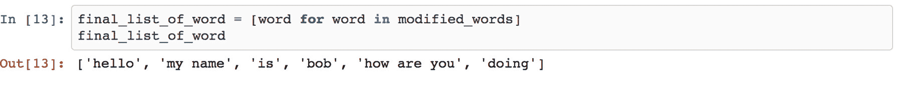

###### 图 6.1：单词列表推导

### 练习 75：提取单字列表

如果我们查看上一个练习的输出，我们会注意到，由于源数据的杂乱性质（这在现实世界中是正常的），我们最终得到了一个列表，在某些情况下，我们有一个以上的单词连在一起，由空格分隔。为了改进这一点，并获取单字列表，我们不得不修改生成器表达式：

1.  编写生成器表达式，然后编写等效的嵌套循环，以便我们可以比较结果：

    ```py
    words = ["Hello\n", "My name", "is\n", "Bob", "How are you", "doing\n"]
    modified_words2 = (w.strip().lower() for word in words for w in word.split(" "))
    final_list_of_word = [word for word in modified_words2]
    final_list_of_word
    ```

    输出如下：

    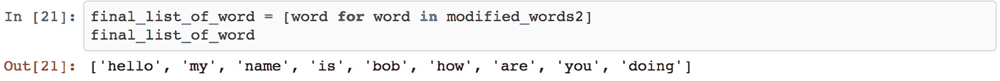

    ###### 图 6.2：从字符串中提取的单词列表

1.  按照嵌套`for`循环的方式编写一个等效的代码，如下所示：

    ```py
    modified_words3 = []
    for word in words:
        for w in word.split(" "):
            modified_words3.append(w.strip().lower())
    modified_words3
    ```

    输出如下：

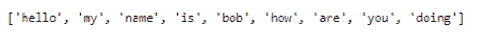

###### 图 6.3：使用嵌套循环从字符串中提取的单词列表

我们必须承认生成器表达式不仅节省了空间和时间，而且是一种更优雅的方式来编写相同的逻辑。

要记住生成器表达式中的嵌套循环是如何工作的，请记住循环是从左到右评估的，并且最终的循环变量（在我们的例子中，用单个字母“w”表示）被返回（因此我们可以对它调用`strip`和`lower`）。

以下图表将帮助您记住列表推导式或生成器表达式中嵌套`for`循环的技巧：

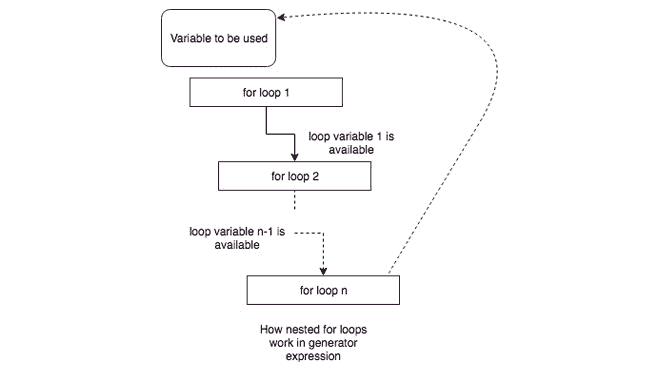

###### 图 6.4：嵌套循环说明

我们之前已经学习了生成器表达式中的嵌套`for`循环，但现在我们将学习生成器表达式中的独立`for`循环。我们将从两个`for`循环中获得两个输出变量，并且它们必须被当作一个元组来处理，这样它们在 Python 中就不会有语法上的歧义。

创建以下两个列表：

```py
marbles = ["RED", "BLUE", "GREEN"]
counts = [1, 5, 13]
```

您被要求在给出前两个列表后生成所有可能的弹珠和计数的组合。您将如何做到这一点？当然，使用嵌套`for`循环和列表的`append`方法可以完成这个任务。那么生成器表达式呢？一个更优雅、更简单的解决方案如下：

```py
marble_with_count = ((m, c) for m in marbles for c in counts)
```

这个生成器表达式在同时`for`循环的每次迭代中创建一个元组。这段代码等同于以下显式代码：

```py
marble_with_count_as_list_2 = []
for m in marbles:
    for c in counts:
        marble_with_count_as_list_2.append((m, c))
marble_with_count_as_list_2
```

输出如下：

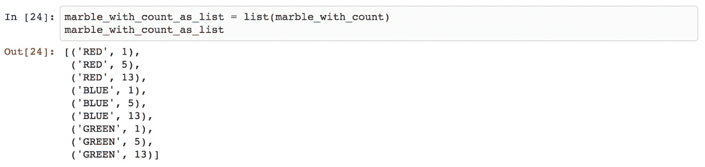

###### 图 6.5：添加弹珠和计数

这个生成器表达式在同时`for`循环的每次迭代中创建一个元组。再次强调，生成器表达式简单、优雅且高效。

### 练习 76：`zip` 函数

在这个练习中，我们将检查`zip`函数，并将其与我们之前练习中编写的生成器表达式进行比较。之前生成器表达式的缺点是它产生了所有可能的组合。例如，如果我们需要将国家与其首都关联起来，使用生成器表达式来做这个会比较困难。幸运的是，Python 为我们提供了一个内置函数`zip`，专门用于这个目的：

1.  创建以下两个列表：

    ```py
    countries = ["India", "USA", "France", "UK"]
    capitals = ["Delhi", "Washington", "Paris", "London"]
    ```

1.  使用以下命令生成一个包含国家名称作为第一个元素和首都名称作为第二个元素的元组列表：

    ```py
    countries_and_capitals = [t for t in zip(countries, capitals)]
    ```

1.  这表示得不是很好。我们可以使用`dict`，其中键是国家的名称，而值是首都的名称，可以使用以下命令：

    ```py
    countries_and_capitals_as_dict = dict(zip(countries, capitals))
    ```

    输出如下：

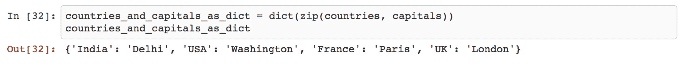

###### 图 6.6：包含国家和首都的字典

### 练习 77：处理混乱的数据

如往常一样，在现实生活中，数据是杂乱的。因此，我们刚才看到的那些国家与首都的长度相等的漂亮列表并不存在。

`zip`函数不能与长度不等的长列表一起使用，因为一旦其中一个列表到达末尾，`zip`就会停止工作。为了在这种情况下帮助我们，`itertools`模块中提供了`ziplongest`：

1.  创建两个长度不等的长列表，如下所示：

    ```py
    countries = ["India", "USA", "France", "UK", "Brasil", "Japan"]
    capitals = ["Delhi", "Washington", "Paris", "London"]
    ```

1.  创建最终的`dict`并将`None`作为没有首都的国家在首都列表中的值：

    ```py
    from itertools import zip_longest
    countries_and_capitals_as_dict_2 = dict(zip_longest(countries, capitals))
    countries_and_capitals_as_dict_2
    ```

    输出如下：

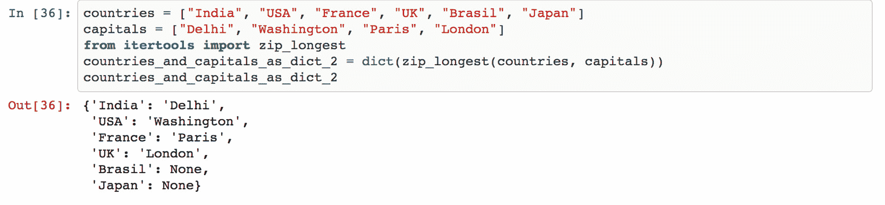

###### 图 6.7：使用 ziplongest 的输出

我们应该在这里暂停一下，思考一下通过调用一个函数并仅给出两个源数据列表，我们节省了多少行显式代码和难以理解的`if-else`条件逻辑。这确实令人惊叹！

通过这些练习，我们结束了本章的第一个主题。高级列表解析、生成器表达式以及`zip`和`ziplongest`等函数是一些我们必须掌握的重要技巧，如果我们想要编写干净、高效且易于维护的代码。不具备这三个品质的代码在业界被认为是次品，我们当然不希望编写这样的代码。

然而，我们没有涵盖这里的一个重要对象，那就是**生成器**。生成器是一种特殊类型的函数，它具有与生成器表达式相同的特性。然而，作为一个函数，它具有更广泛的范围，并且更加灵活。我们强烈建议您了解它们。

## 数据格式化

在本主题中，我们将格式化给定的数据集。正确格式化数据的动机主要包括以下几点：

+   它有助于所有下游系统对每个数据点有一个单一且预先约定的数据格式，从而避免意外，实际上也避免了破坏。

+   从主要用于机器消费的底层数据生成可读性强的报告。

+   为了查找数据中的错误。

在 Python 中，有几种方法可以进行数据格式化。我们将从模运算符开始。

### %运算符

Python 为我们提供了%运算符来对数据进行基本格式化。为了演示这一点，我们首先通过读取 CSV 文件加载数据，然后我们将对它应用一些基本的格式化。

使用以下命令从 CSV 文件加载数据：

```py
from csv import DictReader
raw_data = []
with open("combinded_data.csv", "rt") as fd:
    data_rows = DictReader(fd)
    for data in data_rows:
        raw_data.append(dict(data))
```

现在，我们有一个名为`raw_data`的列表，它包含了 CSV 文件的所有行。您可以随意打印它来查看其外观。

输出如下：

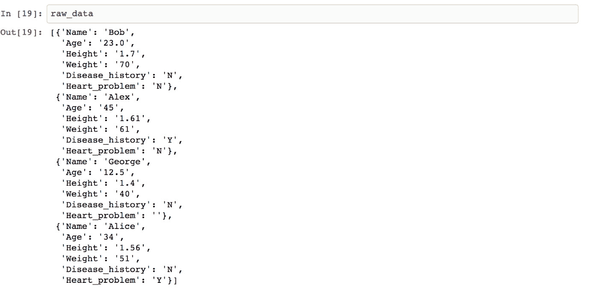

###### 图 6.8：原始数据

我们将生成一份关于这些数据的报告。这份报告将包含每个数据点的一个部分，并报告个人的姓名、年龄、体重、身高、家族病史以及最终的心脏状况。这些点必须是清晰且易于理解的英文句子。

我们是这样做的：

```py
for data in raw_data:
    report_str = """%s is %s years old and is %s meter tall weighing about %s kg.\n
    Has a history of family illness: %s.\n
    Presently suffering from a heart disease: %s
    """ % (data["Name"], data["Age"], data["Height"], data["Weight"], data["Disease_history"], data["Heart_problem"])
    print(report_str)
```

输出如下：

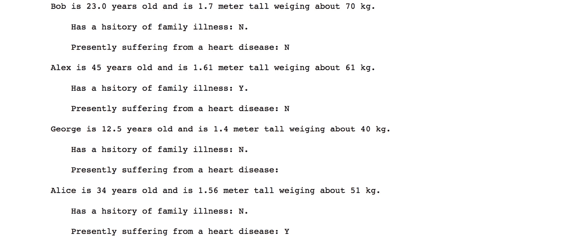

###### 图 6.9：以可展示格式呈现的原始数据

% 操作符有两种不同的用法：

+   当在引号内使用时，它表示这里期望的数据类型。`%s` 代表字符串，而 `%d` 代表整数。如果我们指定了错误的数据类型，它将引发错误。因此，我们可以有效地使用这种格式化作为输入数据的错误过滤器。

+   当我们在引号外使用 % 操作符时，它基本上告诉 Python 开始用外部提供的值替换所有内部数据。

### 使用格式化函数

在本节中，我们将探讨完全相同的格式化问题，但这次我们将使用更高级的方法。我们将使用 Python 的 `format` 函数。

要使用 `format` 函数，我们执行以下操作：

```py
for data in raw_data:
    report_str = """{} is {} years old and is {} meter tall weighing about {} kg.\n
    Has a history of family illness: {}.\n
    Presently suffering from a heart disease: {}
    """.format(data["Name"], data["Age"], data["Height"], data["Weight"], data["Disease_history"], data["Heart_problem"])
    print(report_str)
```

输出如下：


###### 图 6.10：使用字符串的格式化函数进行格式化的数据

注意，我们将 `%s` 替换为 {}，并且不再使用引号外的 %，而是调用了 `format` 函数。

我们将看到强大的 `format` 函数如何使之前的代码更加易读和易懂。我们不再使用简单的空白 `{}`，而是在其中提及键名，然后使用特殊的 Python `**` 操作对 `dict` 进行解包，并将其提供给格式化函数。它足够智能，可以通过以下命令确定如何使用实际的 `dict` 中的值替换引号内的键名：

```py
for data in raw_data:
    report_str = """{Name} is {Age} years old and is {Height} meter tall weighing about {Weight} kg.\n
    Has a history of family illness: {Disease_history}.\n
    Presently suffering from a heart disease: {Heart_problem}
    """.format(**data)
    print(report_str)
```

输出如下：

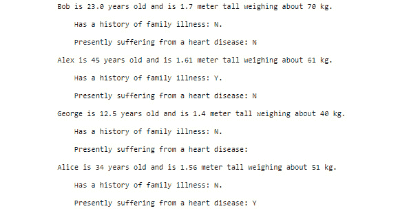

###### 图 6.11：使用**操作的可读文件

这种方法确实更加简洁且易于维护。

### 练习 78：使用{}进行数据表示

引号内的 `{}` 符号功能强大，我们可以通过它显著改变数据的表现形式：

1.  使用以下命令将十进制数字转换为二进制形式：

    ```py
    original_number = 42
    print("The binary representation of 42 is - {0:b}".format(original_number))
    ```

    输出如下：

    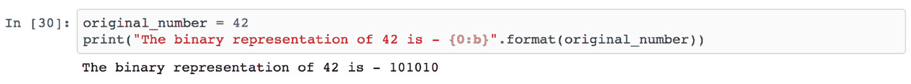

    ###### 图 6.12：其二进制表示形式的数字

1.  打印居中对齐的字符串：

    ```py
    print("{:⁴²}".format("I am at the center"))
    ```

    输出如下：

    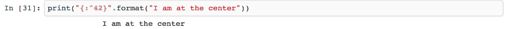

    ###### 图 6.13：使用居中对齐格式化的字符串

1.  打印居中对齐的字符串，但这次在两侧都有填充：

    ```py
    print("{:=⁴²}".format("I am at the center"))
    ```

    输出如下：

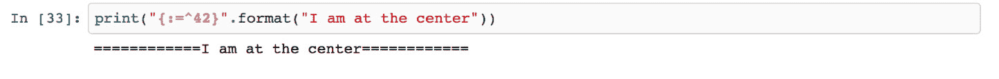

###### 图 6.14：使用填充居中对齐的字符串

如我们之前提到的，格式说明是一个强大的功能。

格式化日期很重要，因为日期的格式取决于数据来源，并且在数据清洗管道中可能需要多次转换。

我们可以使用熟悉的日期格式化符号，格式如下：

```py
from datetime import datetime
print("The present datetime is {:%Y-%m-%d %H:%M:%S}".format(datetime.utcnow()))
```

输出如下：


###### 图 6.15：格式化后的数据

将其与`datetime.utcnow`的实际输出进行比较，你将很容易看到这个表达式的力量。

## 识别和清除异常值

面对现实世界数据时，我们经常在记录集中看到特定的事情：有一些数据点与其余记录不匹配。它们有一些值太大，或太小，或完全缺失。这类记录被称为`异常值`。

统计学上，有一个关于异常值含义的适当定义和概念。通常，你需要深厚的领域专业知识来理解何时将某个特定记录称为异常值。然而，在这个当前练习中，我们将探讨一些在现实世界数据中标记和过滤异常值的基本技术，这些技术在日常工作中很常见。

### 练习 79：数值数据中的异常值

在这个练习中，我们将首先基于数值数据构建异常值的概念。想象一个余弦曲线。如果你还记得高中数学中的这个概念，那么余弦曲线是在 `[1, -1]` 范围内一个非常平滑的曲线：

1.  要构建余弦曲线，请执行以下命令：

    ```py
    from math import cos, pi
    ys = [cos(i*(pi/4)) for i in range(50)]
    ```

1.  使用以下代码绘制数据：

    ```py
    import matplotlib.pyplot as plt
    plt.plot(ys)
    ```

    输出如下：

    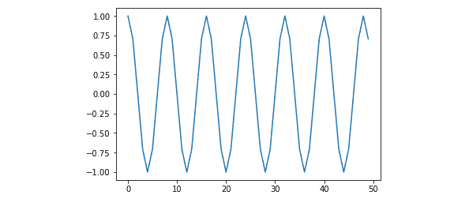

    ###### 图 6.16：余弦波

    如我们所见，它是一个非常平滑的曲线，没有异常值。我们现在要引入一些。

1.  使用以下命令引入一些异常值：

    ```py
    ys[4] = ys[4] + 5.0
    ys[20] = ys[20] + 8.0
    ```

1.  绘制曲线：

    ```py
    plt.plot(ys)
    ```

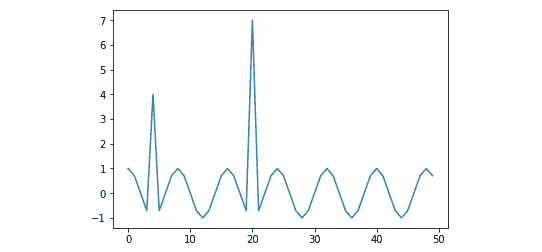

###### 图 6.17：带有异常值的波

我们可以看到，我们已经成功地在曲线上引入了两个值，打破了平滑性，因此可以被认为是异常值。

检测我们的数据集是否有异常值的一个好方法是创建一个箱线图。箱线图是一种基于数据的中心趋势和一些`桶`（实际上，我们称之为`四分位数`）来绘制数值数据的方式。在箱线图中，异常值通常被绘制为单独的点。`matplotlib`库帮助从一系列数值数据中绘制箱线图，这并不困难。这就是我们这样做的方式：

```py
plt.boxplot(ys)
```

一旦执行上述代码，你将能够看到有一个很好的箱线图，其中我们创建的两个异常值清晰地显示出来，就像以下图表所示：

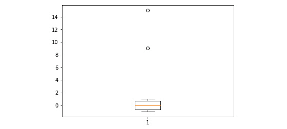

###### 图 6.18：带有异常值的箱线图

### Z-score

Z-score 是在数据集上的一种度量，它为每个数据点提供一个值，说明该数据点相对于数据集的标准差和平均值分布的程度。我们可以使用 z-score 在数据集中数值检测异常值。通常，任何 z-score 大于+3 或小于-3 的数据点都被认为是异常值。我们可以借助优秀的 SciPy 和`pandas`库的概念来过滤异常值。

使用 SciPy，使用以下命令计算 z-score：

```py
from scipy import stats
cos_arr_z_score = stats.zscore(ys)
Cos_arr_z_score
```

输出如下：

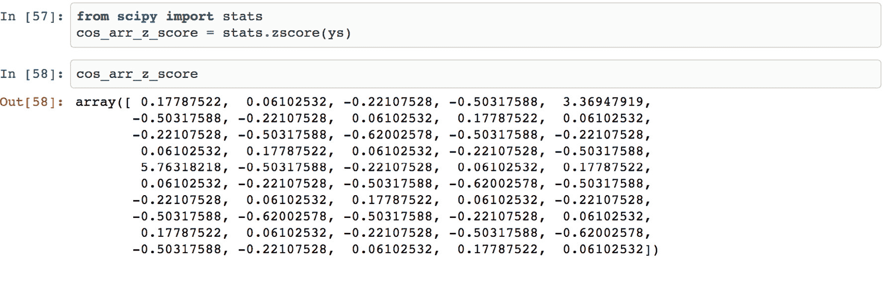

###### 图 6.19：z-score 值

### 练习 80：用于去除异常值的 Z 分数

在这个练习中，我们将讨论如何从一组数据中去除异常值。在上一个练习中，我们计算了每个数据点的 z 分数。在这个练习中，我们将利用这个结果来从我们的数据中移除异常值：

1.  导入`pandas`并创建一个 DataFrame：

    ```py
    import pandas as pd
    df_original = pd.DataFrame(ys)
    ```

1.  将 z 分数小于 3 的异常值分配给：

    ```py
    cos_arr_without_outliers = df_original[(cos_arr_z_score < 3)]
    ```

1.  使用`print`函数打印新的和旧的形状：

    ```py
    print(cos_arr_without_outliers.shape)
    print(df_original.shape)
    ```

    从两个打印结果（48, 1 和 50, 1）中，我们可以清楚地看到派生的 DataFrame 少了两行。这些就是我们的异常值。如果我们绘制`cos_arr_without_outliers` DataFrame，那么我们将看到以下输出：

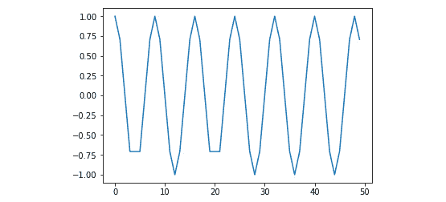

###### 图 6.20：无异常值的余弦波

如预期，我们得到了平滑的曲线并去除了异常值。

在任何数据清洗流程中，检测和去除异常值是一个复杂且关键的过程。这需要深厚的领域知识、描述性统计学的专业知识、对编程语言（以及所有有用的库）的掌握，以及大量的谨慎。我们建议在数据集上执行此操作时要非常小心。

### 练习 81：字符串的模糊匹配

在这个练习中，我们将探讨一个稍微不同的问题，乍一看可能看起来像是一个异常值。然而，经过仔细检查，我们会发现它确实不是，我们将了解一个有时被称为字符串模糊匹配的有用概念。

Levenshtein 距离是一个高级概念。我们可以将其视为将一个字符串转换为另一个字符串所需的最小单字符编辑次数。当两个字符串相同的时候，它们之间的距离是 0 - 差异越大，数字越高。我们可以考虑一个距离阈值，低于这个阈值我们将认为两个字符串是相同的。因此，我们不仅可以纠正人为错误，还可以设置一个安全网，以确保我们不会通过所有候选者。

Levenshtein 距离计算是一个复杂的过程，我们不会在这里从头开始实现它。幸运的是，像很多其他事情一样，有一个库可供我们使用来完成这个任务。它被称为[python-Levenshtein](https://github.com/ztane/python-Levenshtein/)：

1.  创建三艘船在不同日期的负载数据！[](img/C11065_06_21.jpg)

    ###### 图 6.21：初始化 ship_data 变量

    如果你仔细观察，你会注意到船名在三种不同情况下拼写不同。让我们假设船的实际名称是"Sea Princess"。从正常的角度来看，这确实看起来像有人犯了错误，数据点确实描述了同一艘船。在严格基于异常值的基础上移除其中两个可能不是最好的做法。

1.  然后，我们只需从其中导入距离函数，并传递两个字符串给它来计算它们之间的距离：

    ```py
    from Levenshtein import distance
    name_of_ship = "Sea Princess"
    for k, v in ship_data.items():
        print("{} {} {}".format(k, name_of_ship, distance(name_of_ship, k)))
    ```

    输出如下：

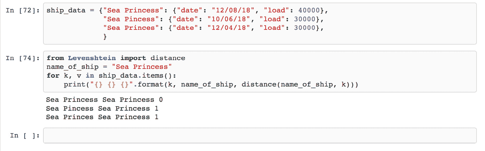

###### 图 6.22：字符串之间的距离

我们会注意到字符串之间的距离是不同的。当它们相同的时候，距离是 0，当它们不同的时候，距离是一个正整数。我们可以在我们的数据处理工作中使用这个概念，并说距离小于或等于某个数字的字符串是相同的字符串。

在这里，我们再次需要谨慎考虑何时以及如何使用这种模糊字符串匹配。有时，它们是必需的，而其他时候它们可能会导致非常糟糕的错误。

## 活动 8：处理异常值和缺失数据

在这个活动中，我们将识别并去除异常值。这里，我们有一个 CSV 文件。我们的目标是利用我们迄今为止学到的知识来清理数据，并创建一个格式良好的 DataFrame。识别异常值的类型及其对数据的影响，并清理混乱的数据。

帮助你解决此活动的步骤如下：

1.  读取 `visit_data.csv` 文件。

1.  检查重复项。

1.  检查是否有任何重要列包含 NaN。

1.  去除异常值。

1.  报告大小差异。

1.  创建一个箱线图来检查异常值。

1.  去除任何异常值。

    #### 注意

    此活动的解决方案可以在第 312 页找到。

## 摘要

在本章中，我们学习了使用生成器表达式处理列表数据的一些有趣方法。它们既简单又优雅，一旦掌握，就能给我们一个强大的技巧，我们可以反复使用它来简化几个常见的数据处理任务。我们还考察了不同的数据格式化方法。数据的格式化不仅对准备漂亮的报告有用，而且对于保证下游系统的数据完整性通常非常重要。

我们通过检查一些识别和删除异常值的方法来结束本章。这对我们来说很重要，因为我们希望我们的数据得到适当的准备，并准备好进行所有复杂的数据分析工作。我们还观察到，花时间并利用领域专业知识来制定识别异常值的规则是多么重要，因为这样做可能会造成比好处更大的伤害。

在下一章中，我们将介绍如何读取网页、XML 文件和 API。
