# 第八章：*第七章*

# 高级网络爬虫和数据收集

## 学习目标

到本章结束时，你将能够：

+   利用 `requests` 和 `BeautifulSoup` 读取各种网页并从中收集数据

+   使用应用程序程序接口 (API) 对 XML 文件和网页执行读取操作

+   利用正则表达式技术从大量杂乱无章的文本语料库中抓取有用信息

在本章中，你将学习如何从网页、XML 文件和 API 中收集数据。

## 简介

上一章介绍了如何创建一个成功的数据整理管道。在本章中，我们将使用我们迄今为止所学到的所有技术构建一个实际的网络爬虫。本章建立在 `BeautifulSoup` 的基础上，并介绍了各种抓取网页和使用 API 收集数据的方法。

## 网络爬虫和 Beautiful Soup 库的基础

在当今这个互联互通的世界里，对于数据整理专业人士来说，最宝贵和最广泛使用的技能之一是能够从托管在网上的网页和数据库中提取和读取数据。大多数组织将数据托管在云端（公共或私有），而如今的大多数网络微服务都为外部用户提供了一些类型的 API 以访问数据：


###### 图 7.1：数据整理 HTTP 请求和 XML/JSON 响应

作为数据整理工程师，了解网页结构和 Python 库的结构是必要的，这样你才能从网页中提取数据。万维网是一个不断增长、不断变化的宇宙，其中使用了不同的数据交换协议和格式。其中一些被广泛使用并已成为标准。

### Python 库

Python 配备了内置模块，如 `urllib 3`，这些模块可以在互联网上放置 HTTP 请求并从云端接收数据。然而，这些模块在较低级别运行，需要更深入地了解 HTTP 协议、编码和请求。

在本章中，我们将利用两个 Python 库：`Requests` 和 `BeautifulSoup`。为了避免在较低级别处理 HTTP 方法，我们将使用 `Requests` 库。它是一个建立在纯 Python 网络实用库之上的 API，这使得放置 HTTP 请求变得简单直观。

**BeautifulSoup** 是最受欢迎的 HTML 解析包之一。它解析你传递的 HTML 内容，并在页面内构建一个详细的标签和标记树，以便于直观地遍历。这个树可以被程序员用来查找特定的标记元素（例如，一个表格、一个超链接或特定 div ID 内的文本块）以抓取有用的数据。

### 练习 81：使用 Requests 库从维基百科主页获取响应

维基百科主页由许多元素和脚本组成，这些都是 HTML、CSS 和 JavaScript 代码块的混合。为了读取维基百科的主页并提取一些有用的文本信息，我们需要逐步进行，因为我们不感兴趣的是所有代码或标记标签；只对文本的某些选定部分感兴趣。

在这个练习中，我们将剥离 HTML/CSS/JavaScript 层，以获取我们感兴趣的信息。

1.  导入`requests`库：

    ```py
    import requests
    ```

1.  将主页 URL 分配给一个变量，`wiki_home`：

    ```py
    # First assign the URL of Wikipedia home page to a strings
    wiki_home = "https://en.wikipedia.org/wiki/Main_Page"
    ```

1.  使用`requests`库的`get`方法从该页面获取响应：

    ```py
    response = requests.get(wiki_home)
    ```

1.  要获取响应对象的信息，请输入以下代码：

    ```py
    type(response)
    ```

    输出如下：

    ```py
    requests.models.Response
    ```

这是一个在`requests`库中定义的模型数据结构。

互联网是一个极其动态的地方。有可能在某人使用你的代码时，维基百科的主页已经改变，或者特定的 Web 服务器可能已经关闭，你的请求将基本上失败。如果你在未检查请求状态的情况下继续编写更复杂和详尽的代码，那么所有后续的工作都将徒劳无功。

Web 页面请求通常会返回各种代码。以下是一些你可能遇到的常见代码：

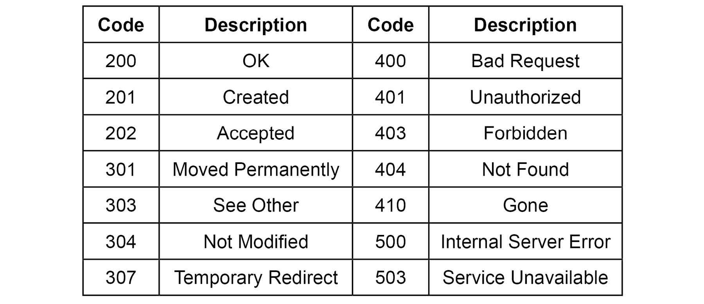

###### 图 7.2：Web 请求及其描述

因此，我们编写一个函数来检查代码并根据需要打印出消息。这类小型辅助/实用函数对于复杂项目来说非常有用。

### 练习 82：检查 Web 请求的状态

接下来，我们将编写一个小型实用函数来检查响应的状态。

我们将首先养成编写小型函数来完成小型模块化任务的习惯，而不是编写长脚本，因为长脚本难以调试和跟踪：

1.  使用以下命令创建`status_check`函数：

    ```py
    def status_check(r):
        if r.status_code==200:
            print("Success!")
            return 1
        else:
            print("Failed!")
            return -1
    ```

    注意，除了打印适当的消息外，我们从这个函数返回 1 或-1。这很重要。

1.  使用`status_check`命令检查响应：

    ```py
    status_check(response)
    ```

    输出如下：

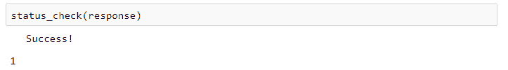

###### 图 7.3：状态检查的输出

在本章中，我们不会使用这些返回值，但在以后的更复杂的编程活动中，你只有在获得此函数的返回值时才会继续进行，也就是说，你将编写一个条件语句来检查返回值，然后根据该值执行后续代码。

### 检查网页编码

我们还可以编写一个实用函数来检查网页的编码。任何 HTML 文档都有可能的编码，尽管最流行的是 UTF-8。一些最流行的编码包括 ASCII、Unicode 和 UTF-8。ASCII 是最简单的，但它无法捕获世界上各种口语和书面语言中使用的复杂符号，因此 UTF-8 已经成为当今网络开发的几乎通用标准。

当我们在维基百科主页上运行此函数时，我们得到该页使用的特定编码类型。这个函数与前面的函数类似，它接受`requests`响应对象作为参数并返回一个值：

```py
def encoding_check(r):
    return (r.encoding)
```

检查响应：

```py
encoding_check(response)
```

输出如下：

```py
'UTF-8'
```

在这里，UTF-8 表示目前数字媒体和互联网上最流行的字符编码方案。它采用 1-4 字节的可变长度编码，从而可以表示世界上各种语言的 Unicode 字符。

### 练习 83：创建一个函数来解码响应内容并检查其长度

这一系列步骤的最终目的是获取一个页面的内容作为一个文本块或字符串对象，以便 Python 之后进行处理。在互联网上，数据流以编码格式移动。因此，我们需要解码响应对象的内容。为此，我们需要执行以下步骤：

1.  编写一个实用函数来解码响应的内容：

    ```py
    def decode_content(r,encoding):
        return (r.content.decode(encoding))
    contents = decode_content(response,encoding_check(response))
    ```

1.  检查解码对象的类型：

    ```py
    type(contents)
    ```

    输出如下：

    ```py
    str
    ```

    我们最终通过读取 HTML 页面得到了一个字符串对象！

    #### 注意

    注意，本章和 Jupyter 笔记本中的练习答案可能因维基百科页面的更新而有所不同。

1.  检查对象的长度并尝试打印其中的一部分：

    ```py
    len(contents)
    ```

    输出如下：

    ```py
    74182
    ```

    如果你打印这个字符串的前 10,000 个字符，它看起来会类似于这样：

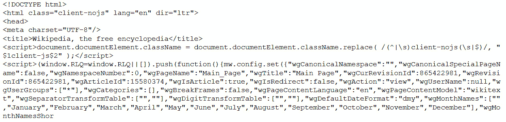

###### 图 7.4：显示混合的 HTML 标记标签、文本和元素名称以及属性的输出

显然，这是一个由各种 HTML 标记标签、文本和元素名称/属性组成的混合体。如果不使用复杂的函数或方法，我们无法从中提取有意义的信息。幸运的是，`BeautifulSoup`库提供了这样的方法，我们将在下一节中看到如何使用它们。

### 练习 84：从 BeautifulSoup 对象中提取可读文本

结果表明，`BeautifulSoup`对象有一个`text`方法，可以用来提取文本：

1.  导入包，然后将整个字符串（HTML 内容）传递给一个用于解析的方法：

    ```py
    from bs4 import BeautifulSoup
    soup = BeautifulSoup(contents, 'html.parser')
    ```

1.  在你的笔记本中执行以下代码：

    ```py
    txt_dump=soup.text
    ```

1.  查找`txt_dmp:`的类型

    ```py
    type(txt_dump)
    ```

    输出如下：

    ```py
    str
    ```

1.  查找`txt_dmp:`的长度

    ```py
    len(txt_dump)
    ```

    输出如下：

    ```py
    15326
    ```

1.  现在，文本输出的长度比原始 HTML 字符串的长度小得多。这是因为`bs4`已经解析了 HTML 并提取了仅用于进一步处理的人读文本。

1.  打印这个文本的初始部分。

    ```py
    print(txt_dump[10000:11000])
    ```

    你会看到类似以下的内容：

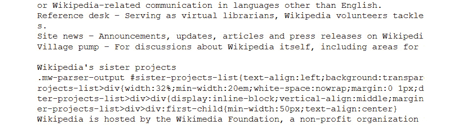

###### 图 7.5：显示文本初始部分的输出

### 从一个部分提取文本

现在，让我们继续进行一个更有趣的数据处理任务。如果你打开维基百科首页，你可能会看到一个名为**今日特色文章**的部分。这是当天突出文章的摘录，该文章是随机选择并在首页推广的。实际上，这篇文章在一天中也可能发生变化：


###### 图 7.6：示例维基百科页面突出显示“今日特色文章”部分

你需要从这个部分提取文本。有几种方法可以完成这个任务。在这里，我们将介绍一种简单直观的方法。

首先，我们尝试识别两个索引——字符串的开始索引和结束索引，它们标志着我们感兴趣的文本的开始和结束。在下一张屏幕截图中，索引如下所示：


###### 图 7.7：维基百科页面突出显示要提取的文本

以下代码完成了提取：

```py
idx1=txt_dump.find("From today's featured article")
idx2=txt_dump.find("Recently featured")
print(txt_dump[idx1+len("From today's featured article"):idx2])
```

注意，我们必须将“今日特色文章”字符串的长度添加到`idx1`中，然后将它作为起始索引传递。这是因为`idx1`找到的是“今日特色文章”字符串的开始位置，而不是结束位置。

它会打印出类似以下的内容（这是一个示例输出）：


###### 图 7.8：提取的文本

### 提取今天日期发生的重要历史事件

接下来，我们将尝试提取与今天日期发生的重要历史事件的文本。这通常可以在以下屏幕截图的右下角找到：


###### 图 7.9：维基百科页面突出显示“历史上的今天”部分

那么，我们能否应用与之前对“**今日特色文章**”所用的相同技术？显然不行，因为在我们想要提取结束的地方下面有文本，这与之前的情况不同。注意，在前面的练习中，固定的字符串“**最近推荐**”正好出现在我们想要提取停止的地方。因此，我们可以在代码中使用它。然而，在这种情况下，我们不能这样做，原因如下面的屏幕截图所示：


###### 图 7.10：突出显示要提取的维基百科页面文本

因此，在本节中，我们只想找出围绕我们感兴趣的主要内容的文本看起来是什么样子。为此，我们必须找出字符串“On this day”的起始位置，并使用以下命令打印出接下来的 1,000 个字符：

```py
idx3=txt_dump.find("On this day")
print(txt_dump[idx3+len("On this day"):idx3+len("On this day")+1000])
```

它看起来是这样的：


###### 图 7.11：维基百科“On this day”部分的输出

为了解决这个问题，我们需要换一种思维方式，并使用一些 BeautifulSoup（以及编写另一个实用函数）的其他方法。

### 练习 85：使用高级 BS4 技术提取相关文本

HTML 页面由许多标记标签组成，例如<div>，表示文本/图像的分区，或者<ul>，表示列表。我们可以利用这种结构来查看包含我们感兴趣文本的元素。在 Mozilla Firefox 浏览器中，我们可以通过右键单击并选择“**检查元素**”选项来轻松完成此操作：


###### 图 7.12：在维基百科上检查元素

当你用鼠标悬停在这个上面时，你会看到页面上的不同部分被突出显示。通过这样做，可以轻松地发现负责我们感兴趣文本信息的精确标记文本块。在这里，我们可以看到某个`<ul>`块包含以下文本：


###### 图 7.13：识别包含文本的 HTML 块

现在，找到包含这个`<ul>`块的`<div>`标签是明智的。通过查看之前的相同屏幕，我们找到了`<div>`及其 ID：

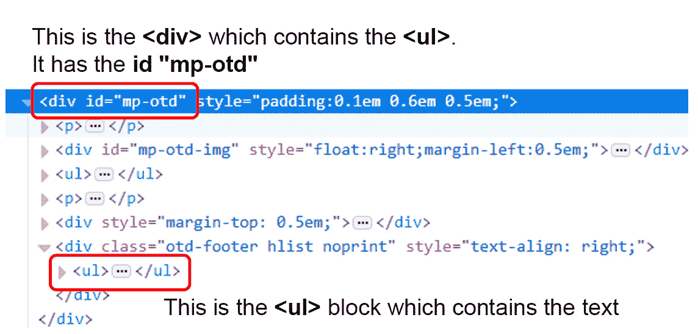

###### 图 7.14：包含文本的<ul>标签

1.  使用 BeautifulSoup 的`find_all`方法，该方法扫描 HTML 页面的所有标签（及其子元素）以找到并提取与特定`<div>`元素相关的文本。

    #### 注意

    注意我们如何利用`mp-otd` ID 的`<div>`来在数十个其他`<div>`元素中识别它。

    `find_all`方法返回一个`NavigableString`类，该类与其关联一个有用的`text`方法，用于提取。

1.  为了将这些想法结合起来，我们将创建一个空列表，并在遍历页面时将`NavigableString`类的文本追加到这个列表中：

    ```py
    text_list=[] #Empty list
    for d in soup.find_all('div'):
            if (d.get('id')=='mp-otd'):
                for i in d.find_all('ul'):
                    text_list.append(i.text)
    ```

1.  现在，如果我们检查`text_list`列表，我们会看到它有三个元素。如果我们按标记打印这些元素，我们会看到我们感兴趣的文本作为第一个元素出现！

    ```py
    for i in text_list:
        print(i)
        print('-'*100)
    ```

    #### 注意

    在这个例子中，我们感兴趣的是列表的第一个元素。然而，确切的位置将取决于网页。

    输出如下：


###### 图 7.15：高亮的文本

### 练习 86：创建一个紧凑的函数从维基百科主页提取“On this Day”文本

正如我们之前讨论的，尝试将特定任务功能化总是好的，尤其是在网络爬虫应用程序中：

1.  创建一个函数，其唯一任务是接受 URL（作为字符串）并返回与**On this day**部分对应的文本。这种功能方法的优点是你可以从任何 Python 脚本中调用这个函数，并在另一个程序中的任何地方将其用作独立模块：

    ```py
    def wiki_on_this_day(url="https://en.wikipedia.org/wiki/Main_Page"):
        """
    ```

1.  从维基百科主页的“On this day”部分提取文本。接受维基百科主页 URL 作为字符串。提供了一个默认的 URL：

    ```py
        """
        import requests
        from bs4 import BeautifulSoup

        wiki_home = str(url)
        response = requests.get(wiki_home)

        def status_check(r):
            if r.status_code==200:
                return 1
            else:
                return -1

        status = status_check(response)
        if status==1:
            contents = decode_content(response,encoding_check(response))
        else:
            print("Sorry could not reach the web page!")
            return -1

        soup = BeautifulSoup(contents, 'html.parser')
        text_list=[]

        for d in soup.find_all('div'):
                if (d.get('id')=='mp-otd'):
                    for i in d.find_all('ul'):
                        text_list.append(i.text)

        return (text_list[0])
    ```

1.  注意这个函数如何利用状态检查，如果请求失败，则打印出错误信息。当我们用故意错误的 URL 测试这个函数时，它表现得如预期：

    ```py
    print(wiki_on_this_day("https://en.wikipedia.org/wiki/Main_Page1"))
     Sorry could not reach the web page!
    ```

## 从 XML 中读取数据

XML，或可扩展标记语言，是一种类似于 HTML 但具有显著灵活性的网络标记语言（对于用户而言），例如能够定义自己的标签。它是 20 世纪 90 年代和 21 世纪初最被炒作的技术之一。它是一种元语言，也就是说，一种允许我们使用其机制定义其他语言的语言，例如 RSS、MathML（一种广泛用于网络发布和显示数学密集型技术信息的数学标记语言），等等。XML 在互联网上的常规数据交换中也得到了广泛使用，作为一名数据整理专业人士，你应该对其基本特性有足够的了解，以便在需要为项目提取数据时随时能够访问数据流管道。

### 练习 87：创建 XML 文件和读取 XML 元素对象

让我们创建一些随机数据，以便更好地理解 XML 数据格式。输入以下代码片段：

1.  使用以下命令创建 XML 文件：

    ```py
    data = '''
    <person>
      <name>Dave</name>
      <surname>Piccardo</surname>
      <phone type="intl">
         +1 742 101 4456
       </phone>
       <email hide="yes">
       dave.p@gmail.com</email>
    </person>'''
    ```

1.  这是一个三引号字符串或多行字符串。如果你打印这个对象，你会得到以下输出。这是一个以树结构格式化的 XML 数据字符串，正如我们很快就会看到的，当我们解析结构并分离出各个部分时：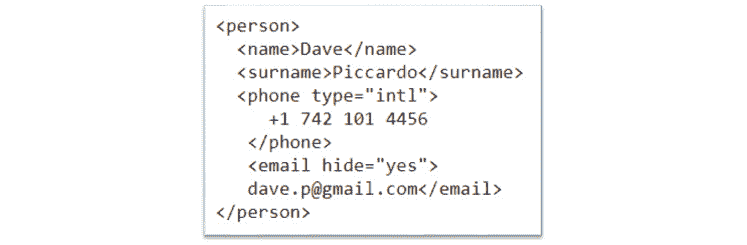

    ###### 图 7.16：XML 文件输出

1.  为了处理和整理数据，我们必须使用 Python XML 解析器引擎将其读取为`Element`对象：

    ```py
    import xml.etree.ElementTree as ET
    tree = ET.fromstring(data)
    type (tree)
    ```

    输出结果如下：

    ```py
     xml.etree.ElementTree.Element
    ```

### 练习 88：在树（元素）中查找各种数据元素

我们可以使用`find`方法在 XML 元素对象中搜索各种有用的数据，并使用`text`方法打印它们（或在我们想要的任何处理代码中使用它们）。我们还可以使用`get`方法提取我们想要的特定属性：

1.  使用`find`方法查找`Name`：

    ```py
    # Print the name of the person
    print('Name:', tree.find('name').text)
     Dave
    ```

1.  使用`find`方法查找`Surname`：

    ```py
    # Print the surname
    print('Surname:', tree.find('surname').text)
     Piccardo
    ```

1.  使用`find`方法查找`Phone`。注意使用`strip`方法去除任何尾随空格/空白：

    ```py
    # Print the phone number
    print('Phone:', tree.find('phone').text.strip())
    ```

    输出结果如下：

    ```py
    +1 742 101 4456
    ```

1.  使用`find`方法查找`email status`和`actual email`。注意使用`get`方法提取状态：

    ```py
    # Print email status and the actual email
    print('Email hidden:', tree.find('email').get('hide'))
    print('Email:', tree.find('email').text.strip())
    ```

    输出结果如下：

    ```py
     Email hidden: yes
     Email: dave.p@gmail.com
    ```

### 将本地 XML 文件读取到 ElementTree 对象中

我们也可以从 XML 文件（保存在磁盘上）中读取。

这是一个相当常见的情况，其中前端网络抓取模块已经通过读取网页上的数据表下载了大量的 XML 文件，现在数据整理者需要解析这个 XML 文件以提取有意义的数值和文本数据。

我们有一个与本章相关的文件，称为 "`xml1.xml`"。请确保您有该文件，并且它与您从 Jupyter Notebook 运行的目录相同：

```py
tree2=ET.parse('xml1.xml')
type(tree2)
The output will be as follows: xml.etree.ElementTree.ElementTree
```

注意我们如何使用 `parse` 方法来读取这个 XML 文件。这与之前练习中使用的 `fromstring` 方法略有不同，当时我们是直接从一个字符串对象中读取。这会产生一个 `ElementTree` 对象而不是一个简单的 `Element`。

构建树形对象的想法与计算机科学和编程领域相同：

+   有一个根节点

+   根节点附加有子对象

+   可能存在多个级别，即子节点的子节点递归向下

+   树中的所有节点（根节点和子节点）都附加有包含数据的属性

+   可以使用树遍历算法来搜索特定的属性

+   如果提供，可以使用特殊方法来深入探测一个节点

### 练习 89：遍历树，找到根节点，并探索所有子节点及其标签和属性

XML 树中的每个节点都有标签和属性。其思路如下：

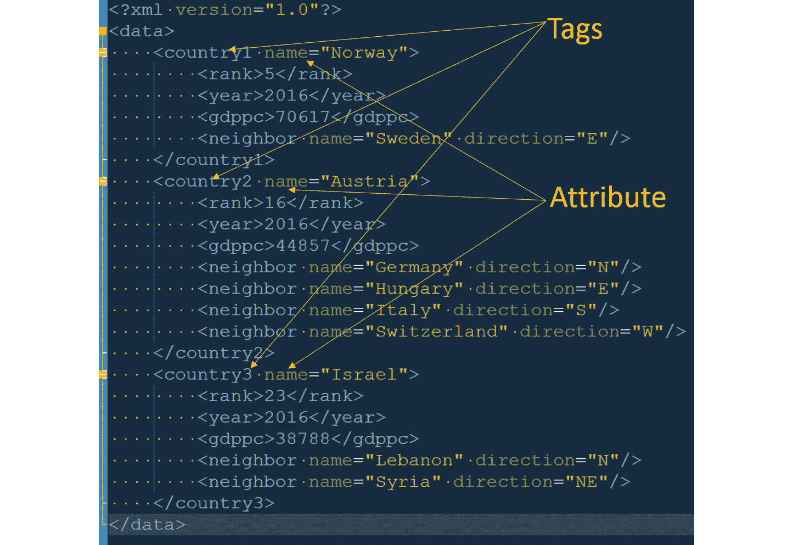

###### 图 7.17：找到 XML 标签的根节点和子节点

1.  使用以下代码探索这些标签和属性：

    ```py
    root=tree2.getroot()
    for child in root:
        print ("Child:",child.tag, "| Child attribute:",child.attrib)
    ```

    输出将如下所示：


###### 图 7.18：显示提取的 XML 标签的输出

#### 注意

记住，每个 XML 数据文件可能遵循不同的命名或结构格式，但使用元素树方法将数据放入一种结构化的流程中，可以系统地探索。然而，最好在尝试自动提取之前先检查原始 XML 文件结构一次，并理解（即使是在高层次上）数据格式。

### 练习 90：使用 `text` 方法提取有意义的数据

我们几乎可以将 XML 树视为一个**列表的列表**，并相应地进行索引：

1.  使用以下代码通过访问 `root[0][2]` 来获取元素：

    ```py
    root[0][2]
    ```

    输出将如下所示：

    ```py
    <Element 'gdppc' at 0x00000000051FF278>
    ```

    因此，这指向了 '`gdppc`' 这部分数据。在这里，"`gdppc`" 是标签，实际的人均 GDP 数据附着在这个标签上。

1.  使用 `text` 方法来访问数据：

    ```py
    root[0][2].text
    ```

    输出将如下所示：

    ```py
     '70617'
    ```

1.  使用 `tag` 方法来访问 `gdppc`：

    ```py
    root[0][2].tag
    ```

    输出将如下所示：

    ```py
     'gdppc'
    ```

1.  检查 `root[0]`：

    ```py
    root[0]
    ```

    输出将如下所示：

    ```py
     <Element 'country1' at 0x00000000050298B8>
    ```

1.  检查标签：

    ```py
    root[0].tag
    ```

    输出将如下所示：

    ```py
      'country1'
    ```

    我们可以使用 `attrib` 方法来访问它：

    ```py
    root[0].attrib
    ```

    输出将如下所示：

    ```py
     {'name': 'Norway'}
    ```

    因此，`root[0]` 仍然是一个元素，但它与 `root[0][2]` 具有不同的标签和属性集。这是预期的，因为它们都是树的一部分，作为节点，但每个节点都与不同级别的数据相关联。

这段代码的最后输出很有趣，因为它返回一个字典对象。因此，我们可以通过其键来索引它。我们将在下一个练习中这样做。

### 使用循环提取和打印 GDP/人均信息

现在我们知道了如何读取 GDP/人均数据，以及如何从树中获取字典，我们可以通过在树上运行循环轻松构建一个简单的数据集：

```py
for c in root:
    country_name=c.attrib['name']
    gdppc = int(c[2].text)
    print("{}: {}".format(country_name,gdppc))
```

输出如下：

```py
 Norway: 70617
 Austria: 44857
 Israel: 38788
```

我们可以将这些数据放入 DataFrame 或 CSV 文件中，以便保存到本地磁盘或进行进一步处理，例如简单的绘图！

### 练习 91：为每个国家找到所有邻近国家并打印它们

如我们之前提到的，对于树结构有高效的搜索算法，对于 XML 树的一种方法就是 `findall`。我们可以使用这个方法，在这个例子中，找到国家所有的邻近国家并将它们打印出来。

为什么我们需要使用 `findall` 而不是 `find` 呢？因为不是所有国家都有相同数量的邻近国家，而 `findall` 会搜索与特定节点相关联的具有该标签的所有数据，而我们想要遍历所有这些数据：

```py
for c in root:
    ne=c.findall('neighbor') # Find all the neighbors
    print("Neighbors\n"+"-"*25)
    for i in ne: # Iterate over the neighbors and print their 'name' attribute
        print(i.attrib['name'])
    print('\n')
```

输出看起来像这样：

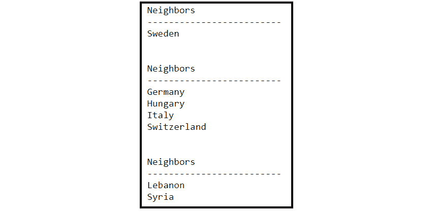

###### 图 7.19：使用 findall 生成的输出

### 练习 92：使用通过网络抓取获得的 XML 数据的一个简单演示

在本章的最后主题中，我们学习了使用 `requests` 库进行简单的网络抓取。到目前为止，我们一直在处理静态 XML 数据，即来自本地文件或我们编写的字符串对象的数据。现在，是时候将我们的学习结合起来，直接从互联网上读取 XML 数据了（正如你预期的那样，你几乎总是这样做）：

1.  我们将尝试从一个名为 [`www.recipepuppy.com/`](http://www.recipepuppy.com/) 的网站上读取烹饪食谱，该网站聚合了各种其他网站的食谱链接：

    ```py
    import urllib.request, urllib.parse, urllib.error
    serviceurl = 'http://www.recipepuppy.com/api/?'
    item = str(input('Enter the name of a food item (enter \'quit\' to quit): '))
    url = serviceurl + urllib.parse.urlencode({'q':item})+'&p=1&format=xml'
    uh = urllib.request.urlopen(url)
    data = uh.read().decode()
    print('Retrieved', len(data), 'characters')
    tree3 = ET.fromstring(data)
    ```

1.  这段代码将要求用户输入。你必须输入一个食品项目的名称。例如，'chicken tikka'：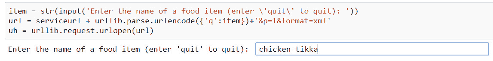

    ###### 图 7.20：从 XML 数据中抓取的演示

1.  我们得到的是 XML 格式的数据，在创建 XML 树之前，我们需要读取和解析它：

    ```py
    data = uh.read().decode()
    print('Retrieved', len(data), 'characters')
    tree3 = ET.fromstring(data)
    ```

1.  现在，我们可以使用另一个有用的方法，称为 `iter`，它基本上遍历一个元素下的节点。如果我们遍历树并提取文本，我们得到以下输出：

    ```py
    for elem in tree3.iter():
        print(elem.text)
    ```

    输出如下：

    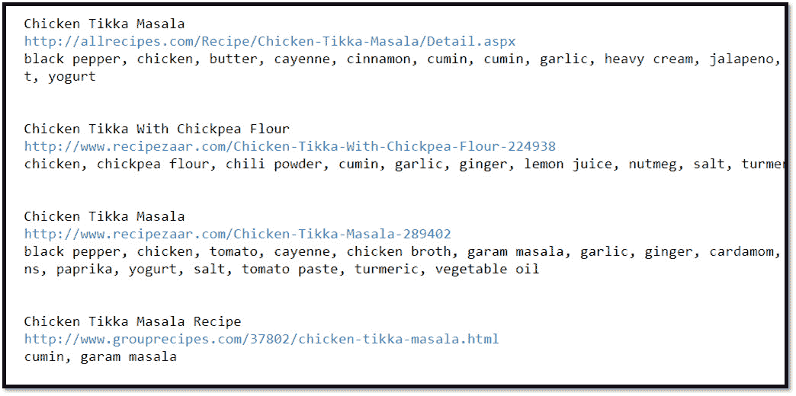

    ###### 图 7.21：使用 iter 生成的输出

1.  我们可以使用 find 方法搜索适当的属性并提取其内容。这就是为什么手动扫描 XML 数据并检查使用了哪些属性很重要的原因。记住，这意味着扫描原始字符串数据，而不是树结构。

1.  打印原始字符串数据：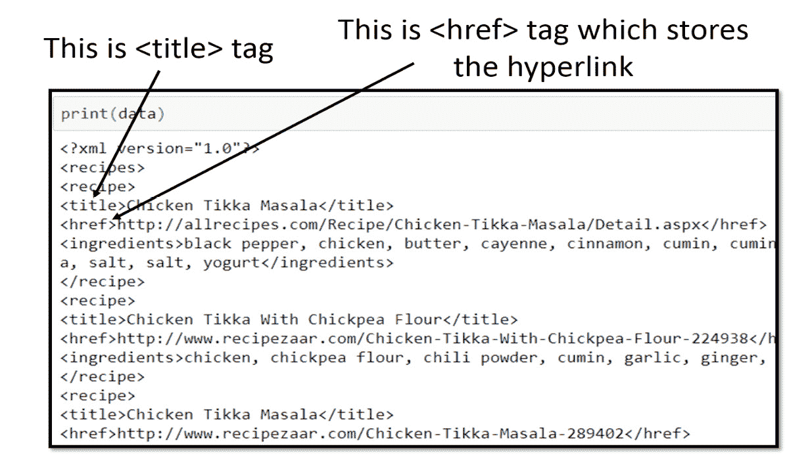

    ###### 图 7.22：显示提取的 href 标签的输出结果

    现在我们知道要搜索哪些标签。

1.  打印 XML 数据中的所有超链接：

    ```py
    for e in tree3.iter():
        h=e.find('href')
        t=e.find('title')
        if h!=None and t!=None:
            print("Receipe Link for:",t.text)
            print(h.text)
            print("-"*100)
    ```

    注意`h!=None`和`t!=None`的使用。当你第一次运行这类代码时，这些可能难以预料。你可能会遇到错误，因为一些标签可能返回一个`None`对象，即它们在这个 XML 数据流中由于某种原因而为空。这种情况相当常见，无法事先预料。如果你收到这样的错误，你必须使用你的 Python 知识和编程直觉来解决这个问题。在这里，我们只是在检查对象的类型，如果它不是`None`，那么我们需要提取与它相关的文本。

    最终输出如下：

    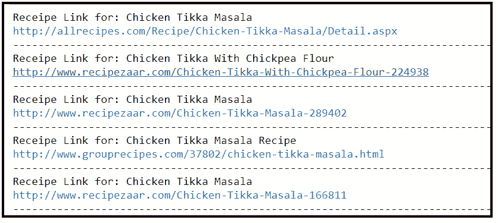

###### 图 7.23：显示最终输出的输出结果

## 从 API 读取数据

基本上，API 或应用程序编程接口是一种对计算资源（例如，操作系统或数据库表）的接口，它提供了一套公开的方法（函数调用），允许程序员访问该资源的特定数据或内部功能。

网络 API，正如其名所示，是在网络上的 API。请注意，它不是一种特定的技术或编程框架，而是一种架构概念。想象一下 API 就像快餐店的客户服务中心。内部有许多食品、原材料、烹饪资源和食谱管理系统，但你所能看到的是固定的菜单项，而你只能通过这些项进行交互。它就像一个可以通过 HTTP 协议访问的端口，如果使用得当，能够提供数据和服务。

网络 API 在当今各种数据服务中极为流行。在第一章中，我们讨论了加州大学圣地亚哥分校的数据科学团队如何从 Twitter 动态中提取数据来分析森林火灾的发生情况。为此，他们不去 twitter.com，通过查看 HTML 页面和文本来抓取数据。相反，他们使用 Twitter API，该 API 以流式格式连续发送这些数据。

因此，对于数据整理专业人员来说，了解从网络 API 中提取数据的基本知识非常重要，因为你极有可能发现自己处于必须通过 API 接口读取大量数据进行处理和整理的情况。如今，大多数 API 以 JSON 格式流式传输数据。在本章中，我们将使用一个免费的 API 以 JSON 格式读取有关世界各地各种国家的信息，并进行处理。

我们将使用 Python 的内置`urllib`模块以及 pandas 来创建 DataFrame。因此，我们现在可以导入它们。我们还将导入 Python 的`JSON`模块：

```py
import urllib.request, urllib.parse
from urllib.error import HTTPError,URLError
import json
import pandas as pd
```

### 定义基本 URL（或 API 端点）

首先，我们需要设置基本 URL。当我们处理 API 微服务时，这通常被称为**API 端点**。因此，在你感兴趣的网站服务门户中寻找这样的短语，并使用他们提供的端点 URL：

```py
serviceurl = 'https://restcountries.eu/rest/v2/name/'
```

基于 API 的微服务在提供服务和数据方面具有极高的动态性。它可以随时改变。在规划本章内容时，我们发现这个特定的 API 是一个很好的选择，可以轻松地提取数据，而且无需使用授权密钥（登录或特殊 API 密钥）。

然而，对于大多数 API，你需要有自己的 API 密钥。通过注册他们的服务来获取。基本使用（直到固定数量的请求或数据流限制）通常是免费的，但之后你将需要付费。为了注册 API 密钥，你通常需要输入信用卡信息。

我们希望避免所有这些麻烦来教你们基础知识，这就是为什么我们选择了这个例子，它不需要这样的授权。但是，根据你工作中会遇到的数据类型，请准备好学习如何使用 API 密钥。

### 练习 93：定义和测试从 API 中提取国家数据的函数

这个特定的 API 提供了关于世界各地国家的基本信息：

1.  定义一个函数，当我们传递一个国家的名称作为参数时，从中提取数据。操作的核心包含在以下两行代码中：

    ```py
    url = serviceurl + country_name
    uh = urllib.request.urlopen(url)
    ```

1.  第一行代码将国家名称作为字符串追加到基本 URL 上，第二行向 API 端点发送一个`get`请求。如果一切顺利，我们会收到数据，对其进行解码，并将其作为 JSON 文件读取。整个练习的代码如下，包括围绕我们之前讨论的基本操作的一些错误处理代码：

    ```py
    def get_country_data(country):
        """
        Function to get data about country from "https://restcountries.eu" API
        """
        country_name=str(country)
        url = serviceurl + country_name

        try: 
            uh = urllib.request.urlopen(url)
        except HTTPError as e:
            print("Sorry! Could not retrieve anything on {}".format(country_name))
            return None
        except URLError as e:
            print('Failed to reach a server.')
            print('Reason: ', e.reason)
            return None
        else:
            data = uh.read().decode()
            print("Retrieved data on {}. Total {} characters read.".format(country_name,len(data)))
            return data
    ```

1.  通过传递一些参数来测试这个函数。我们传递一个正确的名称和一个错误的名称。响应如下：

    #### 注意

    这是一个基本的错误处理示例。你必须考虑各种可能性，并在构建实际的 Web 或企业应用程序时编写这样的代码来捕获并优雅地响应用户输入。

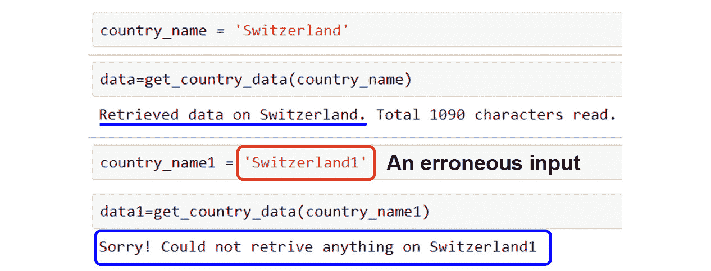

###### 图 7.24：输入参数

### 使用内置 JSON 库读取和检查数据

正如我们已经提到的，JSON 看起来很像 Python 字典。

在这个练习中，我们将使用 Python 的`json`模块来读取该格式的原始数据，并查看我们可以进一步处理的内容：

```py
x=json.loads(data)
y=x[0]
type(y)
```

输出将如下所示：

```py
 dict
```

因此，当我们使用`json`模块的`loads`方法时，我们得到一个列表。它将字符串数据类型读入字典列表。在这种情况下，我们列表中只有一个元素，所以我们提取它并检查其类型，以确保它是一个字典。

我们可以快速检查字典的键，即 JSON 数据（注意这里没有显示完整的截图）。我们可以看到相关的国家数据，例如电话区号、人口、面积、时区、边界等：

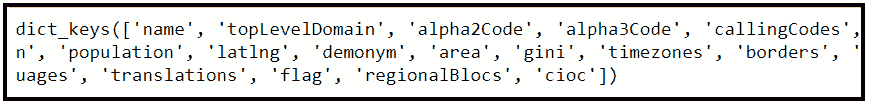

###### 图 7.25：dict_keys 的输出

### 打印所有数据元素

在我们有字典可用的情况下，这项任务极其简单！我们只需要遍历字典，逐个打印键/项对：

```py
for k,v in y.items():
    print("{}: {}".format(k,v))
```

输出如下：

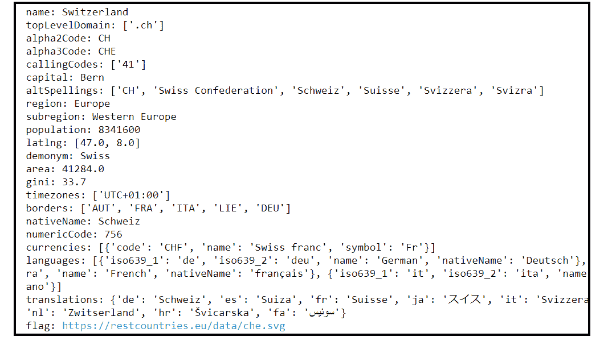

###### 图 7.26：使用 dict 的输出

注意到字典中的项不是同一类型的，也就是说，它们不是相似的对象。有些是浮点数，例如面积，许多是简单的字符串，但有些是列表或甚至是列表的列表！

这在 JSON 数据中相当常见。JSON 的内部数据结构可以是任意复杂和多层级的，也就是说，你可以有一个字典，其中包含列表的字典的字典的列表的列表……等等。

#### 注意

因此，很明显，没有针对 JSON 数据格式的通用方法或处理函数，你必须根据你的特定需求编写自定义循环和函数来从这种字典对象中提取数据。

现在，我们将编写一个小循环来提取瑞士使用的语言。首先，让我们仔细检查字典，看看语言数据在哪里：

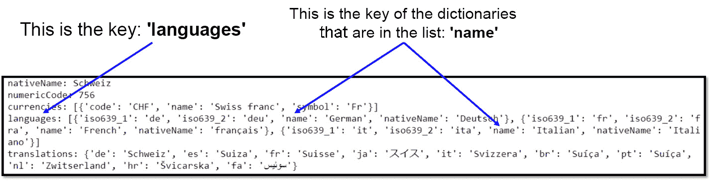

###### 图 7.27：标签

因此，数据嵌套在一个字典的列表中，通过主字典的特定键来访问。

我们可以编写简单的两行代码来提取这些数据：

```py
for lang in y['languages']:
    print(lang['name'])
```

输出如下：


###### 图 7.28：显示语言的输出

### 使用提取包含关键信息的 DataFrame 的函数

在这里，我们感兴趣的是编写一个函数，该函数可以接受一个国家列表，并返回一个包含一些关键信息的 pandas DataFrame：

+   首都

+   地区

+   子区域

+   人口

+   纬度/经度

+   面积

+   基尼系数

+   时区

+   货币

+   语言

    #### 注意

    这是在实际数据处理任务中通常期望你编写的包装函数，即一个实用函数，它可以接受用户参数，并输出一个包含从互联网上提取的关键信息的有用数据结构（或小型数据库类型对象）。

我们首先展示整个函数，然后讨论一些关于它的关键点。这是一段稍微复杂且较长的代码。然而，基于你基于 Python 的数据处理知识，你应该能够仔细检查这个函数并理解它在做什么：

```py
import pandas as pd
import json
def build_country_database(list_country):
    """
    Takes a list of country names.
    Output a DataFrame with key information about those countries.
    """
    # Define an empty dictionary with keys
    country_dict={'Country':[],'Capital':[],'Region':[],'Sub-region':[],'Population':[],
                  'Lattitude':[],'Longitude':[],'Area':[],'Gini':[],'Timezones':[],
                  'Currencies':[],'Languages':[]}
```

#### 注意

代码在这里被截断。请在此 GitHub 链接和代码包文件夹链接中找到整个代码 [`github.com/TrainingByPackt/Data-Wrangling-with-Python/blob/master/Chapter07/Exercise93-94/Chapter%207%20Topic%203%20Exercises.ipynb`](https://github.com/TrainingByPackt/Data-Wrangling-with-Python/blob/master/Lesson07/Exercise93-94/Lesson%207%20Topic%203%20Exercises.ipynb)。

下面是这个函数的一些关键点：

+   它首先构建一个空的列表字典。这是最终传递给 pandas `DataFrame` 方法的格式，该方法可以接受这种格式并返回一个带有列名设置为字典键名的漂亮 DataFrame。

+   我们使用之前定义的 `get_country_data` 函数来提取用户定义列表中每个国家的数据。为此，我们只需遍历列表并调用此函数。

+   我们检查 `get_country_data` 函数的输出。如果由于某种原因它返回一个 `None` 对象，我们将知道 API 读取没有成功，并且我们将打印出一条合适的消息。再次强调，这是一个错误处理机制的例子，你必须在代码中包含它们。没有这样的小错误检查代码，你的应用程序将不足以应对偶尔的错误输入或 API 故障！

+   对于许多数据类型，我们只需从主 JSON 字典中提取数据并将其追加到我们数据字典中相应的列表中。

+   然而，对于特殊的数据类型，例如时区、货币和语言，我们编写一个特殊的循环来提取数据而不会出错。

+   我们还注意这些特殊数据类型可能有可变长度，也就是说，一些国家可能有多种官方语言，但大多数只有一个条目。因此，我们检查列表的长度是否大于一个，并相应地处理数据。

### 练习 94：通过构建国家信息的小型数据库来测试函数

最后，我们通过传递一个国家名称列表来测试这个函数：

1.  为了测试其鲁棒性，我们传入一个错误的名字——例如，在这种情况下是“姜黄”!

    看看输出……它检测到对于错误的条目没有返回任何数据，并打印出一条合适的消息。关键是，如果你在函数中没有错误检查和处理代码，那么它将在该条目上停止执行，并且不会返回预期的迷你数据库。为了避免这种行为，这种错误处理代码是无价的：

    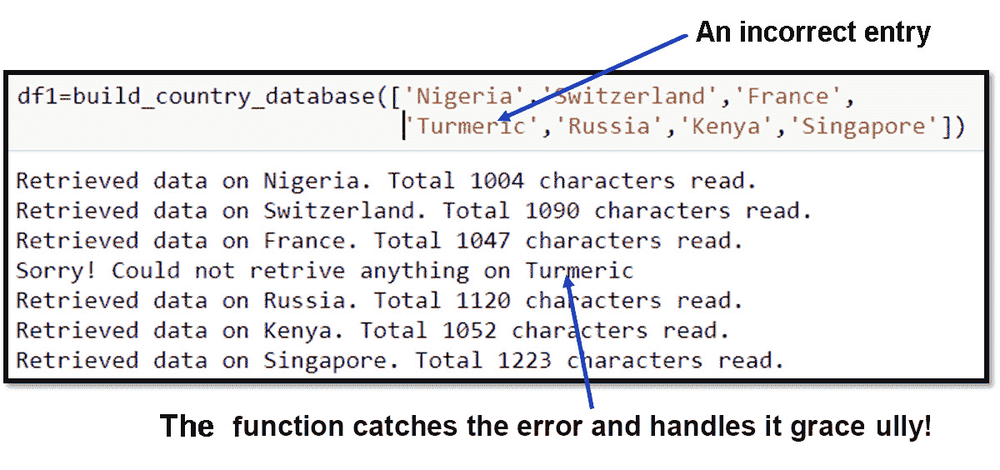

    ###### 图 7.29：错误的条目被突出显示

1.  最后，输出是一个 pandas DataFrame，如下所示：

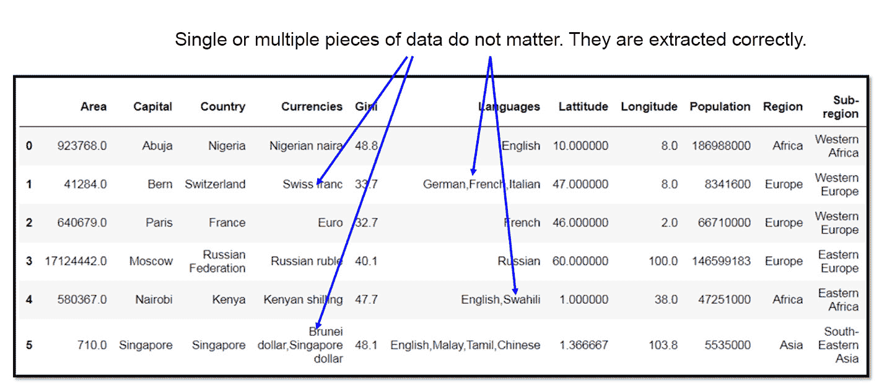

###### 图 7.30：正确提取的数据

## 正则表达式（RegEx）基础

**正则**表达式或**regex**用于确定给定字符序列 a（字符串）中是否存在模式。它们有助于操作文本数据，这对于涉及文本挖掘的数据科学项目通常是先决条件。

### 正则表达式在网页抓取中的应用

网页通常充满了文本，虽然`BeautifulSoup`或 XML 解析器中有些方法可以提取原始文本，但没有用于智能分析这些文本的方法。如果你作为一个数据整理员，正在寻找特定的数据（例如，特殊格式的电子邮件 ID 或电话号码），你必须在大规模语料库上进行大量字符串操作来提取电子邮件 ID 或电话号码。正则表达式非常强大，通过它们可以搜索任意长度的通配符复杂文本模式，因此可以节省数据整理专业人员大量时间和精力。

正则表达式本身就像是一种小程序设计语言，其常见思想不仅用于 Python，还用于所有广泛使用的 Web 应用程序语言，如 JavaScript、PHP、Perl 等。Python 中的正则表达式模块是内置的，你可以使用以下代码导入它：

```py
import re
```

### 练习 95：使用 match 方法检查模式是否与字符串/序列匹配

最常见的正则表达式方法之一是`match`。这用于检查字符串开头是否存在精确或部分匹配（默认情况下）：

1.  导入正则表达式模块：

    ```py
    import re
    ```

1.  定义一个字符串和一个模式：

    ```py
    string1 = 'Python'
    pattern = r"Python"
    ```

1.  编写一个条件表达式来检查匹配：

    ```py
    if re.match(pattern,string1):
        print("Matches!")
    else:
        print("Doesn't match.")
    ```

    前面的代码应该给出肯定回答，即“匹配！”。

1.  使用仅第一个字母不同且转换为小写的字符串进行测试：

    ```py
    string2 = 'python'
    if re.match(pattern,string2):
        print("Matches!")
    else:
        print("Doesn't match.")
    ```

    输出如下：

    ```py
     Doesn't match.
    ```

### 使用编译方法创建正则表达式程序

在程序或模块中，如果我们正在大量使用特定的模式，那么使用`compile`方法创建正则表达式程序并调用该程序的方法会更好。

下面是如何编译正则表达式程序的方法：

```py
prog = re.compile(pattern)
prog.match(string1)
```

输出如下：

```py
 <_sre.SRE_Match object; span=(0, 6), match='Python'>
```

此代码生成一个`SRE.Match`对象，其`span`为（0,6）和匹配的字符串为'Python'。这里的 span 简单地表示匹配模式的起始和结束索引。这些索引在文本挖掘程序中可能很有用，后续代码可以使用这些索引进行进一步搜索或决策。我们稍后会看到一些例子。

### 练习 96：将程序编译以匹配对象

编译对象的行为类似于函数，如果模式不匹配，则返回 `None`。在这里，我们将通过编写一个简单的条件来检查这一点。这个概念在稍后编写一个小型实用函数来检查正则表达式编译程序返回的对象类型并相应地处理时会很有用。我们无法确定一个模式是否会匹配给定的字符串，或者它是否会在文本的语料库中（如果我们正在搜索文本中的任何位置）出现。根据情况，我们可能会遇到 `Match` 对象或 `None` 作为返回值，我们必须优雅地处理这种情况：

```py
#string1 = 'Python'
#string2 = 'python'
#pattern = r"Python"
```

1.  使用正则表达式的 `compile` 函数：

    ```py
    prog = re.compile(pattern)
    ```

1.  与第一个字符串进行匹配：

    ```py
    if prog.match(string1)!=None:
        print("Matches!")
    else:
        print("Doesn't match.")
    ```

    输出如下：

    ```py
     Matches!
    ```

1.  与第二个字符串进行匹配：

    ```py
    if prog.match(string2)!=None:
        print("Matches!")
    else:
        print("Doesn't match.")
    ```

    输出如下：

    ```py
     Doesn't match.
    ```

### 练习 97：在匹配中使用附加参数以检查位置匹配

默认情况下，`match` 在给定字符串的开始处查找模式匹配。但有时，我们需要检查字符串中的特定位置的匹配：

1.  将第二个位置匹配为 `y`：

    ```py
    prog = re.compile(r'y')
    prog.match('Python',pos=1)
    ```

    输出如下：

    ```py
     <_sre.SRE_Match object; span=(1, 2), match='y'>
    ```

1.  从 `pos=2` 开始检查名为 `thon` 的模式，即第三个字符：

    ```py
    prog = re.compile(r'thon')
    prog.match('Python',pos=2)
    ```

    输出如下：

    ```py
     <_sre.SRE_Match object; span=(2, 6), match='thon'>
    ```

1.  使用以下命令在另一个字符串中查找匹配项：

    ```py
    prog.match('Marathon',pos=4)
    ```

    输出如下：

    ```py
    <_sre.SRE_Match object; span=(4, 8), match='thon'>
    ```

### 查找列表中以 "ing" 结尾的单词数量

假设我们想找出一个给定的字符串是否有最后三个字母：'ing'。这种查询可能会出现在文本分析/文本挖掘程序中，有人对查找现在进行时态单词的实例感兴趣，这些单词很可能以 'ing' 结尾。然而，其他名词也可能以 'ing' 结尾（正如我们将在本例中看到的那样）：

```py
prog = re.compile(r'ing')
words = ['Spring','Cycling','Ringtone']
```

创建一个 `for` 循环以查找以 'ing' 结尾的单词：

```py
for w in words:
    if prog.match(w,pos=len(w)-3)!=None:
        print("{} has last three letters 'ing'".format(w))
    else:
        print("{} does not have last three letter as 'ing'".format(w))
```

输出如下：

```py
 Spring has last three letters 'ing'
 Cycling has last three letters 'ing'
 Ringtone does not have last three letter as 'ing'
```

#### 注意

它看起来很简单，你可能想知道为什么需要使用特殊的正则表达式模块来做这件事。简单的字符串方法应该就足够了。是的，对于这个特定的例子来说，这样做是可以的，但使用正则表达式的全部意义在于能够使用非常复杂的字符串模式，这些模式在用简单的字符串方法编写时并不明显。我们很快就会看到正则表达式与字符串方法相比的真正威力。但在那之前，让我们探索另一个最常用的方法，称为 `search`。

### 练习 98：正则表达式中的搜索方法

`Search` 和 `match` 是相关概念，它们都返回相同的 Match 对象。它们之间的真正区别在于 **match 只对第一个匹配项有效**（要么在字符串的开始处，要么在指定的位置，就像我们在前面的练习中看到的那样），而 **search 在字符串的任何位置查找模式**，如果找到匹配项，则返回相应的位置：

1.  使用 `compile` 方法查找匹配的字符串：

    ```py
    prog = re.compile('ing')
    if prog.match('Spring')==None:
        print("None")
    ```

1.  输出如下：

    ```py
     None
    ```

1.  使用以下命令搜索字符串：

    ```py
    prog.search('Spring')
    <_sre.SRE_Match object; span=(3, 6), match='ing'>
    prog.search('Ringtone')
    <_sre.SRE_Match object; span=(1, 4), match='ing'>
    ```

    如您所见，`match` 方法对于输入 `spring` 返回 `None`，因此我们必须编写代码来显式地打印出来（因为在 Jupyter 笔记本中，对于 `None` 对象将不会显示任何内容）。但 `search` 方法返回一个 `Match` 对象，其 `span=(3,6)` 表示它找到了跨越这些位置的 `ing` 模式。

类似地，对于 `Ringtone` 字符串，它找到匹配的正确位置并返回 `span=(1,4)`。

### 练习 99：使用 `Match` 对象的 `span` 方法定位匹配模式的起始位置

通过现在您应该理解，`Match` 对象中包含的 `span` 对于定位模式在字符串中出现的确切位置非常有用。

1.  使用模式 ing 初始化 `prog`。

    ```py
    prog = re.compile(r'ing')
    words = ['Spring','Cycling','Ringtone']
    ```

1.  创建一个函数来返回匹配的起始和结束位置的元组。

    ```py
    for w in words:
        mt = prog.search(w)
        # Span returns a tuple of start and end positions of the match
        start_pos = mt.span()[0] # Starting position of the match
        end_pos = mt.span()[1] # Ending position of the match
    ```

1.  打印以 ing 结尾的单词在起始或结束位置。

    ```py
        print("The word '{}' contains 'ing' in the position {}-{}".format(w,start_pos,end_pos))
    ```

输出如下：

```py
 The word 'Spring' contains 'ing' in the position 3-6
 The word 'Cycling' contains 'ing' in the position 4-7
 The word 'Ringtone' contains 'ing' in the position 1-4
```

### 练习 100：使用 search 进行单字符模式匹配的示例

现在，我们将通过各种有用模式的示例来真正开始学习正则表达式的使用。首先，我们将探索单字符匹配。我们还将使用 `group` 方法，它本质上以字符串格式返回匹配的模式，这样我们就可以轻松地打印和处理它：

1.  点（.）匹配任何单个字符，除了换行符：

    ```py
    prog = re.compile(r'py.')
    print(prog.search('pygmy').group())
    print(prog.search('Jupyter').group())
    ```

    输出如下：

    ```py
     pyg
     pyt
    ```

1.  `\w`（小写 w）匹配任何单个字母、数字或下划线：

    ```py
    prog = re.compile(r'c\wm')
    print(prog.search('comedy').group())
    print(prog.search('camera').group())
    print(prog.search('pac_man').group())
    print(prog.search('pac2man').group())
    ```

    输出如下：

    ```py
     com
     cam
     c_m
     c2m
    ```

1.  `\W`（大写 W）匹配任何未被 `\w` 覆盖的内容：

    ```py
    prog = re.compile(r'4\W1')
    print(prog.search('4/1 was a wonderful day!').group())
    print(prog.search('4-1 was a wonderful day!').group())
    print(prog.search('4.1 was a wonderful day!').group())
    print(prog.search('Remember the wonderful day 04/1?').group())
    ```

    输出如下：

    ```py
     4/1
     4-1
     4.1
     4/1
    ```

1.  `\s`（小写 s）匹配单个空白字符，例如空格、换行符、制表符或回车：

    ```py
    prog = re.compile(r'Data\swrangling')
    print(prog.search("Data wrangling is cool").group())
    print("-"*80)
    print("Data\twrangling is the full string")
    print(prog.search("Data\twrangling is the full string").group())
    print("-"*80)
    print("Data\nwrangling is the full string")
    print(prog.search("Data\nwrangling").group())
    ```

    输出如下：

    ```py
    Data wrangling
    ----------------------------------------------------------------------
    Data	wrangling is the full string
    Data	wrangling
    ----------------------------------------------------------------------
    Data
    wrangling is the full string
    Data
    wrangling
    ```

1.  `\d` 匹配数字 0 – 9：

    ```py
    prog = re.compile(r"score was \d\d")
    print(prog.search("My score was 67").group())
    print(prog.search("Your score was 73").group())
    ```

    输出如下：

    ```py
     score was 67
     score was 73
    ```

### 练习 101：字符串开头或结尾模式匹配的示例

在这个练习中，我们将使用字符串匹配模式。重点是找出模式是否存在于字符串的开头或结尾：

1.  编写一个函数来处理找不到匹配的情况，即处理返回的 `None` 对象：

    ```py
    def print_match(s):
        if prog.search(s)==None:
            print("No match")
        else:
            print(prog.search(s).group())
    ```

1.  使用 `^`（上标）来匹配字符串开头的模式：

    ```py
    prog = re.compile(r'^India')
    print_match("Russia implemented this law")
    print_match("India implemented that law")
    print_match("This law was implemented by India")
    The output is as follows: No match
     India
     No match
    ```

1.  使用 `$`（美元符号）来匹配字符串结尾的模式：

    ```py
    prog = re.compile(r'Apple$')
    print_match("Patent no 123456 belongs to Apple")
    print_match("Patent no 345672 belongs to Samsung")
    print_match("Patent no 987654 belongs to Apple")
    ```

    输出如下：

    ```py
     Apple
     No match
     Apple
    ```

### 练习 102：多字符模式匹配的示例

现在，我们将转向更令人兴奋和有用的多字符匹配模式，通过示例来展示。现在，您应该开始看到并欣赏正则表达式的真正力量。

#### 注意：

对于这些示例和练习，也要尝试思考如果没有正则表达式，您会如何实现它们，即通过使用简单的字符串方法和您能想到的任何其他逻辑。然后，将那种解决方案与使用正则表达式实现的解决方案进行比较，以体现简洁性和效率。

1.  使用 `*` 来匹配前面 `RE` 的 0 或更多重复：

    ```py
    prog = re.compile(r'ab*')
    print_match("a")
    print_match("ab")
    print_match("abbb")
    print_match("b")
    print_match("bbab")
    print_match("something_abb_something")
    ```

    输出如下：

    ```py
     a
     ab
     abbb
     No match
     ab
     abb
    ```

1.  使用 `+` 会导致结果正则表达式匹配前面正则表达式的 1 或更多重复：

    ```py
    prog = re.compile(r'ab+')
    print_match("a")
    print_match("ab")
    print_match("abbb")
    print_match("b")
    print_match("bbab")
    print_match("something_abb_something")
    ```

    输出如下：

    ```py
     No match
     ab
     abbb
     No match
     ab
     abb
    ```

1.  `?` 使得结果 RE 精确匹配前面 RE 的 0 或 1 次重复：

    ```py
    prog = re.compile(r'ab?')
    print_match("a")
    print_match("ab")
    print_match("abbb")
    print_match("b")
    print_match("bbab")
    print_match("something_abb_something")
    ```

    输出如下：

    ```py
     a
     ab
     ab
     No match
     ab
     ab
    ```

### 练习 103：贪婪与非贪婪匹配

regex 中模式匹配的标准（默认）模式是贪婪的，也就是说，程序尝试尽可能多地匹配。有时，这种行为是自然的，但在某些情况下，你可能希望最小化匹配：

1.  匹配字符串的贪婪方式如下：

    ```py
    prog = re.compile(r'<.*>')
    print_match('<a> b <c>')
    ```

    输出如下：

    ```py
     <a> b <c>
    ```

1.  因此，前面找到的 regex 匹配了具有 <> 模式的两个标签，但如果我们只想匹配第一个标签并停止，我们可以通过在任意 regex 表达式后插入 `?` 来使其非贪婪：

    ```py
    prog = re.compile(r'<.*?>')
    print_match('<a> b <c>')
    ```

    输出如下：

    ```py
     <a>
    ```

### 练习 104：控制重复以匹配

在许多情况下，我们希望精确控制文本中要匹配的模式重复次数。这可以通过几种方式完成，以下我们将展示一些示例：

1.  `{m}` 指定精确匹配 `m` 次的 RE。更少的匹配会导致不匹配并返回 `None`：

    ```py
    prog = re.compile(r'A{3}')
    print_match("ccAAAdd")
    print_match("ccAAAAdd")
    print_match("ccAAdd")
    ```

    输出如下：

    ```py
     AAA
     AAA
     No match
    ```

1.  `{m,n}` 指定精确匹配 `m` 到 `n` 次的 `RE`：

    ```py
    prog = re.compile(r'A{2,4}B')
    print_match("ccAAABdd")
    print_match("ccABdd")
    print_match("ccAABBBdd")
    print_match("ccAAAAAAABdd")
    ```

    输出如下：

    ```py
     AAAB
     No match
     AAB
     AAAAB
    ```

1.  省略 `m` 指定下界为零：

    ```py
    prog = re.compile(r'A{,3}B')
    print_match("ccAAABdd")
    print_match("ccABdd")
    print_match("ccAABBBdd")
    print_match("ccAAAAAAABdd")
    ```

    输出如下：

    ```py
     AAAB
     AB
     AAB
     AAAB
    ```

1.  省略 `n` 指定无限上界：

    ```py
    prog = re.compile(r'A{3,}B')
    print_match("ccAAABdd")
    print_match("ccABdd")
    print_match("ccAABBBdd")
    print_match("ccAAAAAAABdd")
    ```

    输出如下：

    ```py
     AAAB
     No match
     No match
     AAAAAAAB
    ```

1.  `{m,n}?` 指定非贪婪方式匹配 RE 的 `m` 到 `n` 次复制：

    ```py
    prog = re.compile(r'A{2,4}')
    print_match("AAAAAAA")
    prog = re.compile(r'A{2,4}?')
    print_match("AAAAAAA")
    ```

    输出如下：

    ```py
     AAAA
     AA
    ```

### 练习 105：匹配字符集

为了匹配任意复杂的模式，我们需要能够将字符的逻辑组合作为一个整体包括进来。Regex 给我们提供了这种能力：

1.  以下示例展示了 regex 的这种用法。`[x,y,z]` 匹配 x、y 或 z：

    ```py
    prog = re.compile(r'[A,B]')
    print_match("ccAd")
    print_match("ccABd")
    print_match("ccXdB")
    print_match("ccXdZ")
    ```

    输出将如下：

    ```py
     A
     A
     B
     No match
    ```

    可以使用 `-` 在集合内匹配字符范围。这是最广泛使用的 regex 技术之一！

1.  假设我们想要从文本中提取电子邮件地址。电子邮件地址通常具有以下形式 `<some name>@<some domain name>.<some domain identifier>`：

    ```py
    prog = re.compile(r'[a-zA-Z]+@+[a-zA-Z]+\.com')
    print_match("My email is coolguy@xyz.com")
    print_match("My email is coolguy12@xyz.com")
    ```

    输出如下：

    ```py
     coolguy@xyz.com
     No match
    ```

    看看 [ … ] 内部的 regex 模式。它是 '`a-zA-Z'`。这涵盖了所有字母，包括小写和大写！通过这个简单的 regex，你能够匹配任何（纯）字母字符串作为电子邮件该部分的匹配。接下来，下一个模式是 '`@`'，它通过一个 '`+' 字符添加到前面的 regex 中。这是构建复杂 regex 的方法：通过添加/堆叠单个 regex 模式。我们也使用相同的 `[a-zA-Z]` 作为电子邮件域名，并在末尾添加 `'`.com'` 以完成模式，使其成为一个有效的电子邮件地址。为什么是 `\.`？因为，单独的 DOT (.) 在 regex 中用作特殊修饰符，但在这里我们只想使用 DOT (.) 作为 DOT (.)，而不是修饰符。因此，我们需要在它之前加上一个 `\`。

1.  因此，使用这个 regex，我们可以完美地提取第一个电子邮件地址，但第二个却得到了 `'No match'`。

1.  第二个电子邮件 ID 发生了什么？

1.  正则表达式无法捕获它，因为它在名称中包含了数字 '12'！这个模式没有被表达式 [a-zA-Z] 捕获。

1.  让我们改变它并添加数字：

    ```py
    prog = re.compile(r'[a-zA-Z0-9]+@+[a-zA-Z]+\.com')
    print_match("My email is coolguy12@xyz.com")
    print_match("My email is coolguy12@xyz.org")
    ```

    输出如下：

    ```py
     coolguy12@xyz.com
     No match
    ```

    现在，我们完美地捕获了第一个电子邮件 ID。但第二个电子邮件 ID 发生了什么？再次，我们得到了一个不匹配。原因是我们在那个电子邮件中将 .com 改为了 .org，而在我们的正则表达式表达式中，这部分被硬编码为 `.com`，因此它没有找到匹配项。

1.  让我们在下面的正则表达式中尝试解决这个问题：

    ```py
    prog = re.compile(r'[a-zA-Z0-9]+@+[a-zA-Z]+\.+[a-zA-Z]{2,3}')
    print_match("My email is coolguy12@xyz.org")
    print_match("My email is coolguy12[AT]xyz[DOT]org")
    ```

    输出如下：

    ```py
     coolguy12@xyz.org
     No match
    ```

1.  在这个正则表达式中，我们使用了这样一个事实，即大多数域名标识符有 2 到 3 个字符，所以我们使用了 `[a-zA-Z]{2,3}` 来捕获它。

第二个电子邮件 ID 发生了什么？这是一个示例，说明你可以进行一些小的调整，以领先于想要从在线论坛或其他文本库中抓取并提取你的电子邮件 ID 的推销员。如果你不希望你的电子邮件被找到，你可以将 `@` 改为 `[AT]`，将 . 改为 `[DOT]`，并希望这可以击败一些正则表达式技术（但不是所有技术）！

### 练习 106：使用 OR 操作符在正则表达式中的使用

因为正则表达式模式本身就像复杂而紧凑的逻辑构造器，所以当我们需要构建更复杂的程序时，我们想要将它们组合起来，这是完全有道理的。我们可以通过使用 `|` 操作符来实现这一点：

1.  以下示例演示了使用 OR 操作符的使用：

    ```py
    prog = re.compile(r'[0-9]{10}')
    print_match("3124567897")
    print_match("312-456-7897")
    ```

    输出如下：

    ```py
     3124567897
     No match
    ```

    因此，在这里，我们试图提取可能是电话号码的 10 位数字的模式。注意模式中使用 `{10}` 来表示正好 10 位数字。但第二个数字由于明显的原因无法匹配——它在数字组之间插入了破折号。

1.  使用多个较小的正则表达式，并通过以下命令逻辑组合它们：

    ```py
    prog = re.compile(r'[0-9]{10}|[0-9]{3}-[0-9]{3}-[0-9]{4}')
    print_match("3124567897")
    print_match("312-456-7897")
    ```

    输出如下：

    ```py
     3124567897
     312-456-7897
    ```

    电话号码以无数种方式书写，如果你在网上搜索，你会看到非常复杂的正则表达式示例（不仅是在 Python 中，还在其他广泛使用的语言中，如 JavaScript、C++、PHP、Perl 等，用于捕获电话号码）。

1.  创建四个字符串并在它们上执行 `print_match`：

    ```py
    p1= r'[0-9]{10}'
    p2=r'[0-9]{3}-[0-9]{3}-[0-9]{4}'
    p3 = r'\([0-9]{3}\)[0-9]{3}-[0-9]{4}'
    p4 = r'[0-9]{3}\.[0-9]{3}\.[0-9]{4}'
    pattern= p1+'|'+p2+'|'+p3+'|'+p4
    prog = re.compile(pattern)
    print_match("3124567897")
    print_match("312-456-7897")
    print_match("(312)456-7897")
    print_match("312.456.7897")
    ```

    输出如下：

    ```py
     3124567897
     312-456-7897
     (312)456-7897
     312.456.7897
    ```

### `findall` 方法

本章我们将学习的最后一个正则表达式方法是 `findall`。本质上，它是一个**搜索和聚合**方法，也就是说，它将所有与正则表达式模式匹配的实例放入给定的文本中，并以列表的形式返回它们。这非常有用，因为我们只需计算返回列表的长度就可以计算出现的次数，或者我们可以根据需要逐个选择并使用返回的模式匹配词。

注意，尽管在本章中我们给出了单个句子的简短示例，但使用正则表达式时，你通常会处理大量的文本。

在这些情况下，你可能会从单个正则表达式模式搜索中获得许多匹配项。对于所有这些情况，`findall` 方法将是最有用的：

```py
ph_numbers = """Here are some phone numbers.
Pick out the numbers with 312 area code: 
312-423-3456, 456-334-6721, 312-5478-9999, 
312-Not-a-Number,777.345.2317, 312.331.6789"""
print(ph_numbers)
re.findall('312+[-\.][0-9-\.]+',ph_numbers)
```

输出如下：

```py
 Here are some phone numbers.
Pick out the numbers with 312 area code: 
312-423-3456, 456-334-6721, 312-5478-9999, 
312-Not-a-Number,777.345.2317, 312.331.6789
 ['312-423-3456', '312-5478-9999', '312.331.6789']
```

### 活动 9：从古腾堡提取前 100 本电子书

古腾堡项目通过鼓励志愿者努力数字化和归档文化作品来鼓励电子书创作和分发。本活动的目的是抓取古腾堡前 100 本电子书的 URL 以识别电子书的链接。它使用 BeautifulSoup4 解析 HTML 并使用正则表达式代码来识别前 100 本电子书的文件编号。

如果您想将书籍下载到本地驱动器，可以使用那些书籍 ID 号。

前往提供的 Jupyter 笔记本（在 GitHub 仓库中）进行此活动的操作。

这些步骤将帮助您解决此活动：

1.  导入必要的库，包括 `regex` 和 `beautifulsoup`。

1.  检查 SSL 证书。

1.  从 URL 读取 HTML。

1.  编写一个小函数来检查网络请求的状态。

1.  解码响应并将此传递给 BeautifulSoup 进行 HTML 解析。

1.  找到所有的 `href` 标签并将它们存储在链接列表中。检查列表看起来像什么——打印前 30 个元素。

1.  使用正则表达式在这些链接中找到数字。这些是前 100 本电子书的文件编号。

1.  初始化一个空列表来存储文件编号，在适当的范围内，并使用 `regex` 在 `href` 字符串中找到数字，使用 `findall` 方法。

1.  `soup` 对象的文本看起来是什么样子？使用 `.text` 方法并仅打印前 2,000 个字符（不要打印整个内容，因为它太长了）。

1.  在从 `soup` 对象提取的文本（使用正则表达式）中搜索以找到前 100 本电子书的名称（昨天的排名）。

1.  创建一个起始索引。它应该指向文本 *Top 100 Ebooks yesterday*。使用 soup.text 的 `splitlines` 方法。它将 soup 对象的文本行分割成行。

1.  循环 1-100，将下一 100 行的字符串添加到这个临时列表中。提示：使用 `splitlines` 方法。

1.  使用正则表达式从名称字符串中提取仅文本并将其附加到空列表中。使用 `match` 和 `span` 找到索引并使用它们。

    #### 注意

    此活动的解决方案可以在第 315 页找到。

### 活动 10：通过读取 API 构建自己的电影数据库

在这个活动中，您将通过与免费 API 进行通信和接口来构建一个完整的电影数据库。您将了解在程序尝试访问 API 时必须使用的唯一用户密钥。此活动将教授您有关使用 API 的一般章节，这对于其他非常流行的 API 服务（如 Google 或 Twitter）来说相当常见。因此，完成此练习后，您将自信地编写更复杂的程序来从这些服务中抓取数据。

本活动的目标如下：

+   从网络（OMDb 数据库）检索并打印关于一部电影（标题由用户输入）的基本数据

+   如果找到电影的海报，它将下载文件并保存在用户指定的位置

这些步骤将帮助您解决这个活动：

1.  导入 `urllib.request`、`urllib.parse`、`urllib.error` 和 `json`。

1.  从同一文件夹中存储的 JSON 文件中加载秘密 API 密钥（您必须从 OMDb 网站获取一个并使用它；它有每日 1,000 次的限制），通过使用 `json.loads()` 将其存储在一个变量中。

1.  获取一个密钥并将其存储在 JSON 中的 `APIkeys.json`。

1.  打开 `APIkeys.json` 文件。

1.  将 OMDb 站点（[`www.omdbapi.com/?`](http://www.omdbapi.com/?)）作为一个字符串赋值给一个变量。

1.  创建一个名为 `apikey` 的变量，其值为 URL 的最后一部分（`&apikey=secretapikey`），其中 `secretapikey` 是您自己的 API 密钥。

1.  编写一个名为 `print_json` 的实用函数，用于从 JSON 文件（我们将从该门户获取）打印电影数据。

1.  编写一个实用函数，根据 JSON 数据集中的信息下载电影的海报，并将其保存在您的本地文件夹中。使用 `os` 模块。海报数据存储在 JSON 键 `Poster` 中。使用 Python 命令打开文件并写入海报数据。完成后关闭文件。此函数将海报数据保存为图像文件。

1.  编写一个名为 `search_movie` 的实用函数，通过电影名称搜索电影，打印下载的 `JSON` 数据，并将电影海报保存在本地文件夹中。使用 `try-except` 循环。使用之前创建的 `serviceurl` 和 `apikey` 变量。您必须将包含键 `t` 和电影名称作为相应值的字典传递给 `urllib.parse.urlencode()` 函数，然后将 `serviceurl` 和 `apikey` 添加到函数的输出中，以构造完整的 URL。此 URL 将用于访问数据。`JSON` 数据有一个名为 `Response` 的键。如果是 `True`，则表示读取成功。在处理数据之前检查这一点。如果不成功，则打印 `JSON` 键 `Error`，其中将包含电影数据库返回的适当错误消息。

1.  通过输入 `Titanic` 测试 `search_movie` 函数。

1.  通过输入 `"Random_error"`（显然，这将找不到，你应该能够检查你的错误捕获代码是否正常工作）来测试 `search_movie` 函数。

    #### 注意：

    这个活动的解决方案可以在第 320 页找到。

## 摘要

在本章中，我们探讨了与高级数据收集和网络抓取相关的重要概念和学习模块。我们首先使用两个最流行的 Python 库——`requests` 和 `BeautifulSoup` 从网页中读取数据。在这个任务中，我们利用了上一章关于 HTML 页面的一般结构和它们与 Python 代码交互的知识。在这个过程中，我们从维基百科主页中提取了有意义的资料。

然后，我们学习了如何从 XML 和 JSON 文件中读取数据，这两种格式是网络中最广泛使用的两种数据流/交换格式。对于 XML 部分，我们向您展示了如何高效地遍历树形结构数据字符串以提取关键信息。对于 JSON 部分，我们将它与使用 API（应用程序接口）从网络中读取数据结合起来。我们使用的 API 是 RESTful 的，这是 Web API 的主要标准之一。

在本章的结尾，我们详细练习了使用正则表达式技术在复杂的字符串匹配问题中提取有用信息，这些信息是从 HTML 解析的大规模杂乱文本语料库中获得的。这一章对于你在数据处理职业生涯中的字符串和文本处理任务将非常有用。

在下一章中，我们将学习如何使用 Python 进行数据库操作。
